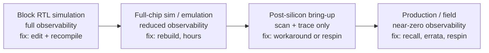

# 1. Why Verification Exists

Eleven days before tape-out — the day the design database is frozen and sent for fabrication — the nightly regression of the reference SoC flags a single failing seed. The scoreboard, the testbench component that compares what the design did against what it should have done, reports a data mismatch on a DMA transfer. A two-dimensional transfer with a negative stride, whose row happens to cross a 4 KB address boundary, is split incorrectly by the DMA's transfer legalizer — but only when the second channel is competing for the AXI backend (AXI: the industry-standard on-chip bus protocol) in the same window. Two hundred and fourteen directed DMA tests had passed for months. None of them combined those three conditions, because nobody had imagined the combination. A constrained-random test, generating legal-but-unlikely descriptors by the thousands, stumbled into it in one night.

The fix takes a day. Now run the counterfactual, because the counterfactual is what this book is about. Suppose the regression had not caught it. The bug ships. First silicon arrives, boots, passes bring-up checks — the corruption needs a rare alignment and a busy second channel, so the lab doesn't see it for weeks. Then a customer's application corrupts a buffer, intermittently, under load. In the lab you cannot see inside the legalizer; observability is limited to what the silicon exposes. Root-causing takes weeks of a senior team's time. The fix requires a respin — a new mask set, refabrication, requalification — and the product misses its launch window. The difference between these two universes is one nightly regression. That difference, multiplied across every block of every chip, is why verification exists, why it consumes most of the engineering effort of a chip project, and why it deserves a book.

### Chapter map

- §1.1 defines a bug escape and a respin, and states how the industry measures verification effectiveness — required silicon spins for ASICs, escaped bugs for FPGAs.
- §1.2 sets out the state of the numbers: first-silicon success at a two-decade low, most FPGA projects shipping non-trivial bugs, and where the effort actually goes.
- §1.3 establishes why verification dominates project effort and headcount, and why that share has been growing for twenty years.
- §1.4 develops the economics: how the cost of a bug escalates through the project lifecycle, and why verification is risk management, not a pursuit of perfection.
- §1.5 establishes what the famous escapes actually teach — that rare is not safe, that an escape's cost is set by the market rather than by the bug, and that each such case widened what verification is expected to cover.
- §1.6 introduces the reference SoC used as the running example throughout this book.

## 1.1 The problem: correctness is not the default

A digital design is a machine built from millions of interacting state elements, written by humans working from a specification that is itself written by humans. **Functional verification** is the set of activities that establish, before fabrication, that the design implements its specification — that it does what it is supposed to do, and does not do what it must not. It is distinct from **validation** — checking a design on real hardware rather than on a model, whether post-silicon on fabricated parts or in the lab on a prototype (Chapter 20 states the distinction in full). Much of the literature uses that word far more loosely, as an umbrella covering pre- and post-silicon work together; this chapter flags below one place where the looser sense quietly distorts a cost figure. It is distinct too from manufacturing test, which checks that each fabricated die is free of physical defects. Verification asks: *is the design right?* Test asks: *was this copy built right?*

Two terms anchor everything that follows. A **bug escape** is a design flaw that survives verification and reaches the next stage — full-chip integration, silicon, or the field. A **respin** is the consequence when an escape reaches silicon and cannot be worked around: a new fabrication cycle with corrected masks. Respins are the industry's bluntest verification metric precisely because they are unambiguous — you either shipped first silicon or you paid for another pass. **First-silicon success**, the fraction of projects whose first fabricated silicon is production-worthy, is therefore the effectiveness headline of the whole discipline.

Why is correctness so hard to reach that a mature, forty-year-old industry still fails at it most of the time? Chapter 3 develops the theory — state spaces that dwarf the number of atoms in the universe, the impossibility of exhaustive checking, the oracle problem — but the practical shape of the difficulty is visible already in the opening scenario. The DMA bug required the *conjunction* of three individually harmless conditions. Designs fail at the intersections: between features, between blocks, between clock domains, between hardware and software. A 10G Ethernet MAC with time-sensitive-networking queues fails the same way: the timestamping logic is right, the frame-preemption logic is right, and the bug lives where a high-priority frame preempts an in-flight one in the same window the timestamp is captured. And the intersections multiply faster than the features do. By 2024, 84 percent of IC/ASIC projects incorporate one or more embedded processors, 95 percent have two or more asynchronous clock domains, 83 percent include security features, and 44 percent follow at least one safety-critical development standard [cit:R2]. Every one of those numbers is a layer of requirements that burdened far fewer projects twenty years ago, and every layer multiplies the intersections where bugs live.

> **Scenario.** The reference SoC integrates a neural accelerator that shares the crossbar with two DMA channels. The accelerator team verified their block standalone: every convolution mode, every weight precision, all passing. The DMA team did the same. **Approach.** A competent verification lead still budgets integration verification for the *combination* — accelerator streaming weights while DMA channel 1 fills the next buffer — because block-level correctness does not compose into system-level correctness. **Why.** Arbitration, ordering, and back-pressure behaviors only exist when both actors are active; no standalone environment exercises them. In practice, teams observe that bugs cluster where verified pieces meet.

## 1.2 The numbers: how often the industry fails

Numbers in this section come from two industry-wide surveys you will meet throughout the book: a worldwide, double-blind study of 1,886 participants covering 2014, the largest independent one of its kind at the time [cit:P17], and its 2024 successor (597 eligible participants, ±4 percent margin at 95 percent confidence), published as separate IC/ASIC and FPGA trend reports [cit:R2,R1]. Survey data has known biases, candidly documented: regional participation shifts, for instance, can distort year-to-year language-adoption trends [cit:R2]. The effectiveness and effort trends, however, are consistent across a decade of editions and are the best quantitative picture the industry has of itself.

Both studies are Wilson Research Group studies, and their lineage is worth knowing, because it is the reason numbers exist here at all. The series was commissioned by its authors at Mentor Graphics and executed by an outside firm expressly to keep respondents anonymous, and it deliberately preserves the wording of the earlier Collett International Research studies of 2002 and 2004 so that trends stay comparable; after 2004 no further Collett study was conducted, and that void is what the Wilson series was created to fill [cit:P17]. The change of scale between the lineages is itself informative: the 2004 Collett sample was 201 eligible participants, against 1,886 in 2014 [cit:P17].

### First-silicon success is falling

In 2014, only about 30 percent of IC/ASIC projects achieved first-silicon success [cit:P17]. A decade later the figure is 14 percent — the lowest recorded in twenty years, capping a decline that runs unbroken from 2012 to 2024 [cit:R2]. Read that number the way a project team must: *six out of seven chip projects pay for at least one extra fabrication cycle.* The respin is so common that experienced organizations budget for it — which is rational, and also a quiet admission of how far verification effectiveness lags design ambition.

What sends projects back to the fab? "Logic or functional flaws" — plain functional bugs, the kind verification exists to catch — remain the leading category of flaws contributing to respins, ahead of analog, timing, power, and physical categories (multiple flaws can contribute to one respin, so categories sum past 100 percent) [cit:R2,P17]. Digging one level deeper into the root causes of those functional flaws: design errors lead, and problems traced to changing, incorrect, or incomplete specifications are a persistent, prominent second theme [cit:R2,P17]. Hold onto that second one. A large share of "hardware bugs" are not coding mistakes at all — they are ambiguities and contradictions in what the design was *supposed* to do, discovered late. Verification, done well, is the activity that surfaces them early; this is why Chapter 5 treats the verification plan as an instrument for interrogating the specification, not just a list of tests.

Schedule tells the same story from a different angle. In 2014, 61 percent of IC/ASIC projects were behind their original schedule [cit:P17]. By 2024 the historical average of roughly 66 percent had worsened to 75 percent [cit:R2]. Verification does not bear sole blame for slips, but it sits on the critical path at the end of the project, which means it inherits every upstream delay *and* absorbs the blame for its own.

### FPGAs: the illusion of a free respin

FPGA projects have no mask sets, so "respin" seems costless: fix the RTL (register-transfer level, the synthesizable description of the design), rebuild the bitstream, reprogram the part. The data punctures this comfort with its single most alarming number: asked in 2024 how many non-trivial bugs escaped into production, only 13 percent of FPGA projects answered *zero* — meaning 87 percent shipped production systems with non-trivial bugs, a result notably worse than the IC/ASIC first-silicon rate [cit:R1]. The diagnosis is cultural: many FPGA teams deliberately minimize pre-lab verification, racing to the lab to validate the design there — a strategy that worked for the simple FPGAs of the past and fails for today's SoC-class devices [cit:R1]. And a field escape is not free even when reprogramming is: in aerospace systems, replacing or re-programming an FPGA requires removing system covers and triggers a full system revalidation, compounding cost and delay [cit:R1].

> **Scenario.** A product team reuses the reference SoC's I/O subsystem in an FPGA-based industrial controller. The schedule review proposes cutting simulation-based verification to three weeks — "it's an FPGA, we'll shake bugs out on the bench." **Approach.** The verification lead counters with the escape data [cit:R1] and a targeted compromise: full constrained-random verification for the newly modified camera-interface datapath, lab-only validation for the unmodified, previously verified UART and SPI paths. **Why.** Lab debug has a fraction of simulation's observability — you see pins and probe points, not internal state — so bugs found there cost multiples to root-cause. Spending pre-lab effort *where the design is new* buys the most risk reduction per engineer-week; reuse of verified IP is precisely what lets some projects legitimately spend less on verification [cit:R2].

### What the trend data is really saying

It is tempting to read "14 percent first-silicon success" as an indictment: twenty years of methodology — constrained-random stimulus, functional coverage, assertions, UVM (the standard testbench methodology, IEEE Std 1800.2-2020, *IEEE Standard for Universal Verification Methodology* [cit:S9], Chapter 10), formal — and the outcome got *worse*? The honest reading is different. Design complexity has grown relentlessly along every measured axis: gate counts, embedded processors (52 percent of designs in 2004, 71 percent by 2014 [cit:P17], 84 percent in 2024, with 58 percent of projects integrating a RISC-V core and 59 percent some form of AI accelerator [cit:R2]), clock domains, security, safety. Against that headwind, holding respin rates anywhere near flat represents enormous productivity gains in verification — gains delivered precisely by the techniques this book teaches. The 2014 data still supported an optimistic reading: designs had grown dramatically, yet required spins were not getting any worse [cit:P17]. The 2024 decline suggests the headwind is currently winning [cit:R2]. The remedy's direction is unchanged across the decade: in 2024, projects using formal verification and mature methodologies experienced fewer spins [cit:R2]. The techniques work. There are not yet enough hands, hours, and adoption to keep pace — which is the subject of the next section.

## 1.3 The effort: who pays, and how much

You will hear, in nearly every verification talk and textbook, that verification consumes "70 percent of the effort." The figure has a curious status. Exactly this claim has been called "subjective or unsubstantiated" — folklore repeated from publication to publication without primary data [cit:P17]. Yet the folklore is well rooted: verification consumes about 70 percent of design effort in the SoC era [cit:B2]; multiple chip projects cite approximately 70 percent of design time spent in verification [cit:B3]; and validation in the umbrella sense — pre- and post-silicon together, not the post-silicon activity this book means by the word — is estimated at 70 percent of overall time and resources in SoC design [cit:P21]. That third figure is a reminder to read the scope before the number: the same source puts *post-silicon* validation at half, which is the figure this chapter cites later. What does the measured data say?

Measured, the average share of total project time spent in verification was **57 percent** in 2014, essentially unchanged from 2012 — with wide dispersion in both directions, and a growing tail of projects spending more than 80 percent of their time verifying [cit:P17]. The dispersion is the insight: projects assembling pre-verified IP legitimately spend far less; projects with high proportions of newly developed IP spend far more [cit:R2]. So the honest summary is: *the majority of project time, with "how much more than half" determined mostly by how much of your design is new.* The 70 percent folklore is not wrong so much as unqualified.

Time is only one axis; headcount is the other, and its trend is steeper. Between 2007 and 2014, demand for design engineers grew at a 3.7 percent compound annual rate, while demand for verification engineers grew at **12.5 percent** — and by 2014, the mean peak number of verification engineers on a project exceeded the mean peak number of design engineers [cit:P17]. The growth has since cooled (2016–2024: 2.4 percent for design, 3 percent for verification on IC/ASIC projects [cit:R2]) — but from that already-inverted baseline, and in some market segments, such as processors, a five-to-one ratio of verification to design engineers is not unusual [cit:R2]. The FPGA world is now living the IC/ASIC world's 2007–2014 transition: FPGA verification headcount grew at 8.5 percent CAGR against 4.7 percent for design between 2012 and 2024 [cit:R1]. Guidance from 2006 that verification engineers may number up to twice the RTL designers [cit:B2] reads, two decades later, as conservative for some segments.

Two more findings complete the effort picture, and both should shape how you plan.

First, *designers verify too*. In 2024, IC/ASIC design engineers spent on average 49 percent of their time on verification activities — nearly half of the "design" headcount is, functionally, verification effort [cit:R2]. Add that to a dedicated verification team that equals or outnumbers the design team, and the conclusion is inescapable: on a typical project developing new IP, well over half of all engineering hours go to verification. Whatever your organization chart says, you are running a verification project with a design attached.

Second, *within* verification, the largest single consumer of an engineer's time is **debug** — more than test planning, testbench development, or running tests — in 2014 and again in 2024, for both IC/ASIC and FPGA engineers [cit:P17,R2,R1]. The management consequence is the same in both years: debug time is unpredictable and varies wildly between projects, which is why verification schedules built by extrapolating the previous project's effort keep failing [cit:R2]. Much of this book's advice — self-checking testbenches (Chapter 8), assertions that catch bugs at their point of origin (Chapter 11), disciplined triage (Chapter 12) — is, at bottom, debug-time reduction.

### In this scenario: staffing the reference SoC

Concreteness check. The reference SoC — one RISC-V core, a crossbar, a two-channel DMA, an I/O subsystem, a neural accelerator, and an APB peripheral set, on three clock domains and two power domains — is a small chip by industry standards. A plausible staffing: four RTL designers, five dedicated verification engineers (core and instruction-set simulator (ISS) co-simulation; crossbar and DMA; accelerator; I/O and peripherals; integration and regression infrastructure), with each designer additionally spending near half their time on block-level verification of their own RTL [cit:R2]. If the five-to-one processor-segment ratio [cit:R2] sounds implausible from here, consider what changes with an out-of-order server core: the design team grows by perhaps three times, but the state space — speculation, replay, coherence, ordering — grows combinatorially, and verification headcount must chase the state space, not the gate count. That asymmetry, effort scaling with *behavior* rather than *structure*, is the deepest reason verification's share keeps rising, and we will meet it formally in Chapter 3.

## 1.4 The economics: what a bug costs, and when

Verification is an economic activity. Nobody funds it for love of correctness; it is funded because bugs found late cost more — spectacularly more — than bugs found early. The entire discipline can be read as an arbitrage on that cost curve.

The curve's mechanism is the interplay of two quantities that move in opposite directions as the project advances: the **cost to find and fix** a bug rises, while the **time available** to deal with it shrinks [cit:P21]. Behind both sits a third quantity, **observability** — how much of the design's internal state you can see when something goes wrong. In RTL simulation you can observe any internal signal at any time; on an FPGA prototype, observability shrinks to a few thousand pre-selected signals; on silicon, you see only what the design-for-debug hardware routes to a pin or a trace buffer [cit:P21]. Less visibility means slower root-causing, at exactly the project stage where days are most expensive. The collapse is worst where the failure leaves nothing to look at: an HBM controller whose PHY training sequence stalls mid-step yields, on silicon, a link that never comes up and a bus with no traffic on it — while in simulation the same stall is a signal you can force, step through, and print. {ref: bug_cost_stages} walks the four stages, each with what can still be seen there and what a fix has become by then.



{figure: bug_cost_stages} The four stages at which a bug can be found, from block RTL simulation to the field, each labelled with the observability available at that stage and the form a fix takes there. The two degrade together: as the fix moves from an edit and a recompile to a recall or a respin, observability falls from any internal signal at any time to only what the design-for-debug hardware routes to a pin or a trace buffer.

Some corpus-verified waypoints along this curve:

- **Simulation is slow but transparent.** RTL simulation runs roughly a billion times slower than the target silicon: a workload that takes seconds on the chip — booting an operating system — would take years in an RTL simulator [cit:P21]. This is why simulation-found bugs are cheap (perfect visibility, instant fix) but simulation alone cannot reach system-level behavior, and why emulation and prototyping exist (Chapter 17).
- **Post-silicon debug is measured in weeks.** On IBM's POWER8, medium-severity post-silicon bugs took on average about 10 days to root-cause, with the 90th percentile at 20 days [cit:P21] — per bug, on one of the most instrumented and best-staffed programs in the industry.
- **A respin is refabrication plus requalification.** An escape that reaches silicon and cannot be worked around forces redesign, re-validation, and expensive refabrication [cit:P21]. The mask and fab costs are the visible part; the dominant term is usually time.
- **The market window dwarfs everything.** Missing a product's launch window — the holiday season, a customer's design-in deadline — can mean millions to billions of dollars of lost revenue, or missing the market entirely; and a bug that reaches the field can add recall costs and reputation damage on the same scale [cit:P21].

A widely repeated rule of thumb says the cost of a bug grows by an order of magnitude at each stage — block, chip, silicon, field. The corpus offers no measured cost-per-stage series and you should treat the "10×" as a mnemonic, not data; but every mechanism above pushes in its direction, and no mechanism pushes back.

The industry pre-pays staggering amounts to bend this curve. Beyond the engineering effort of the previous section, it pays in silicon itself: in some modern SoCs, over 20 percent of die area is devoted to design-for-debug and validation instrumentation [cit:P21] — a fifth of the product, spent on observability for bugs not yet found. And post-silicon validation as a whole is estimated in multiple studies at up to 50 percent of a design's overall cost, measured as time [cit:P21]. Pre-silicon verification effort is what keeps that downstream machinery from becoming the primary bug-finding mechanism, a role it is economically catastrophic to play.

> **Scenario.** During integration of the reference SoC, a formal tool proves a protocol assertion false on the crossbar: under sustained back-pressure, two write transactions from different managers, in flight to the same subordinate, can interleave their data beats — an ordering violation, since AXI4 obliges an interconnect to forward merged write data in address order. The counterexample is 11 cycles long. **Approach.** The team fixes the arbiter and re-proves the property, total cost: two engineer-days. **Why.** This bug class is nearly invisible downstream: it corrupts data only under traffic patterns that directed tests and even most random runs never create, and in the lab it would present as unreproducible memory corruption. Caught at RTL by an assertion, it costs days — and the 2024 data associates exactly this maturity with fewer spins [cit:R2]; caught in the field, it is the "millions to billions" scenario [cit:P21]. Same bug, orders of magnitude apart in consequence.

### Worked example: anatomy of a near-escape

Here is the opening scenario's bug, written up the way a competent team files it. Every field of this report will get its own chapter — severity and triage (Chapter 12), escape analysis (Chapter 7), coverage crosses (Chapter 6) — but the shape is worth internalizing now: a bug report is an economic document. It records not just what broke, but what the escape *would have cost* and what process change prevents its siblings.

```text
Bug ID:          SOC-1284
Title:           DMA ch0 2D negative-stride transfer corrupts data at 4 KB
                 boundary when ch1 is concurrently active
Found by:        Nightly constrained-random regression (scoreboard mismatch),
                 11 days before tape-out
Stage found:     RTL simulation, full-chip environment
Severity:        Critical — silent data corruption, no error response raised
Root cause:      Midend transfer legalizer mis-splits a negative-stride 2D row
                 that crosses a 4 KB AXI boundary; the malformed burst is
                 masked unless ch1 owns the backend in the same window
                 (arbitration timing hides it otherwise).
Escape analysis: 214 directed DMA tests passed; none combined negative stride
                 × 4 KB crossing × dual-channel activity. Functional coverage
                 model had no cross of these three dimensions — the hole was
                 invisible to our own metrics.
Cost if escaped: intermittent field corruption → weeks of bring-up debug at
                 ~10 days/bug post-silicon norms, likely respin + requal
Actions:         (1) fix legalizer split logic; (2) add coverage cross
                 stride_sign × boundary_cross × channel_concurrency;
                 (3) extend scoreboard with end-to-end data check for 2D
                 descriptors; (4) sweep sibling risk: audit all legalizer
                 corner cases against the AXI 4 KB rule.
```

Note what found the bug and what did not. The directed tests — each written to check one imagined behavior — all passed, honestly. The constrained-random environment found the unimagined combination, and the scoreboard, not any human, noticed the corruption. The coverage model, meanwhile, could not even *represent* the hole. Automated checking is what makes that division of labor portable: a video codec team runs the same discipline against a bit-exact reference decoder, because "the picture looks right" is not a verdict a regression can produce at three in the morning. One bug, and it has already argued for two of this book's parts: stimulus and checking (Part III), and measurement (Part II).

### The verification gap

Economists would call the pattern of this chapter a widening gap between what projects must verify and what they can. Practitioners have given it a useful taxonomy: the **verification gap** decomposes into an *inherent* gap (complexity growth you cannot avoid — more IP, more cores, more protocols, more software content), a *transient* gap (skills and tooling that lag but catch up), and a *self-induced* gap (schedule pressure forcing shortcuts, poor environment quality, metrics collected for their own sake, best-known methods sitting unused at an estimated 20 percent productivity cost) [cit:D16]. The decomposition is a management tool: you *innovate* against the inherent gap, *invest* against the transient one, and *introspect* against the self-induced one [cit:D16]. Much of this book is aimed at the third — the gap you created and can close without waiting for anyone's roadmap.

## 1.5 Public history: when escapes became famous

Most escapes die quietly — an erratum in a datasheet, a software workaround, a stepping nobody outside the team remembers. A few became public, and one became the founding legend of the discipline. The narrative in this section is public history rather than cited fact; where the corpus supports a claim, the citation says so.

In 1994, a mathematics professor doing number-theory research noticed that his brand-new Pentium machines occasionally divided incorrectly. The flaw was real: for rare combinations of operands, the floating-point divide unit returned results wrong in the low-order digits. The root cause — as it emerged publicly — was a handful of missing entries in a lookup table used by the division algorithm: a tiny, deterministic flaw, exquisitely hard to hit by chance. Intel initially argued that a typical user might never encounter the error in the lifetime of the machine; the argument was statistically defensible and commercially disastrous. The story reached the mainstream press, and the company was eventually forced to offer replacement of the affected chips already in the market [cit:B3] — a recall whose direct cost was widely reported at the time, and whose reputational cost was larger. The case remains the canonical example of why failure costs drive verification [cit:B3].

The FDIV lesson is routinely mis-stated as "test your dividers." The durable lessons are different. First, *rare* is not *safe*: a per-operation probability of 10⁻⁹ meets millions of chips executing billions of operations, and the field will find what your testbench did not — a theme that returns as coverage philosophy in Chapter 6. Second, escape cost is set by the market, not by the bug: the flaw affected almost no real computation, and it still forced a replacement program, because trust, once questioned in public, is repriced for the whole product line. Third, the aftermath, not the bug, changed the industry: formal verification of floating-point datapaths moved into mainstream practice at processor vendors, and the case study still opens the era's verification texts [cit:B3].

Public history since then has kept adding chapters, each extending the definition of "escape." Processor vendors today routinely publish errata sheets — living catalogs of post-silicon bugs with workarounds, a practice so normalized that an erratum is only news when it cannot be worked around. And in 2018, the public disclosures of speculative-execution side channels showed that a design can be functionally flawless — every architectural result correct — and still leak secrets through its microarchitecture, an escape of the *specification* rather than of the implementation. The significance of these episodes for this book is structural: each famous escape widened what verification is expected to cover — correctness, then safety, then security (Chapters 22 and 23) — and the data of this chapter shows the industry absorbing exactly those layers [cit:R2].

## 1.6 The reference SoC: the running example of this book

Throughout this book, one design carries the examples: a microcontroller-class, single-core RISC-V SoC for low-power edge applications (*The RISC-V Instruction Set Manual, Volume I: Unprivileged Architecture*, Version 20250508, ratified, RISC-V International [cit:S14]) — small enough to hold in your head, real enough to contain every verification problem the industry's data describes. It is a composite, technically faithful to the class of edge-AI microcontrollers shipping today, and deliberately anonymous. Here is the cast you will keep meeting:

{table: reference_soc} The reference SoC element by element: the design that carries this book's examples, described in one phrase per element with the canonical parameters — widths, counts, capacities, frequencies — that every later chapter reuses unchanged. Read it as a cast list rather than as a specification; a bare mention of the core, the crossbar or the DMA engine anywhere in the book means the row named here, with these numbers.

| Element | Description | Canonical parameters |
|---|---|---|
| **the core** | 4-stage, in-order, single-issue RV32IMC core with optional custom DSP/SIMD extensions | ~50k gates; OBI-like instruction/data interfaces; M/U privilege modes; CLINT-style interrupts with a fast-IRQ extension |
| **the crossbar** | full AXI4 crossbar interconnect (*AMBA® AXI and ACE Protocol Specification*, Arm IHI 0022H.c, 2021) [cit:S18] | 5 managers (core-I, core-D, DMA×2, debug) × 4 subordinates (SRAM, boot ROM, APB bridge, neural accelerator); 32-bit address, 64-bit data; ID width 4 |
| **the DMA engine** | modular multi-channel DMA: frontend (registers), midend (transfer legalizer/splitter), backend (AXI4 manager) | 2 channels; 1D/2D transfers; max burst 256 beats; 16-entry × 64-bit datapath FIFO in the backend; per-channel error reporting |
| **the I/O subsystem** | autonomous I/O engine moving data between peripherals and memory without core intervention | lightweight per-peripheral DMA; UART, SPI, I2S, camera interface |
| **the neural accelerator** | fixed-point convolution engine for quantized neural networks | 2/4/8-bit weights; 16-lane MAC datapath; streams weights from memory; register-programmed jobs |
| **the memory** | multi-banked tightly-coupled SRAM, word-interleaved, single-cycle | 512 KB in 4 banks; logarithmic interconnect toward core and DMA |
| **the peripherals** | APB subsystem (*AMBA® APB Protocol Specification*, Arm IHI 0024, Issue E, 2023) [cit:S19] | UART, SPI, I²C, GPIO, timer, event/interrupt unit |
| **clocking** | 3 asynchronous domains | system @ 200 MHz, peripheral @ 50 MHz, always-on RTC @ 32 kHz |
| **power** | 2 UPF (Unified Power Format, the standard power-intent description — IEEE Std 1801-2024, *IEEE Standard for Design and Verification of Low-Power, Energy-Aware Electronic Systems* [cit:S10]) power domains | always-on (RTC, wake-up logic) + switchable system domain; retention on the event unit |
| **debug** | RISC-V debug module over JTAG | run-control + abstract memory access |

The choice is not nostalgic minimalism; it is representative by the numbers. An embedded processor (like 84 percent of 2024 IC/ASIC projects), a RISC-V one (like 58 percent), an AI accelerator (like 59 percent), multiple asynchronous clock domains (like 95 percent), security- and safety-relevant variants in later chapters (like 83 and 44 percent respectively) [cit:R2]. When this small chip generates a hard verification problem, it is the same problem the median project faces.

Each element is also a deliberate teaching seam. The crossbar carries protocol verification — handshakes, ordering, ID routing — and the formal methods of Part IV. The DMA carries data-mover verification: address legalization, the 4 KB boundary, error responses, descriptor corner cases. The core carries ISA-level verification against a golden ISS, privileged state, and interrupt corner cases. The accelerator carries datapath and quantization corner cases plus memory contention with the DMA. The three clock domains carry CDC (Chapter 13); the two power domains carry low-power verification (Chapter 19); the register files everywhere carry register-model verification. And a handful of *recurring bugs* — SOC-1284 above is the first — will resurface across chapters, each time caught (or missed) by a different technique, so you can compare the techniques on constant ground.

When scale matters, the examples move up a generation. The **flagship SoC** is the reference SoC's successor: it inherits the first generation's DMA architecture, register discipline and verification assets, then adds what only scale can teach — a host cluster of four application-class RV64GC cores running an OS, whose MESI directory across four private L1s makes coherence a verification problem; a 4×4 mesh NoC and an LPDDR4 subsystem, large enough to move interconnect and memory verification to emulation and system scale; a root of trust that puts security inside the SoC; and processor trace and bus monitors, the instrumentation post-silicon bring-up debugs with. Its automotive derivative, the flagship-A, carries safety at full-SoC size. The subsystems keep standalone lives too: the **compute cluster** (8 cores sharing multi-banked memory) and the mesh NoC are block-level examples before they are the flagship's. Specialized chapters call in whatever their domain needs — an automotive brake-controller MCU, a secure element, an analog front-end. All obey the same rule: same parameters everywhere, no variants, and a bare name always means the reference SoC's.

### In practice

What do real teams actually do with the numbers in this chapter? Less than the numbers deserve. Most organizations track respins and escaped bugs *after the fact* but few feed them back systematically — escape analysis, when it happens, is often a slide in a post-mortem rather than a change to the next verification plan. Effort estimation is dominated by last-project extrapolation, which the data warns against: debug, the largest effort component, is the least predictable one [cit:R2]. Schedule pressure remains the standing force against verification quality — the self-induced gap [cit:D16] — and in most teams the verification schedule is the buffer that absorbs design slips, then takes the blame for the total. The healthiest teams we know of do three unglamorous things: they write the escape post-mortem *into* the next project's plan, they staff verification as the data says (at least one-to-one against design, before counting the designers' own verification time [cit:P17,R2]), and they treat "all tests pass" as the *beginning* of a sign-off argument, not its conclusion (Chapter 7).

### Pitfalls

1. **Treating verification as a phase that starts when RTL is done.** Symptom: verification team "waiting for a stable drop." Cure: verification starts with the specification — plan, testbench architecture, and assertions proceed in parallel with design (Chapter 4).
2. **Equating "all tests pass" with "verified."** Symptom: green dashboard, no coverage model, tape-out confidence by acclamation. Cure: passing tests measure only what you imagined; measure coverage and hunt what you did not imagine (Chapters 5–7).
3. **Staffing verification as the designers' side job.** Symptom: no dedicated verification owners; designers verify their own interpretation of the spec. Cure: independent verification ownership, staffed to the industry's ratios, with designers' ~50 percent verification time budgeted explicitly [cit:R2].
4. **Counting on the lab.** Symptom: "it's an FPGA / we'll catch it in bring-up." Cure: remember that 87 percent of FPGA projects ship non-trivial bugs [cit:R1] and that lab observability is a fraction of simulation's [cit:P21]; move effort pre-lab for everything newly designed.
5. **Costing a respin as masks-plus-fab.** Symptom: risk register prices an escape at the refabrication invoice. Cure: price the schedule slip and the market window — the corpus-documented range is millions to billions [cit:P21].
6. **Skipping the escape post-mortem.** Symptom: bug fixed, everyone relieved, nothing changes. Cure: every escape (and near-escape) is a defect in the *process*; file the SOC-1284-style analysis and change the plan, the coverage model, or the checklist it exposed.

### Summary

- Verification exists because escapes are ruinous: bug cost rises and fix time shrinks at every project stage, from editable RTL to recalled product [cit:P21].
- The industry, measured: 14 percent IC/ASIC first-silicon success in 2024 — a twenty-year low [cit:R2] — and 87 percent of FPGA projects shipping non-trivial bugs [cit:R1].
- Functional flaws remain the leading cause of respins; their root causes are design errors and, persistently, changing or ambiguous specifications [cit:R2,P17].
- Verification is the majority of project effort: 57 percent of project time on average a decade ago [cit:P17], verification headcount at or above design headcount [cit:P17,R2], and debug the biggest single time sink within it [cit:R2].
- The classic "70 percent" figure is folklore with honest roots [cit:P17,B2,B3,P21]; the defensible claim is "more than half, growing with the fraction of new IP."
- Verification is economics: you are buying risk reduction with engineer-time, and the techniques that buy it cheapest early (assertions, formal, constrained-random with strong checkers) are the subject of this book. Perfection is not on offer — Chapter 3 explains why.
- The reference SoC introduced here is the book's running example; its parameters do not change, and its bugs will return.

### Further reading

**From the corpus:** the two 2024 Wilson Research Group trend reports — IC/ASIC [cit:R2] and FPGA [cit:R1] — are short, current, and worth reading in full; Foster's DAC 2015 paper [cit:P17] adds the methodological background of the study series and the 2007–2014 trend arcs. Mishra et al.'s post-silicon tutorial [cit:P21] is the best single source on the economics of late-stage bugs. Bergeron's opening chapter [cit:B2] and Bertacco's introduction [cit:B3] give the early-2000s view of the same crisis — instructive precisely because the ratios have barely moved. The Oracle Labs "verification gap" presentation [cit:D16] is a compact management vocabulary for everything in this chapter.

**Not in the corpus** (cited here as general references only): Wile, Goss and Roesner, *Comprehensive Functional Verification* (Morgan Kaufmann, 2005), the classic full-lifecycle treatment; the Collett International Research functional verification studies of 2002 and 2004, the ancestors of the Wilson series, known today primarily through the trend baselines they established; and the contemporary press coverage of the 1994 Pentium FDIV recall, which put the direct charge at roughly half a billion dollars — a figure quoted everywhere, supported nowhere in this book's corpus, and therefore kept out of the chapter's argument.
