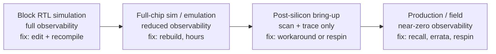

# 1. Why Verification Exists

Verification exists because a defect that survives it grows more expensive the later it is found. The reference SoC of this book carries the case: its DMA engine copies rectangular blocks of memory one line at a time, and each line is a contiguous run of bytes, a *2D row*. Consecutive rows start one address step apart; that step is the *stride*, and a negative stride walks memory downwards. The *burst splitter* is the stage that cuts every transfer into bursts that the address rules allow. It sits between the DMA's registers and the AXI backend (AXI: the industry-standard on-chip bus protocol). The rule the splitter must obey above all is the 4 KB address boundary, which AXI forbids a burst to cross: every burst stays inside one address region of that size, so it never spans two subordinates. The DMA has two independent transfer engines, and each of them is a *DMA channel*. The burst splitter splits a two-dimensional transfer incorrectly when the transfer has a negative stride and its row crosses that boundary, and the wrong split corrupts data only while the second DMA channel is competing for the AXI backend that the two channels share. Two hundred and fourteen directed DMA tests had passed for months without ever combining a negative stride and a row that crosses the boundary with a second channel competing for the backend. Software programs each transfer by writing a small record that names the source and destination addresses together with the lengths and strides, the *transfer descriptor*. A constrained-random test generating legal-but-unlikely descriptors by the thousands found the mis-split in one night, as a single failing seed of the nightly regression, eleven days before tape-out, the day the design database is frozen and sent for fabrication; the scoreboard, the testbench component that compares what the design did against what it should have done, reported the mismatch.

Found in simulation, the bug costs a day to fix. Missed there, it survives bring-up, the phase in which a fabricated part and its environment first exchange checked transactions, because the corruption needs a rare alignment and a busy second DMA channel, and reaches a customer as intermittent buffer corruption under load. The same defect then costs weeks of a senior team's time to root-cause with only what the part exposes to look at, a respin with its refabrication and requalification, and a missed launch window. That difference, multiplied across every block of every chip, is why verification consumes most of the engineering effort of a chip project.

### Chapter map

§1.1 defines a bug escape and a respin; §1.2 states how the industry measures verification effectiveness, by required silicon spins for ASICs and by escaped bugs for FPGAs, and where those measures now stand; §1.3 establishes why verification dominates project effort and headcount; §1.4 develops the economics of when a bug is found; §1.5 reads the famous escapes for what they teach; §1.6 introduces the reference SoC that carries this book's examples.

## 1.1 The problem: correctness is not the default

A digital design is a machine built from millions of interacting state elements, written by humans working from a specification that is itself written by humans. **Functional verification** establishes, before fabrication, that the design implements its specification: that it does what it is supposed to do, and does not do what it must not. It is distinct from **validation**, which checks a design on real hardware rather than on a model (Chapter 20 states the distinction in full). Much of the literature uses the same term more loosely, as an umbrella over pre- and post-silicon work, and the section on effort below flags one place where that looser sense distorts a cost figure. It is distinct too from manufacturing test, which asks not whether the design is right but whether each fabricated die is free of physical defects.

A **bug escape** is a design flaw that survives verification and reaches the next stage: full-chip integration, silicon, or the field. A **respin** is a new fabrication cycle with corrected masks, and it is the consequence when an escape reaches silicon and cannot be worked around. It is also the industry's bluntest verification metric, because it is unambiguous: a project either shipped first silicon or paid for another pass. **First-silicon success**, the fraction of projects whose first fabricated silicon is production-worthy, is therefore the effectiveness headline of the discipline.

A mature, forty-year-old industry still fails at correctness most of the time, and Chapter 3 develops the theory of why: state spaces are too large to enumerate, and deciding whether an observed response is correct is itself a problem, the oracle problem. The practical shape of the difficulty is already visible in the DMA bug of §1.4, which required the *conjunction* of three individually harmless conditions, because designs fail at the intersections: between features, between blocks, between clock domains, between hardware and software. A 10G Ethernet MAC with time-sensitive-networking queues fails the same way, since the timestamping is right and the frame preemption is right while the bug lives where a high-priority frame preempts an in-flight one in the same window the timestamp is captured. Time-sensitive-networking queues are priority queues whose transmission is scheduled, and frame preemption is the interruption of a frame already in flight for a higher-priority one. And the intersections multiply faster than the features do: by 2024, 84 percent of IC/ASIC projects incorporate one or more embedded processors, 95 percent have two or more asynchronous clock domains, 83 percent include security features, and 44 percent follow at least one safety-critical development standard [cit:R2], and every one of those numbers is a layer of requirements that burdened far fewer projects twenty years ago.

> **Scenario.** The reference SoC integrates a neural accelerator that shares the crossbar with two DMA channels. The accelerator was verified standalone, every convolution mode and weight precision passing, and so was the DMA. **Approach.** Integration verification is still budgeted for the *combination*, accelerator streaming weights while DMA channel 1 fills the next buffer, because block-level correctness does not compose into system-level correctness. **Why.** Arbitration, ordering, and back-pressure behaviors exist only when both actors are active, so no standalone environment exercises them.
## 1.2 The numbers: how often the industry fails

The numbers of this section come from two industry-wide surveys that recur throughout the book: a worldwide, double-blind study of 1,886 participants covering 2014, the largest independent one of its kind at the time [cit:P17], and its 2024 successor (597 eligible participants, ±4 percent margin at 95 percent confidence), published as separate IC/ASIC and FPGA trend reports [cit:R2,R1]. Survey data has known biases, candidly documented: regional participation shifts can distort year-to-year language-adoption trends [cit:R2]. Three editions are now held here, and two tracks run through them: first-silicon success stood at about thirty-two percent in the earliest edition and twenty-four percent in the middle one, both above the rate this chapter reports below; the share of IC/ASIC projects finishing behind their original schedule read sixty-eight percent in the earliest edition and sixty-six percent in the middle one, both below the figure the current edition records [cit:R3,R5,R2]. The effectiveness trend is consistent across those three editions, and this book claims that consistency for that series alone, because the schedule figures move in two directions and take no trend word. The series runs on a two-year cadence, and at the time of writing the edition quoted here is the most recent published: a further edition was announced for this year's DVCon India, but its figures were not published in time for this book.

Both are Wilson Research Group studies, commissioned by their authors at Mentor Graphics and executed by an outside firm to keep respondents anonymous, and preserving the wording of the earlier Collett International Research studies of 2002 and 2004 so that trends stay comparable; no Collett study followed 2004, and the Wilson series was created to fill that void [cit:P17]. The 2004 Collett sample was 201 eligible participants against 1,886 in 2014 [cit:P17].

### First-silicon success is falling

In 2014, only about 30 percent of IC/ASIC projects achieved first-silicon success [cit:P17], and a decade later the figure is 14 percent, the lowest recorded in twenty years, capping a decline that runs unbroken from 2012 to 2024 [cit:R2]. Six out of seven chip projects therefore pay for at least one extra fabrication cycle. The respin is so common that experienced organizations budget for it.

Plain functional bugs of the kind verification exists to catch remain the leading contributor to respins, ahead of analog, timing, power, and physical categories; the studies label those bugs "Logic or functional flaws", and multiple flaws can contribute to one respin, so the categories sum past 100 percent [cit:R2,P17]. Among the root causes of those functional flaws, design errors lead, and problems traced to changing, incorrect, or incomplete specifications are a persistent second theme [cit:R2,P17]. A large share of "hardware bugs" are not coding mistakes but ambiguities and contradictions in what the design was *supposed* to do, discovered late, which is why Chapter 5 treats the verification plan as an instrument for interrogating the specification rather than a list of tests.

Schedule tells the same story: in 2014, 61 percent of IC/ASIC projects were behind their original schedule [cit:P17], and by 2024 the historical average of roughly 66 percent had worsened to 75 percent [cit:R2]. Verification does not bear sole blame for slips, but it sits on the critical path at the end of the project, so it inherits every upstream delay *and* absorbs the blame for its own.

### FPGAs: the illusion of a free respin

FPGA projects have no mask sets, so "respin" seems costless: fix the RTL (register-transfer level, the synthesizable description of the design), rebuild the bitstream, reprogram the part. The data does not bear that out. Asked in 2024 how many non-trivial bugs escaped into production, only 13 percent of FPGA projects answered *zero*, so 87 percent shipped production systems with non-trivial bugs; the study calls that figure notably worse than IC/ASIC first-silicon success rates, while noting that FPGA projects have no metric directly comparable to a respin count [cit:R1]. The IC/ASIC first-silicon success rate and the share of FPGA projects that shipped non-trivial bugs therefore measure different things, and once the first is read as a failure share, the gap between those two headline percentages is smaller than the margin of error the studies declare. The diagnosis is cultural: many FPGA teams deliberately minimize pre-lab verification, racing to the lab to validate the design there, a strategy that worked for the simple FPGAs of the past and fails for today's SoC-class devices [cit:R1]. And a field escape is not free even when reprogramming is: in aerospace systems, replacing or re-programming an FPGA requires removing system covers and triggers a full system revalidation, compounding cost and delay [cit:R1].

> **Scenario.** A product team reuses the reference SoC's I/O subsystem in an FPGA-based industrial controller. The schedule review proposes cutting simulation-based verification to three weeks, on the ground that bugs can be shaken out on the bench. **Approach.** The verification lead answers with the escape data [cit:R1] and a targeted compromise: full constrained-random verification for the newly modified camera-interface datapath, lab-only validation for the unmodified, previously verified UART and SPI paths. **Why.** Lab debug has a fraction of simulation's observability: pins and probe points rather than internal state, so bugs found there cost multiples to root-cause. Spending pre-lab effort *where the design is new* buys the most risk reduction per engineer-week, and reuse of verified IP is what lets some projects legitimately spend less on verification [cit:R2].

### What the trend data is really saying

The outcome got worse across twenty years of methodology, and the 14 percent invites reading as an indictment of that methodology: constrained-random stimulus, functional coverage, assertions, UVM (the standard testbench methodology, IEEE Std 1800.2-2020, *IEEE Standard for Universal Verification Methodology* [cit:S9], Chapter 10), and formal verification. But design complexity has grown along every measured axis: gate counts, embedded processors (52 percent of designs in 2004, 71 percent by 2014 [cit:P17], 84 percent in 2024, with 58 percent of projects integrating a RISC-V core and 59 percent some form of AI accelerator [cit:R2]), clock domains, security, safety. Holding respin rates anywhere near flat against that headwind is itself a productivity gain, delivered by the techniques this book teaches. The 2014 data still supported an optimistic reading: designs had grown dramatically, yet required spins were not getting any worse [cit:P17]. The 2024 decline suggests the headwind is currently winning [cit:R2]. The remedy's direction is unchanged across the decade: in 2024, projects using formal verification and mature methodologies experienced fewer spins [cit:R2]. Staffing, available verification time and adoption of these techniques have not kept pace.

## 1.3 The effort: who pays, and how much

Nearly every verification talk and textbook repeats that verification consumes "70 percent of the effort." Exactly this claim has been called "subjective or unsubstantiated", folklore repeated from publication to publication without primary data [cit:P17]. Yet the folklore is well rooted, and each of its versions measures a different whole: as a share of design effort, verification consumes about 70 percent in the SoC era [cit:B2]; as a share of design time, multiple chip projects cite approximately 70 percent spent in verification [cit:B3]; and as a share of overall time and resources, validation in the umbrella sense (pre- and post-silicon together rather than the real-hardware checking this book means by the word) is estimated at 70 percent in SoC design [cit:P21]. That third figure is a reminder to read the scope before the number: the same source puts *post-silicon* validation at half, the figure §1.4 cites.

Measured, the average share of total project time spent in verification was **57 percent** in 2014, essentially unchanged from 2012, with wide dispersion in both directions and a growing tail of projects spending more than 80 percent of their time verifying [cit:P17]. Projects assembling pre-verified IP legitimately spend far less, and projects with high proportions of newly developed IP spend far more [cit:R2], so the defensible summary is the majority of project time, with "how much more than half" set mostly by how much of the design is new.

Headcount is the other axis, and its trend is steeper. Between 2007 and 2014, demand for design engineers grew at a 3.7 percent compound annual rate, while demand for verification engineers grew at **12.5 percent**, and by 2014 the mean peak number of verification engineers on a project exceeded the mean peak number of design engineers [cit:P17]. The growth has since cooled (2016–2024: 2.4 percent for design, 3 percent for verification on IC/ASIC projects [cit:R2]), but from that already-inverted baseline a five-to-one ratio of verification to design engineers is not unusual in some market segments such as processors [cit:R2]. The FPGA world is now living the IC/ASIC world's 2007–2014 transition: FPGA verification headcount grew at 8.5 percent CAGR against 4.7 percent for design between 2012 and 2024 [cit:R1]. A 2006 guideline reads, two decades later, as conservative for some segments: verification engineers may number up to twice the RTL designers [cit:B2].

Designers verify too: in 2024, IC/ASIC design engineers spent on average 49 percent of their time on verification [cit:R2], so nearly half of the "design" headcount is functionally verification effort. With a dedicated verification team that equals or outnumbers the design team, well over half of all engineering hours go to verification on a typical project developing new IP.

Within verification, the largest single consumer of an engineer's time is **debug**, ahead of test planning, testbench development and running tests, in 2014 and again in 2024, for both IC/ASIC and FPGA engineers [cit:P17,R2,R1]. The management consequence is the same in both years: debug time is unpredictable and varies wildly between projects, so verification schedules built by extrapolating the previous project's effort keep failing [cit:R2]. Much of this book's advice is debug-time reduction: self-checking testbenches (Chapter 8), assertions that catch bugs at their point of origin (Chapter 11), disciplined triage (Chapter 12).

### In this scenario: staffing the reference SoC

The reference SoC is a small chip by industry standards. A plausible staffing has four RTL designers and five dedicated verification engineers (core and instruction-set simulator (ISS) co-simulation; crossbar and DMA; accelerator; I/O and peripherals; integration and regression infrastructure), with each designer additionally spending near half their time on block-level verification of their own RTL [cit:R2]. An out-of-order server core illustrates the scaling behind the five-to-one processor-segment ratio [cit:R2]: the design team grows by perhaps three times, while the state space (speculation, replay, coherence, ordering) grows combinatorially, and verification headcount must chase the state space rather than the gate count. That asymmetry, effort scaling with *behavior* rather than *structure*, is why verification's share keeps rising, and Chapter 3 states it formally.

## 1.4 The economics: what a bug costs, and when

Verification is an economic activity, funded because bugs found late cost more than bugs found early.

Two quantities move in opposite directions as the project advances: the **cost to find and fix** a bug rises while the **time available** to deal with it shrinks [cit:P21]. A third quantity sits behind the cost and the time, **observability**: how much of the design's internal state is visible when something goes wrong. In RTL simulation any internal signal is observable; on an FPGA prototype only a few thousand pre-selected signals are observable; on silicon the observable signals are only those the design-for-debug hardware routes to a pin or a trace buffer [cit:P21], so less visibility means slower root-causing at exactly the project stage where days are most expensive. The collapse is worst where the failure leaves nothing to look at. On silicon, an HBM controller (HBM: a stacked high-bandwidth memory) can stall mid-step in its PHY training sequence, the handshake in which the physical layer of a link calibrates itself before data can flow. The stall yields a link that never comes up and a bus with no traffic on it, while in simulation the same stall is a signal a testbench can force, step through and print. {ref: bug_cost_stages} walks the four stages.



{figure: bug_cost_stages} The four stages at which a bug can be found, from block RTL simulation to the field, each labelled with the observability available at that stage and the form a fix takes there. The two degrade together: as the fix moves from an edit and a recompile to a recall or a respin, observability falls from any internal signal at any time to only what the design-for-debug hardware routes to a pin or a trace buffer.


- **Simulation is slow but transparent.** RTL simulation runs roughly a billion times slower than the target silicon at full application-class scale: a workload that takes seconds on the chip, booting an operating system, would take years in an RTL simulator [cit:P21]. Simulation-found bugs are cheap because of perfect visibility and an instant fix, but simulation alone cannot reach system-level behavior, which is why emulation and prototyping exist (Chapter 17).
- **Post-silicon debug is measured in weeks.** On IBM's POWER8, one of the most instrumented and best-staffed programs in the industry, medium-severity post-silicon bugs took on average about 10 days per bug to root-cause, with the 90th percentile at 20 days [cit:P21].
- **A respin is refabrication plus requalification.** An escape that reaches silicon and cannot be worked around forces redesign and re-validation as well as expensive refabrication [cit:P21]. The mask and fab costs are the visible part, and the dominant term is usually time.
- **The market window dwarfs everything.** Missing a product's launch window can mean millions to billions of dollars of lost revenue, or missing the market entirely, whether that window is the holiday season or a customer's design-in deadline, and a bug that reaches the field can add recall costs and reputation damage on the same scale [cit:P21].

A widely repeated rule of thumb says the cost of a bug grows by an order of magnitude at each stage: block, chip, silicon, field. The corpus offers no measured cost-per-stage series, so the "10×" is a mnemonic rather than data, but every mechanism above pushes in its direction and none pushes back.

The industry also pre-pays in silicon itself: in some modern SoCs, over 20 percent of die area is devoted to design-for-debug and validation instrumentation [cit:P21], spent on observability for bugs not yet found. And post-silicon validation as a whole is estimated in multiple studies at up to 50 percent of a design's overall cost, measured as time [cit:P21]. Pre-silicon verification effort is what keeps that downstream machinery from becoming the primary bug-finding mechanism.

> **Scenario.** During integration of the reference SoC, a formal tool proves a protocol assertion false on the crossbar: under sustained back-pressure, two write transactions from different managers, in flight to the same subordinate, can interleave their data beats, the individual data transfers that make up a burst. The interleaving is an ordering violation, since AXI4 obliges an interconnect to forward merged write data in address order. The counterexample, the input sequence the proof engine returns to exhibit the failure, is 11 cycles long. **Approach.** The team fixes the arbiter and re-proves the property, total cost: two engineer-days. **Why.** This bug class is difficult to diagnose downstream: traffic must combine sustained back-pressure with concurrent writes, which directed tests or random runs can miss, and the lab symptom would be memory corruption that is difficult to reproduce. Caught at RTL by an assertion, it costs days, and the 2024 data associates exactly this maturity with fewer spins [cit:R2]; caught in the field, it is the "millions to billions" scenario [cit:P21].

### Worked example: anatomy of a near-escape

Here is the opening's DMA bug, written up the way a competent team files it. The report keeps the burst splitter's older name, the midend transfer legalizer, as the design's code identifiers do. Every field of it gets its own chapter later (severity and triage in Chapter 12, escape analysis in Chapter 7, coverage crosses in Chapter 6, where a coverage cross is the combination of two or more coverage axes into cells), and the shape matters now: a bug report is an economic document, recording not only what broke but what the escape *would have cost* and what process change prevents its siblings.

```text
Bug ID:          SOC-1284
Title:           DMA ch0 2D negative-stride transfer corrupts data at 4 KB
                 boundary when ch1 is concurrently active
Found by:        Nightly constrained-random regression (scoreboard mismatch),
                 11 days before tape-out
Stage found:     RTL simulation, full-chip environment
Severity:        Critical — silent data corruption, no error response raised
Root cause:      Midend transfer legalizer mis-splits a negative-stride 2D row
                 that crosses a 4 KB AXI boundary; the malformed burst is
                 masked unless ch1 owns the backend in the same window
                 (arbitration timing hides it otherwise).
Escape analysis: 214 directed DMA tests passed; none combined negative stride
                 × 4 KB crossing × dual-channel activity. Functional coverage
                 model had no cross of these three dimensions — the hole was
                 invisible to our own metrics.
Cost if escaped: intermittent field corruption → weeks of bring-up debug at
                 ~10 days/bug post-silicon norms, likely respin + requal
Actions:         (1) fix legalizer split logic; (2) add coverage cross
                 stride_sign × boundary_cross × channel_concurrency;
                 (3) extend scoreboard with end-to-end data check for 2D
                 descriptors; (4) sweep sibling risk: audit all legalizer
                 corner cases against the AXI 4 KB rule.
```

The directed tests, each written to check one imagined behavior, all passed. The constrained-random environment found the unimagined combination, and the scoreboard, not any human, noticed the corruption. A coverage model is the region of behavior that its dimensions and their values mark out, and this model could not even *represent* the hole. Automated checking makes that division of labor portable: a video codec team runs the same discipline against a bit-exact reference decoder, because "the picture looks right" is not a verdict a regression can produce unattended. The one bug already argues for two of this book's parts: stimulus and checking (Part III), and measurement (Part II).

### The verification gap

The pattern of this chapter is a widening **verification gap** between what projects must verify and what they can, and it decomposes into three: an *inherent* gap (unavoidable complexity growth: more IP, more cores, more protocols, more software content); a *transient* gap (skills and tooling that lag but catch up); and a *self-induced* gap (schedule pressure forcing shortcuts, poor environment quality, metrics collected for their own sake, best-known methods sitting unused at an estimated 20 percent productivity cost) [cit:D16]. The decomposition is a management tool, assigning *innovate* to the inherent gap, *invest* to the transient one and *introspect* to the self-induced one [cit:D16]. Much of this book is aimed at the third, the gap a team creates and can close without waiting for anyone's roadmap.

## 1.5 Public history: when escapes became famous

Most escapes end in an erratum in a datasheet, a software workaround or a stepping nobody outside the team remembers; a stepping is what a bring-up team calls a respin. A few became public, and the narrative that follows is public history rather than cited fact; where the corpus supports a claim, the citation says so.

In 1994 a mathematics professor doing number-theory research found that his new Pentium machines occasionally divided incorrectly, because for rare combinations of operands the floating-point divide unit returned results wrong in the low-order digits. The root cause, as it emerged publicly, was a handful of missing entries in a lookup table used by the division algorithm, a deterministic flaw hard to hit by chance. Intel initially argued that a typical user might never encounter the error in the lifetime of the machine; the argument was statistically defensible and commercially disastrous. The story reached the mainstream press, and the company was eventually forced to offer replacement of the affected chips already in the market [cit:B3], a recall whose direct cost was widely reported at the time and whose reputational cost was larger. The case remains the canonical example of why failure costs drive verification [cit:B3].

The FDIV case has implications beyond divider verification. First, *rare* is not *safe*: a fault that a single operation almost never encounters is still met by millions of chips executing billions of operations, and the field finds what the testbench did not, a theme that returns as coverage philosophy in Chapter 6. Second, escape cost is set by the market rather than by the bug: the flaw affected almost no real computation and still forced a replacement program, because trust questioned in public is repriced for the whole product line. Third, the aftermath rather than the bug changed the industry: formal verification of floating-point datapaths moved into mainstream practice at processor vendors, and the case study still opens the era's verification texts [cit:B3].

Processor vendors today routinely publish errata sheets, catalogs of post-silicon bugs with workarounds, a practice so normalized that an erratum is only news when it cannot be worked around. And in 2018, the public disclosures of speculative-execution side channels showed that a design can be functionally flawless, with every architectural result correct, and still leak secrets through its microarchitecture: a side channel is a route by which a protected value can be inferred from an observable physical quantity rather than read. The escape there lay in the *specification*, which never forbade the leak, rather than in the implementation. Each famous escape widened what verification is expected to cover, from correctness to safety to security (Chapters 22 and 23), and the data of this chapter shows the industry absorbing exactly those layers [cit:R2].

## 1.6 The reference SoC: the running example of this book

Throughout this book, one design carries the examples: a microcontroller-class, single-core RISC-V SoC for low-power edge applications (*The RISC-V Instruction Set Manual, Volume I: Unprivileged Architecture*, Version 20250508, ratified, RISC-V International [cit:S14]). It is a composite, technically faithful to the class of edge-AI microcontrollers shipping today, deliberately anonymous, and made of these elements ({ref: reference_soc}):

{table: reference_soc} The reference SoC element by element: the design that carries this book's examples, described in one phrase per element with the canonical parameters — widths, counts, capacities, frequencies — that every later chapter reuses unchanged. Read it as a cast list rather than as a specification; a bare mention of the core, the crossbar or the DMA engine anywhere in the book means the row named here, with these numbers.

| Element | Description | Canonical parameters |
|---|---|---|
| **the core** | 4-stage, in-order, single-issue RV32IMC core with optional custom DSP/SIMD extensions | ~50k gates; OBI-like instruction/data interfaces; M/U privilege modes; CLINT-style interrupts with a fast-IRQ extension |
| **the crossbar** | full AXI4 crossbar interconnect (*AMBA® AXI and ACE Protocol Specification*, Arm IHI 0022H.c, 2021) [cit:S18] | 5 managers (core-I, core-D, DMA×2, debug) × 4 subordinates (SRAM, boot ROM, APB bridge, neural accelerator); 32-bit address, 64-bit data; ID width 4 |
| **the DMA engine** | modular multi-channel DMA: frontend (registers), burst splitter (splits each transfer into bursts the AXI address rules allow; code identifiers keep the name `midend`), backend (AXI4 manager) | 2 channels; 1D/2D transfers; max burst 256 beats; 16-entry × 64-bit datapath FIFO in the backend; per-channel error reporting |
| **the I/O subsystem** | autonomous I/O engine moving data between peripherals and memory without core intervention | lightweight per-peripheral DMA; UART, SPI, I2S, camera interface |
| **the neural accelerator** | fixed-point convolution engine for quantized neural networks | 2/4/8-bit weights; 16-lane MAC datapath; streams weights from memory; register-programmed convolution jobs |
| **the memory** | multi-banked tightly-coupled SRAM, word-interleaved, single-cycle | 512 KB in 4 banks; logarithmic interconnect toward core and DMA |
| **the peripherals** | APB subsystem (*AMBA® APB Protocol Specification*, Arm IHI 0024, Issue E, 2023) [cit:S19] | UART, SPI, I²C, GPIO, timer, event/interrupt unit |
| **clocking** | 3 asynchronous domains | system @ 200 MHz, peripheral @ 50 MHz, always-on RTC @ 32 kHz |
| **power** | 2 UPF (Unified Power Format, the standard power-intent description — IEEE Std 1801-2024, *IEEE Standard for Design and Verification of Low-Power, Energy-Aware Electronic Systems* [cit:S10]) power domains | always-on (RTC, wake-up logic) + switchable system domain; retention on the event unit |
| **debug** | RISC-V debug module over JTAG | run-control + abstract memory access |

The choice is representative by the numbers. The SoC has an embedded processor (like 84 percent of 2024 IC/ASIC projects), a RISC-V one (like 58 percent), an AI accelerator (like 59 percent), multiple asynchronous clock domains (like 95 percent), and security- and safety-relevant variants in later chapters (like 83 and 44 percent respectively) [cit:R2]. When this small chip generates a hard verification problem, it is the same problem the median project faces.

Each element is also a deliberate teaching seam. The crossbar carries protocol verification (handshakes, ordering, ID routing) and the formal methods of Part IV. The DMA carries data-mover verification: burst splitting, the 4 KB boundary, error responses, and transfer-descriptor corner cases. The core carries ISA-level verification against a golden ISS, privileged state and interrupt corner cases, and the accelerator carries datapath and quantization corner cases plus memory contention with the DMA. The accelerator's unit of work is one convolution, programmed through its registers, and the book calls it a *convolution job*. The three clock domains carry clock-domain crossing (CDC) verification (Chapter 13), the two power domains carry low-power verification (Chapter 19), and the register files everywhere carry register-model verification, which checks the testbench's model of the design's registers against the design's own. And a handful of *recurring bugs*, of which SOC-1284 above is the first, resurface across chapters, each time caught or missed by a different technique, which puts the techniques on constant ground.

When scale matters, the examples move up a generation. The **flagship SoC** is its successor: it inherits the first generation's DMA architecture, register discipline and verification assets. It adds these elements: a host cluster of four application-class RV64GC cores running an OS, whose MESI directory across four private L1s makes coherence a verification problem; a 4×4 mesh NoC and an LPDDR4 subsystem, large enough to move interconnect and memory verification to emulation and system scale; a root of trust that puts security inside the SoC; and processor trace and bus monitors, the instrumentation a post-silicon bring-up team uses to debug. Its automotive derivative, the flagship-A, carries safety at full-SoC size. The subsystems keep standalone lives too: the **compute cluster** (8 cores sharing multi-banked memory) and the mesh NoC are block-level examples before they are the flagship's. Specialized chapters call in whatever their domain needs: an automotive brake-controller MCU, a secure element, an analog front-end. All obey the same rule: same parameters everywhere, no variants, and a bare name always means the reference SoC's.

### In practice

Escape analysis should turn records of respins and escaped bugs into changes to the next verification plan. Extrapolating the last project's effort is unreliable because debug, the largest effort component, varies unpredictably between projects [cit:R2]. Schedule pressure contributes to the self-induced verification gap [cit:D16]; the verification schedule loses time allowance when design slips are absorbed into it, and the total delay can then appear to originate in verification. The next project's plan should incorporate the escape post-mortem and budget verification staffing at least one-to-one against design, before counting the designers' own verification time [cit:P17,R2]; passing tests should contribute to the sign-off argument described in Chapter 7 without determining its conclusion.

### Pitfalls

1. **Treating verification as a phase that starts when RTL is done.** Symptom: verification team "waiting for a stable drop." Cure: verification starts with the specification, so plan, testbench architecture and assertions proceed in parallel with design (Chapter 4).
2. **Equating "all tests pass" with "verified."** Symptom: green dashboard, no coverage model, tape-out confidence by acclamation. Cure: passing tests measure only what was imagined, so measure coverage and hunt what was not (Chapters 5–7).
3. **Staffing verification as the designers' side job.** Symptom: no dedicated verification owners; designers verify their own interpretation of the spec. Cure: independent verification ownership, staffed to the industry's ratios, with designers' ~50 percent verification time budgeted explicitly [cit:R2].
4. **Counting on the lab.** Symptom: "it's an FPGA / we'll catch it in bring-up." Cure: 87 percent of FPGA projects ship non-trivial bugs [cit:R1] and lab observability is a fraction of simulation's [cit:P21], so move effort pre-lab for everything newly designed.
5. **Costing a respin as masks-plus-fab.** Symptom: risk register prices an escape at the refabrication invoice. Cure: price the schedule slip and the market window, whose corpus-documented range is millions to billions [cit:P21].
6. **Skipping the escape post-mortem.** Symptom: bug fixed, everyone relieved, nothing changes. Cure: every escape (and near-escape) is a defect in the *process*; file the SOC-1284-style analysis and change the plan, the coverage model, or the checklist it exposed.

### Summary

- Verification exists because escapes are ruinous: bug cost rises and fix time shrinks at every project stage, from editable RTL to recalled product [cit:P21].
- The industry, measured: 14 percent IC/ASIC first-silicon success in 2024, a twenty-year low [cit:R2], and 87 percent of FPGA projects shipping non-trivial bugs [cit:R1].
- Functional flaws remain the leading cause of respins; their root causes are design errors, with changing or ambiguous specifications a persistent second theme [cit:R2,P17].
- Verification is the majority of project effort: 57 percent of project time on average a decade ago [cit:P17], verification headcount at or above design headcount [cit:P17,R2], and debug the biggest single time sink within it [cit:R2].
- The classic "70 percent" figure is folklore with roots in the literature [cit:P17,B2,B3,P21]; the defensible claim is "more than half, growing with the fraction of new IP."
- Verification is economics: risk reduction bought with engineer-time, and the techniques that buy it cheapest early (assertions, formal, constrained-random with strong checkers) are the subject of this book. Perfection is not on offer, and Chapter 3 explains why.
- The reference SoC introduced here is the book's running example; its parameters do not change, and its bugs will return.

### Exercises

**Exercise 1.1 (calculation).** Take the 2024 IC/ASIC first-silicon success rate of §1.2 and compute how many projects out of a hundred pay for at least one further fabrication cycle. Reconcile that figure with the "six out of seven" the same paragraph states, showing the arithmetic that connects them. Name the population the rate describes and the population it does not.

**Exercise 1.2 (judgement).** A program review places the 2024 IC/ASIC first-silicon success rate and the share of FPGA projects that shipped non-trivial bugs side by side on one slide, and concludes that FPGA verification is the weaker discipline. Decide what the two figures together let the slide conclude, and name the two properties of those figures that limit that conclusion. Point to the sentence of §1.2 that carries each property.

**Exercise 1.3 (calculation).** Take the staffing of the reference SoC in §1.3 together with the average share of an IC/ASIC design engineer's time that went to verification in 2024, counting each engineer as one full-time equivalent. Compute the fraction of that project's engineering hours that goes to verification. Compare the result with the claim §1.3 closes on, and state which of the two staffing numbers dominates the sum.

**Exercise 1.4 (judgement).** A program manager budgets verification at 70 percent of project time, citing the figure the literature repeats, on a project that assembles mostly pre-verified IP. Decide what §1.3 licenses the plan to budget instead, and give the measured figure that section reports together with the two directions in which it disperses. Name the scope error in the variant of the repeated figure that comes from the post-silicon literature.

**Exercise 1.5 (artifact).** Read the write-up below, filed on the crossbar ordering violation of §1.4, against the template of the worked example in the same section. Name the two absent fields that carry the report's economic argument, and state what the report loses without each. Name the pitfall of the chapter's list that each omission matches.

```text
Title:           Crossbar write-data beats of two managers interleave at one
                 subordinate port under sustained back-pressure
Found by:        Formal proof of a protocol assertion, 11-cycle counterexample
Stage found:     RTL, block-level formal environment
Severity:        Critical, ordering violation with silent memory corruption
Root cause:      The write arbiter releases the grant mid-burst while an
                 earlier burst is still unfinished on the write-data channel.
Actions:         (1) fix the write arbiter; (2) re-prove the property.
```

### Further reading

**From the corpus:** the two 2024 Wilson Research Group trend reports, IC/ASIC [cit:R2] and FPGA [cit:R1], are short, still the most recent published edition at the time of writing, and worth reading in full; Foster's DAC 2015 paper [cit:P17] adds the methodological background of the study series and the 2007–2014 trend arcs. Mishra et al.'s post-silicon tutorial [cit:P21] is the best single source on the economics of late-stage bugs. Bergeron's opening chapter [cit:B2] and Bertacco's introduction [cit:B3] give the early-2000s view of the same crisis, instructive because the ratios have barely moved. The Oracle Labs "verification gap" presentation [cit:D16] is a compact management vocabulary for everything in this chapter. The 2020 reports, IC/ASIC [cit:R3] and FPGA [cit:R4], and the 2022 white papers, IC/ASIC [cit:R5] and FPGA [cit:R6], are held here too and supply the two intermediate points of the effectiveness series.

**Not in the corpus** (cited here as general references only): Wile, Goss and Roesner, *Comprehensive Functional Verification* (Morgan Kaufmann, 2005), the classic full-lifecycle treatment; the Collett International Research functional verification studies of 2002 and 2004, the ancestors of the Wilson series, known today primarily through the trend baselines they established; and the contemporary press coverage of the 1994 Pentium FDIV recall, which put the direct charge at roughly half a billion dollars, a figure quoted everywhere and supported nowhere in this book's corpus, and therefore kept out of the chapter's argument.
