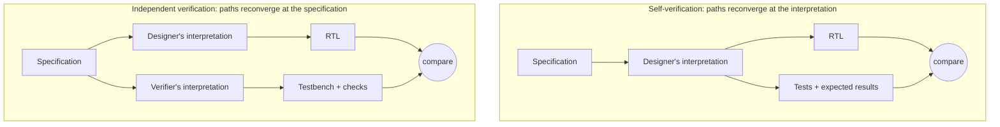

# 2. The Verifier's Mindset

Verification requires an independent interpretation of the specification. What the difference costs when one mind holds both roles is visible on the DMA engine, whose designer wrote its register frontend, its midend legalizer and splitter, and its AXI4 backend tuned for full-bandwidth bursts. She verifies the block herself with a directed suite written in one week: register defaults and read/write paths, 1D transfers of assorted lengths and alignments, a 2D transfer, a deliberately erroneous address to check the per-channel error report, and completion interrupts. Everything passes, and the block is declared verified and integrated.

Three months later a system-level constrained-random regression fails on one seed in four hundred. The scoreboard, the checker that compares the memory image produced by the DMA against a reference prediction, flags corrupted data in a 2D transfer with a *negative* row stride, in a row that straddles an AXI 4 KB address boundary (Arm IHI 0022H.c §A3.4.1) [cit:S18], and only while channel 1 is concurrently streaming audio buffers. The midend legalizer, which must split any burst that would cross a 4 KB page, computes the split point assuming ascending addresses, so with a negative stride, and only when a channel switch disturbs its internal state, it emits a mis-legalized burst and the write lands partly in the wrong page. None of the designer's tests could have found this, not because she tested carelessly but because of *how she thought about testing*: her stimulus exercised the block the way it was meant to be used, her checks confirmed her own understanding of the spec, and her judgment of what counted as "valid", which excluded negative strides across page boundaries, pruned away exactly the region of the input space where the bug lived.

### Chapter map

§2.1 sets the two mindsets against one specification and shows why a designer who verifies her own block verifies her interpretation rather than the specification; §2.2 develops thinking in terms of breakage and the corner cases the specification never mentions; §2.3 states what independence of judgment requires; §2.4 makes systematic doubt the verifier's core professional asset.

## 2.1 Designer and verifier: two minds, one specification

A designer constructs a component
that correctly implements the intended function, with the required performance
and, ideally, without defects. A verifier assumes bugs are present and seeks them by stressing protocols, exploring corner cases and applying zero tolerance toward inconsistencies [cit:D21]. The designer's success is a mechanism that works and the verifier's a demonstration of where it does not, so the two are different orientations toward one specification, and each produces systematically different decisions in stimulus, in checking, and in what gets questioned rather than trusted.

The framing is Verilab's, set out in a DVCon paper as a series of concrete choices a verification engineer has to make rather than as an attitude to be adopted [cit:D21].

In 2024 design engineers spent on average 49% of their time on verification activities [cit:R2]. In some segments,
such as processors, teams field up to five verification engineers per designer
[cit:R2]. The distinction is therefore between *mindsets* rather than job titles, and a designer doing verification with a design mindset is the situation of the opening. Hiring filters on languages, on methodologies and on tool experience ("knows UVM", "has experience with assertions"), and leaves unmeasured what matters most to verification effectiveness: the engineer's mindset. Tools can be learned in months, whereas the mindset usually arrives only through years of experience, mentoring, and lessons from failures [cit:D21].

### Self-verification is structurally blind

Bergeron's *reconvergence model* accounts for why the opening had to end the way it did: verification reconciles two paths from a common origin, a transformation such as writing RTL from a specification and an independent second path back to that origin. What is actually verified is determined by where the two paths reconverge [cit:B2].

When the DMA designer verifies her own block she reads the specification once and forms an interpretation, and from that *same* interpretation she writes both the RTL and the tests with their expected results, so the two paths reconverge at her interpretation rather than at the specification. If that interpretation is wrong anywhere, say by reading the 4 KB rule as a constraint on *ascending* burst addresses, the verification faithfully confirms that the design matches what she believed the spec to mean [cit:B2].
The rule constrains address boundaries, not address direction, and the Note in Arm IHI 0022H.c §A3.4.1 gives the reason: the prohibition "prevents a burst from crossing a boundary between two Subordinates" [cit:S18]. {ref: reconvergence_model} sets the two paths side by side.



{figure: reconvergence_model} The reconvergence model drawn for the DMA of this chapter's opening: the same specification, the same RTL, and two ways of arriving at the tests. In the self-verification half one interpretation feeds both the RTL and the tests, so the comparison can only confirm that interpretation — including where it is wrong. In the independent half a second engineer's reading of the specification feeds the testbench instead, and the two paths reconverge at the specification itself. One node differs between the two halves; §2.3 adds that the independent interpretation it buys pays off only if the verifier's judgment is independent too.

Of the three mechanisms that reduce human-introduced error in any process, automation, mistake-proofing (poka-yoke) and redundancy, design remains too creative an act for the first two, so hardware verification rests on the third, the simplest and the most costly: a *different person* independently interprets the specification and checks the implementation against it.
Verification rests on redundancy and consumes about 70% of design effort (see Chapter 1 for the economics). The industry
pays willingly, because a respin costs more than the redundancy [cit:B2].

> **Scenario.** The crossbar team is short-staffed, and the engineer who wrote
> the DMA's AXI backend offers to "help verify" the crossbar, a block she did
> not design. **Approach.** The team accepts the offer because she can interpret the crossbar specification independently. She reads
> the crossbar spec fresh, builds her own expectation of ID-ordering rules,
> and her checks encode *her* reading, not the crossbar designer's.
> **Why.** Independence attaches to the *artifact*, not the person. A designer can apply her design skills to verifying someone else's block while forming an independent interpretation. What redundancy forbids, as the reconvergence model implies [cit:B2], is only the closed loop of the opening, one mind on both paths.

## 2.2 Thinking in terms of breakage

If the first shift is *who* interprets the spec, the second is *what the testbench is trying to make happen*: the designer's instinct is to make the block work, the verifier's discipline to make it fail. The line runs between *interoperating* with a design and *stressing* it, because every testbench must interoperate at some level while a testbench built with a design mindset slides into cooperating with the very behavior it should be interrogating [cit:D21].

A paradox of robustness makes the case for a verification component, the reusable testbench-side model of an interface with a driver to stimulate it and a monitor to observe it, on a protocol that requires clock-data recovery. The design mindset says that the protocol specifies CDR, so the monitor should implement CDR as robustly as possible.
The verification mindset notices that the more robust the recovery algorithm, the *less checking it performs*, since a tolerant monitor adapts to data rates that are out of spec and masks the bug it exists to catch. The right answer is the least tolerant observer that the reference clock permits, even though no real receiver would be built that way, because
verification does not set out to replicate reality; it sets out to check the design as thoroughly as possible, "even if it means doing so in spite of reality" [cit:D21]. The same trap waits on a 10G Ethernet MAC, where a receive monitor whose elastic-buffer model absorbs clock drift beyond what the specification permits accepts every frame, including the ones a compliant link partner would have rejected.

The same logic recurs wherever the testbench could be *helpful*:

- **Handshakes.** A protocol says a receiver NACKs a corrupted transfer. A design-minded verification component dutifully auto-NACKs, which lets a simulation that should have failed keep running and masks an unprovoked error from the DUT (the design under test). The verification-minded component logs an error and fails the test;
  NACK generation exists only under explicit testcase control for error
  injection [cit:D21].
- **Status outputs.** The I/O subsystem's FIFOs export `full` and `empty` flags, and every test wants them to pace stimulus. Used unchecked they leave the testbench regulating itself by signals that may themselves be buggy, so check them first, with a white-box assertion (one that checks internal design state rather than only the ports) against the FIFO pointers, or an independent count of items in and out, and only then rely on them.
  The same rule bans "snooping" a DUT's internal clock as the
  testbench's own timebase [cit:D21].
- **Error recovery.** A testbench does not need to survive the errors it
  detects. Once a check fires, downstream checking is likely compromised anyway, so the correct default is to stop on first error [cit:D21].

### Corner cases: "invalid" is not a stimulus filter

The designer's second reflex after helpfulness is validity pruning: *that input can't happen, so don't test it*. Whether a scenario is valid or invalid is irrelevant, since the only question is whether it *can happen*, and if it can, the design's response to it must be verified. In one reported production case a designer would dismiss a zero-radius circle as meaningless input, while software upstream in that very system generated them routinely, unknown to that designer. In the other, a low-power mode bit was tested by the obvious sequence (write 1, check entry; write 0, check exit) and passed until tape-out; writing 0 to the bit *when it was already 0* turned out to put the device into low-power mode [cit:D21]. Nothing in the
specification suggests either test.

> **Scenario.** The inline AES-GCM crypto engine sits on the memory path, and its feature list describes encryption under a loaded key, so the team assumes nobody starts an encryption without loading one, which describes intent rather than reachability. The register interface permits it.
> **Approach.** Enumerate what the interface allows rather than what the block
> is for, and write a test for each: start an operation with an empty or stale
> key slot; overwrite the key while an operation is in flight; program a length
> field that disagrees with the number of beats actually streamed; fail the
> authentication tag on a message whose plaintext the engine has already pushed
> downstream. **Why.** Every one of these is reachable from the register
> interface and none appears in any feature list. On a data-mover a permitted-but-unintended input corrupts data and a scoreboard catches it; here the same class of input leaks key material or plaintext, and in the last case the engine may compute exactly the right bytes and still have released them to a consumer that should never have seen them, a security failure rather than a functional one, and a fault in *when* data moved that a value-comparing oracle does not see.

The same lens on the opening starts from the DMA spec: 1D and 2D transfers, strides, up to 256-beat bursts, and, inherited from the AXI protocol, that no burst may cross a 4 KB address boundary (Arm IHI 0022H.c §A3.4.1) [cit:S18]. The designer's
test list came from the feature list. The verifier instead interrogates each feature for its breaking points and *crosses* them: stride sign × boundary proximity × channel concurrency × burst length. "Negative stride"
is on the list not because anyone plans to use it that way but because the
register field is signed, so it can happen. The cross with "row lands within one burst of a 4 KB boundary" and "other channel active" is exactly the cell where the legalizer's bug lives, and a constrained-random generator steered by that coverage model visits it as a matter of course, which is how the bug was caught.

**Worked example: attacking the transfer legalizer.** First, the property: the designer thinks "the legalizer splits at 4 KB", the verifier states the *prohibition* at the output and lets the tool hunt for any way to violate it:

<!-- slang: fragment - property p_no_4kb_crossing with its assert, shown without the checker module that binds it to the DMA AW channel -->

```systemverilog
// No INCR write burst emitted by the DMA backend may cross a 4 KB page,
// regardless of how the midend legalized the transfer. (FIXED bursts hold
// their address; WRAP bursts stay inside their aligned container.)
// 16-bit arithmetic on purpose: an illegal awsize (>3 on this 64-bit bus)
// must overflow the comparison and fail — not wrap silently and pass.
property p_no_4kb_crossing;
  @(posedge clk) disable iff (!rst_n)
  (awvalid && awready && (awburst == 2'b01)) |->
    (16'(awaddr[11:0]) + ((16'(awlen) + 16'd1) << awsize)) <= 16'd4096;
endproperty
a_no_4kb_crossing : assert property (p_no_4kb_crossing);
```

Second, the functional-coverage model that encodes the breakage hypothesis, a covergroup, SystemVerilog's construct for declaring which situations must be observed before coverage is called closed, whose coverpoints each sample one axis of the space into the bins worth counting and whose cross demands their combinations; it would have exposed the directed suite's blind spot as a block of empty bins long before any failure:

<!-- slang: fragment - covergroup cg_legalizer_stress shown on its own; the descriptor signals it samples belong to the testbench described in the text above -->

```systemverilog
covergroup cg_legalizer_stress @(posedge desc_accepted);
  cp_stride : coverpoint desc_stride_sign { bins pos = {0}; bins neg = {1}; }
  cp_bnd    : coverpoint bytes_to_4kb_boundary {
                bins at_bnd   = {0};
                bins in_burst = {[1:2048]};    // crossing reachable in one burst, or exactly filled by one
                bins far      = {[2049:4095]}; }
  cp_len    : coverpoint desc_burst_beats {
                bins single = {1}; bins mid = {[2:255]}; bins max_beats = {256}; }
  cp_ch1    : coverpoint ch1_active { bins idle = {0}; bins busy = {1}; }
  x_attack  : cross cp_stride, cp_bnd, cp_len, cp_ch1;
endgroup
```

The property is the zero-tolerance check; the cross is the map of where to
apply pressure. Even the checker gets the breakage treatment: its 16-bit arithmetic makes an illegal `awsize` fail loudly rather than wrap past the check. Neither artifact took more skill than the directed tests, only a different question: not "does it transfer?" but "how could the split go wrong, and under what interference?"

## 2.3 Independence of judgment

Redundancy buys an independent *interpretation*, and it pays off only if the verifier also maintains independent *judgment*, the willingness to reach and defend conclusions the designer disagrees with; three disciplines protect it.

**Predictions derive from the specification.** The verifier's reference for correct behavior, the scoreboard's expected data image and the monitor's legal responses, must be derived from the spec and never reverse-engineered from what the RTL does. A checker tuned until the design passes has collapsed the reconvergent path back onto the implementation, so the design is once again verified against itself. The same holds at planning level, where the verification plan must be based on the *intent* of the design rather than its implementation, and the corner cases the implementation creates, like the legalizer's split arithmetic, are verified in addition, after the intent-based plan stands [cit:B1]. When a test fails, "the testbench must be wrong" and "the design must be wrong" deserve exactly equal initial credence, and the spec rather than seniority arbitrates.

**DUT outputs require independent checks.** Every time the testbench consumes a DUT output without independent checking, whether a status flag, a ready signal or an interrupt line, it delegates a piece of its judgment back to the object under suspicion [cit:D21]. The DMA's per-channel error report is a case in point: a lazy environment uses it as ground truth for "this transfer failed", so a bug that *under-reports* errors silences the very tests meant to catch it. The independent environment predicts from stimulus which transfers must fail and treats the error report as one more output to be checked.

**Verifiers connect architectural intent with implementation.** Designers implement at module level;
verifiers, building an environment that must exercise and check the whole
block, necessarily operate one level of abstraction up. That position makes the verification engineer the natural liaison between architect and designer, often the first to detect that specification and implementation have diverged and the one whose effort suffers most from inconsistency and "nice-to-have" late additions. Exercising the role takes a professional willingness to say "no, this is not the way to do it" [cit:D21], to a designer with more years on the block, to a schedule that wants the block closed, and sometimes to the verifier's own earlier plan.

> **Scenario.** During integration, the DMA designer reviews the verifier's
> failing seed and replies: "negative stride across a page boundary is a
> software error; document it as a restriction and move on." The tape-out
> review is in two weeks. **Approach.** The verifier does not argue about intent but asks the operative question: can the programming interface express it? It can: the stride register is signed, and nothing in the
> frontend rejects the descriptor. So either the RTL is fixed, or the frontend
> must *detect and reject* the case and a test must prove the rejection.
> "Software will never do it" is accepted only as a documented, checked restriction, never as an untested assumption. **Why.** The verifier's judgment, that reachable means testable, is what the team pays independence for [cit:D21].

## 2.4 The value of doubt

What ties the mindset together is a disciplined, impersonal doubt: not cynicism about designers, since the doubt points equally at the testbench and at the verifier's own reasoning, but a refusal to accept comfort as evidence.

**Passing regressions require checked outcomes.** A regression at 100% pass is not good news until the checks are known to be real. The rule of *no coverage without checking* is the operational form, because a coverage bin hit while nothing verified the outcome converts ignorance into false confidence and is worse than an empty bin. The same goes for the passing-test count as a progress metric, since the verification mindset treats testcases as vehicles toward checked coverage closure and nothing more [cit:D21], and a growing pass rate over an unchecked design measures only the testbench's tolerance. When everything passed in the opening, the reading was that *no check had fired*.

**Failure-free blocks require scrutiny.** Bugs cluster where scrutiny hasn't been, so a block that has never failed a test is either simple or under-attacked, and the verifier's zoom-out instinct is to ask which and to reallocate effort accordingly. A flash controller that has never failed a data-integrity test invites both readings: its LDPC ECC pipeline may be genuinely solid, or the error-injection campaign may only ever have injected patterns the code was always going to correct.
The regular self-audit that decides is *zoom-out thinking*: re-asking each week what most needs breaking against design hot spots, the schedule and what can move post-tapeout, and asking of every environment feature, every metric and every meeting what it is trying to accomplish [cit:D21].

**The testbench requires falsifiable checks and debug visibility.** Verification engineers spend more of their time on debug than on any other activity [cit:R2], and a good share of what they debug is the testbench itself. Doubt therefore extends to engineering for falsifiability: messaging rich enough to debug from logfiles, since much of a testbench's behavior, zero-time execution and dynamic objects, never appears in waveforms, and interfaces structured so that a waveform shows *who* drove *what* [cit:D21].

**The plan defines measurable success.** A substantial part of the "verification
gap" is self-induced: schedule pressure forcing shortcuts, best-known methods
skipped as low priority, and engineer productivity varying up to tenfold
[cit:D16]. Success undefined is unfalsifiable, so the verification plan is the definition of what "verified" will mean for this design (see Chapter 5) [cit:B1].

> **Scenario.** Four weeks from the coverage-closure milestone, the weekly
> zoom-out review notices what day-to-day work cannot: the neural accelerator
> has not failed a test in a month, while the DMA bug absorbed everyone's
> attention. **Approach.** A verifier is
> reallocated to attack the accelerator. Her first find is an environment defect rather than a design one: because the messages never say which job or which MAC lane a mismatch belongs to, earlier failures had been triaged slowly and twice waived as "environment noise". She fixes the messaging first; the reopened failures
> then yield a real bug in a low-precision weight mode. When the schedule pushes back, the verification plan, agreed before the crunch, arbitrates: accelerator-versus-DMA memory contention stays pre-tapeout, performance corners move to post-silicon. **Why.** The zoom-out cadence, logfile-first debuggability and pre/post-tapeout prioritization are the disciplines that keep doubt operative when pressure peaks [cit:D21].

### In practice


- **Small teams cross-verify.** Two designers exchange blocks, which preserves interpretation independence [cit:B2] and leaves the social side to manage, where reciprocal politeness ("I won't press on your block if you don't press on mine") is the failure mode.
- **The designer is a source, not an oracle.** The verifier should interview the designer for hot spots, asking which parts she was least sure about, while keeping pass/fail authority and the checkers on the verification side.
- **Self-verification requires independent artifact review.** When the DMA designer must verify her own block, the following artifact reviews should compensate for the shared interpretation: the verification plan (vplan, Chapter 5) and the coverage model are reviewed by someone else against the spec, assertions are written from the spec text rather than the RTL, and an independent engineer owns the scoreboard's reference model, breaking the interpretation loop at the checks even if one person writes the stimulus.
- **Mindset is taught, not assumed.** Since design engineers already spend about half their time verifying [cit:R2], mindset training should be explicit, with review checklists that ask "what would break this?", bug post-mortems that trace escapes to mindset decisions, and mentoring pairs across the design/verification line (see Chapter 24).

### Pitfalls

1. **Mirroring the design in the testbench.** Symptom: the monitor implements
   the same clever algorithm as the DUT, and everything passes. Cure: build
   the least tolerant observer the spec allows; predict from the spec, not the
   RTL [cit:D21].
2. **Validity pruning.** Symptom: "that can't happen" removes stimulus before
   anyone checks whether it is reachable. Cure: if the interface can express
   it, drive it; validity claims become checked rejections, not silence
   [cit:D21].
3. **Trusting unchecked DUT outputs.** Symptom: tests pace themselves on
   `full`/`empty` flags or DUT clocks that no check covers. Cure: check a
   signal before the environment relies on it [cit:D21].
4. **Counting tests instead of checked coverage.** Symptom: progress reported
   as "412 of 415 passing". Cure: report checked functional coverage; treat
   testcases as vehicles [cit:D21].
5. **The helpful testbench.** Symptom: auto-NACKs, silent retries, error
   recovery paths that keep failing simulations alive. Cure: fail fast and
   loud; stop on first error by default [cit:D21].
6. **Independence in title only.** Symptom: the checker is "fixed" until the
   design passes, with the designer arbitrating. Cure: the spec arbitrates, and discrepancies close with a spec clarification, a design fix, or a testbench fix, each recorded as such.

### Summary

- Designer and verifier hold different orientations toward one specification, constructing correct function versus proving where it breaks;
  the difference is a mindset rather than a job title, and mindset, not tool knowledge, is the strongest determinant of verification effectiveness [cit:D21].
- Verifying one's own design reconverges on the designer's interpretation rather than the specification, so a misread spec escapes by construction; independent interpretation, which is redundancy, is the mechanism hardware verification is built on [cit:B2].
- A testbench built for interoperability can tolerate behavior that verification must reject. Verification may legitimately ignore reality to maximize
  rigor [cit:D21].
- "Invalid" is not a stimulus filter. If a scenario is reachable, its outcome must be verified: the bugs that kill projects live outside the intended-use envelope [cit:D21].
- Judgment must stay independent at every scale: reference models from the spec, no unchecked DUT signal trusted, and the professional duty to say no, supported by a vplan agreed before schedule pressure [cit:B1].
- Doubt is symmetric, covering the design, the testbench, the metrics and the schedule. No coverage without checking; no pass rate without asking what
  the checks would have caught [cit:D21].

### Exercises

**Exercise 2.1 (judgement).** The schedule leaves the DMA designer verifying her own block. The team proposes that she write the assertions and the scoreboard's reference model, reading both off the RTL she wrote, while a second engineer writes the stimulus. Decide where the two paths of the reconvergence model of §2.1 meet under that division of labor, and give the division the chapter's practice list prescribes instead. Name the artifact whose ownership decides the outcome.

**Exercise 2.2 (judgement).** A verification component is needed for a protocol that requires clock-data recovery, and the team offers the receiver IP's own recovery algorithm for the monitor, on the ground of fidelity to a real receiver. Decide which observer §2.2 requires, and give the mechanism by which the more tolerant one loses checking power. Name the form the same mistake takes on the receive monitor of a 10G Ethernet MAC in §2.2.

**Exercise 2.3 (calculation).** Count the coverpoints of `cg_legalizer_stress` in §2.2 and the bins each one declares, then compute the number of cells the cross `x_attack` demands. Name the axis whose second bin exists only because a register field is signed, and quote the reason §2.2 gives for placing that bin in the model.

**Exercise 2.4 (calculation).** Take the property `p_no_4kb_crossing` of §2.2 together with the bus width its comment names. Compute the largest byte offset inside a 4 KB page at which an INCR write burst of 256 beats, at the largest legal `awsize`, can start and still satisfy the property. Compare that offset with the upper edge of the `in_burst` bin of `cg_legalizer_stress`, stating what the two quantities share and how they differ.

**Exercise 2.5 (artifact).** Read the regression summary below, produced by the DMA's new random environment. State what the summary establishes about the legalizer, and name the rule of §2.4 that the last line puts in question once the first two lines are offered as closure evidence. Name the pitfall of the chapter's list that the tests line matches on its own.

```text
regression summary
  tests run / tests passed             415 / 415
  cg_legalizer_stress  x_attack        100%
  scoreboard comparisons executed      0
```

### Further reading

**From the corpus.** Montesano & Litterick, *Verification Mind Games* [cit:D21], seven pages of concrete mindset calls, is this chapter's backbone. Bergeron's *Writing Testbenches using SystemVerilog*,
Chapter 1 [cit:B2], develops the reconvergence model and the human factor.
The *Verification Methodology Manual*, Chapter 2 opening [cit:B1], connects
mindset to planning discipline. The 2024 Wilson Research Group IC/ASIC report [cit:R2] supplies this chapter's workforce data, and Narayan & Symons' *I Created the Verification Gap* [cit:D16] is a candid practitioner taxonomy of how teams inflict the gap on themselves.

**Outside the corpus** (not citable here, worth owning): Wile, Goss & Roesner, *Comprehensive Functional Verification* (Morgan Kaufmann, 2005), the broadest treatment of the verification engineer's role; Myers, *The Art of Software Testing* (Wiley, 1979), the original articulation, from software, of testing as a destructive rather than constructive act; Weinberg, *The Psychology of Computer Programming* (1971), on egoless engineering and why independent review works on humans, not just on code.
