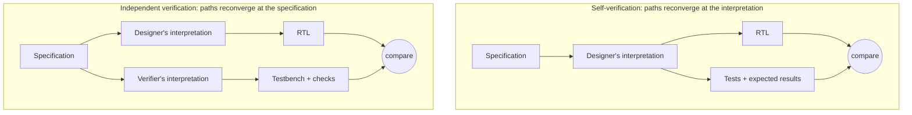

# 2. The Verifier's Mindset

The DMA engine is finished, and its designer built every part of it: the
register frontend she specified, the midend that legalizes and splits transfers,
and the AXI4 backend she tuned for full-bandwidth bursts. She verifies the block
herself. In one week she has a directed test suite: register defaults and
read/write paths, 1D transfers of assorted lengths and alignments, a 2D
transfer, a deliberately erroneous address to check the per-channel error
report, completion interrupts. Everything passes. The block is declared verified
and integrated.

Three months later, a system-level constrained-random regression fails on one
seed in four hundred. The scoreboard — the checker that compares the memory
image produced by the DMA against a reference prediction — flags corrupted data
in a 2D transfer with a *negative* row stride, in a row that happens to straddle
an AXI 4 KB address boundary (Arm IHI 0022H.c §A3.4.1) [cit:S18], and only while channel 1 is concurrently
streaming audio buffers. The midend legalizer, which must split any burst that
would cross a 4 KB page, computes the split point assuming ascending addresses;
with a negative stride, and only when a channel switch disturbs its internal
state, it emits a mis-legalized burst and the write lands partly in the wrong
page. None of the designer's tests could have found this — not because she
tested carelessly, but because of *how she thought about testing*. Her stimulus
exercised the block the way it was meant to be used. Her checks confirmed her
own understanding of the spec. And her judgment of what was "valid" — nobody
programs negative strides across page boundaries — pruned away exactly the
region of the input space where the bug lived.

This chapter is about that difference in thinking. Verification is not design
performed twice; it is a different intellectual act, with its own posture
toward the design, the specification, and reality itself.

### Chapter map

- §2.1 establishes why the designer's and the verifier's ways of
  thinking differ structurally, not just in emphasis, and why a designer who
  verifies her own block verifies her interpretation, not the specification.
- §2.2 develops thinking in terms of breakage: stressing a design instead of
  merely interoperating with it, and hunting corner cases the specification
  never mentions.
- §2.3 states what independence of judgment means in practice, and what preserves
  it even on teams too small for a separate verification group.
- §2.4 establishes systematic doubt — of the design, of the testbench, and of the
  verifier's own assumptions — as the verifier's core professional asset.

## 2.1 Designer and verifier: two minds, one specification

Start with what each role is trying to do. A designer constructs a component
that correctly implements the intended function, with the required performance
and, ideally, without defects. A verifier starts from the opposite premise:
the bugs are already in there — the job is to find them, by stressing
protocols, exploring corner cases, and applying zero tolerance toward
inconsistencies [cit:D21]. The designer's success is a mechanism that works;
the verifier's success is a demonstration of where it doesn't. These are not
two intensities of the same activity. They are different orientations toward
the same specification, and each produces systematically different decisions
— in stimulus, in checking, in what gets questioned and what gets trusted.

That framing is not this book's invention. It is Verilab's, set out in a DVCon
paper whose device is to expose the mindset through a series of concrete choices
a verification engineer has to make, rather than as an attitude to be adopted —
the first of those choices being whether the environment's duty is to replicate
the real world, or to stress the design beyond it [cit:D21].

The boundary between the roles, note, is porous in practice. In 2024, design
engineers spent on average 49% of their time on verification activities
[cit:R2] — every designer already verifies half the time. In some segments,
such as processors, teams field up to five verification engineers per designer
[cit:R2]. So the distinction this chapter draws is not between job titles. It
is between *mindsets*, and a designer doing verification with a design mindset
is precisely the situation in the opening scenario. The industry
systematically undervalues this: hiring filters on languages, methodologies
and tool experience — "knows UVM", "has experience with assertions" — while
ignoring the single most important determinant of verification effectiveness,
the mindset of the engineer. Tools can be learned in months; the
mindset usually arrives only through years of experience, mentoring, and
lessons from failures [cit:D21].

### Why self-verification is structurally blind

The cleanest account of why the opening scenario had to end the way it did is
Bergeron's *reconvergence model*: verification is the reconciliation of two
paths that share a common origin — a transformation (say, writing RTL from a
specification) and an independent second path back to that origin. What you
actually verify is determined by where the two paths reconverge [cit:B2].

Now trace the paths when the DMA designer verifies her own block. She read
the specification once and formed an interpretation; from that interpretation
she wrote the RTL — and from that *same* interpretation she wrote the tests
and the expected results. The two paths reconverge not at the specification
but at her interpretation of it. If that interpretation is wrong anywhere —
say, she read the 4 KB rule as a constraint on *ascending* burst addresses —
the verification will never highlight it: it faithfully confirms that the
design matches what she believed the spec to mean [cit:B2].
The rule constrains address boundaries, not address
direction: Arm IHI 0022H.c §A3.4.1 carries a Note giving the reason — the
prohibition "prevents a burst from crossing a boundary between two
Subordinates" [cit:S18]. {ref: reconvergence_model} sets the
self-verification path beside the one that reconverges at the
specification instead.



{figure: reconvergence_model} The reconvergence model drawn for the DMA of this chapter's opening: the same specification, the same RTL, and two ways of arriving at the tests. In the self-verification half one interpretation feeds both the RTL and the tests, so the comparison can only confirm that interpretation — including where it is wrong. In the independent half a second engineer's reading of the specification feeds the testbench instead, and the two paths reconverge at the specification itself. One node differs between the two halves; §2.3 adds that the independent interpretation it buys pays off only if the verifier's judgment is independent too.

Three mechanisms reduce human-introduced error in any process: automation,
mistake-proofing (poka-yoke), and redundancy. Design remains too creative an
act for the first two, so hardware verification rests on the third — the
simplest and the most costly: a *different person* independently interprets
the specification and checks the implementation against it.
Redundancy is expensive — and verification, which rests on it, consumes about
70% of design effort (see Chapter 1 for the economics). The industry
pays willingly, because a respin costs more than the redundancy [cit:B2].

> **Scenario.** The crossbar team is short-staffed, and the engineer who wrote
> the DMA's AXI backend offers to "help verify" the crossbar, a block she did
> not design. **Approach.** Accept — this is redundancy done right. She reads
> the crossbar spec fresh, builds her own expectation of ID-ordering rules,
> and her checks encode *her* reading, not the crossbar designer's.
> **Why.** Independence attaches to the *artifact*, not the person. A designer
> is often an excellent verifier of someone else's block: the design skills
> transfer, and the interpretation is finally independent. What redundancy
> forbids, as the reconvergence model implies [cit:B2], is only the closed
> loop of the opening scenario — one mind on both paths.

## 2.2 Thinking in terms of breakage

If the first shift is *who* interprets the spec, the second is *what you are
trying to make happen*. The designer's instinct is to make the block work; the
verifier's discipline is to make it fail. This sounds like a slogan until you
watch it change concrete engineering decisions. The line runs between
*interoperating* with a design and *stressing* it: every testbench must
interoperate at some level, but a testbench built with a design mindset
quietly slides into cooperating with the very behavior it should be
interrogating [cit:D21].

The most instructive case is a paradox of robustness. Consider a
verification component — the reusable testbench-side model of an interface,
with a driver to stimulate it and a monitor to observe it — for a protocol
that requires clock-data recovery. The design mindset says: the protocol
specifies CDR, so the monitor should implement CDR, as robustly as possible.
The verification mindset notices that the more robust the monitor's recovery
algorithm, the *less checking it performs* — a tolerant monitor gracefully
adapts to data rates that are actually out of spec, masking the bug it exists
to catch. The right answer is the least tolerant observer that the reference
clock permits, even though no real receiver would ever be built that way.
Verification's aim is not to replicate reality but to verify the design in the
most thorough manner possible, "even if it means doing so in spite of reality"
[cit:D21]. The same trap waits on a 10G Ethernet MAC: a receive monitor whose
elastic-buffer model quietly absorbs clock drift beyond what the specification
permits will accept every frame — including the ones a compliant link partner
would have rejected.

The same logic recurs wherever the testbench could be *helpful*:

- **Handshakes.** A protocol says a receiver NACKs a corrupted transfer. A
  design-minded verification component dutifully auto-NACKs — and thereby lets
  a simulation that should have failed keep running, masking an unprovoked
  error from the DUT (the design under test). The verification-minded component logs an error and fails the test;
  NACK generation exists only under explicit testcase control for error
  injection [cit:D21].
- **Status outputs.** The I/O subsystem's FIFOs export `full` and `empty`
  flags, and every test wants to use them to pace stimulus. Use them unchecked
  and you have the blind leading the blind: the testbench regulating itself by
  signals that may themselves be buggy. Check the flags first — a white-box assertion (one that checks
  internal design state rather than only the ports) against the FIFO
  pointers, or an independent count of items in and out — then rely on them.
  The same rule bans "snooping" a DUT's internal clock as the
  testbench's own timebase [cit:D21].
- **Error recovery.** A testbench does not need to survive the errors it
  detects. Once a check fires, downstream checking is likely compromised
  anyway; the correct default is to stop on first error, like a mousetrap that
  has caught its bug and is done for that simulation [cit:D21]. Engineering
  testbench recovery paths is effort spent making failure comfortable.

### Corner cases: "invalid" is not a stimulus filter

The designer's second reflex — after helpfulness — is validity pruning:
*that input can't happen, so don't test it*. The answer is categorical:
whether a scenario is valid or invalid is irrelevant; the only question is
whether it *can happen*, and if it can, the design's response to it must be
verified. Two reported production cases are worth retelling. In one,
a designer would dismiss a zero-radius circle as meaningless input — and in
that very production system, software upstream was generating zero-radius
circles routinely, unknown to that designer. In the other, a
low-power mode bit was tested by the obvious sequence (write 1, check entry;
write 0, check exit) and passed until tape-out — but writing 0 to the bit
*when it was already 0* turned out to put the device into low-power mode
[cit:D21]. Nothing in the
specification suggests either test. Both bugs are invisible to a mind that
tests what the design is *for*, and nearly inevitable finds for a mind that
enumerates what the design can be *subjected to*.

> **Scenario.** The inline AES-GCM crypto engine sits on the memory path. Its
> feature list describes encryption under a loaded key, and the team's shared
> assumption is that nobody starts an encryption without loading one — which
> describes intent, not reachability. The register interface permits it.
> **Approach.** Enumerate what the interface allows rather than what the block
> is for, and write a test for each: start an operation with an empty or stale
> key slot; overwrite the key while an operation is in flight; program a length
> field that disagrees with the number of beats actually streamed; fail the
> authentication tag on a message whose plaintext the engine has already pushed
> downstream. **Why.** Every one of these is reachable from the register
> interface and none appears in any feature list. On a data-mover a
> permitted-but-unintended input corrupts data and a scoreboard catches it;
> here the same class of input leaks key material or plaintext. The last case
> is a security failure rather than a functional one: the engine may compute
> exactly the right bytes and still have released them to a consumer that
> should never have seen them. That is a fault in *when* data moved, not in
> what the data was — and an oracle that compares values is not looking.

Now rerun the opening scenario with this lens. The DMA spec says 1D and 2D
transfers, strides, up to 256-beat bursts, and — inherited from the AXI
protocol — that no burst may cross a 4 KB address boundary (Arm IHI 0022H.c §A3.4.1) [cit:S18]. The designer's
test list came from the feature list. The verifier instead interrogates each
feature for its breaking points and, crucially, *crosses* them: stride sign ×
boundary proximity × channel concurrency × burst length. "Negative stride"
is on the list not because anyone plans to use it that way but because the
register field is signed, so it can happen. The cross with "row lands within
one burst of a 4 KB boundary" and "other channel active" is exactly the cell
where the legalizer's bug lives — and a constrained-random generator steered
by that coverage model visits it as a matter of course, which is how the bug
was actually caught.

**Worked example — attacking the transfer legalizer.** The verifier's
artifacts for the midend make the contrast concrete. First, the property: the
designer thinks "the legalizer splits at 4 KB", the verifier states the
*prohibition* at the output and lets the tool hunt for any way to violate it:

```systemverilog
// No INCR write burst emitted by the DMA backend may cross a 4 KB page,
// regardless of how the midend legalized the transfer. (FIXED bursts hold
// their address; WRAP bursts stay inside their aligned container.)
// 16-bit arithmetic on purpose: an illegal awsize (>3 on this 64-bit bus)
// must overflow the comparison and fail — not wrap silently and pass.
property p_no_4kb_crossing;
  @(posedge clk) disable iff (!rst_n)
  (awvalid && awready && (awburst == 2'b01)) |->
    (16'(awaddr[11:0]) + ((16'(awlen) + 16'd1) << awsize)) <= 16'd4096;
endproperty
a_no_4kb_crossing : assert property (p_no_4kb_crossing);
```

Second, the functional-coverage model that encodes the breakage hypothesis. A
covergroup is SystemVerilog's construct for declaring which situations must be
*observed* before coverage can be called closed: each coverpoint samples one
axis of the space, its bins partition that axis into the cases worth counting,
and a cross demands their combinations. This one would have exposed the
directed suite's blind spot as a block of empty bins long before any failure:

```systemverilog
covergroup cg_legalizer_stress @(posedge desc_accepted);
  cp_stride : coverpoint desc_stride_sign { bins pos = {0}; bins neg = {1}; }
  cp_bnd    : coverpoint bytes_to_4kb_boundary {
                bins at_bnd   = {0};
                bins in_burst = {[1:2048]};    // crossing reachable in one burst, or exactly filled by one
                bins far      = {[2049:4095]}; }
  cp_len    : coverpoint desc_burst_beats {
                bins single = {1}; bins mid = {[2:255]}; bins max_beats = {256}; }
  cp_ch1    : coverpoint ch1_active { bins idle = {0}; bins busy = {1}; }
  x_attack  : cross cp_stride, cp_bnd, cp_len, cp_ch1;
endgroup
```

The property is the zero-tolerance check; the cross is the map of where to
apply pressure. Note that even the checker gets the breakage treatment: the
assertion's 16-bit arithmetic exists so that an illegal `awsize` overflows the
comparison and fails loudly instead of wrapping past the check and passing —
doubt applied to the verifier's own code. Neither artifact required more skill than the directed tests
did — only a different question: not "does it transfer?" but "how could the
split go wrong, and under what interference?"

## 2.3 Independence of judgment

Redundancy gives you an independent *interpretation*. It only pays off if the
verifier also maintains independent *judgment* — the willingness to reach, and
defend, conclusions the designer disagrees with. Three disciplines protect it.

**Predict from the specification, not from the design.** The verifier's
reference for correct behavior — the expected data image in the scoreboard,
the legal responses in the monitor — must be derived from the spec, never
reverse-engineered from what the RTL does. The moment your checker is tuned
until the design passes, the reconvergent path has quietly collapsed back onto
the implementation, and you are once again verifying the design against
itself. The same point holds at planning level: the verification plan must be
based on the *intent* of the design, not its implementation — the
corner cases that the implementation creates (like our legalizer's split
arithmetic) are verified in addition, after the intent-based plan stands
[cit:B1]. When a test fails, "the testbench must be wrong" and "the design
must be wrong" deserve exactly equal initial credence; the spec, not seniority,
arbitrates.

**Trust no signal you have not checked.** Independence has a micro-scale. Every
time the testbench consumes a DUT output — a status flag, a ready signal, an
interrupt line — without independent checking, it delegates a piece of its
judgment back to the object under suspicion [cit:D21]. The DMA's per-channel
error report is a case in point: a lazy environment uses it as the ground truth
for "this transfer failed", which means a bug that *under-reports* errors also
silences the very tests meant to catch it. The independent environment predicts
from stimulus which transfers must fail and treats the error report as one more
output to be checked.

**Speak as the third party in the room.** Designers implement at module level;
verifiers, building an environment that must exercise and check the whole
block, necessarily operate one level of abstraction up. That position makes
the verification engineer the natural liaison between the architect who wrote
the specification and the designer who implemented it — often the first to
detect that the two have diverged, and the one whose effort suffers most from
inconsistency and "nice-to-have" late additions. Exercising the role
takes a professional willingness to say "no, this is not the way to do it"
[cit:D21] — to a designer with more years on the block, to a schedule
that wants the block closed, sometimes to your own earlier plan.

> **Scenario.** During integration, the DMA designer reviews the verifier's
> failing seed and replies: "negative stride across a page boundary is a
> software error; document it as a restriction and move on." The tape-out
> review is in two weeks. **Approach.** The verifier does not argue about
> intent; she asks the operative question — can the programming interface
> express it? It can: the stride register is signed, and nothing in the
> frontend rejects the descriptor. So either the RTL is fixed, or the frontend
> must *detect and reject* the case and a test must prove the rejection.
> "Software will never do it" is accepted only as a documented, checked
> restriction — never as an untested assumption. **Why.** Restrictions that
> live only in someone's head are bugs waiting for a firmware revision. The
> verifier's judgment — reachable means testable — is precisely what the team
> pays independence for [cit:D21].

## 2.4 The value of doubt

What ties the mindset together is a disciplined, impersonal doubt. Not
cynicism about designers — the doubt points equally at the testbench and at
the verifier's own reasoning — but a refusal to accept comfort as evidence.

**Doubt the green.** A regression at 100% pass is not good news until you know
the checks are real. The rule of *no coverage without checking* is
the operational form: a coverage bin that was hit while
nothing verified the outcome is worse than an empty bin, because it converts
ignorance into false confidence. The same goes for the passing-test count as a
progress metric: the verification mindset treats testcases as vehicles toward
checked coverage closure, nothing more [cit:D21] — a growing pass rate over an
unchecked design measures only the testbench's tolerance. When the
DMA suite "all passed" in the opening scenario, the honest reading was: *no
check we wrote has fired* — a statement about the checks as much as about the
design.

**Doubt the quiet.** Bugs cluster where scrutiny hasn't been. A block that has
never failed a test is either simple, or under-attacked; a verifier's zoom-out
instinct is to ask which, and to reallocate effort accordingly. A flash
controller that has never failed a data-integrity test invites both readings:
its LDPC ECC pipeline may be genuinely solid, or the error-injection campaign
may only ever have injected patterns the code was always going to correct.
This is the regular self-audit called *zoom-out thinking*: stepping back from
the testcase in front of you to re-ask what, on this project, this week, most
needs breaking — design hot spots, schedule, what can move post-tapeout —
because the answer changes weekly. The companion question deserves
to be posted above every desk: *what are we trying to accomplish here?* —
asked of every environment feature, every metric, every meeting [cit:D21].

**Doubt your own tools.** Verification engineers spend more of their time on
debug than on any other activity [cit:R2], and a good share of what they debug
is the testbench itself. Doubt therefore extends to engineering for
falsifiability: environments whose messaging is rich enough to be debugged
from logfiles (much of a testbench's behavior — zero-time execution, dynamic
objects — never appears in waveforms), and interfaces structured so that a
waveform shows *who* drove *what* [cit:D21]. A testbench you cannot
efficiently interrogate is one whose verdicts you have no grounds to trust.

**Doubt the schedule's promises.** A substantial part of the "verification
gap" is self-induced: schedule pressure forcing shortcuts, best-known methods
skipped as low priority, and engineer productivity varying up to tenfold
[cit:D16]. Put bluntly: every team signs up for
first-time success, but success undefined is unfalsifiable — the verification
plan is the definition, the specification of what "verified" will mean for
this design (see Chapter 5) [cit:B1]. Doubt, written down and agreed before
the pressure arrives, is called a plan.

> **Scenario.** Four weeks from the coverage-closure milestone, the weekly
> zoom-out review notices what day-to-day work cannot: the neural accelerator
> has not failed a test in a month, while the DMA bug absorbed everyone's
> attention. Simple, or under-attacked? **Approach.** A verifier is
> reallocated to attack the accelerator. Her first find is an environment
> defect, not a design one: the accelerator checks cannot be debugged from the
> logs — messages never say which job or which MAC lane a mismatch belongs to
> — so earlier failures had been triaged slowly and twice waived as
> "environment noise". She fixes the messaging first; the reopened failures
> then yield a real bug in a low-precision weight mode. When the schedule
> pushes back, the verification plan — agreed before the crunch — arbitrates:
> accelerator-versus-DMA memory contention stays pre-tapeout, performance
> corners move to post-silicon. **Why.** Quiet blocks, opaque environments,
> and crunch-time triage are where escapes are born. The zoom-out cadence,
> logfile-first debuggability, and pre/post-tapeout prioritization are exactly
> the disciplines that keep doubt operative when pressure peaks [cit:D21].

### In practice

Real teams rarely enjoy textbook independence, and the mindset survives contact
with reality in adapted forms:

- **Small teams cross-verify.** Two designers exchange blocks for verification.
  Interpretation independence is preserved [cit:B2]; what needs active
  management is the social side — reciprocal politeness ("I won't press on
  your block if you don't press on mine") is the failure mode.
- **The designer is a source, not an oracle.** Good verifiers interview the
  designer for hot spots — "what were you least sure about?" is the highest
  bug-yield question in the industry — while keeping pass/fail authority, and
  the checkers that embody it, on the verification side.
- **Self-verification happens; contain it.** When the DMA designer must verify
  her own block, teams compensate at the artifact level: the verification
  plan (the vplan, formally introduced in Chapter 5) and the
  coverage model are reviewed by someone else against the spec, assertions are
  written from the spec text rather than from the RTL, and an independent
  engineer owns the scoreboard's reference model. The interpretation loop is
  broken at the checks even if one person writes the stimulus.
- **Mindset is taught, not assumed.** Since design engineers already spend
  about half their time verifying [cit:R2], mature teams train the posture
  explicitly — review checklists that ask "what would break this?", bug
  post-mortems that trace escapes to mindset decisions, mentoring pairs across
  the design/verification line (see Chapter 24).

### Pitfalls

1. **Mirroring the design in the testbench.** Symptom: the monitor implements
   the same clever algorithm as the DUT, and everything passes. Cure: build
   the least tolerant observer the spec allows; predict from the spec, not the
   RTL [cit:D21].
2. **Validity pruning.** Symptom: "that can't happen" removes stimulus before
   anyone checks whether it is reachable. Cure: if the interface can express
   it, drive it; validity claims become checked rejections, not silence
   [cit:D21].
3. **Trusting unchecked DUT outputs.** Symptom: tests pace themselves on
   `full`/`empty` flags or DUT clocks that no check covers. Cure: check a
   signal before the environment relies on it [cit:D21].
4. **Counting tests instead of checked coverage.** Symptom: progress reported
   as "412 of 415 passing". Cure: report checked functional coverage; treat
   testcases as vehicles [cit:D21].
5. **The helpful testbench.** Symptom: auto-NACKs, silent retries, error
   recovery paths that keep failing simulations alive. Cure: fail fast and
   loud; stop on first error by default [cit:D21].
6. **Independence in title only.** Symptom: the checker is "fixed" until the
   design passes, with the designer arbitrating. Cure: the spec arbitrates;
   discrepancies close with a spec clarification, a design fix, or a testbench
   fix — each recorded as such.

### Summary

- Designer and verifier hold different orientations toward the same
  specification: constructing correct function versus proving where it breaks.
  The difference is a mindset, not a job title — and mindset, not tool
  knowledge, is the strongest determinant of verification effectiveness
  [cit:D21].
- Verifying your own design reconverges on your interpretation, not on the
  specification; a misread spec then escapes by construction. Independent
  interpretation — redundancy — is the mechanism hardware verification is
  built on [cit:B2].
- Stress, don't interoperate: the more tolerant and "realistic" the testbench,
  the less it checks. Verification may legitimately ignore reality to maximize
  rigor [cit:D21].
- "Invalid" is not a stimulus filter. If a scenario is reachable, its outcome
  must be verified — the bugs that kill projects live outside the intended-use
  envelope [cit:D21].
- Judgment must stay independent at every scale: reference models from the
  spec, no unchecked DUT signal trusted, and the professional duty to say no —
  with the vplan, agreed in calm weather, as doubt's written form [cit:B1].
- Doubt is symmetric: it covers the design, the testbench, the metrics, and
  the schedule. No coverage without checking; no pass rate without asking what
  the checks would have caught [cit:D21].

### Further reading

**From the corpus.** Montesano & Litterick, *Verification Mind Games*
[cit:D21] is this chapter's backbone and rewards a full read — seven pages of
concrete mindset calls. Bergeron's *Writing Testbenches using SystemVerilog*,
Chapter 1 [cit:B2], develops the reconvergence model and the human factor.
The *Verification Methodology Manual*, Chapter 2 opening [cit:B1], connects
mindset to planning discipline. The 2024 Wilson Research Group IC/ASIC report
[cit:R2] supplies the workforce data behind this chapter's claims, and Narayan
& Symons' *I Created the Verification Gap* [cit:D16] is a candid practitioner
taxonomy of how teams inflict the gap on themselves.

**Outside the corpus** (not citable here, worth owning): Wile, Goss &
Roesner, *Comprehensive Functional Verification* (Morgan Kaufmann, 2005), the
broadest treatment of the verification engineer's role; Myers, *The Art of
Software Testing* (Wiley, 1979), the original articulation — from software —
of testing as a destructive rather than constructive act; Weinberg, *The
Psychology of Computer Programming* (1971), on egoless engineering and why
independent review works on humans, not just on code.
