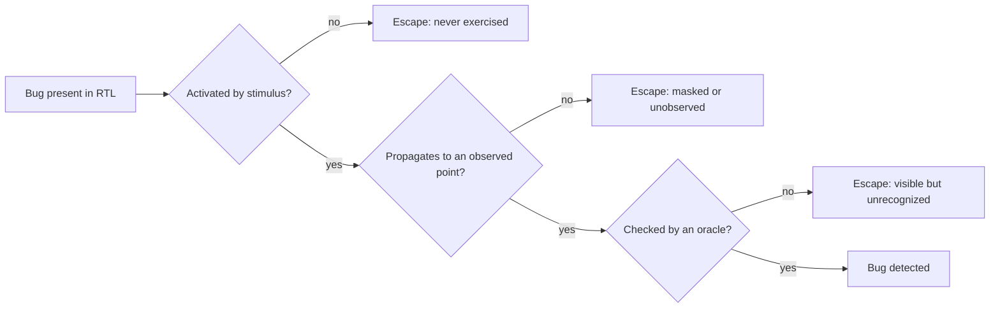

# 3. The Verification Problem

The first question a verification plan for the reference SoC's DMA engine must answer is what *testing all the cases* costs on a block of two channels and a few registers. Each channel exposes 192 bits of architecturally visible state and the pair 384, so the register states number 2 to the 384th power, roughly 10 to the 115th, and stripping the sixteen read-only status bits still leaves 2 to the 368th programmable. And that counts only the *register* values: §3.1 prices the register map, the backend FIFO, the product of the two channels and the input history that reaches them. Exhaustive testing of this block is therefore out of reach, and every competent verification plan is built on top of that answer.

### Chapter map

§3.1 computes the state space and shows why exhaustive verification is impossible and what formal verification changes about that; §3.2 develops controllability and observability; §3.3 the oracle problem; §3.4 the pivot from completeness to managed risk.

## 3.1 The state-space explosion

A synchronous digital design is a finite-state machine: a set of flip-flops and memory bits (the state), combinational logic that computes the next state from the current state and the inputs, and outputs. Finite invites the thought that the states can all be visited, but the arithmetic rules it out, because each state bit doubles the number of possible states and a design with *n* state bits has 2<sup>n</sup> of them [cit:B3]. Even a 256-bit RAM, thirty-two bytes of storage, already yields about 2<sup>256</sup> possible contents, and exhaustive simulation of all input combinations is "practically impossible" for designs of any realistic size [cit:B6]; the reference SoC's 512 KB SRAM holds over four million state bits, and the core alone, at ~50k gates, carries a few thousand.

Exhaustive testing of nontrivial designs is therefore generally infeasible, so testing provides at best *probabilistic* assurance that the design is correct [cit:P20]. Simulation visits only a small fraction of a system's possible configurations, which is why the discovery of bugs leans heavily on someone's expertise in choosing *which* few configurations to visit [cit:B3], and why Bergeron states the consequence in one sentence: "simulation can show only the presence of bugs, never prove their absence" [cit:B2].

### Worked example: the state space of one DMA channel

A single channel of the reference SoC's DMA engine is the block a schedule might reasonably call "simple." Its frontend exposes this per-channel programming interface ({ref: dma_channel_registers}):

{table: dma_channel_registers} The per-channel programming interface of the reference SoC's DMA engine: each register, its width in bits, and the role it plays in programming or reporting a transfer. The widths rather than the register count are what the worked example prices — they sum to the 192 bits of architecturally visible state a single channel exposes.

| Register | Width | Role |
|---|---|---|
| `SRC_ADDR` | 32 | source base address |
| `DST_ADDR` | 32 | destination base address |
| `NUM_BYTES` | 32 | bytes per row (1D length) |
| `SRC_STRIDE` | 32 | signed source row stride (2D) |
| `DST_STRIDE` | 32 | signed destination row stride (2D) |
| `NUM_REPS` | 16 | row count for 2D transfers |
| `CFG` | 8 | enable, 1D/2D, fixed-address flags, IRQ enables |
| `STATUS` | 8 | busy, done, error code from the AXI backend |

That is 192 bits of architecturally visible state, or 2<sup>192</sup> ≈ 6.3 × 10<sup>57</sup> distinct register configurations for *one channel*, and no simulation farm reaches a space of that size at any rate: at one million new configurations per second per machine, generous by an order of magnitude for RTL simulation of this block, a thousand machines together cover 10<sup>9</sup> configurations per second, and even the cross-product of just the two address registers, 2<sup>64</sup> ≈ 1.8 × 10<sup>19</sup> pairs, would keep that farm busy for almost six centuries.

And the register file is the *shallow* part of the problem:

- **Internal state.** The midend legalizer and the AXI backend hold their own state: a modest 16-entry × 64-bit datapath FIFO alone contributes 1024 bits, or 2<sup>1024</sup> ≈ 10<sup>308</sup> configurations, dwarfing the register space by 250 orders of magnitude; pointers, outstanding-transaction counters and the splitter's working registers come on top.
- **Two channels.** The canonical DMA bug of this book, the 2D negative-stride mis-legalization from Chapter 1, manifests *only when channel 1 is also active*, so bugs of this kind live in the product of the two channels' states: 2<sup>384</sup> ≈ 3.9 × 10<sup>115</sup>.
- **Sequence, not just state.** A state is only meaningful if a legal input history can reach it, and the input history space is larger still, because each cycle the environment chooses valid/ready handshakes, response codes, and back-pressure on several AXI channels: call it ten binary choices per cycle, so a thousand-cycle test is one path out of 2<sup>10000</sup>. Which states are actually *reachable* is not even known a priori, since computing the reachable set is the job formal tools take on, and where they hit their own wall.

As transistor budgets grow, with some fixed fraction of each new chip spent on state elements, the verification problem grows not linearly with design size but exponentially [cit:B3], and this is the engine behind the "verification gap" of Chapter 1: design capacity compounds, verification capacity does not, and the gap widens [cit:B3,T2]. A physical number sharpens this: simulation models run roughly a million times slower than the finished chip, so even months of simulation on many machines examine only a few *minutes* of the device's operating life [cit:T2]. That is an order-of-magnitude claim, because where a simulator lands against silicon depends on design size, on how much of the system is modelled and on how much instrumentation is compiled in, and the band this book declares runs from tens of thousands at one end to a billion at the other, with this figure in its middle; on any figure in that band, the campaign samples a vanishing fraction of the part's operating life.

### Abstraction shrinks the space, and it is still too big

The standard first response to these numbers is correct: *most of those states are equivalent.* For the legalizer's control logic, a source address of `0x1000_0004` and `0x2000_0004` behave identically, because what matters is the offset within the 4 KB page, the length relative to burst and page boundaries, and the sign of the stride; so an expert partitions each input dimension into equivalence classes and takes the cross-product of classes instead of bits. For one channel of the DMA the classes come out like this ({ref: dma_equivalence_classes}):

{table: dma_equivalence_classes} One DMA channel after expert abstraction: each input dimension partitioned into the equivalence classes a skilled verifier would treat as behaving alike, with the number of classes in each. The counts multiply, so the figure to read off the table is their product — about nine million cases, no longer cosmological and still far beyond any hand-written suite.

| Dimension | Expert equivalence classes | Count |
|---|---|---|
| source offset in 4 KB page | aligned / near-boundary / mid-page… | ~16 |
| destination offset in page | same | ~16 |
| length | sub-beat, one beat, sub-burst, exact burst, multi-burst, crosses 0/1/2+ pages | ~10 |
| stride | positive/negative × smaller/equal/larger than row, zero | ~7 |
| repetitions | 1, 2, many, max | ~4 |
| other channel | idle / active same bank / active other bank / erroring | ~4 |
| backend back-pressure | ready delay 0…7 cycles | ~8 |
| error response | none / read error / write error / both | ~4 |

The product is about nine million cases, after an aggressive abstraction that already embodies judgment about what "matters" and is therefore itself a place where bugs hide, since a class boundary drawn wrongly is a corner nothing will ever test. Nine million is far beyond directed testing, because a team writing and maintaining even a thousand hand-crafted tests is exceptional, and Chapter 1's escape data shows what the untested residue does. This double reduction, from 10<sup>57</sup> raw states to 10<sup>6</sup>–10<sup>7</sup> *meaningful* cases to some *sampled and measured* subset, is the intellectual structure of simulation-based verification: first abstraction, then stimulus automation (constrained random, Chapter 9), then measurement (coverage, Chapter 6). Since exhaustive simulation is impossible, a sense of *relative* completeness is established through a coverage metric, and defining that metric is "a selective, and thus subjective, process" [cit:B6], so the metric reports how much of what was chosen for measurement has been exercised, not how much of the design's behavior has been verified, and escapes live in the gap between the two.

### Formal verification changes the shape of the problem

Formal verification solves the problem partly, and the shape of that "partly" matters for the rest of the book. Formal property verification does not sample the state space but reasons about all of it, using symbolic representations and mathematical proof, so a proven property holds for *every* reachable state and input sequence, not the visited ones [cit:P20]. Model checking is an exhaustive state-space search made tractable by clever data structures, but its worst-case cost is exponential in the number of storage elements, so the *state explosion problem* reappears in formal form [cit:B6], and in practice this restricts full proofs to small or well-abstracted targets (arbitration, interface protocols, control kernels) while simulation remains the mainstay of verification for large designs [cit:B6]. A directory-based coherent hub shows what *abstracted* is doing there: the MESI state of every line in every cache is a product space no tool will enumerate, so the proof runs against a model cut down to two caches and one address, small enough to converge and still large enough to contain the livelock and starvation cases that make coherence worth proving. Bounded proofs, which explore only up to a fixed number of cycles, state the limit outright, since the property is guaranteed only within the bound [cit:T1], and one experienced practitioner considers it self-evident that formal verification cannot fully investigate all the functionality of a real circuit [cit:T2].

A rigorous discipline pushes further: Bormann's *complete verification*, in which a completeness checker proves that a set of operation properties leaves no verification gaps. Industrial projects using it reported that almost all such modules functioned correctly after fabrication, the few overlooked faults being traced to misapplication of the methodology [cit:T2], and that qualifier is part of the result rather than a footnote to it. The provenance is specific: regular productive use at Siemens and at Infineon from 1999, on a project list whose only named part is the Infineon TriCore2 automotive processor [cit:T2].

It is the strongest counterexample to "completeness is impossible," and Chapter 14 treats it with respect, but it took a different way of writing specifications, a dedicated methodology, and effort concentrated on selected modules, so completeness at that standard is a *purchasable* property for critical blocks rather than an ambient property of chip projects. For the SoC as a whole (hardware, firmware, three clock domains, analog at the edges) the verification problem stands.
## 3.2 Controllability and observability

A bug is not found when it exists; it is found when three things happen in sequence. The stimulus must drive the design into the buggy condition, which *activates* the bug; the wrong value must travel from where it was born to somewhere the environment can see it, which is how it *propagates*; and something there must know the value is wrong, which is how it is *checked*. If any link breaks, the bug survives the test that technically "executed" it, which is why simulation logs full of passing tests routinely contain activated bugs that propagated nowhere and propagated errors that nothing checked. {ref: bug_detection_chain} locates the escape at each link.



{figure: bug_detection_chain} The three-link chain a bug must survive to be found — activated by stimulus, propagated to an observed point, checked by an oracle — with the escape that follows from breaking each link. The three escapes are distinct failure modes rather than degrees of one; §3.3 takes up the third, where the wrong value is visible and nothing recognizes it as wrong.

**Controllability** is the ability to steer the design into a given internal condition using only drivable interfaces, **observability** the ability to see the consequences of an internal event at the interfaces that can be watched. Both degrade with distance: pure black-box verification, which drives and observes a design only through its external interfaces with no knowledge of the implementation, "suffers from an obvious lack of visibility and controllability", since it is often difficult to set up an interesting state combination or to isolate a piece of functionality, and equally difficult to observe the internal response [cit:B2]. That is its cost, not an argument against black-box testing, which checks the design against its specification rather than its own structure.

The trade-off that follows is that **smaller verification targets offer greater controllability and observability** [cit:B2]. At the block level the DMA legalizer's inputs are the testbench's outputs, so any descriptor can be presented on any cycle, any handshake stalled, any error response injected. Wrapped inside the SoC, the same legalizer is reachable only through the core executing driver code through the crossbar under arbitration, so most of its input space is no longer directly reachable. Which features are verified standalone and which only integrated is a planning decision: Chapter 5 assigns every plan row to a level, Chapter 8 builds the environments that serve them, and the criterion is that a feature must be verified at a level where the testbench can both provoke it and see it fail [cit:B2].

> **Scenario.** The reference SoC's core has a custom SIMD extension in which a bug corrupts the saturation flag, but only when an interrupt is taken in the same cycle the SIMD instruction writes it (a canonical bug of this book). **Approach.** Verification runs at core level with ISS co-simulation and *random* interrupt injection: the testbench fires IRQs at random cycles for thousands of runs and the checker compares architectural state instruction by instruction. **Why.** The buggy condition is a one-cycle coincidence between two independently-timed events, so it is a controllability problem: at SoC level, aligning a timer interrupt with one specific instruction inside a firmware loop is nearly impossible to arrange deliberately and worse to reproduce. At core level with direct IRQ lines, randomization can exercise the coincidence, and the co-sim oracle checks a corrupted flag in the same cycle it commits. (Compare Chapter 9 on why random stimulus finds coincidences humans do not imagine.)

Observability failures are quieter and therefore more dangerous. Two more of the book's canonical bugs break the last two links. The UART's RX overrun flag is never cleared if software reads the status register in the same cycle a stop-bit error arrives, and for months that condition was *activated* in regressions while no checker looked at the flag afterwards: visible state, never checked. The event unit's retention register loses its configuration on power-domain re-entry when a wake event races isolation release, and plain RTL simulation did not model the power domains, so the corruption had *nothing to propagate through* and was caught only by power-aware gate-level simulation (Chapter 19).

A structurally weak link is answered by changing the design, and the grey-box prescriptions are standard practice: if observability is the problem, add sample points readable through memory-mapped registers; if controllability is the problem, add provisions to force error and exception conditions that are otherwise prohibitively slow to provoke [cit:B2]. On the reference SoC, the DMA's per-channel error code in `STATUS` and the event unit's readback path exist because someone asked at design time how verification would see them. A NAND flash controller carries an error-injection register into its LDPC ECC pipeline for the same reason: the multi-bit patterns that exercise the uncorrectable path cannot be produced from the flash interface at any rate a regression can wait for. Assertions serve the same end from inside: bound into the RTL, they monitor internal signals and catch violations locally, which is why assertion-based verification is credited with improving observability and debugging [cit:B6], flagging the error at its birthplace rather than a thousand cycles later.

The controllability and observability budget is the best a project will ever have and only shrinks: an RTL simulator makes virtually any internal signal observable at any time; FPGA prototyping falls to a few thousand pre-selected signals, chosen before the bitstream is built; and in silicon, on the order of a hundred signals reach trace buffers and pins, with controllability limited to the configuration hooks the architecture defined in advance [cit:P21]. These limitations are one of the key factors distinguishing post-silicon validation from everything pre-silicon [cit:P21]. A bug not caught in simulation must be caught somewhere it is orders of magnitude harder to see (see Chapter 20). This asymmetry, as much as mask costs, is the economic argument for pre-silicon rigor.

## 3.3 The oracle problem

Where controllability and observability are solved, so that the stimulus reaches the corner and the response emerges at a monitored interface, the harder question is **how anyone knows the response is right**. A simulator produces what the design *did*, while correctness is a relation between that and what it *should have done*, and "should" lives in a specification written in prose, in the architect's head, or nowhere. The mechanism that pronounces pass or fail is the **oracle**, and building one is routinely harder than building the stimulus. The asymmetry is stark: deciding how to apply stimulus is relatively easy, since its timing and content are fully controlled, but verifying the response is difficult, because it requires planning how to determine the expected response and then how to check the design against it [cit:B2].

A testbench without a programmed oracle is a waveform generator that finds bugs only if a human stares at the output, which does not scale past the first afternoon. Everything in this book assumes **self-checking** environments, where the verdict is computed rather than eyeballed. The practical question is *which* oracle: every practical oracle is partial, checking a projection of correctness rather than correctness itself, and the craft is in combining them so their blind spots do not overlap.

**Reference models** are the most complete oracle: an independent executable of the specification runs on the same stimulus, and outputs are compared continuously [cit:B2]. The catch is that reference models rarely exist, except where the specification *is* an executable model, which is the typical situation for processors, where the model is golden by definition [cit:B2]. The reference SoC's core is verified this way: an instruction-set simulator (ISS), a fast software model of the architecture, runs in lockstep with the RTL and every committed instruction's architectural state is compared. The ISS defines *architectural* correctness, so a bug that corrupts no architectural state (a performance bug, a speculative access that violates a protocol, a security leak through timing) is invisible to it by construction. A video codec is the other classic definitional oracle, since the standard ships a bit-exact reference decoder, and the projection is just as narrow: bit-exact output says nothing about rate control, about latency, or about what the encoder does when its line buffer back-pressures.

**Scoreboards** are the workhorse where no reference model exists: for data-moving designs the testbench applies the specified *transform* to each input transaction (for the DMA: legalize, split, re-address), stores the expected output transactions in queues and compares actual outputs against them as they emerge, checking at end of test that nothing expected was lost [cit:B2]. The projection is narrower: a scoreboard proves data integrity and completeness but is typically blind to *when* things happened (latency, throughput, starvation, so an arbiter can be grossly unfair past a data-integrity scoreboard [cit:B2]) and to *how* (a protocol violation that still delivers correct data sails through).

**Assertions** are oracles for local rules: properties bound inside the design that check invariants and protocol obligations every cycle, on every test that runs [cit:B2,B6]. They are the sharpest partial oracle, detecting at the point of origin, over the narrowest scope of one rule each.

**Offline and human comparison** survives at the edges: some responses are easy for a human and awkward for a program (a human recognizes "a filled red circle" instantly), and some flows dump outputs for post-simulation comparison against reference files [cit:B2]. It should be used sparingly, because a verdict arriving after simulation ends arrives far from the state that caused it, and errors are best detected while the model is still near the failing state, when diagnosis is cheap [cit:B2].

### Worked example: partial oracles on the DMA backend

One rule from the AXI protocol sits at the heart of this book's canonical DMA bug: no burst may cross a 4 KB address boundary (Arm IHI 0022H.c §A3.4.1 [cit:S18], whose words are "A burst must not cross a 4KB address boundary."). As an assertion bound into the DMA's AXI write channel, the same property Chapter 2 arrived at, qualifiers and all:

<!-- slang: fragment - the canonical property p_no_4kb_crossing quoted as an artifact; the AW channel signals it names belong to a module this excerpt does not carry -->

```systemverilog
// No INCR write burst emitted by the DMA backend may cross a 4 KB page,
// regardless of how the midend legalized the transfer. (FIXED bursts hold
// their address; WRAP bursts stay inside their aligned container.)
// 16-bit arithmetic on purpose: an illegal awsize (>3 on this 64-bit bus)
// must overflow the comparison and fail — not wrap silently and pass.
property p_no_4kb_crossing;
  @(posedge clk) disable iff (!rst_n)
  (awvalid && awready && (awburst == 2'b01)) |->
    (16'(awaddr[11:0]) + ((16'(awlen) + 16'd1) << awsize)) <= 16'd4096;
endproperty
a_no_4kb_crossing : assert property (p_no_4kb_crossing);
```

What this oracle does and does not establish ({ref: assertion_projection}):

{table: assertion_projection} What the 4 KB-crossing assertion of the worked example establishes about the DMA backend and what it leaves untouched, one question per row answered for that single property. Only the first row is a yes, and the vacuity row is the one to dwell on: a backend that hangs forever satisfies the property without ever exercising it.

| Question | Does `a_no_4kb_crossing` answer it? |
|---|---|
| Did any issued burst cross a 4 KB boundary? | **Yes** — every INCR burst, every cycle, every test; FIXED and WRAP bursts cannot cross by construction. |
| Did the split bursts carry the right data? | No — it never looks at data. |
| Do the split bursts add up to the programmed transfer? | No — it sees bursts one at a time, not their sum. |
| Does a legal transfer ever complete at all? | No — a backend that hangs forever satisfies it *vacuously*: the implication never triggers, so the property never fails. |
| Was the *read* channel also legal? | No — separate assertion needed. |

The canonical bug, negative-stride 2D rows mis-split at the boundary, illustrates the division of labor. If the legalizer emits a burst that *crosses* the boundary, the assertion fires on the spot. But in the actual bug the emitted bursts were individually legal and the *data* landed wrong, so only the scoreboard's byte-accurate memory model, comparing final memory contents against the transform of the programmed descriptor, could catch it. Each covered the other's blind spot, so the question is which projection of correctness each oracle owns, and whether any is unowned.

One failure mode defeats *all* oracles at once, the **common-mode error**: every oracle encodes someone's reading of the specification. If the scoreboard author misreads the same ambiguous sentence the designer misread (whether the stride applies before or after the first row), model and design agree, the test passes, and the bug is structurally invisible to the environment. Specification issues (changing, incorrect, incomplete specs) are among the leading root causes of the functional flaws that force respins [cit:R2]. The defenses are organizational rather than technical: independent interpretation (the verifier reads the spec rather than the RTL, Chapter 2), review of the oracle itself, and treating every model/design disagreement as a specification question whose resolution belongs in the spec. A passing regression establishes that the design and the testbench agree, not that either of them is right.

## 3.4 From exhaustive to risk-driven verification

The three results compound: not all of the state space can be visited, not all of the visited fragment can be reached or seen, and not all of what is seen can be checked. Verification is therefore never truly complete: it can show the presence of errors, not their absence, and given enough time an error *will* be found. The effort spent identifying an error must be weighed against its likely severity [cit:B2]. 

The governing analogy is statistical hypothesis testing [cit:B2]: the hypothesis "my design is correct" cannot be proved, only subjected to trials capable of falsifying it, with confidence calibrated to the power of those trials. The formal side says the same thing: the weakness of all observation-based quality assurance is that errors are found only with certain *probabilities* [cit:T2].

**First: effort must go where risk is, not where habit is.** Risk is the product of two estimates: how likely a bug is, and what its escape would cost. Likelihood concentrates in novelty and intersections: new logic over silicon-proven reuse, corner-dense arithmetic over regular datapath, cross-domain seams (clock, power, block boundaries) over interior logic, volatile spec areas over frozen ones. Cost concentrates where escapes are expensive to find and fix downstream: unworkaroundable functions, safety paths, anything whose post-silicon observability is near zero [cit:P21]. Verification effort is expensive: roughly 70 % of ASIC R&D cost by the classic "verification gap" complaint, as stated in 2009 [cit:T2], with verification headcount growing at 12.5 % CAGR against 3.7 % for design across 2007–2014 [cit:P17]; and the 14 % first-silicon success rate of 2024 [cit:R2] shows that spending *more* is not, by itself, working. The answer is to spend *aimed*: rank the features by risk and let the ranking drive the depth of each verification, the technique and the order of work. Made explicit and traceable, that ranking is the verification plan (Chapter 5).

**Second: techniques must be matched to the shape of each risk.** The techniques of Parts III–V are partial answers with different profiles along this chapter's three axes, not competitors. Random simulation covers the easy-to-reach majority of scenarios quickly but leaves hard-to-activate corners, and those corners root-cause the industry's bug escapes [cit:P10]. Directed tests reach a known corner precisely but cost engineer-days each, which is why their automated generation is a research field of its own [cit:P10]. Formal proof is exhaustive with respect to the properties written, on the blocks where it converges [cit:B6,P20]. 

> **Scenario.** The reference SoC's finite verification effort is allocated across the chip. **Approach.** The crossbar's ordering rules go to formal property verification: they are control-dominated and protocol-defined, a write-interleaving bug would leave the chip unusable with no workaround, and per-property exhaustiveness is worth the setup cost on a block that size [cit:B6]. The DMA gets a constrained-random environment with a byte-accurate scoreboard and protocol assertions, because its risk lives in descriptor corner cases no one can enumerate by hand. The core gets ISS co-simulation with random interrupt injection, because its oracle problem (every instruction, every architectural register) is only tractable against an executable golden model [cit:B2]. The UART, reused and silicon-proven, gets a thin directed suite, including one test written from a firmware bug report about the overrun flag. The event unit's retention behavior is deferred to power-aware gate-level simulation, and the deferral is *written in the plan* as an accepted RTL-simulation gap. **Why.** Every allocation follows risk: depth increases with novelty × escape-cost, silicon history justifies reuse credit, and the plan records each known blind spot with its owner and scheduled check.

The pivot redefines what "done" means, the subject of Part II. If completeness is impossible, *done* cannot mean "verified everything"; it means "reached the agreed evidence threshold on every planned item, and the risks we chose not to retire are enumerated and accepted by people entitled to accept them." Coverage supplies the evidence, and since a coverage model is a selective, subjective definition of relative completeness [cit:B6], the model must be reviewed and not just filled. Sign-off (Chapter 7) is then a risk-acceptance decision, not a certificate of correctness. A tape-out deadline does not establish that residual risk has been reviewed. In 2024, 86 % of projects required a respin [cit:R2]; that rate alone does not establish the cause.

### In practice

Without explicit risk ranking, the work completed by tape-out determines verification scope, leaving no record of whether the unverified features were lower priority. The explicit alternative is a risk register kept next to the vplan and re-ranked when the spec changes, so that schedule pressure cuts *named items in review*, converting "we ran out of time" into "we accepted risk X, signed by Y." Reviewing RTL while merging scoreboard code unreviewed leaves the oracle unchecked, so a checker defect can let incorrect results pass throughout a regression. Crediting a scenario as covered when no oracle checks its result confuses activation with checking.

### Pitfalls

1. **Promising completeness.** The plan says "fully verified" and management hears "no bugs possible." Cure: report coverage of a *stated model* with its exclusions, and never write "complete" without its object [cit:B6].
2. **Counting passing tests as progress.** Ten thousand green tests with weak oracles measure agreement, not correctness. Cure: track coverage and bug-discovery curves, and audit what each test checks.
3. **Activation without a checker.** A scenario is marked covered because stimulus reached it, but no oracle owned it. Cure: every vplan item names its oracle, the check and not the stimulus (Chapter 5).
4. **Verifying at the wrong level.** A block corner is deferred to SoC tests where it is uncontrollable and unobservable. Cure: choose the level per feature from controllability/observability analysis, not from schedule convenience [cit:B2].
5. **Oracle derived from the design.** The model was written by watching RTL waveforms, so it reproduces the design's misunderstandings. Cure: derive oracles from the specification independently, treating every mismatch as a spec question first [cit:R2].
6. **Uniform effort.** Every block gets the same depth regardless of novelty or escape cost, over-verifying reused IP while the new accelerator starves. Cure: explicit risk ranking drives the budget, and the ranking is reviewed like code.

### Summary

- The state space of even a trivial block is beyond enumeration: one DMA channel's 192 bits of architecturally visible state give ~10<sup>57</sup> configurations [cit:B3,B6].
- Simulation can show the presence of bugs, never their absence; testing yields probabilistic assurance, not proof [cit:B2,P20].
- Finding a bug requires activation, propagation and checking; controllability and observability bound the first two and both collapse progressively from simulation to FPGA to silicon [cit:B2,P21].
- Every practical oracle (reference model, scoreboard, assertion) checks a projection of correctness, so they are combined until blind spots do not overlap, with a guard against common-mode spec misreadings [cit:B2,B6,R2].
- Formal verification is exhaustive per property, not per design: it relocates the wall (state explosion, bounded proofs, chosen properties) rather than removing it [cit:B6,T1,T2].
- Residual risk must be identified and bounded before it is accepted; verification effort follows likelihood × escape cost [cit:B2].
- "Done" is a risk-acceptance decision made in the open; coverage is its evidence and the plan is its contract (Chapters 5–7).

### Exercises

**Exercise 3.1 (calculation).** Add the widths in the per-channel register table of §3.1 and confirm the figure the section reads off that table for one channel. Identify the register the chapter sets aside when its opening counts programmable bits, and compute the programmable bit count of one channel and of the two-channel pair. State which of the two counts the predicate "architecturally visible" attaches to, and why the two are not interchangeable in an expression of the form two to the Nth.

**Exercise 3.2 (calculation).** Multiply the class counts of the equivalence-class table of §3.1 and compare the product with the figure the section reads off that table. Take the size of the hand-written suite §3.1 calls exceptional, assume one case per test, and compute the fraction of the product such a suite covers. State what the remainder is, in the terms §3.1 uses for it.

**Exercise 3.3 (judgement).** A schedule proposal moves verification of the SIMD saturation-flag corruption of §3.2 out of the core-level environment and into SoC-level firmware tests. Decide which of the chapter's two axes the proposal degrades, and give the mechanism of the degradation as §3.2 states it. Give the criterion §3.2 sets for assigning a feature to a level, and name the pitfall the proposal matches.

**Exercise 3.4 (judgement).** A block-level run of the DMA backend reports no failure of `a_no_4kb_crossing` and no failure of anything else. State the two readings that report admits, using the projection table of §3.3. Name the oracle §3.3 assigns to the question the assertion leaves unanswered, and give the check that oracle performs at end of test.

**Exercise 3.5 (judgement).** The DMA specification leaves it ambiguous whether the row stride applies before or after the first row, and the scoreboard's author reads that sentence the way the designer read it. The regression passes on every seed. State what the passing regression establishes, name the failure mode §3.3 gives it, and give the defenses that section prescribes. Explain why adding a further oracle of the same kind is not among them.

**Exercise 3.6 (artifact).** Read the plan row below and state what its status line is entitled to claim. Name the field left empty, the pitfall of the chapter's list the row commits, and the oracle §3.3 shows to be the only one that catches the bug named in the feature line. Give the reason §3.3 supplies for that oracle being the only one.

```text
plan row     DMA-2D-A
feature      2D row straddling a 4 KB page, negative stride,
             other channel concurrently active
level        block
stimulus     constrained random descriptors, seeds swept nightly
oracle
coverage     cross cell hit
status       covered
```

### Further reading

**From the corpus.** Bertacco's opening chapters are the clearest short account of why scalability is *the* verification problem [cit:B3]. Kern & Greenstreet's survey maps formal verification's foundations and limits [cit:P20]. Yuan's introduction walks the whole technique landscape (simulation, coverage, model checking, symbolic methods) with unusual candor about each one's wall [cit:B6]. Bergeron's early chapters develop black/white/grey-box verification, levels of verification and self-checking strategy [cit:B2]. Bormann's dissertation is the serious counterpoint: how far "complete verification" can be pushed, and at what methodological price [cit:T2]; Schwarz shows the same formal machinery applied across the hardware/firmware boundary [cit:T1]. Jayasena & Mishra survey automated directed-test generation, the modern response to the corner-case residue [cit:P10], and Mishra's post-silicon tutorial quantifies how observability decays after tape-out [cit:P21].

**Not in the corpus** (cited on reputation, not verified for this book): Wile, Goss & Roesner, *Comprehensive Functional Verification* (Morgan Kaufmann, 2005), chapter 1, for an industrial framing of the verification problem and the "verification cycle"; Meyer, *Principles of Functional Verification* (Newnes, 2003), for self-checking and the limits of simulation.
