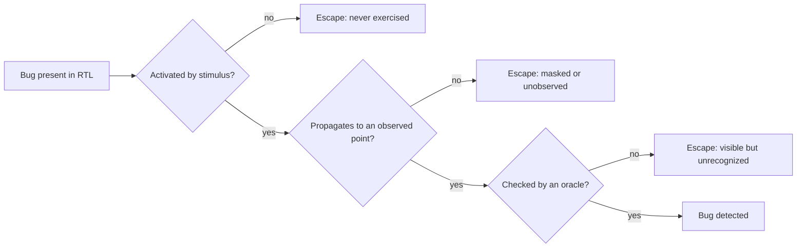

# 3. The Verification Problem

The first question a verification plan for the reference SoC's DMA engine must answer is what *testing all the cases* costs on a block of two channels and a few registers. The register map answers it. Each channel is programmed through five 32-bit registers — source address, destination address, byte count, and two signed strides for 2D transfers — plus a 16-bit repetition count and a byte of configuration flags; another byte of status comes back. That is 192 bits of architecturally visible state per channel. Two channels: 384 bits. The number of distinct register states is 2 to the 384th power — roughly 10 to the 115th, more configurations than there are atoms in the observable universe; strip the sixteen read-only status bits and you are still left with 2 to the 368th you can program deliberately. And that counts only the *register* values: not the FIFO in the transfer backend, not the timing of back-pressure from the crossbar, not the interleaving of the two channels, not the moment an error response arrives. So the honest answer is: longer than the remaining lifetime of the universe, using every computer ever built. Every competent verification plan is built on top of that answer. This chapter is about why the answer is what it is — and what the discipline does about it.

### Chapter map

- §3.1 establishes why exhaustive verification is not merely expensive but physically impossible, computes a state space, and says what the numbers mean.
- §3.1 also establishes that formal verification changes the shape of the problem but does not abolish it.
- §3.2 establishes why a bug must be *activated*, *propagated*, and *checked* to be found, and how controllability and observability limit the first two.
- §3.3 develops the oracle problem: knowing what the design did is useless without knowing what it *should* have done, and every practical oracle is partial.
- §3.4 makes the intellectual pivot the rest of this book rests on: from pursuing completeness to managing risk — explicitly, measurably, honestly.

## 3.1 The state-space explosion

A synchronous digital design is a finite-state machine: a set of flip-flops and memory bits (the state), combinational logic that computes the next state from the current state and the inputs, and outputs. Finite means countable — and countable invites a dangerous thought: *if the states are finite, we can visit them all.* The arithmetic kills the thought immediately. Each state bit doubles the number of possible states; a design with *n* state bits has 2<sup>n</sup> of them [cit:B3]. A deliberately humble example makes the point: even a 256-bit RAM — thirty-two bytes of storage — already yields about 2<sup>256</sup> possible contents, and exhaustive simulation of all input combinations is "practically impossible" for designs of any realistic size [cit:B6]. The reference SoC's 512 KB SRAM holds over four million state bits. The core alone, at ~50k gates, carries a few thousand. Exhaustive enumeration is not a matter of budget. It is off the table before the project starts.

The consequence is plain: exhaustive testing of nontrivial designs is generally infeasible, so testing provides at best *probabilistic* assurance that the design is correct [cit:P20]. Simulation visits only a small fraction of all the possible configurations of a system, and the discovery of bugs therefore leans heavily on someone's expertise in choosing *which* few configurations to visit [cit:B3]. Bergeron compresses the whole predicament into one sentence you should memorize: simulation can show only the presence of bugs, never prove their absence [cit:B2].

It is worth feeling how fast the wall arrives, so let us do the arithmetic properly on the smallest interesting block we have.

### Worked example: the state space of one DMA channel

Take a single channel of the reference SoC's DMA engine — the block a schedule might reasonably call "simple." Its frontend exposes this per-channel programming interface:

{table: dma_channel_registers} The per-channel programming interface of the reference SoC's DMA engine: each register, its width in bits, and the role it plays in programming or reporting a transfer. The widths rather than the register count are what the worked example prices — they sum to the 192 bits of architecturally visible state a single channel exposes.

| Register | Width | Role |
|---|---|---|
| `SRC_ADDR` | 32 | source base address |
| `DST_ADDR` | 32 | destination base address |
| `NUM_BYTES` | 32 | bytes per row (1D length) |
| `SRC_STRIDE` | 32 | signed source row stride (2D) |
| `DST_STRIDE` | 32 | signed destination row stride (2D) |
| `NUM_REPS` | 16 | row count for 2D transfers |
| `CFG` | 8 | enable, 1D/2D, fixed-address flags, IRQ enables |
| `STATUS` | 8 | busy, done, error code from the AXI backend |

That is 192 bits of architecturally visible state: 2<sup>192</sup> ≈ 6.3 × 10<sup>57</sup> distinct register configurations for *one channel*. Now put a number on "visiting" them. Suppose a block-level simulation can drive the channel into one million new configurations per second — generous by an order of magnitude for RTL simulation of this block — and suppose you run a farm of one thousand such simulations in parallel, forever. That is 10<sup>9</sup> configurations per second. The universe is about 4.4 × 10<sup>17</sup> seconds old; a farm running since the Big Bang would have visited 4.4 × 10<sup>26</sup> configurations — a fraction of the space around 10<sup>-31</sup>. Not one percent. Not one billionth. A fraction whose denominator, written out in full, runs to thirty-two digits. Even the cross-product of just the two address registers — 2<sup>64</sup> ≈ 1.8 × 10<sup>19</sup> pairs — would take that thousand-machine farm almost six centuries.

And the register file is the *shallow* part of the problem:

- **Internal state.** The midend legalizer and the AXI backend hold their own state: a modest 16-entry × 64-bit datapath FIFO alone contributes 1024 bits — 2<sup>1024</sup> ≈ 10<sup>308</sup> configurations, dwarfing the register space by 250 orders of magnitude. Add pointers, outstanding-transaction counters, and the splitter's working registers.
- **Two channels.** The canonical DMA bug of this book — the 2D negative-stride mis-legalization from Chapter 1 — manifests *only when channel 1 is also active*. Bugs of this kind live in the product of the two channels' states: 2<sup>384</sup> ≈ 3.9 × 10<sup>115</sup>.
- **Sequence, not just state.** A state is only meaningful if a legal input history can reach it, and the input history space is larger still. Each cycle, the environment chooses valid/ready handshakes, response codes, and back-pressure on several AXI channels — call it ten binary choices per cycle. A thousand-cycle test is one path out of 2<sup>10000</sup>. Which states are actually *reachable* is not even known a priori: computing the reachable set is precisely the job formal tools take on, and precisely where they hit their own wall (we return to this below).

The exercise scales with everything the industry does. The state space doubles with every added state bit, so as transistor budgets grow — with some fixed fraction of each new chip spent on state elements — the verification problem grows not linearly with design size but exponentially [cit:B3]. This is the engine behind the "verification gap" you met in Chapter 1: design capacity compounds, verification capacity does not, and the gap between the complexity of digital systems and our ability to verify them widens [cit:B3,T2]. A physical number sharpens this: simulation models run roughly a million times slower than the finished chip, so even months of simulation on many machines examine only a few *minutes* of the device's operating life [cit:T2]. Read that as an order-of-magnitude claim, because that is what it is: where a simulator lands against silicon depends on design size, on how much of the system is modelled and on how much instrumentation is compiled in, and other chapters, from a different source, quote a far larger ratio. Nothing in the argument turns on which figure you take: on any of them, the campaign samples a vanishing fraction of the part's operating life. Every hour your phone's SoC runs, it traverses more machine states than its entire verification campaign did.

### Abstraction shrinks the space — and it is still too big

The standard first response to these numbers is correct and instructive: *most of those states are equivalent.* For the legalizer's control logic, a source address of `0x1000_0004` and `0x2000_0004` behave identically; what matters is the offset within the 4 KB page, the length relative to burst and page boundaries, the sign of the stride. So an expert partitions each input dimension into equivalence classes and considers the cross-product of classes instead of bits. Try it, honestly, for one channel of the DMA:

{table: dma_equivalence_classes} One DMA channel after expert abstraction: each input dimension partitioned into the equivalence classes a skilled verifier would treat as behaving alike, with the number of classes in each. The counts multiply, so the figure to read off the table is their product — about nine million cases, no longer cosmological and still far beyond any hand-written suite.

| Dimension | Expert equivalence classes | Count |
|---|---|---|
| source offset in 4 KB page | aligned / near-boundary / mid-page… | ~16 |
| destination offset in page | same | ~16 |
| length | sub-beat, one beat, sub-burst, exact burst, multi-burst, crosses 0/1/2+ pages | ~10 |
| stride | positive/negative × smaller/equal/larger than row, zero | ~7 |
| repetitions | 1, 2, many, max | ~4 |
| other channel | idle / active same bank / active other bank / erroring | ~4 |
| backend back-pressure | ready delay 0…7 cycles | ~8 |
| error response | none / read error / write error / both | ~4 |

The product is about nine million cases — after aggressive, skilled abstraction that already embodies judgment about what "matters" (and is therefore already a place where bugs can hide: every class boundary you draw wrongly is a corner you will never test). Nine million is no longer cosmological, but it is far beyond directed testing: a team writing and maintaining even a thousand hand-crafted tests is exceptional, and Chapter 1's escape data shows what the untested residue does. This double reduction — from 10<sup>57</sup> raw states to 10<sup>6</sup>–10<sup>7</sup> *meaningful* cases to some *sampled and measured* subset of those — is the actual intellectual structure of simulation-based verification. The first step is abstraction; the second is stimulus automation (constrained random, Chapter 9); the third is measurement (coverage, Chapter 6). Name the bargain exactly: since exhaustive simulation is impossible, a sense of *relative* completeness is established through a coverage metric — and defining that metric is "a selective, and thus subjective, process" [cit:B6]. Keep the word *subjective* in view. Coverage does not measure how much of the design's behavior you verified; it measures how much of *what you decided to measure* you verified. The gap between those two is where escapes live.

### Doesn't formal verification solve this?

Partly — importantly — and the shape of "partly" matters for the rest of the book. Formal property verification does not sample the state space; it reasons about all of it, using symbolic representations and mathematical proof, so a proven property holds for *every* reachable state and input sequence, not the visited ones [cit:P20]. Model checking is, in essence, an exhaustive state-space search made tractable by clever data structures — and its worst-case cost is exponential in the number of storage elements: the *state explosion problem* is the same wall wearing formal clothes [cit:B6]. In practice this restricts full proofs to small or well-abstracted targets — arbitration, interface protocols, control kernels — while simulation remains the mainstay of verification for large designs [cit:B6]. A directory-based coherent hub shows what the word *abstracted* is doing there: the MESI state of every line in every cache is a product space no tool will enumerate, so the proof runs against a model cut down to two caches and one address — small enough to converge, and still large enough to contain the livelock and starvation cases that make coherence worth proving. Bounded proofs, which explore only up to a fixed number of cycles, are honest about this: the property is guaranteed only within the bound [cit:T1]. And one experienced practitioner considers it self-evident that formal verification cannot fully investigate all the functionality of a real circuit [cit:T2].

There is a rigorous discipline — Bormann's *complete verification* — that pushes further: a completeness checker proves that a set of operation properties leaves no verification gaps, and industrial projects using it reported that almost all such modules functioned correctly after fabrication, the few overlooked faults being traced to misapplication of the methodology [cit:T2]. It is the strongest counterexample to "completeness is impossible," and Chapter 14 treats it with respect. But note what it took: a different way of writing specifications, a dedicated methodology, and effort concentrated on selected modules. Completeness at that standard is a *purchasable* property for critical blocks, not an ambient property of chip projects. For the SoC as a whole — hardware, firmware, three clock domains, analog at the edges — the verification problem stands.

The industrial provenance of that discipline is specific, and so is its limit. Bormann reports complete verification in regular productive use at Siemens and at Infineon from 1999, on a project list whose only named part is the Infineon TriCore2 automotive processor; almost all the circuits verified that way worked after fabrication, and in the few projects where a fault was overlooked the escape was traced to human failure in applying the methodology [cit:T2]. Read the qualifier as part of the result, not as a footnote to it.

So the state space tells us exhaustiveness is out. The next two sections sharpen the problem: even for the states you *do* visit, finding a bug requires reaching it, seeing it, and recognizing it — three separate obstacles with three separate failure modes.

## 3.2 Controllability and observability

A bug is not found when it exists; it is found when three things happen in sequence. First the stimulus must drive the design into the buggy condition — the bug is *activated*. Then the wrong value must travel from where it was born to somewhere your environment can see it — it *propagates*. Finally, something at that point must know the value is wrong — it is *checked*. Break any link and the bug survives the test that technically "executed" it. Simulation logs full of passing tests routinely contain activated bugs that propagated nowhere, and propagated errors that nothing checked.



{figure: bug_detection_chain} The three-link chain a bug must survive to be found — activated by stimulus, propagated to an observed point, checked by an oracle — with the escape that follows from breaking each link. The three escapes are distinct failure modes rather than degrees of one; §3.3 takes up the third, where the wrong value is visible and nothing recognizes it as wrong.

The first two links have classical names. **Controllability** is your ability to steer the design into a given internal condition using only the interfaces you can drive. **Observability** is your ability to see the consequences of an internal event at the interfaces you can watch. Both degrade with distance: pure black-box verification — driving and observing a design only through its external interfaces, with no knowledge of the implementation — "suffers from an obvious lack of visibility and controllability": it is often difficult to set up an interesting state combination or to isolate a piece of functionality, and equally difficult to observe the internal response [cit:B2]. This is not an argument against black-box testing (which has the virtue of checking the design against its specification rather than against its own structure); it is a statement of its cost.

The single most consequential trade-off in testbench strategy follows directly: **smaller verification targets offer greater controllability and observability** [cit:B2]. At the block level, the DMA legalizer's inputs are your testbench's outputs — you can present any descriptor on any cycle, stall any handshake, inject any error response. Wrapped inside the SoC, the same legalizer can only be reached through the core executing driver code through the crossbar under arbitration; most of its input space is no longer *reachable by you* in any direct sense. Choosing levels of verification — what you verify standalone, what you verify only integrated — is a planning decision: Chapter 5 assigns every plan row to a level, and Chapter 8 builds the environments that serve them. But the criterion is already clear: a feature must be verified at a level where you can both provoke it and see it fail [cit:B2].

> **Scenario.** The reference SoC's core has a custom SIMD extension. A bug corrupts the saturation flag — but only when an interrupt is taken in the same cycle the SIMD instruction writes it (a canonical bug of this book). **Approach.** The core team verifies this at the core level with ISS co-simulation plus *random* interrupt injection: the testbench fires IRQs at random cycles for thousands of runs, and the co-simulation checker compares architectural state instruction by instruction. **Why.** This is a controllability problem: the buggy condition is a one-cycle coincidence between two independently-timed events. At SoC level, aligning a timer interrupt with one specific instruction inside a firmware loop is nearly impossible to arrange deliberately and worse to reproduce. At core level with direct IRQ lines, randomization turns the coincidence from a lottery into a statistical certainty — and the co-sim oracle guarantees that when the flag corrupts, it is *checked* the same cycle it commits. (Compare Chapter 9 on why random stimulus finds coincidences humans do not imagine.)

Observability failures are quieter and therefore more dangerous. Consider two more of the book's canonical bugs. The UART's RX overrun flag is never cleared if software reads the status register in the same cycle a stop-bit error arrives: for months the condition was *activated* in regressions, but no checker ever looked at the overrun flag after that sequence — visible state, never checked. And the event unit's retention register loses its configuration on power-domain re-entry when a wake event races isolation release: in plain RTL simulation the power-domain behavior wasn't modeled at all, so the corruption had *nothing to propagate through* — it escaped RTL simulation entirely and was caught only by power-aware gate-level simulation (Chapter 19). Same chain, different broken links.

When a link is structurally weak, competent teams change the design rather than heroically working around it. The grey-box prescriptions are standard practice: if observability is the problem, add sample points readable through memory-mapped registers; if controllability is the problem, add provisions to force error and exception conditions that are otherwise prohibitively slow to provoke [cit:B2]. On the reference SoC, the DMA's per-channel error code in `STATUS` and the event unit's readback path exist precisely because someone asked, at design time, "how will verification see this?" A NAND flash controller carries an error-injection register into its LDPC ECC pipeline for the same reason: the multi-bit error patterns that exercise the uncorrectable path cannot be produced from the flash interface at any rate a regression can wait for. Assertions serve the same end from inside: bound into the RTL, they monitor internal signals and catch violations locally, which is exactly why assertion-based verification is credited with improving observability and debugging [cit:B6] — the error is flagged at its birthplace, not after a thousand cycles of masking and mutation.

Finally, understand that the controllability/observability budget you enjoy in simulation is the best you will ever have. In an RTL simulator, virtually any internal signal is observable at any time; move the same design to FPGA prototyping and observability shrinks to a few thousand pre-selected signals, chosen before the bitstream is built; in actual silicon, you can observe on the order of a hundred signals routed to trace buffers and pins, with controllability limited to whatever configuration hooks the architecture defined in advance [cit:P21]. These limitations are one of the key factors distinguishing post-silicon validation from everything pre-silicon [cit:P21]. Every bug you fail to catch in simulation will have to be caught somewhere it is orders of magnitude harder to see (see Chapter 20). This asymmetry, as much as mask costs, is the economic argument for pre-silicon rigor.

## 3.3 The oracle problem

Suppose controllability and observability are solved: the stimulus reaches the corner, the response emerges at a monitored interface. A harder question remains, so ordinary that its difficulty goes unnoticed: **how do you know the response is right?** A simulator produces what the design *did*. Correctness is a relation between what it did and what it *should have done* — and "should" lives in a specification written in prose, in the architect's head, or nowhere. The mechanism that pronounces pass or fail is called the **oracle**, and building one is routinely harder than building the stimulus. The asymmetry is stark: deciding how to apply stimulus is relatively easy — you control its timing and content completely — but verifying the response is difficult: you must plan how to *determine* the expected response, and then how to check the design against it [cit:B2].

The word "plan" is doing real work there. A testbench without a programmed oracle is a waveform generator; it finds bugs only if a human stares at the output, which does not scale past the first afternoon and vanishes entirely in overnight regressions. Everything in this book assumes **self-checking** environments: the verdict is computed, not eyeballed. The practical question becomes *which* oracle, and the honest answer is that every practical oracle is partial — it checks a projection of correctness, not correctness itself. The craft is in combining partial oracles so their blind spots do not overlap.

**Reference models** are the most complete oracle: an independent executable of the specification runs on the same stimulus, and outputs are compared continuously [cit:B2]. The catch is that reference models rarely exist — except where the specification *is* an executable model, which is the typical situation for processors, where the model is golden by definition [cit:B2]. The reference SoC's core is verified exactly this way: an instruction-set simulator (ISS) — a fast software model of the architecture — executes in lockstep with the RTL, and every committed instruction's architectural state is compared. Note the projection: the ISS defines *architectural* correctness. A bug that corrupts no architectural state — a performance bug, a speculative access that violates a protocol, a security leak through timing — is invisible to it by construction. A video codec is the other classic case of a definitional oracle: the standard ships a bit-exact reference decoder, so the expected pixels are not a matter of opinion — and the projection is just as narrow, since bit-exact output says nothing about rate control, about latency, or about what the encoder does when its line buffer back-pressures.

**Scoreboards** are the workhorse where no reference model exists: for data-moving designs, the testbench captures each input transaction, applies the specified *transform* (for the DMA: legalize, split, re-address), stores the expected output transactions in queues, and compares actual outputs against them as they emerge, checking at end of test that nothing expected was lost [cit:B2]. The projection here: a scoreboard proves data integrity and completeness, but it is typically blind to *when* things happened (latency, throughput, starvation — an arbiter can be grossly unfair past a data-integrity scoreboard [cit:B2]) and blind to *how* (a protocol violation that still delivers correct data sails through).

**Assertions** are oracles for local rules: properties bound inside the design that check invariants and protocol obligations continuously, every cycle, on every test that runs [cit:B2,B6]. They are the sharpest partial oracle — instant detection, at the point of origin — over the narrowest scope: each assertion checks one rule.

**Offline and human comparison** survives at the edges: some responses are easy for a human and awkward for a program (a self-checking testbench verifies pixels well, but a human recognizes "a filled red circle" instantly), and some flows dump outputs for post-simulation comparison against reference files [cit:B2]. Use sparingly: verdicts that arrive after simulation ends arrive far from the state that caused them, and the rule is to detect errors as early as possible, while the model is still near the failing state, because that is when diagnosis is cheap [cit:B2].

### Worked example: partial oracles on the DMA backend

One rule from the AXI protocol: no burst may cross a 4 KB address boundary (Arm IHI 0022H.c §A3.4.1 [cit:S18], whose words are "A burst must not cross a 4KB address boundary.") — the rule at the heart of this book's canonical DMA bug. As an assertion bound into the DMA's AXI write channel — the same property Chapter 2 arrived at, qualifiers and all:

```systemverilog
// No INCR write burst emitted by the DMA backend may cross a 4 KB page,
// regardless of how the midend legalized the transfer. (FIXED bursts hold
// their address; WRAP bursts stay inside their aligned container.)
// 16-bit arithmetic on purpose: an illegal awsize (>3 on this 64-bit bus)
// must overflow the comparison and fail — not wrap silently and pass.
property p_no_4kb_crossing;
  @(posedge clk) disable iff (!rst_n)
  (awvalid && awready && (awburst == 2'b01)) |->
    (16'(awaddr[11:0]) + ((16'(awlen) + 16'd1) << awsize)) <= 16'd4096;
endproperty
a_no_4kb_crossing : assert property (p_no_4kb_crossing);
```

Now ask, deliberately, what this oracle does and does not establish:

{table: assertion_projection} What the 4 KB-crossing assertion of the worked example establishes about the DMA backend and what it leaves untouched, one question per row answered for that single property. Only the first row is a yes, and the vacuity row is the one to dwell on: a backend that hangs forever satisfies the property without ever exercising it.

| Question | Does `a_no_4kb_crossing` answer it? |
|---|---|
| Did any issued burst cross a 4 KB boundary? | **Yes** — every INCR burst, every cycle, every test; FIXED and WRAP bursts cannot cross by construction. |
| Did the split bursts carry the right data? | No — it never looks at data. |
| Do the split bursts add up to the programmed transfer? | No — it sees bursts one at a time, not their sum. |
| Does a legal transfer ever complete at all? | No — a backend that hangs forever satisfies it *vacuously*: the implication never triggers, so the property never fails. |
| Was the *read* channel also legal? | No — separate assertion needed. |

The canonical bug — negative-stride 2D rows mis-split at the boundary — illustrates the division of labor. If the legalizer emits a burst that *crosses* the boundary, the assertion fires on the spot. But in the actual bug the emitted bursts were individually legal and the *data* landed wrong: only the scoreboard's byte-accurate memory model, comparing final memory contents against the transform of the programmed descriptor, could catch it. Assertion and scoreboard each covered the other's blind spot. That is the pattern to internalize: not "which oracle is best," but "which projection of correctness is each oracle responsible for, and is any projection unowned?"

One failure mode deserves its own warning because it defeats *all* oracles at once: the **common-mode error**. Every oracle encodes someone's reading of the specification. If the scoreboard author misreads the same ambiguous sentence the designer misread — is the stride applied before or after the first row? — model and design agree, the test passes, and the bug is structurally invisible to the environment. This is not a rare pathology: specification issues (changing, incorrect, incomplete specs) are among the leading root causes of the functional flaws that force respins [cit:R2]. The defenses are organizational, not technical: independent interpretation (the verifier reads the spec, not the RTL — Chapter 2), review of the oracle itself, and treating every model/design disagreement as a specification question first (whose resolution belongs in the spec, not just in the code). A passing regression tells you the design and the testbench agree; it is silent on whether either of them is right.

## 3.4 From exhaustive to risk-driven verification

Assemble the chapter's three results. You cannot visit all the states — the space is finite yet unvisitable, astronomically beyond the reach of any farm you can build. You cannot reach or see everything even in the fragment you do visit — controllability and observability are bounded and shrink at every stage toward silicon. And you cannot fully check even what you see — every oracle is a partial projection of a specification that is itself imperfect. Only one conclusion is available, and it should be drawn without flinching: verification is a process that is never truly complete; it can show the presence of errors, not their absence; and given enough time, an error *will* be found. The question thus becomes: **is the error likely to be severe enough to warrant the effort spent identifying it?** [cit:B2]. That sentence is the intellectual pivot of this book. The moment you accept it, verification stops being a doomed pursuit of completeness and becomes something achievable and respectable: the engineering of *known, bounded, deliberately accepted risk*.

The governing analogy is statistical hypothesis testing [cit:B2], and it is worth taking seriously rather than decoratively. You cannot prove the hypothesis "my design is correct"; you can only subject it to trials capable of falsifying it, and calibrate your confidence to the power of those trials. The formal side says the same thing: the weakness of all observation-based quality assurance is that errors are found only with certain *probabilities* [cit:T2]. Two consequences follow, and they organize everything the industry does.

**First: effort must go where risk is, not where habit is.** Risk is the product of two estimates — how likely a bug is to exist, and how much its escape would cost. Likelihood concentrates in novelty and intersections: new logic over silicon-proven reuse, corner-dense arithmetic over regular datapath, cross-domain seams (clock, power, block boundaries — where, in practice, teams observe bugs clustering) over interior logic, volatile spec areas over frozen ones. Cost concentrates where escapes are expensive to find and fix downstream: unworkaroundable functions, safety paths, anything whose post-silicon observability is near zero [cit:P21]. Verification effort is monstrously expensive — roughly 70 % of ASIC R&D cost by the classic "verification gap" complaint, as stated in 2009 [cit:T2], with verification headcount growing at 12.5 % CAGR against 3.7 % for design across 2007–2014 [cit:P17] — and the 14 % first-silicon success rate of 2024 [cit:R2] shows that spending *more* is not, by itself, working. The discipline's answer is to spend *aimed*: rank the features by risk, and let the ranking drive depth, technique, and order. That ranking, made explicit, reviewable, and traceable, is precisely the verification plan (Chapter 5).

**Second: techniques must be matched to the shape of each risk.** The tools you will meet in Parts III–V are not competitors; they are partial answers with different profiles along this chapter's three axes. Random simulation covers the easy-to-reach majority of scenarios quickly but leaves hard-to-activate corners — and it is exactly those corners that root-cause the industry's bug escapes [cit:P10]. Directed tests reach a known corner precisely but cost engineer-days each, which is why their automated generation is a research field of its own [cit:P10]. Formal proof is exhaustive with respect to the properties you write, on the blocks where it converges [cit:B6,P20]. Each buys down a different slice of risk; the plan assembles the portfolio.

> **Scenario.** The verification lead of the reference SoC allocates the project's finite effort across the chip. **Approach.** The crossbar's ordering rules go to formal property verification: control-dominated, protocol-defined, and a write-interleaving bug would be a chip-killer with no workaround — formal's per-property exhaustiveness is worth the setup cost on a block that size [cit:B6]. The DMA gets a constrained-random environment with a byte-accurate scoreboard plus protocol assertions — its risk lives in descriptor corner cases no one can enumerate by hand. The core gets ISS co-simulation with random interrupt injection, because its oracle problem (every instruction, every architectural register) is only tractable against an executable golden model [cit:B2]. The UART — reused, silicon-proven — gets a thin directed suite, including one test written from a firmware bug report about the overrun flag. The event unit's retention behavior is explicitly deferred to power-aware gate-level simulation, and that deferral is *written in the plan* as an accepted RTL-simulation gap. **Why.** Every allocation is a risk decision: highest depth where novelty × escape-cost is highest, reuse credit where silicon history exists, and every known blind spot named, owned, and scheduled rather than silently hoped away.

The pivot also redefines what "done" means, which is the subject of Part II. If completeness is impossible, *done* cannot mean "verified everything"; it means "reached the agreed evidence threshold on every planned item, and the risks we chose not to retire are enumerated and accepted by people entitled to accept them." Coverage supplies the evidence — remembering that a coverage model is a selective, subjective definition of relative completeness [cit:B6], so the model itself must be reviewed, not just filled. Sign-off (Chapter 7) is then a risk-acceptance decision, not a certificate of correctness. You are never finished; you stop, on purpose, in the open. Teams that pretend otherwise still stop — the tape-out date sees to that — but they stop with their residual risk unexamined, which is how 86 % of projects met their respin in 2024 [cit:R2].

### In practice

Real projects live the pivot imperfectly. The most common failure is not rejecting risk-driven verification but doing it *implicitly*: nobody ranks anything, so the schedule does the ranking — whatever was verified when the tape-out date arrived was, retroactively, the "high-priority" scope. Mature teams differ less in tooling than in explicitness: they keep a risk register next to the vplan, re-rank when the spec changes, and when schedule pressure forces cuts they cut *named items in review* — converting "we ran out of time" into "we accepted risk X, signed by Y." Oracle quality gets the least attention in practice: teams review RTL rigorously and merge scoreboard code unreviewed, though a checker bug silently converts an entire regression into decoration. And nearly every team over-trusts activation: regressions are routinely credited with "covering" scenarios whose results nothing checked. A blunt weekly question — *"if this feature broke today, which check would fail?"* — exposes more verification holes than most coverage reports.

### Pitfalls

1. **Promising completeness.** The plan says "fully verified" and management hears "no bugs possible." Cure: report coverage of a *stated model* plus a list of exclusions; never let the word "complete" appear without its object [cit:B6].
2. **Counting passing tests as progress.** Ten thousand green tests with weak oracles measure agreement, not correctness. Cure: track coverage and bug-discovery curves, and audit what each test actually checks.
3. **Activation without a checker.** A scenario is marked covered because stimulus reached it, but no oracle owned it. Cure: every vplan item names its oracle — the check, not just the stimulus (Chapter 5).
4. **Verifying at the wrong level.** A block corner is deferred to SoC tests where it is uncontrollable and unobservable. Cure: choose the verification level per feature from controllability/observability analysis, not from schedule convenience [cit:B2].
5. **Oracle derived from the design.** The model was written by watching RTL waveforms, so it faithfully reproduces the design's misunderstandings. Cure: derive oracles from the specification independently; treat every mismatch as a spec question first [cit:R2].
6. **Uniform effort.** Every block gets the same depth regardless of novelty or escape cost, over-verifying reused IP while the new accelerator starves. Cure: explicit risk ranking drives the budget, and the ranking is reviewed like code.

### Summary

- The state space of even a trivial block is beyond enumeration — one DMA channel's 192 bits of architecturally visible state give ~10<sup>57</sup> configurations; simulation since the Big Bang would visit a ~10<sup>-31</sup> fraction [cit:B3,B6].
- Simulation can show the presence of bugs, never their absence; testing yields probabilistic assurance, not proof [cit:B2,P20].
- Finding a bug requires activation, propagation, and checking; controllability and observability bound the first two and both collapse progressively from simulation to FPGA to silicon [cit:B2,P21].
- Every practical oracle — reference model, scoreboard, assertion — checks a projection of correctness; combine them so blind spots do not overlap, and guard against common-mode spec misreadings [cit:B2,B6,R2].
- Formal verification is exhaustive per property, not per design: it relocates the wall (state explosion, bounded proofs, chosen properties) rather than removing it [cit:B6,T1,T2].
- The pivot: replace "have we verified everything?" (always no) with "is the residual risk known, bounded, and accepted?" — effort allocated by likelihood × escape cost [cit:B2].
- "Done" is a risk-acceptance decision made in the open; coverage is its evidence and the plan is its contract (Chapters 5–7).

### Further reading

**From the corpus.** Bertacco's opening chapters remain the clearest short account of why scalability is *the* verification problem [cit:B3]. Kern & Greenstreet's survey is the standard map of formal verification's foundations and limits [cit:P20]. Yuan's introduction walks the whole technique landscape — simulation, coverage, model checking, symbolic methods — with unusual candor about each one's wall [cit:B6]. Bergeron's early chapters develop black/white/grey-box verification, levels of verification, and self-checking strategy in depth [cit:B2]. Bormann's dissertation is the serious counterpoint: how far "complete verification" can actually be pushed, and at what methodological price [cit:T2]; Schwarz shows the same formal machinery applied across the hardware/firmware boundary [cit:T1]. Jayasena & Mishra survey automated directed-test generation — the modern response to the corner-case residue [cit:P10] — and Mishra's post-silicon tutorial quantifies how observability decays after tape-out [cit:P21].

**Not in the corpus** (cited here on reputation, not verified for this book): Wile, Goss & Roesner, *Comprehensive Functional Verification* (Morgan Kaufmann, 2005), chapter 1, for an industrial framing of the verification problem and the "verification cycle"; Meyer, *Principles of Functional Verification* (Newnes, 2003), for an accessible treatment of self-checking and the limits of simulation.
