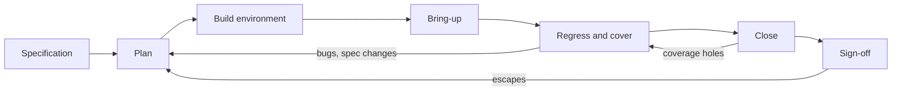

# 4. The Verification Lifecycle

A verification program must state formally and repeatedly how much of its work is done and when the rest will be finished. On the reference SoC, three of the four teams answer that question in terms that cannot be checked: the core team reports being about 80% done, unchanged from the previous month, the DMA team a count of tests running, the I/O team a delivery date of *soon*. None names a quantity measured against a plan, so none is checkable and none constrains the schedule built around it. The crossbar's verification team answers in terms that can be checked: the crossbar is at stage 2 of 3, the environment runs all five managers against all four subordinates, nightly regression is at 340 seeds, functional coverage is at 71% against a reviewed plan, and the bug-open curve peaked two weeks ago. Stage 3 entry (coverage closure and the sign-off review) is gated on the two checklist lines still open: two ordering properties proven only up to a proof bound, and the starvation metric not yet wired into the dashboard. The proof bound is the number of cycles the proof covers: inside it no violation exists, beyond it nothing is claimed. At the current closure rate, the sign-off review is six weeks out.

The difference is not talent or tooling but that the crossbar team runs verification as a *lifecycle*: a sequence of phases with defined entry and exit criteria, measurable maturity stages, scheduled reviews with named owners, and a plan that connects the first feature list to the final sign-off signature. This chapter walks that cycle with the crossbar as the running example, from its feature list in week one to its sign-off review, and then sets it against the industry data on what schedules actually do.

### Chapter map

§4.1 sets out the phases and milestones of the lifecycle and its feedback loops; §4.2 sets out planning deliverables and their reported benefits; §4.3 develops bring-up and the long middle, where regression and coverage become the instruments of management; §4.4 develops a three-stage maturity model (bring-up → mature → verified); §4.5 treats closure and the sign-off review; §4.6 gives the review calendar; and §4.7 treats schedule reality, where effort goes, why most projects run late, and how to plan against the crunch instead of into it.

## 4.1 The shape of the lifecycle

Verification is a process, not a pile of testbenches [cit:B2]. Like any process it has a shape: phases that follow one another, milestones that gate the transitions, and feedback loops that send work backward when reality disagrees with the plan. The shape is stable across companies and design domains even when the vocabulary differs, and {ref: lifecycle_phases} draws it in the terms this book uses.



{figure: lifecycle_phases} The shape of a verification lifecycle: six phases from the specification to sign-off, and the three feedback loops that send work backwards — bugs and specification changes into planning, coverage holes from closure back into the regression phase, and escapes found after sign-off into the plan of the next project. The loops matter as much as the phases, and a cycle of this shape runs once per verification level rather than once per chip: the crossbar's own cycle ends at the sign-off review of §4.5, and its result is what the SoC-level cycle consumes.

Six phases, three loops:

1. **Plan.** Extract what must be verified from the specification, decide how, estimate the effort, and get the result reviewed. The verification plan can start as soon as the architectural specification is complete, before RTL exists, and is augmented later with implementation-specific items once the micro-architecture exists [cit:B2]. Ideally the implementation side of the plan is finished before RTL coding begins and before any testbench code is written [cit:B1].
2. **Build.** Construct the verification environment: interfaces, drivers, monitors, scoreboard, coverage infrastructure. The build phase overlaps heavily with RTL development, because the environment should be ready to receive the first RTL drop rather than start when it arrives.
3. **Bring-up.** Make the environment and the design talk: first transaction in, first response checked, first smoke tests passing in a repeatable, self-checking way.
4. **Regress and cover.** The long middle: constrained-random stimulus ramps up, the coverage model fills in, regressions run at a steady cadence, and the bug curve rises, peaks and, with luck, falls. The bug curve is the count of open bugs plotted over time, and it is the phase's main instrument of convergence.
5. **Close.** Convert "we ran a lot" into "we covered what we planned": chase coverage holes, disposition every open bug, justify every exclusion.
6. **Sign-off.** A formal review in which the team presents the evidence against the plan and the organization accepts the residual risk. Sign-off is a decision rather than a discovery (see Chapter 3), because the design is never proven correct and the review only decides the evidence is sufficient.

The loops carry the lessons: a bug found in the middle phase may reveal a feature missing from the plan and sends the work back to planning, a specification change re-opens the feature list, and an escape found after sign-off, in the lab or in a customer system, must flow back into the plan of the next project. An escape is a bug that crosses a sign-off boundary undetected and turns up on the far side of the boundary that was meant to catch it.

**Milestones, not percentages.** Each phase transition should be gated by a milestone that is a *demonstration*: "Agent coding 80% done" is not checkable; "a single packet goes through the DUT and the scoreboard checks it" or "register reset-value test passes" is either true or false [cit:D7]. An agent is the reusable part of a testbench that drives and monitors exactly one interface, and how far its coding has progressed is a state rather than a demonstration. The vocabulary of the typical milestones varies while the pattern does not: **plan review** (the plan exists and stakeholders signed it), **first transaction** (environment and DUT communicate, self-checking), **feature complete** (all planned stimulus and checkers implemented), **RTL freeze** (the design stops moving except for bug fixes), **coverage closure** (every plan item covered or consciously excluded), **verification sign-off** (the review that gates tape-out).

**One lifecycle per level.** The cycle runs once per verification *level*, not once per chip. A design decomposes into physical and logical partitions, from blocks and cores through subsystems to the full ASIC and the board, and each level of granularity suits a different verification objective: smaller partitions offer far better controllability and observability, larger ones verify integration and system behavior [cit:B2]. Controllability is the ability to steer the design into a chosen internal condition from the interfaces a testbench can drive, and observability is the amount of internal state visible while debugging. Block-level plans and their outcomes roll up into the system-level plan, and system verification tracks progress against milestone views built on those per-IP results [cit:D26]. Some tests are deliberately planned to port across levels, block to system or simulation to lab, and that must be decided during planning, because portable tests are constrained to the features common to both environments [cit:B1].

> **Scenario.** The crossbar, with 5 managers (core instruction, core data, two DMA ports, debug) × 4 subordinates (SRAM, boot ROM, APB bridge, neural accelerator), a 32-bit address, 64-bit data and ID width 4, gets its own block-level lifecycle: its own plan, environment, regression, and sign-off review. The SoC-level plan does *not* re-verify AXI protocol compliance on every port; it assumes the block-level sign-off and focuses on integration: address-map consistency, arbitration under real traffic from the actual core and DMA, and contention between the DMA and the neural accelerator on the SRAM banks. **Approach.** The SoC lifecycle gates its own bring-up milestone on the crossbar reaching stage 2 (defined in Section 4.4): no point wiring a full-chip environment around an interconnect that cannot yet route ID-tagged responses correctly. **Why.** Levels exist to put each class of bug where it is cheapest to find: a protocol bug found at block level costs hours, while the same bug found in full-chip simulation costs days, because controllability and observability have collapsed [cit:B2].

The verification lifecycle and the design lifecycle share one anchor, the specification, which is the golden reference: when the testbench and the RTL disagree the specification arbitrates, which is why the specification must exist before the implementation and must be written independently of that implementation [cit:B2]. When the specification itself turns out to be ambiguous, the lifecycle has surfaced a real project bug: specifications that change, or that are incorrect or incomplete, are consistently reported as a leading concern among verification engineers and project managers; those same specification defects are also one of the recurring root-cause categories for the functional flaws that escape to silicon [cit:R2].

## 4.2 Planning defines deliverables and closure criteria

Chapter 5 dissects the verification plan as an artifact: feature extraction, plan structure, traceability. 

The verification effort for a modern design runs 100% to 200% of the RTL design effort [cit:B2], and no team would spend the design half of that budget without a specification document: the verification half has a specification document of its own, and that document is the verification plan [cit:B2]. The planning process creates the instrument that lets a verification manager estimate the effort and time remaining to the degree of certainty required [cit:B2].

Planning is staged like design itself: a design is specified as requirements, then architecture, then implementation, and the verification planning process should follow the same refinement, either as separate cross-referenced documents or as successive refinement of one document [cit:B1]. In lifecycle terms:

- **Verification requirements**, identified as early as possible, ideally while the architectural design is still being carried out, and reviewed as part of the project's technical assessment reviews [cit:B1]. Three questions structure them: what the design *does* (the intended function, traceable to the specification), what the design *must not do* (the errors the environment must be able to detect, since a checker only finds the failures it was told to look for), and what is explicitly *out of scope* (conditions the design is not expected to survive) [cit:B1]. The requirements review deliberately includes stakeholders from inside and outside the project team, because completeness is the property no single perspective can check [cit:B1].
- **Environment requirements** are the decisions that are cheap now and expensive later, and the plan settles five of them: the response-checking strategy (with random stimulus the expected response must be *computed*, not hard-coded [cit:B1]), the coverage sampling interfaces, the end-of-test conditions (an apparently simple question, "when is a test done?", that hides real bugs if answered lazily [cit:B1]), the reproducibility mechanics (any simulation must be trivially re-runnable with the same configuration and seed [cit:B1]), and the decision on which tests must port across environments.
- **Implementation plan**: who builds what, in what order, with what estimate.

On IBM's POWER8 processor, preparation for bring-up began at high-level design: the post-silicon tool team engaged early enough that the design team built the requirements into the chip (hardware irritators, a class of built-in logic whose only job is to perturb the design as it runs; non-functional running modes that stress a unit in ways no application ever would; and checkers embedded in the processor itself), with bare-metal exercisers as the primary test vehicle. IBM counted any bug first found by an operating-system test or by real software as an escape [cit:P21].

Two planning practices shape the schedule directly.

**First: the reuse audit and the written assumption list.** A reuse assessment identifies, for every piece of design and verification collateral, whether it exists and to what extent it is reused, modified, or new, because the recurring failure mode is assuming "reuse" means 100% reuse and ending up with an under-resourced, under-scoped project [cit:D9]. A dual-role USB controller is where this bites hardest: the compliance suite and the device-side stack arrive as genuine reuse, while the host-side link training and the U0–U3 power-state transitions are new work that the word "reuse" on a schedule slide hides. Alongside the assessment, every verification assumption ("feature X is verified at SoC level, not here"; "the standard protocol driver is adequate because we won't implement the custom extension") must be documented and reviewed face to face with the designers, usually over several review rounds, because unspoken assumptions are how design features fall through the cracks [cit:D9].

**Second: deliverables with a definition of done.** The work breaks into deliverables that group everything related to one feature (testbench infrastructure, stimulus, checks, coverage), each with an effort estimate and a *definition of done* that is an action rather than a state: "completely coded, committed, running and passing in regression", "a single packet goes through the DUT", never "80% coded" [cit:D7]. The resulting schedule is reviewed with stakeholders, on whether it meets the larger team's needs and whether design can meet verification's input dates, and it aims for linear progress: evenly sized deliverables, evenly spaced dates, later deliverables building on earlier ones [cit:D7]. Linear progress of that kind is what makes verification status legible from outside the team, since at any moment the lead can answer *what have we verified, what is left, are we on schedule, when will we finish* [cit:D7].

Modern practice pushes one step further: the plan should be *executable*, a machine-readable structure whose items link directly to the coverage points, checks, and test results that close them, so that progress reporting is automatic and the plan stays alive instead of rotting in a document repository [cit:D9]. An executable plan also makes reviews auditable, because review records attach to specific plan objects [cit:D9]. Chapter 5 returns to the mechanics; the lifecycle consequence is that every later phase (regression, closure, sign-off) reads its progress *from the plan*, and the plan reads its status from the regression database, automatically.

Planning has a price and a measured return: a meaningful verification planning process adds 10–20% to the verification front end and returns a 10–40% saving on the overall verification schedule, plus at least a 20% reduction in implementation and closure effort [cit:D9]. These savings describe a single organization's reported experience; they do not establish a ranking of lifecycle phases by return on investment.

**Worked example: the crossbar's plan, week one.** The verification lead reads the interconnect chapter of the SoC specification and the AXI4 protocol requirements (Arm IHI 0022H.c) [cit:S18], and produces a first feature list, an excerpt of which is already in vplan form ({ref: crossbar_vplan}):

{table: crossbar_vplan} An excerpt from the crossbar's feature list in week one, already in verification-plan form: each row states what must be shown for one sub-feature and, in the last column, the evidence that will be accepted as closing it. That last column is the load-bearing one: naming it in week one is the closure planning that makes §4.5 possible. The final row carries what the team has decided *not* to verify, with the assumptions section reviewed with design as its evidence.

| ID | Feature | Sub-feature | What must be shown | Closure evidence |
|---|---|---|---|---|
| XB-01 | Address decode | Legal routing | Every manager reaches every subordinate it is allowed to reach, per the address map | Functional coverage: manager × subordinate cross |
| XB-02 | Address decode | Decode error | Access to an unmapped address returns DECERR without hanging the port | Directed test + error-response coverage |
| XB-03 | ID routing | Response routing | Read data returns to the issuing manager with the issuing ID, under arbitrary interleaving | Scoreboard check + ID coverage |
| XB-04 | Ordering | Same-ID order, no write interleave | Transactions with the same ID complete in issue order; write data beats of one burst never interleave with another burst's on the same port (write-data interleaving is deprecated in AXI4 and later, and an interconnect that combines writes from different managers must forward the write data in address order — Arm IHI 0022H.c §A5.2.2 [cit:S18]) | Protocol assertions (formal + sim) |
| XB-05 | Arbitration | Fairness under load | No manager is starved when all five managers target one subordinate | Latency metric + starvation assertion |
| XB-06 | Back-pressure | Stall robustness | Correct behavior with arbitrary ready de-assertion on every channel | Constrained-random with stall injection; assertion density on handshakes |
| — | *Out of scope* | — | Cache-coherent extensions (not implemented); APB-side peripheral behavior (verified in the peripheral subsystem plan) | Assumptions section, reviewed with design |

Naming closure evidence in week one is what makes Section 4.5 possible: completion criteria and the coverage that correlates to each plan item are defined at planning time, not discovered at the end [cit:D9]. Alongside the feature list, the lead produces the deliverable schedule (environment skeleton: 2 weeks; single-path bring-up: 1 week; all-paths random with scoreboard: 3 weeks; protocol assertion bind-in: 1 week; coverage model: 2 weeks) and the assumptions list. The whole package goes to the plan review, and Section 4.6 says who sits in the room and what that room adds to this list.

## 4.3 From bring-up to regression maturity

### Bring-up establishes checked transactions

Bring-up opens with the environment and the first RTL drop both in place and nothing working, and the discipline that shortens it is the deliverable thinking of planning, driving toward *demonstrations*. The first milestone is not "environment complete" but "one read transaction from the core-data manager to SRAM, driven, monitored, and checked by the scoreboard", then one write, then one transaction per manager–subordinate pair. Each step is a definition-of-done that either passes in a committed, repeatable simulation or does not [cit:D7].

Two practices distinguish teams that exit bring-up quickly:

- **Self-checking from the first transaction.** The temptation is to eyeball waveforms for a few weeks and "add checking later", but the response-checking strategy was designed during planning [cit:B1] and comes up *with* the stimulus, because an unchecked passing test is a false sense of progress and the checker itself needs debugging time. Most bugs found in bring-up are environment bugs, and finding them is the phase doing its job.
- **Regression from the first passing test.** As individual self-checking tests come alive, they go straight onto the master regression list, which runs at a regular interval, classically nightly, so that anything the design or environment breaks is caught within a day [cit:B2]. A regression suite exists to guarantee backward compatibility: the change that fixes today's bug routinely breaks yesterday's verified functionality, and only re-running everything catches it [cit:B2].

The classic bring-up failure mode is architectural big-bang: months of up-front testbench infrastructure work with no running demonstration, which both hides schedule slippage and makes progress invisible to outsiders [cit:D7]. The cure is the simplest environment that can pass the first deliverable, and that environment is refactored afterwards under the protection of the regression suite.

> **Scenario.** The crossbar environment comes up in week 3 with one manager agent and one subordinate memory model. The first three failures all look like environment bugs: the driver violates a handshake it was supposed to test, the scoreboard mispredicts response ordering for the boot-ROM port, and the address map in the environment disagrees with the one in the RTL. Only the third of them is something else: that disagreement turns out to be a *real* discrepancy against the specification, caught because two teams implemented the same table independently. **Approach.** All three go through the same bug-tracking flow, environment bugs included, since errors found at any stage, in the design itself or in the verification environment, are trackable issues [cit:B2]. **Why.** The environment also requires verification: an untracked environment bug can stop a testbench from checking its intended behavior. The address-map discrepancy is bring-up's first return on investment: an integration bug found at the cheapest possible moment.

### The long middle: regression and coverage maturity

After bring-up the lifecycle enters its longest phase, and its character changes from building things to *running and reading* them: constrained-random stimulus takes over the bulk of stimulus generation, the coverage model planned in week one gets implemented and starts reporting, and the regression becomes the project's heartbeat.

Regression engineering gets its own chapter (see Chapter 12), but the lifecycle-level mechanics are these. The suite grows until it no longer fits in a night and then splits: a basic-functionality subset every night, the full suite over the weekend, random tests re-run with fresh seeds ranked by their incremental coverage contribution so the most valuable ones run first [cit:B2]. That threshold arrives at very different dates for different IPs, since a tile-based GPU's shader-cluster regression stops fitting in a night long before a peripheral's does, and its split falls by workload class: short kernels nightly, full frame renders at the weekend. Mature environments run several regressions per day, and a documented cadence is four runs a day, five days a week: each run produces a pass or fail result plus coverage that is snapshotted into a tracking database, after which the bulky raw results can be discarded [cit:D26].

What turns this machinery into *management* is metrics over time, chosen during planning: a successful metrics-driven process requires organizing their execution, classification, and reporting in the planning phase, because metrics are expensive to build and maintain and every measurement should have a stated purpose [cit:D20]. They pay off as trend lines: bug-open and bug-closure rates plotted over time, percentage of tests written, coverage progression, regression runtime per block, the charts that let a lead spot anomalies and answer "are we on schedule? are we converging?" at a glance [cit:D26,D20]. Even indirect signals earn their place, since how often code is checked in correlates with the stability and maturity of design and testbench [cit:D20]. For an interconnect like the crossbar the plan's metric set includes bus-specific ones, functional coverage of operation mixes plus utilization, queuing, back-pressure, and latency [cit:D20], which is how feature XB-05 (starvation) gets measured rather than argued about.

The middle phase is dominated by debug: debugging takes more of a verification engineer's time than any other single activity [cit:P17,R2], and debug effort varies enormously between projects, which is why schedules extrapolated from the previous project keep failing [cit:R2]. The lifecycle answer is not to schedule debug precisely but to keep the debug loop short: fast regressions, reproducible seeds, and good failure bucketing, the grouping of failures by signature so that one root cause is debugged once rather than many times.

The middle phase is also where the plan's multi-engine choices show their return: the crossbar plan assigned feature XB-04, same-ID ordering and write-interleaving rules, to protocol assertions run in both simulation and formal, and it is formal that pays off:

```text
Bug #217 — crossbar: write-data interleaving at a subordinate port
Found by:    formal protocol assertion (write-interleave rule), 11-cycle trace
Phase:       regression/coverage (week 14); RTL freeze candidate build
Symptom:     with WREADY back-pressure on the SRAM port and two managers
             holding writes in flight to it, the crossbar interleaves the
             write data beats of the two bursts — AXI4 obliges it to forward
             merged write data in address order, one burst at a time.
Root cause:  write-arbiter grant not held for full burst when the
             downstream stalls exactly on the first data beat.
Escape risk: silent data corruption; wrong data written, no error response.
Disposition: RTL fix + directed sim test derived from the trace + the
             assertion stays enabled in every future regression.
```

An 11-cycle counterexample for a bug that constrained-random had not hit in six weeks of nightly regression shows the sim/formal division of labor working as planned (see Chapters 14 and 16), and it only happened because the *plan* put the ordering rules in formal's column back in week one. A counterexample is the input sequence a proof engine returns to exhibit a failure, and this one carries no more history than the failure needs. The last line of the report closes the loop from the lifecycle diagram: every bug's fix enters the regression as a permanent test or assertion.

## 4.4 Maturity stages as a shared language

"How done are you?" is the question the lifecycle must answer continuously for people who do not live inside the testbench: program managers, the SoC integration team, other block teams that consume the results. Percentages fail at it: "80% done" is uncheckable, coverage percentages without a reviewed model are noise, and from outside a healthy coverage asymptote is indistinguishable from "we'll suddenly get more productive next week" [cit:D7]. A coverage curve draws the same line on the chart whether it flattens because the plan is nearly covered or because the team has stopped making progress.

What works is a small number of named **maturity stages**, each with a written checklist of *demonstrable* exit criteria, a pattern that open-source silicon projects publish for every block (OpenTitan is the best-known example [cit:O10]). A block is *at* stage N while it works through that stage's checklist and *exits* into stage N+1 when every line is ticked. Any three-stage variant looks essentially like this:

- **Stage 1: bring-up complete.** The verification plan exists and has passed review, the environment instantiates the current RTL and drives and checks real transactions automatically, and a smoke suite passes in regression, so the plan and bring-up phases have exited.
- **Stage 2: verification mature.** All planned stimulus and checkers are implemented; the functional coverage model is implemented and reporting; regression runs at its target cadence with a managed pass rate; most planned features have been exercised; the bug-open curve has peaked and closure is outpacing discovery. The block is then trustworthy enough for others to build on, and this is the gate the SoC lifecycle waits for.
- **Stage 3: verified, sign-off ready.** Coverage is closed against the plan, with every exclusion written down and reviewed; the full regression has been passing over a sustained window; every open bug has a disposition; the sign-off review has accepted the evidence.

Three properties make the model a *language* rather than another status report:

**The criteria are demonstrations, one checkbox at a time.** Like milestone definitions of done [cit:D7], each checklist line is either objectively true or objectively false: "coverage model implemented and reporting in nightly regression" rather than "coverage well underway". A stage claim can therefore be audited in an hour by someone outside the team.

**The stages compose upward.** Each block reports one stage; the SoC dashboard is a table of blocks × stages; program-level milestone views aggregate per-IP plan results into a single picture [cit:D26]. To the question this chapter opens on, "stage 2, six weeks to sign-off" is a complete and comparable answer, because the same words mean the same thing for the crossbar, the DMA and the core.

**The stages tie metrics to process maturity.** Using metrics to make a process quantitatively managed is the core idea hardware verification inherited from the Capability Maturity Model tradition in software engineering [cit:D20]. The stage model is that idea made small: each stage is a bundle of metrics thresholds plus reviewed artifacts, and moving between stages is a measured event rather than a feeling.

**Worked example: the crossbar's stage-2 exit checklist (excerpt, week 16, the status this chapter opens on).**

```text
[x] Verification plan reviewed; all review actions closed
[x] All 5x4 manager/subordinate paths driven and checked in regression
[x] Protocol assertion set bound on all 9 ports; enabled in sim and formal
[x] Functional coverage model implemented for XB-01..XB-07; reporting nightly
[x] Nightly regression >= 300 seeds, pass rate >= 95%, no test disabled
[x] Bug-open curve past peak (trailing 3-week closure rate > discovery rate)
[ ] Formal ordering proofs (XB-04): 2 properties still bounded-only -> action
[ ] Starvation metric (XB-05) wired into regression dashboard -> action
```

Two open boxes mean the crossbar has *not yet exited* stage 2 and cannot claim stage 3 entry, and everyone can see exactly why and what remains.

Stages describe *verification maturity*, not RTL quality: a block can be stage 2 with fifty open bugs, because the claim is that the machinery to find and track them is mature, not that the design is clean. An HBM controller can report stage 2 while carrying a stack of open bugs against its refresh and thermal corner cases, since what stage 2 claims is the training-sequence stimulus, the coverage on those corners, and the nightly regression that keeps surfacing those bugs. Conflating maturity with cleanliness produces a dashboard of green process indicators over a red design.

## 4.5 Closure and sign-off

Closure redeems or exposes the lifecycle's early investments: if the plan named its closure evidence per feature, as the crossbar plan did in Section 4.2, closure is a checklist-driven convergence. If it did not, closure becomes an argument about what "done" should have meant, at the worst possible time and under the worst possible pressure.

The closure phase converges several strands of evidence at once, each treated in depth in Chapters 6 and 7:

- **Functional coverage against the plan.** Every plan item reaches its target, or is *excluded with a written reason* that survives review. Declared exclusions are a feature of closure rather than a failure, since the plan itself put some conditions out of scope from day one [cit:B1]; what is forbidden is the silent exclusion.
- **Code coverage analyzed.** Not necessarily 100%, but analyzed, with unreached code either explained (unused configuration, defensive logic) or exposed as a stimulus hole.
- **Regression health over a sustained window.** All tests passing, repeatedly, across seeds, not a single lucky green run.
- **Bug metrics.** The open-bug curve at or near zero for the block, the discovery rate flat despite continued stimulus. The classical ship criterion bundles exactly these strands: the design can ship when the RTL passes all the planned tests *and* the coverage and bug-rate metrics satisfy the team, and not before [cit:B2].

Then comes the **sign-off review**, the lifecycle's last gate and its most human one, whose function is not to generate new evidence but to *judge* the existing evidence against the plan, in front of the people who will live with the consequences. The review walks the plan, not the testbench, and it walks three things in turn: every feature row with its closure evidence, its exclusions and their reasons; the open-bug dispositions; and the assumptions list from planning, which is re-read line by line because an assumption that was reasonable in week one ("the custom protocol extension will not be implemented") may have rotted since. An executable plan makes this audit mechanical rather than archaeological, because results and review records are already linked to plan objects [cit:D9].

**Worked example: the crossbar sign-off summary (the one-page table the review starts from).** {ref: crossbar_signoff} brings the evidence and remaining obligations into one review.

{table: crossbar_signoff} The one-page evidence summary the crossbar's sign-off review starts from, one row per strand: plan features against the plan written in §4.2, functional and code coverage, formal results, regression history, bug dispositions, the assumptions re-read at sign-off, and escapes handed to later levels. What the table admits is the point: three formal properties proven only to a bound, fourteen coverage exclusions, one waived bug and one assumption escalated upward are the residual risk the organization is asked to accept. A summary showing none of it would describe an unexamined design rather than a clean one.

| Evidence | Status | Notes |
|---|---|---|
| Plan features XB-01..XB-07 | 7/7 closed | XB-04 closed by formal proof (unbounded) + sim assertions; XB-07 added at plan review, closed by directed test + coverage bin |
| Functional coverage | 100% of model | 14 exclusions, all reviewed (list attached) |
| Code coverage | 98.7% stmt / 96.2% branch | Residue: defensive decode default — reviewed |
| Formal | 41 proven, 3 bounded ≥ 40 cycles | Bounded set reviewed and accepted as residual risk |
| Regression | 21 consecutive clean nightlies, 5 clean weekend fulls | ~9,400 seeds cumulative |
| Bugs | 63 filed / 63 dispositioned | 58 fixed+regressed, 4 not-a-bug (spec clarified), 1 waived (doc erratum) |
| Assumptions | 9/9 re-reviewed at sign-off | 1 escalated: APB bridge (Arm IHI 0024E [cit:S19]) timeout behavior — moved to SoC-level plan |
| Escapes to later levels | 1 | Address-map bug #003 also existed in SoC integration spec — fed back |

The review's output is a *decision*, the organization accepting the residual risk the table sets out, and a record of who accepted it.

The residue shows up occasionally however disciplined the closure is: in 2024 only 14% of IC/ASIC projects achieved first-silicon success, the lowest value in twenty years [cit:R2], and in the same year 87% of FPGA projects reported non-trivial escapes into production [cit:R1]. Sign-off is risk management's final act rather than correctness's, which is why the lifecycle's last loop exists: every escape must flow back into the planning of the next block, the next level, the next project.

## 4.6 Roles and reviews assign responsibility across the lifecycle

Plans, stages and closure evidence are machinery. Reviews are where human judgment inspects it, and they are the part most often skipped under pressure, which is backwards: reviews are cheap, and they catch the class of error no tool can, the error of *intent*.

Two principles govern the cast. First, **the team owns the plan**: an RTL designer's responsibility is not to write RTL but to produce a working design, so the entire design team contributes to and reviews the verification plan [cit:B2]. Second, **completeness needs outsiders**: the requirements review pulls in design, verification and software engineers from inside and outside the project team, because each perspective sees holes the others cannot [cit:B1]. Reviews then recur at prescribed stages, from planning through implementation and debug to closure, with representatives from the design, test, systems, and verification teams [cit:D9].

The review calendar, in lifecycle order ({ref: review_calendar}):

{table: review_calendar} The review calendar in lifecycle order, from the requirements review held when the architectural specification is complete to the sign-off review that gates tape-out: each row gives when the review happens, who is in the room, and the question that review exists to answer. The third column is the one to read closely — the reviews that judge completeness deliberately seat people from outside the verification team, and the sign-off row seats everyone in the rows above it plus management.

| Review | When | Who | What is being judged |
|---|---|---|---|
| Requirements / plan review | Architectural spec complete; part of the project's technical assessment reviews [cit:B1] | Design, verification, software, system stakeholders | Is the feature list complete? Are the must-not-do's and out-of-scopes right? |
| Assumptions review | During planning; re-run whenever the spec moves | Verification team with the designers, face to face, usually several rounds [cit:D9] | Every unstated "someone else covers this" made explicit and agreed |
| Schedule / deliverables review | Plan approved, before build | Verification lead with consuming teams [cit:D7] | Do the deliverables and dates meet the larger team's needs? Can design meet verification's input dates? |
| Environment and code review | During build and continuously | Verification peers | Is the testbench itself trustworthy? (It is a design too.) |
| Coverage-model review | Before the long middle | Designers + verification | Does the model measure the *intent*, not the implementation? (see Chapter 6) |
| Progress / triage review | Weekly through the middle phase | Lead + team, escalation to program | Trend lines: bug curves, coverage, regression health — on schedule? converging? [cit:D26] |
| Coverage-closure review | Entering closure | Verification + design leads | Every hole chased or excluded with a written reason; no silent exclusions |
| Sign-off review | End of closure, gating tape-out (or block release) | All of the above plus management | The full evidence package against the plan; explicit acceptance of residual risk |

The progress review is the oldest form of coverage. A testcase status table with owner and completion columns is itself a functional coverage model, one tracked through managerial procedure instead of tooling: engineers update it, and it is reviewed at regular meetings to decide whether the project is on schedule and where resources should move [cit:B1]. Modern dashboards automate the collection; the meeting, and the judgment exercised in it, remain.

 Designers review the verification team's checkers and coverage model for *intent*, asking whether these checks encode what the design is supposed to do, but do not own them: the verifier's independence of judgment (see Chapter 2) is the value proposition, and the specification, not the designer, arbitrates when testbench and RTL disagree. Verification peers review each other's environment code, because a testbench bug that silently stops testing manufactures false confidence [cit:B2], worse than a design bug because nothing downstream is looking for it. Leads review trends rather than transactions, and the sign-off review is the one room where all three of these vantage points meet.

> **Scenario.** At the crossbar's plan review the firmware engineer, invited under protest ("it's an interconnect, what would software know?"), asks how the debug manager port is verified while the core is halted. The feature list has core-I, core-D, and DMA traffic in every cross, but no scenario where the debug port is the *only* active manager issuing abstract memory accesses into a quiesced system. One row is added to the plan (XB-07), and it produces one coverage bin and one directed test, a test whose content and order are written out by hand. In week 16 that test catches an arbiter assumption that would have made post-silicon debug intermittently unreliable, and post-silicon debug is the one tool that matters most when everything else is broken. **Approach.** The outsiders stay in the review, especially the ones with no stake in the block's internals. **Why.** Requirements reviews include stakeholders from outside the project team [cit:B1], whose independent perspective can expose omissions such as the missing debug-port scenario.

## 4.7 Schedule reality

Everything above describes the lifecycle as it should run; the industry data describes how it actually runs.

**Verification dominates project effort.** Figures like "70% of a project's overall effort is spent in verification" have circulated for years [cit:P17]; the measured 2014 industry mean was 57% of total project time, with a rising share of projects spending more than 80% [cit:P17]. The spread is structural: projects at the low end lean on pre-verified IP reuse, projects at the high end carry high proportions of newly developed IP [cit:R2], which is why the crossbar (configured from a mature in-house pattern) and the neural accelerator (new) sit at opposite ends of the reference SoC's effort table despite comparable gate counts.

**Headcount tells the same story.** The mean peak number of verification engineers on a project overtook design engineers years ago [cit:P17]. Between 2007 and 2014 demand for verification engineers grew at a 12.5% compound annual rate while demand for designers grew at 3.7% [cit:P17]; between 2016 and 2024 both rates cooled, to roughly 3% for verification engineers against 2.4% for designers, but in some segments, processors among them, a 5-to-1 ratio of verification to design engineers is not unusual [cit:R2]. The boundary itself is soft: design engineers spend about half their own time on verification, 47% in 2014 and 49% in 2024 [cit:P17,R2]. Verification is therefore not *a* task on the critical path; for most of the project it *is* the critical path.

**Most projects run late anyway.** Around two-thirds of IC/ASIC projects historically finished behind their original schedule (67% in 2007 and again in 2012, 61% in 2014) [cit:P17], and in 2024 the figure rose to 75% [cit:R2]. Meanwhile first-silicon success fell to 14%, the worst in twenty years, with logic and functional flaws still the leading cause of respins [cit:R2]. A respin is a new fabrication cycle with corrected masks, and a bug that reaches silicon can force one. The industry spends more than half its effort on verification, is late doing it and still ships bugs, and that combination is not an argument that verification fails but a measure of how hard the problem from Chapter 3 is in industrial practice.

**Where the time actually goes.** Within the verification team, debug is the single largest consumer of engineer time, larger than testbench development, test writing, or test planning [cit:P17,R2]. Worse for the planner, debug effort is unpredictable and varies significantly from project to project, which invalidates the most natural estimation method, extrapolating from the last project [cit:R2]. Effort is also back-loaded across the lifecycle: planning and environment build consume effort at a modest, steady rate; the long middle consumes compute time and debug time in bulk; and closure concentrates the highest-pressure work (the last coverage holes, the intermittent failures, the hardest bugs) into the weeks when the tape-out date is least movable, and that concentration is the **crunch**.

The crunch has a failure mode with a name, the guillotine: when the ship decision arrives on a fixed date and cuts off whatever verification was still in flight, what gets shipped is "whatever happened to work", and the features that fall in the basket may be the ones the market needed [cit:B2]. The defense was built in Section 4.2: a plan that defines first-time success and *prioritizes* features makes the inevitable end-of-project cuts a conscious decision about named risks rather than an accident of which tests happened to be written first [cit:B2]. First-time success is the set of features the plan requires to work in first silicon.

The **verification gap** is the distance between the verification a project needs and the verification it gets. One practitioner taxonomy decomposes it into contributors (complexity, skills, schedule, quality, metrics, reuse) and, more usefully, into tractability classes: gaps that are *inherent* (complexity that must simply be absorbed), *transient* (skills that can be developed), and *self-induced* [cit:D16]. The self-induced ones are the lifecycle's business: aggressive schedules and milestones create pressure that forces shortcuts, "pay me now or pay me later" [cit:D16]. Sloppy environment engineering shows up as slow edit-compile-run loops and weak regression management; the simple absence of best-known methods is estimated to cost around 20% of productivity on its own [cit:D16]. Individual skill spread reaches up to 10× in productivity across engineers [cit:D16], which makes team composition a first-order schedule variable that no amount of methodology hides.

Planning against that reality means scheduling in demonstrable deliverables with linear progress, so that slippage is visible in weeks rather than quarters [cit:D7]; buying schedule with planning up front, where the leverage is (10–20% front-end cost against a 10–40% return on the verification schedule in one reported experience) [cit:D9]; keeping the maturity stages truthful, so that "80% done" cannot conceal stage 1 until RTL freeze; and protecting the regression cadence and the debug loop, because that is where the majority of all verification hours will be spent whether or not the plan allowed for them [cit:P17,R2].

> **Scenario.** Week 18 of the reference SoC: RTL freeze slips three weeks because the neural accelerator's datapath is being reworked, and the program manager proposes to "absorb" the slip by compressing verification closure, while the tape-out date does not move. **Approach.** The crossbar lead brings the plan. The first-time-success list is re-reviewed with the stakeholders: XB-01 through XB-07 stay non-negotiable; the stretch goals (full QoS characterization, exhaustive sparse-ID stress) are explicitly moved out of the sign-off gate and into an erratum-risk register that management signs. The stage checklists do not change. **Why.** If schedule pressure reduces verification scope, a prioritized plan makes the cuts explicit, and a signed risk register records who accepts the resulting risk [cit:B2,D16].

### In practice


- **The plan must follow specification changes.** A reviewed plan becomes stale if it remains a snapshot from month one while the design changes. The plan should either be executable and linked to the regression database [cit:D9] or follow this update rule: every specification change and every not-a-bug dispute must land as a plan diff, reviewed in the weekly meeting.
- **Stage claims require evidence.** The symptoms are checklists claimed without evidence, "temporary" test disablement to keep the pass rate green, and coverage closed by deleting bins, the counters that record which values the stimulus has reached. The countermeasure is social, not technical: stage transitions are *reviewed* events with an outsider in the room, and a disabled test is treated as an open bug against the environment.
- **Slower regressions delay debug feedback.** This increases the cost of the debug work that occupies the largest share of verification engineers' time [cit:P17,R2]. Regression turnaround should be tracked as a metric, with a runtime spike investigated like a failing test [cit:D20].
- **Tape-out constraints require explicit risk review.** If sign-off dates are negotiated backward from tape-out, the available evidence must still be reviewed. The realistic goal is not to prevent the negotiation but to enter it with a prioritized plan and a residual-risk list, so the compression is explicit and signed [cit:B2].
- **The review calendar must be maintained under load.** Skipping the coverage-model review and leaving assumptions unread removes checks on verification scope. An unreviewed assumption ("the other team covers this") can leave a design feature unverified [cit:D9].

### Pitfalls

1. **Reporting percent-done.** Symptom: "80% done" three months in a row. Cure: maturity stages with demonstrable checklists; report the stage and the open checklist lines [cit:D7].
2. **Big-bang environment development.** Symptom: months of infrastructure work, nothing running end to end. Cure: deliverable-driven bring-up; first checked transaction is milestone one [cit:D7].
3. **Deferring checking.** Symptom: waveform eyeballing "until the env stabilizes". Cure: self-checking from the first transaction; the response strategy was planned before the first test [cit:B1].
4. **Assuming reuse means 100%.** Symptom: under-scoped project discovered at bring-up. Cure: a written reuse assessment (exists / reused / modified / new) for every piece of collateral [cit:D9].
5. **Inventing closure criteria at closure.** Symptom: month-long arguments about what "done" means, at the worst time. Cure: closure evidence named per feature in the plan, in week one [cit:D9].
6. **Treating sign-off as proof.** Symptom: shock when silicon comes back with a bug despite "100% coverage". Cure: sign-off is documented risk acceptance, with the residual-risk list kept explicit and every escape fed back into the next plan [cit:R1,R2].

### Summary

- The lifecycle is six phases (plan, build, bring-up, regress-and-cover, close, sign-off) with feedback loops, run once per verification level, block lifecycles rolling up into the SoC's.
- Milestones and stage transitions must be demonstrations ("this test passes in regression"), never state estimates ("80% coded") [cit:D7].
- The plan is the specification of an effort that costs 100–200% of RTL design [cit:B2], and disciplined planning measurably buys back schedule [cit:D9].
- A three-stage maturity model (bring-up complete, verification mature, verified) with written exit checklists gives every block the same auditable answer to "how done are you?"; open-source silicon projects publish exactly this pattern.
- Reviews are the layer of human redundancy, the independent second reading of the specification by someone who did not write it: requirements with outsiders, assumptions face-to-face with designers, and closure and sign-off against the plan, at prescribed stages from planning to closure [cit:B1,D9].
- Verification consumes over half of project time (57% measured in 2014) [cit:P17], most projects run late (75% in 2024) [cit:R2], and debug dominates engineer time and resists estimation [cit:P17,R2].
- Sign-off is risk acceptance, not proof: 14% first-silicon success and 87% FPGA escape rates say the residue is real [cit:R2,R1], so it is made explicit and signed, and fed back into the next cycle.

### Exercises

**Exercise 4.1 (calculation).** Take the bug row of the crossbar sign-off summary in §4.5 and verify that its dispositions partition the set of filed bugs, showing the arithmetic. Then account for the plan-features row of the same table, which closes more features than the plan excerpted in §4.2 lists, and name the review that added the difference. Name the class of hole that §4.6 credits that review with catching.

**Exercise 4.2 (calculation).** Sum the crossbar's deliverable schedule in §4.2, then take the band that §4.2 reports for the saving that a planning process returns on the overall verification schedule, apply that band to the sum, and give the result in weeks. Give the reason §4.1's phase list supplies for treating that sum as smaller than the schedule the saving applies to. State the qualification §4.2 attaches to the reported percentages.

**Exercise 4.3 (judgement).** A program manager reads a dashboard placing the crossbar at stage 2 and the DMA engine at stage 1, and schedules SoC integration bring-up on the inference that the crossbar's RTL carries fewer open bugs. Decide what the two stage claims entitle a reader to conclude and what they do not, and name the property of the stage model in §4.4 that draws that line. State which of the two claims the SoC lifecycle is entitled to act on and for what, naming the section that grants it.

**Exercise 4.4 (judgement).** A lead sizes the next project's closure window by scaling this project's closure window, on the ground that the team, the flow and the tools are unchanged. Decide what §4.7 allows to carry across a project boundary and what it forbids, and name the activity that consumes the largest share of engineer time together with the property of that activity which defeats the extrapolation. Give the two structural reasons the same section offers for the spread in verification's share of project effort, and name the third variable it locates inside the team itself.

**Exercise 4.5 (artifact).** Read the stage claim below against the stage-3 exit criteria of §4.4 and the closure strands of §4.5. Name the ticked line that the blank field contradicts, the ticked line that the disabled-test row contradicts, and the field that §4.5 forbids leaving blank. State what the chapter's In practice list requires the reviewer to do with the disabled tests, and what that requirement does to the last row of the claim. State what §4.4 says about a checklist line still open at the stage a block claims, and apply it to the unticked line.

```text
Block: DMA engine
Stage claimed: 3 (verified, sign-off ready)
[x] Coverage closed against the plan
[x] Full regression passing over a sustained window
[x] Every open bug has a disposition
[ ] Sign-off review has accepted the evidence
Nightly regression pass rate: 95%
Tests disabled to hold that pass rate: 2 (intermittent; revisit after RTL freeze)
Coverage exclusions, with reasons:
Open bugs: 7 filed, 7 dispositioned
```

### Further reading

**Corpus sources.**

- [cit:B1] *Verification Methodology Manual for SystemVerilog*, ch. 2: the planning process as staged refinement (requirements, environment, implementation), and the fullest treatment of what a plan must contain.
- [cit:B2] Bergeron, *Writing Testbenches Using SystemVerilog*, ch. 2, ch. 3 and ch. 7: issue tracking (what counts as a trackable issue); the plan's role, first-time success, levels of verification; simulation and regression management.
- [cit:D9] "Best Practices in Verification Planning": executable plans, reuse assessment, assumption reviews, and the cost/benefit data quoted in this chapter.
- [cit:D7] "Proven Strategies for Better Verification Planning": deliverables, definitions of done, linear progress; the antidote to percent-done scheduling.
- [cit:D26] "Smarter Verification Management": regression data tracking, trend charts, and multi-engine and milestone rollups at SoC scale.
- [cit:D20] "Metrics in SoC Verification": the metrics landscape, its CMM lineage, and planning-phase metric design.
- [cit:P17] Foster, "Trends in Functional Verification: A 2014 Industry Study" (DAC 2015): the effort, headcount, schedule, and respin baseline.
- [cit:R2,R1] Wilson Research Group 2024 IC/ASIC and FPGA trend reports, the source of the current numbers: 14% first-silicon success, 75% behind schedule, 87% FPGA escape rate.
- [cit:D16] "I Created the Verification Gap": a practitioner's self-critical taxonomy of why the gap between needed and delivered verification exists.
- [cit:O10] OpenTitan Signoff Checklist: the stage item lists behind Section 4.4's pattern, as lowRISC publishes them, twenty-two items to reach V1, twenty-two more for V2, thirteen for V3. [cit:O11] fixes what those stage names mean, and [cit:O12] is the same checklist filled in for one block.

**Not in the corpus** (cited here as pointers only):

- Wile, Goss, Roesner, *Comprehensive Functional Verification*: the classic end-to-end treatment of the verification cycle at industrial (IBM) scale.
- Carter & Hemmady, *Metric-Driven Design Verification*: a book-length treatment of the metrics-driven process sketched in Sections 4.3 and 4.5.
