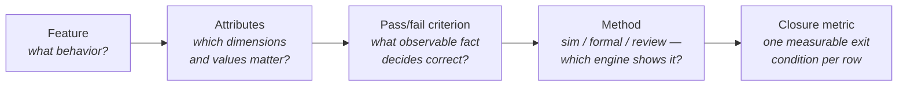

# 5. Verification Planning

Verification planning begins before any testbench exists, when the specification is the only artifact available. The specification of the reference SoC's DMA midend says: *"The midend legalizes each transfer against the AXI address rules, splitting any burst that would cross a 4 KB boundary."* Three questions follow: whether the split holds for 1D transfers only or also for 2D; whether it still holds for 2D, where the check applies per row, when the stride is negative and consecutive rows walk *down* through memory toward the boundary instead of up; and whether the answer changes when the other channel is active and the two legalizers share the splitter state. The specification is silent on all three. Recording them as a plan row is the method this chapter sets out, and that row later corners the worst bug in the block: a 2D negative-stride transfer mis-legalized at the 4 KB boundary, corrupting data only while channel 1 runs. The constrained-random environment finds that bug and the scoreboard catches it, but the plan pointed both at that corner of the input space: no directed test would have been written for a question that did not exist until the plan asked it.

Chapter 4 placed planning in the lifecycle: when it happens, what it must produce, what it costs. This chapter sets out how it is done: the method by which a specification becomes a feature list, a feature a measurable row, and a document an instrument.

### Chapter map

§5.1 extracts features from a specification adversarially, by interface, by function and by architecture, with the designer interview and the *must-not-happen* list as parts of extraction; §5.2 gives the anatomy of a vplan row, feature → attributes → measurable pass/fail criterion → method assignment, with the one-row-one-metric discipline that keeps closure measurable; §5.3 states what makes a plan *executable* and *traceable*; §5.4 sets out the plan review and who must attend; §5.5 shows how risk sets each feature's verification depth, and §5.6 treats planning against an incomplete or moving specification.

---

## 5.1 From specification to feature list

The specification is the golden reference: when the testbench and the RTL disagree, it arbitrates, so it must exist before the implementation, and a "specification" that merely describes what the RTL does is unverifiable, changing every time the implementation does [cit:B2]. Two documents usually feed the plan: the architectural (functional) specification, from which planning can begin, and the implementation specification, which later contributes implementation-specific items [cit:B2]. For the DMA engine, the first defines transfers, channels and error semantics; the second reveals that a midend splitter exists at all.

Feature extraction enumerates, from these documents, everything that must be shown to work. It is the step with the highest cost of omission in verification, because of a brutal asymmetry: if, and only if, a behavior is in the plan will it be verified [cit:B2]. Coverage does not save an omission, since it measures progress against the model this list defines (see Chapter 6), and a feature extraction misses is invisible to every metric downstream.

### Reading the spec adversarially

A designer reading a specification asks "how do I build this?", a verifier "how does this break?" (see Chapter 2). Without that shift, planning reads the specification with a design mindset: a scenario per specified feature, error injection only for the errors the design detects, so it finds the obvious bugs and leaves the obscure ones, every bit as critical, unhunted [cit:D21]. Systematic interrogation replaces it: three passes over the design, each with its own question set [cit:B2]:

**Interfaces first.** For every interface, enumerate what it implies: which transactions, which ranges of values, which sequences and densities, which protocol violations the design must sustain, and which interactions exist with the other interfaces [cit:B2]. On the DMA frontend this yields: every register readable and writable per its access policy (read-only, read-write, write-one-to-clear); a configuration written while the channel runs is rejected or deferred, never half-applied; back-to-back writes to the trigger register start exactly one transfer. On the backend: legal AXI on every channel, correct accumulation of the two AXI error responses (SLVERR, a subordinate signalling failure, and DECERR, no subordinate at that address), and behavior under arbitrary `ready` back-pressure.

**Functions second.** Follow the data through the specified transformations: the relevant configurations, the transformations and their sequences, the *sensitive values* that trigger each, where transformed data must end up, how ordering is affected, what error-detection mechanisms exist and how they report, and what happens to erroneous data [cit:B2]. For the DMA midend, "sensitive values" is the phrase that does the work: transfer lengths of 0, 1, one beat less than max burst (256 beats), exactly max burst, one more; source and destination alignments that do and do not straddle a 4 KB frontier; 2D strides positive, zero, and negative.

**Architecture third.** From knowledge of the chosen implementation, list the conditions that push the design toward its limits: buffer overflow and underflow, resource bottlenecks, multiple requests colliding on them, one transformation path blocking another [cit:B2]. This pass turns the two-channel structure of the DMA into a feature generator: two channels contending for one backend port, one channel's error not perturbing the other's stream, splitter state shared or not shared. The third question of the opening, negative stride near the boundary *while channel 1 is active*, belongs to this pass, and could not come from the functional spec alone, because the sharing of midend state between channels is an implementation fact.

Alongside the three passes, a practical taxonomy from one published planning workshop sorts scenarios into four bins: *isolated features* (one behavior at a time, the backbone of bring-up and debug), *mixed features* (the key combinations, where interconnect and multi-channel bugs live), *legal exceptions* (abnormal but supported cases such as soft reset mid-transfer, error responses and FIFO-full, which must appear in the design spec), and *illegal scenarios* (cases the design does not support, where the spec must say what "unsupported" means: ignored, or recovered by reset) [cit:D7]. The last two bins are chronically under-populated in first-draft plans, and they are where the planning rule applies with full force: a verification effort that does not inject errors is incomplete [cit:D21].

### Interviewing the designer

The specification, however good, does not contain the whole feature list. Team members beyond the plan's author, the system architects and the RTL designers, contribute features invisible in the document: some are not obvious to anyone unfamiliar with the design's purpose, others exist only once a particular implementation is chosen [cit:B2]. One methodology makes the point structurally: implementation-specific requirements create corner cases *that only the designer is aware of*, since the specification never mentions the FIFO the designer inserted while its full and empty conditions must be verified, and it recommends the designer capture them as coverage properties in the RTL [cit:B1]. The same advice governs coverage attributes, whose most effective source is a brainstorming session among several verification engineers and designers familiar with the specifications [cit:B5].

The interview is extraction, not review. Useful questions, on the reference SoC's DMA: *What was the hardest part to get right?* (the splitter's resumption address arithmetic, an instant plan priority). *What state is shared between the channels?* (the answer decides whether "channel isolation" is one feature or ten). *What did you assume the software will never do?* (each answer is either an out-of-scope entry, reviewed and signed, or a new feature, never an unexamined hope). The interview also runs in reverse, since planning early enough leaves room to request design changes that make hard features verifiable: pre-loadable counters, sample points, error-injection hooks (see Chapter 3's observability discussion) [cit:B2].

### What must not happen

A specification describes intended behavior, while verification detects errors, and it can only detect the errors it is looking for [cit:B1]. A feature list of only affirmative sentences is therefore half a list. One methodology elevates the negative half to a rule: define what the design *must not do*, as requirements enumerating the relevant and probable errors, since there are infinitely many ways to fail and judgment selects which the environment must see [cit:B1]. The checker architecture of Chapter 8 is downstream of this list: a scoreboard detects exactly the wrongs someone decided to look for, and correctness at the end of the project is inferred from nothing stronger than the *failure to find inconsistencies* [cit:B1].

Must-not-happen features are also where the DMA's canonical bug was pre-caught. "Data is delivered uncorrupted, in order, exactly once" is the affirmative feature; its negative twin, *no transfer shall ever write a byte to an address outside its legalized destination window, under any channel interleaving*, is what the scoreboard's address check implements, and that check, not any directed expectation, fired on the negative-stride bug. The move fits any block whose correctness is numerical rather than structural: on the radar front-end, "the FFT pipeline computes the transform" says nothing about the fixed-point contract, so the negative list carries it as *no FFT stage shall saturate without raising its saturation flag*, because an unreported saturation turns a target into noise and leaves no trace. Symmetrically, the third list, what is explicitly *out of scope*, bounds the effort: conditions the design need not survive are written down, so "we do not verify descriptor chains longer than memory" is a reviewed decision, not an accident [cit:B1]. One caution from the same source: "if it is not specified, do not verify it" applies to genuine don't-cares, while an *incomplete* specification is not a don't-care but a defect to be fixed [cit:B1], a boundary Section 5.6 returns to.

### Worked example: the DMA feature list, first cut

After the three passes, the interview and the negative list, the DMA plan's feature list opens like this (excerpt; the full list runs to roughly sixty entries):

```text
DMA-F01  Frontend: register access per access policy (RO/RW/W1C), reset values
DMA-F02  Frontend: config write during active transfer rejected, error flagged
DMA-F03  Midend: 1D transfer legalized into AXI bursts, max 256 beats
DMA-F04  Midend: burst split at 4 KB boundary, all alignments, len 0/1/max±1
DMA-F05  Midend: 2D transfer, per-row legalization, stride > 0, = 0, < 0
DMA-F06  Midend: 4 KB split correct under 2D negative stride  [arch pass + interview]
DMA-F07  Midend: channel 0/1 legalizer state fully independent  [interview]
DMA-F08  Backend: AXI protocol compliance under arbitrary back-pressure
DMA-F09  Backend: SLVERR/DECERR reported in the issuing channel's status only
DMA-N01  MUST NOT: write outside legalized destination window (any interleaving)
DMA-N02  MUST NOT: raise done interrupt before last write response accepted
DMA-N03  MUST NOT: propagate channel A error into channel B stream
DMA-X01  OUT OF SCOPE: descriptor fetch from uncached device memory (not supported;
         software constraint documented, reviewed with design in week 3)
```

The shape matters: affirmative features (F), must-not-happen features (N), out-of-scope entries (X) with a review date, and provenance tags where a feature came from the architecture pass or the interview rather than the spec text. DMA-F06 exists because someone asked a question the specification did not answer.

## 5.2 The anatomy of a vplan row

The verification plan defines *what* must be verified and *how*, and it is the specification document of the verification environment [cit:B5,B2]. The partition is explicit: what must be verified lives in the coverage requirements; how, in the design of the three aspects every dynamic environment is built from (stimulus generation, response checking, coverage measurement) [cit:B5]. A well-formed vplan row is that partition in miniature, five fields each answering one question ({ref: vplan_row_anatomy}):



{figure: vplan_row_anatomy} The five fields of a well-formed vplan row, in the order they are written and with the question each one answers: the behavior, the dimensions and values that matter, the observable fact that decides correct, the engine that will show it, and the single measurable condition that closes the row. The arrows are ordered rather than decorative: the attributes belong to a stated feature, and the closure metric is chosen for a stated criterion and a chosen method. The last field is where the one-row-one-metric rule bites: a row that needs two kinds of evidence is two rows.

**Feature.** One behavior, stated as *conditions plus expected result* rather than as an implementation description, labeled with a unique identifier and cross-referenced to the specification section that defines it [cit:B2]. Identifiers are permanent: a deleted requirement retires its identifier, never reused, so an old regression report can never silently point at a new requirement [cit:B1]. The label earns its keep at debug time: in the checker's error message, it makes a failure name the requirement it violated [cit:B2].

**Attributes.** An attribute, in Piziali's vocabulary, is a parameter or dimension *of the coverage model*: a configuration mode, an opcode, a control-field value, a packet length [cit:B5]. The distinction between the model and the device it abstracts is deliberate, and Chapter 6 depends on it. Listing a feature's attributes and *their values that matter* turns prose into a verifiable space. The value-selection rules differ by kind: for a control field, enumerate every value; for a data field, choose values by how the design processes them [cit:B5]. In one published example a maximum-packet-length requirement becomes packet lengths at MAXFL−4, MAXFL−1, MAXFL, MAXFL+1, MAXFL+4 and 65535, crossed with the configuration values that change the limit [cit:B1]: boundary, both neighbors of the boundary, and the far extreme, crossed with every configuration that moves it.

**Pass/fail criterion.** The row states how the response will be judged correct (expected values, timing, protocol) and above all *which errors to look for*: explicit acceptance criteria let an engineer who is not the block's expert build a reliable check [cit:B2]. "Transfer completes" is not a criterion. "Every destination byte equals its source byte, in order, exactly once, and the done interrupt follows the last accepted write response" is. A pass/fail criterion is a checker specification, so writing this field well is where the scoreboard of Chapter 8 is designed.

**Method.** Not every row is a simulation row. One methodology's response-checking guideline doubles as a method-selection guideline: failures visible at signal level are most efficiently caught by assertions; failures visible per output transaction, by a scoreboard; statistical failures of performance or fairness, by offline analysis of a trace [cit:B1]. The same logic extends across engines: exhaustive, local, control-dominated properties go to formal; data-transport correctness at scale to constrained-random simulation with a scoreboard; and some rows are discharged by *review*, a signed inspection of code or configuration where neither simulation nor proof is the right instrument (see Chapters 14 and 16 for the sim/formal division of labor). Others are discharged by an instrument the plan does not own: a USB 3.x dual-role controller's plan sends its link-training and low-power rows, the U0 through U3 transitions, to the specification-mandated compliance suite, so the method field reads *compliance suite*, the closure metric is the suite's item list, and the row records which features it discharges and which it leaves open. In one published RISC-V processor verification plan the assignment is dual: formal carries architectural compliance while simulation carries the complex behaviors, custom loop hardware, interrupts, debug mode [cit:D6]. One published industrial methodology makes this an explicit planning artifact, a scope assessment deciding, for each part of the effort, directed versus constrained-random versus formal and which kinds of coverage will measure it, before implementation begins [cit:D9].

**Closure metric: one per row.** The last field states the evidence that closes the row: a functional coverage group at 100%, a proven property, a passed directed test, a signed review. The discipline is **one row, one metric**: a row needing two kinds of evidence is two rows. Closure is computed row by row (see Chapter 7); a condition such as "coverage *and* the assertion *and* the stress test looks fine" is not automatically evaluable until each term has a measurable acceptance criterion. One published RISC-V plan shows the pattern in its row format: each verification goal is a row carrying its own pass/fail criterion ("check against reference model"), test type (constrained-random) and coverage method (functional coverage), one goal and one measurable discharge [cit:D6].

The OpenHW Group's tutorial on writing a verification plan gives its spreadsheet a column for the requirement each row comes from, one for the feature and its sub-feature, one for the verification goal, one for the pass/fail criterion, one for the test type and one for the coverage method, and asks the author to record what is to be verified and leave how to a separate strategy document [cit:O1]. A published CORE-V interrupt verification plan is that template filled in, seventy-two feature rows under the same headings [cit:O4]. The Verification Academy publishes a pared-back format, one row per requirement in a spreadsheet, with section, title, link and type as the four required columns, and description, weight and goal as the three used most of the time [cit:B7].

### Worked example: four rows of the DMA vplan

Feature DMA-F06 from Section 5.1 needs two kinds of evidence, so it becomes two rows, F06a and F06b. The must-not-happen entry DMA-N01 is shown alongside them, its always-on check running in the same simulations that fill F06a's cross, and it splits into two rows for the same reason, giving four rows, two features and four metrics ({ref: dma_vplan_rows}):

{table: dma_vplan_rows} Four rows of the DMA vplan, carrying the five fields of the row anatomy across two of the features listed in §5.1. DMA-F06 splits into a constrained-random row closed by a covergroup and a formal row closed by a proven property; the must-not-happen entry DMA-N01 splits into the always-on scoreboard check and the injection test whose failure condition is the *absence* of the error message. Two features, four rows, four metrics — the arithmetic the one-row-one-metric rule forces you to notice.

| ID | Feature & attributes | Pass/fail criterion | Method | Closure metric |
|---|---|---|---|---|
| DMA-F06a | 2D legalization at 4 KB boundary. Attributes: stride sign {+,0,−} × the row's relation to the next boundary {more than a burst of headroom, exactly a burst, less than a burst, straddling it} × burst length {1, 255, 256} × other-channel {idle, active} | Every AXI burst issued lies within one 4 KB frame; the union of issued bursts equals the transfer's exact byte set | Constrained-random sim, scoreboard address/data check | Covergroup `cg_2d_4kb` (below) at 100% |
| DMA-F06b | Splitter never emits a boundary-crossing burst (any input) | AXI 4 KB rule (Arm IHI 0022H.c §A3.4.1) [cit:S18] as a safety property on the backend's AXI write-address channel | Formal proof, backend standalone | Property `p_no_4kb_crossing` proven unbounded |
| DMA-N01a | No write outside the legalized destination window, any channel interleaving | Scoreboard flags any write beat whose address ∉ expected window, with feature ID in the message | Constrained-random sim (always-on check) | Check enabled in 100% of regression runs |
| DMA-N01b | That check demonstrably fires | Injection test drives one write beat past the window's edge; the failure condition is the *absence* of the error message | Directed sim, error injection | Injection test passes |

Splitting N01 keeps its two exit conditions separately traceable: "check enabled everywhere *and* proven to fire" combines two kinds of evidence that a tool can evaluate together, while separate rows let it track and report each result independently. The split also gives a home to another planning rule: a checker that has never been seen to fail is not yet evidence. Every planned check earns a companion row for the test that injects the error it is supposed to catch, and the absence of the error message is that test's failure condition [cit:B2].

Row DMA-F06b points at an artifact the reader has already met, the property of Chapters 2 and 3, unchanged:

<!-- slang: fragment - property p_no_4kb_crossing quoted as the artifact row DMA-F06b points at, without the checker module that binds it -->

```systemverilog
property p_no_4kb_crossing;
  @(posedge clk) disable iff (!rst_n)
  (awvalid && awready && (awburst == 2'b01)) |->
    (16'(awaddr[11:0]) + ((16'(awlen) + 16'd1) << awsize)) <= 16'd4096;
endproperty
a_no_4kb_crossing : assert property (p_no_4kb_crossing);
```

What the plan decides here is not the property's text but its *binding point*. The invariant is a claim about what leaves the block, so the row binds it where bursts become observable, on the backend's AXI write-address channel, and proves it on the backend standalone. Binding the same text inside the midend would prove a claim about an intermediate representation and leave the backend's own address arithmetic unproven: the row would close, and the block would still be wrong.

The closure metric of DMA-F06a is a covergroup, and writing it forces the plan to say what its boundary attribute *means*, which is not a raw address. For each descriptor row the monitor computes two byte counts and classifies the row from the pair: the *headroom*, from the row's start address to the next 4 KB frontier in the direction the stride sign selects, and the bytes one maximum-length burst of this row would move (its burst length × 8 on the 64-bit bus). A row that reaches past the frontier is `straddle`, whatever its bursts do; one that stays inside its frame is classified by headroom against burst bytes. Four cases, mutually exclusive, covering every row exactly once:

<!-- slang: fragment - covergroup cg_2d_4kb shown on its own; txn is the monitor's transaction record, not a signal of this excerpt -->

```systemverilog
covergroup cg_2d_4kb @(posedge clk iff midend_txn_done);
  cp_stride_sign : coverpoint txn.stride_sign
    { bins pos = {POS}; bins zero = {ZERO}; bins neg = {NEG}; }
  // txn.bnd_rel: per-row relation, computed by the monitor from the row's
  // headroom (bytes to the next 4 KB frontier, in the stride's direction)
  // and this row's burst bytes. The four values partition every row once.
  cp_boundary_dist : coverpoint txn.bnd_rel
    { bins gt_burst = {GT_BURST};     // stays in frame, more than a burst of headroom
      bins eq_burst = {EQ_BURST};     // stays in frame, exactly a burst of headroom
      bins lt_burst = {LT_BURST};     // stays in frame, less than a burst of headroom
      bins straddle = {STRADDLE}; }   // reaches past the frontier — must be split
  cp_len : coverpoint txn.burst_len
    { bins one = {1}; bins max_m1 = {255}; bins max = {256}; }
  cp_other_ch : coverpoint other_channel_active;
  x_worst : cross cp_stride_sign, cp_boundary_dist, cp_len, cp_other_ch;
endgroup
```

The worst cases sit in the bin named `straddle` crossed with `neg` and `other_channel_active = 1`: two of the cross's 72 combinations, not three, and the missing one is instructive, since the generator's solver budget caps a row at 256 beats, so a straddling row is split into pieces none of which can be a maximum-length burst, leaving the 1-beat and the 255-beat cells. That exclusion follows from a budget the team chose rather than from the model itself, since lifting the budget brings the cell back, which is why it belongs on the row as a recorded waiver rather than in a footnote. Filling those two cells closes row DMA-F06a only if all other non-excluded cells are also covered and the required address, data and burst-legality checks were active with no unresolved errors in the contributing runs. A scoreboard failure instead identifies a defect, as on SOC-1284, the 2D legalization escape of Chapter 1.

`cp_other_ch` is the one coverpoint without explicit bins, because a one-bit flag's automatic bins already name both values and label the cross correctly. And *at 100%* means 100% of the cells the model can legitimately reach, fewer than the cross's 72: the six maximum-length straddle cells are possible and are excluded only by the budget the team chose. The exclusion is explicit, with its justification recorded on the row (see Chapter 6 for how waivers are written). The model also obeys Chapter 2's rule of pairing: this coverage means something only because the scoreboard check of DMA-N01a runs in the same simulations, and coverage without checking certifies stimulus, not correctness [cit:D21].

The covergroup in Chapter 2 crosses the same feature into 36 cells while this one makes 72, and neither is wrong. The stride axis gained a bin because a zero stride, rows all starting at the same address, is its own legalization path rather than a degenerate case of the other two. The boundary axis changed more deeply: Chapter 2 bins the headroom to the next frontier in *absolute bytes*, against fixed thresholds, while this model bins it *relative to what one burst of this row would move*. A fixed threshold assumes a burst length and cannot identify headroom exactly equal to one burst across varying burst lengths, because that boundary moves with the burst. A coverage model gains a bin when someone learns something about the design, so a closed row should record *which version of the model* closed it; otherwise a row that read 100% last quarter answers a coarser question, and nothing in the report says so.

One structural warning applies as the rows multiply: the plan stays in the *DUT's* vocabulary (features by design functionality, scenario descriptions, kinds and quantities of coverage) and out of the testbench's, with no component inventories, no test lists, no hard-coded bin values that change with every environment refactor [cit:D7]. A plan written in testbench vocabulary is rewritten every time the testbench is; one written in DUT vocabulary survives, and the testbench is derived from it. Each row is assigned to the verification level (block, subsystem, chip) where its behavior is fully contained and observable (see Chapter 3 on controllability, Chapter 8 on environment levels): the bulk lands at block level, and a crowd of rows piling onto one deeply buried unit is the classic sign that the unit needs its own environment [cit:B2].

## 5.3 Making the plan executable and traceable

A plan that lives in a document repository decays, and the industry's recurring complaints are documented: plans that take too long to write, contain nothing the team uses ("nobody reads them"), and rot as the design changes [cit:D7]. One published methodology traces all three barriers to a single missing property: the plan is not connected to anything [cit:D9]. The cure, introduced in Chapter 4, has a precise definition. An *executable* verification plan is a machine-readable structure that defines the project's scope, lists its features, attaches the testcases, checks and coverage objects to each, and links design requirements down to those objects; what makes it "executable" is that the regression list is generated *from* the plan and every run's pass/fail and coverage results are annotated *back onto* the plan's objects [cit:D9]. What was verified and what was not is then computed rather than remembered, and closure reporting costs nothing because the mapping from results to features already exists [cit:D9].

Traceability is the same linkage read in the other direction, and it is built from the identifiers of Section 5.2. Each requirement's unique ID cross-references three things: the specification clause it came from, the testcases and properties that discharge it, and the coverage points that measure it [cit:B1]. One audit rule makes the payoff concrete: every feature is annotated with the testcases that verify it, because a feature with no cross-reference *is not being verified*, and the plan is the only place that fact is visible before tape-out rather than after [cit:B2]. One published industrial flow adds the practical detail that generic planning tools rarely provide out of the box: a requirement-tag field on every testcase and coverage object, linked into the program's requirements-management system, plus a per-row *target configuration* field (RTL, gate-level, mixed-signal) so the extracted regression list knows where each test must run [cit:D9].

The published template turns the first of those cross-references into a filled field, requiring each planned item to name a source document and the section inside it [cit:O1].

On the reference SoC the DMA plan is a version-controlled structured file (the format matters less than the parseability [cit:D9]); `DMA-F06a` names covergroup `cg_2d_4kb` and the scoreboard check; the nightly regression publishes per-row status; and the specification paragraph on midend legalization carries the tag `[DMA-F03..F07]` in its margin. When the specification changes, the tags say which rows are stale, and when a row closes, the dashboard of Chapter 7 says so without a meeting. Chapter 4 described the lifecycle consequence, that every later phase reads progress from the plan; here the point is that *executable* and *traceable* are properties designed into the rows on day one, not export formats bolted on at the end.

## 5.4 The plan review as a rite

 Everything about how it is run follows from one fact, met in Section 5.1: completeness is the property no single perspective can check, and a designer's responsibility is a working design, not RTL, so the entire design team, not the plan's author, must contribute to the plan and answer for its completeness [cit:B2].

**The review includes stakeholders and outside peers.** Chapter 4 placed the review in the calendar and named the roster: design, test/product, systems, and verification peers from outside the block, convened at prescribed stages of planning, implementation, debug and closure [cit:D9]. Each seat catches a different class of hole: the designer catches features the spec never wrote down (Section 5.1's interview, now on the record), while the architect catches misread intent. The software or systems engineer catches use cases invisible from inside the block, as in Chapter 4's crossbar review, where the firmware engineer's question about the debug port added feature XB-07. The outside peer catches method errors: unmeasurable pass/fail criteria, coverage that certifies stimulus rather than behavior, missing error injection.

**Each row undergoes weakness analysis.** One published workshop gives the challenge procedure a name, weakness analysis, and three blades, applied row by row [cit:D7]:

- *Correctness*: whether the row is real, meaning whether the DUT implements this option, whether the behavior is fully specified, whether the RTL parameters allow it, whether it is a valid use case and whether anyone cares [cit:D7]. Rows that fail are deleted, and deleting rows is a review success, because unverifiable and irrelevant rows cost real schedule.
- *Precision*: what exactly is being verified and in what context, the feature's dependencies, its disqualifying conditions, its value ranges and event timing, and whether different contexts carry different goals [cit:D7]. "Verify 2D transfers" fails precision; DMA-F06a's attribute list passes it.
- *Completeness*: for each influencing variable, how it can change and what the change does to the DUT; for each scenario, what is expected *and what is not expected*; which feature combinations produce unique outcomes that need their own rows [cit:D7].

Two more challenges belong in every review. First, the assumptions: every "verified elsewhere," every "software will never do that," reviewed face to face with the designers, usually over several rounds, because unspoken assumptions are how features fall through the cracks [cit:D9]. Second, the designer's own "that can't happen." Chapter 2 established the mindset, and at plan review it becomes procedure, since whether a case is *valid* is irrelevant and the only question is whether it can occur, in which case the recovery is a feature [cit:D21].

> **Scenario.** At the DMA plan review, the block's designer objects to row DMA-F06a: "negative-stride 2D descriptors that straddle a boundary can't happen, because the driver library always allocates row-aligned buffers." The verification lead asks two questions. *Is the driver library the only software that will ever program this block?* (No: the register interface is documented, and the neural-accelerator team writes its own descriptors.) *Does the RTL check the condition, or assume it?* (Assume.) **Approach.** The row stays and its risk rank rises, because an unchecked assumption reachable by third-party software is where escapes breed, and a new must-not-happen row is added for the frontend: descriptors the design cannot honor are rejected with an error, not silently mangled. **Why.** The objection and its resolution are recorded on the row, linked directly to the plan object, where audits and quality reviews can reach them [cit:D9], and the exchange itself does what no coverage metric can: it tests the plan against knowledge that exists only in people.

The review marks a status change: before it the plan is a draft owned by one person, after it the block's contract, amended only with the same audience (see Chapter 4 for where the reviews sit in the calendar, and Chapter 24 for review culture at team scale).

## 5.5 Risk: deciding how deep to go, feature by feature

 Depth (how much stimulus, how many crosses, which engines, how much of the schedule) is a per-feature decision, and risk is the input that decides it.

The base mechanism is priority, written into the rows in three tiers: *must-have* features define first-time success, gate the project's completion and get thorough verification across all configurations; *should-have* features get their basic operation verified, with depth added only as time allows; *nice-to-have* features are verified "as time allows", which today's design schedules almost guarantee means never [cit:B2]. One methodology operationalizes the same idea as requirement ranking, in which resources go to the highest ranks first and tape-out is decided when the most important requirements are met, plus requirement *ordering*, because dependencies dictate sequence: register access is verified before the configurations that use it [cit:B1]. The point of the tiers is that when the schedule guillotine falls (see Chapter 4), the cut line was drawn deliberately, months earlier [cit:B2].

Priority ranks features by consequence. Risk adds the second axis, the likelihood of a bug, and bug risk and complexity risk are among the published axes along which features are isolated for analysis [cit:D7]. In practice the risk drivers a plan review scores are novelty (new logic versus silicon-proven reuse, which the reuse assessment of Chapter 4 feeds directly [cit:D9]), structural complexity (shared state, concurrency, arbitration), specification quality (Section 5.6), controllability and observability at the chosen level, and the cost of escape (silent data corruption versus a flag readable by software). Where consequence and likelihood are both high, the plan buys depth in every currency at once: more attributes and deeper crosses in the coverage model, a second engine on the same behavior (DMA-F06a *and* F06b, simulation for the transport, formal for the invariant), tighter closure criteria, review of the checker itself.

Walked through the five drivers, DMA-F06 reads: *novelty*, a new 2D negative-stride path, not silicon-proven reuse (high); *structural complexity*, splitter resumption arithmetic in state shared between two channels (high); *specification quality*, the document is silent on this case (high); *controllability and observability*, both good at block level, since descriptors are programmed directly and every issued burst is visible on the backend interface (low, the one driver arguing for less); *cost of escape*, silent data corruption that no status flag reports (worst available). Four drivers high, and the favourable one only makes depth affordable rather than unnecessary: high consequence × high likelihood. The same five questions on DMA-F01 invert every answer: reused register logic, generated with its own tests from one description through a register abstraction layer (RAL, see Chapter 10), a fully specified access policy, complete observability, a consequence software can read back, so its row buys almost nothing, deliberately. {ref: risk_depth} ranges both features and three others across the same two axes.

{table: risk_depth} Five DMA features ranked on the two axes that set verification depth — the consequence of an escape and the likelihood of a bug — with the depth each ranking buys. The rows are deliberately unequal, and that is what a risk assessment produces: DMA-F06, novel and with a silent-corruption consequence, buys a full cross in constrained-random simulation *and* a formal property besides, while the reused register logic of DMA-F01 buys generated tests and a review of the generator's configuration and nothing more.

| DMA feature | Consequence | Bug likelihood | Planned depth |
|---|---|---|---|
| DMA-F01 register access | medium | low (generated RAL) | Generated register tests; review of the generator config |
| DMA-F03 1D legalization | high | medium | CR sim + scoreboard; boundary-value coverage |
| DMA-F06 2D neg-stride @ 4 KB | high (silent corruption) | high (novel, shared state, spec silent) | Two rows: full cross in CR sim (F06a) + formal safety property (F06b) |
| DMA-N01 window violation | high (silent corruption) | medium | Two rows: always-on scoreboard check (N01a) + its injection test (N01b) |
| DMA-F09 error routing | medium | medium | CR error injection; per-channel status coverage |

The unit of ranking is not always the module. On the GPU the same five questions are asked per workload class, because the tile binner handling one full-screen triangle is silicon-proven while the same binner under thousands of sub-pixel triangles straddling tile edges is novel, poorly observable and expensive to escape. Depth is bought per workload class, and one module appears in rows of three different depths. That is possible only because the rows were written against behaviors rather than blocks.

Depth can also be staged in time. One published RISC-V coverage plan from 2020 makes maturity explicit in the metric: a *compliance basic* level gives stimulus-effectiveness insight while the design is immature and changing, and *compliance extended* becomes the closure goal once the design is stable [cit:D6], so the exit criteria tighten as the design earns it. Depth also interacts with method economics: the 2006 estimate is that a directed-test plan stays manageable when testcases number in the low hundreds, while a project with over a thousand identified testcases would need more than a year of hand-writing, the arithmetic that pushes high-risk, high-cardinality features toward constrained-random automation with coverage closure rather than enumeration [cit:B2]. The same arithmetic appears on the coverage side: in that 2020 plan, hand-writing the coverage model for a 120-instruction ISA costs roughly 3,600 lines of SystemVerilog at 10–30 lines per instruction, and a 300-instruction extension another ~9,000, so the published conclusion is that generation, not typing, is the only sane source for that class of model [cit:D6]. 

That plan is the verification plan for the OpenHW Group's CV32E40Pv2, a 32-bit in-order RISC-V core that began as ETH Zurich's RI5CY and is developed onward by Dolphin Design, with Imperas supplying both the reference model and the generated coverage model, and it is public, published in the `core-v-verif` repository as files a reader can inspect row by row [cit:D6]. The arithmetic and the conclusion drawn from it are that programme's own [cit:D6].

## 5.6 Planning against an incomplete specification

 Reality is documented in the 2024 industry data: specifications that change, or arrive incorrect or incomplete, remain a common concern for verification engineers and project managers alike, and design errors have historically been the leading root cause of the functional flaws behind respins, with recent signs of improvement [cit:R2]; the two are entangled, because a designer implementing an ambiguous sentence is manufacturing a design error with a specification-shaped cause. The planning literature is equally blunt: documentation quality is the primary input to planning; the worst case is a feature with no documented description, where the verification engineer must do original research before a meaningful plan is possible; and frequent or late design changes can invalidate large portions of planning work outright [cit:D9].

The published "detail levels" guidance is the opposite of both denial and paralysis: with a complete, detailed specification, invest in a complete, detailed plan up front, with coverage and assertions specified in the rows; with a minimal or in-progress specification, write a less detailed plan now, fully elaborate only the first few deliverables, add detail to later rows *as the information is finalized*, and put explicit planning-and-architecture time inside each later deliverable's estimate [cit:D7]. Change handling follows the same shape: small specification changes are absorbed into future rows; significant ones add new deliverables rather than silently stretching old ones, and their impact is reviewed with the team so the cost is communicated in a form everyone already understands [cit:D7]. Two disciplines keep the boundary in place. First, the boundary from Section 5.1: an unspecified genuine don't-care is excluded from verification, but an *incomplete* specification is a defect, and the plan's job is to surface it for fixing rather than paper over it [cit:B1]. Second, the plan must never become the spec, since a specification that is a consequence of the implementation is unverifiable [cit:B2], so every hole the plan finds goes back through the specification's owner, in writing.

> **Scenario.** The neural accelerator enters planning with a specification solid on the datapath (2/4/8-bit weight modes, the 16-lane MAC array, quantization and saturation semantics) and hollow on system behavior: the memory-streaming interface section is headed "TBD pending crossbar arbitration experiments," and job-abort semantics are one sentence old. **Approach.** The verification lead writes the plan anyway, in three zones. Zone 1, fully elaborated rows for the stable datapath (attribute-complete: weight width × saturation boundary × accumulator sign crosses), scheduled first. Zone 2, *stub rows* for the streaming interface: feature named, spec reference marked `TBD(§4.2)`, pass/fail and attributes deliberately blank, each stub carrying a planning-time allowance in its estimate and a named specification owner. Zone 3, a spec-hole log: every question the extraction passes raised and the spec could not answer ("what does the engine do if the crossbar stalls the weight stream mid-row?"), filed as specification defects with dates, reviewed weekly with the architect. The plan review covers zones 1 and 3 now; zone 2 rows are review-gated on their spec sections landing. **Why.** Waiting for a finished specification would delay planning and the questions that help complete it; planning against guessed behavior risks invalidating the work when the specification changes [cit:D9,D7]. The zoned plan assigns specification gaps to an owner and tracks them through the log and weekly review, making the verification team the specification's first systematic reviewer.

Planning is not a phase that consumes a finished specification; it is the activity that *tests* the specification, years before silicon tests the design, and every question in Section 5.1's passes that the document cannot answer is a specification bug found at the cheapest possible moment.

### In practice

 The first draft of the feature list should be timeboxed to days, not weeks: the published guidance is low effort for fast results, with more detail added later where it proves necessary [cit:D7], because completeness comes from the review rather than from the author polishing alone. The plan should live in version control next to the RTL. It should use a parseable format because its derived artifacts (regression list, dashboard, traceability report) are generated from it [cit:D9]; each row should have an owner. The must-not-happen and out-of-scope lists warrant particular scrutiny: an omission in the first leaves a failure unchecked, while a wrong entry in the second excludes behavior that required verification. The budget should allow for planning's front-loaded cost: the 2013 figures quantified in Chapter 4 are 10–20% added at the front, savings of 10–40% of the overall verification schedule and at least 20% of implementation and closure effort [cit:D9], from a single organization's reported experience.

### Pitfalls

1. **Transcription planning.** *Symptom:* the plan is the specification's headings with "verify that" prepended. *Cure:* run the three extraction passes and the designer interview; zero features tagged `[interview]` or `[arch pass]` means extraction never happened.
2. **Unmeasurable rows.** *Symptom:* pass/fail criteria like "works correctly under stress." *Cure:* every row states the observable fact that decides it and the single metric that closes it; a row that cannot name its metric is split or deleted.
3. **Affirmative-only plans.** *Symptom:* no must-not-happen rows, no error injection, checkers that have never been seen to fail. *Cure:* a negative twin for every data-integrity feature; an injection test per checker whose failure condition is the *absence* of the error message [cit:B2].
4. **Testbench-vocabulary plans.** *Symptom:* rows named after agents and sequences; every environment refactor forces a plan rewrite. *Cure:* DUT functionality and scenario descriptions only; the testbench is derived from the plan, never the reverse [cit:D7].
5. **The signing-ceremony review.** *Symptom:* a one-hour walkthrough, no rows changed, no assumptions challenged. *Cure:* weakness analysis row by row (correctness, precision, completeness) with designers, systems and outside peers present and the objections recorded on the rows [cit:D7,D9].
6. **Uniform depth.** *Symptom:* every feature gets the same coverage template regardless of novelty or consequence. *Cure:* rank consequence × likelihood per feature; spend crosses, engines and schedule where both are high, and draw the cut line for the rest in advance [cit:B2,B1].

### Summary

- A behavior is verified only if it is in the plan, so extraction has the highest cost of omission in verification [cit:B2].
- Extraction is adversarial and runs in three passes (interfaces, functions, architecture), followed by an interview of the designer for the corner cases only the implementation knows and by explicit must-not-happen and out-of-scope lists [cit:B2,B1].
- A vplan row is feature → attributes → measurable pass/fail criterion → method → one closure metric: a row needing two kinds of evidence is two rows.
- Method follows the failure signature: assertions for signal-level wrongs, scoreboards for transaction-level wrongs, offline analysis for statistical ones, formal for local invariants, review where no engine fits [cit:B1].
- An executable plan generates the regression list and absorbs the results; traceability ties spec ↔ feature ↔ test/coverage by permanent IDs, and a feature with no cross-reference is not being verified [cit:D9,B2,B1].
- The plan review is a rite with a roster (design, systems, test, outside peers) and a procedure: challenge each row's correctness, precision and completeness, and every "that can't happen" [cit:D9,D7,D21].
- Risk (consequence × likelihood) sets per-feature depth; priority tiers pre-draw the schedule cut line; an incomplete spec is planned in zones, with its holes filed as specification defects [cit:B2,D7,B1].

### Exercises

**Exercise 5.1 (calculation).** Take the two coverage-model line counts §5.5 quotes from a published coverage plan, together with the instruction counts they belong to and the per-instruction rate the same sentence gives as a band. Compute the rate each total implies and locate it in the band. State what follows for quoting those totals as estimates, and name the conclusion §5.5 reports that source as drawing from them.

**Exercise 5.2 (artifact).** Read the plan row below against the five fields of the row anatomy in §5.2. Name the field left blank and the rule of §5.2 that governs what may be written there. Name the field whose content fails the same section's requirement on pass/fail criteria, and restate that content so that it names an observable fact. Name the cross-reference §5.3 requires of every row and that this row does not carry.

```text
ID: DMA-F11
Feature and attributes: Midend: descriptor chaining
Pass/fail criterion: Chained transfers complete correctly under stress
Method: Constrained-random simulation
Closure metric:
```

**Exercise 5.3 (calculation).** Count the cells of the cross `x_worst` from the attribute list of row DMA-F06a in §5.2, then compute how many of those cells count toward the row's closure under the convention §5.2 states for a covergroup at full coverage. Name the premise the exclusion rests on, state whether it belongs to the model or to a decision the team took, and name where §5.2 requires it to be recorded. Give the refinements §5.2 names as the reason the earlier, coarser model of Chapter 2 counts fewer cells for the same feature.

**Exercise 5.4 (judgement).** At the DMA plan review a designer proposes moving row DMA-N02 out of scope, on the ground that the driver polls the status register and never enables the done interrupt. Decide which of the three lists of §5.1 the row belongs on after that argument, and give the property §5.1 requires of every out-of-scope entry. Name the second of the two questions the verification lead asks in §5.4 and state what its answer does to the row's risk rank.

**Exercise 5.5 (judgement).** A lead applies one coverage template to every row of the DMA plan. Decide what §5.5 puts in place of a uniform template, then walk the five risk drivers of that section across DMA-F01 and DMA-F06 and give the depth each ranking buys. State why the one favorable driver of DMA-F06 does not reduce its depth.

### Further reading

**Corpus sources.**

- [cit:B2] Bergeron, *Writing Testbenches Using SystemVerilog*, ch. 3: on feature extraction, prioritization and testcase derivation, and the source of this chapter's extraction questions.
- [cit:B1] *Verification Methodology Manual for SystemVerilog*, ch. 2: planning as rules and recommendations, with must-not-do requirements, unique identifiers, ranking, response-checking selection, coverage translation.
- [cit:B5] Piziali, *Functional Verification Coverage Measurement and Analysis*, ch. 2 and 4: the plan as the verification environment's specification; attributes and attribute-value selection; the coverage plan (Chapter 6).
- [cit:D9] "Best Practices in Verification Planning": the executable-plan definition, template discipline, assumption reviews, and the planning ROI data.
- [cit:D7] "Proven Strategies for Better Verification Planning": feature isolation, scenario classification, weakness analysis, and planning under incomplete specifications.
- [cit:D6] "Planning for RISC-V Success": a published vplan row format with per-goal pass/fail and coverage method; staged coverage levels; the arithmetic for generated coverage models.
- [cit:D21] "Verification Mind Games": why design-mindset plans miss the obscure bugs (the mindset itself is Chapter 2's subject).
- [cit:R2] Wilson Research Group 2024 IC/ASIC report: specification issues as a persistent root-cause concern behind functional flaws.
- [cit:O4] the OpenHW Group's interrupt verification plan for its CV32E40P core, a real, filled vplan in spreadsheet form; [cit:O1] is the same group's tutorial on writing one, and [cit:O2] is where its verification strategy draws the line between the plan and the document that supports it.
- [cit:B7] the Verification Academy's *Coverage Cookbook*: the testplan format behind Section 5.2's four required columns, and its process for carrying a requirement from the specification into a coverage model.

**Not in the corpus** (pointers only):

- Haque, Michelson, Khan, *The Art of Verification with VERA*: origin of the interface/function/corner-case extraction ordering that Section 5.1's three passes adopt.
- Wile, Goss, Roesner, *Comprehensive Functional Verification*: planning at industrial scale, including the specification-review culture this chapter compresses into Section 5.4.
