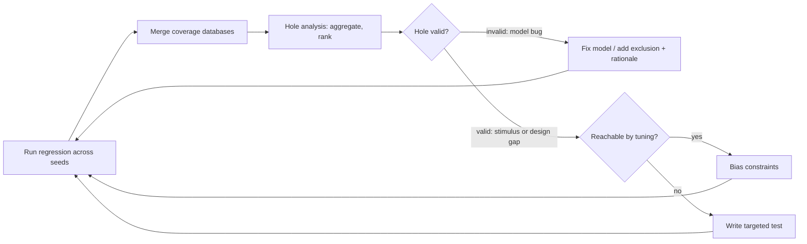

# 6. Coverage: Theory and Practice

Coverage records which situations a verification campaign exercised and supports reasoning about those it missed. On the neural accelerator, every test passes in a two-week regression, and code coverage on the accelerator RTL reads 100%: every line and every branch executed. Neither result rules out a failing convolution job: the accelerator's unit of work is one convolution programmed through its registers, and the job in question comes from an audio keyword-spotting model that uses 2-bit weights and a tensor one pixel wide, launched while the DMA engine streams camera frames through the same SRAM banks. Contention starves the weight prefetcher, and the starved prefetcher wraps its buffer pointer one entry too early, but only when the weight stream ends part-way through a beat, a single data transfer within a burst. The stream ends part-way through a beat only with degenerate geometry and the narrowest precision. The output feature map is subtly wrong. The two weeks of regressions never created this situation, and the verification metrics in place could not reveal its absence. Code coverage records executed lines; the missing configuration combines precision × geometry × contention in the specification, beyond the code structure.
This chapter develops functional coverage for such combinations and the discipline of trusting it only as far as the model supports.

### Chapter map

§6.1 defines the coverage families and their blind spots; §6.2 examines code-coverage sub-metrics, whose implementation basis makes holes informative but fullness inconclusive. §6.3 covers the effort of deriving models from specification intent, using covergroups, coverpoints, bins and crosses, and the limits of automatic bins. §6.4 relates "100% coverage" of a model to Chapter 3's impossibility results. §6.5 derives attributes and coverpoints from features, with bins encoding intent. §6.6 compares accelerator models reaching 100% on the same feature to show why reports require model review. §6.7 shapes combinatorial crosses with exclusions justified in the vocabulary of the specification, which makes the claimed reachable space reviewable and lets a checker refute it. §6.8 covers hole analysis, targeted tests, constraint tuning and stopping criteria; §6.9 defines reviewable exclusions for situations that cannot or need not be covered without redefining success.

## 6.1 The three coverage families and their taxonomy

Simulation provides an existence proof: a particular stimulus produced a particular response, and the checkers accepted it. Coverage complements that evidence by recording which situations the tests created, so the team can reason about the ones they did not.
Chapter 4 placed coverage closure in the lifecycle; this chapter develops its measurement.

Practitioners sort coverage into three families. **Code coverage** measures which RTL structures the simulations executed, including lines and branches, expressions and transitions. **Functional coverage** measures which *specified behaviors*
occurred, using models the engineer writes deliberately. **Assertion coverage**
measures the activity of assertions: which were evaluated, triggered, completed.
The distinction concerns who defines each metric and from what source, beyond the choice of tooling.
The Verification Academy states that no single metric characterizes the
verification process completely, since a regression at full code coverage may
still leave specified functionality unverified, and that a complete picture of a
project's progress often needs several metrics together
[cit:B7].

Piziali's founding taxonomy supplies this chapter's framework of two axes. A coverage metric has a *kind* and a *source*. Its kind is **implicit** when the metric is inherent in a representation, such as the statements of a hardware description language, and **explicit** when an engineer invents and defines it; its source is the design's **implementation** or its **specification** [cit:B5]. The two axes define four coverage spaces. Code and structural coverage are implicit-implementation; functional coverage built from the specification is explicit-specification; and functional coverage of microarchitectural detail, such as a pipeline's occupancy or an implementation FIFO's high-water mark, is explicit-implementation. The fourth quadrant, implicit-specification, would hold metrics inferred automatically from a natural-language specification, and as of 2004 it had no practical realization [cit:B5]. Implicit metrics require no modeling effort or explicit engineering judgment; explicit metrics require effort and depend on the engineering behind them. A **coverage space** is a multi-dimensional region described by attributes and their values, loosely called a *coverage model* in industry [cit:B5].

The accelerator's line coverage is implicit-implementation, computed automatically at no modeling cost and fully covered. The absent model of precision × geometry × DMA contention would have been explicit-specification. A model of the weight prefetcher's buffer occupancy, where the bug occurs, would have been explicit-implementation; it too was absent. Three quadrants were empty; the quadrant that was filled, implicit-implementation, is the one that asks for no explicit engineering judgment.

By 2024, adoption of code coverage, functional coverage and assertions in the IC/ASIC market had matured rapidly between 2007 and 2014 and since largely stabilized within the margin of error, whereas *constrained-random* simulation kept climbing, a technique that generates legal but unlikely stimulus automatically under declared constraints [cit:R2]. Coverage is established practice; assessing what it measures requires examining the model.

## 6.2 Code coverage and its structural limits

Code coverage instruments the RTL and records which of its structures execute
during simulation. Its purpose is to determine whether some design code was left unexercised [cit:B2]. Because the metric is implicit in the language, tools extract it automatically without model design, judgment or maintenance. That economy supports enabling it in every flow, with its sub-metric limits understood.

**Line and statement coverage** report which source lines executed at least once.
They expose dead configuration branches and unexercised error paths, including whole features never reached; an untriggered DMA error-reporting path appears as a block of red lines. They reveal nothing about *why* or *in what context* a line ran: a statement that executed once, even under the most favorable conditions, is "covered."

**Branch coverage** reports whether each decision point took both directions. It is strictly stronger than statement coverage and still combinatorially weak, because covering decisions individually says nothing about **path coverage**, the sequences of decisions taken together. A suite can hold 100 percent statement
coverage while covering only 75 percent of control paths, and paths grow
exponentially with the number of control-flow statements
[cit:B2]. The DMA burst splitter is the stage that splits each transfer into bursts that the AXI address rules allow. One branch of the splitter splits a transfer that would cross the 4 KB boundary, so that every burst stays inside one address region and never reaches a second subordinate. Another branch handles a negative stride, an address step that walks memory downwards. Each branch may be covered without any one transfer taking both branches, and that untaken combination is what contains this book's canonical corruption bug.

**Condition and expression coverage** check whether each controlling term in a Boolean expression independently caused the decision. For a branch guarded by `parity == ODD || parity == EVEN`, statement coverage reads 100 percent while expression coverage sits at 50 percent, because no testbench ever set `EVEN`; statement coverage cannot report this oversight. Reaching 100 percent expression
coverage is itself extremely difficult [cit:B2].

**Toggle coverage** reports which bits of which signals changed value (0→1 and
1→0). It is the coarsest metric in the family and approximates whether any activity reached a structure at all, useful for integration sanity and power-intent connectivity. It is also the only code metric that sees inside structures the others treat as one object.

**FSM coverage** extracts state machines and reports visited states and traversed
arcs. A five-state machine with 14 possible transitions reaches 100 percent state coverage from a single sequence covering only 36 percent of the transitions. Because transitions come from the implementation, the tool cannot identify unintended or missing intended transitions; the graph needs review against the specification [cit:B2]. Some transitions may be unreachable under the protocols feeding the FSM; a property checker determines which [cit:B2], as Part IV discusses.

Code coverage is computed **from the implementation, against the implementation**, so it cannot represent anything the designer did not write. The code in an empty module is always 100% covered [cit:B2].
If the accelerator's designer never implemented the 2-bit weight unpacking mode, no code metric will report it missing; every test of the modes that *do* exist passes and the coverage report shows no gap. 100% code coverage means the entire design implementation was executed. It indicates neither correctness nor completeness of the verification suite: low numbers reliably signal a problem, but high numbers do not establish completion [cit:B2].

Code coverage therefore serves as a cheap automatic backstop from the first regression: every hole indicates a missing test, dead code or an implementation detail that has not been understood, while full coverage cannot establish completion.

> **Scenario.** The crossbar's ID field is 4 bits wide, and in this regression the
> five managers only ever index IDs 0 through 4, because the sequence library pins
> one ID per manager; the debug manager, ID 4, issues nothing at all. So ID bits 3
> and 2 never change value. Line coverage on the ID-decode logic reads 100%: the
> decoder executes every cycle. Toggle coverage remains at 50%, with four of the eight bit transitions missing. **Approach.** Tracing both stuck bits first suggests an incorrect explanation. Bit 3 appears structurally unused because the five managers never index past 4, but the 4-bit field permits any of 16 AXI4 values; the interconnect widens it so managers need not coordinate their IDs (Arm IHI 0022H.c §A5.1 "AXI transaction identifiers", §A5.2.3 "Interconnect use of transaction identifiers") [cit:S18]. The regression establishes only a stimulus restriction. Bit 3 is *unreached*; excluding it records a sequence-library decision requiring an owner and expiry (Section 6.9), without establishing structural unreachability. Bit 2 is set only by the debug manager, and the environment never routed that manager's transactions through the crossbar: the stuck bit records a testbench wiring bug that line coverage could not see.
> **Why.** Different code metrics expose different blind spots, so disagreements among inexpensive metrics help diagnose gaps. The second thing the scenario shows is that a claim of unreachability needs evidence: misclassification is costly, so the claim must name the clause that establishes it.

## 6.3 Functional coverage from specification intent

Functional coverage requires up-front modeling effort: the engineer specifies it entirely from specification intent, independently of code structure, whereas code coverage is inferred automatically [cit:S8]. It is the only metric family that measures whether specified situations occurred, including those the implementation omits, as in the opening example.
The Verification Academy states the same distinction between the two model kinds: a structural coverage model is created automatically, while a functional one, being explicit, must be written by hand before anything can be measured [cit:B7].

SystemVerilog is the common language for these models (IEEE 1800-2023, Clause 19). A **covergroup** is the container: a user-defined type that
encapsulates the specification of a coverage model, defined once and instantiated
as many times as the environment needs [cit:S8]. Inside a covergroup, a **coverpoint** designates one variable or expression to observe and partitions its values into **bins**, where each bin is a counter for a value or a set of values whose occurrence matters to the model. A **cross** enumerates Cartesian combinations of two or more coverpoints, where most interesting bugs arise through attribute interactions, as the breakage thinking of Chapter 2 predicts; that habit asks how the design could break, and under what interference, rather than whether it works. Bins also express negative intent: `ignore_bins` removes values from the space, while `illegal_bins` raises a runtime error when an illegal value occurs, taking precedence over any other bin that would have counted it [cit:S8]. Section 6.9 develops this distinction: *ignore* excludes a value from the measurement; *illegal* requires that it never occur, so the second acts as a checker.

Without explicit bins, a coverpoint gets one per value for small domains; otherwise its range is sliced uniformly into at most `auto_bin_max` bins, default 64 [cit:S8]. Slicing the accelerator's 9-bit tensor-width field into 64 uniform bins gives eight values per bin. Width 16, the MAC lane count and a behavioral boundary, then shares the bin `auto[16:23]` with widths 17 through 23. Widths 16 and 17 are exactly the two the datapath treats differently, and the
tool has just merged them. Section 6.6 returns to this problem of bins that conceal behavioral differences.

Functional coverage divides in two: **data/stimulus coverage** records which values and configurations were processed, best captured with covergroups; **protocol/activity coverage** records which sequences and control scenarios occurred, best expressed as `cover property` statements over temporal sequences [cit:B1]. A 2-bit-weight job under DMA contention for SRAM is data coverage; a write response with two same-ID writes outstanding under back-pressure is activity coverage, expressed directly by a three-line sequence in SystemVerilog Assertions (SVA), the notation in which temporal design rules are written, but awkward to sample in a covergroup.

**Assertion coverage**, the third family, measures assertion activity. The antecedent of an assertion is the condition that must become true before the assertion checks anything. At minimum, assertion coverage records which assertions were evaluated and which were vacuously satisfied (IEEE 1800-2023 §16.14.8) [cit:S8]: an assertion whose antecedent never occurred has verified nothing, a direct application of Chapter 3's observability argument that what is never observed is not verified. Beyond that, `cover property` directives are declared functional coverage points in their own right, and designers should mark implementation corner cases with them [cit:B1] so unverified cases are visible without relying on someone remembering the plan. Assertion coverage applies to checker assertions and to coverage assertions alike, and it is itself measurable and analyzable [cit:B5]. This connects to Chapter 11: assertion coverage establishes whether the checkers were active.

The three families provide three complementary observations: implementation execution, occurrence of specified behavior, and checker activity during that behavior. Verification needs all three; Part IV adds a fourth perspective, formal coverage models [cit:D11] (see Chapter 16).

## 6.4 The scope and limits of 100% coverage

Every coverage percentage depends on its denominator. At 100% functional coverage, the accelerator's denominator contains everything the model's author enumerated, rather than everything the accelerator can do. Reaching 100% functional coverage indicates the completeness of the test suite *against the model*; it says nothing about the completeness of that model and, unless bins encode invalid values, nothing about correctness [cit:B2].

Chapter 3 established that the reachable state space is finite but too large to enumerate, making exhaustive verification impossible; behavior is therefore partitioned into equivalence classes and each is sampled. A
functional coverage model *is* that partition, made executable: bins are
equivalence classes with a counter attached. It therefore inherits the partition's loss: a chosen projection of an intractable space.
"100%" measures progress across the projection, never across the space.

**Fidelity** measures how closely a coverage model captures actual behavioral requirements. A control register with 18
specified values, modeled as 18 bins, has no abstraction gap; a 32-bit address bus
whose 2³² values are grouped into 16 ranges has a substantial one. Fidelity is also lost by omitting *relationships*: if bit CR3 may only be 1 when CR7 is 1 and the model never encodes that dependency, it cannot distinguish this bug-prone coupling [cit:B5]. Fidelity matters because a bug occupies a region of the coverage space, its *footprint*: some bugs occupy a huge one, triggered by any test in the right mode, while others occupy a point requiring one instruction, one fault type and one interrupt to coincide. A high-fidelity model is far more likely to distinguish, and therefore
demand, the bug-exposing scenario; a low-fidelity one files it with its harmless
neighbors [cit:B5]. High fidelity everywhere is unaffordable because it leads to Section 6.7's intractable full cross; fidelity must therefore be allocated where the risk analysis of Chapters 3 and 5 identifies likely bugs.

Coverage measures **sampling**; checkers establish correctness. It records that a situation occurred; scoreboards, reference models and assertions determine whether the design behaved correctly (Chapters 8 and 11). Coverage methodology *assumes* an orthogonal mechanism detects device misbehavior [cit:B5]. Without output comparisons, a covergroup merely counts jobs: the unread-log problem of Chapter 2 applies to coverage as well. Verification aims to remove bugs; coverage closure is only a *derivative* of that goal, a stand-in for it that is well defined and measurable [cit:D10]. A derivative can be optimized directly: if stimulus is tuned only for bin hits, the campaign can reach 100% with inactive checkers, without evidence that misbehavior would have been detected. Coverage-model reviews must therefore include the checkers observing the same events and identify, for every coverpoint, who detects misbehavior in that scenario.

## 6.5 Designing the coverage model: an engineering act

Chapter 5 ends with a verification plan, the *vplan* named throughout this chapter: features extracted from the specification, each with a measurable pass/fail intent. Coverage-model design turns those features into attributes and bins, crosses and sampling events that a simulator can count. The work has two phases:
**top-level design**, which writes the model's semantic description and identifies
the attributes and their relationships, and **detailed design**, which answers
*what* to sample, *where*, and *when* to sample and correlate attributes [cit:B5].
The semantic description comes first, one sentence of the form "record all valid operating conditions of X defined by attributes A, B, C" [cit:B5]. Writing it requires the author to state exactly what the model claims to measure, the only thing a reviewer can hold it to.

The judgment concentrates in three places.

**Choosing attributes.** Attributes come from the specification's parameters (the accelerator's weight precision), the environment's degrees of freedom (DMA contention) and, with restraint, the implementation's own choices (the prefetch buffer's occupancy). The first two make specification coverage; the third is implementation coverage in Section 6.1's taxonomy, legitimate but answering a different question about stress on this microarchitecture [cit:B5]. An attribute does not belong in the model when no checker observes it and no risk motivates it.

**Choosing bins.** Bins implement breakage thinking (Chapter 2). Bins distinguish behavioral changes at boundaries and alignment points, wrap-arounds, hardware resource counts and the value one past a count. Tools default to uniform slicing [cit:S8]; deliberate bins are unequal, dense at behavioral changes and coarse where the specification is indifferent. A bin describable only as `auto[128:191]` lacks a requirement-based meaning.

Some behavioral boundaries occur in data rather than configuration. On a video codec, control flow depends on the picture itself, on features such as an all-skip macroblock, a motion vector pinned at the search-window limit, or a coefficient block whose values fall outside the entropy coder's tables. The monitor must therefore *compute* the bin from the stream rather than read it from a register. These frame classes are relevant when comparison with a bit-exact reference model reveals a mismatch.

**Choosing sampling.** Sampling location must match the interface or unit whose behavior the attributes describe: job attributes at the accelerator's register interface and contention where SRAM arbitration happens, rather than wherever an object handle is convenient. Sampling must occur when the values are jointly valid and stable. The accelerator model below samples at job completion with the contention flag *latched during* weight streaming; sampling at job launch would record whether the DMA happened to be busy at an irrelevant instant, giving each filled bin a misleading meaning. Correlation time is a first-class design decision
[cit:B5].

> **Scenario.** The DMA vplan hands over feature `DMA-F06a` (Chapter 5): "2D transfers are split correctly into legal bursts at the 4 KB boundary for all stride signs." The 4 KB boundary that this plan row names is the one AXI4 imposes on every burst (Arm IHI 0022H.c §A3.4.1 "Address structure" [cit:S18]): no burst may cross it. The row's closure metric, the evidence that decides when the feature counts as covered, is the covergroup `cg_2d_4kb`. **Approach.** Bins follow behavioral boundaries: stride sign, `pos`, `zero`, `neg` (**3** bins); distance from the start of a row to the next 4 KB boundary relative to burst size, `gt_burst`, `eq_burst`, `lt_burst`, `straddle` (**4** bins); extreme burst lengths, 1, 255, 256 (**3** bins); and activity on the other DMA channel (**2** bins, one per value of a one-bit flag, where automatic bins are meaningful). The cross
> is 3 × 4 × 3 × 2 = **72** combinations, each nameable in specification
> vocabulary. **Why.** The canonical DMA bug occurs in the `neg` × `straddle` × other-channel-active corner: two of those 72 points rather than three. The team's stimulus generator caps a 2D row, a line of a two-dimensional DMA transfer, at 256 beats. The cap is a budget the team sets on the constraint solver, the engine that picks each row's values; the cap is not a limit the AXI rules impose, so a straddling row splits into pieces and none of them can be the 256-beat maximum. The third of those points, the one at the maximum burst length, is therefore unreachable through a recorded generation choice, independently of stimulus luck, and it requires a waiver instead of further tests (Section 6.9).
> These bins require the bug scenario; 64 automatic stride bins would have grouped it with other cases.

The covergroup `cg_2d_4kb` below implements the bins of plan row `DMA-F06a` with the sampling rule this section has just prescribed: it latches the other-channel flag for the whole duration of a 2D row and samples once, when that row completes.

```systemverilog
typedef enum logic [1:0] {STRIDE_POS, STRIDE_ZERO, STRIDE_NEG} stride_sign_e;

typedef enum logic [1:0] {DIST_GT_BURST, DIST_EQ_BURST,
                          DIST_LT_BURST, DIST_STRADDLE} boundary_dist_e;

typedef struct packed {
  stride_sign_e   stride;    // sign of the 2D row's stride
  boundary_dist_e boundary;  // row start to the next 4 KB frontier, in bursts
  logic [8:0]     beats;     // beats the row emitted, a count and not an
                             // encoded length: the legalized range is 1..256
} dma_row_t;

module dma_row_cov (
  input logic     clk,
  input logic     rst_n,
  input logic     row_start,        // the midend accepted a new 2D row
  input logic     row_done,         // the row's last beat was accepted
  input dma_row_t row_attr,         // row attributes, computed by the monitor
  input logic     other_ch_active   // the other channel has a burst in flight
);

  covergroup cg_2d_4kb with function sample(dma_row_t row, logic other_ch);
    option.per_instance = 1;

    cp_stride_sign : coverpoint row.stride {
      bins pos  = {STRIDE_POS};
      bins zero = {STRIDE_ZERO};
      bins neg  = {STRIDE_NEG};
    }

    cp_boundary_dist : coverpoint row.boundary {
      bins gt_burst = {DIST_GT_BURST};
      bins eq_burst = {DIST_EQ_BURST};
      bins lt_burst = {DIST_LT_BURST};
      bins straddle = {DIST_STRADDLE};   // the row crosses a 4 KB frontier
    }

    // Only the extremes carry behavior; the values between them are the
    // steady state and no bin claims them.
    cp_len : coverpoint row.beats {
      bins one    = {1};
      bins max_m1 = {255};
      bins max    = {256};
      // The legalized range is 1..256 in a 9-bit field, so the midend must
      // never emit anything else: a value here is a bug, not a hole.
      illegal_bins out_of_range = {0, [257:511]};
    }

    // One bin per value of a one-bit flag: automatic bins are meaningful.
    cp_other_ch : coverpoint other_ch;

    x_worst : cross cp_stride_sign, cp_boundary_dist, cp_len, cp_other_ch {
      // The generator's solver budget caps a row at 256 beats, so a
      // straddling row splits into pieces and none of them can be the
      // maximum: 3 stride signs x 2 other-channel states = 6 cells, dead
      // by a recorded generation choice and not by geometry. The waiver
      // belongs on plan row DMA-F06a and expires when the budget moves.
      ignore_bins solver_budget = binsof(cp_boundary_dist.straddle) &&
                                  binsof(cp_len.max);
    }
  endgroup

  cg_2d_4kb cov = new();

  // What the model needs is whether the other channel contended at any
  // point of this row, so the flag is latched across the row instead of
  // being read at the sampling edge.
  logic other_ch_seen;

  always_ff @(posedge clk or negedge rst_n) begin
    if (!rst_n)               other_ch_seen <= 1'b0;
    else if (row_start)       other_ch_seen <= other_ch_active;
    else if (other_ch_active) other_ch_seen <= 1'b1;
  end

  // One sample per row, at completion, when all four attributes are
  // jointly valid.
  always @(posedge clk) begin
    if (rst_n && row_done) cov.sample(row_attr, other_ch_seen);
  end
endmodule
```

## 6.6 Worked example: a coverage model for the neural accelerator

The accelerator (Chapter 1) is a fixed-point convolution engine with configurable 2/4/8-bit weights and a 16-lane MAC datapath; weights stream from memory and registers program jobs. The vplan feature:
*quantized convolution jobs execute correctly for all weight precisions and tensor
geometries, including under memory contention with the DMA engine.*

Semantic description: *record every completed convolution
job as the combination of weight precision, tensor width class, input channel class
and whether the DMA contended for the weight-stream SRAM banks during execution.*
All four attributes correlate at one instant, job completion ({ref: accel_job_attributes}):

{table: accel_job_attributes} The four attributes of the accelerator's job coverage model, with where each value is read from and when it is captured. Three are read off the job registers at launch and the contention flag is latched across the weight-streaming window, so that all four are jointly valid at a single sampling instant, job completion — the choice §6.5 calls the one that determines meaning.

| Attribute | Source | Sampled |
|---|---|---|
| weight precision (2/4/8-bit) | job registers | at job launch |
| tensor width (1–256) | job registers | at job launch |
| input channels (1–512) | job registers | at job launch |
| DMA contention | SRAM arbiter | latched during weight streaming |

Detailed design, in SystemVerilog:

```systemverilog
typedef enum logic [1:0] {PREC_2B, PREC_4B, PREC_8B} prec_e;

typedef struct packed {
  prec_e        prec;      // weight precision
  logic [8:0]   tensor_w;  // tensor width in pixels, 1..256
  logic [9:0]   in_ch;     // input channels, 1..512
} job_attr_t;

covergroup cg_accel_job with function sample(job_attr_t job,
                                             logic dma_contended);
  option.per_instance = 1;

  // Enum: automatic bins give one named bin per precision -- acceptable
  // here because every enum value is individually meaningful.
  cp_prec : coverpoint job.prec;

  // Width bins follow the datapath, not the number line: behavior bends
  // at the 16-lane boundary and at the extremes.
  cp_width : coverpoint job.tensor_w {
    bins single      = {1};          // degenerate geometry
    bins sub_lane    = {[2:15]};     // partial lane utilization
    bins lane_exact  = {16};         // exactly one full MAC pass
    bins lane_plus1  = {17};         // full pass + 1-pixel remainder
    bins multi_lane  = {[18:255]};   // steady-state streaming
    bins max_width   = {256};        // architectural maximum
    // Legal range is 1..256 in a 9-bit field: the register checker must
    // reject the rest, so reaching the datapath is a bug, not a hole.
    illegal_bins out_of_range = {0, [257:511]};
  }

  cp_ch : coverpoint job.in_ch {
    bins one_ch   = {1};
    bins few_ch   = {[2:15]};
    bins accum_16 = {16};            // accumulator reuse boundary
    bins many_ch  = {[17:511]};
    bins max_ch   = {512};
    // Legal range is 1..512; same contract as cp_width above.
    illegal_bins out_of_range = {0, [513:1023]};
  }

  cp_dma : coverpoint dma_contended {
    bins quiet     = {1'b0};
    bins contended = {1'b1};
  }

  // The cross that would have caught the opening scenario:
  // precision x width-class x contention = 3 x 6 x 2 = 36 combinations.
  x_prec_width_dma : cross cp_prec, cp_width, cp_dma;

  // Channels interact with precision (accumulator packing), not with
  // contention: a second, smaller cross instead of one giant one.
  x_prec_ch : cross cp_prec, cp_ch;
endgroup
```

The width bins encode a claim: the datapath treats widths 18 and 200 equivalently, both as steady-state multi-lane streaming, but treats 16 and 17 differently; the reviewer can agree or produce a counterexample, a case from the specification that the claim does not cover. The `illegal_bins` encode a different claim: those values must never reach the datapath, so if one does, the simulation stops rather than counting it (Section 6.9). Illegal values are
excluded from coverage [cit:S8], so `cp_width` still offers 6 bins and `cp_ch` 5.
The crosses make a second claim: precision interacts with geometry and contention because both affect weight-unpacker timing, while channel count interacts only with precision. This replaces one cross of 3 × 6 × 5 × 2 = 180 combinations with 36 (3 × 6 × 2) + 15 (3 × 5) = 51 justified combinations. The
sampling encodes a third: `dma_contended` is latched across the whole
weight-streaming window and sampled once, at job completion, when all four
attributes are jointly valid. The opening bug occupies `x_prec_width_dma: (PREC_2B, single, contended)`, which this model requires for full coverage.

A counterexample covers the same feature with an inadequate model:

<!-- slang: fragment - covergroup cg_accel_job_vanity shown on its own; job_attr_t is the accelerator job record declared elsewhere in the environment -->

```systemverilog
covergroup cg_accel_job_vanity with function sample(job_attr_t job,
                                                    logic dma_contended);
  cp_prec  : coverpoint job.prec;
  cp_width : coverpoint job.tensor_w {
    bins lo_half = {[1:128]};
    bins hi_half = {[129:256]};
  }
  cp_dma   : coverpoint dma_contended;
  // no cross
endgroup
```

Because this covergroup keeps the same attributes, the same sampling call and the same sampling instant as the model above, the only things that differ are the two modeling defects. This covergroup compiles and runs, reaching 100% early in the first regression despite misleading measurements. `lo_half` groups degenerate width 1, lane boundary 16 and remainder case 17 into one 128-value bin, hiding bug-exposing scenarios among harmless neighbors [cit:B5]. And there is no cross, so "2-bit weights" and "contention" are
each ticked without ever having occurred *together*.

A third defect requires no change to the bins: the original model's `sample()` call is replaced with `@(posedge clk iff job_done)`, and the covergroup then reads contention live at that edge. This measures whether the DMA happened to be busy when the job retired, regardless of whether it contended during streaming, and fills the bin either way. The report cannot distinguish these defects from the original model. Functional coverage is exactly as good as the model, which can only be judged by *reading it*; coverage-model review against the vplan and the checkers must therefore be a flow gate.

## 6.7 Shaping the crossbar coverage model

The crossbar has 5 managers (core-I, core-D, two DMA channels, debug) × 4 subordinates (SRAM, boot ROM, APB bridge, the accelerator). Route coverage requires 20 combinations for every manager to reach every subordinate. Protocol coverage adds burst type (FIXED, INCR, WRAP: 3), direction (2), a modest 6 burst-length buckets and 4 transfer sizes on the 64-bit data bus. The full cross has 5 × 4 × 3 × 2 × 6 × 4 = 2,880 combinations, or 46,080 with the 16 transaction IDs. Review must justify the combinations introduced by these axes, and many bins are *unreachable by construction*: the instruction port never writes, the boot ROM rejects writes, and the debug manager issues only single-beat INCR accesses.

Unreachable cross bins make 100% unattainable. Late bulk exclusions without per-bin reasons lose the audit trail, while accepting a persistent 61% dashboard can discourage review (Chapter 7 returns to this problem). A **shaped cross** explicitly defines reachable space in the model, with reasons for exclusions.

```systemverilog
typedef struct packed {
  logic [3:0]  mgr_id;    // 5 managers, IDs 0..4
  logic [1:0]  sub_id;    // 4 subordinates
  logic [1:0]  burst;     // AxBURST
  logic        is_write;  // direction
} xbar_txn_t;

covergroup cg_xbar_route with function sample(xbar_txn_t t);
  cp_mgr : coverpoint t.mgr_id {
    bins core_i = {0};  bins core_d = {1};
    bins dma[]  = {[2:3]};  bins dbg = {4};
  }
  cp_sub : coverpoint t.sub_id {
    bins sram = {0};  bins rom = {1};  bins apb = {2};  bins accel = {3};
  }
  cp_burst : coverpoint t.burst {
    bins fixed = {2'b00};  bins incr = {2'b01};  bins wrap = {2'b10};
    // 2'b11 is reserved in AXI4: a manager must never issue it.
    illegal_bins reserved = {2'b11};
  }
  cp_dir : coverpoint t.is_write {
    bins rd = {1'b0};  bins wr = {1'b1};
  }

  x_route : cross cp_mgr, cp_sub, cp_burst, cp_dir {
    // Instruction port is read-only by construction.
    ignore_bins ifetch_wr = binsof(cp_mgr.core_i) && binsof(cp_dir.wr);
    // Debug manager issues only INCR accesses.
    ignore_bins dbg_burst = binsof(cp_mgr.dbg) &&
                            (binsof(cp_burst.fixed) || binsof(cp_burst.wrap));
    // Writes to the boot ROM must be rejected: observing the error
    // response is a required event, so it lives in its own
    // error-response covergroup rather than as a hole in this cross.
    ignore_bins rom_wr = binsof(cp_sub.rom) && binsof(cp_dir.wr);
  }
endgroup
```

Each `ignore_bins` line [cit:S8] carries its justification as a comment, in spec
vocabulary, reviewable in the same diff as the model. The model's reserved `AxBURST` encoding is the protocol's own: Arm IHI 0022H.c §A3.4.1 "Address structure", Table A3-3 "AxBURST signal encoding", page A3-50 [cit:S18]. The shaped cross makes a falsifiable claim about *intended* reachability: protocol checkers must flag a write from a read-only instruction port. The boot-ROM line separates an exclusion from a requirement: the stimulus combination is excluded from this cross, while the error response stays positively required as a coverage point elsewhere, and the requirement moves to the covergroup where it can be measured.

Unshaped, this cross is 5 managers × 4 subordinates × 3
burst types × 2 directions = **120** combinations. The exclusions remove 12 cells (`ifetch_wr` = 1 × 4 × 3 × 1), 16 (`dbg_burst` = 1 × 4 × 2 × 2) and 15 (`rom_wr` = 5 × 1 × 3 × 1), for a total of 43 cells counted separately. Two pairs overlap: `ifetch_wr` with `rom_wr` in 3 cells, `dbg_burst` with `rom_wr` in 2, while `ifetch_wr` and `dbg_burst` are disjoint. The union of the three sets is therefore 38. This leaves **82** justified combinations rather than 120, without expanding to the 2,880 of the full six-axis cross. The tractability criterion is whether a reviewer can understand the complete model. On the compute cluster's 8-core interconnect, or on the mesh NoC, the on-chip packet network that takes the place of a shared bus once too many blocks must communicate, crosses likewise cover only the two- and three-way interactions identified by risk analysis; assertions address the rest.

On the GPU, a shader cluster's space comprises *occupancy shapes*, beyond structural axes: thread groups in flight × divergence class × memory-access pattern, a cross small enough to enumerate fully. The divergence class of a thread group records how far its threads take different paths through the kernel. The workload, rather than the configuration, decides which cells are reachable: a kernel without branches stays in one divergence bin for its whole run, and no biasing of the generator can move it out of that bin. The model must therefore be crossed against workload class; a hole identifies a missing program shape that could produce the behavior, rather than a missed random choice, changing who is responsible for fixing it.

On a directory-based coherent hub, coverage concerns *protocol states*: combinations of MESI state (a cached line is Modified, Exclusive, Shared or Invalid), directory entry and outstanding snoop across several caches, too large to enumerate manually. A directory entry is the hub's record of which caches hold a given line. A snoop is a request the hub sends to a cache about a line, and it is outstanding until the cache answers. Formal coverage models identify the combinations over which the invariant was proved and those excluded by assumptions [cit:D11], the subject of Chapter 16.

## 6.8 Closure: the workflow from holes to done

Coverage closure is reached when the entire modeled coverage space has been observed [cit:D10], with exclusions accounted for. Chapter 4 placed it on the
lifecycle timeline; {ref: closure_loop} draws the loop itself. Traditionally, closure is manual: the team runs the regression across seeds, each seed fixing one run's random draws, merges the coverage databases, analyzes the remaining holes, modifies constraints or writes directed tests with content and order laid down by hand, and reruns until the target is reached; the merge-and-analyze step alone consumes significant time and compute [cit:D15].
Coverage also accumulates across simulators, emulators and formal tools, and a standard API and interchange format, the Unified Coverage Interoperability Standard (UCIS), exists to keep it mergeable across dynamic and static tools and across a project's lifetime [cit:S3] (Chapter 16 covers unified coverage in depth).



{figure: closure_loop} The coverage-closure loop, from a seeded regression through merge and hole analysis to the action each hole earns. The branch that carries the discipline is the validity question: an invalid hole is a defect in the model, answered with an exclusion and its rationale — the path §6.9 exists to keep honest — while a valid hole is answered with biased constraints or a targeted test. Every branch returns to the regression, so nothing is closed without a rerun.

**Reading holes.** A coverage hole is required stimulus or device behavior not yet
observed [cit:B5]. Hole-analysis techniques, first reported by IBM's Haifa laboratory in 2002, reduce raw lists to interpretable regions: **aggregation** coalesces many point-holes into few larger regions; **partitioning** groups holes sharing semantics; **projection** finds attribute values never observed in any combination; and Hamming distance, the number of attribute values in which two holes differ, measures proximity [cit:B5]. Fifty scattered holes aggregated as "no 2-bit-weight job has ever run under contention, at any geometry" yield one finding with one root cause requiring one action. A projected hole takes priority over a single missing cross product because it identifies a whole missing stimulus dimension.

**Classifying holes.** Holes fall into two classes that determine the corrective action. A **valid hole** is an intended observation that has not happened: on the input side, usually a stimulus weakness; on the output or internal side, possibly a design error suppressing the behavior. An **invalid hole** is a bug in the coverage model itself: a combination that cannot or should not occur, included through misunderstanding; its fix is a restriction on the model, an exclusion with a reason, rather than a test [cit:B5].
Section 6.9 documents that second path.
The Verification Academy publishes the same triage for code coverage in three
classes rather than two, splitting the valid hole by its cause: input stimulus
that was never generated, a bug in the design or the testbench that blocks that
stimulus from reaching the code, and code left unused in a given configuration
and expected to be unreachable in normal operation. Only the third is the class
it directs at exclusion [cit:B7].

Classification also decides what the stimulus must be *capable* of. On an inline AES-GCM crypto engine, a hole in the failed-authentication bin cannot be addressed by constraint tuning: the environment must be able to corrupt a tag after the engine computes it, truncate a ciphertext mid-stream, or present a key slot that differs from the one used to encrypt the message. A well-behaved driver has no path to perform these manipulations at any seed. Without these operations, the hole identifies missing testbench capability. Injected fault classes require their own coverage model, available for the sign-off review, the formal step that judges the evidence against the plan and accepts the risk that remains.

**Filling holes through tuning or targeted tests.** The first lever is **generation feedback**: bias constraint distributions so generator probability mass reaches missing observations; input holes respond directly; output and internal holes must first be traced back to the input scenario parameters that provoke them [cit:B5]. The second lever, a **targeted test**, encodes the missing scenario directly. Tuning is cheap per
hole and preserves the randomness that finds unplanned bugs (Chapter 9); targeting
is precise but brittle. Tuning suits families of holes; targeting suits isolated survivors. As only hard-to-reach points remain, progress decelerates sharply [cit:B2]; as of 2012, manually closing the last 20% costs up to 80% of a verification team's time and resources [cit:P19].

That cost motivates closure automation research and products. The published approaches range from automated constraint regeneration, where uncovered bins are read back from the merged database and converted mechanically into constraints for the next run [cit:D15], to solver-level distribution, where the constraint solver of the constrained-random engine distributes solutions to satisfy the declared coverage model, converging measurably faster than undirected constrained-random generation [cit:D10]. Learning-based coverage-directed generation learns and inverts the mapping from generator directives to achieved coverage, using Bayesian networks, Markov models, evolutionary methods or inductive logic programming, which infers rules from examples [cit:P19]. One instance: a deep reinforcement-learning agent
generating stimulus on the fly for a compression-encoder DUT hit 133 of 136 hard
functional bins in 500 training episodes where uniform-random stimulus plateaued at
28 [cit:D1]. Chapter 25 examines when these techniques transfer beyond demonstrations; every one optimizes coverage closure, the derivative of bug removal [cit:D10]. Automation strengthens the need for Section 6.4's checking review: machine-optimized 100% arrives faster, with even less human examination of scenarios.

An older learning-based example provides a more specific industrial attribution than the reinforcement-learning case. On the Storage Control Element of an IBM z-series system, a training set of 160 tests had left 223 coverage tasks uncovered; a Bayesian network trained on the correlation between test-generator directives and observed coverage then synthesized new directive files and closed every one of them within 250 further test-cases, whereas an expert's hand-written directive file reached only two-thirds of them in over 400 [cit:P16]. A different lever acts on the regression rather
than on the generator: instead of biasing what is produced, learn which
already-generated tests are worth simulating. The Radar Signal Processing Unit of Infineon's AURIX TC3XX is a large, highly configurable block whose tests are described by 300 configuration fields; there, classifiers trained on previously simulated runs nearly closed the same coverage model while simulating 18% fewer tests [cit:P4].

**Stopping criteria.** Closure requires a full *reviewed* model, a current exclusion file and a stable period without model refinements. Both stimulus and model evolve during closure.
**Coverage model feedback** is part of the method: models start exploratory, with coarse, low-fidelity coverage and goals around 80%, and are refined toward production models with goals of 95 to 100 percent as understanding matures [cit:B5]; discovering during closure that new attributes are needed is part of that refinement.
Sustained 100% on a stable model, with active checkers, provides the closure evidence used in Chapter 7.

## 6.9 Exclusions as reviewable artifacts

The crossbar's instruction-fetch port never
issues a write, by construction of the port; the accelerator's register file has
reserved fields; parameterized RTL carries branches this configuration can never
take. Unreviewable exclusions create risk, and they take recognizable forms: a bulk waiver at 11 pm before a milestone, an exclusion file never diffed, a tool-generated "excluded: unreachable" annotation that contains twelve merely difficult bins.

Four rules make exclusions reviewable:

1. **Every exclusion carries its reason, inline.** For example, "instruction port is read-only by construction; see integration spec section 3.2" explains the exclusion. Section 6.7's
   shaped cross shows the pattern: the justification travels in the same artifact
   as the exclusion, so the review is a code review.
2. **Exclusions are classified by kind**, with different owners and expiry: *structural* exclusions tied to parameters expire on parameterization changes; *specification* exclusions of forbidden combinations expire on specification revisions; *risk-accepted* exclusions of reachable cases judged too costly never expire and therefore require the most senior signature. The third category makes explicit the risk acceptance hidden by bulk waivers.
3. **Exclusion and prohibition have different requirements.** Using `ignore_bins` for a forbidden combination instead of `illegal_bins` [cit:S8] both shrinks the measured space and removes error detection. Under Section 6.8's invalid-hole rule, a model misunderstanding requires an explicit restriction [cit:B5]; a condition that the design must actively reject requires a checker as well.
4. **Exclusions are versioned and re-derived.** The exclusion
   file lives with the RTL and the vplan, is re-audited when either changes, and
   appears in the sign-off review as a first-class document. For code coverage, formal unreachability analysis can *prove* many structural exclusions (see Chapter 15).

Published exclusion records illustrate these rules. The OpenHW Group's uncovered-coverage table for a RISC-V core that it develops gives every entry a cause or explanation, an action, a future action against the RTL or against the tests, and a risk of leaving the item uncovered, a risk graded no, low, medium or high; the entries name the open issues they wait on, and one of them asks in writing whether a proof engine could settle the question instead [cit:O6]. The companion waiver list applies the same discipline across eight sheets of code-coverage and functional-coverage items, each carrying a written reason and, where one exists, the number of its tracking issue [cit:O5].

For any uncovered bin, the team should be able to produce within a minute either a coverage plan or a written, attributed reason that remains valid. The review must distinguish coverage supported by those records from 100% obtained by redefining the target.

### In practice

Code coverage should run from the first smoke test, with triage deferred until the design stabilizes because early holes change with it. Functional coverage models should be written alongside the testbench, because writing them after stimulus exists risks modeling only what those tests already do. They require formal review against the vplan and checker inventory: every coverpoint names its feature and the checker that catches misbehavior in it. During closure, the regression dashboard merges code, functional and assertion coverage across the farm using the cross-tool interchange format [cit:S3]; a weekly triage meeting should review aggregated holes rather than raw bins, assigning each family a verdict: tune, target, fix the model, or exclude with a reason. Skipping classification can leave an unexplained 4% at sign-off. Closure staffing must account for costly individual residual holes [cit:P19]. A hole that resists three targeted tests warrants investigation for a bug or specification misunderstanding. Exclusion files require contested decisions to be resolved in review; an unchallenged waiver does not demonstrate that it was read.

### Pitfalls

1. **Treating 100% code coverage as done.** Symptom: green structural metrics
   presented as verification quality. Cure: explain code-coverage holes as a minimum requirement, then assess functional coverage against the vplan [cit:B2].
2. **Automatic bins on meaningful fields.** Symptom: bins named `auto[112:127]` in
   the report. Cure: deliberate bins named in spec vocabulary; auto bins only where
   every value is equally (un)interesting [cit:S8].
3. **Coverage without checkers.** Symptom: coverpoints sampling events no
   scoreboard or assertion observes. Cure: identify the checker that detects misbehavior for every sampled scenario [cit:B5,D10].
4. **The full cross.** Symptom: one cross with thousands of mostly-unreachable
   bins, stuck at 61% forever. Cure: shape crosses with justified inline `ignore_bins`, using several small, defensible crosses in place of one oversized cross.
5. **Sampling at the wrong moment.** Symptom: bins fill but targeted replays of
   "covered" scenarios find nothing resembling them. Cure: sample when attributes
   are jointly valid; latch condition flags across the window they describe.
6. **Bulk late waivers.** Symptom: coverage jumps 8% the week before sign-off on a
   single exclusion-file commit. Cure: classify and justify exclusions, assign owners and review them as code, leaving no unattributed waivers.

### Summary

- Code coverage measures the implementation, functional coverage the specification, and assertion coverage the checkers; each answers a different question and none substitutes for another [cit:B5].
- Automatic code coverage exposes incompleteness but cannot establish completion; unimplemented features are structurally invisible [cit:B2].
- A functional coverage model is an executable set of equivalence classes (Chapter 3): "100%" measures progress across that model and says nothing about its completeness or fidelity [cit:B2,B5].
- Coverage measures sampling, while checkers establish correctness: closure is a measurable derivative of bug removal and can be optimized without removing bugs, so checkers must connect it to that goal [cit:D10,B5].
- Models derive attributes from specifications, place bins at behavioral boundaries and shape crosses to reachable space, sampling jointly valid attributes [cit:B5].
- Closure cycles through merging, analysis, classification and tuning or targeting; the last 20% can consume up to 80% of effort, justifying automation and requiring effective checking [cit:D15,P19].
- Legitimate exclusions are reviewable artifacts with classifications, reasons, owners and versions; forbidden behavior still requires a checker [cit:B5,S8].

### Exercises

**Exercise 6.1 (calculation).** Take the five-state machine of §6.2 with its transition count, together with the two percentages the same sentence reports for the single sequence run against it. Compute how many transitions that sequence traversed and check the count back against the percentage, showing the arithmetic. State the least number of arcs any single sequence visiting every state must traverse, and name the two things §6.2 says a tool reading this metric cannot decide on its own.

**Exercise 6.2 (calculation).** Take the tensor-width field of the accelerator's job model in §6.6 with the width declared for it, and the default value of `auto_bin_max` given in §6.3. Compute how many values one automatic bin would hold, then give the range of the automatic bin containing the field's architectural maximum, using the bin name §6.3 quotes for the lane boundary to fix the alignment. Name what else falls inside that bin and the line of the covergroup in §6.6 that decides how the model must treat it.

**Exercise 6.3 (judgement).** A closure tool reads the uncovered bins back from a merged database, converts them mechanically into constraints, and brings the accelerator's model from a plateau to full coverage overnight. Decide what that result establishes about the campaign and what it does not, and name the property of coverage closure §6.4 states that makes the distinction necessary. List the stopping criteria of §6.8 the result does not by itself satisfy, and give the reason §6.8 offers for tightening the checking review when closure is automated.

**Exercise 6.4 (judgement).** Two teams model the accelerator's job feature with the same attributes, the same bins and the same crosses, and both report full coverage of the contention cross; one latches the contention flag across the weight-streaming window and samples at job completion, the other reads the flag live at the clock edge where the job retires. Decide what each report is evidence for, and name the design decision of §6.5 that separates them. State the conclusion §6.6 draws about coverage reports from the fact that the two look identical, and name the cell of the model that the chapter's opening failure occupies.

**Exercise 6.5 (artifact).** Read the exclusion record below against the four rules of §6.9 and the shaped cross of §6.7. State which of the three `ignore_bins` lines of that cross covers this combination, if any, and what follows for the record's stated reason. Name the two fields the record leaves unusable and the rules of §6.9 that require them. Give the classification the record must declare if the team's real ground is a restriction in the sequence library, using the distinction §6.2 draws for the crossbar's two stuck identifier bits.

```text
Bin: x_route: (dbg, apb, incr, wr)
Status: excluded
Reason: not reachable
Kind:
Owner: unassigned
Expiry: none
Risk if left uncovered: low
```

### Further reading

Corpus sources. Piziali's *Functional Verification Coverage Measurement and Analysis* [cit:B5] develops the taxonomy and model-design method, fidelity and hole analysis. Bergeron's *Writing Testbenches using SystemVerilog* [cit:B2] concisely explains the scope and limits of 100% coverage. The VMM book [cit:B1] codifies the data-versus-activity split and
the coverage/assertion guidelines. IEEE 1800-2023 Clause 19 [cit:S8] is definitive
for covergroup, bin, cross and option semantics; the UCIS standard [cit:S3] for
coverage interchange (with Chapter 16). On closure automation: a review of ML-based
coverage-directed generation [cit:P19], automated constraint regeneration
[cit:D15], solver-level coverage-driven distribution [cit:D10], deep-RL closure
[cit:D1], and coverage models for formal verification [cit:D11].
The Verification Academy's *Coverage Cookbook* [cit:B7] accompanies this chapter with the executable testplan format whose four required columns Chapter 5 uses, and its statement that deriving a functional coverage model requires interpreting the available specifications.

Non-corpus references (not citable above): O. Lachish, E. Marcus, S. Ur, A. Ziv, "Hole Analysis for Functional Coverage Data," DAC 2002, the original hole-analysis paper; H. Foster, A. Krolnik, D. Lacey, *Assertion-Based Design*, the companion discipline to Section 6.3's assertion coverage.
