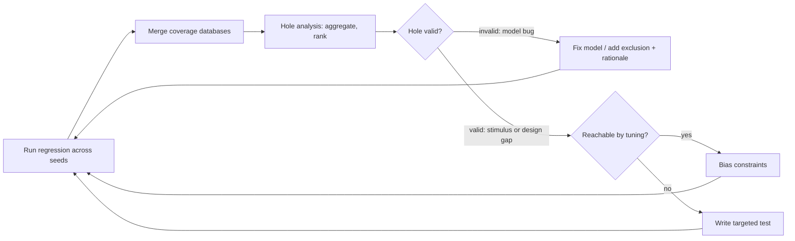

# 6. Coverage: Theory and Practice

The neural accelerator's regression has run clean for two weeks: every test
passes, and the code coverage report on the accelerator RTL reads 100% — every
line, every branch executed. Neither fact rules out the job that breaks the
accelerator, and an audio keyword-spotting model supplies it: 2-bit weights, a
tensor one pixel wide, launched while the DMA engine streams camera frames
through the same SRAM banks. The accelerator's weight prefetcher, starved by the
contention, wraps its buffer pointer one entry too early — but only when the
weight stream ends mid-beat, which only happens when a degenerate geometry meets
the narrowest precision. The output feature map is subtly wrong. Nothing in two
weeks of green regressions ever created this situation, and no verification
metric then in place could have revealed that it was never created: *what the
tests never did* was the question none of them could answer. Code coverage said
"every line executed"; it cannot say "every configuration exercised," because
the missing scenario was not a line of RTL but a *combination* — precision ×
geometry × contention — living in the specification, not the code structure.
This chapter builds the instrument that measures exactly that, and the
discipline of trusting it only as far as it deserves.

### Chapter map

- §6.1 states what code, functional and assertion coverage each measure, and
  what each is structurally blind to.
- §6.2 sets out what each code-coverage sub-metric can see and what it cannot,
  and fixes the family's role from its structural blindness: computed from the
  implementation against the implementation, its holes are meaningful and its
  fullness is not.
- §6.3 establishes the opposite economics — a model specified by hand from the
  specification's intent, in the covergroup, coverpoint, bin and cross vocabulary
  the language provides — and why a coverpoint left to its automatic bins records
  something that means nothing.
- §6.4 establishes that "100% coverage" is a statement about the *model* of the
  design, never the design itself, and connects it to Chapter 3's impossibility
  results.
- §6.5 designs a functional coverage model as a deliberate engineering act: from
  features to attributes to coverpoints, with bins that encode intent rather than
  decorate a report.
- §6.6 establishes, by setting the accelerator's model beside a dishonest twin
  that reaches 100% on the same feature, that a coverage report cannot be judged
  without reading the model behind it.
- §6.7 states what to do when a cross explodes combinatorially: shape it in the
  model, with each exclusion carrying its reason in specification vocabulary, so
  that the reachable space is a claim a reviewer can hold and a checker can
  falsify.
- §6.8 sets out how closure actually proceeds: analyzing holes, choosing between
  targeted tests and constraint tuning, and knowing when to stop.
- §6.9 excludes what cannot or need not be covered — honestly, reviewably, and
  without quietly redefining success.

## 6.1 The coverage landscape: three families, one taxonomy

Simulation gives you an existence proof: *this* stimulus produced *this* response,
and the checkers accepted it. Coverage is the complementary instrument — it records
which situations your tests created, so you can reason about the ones they did not.
Chapter 4 placed coverage closure in the lifecycle; this chapter opens the
instrument.

Practitioners sort coverage into three families. **Code coverage** measures which
structures of the RTL source — lines, branches, expressions, transitions — the
simulations executed. **Functional coverage** measures which *specified behaviors*
occurred, using models the engineer writes deliberately. **Assertion coverage**
measures the activity of assertions: which were evaluated, triggered, completed.
What separates them matters more than tooling: who defines the metric, and from
what source.

Piziali's taxonomy — the founding one, and the frame this chapter builds on — makes
the difference precise with two axes. A coverage metric has a *kind* — **implicit**
(inherent in a representation, like the statements of a hardware description
language) or **explicit** (invented and defined by the engineer) — and a *source* —
the design's **implementation** or its **specification** [cit:B5]. The two axes
define four coverage spaces: code and structural coverage are
implicit-implementation; functional coverage built from the specification is
explicit-specification; functional coverage of microarchitectural detail (a
pipeline's occupancy, an implementation FIFO's high-water mark) is
explicit-implementation; and the implicit-specification quadrant — metrics inferred
automatically from a natural-language spec — had no practical implementation as of
2004 [cit:B5]. The taxonomy is not academic bookkeeping. It tells you, for any
metric someone shows you, *whose judgment it embodies*: implicit metrics come for
free and embody nobody's; explicit ones cost effort and are exactly as good as the
engineering behind them. A **coverage space** is a multi-dimensional region
described by attributes and their values — what the industry loosely calls a
*coverage model* [cit:B5].

Apply the quadrants to the opening scenario and the diagnosis writes itself. The
accelerator's line coverage is implicit-implementation: free, automatic, green. A
model of job attributes — precision, geometry, DMA contention — would have been
explicit-specification, and nobody had written one. A model of the weight
prefetcher's buffer occupancy would have been explicit-implementation: also absent,
and where the bug physically lives. Three quadrants were empty, and the one filled
was the one that embodies nobody's judgment.

All of this is baseline practice by 2024: adoption of code coverage, functional
coverage and assertions in the IC/ASIC market matured rapidly between 2007 and 2014
and has since largely stabilized within the margin of error — with the exception of
constrained-random simulation, which kept climbing [cit:R2]. Coverage is no longer
a differentiator; whether a team's coverage *means* anything is. That is the rest
of this chapter.

## 6.2 Code coverage: free, necessary, and structurally blind

Code coverage instruments the RTL and records which of its structures execute
during simulation. Its purpose is refreshingly humble: to determine whether you
forgot to exercise some code in the design [cit:B2]. Because the metric is implicit
in the language, tools extract it automatically — no modeling effort, no judgment,
no maintenance. That economy is why every flow enables it, and why every flow must
know what each sub-metric can and cannot see.

**Line and statement coverage** report which source lines executed at least once.
They catch dead configuration branches, unexercised error legs, whole features no
test ever reached — a DMA error-reporting path nobody triggers shows up as a block
of red lines. They catch nothing about *why* or *in what context* a line ran: a
statement executed once, under the friendliest possible conditions, is "covered."

**Branch coverage** reports whether each decision point took both directions. It is
strictly stronger than statement coverage and still combinatorially weak, because
covering decisions individually says nothing about **path coverage** — the
sequences of decisions taken together. A suite can hold 100 percent statement
coverage while covering only 75 percent of control paths, and paths grow
exponentially with the number of control-flow statements
[cit:B2]. On the DMA midend, the branch that legalizes a 4 KB-crossing transfer and
the branch that handles a negative stride may each be covered while the *path*
taking both in one transfer — the one hiding this book's canonical corruption
bug — was never walked.

**Condition and expression coverage** look inside Boolean expressions: did each
controlling term independently cause the decision? Take a branch guarded by
`parity == ODD || parity == EVEN`: statement coverage reads 100 percent while
expression coverage sits at 50 percent, because no testbench ever set `EVEN` — an
oversight statement coverage cannot report. Reaching 100 percent expression
coverage is itself extremely difficult [cit:B2].

**Toggle coverage** reports which bits of which signals changed value (0→1 and
1→0). It is the coarsest of the family and survives because it approximates "did
any activity reach this structure at all" — useful for integration sanity and
power-intent connectivity — and because it is the only code metric that sees inside
structures the others treat as one object.

**FSM coverage** extracts state machines and reports visited states and traversed
arcs. The gap between the two is the lesson: a five-state machine with 14 possible
transitions reaches 100 percent state coverage from a single sequence covering only
36 percent of the transitions. And because the transitions are extracted from the
implementation, the tool cannot know whether an extracted transition was intended,
or an intended one missing — the graph itself needs review against the
specification [cit:B2]. Some transitions may be unreachable given the protocols
feeding the FSM; determining which is a job for a property checker [cit:B2] — a
thread Part IV picks up.

Now the structural blindness, which is why this chapter does not end here. Code
coverage is computed **from the implementation, against the implementation**, so it
cannot represent — even in principle — anything the designer did not write. The
sharpest formulation: the code in an empty module is always 100% covered [cit:B2].
If the accelerator's designer never implemented the 2-bit weight unpacking mode, no
code metric will report it missing; every test of the modes that *do* exist passes
and the report glows green. What 100% code coverage means is precisely this: the
entire design implementation was executed. It provides no indication, in any way,
of the correctness or completeness of the verification suite; low numbers are a
reliable alarm, but a high number is by no means an indication that the job is over
[cit:B2].

That asymmetry fixes code coverage's role: a cheap automatic *backstop*, run from
the first regression, whose every hole is a missing test, dead code, or a piece of
the implementation nobody understood. Its holes are meaningful; its fullness is
not.

> **Scenario.** The crossbar's ID field is 4 bits wide, and in this regression the
> five managers only ever index IDs 0 through 4, because the sequence library pins
> one ID per manager; the debug manager, ID 4, issues nothing at all. So ID bits 3
> and 2 never change value. Line coverage on the ID-decode logic reads 100%: the
> decoder executes every cycle. Toggle coverage reads 50% — four of the eight bit
> transitions missing — and refuses to budge. **Approach.** The team traces both
> stuck bits, and the answer it reaches for first is wrong. Bit 3 looks dead by
> construction — five managers, none indexing past 4 — but nothing in the design
> says so: the field is 4 bits, AXI4 permits a manager any of the 16 values, and
> the interconnect widens the field precisely so that managers need not agree on
> which IDs they use (Arm IHI 0022H.c §A5.1 "AXI transaction identifiers", §A5.2.3 "Interconnect use of transaction identifiers") [cit:S18]. What the regression has established is a property of its own
> stimulus, not of the crossbar. Bit 3 is therefore *unreached*, not unreachable,
> and excluding it means recording a decision about the sequence library, with an
> owner and an expiry (Section 6.9) — not asserting a structural fact. Bit 2 is set
> only by the debug manager, whose transactions the environment never routed
> through the crossbar: a testbench wiring bug line coverage could not see.
> **Why.** Different code metrics have different blind spots, and the cheap ones
> earn their keep by disagreeing with each other. The second lesson is narrower and
> costs more when missed: the moment a hole is called *unreachable*, someone must be
> able to name the clause that makes it so.

## 6.3 Functional coverage: the metric you must deserve

Functional coverage inverts the economics. Where code coverage is inferred from the
design automatically, functional coverage is specified entirely by the engineer,
from the specification's intent, independent of the code's structure — so it
requires up-front effort: someone has to write the model [cit:S8]. That effort buys
the only metric family able to measure what the opening scenario lacked: *whether
the specified situations occurred*, including situations the implementation
silently omits.

SystemVerilog is today's lingua franca for these models (IEEE 1800-2023,
Clause 19). A **covergroup** is the container: a user-defined type that
encapsulates the specification of a coverage model, defined once and instantiated
as many times as the environment needs [cit:S8]. Inside it, a **coverpoint**
designates one variable or expression to observe and partitions its values into
**bins** — counters, each representing a value or set of values whose occurrence
you care about. A **cross** enumerates the Cartesian combinations of two or more
coverpoints, because most interesting bugs — as Chapter 2's breakage thinking
predicts — live where attributes interact. Bins can also declare intent
negatively: `ignore_bins` removes values from the space, while `illegal_bins` goes
further — an illegal value does not merely fail to count, it raises a runtime error
taking precedence over any other bin that would have claimed it [cit:S8]. Keep that
asymmetry for Section 6.9: *ignore* means "not my job," *illegal* means "must never
happen" — the second is a checker wearing coverage syntax.

One language default deserves early suspicion. A coverpoint written with no bins
gets them automatically: one bin per value for small domains, otherwise the range
sliced uniformly into at most `auto_bin_max` bins — default 64 [cit:S8]. Automatic
bins are the coverage equivalent of a meeting with no agenda: something will be
recorded, and none of it will mean anything. Slicing the accelerator's 9-bit
tensor-width field into 64 uniform bins makes each bin eight values wide, so the
boundary value 16 — the MAC lane count, where the behavior changes — lands in an
anonymous bucket labeled `auto[16:23]`, indistinguishable from widths 17 through
23. Widths 16 and 17 are exactly the two the datapath treats differently, and the
tool has just merged them. Section 6.6 returns to this as the *dishonest bins*
problem.

Functional coverage then divides usefully in two: **data/stimulus coverage** —
which values and configurations were processed, best captured with covergroups —
and **protocol/activity coverage** — which sequences and control scenarios
occurred, best expressed as `cover property` statements over temporal sequences
[cit:B1]. "A 2-bit-weight job ran while the DMA contended for SRAM" is data
coverage; "a write response arrived while two same-ID writes were outstanding under
back-pressure" is activity coverage, and forcing it into a covergroup produces
sampling contortions a three-line SVA sequence expresses directly.

**Assertion coverage** is the third family, and the smallest in concept: measure
the assertions themselves. At minimum, which were evaluated and which vacuously
satisfied (IEEE 1800-2023 §16.14.8) [cit:S8] — an assertion whose antecedent never occurred has verified nothing, a
direct echo of Chapter 3's observability argument. Beyond that, `cover property`
directives are declared functional coverage points in their own right, and
designers should mark implementation corner cases with them [cit:B1] so the
unverified ones announce themselves rather than living in someone's memory of the
plan. The coverage of checker and coverage assertions alike is itself measurable
and analyzable [cit:B5]. This is the connective tissue between this chapter and
Chapter 11: the assertions are checkers, their coverage is the proof that the
checkers were awake.

The three families are not rivals; they are three projections of the same question
asked from different sources of truth. Code coverage asks the implementation, "was
all of you exercised?" Functional coverage asks the specification, "did everything
you promise actually happen?" Assertion coverage asks the checkers, "were you there
when it did?" A verification effort needs all three, and Part IV adds a fourth
voice — formal's coverage models [cit:D11] — to the conversation (see Chapter 16).

## 6.4 What 100% means — and what it never can

Every coverage percentage is a fraction, and the denominator is the part people
forget. When the accelerator's functional coverage reads 100%, the denominator is
not "everything the accelerator can do" but "everything the model's author thought
to enumerate." Reaching 100% functional coverage indicates the completeness of the
test suite *against the model* — it says nothing about the completeness of that
model, and (unless bins encode invalid values) nothing about correctness [cit:B2].

This is Chapter 3 arriving to collect its debt. There we established that the
reachable state space is finite yet unvisitable — astronomically beyond
enumeration — and that exhaustive verification is therefore impossible; the honest
response was to partition behavior into equivalence classes and sample each. A
functional coverage model *is* that partition, made executable: bins are
equivalence classes with a counter attached. So it inherits the partition's
fundamental property — it is a lossy, chosen projection of an intractable space.
"100%" measures progress across the projection, never across the space.

The loss has a name and a measure: **fidelity**, the degree to which a coverage
model captures the actual behavioral requirements. A control register with 18
specified values, modeled as 18 bins, has no abstraction gap; a 32-bit address bus
whose 2³² values are grouped into 16 ranges has a substantial one. Fidelity is also
lost by omitting *relationships*: if bit CR3 may only be 1 when CR7 is 1 and the
model never encodes that dependency, it is blind to exactly the kind of coupling
where bugs live [cit:B5]. Fidelity matters because of the bug's *footprint* in the
coverage space: some bugs occupy a huge region — any test in the right mode trips
them — while others occupy a point: one instruction, one fault type, one interrupt,
coincident. A high-fidelity model is far more likely to distinguish, and therefore
demand, the bug-exposing scenario; a low-fidelity one files it with its harmless
neighbors [cit:B5]. You cannot afford high fidelity everywhere — that way lies
Section 6.7's intractable full cross — so fidelity is *spent*, like any budget,
where the risk analysis of Chapters 3 and 5 says the bugs are.

One more deflation, the most important in the chapter. Coverage measures
**sampling, not correctness**. It records that a situation occurred; whether the
design behaved correctly in it is the business of the checkers — scoreboards,
reference models, assertions (Chapters 8 and 11). Coverage methodology openly
*assumes* an orthogonal mechanism detects device misbehavior [cit:B5]. Break
that assumption and coverage becomes vanity: a covergroup counting jobs whose
outputs nobody compares is a tally of unwitnessed events — Chapter 2's
unread-log problem wearing a metrics dashboard. Pin this above
the desk: the actual goal of verification is to remove bugs, and coverage closure
is only a well-defined and measurable *derivative* of that goal [cit:D10]. A
derivative can be optimized directly, and that is the pathology: stimulus tuned to
tickle bins while checkers sleep converges on 100% faster than honest verification,
having discarded the part that was slowing it down. The cure is structural, not
moral: review coverage models *together with* the checkers watching the same
events, and make "who detects it if this scenario misbehaves?" a mandatory review
question for every coverpoint.

## 6.5 Designing the coverage model: an engineering act

A coverage model is not a transcription task. Chapter 5 ends with a verification
plan: features extracted from the specification, each with a measurable pass/fail
intent. This chapter's job begins there — turning a feature into attributes, bins,
crosses and sampling events a simulator can count. The work has two phases:
**top-level design**, which writes the model's semantic description and identifies
the attributes and their relationships, and **detailed design**, which answers
*what* to sample, *where*, and *when* to sample and correlate attributes [cit:B5].
Writing the semantic description first — one sentence of the form "record all valid
operating conditions of X defined by attributes A, B, C" [cit:B5] — forces the
author to say out loud what the model claims to measure, the only thing a reviewer
can hold it to.

The judgment concentrates in three places.

**Choosing attributes.** Attributes come from the specification's parameters (the
accelerator's weight precision), from the environment's degrees of freedom (DMA
contention), and — with restraint — from the implementation's own choices (the
prefetch buffer's occupancy). The first two make specification coverage; the third
is implementation coverage in Section 6.1's taxonomy, legitimate but owned by a
different question ("did we stress this microarchitecture?") [cit:B5]. An attribute
no checker observes and no risk motivates does not belong in the model.

**Choosing bins.** Bins are where breakage thinking (Chapter 2) becomes code. The
question is never "what values can this field take?" but "at which values does the
*behavior* change?" — boundaries, alignment points, wrap-arounds, the value equal
to a hardware resource count, the value one past it. Uniform slicing is what the
tool does when the engineer abstains [cit:S8]; deliberate bins are unequal by
design, dense where behavior bends and coarse where the specification is
indifferent. If the only honest name for a bin is `auto[128:191]`, it is not
measuring anything anyone asked for.

Some cliffs sit in the data rather than the configuration. On a video codec the
control flow bends on the picture itself — an all-skip macroblock, a motion vector
pinned at the search-window limit, a coefficient block that trips escape coding —
so the monitor must *compute* the bin from the stream rather than read it from a
register. Those are exactly the frames on which a bit-exact reference model
diverges.

**Choosing sampling.** *Where* determines truth: sample attributes at the interface
or unit whose behavior they describe — job attributes at the accelerator's register
interface, contention where the SRAM arbitration happens — not wherever a handle
was convenient. *When* determines meaning: sample when the values are jointly valid
and stable. The accelerator model below samples at job completion with the
contention flag *latched during* weight streaming; sampling at job launch would
record whether the DMA happened to be busy at an irrelevant instant, and every bin
it filled would be a small lie. Correlation time is a first-class design decision
[cit:B5].

> **Scenario.** The DMA vplan hands over feature `DMA-F06a` (Chapter 5): "2D
> transfers are legalized correctly across the 4 KB AXI boundary for all stride
> signs." The boundary the row names is AXI4's, Arm IHI 0022H.c §A3.4.1 "Address structure" [cit:S18]. Its closure metric is the covergroup `cg_2d_4kb`. **Approach.** Every bin
> sits on a behavioral cliff rather than a round number: stride sign — `pos`,
> `zero`, `neg` (**3** bins); the distance from a row's start address to the next
> 4 KB boundary, classified against the burst size — `gt_burst`, `eq_burst`,
> `lt_burst`, `straddle` (**4** bins); burst length at its extremes — 1, 255, 256
> (**3** bins); and whether the other DMA channel is active (**2** bins, one per
> value of a one-bit flag — the one place automatic bins tell the truth). The cross
> is 3 × 4 × 3 × 2 = **72** combinations, each nameable in specification
> vocabulary. **Why.** This book's canonical DMA bug lives in the
> `neg` × `straddle` × other-channel-active corner — two of those 72 points, not
> three: the generator's solver budget caps a row at 256 beats, so a straddling row
> splits into pieces none of which can be the 256-beat maximum — which makes that
> point of the corner unreachable by a choice the team recorded rather than by luck
> of stimulus, and so a waiver to write rather than a hole to chase (Section 6.9).
> A model with those bins
> *demands* the bug's scenario; 64 automatic bins over the stride field would have
> filed it with the crowd.

## 6.6 Worked example: a coverage model for the neural accelerator

The accelerator's canonical parameters (Chapter 1): a fixed-point convolution
engine with configurable 2/4/8-bit weights, a 16-lane MAC datapath, weights
streamed from memory, jobs programmed through registers. The vplan feature:
*quantized convolution jobs execute correctly for all weight precisions and tensor
geometries, including under memory contention with the DMA engine.*

Top-level design first. Semantic description: *record every completed convolution
job as the combination of weight precision, tensor width class, input channel class
and whether the DMA contended for the weight-stream SRAM banks during execution.*
All four attributes correlate at one instant, job completion:

{table: accel_job_attributes} The four attributes of the accelerator's job coverage model, with where each value is read from and when it is captured. Three are read off the job registers at launch and the contention flag is latched across the weight-streaming window, so that all four are jointly valid at a single sampling instant, job completion — the choice §6.5 calls the one that determines meaning.

| Attribute | Source | Sampled |
|---|---|---|
| weight precision (2/4/8-bit) | job registers | at job launch |
| tensor width (1–256) | job registers | at job launch |
| input channels (1–512) | job registers | at job launch |
| DMA contention | SRAM arbiter | latched during weight streaming |

Detailed design, in SystemVerilog:

```systemverilog
typedef enum logic [1:0] {PREC_2B, PREC_4B, PREC_8B} prec_e;

typedef struct packed {
  prec_e        prec;      // weight precision
  logic [8:0]   tensor_w;  // tensor width in pixels, 1..256
  logic [9:0]   in_ch;     // input channels, 1..512
} job_attr_t;

covergroup cg_accel_job with function sample(job_attr_t job,
                                             logic dma_contended);
  option.per_instance = 1;

  // Enum: automatic bins give one named bin per precision -- acceptable
  // here because every enum value is individually meaningful.
  cp_prec : coverpoint job.prec;

  // Width bins follow the datapath, not the number line: behavior bends
  // at the 16-lane boundary and at the extremes.
  cp_width : coverpoint job.tensor_w {
    bins single      = {1};          // degenerate geometry
    bins sub_lane    = {[2:15]};     // partial lane utilization
    bins lane_exact  = {16};         // exactly one full MAC pass
    bins lane_plus1  = {17};         // full pass + 1-pixel remainder
    bins multi_lane  = {[18:255]};   // steady-state streaming
    bins max_width   = {256};        // architectural maximum
    // Legal range is 1..256 in a 9-bit field: the register checker must
    // reject the rest, so reaching the datapath is a bug, not a hole.
    illegal_bins out_of_range = {0, [257:511]};
  }

  cp_ch : coverpoint job.in_ch {
    bins one_ch   = {1};
    bins few_ch   = {[2:15]};
    bins accum_16 = {16};            // accumulator reuse boundary
    bins many_ch  = {[17:511]};
    bins max_ch   = {512};
    // Legal range is 1..512; same contract as cp_width above.
    illegal_bins out_of_range = {0, [513:1023]};
  }

  cp_dma : coverpoint dma_contended {
    bins quiet     = {1'b0};
    bins contended = {1'b1};
  }

  // The cross that would have caught the opening scenario:
  // precision x width-class x contention = 3 x 6 x 2 = 36 combinations.
  x_prec_width_dma : cross cp_prec, cp_width, cp_dma;

  // Channels interact with precision (accumulator packing), not with
  // contention: a second, smaller cross instead of one giant one.
  x_prec_ch : cross cp_prec, cp_ch;
endgroup
```

Read the model as an argument, because that is what it is. The width bins encode a
claim: the datapath treats widths 18 and 200 equivalently (both steady-state
multi-lane streaming) but treats 16 and 17 as different worlds — the reviewer can
agree or produce a counterexample from the spec. The `illegal_bins` encode a claim
of a different kind: those values must never reach the datapath, so if one does the
simulation stops rather than quietly counting it (Section 6.9). Illegal values are
excluded from coverage [cit:S8], so `cp_width` still offers 6 bins and `cp_ch` 5.
The crosses encode a second claim: precision interacts with geometry and with
contention (the weight unpacker's timing depends on both), while channel count
interacts with precision only — so instead of one cross of 3 × 6 × 5 × 2 = 180
combinations we maintain 36 (3 × 6 × 2) + 15 (3 × 5) = 51, each defensible. The
sampling encodes a third: `dma_contended` is latched across the whole
weight-streaming window and sampled once, at job completion, when all four
attributes are jointly valid. The opening scenario's bug lives in bin
`x_prec_width_dma: (PREC_2B, single, contended)` — a bin this model *demands*, and
without which no green report is possible.

Now the counterexample. Here is the same feature "covered" dishonestly:

```systemverilog
covergroup cg_accel_job_vanity with function sample(job_attr_t job,
                                                    logic dma_contended);
  cp_prec  : coverpoint job.prec;
  cp_width : coverpoint job.tensor_w {
    bins lo_half = {[1:128]};
    bins hi_half = {[129:256]};
  }
  cp_dma   : coverpoint dma_contended;
  // no cross
endgroup
```

Everything else is held constant — same attributes, same sampling call, same
instant — so the sins here are exactly the two this model commits. This covergroup
compiles, runs and reaches 100% before the first coffee of the first regression,
and every one of its numbers is a small deception. `lo_half` lumps the degenerate
width 1, the lane boundary 16 and the remainder case 17 into one 128-value bin: an
abstraction gap that files the bug-exposing scenarios with their harmless
neighbors [cit:B5]. And there is no cross, so "2-bit weights" and "contention" are
each ticked without ever having occurred *together*.

A third way to fake it needs no change to the bins at all: keep the honest model
and replace its `sample()` call with `@(posedge clk iff job_done)`, reading
contention live at that edge — which measures whether the DMA happened to be busy
the instant the job retired, not whether it contended during streaming, and fills
the bin either way. Nothing in the report distinguishes any of these from the
honest model. That is the uncomfortable truth about functional coverage: the metric
is exactly as good as the model, and the model can only be judged by *reading it* —
which is why coverage model review, against the vplan and the checkers, is a gate
in every serious flow.

## 6.7 When the cross explodes: shaping the crossbar model

Crosses are where coverage models die of ambition. Take the crossbar: 5 managers
(core-I, core-D, two DMA channels, debug) × 4 subordinates (SRAM, boot ROM, APB
bridge, the accelerator). Route coverage alone — did every manager reach every
subordinate? — is 20 combinations, trivially worth having. Now add what protocol
verification cares about: burst type (FIXED, INCR, WRAP: 3), direction (2), a
modest 6 buckets of burst length, 4 transfer sizes on the 64-bit data bus. The full
cross is 5 × 4 × 3 × 2 × 6 × 4 = 2,880 combinations; fold in the 16 transaction IDs
and it is 46,080. Long before that the model has stopped being an argument anyone
can review — and many of its bins are *unreachable by construction*: the
instruction port never writes, the boot ROM accepts no writes, the debug manager
issues only single-beat INCR accesses.

Unreachable cross bins are not harmless padding. They make 100% unattainable, which
forces late bulk exclusions, which destroys the audit trail — or they normalize a
dashboard that reads 61% forever, teaching everyone to stop looking (Chapter 7
returns to that pathology). The engineering answer is the **shaped cross**: state
the reachable space explicitly, in the model, with the reasons attached.

```systemverilog
typedef struct packed {
  logic [3:0]  mgr_id;    // 5 managers, IDs 0..4
  logic [1:0]  sub_id;    // 4 subordinates
  logic [1:0]  burst;     // AxBURST
  logic        is_write;  // direction
} xbar_txn_t;

covergroup cg_xbar_route with function sample(xbar_txn_t t);
  cp_mgr : coverpoint t.mgr_id {
    bins core_i = {0};  bins core_d = {1};
    bins dma[]  = {[2:3]};  bins dbg = {4};
  }
  cp_sub : coverpoint t.sub_id {
    bins sram = {0};  bins rom = {1};  bins apb = {2};  bins accel = {3};
  }
  cp_burst : coverpoint t.burst {
    bins fixed = {2'b00};  bins incr = {2'b01};  bins wrap = {2'b10};
    // 2'b11 is reserved in AXI4: a manager must never issue it.
    illegal_bins reserved = {2'b11};
  }
  cp_dir : coverpoint t.is_write {
    bins rd = {1'b0};  bins wr = {1'b1};
  }

  x_route : cross cp_mgr, cp_sub, cp_burst, cp_dir {
    // Instruction port is read-only by construction.
    ignore_bins ifetch_wr = binsof(cp_mgr.core_i) && binsof(cp_dir.wr);
    // Debug manager issues only INCR accesses.
    ignore_bins dbg_burst = binsof(cp_mgr.dbg) &&
                            (binsof(cp_burst.fixed) || binsof(cp_burst.wrap));
    // Writes to the boot ROM must be rejected: observing the error
    // response is a required event, so it lives in its own
    // error-response covergroup rather than as a hole in this cross.
    ignore_bins rom_wr = binsof(cp_sub.rom) && binsof(cp_dir.wr);
  }
endgroup
```

Each `ignore_bins` line [cit:S8] carries its justification as a comment, in spec
vocabulary, reviewable in the same diff as the model. The model's reserved `AxBURST` encoding is the protocol's own: Arm IHI 0022H.c §A3.4.1 "Address structure", Table A3-3 "AxBURST signal encoding", page A3-50 [cit:S18]. The shaped cross states the
*intended* reachable space, and that statement is falsifiable: if a "read-only"
instruction port ever does produce a write, the protocol checkers scream, which is
where that requirement belongs. Note the boot-ROM line — shaping split one lump
into an ignored stimulus combination *and* a positively-required error-response
coverage point elsewhere. Shaping is not deletion; it is relocation of intent to
where it can be honestly measured.

Count what shaping bought. Unshaped, this cross is 5 managers × 4 subordinates × 3
burst types × 2 directions = **120** combinations. The exclusions remove 12
(`ifetch_wr` = 1 × 4 × 3 × 1), 16 (`dbg_burst` = 1 × 4 × 2 × 2) and 15 (`rom_wr` =
5 × 1 × 3 × 1) — 43 in all, but `ifetch_wr` and `rom_wr` overlap in 3, `dbg_burst`
and `rom_wr` in 2, and the first two are disjoint, so their union is 38. What
remains is **82** defensible combinations rather than 120 — in a model that never
had to grow to the 2,880 of the full six-axis cross. That is a model a reviewer can
hold in their head, the real tractability criterion. On the compute cluster's
8-core interconnect or the mesh NoC the discipline is the same: cross only the two-
and three-way interactions the risk analysis names, and let assertions own the
rest.

On the GPU the axes stop being structural altogether. A shader cluster's
interesting space is a space of *occupancy shapes* — thread groups in flight ×
divergence class × memory-access pattern — a cross small enough to write down in
full. The difficulty is that which of its cells are reachable is a property of the
workload rather than of the configuration: a kernel without branches sits in one
divergence bin for its whole run, and no biasing of the generator will move it out
of that bin. So the model must be crossed against workload class, and a hole then
reads "we have never run a shape of program that could produce this", not "we have
never randomized into it" — a distinction that changes who fixes it.

Past a certain point shaping stops being enough and the metric changes engine. On a
directory-based coherent hub the interesting space is not routes but *protocol
states* — combinations of MESI state, directory entry and outstanding snoop across
several caches, a reachable set nobody enumerates by hand. The question becomes
"over which combinations did we prove the invariant, and what did the assumptions
exclude?" — formal's own notion of a coverage model [cit:D11], and Chapter 16's
subject.

## 6.8 Closure: the workflow from holes to done

Coverage closure is where the metric meets the schedule: it is reached when the
entire coverage space spanned by the model has been observed [cit:D10] — with, in
any honest flow, the exclusions accounted for alongside. Chapter 4 placed it on the
lifecycle timeline; {ref: closure_loop} draws the loop itself. Traditionally it is manual: run the
regression across seeds, merge the coverage databases, analyze what is still empty,
modify constraints or write directed tests, rerun — until the target is reached,
the merge-and-analyze step alone consuming significant time and compute [cit:D15].
Coverage also accumulates across simulators, emulators and formal tools, and a
standard API and interchange format exists to keep it mergeable across dynamic and
static tools and across a project's lifetime [cit:S3] (Chapter 16 covers unified
coverage in depth).



{figure: closure_loop} The coverage-closure loop, from a seeded regression through merge and hole analysis to the action each hole earns. The branch that carries the discipline is the validity question: an invalid hole is a defect in the model, answered with an exclusion and its rationale — the path §6.9 exists to keep honest — while a valid hole is answered with biased constraints or a targeted test. Every branch returns to the regression, so nothing is closed without a rerun.

**Reading holes.** A coverage hole is required stimulus or device behavior not yet
observed [cit:B5]. Raw hole lists are stupefying; the analysis techniques, first
reported by IBM's Haifa laboratory in 2002, compress them into meaning:
**aggregation** coalesces many point-holes into few larger regions;
**partitioning** groups holes that share semantics; **projection** finds attribute
values *never* observed in any combination; and Hamming distance — the number of
attribute values in which two holes differ — measures proximity [cit:B5]. Fifty
scattered holes that aggregate into "no 2-bit-weight job has ever run under
contention, at any geometry" become one finding, one root cause, one action. A
projected hole outranks any single missing cross product: it says a whole dimension
of the stimulus is broken.

**Classifying holes.** Every hole is one of two things, and the distinction drives
everything downstream. A **valid hole** is an intended observation that has not
happened — on the input side, usually a stimulus weakness; on the output or
internal side, possibly a design error suppressing the behavior. An **invalid
hole** is a bug in the coverage model itself: a combination that cannot or should
not occur, written into the model by misunderstanding — and its fix is a
restriction on the model (an exclusion with a reason), not a test [cit:B5].
Section 6.9 is about keeping that second path honest.

Classification also decides what the stimulus must be *capable* of. On an inline
AES-GCM crypto engine, a hole in the failed-authentication bin is never a
constraint-tuning problem: the environment must be able to corrupt a tag after the
engine has computed it, truncate a ciphertext mid-stream, or present a key slot
that does not match the one the message was encrypted under — manipulations a
well-behaved driver has no path to perform at any seed. If it cannot, the hole
marks a gap in the testbench's capability, not in its randomization. Which fault
classes were injected is a coverage model in its own right — one teams routinely
forget to write, then find missing at sign-off.

**Filling holes: tune or target.** The first lever is **generation feedback**: bias
the constraint distributions so the generator's probability mass lands on what is
missing — input holes respond directly; output and internal holes must first be
traced back to the input scenario parameters that provoke them [cit:B5]. The second
is the **targeted test**: encode the missing scenario directly. Tuning is cheap per
hole and preserves the randomness that finds unplanned bugs (Chapter 9); targeting
is precise but brittle. Mature teams tune while holes come in families and target
when the survivors become singular — knowing the endgame inverts the economics: as
only hard-to-reach points remain, progress decelerates sharply [cit:B2], and as of
2012 manually closing the last 20% of coverage costs up to 80% of a verification
team's time and resources [cit:P19].

That cost is why closure automation is a research and product area rather than a
convenience. The published spectrum, in increasing ambition: automated constraint
regeneration, where uncovered bins are read back from the merged database and
turned mechanically into constraints for the next run [cit:D15]; solver-level
distribution, where the constrained-random engine distributes its solutions to
satisfy the declared coverage model, converging measurably faster than undirected
constrained random [cit:D10]; and learning-based coverage-directed generation —
Bayesian networks, Markov models, inductive logic programming, evolutionary
methods — which learns the mapping from generator directives to achieved coverage
and inverts it [cit:P19]. One instance: a deep reinforcement-learning agent
generating stimulus on the fly for a compression-encoder DUT hit 133 of 136 hard
functional bins in 500 training episodes where uniform-random stimulus plateaued at
28 [cit:D1]. Chapter 25 asks when such techniques transfer and when they are
demo-ware; the structural point belongs *here*: every one optimizes the derivative,
not the goal [cit:D10]. Automation makes Section 6.4's checking question *more*
urgent — a machine-optimized 100% arrives faster and with even less human contact
with the scenarios.

That last family has an older and better-attributed instance than the
reinforcement-learning one. On the Storage Control Element of an IBM z-series
system, a Bayesian network trained on the correlation between test-generator
directives and observed coverage synthesized new directive files and closed all
223 tasks that a 160-test training set had left uncovered, within 250 further
test-cases, where an expert's hand-written directive file reached only two-thirds
of them in over 400 [cit:P16]. A different lever acts on the regression rather
than on the generator: instead of biasing what is produced, learn which
already-generated tests are worth simulating. On the Radar Signal Processing Unit
of Infineon's AURIX TC3XX — a large, highly configurable block whose tests are
described by 300 configuration fields — classifiers trained on previously
simulated runs nearly closed the same coverage model while simulating 18% fewer
tests [cit:P4].

**When to stop.** Stop when the *reviewed* model is full, the exclusion file is
current, and the closure history is boring — no model refinements for a stable
period. Note what evolves during closure: not only the stimulus but the model.
**Coverage model feedback** is part of the method: models start exploratory —
coarse, low-fidelity, goals around 80% — and are refined toward production models
with goals of 95 to 100 percent as understanding matures [cit:B5]; discovering
mid-closure that a model needs new attributes is the process working, not failing.
"100% and holding, on a model that stopped changing, with checkers that were awake"
is the honest sentence. What it feeds is Chapter 7's subject.

## 6.9 Honest exclusions: the waiver as a reviewable artifact

Every real project excludes coverage. The crossbar's instruction-fetch port never
issues a write, by construction of the port; the accelerator's register file has
reserved fields; parameterized RTL carries branches this configuration can never
take. Exclusion is not the failure mode.
*Unreviewable* exclusion is: the bulk waiver applied at 11 pm before a milestone,
the exclusion file nobody diffs, the tool-generated "excluded: unreachable"
annotation that quietly includes twelve bins that were merely hard.

The discipline has four rules, none of them expensive:

1. **Every exclusion carries its reason, inline.** Not "waived" but "instruction
   port is read-only by construction — see integration spec section 3.2." Section 6.7's
   shaped cross shows the pattern: the justification travels in the same artifact
   as the exclusion, so the review is a code review.
2. **Exclusions are classified by kind**, because kinds differ in owner and expiry:
   *structural* (tied parameters — expires if the parameterization changes),
   *specification* (combinations the spec forbids — expires if the spec revs), and
   *risk-accepted* (reachable but not worth the cost — expires never, which is why
   it needs the most senior signature). The third is the honest name for what bulk
   waivers hide.
3. **The model distinguishes "not my job" from "must never happen."** Excluding a
   forbidden combination with `ignore_bins` rather than `illegal_bins` [cit:S8] is
   a double loss — the space shrinks *and* the watchdog is dismissed. The
   invalid-hole rule of Section 6.8 points the same way: a hole caused by a
   coverage-model misunderstanding becomes a restriction on the model, stated as
   such [cit:B5] — and if the underlying condition is one the design must actively
   reject, the restriction belongs in a checker too.
4. **Exclusions are versioned and re-derived, not archaeological.** The exclusion
   file lives with the RTL and the vplan, is re-audited when either changes, and
   appears in the sign-off review as a first-class document. For code coverage,
   formal unreachability analysis can *prove* many structural exclusions rather
   than asserting them (see Chapter 15) — the strongest possible answer to "who
   says this is unreachable?"

The test of an exclusion regime is the auditor's question: for any uncovered bin,
can the team produce within a minute either a plan to cover it or a written,
attributed, still-valid reason not to? Anything else is 100% by redefinition —
moving the goalposts and mowing the old penalty box.

### In practice

Real closure looks like this. Code coverage is on from the first smoke test, but
nobody triages it until the design stabilizes — early holes are churn. Functional
coverage models are written alongside the testbench (writing them *after* stimulus
exists invites modeling what the stimulus already does — measuring the tests with
the tests), and they earn a formal review against the vplan and the checker
inventory: every coverpoint names the feature it measures and the checker that
catches misbehavior in it. During the long middle, the regression dashboard merges
code, functional and assertion coverage across the farm, which the cross-tool
interchange format enables [cit:S3]; a weekly triage meeting walks the aggregated
holes, not the raw bin list, assigning each
family a verdict: tune, target, fix the model, or exclude with a reason. Teams that
skip the verdict step meet it later as an undifferentiated 4% nobody can explain at
sign-off. The endgame is a grind and is staffed as one [cit:P19]: the last holes
are singular, expensive and frequently *informative* — a hole that resists three
targeted tests is, disproportionately often, sitting on top of a bug or a spec
misunderstanding. And the messy truth: every real project ships with an exclusion
file that was argued about, and the arguing is the value. A waiver nobody contested
is a waiver nobody read.

### Pitfalls

1. **Treating 100% code coverage as done.** Symptom: green structural metrics
   presented as verification quality. Cure: code coverage gates the *floor* (holes
   must be explained); functional coverage against the vplan is the ceiling
   [cit:B2].
2. **Automatic bins on meaningful fields.** Symptom: bins named `auto[112:127]` in
   the report. Cure: deliberate bins named in spec vocabulary; auto bins only where
   every value is equally (un)interesting [cit:S8].
3. **Coverage without checkers.** Symptom: coverpoints sampling events no
   scoreboard or assertion observes. Cure: ask "who fails if this sampled scenario
   misbehaves?" of every coverpoint [cit:B5,D10].
4. **The full cross.** Symptom: one cross with thousands of mostly-unreachable
   bins, stuck at 61% forever. Cure: shaped crosses with inline-justified
   `ignore_bins`; several small defensible crosses over one aspirational one.
5. **Sampling at the wrong moment.** Symptom: bins fill but targeted replays of
   "covered" scenarios find nothing resembling them. Cure: sample when attributes
   are jointly valid; latch condition flags across the window they describe.
6. **Bulk late waivers.** Symptom: coverage jumps 8% the week before sign-off on a
   single exclusion-file commit. Cure: exclusions classified, reasoned, attributed
   and reviewed as code — no orphan waivers.

### Summary

- Code, functional and assertion coverage answer different questions from
  different sources of truth — implementation, specification, checkers — and none
  substitutes for another [cit:B5].
- Code coverage is automatic and structurally blind: it can prove you are not
  done, never that you are; an unimplemented feature is invisible to it [cit:B2].
- A functional coverage model is an executable set of equivalence classes
  (Chapter 3): "100%" measures progress across *your model* and says nothing about
  that model's completeness or fidelity [cit:B2,B5].
- Coverage measures sampling, not correctness: closure is a measurable derivative
  of bug-removal and can be gamed precisely because it is one — checkers keep the
  derivative attached to the goal [cit:D10,B5].
- Model design is engineering: attributes from the spec, bins at the behavioral
  cliffs, crosses shaped to the reachable space, sampling when attributes are
  jointly valid [cit:B5].
- Closure is a loop — merge, analyze, classify, tune or target — whose endgame is
  expensive enough (up to 80% of effort for the last 20%) to justify automation,
  which raises the stakes on honest checking [cit:D15,P19].
- Exclusions are legitimate only as reviewable artifacts: classified, reasoned,
  attributed, versioned — never a substitute for a checker on forbidden behavior
  [cit:B5,S8].

### Further reading

Corpus sources. Piziali's *Functional Verification Coverage Measurement and
Analysis* [cit:B5] is the theory backbone — taxonomy, model design method, fidelity
and hole analysis in one place. Bergeron's *Writing Testbenches using
SystemVerilog* [cit:B2] gives the sharpest short treatment of what 100% does and
does not mean. The VMM book [cit:B1] codifies the data-versus-activity split and
the coverage/assertion guidelines. IEEE 1800-2023 Clause 19 [cit:S8] is definitive
for covergroup, bin, cross and option semantics; the UCIS standard [cit:S3] for
coverage interchange (with Chapter 16). On closure automation: a review of ML-based
coverage-directed generation [cit:P19], automated constraint regeneration
[cit:D15], solver-level coverage-driven distribution [cit:D10], deep-RL closure
[cit:D1], and coverage models for formal verification [cit:D11].

Non-corpus references (not citable above, listed for the curious): the *Coverage
Cookbook* (practical recipes for model construction); O. Lachish, E. Marcus, S. Ur,
A. Ziv, "Hole Analysis for Functional Coverage Data," DAC 2002 — the original
hole-analysis paper; H. Foster, A. Krolnik, D. Lacey, *Assertion-Based Design* —
the companion discipline to Section 6.3's assertion coverage.
