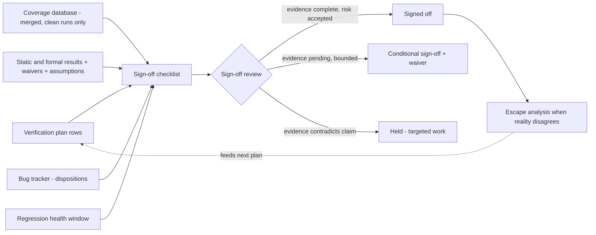

# 7. Metrics-Driven Sign-off

Two weeks before tape-out of the reference SoC, eleven months into its verification campaign, the project has to answer a one-line question about every block on the die: is it done? Intuition and the instruments do not answer it the same way. Intuition ranks the neural accelerator as the risk, because it is the newest block and the team verifying it is the least experienced, and the DMA engine as safe — quiet for three weeks, no new failures, the regression dashboard a wall of green. The metrics review says almost exactly the opposite. All the accelerator's plan rows are discharged but one — a contention cross its block-level bench cannot reach; its coverage is otherwise closed, and its bug discovery curve flattened *while* stimulus was still being added. The DMA's curve flattened too — but in the same three weeks, no new stimulus went in, the last severe bug arrived late and in a corner nobody had modeled, and the coverage crosses around that corner sit at 71%. Intuition was measuring team seniority and recent silence; the instruments were measuring the project, and the instruments were right. This chapter is about building those instruments, reading them honestly, and turning them into the one decision that cannot be un-made: sign-off.

### Chapter map

- §7.1 establishes why metrics — not intuition — are the only shared truth a verification project of SoC scale can have, and what that truth costs to maintain.
- §7.2 sets out what to instrument: per-feature status, coverage trends, bug curves, regression health, and where the engineers' time actually goes.
- §7.3 reads a bug-rate curve correctly, and in particular tells *flat because clean* from *flat because the stimulus stopped asking new questions*.
- §7.4 shows how a sign-off checklist aggregates evidence — plan, coverage, static and formal results, bug dispositions, reproducibility — into a defensible decision.
- §7.5 shows the checklist applied under real pressure, where identically flat bug curves carry a different verdict for every block in the room — signed off, conditionally signed off against a dated waiver, and held.
- §7.6 establishes how escape analysis turns escaped bugs into the next project's plan, without turning the post-mortem into a trial.

## 7.1 Metrics as the project's shared truth

Chapter 4 introduced sign-off as the lifecycle's last gate: a review that judges evidence against the plan (see Chapter 4). This chapter is about the evidence itself — where it comes from, how it can lie to you, and how to assemble it into a decision. The discipline has a name, **metrics-driven verification (MDV)**: run the project on quantitative measurements collected continuously from the verification process, rather than on status estimates collected from people. MDV is today the universally accepted baseline methodology for verification management [cit:D22]; the interesting questions are no longer *whether* to measure but *what*, and how to keep the measurements honest.

The case for metrics is a case against intuition — but a precise one. Gut feel, impressions and intuition genuinely work on small projects, where a few people can hold the entire design in their heads; on an SoC integrating many complex IP blocks, no single person has a view that spans the project, and the intuition of one or even several people may stop portraying its real state [cit:D20]. The reference SoC sits exactly at that threshold: ten to fifteen engineers, each knowing one or two blocks deeply and the rest by rumor. The intuition that ranked the DMA as safe was not wrong out of carelessness — it was wrong *structurally*, because it was one hop from the work, and one hop is enough. In large environments, what is not measured is not known [cit:D20].

Two corollaries follow, and both are warnings.

First, **no single metric portrays the project.** Every measurement gives one view with significant limitations; only a wide range of metrics, planned together and *correlated* during analysis, builds a picture that is not distorted by the drawbacks of any one of them [cit:D20]. Coverage percentage without the bug curve rewards stimulus that tickles bins without checking anything. A green pass rate without coverage rewards a regression that stopped asking hard questions. A falling bug count without regression health may just mean the regression is broken. Sign-off is precisely the act of reading these instruments *against each other*.

Second, **metrics are expensive, so measure only what you will act on.** Functional metrics must be architected, written and maintained like any other verification code, and their simulation and maintenance cost is real [cit:D20]. A coverage metric nobody looks at after each regression is probably irrelevant, and reaching 100% on an irrelevant metric may look like progress but is not productive work — data is not information [cit:B1]. The pathology has a name, the **metrics gap**: a metrics explosion in which teams instrument for the sake of instrumenting and lose track of what matters and what does not [cit:D16]. The test for every proposed metric is one question: *what decision changes if this number moves?* If nothing changes, do not build it.

One reframing before the instrument panel. Metrics feel like bureaucracy to engineers and like control to managers; they are neither. They are how a distributed team maintains **shared, defined and agreed goals** — a common understanding of what "done" means, fixed when the plan is written and tracked automatically from then on [cit:D26]. With an executable plan (see Chapter 5), each row links to the coverage points, checks and results that discharge it, and status is *computed*, not reported — which is what makes the sign-off meeting of Section 7.5 a review of evidence rather than a negotiation between personalities.

## 7.2 What to instrument

A verification management platform — whatever its implementation, from a commercial tool to an in-house database — exists to answer, at any moment and without a meeting: *what have we verified, what is left, and is the machine that produces the evidence healthy?* Modern practice organizes the collection around a closed regression loop — plan, run, collect results, triage failures, merge coverage, analyze against the plan, react — with every lap of the loop depositing data [cit:D26]. One team rebuilt that entire stack in-house around a single golden coverage model, on the argument that the loop — not any one tool — is the methodology [cit:D22]. That team was Graphcore, and it measured the payoff: with the coverage model pulled out of SystemVerilog into an in-house Python implementation, coverage could be collected in an offline generation step with no simulator at all, cutting collection over the same 200 seeds from 40,493 s to 3,718 s — a 10.9× speedup its authors qualify carefully, since a model that is not timing-accurate can carry only coverage that does not rely on cycle-accurate information [cit:D22]. Out of the many things such a loop *can* record [cit:D20], five families earn a permanent place on the project dashboard.

**1. Per-feature status.** The master instrument, because it is denominated in the only currency that matters: the plan. For each vplan row — feature, its checks, its coverage, its closure evidence (see Chapter 5) — the dashboard shows discharged / in progress / blocked / waived. Requirements traceability runs through this instrument: from specification requirement to plan row to coverage point to test result, so that a change in the specification is visible as a hole in the evidence, automatically [cit:D26]. Everything else on the dashboard is a *leading indicator*; per-feature status is the truth the others approximate. Which indicator best approximates it is a per-block judgement: on a flash controller, whose job is surviving corrupted input, that role falls to error-injection coverage — which of the planned bit-error patterns, burst lengths and worn-block conditions the regression actually injected and checked against the data-integrity oracle. A coverage percentage blind to the injection axis is nearly mute about that block.

**2. Coverage trends.** Not the coverage *number* — the coverage *curve*: percentage over time, per block and per coverage category, merged across simulation, formal and any other engine that discharges plan items [cit:D26]. A single snapshot ("the DMA is at 96%") is nearly information-free: the same number is alarming if it was 96% three weeks ago with stimulus running since, encouraging if it was 78% last Monday. Plotted over time, coverage stops being a scoreboard and becomes a trajectory [cit:D20]. Chapter 6 owns what the coverage should *be*; this chapter cares how it *moves*.

**3. Bug curves.** Bug-open and bug-closure rates plotted over time are among the simplest trend reports in the discipline [cit:D20], and Section 7.3 is devoted entirely to reading them, because they are also the most misread instrument on the panel.

**4. Regression health.** Pass rate over time, per block and per configuration; but also the health of the machine itself: turnaround time from check-in to result, farm utilization, simulation time per block — and anomalies in these. A sudden spike in a block's regression runtime is actionable the week it appears (a recent change made the block pathologically slow) and archaeology a month later [cit:D20]. Regression health also includes *test effectiveness*: ranking tests by coverage contributed and bugs found, so that the regression can be reordered or re-weighted instead of growing monotonically until it no longer fits in a night [cit:D20]. Late in a project, pruning the *coverage collection* pays too: the overhead scales roughly linearly with the number of bins, and fully-hit crosses keep charging it every run — one team cut a seeded regression from 46.6 to 38.2 hours of compute by dropping coverpoints already hit in the previous run, at the cost of slightly lower reported coverage on the pruned points [cit:D22]. That trade — compute bought with a bounded, deliberate loss of measurement — belongs in the sign-off record, not in a script nobody reads. Chapter 12 treats the regression factory in depth.

**5. Debug-time share.** The quiet one — in practice, the instrument most often missing from a dashboard. In the 2024 industry data, verification engineers spend more of their time on debug than on any other activity, and debug effort is unpredictable and varies significantly between projects [cit:R2,P17]. That variance is why extrapolating debug effort from the last project is, in practice, the estimation method that fails most reliably (see Chapter 4). Track where the hours go — even coarsely, from triage annotations in the bug tracker — and you gain the one early-warning signal the other four instruments miss: a project whose *evidence* metrics look flat because the whole team is underground in one pathological debug. On the dashboard that looks like nothing happening; in the timesheet it is everything happening in one place.

> **Scenario.** Week 38 on the reference SoC. The DMA's coverage curve has been flat for three weeks and its bug curve flat for the same three weeks. Read together with instrument 5, the mystery dissolves: the block's two engineers logged those weeks almost entirely against triage and debug of one severe find from week 35 — a transfer aborted mid-descriptor and then resumed, which the midend restarts from a stale pointer while the other channel is holding the backend FIFO. **Approach.** The lead reads the flat curves as *starved*, not *clean*: no new stimulus went in, so no new questions were asked. **Why.** Metrics record what the process did, not what the design is. A flat week of a two-person team debugging one bug is a flat curve with zero evidentiary value about the rest of the block — and only the debug-time instrument distinguishes it from a genuinely quiet, genuinely clean week.

Two disciplines keep the whole panel honest. **Count only clean runs**: coverage collected from a simulation that failed, or that ran on a stale build, is contamination, not evidence — only error-free verification tasks contribute [cit:B1]. And **version everything the numbers depend on**: which RTL revision, which testbench revision, which tool versions, which seed, which configuration produced each data point [cit:D20] — without which a trend drawn across incompatible baselines is fiction. Both rules sound pedantic until the sign-off meeting, where every number on the screen is only as strong as its provenance.

## 7.3 Reading bug-rate curves

Plot cumulative bugs found against time and every healthy project draws the same S-shape: slow start during bring-up (the environment can barely ask questions yet), a steep middle as constrained-random stimulus and a maturing checker set rake through the design, then a flattening tail as discoveries thin out. The derivative — bugs found per week — rises, peaks, and decays. Verification managers stare at this tail like sailors at a barometer, because "the curve has gone flat" is the closest thing the discipline has to a natural stopping signal: the classical ship criterion is precisely that the RTL passes all planned tests *and* you are satisfied with the coverage and bug-rate metrics [cit:B2].

Note what that shape is, and is not, before leaning on it. It is received practice rather than a measurement: no bug-rate curve for a named project appears anywhere in this book's cited sources, so the S describes what teams report seeing, not a fitted curve. And the published points that do exist sit on the rising limb, never on the tail — a formal deployment on a live Intel graphics project caught around 15 bugs across designs in its first two weeks and 84 within eight weeks, on totals the paper itself states differently in its abstract and in its conclusion [cit:D18].

The trap is that the flat tail is **ambiguous by construction**. A bug curve records discoveries, and a discovery needs three things to happen at once: stimulus that reaches the buggy condition, a checker that catches the misbehavior, and an engineer who triages the failure into the tracker. The curve goes flat when bugs run out — or when *any one of those three supply lines* runs out. Flat because clean and flat because blind produce the same picture. This is the general limitation of all progress metrics — they are snapshots and trends of what has happened, like stock-market indices or batting averages, and they cannot be used to predict the future [cit:B2] — but the bug curve is where the limitation does the most damage, because it is the metric managers most want to extrapolate.

The most common blindness is **stimulus saturation**. Constrained-random coverage closure is non-linear: it rises steeply at first and then exhibits diminishing returns later in the project [cit:D22]. The mechanism — this reading is ours — is that a fixed constraint set keeps re-sampling the same region of the state space: the bugs reachable inside it are found in the steep phase, and after that more seeds mostly re-confirm what is known. The curve flattens not because the design is clean but because the regression has memorized its own answers. Chapter 6's closure discipline is the antidote; here the point is that a saturated regression manufactures exactly the flat, reassuring bug curve a naive reader takes as cleanliness.

The curve's shape also depends on what the block is made of. An HBM controller barely draws an S: discovery is dominated by the PHY training state machine, and late finds cluster in retraining corners — after a thermal event, after a refresh collision, from an interrupted sequence. A flat tail there says nothing until you know how many training entries the regression attempted in the flat window; between training experiments that curve is flat by construction.

So never read the bug curve alone. Interrogate a flat tail with corroborating instruments — this is the correlation discipline of Section 7.1 [cit:D20] applied to one decision:

{table: flat_curve_interrogation} Six questions to put to a bug curve that has gone flat, with the answer pattern each returns when the flatness is genuine and the pattern it returns when the flatness is an instrument failure instead. The two columns describe the same picture read two ways, which is why the curve is never read by itself.

| Question to the flat curve | Flat because clean | Flat because blind |
|---|---|---|
| Was new stimulus added during the flat window — new sequences, new constraints, new *irritators* (background traffic generators whose only job is to perturb the DUT)? | Yes — and it found nothing | No — same tests, more seeds |
| Is functional coverage still moving? | Plateaued *at target*, holes dispositioned (see Chapter 6) | Plateaued *below* target, or bins nobody reviewed |
| What is the fresh-seed yield (failures per thousand new seeds)? | Measured, and ~zero | Not measured, or seeds re-explore the same space |
| Did checker strength change? | Checkers stable or strengthened | Checkers waived/disabled to "stabilize" regression |
| Is the triage queue empty? | Yes — failures were dispositioned | A backlog hides undiagnosed discoveries |
| Where were the *last* bugs found? | Scattered, low severity, in modeled corners | Clustered, severe, in a corner the plan never modeled |

The last row deserves its own paragraph, because it is the one that holds back the DMA in Section 7.5. Bugs cluster: a severe bug found late, in a corner that the coverage model did not describe, is not one bug — it is a *sample* from a region of the state space your instruments were not watching. The honest response is to treat it as evidence about the model, not only the design: extend the coverage model and the stimulus around the find and let the curve earn its flatness again, rather than fix the bug and declare the tail restored. (This reading is practitioner judgment; the corpus supports the ingredients — clustering of discoveries by stimulus category is exactly the kind of correlation a metrics database exists to expose [cit:D20] — but the inference rule is ours.)

One more curve belongs next to it: **bug-open vs bug-closure** [cit:D20]. The gap between them is the debug backlog, and its trend is a schedule instrument — a discovery curve that flattens while the open-bug count stays high means finding has paused while fixing catches up. The two lines must *meet*, not merely both go flat.

## 7.4 The sign-off checklist: aggregating the evidence

Chapter 4 framed the sign-off review as the lifecycle's most human gate: a room full of people accepting a residual risk on the record. What that room needs is not a feeling and not a slide but an **evidence aggregation** — every claim of doneness traced to an artifact a skeptic could re-derive. The checklist is that aggregation made explicit. Its shape varies by team; its content, at minimum, does not:

1. **Every plan row discharged or dispositioned.** Each feature row of the vplan (see Chapter 5) points to the coverage, checks and results that discharge it — or carries a written disposition explaining why it will not. With an executable plan and requirements traceability, this item is a database query, not an interview [cit:D26]. A plan row nobody can trace is an undischarged row, whatever anyone remembers.
2. **Coverage closed or waived — with waivers as first-class artifacts.** Functional coverage at target and code coverage analyzed, per Chapter 6's closure discipline; what sign-off adds is the record. Every remaining hole carries a **waiver** with the same five fields — *the hole, the reason, the risk argument, an owner, an expiry.* Chapter 6's three kinds of exclusion — structural, specification-driven, risk-accepted — gain one sign-off rule: a risk-accepted waiver taken to make a date is not a don't-care, so its expiry is a real date and its signature a senior one. Only a genuine don't-care writes "none" there, and a waiver with an empty expiry is permanent by accident.
3. **Static verification clean.** Lint, CDC and RDC sign-off with their own waiver files reviewed, not just present (see Chapter 13). Static results age well only if the waivers were honest.
4. **Formal results with their assumptions on the table.** Proofs discharge plan rows only together with their assumptions and constraints; a full proof under an over-constrained environment is a beautifully formatted blind spot (see Chapter 14). The sign-off review reads the assume list, not just the green checkmarks.
5. **Open-bug disposition.** Every open entry in the tracker classified. Severities on this project read S1 (blocks tape-out), S2 (fix, or waive with an argument) and S3 (documentation or cosmetic); Chapter 12 covers triage. Three dispositions are available: *fix before tape-out*, *waive as known errata* (with the software workaround named and the documentation owner assigned), or *defer* (with the argument why it cannot manifest in this product's use cases). An open bug with no disposition is an unread instrument — and disposition is what the ship criterion of Section 7.3 calls *satisfaction with the bug-rate metrics*, written down.
6. **Regression health over a sustained window.** All planned tests passing across seeds and configurations over a *window*, not a snapshot: a single green run proves the weather, not the climate. And the evidence itself audited — only error-free runs on the tagged release candidate contribute [cit:B1].
7. **Reproducibility.** Every number on the dashboard traceable to RTL revision, testbench revision, tool versions, configuration and seed [cit:D20] — which is what makes any result regenerable on demand. This is the item teams discover they need the day an escape analysis (Section 7.6) asks "what exactly did we run?" and nobody can answer.

These items are inputs, not verdicts: they converge on one review, and {ref: signoff_evidence_flow} traces the path from each of them to the decision that review records.

{figure: signoff_evidence_flow} How the sign-off checklist aggregates its evidence and what the review is then allowed to decide. Each input on the left is one checklist item reduced to the artifact a skeptic could re-derive it from; the review has three outcomes rather than two, and the middle one is a decision taken now against named evidence arriving by a named date. The dashed edge is what makes sign-off part of a loop rather than an endpoint: escape analysis returns to the plan (§7.6).

Two properties make such a checklist worth the ceremony. It is **written before the end** — the closure evidence per row was named at planning time (see Chapter 4), so the checklist is the plan's last column, not a document invented under deadline pressure. And it is **decision-oriented**: each item resolves to signed off, conditionally signed off, or held, where *conditional* means the decision is taken now against named evidence arriving by a named date. A conditional sign-off without a condition you can test is sign-off with a guilty conscience.

The *currency* of the evidence changes with the block. A 10G Ethernet MAC with time-sensitive-networking queues signs off substantially on a compliance suite — an externally defined test set whose verdict is non-negotiable and comparable across vendors, and insufficient alone, because conformance says nothing about your own queue-shaping configuration space. Such blocks carry two evidence columns: the suite's verdict, and the coverage model measuring everything the suite never reaches.

> **Worked example — checklist excerpt (the crossbar, week 40).**
>
> | # | Item | Evidence | Status |
> |---|---|---|---|
> | 1 | All 41 plan rows discharged | vplan report r2841, auto-linked results; features XB-01..XB-07, 7/7 closed | PASS |
> | 2 | Functional coverage 100% of the model, closed-or-waived | merge of sim+formal, tag `xbar_rc3`; 14 exclusions, all reviewed (true don't-cares, expiry "none") | PASS |
> | 3 | Code coverage analyzed | 98.7% statement / 96.2% branch; residue = defensive decode defaults, dispositioned in review | PASS |
> | 4 | Static clean | lint 0 issues; CDC report waiver file v7 re-reviewed | PASS |
> | 5 | Formal protocol properties | 41 proven, 3 bounded ≥ 40 cycles — bounded set reviewed and accepted as residual risk; assume list reviewed against integration constraints | PASS |
> | 6 | Open bugs dispositioned | 1 open S3 (documentation mismatch), waived as errata, doc owner assigned | PASS |
> | 7 | Regression window | 21 consecutive clean nightlies + 5 clean weekend fulls, ~9,400 seeds cumulative, tag `xbar_rc3` | PASS |
> | 8 | Reproducibility | all results regenerable from tag + seed manifest | PASS |

The evidence column above is the crossbar sign-off summary of Chapter 4, read item by item — same review, same numbers, one artifact at two distances. The write-interleaving bug that formal found in week 14 appears nowhere on the checklist, and that is the point: it was found, fixed, regressed, and the ordering property that caught it now sits among row 5's unbounded proofs as permanent evidence. Row 5's three *bounded* proofs are not a blemish either: a bounded proof holds only up to a depth, and the checklist exists to make the room say out loud that it accepts what lies beyond it. Sign-off does not certify that the block never had bugs, nor that every question was answered exhaustively; it certifies that the machinery that finds them ran to agreed completion and its residue was explicitly accepted.

## 7.5 Worked example: the dashboard, two weeks before tape-out

Week 40 of the reference SoC. The block sign-off review covers three blocks: the crossbar, the neural accelerator, and the DMA engine. The dashboard in front of the room — one row per block, the instrument families of Section 7.2, with debug-time share carried in the fresh-stimulus column — looks like this (arrows are three-week trends):

{table: week40_dashboard} The week-40 block dashboard the sign-off review reads: one row per block, one column per instrument family, arrows giving the three-week trend. The bug-discovery column is flat for all three blocks and the review still reaches a different verdict on each, so the columns that do the separating are the plan rows, the direction of the coverage, and whether fresh stimulus went in at all.

| Block | Plan rows | Func cov | Code cov (stmt) | Open bugs S1/S2/S3 | 7-day pass rate | Bug discovery (3 wk) | Fresh stimulus (3 wk) |
|---|---|---|---|---|---|---|---|
| the crossbar | 41/41 | 100% → (closed-or-waived) | 98.7% → | 0 / 0 / 1 | 100% → | flat | yes — new irritator sequences, zero finds |
| the neural accelerator | 37/38 | 98.9% ↑ | 97.8% ↑ | 0 / 0 / 2 | 99.8% ↑ | flat | yes — quantization corners, zero finds |
| the DMA engine | 44/47 | 96.0% → | 98.2% → | 0 / 1 / 3 | 99.2% → | flat | **no** — team in debug (Section 7.2 scenario) |

The pass-rate column is a seven-day snapshot; the window each block's *checklist* reads is longer — the crossbar's, above, is 21 nightlies. Three flat bug curves, three different truths. The review walks the plan, block by block.

**The crossbar: signed off.** The checklist excerpt above is its evidence, and the flat discovery curve is corroborated against Section 7.3's table: fresh stimulus went in and found nothing, coverage at target, triage queue empty, last finds months old and scattered. What made it the easy case happened in week one — the plan named closure evidence per row, and formal took the protocol rows as far as they go, three of its properties only up to a bound, on the record. The review spends eleven minutes on it. Sign-off, minuted, with the S3 errata disposition attached.

**The neural accelerator: conditional sign-off, with a waiver.** One plan row is not discharged: the cross of 2-bit weight mode × concurrent DMA traffic on the shared SRAM banks. The block-level bench cannot generate real DMA contention; the SoC-level environment can, and that regression is still accumulating the cross. The dashboard otherwise argues *clean*: coverage rising to target, discovery flat while quantization-corner stimulus was still going in, both dispositioned bugs S3 (a performance-counter off-by-one on job restart, waived as errata with a software workaround; a register-description mismatch). The 99.8% pass rate gets its own question, because checklist item 6 asks for planned tests passing *repeatedly*: the 0.2% is a known testbench race on job restart, filed against the environment, not the design — the review confirms that disposition rather than reading the number as noise. Then it decides now rather than deferring: conditional sign-off on a waiver recording the hole (the undischarged cross), the reason (no block-level bench can generate real contention), the risk argument (the 2-bit datapath is identical to the verified 4-bit path except for the unpack stage, and contention exercises arbitration already proven on the crossbar), the owner (the SoC-level verification lead), and the expiry — the cross closes in SoC regression by week 41, or the block returns to this room. That is the entire anatomy of a defensible conditional: the hole named, the reason recorded, the risk argued, an owner assigned, an expiry dated.

**The DMA engine: held.** Start with the master instrument. Three of forty-seven plan rows are undischarged — the worst plan status in the room, and by checklist item 1 that alone holds the block. All three were opened in week 35 in reaction to the find below, and none carries evidence yet. But the more instructive failure is what the bug curve says.

On paper the block reads like the middle child: 96% coverage, 99.2% pass rate, one open S2 with a fix under review, discovery curve flat. But the corroboration of Section 7.3's table fails on four of six axes. No new stimulus went in across the whole trend window — the two engineers were underground on one bug from week 35, and the regression has been re-running the same questions since. Fresh-seed yield is therefore unmeasured. Coverage is plateaued *below* target, and in the region of the last find it sits at 71%. And the last find is the disqualifier.

Week 35, from fresh seeds in the SoC-level regression: a transfer aborted mid-descriptor and then resumed corrupts data, because the midend restarts the interrupted 2D row from a pointer it never invalidated and re-issues bursts it had already committed — reproducible only when the other channel is holding the backend FIFO at the instant of the abort. The plan had nothing on it: abort-and-resume was not a row, not a coverpoint, not a cross, because the midend rows model *legalization* and every one of them assumes a transfer that runs to completion. Contrast the DMA's 2D-legalization rows, where the plan does point. A transfer with negative stride mis-legalized at the 4 KB AXI boundary, corrupting data only while channel 1 is simultaneously active, is precisely the scenario one of those crosses demands: constrained-random plus the scoreboard reaches it where the directed legalizer tests never would, and the plan says in advance where to look. That failure is SOC-1284, the escape of Chapter 1, and it arrives after this review. The week-35 find had no such cross behind it: the dashboard was green *around a region it could not see*, and the 71% is not the hole, because the hole has no bins at all.

A late, severe find in an unmodeled corner is a sample, not a unit (Section 7.3): the review reads it as evidence about the instruments, not about one descriptor. The block is held two weeks, with the work aimed at the blind spot rather than the bug: the three open rows are to be discharged and widened into a family for abort and resume as a *class*, with a cross of abort point × transfer geometry × other-channel state; constrained-random abort injection while both channels contend for the backend; and a checker on the invariant the bug violated, that a resumed transfer issues exactly the bytes the aborted one had not yet committed. The curve must earn its flatness under the *new* instruments before the checklist is re-walked.

The meeting ends the way sign-off reviews should: three minuted decisions, each carrying its named residual risk, nobody deferring to the seniority of whoever spoke last. The one-line question the chapter opened with — *is it done?* — gets the only honest answer metrics can give: *the crossbar is; the accelerator is, contingent on named evidence by a named date; the DMA is not, and here is exactly what "yes" will look like in two weeks.*

## 7.6 Escape analysis: the post-mortem that feeds the next plan

An **escape** is a bug found on the wrong side of a boundary that was supposed to catch it: a block bug found at SoC level, an RTL bug found in gate-level simulation, a silicon bug found in the lab. Escapes are not an anomaly of bad teams — they are the statistical norm of the discipline. In the 2024 industry data, only 14% of IC/ASIC projects achieved first-silicon success, the lowest value recorded in twenty years [cit:R2], and 87% of FPGA projects reported non-trivial bugs escaping into production [cit:R1]. If escapes were shameful exceptions, the entire industry would be ashamed. The differentiating discipline is not preventing them — Chapter 3 explained why that is not on offer — but *metabolizing* them: an escape is a perfectly targeted audit of your verification process, purchased at the worst possible price. Wasting it is the only unforgivable part.

**Escape analysis** is the structured post-mortem that does the metabolizing. For each escape, the team answers five questions, in order, in writing:

1. **What was the bug?** Precise mechanism, not symptom — the level of the bug report, not the level of the failing test.
2. **Why did our stimulus never reach it?** Which condition was never generated, and was that a constraint gap, a missing sequence, or a scenario the plan never imagined?
3. **Why did no checker catch it — or could none have seen it?** Distinguish *reached but unchecked* (a checker gap) from *unreachable at this abstraction* (a platform gap): the same escape indicts different machinery.
4. **Why did our metrics say we were done?** Which dashboard was green over this hole — a coverage model with no bins here, a waiver that aged badly, a bug curve read as clean when it was starved?
5. **What changes?** Concretely: new plan rows and coverage crosses for the *class* of bug (never only the instance), a checker or platform added, a sign-off checklist item amended — each with an owner, filed into the next project's planning inputs (see Chapter 5).

The non-negotiable ground rule is that the analysis is **blameless**: the object of study is the process, not the engineer. This is not kindness — it is instrumentation hygiene. The moment a post-mortem can end a career, every future post-mortem receives laundered data, and the metrics culture of the whole project quietly corrupts. Fear-driven verification and lack of introspection are themselves among the listed contributors to the gap between what teams should verify and what they do, and the self-induced part of that gap is precisely the part a team can attack — by asking *am I creating it?* [cit:D16]. Escape analysis is that introspection, institutionalized. In question 4 the answer is frequently "the metrics were fine and the plan was blind" — an answer only obtainable from an engineer who is not defending herself.

> **Scenario — escape post-mortem, week 44.** The event unit carries a canonical escape: its retention registers lose their configuration on power-domain re-entry when a wake event races the release of isolation — found in UPF-aware gate-level simulation *after* RTL sign-off (see Chapter 19); UPF is the Unified Power Format, IEEE Std 1801-2024, *IEEE Standard for Design and Verification of Low-Power, Energy-Aware Electronic Systems* [cit:S10]. **Approach.** The five questions, in writing. (1) Mechanism: a wake event arriving in the same cycle as isolation release corrupts the restore path of the retention flops. (2) Stimulus: RTL-level power tests stepped through save/sleep/restore sequences with directed timing; nothing ever randomized wake-event arrival against the power-sequence FSM, so the race was never generated. (3) Checkers: the RTL power tests checked configuration *after* restore completed — the race window itself was unobserved; worse, plain RTL simulation does not model loss of state in the switched domain at all, so part of the behavior was unrepresentable below power-aware simulation. Platform gap *and* checker gap. (4) Metrics: the power-management plan rows were discharged by those directed tests; the coverage model had no cross of wake-timing × power-state transition, so 100% of what was measured was green — the dashboard was faithful to a blind plan. (5) Changes: a new plan-row family "retention behavior under randomized wake timing", the missing cross added to the coverage model, power-aware simulation pulled earlier in the schedule instead of arriving with GLS, and a new sign-off checklist item — *power-intent behavior verified on a power-aware platform, not inferred from RTL* — with the low-power methodology owner named. **Why.** The engineer who wrote the directed tests executed the plan she was given; the plan could not see the race. Blameless analysis converts one late, expensive discovery into four permanent upgrades of the machinery — which is the only exchange rate at which an escape is ever worth what it cost.

Escape analysis is where the sign-off loop closes on itself: the checklist of Section 7.4 is not a static document but the accumulated sediment of every post-mortem the organization has survived. A mature team's checklist reads like a scar tissue map — each odd-looking item ("retention verified on power-aware platform", "fresh-seed yield reported for any block whose curve is flat") is a former escape, filed where it can never surprise anyone again. That is what "feeds the next plan" means: not a lessons-learned document nobody reopens, but new rows in the two artifacts every future project must walk past — the plan and the checklist.

### In practice

Real metrics infrastructure is less tidy than this chapter's dashboard. Most teams run a hybrid: a vendor verification-management platform for plan-to-result traceability and multi-engine coverage merge [cit:D26], surrounded by a thicket of in-house scripts and databases. Some build the entire MDV stack in-house for flexibility and engine independence, at a real cost — they now own that infrastructure, and must train engineers who have never seen it [cit:D22]. Either way, the weekly metrics review is the actual heartbeat of the process: dashboards that are not walked in a standing meeting decay into wallpaper within a month.

The messy parts are human. Any metric tied to a date or a bonus starts being *managed* instead of *measured* — coverage models quietly grow easy bins, failing tests get "temporarily" excluded, and the dashboard becomes a theater set (fear-driven and ulterior-motive-driven verification sit on the same list of causes as design complexity itself [cit:D16]). Waivers rot: the exclusion that was honest in March is stale in September, which is why sign-off re-reads waiver files instead of counting them. Coverage closure gets scheduled as if it were linear when everyone in the room has seen the diminishing-returns tail [cit:D22,D16]. And of Section 7.2's five instruments, debug-time share is the one that goes missing most often — even though debug dominates verification time and varies unpredictably between projects [cit:R2], which makes it the number most likely to explain where a schedule actually went. That last step is our inference; the corpus supplies the dominance and the variance, nothing about who tracks it. The teams that get value from MDV are not the ones with the most metrics — they are the ones that collect fewer numbers and act on all of them [cit:B1,D20].

### Pitfalls

1. **Green-dashboard worship.** *Symptom:* process indicators green while the design is red — status derived from the dashboard's color, not its provenance. *Cure:* every green traces to an artifact a skeptic could regenerate; sign-off walks evidence, not colors.
2. **Reading a flat bug curve as clean.** *Symptom:* "no new bugs in three weeks" offered as closure evidence by itself. *Cure:* interrogate the flat tail — fresh stimulus? coverage at target? fresh-seed yield? checkers intact? triage queue empty? where were the last finds?
3. **Turning a metric into a target.** *Symptom:* coverage percentage tied to a milestone date; bins multiply, hard crosses vanish, the number climbs while knowledge does not. *Cure:* targets live on plan rows and dispositions; percentages are instruments, and instruments are audited (see Chapter 6).
4. **Waivers without owner or expiry.** *Symptom:* a waiver file that only ever grows, full of reasons nobody present can explain. *Cure:* every waiver carries the same five fields — hole, reason, risk argument, owner, expiry — and only a true don't-care may write "none" in the expiry field; sign-off re-reads them all.
5. **Counting dirty runs.** *Symptom:* coverage merged from failing simulations or mixed RTL revisions inflates closure. *Cure:* only error-free runs on the tagged baseline contribute [cit:B1]; provenance is part of the number.
6. **Post-mortems with a defendant.** *Symptom:* escape analyses that read like alibis; the same escape class returns next project. *Cure:* blameless discipline — the process is the object of study, and every analysis must end in changed rows in the plan and the checklist.

### Summary

- On an SoC, intuition about verification status fails structurally, not occasionally: no one person spans the project, and what is not measured is not known [cit:D20]. Metrics are the team's only shared truth — provided they are few, correlated, and acted upon.
- Instrument five things: per-feature plan status (the master instrument), coverage *trends*, bug curves, regression health, and debug-time share. No single one of them is trustworthy alone [cit:D20].
- A flat bug curve is ambiguous by construction: flat-because-clean and flat-because-starved look identical. Corroborate with fresh stimulus, coverage position, seed yield, checker integrity and the location of the last finds before believing it.
- A late, severe bug in an unmodeled corner is a sample from an unwatched region, not a unit. Extend the instruments and let the curve earn its flatness again.
- Sign-off is evidence aggregation: plan rows discharged, coverage closed-or-waived, static and formal clean with assumptions read, open bugs dispositioned, results reproducible from tagged baselines — resolved into signed off, conditional (on a waiver with all five fields: hole, reason, risk argument, owner, expiry), or held.
- Escapes are the industry norm — in 2024, 14% first-silicon success and 87% of FPGA projects with non-trivial production escapes [cit:R2,R1]. The discipline that compounds is blameless escape analysis: five questions, answered in writing, ending as new rows in the next plan and the sign-off checklist.

### Further reading

**From the corpus.** [cit:D20] is the philosophical foundation of this chapter — metrics beyond coverage for SoC verification, categorization, run-time control and reporting; [cit:D22] is its modern industrial counterpoint, an in-house MDV stack with a single golden coverage model, coverage pruning and regression diffing. [cit:D26] shows what a verification-management platform automates: traceability, multi-engine merge, and the regression round trip. [cit:B1] (Chapter 6, "Coverage-Driven Verification") gives the methodology rules this chapter leans on — metrics that guide effort allocation, the irrelevant-metric trap, clean-run discipline; [cit:B2] states the classical ship criterion and the honest limits of trend metrics. [cit:D16] is a short, uncomfortable taxonomy of why verification falls short, including the metrics gap and the self-induced gap. The industry effectiveness data cited throughout is from the 2024 Wilson Research Group studies [cit:R2,R1] and their methodological ancestor, Foster's DAC 2015 trend study [cit:P17]. Piziali's coverage taxonomy [cit:B5] underpins the measurement side of this chapter and is treated in depth in Chapter 6.

**Not in the corpus.** Carter & Hemmady, *Metric Driven Design Verification: An Engineer's and Executive's Guide to First Pass Success* (Springer, 2007) — the book-length treatment of metrics-driven processes, and one of the two works [cit:D20] differentiates itself from; cited here as background only.
