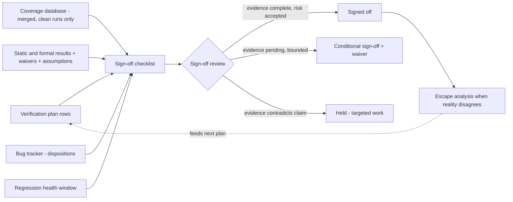

# 7. Metrics-Driven Sign-off

Sign-off requires quantitative evidence for every block and an irreversible decision based on it. This chapter develops the instruments and their interpretation through the reference SoC's review, two weeks before tape-out and eleven months into verification. Intuition ranks the neural accelerator as risky because it is the newest block and its verification team the least experienced; it ranks the DMA as safe after three weeks without new failures and with an all-green regression dashboard. The metrics review says almost exactly the opposite. All the accelerator's plan rows are discharged but one, a contention cross that its block-level bench cannot reach. A plan row is discharged when the evidence that closes it exists and is linked to it, and a cross is a coverage item that counts the runs in which two or more conditions hold together. Coverage is otherwise closed, and bug discovery flattened *while* stimulus was still being added. The DMA's curve also flattened, but no new stimulus went in during the same three weeks; the last severe bug arrived late in an unmodeled corner, with coverage crosses around it at 71%. Intuition measured team seniority and recent silence, whereas the instruments correctly assessed the project's verification state.

### Chapter map

§7.1 explains why SoC-scale verification needs shared metrics and what they cost. §7.2 covers per-feature status, coverage trends, bug curves, regression health and engineering time; §7.3 distinguishes clean designs from exhausted stimulus in flat bug curves. §7.4 aggregates plan and coverage evidence with static and formal results, bug dispositions and reproducibility. §7.5 applies the checklist under deadline pressure: identical flat curves lead to sign-off, conditional sign-off with a dated waiver, or a hold. §7.6 uses blameless escape analysis to update the next project's plan.

## 7.1 Metrics for shared project status

Chapter 4 introduced sign-off as the lifecycle's last gate: a review that judges evidence against the plan (see Chapter 4). This chapter examines the evidence's origins, misleading interpretations and use in decisions. **Metrics-driven verification (MDV)** manages the project on quantitative measurements collected continuously from the verification process, rather than on status estimates collected from people. MDV is presented as today's universally accepted baseline methodology for verification management [cit:D22]; the remaining choices concern what to measure and how to maintain reliable measurements.

Intuition works on small projects, where a few people can hold the entire design in their heads; on an SoC integrating many complex IP blocks, no single person has a view spanning the project, and the intuition of one or even several people may stop portraying its real state [cit:D20]. The reference SoC has ten to fifteen engineers, each knowing one or two blocks deeply and the rest indirectly. The DMA's safety assessment failed structurally because it was made one step away from the work, not through carelessness. Large verification environments require measurements to establish project status [cit:D20].

First, **no single metric portrays the project.** Every measurement gives one view with significant limitations; only a wide range of metrics avoids a picture distorted by the drawbacks of any one of them, and that range has to be planned together and *correlated* during analysis [cit:D20]. Coverage percentage without the bug curve rewards stimulus that hits bins without checking behavior, since bins are the counters that a coverage model keeps over sets of values. A green pass rate without coverage rewards a regression that no longer challenges the design. A falling bug count without regression health may just mean the regression is broken. Sign-off therefore requires reading these instruments together.

Second, **metrics are expensive and must guide action.** Functional metrics must be architected, written and maintained like any other verification code, with both simulation and maintenance costs [cit:D20]. A coverage metric left unread after each regression is probably irrelevant, and reaching 100% on an irrelevant metric may look like progress without being productive work, because collected data alone does not provide useful information [cit:B1]. The **metrics gap** is a metrics explosion in which teams instrument for the sake of instrumenting and lose track of what matters and what does not [cit:D16]. A proposed metric warrants implementation only if a change in its value changes a decision.

Metrics serve to coordinate a distributed team. The team defines and agrees on **shared goals** when writing the plan, establishing what "done" means and tracking it automatically thereafter [cit:D26]. With an executable plan (see Chapter 5), each row links to the coverage points, checks and results that discharge it, and status is *computed* from that evidence; this makes the sign-off meeting of Section 7.5 a review of evidence rather than a negotiation between personalities.

## 7.2 Dashboard instruments

A verification management platform, whether a commercial tool or an in-house database, reports what has been verified, what remains and whether the process producing the evidence is healthy, at any moment without a meeting. The closed regression loop collects data on each iteration: plan, run, collect results, triage failures, merge coverage, analyze against the plan, and react [cit:D26]. A coverage model names the attributes and the values that a design must be exercised over, and calling one golden means a project keeps a single such model and takes it as the specification of what counts as covered. One team rebuilt the entire stack in-house around a single golden coverage model, treating the regression loop itself as the methodology rather than any one tool [cit:D22]. That team, Graphcore, measured the effect of moving its coverage model out of SystemVerilog into an in-house Python implementation: the move meant that coverage could be collected in an offline generation step with no simulator at all; collection over the same 200 seeds fell from 40,493 s to 3,718 s, a 10.9× speedup; and its authors qualify both gains, because a model that is not timing-accurate can carry only coverage independent of cycle-accurate information [cit:D22]. Of the many quantities the loop *can* record [cit:D20], five families belong on the project dashboard.

**1. Per-feature status.** This is the primary instrument because it reports against the verification plan, which this book calls the vplan. For each vplan row, including the feature and its checks, coverage and closure evidence (see Chapter 5), the dashboard shows discharged / in progress / blocked / waived. Requirements traceability runs through this instrument: from specification requirement to plan row to coverage point to test result, so that a change in the specification automatically becomes visible as a hole in the evidence [cit:D26]. The other dashboard metrics are *leading indicators* that approximate per-feature status. The choice of which indicator best approximates per-feature status is a per-block judgment: on a flash controller, whose job is surviving corrupted input, that role falls to error-injection coverage. Error-injection coverage records which of the planned bit-error patterns, burst lengths and worn-block conditions the regression actually injected and checked against the data-integrity oracle, the mechanism that decides whether an observed response is correct. Coverage blind to the injection axis conveys nearly no information about that block.

**2. Coverage trends.** Coverage curves show percentage over time by block and category, merged across simulation, formal and any other engine that discharges plan items [cit:D26]. A single snapshot ("the DMA is at 96%") is nearly information-free: the same number is alarming if it was 96% three weeks ago with stimulus running since, but encouraging if it was 78% last Monday. Plotting coverage over time reveals its trajectory [cit:D20]. Chapter 6 defines coverage requirements; this chapter examines their progress.

**3. Bug curves.** Bug-open and bug-closure rates over time are among the simplest trend reports [cit:D20]; Section 7.3 addresses their interpretation, including the misreadings discussed below.

**4. Regression health.** This includes pass rate over time by block and configuration, check-in-to-result turnaround, farm utilization, simulation time per block, and anomalies in these measures. A sudden runtime spike caused by a recent change is actionable that week; a month later, diagnosing the slowdown requires reconstructing the change [cit:D20]. Regression health also includes *test effectiveness*: ranking tests by coverage contributed and bugs found, so that the regression can be reordered or re-weighted instead of growing monotonically until it no longer fits in a night [cit:D20]. Late in a project, pruning *coverage collection* reduces the overhead of collection, and that overhead scales roughly linearly with the number of bins; crosses that are already fully hit go on incurring that overhead at every run; one team therefore cut a seeded regression from 46.6 to 38.2 hours of compute by dropping coverpoints already hit in the previous run, at the cost of slightly lower reported coverage on the pruned points [cit:D22]. Dropping those coverpoints is a bounded and deliberate loss of measurement in exchange for compute, and it belongs in the sign-off record as well as in the script that implements it. Chapter 12 treats the regression factory in depth.

**5. Debug-time share.** Engineering time complements the evidence metrics. In the 2024 industry data, verification engineers spend more of their time on debug than on any other activity, and debug effort is unpredictable and varies significantly between projects [cit:R2,P17]. The two earlier editions of the same study are held here as well, and they report the same ordering and attach the same warning about one practice: planning a project's effort and schedule from the previous project's data [cit:R3,R5]. That variance makes extrapolation from the last project's debug effort unreliable for estimation (see Chapter 4). Tracking where the hours go, even coarsely through triage annotations in the bug tracker, provides the one early-warning signal the other four instruments miss: a project's *evidence* metrics may look flat because the whole team is occupied with one pathological debug, which the time records distinguish from inactivity.

> **Scenario.** Week 38 on the reference SoC. The DMA's coverage curve has been flat for three weeks and its bug curve flat for the same three weeks. Alongside the flat curves, instrument 5 records the block's two engineers logging those weeks almost entirely against triage and debug of one severe find from week 35: a transfer aborted mid-descriptor and then resumed, which the burst splitter restarts from a stale pointer while the other of the DMA's two channels is holding the backend FIFO that they share. The burst splitter is the DMA stage that splits each transfer into bursts that the AXI address rules allow. Each transfer is set going by a transfer descriptor, the record that software writes to program one DMA transfer. **Approach.** The lead interprets the flat curves as stimulus starvation because no new stimulus went in to exercise new conditions. **Why.** Metrics describe process activity, so their interpretation must account for the work performed. A flat week with a two-person team debugging one bug has zero evidentiary value about the rest of the block; only debug-time tracking distinguishes it from a quiet week on a clean design.

Two disciplines preserve the provenance of these measurements. **Only clean runs contribute**: failed simulations and stale builds cannot supply coverage evidence; only error-free verification tasks qualify [cit:B1]. **Each data point requires versioned provenance**: which RTL revision, which testbench revision, which tool versions, which seed and which configuration produced it [cit:D20], because a trend drawn across incompatible baselines cannot support a valid comparison.

## 7.3 Reading bug-rate curves

The reported cumulative bug-discovery curve is S-shaped: slow during bring-up, the phase in which environment and design first exchange checked transactions, while the environment can barely exercise the design; steep as constrained-random stimulus and maturing checkers explore the design; then flattening as discoveries diminish. Constrained-random is the automatic generation of legal but unlikely stimulus under constraints. The curve's derivative, bugs found per week, rises to a peak and then decays. Verification managers use a flat discovery tail as a stopping signal because the classical ship criterion requires the RTL to pass all planned tests *and* the review to be satisfied with the coverage and bug-rate metrics [cit:B2].

The S-shape is received wisdom rather than a measurement: no bug-rate curve for a named project appears anywhere in this book's cited sources, so it describes what teams report seeing, without a fitted curve. Published points sit on the rising limb, never on the tail: a formal deployment on a live Intel graphics project caught around 15 bugs across designs in its first two weeks and 84 within eight weeks, on totals that the paper itself states differently in its abstract and in its conclusion [cit:D18].

The flat tail is therefore **ambiguous**. A bug curve records discoveries, and a discovery needs three things to happen at once: stimulus that reaches the buggy condition, a checker that catches the misbehavior, and an engineer who triages the failure into the tracker. The curve flattens when bugs run out or any one of those three steps stops. Two curves produce the same picture: one that is flat because the design is clean, and one that is flat because the instruments are blind. Progress metrics are snapshots and trends of what has happened, like stock-market indices or batting averages, and they cannot be used to predict the future [cit:B2]. Extrapolating the bug curve applies this limitation to predictions of remaining bugs.

**Stimulus saturation** causes this ambiguity. Coverage closure is the convergence of every item of the plan to covered or consciously excluded status. Constrained-random coverage closure is non-linear: it rises steeply at first and then exhibits diminishing returns later in the project [cit:D22]. The mechanism proposed here is that a fixed constraint set keeps re-sampling the same region of the state space: bugs reachable inside it are found in the steep phase, and after that more seeds mostly re-confirm what is known. Chapter 6's closure discipline addresses saturation; a saturated regression can produce a flat bug curve that is mistaken for evidence of cleanliness.

The curve's shape also depends on what the block is made of. An HBM controller barely draws an S: discovery is dominated by the PHY training state machine, and late finds cluster in retraining corners after a thermal event, after a refresh collision, or following an interrupted sequence. A flat tail there says nothing until the review establishes how many training entries the regression attempted in the flat window, because between training experiments the curve is necessarily flat.

A flat tail requires corroborating instruments, applying the correlation discipline of Section 7.1 [cit:D20] to one decision ({ref: flat_curve_interrogation}):

{table: flat_curve_interrogation} Six questions to put to a bug curve that has gone flat, with the answer pattern each returns when the flatness is genuine and the pattern it returns when the flatness is an instrument failure instead. The two columns describe the same picture read two ways, which is why the curve is never read by itself.

| Question to the flat curve | Flat because clean | Flat because blind |
|---|---|---|
| Was new stimulus added during the flat window — new sequences, new constraints, new *irritators* (background traffic generators whose only job is to perturb the DUT)? | Yes — and it found nothing | No — same tests, more seeds |
| Is functional coverage still moving? | Plateaued *at target*, holes dispositioned (see Chapter 6) | Plateaued *below* target, or bins nobody reviewed |
| What is the fresh-seed yield (failures per thousand new seeds)? | Measured, and ~zero | Not measured, or seeds re-explore the same space |
| Did checker strength change? | Checkers stable or strengthened | Checkers waived/disabled to "stabilize" regression |
| Is the triage queue empty? | Yes — failures were dispositioned | A backlog hides undiagnosed discoveries |
| Where were the *last* bugs found? | Scattered, low severity, in modeled corners | Clustered, severe, in a corner the plan never modeled |

The last row explains the DMA hold in Section 7.5. Because bugs cluster, a severe bug found late in a corner that the coverage model did not describe is one *sample* from a region of the state space that the instruments were not watching. The response must treat the find as evidence about the model as well as the design: extend the coverage model and the stimulus around it, then require the curve to flatten again under the expanded model, rather than fixing the bug and declaring the tail restored. This reading is practitioner judgment: the corpus supports the underlying facts, since clustering of discoveries by stimulus category is the kind of correlation that a metrics database exists to expose [cit:D20]. The inference rule, however, is the author's.

One additional comparison is **bug-open vs bug-closure** [cit:D20]. The gap between them is the debug backlog, and its trend informs scheduling: a discovery curve that flattens while the open-bug count stays high means finding has paused while fixing catches up. The two lines must converge to close that backlog; parallel plateaus are insufficient.

## 7.4 The sign-off checklist: aggregating the evidence

Chapter 4 defines sign-off as the final lifecycle review in which people accept residual risk on the record. The checklist makes **evidence aggregation** explicit: every claim that verification is complete must trace to an artifact that a skeptical reviewer could independently reproduce and use to assess the claimed completion. Its shape varies by team; its content, at minimum, does not:

1. **Every plan row discharged or dispositioned.** Each feature row of the vplan (see Chapter 5) points to the coverage, checks and results that discharge it, or carries a written disposition explaining why it will not. With an executable plan and requirements traceability, a database query establishes this status [cit:D26]. An untraceable plan row remains undischarged regardless of recollections.
2. **Coverage closed or waived, with recorded waivers.** Sign-off records functional coverage at target and analyzed code coverage under Chapter 6's closure discipline. Every remaining hole carries a **waiver** with five fields: *the hole, the reason, the risk argument, an owner, an expiry.* Chapter 6's three exclusion kinds (structural, specification-driven, risk-accepted) gain one sign-off rule: a risk-accepted waiver used to meet a deadline requires a real expiry date and senior signature because it is not a don't-care. Only a genuine don't-care writes "none" there: a hole that the project will never need to revisit. A waiver with an empty expiry is permanent by accident.
3. **Static verification clean.** Lint, CDC and RDC sign-off requires review of their waiver files (see Chapter 13). Static results remain valid only if their waivers were justified.
4. **Formal results with reviewed assumptions.** Proofs discharge plan rows only with their assumptions and constraints; an over-constrained full proof leaves behavior unexamined (see Chapter 14). The review examines the assume list as well as proof status.
5. **Open-bug disposition.** Every open entry in the tracker is classified. Severities on this project read S1 (blocks tape-out), S2 (fix, or waive with an argument) and S3 (documentation or cosmetic); Chapter 12 covers triage. Three dispositions are available: *fix before tape-out*, *waive as known errata* (with the software workaround named and the documentation owner assigned), or *defer* (with the argument why it cannot manifest in this product's use cases). An open bug with no disposition remains unevaluated, and recording that disposition is what the ship criterion of Section 7.3 calls *satisfaction with the bug-rate metrics*, made explicit in the record.
6. **Regression health over a sustained window.** All planned tests must pass across seeds and configurations throughout a *window*; a single green run cannot establish sustained health. The evidence must be audited: only error-free runs on the tagged release candidate contribute [cit:B1].
7. **Reproducibility.** Every number on the dashboard must be traceable to RTL revision, testbench revision, tool versions, configuration and seed [cit:D20], which makes any result regenerable on demand. Escape analysis (Section 7.6) needs that record to establish exactly what ran.

These inputs converge on one review; {ref: signoff_evidence_flow} traces each to the recorded decision.



{figure: signoff_evidence_flow} How the sign-off checklist aggregates its evidence and what the review is then allowed to decide. Each input on the left is one checklist item reduced to the artifact a skeptic could re-derive it from; the review has three outcomes rather than two, and the middle one is a decision taken now against named evidence arriving by a named date. The dashed edge is what makes sign-off part of a loop rather than an endpoint: escape analysis returns to the plan (§7.6).

The checklist has two requirements. It is **written before the end**: the closure evidence per row was named at planning time (see Chapter 4), so the checklist is the plan's last column, established before deadline pressure could affect its requirements. It is **decision-oriented**: each item resolves to signed off, conditionally signed off, or held, where *conditional* means the decision is taken now against named evidence arriving by a named date. A conditional sign-off requires a testable condition.

The evidence required depends on the block. A 10G Ethernet MAC with time-sensitive-networking queues signs off substantially on a compliance suite, an externally defined test set whose verdict is non-negotiable and comparable across vendors. The suite is insufficient alone because conformance says nothing about the block's own queue-shaping configuration space. Such blocks carry two evidence columns: the suite's verdict, and the coverage model measuring everything the suite never reaches.

> **Worked example: checklist excerpt (the crossbar, week 40).**
>
> | # | Item | Evidence | Status |
> |---|---|---|---|
> | 1 | All 41 plan rows discharged | vplan report r2841, auto-linked results; features XB-01..XB-07, 7/7 closed | PASS |
> | 2 | Coverage closed or waived, on two evidence lines | functional: merge of sim+formal, tag `xbar_rc3`, 100% of the model, 14 exclusions, all reviewed (true don't-cares, expiry "none"); code: 98.7% statement / 96.2% branch, residue = defensive decode defaults, dispositioned in review | PASS |
> | 3 | Static clean | lint 0 issues; CDC report waiver file v7 re-reviewed | PASS |
> | 4 | Formal protocol properties | 41 proven, 3 bounded ≥ 40 cycles — bounded set reviewed and accepted as residual risk; assume list reviewed against integration constraints | PASS |
> | 5 | Open bugs dispositioned | 1 open S3 (documentation mismatch), waived as errata, doc owner assigned | PASS |
> | 6 | Regression window | 21 consecutive clean nightlies + 5 clean weekend fulls, ~9,400 seeds cumulative, tag `xbar_rc3` | PASS |
> | 7 | Reproducibility | all results regenerable from tag + seed manifest | PASS |

The evidence column expands Chapter 4's crossbar sign-off summary item by item: the same review and numbers in one artifact at two levels of detail. The write-interleaving bug that formal found in week 14 appears nowhere on the checklist because it was found, fixed and regressed; the ordering property that caught it now sits among the formal item's unbounded proofs as permanent evidence. That item's three *bounded* proofs hold only up to a depth, and the checklist requires the review to explicitly accept the residual risk beyond that depth. Sign-off certifies that bug-finding procedures reached agreed completion and residual risk was explicitly accepted; it guarantees neither a history without bugs nor exhaustive answers.

## 7.5 Worked example: the dashboard, two weeks before tape-out

At week 40, the reference SoC's sign-off review (see Chapter 4) covers three blocks: the crossbar, neural accelerator and DMA engine. The dashboard has one row per block and uses Section 7.2's instrument families, with debug-time share in the fresh-stimulus column and arrows showing three-week trends ({ref: week40_dashboard}):

{table: week40_dashboard} The week-40 block dashboard that the sign-off review reads: one row per block, one column per instrument family, arrows giving the three-week trend. The bug-discovery column is flat for all three blocks and the review still reaches a different verdict on each, so the columns that do the separating are the plan rows, the direction of the coverage, and whether fresh stimulus went in at all.

| Block | Plan rows | Func cov | Code cov (stmt) | Open bugs S1/S2/S3 | 7-day pass rate | Bug discovery (3 wk) | Fresh stimulus (3 wk) |
|---|---|---|---|---|---|---|---|
| the crossbar | 41/41 | 100% → (closed-or-waived) | 98.7% → | 0 / 0 / 1 | 100% → | flat | yes — new irritator sequences, zero finds |
| the neural accelerator | 37/38 | 98.9% ↑ | 97.8% ↑ | 0 / 0 / 2 | 99.8% ↑ | flat | yes — quantization corners, zero finds |
| the DMA engine | 44/47 | 96.0% → | 98.2% → | 0 / 1 / 3 | 99.2% → | flat | **no** — team in debug (Section 7.2 scenario) |

The pass-rate column is a seven-day snapshot; each block's checklist uses a longer window, including 21 nightlies for the crossbar. The review assesses each block against its plan.

**The crossbar: signed off.** The checklist excerpt above is its evidence, and the flat discovery curve is corroborated against Section 7.3's table: fresh stimulus went in and found nothing, coverage at target, triage queue empty, last finds months old and scattered. The plan named closure evidence per row in week one, and formal took the protocol rows as far as they go, with three of its properties holding only up to a proof bound and that limitation recorded. After eleven minutes, the review records sign-off in the record of the meeting, with the S3 errata disposition attached.

**The neural accelerator: conditional sign-off, with a waiver.** The accelerator's unit of work is one convolution, programmed through its registers, and this book calls it a *convolution job*. One plan row is not discharged: the cross of 2-bit weight mode × concurrent DMA traffic on the shared SRAM banks. The block-level bench cannot generate real DMA contention; the SoC-level environment can, and that regression is still accumulating the cross. Other evidence supports cleanliness: coverage rises toward target while discovery stays flat under continuing quantization-corner stimulus. Both dispositioned bugs are S3: a performance-counter off-by-one on job restart, waived as errata with a software workaround, and a register-description mismatch. The 99.8% pass rate requires review because checklist item 6 asks for planned tests passing *repeatedly*: the 0.2% is a known testbench race on job restart, filed against the environment rather than the design. The review confirms that disposition instead of dismissing the number as noise. The review decides now rather than deferring, and grants conditional sign-off on a waiver that fills all five fields. The hole is the undischarged cross. The reason is that no block-level bench can generate real contention. The risk argument is that the 2-bit datapath is identical to the verified 4-bit path except for the unpack stage, and that contention exercises arbitration already proven on the crossbar. The owner is the SoC-level verification lead. The expiry is week 41: the cross closes in SoC regression by then, or the block returns to review.

**The DMA engine: held.** Per-feature status prevents sign-off. Three of forty-seven plan rows are undischarged, the worst status among these blocks; checklist item 1 alone therefore holds the DMA. All three were opened in week 35 in reaction to the data-corruption find described below, and none carries evidence yet.

The DMA reports 96% coverage, a 99.2% pass rate, one open S2 with a fix under review, and flat discovery. But the corroboration of Section 7.3's table fails on four of six axes. No new stimulus entered the entire trend window because the two engineers were debugging one bug from week 35; the regression has repeated the same stimulus since. Fresh-seed yield is therefore unmeasured. Coverage is plateaued *below* target, and in the region of the last find it sits at 71%.

In week 35, fresh seeds in the SoC-level regression exposed data corruption in a transfer aborted mid-descriptor and then resumed: the burst splitter restarts the interrupted 2D row from a pointer that it never invalidated, and re-issues bursts that it had already committed. A 2D row is the contiguous run of bytes that makes up one line of a two-dimensional transfer. The corruption is reproducible only when the other channel is holding the backend FIFO at the instant of the abort. Abort-and-resume had no plan row, coverpoint or cross because every one of the burst splitter's plan rows assumes a transfer running to completion. The DMA's plan rows for splitting a 2D transfer cover a different case. One of those crosses demands a transfer with a negative stride, split wrongly at the 4 KB boundary, that corrupts data only while channel 1 is simultaneously active. A negative stride is an address step that walks memory downwards, and the 4 KB boundary is the address line that AXI forbids a burst to cross: every burst stays inside one 4 KB address region, so it never spans two subordinates. The scoreboard is the testbench structure that holds what the design should have produced and compares it with what the design did. Constrained-random stimulus plus the scoreboard reaches such a wrongly split transfer where directed splitter tests never would, and the plan says in advance where to look. That failure is SOC-1284, the escape of Chapter 1, and it arrives after this review. The week-35 find lacked such a cross: the green dashboard described coverage around an unseen region, and 71% cannot measure the hole itself because it has no bins.

A late, severe find in an unmodeled corner samples an unwatched region (Section 7.3), so the review treats this descriptor failure as evidence of inadequate instruments. The block is held two weeks, with work aimed at the blind spot beyond the individual bug. The three open rows must be discharged and widened into a family for abort and resume as a *class*, and that family needs three additions: a cross of abort point × transfer geometry × other-channel state; constrained-random abort injection while both channels contend for the backend; and a checker on the violated invariant, which is that a resumed transfer issues exactly the bytes that the aborted one had not yet committed. The discovery curve must flatten under the *new* instruments, with their expanded stimulus and checking, before the checklist is reviewed again to assess whether the block now meets its requirements.

The review records three decisions, each with named residual risk, based on evidence rather than speaker seniority.

## 7.6 Escape analysis and the next verification plan

An **escape** is a bug found beyond a boundary that was supposed to catch it: a block bug found at SoC level, an RTL bug found in gate-level simulation, or a silicon bug found in the lab. Escapes are widespread across the discipline. In the 2024 industry data, only 14% of IC/ASIC projects achieved first-silicon success, the lowest value recorded in twenty years [cit:R2], and 87% of FPGA projects reported non-trivial bugs escaping into production [cit:R1]. Since complete prevention is unavailable (Chapter 3), an escape provides a costly, targeted audit of the verification process.

**Escape analysis** turns that audit into a structured post-mortem. For each escape, the team answers five questions, in order, in writing:

1. **Bug mechanism.** The analysis records the precise mechanism at bug-report level, beyond the symptom shown by a failing test.
2. **Stimulus gap.** The analysis identifies the condition never generated and whether it reflects a constraint gap, missing sequence or unplanned scenario.
3. **Checker or platform gap.** The analysis distinguishes *reached but unchecked* behavior (a checker gap) from behavior *unreachable at this abstraction* (a platform gap), and the two gaps require different corrective work.
4. **Misleading completion metrics.** The analysis identifies the dashboard that showed completion despite the hole: missing coverage bins, an outdated waiver, or a starved bug curve interpreted as clean.
5. **Changes to planning.** New plan rows and coverage crosses must address the *class* of bug, never only the instance. A checker or platform is added and a sign-off checklist item amended. Each change, including the new plan rows and coverage crosses, has an owner and is filed into the next project's planning inputs (see Chapter 5).

The analysis must be **blameless**, examining the process rather than assigning personal blame. Career consequences can encourage participants to distort post-mortem reports, undermining the metrics used to assess the project. Fear-driven verification and lack of introspection contribute to the gap between required and actual verification; teams can address the self-induced part by examining their own contribution [cit:D16]. Escape analysis institutionalizes that introspection. In question 4, the analysis should allow an engineer to report that metrics were correct but the plan omitted the case, without having to defend herself.

> **Scenario: escape post-mortem, week 44.** The event unit's retention registers lose configuration on power-domain re-entry when a wake event races isolation release. Retention here means enhanced functionality on selected sequential elements, so that their values survive the power-down of their primary supply. A power domain is a group of instances treated together for power management, typically sharing one supply, and power-domain re-entry is the moment that supply comes back on. Isolation is the defined behavior of a signal while its driving logic is unpowered, and isolation release is the moment that behavior ends. The escape was found in UPF-aware gate-level simulation *after* RTL sign-off (see Chapter 19); UPF is the Unified Power Format, IEEE Std 1801-2024, *IEEE Standard for Design and Verification of Low-Power, Energy-Aware Electronic Systems* [cit:S10]. **Approach.** The five questions are answered in writing: (1) Mechanism: a wake event arriving in the same cycle as isolation release corrupts the restore path of the retention flops. (2) Stimulus: RTL-level power tests stepped through save/sleep/restore sequences with directed timing; nothing ever randomized wake-event arrival against the power-sequence FSM, so the race was never generated. (3) Checkers: the RTL power tests checked configuration *after* restore completed, leaving the race window itself unobserved. Plain RTL simulation does not model loss of state in the switched domain at all, so part of the behavior was unrepresentable below power-aware simulation. The unobserved race window and the unrepresentable state loss leave both a platform gap and a checker gap. (4) Metrics: the power-management plan rows were discharged by those directed tests, the ones written out by hand to do the same thing on every run; the coverage model had no cross of wake-timing × power-state transition, so 100% of what was measured showed completion despite the plan's omission of the race. (5) Changes: a new plan-row family "retention behavior under randomized wake timing", the missing cross added to the coverage model, power-aware simulation pulled earlier in the schedule instead of arriving with gate-level simulation, and a new sign-off checklist item requiring *power-intent behavior verified on a power-aware platform* rather than inferred from RTL, with the owner of the low-power methodology named. **Why.** The engineer who wrote the directed tests executed the plan she was given; the plan could not see the race. Blameless analysis turns one late, expensive discovery into four permanent process improvements.

Escape analysis closes the sign-off loop by updating the checklist of Section 7.4: instead of remaining static, that document accumulates findings from every post-mortem conducted by the organization. Checklist items such as "retention verified on power-aware platform" and "fresh-seed yield reported for any block whose curve is flat" record earlier escapes, placing their corrective requirements in the review to prevent recurrence. The results become new rows in the two artifacts every future project uses, the plan and the checklist, so lessons enter the required work rather than remaining in a separate lessons-learned document.

### In practice

A hybrid infrastructure combines a vendor verification-management platform for plan-to-result traceability and multi-engine coverage merge [cit:D26] with in-house scripts and databases. Some build the entire MDV stack in-house for flexibility and engine independence, at a real cost: they now own that infrastructure and must train engineers who have never seen it [cit:D22]. A standing weekly metrics review should keep dashboards in active use, preventing a month of neglect in which their data goes unexamined.

Tying metrics to dates or bonuses creates incentives to add easy coverage bins or "temporarily" exclude failing tests; either change can make the dashboard misleading. Fear-driven and ulterior-motive-driven verification are listed alongside design complexity as causes of verification gaps, the shortfalls between what a project must verify and what it can [cit:D16]. An exclusion justified in March can be stale in September, so sign-off re-reviews waiver files rather than counting them. Scheduling coverage closure as linear disregards its diminishing-returns tail [cit:D22,D16]. Of Section 7.2's five instruments, debug-time share warrants explicit tracking: debug dominates verification time and varies unpredictably between projects [cit:R2], so it is most likely to explain schedule consumption. That last step is our inference; the corpus supplies the dominance and the variance, nothing about who tracks it. MDV should collect fewer metrics and act on all of them to obtain value [cit:B1,D20].

### Pitfalls

1. **Unverified dashboard status.** *Symptom:* green process indicators conceal design failures because status is inferred from color without examining provenance. *Cure:* every green status must trace to a reproducible artifact that sign-off can review.
2. **Reading a flat bug curve as clean.** *Symptom:* "no new bugs in three weeks" offered as closure evidence by itself. *Cure:* review fresh stimulus, target coverage, fresh-seed yield, checker integrity, triage backlog and the location of the last finds.
3. **Turning a metric into a target.** *Symptom:* coverage percentage tied to a milestone date; bins multiply, hard crosses vanish, the number climbs while knowledge does not. A milestone is a phase-gating event that a project has to demonstrate it has reached rather than estimate. *Cure:* targets live on plan rows and dispositions; percentages are instruments, and instruments are audited (see Chapter 6).
4. **Waivers without owner or expiry.** *Symptom:* a continually growing waiver file contains reasons the reviewers cannot explain. *Cure:* every waiver retains five fields (hole, reason, risk argument, owner, expiry); only a true don't-care may use "none" for expiry, and sign-off re-reviews every waiver.
5. **Counting dirty runs.** *Symptom:* coverage merged from failing simulations or mixed RTL revisions inflates closure. *Cure:* only error-free runs on the tagged baseline contribute [cit:B1]; provenance is part of the number.
6. **Blame in post-mortems.** *Symptom:* defensive escape analyses allow the same escape class to recur next project. *Cure:* blameless analysis studies the process and must produce changed plan and checklist rows.

### Summary

- On an SoC, individual intuition has a structural limit: no person spans the project, and unmeasured status remains unknown [cit:D20]. Metrics establish shared status if the team limits their number, correlates them and acts on them.
- Five instruments track per-feature plan status (the primary measure), coverage *trends*, bug curves, regression health and debug-time share. No single one of them is trustworthy alone [cit:D20].
- A flat bug curve is ambiguous because clean designs and stimulus starvation produce the same shape. Its interpretation requires fresh-stimulus data, coverage position, seed yield, checker integrity and the location of the last finds.
- A late, severe bug in an unmodeled corner samples an unwatched region. The instruments must expand, with flat discovery demonstrated again under them.
- Sign-off aggregates discharged plan rows, closed-or-waived coverage, clean static and formal results with assumptions reviewed, bug dispositions, and results reproducible from tagged baselines. The outcome is signed off, conditional (a waiver with all five fields: hole, reason, risk argument, owner, expiry), or held.
- The 2024 industry study, still the latest published at the time of writing, reports widespread escapes: 14% first-silicon success and 87% of FPGA projects with non-trivial production escapes [cit:R2,R1]. The same study measured first-silicon success at about thirty-two percent in 2020 and twenty-four percent in 2022, and the 2022 edition already called that twenty-four percent the lowest in twenty years [cit:R3,R5]. The second of those readings is lower than the first, and the first-silicon figure quoted just above is lower still, so the series records successive lows rather than a contradiction. Blameless escape analysis answers five questions in writing and adds rows to the next plan and sign-off checklist.

### Exercises

**Exercise 7.1 (calculation).** Take the two compute figures §7.2 reports for the coverage-pruning experiment, in which coverpoints already hit in the previous run were dropped. Compute the share of compute that the pruning saved. State the price the same sentence attaches to the saving, and state where §7.2 requires that price to be recorded.

**Exercise 7.2 (calculation).** Take the plan-row column of the week-40 dashboard in §7.5 for the neural accelerator and for the DMA engine. Compute, for each block, the share of its plan rows still undischarged. Decide whether those two shares are what separates the accelerator's conditional sign-off from the DMA's hold, and name the checklist item of §7.4 and the field of its waiver that separate them instead.

**Exercise 7.3 (judgement).** A block arrives at review with coverage at target, an empty triage queue, three weeks of flat bug discovery under fresh irritator stimulus that found nothing, and one severe find eight weeks earlier in a corner the coverage model never described. Decide whether §7.3 lets the review read that flat tail as evidence of cleanliness. Give the row of the chapter's six-question table that decides it, and state the two changes the response must make before the tail counts as evidence again.

**Exercise 7.4 (judgement).** Under deadline pressure a team proposes a coverage waiver whose expiry field reads "none", arguing that the reviewed exclusions in the §7.4 checklist excerpt carry that same value. Decide whether checklist item 2 admits the waiver, and give the property of those exclusions that the proposed waiver lacks. State what item 2 requires in the expiry field of a waiver taken to meet a date, and name the pitfall of the chapter that the proposal matches.

**Exercise 7.5 (artifact).** Read the escape post-mortem below, filed on the week-35 DMA find of §7.5 against the five questions of §7.6. One of the five answers is absent. Name the absent question, supply the answer §7.5 supports for it, and state what the post-mortem loses while it stays blank. State also the disposition §7.6 requires of every change listed under question 5.

```text
Escape:      block bug found at SoC level, DMA engine, week 35
Question 1:  a transfer aborted mid-descriptor and then resumed; the burst
             splitter restarts the interrupted 2D row from a pointer it never
             invalidated and re-issues bursts it had already committed.
             Reproducible only while the other channel holds the backend
             FIFO at the instant of the abort.
Question 2:  abort and resume was never generated. Every plan row on
             the burst splitter assumes a transfer running to completion, so no
             sequence ever set up an abort.
Question 3:  the condition was reachable at this abstraction, since fresh
             seeds in the SoC-level regression reached it. The corrective
             work therefore adds a checker on the violated invariant, that a
             resumed transfer issues exactly the bytes the aborted one had
             not yet committed.
Question 4:
Question 5:  three plan rows opened and widened into a family for abort and
             resume as a class: a cross of abort point × transfer geometry ×
             other-channel state, and constrained-random abort injection
             while both channels contend for the backend.
```

### Further reading

**From the corpus.** [cit:D20] develops metrics beyond coverage for SoC verification, with categorization, run-time control and reporting; [cit:D22] provides a modern industrial case of an in-house MDV stack with a single golden coverage model, coverage pruning and regression diffing. [cit:D26] shows verification-management automation: traceability, multi-engine merge, and the regression round trip. [cit:B1] (Chapter 6, "Coverage-Driven Verification") covers metrics for effort allocation, irrelevant metrics and clean-run discipline; [cit:B2] states the classical ship criterion and limits of trend metrics. [cit:D16] is a short taxonomy of verification shortfalls, including the metrics gap and self-induced gap. The industry effectiveness data cited throughout is from three editions of the Wilson Research Group study, the most recent being the 2024 pair [cit:R2,R1], and their methodological ancestor, Foster's DAC 2015 trend study [cit:P17]. The two earlier editions of the Wilson series are held here as well and are short: IC/ASIC [cit:R3,R5] and FPGA [cit:R4,R6]. Piziali's coverage taxonomy [cit:B5] underpins the measurement side of this chapter and is treated in depth in Chapter 6.

**Not in the corpus.** Carter & Hemmady, *Metric Driven Design Verification: An Engineer's and Executive's Guide to First Pass Success* (Springer, 2007), is a book-length treatment of metrics-driven processes and one of the two works that [cit:D20] distinguishes itself from; it is cited as background only.
