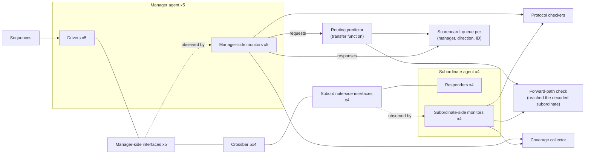

# 8. Testbench Architecture

Six weeks into crossbar bring-up, the reference SoC's interconnect testbench is one
file: 2,400 lines in a single module. It drives all five manager ports, samples the
four subordinate ports, computes what the SRAM should return, and collects coverage
— in the same forever loop, over the same variables. It works. It has found four
bugs. Then two things happen in the same week.

First, a read-data mismatch fires at 41 µs and nobody can say what it means. The
crossbar may have returned two responses in an order the protocol permits; the
checker may have assumed an order the protocol never promised; or the driver's
back-pressure model may have drifted out of step with what it told the checker to
expect. All three hypotheses live in the same two hundred lines and share state, so
no experiment separates them. Two days in a waveform viewer later, the ticket is
closed as "testbench issue" — the phrase that means *we never found out*.

Second, the DMA team asks to reuse the AXI checking against their backend. It
cannot be lifted out: the checker reads variables the driver writes, so it knows
only what the driver *intended* to send, never what appeared on the wires — and a
checker that trusts the stimulus generator's intentions is no oracle (Chapter 3).

Both problems have one root, and it is not a coding error. Five distinct
responsibilities were implemented as one program. This chapter is about the
alternative, and about why that alternative is not bureaucracy: it is the only
structure in which an environment can be debugged, trusted, and reused.

### Chapter map

- §8.1 establishes why stimulus generation, driving, monitoring, checking and
  coverage are five separate responsibilities, and what breaks — concretely —
  when they are merged.
- §8.2 develops layering: signal to transaction to sequence, with vendor-neutral
  transaction-level communication between components.
- §8.3 treats the three scoreboard patterns — in-order, multiple in-order
  streams, unordered with matching keys — and what a reordering design costs the
  checker.
- §8.4 states when to build a reference model, which of its three species is
  actually being built, and what maintaining it costs.
- §8.5 establishes why a monitor must never drive and how passive instantiation
  carries a block environment into a system environment; §8.6 and §8.7 build the
  environment step by step on the crossbar and the DMA; §8.8 treats the
  environment itself as a design, with its own reviews, configurability and
  bring-up story.

## 8.1 Five responsibilities, not one program

A testbench need not be a monolithic block [cit:B2]. The design under verification
is not implemented as one unit; there is no reason the environment around it should
be. The decomposition that survived decades of practice separates five
responsibilities:

{table: five_responsibilities} The five responsibilities a testbench separates, each with the question it answers and the thing it must not know. The third column is the load-bearing one: every entry in it is an ignorance imposed on purpose, because merging two of these boxes does not merely blur the environment's structure — it loses something specific.

| Responsibility | Answers | Must not know |
|---|---|---|
| **Stimulus generation** | *What* scenario should happen next? | How the protocol wiggles pins |
| **Driving** | *How* is this transaction expressed on the interface? | What the correct response is |
| **Monitoring** | What *did* appear on the interface? | What was intended |
| **Checking** | Was it *right*? | Which test is running |
| **Coverage** | What have we *exercised*? | Whether the test passed |

The separation is not a modern refinement. By 2001 a language designed specifically
for functional verification was already built on the same principle — a data model,
a test generator, a reference model, a checker (split further into a data checker
and a temporal checker running concurrently with the design), and coverage metrics
tied back to a plan, with separation of concerns as its organizing principle rather
than a coding convention retrofitted later [cit:P18]. Chapter 9 tells that history;
what matters here is that the structure came first and the tooling followed.

Each responsibility earns its own box because each has a different failure mode and
a different reason to change. Merge two of them and you lose something specific:

**Checking inside the driver destroys the oracle.** A driver knows what it meant to
send. If the checker lives there, it compares the design against the stimulus
generator's intentions rather than against the specification — and every bug in
which the driver itself misbehaves becomes invisible, because both sides of the
comparison move together. This is the common-mode error of Chapter 3, built into
the architecture instead of merely risked.

**Monitoring inside the driver destroys reuse.** The moment observation is a
side effect of driving, there is no way to watch an interface you are not driving.
That forecloses passive reuse at the system level (Section 8.5), and it forecloses
the most valuable debug configuration there is: the same environment, stimulus
disabled, watching real traffic.

**Coverage inside the checker destroys honesty.** Sample coverage where the verdict
is computed and you sample it only on paths the checker reached. Holes then look
like missing stimulus when they are missing observation, and Chapter 6's central
question — *what did the tests never do?* — becomes unanswerable.

The checking side deserves special respect because it is where the effort actually
goes. On a finished project, the self-checking structure is the largest and most
complex part of the environment, the one that cost the most authoring and
maintenance, and the one responsible for declaring functional correctness — it
embodies a duplication of the specified functionality of the design. That
is not a utility to be bolted on during bring-up: which failure modes it detects,
and how, belongs in the verification plan and must be reviewed, so that a potential
failure does not go undetected. The classical list worth naming explicitly
is data transformation, data ordering, protocol correctness, data losses and design
state [cit:B2] (see Chapter 5).

Nor does every check belong in the same place. Implementation-specific failure
modes such as buffer overflows are best coded as assertions directly in the RTL,
and signal-level relationships belong in the interface declaration that contains
the signals; higher-level failures — data transformation, ordering, end-to-end
computation — are better detected behaviorally in the testbench, because a property
language does not lend itself well to end-to-end response checking [cit:B2]
(Chapter 11). What matters is that the split is deliberate and written down, so
every failure mode has exactly one owner.

> **Scenario.** The opening scenario's driver computes, for each write it issues,
> the value it expects to read back, and stores it in a local array. A reviewer asks
> what happens if the driver mis-encodes `awsize`. **Approach.** Split it: the driver
> only wiggles pins; a monitor reconstructs from those pins what the crossbar
> actually received; the predictor computes expectations from the *monitored*
> request. **Why.** With the split, the mis-encoded `awsize` produces a monitored
> transaction that differs from the intended one and the read-back check fails.
> Without it, the driver's mistake propagates identically into both the design and
> the expectation, and the test passes. The rule generalizes: *predict from what was
> observed, never from what was requested.*

## 8.2 Layering: signal, transaction, sequence

An environment spans three levels of abstraction, and most of its engineering value
comes from keeping them apart.

At the **signal level** live pins, edges and handshakes. At the **transaction
level** lives the unit of meaning: a transaction is initiated by injecting
something into the running simulation and terminated some time later by observing a
result — functional verification works at the level of whole transactions rather
than the design's clock cycles [cit:P18]. At the **sequence level** live scenarios:
ordered, constrained collections of transactions that express intent ("fill the
write-data channel of manager 2 while the debug port reads the ROM"). Chapter 9
takes the sequence level as its subject.

The component that converts between the first two levels is the **transactor**, or
bus-functional model: repetitive physical-level operations are encapsulated into
tasks, and all the tasks for one physical interface or protocol are collected into
one model [cit:B2]. Everything above it speaks transactions; only it speaks pins.

The conversion has a precise seam, and getting it wrong is the most common source
of phantom bugs during bring-up: *when* the pins are read. A clocking block makes
the sampling moment explicit — with the default `1step` input skew, the value
sampled is always the signal's last value immediately before the clock edge
[cit:S8], which is what a monitor wants and what a naive `@(posedge clk)` read does
not reliably give.

### Two shapes of communication

Between components, two communication shapes cover almost everything, and they are
not interchangeable.

**Operational** communication is point-to-point and blocking: a producer hands a
transaction to one consumer, and back-pressure is meaningful — a sequencer that
cannot hand its next item to a busy driver *should* wait. **Observational**
communication is broadcast and non-blocking: a monitor publishes what it saw and
does not care who is listening. The standard form of the second is an analysis port
whose interface is a single `write()` function that broadcasts a value to all
subscribers [cit:S9]; the port may have zero, one, or many subscribers, the
producer's operation does not depend on how many are connected, and because
`write()` is a void function the call always completes in the same delta cycle
[cit:S11].

That asymmetry is the whole point: a monitor must never be slowed by the things
watching it, or the act of measuring changes the timing of the measurement. It also
makes observers pluggable — coverage collector, protocol checker and scoreboard
subscribe to one stream, and a fourth costs nothing structurally.

Broadcast carries one obligation that is easy to violate and painful to debug: each
subscriber receives a handle to the *same* transaction object, so every subscriber
must copy before operating on it [cit:S11], and the standard states normatively
that a subscriber's `write()` implementation shall not modify the value passed to
it (IEEE Std 1800.2-2020, *IEEE Standard for Universal Verification Methodology*,
§12.2.10.2) [cit:S9]. A coverage collector that normalizes an address field in
place will silently corrupt the scoreboard's expectation, and the failure will
look like a design bug for as long as you let it.

The library that standardizes these connections is Chapter 10's subject; the
pattern is older than any library and independent of all of them: *one publisher,
many independent observers, no back-pressure on observation.*

### Layer by protocol, not by pin bundle

Transactors are traditionally tied to one physical interface, which quietly
prevents reuse: each environment then needs its own model with its own abstraction
level. The better structure layers the models according to the layers of the
protocol they implement. The layers are usually obvious in communication
protocols — a USB application layers into packets, transactions and transfers (*Universal Serial Bus 3.2 Specification*, Revision 1.1, USB 3.0 Promoter Group, June 2022) [cit:S21] —
but they exist elsewhere too, and any system-level function you can
decompose into blocks gives you a corresponding decomposition of its transactions
[cit:B2].

This matters because what is a transaction at the block level is usually not a
transaction at the system level: for a MAC block, a transaction is an Ethernet
frame; for the system that reassembles fragments and routes them, a transaction is
an IP packet [cit:B2]. Layered transactors let both environments share the lower
layers instead of forking them.

> **Scenario.** The USB controller must pass a compliance suite defined outside the specification, in the USB SuperSpeed Compliance Methodology white paper, and
> the team also needs its own directed and random tests for the dual-role
> device/host switch. **Approach.** Build the harness in three layers — a
> signal-level transactor per port, a packet layer, and a transaction/transfer
> layer — and let the compliance suite drive the top layer while in-house sequences
> drive whichever layer they need. **Why.** The compliance suite is a fixed body of
> externally specified stimulus and checking; it is not an environment and it does
> not know about your power-state corner cases. Layering lets both consume the same
> transactors, so a bug found by either is reproducible by the other, and the
> signal layer is written and debugged once.

The third payoff is retargeting. Exchanging compact transaction messages instead of
per-signal traffic is what lets an environment escape the simulator/emulator
throughput bottleneck, provided timed and untimed behavior are kept apart and the
two sides synchronize on transactions and events rather than clocks [cit:D33].
Transactors are what make that possible; an environment that reaches into signals
from twenty places cannot be moved at all (see Chapter 17).

## 8.3 Scoreboard patterns

The word *scoreboard* is not used consistently in the industry: for some it means
the entire self-checking structure — predictor, expected-data storage and
comparison together. This chapter uses the narrower and more useful
definition: a **scoreboard is the data structure that holds data expected to be
received**, filled by a predictor and consulted by the comparison function when the
output monitor reports something. Anything still in it at the end of
simulation was lost in the design — which may or may not be an error [cit:B2].

Designing one is therefore a data-structure problem whose single driver is the
lookup: because the exact order in which outputs appear may be hard to predict, the
structure must be designed to minimize the look-up operation [cit:B1]. Three
patterns cover nearly every design.

**In-order: one queue.** If the design preserves the order of its input stream,
store expectations in a queue and check each observed response against the front.
A queue beats a dynamic array here because it performs the same adding or
removing regardless of position, whereas an array shifts its whole content on every
check [cit:B1]. Lookup is O(1), the failure message is unambiguous, and any
reordering the design performs is reported as a data mismatch — which is either
exactly what you want or exactly what you must not do, depending on the spec.

**Multiple independent in-order streams: one queue per stream.** Responses on
several concurrent interfaces may be observed in any order while the sequence on
each single interface stays in order; one queue per output interface holds that
interface's predictions in the expected order and lets observations be checked in
any order across interfaces [cit:B1]. The pattern generalizes past physical
interfaces to any *logical* stream the specification promises to keep ordered. On
the crossbar, the guarantee AXI makes is per manager port, per direction and per
transaction ID: responses carrying the same ID return to their manager in order,
responses with different IDs may be reordered by the interconnect, and reads and
writes carry independent ID spaces. The *AMBA® AXI and ACE Protocol Specification*, Arm IHI 0022H.c §A5.1 "AXI transaction identifiers" [cit:S18], states the ordering rule in one sentence: "All transactions with a given AXI ID value must remain ordered, but there is no restriction on the ordering of transactions with different ID values." The stream key therefore needs all three
coordinates, and Section 8.6 shows what goes wrong with any fewer.

**Unordered: matching keys.** When the design reorders by design and no per-stream
ordering survives, the checker must *find* the matching expectation rather than pop
it. Searching the whole structure makes simulations crawl; the fix is an
index — a hashing function computes a likely-unique key from the observed
response's own values, and an associative array maps that key to the expected
data's location, eliminating the search [cit:B1,B2].

> **Scenario.** The Ethernet MAC's TSN queues reorder by design: eight priority
> queues with a credit-based shaper mean a low-priority frame injected first can
> legitimately leave last. **Approach.** Key expectations by (destination port,
> traffic class, stream identifier), all three of which the egress monitor reads off
> the frame itself, and keep one in-order queue per key — within a traffic class the
> shaper does not reorder — then check the *relations* the
> specification actually guarantees (per-class order, no duplication, no loss)
> rather than the exact global departure sequence. **Why.** A global in-order
> scoreboard would report a false failure on the first legal reordering. A fully
> unordered scoreboard would accept a real per-class ordering bug. The keying
> decision *is* the specification of what ordering you claim to verify — which is
> why it belongs in a review, not in a commit message.

Which of the three patterns applies is not the checker's choice; it follows from
the ordering the design guarantees. {ref: scoreboard_ordering_structures} sets them
side by side, with the lookup each one forces.

{table: scoreboard_ordering_structures} Scoreboard structure as a function of the ordering the design actually guarantees: what the design preserves, the structure that matches it, the lookup that structure needs, and what the checker gives up in exchange. The last column is where the price is paid — each step down the table tolerates more of the reordering the specification permits, and checks less of it.

| Design behavior | Structure | Lookup | Cost to the checker |
|---|---|---|---|
| Preserves order | One queue | Front only, O(1) | Cheapest; any reorder = failure |
| Per-stream order only | Queue per stream key | Front of one queue | Must *name* the stream key correctly |
| Reorders freely | Associative index on a content key | Hash, O(1) amortized | Ordering is no longer checked at all |

Read the last column as a ledger: every step down buys tolerance of legal
reordering and pays for it by giving up an ordering check.

### Tagging, losses and inexact answers

Three refinements recur often enough to name. **Data tagging** exploits designs
that carry part of their input untouched to an output: once you have separately
established that the payload is not modified, you can encode the expected
destination, position and transformation *in the payload*, so each output monitor
decides correctness on its own. It yields the simplest self-checking
structure of the lot, since all the intelligence sits in independent monitors —
with two sharp limits. Serial numbers should not be embedded in stimulus
data, because a system-level environment will need those user fields for
higher-level information [cit:B1]; and when the payload is too short to hold the
tag, tagging must work in concert with a scoreboard, the tag serving as a fast key
into it [cit:B2].

**Losses.** Some designs legitimately drop data, and reproducing the discard
decision means reproducing the design's resource state and timing. Usually, do not
try. On an *ordered* stream — the first two patterns only, since "ahead of" means
nothing in a content-keyed index — assume a transaction was properly dropped when
it sits ahead of the matched expectation, and confirm the assumption against the
design's own drop-count statistics [cit:B1]. That converts an intractable
prediction into a cheap aggregate check — honest, because what remains is stated as
an aggregate.

**Inexact answers.** A fixed-point datapath will not match a floating-point model
bit for bit; the observed response is then compared against the predicted one
within an acceptable margin of error or bit-error rate [cit:B1]. The radar
front-end's FFT chain is the canonical case, and the margin's justification belongs
in the plan rather than in a constant nobody remembers choosing.

## 8.4 Reference models: three species

Chapter 3 established that a true reference model is the most complete oracle and
that it rarely exists. What that chapter left open is what you build when it does
not — and the answer is three species with different economics, plus one
distinction teams routinely blur.

A **transfer function** reproduces the data transformation the design performs, so
that the environment can determine which output to expect; it uses the design's
configuration descriptor to perform the same transformation, and it is normally
used together with a scoreboard. It is not a reference model, and the difference is
not academic: a transfer function does not exist a priori, is not golden by
definition, and as simulations run will contain as many errors as the design
itself; because it predicts less accurately, the response monitor has to perform
more intelligent checks to deal with the uncertainty — whereas with a true
reference model, checking is a plain observed-against-expected comparison [cit:B2].

Three species, then.

**Species 1 — the algorithmic transfer function.** You write it, in the testbench
language, from the specification. The crossbar's address decoder and the DMA's
descriptor *legalizer* — not its byte-level descriptor model, which Section 8.7
treats separately — are both of this kind. Cheap to build, cheap to change, never
trusted absolutely: when model and design disagree, the first question is which of
the two misread the specification (Chapter 3's common-mode warning applies in full).

**Species 2 — the golden executable.** The standard ships the model, so checking
collapses to comparison: decode the conformance bitstream, compare pixels, done.
The video codec's decoder is that clean case (see Chapter 3) — and the encoder
beside it on the same die is where the species runs out. The standard constrains
the bitstream, not the choices that produced it, so two conformant encoders emit
different bitstreams from the same picture and both are correct; there is no
executable to compare against. What replaces it is a conjunction of weaker
claims — the output decodes, it decodes to a picture within the distortion target
*the team itself* set (a quality goal of its own making, not a standard-mandated
one), and it never pushes the level's buffer-occupancy constraints out of bounds —
each of them checkable, none of them golden. A bit-exact model in one direction
and no model at all in the other, in one block: golden is not the same as complete.

**Species 3 — the co-simulated instruction-set simulator.** For the reference SoC's
core, the model runs alongside the RTL and the comparison happens at instruction
retirement: an instruction manager processes instructions as the design retires
them, and an ISA scoreboard performs a step-and-compare of PC, registers,
CSRs and trap status (*The RISC-V Instruction Set Manual, Volume II: Privileged Architecture*, Version 20250508, ratified, RISC-V International) [cit:S15] against the golden state [cit:P25]. Two structural facts make
this work.

First, reference models need not be cycle-accurate specifications of the hardware,
only functionally accurate [cit:P18]. That is what makes a software model fast
enough to co-simulate, and it dictates *where* you may compare: at an architectural
boundary such as retirement, never cycle by cycle.

Second — easy to get wrong, and it produces failures that look exactly like design
bugs — asynchronous events must reach both sides. A RISC-V environment doing this
correctly has its interrupt agent drive random external, timer and software
interrupts to the core and *simultaneously notify the reference model of the same
interrupts*, so design and model operate on a synchronized view of external events
[cit:P25]. Skip that and every random interrupt produces a divergence that costs a
day to diagnose and is entirely an artifact of the environment. The same rule
governs error injection and any responder whose behavior the model must know about.

This is not only a teaching device. On the OpenHW Group's CV32E40Pv2 — a 32-bit
in-order RISC-V core that originated as RI5CY at ETH Zurich and whose development
was continued by Dolphin Design, with the reference model and the coverage model
supplied by Imperas — the environment runs the same program on the RTL and on the
reference model, streams the core's internal state and its asynchronous events over
an interface named RVVI-TRACE, and compares state as each instruction retires,
flagging a mismatch the moment it appears rather than at the end of the run
[cit:D6]. Both structural facts above are visible in that arrangement: the
comparison point is architectural, and the asynchronous events reach both sides.

Where concurrent integration is too hard, both sides can dump outputs for
comparison in a post-processing step [cit:B2] — at Chapter 3's price: a verdict
that arrives after the simulation ends arrives far from the state that caused it.

### The maintenance burden

Whatever species you build, you have written a second implementation of the
specification and will maintain it as long as the design lives: every specification
change becomes two edits, two reviews and one argument about which side was right.
Budget it in the plan (Chapter 5) rather than discovering it in month four. The
alternative is worse in a specific way. Without a model, expectations are hard-coded
per test, which needs a known configuration and a known input stream and so works
only for directed testcases; and because the response checked is crafted for that
testcase, an unexpected corner accidentally created by a test aimed elsewhere goes
undetected [cit:B2]. That is the real argument for a model: not elegance, but that a
hard-coded oracle can only find the bug you were already looking for.

> **Scenario.** The team asks whether the UART needs a reference model. **Approach.**
> No — Chapter 3's risk allocation already gave that block a thin directed suite,
> and nothing about oracle architecture changes it. **Why.** Build models where the
> transformation is stateful, configurable or arithmetic, and where you would
> otherwise re-derive expectations by hand in every test. A small, silicon-proven
> block with a trivial transformation is none of those.

## 8.5 Monitors and passive checking

The rule is absolute and constantly violated: **a monitor never drives.**

Making it precise requires the right criterion, because signal direction is the
wrong one — a stimulus task that checks feedback signals is still stimulus, and a
monitor that must return flow-control is still a monitor. The distinction that
holds is *who initiates*: if a task initiates the transaction under full control of
the testbench, it is a stimulus generator; if it waits for a transaction initiated
by the design, it is a response monitor [cit:B2]. A subordinate-side responder that
must answer requests is therefore an agent's driver, not its monitor, however
passive it feels.

Monitors must also always be monitoring. Activate a response task late and the
design finds the testbench not ready: back-pressure builds inside the design so it
is never verified at full throughput, output data "spills" and leaves a gap in the
stream, or the output protocol is violated outright because feedback signals are
missing — a protocol error that is entirely the testbench's fault. The
structural answer is the **autonomous monitor**: an independent thread started at
construction that continuously watches the interface and pushes extracted data into
a FIFO the rest of the environment drains at its leisure, decoupling the timing of
the transaction from the timing of the checking [cit:B2].

```systemverilog
// Passive by construction, but only through the modport: an inputs-only
// clocking block constrains vif.cb.*, and nothing else.
interface axi_mon_if (input logic clk, input logic rst_n);
  logic        awvalid, awready;
  logic [31:0] awaddr;
  logic [3:0]  awid;
  clocking cb @(posedge clk);
    input awvalid, awready, awaddr, awid;
  endclocking
  // Only the clocking block and reset are reachable through this modport.
  modport MON (clocking cb, input rst_n);
endinterface
```

The modport is the enforcement, and the shortcut version of this claim is false. A
component holding a plain `virtual axi_mon_if` handle reaches every member of the
interface, and `awvalid`, `awready`, `awaddr` and `awid` are ordinary `logic`
variables: `vif.awvalid = 1'b1;` compiles and drives. A clocking block on its own
constrains `vif.cb.*` and nothing else. The construct that closes the hole is a
*clocking modport*, whose standard example is `modport STB (clocking sb);` — a
synchronous testbench modport [cit:S8]. A monitor handed a `virtual axi_mon_if.MON`
cannot assign to the bus at all: the compiler rejects the access, so no code review
has to catch it.

### Active and passive instantiation

Chapter 10 defines the agent and its active/passive switch; what matters
architecturally is what that switch buys — and what it buys is a block environment
that survives into a system environment. A multi-level RISC-V environment does
exactly this: the vector unit's environment actively emulates the scalar core at
block level, and the *same*
environment is then instantiated in passive mode inside the core-level environment
once the real core drives the interface [cit:P25]. Nothing is rewritten: the
stimulus half is switched off and the observation half keeps working. An
environment built without that seam is rebuilt at every integration level, which is
how teams end up verifying the system with no checking at all.

### Protocol monitors and functional monitors

Two kinds of passive component get called monitors, and separating them keeps
ownership clear. A **protocol monitor** owns one question — *is the traffic on this
interface legal?* Handshake stability, response-code legality, no burst crossing a
4 KB boundary, no reserved encodings (Arm IHI 0022H.c §A3.2.1 "Handshake process", §A3.4.1 "Address structure" and its Table A3-3 "AxBURST signal encoding") [cit:S18]. Its natural implementation is assertions
attached to the interface, since signal-level relationships belong in the interface
declaration that contains the signals [cit:B2] (Chapter 11 covers how they are
written and bound). It knows nothing about intent and fires on the offending cycle.
A **functional monitor** owns a different question — *what did the design do?* It
reconstructs transactions from pins and publishes them; it does not judge.

The boundary between them is where a specific failure mode lives: a monitor that
*infers* what it cannot observe has become a second design.

The split also survives a change in the nature of the boundary, which suggests it is
architectural rather than a habit of digital design.
On a mixed-signal block taken from a current LSI Corporation design — an analog
driver with filtering and fault detection — the environment was built as wire UVCs
whose driver and monitor functions are written in Verilog-AMS rather than in the
testbench language, wrapped in the same self-checking sequences, functional coverage
and regression control as a digital agent would be [cit:D19]. The boundary changed
language; the responsibilities did not move.

> **Scenario.** The flash controller's LDPC ECC pipeline. A first environment gives
> its NAND-side monitor the job of recomputing the ECC codeword so it can report
> "correctable" or "uncorrectable" per page. **Approach.** Move the recomputation
> out of the monitor into a predictor on the other side of the analysis port; the
> monitor reports the raw codeword, the syndrome the design published, and the
> page's status bits. **Why.** Two reasons. Debug: when monitor and design
> disagree, a failure inside the monitor's own arithmetic is indistinguishable from
> a design bug, and it fires from a component nobody reviews. Independence: if the
> monitor reuses the design team's LDPC routine — which is exactly what happens
> under schedule pressure — the check is common-mode and proves nothing (Chapter 3).
> Monitors report what they saw; predictors compute what should have happened.

The same discipline explains a subtler bring-up failure: an Ethernet MAC monitor
that timestamps frames on the wrong clocking edge reports a constant one-cycle
offset on every TSN measurement. Nothing in the design is wrong, every test fails,
and the sampling seam of Section 8.2 is the only place to look.

## 8.6 Worked example: the crossbar environment, step by step

The crossbar is a full AXI4 interconnect: five managers (instruction fetch, data,
two DMA channels, debug) by four subordinates (SRAM, boot ROM, APB bridge, neural
accelerator), 32-bit address, 64-bit data, ID width 4. Here is how the environment
gets built, in the order it should be built.

**Step 0 — write the checking contract before any code.** Four verdicts, each with
a named owner: data integrity per ordered stream and completeness (nothing lost,
nothing invented) belong to Step 4's scoreboard; routing correctness to Step 3's
forward-path check; protocol legality on the nine interfaces to Step 2's checkers.
And three it will *not* produce: relative ordering between different transaction
IDs, arbitration fairness, latency bounds. Name the owners as you name the verdicts
— a promised verdict with no mechanism behind it is as dangerous as a check nobody
wrote — and keep the negative list, which is the half teams skip and the half that
stops a reviewer assuming a check that does not exist (Chapter 3).

**Step 1 — one agent per interface.** Nine agents, each owning exactly one
interface [cit:S11]. Five manager-side agents are active: sequences feed a driver,
a monitor watches. Four subordinate-side agents are responders — by Section 8.5's
criterion they are drivers, since their reply is under testbench control: an SRAM
model with programmable latency and back-pressure, a ROM responder that returns an
error response to every write, an APB-bridge responder with long variable latency,
and an accelerator responder that can stall indefinitely. All nine carry a monitor,
including the interfaces the environment itself drives.

**Step 2 — monitors publish, subscribers consume.** Each monitor broadcasts the
transactions it reconstructs, to three kinds of subscriber: the per-interface
protocol checker; the coverage collector, which samples the shaped route cross
`cg_xbar_route` of Chapter 6 (the model, its `ignore_bins` and their justifications
belong there — this environment only supplies the stream); and the checking path,
which takes two edges on the manager side (requests to the predictor, responses to
the scoreboard) and one on the subordinate side (the forward-path comparison). None
of them can block the monitor, and none may modify the transaction it receives
[cit:S9]. {ref: crossbar_env} shows the resulting structure.



{figure: crossbar_env} The crossbar environment. Stimulus reaches the design through drivers and interfaces; checking is fed only by monitors, so no checker can observe a value the design never drove. The routing predictor supplies both the scoreboard, which matches responses per `(manager, direction, ID)`, and the forward-path check, which confirms the request reached the decoded subordinate.

**Step 3 — the routing predictor, and the two paths it feeds.** The predictor is a
transfer function, not a reference model (Section 8.4): from a *monitored*
manager-side request it decodes the destination using the runtime configuration
descriptor [cit:B2] — the address map is data the test can change, never a constant
in the checker — and emits one expectation record holding the originating manager,
the decoded subordinate, the direction, the manager-side ID, the address and the
expected beats. It is not golden: if its map and the RTL's parameterization
disagree, every access at a region boundary mismatches, and the right first move is
to treat that as a specification question rather than a checker bug (Chapter 3).

That record feeds two comparisons, because the crossbar has two paths and each
needs its own witness. The **forward-path check** matches it against the
subordinate-side request monitor — did this address and this write data reach the
decoded subordinate, and no other? — which is the verdict "routing correctness".
The **return-path check** is Step 4's scoreboard, and it observes on the *manager*
side, because read data flows subordinate → crossbar → manager. A subordinate-side
response monitor watches the environment's own responders reply; comparing
predictions against that stream grades the testbench's homework with the
testbench's own answer sheet, and never asks the question that matters — did
subordinate 0's read data reach manager 2 rather than manager 3, and in ID order?

**Step 4 — the out-of-order scoreboard.** A key acquires one dimension per
independent source of concurrency, which is the rule Section 8.7 applies again when
the flagship's DMA grows to eight channels. Here there are three: five managers
issuing at once, two independent ID spaces, and AXI's per-ID ordering within one
port and one direction (Arm IHI 0022H.c §A5.1 "AXI transaction identifiers", §A5.2.1 "Read data ordering") [cit:S18]. The stream key is the triple (manager port, direction,
manager-side ID), one in-order queue per stream [cit:B1].

The tempting two-coordinate key — (subordinate, ID) — fails all three tests, which
is where "name the stream key correctly" stops being a slogan. Manager 1 and
manager 2 may both have ID 3 outstanding to subordinate 0 — the situation Chapter
10's virtual sequence deliberately sets up — and one queue then matches one
manager's expectation against the other's response, under some
arbitrations only, so it surfaces as a mismatch that disappears on a seed change
rather than as a reproducible bug. It merges `ARID` and `AWID`, which name
unrelated streams, so a read expectation can be popped by a write response. And it
misreads the protocol: an interconnect merging traffic from several managers must
*widen* the ID toward the subordinate, precisely so that same-ID transactions from
different managers are not falsely serialized. Five managers need ⌈log₂5⌉ = 3
manager-identifying bits, so the 4-bit ID a manager issues arrives at a subordinate
port as a 7-bit one; keying there is sound only with that widened ID, which obliges
the predictor to reproduce the design's ID-remap policy exactly. Keying on the
manager side avoids modelling that policy at all, and respects the constraint every
key must respect: **it is computable from what the observer sees**.

```systemverilog
typedef enum bit {RD, WR} xbar_dir_e;

typedef struct {
  int unsigned mgr;          // originating manager port, 0..4
  int unsigned sub;          // destination decoded by the predictor, 0..3
  xbar_dir_e   dir;          // read and write IDs are independent spaces
  logic [3:0]  id;           // manager-side ID, as the manager issued it
  logic [31:0] addr;
  logic [63:0] beats [$];    // expected response data, one entry per beat
  time         t_pred;       // when the request was monitored
  int unsigned capture;      // monotonic index, for the failure message
} xbar_exp_t;

class xbar_scoreboard;
  // One expectation queue per (manager port, direction, manager-side ID).
  local xbar_exp_t pending [int][$];
  local int unsigned n_capture;
  int unsigned n_matched, n_orphan, n_mismatch;   // read by report()

  local function int stream_key(int unsigned mgr, xbar_dir_e dir,
                                logic [3:0] id);
    return (int'(mgr) << 5) | (int'(dir) << 4) | int'(id);
  endfunction

  // Called by the routing predictor when a manager-side monitor
  // reports a legal request. Never called from a driver.
  function void predict(xbar_exp_t e);
    if ($isunknown(e.id)) begin       // never legal, and int'(id) would
      $error("xbar_sb: X/Z in a request ID, manager %0d", e.mgr);
      return;                         // silently file it under key 0
    end
    e.t_pred  = $time;
    e.capture = n_capture++;
    pending[stream_key(e.mgr, e.dir, e.id)].push_back(e);
  endfunction

  // Called by a MANAGER-side monitor, so that what is checked is the
  // crossbar's return path and not the environment's own responder.
  // Zero-delay: it never blocks the monitor's thread.
  function void observe(input int unsigned mgr, input xbar_dir_e dir,
                        input logic [3:0] id, input logic [63:0] beats [$]);
    int k;
    xbar_exp_t head;
    if ($isunknown(id)) begin
      $error("xbar_sb: X/Z in a response ID, manager %0d", mgr);
      n_orphan++;
      return;
    end
    k = stream_key(mgr, dir, id);
    if (!pending.exists(k) || pending[k].size() == 0) begin
      n_orphan++;                     // a response nobody asked for
      $error("xbar_sb: orphan %s response, manager %0d ID %0d",
             dir.name(), mgr, id);
      return;
    end
    head = pending[k].pop_front();    // one manager, direction and ID:
                                      // these must return in order
    if (head.beats !== beats) begin   // !== : an x beat never reads as equal
      n_mismatch++;
      $error("xbar_sb: %s mismatch, manager %0d ID %0d: exp %p got %p; \
predicted for subordinate %0d at %0t, capture %0d",
             dir.name(), mgr, id, head.beats, beats,
             head.sub, head.t_pred, head.capture);
    end
    else n_matched++;
  endfunction

  // End of test: anything still queued was never delivered.
  function int unsigned leftover();
    int unsigned n = 0;
    foreach (pending[k]) n += unsigned'(pending[k].size());
    return n;
  endfunction

  // A silent scoreboard is a broken scoreboard: all four counts printed,
  // three of them failures.
  function bit report();
    int unsigned n_left = leftover();
    $display("xbar_sb: matched=%0d orphan=%0d mismatch=%0d leftover=%0d",
             n_matched, n_orphan, n_mismatch, n_left);
    if (n_left != 0)
      $error("xbar_sb: %0d expectations never answered", n_left);
    return (n_orphan == 0) && (n_mismatch == 0) && (n_left == 0);
  endfunction
endclass
```

Four details carry weight. `predict` is called from the *predictor*, fed by a
monitor, never by a driver — the rule of Section 8.1. Both entry points are
zero-delay functions, so a checker can never back-pressure a monitor [cit:B1]. The
comparison uses `!==`, not `!=`, because logical inequality on operands containing
x or z yields `1'bx`, which `if` reads as false: with `!=`, a single undriven beat
scores as *matched* — a green result from a comparison that could not go red. The
`$isunknown` guards close the same hole one level up, since `int'(id)` is a
two-state cast that would collapse an unknown ID to `0` and file a corrupt
transaction under a real key. And `leftover()` exists because the interesting
failure is usually silence: a response that never arrives produces no mismatch,
only a queue that never empties [cit:B2]. `report()` is what makes all of it
visible: counters nobody can read are the same as no counters at all.

**Step 5 — what this environment cannot see.** The canonical crossbar bug is
write-data interleaving under back-pressure: beats belonging to two writes in
flight to one subordinate appear interleaved on the wire, on a channel AXI4
obliges the crossbar to keep in address order (Arm IHI 0022H.c §A5.2.2 "Write data ordering") [cit:S18] — interleaving write data with different IDs is deprecated in AXI4 and later rather than forbidden, and with no `WID` to tag a beat, address order is one burst at a time. The
scoreboard is blind to it by construction, because a subordinate tolerant of the
interleaving still stores the right bytes and returns the right responses — the
violation is a relation *between* two transactions, not a property of either
one's data. It was
found by protocol assertions in formal, with an 11-cycle counterexample (Chapter
14). That is the division of labor to internalize: the scoreboard owns data and
completeness on the return path, the forward-path check owns routing, the protocol
monitor owns legality, formal owns exhaustiveness on the legality properties that
matter most — and fairness and starvation belong to none of them, which is why
Step 0 listed them as out of scope.

**Step 6 — make it debuggable before you need to.** Every expectation record
carries its originating manager, its decoded subordinate, a monotonic capture index
and the time the request was monitored — which is why the mismatch message above
can say *"RD mismatch, manager 2 ID 3 … predicted for subordinate 0 at 41,320 ns,
capture 8814"* instead of merely reporting that two queues of bytes differ. The cost
is four fields; the saving is the two days the opening scenario lost.

## 8.7 Worked example: the DMA environment and end-to-end checking

The DMA engine — two channels, 1D and 2D transfers, bursts up to 256 beats, a
16-entry × 64-bit datapath FIFO in the backend, per-channel error reporting — poses
a different oracle problem. Nothing at any single interface tells you the transfer
was correct. The question is end-to-end: *given this descriptor, do the destination
bytes end up right?*

The environment therefore has a different shape. A register agent programs the
frontend (Chapter 10 covers register abstraction); a byte-accurate memory model
behind the backend's AXI manager port serves reads and absorbs writes with
randomized latency and back-pressure; a backend monitor publishes every burst; an
error/interrupt monitor publishes completion and error events. The oracle is a
**descriptor-level golden model**: a C model of the transfer semantics — source,
destination, 1D/2D sizes, strides, element width — co-simulated through the
language's foreign-interface layer, which turns the programmed descriptor into the
expected destination memory image.

Calling it golden is a deliberate claim, and it holds for a narrow reason: the
transfer semantics of a data mover *are* the specification, and the model
implements them at the specification's own level of abstraction — bytes moved, not
bursts issued. It says nothing about how the midend splits the transfer, which is
exactly what makes it maintainable. This is not Section 8.4's Species 1 legalizer
model: that one predicts *how* the midend splits a transfer, and is a transfer
function, as buggy as the design it mirrors; this one predicts only which bytes end
up where, and is golden precisely because it refuses to predict the splitting. One
IP, two models, on opposite sides of the classification — and the line between them
is the level of abstraction each one commits to.

Checking then happens at two levels, and both are necessary.

**Level 1, end-to-end and late.** On descriptor completion, compare the memory
model's image against the golden image byte for byte, and the reported per-channel
status against the model's predicted status. This is the check that catches the
canonical DMA bug — a 2D transfer with negative stride mis-legalized at the 4 KB
boundary, corrupting data only when channel 1 is also active. Every burst the
backend issued was individually legal; only the bytes were wrong.

**Level 2, per-burst and immediate.** Protocol assertions bound to the backend's
AXI channels, including the 4 KB-crossing property established in Chapter 2 and
re-examined as a partial oracle in Chapter 3, plus the row-level legalization
coverage model `cg_2d_4kb` named in Chapter 5's plan row DMA-F06a and treated in
Chapter 6. These fire on the offending beat.

Both levels exist because detection distance is a real cost: detect errors as early
as possible, while the model is still near the failing state [cit:B2]. An
end-to-end mismatch says 4 KB of destination memory is wrong at transfer
completion — on this block, order-of-magnitude, tens of microseconds and hundreds of
bursts after the mistake; the assertion says which beat. Neither substitutes for the
other — the assertion cannot see wrong data, the image comparison cannot see *when*.

Two further decisions matter, because each is where teams over-specify and pay in
false failures. **Do not check the split sequence:** comparing the exact burst
sequence turns every legitimate change to midend arbitration into a regression
failure. Check invariants instead — no burst crosses a page, the union of bursts
covers the descriptor exactly once, byte counts match — and let coverage record
which split shapes appeared. **Deliver asynchronous events to both sides:** when
the responder injects an error response on beat 7, the golden model must be told,
or it predicts a complete image while the design correctly reports a partial
transfer — the data-mover form of the rule Section 8.4 drew from processor
co-simulation [cit:P25]. And resist the bring-up temptation to let the model peek
at the burst stream to "help" diagnose: that turns a golden model into a second
implementation of the midend, with its own bugs and no independence left (Chapter
3).

The burden belongs in the plan: a change to legalization touches the RTL, the model
and the coverage model, and the review must cover all three. The reward is reuse
across a generation. The flagship's DMA — eight channels, 40-bit physical
addressing, descriptor chaining — inherits this environment rather than restarting
it: the golden model gains an address-width parameter and a chaining loop, the
scoreboard gains a channel dimension in its key, and the 4 KB discipline is
unchanged. The canonical bug's flagship descendant, where the split's second half
writes a line the host cluster holds Modified, needs exactly one new component — a
coherence-aware memory model.

## 8.8 The environment as a design in its own right

An environment that will be reused, reconfigured and debugged for three years is a
software design, and the properties that make it survive are not the ones that make
it work on Friday.

**Reuse has a precise contract.** The self-checking structure belongs in a class
that holds no reference to the verification environment around it, exposes a
procedural interface through which stimulus, exceptions and observed responses are
reported, and works with zero delay rather than as a process of its own — forking a
blocking thread out of that interface on the rare occasion it needs simulation
time, which is also why channels and mailboxes are the wrong interface to a checker
[cit:B1]. The no-reference rule is the load-bearing one: a checker that reaches into
the block-level environment cannot be instantiated in the system-level one, so the
reuse everybody plans for at kick-off is foreclosed by an import statement in week
three. Get it right and composition scales as the design does — one environment per
IP, grouped into cluster environments, grouped into the top-level one [cit:S11].

**Configuration is data.** The design configuration descriptor has to reach the
predictor, because the predictor performs the same transformation the design does
and that transformation depends on configuration [cit:B2]. Once configuration is an
object rather than a set of compile-time switches, it can be randomized, printed in
the failure log and replayed, and the environment stops needing a rebuild per test.

**Bring-up debuggability is designed in, not added.** Four properties repay
themselves within a week: every transaction carries an identifier and a timestamp;
every failure message names expected, observed *and* the provenance of the
expectation; the environment has a mode with checking disabled, to separate
"stimulus cannot reach this" from "the check is wrong"; and — most neglected — the
checkers are themselves tested by injecting a known-bad response and confirming the
environment fails. An unfalsified checker is decoration (Chapters 2 and 3). Budget
all four honestly: this will be the largest, most complex and most maintained part
of the environment [cit:B2], it deserves the same review, coding standard, lint and
regression discipline as RTL, and its schedule belongs in the plan (Chapters 4 and
5) rather than in the margin.

### In practice

Real environments are less orthogonal than this chapter's diagrams. The most common
compromise is a scoreboard that quietly knows one implementation detail — a
reordering window, a prefetch depth — because predicting the legal set exactly was
too expensive; teams that do this deliberately write the assumption in a comment
and in the plan, and teams that do it accidentally rediscover it during the next
integration, when the detail changes.

Checker-testing is the first thing dropped under schedule pressure, which is why
teams keep finding regressions that were green because nothing in them could fail.
The blunt remedy is two or three permanently broken RTL variants in the repository,
run nightly, with the rule that if the environment does not fail on them, the
environment is broken. Terminology
stays messy too: "scoreboard" means the data structure to one engineer and the
whole self-checking subsystem to the next [cit:B2]. Saying which you mean costs
nothing and regularly prevents an argument about whether something is golden.

### Pitfalls

1. **Checking from the driver's intent.** *Symptom:* expectations computed from the
   transaction object the driver was handed, not from what the monitor saw. *Cure:*
   predict only from monitored transactions; the driver's copy never reaches the
   checker.
2. **A monitor that drives.** *Symptom:* the monitor completes a handshake or
   asserts a ready signal "to keep things moving"; a real stall bug becomes
   invisible. *Cure:* hand monitors a modport that exposes only an inputs-only
   clocking block, so passivity is a compile-time property, and put every reply in a
   responder.
3. **One global scoreboard queue for a reordering design.** *Symptom:* failures that
   disappear when you change the seed, and a checker that is progressively relaxed
   until it checks nothing. *Cure:* name the ordering guarantee the specification
   actually makes, key the queues by it, and record the choice in the plan.
4. **No end-of-test completeness check.** *Symptom:* everything the design produced
   matched, so the test passes — and the transactions it never produced go
   unnoticed. *Cure:* fail on orphan responses and on leftovers [cit:B2], excluding
   only those the design's own drop-count statistics account for [cit:B1], and
   report both counts in every log.
5. **The over-specified reference model.** *Symptom:* the model predicts arbitration
   order, latency or burst decomposition, and legal design changes break the
   regression. *Cure:* predict what the specification promises; measure the rest
   with coverage.
6. **The reconstructing monitor.** *Symptom:* a monitor recomputes ECC, CRC or a
   protocol state it cannot observe, using the design team's own routine — and a
   regression that never goes red on an injected fault. *Cure:* monitors report,
   predictors compute from an independently written specification (Chapter 3), and
   known-bad variants prove the checkers can fail.

### Summary

- Stimulus, driving, monitoring, checking and coverage are five responsibilities
  with five failure modes. Merging any two silently deletes a capability: the
  oracle, passive reuse, or honest measurement.
- Layer signal → transaction → sequence, and let observation be broadcast and
  non-blocking so that measuring never changes what is measured [cit:S9,S11] —
  which is also what makes an environment retargetable to an emulator [cit:D33].
- A scoreboard is a data structure whose design driver is the lookup [cit:B1,B2].
  Its key takes one dimension per independent source of concurrency and must be
  computable from what the observer sees; each step from one queue to a
  content-keyed index buys tolerance of reordering by giving up an ordering check.
- A predictor you wrote is a transfer function: not golden, as buggy as the design,
  and its disagreements are specification questions [cit:B2]. Only a model that *is*
  the specification is golden, and even then only about one projection of
  correctness. Co-simulation adds two conditions: compare at an architectural
  boundary, because models are functionally and not cycle accurate [cit:P18], and
  deliver every asynchronous event to both sides [cit:P25].
- Monitors never initiate and never drive, run autonomously so the design is never
  back-pressured by a late testbench [cit:B2], and observe where the design's own
  work actually lands: a checker fed by the testbench's own responder grades its own
  homework. An agent must work identically in active and passive mode [cit:S11,S9] —
  that switch is what carries a block environment into the system one [cit:P25].
- The environment is a design: a checker with no reference to its surroundings and a
  procedural interface is reusable, one without is not [cit:B1]. It will be the
  largest and most maintained thing you build [cit:B2]; plan, review and test it
  accordingly.

### Further reading

**From the corpus.** [cit:B2] Chapters 5 and 6 are this chapter's direct ancestors:
bus-functional models, transaction-level interfaces, the verification harness, and
the taxonomy of self-checking techniques — hard-coded response, data tagging,
reference model, transfer function, scoreboarding — including the transfer
function / reference model distinction Section 8.4 is built on. [cit:B1] supplies
the implementation rules: encapsulation of the self-checking structure, its
independence from the environment, its procedural zero-delay interface, and the
scoreboard recommendations for in-order queues, per-stream queues, hashing indexes,
assumed drops and margin-of-error comparison. [cit:S11] gives the component
vocabulary and the analysis-port communication model, with [cit:S9] as its
normative statement. [cit:P18] is the historical source for the decomposition and
the transaction-level framing; [cit:P25] is a recent industrial account of a
multi-level environment with ISS co-simulation and passive reuse. [cit:D33] shows
what transaction-level layering buys on an emulator, and [cit:S8] Clauses 14 and 25
define the sampling and modport semantics every monitor depends on.

**Not in the corpus.** The UVM Cookbook (Siemens, continuously updated online) is
the most widely used practical catalogue of these patterns, with worked scoreboard
and agent code; treat its API detail as one instantiation of the vendor-neutral
structure taught here. Mike Mintz and Robert Ekendahl, *Hardware Verification with
SystemVerilog: An Object-Oriented Framework* (Springer, 2007), treats environment
architecture as software design at book length. Both are background only.
