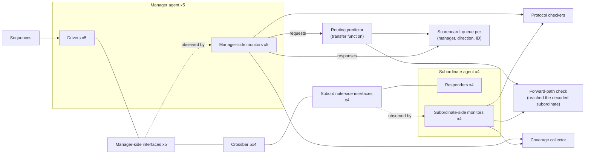

# 8. Testbench Architecture

Testbench architecture separates five responsibilities so that an environment can be debugged and reused with confidence in its checks. The reference SoC's crossbar testbench illustrates the problem: at six weeks of bring-up, one file contains 2,400 lines in a single module. It drives all five manager ports, samples the
four subordinate ports, computes what the SRAM should return, and collects coverage
in the same forever loop, over the same variables. It works and has found four bugs, but two problems arise in the same week.

A read-data mismatch at 41 µs has no clear explanation. The
crossbar may have returned two responses in an order the protocol permits; the
checker may have assumed an order the protocol never promised; or the driver's
back-pressure model may have drifted out of step with what it told the checker to
expect. All three hypotheses live in the same two hundred lines and share state, so
no experiment separates them. After two days in a waveform viewer, the ticket closes as "testbench issue" without an identified cause.

The DMA team also needs to reuse the AXI checking against its backend. Reuse fails because the checker reads driver-written variables: it knows only the intended stimulus, never what appeared on the wires, so it cannot provide an independent oracle (Chapter 3).

Both problems have one architectural cause rather than a coding error: the responsibilities share one program.

### Chapter map

§8.1 separates the five responsibilities of stimulus generation, driving, monitoring, checking and coverage, explaining what fails when they merge.
§8.2 develops signal, transaction and sequence layering with vendor-neutral transaction-level communication.
§8.3 compares three scoreboard patterns (in-order, multiple in-order streams and unordered matching keys) and their checking costs under reordering.
§8.4 covers when to build a reference model, its three species and their maintenance costs.
§8.5 explains why monitors never drive and how passive instantiation enables system-level reuse; §8.6 and §8.7 build the crossbar and DMA environments step by step; §8.8 covers environment reviews, configurability and bring-up.

## 8.1 Five separate responsibilities

A testbench need not be a monolithic block [cit:B2]. The design under verification is not implemented as one unit, and its environment need not be either. The decomposition separates five responsibilities by their functions and the information they must not share ({ref: five_responsibilities}):

{table: five_responsibilities} The five responsibilities a testbench separates, each with the question it answers and the thing it must not know. The third column is the load-bearing one: every entry in it is an ignorance imposed on purpose, because merging two of these boxes does not merely blur the environment's structure — it loses something specific.

| Responsibility | Answers | Must not know |
|---|---|---|
| **Stimulus generation** | *What* scenario should happen next? | How the protocol wiggles pins |
| **Driving** | *How* is this transaction expressed on the interface? | What the correct response is |
| **Monitoring** | What *did* appear on the interface? | What was intended |
| **Checking** | Was it *right*? | Which test is running |
| **Coverage** | What have we *exercised*? | Whether the test passed |

By 2001 a language designed 
for functional verification was already built on the same principle: a data model,
a test generator, a reference model, a checker (split further into a data checker
and a temporal checker running concurrently with the design), and coverage metrics
tied back to a plan, with separation of concerns as its organizing principle rather
than a coding convention retrofitted later [cit:P18]. Chapter 9 traces this history: the structure preceded the tooling.

Each responsibility earns its own box because each has a different failure mode and
a different reason to change. Merging responsibilities removes specific capabilities:

**Checking inside the driver.** A driver knows its intended stimulus. If the checker lives there, it compares the design against the stimulus
generator's intentions rather than against the specification;
and every bug in
which the driver itself misbehaves becomes invisible, because both sides of the
comparison move together. This embeds Chapter 3's common-mode error in the architecture.

**Monitoring inside the driver.** Observation as a side effect of driving cannot watch an interface driven elsewhere.
That prevents passive system-level reuse (Section 8.5), including debugging with the same environment watching real traffic while stimulus is disabled.

**Coverage inside the checker.** Coverage sampled at verdict computation covers only paths the checker reached. Missing observation then looks like missing stimulus, preventing an answer to Chapter 6's question of what the tests never did.

On a finished project, the self-checking structure is the largest and most
complex part of the environment, the one that cost the most authoring and
maintenance, and the one responsible for declaring functional correctness; it
embodies a duplication of the specified functionality of the design. Checking needs planning before bring-up: which failure modes it detects,
and how, belongs in the verification plan and must be reviewed, so that a potential
failure does not go undetected. The classical categories are data transformation, data ordering, protocol correctness, data losses and design state [cit:B2] (see Chapter 5).

Implementation-specific failures such as buffer overflows are best expressed as assertions directly in RTL; signal-level relationships belong in the interface declaration containing the signals. Higher-level failures involving data transformation, ordering or end-to-end computation are better detected behaviorally in the testbench, because property languages do not suit end-to-end response checking well [cit:B2] (Chapter 11). The split must be deliberate and documented, with exactly one owner per failure mode.

> **Scenario.** The crossbar driver predicts the read-back value of each write and stores it in a local array. A review examines a mis-encoded `awsize`. **Approach.** The driver only drives pins, a monitor reconstructs what the crossbar received, and the predictor uses the *monitored* request. **Why.** With the split, the mis-encoded `awsize` produces a monitored
> transaction that differs from the intended one and the read-back check fails.
> Without it, the driver's mistake propagates identically into both the design and
> the expectation, and the test passes.

## 8.2 Layering: signal, transaction, sequence

An environment spans three levels of abstraction.

At the **signal level** live pins, edges and handshakes. At the **transaction
level**, a transaction is initiated by injecting
something into the running simulation and terminated some time later by observing a
result; functional verification works at the level of whole transactions rather
than the design's clock cycles [cit:P18]. At the **sequence level** live scenarios:
ordered, constrained collections of transactions that express intent ("fill the
write-data channel of manager 2 while the debug port reads the ROM"). Chapter 9
takes the sequence level as its subject.

The component that converts between the first two levels is the **transactor**, or
bus-functional model: repetitive physical-level operations are encapsulated into
tasks, and all the tasks for one physical interface or protocol are collected into
one model [cit:B2]. Only the transactor accesses pins; components above it use transactions.

Incorrect pin-sampling time causes apparent design bugs during bring-up. A clocking block makes
the sampling moment explicit: with the default `1step` input skew, the value
sampled is always the signal's last value immediately before the clock edge
[cit:S8], which is what a monitor wants and what a naive `@(posedge clk)` read does
not reliably give.

### Two shapes of communication

Two non-interchangeable communication shapes cover almost all component interactions.

**Operational** communication is point-to-point and blocking: a producer hands a
transaction to one consumer, and back-pressure is meaningful: a sequencer that
cannot hand its next item to a busy driver *should* wait. **Observational** communication broadcasts a monitor's observations without blocking or depending on listeners. Its standard form is an analysis port with a single `write()` function broadcasting a value to all subscribers [cit:S9]. The port may have zero, one, or many subscribers without affecting the producer's operation; however many are connected, the void `write()` call always completes in the same delta cycle [cit:S11].

Observers must never slow a monitor, because that would change measurement timing. Observers are pluggable: a coverage collector, protocol checker and scoreboard subscribe to one stream without structural changes for a fourth.
Siemens EDA's Verification Academy publishes a taxonomy of what subscribes to an
analysis port: comparators, coverage collectors, and metric analyzers, whose
subject is non-functional behavior such as timing, performance and power rather
than correctness [cit:B8].

Broadcast requires independent copies: each
subscriber receives a handle to the *same* transaction object, so every subscriber
must copy before operating on it [cit:S11], and the standard states normatively
that a subscriber's `write()` implementation shall not modify the value passed to
it (IEEE Std 1800.2-2020, *IEEE Standard for Universal Verification Methodology*,
§12.2.10.2) [cit:S9]. A coverage collector normalizing an address in place silently corrupts the scoreboard's expectation, producing an apparent design bug.

Chapter 10 covers the library standardizing these connections; the pattern predates libraries and remains independent of them, with one publisher and many independent observers without back-pressure on observation.

### Protocol layering

Transactors traditionally tied to one physical interface prevent reuse because each environment needs its own model and abstraction level. Layered models follow the protocol's structure. The layers are usually obvious in communication
protocols: a USB application layers into packets, transactions and transfers (*Universal Serial Bus 3.2 Specification*, Revision 1.1, USB 3.0 Promoter Group, June 2022) [cit:S21];
but they exist elsewhere too, and any system-level function that can be
decomposed into blocks gives a corresponding decomposition of its transactions
[cit:B2].

A block-level transaction is usually different from a system-level transaction: an Ethernet frame for a MAC block becomes an IP packet for the system reassembling and routing fragments [cit:B2]. Layered transactors let both environments share the lower
layers instead of forking them.
What counts as a transaction at each layer stays a local decision. TLM-2.0, part
of IEEE 1666 and built on SystemC, supplies the interoperability layer for
transaction-level modeling [cit:S25], and in practice that guarantee has held only for
memory-mapped bus protocols: for serial and interrupt-style interfaces such as
SPI, I2C, CAN and UART, each modeling team defines a payload of its own
[cit:D43].

> **Scenario.** The USB controller must pass a compliance suite defined outside the specification, in the USB SuperSpeed Compliance Methodology white paper, and
> the team also needs its own directed and random tests for the dual-role
> device/host switch. **Approach.** The harness has three layers: a signal-level transactor per port, a packet layer, and a transaction/transfer layer. The compliance suite drives the top layer; in-house sequences drive whichever layer they need. **Why.** The compliance suite is a fixed body of externally specified stimulus and checking; it is not an environment and does not know about the design's power-state corner cases. Layering lets both consume the same transactors, so the signal layer is written and debugged once.

A third benefit is retargeting. Compact transaction messages replace per-signal traffic to overcome simulator/emulator throughput limits, provided timed and untimed behavior stay separate and the two sides synchronize on transactions and events rather than clocks [cit:D33].
Transactors enable this retargeting; an environment accessing signals from twenty places cannot be moved (see Chapter 17).

## 8.3 Scoreboard patterns

For some, *scoreboard* denotes the whole self-checking structure, including predictor, expected-data storage and comparison. This chapter uses the narrower definition: a **scoreboard is the data structure that holds data expected to be
received**, filled by a predictor and consulted by the comparison function when the
output monitor reports something. Data remaining at simulation end was lost in the design, which may or may not be an error [cit:B2].

A scoreboard is a data-structure problem whose single driver is
lookup: because the exact order in which outputs appear may be hard to predict, the
structure must be designed to minimize the look-up operation [cit:B1]. The following three patterns differ in their ordering assumptions.

**In-order: one queue.** If the design preserves the order of its input stream,
store expectations in a queue and check each observed response against the front.
A queue beats a dynamic array here because it performs the same adding or
removing regardless of position, whereas an array shifts its whole content on every
check [cit:B1]. Lookup is O(1) and failure messages are unambiguous; reordering is reported as a data mismatch, which is correct only if the specification requires order.

The skeleton of that pattern, on one DMA channel's descriptor completions: the predictor fills the queue, the observation consults its front, and Section 8.6 turns the single queue into one per stream key.

```systemverilog
package dma_desc_sb_pkg;

  typedef enum {XFER_OK, XFER_ERR} xfer_status_e;

  typedef struct {
    int unsigned  desc_id;   // index of the descriptor in the channel's list
    logic [31:0]  bytes;     // bytes the descriptor moves, from the model
    xfer_status_e status;    // the completion status the model predicts
    time          t_pred;    // when the programming writes were monitored
  } dma_exp_t;

  // One channel completes its descriptors in the order they were programmed,
  // so the expected store is one queue and the lookup is its front. Two
  // channels take one queue each, the second pattern of this section; the
  // crossbar's three-coordinate key is Section 8.6.
  class dma_ch_scoreboard;
    local dma_exp_t pending [$];
    int unsigned n_matched, n_orphan, n_mismatch;   // read by report()

    // Called by the predictor, which the register monitor feeds with the
    // programming writes it observed. Never called from a driver.
    function void predict(dma_exp_t e);
      e.t_pred = $time;
      pending.push_back(e);
    endfunction

    // Called by the completion monitor. Zero delay, so the checker can
    // never back-pressure the monitor.
    function void observe(int unsigned desc_id, logic [31:0] bytes,
                          xfer_status_e status);
      dma_exp_t head;
      if (pending.size() == 0) begin
        n_orphan++;                     // a completion nobody predicted
        $error("dma_sb: orphan completion, descriptor %0d", desc_id);
        return;
      end
      head = pending.pop_front();
      // !== and not !=: an x in an observed byte count must never score as
      // a match.
      if (head.desc_id !== desc_id || head.bytes !== bytes ||
          head.status !== status) begin
        n_mismatch++;
        $error("dma_sb: mismatch: expected descriptor %0d, %0d bytes, %s, \
predicted at %0t; observed descriptor %0d, %0d bytes, %s",
               head.desc_id, head.bytes, head.status.name(), head.t_pred,
               desc_id, bytes, status.name());
        return;
      end
      n_matched++;
    endfunction

    // End of test: a descriptor that never completed leaves its expectation
    // in the queue and produces no mismatch of its own.
    function bit report();
      int unsigned n_left = unsigned'(pending.size());
      $display("dma_sb: matched=%0d orphan=%0d mismatch=%0d leftover=%0d",
               n_matched, n_orphan, n_mismatch, n_left);
      if (n_left != 0)
        $error("dma_sb: %0d descriptors never completed", n_left);
      return (n_orphan == 0) && (n_mismatch == 0) && (n_left == 0);
    endfunction
  endclass

endpackage
```

**Multiple independent in-order streams: one queue per stream.** Responses on
several concurrent interfaces may be observed in any order while the sequence on
each single interface stays in order; one queue per output interface holds that
interface's predictions in the expected order and lets observations be checked in
any order across interfaces [cit:B1]. The pattern generalizes past physical
interfaces to any *logical* stream the specification promises to keep ordered. On
the crossbar, the guarantee AXI makes is per manager port, per direction and per
transaction ID: responses carrying the same ID return to their manager in order,
responses with different IDs may be reordered by the interconnect, and reads and
writes carry independent ID spaces. The *AMBA® AXI and ACE Protocol Specification*, Arm IHI 0022H.c §A5.1 "AXI transaction identifiers" [cit:S18], states the ordering rule in one sentence: "All transactions with a given AXI ID value must remain ordered, but there is no restriction on the ordering of transactions with different ID values." The stream key therefore needs all three
coordinates, and Section 8.6 shows what goes wrong with any fewer.

**Unordered: matching keys.** If no per-stream ordering survives, the checker must find the matching expectation rather than pop it. An index avoids a slow full search: hashing the observed response's own values produces a likely-unique key, which an associative array maps to the expected data's location [cit:B1,B2].

> **Scenario.** The Ethernet MAC's TSN queues reorder by design: eight priority
> queues with a credit-based shaper mean a low-priority frame injected first can
> legitimately leave last. **Approach.** Key expectations by (destination port,
> traffic class, stream identifier), all three of which the egress monitor reads off
> the frame itself, and keep one in-order queue per key (within a traffic class the
> shaper does not reorder), then check the *relations* the
> specification actually guarantees (per-class order, no duplication, no loss)
> rather than the exact global departure sequence. **Why.** A global in-order scoreboard would reject the first legal reordering, while a fully unordered scoreboard would accept a real per-class ordering bug. The key specifies which ordering is verified and therefore requires review.

The design's ordering guarantees determine which of the three patterns applies. {ref: scoreboard_ordering_structures} sets them
side by side, with the lookup each one forces.

{table: scoreboard_ordering_structures} Scoreboard structure as a function of the ordering the design actually guarantees: what the design preserves, the structure that matches it, the lookup that structure needs, and what the checker gives up in exchange. The last column is where the price is paid — each step down the table tolerates more of the reordering the specification permits, and checks less of it.

| Design behavior | Structure | Lookup | Cost to the checker |
|---|---|---|---|
| Preserves order | One queue | Front only, O(1) | Cheapest; any reorder = failure |
| Per-stream order only | Queue per stream key | Front of one queue | Must *name* the stream key correctly |
| Reorders freely | Associative index on a content key | Hash, O(1) amortized | Ordering is no longer checked at all |

### Tagging, losses and inexact answers

Three refinements address tagging, losses and inexact answers. **Data tagging** exploits designs
that carry part of their input untouched to an output: once separate checking has
established that the payload is not modified, the checker can encode the expected
destination, position and transformation *in the payload*, so each output monitor
decides correctness on its own. This is the simplest self-checking structure because independent monitors contain all checking intelligence, subject to two limits. Serial numbers should not be embedded in stimulus
data, because a system-level environment will need those user fields for
higher-level information [cit:B1]; and when the payload is too short to hold the
tag, tagging must work in concert with a scoreboard, the tag serving as a fast key
into it [cit:B2].

**Losses.** Some designs legitimately drop data, and reproducing the discard
decision means reproducing the design's resource state and timing. Usually, an aggregate check is preferable. On an *ordered* stream, the first two patterns only, a transaction ahead of the matched expectation is assumed properly dropped, and the assumption is confirmed against the design's own drop-count statistics [cit:B1]; "ahead of" has no meaning in a content-keyed index. This replaces an intractable prediction with a cheap check of aggregate losses.

**Inexact answers.** A fixed-point datapath will not match a floating-point model
bit for bit; the observed response is then compared against the predicted one
within an acceptable margin of error or bit-error rate [cit:B1]. The radar front-end's FFT chain is the canonical case; the plan must justify the margin.

## 8.4 Reference models: three species

Chapter 3 established that a true reference model is the most complete oracle and
that it rarely exists. The alternatives are three species with different costs and one distinction between transfer functions and reference models.

A **transfer function** reproduces the data transformation the design performs, so
that the environment can determine which output to expect; it uses the design's
configuration descriptor to perform the same transformation, and it is normally
used together with a scoreboard. It is not a reference model, because a transfer function does not exist a priori, is not golden by
definition, and as simulations run will contain as many errors as the design
itself; because it predicts less accurately, the response monitor has to perform
more intelligent checks to deal with the uncertainty, whereas with a true
reference model, checking is a plain observed-against-expected comparison [cit:B2].

**Species 1: the algorithmic transfer function.** This is written from the specification in the testbench language. Examples are the crossbar's address decoder and the DMA's descriptor *legalizer*, distinct from the byte-level descriptor model in Section 8.7. It is cheap to build and change but never trusted absolutely: disagreement first requires identifying which of the two implementations misread the specification (Chapter 3's common-mode warning applies in full).

**Species 2: the golden executable.** The standard supplies the model, so checking compares pixels after decoding the conformance bitstream.
The video codec's decoder is this case (see Chapter 3), while its encoder on the same die has no golden executable. The standard constrains
the bitstream, not the choices that produced it, so two conformant encoders emit
different bitstreams from the same picture and both are correct; there is no
executable to compare against. Checking combines weaker
claims: the output decodes, it decodes to a picture within the distortion target
*the team itself* set (a quality goal of its own making, not a standard-mandated
one), and it never pushes the level's buffer-occupancy constraints out of bounds;
each of them checkable, none of them golden. One block thus has a bit-exact model in one direction and no model at all in the other, so golden status does not establish completeness.

**Species 3: the co-simulated instruction-set simulator.** For the reference SoC's
core, the model runs alongside the RTL and the comparison happens at instruction
retirement: an instruction manager processes instructions as the design retires
them, and an ISA scoreboard performs a step-and-compare of PC, registers,
CSRs and trap status (*The RISC-V Instruction Set Manual, Volume II: Privileged Architecture*, Version 20250508, ratified, RISC-V International) [cit:S15] against the golden state [cit:P25]. Two structural requirements support this comparison.

First, reference models need not be cycle-accurate specifications of the hardware,
only functionally accurate [cit:P18]. Requiring functional rather than cycle accuracy makes a software model fast enough to co-simulate, and it dictates where comparisons may occur: at an architectural boundary such as retirement, never cycle by cycle.

Second, asynchronous events must reach both sides to avoid failures resembling design bugs. A RISC-V environment doing this
correctly has its interrupt agent drive random external, timer and software
interrupts to the core and *simultaneously notify the reference model of the same
interrupts*, so design and model operate on a synchronized view of external events
[cit:P25]. Without notification, a random interrupt can create an environment-induced divergence; in this example, diagnosis takes a day. The same rule
governs error injection and any responder whose behavior the model must know about.

On the OpenHW Group's CV32E40Pv2 (a 32-bit
in-order RISC-V core that originated as RI5CY at ETH Zurich and whose development
was continued by Dolphin Design, with the reference model and the coverage model
supplied by Imperas), the environment runs the same program on the RTL and on the
reference model, streams the core's internal state and its asynchronous events over
an interface named RVVI-TRACE, and compares state as each instruction retires,
flagging a mismatch the moment it appears rather than at the end of the run
[cit:D6].

Where concurrent integration is too hard, both sides can dump outputs for post-processing comparison [cit:B2], incurring Chapter 3's detection distance: the verdict follows simulation end, far from the causal state.

### The maintenance burden

Every species is a second implementation of the
specification and requires maintenance as long as the design lives: every specification
change becomes two edits, two reviews and one decision about which side was right.
The plan must budget this maintenance (Chapter 5) before it emerges in month four. Without a model, expectations are hard-coded
per test, which needs a known configuration and a known input stream and so works
only for directed testcases; and because the response checked is crafted for that
testcase, an unexpected corner accidentally created by a test aimed elsewhere goes
undetected [cit:B2].

> **Scenario.** The UART needs no reference model under Chapter 3's risk allocation, which assigned it a thin directed suite. **Approach.**
Oracle architecture leaves that allocation unchanged. **Why.** Models suit stateful, configurable or arithmetic transformations whose expectations would otherwise require manual derivation in every test. A small, silicon-proven
> block with a trivial transformation is none of those.

## 8.5 Monitors and passive checking

**A monitor never drives stimulus.**

Signal direction alone is insufficient: a stimulus task that checks feedback signals is still stimulus, and a
monitor that must return flow-control is still a monitor. The distinction is *who initiates*: if a task initiates the transaction under full control of
the testbench, it is a stimulus generator; if it waits for a transaction initiated
by the design, it is a response monitor [cit:B2]. A subordinate-side responder answering requests is therefore an agent's driver.

A late response task leaves the testbench unready: internal back-pressure prevents full-throughput verification, output data "spills" and leaves stream gaps, or missing feedback signals cause an output protocol violation attributable entirely to the testbench. The structural answer is the **autonomous monitor**: an independent thread started at
construction that continuously watches the interface and pushes extracted data into
a FIFO the rest of the environment drains independently, decoupling the timing of
the transaction from the timing of the checking [cit:B2].

```systemverilog
// Passive by construction, but only through the modport: an inputs-only
// clocking block constrains vif.cb.*, and nothing else.
interface axi_mon_if (input logic clk, input logic rst_n);
  logic        awvalid, awready;
  logic [31:0] awaddr;
  logic [3:0]  awid;
  clocking cb @(posedge clk);
    input awvalid, awready, awaddr, awid;
  endclocking
  // Only the clocking block and reset are reachable through this modport.
  modport MON (clocking cb, input rst_n);
endinterface
```

A
component holding a plain `virtual axi_mon_if` handle reaches every member of the
interface, and `awvalid`, `awready`, `awaddr` and `awid` are ordinary `logic`
variables: `vif.awvalid = 1'b1;` compiles and drives. A clocking block on its own
constrains `vif.cb.*` and nothing else. A *clocking modport* restricts access; the standard's example, `modport STB (clocking sb);`, is a synchronous testbench modport [cit:S8]. A monitor handed a `virtual axi_mon_if.MON`
cannot assign to the bus at all: the compiler rejects the access, so no code review
has to catch it.

### Active and passive instantiation

Chapter 10 defines the agent and its active/passive switch, which enables reuse of a block environment at system level. A multi-level RISC-V environment illustrates this: the vector unit's environment actively emulates the scalar core at
block level, and the *same*
environment is then instantiated in passive mode inside the core-level environment
once the real core drives the interface [cit:P25]. Nothing is rewritten: the
stimulus half is switched off and the observation half keeps working. Without that separation, the environment is rebuilt at every integration level, leaving system verification without checking if that rebuilding is omitted.

### Protocol monitors and functional monitors

Two passive monitor roles have separate responsibilities. A **protocol monitor** checks interface traffic legality: handshake stability, response-code legality, no burst crossing a
4 KB boundary, no reserved encodings (Arm IHI 0022H.c §A3.2.1 "Handshake process", §A3.4.1 "Address structure" and its Table A3-3 "AxBURST signal encoding") [cit:S18]. Its natural implementation is assertions
attached to the interface, since signal-level relationships belong in the interface
declaration that contains the signals [cit:B2] (Chapter 11 covers how they are
written and bound). It knows nothing about intent and fires on the offending cycle.
A **functional monitor** reconstructs and publishes transactions from pins without judging them.

A monitor inferring unobservable behavior becomes another design implementation.

This separation also applies across different interface types, which suggests an architectural principle beyond digital design.
On a mixed-signal block taken from a current LSI Corporation design (an analog
driver with filtering and fault detection), the environment was built as wire UVCs
whose driver and monitor functions are written in Verilog-AMS rather than in the
testbench language, wrapped in the same self-checking sequences, functional coverage
and regression control as a digital agent would be [cit:D19].

> **Scenario.** In the flash controller's LDPC ECC pipeline, a first environment makes its NAND-side monitor recompute the ECC codeword to report "correctable" or "uncorrectable" per page. **Approach.** A predictor across the analysis port performs recomputation; the monitor reports the raw codeword, the design-published syndrome and the page's status bits. **Why.** This addresses two problems: debugging cannot distinguish faulty monitor arithmetic from a design bug when the error originates in an unreviewed component; and reusing the design team's LDPC routine under schedule pressure creates a common-mode check that proves nothing (Chapter 3).

An Ethernet MAC monitor timestamping frames on the wrong clocking edge reports a constant one-cycle offset on every TSN measurement. Every test fails despite a correct design; the cause is the sampling boundary in Section 8.2.

## 8.6 Worked example: the crossbar environment, step by step

The crossbar is a full AXI4 interconnect: five managers (instruction fetch, data,
two DMA channels, debug) by four subordinates (SRAM, boot ROM, APB bridge, neural
accelerator), 32-bit address, 64-bit data, ID width 4. The following steps establish the construction order.

**Step 0: the checking contract precedes code.** Four verdicts, each with
a named owner: data integrity per ordered stream and completeness (nothing lost,
nothing invented) belong to Step 4's scoreboard; routing correctness to Step 3's
forward-path check; protocol legality on the nine interfaces to Step 2's checkers.
And three it will *not* produce: relative ordering between different transaction
IDs, arbitration fairness, latency bounds. Each verdict needs a named owner and mechanism; documenting the excluded half of the contract prevents reviewers from assuming checks that do not exist (Chapter 3).

**Step 1: one agent per interface.** Nine agents, each owning exactly one
interface [cit:S11]. Five manager-side agents are active: sequences feed a driver,
a monitor watches. Four subordinate-side agents are responders; by Section 8.5's
criterion they are drivers, since their reply is under testbench control: an SRAM
model with programmable latency and back-pressure, a ROM responder that returns an
error response to every write, an APB-bridge responder with long variable latency,
and an accelerator responder that can stall indefinitely. All nine carry a monitor,
including the interfaces the environment itself drives.

**Step 2: monitors publish to subscribers.** Each monitor broadcasts the
transactions it reconstructs, to three kinds of subscriber: the per-interface
protocol checker; the coverage collector, which samples the shaped route cross
`cg_xbar_route` of Chapter 6 (the model, its `ignore_bins` and their justifications
belong there; this environment only supplies the stream); and the checking path,
which takes two edges on the manager side (requests to the predictor, responses to
the scoreboard) and one on the subordinate side (the forward-path comparison). None
of them can block the monitor, and none may modify the transaction it receives
[cit:S9]. {ref: crossbar_env} shows the resulting structure.



{figure: crossbar_env} The crossbar environment. Stimulus reaches the design through drivers and interfaces; checking is fed only by monitors, so no checker can observe a value the design never drove. The routing predictor supplies both the scoreboard, which matches responses per `(manager, direction, ID)`, and the forward-path check, which confirms the request reached the decoded subordinate.

**Step 3: the routing predictor feeds two paths.** The predictor is a
transfer function, not a reference model (Section 8.4): from a *monitored*
manager-side request it decodes the destination using the runtime configuration
descriptor [cit:B2]; the address map is data the test can change, never a constant
in the checker. It emits one expectation record holding the originating manager,
the decoded subordinate, the direction, the manager-side ID, the address and the
expected beats. The predictor is not golden: a disagreement between its map and RTL parameterization makes every region-boundary access mismatch, initially requiring specification review rather than checker debugging (Chapter 3).

The record feeds two comparisons, one for each crossbar path. The **forward-path check** compares it with the subordinate-side request monitor to establish routing correctness: the address and write data reached only the decoded subordinate.
The **return-path check** is Step 4's scoreboard, and it observes on the *manager*
side, because read data flows subordinate → crossbar → manager. Comparing against a subordinate-side response monitor checks the environment's own responders and cannot establish whether subordinate 0's read data reached manager 2 rather than manager 3 in ID order.

**Step 4: the out-of-order scoreboard.** A key needs one dimension per independent source of concurrency, as Section 8.7 also shows for the flagship's eight-channel DMA. Here there are three: five managers
issuing at once, two independent ID spaces, and AXI's per-ID ordering within one
port and one direction (Arm IHI 0022H.c §A5.1 "AXI transaction identifiers", §A5.2.1 "Read data ordering") [cit:S18]. The stream key is the triple (manager port, direction,
manager-side ID), one in-order queue per stream [cit:B1].

The two-coordinate key (subordinate, ID) fails all three requirements. Manager 1 and
manager 2 may both have ID 3 outstanding to subordinate 0 (the situation Chapter
10's virtual sequence deliberately sets up), and one queue then matches one
manager's expectation against the other's response, under some
arbitrations only, so it surfaces as a mismatch that disappears on a seed change
rather than as a reproducible bug. It merges `ARID` and `AWID`, which name
unrelated streams, so a read expectation can be popped by a write response. An interconnect merging several managers must also *widen* subordinate-side IDs to avoid falsely serializing different managers' same-ID transactions. Five managers need ⌈log₂5⌉ = 3
manager-identifying bits, so the 4-bit ID a manager issues arrives at a subordinate
port as a 7-bit one; keying there is sound only with that widened ID, which obliges
the predictor to reproduce the design's ID-remap policy exactly. Manager-side keying avoids modeling that policy and keeps the key computable from what the observer sees.

```systemverilog
typedef enum bit {RD, WR} xbar_dir_e;

typedef struct {
  int unsigned mgr;          // originating manager port, 0..4
  int unsigned sub;          // destination decoded by the predictor, 0..3
  xbar_dir_e   dir;          // read and write IDs are independent spaces
  logic [3:0]  id;           // manager-side ID, as the manager issued it
  logic [31:0] addr;
  logic [63:0] beats [$];    // expected response data, one entry per beat
  time         t_pred;       // when the request was monitored
  int unsigned capture;      // monotonic index, for the failure message
} xbar_exp_t;

class xbar_scoreboard;
  // One expectation queue per (manager port, direction, manager-side ID).
  local xbar_exp_t pending [int][$];
  local int unsigned n_capture;
  int unsigned n_matched, n_orphan, n_mismatch;   // read by report()

  local function int stream_key(int unsigned mgr, xbar_dir_e dir,
                                logic [3:0] id);
    return (int'(mgr) << 5) | (int'(dir) << 4) | int'(id);
  endfunction

  // Called by the routing predictor when a manager-side monitor
  // reports a legal request. Never called from a driver.
  function void predict(xbar_exp_t e);
    if ($isunknown(e.id)) begin       // never legal, and int'(id) would
      $error("xbar_sb: X/Z in a request ID, manager %0d", e.mgr);
      return;                         // silently file it under key 0
    end
    e.t_pred  = $time;
    e.capture = n_capture++;
    pending[stream_key(e.mgr, e.dir, e.id)].push_back(e);
  endfunction

  // Called by a MANAGER-side monitor, so that what is checked is the
  // crossbar's return path and not the environment's own responder.
  // Zero-delay: it never blocks the monitor's thread.
  function void observe(input int unsigned mgr, input xbar_dir_e dir,
                        input logic [3:0] id, input logic [63:0] beats [$]);
    int k;
    xbar_exp_t head;
    if ($isunknown(id)) begin
      $error("xbar_sb: X/Z in a response ID, manager %0d", mgr);
      n_orphan++;
      return;
    end
    k = stream_key(mgr, dir, id);
    if (!pending.exists(k) || pending[k].size() == 0) begin
      n_orphan++;                     // a response nobody asked for
      $error("xbar_sb: orphan %s response, manager %0d ID %0d",
             dir.name(), mgr, id);
      return;
    end
    head = pending[k].pop_front();    // one manager, direction and ID:
                                      // these must return in order
    if (head.beats !== beats) begin   // !== : an x beat never reads as equal
      n_mismatch++;
      $error("xbar_sb: %s mismatch, manager %0d ID %0d: exp %p got %p; \
predicted for subordinate %0d at %0t, capture %0d",
             dir.name(), mgr, id, head.beats, beats,
             head.sub, head.t_pred, head.capture);
    end
    else n_matched++;
  endfunction

  // End of test: anything still queued was never delivered.
  function int unsigned leftover();
    int unsigned n = 0;
    foreach (pending[k]) n += unsigned'(pending[k].size());
    return n;
  endfunction

  // A silent scoreboard is a broken scoreboard: all four counts printed,
  // three of them failures.
  function bit report();
    int unsigned n_left = leftover();
    $display("xbar_sb: matched=%0d orphan=%0d mismatch=%0d leftover=%0d",
             n_matched, n_orphan, n_mismatch, n_left);
    if (n_left != 0)
      $error("xbar_sb: %0d expectations never answered", n_left);
    return (n_orphan == 0) && (n_mismatch == 0) && (n_left == 0);
  endfunction
endclass
```

Four details support the checking contract. `predict` is called by the *predictor*, which a monitor feeds, never by a driver (Section 8.1). Both entry points are
zero-delay functions, so a checker can never back-pressure a monitor [cit:B1]. The
comparison uses `!==`, not `!=`, because logical inequality on operands containing
x or z yields `1'bx`, which `if` reads as false: with `!=`, a single undriven beat
scores as *matched*; the comparison could not detect the undriven beat. The `$isunknown` guards prevent `int'(id)`, a two-state cast, from collapsing an unknown ID to `0` and filing a corrupt transaction under a real key. A response that never arrives produces no mismatch, only a queue that never empties, so `leftover()` checks for this usually silent failure [cit:B2]. `report()` exposes these counters so their results can be inspected.

**Step 5: limits of the environment.** The canonical crossbar bug is
write-data interleaving under back-pressure: beats belonging to two writes in
flight to one subordinate appear interleaved on the wire, on a channel AXI4
obliges the crossbar to keep in address order (Arm IHI 0022H.c §A5.2.2 "Write data ordering") [cit:S18]; interleaving write data with different IDs is deprecated in AXI4 and later rather than forbidden, and with no `WID` to tag a beat, address order is one burst at a time. The scoreboard cannot detect this because a tolerant subordinate still stores correct bytes and returns correct responses; the violation relates two transactions rather than either transaction's data. It was
found by protocol assertions in formal, with an 11-cycle counterexample (Chapter
14). The scoreboard checks return-path data and completeness, the forward-path check owns routing, and the protocol monitor owns legality. Formal provides exhaustiveness for the legality properties that matter most; fairness and starvation remain outside all these checks, as Step 0 declares.

**Step 6: diagnostic records.** Every expectation records its originating manager, decoded subordinate, monotonic capture index and request-monitoring time, enabling messages such as *"RD mismatch, manager 2 ID 3 … predicted for subordinate 0 at 41,320 ns, capture 8814"* instead of an unexplained difference between two byte queues. The four fields expose the provenance missing from the opening example, in which diagnosis took two days.

## 8.7 Worked example: the DMA environment and end-to-end checking

The DMA engine (two channels, 1D and 2D transfers, bursts up to 256 beats, a
16-entry × 64-bit datapath FIFO in the backend, per-channel error reporting) poses
a different oracle problem. No single interface establishes transfer correctness; end-to-end checking must determine whether the descriptor produces the correct destination bytes.

A register agent programs the
frontend (Chapter 10 covers register abstraction); a byte-accurate memory model
behind the backend's AXI manager port serves reads and absorbs writes with
randomized latency and back-pressure; a backend monitor publishes every burst; an
error/interrupt monitor publishes completion and error events. The oracle is a
**descriptor-level golden model**: a C model of the transfer semantics (source,
destination, 1D/2D sizes, strides, element width), co-simulated through the
language's foreign-interface layer, which turns the programmed descriptor into the
expected destination memory image.

This model is golden within a narrow scope: data-mover transfer semantics *are* the specification, and the model implements them at byte-movement abstraction rather than burst abstraction. Omitting midend splitting details makes it maintainable. Section 8.4's Species 1 legalizer model predicts midend splitting and is a transfer function as buggy as the mirrored design; the descriptor model predicts only byte destinations, remaining golden because it excludes splitting. The two models for one IP differ in the abstraction level each commits to.

Both checking levels are necessary:

**Level 1, end-to-end and late.** At descriptor completion, checking compares memory-model and golden images byte for byte, and reported per-channel status with predicted status. This catches the canonical DMA bug: a negative-stride 2D transfer mis-legalized at the 4 KB boundary corrupts data only when channel 1 is also active. Every burst the
backend issued was individually legal; only the bytes were wrong.

**Level 2, per-burst and immediate.** Protocol assertions bound to the backend's
AXI channels, including the 4 KB-crossing property established in Chapter 2 and
re-examined as a partial oracle in Chapter 3, plus the row-level legalization
coverage model `cg_2d_4kb` named in Chapter 5's plan row DMA-F06a and treated in
Chapter 6. The per-burst assertions fire on the offending beat.

Both levels are necessary because detection distance has a cost: errors should be detected as early as possible, while the model is still near the failing state [cit:B2]. An end-to-end mismatch reports 4 KB of incorrect destination memory at completion, on this block an order-of-magnitude delay of tens of microseconds and hundreds of bursts; the assertion identifies the offending beat. The checks are complementary: assertions cannot see wrong data, and image comparison cannot identify *when* the error occurred.

Two further decisions prevent false failures from over-specification. **Exact split sequences over-specify the model:** checking them turns every legitimate midend arbitration change into a regression failure. Checking instead requires bursts to stay within pages, cover the descriptor exactly once in aggregate and match byte counts; coverage records which split shapes appeared. **Asynchronous events reach both sides:** an error response injected by the responder on beat 7 must also reach the golden model, or it predicts a complete image while the design correctly reports a partial transfer. This applies Section 8.4's processor co-simulation rule to the data mover [cit:P25]. Letting the golden model inspect the burst stream during bring-up diagnostics turns it into another midend implementation, with its own bugs and no independence (Chapter 3).

The burden belongs in the plan: a change to legalization touches the RTL, the model
and the coverage model, and the review must cover all three. The flagship's DMA, with eight channels, 40-bit physical addressing and descriptor chaining, reuses this environment: the golden model adds an address-width parameter and chaining loop, the scoreboard key adds a channel dimension, and the 4 KB discipline stays unchanged. The canonical bug's flagship descendant, whose split's second half writes a line held Modified by the host cluster, needs exactly one new component: a coherence-aware memory model.

## 8.8 The environment as a design in its own right

An environment that will be reused, reconfigured and debugged for three years is a software design, whose long-term requirements extend beyond immediate bring-up success.

**Reuse contract.** The self-checking structure belongs in a class
that holds no reference to the verification environment around it, exposes a
procedural interface through which stimulus, exceptions and observed responses are
reported, and works with zero delay rather than as a process of its own, forking a
blocking thread out of that interface on the rare occasion it needs simulation
time, which is also why channels and mailboxes are the wrong interface to a checker
[cit:B1]. A checker importing the block-level environment in week three prevents its own system-level instantiation and the reuse planned at kick-off. With that independence, one environment per IP composes into cluster environments and then the top-level environment [cit:S11].
A verification consultancy that rebuilt its scoreboard as a configurable library,
so that the design-specific part became configuration and not new code, reports
that its projects typically obtain an approximate 15% reduction in scoreboard code
against starting from the empty base class, and setup and configuration inside a
day even for complex designs; the library is published under a permissive
open-source license [cit:D41].

**Configuration is data.** The design configuration descriptor has to reach the
predictor, because the predictor performs the same transformation the design does
and that transformation depends on configuration [cit:B2]. Once configuration is an
object rather than a set of compile-time switches, it can be randomized, printed in
the failure log and replayed, and the environment stops needing a rebuild per test.

**Bring-up debuggability.** Four properties support bring-up debuggability; a payback within a week is an illustrative assumption: every transaction carries an identifier and a timestamp;
every failure message names expected, observed *and* the provenance of the
expectation; the environment has a mode with checking disabled, to separate
"stimulus cannot reach this" from "the check is wrong"; and the
checkers are themselves tested by injecting a known-bad response and confirming the
environment fails. Checker credibility requires evidence that it can fail (Chapters 2 and 3). All four need budgeting: this is the environment's largest part, with the greatest complexity and the most maintenance [cit:B2]. It requires the same review, coding standard, lint and regression discipline as RTL, with its schedule in the plan (Chapters 4 and 5).

### In practice

Implementation dependencies reduce the separation shown in the diagrams. If predicting the legal set exactly is too expensive, a scoreboard may depend on one implementation detail, such as a reordering window or prefetch depth. The assumption belongs in a comment and the plan, because an undocumented dependency can resurface at the next integration when that detail changes.

Dropping checker-testing under schedule pressure allows green regressions whose checks cannot fail.
Two or three permanently broken RTL variants, kept in the repository and run nightly, expose this: the environment is broken if it does not fail on them. The term "scoreboard" can denote the data structure to one engineer and the whole self-checking subsystem to another [cit:B2]. Stating the intended meaning can prevent disputes about which component is golden.

### Pitfalls

1. **Checking from the driver's intent.** *Symptom:* expectations computed from the
   transaction object the driver was handed, not from what the monitor saw. *Cure:*
   predict only from monitored transactions; the driver's copy never reaches the
   checker.
2. **A monitor that drives.** *Symptom:* the monitor completes a handshake or
   asserts a ready signal "to keep things moving"; a real stall bug becomes
   invisible. *Cure:* hand monitors a modport that exposes only an inputs-only
   clocking block, so passivity is a compile-time property, and put every reply in a
   responder.
3. **One global scoreboard queue for a reordering design.** *Symptom:* seed-dependent failures and progressively relaxed checking that eventually checks nothing. *Cure:* name the ordering guarantee the specification
   actually makes, key the queues by it, and record the choice in the plan.
4. **No end-of-test completeness check.** *Symptom:* every produced transaction matches, so the test passes while missing transactions go unnoticed. *Cure:* fail on orphan responses and on leftovers [cit:B2], excluding
   only those the design's own drop-count statistics account for [cit:B1], and
   report both counts in every log.
5. **The over-specified reference model.** *Symptom:* the model predicts arbitration
   order, latency or burst decomposition, and legal design changes break the
   regression. *Cure:* predict what the specification promises; measure the rest
   with coverage.
6. **The reconstructing monitor.** *Symptom:* a monitor recomputes ECC, CRC or unobservable protocol state using the design team's routine, and regression stays green on an injected fault. *Cure:* monitors report,
   predictors compute from an independently written specification (Chapter 3), and
   known-bad variants prove the checkers can fail.

### Summary

- Stimulus, driving, monitoring, checking and coverage are five responsibilities
  with five failure modes. Merging any two removes a capability: an independent oracle, passive reuse or accurate measurement.
- Signal → transaction → sequence layering uses non-blocking broadcast observation so measurement does not alter behavior [cit:S9,S11], while also enabling emulator retargeting [cit:D33].
- A scoreboard is a data structure whose design driver is the lookup [cit:B1,B2].
  Its key needs one dimension per independent concurrency source and must be computable from observations; moving from one queue to a content-keyed index trades ordering checks for reordering tolerance.
- A predictor written for the testbench is a transfer function, as buggy as the design and not golden; disagreements require specification review [cit:B2]. Only a model that *is*
  the specification is golden, and even then only about one projection of
  correctness. Co-simulation adds two conditions: compare at an architectural
  boundary, because models are functionally and not cycle accurate [cit:P18], and
  deliver every asynchronous event to both sides [cit:P25].
- Monitors never initiate or drive; autonomous operation prevents a late testbench from back-pressuring the design [cit:B2]. They observe the design's output, since checking the testbench's responder only checks its own work. An agent must work identically in active and passive mode [cit:S11,S9], enabling block-to-system reuse [cit:P25].
- The environment is a design: a checker's reusability requires independence from its surroundings and a procedural interface [cit:B1]. This is the largest and most maintained part of the environment [cit:B2], so its plan must provide for review and testing.

### Exercises

**Exercise 8.1 (calculation).** Take the crossbar parameters listed at the head of §8.6 together with the stream key of Step 4. Compute how many in-order expectation queues that key can address, and how many the two-coordinate key that the same step rejects would address. Step 4 holds that the shorter key fails all three of the concurrency sources it lists: give the reason it fails each one, and name the failure signature Step 4 attributes to two managers holding the same identifier at once.

**Exercise 8.2 (calculation).** Take the manager count and the manager-side ID width of §8.6 together with the widened subordinate-side ID width Step 4 derives. Compute how many distinct stream identities the manager ports can present per direction, and how many identities the widened field can encode. State what keying the scoreboard at the subordinate side would then oblige the routing predictor to reproduce, and give the property of a manager-side key that Step 4 prefers instead.

**Exercise 8.3 (judgement).** A reviewer proposes feeding the routing predictor's expectation record to a comparison against the subordinate-side response monitor, on the ground that read data originates at the subordinate. Decide what that comparison establishes and what it cannot, and give the step of §8.6 that carries the reason. State which of Step 0's verdicts lose their mechanism under the proposal.

**Exercise 8.4 (artifact).** Read the end-of-test line below, printed by the `report()` function of the crossbar scoreboard in §8.6. State the value `report()` returns for these counts and the reason. Name the design behavior that a nonzero final field records and the thing it leaves undetermined, and name the pitfall of the chapter that an environment without that field matches.

```text
xbar_sb: matched=256 orphan=0 mismatch=0 leftover=3
```

**Exercise 8.5 (judgement).** A reviewer proposes replacing `!==` with `!=` in the beat comparison of §8.6's scoreboard, on the ground that the two operators read alike. Decide what the substitution costs, giving the language rule that decides it and the failure it makes invisible. Name the other guard of the same step that defends against the same class of value, and state what that guard prevents.

**Exercise 8.6 (judgement).** A reviewer proposes replacing the descriptor-level golden model of §8.7 with the legalizer model of §8.4's Species 1, so that one oracle predicts burst splitting as well as destination bytes. Decide what the substitution costs, naming the scope in which the descriptor model is golden and the reason the legalizer model cannot inherit that status. State the over-specification §8.7 warns against and its effect on the regression.

### Further reading

**From the corpus.** [cit:B2] Chapters 5 and 6 are this chapter's direct ancestors:
bus-functional models, transaction-level interfaces, the verification harness, and
the taxonomy of self-checking techniques (hard-coded response, data tagging,
reference model, transfer function, scoreboarding), including the transfer
function / reference model distinction Section 8.4 is built on. [cit:B1] supplies
the implementation rules: encapsulation of the self-checking structure, its
independence from the environment, its procedural zero-delay interface, and the
scoreboard recommendations for in-order queues, per-stream queues, hashing indexes,
assumed drops and margin-of-error comparison. [cit:S11] gives the component
vocabulary and the analysis-port communication model, with [cit:S9] as its
normative statement. [cit:P18] is the historical source for the decomposition and
the transaction-level framing; [cit:P25] is a recent industrial account of a
multi-level environment with ISS co-simulation and passive reuse. [cit:D33] shows
what transaction-level layering buys on an emulator, and [cit:S8] Clauses 14 and 25
define the sampling and modport semantics every monitor depends on.
Siemens EDA's Verification Academy *UVM Cookbook* catalogs these patterns with worked scoreboard and agent code. It describes the predictor as a stand-in for the unfinished design, usually ready earlier through higher abstraction, so the testbench can be built and debugged before the design is available [cit:B8]. Its API details instantiate the vendor-neutral structure described here.

**Not in the corpus.** Mike Mintz and Robert Ekendahl, *Hardware Verification with
SystemVerilog: An Object-Oriented Framework* (Springer, 2007), treats environment
architecture as software design at book length. It is background only.
