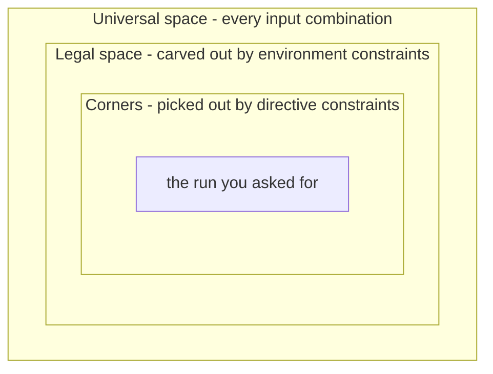

# 9. Stimulus: Directed to Random to Portable

The DMA engine's testbench is three weeks old. It has a driver, a scoreboard and
eleven directed tests, and every one of them passes. Test 1 programs a 64-byte 1D
copy and compares the two buffers. Test 7 programs a 2D transfer with a positive
row stride. Test 11 programs a transfer whose destination sits eight bytes below a
4 KB frontier, because someone read the AXI rule and wanted to watch the midend
split a burst. The verification engineer looks at the list and asks the question
that ends the directed era on every project that survives its first tape-out:
*what is test 12?*

There is no shortage of candidates. Negative strides. Both channels at once.
`NUM_REPS` at its maximum. A row exactly one maximum burst long, starting exactly
one maximum burst below a page frontier, on channel 0, while channel 1 is
draining. Each is plausible; each takes half a day to write and debug; and the
list, honestly enumerated, does not have eleven more entries — it has several
thousand. Writing them by hand is not merely slow: it guarantees that the bugs
you find are the ones you already imagined.

The answer the industry converged on is to stop writing tests and start writing
*rules* — describe what a legal descriptor is, let a solver produce them by the
million, and measure what you got. That trade introduces a new class of failure,
in which the stimulus looks busy and covers nothing.

### Chapter map

- §9.1 establishes what directed tests are genuinely good at — bring-up, spec
  compliance, regression anchors — and the point at which they stop scaling;
  §9.2 records what the dedicated verification languages contributed to what
  replaced them.
- §9.3 develops constraints that separate *legality* from *distribution*, and
  shows why over-constraining is the quietest way to lose a verification
  project.
- §9.4 establishes what a seed actually reproduces, and what it does not.
- §9.5 layers stimulus from atomic transactions to virtual sequences
  coordinating several interfaces at once.
- §9.6 states what portable stimulus solves that constrained random does not,
  and where its honest limits are.

## 9.1 Directed tests: precision, and its ceiling

A **directed test** is stimulus whose content and order are written out by hand.
Individual features are verified by individual testbenches, with the stimulus
manually crafted to exercise that feature and the response checked against the
symptoms that would appear if the feature were broken [cit:B2]. Nothing is chosen
at run time; the test does the same thing every time it runs.

That determinism buys three things no random environment supplies as cheaply.

**Bring-up.** The first stimulus a new block ever sees must be small enough to
debug when everything is broken at once. When the DMA engine's first descriptor
fails, you need to know whether the fault is in the register decode, the midend,
the backend, the scoreboard or the clock. A twelve-line directed test answers
that in one waveform; a randomized 2D transfer with 47 rows and a negative stride
answers nothing.

```systemverilog
// Directed: the first descriptor the DMA engine ever executes.
task automatic dma_bringup_1d();
  bus_write(SRC_ADDR,  SRAM_BASE);
  bus_write(DST_ADDR,  SRAM_BASE + 32'h8000);
  bus_write(NUM_BYTES, 32'd64);          // 8 beats of 64 bits
  bus_write(CFG,       CFG_EN_1D_CH0);   // enable, 1D, channel 0
  do @(posedge clk); while (!(bus_read(STATUS) & ST_DONE));
  check_memory_equal(SRAM_BASE, SRAM_BASE + 32'h8000, 64);
endtask
```

**Spec compliance.** Some stimulus is enumerated for you by an external
authority, and randomizing it is a category error. An HBM controller's
initialization and PHY-training sequence is a strictly ordered protocol with
mandated wait states between steps: there is exactly one legal opening move, and
the test that proves you make it is directed. The same holds for any published
compliance suite — the value of running the industry's list is that it *is* the
industry's list, not a sample from a space you invented.

**Regression anchors.** A short deterministic test that touches one feature and
finishes in seconds is the ideal smoke test: it tells you within a minute of a
commit whether the design still boots, and its failure is never ambiguous.

**Where it stops.** The directed approach can be managed to completion when the
total number of test cases is in the low hundreds; a project with over a thousand
identified test cases would need more than a year this way, and beyond that some
form of testbench automation becomes necessary to complete the task within an
acceptable time frame [cit:B2] — a schedule claim, not a feasibility one, and
quite bad enough. The reference SoC's DMA alone generated several thousand
candidates in the paragraph above.

Two failure modes matter more than the arithmetic. The first is **bias**:
directed test cases can only find bugs you were looking for [cit:B2].
Hand-written stimulus is a projection of the author's model of the design, and
where the model is wrong the stimulus is silent — Chapter 2's opening suite
contained no negative-stride case because its author's mental model of a 2D copy
went forwards.

The second is **decay**. A directed test can pass forever while ceasing to test
what it was written to test: enlarge a FIFO or a memory and every test case that
verified its full operation still succeeds, while now exercising only part of
it. The defence is a redundant path — state through a coverage model what
the test is supposed to accomplish and require it to fill 100% of those points,
since deterministic stimulus should fill exactly what it targets [cit:B2]. A
directed test that drops to 60% of its own goal has told you it went stale.

None of this retires the technique. In 2024, random tests are still described as
covering the vast majority of easy-to-detect scenarios but unable to reach
complex corner cases in reasonable time, with directed tests covering the
remainder [cit:P10]. The mature position is a division of labour, stated crisply
by one methodology: use a directed test when a scenario is too complex to
describe or too unlikely to happen randomly — and note that it need not be 100%
directed, since a directed sequence can be injected randomly within a stream of
random ones, which may expose problems a purely directed run would not [cit:B1].
Keep that last clause. In a mature environment, *directed* describes a fragment
of a run, not a run.

## 9.2 The constrained-random turn

The pressure that produced constrained random was not that directed tests were
bad. It was that designs acquired bugs which reveal themselves only under
convoluted scenarios — a cross of states among several state machines that is set
up only by one particular transaction sequence — and beyond writing as many
directed tests as possible, the only reasonable answer was random simulation
[cit:B6].

### From enumeration to description

The idea that changed the practice is small and radical: stop describing *a* run
and start describing *the set of legal runs*. Constraints are formal, unambiguous
specifications of design behaviour; in stimulus generation they define what input
combinations can be applied and when. Because they are declarative they
read like the specification rather than like a program, and because they are
executable — stimuli are generated directly from them — the manual construction
of a procedural testbench disappears, raising testbench writing to a higher level
of abstraction much as RTL raised design above gates [cit:B6].

There is a second payoff. The same constraint that *generates* legal traffic on
one block's input can *check* legality on a neighbouring block's output — the
generator/monitor duality — which is what makes interface constraints reusable
one level up the hierarchy [cit:B6]. Chapter 11 makes the same object an
assertion; Chapter 14 makes it a formal assumption. One artifact, three hats.

### The dedicated languages, and what survived them

That model was worked out in dedicated hardware verification languages before it
reached a general standard, and the `e` language is its clearest surviving
record. It reached engineers as a commercial product rather than as a research proposal: `e` came from Verisity Ltd., and Specman — Verisity's flagship product, most of which, its designers noted, was itself written in `e` — is what put the language on projects [cit:P18]. In it, a data item is a struct whose fields carry declarative
constraints, resolved during the run to generate a random but directed stream of
data for the DUT [cit:P18]. Three of its ideas are now so ordinary that their
origin is invisible:

- **A test is a layer of constraints, not a new generator.** A test
  specification, in its simplest form, adds a few constraints on top of an
  existing environment — extending an already-defined packet type with
  `keep i == j` and `keep kind != empty` rather than editing the generator.
- **Preference distinct from requirement.** Constraints could be marked soft: a
  hard constraint applied to the same field by another piece of code simply
  overrules them, so a general-purpose default could be overridden by a specific
  test without touching it.
- **Weights, possibly reactive.** A select-style constraint weighted the
  generator toward chosen alternatives, and those weights could be
  integer-valued functions of data sampled from the DUT — generation influenced
  by the current state of the device [cit:P18].

SystemVerilog absorbed the model into a general-purpose language, and the
semantics are now normative in IEEE Std 1800-2023, *IEEE Standard for SystemVerilog* [cit:S8]. Class variables are declared `rand` or `randc`;
`randomize()` generates values for all the *active* random variables of an
object, subject to the *active* constraints, and returns 1 on success or 0 on
failure — `rand_mode()` and `constraint_mode()` are what move a variable or a
constraint block out of that set. Inheritance builds layered constraint systems,
so a general-purpose model can be constrained into an application-specific one,
and `randomize() with` adds constraints inline at the call site [cit:S8] — the
`e` test-layering pattern,
standardized. In the 2024 industry data, constrained-random simulation is the one
simulation-based technique whose adoption is still climbing rather than having
stabilized [cit:R2].

### What the trade actually costs

Compared with the directed approach, a coverage-driven random approach trades
longer initial testbench development for more productive feature coverage in the
long run — and the source that says so immediately declines to quantify the gain,
because it depends heavily on the team's commitment and on its skill at writing
generators that can be constrained easily from the outside [cit:B2]. Two
commitments follow, both made on day one.

First, **you must measure**, because you no longer know what you ran. If you are
not using functional coverage in tandem with a random environment, you are only
doing directed test cases with random stimulus filling [cit:B2] — a sentence
worth taping to a monitor. The generator answers *what could happen*; only the
coverage model answers *what did*.

Second, **the generator is an architecture, not a detail**. One able to exercise
the required features does not happen by accident, and it is better to design a
generator that can be constrained easily from the outside than to alter its code
for each new test [cit:B2] — a decision that belongs with the environment
architecture of Chapter 8, not inside a test file. Every forked generator is a
directed test wearing a costume.

## 9.3 Writing good constraints

Constraints do two jobs that beginners conflate and experts keep rigorously
apart: they define what is **legal**, and they shape the **distribution** within
what is legal. Confusing them is the origin of most bad stimulus.

### Legality is a claim about the design, not about the test

Stimulus constraints come in two families: *environment* constraints, which
express the interface protocol and must be obeyed strictly, and *directive*
constraints layered on top, which steer the run toward the scenarios you
currently care about. The picture is three nested regions [cit:B6]:



{figure: constraint_space_regions} The two families of stimulus constraint drawn as nested regions: environment constraints carve the legal space out of the universal space of every input combination, and directive constraints pick out the corners inside it that give the run you asked for. Which boundary a constraint moves is what decides where it belongs — the outer one is the design's and lives in the generator, the inner one is a test's and lives in a layer above it.

The outer boundary belongs to the DUT and lives in the generator; the inner one
belongs to a test and lives in a layer above it.

Here is the DMA engine's 2D descriptor generator, each constraint labelled by
family. The DMA has a 64-bit data path and a maximum burst of 256 beats, so one
maximum burst moves 2048 bytes — exactly half a 4 KB page. Keep that number; the
worked example turns on it.

```systemverilog
class dma_2d_descriptor;
  rand bit [31:0]   src_addr;
  rand bit [31:0]   dst_addr;
  rand int unsigned num_bytes;     // bytes per row
  rand int          src_stride;    // signed
  rand int          dst_stride;    // signed
  rand bit [15:0]   num_reps;      // rows
  rand bit          channel;
  rand bit [31:0]   dst_row[];     // the rows this descriptor will touch

  // --- legality: the frontend rejects anything else ---
  constraint c_bus_alignment {     // 64-bit data path
    src_addr[2:0]   == 3'b000;
    dst_addr[2:0]   == 3'b000;
    num_bytes[2:0]  == 3'b000;
    src_stride[2:0] == 3'b000;
    dst_stride[2:0] == 3'b000;
  }
  // --- policy, NOT legality: an unmapped address is legal to PROGRAM.
  // Disable this one in the error-response test.
  constraint c_addressable {
    src_addr inside {[SRAM_BASE : SRAM_BASE + SRAM_SIZE - 1]};
    dst_addr inside {[SRAM_BASE : SRAM_BASE + SRAM_SIZE - 1]};
    foreach (dst_row[i])           // a negative stride must not walk the rows
      dst_row[i] inside {[SRAM_BASE : SRAM_BASE + SRAM_SIZE - 1]};
  }
  // --- policy: keep the randomized object small enough to solve fast ---
  constraint c_solver_budget {
    num_bytes  inside {[8 : 2048]};          // <= one 256-beat burst
    num_reps   inside {[1 : 64]};
    src_stride inside {[-8192 : 8192]};
    dst_stride inside {[-8192 : 8192]};
  }
  constraint c_rows {                // definition, not policy
    dst_row.size() == int'(num_reps);
    foreach (dst_row[i]) dst_row[i] == dst_addr + unsigned'(i * dst_stride);
  }
endclass
```

Four details carry the lesson. The `c_addressable` comment is the most important
line in the file: an address outside the memory map is legal to *program* — the
register field accepts it — and what the DMA does with it (a decode error,
reported per channel) is a feature to verify, not stimulus to suppress. Confining
stimulus to what the design is *for* is the reflex Chapter 2 warns against, and a
`constraint` block is the most convenient place in the language to commit that
error permanently. Second, `c_solver_budget`'s bounds are engineering choices
about solve time, not statements about the DUT; labelling them honestly lets a
later test relax them without anyone wondering whether it has just generated
something illegal. Third, alignment is a bit-select rather than
`num_bytes % 8 == 0`: both correct, one enormously cheaper to solve. Fourth,
`c_addressable` bounds `dst_row[]` and not just the two base addresses, because a
negative stride otherwise walks the rows out of the map and round through zero.
Deriving a field and forgetting to bound the derivation is the commonest way a
generator produces addresses nobody meant to allow.

### The uniform-distribution promise, and what it is not

What the solver owes you is precise: random values shall be selected to give a
uniform distribution over legal value *combinations*, every legal combination
equally probable, so that randomization explores the whole design space [cit:S8].
That is a strong guarantee — about the *solution space defined by your
constraints*, which is not the space your coverage model measures. Uniform
distribution over the solution space does not reflect the
intention of covering as many functional scenarios as possible; the distribution
most tools provide is derived from the constraint model and is simply not aligned
with the coverage model. In one published example, packets constrained only for
internal consistency were measured against a coverage model asking for the
extreme edges of the address range: over a run of a thousand generated instances
most of its objectives were left uncovered, and adding distribution directives
closed the coverage completely [cit:D10]. The constraint model contains no
directive that could steer toward the edges, because nothing in it knows the
edges matter.

> **Scenario.** The radar front-end's FFT pipeline takes 16-bit Q1.15 samples.
> **Approach.** Every 16-bit pattern is legal, so a bare `rand bit signed [15:0]`
> is a correct generator and a nearly useless one: the bugs live at the ends —
> saturation on the most-negative value, whose negation does not exist in the
> format — and uniform over 65,536 values visits each end with probability
> 1/65,536.
> ```systemverilog
> constraint c_dynamic_range {
>   iq dist { 16'sh8000        := 3,      // most negative
>             16'sh7fff        := 3,      // most positive
>             16'sh0000        := 2,
>             [16'sh8001 : -1] :/ 46,
>             [1 : 16'sh7ffe]  :/ 46 };
> }
> ```
> **Why.** The legal set is unchanged; only the probability mass moved. Weighting
> distinguished values against broad ranges is the standard idiom for making a
> corner case frequent without ever making an illegal one possible.

### Shaping: `dist`, ordering, and `soft`

Three constructs do the shaping, and none of them can make the solver fail.

`dist` assigns weights to values and ranges: absent any other constraints, the
probability that the expression matches an item is proportional to that item's
weight; `:=` applies the weight to each element of a range while `:/` divides one
weight across the whole range; the weights are ratios and need not be normalized
to 100; and — crucially — nonzero weights do not change the solution space and
therefore cannot cause the solver to fail. Keep that opening qualifier, because
it is doing work: any other constraint on the same expression renormalizes
whatever is left. One asymmetry deserves care: values *absent* from the list, and
values whose *total* weight is zero, are treated as a constraint forbidding them
[cit:S8]. A `dist` whose ranges do not cover everything legal is silently an
over-constraint.

`solve ... before` changes probabilities by ordering the choice, and the
canonical arithmetic is worth internalizing. With `s -> d == 0` over a 1-bit `s`
and a 32-bit `d`, `s` is true in exactly one of the 1 + 2³² legal combinations,
so `d == 0` occurs with probability 2/(1 + 2³²) — effectively never. Adding
`solve s before d` leaves the legal set identical but makes `d == 0` occur with
probability slightly over 50%. Variable ordering forces selected corner
cases to occur more often and, like `dist`, cannot cause the solver to fail
because it does not change the solution space [cit:S8]. It is the cure for the
"control bit implies a narrow data case" pattern that appears in every
configuration descriptor ever written.

`soft` separates preference from requirement. Hard constraints must be satisfied
or the solver fails; a soft constraint is discarded when no solution satisfies it
alongside the active hard ones. Its purpose is layering: the author of a
generic component supplies defaults that a later, more specialized constraint
overrides automatically, where a hard default would force the test to disable it
procedurally or extend the class just to replace it [cit:S8]. In the DMA
generator, "most descriptors are small" belongs in a soft constraint; "addresses
are 8-byte aligned" does not.

### Over-constraining: the silent killer

There are two ways to over-constrain, and only one of them is loud.

The loud one is unsatisfiability: when the constraints admit no solution, not a
single input is allowed at the current state, that state is therefore a dead-end
and simulation has to be aborted; over-constraints stall the progress of
simulation and lead to vacuous proofs in formal verification, which is why
constraint diagnosis — finding a minimal set of constraints actually responsible
for the conflict — is a tool feature and not a nicety [cit:B6]. You see it within
seconds, as a failed `randomize()`. Checking that return value can be necessary
for exactly this reason [cit:S8]; treating it as mandatory is the practitioner's
rule on top, because an unchecked failure leaves the object holding its previous
values and the run continues, cheerfully re-sending the last legal descriptor
forever.

The quiet one is worse. The constraint set stays perfectly satisfiable; it has
merely deleted the feature under test. A lingering constraint can prevent
generation of exactly the input sequences that would fill the coverage points
that stubbornly stay empty [cit:B2] — nothing fails, nothing warns, and coverage
climbs to a plateau everyone reads as "the hard part is left."

**Worked example — the line that hides the canonical bug.** Week 4 of the DMA
campaign. Reviewing failures, an engineer notices descriptors whose rows straddle
a 4 KB frontier, remembers that no AXI burst may cross a 4 KB page (Arm IHI 0022H.c §A3.4.1 "Address structure") [cit:S18], concludes the
stimulus is illegal, and adds:

```systemverilog
class dma_desc_overconstrained extends dma_2d_descriptor;
  // Week 4: "the AXI spec says no burst may cross a 4 KB page."
  constraint c_no_page_cross {
    foreach (dst_row[i])
      (32'(dst_row[i][11:0]) + num_bytes) <= 32'd4096;
  }
endclass
```

The constraint is *true of the design's output* and *false of its input*. The
4 KB rule governs the bursts the backend may emit (Arm IHI 0022H.c §A3.4.1 states the rule of a burst, which is what makes the constraint wrong of the *input*) [cit:S18]; splitting a request that would
cross a page is precisely the midend legalizer's job — the feature the campaign
exists to verify. The engineer has taken the DUT's obligation and imposed it on
the stimulus, and the tests keep passing because the DUT is no longer asked to do
the thing it gets wrong.

The damage is measurable against the canonical coverage model, `cg_2d_4kb`
(Chapter 5): four axes — stride sign, the destination row's relation to the next
4 KB frontier, burst length, other channel active — crossing to 3 × 4 × 3 × 2 =
72 cells. The new constraint makes the `straddle` bin of `cp_boundary_dist`
unreachable, and with it every cell containing it: 3 × 1 × 3 × 2 = 18. But not
all eighteen were ever reachable, and the difference is worth deriving, because
it is the same derivation a waiver needs.

The two axes sample at different scopes: `cp_boundary_dist` classifies a
destination *row*, while `cp_len` samples the length of a burst the midend
actually emits, after any split. `c_solver_budget` caps a row at 2048 bytes —
256 beats on the 64-bit path, one maximum burst, half a page — so a row reaches
past at most one frontier, and a straddling row splits into exactly two bursts
whose beat counts sum to the row's, at most 256, each of them at least one.
Neither piece can be 256. `straddle` × `max` is therefore empty for every stride
sign and both channel states: **6 of the 18 were unreachable before anyone wrote
the week-4 line**, and what `c_no_page_cross` costs is the other **12**. The
canonical DMA bug — negative stride mis-legalized at the 4 KB boundary,
corrupting data only when channel 1 is also active — sits in `neg` × `straddle` ×
other-channel-active, one cell per burst-length bin; the `max` one sits in the
excluded column, so the constraint deletes **both** of the bug's live cells.

Two caveats belong on vplan row DMA-F06a rather than in a footnote. Those six are
excluded by *policy*, not by geometry: lift the solver budget and a 4104-byte row
at offset 4088 splits into 1 beat and 512, and the 512 splits again into 256 +
256 — `straddle` × `max`, reachable after all. And the whole argument is
destination-side: `c_no_page_cross`, `c_addressable` and `dst_row[]` all speak
about writes. Chapter 5's *100% means 100% of the cells the model can
legitimately reach* is exactly this bookkeeping, and it is why that chapter
insists on separating what is impossible from what was merely decided; an
unrecorded exclusion is how a sign-off ends up quoting 72.

What the team sees is none of that. It is a coverage report with one clean block
of cells permanently empty — a whole value of one axis missing from every
combination it appears in. No test fails. The block looks like a hard corner,
gets an owner and a due date, and slides.

**How the hole is actually found.** Three habits catch it:

1. **Read empty cells as a generator question first.** A gap in functional
   coverage could also be a symptom of a functional problem in the random
   generators or in the verification environment [cit:B2] — a possibility, not a
   verdict, but by far the cheapest one to check. Structure decides which: a
   whole *value* of an axis missing from every combination — a clean projection,
   not scattered cells — says a dimension of the stimulus is switched off, not
   that the corner is hard (Chapter 6).
2. **Diff the constraint set against the coverage model.** For each axis of
   `cg_2d_4kb`, find the generator variable that moves it. For
   `cp_boundary_dist` there is none — only a constraint pinning it.
3. **Aim, and watch it fail.** Ask for the missing *cell* — for the relation that
   defines it, not for a field you hope moves it — and let the failure be the
   diagnosis.
   ```systemverilog
   // aim at neg x straddle: a destination row reaching past the frontier
   if (!desc.randomize() with { dst_stride < 0;
                                (32'(dst_addr[11:0]) + num_bytes) > 32'd4096; })
     $fatal(1, "over-constrained: no descriptor reaches past a 4 KB frontier");
   ```
   The second clause carries the diagnosis. Against `dma_2d_descriptor` it is
   satisfiable — offset 4088 with a 2048-byte row reaches 6136 — and against
   `dma_desc_overconstrained` it cannot be, because `c_rows` puts row 0 at
   `dst_addr`, so `c_no_page_cross` asserts precisely the negation of what you
   asked for. Aim at `dst_stride` alone and the same generator answers cheerfully
   with an 8-byte row, which fits inside a frame at every legal offset: a
   diagnostic that cannot fail diagnoses nothing.

**Then shape.** Deleting `c_no_page_cross` restores reachability, and the
straddle case is then not even rare. But two axes remain badly served by
uniformity: the maximum burst length is one value out of 256 legal ones, and the
negative stride, though legal, carries no more probability mass than the positive
one nobody doubts. Shaping fixes both without touching legality:

```systemverilog
class dma_desc_shaped extends dma_2d_descriptor;
  constraint c_len_extremes {
    num_bytes dist { 2048 := 20, 2040 := 20, [8 : 2032] :/ 60 };
  }
  constraint c_frontier {                    // where row 0 ends, mod 4 KB
    (32'(dst_addr[11:0]) + num_bytes) dist {
        [0    : 4088] :/ 35,                 // ends before the frontier
        4096          :/ 15,                 // ends exactly on it
        [4104 : 6136] :/ 50 };               // reaches past it: must be split
  }
  constraint c_stride_sign {
    dst_stride dist { [-8192 : -8] :/ 55, 0 :/ 5, [8 : 8192] :/ 40 };
  }
  constraint c_order { solve num_bytes before dst_addr; }
endclass
```

Note what `c_frontier` constrains: not an address, but the *expression the
coverage model classifies*. Shaping a raw field and hoping the interesting
combination emerges is guesswork; shaping the expression that defines the bin is
aim. Be exact about how much aim, though. The third range maps onto `straddle`;
the first two land somewhere among the other three bins without choosing which,
since those are classified against a burst's worth of headroom rather than
against the frontier — and the expression names row 0, while `cp_boundary_dist`
samples every row. One bin of four, on the first of up to sixty-four rows, is
still aim. Claiming four would not be. `c_stride_sign` then gives the negative
stride *more* mass than the positive one: the register field is signed, software
rarely uses it, and unloved legal inputs are where bugs accumulate.

One honesty clause holds the subsection together. `c_len_extremes` and
`c_frontier` both constrain expressions containing `num_bytes`, and `c_order`
orders one of them against `dst_addr`. Nothing here breaks a rule — no `randc`
variable is involved and each distributed expression contains a random one — but
it buys less than it looks. Weights hold *absent any other constraints*; where
other constraints make some of them unsatisfiable, an implementation is required
only to satisfy the constraints [cit:S8]. And the standard says nothing about how
a `dist` and a solve order interact (IEEE 1800-2023 §18.5.3 and §18.5.9): not
forbidden, not defined. So the arrow
from `solve num_bytes before dst_addr` to "length first, address after" is
intent, not mechanism. Two distributions over overlapping expressions are a
request, and you learn whether it was granted from the coverage report. With the
three in place the negative-stride straddle cells fill within a night's
regression: the scoreboard reports a destination mismatch, and the seed that
produced it is the bug report.

Run habit 2 once more, though, and one axis still fails it. Nothing in
`dma_2d_descriptor` moves `cp_other_ch`, because "the other channel is active" is
not a property of a descriptor at all — it is a relation between two streams, and
no amount of shaping inside one generator reaches it. Both reachable cells of the
canonical bug lie on the other-channel-active side, so this generator, however
well shaped, reaches neither. Getting there needs a second descriptor on channel
1 inside the same randomization, which is what Section 9.5 is for.

### Two costs: the solver's, and yours

Constraint solving is not free. Even though constraints are concise, the
complexity of solving them is easily multiplied by the hundreds or thousands of
constraints and variables present when verifying a unit- or block-level design,
and fast solving is critical to simulation throughput and therefore to coverage.
The hardness underneath is real, and worth stating exactly as the literature
states it: generic constraint solving is NP-hard; SAT is NP-complete and its
solutions are *believed* to have an exponential worst case; SAT performance
varies widely across problem instances that look similar; and SAT is one solving
approach among several, alongside linear and integer programming, ATPG, binary
decision diagrams, Boolean unification and constraint logic programming
[cit:B6]. Keep the register — *believed* — and keep the plurality: which engine
your tool runs is a choice of the tool's, not a property of the problem. In
practice: keep the randomized object small, prefer bit-selects to
arithmetic, and treat a generator that suddenly takes 40 seconds per transaction
as a bug report rather than a fact of life.

Shaping by hand has its own overhead — the reason Chapter 6's automation research
exists. Using distribution and ordering directives well demands understanding
both their semantics and the solving process, because distribution constraints
carry order semantics whose misunderstanding yields a distribution different from
the one intended; in a large model the relations between fields are tangled, so a
directive on one field can change the distribution of others; and the engineer
must know the whole coverage model, since not all objectives can be met at once.
Reordering the distribution *constraint statements* of a working example is by
itself enough to change the resulting distribution [cit:D10] — the statements,
note, not the items inside a `dist` list. Hence a review
rule: distribution constraints are read as carefully as legality ones, and
whoever writes one names the bin it aims at.

## 9.4 Seeds and reproducibility

Once stimulus is generated, a test is no longer a thing you run — it is a thing
you *sample*. The unit of work becomes a **run**: an execution with a specific
seed and a specific set of source files, producing a specific set of messages and
coverage metrics [cit:B1]. That definition is more careful than the shorthand
"a run is a (test, seed) pair", and the extra clause is where reproducibility is
usually lost. The same seed against a different RTL revision, a different
testbench commit, or a different simulator build is a different experiment.

Reproduction is therefore an infrastructure requirement, not a habit: it must be
*easy*, not merely possible, which means it must be simple to know which versions
of which sources, tools and libraries were used and to reissue the exact command,
especially the seed — and since command-line options cannot be source-controlled,
a script should set the detailed options from broad, high-level ones. One honest
limit belongs on the record: a testbench reused across simulator and
constraint-solver versions may generate different stimulus for the same seed
[cit:B1]. A seed is a pointer into a generator's output; change the generator's
implementation and the pointer dangles.

**Random stability** keeps seeds useful while the testbench changes. The RNG is
localized to threads and objects, so the values one object or thread produces are
independent of the others; each class instance gets its own RNG, seeded from the
thread that creates it, and each new dynamic thread from its parent —
hierarchical seeding — so a whole subsystem can be pinned by manually seeding one
root thread. The property that pays your rent is this: stability is
preserved as long as object creation, thread creation and
random-number generation happen in the same order as before, so new objects,
threads and draws should be added *after* existing ones, at the end of a code
block, to keep previously created work reproducible [cit:S8]. This is why
inserting one innocuous `$urandom` call at the top of a sequence can re-roll an
entire regression, and why the fix is to append rather than insert.

**When to add seeds, and when to stop.** If input coverage is low and only a few
runs have happened, run more seeds; if it is still low after many runs, the
problem is the generator's distribution, not the sample size — 8 of 10 opcodes
seen after three runs is noise, the same result after twenty-five is a defect.
Where extra seeds stop paying, constraints start: a constraint that drives an
unfilled point toward certainty is more work, and likely the more productive
avenue, especially once hundreds of previous runs have failed to produce the
inputs that point needs [cit:B2]. Where the new constraint goes depends on what
went wrong. A test that missed points it was *designed* to hit is a broken test:
fix that test. Points it was never designed to hit belong in a new one, so the
existing test keeps working and keeps the coverage it earns [cit:B1].

**One long run or many short ones?** Both produce equal-quality random data if
the source is truly random and the seeds do not repeat a previous sequence, but
their project effect differs sharply: a long run is cumbersome to reproduce when
the error appears near the end, exercises a single device configuration, and can
park the DUT in one corner of the state space where further stimulus adds
nothing, whereas many short runs reproduce faster, sweep more configurations and
traverse the space more quickly [cit:B2]. Prefer many short runs; Chapter 12
turns this into a regression economy.

**What randomness costs.** It moves effort from writing stimulus to reading
failures, and that side of the ledger is already the heaviest: in 2024,
verification engineers spend more of their time on debug than on any other
activity [cit:R2]. A directed failure hands you the intent; a random failure
hands you a log and a seed. Two cheap practices blunt this: have every generated
item print a human-readable description of itself, and record the seed in the
failure report so triage begins with a command that reproduces rather than a
request for one.

## 9.5 Sequences and stimulus layering

A generator emitting individually constrained transactions covers a surprising
amount of ground and then stops, because the interesting failures are not in the
transactions but in their *relationships*. A **scenario** is a sequence of random
or directed stimulus that is particularly interesting to the device under test
and unlikely to be spontaneously generated with individually constrained-random
stimulus [cit:B1].
That definition is the whole argument for layering, which has three levels, each
existing because the one below cannot express something.

**Atomic.** Generators producing individually constrained transactions, suitable
wherever constraints across a *sequence* are unnecessary — a configuration
descriptor is the canonical case [cit:B1]. For the DMA, one descriptor.

**Scenario.** Sequences of random transactions with defined relationships, each
aimed at a particular functional corner. The implementation trick: the scenario
is described and randomized as an *array* of items solved all at once, letting
the solver relate past, current and future items in one constraint set
[cit:B1]. You cannot express "the third descriptor reuses the second's
destination" by randomizing three descriptors in turn.

> **Scenario.** A USB controller's link power states (*Universal Serial Bus 3.2 Specification*, Revision 1.1, USB 3.0 Promoter Group, June 2022, section 7.5, "Link Training and Status State Machine (LTSSM)") [cit:S21]. **Approach.** The atomic
> item is a packet; the scenario is a link-state excursion — U0 to U1, an
> inactivity timeout to U2, a remote wake back to U0 — with transfers scheduled
> *relative to* the transitions. **Why.** No packet-level generator, however well
> constrained, will spontaneously start a transfer in the same cycle the link
> begins a low-power entry: that is a relationship between two items and a timer,
> not a property of either item.

**Multi-stream (virtual).** The third level exists for one hard technical reason,
worth stating precisely: constraints cannot be expressed *across* scenarios in
different streams, because those items are generated in different generators and
are not inside the object any one generator randomizes — expressing cross-stream
relations requires that the descriptors for all streams be randomized as a single
object. Every virtual-sequence mechanism in every methodology is an answer to
that sentence. Three arrangements are on offer, as alternatives rather than as a
ladder: synchronize otherwise independent generators; let a single-stream
scenario descriptor forward some of its items to other streams; or use a true
multi-stream generator that randomizes one descriptor holding a sub-descriptor
per stream. The first is enough when the scenario needs only the initial
synchronization of normally independent streams — it will force an Ethernet MAC
collision by starting all transmitters together — and it is not enough when the
scenario needs the *contents* of the individual streams cross-correlated, or
individual transactions within them synchronized [cit:B1].

**Worked example — one object, three streams.** Two canonical bugs need
conjunctions no single-stream generator can request, and they need the same
object. The neural accelerator's weight prefetcher wraps its buffer pointer one
entry early when the weight stream ends mid-beat *under DMA contention*,
reachable only at 2-bit weights with a width-1 tensor. The DMA's own 4 KB
mis-legalization corrupts data only when channel 1 is also active — the axis
Section 9.3 could not reach from inside one descriptor. Both are relations
between streams, so both go into one randomization:

```systemverilog
class contention_scenario;
  rand dma_2d_descriptor dma_ch0;  // the descriptor under test
  rand dma_2d_descriptor dma_ch1;  // the other channel: what cp_other_ch samples
  rand nn_job_descriptor nn;
  rand int unsigned      skew_beats;

  function new();
    dma_ch0 = new();
    dma_ch1 = new();
    nn      = new();
  endfunction

  constraint c_channels {
    dma_ch0.channel == 1'b0;
    dma_ch1.channel == 1'b1;
  }
  constraint c_contend {                        // one SRAM bank, all three
    nn.wgt_addr[4:3]      == dma_ch0.dst_addr[4:3];
    dma_ch1.dst_addr[4:3] == dma_ch0.dst_addr[4:3];
    // where in channel 0's stream the accelerator's weight fetch lands
    skew_beats inside {[0 : (32'(dma_ch0.num_reps) * dma_ch0.num_bytes) >> 3]};
  }
  constraint c_worst_cell {
    nn.weight_bits     == 2;
    nn.tensor_width    == 1;
    dma_ch0.dst_stride  < 0;
  }
endclass
```

The 512 KB SRAM is word-interleaved across four banks, so `addr[4:3]` selects the
bank on a 64-bit word grid: equating those bits turns "all three are busy" into
"all three are contending". `skew_beats` is the scenario's real variable — the
bug is not in the overlap but in *where* in the transfer the accelerator's stream
ends — and it is a beat index into channel 0's own transfer rather than a fixed
cycle count, because a transfer of up to 64 rows runs for thousands of cycles and
a constant range would only stagger the starts.

Two clauses deserve separating out. `c_worst_cell` is a *test* layer: it belongs
in the test hunting this cell, not in the environment. `c_channels` closes
Section 9.3's open axis — a descriptor on channel 1 is what makes
`other_channel_active` true while `cg_2d_4kb` samples channel 0's transfer. Note
also what the class does *not* do: constraints state relations, not schedules.
Pinning channel numbers and bank bits guarantees the three descriptors *would*
contend if they ran together; making them run together is the job of the sequence
that starts them, and a scenario class without that step has aimed carefully at a
cell it never fills.

Two points close the section. An Ethernet MAC with TSN queues shows the layering
paying off at the top: the atomic item is a frame, the scenario is a traffic
profile (a burst class at a stated line occupancy), and the multi-stream
descriptor is what lets a high-priority profile on one queue and a best-effort
flood on another be *correlated in time* — the only way to provoke a
shaper-arbitration corner. And layers must be interruptible: the scenario layer
may be partially or completely bypassed by the test above it, so generators must
be stoppable, at the start or mid-run, to let directed stimulus be injected, and
restartable afterwards [cit:B1] — the machinery behind Section 9.1's closing
claim. Expressing all this in a particular methodology is Chapter 10's subject.

## 9.6 Graph-based and portable stimulus

Everything so far assumes a testbench that owns the interfaces. At the SoC level
that assumption breaks, and the diagnosis AMD published after hitting the wall is
specific: at IP level the constrained-random testbench is excellent, but the
initialization sequences it contains are not easily portable to firmware or
post-silicon tests, and IP-level tests lack system context; at SoC level the
stimulus is simple directed feature tests, complex scenarios are difficult to
create by hand, and run times are long; post-silicon, tests are OS-based, debug
takes longer, and failures are difficult to bring back to emulation or
simulation [cit:D29].
That diagnosis has an owner: it is AMD's, set out in the deck that also describes
the flow the company built to answer it, so read it as the experience of a team
that hit this wall rather than as a survey finding.
Three platforms, three incompatible stimulus formats, no reuse across them.

There is a second, narrower gap. Transaction-level sequences randomize
transaction *contents*; the transaction *flow* is not itself randomized, and
randomizing *between* sequences is difficult. You can express one
resource-contention configuration in a class with constraints — the streams of a
display controller competing for pipes, overlays and interfaces — but that
captures one specific scenario, not the ability to start and stop streams while
others are in progress or to schedule them arbitrarily; it does not capture the
true nature of the problem, which is tasks contending for limited resources
[cit:D5].

**What PSS is.** The Portable Test and Stimulus Standard (Accellera Systems Initiative), at version 3.0 in
August 2024, defines a single representation of stimulus and test scenarios,
usable across levels of integration and configurations, from which
implementations can be generated for simulation, emulation, FPGA prototyping and
post-silicon. It is a declarative domain-specific language for modelling
*scenario spaces*, and its constraint and coverage syntax takes SystemVerilog as
its reference [cit:S1].

A model is a set of class definitions plus rules constraining their legal
instantiation. Behaviour is an **action** — atomic if it maps directly to an
operation of the system, compound if it encapsulates a flow of other actions in
an **activity**. Actions consume and produce passive **objects** whose type fixes
the scheduling: a *buffer* is persistent data whose producer must complete before
its consumer starts, a *stream* is transient data requiring producer and consumer
to run in parallel one-to-one, and a *state* object may be read concurrently but
written only exclusively. Actions may also claim **resources** from sized
**pools**: a device with two DMA channels is modelled as a pool of two channel
resources, so no more than two channel-locking actions may execute at any given
time — the reference SoC's problem exactly, and the standard's own example of it.
A **scenario** is one particular solution of all those constraints [cit:S1].

What distinguishes PSS from a constraint class is **inference**. Where the
specification of intent is partial, the tool shall infer the additional actions
and model elements needed to make it complete and valid, and shall infer nothing
that is not required — so one partial specification expands into a variety of
scenarios that all satisfy the stated intent while including other behaviours
that broaden coverage (PSS 3.0 §5 and §5.3.2) [cit:S1]. Practically: you write "do a 2D transfer, then
run an inference job", and the tool works out that the transfer needs a free
channel, that the inference job's input buffer needs some action to have produced
it, and that the accelerator must have been configured first.

```
// Sketch: both DMA channels and the accelerator, inside one scenario.
buffer   mem_block_s { }
resource channel_s   { }

component dma_c {
  action transfer_2d {
    lock channel_s ch;                      // holds one channel for its duration
    rand int in [-8192..8192] dst_stride;
    output mem_block_s block;               // a buffer output needs no consumer
  }
}

component nn_c {
  action infer_job {
    rand int in [2,4,8] weight_bits;
  }
}

extend component pss_top {
  dma_c dma;
  nn_c  nn;
  pool [2] channel_s   channels;            // the reference SoC has two
  pool     mem_block_s blocks;
  bind channels *;                          // every object needs a same-type pool
  bind blocks   *;

  action contention {
    activity {
      parallel {                            // synchronized start, no ordering across
        do dma_c::transfer_2d with { dst_stride < 0; };
        do dma_c::transfer_2d;              // the other channel
        do nn_c::infer_job    with { weight_bits == 2; };
      }
    }
  }
}
```

Three things there are load-bearing. The pool depth *is* the model: two channels
means at most two channel-locking actions may hold one at a time, each with a
distinct instance, and a scenario that would over-subscribe the pool is not
generated at all. Shrink `channels` to one and this activity becomes illegal
rather than merely slower — capacity is a rule the generator must satisfy, not a
queue it waits in. Second, every object reference is bound to a pool of its own
exact type, which is what makes the model legal at all; a buffer output may have
no consumer, where a stream output may not (PSS 3.0 §5.1.1, §5.1.2). Third, `parallel` is not a promise of
simultaneity: what the standard guarantees is a synchronized start and the
absence of any scheduling dependency across branches, and two executions with no
dependency between them may or may not overlap in time (PSS 3.0 §6.3.1, §6.2.3) [cit:S1]. Its weaker
sibling `schedule` lets the tool pick any legal order at all, including one
branch entirely after another — which is how a scenario named *contention* ends
up contending with nothing.

**Retargeting** is the other half. The abstract model says what the system does;
*test realization* says how, mapping atomic actions to target code. The order in
which actions execute must conform to the flow the activities dictate *and* be
correct with respect to the model rules [cit:S1] — which is how inferred actions,
called by no activity at all, get their place in the generated test. The same
`contention` action becomes transaction sequences driving bus VIP in a
block-level simulation and a bare-metal C program running on the core in
emulation or on silicon.

AMD's published account of doing exactly that is the concrete case. PSS-described
intent was compiled into UEFI and bare-metal tests that ran unchanged on an AMD
APU, first under emulation and then on post-silicon parts, reaching the hardware
through Cadence Perspec and an in-house AMD runtime layer called uDREX whose job
was to abstract the BIOS and provide services to the generated tests; in the lab
the same flow was then used to generate fresh power-management firmware tuning
scenarios [cit:D29]. Note what is being claimed and what is not: the account
reports a flow that retargeted, and a use it was put to, with no speed-up, bug
count or effort saving attached.

**Honest limits.** A published industrial trial from 2019 recorded six real-world
observations [cit:D29]. One of them — that inputs and outputs for activities were
not available yet — describes a 2019 toolchain and should be checked against
whatever you are offered today. The other five are properties of the approach,
and still bite:

1. Generic actions and activities can be complex to create, and may need
   procedural description — the declarative model does not cover everything.
2. PSS tests prefer complete control of the system: a bare-metal environment with
   statically allocated and scheduled tests.
3. Getting to that environment needs a bare-metal library, and building one needs
   multi-discipline team collaboration.
4. Randomization should be carefully thought through, because test *generation*
   time has the potential to increase exponentially. Section 9.3's solver cost
   reappears at scenario scale, before simulation even starts.
5. Constraint solver errors can be terse — and diagnosing an over-constraint
   across an inferred graph is harder than diagnosing one in a class.

Two more come from the standard rather than from that deck. The value
concentrates in scenario composition rather than in checking: for expected-result
computation, memory modelling and allocation policies, external models, software
libraries or algorithmic code in other languages may need to be employed
(PSS 3.0 §1.4) [cit:S1]. The standard permits them; it does not supply them, and specifying
results checking inside the model remains a stated goal rather than a delivered
construct. PSS generates the test; the oracle remains your problem (Chapter 3).
And the realization code is per-platform work, so *portable* describes the model,
not the effort. PSS buys reuse of intent across platforms and automated
composition of multi-engine scenarios — exactly what Section 9.5's layering runs
out of at the top — at the cost of a modelling language, a bare-metal runtime,
and a team that can debug a generator.

### In practice

No mature team runs one style. On a settled block you will find a handful of
directed tests that never change (bring-up, one compliance run, three smoke
tests), a constrained-random generator carrying most of the cycles, a growing
folder of test-layer constraint files each aimed at a named coverage bin, and a
short list of scenario classes for the conjunctions random cannot reach. The
directed tests run on every commit, the random ones nightly across seeds, the
aimed ones when the coverage report says so.

The messy parts are worth naming. Constraint files accumulate, and after a year
nobody remembers which of the forty are legality and which are stale aiming;
teams that stay sane require every constraint block to declare *legality* or
*policy* in a comment. Then there is the temptation to fix a failing random test
by constraining the failure away — that is how Section 9.3's week-4 line gets
written, and why a constraint addition deserves the same review as an RTL change.

### Pitfalls

1. **Constraining the DUT's job into the stimulus.** Symptom: tests pass, a block
   of coverage cells never fills, and the offending constraint reads like a
   quotation from the specification. Cure: ask of every constraint whether it
   restricts the *input* the design must accept or the *output* it must produce;
   only the first belongs in the generator.
2. **"Invalid" used as a stimulus filter.** Symptom: the error-response rows of
   the plan have no owner. Cure: keep the legality constraints the interface
   truly enforces, mark the rest as policy, and give the error tests a build that
   disables them.
3. **Unchecked `randomize()`.** Symptom: a test passes suspiciously fast and the
   log shows the same transaction repeatedly. Cure: always check the return
   value; treat failure as fatal, not as a warning.
4. **A `dist` that does not cover the legal range.** Symptom: a bin outside the
   listed ranges never fills. Cure: values absent from a distribution list are
   excluded as if forbidden — leave a range open for the remainder.
5. **Shaping raw fields instead of measured quantities.** Symptom: weights added,
   report unmoved. Cure: write the distribution over the same expression the
   coverpoint samples.
6. **Seeds as the answer to every hole.** Symptom: the nightly seed count rises
   and coverage does not. Cure: after many runs, low coverage is a distribution
   or constraint problem; more samples of the same distribution change nothing.

### Summary

- Directed tests remain right for bring-up, mandated compliance sequences and
  smoke tests; they stop scaling in the low hundreds, and they only find the bugs
  you already imagined.
- Constrained random replaces enumeration with description: constraints are
  executable legality, and the same constraint can generate, monitor and assume.
- The solver guarantees uniformity over *legal combinations* — a promise about
  your constraint model, not your coverage model. Legality and distribution are
  different jobs; `dist` and `solve...before` do the second one safely, changing
  probabilities without changing the legal set, and `soft` lets a default be
  overridden rather than fought. What the weights actually produce is measured,
  not promised.
- Over-constraining is the quiet project-killer: satisfiable, silent, capable of
  deleting the exact feature under test. Read a persistently empty *block* of
  cells as a question about the generator before accepting it as a hard corner.
- A run is a seed *and* a source revision *and* a tool version; random stability
  survives only if new objects, threads and draws are appended, not inserted.
- Layering exists because constraints cannot cross generators: to relate two
  streams, randomize one object containing both.
- Portable stimulus reaches what layering cannot — scenario-space description and
  retargeting across simulation, emulation and silicon — at the cost of a
  modelling language, a bare-metal runtime, and solver behaviour of its own.

### Further reading

From the corpus: [cit:B6] on constraints, solvers and over-constraint diagnosis;
[cit:B2] on the directed-versus-coverage-driven trade-off and generator
architecture; [cit:B1] on atomic/scenario/multi-stream layering and seed
discipline; [cit:S8] clause 18 for the normative randomization semantics;
[cit:P18] on the language-design origins of constraint-oriented stimulus;
[cit:D10] on why hand-written distribution directives do not scale; [cit:S1] for
the portable-stimulus model, with [cit:D5] and [cit:D29] for industrial
application and its limits; [cit:P10] for the 2024 state of automated
directed-test generation.

Not in the corpus: the *SystemVerilog for Verification* texts cover randomization
idioms at length, and Accellera publishes a PSS user guide alongside the
standard.
