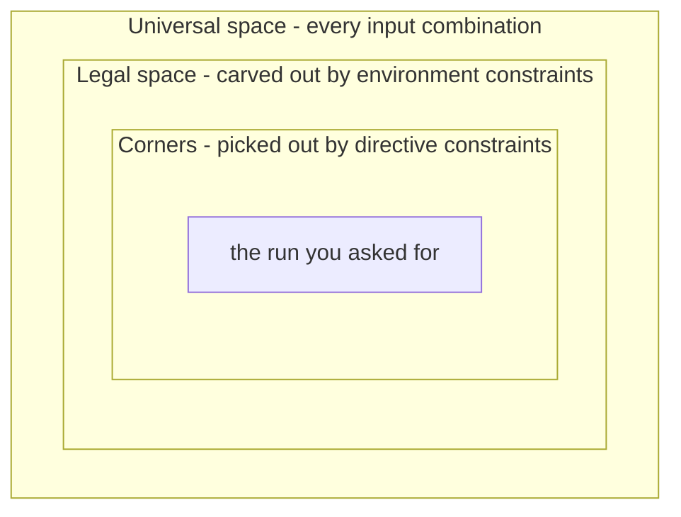

# 9. Stimulus: Directed to Random to Portable

Stimulus generation ranges from directed tests to constrained-random and portable scenarios; the DMA example starts with a testbench that is three weeks old. Its driver and scoreboard support eleven directed tests, all passing. Test 1 programs a 64-byte 1D
copy and compares the two buffers. Test 7 programs a 2D transfer with a positive
row stride. Test 11 programs a destination eight bytes below a 4 KB frontier to check the midend's burst split against the AXI rule. Selecting test 12 exposes the limits of directed enumeration.

Candidates include negative strides, both channels at once, and `NUM_REPS` at its maximum.
Another is a row exactly one maximum burst long, starting exactly one maximum burst below a page frontier on channel 0 while channel 1 drains. Each is plausible and takes half a day to write and debug; the list has several thousand candidates rather than eleven more. Hand-written tests are slow and find only anticipated bugs.

Constrained random replaces test enumeration with *rules*: a model of legal descriptors lets a solver generate descriptors by the million, while coverage measures the results. This introduces failures in which abundant stimulus covers nothing.

### Chapter map

§9.1 covers directed tests for bring-up, spec compliance and regression anchors, including their scaling limit; §9.2 traces the contributions of dedicated verification languages.
§9.3 separates *legality* from *distribution* and examines coverage lost to over-constraining.
§9.4 defines the limits of seed-based reproduction.
§9.5 layers atomic transactions into virtual sequences coordinating several interfaces.
§9.6 covers portable stimulus's capabilities beyond constrained random and its limits.

## 9.1 Directed tests: precision, and its ceiling

A **directed test** is stimulus whose content and order are written out by hand.
Individual testbenches verify individual features, with the stimulus
manually crafted to exercise that feature and the response checked against the
symptoms that would appear if the feature were broken [cit:B2]. Nothing is chosen
at run time; the test does the same thing every time it runs.

Determinism supports three tasks: bring-up, specification compliance and regression anchoring.

**Bring-up.** The first stimulus a new block sees must be small enough to
debug when everything is broken at once. When the DMA engine's first descriptor
fails, debugging must establish whether the fault is in the register decode, the midend,
the backend, the scoreboard or the clock. A twelve-line directed test answers
that in one waveform; a randomized 2D transfer with 47 rows and a negative stride
does not isolate the fault.

<!-- slang: fragment - task dma_bringup_1d shown without its enclosing program; bus_write, bus_read and the register names are the testbench's own helpers -->

```systemverilog
// Directed: the first descriptor the DMA engine ever executes.
task automatic dma_bringup_1d();
  bus_write(SRC_ADDR,  SRAM_BASE);
  bus_write(DST_ADDR,  SRAM_BASE + 32'h8000);
  bus_write(NUM_BYTES, 32'd64);          // 8 beats of 64 bits
  bus_write(CFG,       CFG_EN_1D_CH0);   // enable, 1D, channel 0
  do @(posedge clk); while (!(bus_read(STATUS) & ST_DONE));
  check_memory_equal(SRAM_BASE, SRAM_BASE + 32'h8000, 64);
endtask
```

**Spec compliance.** Some stimulus is enumerated by an external
authority, and randomizing it violates that enumeration. An HBM controller's
initialization and PHY-training sequence is a strictly ordered protocol with
mandated wait states between steps: there is exactly one legal opening move, and
the test that checks that opening sequence is directed. Any published compliance suite likewise requires its specified tests rather than a random sample from a separately defined space.

**Regression anchors.** A short deterministic test that touches one feature and
finishes in seconds serves as a smoke test: it establishes within a minute of a
commit whether the design still boots.

**Where it stops.** The directed approach can be managed to completion when the
total number of test cases is in the low hundreds; a project with over a thousand
identified test cases would need more than a year this way, and beyond that some
form of testbench automation becomes necessary to complete the task within an
acceptable time frame [cit:B2]; this is a schedule claim rather than a feasibility claim. The reference SoC's DMA alone generated several thousand
candidates in the paragraph above.

Directed testing also has two failure modes. The first is **bias**: directed test cases can only find anticipated bugs [cit:B2].
Hand-written stimulus reflects the author's design model, so errors in that model leave gaps: Chapter 2's opening suite omitted negative strides because its author pictured a 2D copy moving forward.

The second is **decay**: a directed test can pass forever after it stops testing its intended feature. Enlarging a FIFO or memory leaves tests of its full operation passing while they exercise only part of it. The defense is a redundant path: a coverage model states what
the test is supposed to accomplish and requires it to fill 100% of those points,
since deterministic stimulus should fill exactly what it targets [cit:B2]. A directed test that drops to 60% of its own goal has become stale.

In 2024, random tests are still described as
covering the vast majority of easy-to-detect scenarios but unable to reach
complex corner cases in reasonable time, with directed tests covering the
remainder [cit:P10]. One methodology recommends a directed test when a scenario is too complex to
describe or too unlikely to happen randomly; a run need not be 100%
directed, since a directed sequence can be injected randomly within a stream of
random ones, which may expose problems a purely directed run would not [cit:B1].

## 9.2 The constrained-random turn

Constrained random addressed bugs that appear only in convoluted scenarios: states across several state machines align only through one particular transaction sequence; beyond writing as many directed tests as possible, random simulation was the only reasonable response [cit:B6].

### From enumeration to description

The declarative model describes *the set of legal runs*. Constraints are formal, unambiguous
specifications of design behavior; in stimulus generation they define what input
combinations can be applied and when. Because they are declarative they
read like the specification rather than like a program, and because they are
executable (stimuli are generated directly from them) they eliminate manual construction of a procedural testbench, raising testbench writing to a higher level
of abstraction much as RTL raised design above gates [cit:B6].

Through the **generator/monitor duality**, the same constraint that *generates* legal traffic on
one block's input can *check* legality on a neighboring block's output, making interface constraints reusable
one level up the hierarchy [cit:B6]. Chapter 11 makes the same object an
assertion; Chapter 14 makes it a formal assumption.

### The dedicated languages, and what survived them

Dedicated hardware verification languages developed this model before general standardization; `e` documents it. As a commercial product, `e` came from Verisity Ltd., and Specman (Verisity's flagship product, most of which, its designers noted, was itself written in `e`) is what put the language on projects [cit:P18]. In it, a data item is a struct whose fields carry declarative
constraints, resolved during the run to generate a random but directed stream of
data for the DUT [cit:P18]. Three ideas from `e` remain in current practice:

- **Tests as constraint layers.** A test
 specification, in its simplest form, adds a few constraints on top of an
 existing environment, extending an already-defined packet type with
 `keep i == j` and `keep kind!= empty` rather than editing the generator.
- **Preference distinct from requirement.** Constraints could be marked soft: a
 hard constraint applied to the same field by another piece of code overrules them, so a general-purpose default could be overridden by a specific
 test without touching it.
- **Weights, possibly reactive.** A select-style constraint weighted the
 generator toward chosen alternatives, and those weights could be
 integer-valued functions of data sampled from the DUT, so generation was influenced
 by the current state of the device [cit:P18].

SystemVerilog absorbed the model into a general-purpose language, and the
semantics are now normative in IEEE Std 1800-2023, *IEEE Standard for SystemVerilog* [cit:S8]. Class variables are declared `rand` or `randc`;
`randomize()` generates values for all the *active* random variables of an
object, subject to the *active* constraints, and returns 1 on success or 0 on
failure; `rand_mode()` and `constraint_mode()` move a variable or a
constraint block out of that set. Inheritance builds layered constraint systems,
so a general-purpose model can be constrained into an application-specific one,
and `randomize() with` adds constraints inline at the call site [cit:S8], standardizing the `e` test-layering pattern. In the 2024 industry data, constrained-random simulation is the one
simulation-based technique whose adoption is still climbing rather than having
stabilized [cit:R2].

### What the trade actually costs

Compared with the directed approach, a coverage-driven random approach trades
longer initial testbench development for more productive feature coverage in the
long run; the source declines to quantify the gain,
because it depends heavily on the team's commitment and on its skill at writing
generators that can be constrained easily from the outside [cit:B2]. These two commitments apply from day one of testbench development.

First, **functional coverage is required**, because only the coverage model measures what actually ran; the generator describes what could happen. Without functional coverage, a random environment merely supplies random stimulus to directed test cases [cit:B2].

Second, **generator architecture** needs deliberate design to exercise the required features; it is better to design a
generator that can be constrained easily from the outside than to alter its code
for each new test [cit:B2]; this decision belongs with the environment architecture of Chapter 8.

## 9.3 Writing good constraints

Constraints have two distinct jobs: defining **legality** and shaping the **distribution** of legal stimulus. Conflating them causes bad stimulus.

### Legality defines acceptable design inputs

Stimulus constraints come in two families: *environment* constraints, which
express the interface protocol and must be obeyed strictly, and *directive*
constraints layered on top, which steer the run toward the scenarios currently targeted. The picture is three nested regions [cit:B6] ({ref: constraint_space_regions}):



{figure: constraint_space_regions} The two families of stimulus constraint drawn as nested regions: environment constraints carve the legal space out of the universal space of every input combination, and directive constraints pick out the corners inside it that give the run you asked for. Which boundary a constraint moves is what decides where it belongs — the outer one is the design's and lives in the generator, the inner one is a test's and lives in a layer above it.

The DMA's 2D descriptor generator labels each constraint by family. The DMA's 64-bit data path and 256-beat maximum burst give 2048 bytes per maximum burst, exactly half a 4 KB page.

<!-- slang: fragment - class dma_2d_descriptor shown as a class body at file scope; SRAM_BASE and the other bounds come from the testbench package -->

```systemverilog
class dma_2d_descriptor;
  rand bit [31:0]   src_addr;
  rand bit [31:0]   dst_addr;
  rand int unsigned num_bytes;     // bytes per row
  rand int          src_stride;    // signed
  rand int          dst_stride;    // signed
  rand bit [15:0]   num_reps;      // rows
  rand bit          channel;
  rand bit [31:0]   dst_row[];     // the rows this descriptor will touch

  // --- legality: the frontend rejects anything else ---
  constraint c_bus_alignment {     // 64-bit data path
    src_addr[2:0]   == 3'b000;
    dst_addr[2:0]   == 3'b000;
    num_bytes[2:0]  == 3'b000;
    src_stride[2:0] == 3'b000;
    dst_stride[2:0] == 3'b000;
  }
  // --- policy, NOT legality: an unmapped address is legal to PROGRAM.
  // Disable this one in the error-response test.
  constraint c_addressable {
    src_addr inside {[SRAM_BASE : SRAM_BASE + SRAM_SIZE - 1]};
    dst_addr inside {[SRAM_BASE : SRAM_BASE + SRAM_SIZE - 1]};
    foreach (dst_row[i])           // a negative stride must not walk the rows
      dst_row[i] inside {[SRAM_BASE : SRAM_BASE + SRAM_SIZE - 1]};
  }
  // --- policy: keep the randomized object small enough to solve fast ---
  constraint c_solver_budget {
    num_bytes  inside {[8 : 2048]};          // <= one 256-beat burst
    num_reps   inside {[1 : 64]};
    src_stride inside {[-8192 : 8192]};
    dst_stride inside {[-8192 : 8192]};
  }
  constraint c_rows {                // definition, not policy
    dst_row.size() == int'(num_reps);
    foreach (dst_row[i]) dst_row[i] == dst_addr + unsigned'(i * dst_stride);
  }
endclass
```

Four details distinguish legality from policy. The `c_addressable` comment distinguishes programming from execution: an address outside the memory map is legal to *program* (the register field accepts it) and what the DMA does with it (a decode error,
reported per channel) is a feature the stimulus must exercise. Restricting stimulus to intended uses, the error Chapter 2 warns against, can be made permanent in a `constraint` block. Second, `c_solver_budget`'s bounds are engineering choices
about solve time, not statements about the DUT; labeling them as policy lets a
later test relax them without anyone wondering whether it has just generated
something illegal. Third, a bit-select expresses alignment much more cheaply to solve than the equally correct `num_bytes % 8 == 0`. Fourth,
`c_addressable` bounds `dst_row[]` and not just the two base addresses, because a
negative stride otherwise takes rows outside the map and wraps their addresses through zero.
Leaving a derived field unbounded allows unintended addresses.

### Uniformity over legal combinations

Random values shall be selected to give a
uniform distribution over legal value *combinations*, every legal combination
equally probable, so that randomization explores the whole design space [cit:S8].
The guarantee concerns the *solution space defined by the constraints*, distinct from the space the coverage model measures. Uniform
distribution over the solution space does not reflect the
intention of covering as many functional scenarios as possible; the distribution
most tools provide is derived from the constraint model and is not aligned
with the coverage model. In one published example, packets constrained only for
internal consistency were measured against a coverage model asking for the
extreme edges of the address range: over a run of a thousand generated instances
most of its objectives were left uncovered, and adding distribution directives
closed the coverage completely [cit:D10]. The constraint model contains no
directive that could steer toward the edges, because it does not encode the importance of the edges.

> **Scenario.** The radar front-end's FFT pipeline takes 16-bit Q1.15 samples.
> **Approach.** Every 16-bit pattern is legal, so bare `rand bit signed [15:0]` is a correct generator. Endpoint bugs include saturation at the most-negative value, whose negation is unrepresentable. Uniform sampling over 65,536 values visits each end with probability 1/65,536.
> ```systemverilog
> constraint c_dynamic_range {
>   iq dist { 16'sh8000        := 3,      // most negative
>             16'sh7fff        := 3,      // most positive
>             16'sh0000        := 2,
>             [16'sh8001 : -1] :/ 46,
>             [1 : 16'sh7ffe]  :/ 46 };
> }
> ```
> **Why.** The legal set is unchanged; only the probability mass moved. Weighting distinguished values against broad ranges makes the corner case frequent without adding illegal values.

### Shaping: `dist`, ordering, and `soft`

Three constructs shape the distribution without causing solver failure.

`dist` assigns weights to values and ranges: absent any other constraints, the
probability that the expression matches an item is proportional to that item's
weight; `:=` applies the weight to each element of a range while `:/` divides one
weight across the whole range; the weights are ratios and need not be normalized
to 100; and nonzero weights do not change the solution space and
therefore cannot cause the solver to fail. Other constraints on the same expression renormalize the remaining choices. Values *absent* from the list or with *total* weight zero are forbidden [cit:S8]. A `dist` whose ranges do not cover everything legal is silently an
over-constraint.

`solve... before` changes probabilities by ordering choices. With `s -> d == 0` over a 1-bit `s` and 32-bit `d`, `s` is true in exactly one of 1 + 2³² legal combinations, so `d == 0` has probability 2/(1 + 2³²), effectively never. Adding
`solve s before d` leaves the legal set identical but makes `d == 0` occur with
probability slightly over 50%. Variable ordering forces selected corner
cases to occur more often and, like `dist`, cannot cause the solver to fail
because it does not change the solution space [cit:S8]. This addresses the pattern in configuration descriptors in which a control bit implies a narrow data case.

`soft` separates preference from requirement. Hard constraints must be satisfied
or the solver fails; a soft constraint is discarded when no solution satisfies it
alongside the active hard ones. Its purpose is layering: the author of a
generic component supplies defaults that a later, more specialized constraint
overrides automatically, where a hard default would force the test to disable it
procedurally or extend the class just to replace it [cit:S8]. In the DMA
generator, "most descriptors are small" belongs in a soft constraint; "addresses
are 8-byte aligned" does not.

### Over-constraining and coverage loss

Over-constraining has two forms; only one produces an explicit failure.

Unsatisfiability is the explicit failure: when the constraints admit no solution, not a
single input is allowed at the current state, that state is therefore a dead-end
and simulation has to be aborted; over-constraints stall the progress of
simulation and lead to vacuous proofs in formal verification, which is why tools provide constraint diagnosis to identify a minimal set of constraints responsible for the conflict [cit:B6]. A failed `randomize()` exposes this within seconds. Checking that return value can be necessary
for this reason [cit:S8]; treating it as mandatory is the practitioner's
rule on top, because an unchecked failure leaves the object holding its previous
values and the run continues, re-sending the last legal descriptor
forever.

The more damaging form remains satisfiable while excluding the feature under test. A lingering constraint can prevent generation of exactly the input sequences that would fill persistently empty coverage points [cit:B2], without failures or warnings; the resulting plateau can be mistaken for remaining difficult cases.

**Worked example: exclusion of the canonical bug.** In week 4 of the DMA campaign, a constraint is added after a failure review. An engineer sees descriptors with rows straddling a 4 KB frontier and concludes they are illegal because no AXI burst may cross a 4 KB page (Arm IHI 0022H.c §A3.4.1 "Address structure") [cit:S18], adding:

```systemverilog
class dma_desc_overconstrained extends dma_2d_descriptor;
  // Week 4: "the AXI spec says no burst may cross a 4 KB page."
  constraint c_no_page_cross {
    foreach (dst_row[i])
      (32'(dst_row[i][11:0]) + num_bytes) <= 32'd4096;
  }
endclass
```

The constraint is *true of the design's output* and *false of its input*. The
4 KB rule governs the bursts the backend may emit (Arm IHI 0022H.c §A3.4.1 states the rule of a burst, which is what makes the constraint wrong of the *input*) [cit:S18]; splitting a request that would
cross a page is the midend legalizer's job, the feature the campaign
exists to verify. Imposing the DUT's obligation on stimulus leaves tests passing because they no longer exercise its faulty behavior.

The canonical coverage model `cg_2d_4kb` (Chapter 5) crosses four axes: stride sign, destination-row relation to the next 4 KB frontier, burst length and other-channel activity, giving 3 × 4 × 3 × 2 = 72 cells. The new constraint makes the `straddle` bin of `cp_boundary_dist`
unreachable, and with it every cell containing it: 3 × 1 × 3 × 2 = 18. Not all eighteen were reachable; deriving the difference supplies the evidence a waiver needs.

The two axes sample at different scopes: `cp_boundary_dist` classifies a
destination *row*, while `cp_len` samples the length of a burst the midend
actually emits, after any split. `c_solver_budget` caps a row at 2048 bytes (256 beats on the 64-bit path, one maximum burst, half a page), so a row reaches
past at most one frontier, and a straddling row splits into exactly two bursts
whose beat counts sum to the row's, at most 256, each of them at least one.
Neither piece can be 256. `straddle` × `max` is therefore empty for every stride
sign and both channel states: **6 of the 18 were unreachable before anyone wrote
the week-4 line**, and what `c_no_page_cross` costs is the other **12**. The
canonical DMA bug (negative stride mis-legalized at the 4 KB boundary, corrupting data only when channel 1 is also active) sits in `neg` × `straddle` ×
other-channel-active, one cell per burst-length bin; the `max` one sits in the
excluded column, so the constraint deletes **both** of the bug's live cells.

Vplan row DMA-F06a needs two caveats. The six exclusions depend on *policy*: without the solver budget, a 4104-byte row at offset 4088 splits into 1 beat and 512, with the 512 splitting again into 256 + 256, making `straddle` × `max` reachable. And the whole argument is
destination-side: `c_no_page_cross`, `c_addressable` and `dst_row[]` all speak
about writes. Chapter 5's *100% means 100% of the cells the model can
legitimately reach* requires this bookkeeping, separating what is impossible from what was merely decided; an unrecorded exclusion can lead a sign-off to quote 72.

The coverage report shows one permanently empty block: a whole axis value missing from every combination it appears in, with no test failures. Mistaken for a difficult corner, the block receives an owner and due date but remains unresolved.

**Diagnosing the coverage gap.** Three checks identify the cause:

1. **Checking the generator.** A functional-coverage gap could also indicate a fault in a random generator or the verification environment [cit:B2]. A whole axis *value* absent from every combination, rather than scattered missing cells, indicates a disabled stimulus dimension (Chapter 6).
2. **Constraint and coverage comparison.** For each axis of `cg_2d_4kb`, identify the generator variable that changes it. For `cp_boundary_dist`, only a pinning constraint exists.
3. **Targeting the missing cell.** Request the relation defining the missing *cell* so a randomization failure can diagnose the constraint conflict.
   <!-- slang: fragment - procedural randomize call with an inline constraint; desc is the descriptor object the surrounding test declares -->
   ```systemverilog
   // aim at neg x straddle: a destination row reaching past the frontier
   if (!desc.randomize() with { dst_stride < 0;
                                (32'(dst_addr[11:0]) + num_bytes) > 32'd4096; })
     $fatal(1, "over-constrained: no descriptor reaches past a 4 KB frontier");
   ```
   The second clause carries the diagnosis. It is satisfiable in `dma_2d_descriptor`: offset 4088 plus a 2048-byte row reaches 6136. It is unsatisfiable in `dma_desc_overconstrained`, because `c_rows` places row 0 at `dst_addr`, where `c_no_page_cross` asserts the requested relation's negation. Targeting only `dst_stride` instead permits an 8-byte row, which fits inside a frame at every legal offset and therefore cannot expose this conflict.

**Distribution shaping.** Removing `c_no_page_cross` restores reachability, and straddling is then not even rare. Uniformity still poorly serves two axes: maximum burst length is one of 256 legal values, while legal negative strides receive no more probability mass than positive ones. Shaping both axes corrects their distributions without changing which descriptors are legal:

```systemverilog
class dma_desc_shaped extends dma_2d_descriptor;
  constraint c_len_extremes {
    num_bytes dist { 2048 := 20, 2040 := 20, [8 : 2032] :/ 60 };
  }
  constraint c_frontier {                    // where row 0 ends, mod 4 KB
    (32'(dst_addr[11:0]) + num_bytes) dist {
        [0    : 4088] :/ 35,                 // ends before the frontier
        4096          :/ 15,                 // ends exactly on it
        [4104 : 6136] :/ 50 };               // reaches past it: must be split
  }
  constraint c_stride_sign {
    dst_stride dist { [-8192 : -8] :/ 55, 0 :/ 5, [8 : 8192] :/ 40 };
  }
  constraint c_order { solve num_bytes before dst_addr; }
endclass
```

`c_frontier` constrains the *expression classified by the coverage model* rather than a raw address. The third range maps onto `straddle`;
the first two land somewhere among the other three bins without choosing which,
since those are classified against a burst's worth of headroom rather than
against the frontier; the expression names row 0, while `cp_boundary_dist`
samples every row. This targets one bin of four, on the first of up to sixty-four rows; it does not target all four. In this example, software rarely uses the signed stride field, so `c_stride_sign` gives legal negative strides more mass than positive ones to increase their occurrence.

`c_len_extremes` and
`c_frontier` both constrain expressions containing `num_bytes`, and `c_order`
orders one of them against `dst_addr`. The constructs are legal: no `randc` variable is involved, and each distributed expression contains a random variable. Weights hold *absent any other constraints*; where
other constraints make some of them unsatisfiable, an implementation is required
only to satisfy the constraints [cit:S8]. The standard leaves interaction between `dist` and solve order undefined, though permitted (IEEE 1800-2023 §18.5.3 and §18.5.9). Thus `solve num_bytes before dst_addr` expresses an intent of "length first, address after" without guaranteeing that mechanism. Coverage reports establish whether two distributions over overlapping expressions achieved their intended effect. With the
three in place and both channels enabled, the negative-stride straddle cells fill within a night's
regression: the scoreboard reports a destination mismatch, and the seed that
produced it is the bug report.

Repeating check 2 exposes one remaining axis. `dma_2d_descriptor` cannot change `cp_other_ch`: other-channel activity relates two streams and cannot be shaped within one descriptor generator. Both reachable cells of the
canonical bug lie on the other-channel-active side, so this generator, however
well shaped, reaches neither. Getting there needs a second descriptor on channel
1 inside the same randomization, which is what Section 9.5 is for.

### Two costs: solving and manual shaping

Although constraints are concise, the
complexity of solving them is multiplied by the hundreds or thousands of
constraints and variables present when verifying a unit- or block-level design,
and fast solving is critical to simulation throughput and therefore to coverage.
Generic constraint solving is NP-hard; SAT is NP-complete, and its solutions are *believed* to have an exponential worst case; SAT performance varies widely across similar-looking instances, and SAT is one approach among several: linear and integer programming, ATPG, binary decision diagrams, Boolean unification and constraint logic programming [cit:B6]. The tool chooses its solving engine; the problem does not prescribe one. In practice, small randomized objects and bit-selects instead of arithmetic reduce cost; a generator suddenly taking 40 seconds per transaction warrants a bug report.

Manual shaping adds overhead, motivating Chapter 6's automation research. Using distribution and ordering directives well demands understanding
both their semantics and the solving process, because distribution constraints
carry order semantics whose misunderstanding yields a distribution different from
the one intended; in a large model the relations between fields are tangled, so a
directive on one field can change the distribution of others; and the engineer
must know the whole coverage model, since not all objectives can be met at once.
Reordering distribution *constraint statements*, rather than items within a `dist` list, suffices to change a working example's distribution [cit:D10]. Hence a review
rule: distribution constraints are read as carefully as legality ones, and
whoever writes one names the bin it aims at.

## 9.4 Seeds and reproducibility

Generated stimulus makes each execution a sample of a test's possibilities. The unit of work becomes a **run**: an execution with a specific
seed and a specific set of source files, producing a specific set of messages and
coverage metrics [cit:B1]. The shorthand "a run is a (test, seed) pair" omits the source identity needed for reproducibility. The same seed against a different RTL revision, a different
testbench commit, or a different simulator build is a different experiment.

Reproduction infrastructure must make it *easy* to identify which versions
of which sources, tools and libraries were used and to reissue the exact command,
especially the seed; since command-line options cannot be source-controlled,
a script should set the detailed options from broad, high-level ones. A testbench reused across simulator and constraint-solver versions may generate different stimulus for the same seed [cit:B1].

**Random stability** keeps seeds useful while the testbench changes. The RNG is
localized to threads and objects, so the values one object or thread produces are
independent of the others; each class instance gets its own RNG, seeded from the
thread that creates it, and each new dynamic thread from its parent (hierarchical seeding), so a whole subsystem can be pinned by manually seeding one
root thread. Stability is
preserved as long as object creation, thread creation and
random-number generation happen in the same order as before, so new objects,
threads and draws should be added *after* existing ones, at the end of a code
block, to keep previously created work reproducible [cit:S8]. Inserting one `$urandom` call at a sequence's start can therefore change an entire regression; appending preserves the earlier sequence.

**Seed count and coverage.** Low input coverage after only a few runs calls for further sampling (in this example, 8 of 10 opcodes after three runs); the same result after many runs (here, twenty-five) calls for reviewing the generator's distribution.
A constraint that drives an
unfilled point toward certainty is more work, and likely the more productive
avenue, especially once hundreds of previous runs have failed to produce the
inputs that point needs [cit:B2]. A test missing points it was *designed* to hit needs repair. Points it was never designed to hit belong in a new one, so the
existing test keeps working and keeps the coverage it earns [cit:B1].

**Run length.** One long run and many short ones produce equal-quality random data if
the source is fully random and the seeds do not repeat a previous sequence, but
their project effect differs: a long run is cumbersome to reproduce when
the error appears near the end, exercises a single device configuration, and can
park the DUT in one corner of the state space where further stimulus adds
nothing, whereas many short runs reproduce faster, sweep more configurations and
traverse the space more quickly [cit:B2]. Many short runs are therefore preferable; Chapter 12 develops their regression economy.

**Debug cost.** Randomness moves effort from writing stimulus to reading
failures, and debug already takes the largest share of effort: in 2024,
verification engineers spend more of their time on debug than on any other
activity [cit:R2]. A directed failure identifies its intent, whereas a random failure supplies a log and seed. Two inexpensive practices help: have every generated
item print a human-readable description of itself, and record the seed in the
failure report so triage begins with a command that reproduces the failure.

## 9.5 Sequences and stimulus layering

Individually constrained transactions cover many cases but cannot express the *relationships* needed to expose further failures. A **scenario** is a sequence of random or directed stimulus of particular interest for the device under test, one that individually constrained-random stimulus is unlikely to produce on its own [cit:B1].
Three stimulus layers add relationships that the layer below cannot express.

**Atomic.** Individually constrained transactions suit cases needing no constraints across a *sequence*, such as a configuration descriptor [cit:B1]; for the DMA, one descriptor.

**Scenario.** Sequences of random transactions with defined relationships, each
aimed at a particular functional corner. The scenario
is described and randomized as an *array* of items solved all at once, letting
the solver relate past, current and future items in one constraint set
[cit:B1]. Randomizing three descriptors in turn cannot express "the third descriptor reuses the second's destination".

> **Scenario.** A USB controller's link power states (*Universal Serial Bus 3.2 Specification*, Revision 1.1, USB 3.0 Promoter Group, June 2022, section 7.5, "Link Training and Status State Machine (LTSSM)") [cit:S21]. **Approach.** The atomic item is a packet; the scenario traverses U0 to U1, an inactivity timeout to U2, and a remote wake back to U0, with transfers scheduled *relative to* those transitions. **Why.** Scheduling a transfer in the cycle of low-power entry requires a relationship between two items and a timer, beyond the constraints on either item.

**Multi-stream (virtual).** The third level addresses one technical limitation: constraints cannot be expressed *across* scenarios in
different streams, because those items are generated in different generators and
are not inside the object any one generator randomizes; expressing cross-stream
relations requires that the descriptors for all streams be randomized as a single
object. Three arrangements are alternatives: synchronize otherwise independent generators; let a single-stream
scenario descriptor forward some of its items to other streams; or use a multi-stream generator that randomizes one descriptor holding a sub-descriptor
per stream. The first is enough when the scenario needs only the initial
synchronization of normally independent streams (it will force an Ethernet MAC collision by starting all transmitters together) and it is not enough when the
scenario needs the *contents* of the individual streams cross-correlated, or
individual transactions within them synchronized [cit:B1].

**Worked example: one object, three streams.** Two canonical bugs require conjunctions that a single-stream generator cannot request. The neural accelerator's weight prefetcher wraps its buffer pointer one
entry early when the weight stream ends mid-beat *under DMA contention*,
reachable only at 2-bit weights with a width-1 tensor. The DMA's 4 KB mis-legalization corrupts data only when channel 1 is also active, the axis Section 9.3 could not reach within one descriptor. Both are relations
between streams, so both go into one randomization:

<!-- slang: fragment - class contention_scenario shown as a class body at file scope; dma_2d_descriptor and nn_job_descriptor are declared earlier in this chapter -->

```systemverilog
class contention_scenario;
  rand dma_2d_descriptor dma_ch0;  // the descriptor under test
  rand dma_2d_descriptor dma_ch1;  // the other channel: what cp_other_ch samples
  rand nn_job_descriptor nn;
  rand int unsigned      skew_beats;

  function new();
    dma_ch0 = new();
    dma_ch1 = new();
    nn      = new();
  endfunction

  constraint c_channels {
    dma_ch0.channel == 1'b0;
    dma_ch1.channel == 1'b1;
  }
  constraint c_contend {                        // one SRAM bank, all three
    nn.wgt_addr[4:3]      == dma_ch0.dst_addr[4:3];
    dma_ch1.dst_addr[4:3] == dma_ch0.dst_addr[4:3];
    // where in channel 0's stream the accelerator's weight fetch lands
    skew_beats inside {[0 : (32'(dma_ch0.num_reps) * dma_ch0.num_bytes) >> 3]};
  }
  constraint c_worst_cell {
    nn.weight_bits     == 2;
    nn.tensor_width    == 1;
    dma_ch0.dst_stride  < 0;
  }
endclass
```

The 512 KB SRAM is word-interleaved across four banks; `addr[4:3]` selects a bank on the 64-bit word grid, so equating those bits makes all three active streams contend. `skew_beats` specifies *where* in the transfer the accelerator's stream ends, since overlap alone does not trigger the bug. It is a beat index into channel 0's own transfer rather than a fixed
cycle count, because a transfer of up to 64 rows runs for thousands of cycles and
a constant range would only stagger the starts.

`c_worst_cell` belongs in the *test* targeting this cell rather than in the environment. `c_channels` completes Section 9.3's open axis: a channel 1 descriptor makes `other_channel_active` true while `cg_2d_4kb` samples channel 0's transfer. Constraints specify relations but do not schedule execution.
Fixed channel numbers and bank bits ensure the three descriptors *would* contend if run together; the launching sequence must make that happen, or the scenario never fills the target cell.

For an Ethernet MAC with TSN queues, the atomic item is a frame and the scenario a traffic profile (a burst class at a stated line occupancy). A multi-stream descriptor correlates a high-priority queue profile with a best-effort flood on another queue *in time*, which is required to provoke a shaper-arbitration corner. Layers must be interruptible: the scenario layer
may be partially or completely bypassed by the test above it, so generators must
be stoppable, at the start or mid-run, to let directed stimulus be injected, and
restartable afterward [cit:B1], supporting Section 9.1's injection mechanism. Expressing all this in a particular methodology is Chapter 10's subject.

## 9.6 Graph-based and portable stimulus

Everything so far assumes a testbench that owns the interfaces. AMD describes the limits of this assumption at SoC level: at IP level the constrained-random testbench is excellent, but the
initialization sequences it contains are not easily portable to firmware or
post-silicon tests, and IP-level tests lack system context; at SoC level the
stimulus is simple directed feature tests, complex scenarios are difficult to
create by hand, and run times are long; post-silicon, tests are OS-based, debug
takes longer, and failures are difficult to bring back to emulation or
simulation [cit:D29].
The deck describes AMD's experience and the flow built in response, rather than survey findings.
The three platforms use three incompatible stimulus formats without reuse.

Transaction-level sequences randomize
transaction *contents*; the transaction *flow* is not itself randomized, and
randomizing *between* sequences is difficult. A constraint class can express one
resource-contention configuration with display-controller streams competing for pipes, overlays and interfaces, but that
captures one specific scenario, not the ability to start and stop streams while
others are in progress or to schedule them arbitrarily; it does not capture the underlying problem, which is tasks contending for limited resources
[cit:D5].

**PSS.** The Portable Test and Stimulus Standard (Accellera Systems Initiative), at version 3.0 in
August 2024, defines a single representation of stimulus and test scenarios,
usable across levels of integration and configurations, from which
implementations can be generated for simulation, emulation, FPGA prototyping and
post-silicon. It is a declarative domain-specific language for modeling
*scenario spaces*, and its constraint and coverage syntax takes SystemVerilog as
its reference [cit:S1].

A model is a set of class definitions plus rules constraining their legal
instantiation. Behavior is an **action**: atomic when it maps directly to a system operation, compound when it encapsulates a flow of actions in an **activity**. Actions consume and produce passive **objects** whose type fixes
the scheduling: a *buffer* is persistent data whose producer must complete before
its consumer starts, a *stream* is transient data requiring producer and consumer
to run in parallel one-to-one, and a *state* object may be read concurrently but
written only exclusively. Actions may also claim **resources** from sized
**pools**: a device with two DMA channels is modeled as a pool of two channel
resources, so no more than two channel-locking actions may execute at any given
time, matching the reference SoC and the standard's own example.
A **scenario** is one particular solution of all those constraints [cit:S1].

What distinguishes PSS from a constraint class is **inference**. Where the
specification of intent is partial, the tool shall infer the additional actions
and model elements needed to make it complete and valid, and shall infer nothing
that is not required, so one partial specification expands into a variety of
scenarios that all satisfy the stated intent while including other behaviors
that broaden coverage (PSS 3.0 §5 and §5.3.2) [cit:S1]. For the intent "do a 2D transfer, then
run an inference job", the tool works out that the transfer needs a free
channel, that the inference job's input buffer needs some action to have produced
it, and that the accelerator must have been configured first.

```
// Sketch: both DMA channels and the accelerator, inside one scenario.
buffer   mem_block_s { }
resource channel_s   { }

component dma_c {
  action transfer_2d {
    lock channel_s ch;                      // holds one channel for its duration
    rand int in [-8192..8192] dst_stride;
    output mem_block_s block;               // a buffer output needs no consumer
  }
}

component nn_c {
  action infer_job {
    rand int in [2,4,8] weight_bits;
  }
}

extend component pss_top {
  dma_c dma;
  nn_c  nn;
  pool [2] channel_s   channels;            // the reference SoC has two
  pool     mem_block_s blocks;
  bind channels *;                          // every object needs a same-type pool
  bind blocks   *;

  action contention {
    activity {
      parallel {                            // synchronized start, no ordering across
        do dma_c::transfer_2d with { dst_stride < 0; };
        do dma_c::transfer_2d;              // the other channel
        do nn_c::infer_job    with { weight_bits == 2; };
      }
    }
  }
}
```

Three rules govern this model. Pool depth constrains generation: two channels
means at most two channel-locking actions may hold one at a time, each with a
distinct instance, and a scenario that would over-subscribe the pool is not
generated at all. Reducing `channels` to one makes this activity illegal: capacity constrains generation rather than imposing a queueing delay. Second, every object reference is bound to a pool of its own
exact type, as required for model legality; a buffer output may have
no consumer, where a stream output may not (PSS 3.0 §5.1.1, §5.1.2). Third, `parallel` guarantees a synchronized start and the
absence of any scheduling dependency across branches; two executions with no
dependency between them may or may not overlap in time (PSS 3.0 §6.3.1, §6.2.3) [cit:S1]. `schedule` allows any legal order, including entirely sequential branches, so a *contention* scenario may produce no contention.

**Retargeting** uses *test realization* to map the abstract model's atomic actions onto target code. The order in
which actions execute must conform to the flow the activities dictate *and* be
correct with respect to the model rules [cit:S1]; this is how inferred actions,
called by no activity at all, get their place in the generated test. The same
`contention` action becomes transaction sequences driving bus VIP in a
block-level simulation and a bare-metal C program running on the core in
emulation or on silicon.

PSS-described
intent was compiled into UEFI and bare-metal tests that ran unchanged on an AMD
APU, first under emulation and then on post-silicon parts, reaching the hardware
through Cadence Perspec and an in-house AMD runtime layer called uDREX whose job
was to abstract the BIOS and provide services to the generated tests; in the lab
the same flow was then used to generate fresh power-management firmware tuning
scenarios [cit:D29]. The account reports retargeting and its application without quantifying speed-up, bug count or effort savings.

**Limits.** A published industrial trial from 2019 recorded six real-world observations [cit:D29]. One of them (that inputs and outputs for activities were not available yet) describes a 2019 toolchain and should be checked against
current offerings. The other five observations concern the approach:

1. Generic actions and activities can be complex to create and may require procedural description beyond the declarative model.
2. PSS tests prefer complete control of the system: a bare-metal environment with
   statically allocated and scheduled tests.
3. That environment needs a bare-metal library, and building one needs
 collaboration across disciplines.
4. Randomization should be carefully thought through, because test *generation*
   time has the potential to increase exponentially. Section 9.3's solver cost
   reappears at scenario scale, before simulation even starts.
5. Constraint solver errors can be terse, and over-constraints are harder to diagnose across an inferred graph than within a class.

Two more come from the standard rather than from that deck. The value
concentrates in scenario composition rather than in checking: for expected-result
computation, memory modeling and allocation policies, external models, software
libraries or algorithmic code in other languages may need to be employed
(PSS 3.0 §1.4) [cit:S1]. The standard permits them; it does not supply them, and specifying
results checking inside the model remains a stated goal rather than a delivered
construct. Test generation leaves the oracle to the verification environment (Chapter 3).
Realization code requires work for each platform, even though the model is portable. PSS reuses intent across platforms and automates multi-engine scenario composition beyond Section 9.5's layering, at the cost of a modeling language, bare-metal runtime and expertise in debugging generators.

### In practice

An example stimulus mix for a settled block combines fixed directed tests (bring-up, one compliance run, three smoke tests) with a constrained-random generator carrying most cycles, a growing set of test-layer constraints targeting named coverage bins, and a short list of scenario classes for conjunctions random stimulus cannot reach. Directed tests run on every commit, random tests nightly across seeds, and targeted tests when coverage reports identify gaps.

After a year, forty accumulated constraint files can obscure which enforce legality and which contain stale targeting rules; each block should therefore declare *legality* or *policy* in a comment. Constraining away a random failure produces Section 9.3's week-4 error, so constraint additions deserve the same review as RTL changes.

### Pitfalls

1. **Constraining the DUT's job into the stimulus.** Symptom: tests pass, a block
   of coverage cells never fills, and the offending constraint reads like a
   quotation from the specification. Cure: ask of every constraint whether it
   restricts the *input* the design must accept or the *output* it must produce;
   only the first belongs in the generator.
2. **"Invalid" used as a stimulus filter.** Symptom: the error-response rows of
   the plan have no owner. Cure: retain the legality constraints the interface enforces, label the rest as policy, and disable policy constraints in the error-test build.
3. **Unchecked `randomize()`.** Symptom: a test passes suspiciously fast and the
   log shows the same transaction repeatedly. Cure: always check the return
   value; treat failure as fatal, not as a warning.
4. **A `dist` that does not cover the legal range.** Symptom: a bin outside the
   listed ranges never fills. Cure: values absent from a distribution list are forbidden, so reserve a range for the remainder.
5. **Shaping raw fields instead of measured quantities.** Symptom: weights added,
   report unmoved. Cure: write the distribution over the same expression the
   coverpoint samples.
6. **Seeds as the answer to every hole.** Symptom: the nightly seed count rises
   and coverage does not. Cure: persistently low coverage after many runs calls for reviewing the distribution and constraints before adding seeds.

### Summary

- Directed tests suit bring-up, mandated compliance sequences and smoke tests; they stop scaling in the low hundreds and find only anticipated bugs.
- Constrained random replaces enumeration with description: constraints are
  executable legality, and the same constraint can generate, monitor and assume.
- The solver guarantees uniformity over the constraint model's *legal combinations*, independently of the coverage model. Legality and distribution are distinct: `dist` and `solve...before` change probabilities without changing the legal set, while `soft` allows defaults to be overridden; the resulting distribution requires measurement.
- Satisfiable over-constraints can silently exclude the feature under test. A persistently empty *block* of cells calls for checking the generator before attributing the gap to a difficult corner.
- A run specifies a seed, source revision and tool version; random stability requires appending new objects, threads and draws after existing ones.
- Layering exists because constraints cannot cross generators: to relate two
  streams, randomize one object containing both.
- Portable stimulus adds scenario-space description and retargeting across simulation, emulation and silicon, at the cost of a modeling language, bare-metal runtime and its own solver behavior.

### Exercises

**Exercise 9.1 (calculation).** Take the implication over a one-bit and a thirty-two-bit random variable that §9.3 uses to introduce `solve ... before`. Derive the size of its legal set and the probability that the wide variable takes the value the implication forces, under the uniformity the solver guarantees. Then derive the same probability once the ordering directive is added, and account for the word `slightly` in the figure §9.3 reports for it.

**Exercise 9.2 (calculation).** Take the row length and the destination offset that §9.3 uses in its first caveat to vplan row DMA-F06a, namely a 4104-byte row at offset 4088. Derive the two pieces the midend split produces and the further split of the larger piece, giving the beat counts on the DMA's data path. State which premise of the six-cell exclusion the example lifts, and state what §9.3 then requires be recorded on the plan row.

**Exercise 9.3 (judgement).** A team adds distribution weights to the descriptor generator's destination-address field to make straddling rows frequent, and the coverage report does not move. Decide why the weights had no effect, naming the expression §9.3 shapes instead and the reason that choice matters. State the two limits §9.3 records for the shaped constraint even where it works as intended.

**Exercise 9.4 (judgement).** An engineer inserts one `$urandom` call at the head of an existing sequence, and the previous night's failures stop reproducing from their recorded seeds. Decide which property of §9.4 the insertion broke, giving the mechanism that makes seeds reusable at all, and state where the call had to go instead. Name the two other kinds of addition the same rule governs, and the scope one manual seeding call can pin.

**Exercise 9.5 (artifact).** Read the merge report below, taken from the DMA campaign of §9.3 after the week-4 constraint went in. State which of the three diagnostic checks of §9.3 the shape of this report already answers, and what it answers. State what check 2 finds for the axis at fault, and state why the response §9.3 records for this report, an owner and a due date, is the wrong one.

```text
cg_2d_4kb, nightly merge, no test failures
  stride-sign axis        all bins hit
  cp_boundary_dist
      straddle            not hit
      remaining bins      hit
  cp_len                  all bins hit
  cp_other_ch             all bins hit
```

**Exercise 9.6 (judgement).** A team reports that the portable-stimulus contention action of §9.6 ran its three branches without overlapping them, and proposes shrinking the channel pool so that two of the branches must share. Decide what the report and the proposal each mean under the rules §9.6 states for that model. Name the construct that would permit an entirely sequential order, and state what §9.6 says pool capacity does to generation.

### Further reading

From the corpus: [cit:B6] on constraints, solvers and over-constraint diagnosis;
[cit:B2] on the directed-versus-coverage-driven trade-off and generator
architecture; [cit:B1] on atomic/scenario/multi-stream layering and seed
discipline; [cit:S8] clause 18 for the normative randomization semantics;
[cit:P18] on the language-design origins of constraint-oriented stimulus;
[cit:D10] on why hand-written distribution directives do not scale; [cit:S1] for
the portable-stimulus model, with [cit:D5] and [cit:D29] for industrial
application and its limits; [cit:P10] for the 2024 state of automated
directed-test generation.

Not in the corpus: the *SystemVerilog for Verification* texts cover randomization
idioms at length, and Accellera publishes a PSS user guide alongside the
standard.
