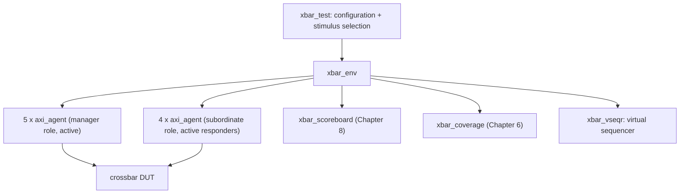

# 10. UVM as a Methodology

Two engineers on the reference SoC spend a month each building a block-level testbench. One verifies the crossbar — five managers, four subordinates, 32-bit address, 64-bit data, ID width 4. The other verifies the DMA engine, whose two channel backends drive two of those five manager ports. Both write a driver that turns transaction objects into AXI4 handshakes. Both write a monitor that turns handshakes back into transactions. Both write something that decides whether a response was legal. Neither can use a line of the other's code. The transaction fields differ, one uses a mailbox where the other uses a queue, one prints `ERROR:` and the other prints `*E`, and the two testbenches end in different ways — one on a beat counter, one on a `$finish` buried inside a task.

Then integration arrives. The DMA engine's channel-1 backend now drives crossbar manager port 3, and somebody must build an environment containing both. It can be done: roughly three weeks of rewriting. The interesting question is why it costs three weeks, when both engineers had already written a working AXI4 driver.

That question — not "how do I call `create`" — is what this chapter is about. UVM is the industry's standardized answer to it (IEEE Std 1800.2-2020, *IEEE Standard for Universal Verification Methodology* [cit:S9]), and every structural decision in the library is an answer to some version of "why did that cost three weeks?".

### Chapter map

- §10.1 states the problem UVM was built to solve, and why the answer had to be a *standard*.
- §10.2 establishes why the taxonomy has the shape it has — agent, environment, test — and what each is allowed to know.
- §10.3 develops the factory and the configuration database, §10.4 phasing, §10.5 sequences and §10.6 the register layer: each buys reuse with indirection, and what that indirection costs in debug.
- §10.7 establishes why severity and message identifiers are load-bearing infrastructure: they decide what counts as a failure, and what regression triage can group by.
- §10.8 carries the block environment up into the system environment, and sets out what breaks in the move — dead stimulus, relocated configuration paths, reassigned objections and expired block-local expectations.
- §10.9 marks where the framework stops: the checking strategy, the coverage model, the debuggability and the runtime are the project's, not UVM's.
- §10.10 treats when a UVM environment is the wrong tool, and what to build instead.

## 10.1 The problem: reuse across projects, teams and companies

Verification has become a project that spans internal and external teams, and the discontinuity created by multiple incompatible methodologies among those teams limits productivity. That sentence is the whole motivation. The purpose of the standardization effort is stated just as plainly: improve interoperability, reduce the cost of repurchasing and rewriting intellectual property for each new project or tool, and make it easier to reuse verification components [cit:S9].

It helps to be precise about which reuse is meant, because there are three, and they get harder in order. *First-order* reuse is one verification environment reused across many testcases of one project. *Second-order* reuse is components of that environment reused in a system-level environment. *Third-order* reuse is those same components reused in a different environment, for a different design [cit:B1]. The opening scenario failed at second order, which is the one most block-level teams silently assume they will get for free.

For any of the three to work, a component must be not merely correct but *configurable* — able to exhibit the behaviour a block-level environment needs and, without modification, the behaviour a system-level environment needs [cit:B1]. Configurability is not a convenience bolted onto a testbench; it is the mechanism that makes reuse possible at all, and most of the UVM library exists to provide it.

The second thing UVM sells is vocabulary. When a colleague says "make the manager agent passive at the top level", the sentence carries a structural consequence both of you can look up in a public document (the Accellera *Universal Verification Methodology (UVM) 1.2 User's Guide*, 2015 [cit:S11]): no driver and no sequencer are instantiated, only the monitor. In-house methodologies have vocabulary too, but it does not survive a new hire, a purchased verification component, or an external partner. The user guide is candid that the architecture it recommends is one viewpoint and not the only possible structure [cit:S11] — what is standardized is the *library and its meanings*, not a mandatory shape.

The standardization story explains the library's occasional inconsistency. UVM was the first verification methodology to be standardized, and the standard's own introduction records the lineage: the Open Verification Methodology, itself a merger of three earlier methodologies; VMM; and transaction-level modelling derived from work done for SystemC. A library with that many lineages will have more than one way to do some things. The current standard is IEEE 1800.2-2020, a revision of the 2017 edition, defining a set of APIs and a base class library on top of IEEE 1800 SystemVerilog — written for implementors of that library, implementors of tools supporting it, and users [cit:S9]. It is a conformance document: it says what the library shall do, never what a good testbench looks like. Confusing the two is the root of most disappointment with UVM, and section 10.9 returns to it.

The adoption picture is one-sided. In the 2024 industry study UVM is the predominant standard for creating IC/ASIC testbenches [cit:R2] and the leading standard for FPGA testbenches, with the VHDL-oriented OSVVM and UVVM gaining traction since tracking began in 2018 and Python-based approaches newly measured [cit:R1]. For an AXI4 interface on a RISC-V SoC the practical consequence is simple: a UVM agent is the artifact your suppliers, your partners and your next hire already know how to consume.

## 10.2 The component taxonomy and why it exists

Chapter 8 argued that the reusable unit of verification is *one interface*: the protocol is the boundary that survives integration, since AXI4 — *AMBA® AXI and ACE Protocol Specification*, Arm IHI 0022H.c, 2021 [cit:S18] — does not change when the crossbar is dropped into the SoC. UVM encodes that argument as a base class plus one flag. `uvm_agent` groups a sequencer, a driver and a monitor for one interface, and `get_is_active()` returns the mode the configuration database set for it, defaulting to active [cit:S9]. Active mode is where the agent emulates a device and drives design signals, and it requires a driver and a sequencer; passive mode disables their creation and leaves the monitor. The rule of thumb: one active agent per device that must be emulated, one passive agent per RTL device that must be watched [cit:S11]. That flag is what makes second-order reuse mechanical rather than a rewrite.

```systemverilog
class axi_agent extends uvm_agent;
  `uvm_component_utils(axi_agent)

  axi_agent_cfg  cfg;
  axi_sequencer  seqr;
  axi_driver     drv;
  axi_monitor    mon;

  function new(string name, uvm_component parent);
    super.new(name, parent);
  endfunction

  virtual function void build_phase(uvm_phase phase);
    super.build_phase(phase);
    mon = axi_monitor::type_id::create("mon", this);
    if (get_is_active() == UVM_ACTIVE) begin
      seqr = axi_sequencer::type_id::create("seqr", this);
      drv  = axi_driver::type_id::create("drv", this);
    end
  endfunction

  virtual function void connect_phase(uvm_phase phase);
    super.connect_phase(phase);
    if (get_is_active() == UVM_ACTIVE)
      drv.seq_item_port.connect(seqr.seq_item_export);
  endfunction
endclass
```

Three things in that fragment are load-bearing. Sub-components are built in `build_phase`, not in the constructor, because a virtual function can be overridden without restriction while a constructor cannot. They are created through `type_id::create` rather than `new`, which is what makes section 10.3's overrides possible. And the driver-to-sequencer link is made in `connect_phase`, after all building is finished [cit:S11].

The environment is the next layer: a hierarchical component that groups interrelated verification components — agents, scoreboards, or other environments. Composition, not new behaviour. Its own configuration fields are structural ones, of the same kind as `is_active`: how many manager agents, how many subordinate agents, whether a bus-level monitor exists [cit:S11]. {ref: xbar_component_hierarchy} applies that layering to the crossbar: what the test owns, what the environment owns, and which components actually reach the design.



{figure: xbar_component_hierarchy} The crossbar testbench as a UVM component hierarchy: the test carries configuration and stimulus selection, and the environment below it composes nine agents — five in the manager role, four responding — with the scoreboard, the coverage collector and the virtual sequencer. Only the agents reach the design; every layer above them is composition rather than new behaviour. Notice that the scoreboard and the coverage collector hang off the environment and not off the test, because structure a test instantiates for itself is structure the next reuse of the environment will not have.

> **Scenario.** You must verify the crossbar: five manager ports (core-I, core-D, the two DMA channels, debug) against four subordinate ports (SRAM, boot ROM, APB bridge, neural accelerator). **Approach.** One `axi_agent` type, instantiated nine times — five configured to initiate, four to respond. **Why.** Nine instances of one class means the same driver and monitor are exercised nine ways in every regression, so a protocol bug in the agent is found by the crossbar's own tests rather than by the DMA team three months later. It also means the ID-routing coverage model of Chapter 6 has exactly one place to sample from.

Above the environment sits the test, whose job is deliberately narrow: instantiate the top-level environment, configure it through factory overrides or the configuration database, and apply stimulus by invoking sequences. The recommended pattern is one base test that instantiates and wires the environment, with every real test extending it to configure differently or select different sequences [cit:S11]. A test that instantiates components of its own has taken structure out of the environment, and that structure will not be there when the environment is reused.

Note what is *not* in this taxonomy. The monitor broadcasts observed transactions on an analysis port and may process them itself or delegate to components connected to that port [cit:S11]. UVM supplies the pipe and takes no position on what hangs off it: the scoreboard on the far end is Chapter 8's subject, the coverage collector on the same port implements the model of Chapter 6, and section 10.9 returns to why that boundary is the important one.

## 10.3 The factory and the configuration database

Everything in section 10.2 has an obvious hole. If the environment hard-codes `axi_driver`, then a test that needs a differently-behaved driver must edit the environment — and the environment is the artifact you were trying to reuse unmodified.

The verification community met this problem before UVM existed. An aspect-oriented verification language of the late 1990s — Verisity's `e` — solved it in the language itself, letting independent groups add features to an existing environment by extending already-compiled types from separate files; its designers noted that the object-oriented alternative, the Abstract Factory pattern, was cumbersome because of the profusion of subclasses it required, and that the underlying difficulty is *influencing what class gets created* [cit:P18]. SystemVerilog has no aspect weaving, so UVM pays the cost those designers declined to pay: it builds the factory, and asks you to route every construction through it.

The mechanism is an override, by type or by instance. Components requested from the factory are resolved at construction time: the factory first searches for an instance override matching the object's full instance name, then for a type-wide override, and failing both creates the requested type — instance overrides take precedence over type overrides [cit:S9]. Anything you swap in must be polymorphically compatible with what it replaces, including the same TLM interface handles [cit:S11]. And because resolution happens when the child is constructed, an override takes effect only if the parent registers it before building its children — which is why environment overrides belong in the test.

```systemverilog
class xbar_stall_test extends xbar_base_test;
  `uvm_component_utils(xbar_stall_test)

  function new(string name, uvm_component parent);
    super.new(name, parent);
  endfunction

  virtual function void build_phase(uvm_phase phase);
    // Replace the driver of manager port 3 only; the other eight agents
    // keep the standard driver. Done before super.build_phase() builds env.
    set_inst_override_by_type("env.mgr_agent[3].drv",
                              axi_driver::get_type(),
                              axi_stall_driver::get_type());
    super.build_phase(phase);
  endfunction
endclass
```

That test provokes the crossbar's canonical bug — write-data interleaving at a subordinate port under back-pressure — without touching one line of the environment, the agent or the driver it extends. A type override instead of an instance override would have made all nine agents stall; the choice between the two is the choice between "this scenario" and "this policy".

> **Scenario.** The USB controller is a dual-role part (USB 3.2 Revision 1.1 [cit:S21]): it must be verified as a device and as a host. **Approach.** One agent, one monitor, one sequence item; two drivers, selected by a type override in two base tests. **Why.** The pin-level protocol and the transaction abstraction are identical in both roles — only the initiative differs. Overriding the driver keeps the monitor, the coverage model and the register model shared between the two campaigns, which is exactly the third-order reuse of section 10.1 happening inside one project. The same trick supplies the flash controller's error-injection hooks: an ECC-corrupting driver overrides the clean one in the data-integrity tests, and nothing downstream knows.

The configuration database is the factory's twin. It lets an integrator configure an environment without knowing its implementation or its hook-up scheme [cit:S11], by setting typed values against hierarchical instance-path patterns:

```systemverilog
uvm_config_db#(virtual axi_if)::set(this, "env.mgr_agent[3].*", "vif", mgr_vif);
uvm_config_db#(int)::set(this, "env", "num_mgr_agents", 5);
// The subordinate agents answer the crossbar's requests under testbench
// control, so by Chapter 8's criterion they are drivers, not observers.
uvm_config_db#(uvm_active_passive_enum)::set(this, "env.sub_agent*", "is_active", UVM_ACTIVE);
```

All three are written from the test, where `this` is the top; a component deeper in the tree sets only relative to itself, which is why paths written here break the day the environment moves down a level — and it is there, at SoC level, that `is_active` becomes `UVM_PASSIVE` for all nine agents (section 10.8).

Two conventional parameters are worth adopting everywhere because tools and colleagues expect them: `checks_enable` and `coverage_enable` on monitors, which let an integrator silence a component's checking or coverage without editing it [cit:S11] — useful the day the same interface is also checked by a bound assertion module (Chapter 11) and every violation is reported twice.

Now the bill. Both mechanisms replace a compile-time reference with a runtime lookup, so both defer their failures to runtime and report them somewhere other than where the mistake was made. A `set` whose path pattern has a typo silently does nothing; the component keeps its default and the failure surfaces a hundred microseconds later as a null virtual interface. An override registered after `super.build_phase` runs is simply ignored. An instance path that was correct before the environment moved one level down is now wrong, and no tool will tell you. This is the honest trade: indirection is what buys reuse, and indirection is what makes UVM harder to debug than the flat testbench it replaced. Treat the standard override- and configuration-audit facilities as first-class debug tools, and give the environment's configuration surface one owner, the way a module's port list has one.

## 10.4 Phasing: why a testbench needs a state machine

Every simulation performs the same overall sequence of steps to reach completion. The argument for formalizing those steps rather than inventing a synchronization scheme per environment is that formalization is what lets different block-level environments be combined into a system-level one, and lets different tests intervene at the right moment without violating the sequence [cit:B1]. Phasing is second-order reuse made executable.

The standard splits phases into two families. The *common* phases are executed together by every component in the testbench, which is what makes them a synchronization mechanism; the *run-time* phases execute on a schedule that runs concurrently with the run phase. Every common phase before the run phase executes at simulation time zero [cit:S9].

Only three of them need to be understood before you can read any UVM testbench:

- `build_phase` is a **top-down** function phase [cit:S9]. Top-down because a parent decides what its children are — how many agents, active or passive — and must therefore run before they exist.
- `connect_phase` is a **bottom-up** function phase [cit:S9]. Bottom-up because wiring can only happen once both endpoints have been constructed, so the deepest, most local connections are made first.
- `run_phase` is a task phase, running in parallel with the run-time schedule from `pre_reset` through `post_shutdown`, and it starts a global timeout counter whose expiry is a fatal error [cit:S9] — the mechanism that turns a hung testbench into a failed test instead of a job that occupies a licence overnight.

Ending the test is a separate problem, and it is solved by objections rather than by a phase. A component or sequence raises a phase objection at the start of an activity that must complete before the phase may stop, and drops it at the end; a task-based phase persists only while an objection is raised, and it ends once every component has dropped its own [cit:S9]. The asymmetry matters: an active manager agent has an agenda — its reads and writes must finish — while a reactive subordinate agent has none, since it merely serves requests as they arrive, and should therefore not object at all [cit:S11].

> **Scenario.** A crossbar test runs traffic from all five manager agents. The four subordinate agents respond. **Approach.** Each manager sequence objects while it runs; the subordinate agents never object; the environment sets a small drain time. **Why.** With no objections at all the run phase would end at time zero. With the subordinate agents objecting, the test would never end, because a reactive responder is never finished. And without the drain time, the last write response is still crossing the crossbar when the final manager objection drops, so the scoreboard never sees it — the "all objections dropped" condition is genuinely temporary. A drain time set once at the environment or test level, or a `phase_ready_to_end` implementation that re-raises while a transaction is in flight, closes that window — and the drain is also what makes vertical reuse survivable: a sub-system developer declares the drain that sub-system needs, and it still applies when that environment becomes one of six inside a larger one [cit:S11].

The recurring phasing mistake is reaching for a sibling's handle inside `build_phase`: it reads a null, because bottom-up wiring has not happened yet, and the code belongs in `connect_phase` [cit:S11].

## 10.5 Sequences and the sequencer-driver handshake

A sequence is an object that contains behaviour for generating stimulus, and it is deliberately *not* part of the component hierarchy — the design decision worth understanding here. Components are structural and persist for the whole simulation; sequences are transient — created, used, and garbage collected when dereferenced — and one may exist for a single transaction or for the whole run. Making stimulus structural would have welded the scenario you want to run into the environment you want to reuse. Sequences compose instead: a parent invokes children, each is bound to a sequencer when it starts, and many may be bound to the same sequencer [cit:S11].

The handshake is a pull. The driver's `seq_item_port` connects to the sequencer's `seq_item_export`; the sequencer produces items, the driver consumes them and optionally returns responses, and the component containing both makes the connection [cit:S11]. Pull, not push, because only the driver knows when the interface is ready for the next item — its ability to synchronize to the bus and ask for stimulus at the right moment is the point of the arrangement.

Because the driver handles one item at a time while several sequences may be running, the sequencer maintains a queue of pending requests and chooses one each time the driver asks. The choice is the arbitration policy; the available modes are FIFO, weighted, random, strict FIFO, strict random, and a user-defined hook. The default is plain FIFO, which grants in arrival order; only the two strict modes grant the highest-priority request first, while the weighted and random modes grant randomly — the weighted one by weight [cit:S4]. If your test depends on a priority being honoured deterministically, choose a strict mode. Two further controls exist for scenarios that need exclusivity: `grab`/`ungrab`, which give one sequence exclusive use of the sequencer — the canonical interrupt-service pattern — and plain prioritization, which is less disruptive [cit:S11].

Coordination *across* interfaces is what virtual sequences are for. A virtual sequencer holds references to its sub-sequencers and executes sequences on them; it has no data item of its own and drives nothing directly. The payoff is that block-level sequence libraries, already written and already debugged, become the vocabulary of system-level scenarios [cit:S11].

```systemverilog
class xbar_w_interleave_vseq extends uvm_sequence;
  `uvm_object_utils(xbar_w_interleave_vseq)
  `uvm_declare_p_sequencer(xbar_vseqr)

  function new(string name = "xbar_w_interleave_vseq");
    super.new(name);
  endfunction

  virtual task body();
    axi_wr_burst_seq wr_a, wr_b;
    axi_backpressure_seq bp;
    wr_a = axi_wr_burst_seq::type_id::create("wr_a");
    wr_b = axi_wr_burst_seq::type_id::create("wr_b");
    bp   = axi_backpressure_seq::type_id::create("bp");
    fork
      wr_a.start(p_sequencer.mgr_seqr[1], this);  // core-D  -> SRAM, AWID 3
      wr_b.start(p_sequencer.mgr_seqr[2], this);  // DMA ch0 -> SRAM, AWID 3 too
      bp.start(p_sequencer.sub_seqr[0], this);    // SRAM port stalls WREADY
    join
  endtask
endclass
```

The second argument is not decoration. Passing `this` is what makes the three streams *children* of the virtual sequence rather than three unrelated root sequences: the parent's `pre_do`, `mid_do` and `post_do` hooks fire during their execution, and each inherits the parent's priority instead of the root default of 100 [cit:S9].

That is the whole reason the crossbar's canonical bug — write-data interleaving at a subordinate port under back-pressure (Arm IHI 0022H.c §A5.2.2 [cit:S18]) — needs a virtual sequence: the scenario is not "a manager does something", it is "two managers and a subordinate do three things at once". No single-interface sequence can state it. Two of those three carry the hazard: concurrent writes to one subordinate, and a stall on its write-data channel. The shared `AWID` carries something else — the crossbar widens IDs on the way out, so the two writes reach the subordinate under *different* IDs, which is exactly the case that breaks a scoreboard keyed on the subordinate side (Chapter 8) and exactly the case the interleaving check does not care about.

What a sequence *contains* — the constraints, the distributions, the layered scenario descriptions — belongs to Chapter 9. Here the point is only structural: UVM gives stimulus a lifetime, a binding and an arbitration policy, and stops there.

## 10.6 The register layer

Registers are where a verification environment stops being about protocol and starts being about the design. The register layer builds a high-level, object-oriented model of the memory-mapped registers and memories, abstracting reads and writes so that environments and tests migrate from block to system level without modification. The model — universally called the RAL, the register abstraction layer — is a hierarchy of blocks mirroring the design hierarchy; blocks contain registers, register files and memories, and registers contain fields [cit:S11]. Two ideas carry the rest.

**Mirrored versus desired.** The model maintains a *mirror* of what it believes each register currently holds. The mirror is not guaranteed correct, because the model's only information is the accesses it has seen: if the design changes a field on its own — setting a status bit, incrementing a counter — the mirror goes stale. After every read it is updated from the observed data; after every write it is predicted from the field's access policy, such as read-only or write-one-to-clear [cit:S11]. The *desired* value is a separate quantity: it equals the mirrored value until `set` changes it in the model alone, in zero time, and `update` then pushes it to the design, issuing bus cycles only for the registers that need updating [cit:S9] — so configuring a 40-register block costs the writes that matter rather than forty.

The most important sentence in the whole register layer is this one: a mirror is not a scoreboard — it can predict the content of registers the design does not update, but it cannot determine whether an updated value is correct [cit:S11]. Teams that forget it end up with a register model that agrees with the design about a value both of them got wrong.

**Front door and back door.** A front-door access drives real bus cycles through the real path; a back-door access reaches the simulation constructs directly through a hierarchical path in the design. Back-door read and write *mimic* the front-door side effects — a back-door read sets clear-on-read bits to zero exactly as a physical read would, and a back-door write leaves read-only bits alone — whereas `peek` samples the register without modifying it and `poke` deposits a value as is, bypassing the behaviour entirely [cit:S9]. The redundancy is the point: when both directions share one path, a bug introduced on the way in is undone on the way out, so a reversed data bus is invisible to any write-then-read check that never leaves the front door. The cost is that identifying and maintaining those hierarchical paths is the main difficulty of back-door access [cit:S11] — and they break every time the design hierarchy is refactored.

> **Worked example: the peripherals' status register.** The UART's receive-overrun flag is a one-bit, write-one-to-clear, volatile field: hardware sets it, software clears it by writing a one. Modelled honestly, it looks like this.
>
> ```systemverilog
> class uart_status_reg extends uvm_reg;
>   rand uvm_reg_field oe;   // RX overrun error
>
>   function new(string name = "uart_status_reg");
>     super.new(name, 32, 0);
>   endfunction
>
>   virtual function void build();
>     oe = uvm_reg_field::type_id::create("oe");
>     //          parent size lsb access volatile reset has_rst rand indiv
>     oe.configure(this,  1,   3,  "W1C",   1,      1'b0,  1,     0,   0);
>   endfunction
> endclass
> ```
>
> `build()` here is the generator's convention, not a UVM phase: the enclosing block calls it after creating the register, then calls the register's own `configure` to attach it to an address map, left out here to keep the fragment on the field.
>
> Two of those arguments carry the real weight, and both are the ones people get wrong. `volatile` set to one declares that the mirrored value cannot be trusted, because the field can change in a way the model has no way to observe; the definition is borrowed from the IP packaging standard (IEEE Std 1685-2022, *IEEE Standard for IP-XACT*), where a volatile element gives no guarantee about what a read returns after a write or on the second of two consecutive reads [cit:S9,S7]. The access policy `"W1C"` means a written one clears the matching bit and a read has no effect. The first is a statement about the mirror: comparing a volatile field against the mirror without a fresh read is not a check, because nothing entitles the model to believe the value it last saw. The second is a statement about prediction: if the real design *also* clears on read, you have modelled the wrong register, the mirror diverges on every read, and the model rather than the design gets blamed. The `rand` qualifier on the declaration is the generator's habit, not a claim: `is_rand` is passed as zero, and for a predefined access policy outside the writable set — `"W1C"` is outside it — the library ignores `is_rand` and turns the field's randomization off in any case [cit:S4]. The two say the same thing, which is the part worth noticing: the passed argument records the intent, the access policy enforces it whatever the argument said, and a reader who flipped only the argument would not have re-enabled anything.
>
> The canonical UART bug shows what the pair buys. That bug — the overrun flag is never cleared if software reads the status register in the same cycle as a stop-bit error — is a disagreement between the two access paths: a front-door read followed by the clearing write leaves the model believing the flag is down, while a back-door `peek` shows it still up. Written as "read front door, peek back door, compare", it becomes a two-line register test instead of a firmware lockup.

**Where the model comes from.** Given the number of registers in a real design and the number of details in configuring these classes, the specialization is normally done by a model generator working from a specification, which yields an up-to-date, correct-by-construction model — and generators are explicitly outside the library's scope [cit:S11]. That gap is filled by machine-readable register description. A register description language (the Accellera *SystemRDL 2.0 Register Description Language*, 2018) provides a single source from which every view is generated, from specification through model generation and verification to maintenance and documentation; its stated motivation is the failure mode every team recognizes, the same information replicated in many places by many people with change propagation that is tedious and error-prone. Crucially it carries field behaviour directly — clear-on-read and write-one-to-clear are language properties, not comments [cit:S2] — which is what makes the `configure` call above correct by construction rather than by transcription. The IP packaging standard plays the complementary role: an XML schema for IP meta-data used in development, implementation and verification, in which each target interface carries a memory map of address blocks, registers and register files [cit:S7].

> **Scenario.** The Ethernet MAC's time-sensitive networking queues expose several hundred per-queue gate-control and shaper registers, and the specification is still moving. **Approach.** Nobody writes that model by hand. One description generates the design's decode logic, the driver's C header and the register model; a field width changes in all three at once. **Why.** The failure this prevents is not a typo — it is the *silent* version skew where model, firmware header and design each encode a different revision of the map, and the mismatch is debugged three times by three teams.

Once the model exists, a library of predefined register test sequences comes free: a hardware-reset check, bit-bashing, access tests that play front door against back door, memory walking-ones, and a check of the declared hierarchical paths [cit:S9]. Start with the hardware-reset test — it debugs the model, the environment, the transactors and the design at once, at the lowest cost [cit:S11].

Finally, choose a prediction mode deliberately. *Implicit* prediction attaches the model to a bus sequencer and updates the mirror after each operation the model itself performed — simple, and blind to any access it did not originate. *Explicit* prediction adds a predictor per interface, fed by the bus monitor, which looks up the register at every observed address and updates its mirror — more complex, but it captures all register activity, including accesses the model did not originate [cit:S9]. *Passive* integration connects the monitor only: the model tracks and checks but cannot drive [cit:S11]. On the reference SoC the choice is forced: once firmware running on the core writes the peripherals through the crossbar and the APB bridge, an implicitly-predicted model is wrong within microseconds, because those writes never went through it.

## 10.7 Reporting as infrastructure

Messaging looks like the least interesting part of the library and carries the clearest reuse argument. The reporting classes issue reports with consistent formatting, let you configure the action taken and the file written based on severity, on message ID, or on the pair, and filter by verbosity; reports travel from the component through a report handler to a central report server. The default actions encode a policy: informational and warning messages are displayed, an error is displayed and *counted*, a fatal message is displayed and exits [cit:S9].

The counting is why this is infrastructure and not a printing convenience: a component can fail a test without knowing how pass and fail are decided — which is what lets messages from components reused from different sources be displayed and controlled consistently without modifying the reused component itself [cit:B1]. Drop the crossbar agent into the SoC environment beside a purchased memory-controller component, and one verbosity setting quiets both while one error from either fails the run.

The practical discipline is to treat message IDs as a schema, not as decoration. The regression triage of Chapter 12 groups failures by ID; an agent that reports every protocol violation under the ID `AXI4` has given the triage script exactly one bucket, while one that reports `AXI4_WSTRB`, `AXI4_ORDER` and `AXI4_4KB` has given it a first-pass classifier for free.

## 10.8 Reuse in practice: the same agent, one level up

Second-order reuse is the promise; here is the invoice. The crossbar environment of section 10.2 is now instantiated inside the SoC environment, with the real core, the real DMA engine and the real debug module (RISC-V Debug Specification v1.0 [cit:S16]) driving the manager ports and the real memories answering. Every one of the nine agents must therefore stop driving and only observe — the passive mode of section 10.2 [cit:S11]. That is one configuration field, and it works.

What breaks is everything that quietly assumed *we* were the one driving.

- **Stimulus becomes dead code.** The manager sequences have nothing to drive. Any checking that lived in the driver disappears with it — which is why checking belongs downstream of the monitor.
- **Configuration paths move.** `env.mgr_agent[3].*` is now `soc_env.xbar_env.mgr_agent[3].*`. Every absolute path written from the old top-level test is wrong, and silently so. The cure is a rule: a component sets configuration only relative to itself.
- **Objections change owner.** The manager agents no longer object, so a SoC test that inherited its end-of-test from them ends at time zero; and the drain time that suited one crossbar is short when a response crosses two more layers — which is why the drain is declared per sub-system [cit:S11].
- **The virtual sequencer holds null handles.** `xbar_vseqr` points at sequencers a passive agent never built, so it must be guarded or not built at all.
- **Block-local expectations expire.** The scoreboard assumed every transaction on a manager port was one the environment generated. Now they come from firmware, and the predictor needs a different source of truth (Chapter 8). The register model has the same problem and the same fix: explicit prediction.

The agent survived because it was built around an interface, and the interface did not change. What did not survive is the code that assumed a *role*. A configurable component meets the needs of both a block-level and a system-level environment without modification [cit:B1]; every item above is a place where a team thought it had written one and had written the block-level half.

## 10.9 What UVM does not solve

UVM is a set of APIs defining a base class library for building modular, scalable and reusable verification components [cit:S9]. Read that as a boundary, not as modesty. Four things sit outside it, and all four decide whether your project succeeds.

**The checking strategy.** The monitor broadcasts; what listens and what it concludes is not the library's business — it observes only that different methodologies exist for the scoreboard and its reference model [cit:S11]. Nothing in UVM would have told you that write-data ordering under back-pressure was the property that mattered on the crossbar; that came from the protocol specification and a plan. The plan is a specification of both the verification process and the testbench infrastructure needed to support it [cit:B2] — the framework supplies the second half, and the second half is the easier one.

**The quality of the coverage model.** UVM decides where a coverage collector plugs in, not what it counts. A model with the wrong axes reaches 100% and means nothing (Chapter 6); the neural accelerator's canonical prefetcher bug escaped 100% code coverage entirely, and no methodology could have changed that.

**Debuggability.** Section 10.3's bill comes due here: indirection turns what would have been compile-time errors into runtime silence. A hand-written testbench of a thousand lines is easier to debug than a UVM environment of a thousand lines; it is the ten-thousand-line case where the comparison reverses.

**Performance.** Per-item object allocation, dynamic dispatch and a report server on the message path are not free. The cost is invisible on a block-level run of ten thousand cycles and highly visible in a nightly regression (Chapter 12) or at the boundary with emulation, where transactor code must be synthesizable and a UVM component is not (Chapter 17).

The honest summary: UVM removes most of the *accidental* cost of building a testbench and none of the *essential* difficulty, which is deciding what to check and proving you checked it.

## 10.10 When not to use UVM

The library has a fixed cost — a sequence item, an agent, a configuration object, factory registration, a phasing discipline — that is paid before the first transaction moves. Three situations do not repay it.

**Small blocks with one narrow interface.** A timer on the APB subsystem, a two-flop synchronizer, a small FIFO: one interface, no second consumer, forty lines of directed stimulus. A module-based testbench with bound assertions (Chapter 11) and one covergroup is finished before the UVM version elaborates, and easier to read a year later.

**Formal-first blocks.** Arbiters, round-robin schedulers, handshake converters, and the crossbar's own ordering rules. When the block's specification *is* a set of properties and the state space is small enough to close (Chapter 14), a constrained-random generator is a strictly worse instrument than a proof: it samples where the proof concludes. Build the environment for what formal cannot reach — long traffic mixes, integration, firmware-driven scenarios — and let the proof own the protocol rules.

**Prototype and bring-up testbenches.** During bring-up the deliverable is a waveform tomorrow, not an asset for the next project. A throwaway testbench is not technical debt if you delete it; it becomes debt the day someone keeps it.

There is also a language question: VHDL-centred and Python-centred flows have their own methodologies, both gaining ground in the 2024 FPGA study [cit:R1], and the methodology should follow the language the team actually verifies in.

The rule fits in one line: build a UVM environment when the interface will be verified more than once — a second test, a second level of hierarchy, or a second project. If none of the three is true, you are buying insurance against a risk you do not carry.

### In practice

Real teams rarely write an agent for a standard protocol from scratch; they consume a verification component and spend their effort on configuration, sequences, the scoreboard and the coverage model — the parts nobody can sell them. Almost every group also grows a house layer between the library and its environments: a base test that reads command-line arguments, a standard configuration object, a logging convention. That layer is where local judgment lives, and it is the first thing to review on a new project, because it silently constrains everything built on top.

Register models are generated in continuous integration from the same description that produces the design's decode logic and the firmware header, on every commit — a model regenerated weekly is a model that is wrong for six days. And most reported "UVM bugs" are configuration-path bugs: a `set` that never matched, or an override registered too late.

### Pitfalls

1. **Sub-components built in the constructor.** Symptom: a factory override has no effect. Cure: build in `build_phase`, construct with `type_id::create`.
2. **Absolute configuration paths written from the top-level test.** Symptom: the environment works standalone and silently misconfigures after integration. Cure: every component sets configuration relative to itself.
3. **Sequence priorities with the default arbitration mode.** Symptom: the interrupt sequence waits behind mainline traffic. Cure: select a strict arbitration mode — the two strict modes are the only ones that grant the highest-priority request first [cit:S4].
4. **Checking implemented inside the driver.** Symptom: all protocol checking disappears when the agent is made passive. Cure: check downstream of the monitor's analysis port.
5. **Implicit register prediction in an environment where firmware also writes registers.** Symptom: the mirror diverges quietly and the model is blamed for design bugs it did not see. Cure: explicit prediction with a predictor per bus interface [cit:S11].
6. **Drain time increased until the test passes.** Symptom: a green regression that hides a scoreboard which stopped draining. Cure: re-raise the objection while a transaction is genuinely in flight [cit:S11].

### Summary

- UVM exists to make verification components reusable across testcases, across levels of hierarchy and across companies; its stated purpose is interoperability and the removal of the cost of rewriting verification IP for every new project [cit:S9].
- The agent is the reusable unit because an *interface* is the stable boundary; the active/passive switch is what makes block-to-system reuse mechanical [cit:S11].
- The factory and the configuration database buy reuse with indirection, and indirection is paid for in debug time — that trade is the chapter's central economic fact.
- Phasing is a synchronization contract that lets independently developed environments combine; objections, not phases, decide when a test ends [cit:B1,S11].
- Sequences are deliberately outside the component hierarchy, so stimulus is not welded to structure; virtual sequences are how multi-interface scenarios get expressed [cit:S11].
- A register mirror is not a scoreboard, and the model should be generated from a machine-readable register description (Accellera SystemRDL 2.0) rather than transcribed [cit:S11,S2].
- The framework does not choose your checks, your coverage model, or your risk priorities. It is not a verification plan.

### Further reading

**From the corpus.** The standard [cit:S9] is the authority on phases, factory semantics, reporting and the register classes, and its introduction is the clearest short account of where UVM came from. The user guide [cit:S11] is the readable companion and the source of the recommended structure; the class reference [cit:S4] pins down access policies and arbitration modes. For the reasoning *behind* the structure, the methodology ancestor [cit:B1] remains the best text on the orders of reuse and on why messaging and simulation-step formalization are reuse mechanisms; the testbench-writing companion [cit:B2] frames the verification plan as the specification the framework serves. The lineage of extension-as-configuration is in the Verisity e-language paper [cit:P18]. For register generation, read the register description language [cit:S2] and the IP packaging standard [cit:S7] together — the first for behaviour, the second for the address map. Adoption data is in the 2024 trend reports [cit:R1,R2].

**Not in the corpus.** The community-maintained *UVM Cookbook* remains the most practical source of worked patterns, and the open-source design-verification style guides published by RISC-V hardware projects are a useful counterweight to vendor material.
