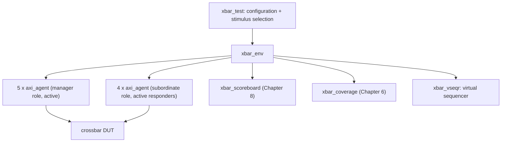

# 10. UVM as a Methodology

UVM addresses testbench reuse and integration; in the reference SoC example, two engineers each spend a month building a block-level testbench. One verifies the crossbar with five managers, four subordinates, 32-bit address, 64-bit data and ID width 4. The other verifies the DMA engine, whose two DMA channel backends drive two of those five manager ports. A DMA channel is an independent transfer engine inside the DMA, with a state of its own and a share of the AXI backend, the logic that issues the engine's transfers as traffic on the bus. The AXI channels belong to the bus protocol, and a DMA channel is not one of them. Both engineers write AXI4 drivers that convert transaction objects to handshakes, monitors that reverse the conversion, and checks of response legality. Their code is incompatible: transaction fields differ, one uses a mailbox and the other a queue, and messages use `ERROR:` versus `*E`. A mailbox is SystemVerilog's own construct for passing objects between concurrent processes. The two testbenches also end differently: one on a `$finish` buried inside a task, one on a counter of beats, the single data transfers that make up a burst.

Integration requires an environment containing both, with the DMA engine's channel-1 backend driving crossbar manager port 3. In this example, integration takes roughly three weeks of rewriting despite both engineers having working AXI4 drivers.

UVM standardizes support for this reuse (IEEE Std 1800.2-2020, *IEEE Standard for Universal Verification Methodology* [cit:S9]); the following sections relate the library’s structural decisions to integration effort.

### Chapter map

§10.1 explains why reuse requires a standard.
§10.2 defines the agent, environment and test, their roles and the limits of what each knows.
§10.3 covers the factory and configuration database, §10.4 phasing, §10.5 sequences and §10.6 the register layer, including how indirection supports reuse and increases debugging cost.
§10.7 covers severity and message identifiers as failure criteria and keys for regression triage.
§10.8 follows block-to-system reuse through dead stimulus, relocated configuration paths, reassigned objections and expired block-local expectations.
§10.9 assigns checking strategy, coverage, debuggability and runtime to the project.
§10.10 covers alternatives when UVM is unsuitable.

## 10.1 The problem: reuse across projects, teams and companies

Verification has become a project that spans internal and external teams, and the discontinuity created by multiple incompatible methodologies among those teams limits productivity. The purpose of standardization is to improve interoperability, reduce the cost of repurchasing and rewriting intellectual property for each new project or tool, and make it easier to reuse verification components [cit:S9]. A verification component is a reusable testbench-side model of one interface, with a driver to stimulate it and a monitor to observe it.

The three orders of reuse become progressively harder. *First-order* reuse is one verification environment reused across many testcases of one project. *Second-order* reuse is components of that environment reused in a system-level environment. *Third-order* reuse is those same components reused in a different environment, for a different design [cit:B1]. The opening example fails at second-order reuse; block-level teams should budget for that integration.

For any of the three to work, a component must be correct and *configurable*: able to exhibit the behavior a block-level environment needs and, without modification, the behavior a system-level environment needs [cit:B1]. Configurability makes reuse possible, and most of the UVM library provides it.

UVM also provides a public vocabulary. Making a manager agent passive at the top level instantiates only its monitor, with no driver or sequencer, as specified in the Accellera *Universal Verification Methodology (UVM) 1.2 User's Guide*, 2015 [cit:S11]. Section 10.2 defines the agent and its passive mode, together with the monitor, the driver and the sequencer named here. In-house vocabulary requires explanation to a new hire or external partner and reconciliation with a purchased verification component. The user guide presents its recommended architecture as one viewpoint among possible structures [cit:S11]; the standard defines the *library and its meanings* without mandating that structure.

The library's occasional inconsistency reflects its standardization history. UVM was the first verification methodology to become an IEEE standard, and the standard's introduction traces its lineage to the Open Verification Methodology (a merger of three earlier methodologies), VMM, and transaction-level modeling derived from SystemC work. The library provides more than one mechanism for configuration: factory overrides select types, while the configuration database supplies values. Chapter 6 introduced the SystemVerilog language standard the library sits on, the one document that holds the design constructs, the testbench classes and the assertions together. The current UVM standard, IEEE 1800.2-2020, revises the 2017 edition, defining APIs and a base class library atop IEEE 1800 SystemVerilog for library implementers, implementers of supporting tools and users [cit:S9]. As a conformance document, it specifies required library behavior without prescribing a good testbench. Confusing conformance with testbench quality creates expectations UVM cannot meet; section 10.9 develops the distinction.

In the 2024 industry study UVM is the predominant standard for creating IC/ASIC testbenches [cit:R2] and the leading standard for FPGA testbenches, with the VHDL-oriented OSVVM and UVVM gaining traction since tracking began in 2018 and Python-based approaches newly measured [cit:R1]. For an AXI4 interface on a RISC-V SoC, a UVM agent provides suppliers, partners and new hires with a standardized artifact to integrate.

## 10.2 The component taxonomy and why it exists

Chapter 8 argued that the reusable unit of verification is *one interface*: the protocol is the boundary that survives integration, since AXI4 (*AMBA® AXI and ACE Protocol Specification*, Arm IHI 0022H.c, 2021 [cit:S18]) does not change when the crossbar is dropped into the SoC. UVM implements this boundary with a base class and one mode flag. `uvm_agent` groups a sequencer, a driver and a monitor for one interface, and `get_is_active()` returns the mode the configuration database set for it, defaulting to active [cit:S9]. Active mode is where the agent emulates a device and drives design signals, and it requires a driver and a sequencer; passive mode disables their creation and leaves the monitor. The rule of thumb: one active agent per device that must be emulated, one passive agent per RTL device that must be watched [cit:S11]. This flag enables second-order reuse without rewriting the agent.

<!-- slang: fragment - UVM component axi_agent; the UVM library is not on the lint path, so uvm_component_utils is an unknown macro here -->

```systemverilog
class axi_agent extends uvm_agent;
  `uvm_component_utils(axi_agent)

  axi_agent_cfg  cfg;
  axi_sequencer  seqr;
  axi_driver     drv;
  axi_monitor    mon;

  function new(string name, uvm_component parent);
    super.new(name, parent);
  endfunction

  virtual function void build_phase(uvm_phase phase);
    super.build_phase(phase);
    mon = axi_monitor::type_id::create("mon", this);
    if (get_is_active() == UVM_ACTIVE) begin
      seqr = axi_sequencer::type_id::create("seqr", this);
      drv  = axi_driver::type_id::create("drv", this);
    end
  endfunction

  virtual function void connect_phase(uvm_phase phase);
    super.connect_phase(phase);
    if (get_is_active() == UVM_ACTIVE)
      drv.seq_item_port.connect(seqr.seq_item_export);
  endfunction
endclass
```

Sub-components are built in `build_phase`, not in the constructor, because a virtual function can be overridden without restriction while a constructor cannot. They are created through `type_id::create` rather than `new`, which is what makes section 10.3's overrides possible. And the driver-to-sequencer link is made in `connect_phase`, after all building is finished [cit:S11].

The environment composes interrelated agents, scoreboards or other environments into a hierarchical component without adding new behavior. A scoreboard is the structure holding what the design is expected to produce, consulted when an output is observed (Chapter 8). The environment's own configuration fields are structural ones, of the same kind as `is_active`: how many manager agents, how many subordinate agents, whether a bus-level monitor exists [cit:S11]. {ref: xbar_component_hierarchy} applies that layering to the crossbar: what the test owns, what the environment owns, and which components actually reach the design.



{figure: xbar_component_hierarchy} The crossbar testbench as a UVM component hierarchy: the test carries configuration and stimulus selection, and the environment below it composes nine agents, five in the manager role and four responding, with the scoreboard, the coverage collector and the virtual sequencer. Only the agents reach the design; every layer above them is composition rather than new behaviour. Notice that the scoreboard and the coverage collector hang off the environment and not off the test, because whatever a test instantiates for itself is absent the next time the environment is reused.

> **Scenario.** The crossbar connects five manager ports (core-I, core-D, the two DMA channels, debug) to four subordinate ports (SRAM, boot ROM, APB bridge, neural accelerator). **Approach.** One `axi_agent` type is instantiated nine times: five initiators and four responders, the agents that answer requests initiated by the design. **Why.** Nine instances of one class exercise the same driver and monitor nine ways per regression; in this example, the crossbar's own tests find an agent protocol bug rather than leaving it for the DMA team to find three months later. It also means the ID-routing coverage model of Chapter 6 has exactly one place to sample from.

Above the environment sits the test, whose job is narrow: instantiate the top-level environment, configure it through factory overrides or the configuration database, and apply stimulus by invoking sequences. The recommended pattern is one base test that instantiates and wires the environment, with every real test extending it to configure differently or select different sequences [cit:S11]. A test that instantiates components of its own has taken structure out of the environment, and that structure will not be there when the environment is reused.

The monitor broadcasts observed transactions on an analysis port and may process them itself or delegate to components connected to that port [cit:S11]. An analysis port is a broadcast to any number of subscribers, none of which may block the monitor or change what it receives. UVM leaves consumers of the analysis port to the project: the scoreboard is Chapter 8's subject, and the coverage collector implements Chapter 6's model; section 10.9 develops this boundary.

## 10.3 The factory and the configuration database

The structure in section 10.2 requires replaceable component types. If an environment hard-codes `axi_driver`, a test needing different driver behavior must edit the environment, preventing unmodified reuse.

Before UVM, an aspect-oriented verification language of the late 1990s solved this problem in the language itself: Verisity's `e` let independent groups add features to an existing environment by extending already-compiled types from separate files; its designers noted both that the object-oriented alternative, the Abstract Factory pattern, was cumbersome, because of the profusion of subclasses it required, and that the underlying difficulty is *influencing what class gets created* [cit:P18]. SystemVerilog lacks aspect weaving, so UVM implements that factory and asks developers to route every construction through it.

The mechanism is an override, by type or by instance. Components requested from the factory are resolved at construction time: the factory first searches for an instance override matching the object's full instance name, then for a type-wide override, and failing both creates the requested type; instance overrides take precedence over type overrides [cit:S9]. A replacement must be polymorphically compatible, including having the same TLM interface handles [cit:S11]. TLM is the transaction-level modeling named above: components pass whole transactions over standard interface handles rather than signals. Because resolution happens when the child is constructed, an override takes effect only if the parent registers it before building its children, which is why environment overrides belong in the test.

<!-- slang: fragment - UVM test xbar_stall_test; the UVM library is not on the lint path, so its registration macro is unknown here -->

```systemverilog
class xbar_stall_test extends xbar_base_test;
  `uvm_component_utils(xbar_stall_test)

  function new(string name, uvm_component parent);
    super.new(name, parent);
  endfunction

  virtual function void build_phase(uvm_phase phase);
    // Replace the driver of manager port 3 only; the other eight agents
    // keep the standard driver. Done before super.build_phase() builds env.
    set_inst_override_by_type("env.mgr_agent[3].drv",
                              axi_driver::get_type(),
                              axi_stall_driver::get_type());
    super.build_phase(phase);
  endfunction
endclass
```

That test provokes the crossbar's canonical bug, the write-data interleaving at a subordinate port under back-pressure, without touching one line of the environment, the agent or the driver it extends. A canonical bug is the book's recurring defect for one block, returned to whenever that block is the example. A type override would instead make all nine agents stall, applying a general policy rather than targeting the instance in this scenario.

> **Scenario.** The USB controller is a dual-role part (USB 3.2 Revision 1.1 [cit:S21]): it must be verified as a device and as a host. **Approach.** One agent, one monitor, one sequence item; two drivers, selected by a type override in two base tests. **Why.** Both roles share the pin-level protocol and transaction abstraction; only the initiative differs. The override shares the monitor, coverage model and register model between the two campaigns, implementing section 10.1’s third-order reuse within one project. For the flash controller's error-injection hooks, an ECC-corrupting driver overrides the clean driver in data-integrity tests without downstream changes.

The configuration database lets an integrator configure an environment without knowing its implementation or hook-up scheme [cit:S11], using typed values set against hierarchical instance-path patterns:

<!-- slang: fragment - three uvm_config_db set calls shown as statements; they belong in the build phase of a test, and the UVM library is not on the lint path -->

```systemverilog
uvm_config_db#(virtual axi_if)::set(this, "env.mgr_agent[3].*", "vif", mgr_vif);
uvm_config_db#(int)::set(this, "env", "num_mgr_agents", 5);
// The subordinate agents answer the crossbar's requests under testbench
// control, so by Chapter 8's criterion they are drivers, not observers.
uvm_config_db#(uvm_active_passive_enum)::set(this, "env.sub_agent*", "is_active", UVM_ACTIVE);
```

All three are written from the test, where `this` is the top; a component deeper in the tree sets only relative to itself, which is why paths written here break when the environment moves down a level, at SoC level, where `is_active` becomes `UVM_PASSIVE` for all nine agents (section 10.8).

Two conventional monitor parameters, `checks_enable` and `coverage_enable`, should be adopted throughout testbenches because tools and colleagues expect them: integrators can disable checking or coverage without edits [cit:S11], avoiding every violation being reported twice when a bound assertion module also checks the interface (Chapter 11).

Both mechanisms replace a compile-time reference with a runtime lookup, so both defer their failures to runtime and report them somewhere other than where the mistake was made. A typo in a `set` path pattern silently leaves the default unchanged; in this example, a null virtual interface exposes the failure a hundred microseconds later. The key `vif` written into the configuration database above carries a virtual interface, which is a reference to an interface instance and the way class-based code reaches the design's signals. An override registered after `super.build_phase` is ignored. Moving an environment one level down invalidates an instance path without a diagnostic. Indirection enables reuse but makes UVM harder to debug than the flat testbench it replaces. The standard override- and configuration-audit facilities should be primary debug tools, and the configuration surface should have one owner, as a module's port list does.

## 10.4 Phasing: why a testbench needs a state machine

Every simulation performs the same overall sequence of steps to reach completion. Formalizing those steps rather than inventing a synchronization scheme per environment lets different block-level environments be combined into a system-level one, and lets different tests intervene at the right moment without violating the sequence [cit:B1].

The standard splits phases into two families. The *common* phases are executed together by every component in the testbench, which is what makes them a synchronization mechanism; the *run-time* phases execute on a schedule that runs concurrently with the run phase. Every common phase before the run phase executes at simulation time zero [cit:S9].

Three phases establish the basic execution order:

- `build_phase` is a **top-down** function phase [cit:S9]. A parent must run before its children exist because it decides how many agents to create and whether they are active or passive.
- `connect_phase` is a **bottom-up** function phase [cit:S9]. Bottom-up because wiring can only happen once both endpoints have been constructed, so the deepest, most local connections are made first.
- `run_phase` is a task phase concurrent with the run-time schedule from `pre_reset` through `post_shutdown`; it starts a global timeout whose expiry is fatal [cit:S9], failing a hung testbench before it occupies a license overnight.

Objections determine test completion separately from phase ordering. A component or sequence raises a phase objection at the start of an activity that must complete before the phase may stop, and drops it at the end; a task-based phase persists only while an objection is raised, and it ends once every component has dropped its own [cit:S9]. An active manager agent must finish its reads and writes, whereas a reactive subordinate merely serves arriving requests and should therefore not object [cit:S11].

> **Scenario.** A crossbar test runs traffic from all five manager agents while the four subordinate agents respond. **Approach.** Each manager sequence objects while it runs; the subordinate agents never object; the environment sets a small drain time. **Why.** With no objections at all the run phase would end at time zero. With the subordinate agents objecting, the test would never end, because a reactive responder is never finished. Without drain time, the final manager objection drops while the last write response still crosses the crossbar, so the scoreboard misses it; the "all objections dropped" condition is temporary. Two mechanisms close that window: a drain time set once at the environment or test level, or a `phase_ready_to_end` implementation that re-raises while a transaction is in flight; the drain also supports vertical reuse, because a subsystem developer declares the drain that subsystem needs, and that drain still applies when that subsystem's environment becomes one of six such environments inside a larger one [cit:S11]. Vertical reuse is second-order reuse: the components of a block-level environment carried up into a system-level one.

Reading a sibling's handle in `build_phase` returns null because bottom-up wiring has not happened; the code belongs in `connect_phase` [cit:S11].

## 10.5 Sequences and the sequencer-driver handshake

A sequence is an object containing behavior for generating stimulus, deliberately outside the component hierarchy. Components are structural and persist for the whole simulation; sequences are transient (created, used, and garbage collected when dereferenced), and one may exist for a single transaction or for the whole run. Structural stimulus would bind a scenario to the reusable environment, because such stimulus is built into the component hierarchy itself. Sequences compose instead: a parent invokes children, each is bound to a sequencer when it starts, and many may be bound to the same sequencer [cit:S11].

The driver's `seq_item_port` connects to the sequencer's `seq_item_export`; the sequencer produces items, the driver consumes them and optionally returns responses, and the component containing both makes the connection [cit:S11]. The handshake uses a pull because only the driver knows when the interface is ready: it synchronizes to the bus and requests the next item.

Because the driver handles one item at a time while several sequences may be running, the sequencer maintains a queue of pending requests and chooses one each time the driver asks. The choice is the arbitration policy; the available modes are FIFO, weighted, random, strict FIFO, strict random, and a user-defined hook. The default is plain FIFO, which grants in arrival order; only the two strict modes grant the highest-priority request first, while the weighted and random modes grant randomly, the weighted one by weight [cit:S4]. A test requiring deterministic priority handling needs a strict mode. Two further controls exist for scenarios that need exclusivity: `grab`/`ungrab`, which give one sequence exclusive use of the sequencer (the canonical interrupt-service pattern), and plain prioritization, which is less disruptive [cit:S11]. Prioritization works through the arbitration modes above instead of taking the sequencer away from the other sequences.

Virtual sequences coordinate several interfaces at once. A virtual sequencer holds references to its sub-sequencers and executes sequences on them; it has no data item of its own and drives nothing directly. Already written and debugged block-level sequence libraries thus compose system-level scenarios [cit:S11].

<!-- slang: fragment - UVM virtual sequence xbar_w_interleave_vseq; uvm_object_utils and uvm_declare_p_sequencer come from the UVM library, which is not on the lint path -->

```systemverilog
class xbar_w_interleave_vseq extends uvm_sequence;
  `uvm_object_utils(xbar_w_interleave_vseq)
  `uvm_declare_p_sequencer(xbar_vseqr)

  function new(string name = "xbar_w_interleave_vseq");
    super.new(name);
  endfunction

  virtual task body();
    axi_wr_burst_seq wr_a, wr_b;
    axi_backpressure_seq bp;
    wr_a = axi_wr_burst_seq::type_id::create("wr_a");
    wr_b = axi_wr_burst_seq::type_id::create("wr_b");
    bp   = axi_backpressure_seq::type_id::create("bp");
    fork
      wr_a.start(p_sequencer.mgr_seqr[1], this);  // core-D  -> SRAM, AWID 3
      wr_b.start(p_sequencer.mgr_seqr[2], this);  // DMA ch0 -> SRAM, AWID 3 too
      bp.start(p_sequencer.sub_seqr[0], this);    // SRAM port stalls WREADY
    join
  endtask
endclass
```

Passing `this` as the second argument makes the three streams *children* of the virtual sequence rather than three unrelated roots: the parent's `pre_do`, `mid_do` and `post_do` hooks fire during execution, and each child inherits its priority instead of the root default of 100 [cit:S9]. Those three hooks are methods a sequence can implement to act at fixed points around each child it starts.

The crossbar's canonical write-data interleaving bug at a subordinate port under back-pressure (Arm IHI 0022H.c §A5.2.2 [cit:S18]) requires a virtual sequence coordinating two managers and a subordinate doing three things concurrently. No single-interface sequence can state it. Two of those three carry the hazard: concurrent writes to one subordinate, and a stall on its write-data channel. The shared `AWID` tests a separate issue: the crossbar widens IDs on the way out, so the two writes reach the subordinate under *different* IDs. A scoreboard keyed on the subordinate side breaks on that widening (Chapter 8), while the interleaving check does not depend on the distinction.

Chapter 9 covers sequence contents: constraints, distributions and layered scenario descriptions. UVM provides only stimulus lifetime, binding and arbitration.

## 10.6 The register layer

Registers connect protocol accesses to behavior specific to the design. The register layer builds a high-level, object-oriented model of the memory-mapped registers and memories, abstracting reads and writes so that environments and tests migrate from block to system level without modification. The register abstraction layer (RAL), as the model is known, mirrors the design hierarchy: blocks contain registers, register files and memories, while registers contain fields [cit:S11].

**Mirrored versus desired.** The model maintains a *mirror* of what it believes each register currently holds. The mirror is not guaranteed correct, because the model's only information is the accesses it has seen: if the design changes a field on its own, by setting a status bit or incrementing a counter, the mirror goes stale. After every read it is updated from the observed data; after every write it is predicted from the field's access policy, such as read-only or write-one-to-clear [cit:S11]. The *desired* value is a separate quantity: it equals the mirrored value until `set` changes it in the model alone, in zero time, and `update` then pushes it to the design, issuing bus cycles only for the registers that need updating [cit:S9], so configuring a 40-register block costs only the required writes rather than forty.

A mirror can predict registers the design does not update, but cannot judge whether an updated value is correct; it therefore cannot serve as a scoreboard [cit:S11]. A model and design can agree on a value both got wrong.

**Front door and back door.** A front-door access drives real bus cycles through the real path; a back-door access reaches the simulation constructs directly through a hierarchical path in the design. Back-door read and write *mimic* the front-door side effects: a back-door read sets clear-on-read bits to zero exactly as a physical read would, and a back-door write leaves read-only bits alone, whereas `peek` samples the register without modifying it and `poke` deposits a value as is, bypassing the behavior entirely [cit:S9]. Independent paths provide redundancy, a second independent route to the same value. When both directions share one path, a bug introduced on the way in is undone on the way out, so a reversed data bus is invisible to any write-then-read check that never leaves the front door. Identifying and maintaining hierarchical paths is the main difficulty of back-door access [cit:S11]; they break every time the design hierarchy is refactored.

> **Worked example: the peripherals' status register.** The UART's receive-overrun flag is a one-bit, write-one-to-clear, volatile field: hardware sets it, software clears it by writing a one.
>
> ```systemverilog
> class uart_status_reg extends uvm_reg;
>   rand uvm_reg_field oe;   // RX overrun error
>
>   function new(string name = "uart_status_reg");
>     super.new(name, 32, 0);
>   endfunction
>
>   virtual function void build();
>     oe = uvm_reg_field::type_id::create("oe");
>     //          parent size lsb access volatile reset has_rst rand indiv
>     oe.configure(this,  1,   3,  "W1C",   1,      1'b0,  1,     0,   0);
>   endfunction
> endclass
> ```
>
> `build()` here is the generator's convention, not a UVM phase: the enclosing block calls it after creating the register, then calls the register's own `configure` to attach it to an address map, left out here to keep the fragment on the field.
>
> Two arguments govern volatility and access behavior. `volatile` set to one declares that the mirrored value cannot be trusted, because the field can change in a way the model has no way to observe; the definition is borrowed from the IP packaging standard (IEEE Std 1685-2022, *IEEE Standard for IP-XACT*), where a volatile element gives no guarantee about what a read returns after a write or on the second of two consecutive reads [cit:S9,S7]. The access policy `"W1C"` means a written one clears the matching bit and a read has no effect. The `volatile` setting is a statement about the mirror: comparing a volatile field against the mirror without a fresh read is not a check, because nothing entitles the model to believe the value it last saw. The `"W1C"` policy is a statement about prediction: if the real design *also* clears on read, the register is modeled incorrectly, the mirror diverges on every read, and the model rather than the design gets blamed. That policy belongs to a family of short access-policy codes, each of which fixes what a read and a write do to a field and what the model may predict from them. The `rand` qualifier on the declaration is the generator's habit: `is_rand` is passed as zero, and for a predefined access policy outside the six the class reference lists (`"RW"`, `"WRC"`, `"WRS"`, `"WO"`, `"W1"`, `"WO1"`, which exclude `"W1C"`), the library ignores `is_rand` and turns the field's randomization off in any case [cit:S4]. The two agree: the argument records intent, while the access policy enforces it regardless of that argument; changing only the argument would not re-enable randomization.
>
> In the canonical UART bug, the overrun flag never clears if software reads status during a stop-bit error cycle; the two access paths disagree: a front-door read followed by the clearing write leaves the model believing the flag is down, while a back-door `peek` shows it still up. A two-line register test using "read front door, peek back door, compare" exposes the disagreement that causes a firmware lockup.

That test, with the field of the register above: one front-door read through the bus, one back-door peek through the hierarchical path, and the comparison that separates them.

<!-- slang: fragment - UVM register sequence uart_status_2path_seq; the UVM library is not on the lint path, so uvm_object_utils and uvm_error are unknown macros here -->

```systemverilog
// The two-path check of the paragraph above, on the register class shown
// there: one front-door read, one back-door peek, one comparison.
class uart_status_2path_seq extends uvm_reg_sequence;
  `uvm_object_utils(uart_status_2path_seq)

  uart_status_reg status;   // the register model, with its oe field

  function new(string name = "uart_status_2path_seq");
    super.new(name);
  endfunction

  virtual task body();
    uvm_status_e   s;
    uvm_reg_data_t front, back, predicted;
    int unsigned   oe_pos;

    oe_pos = status.oe.get_lsb_pos();

    // What software does: read the status word, then clear the flag by
    // writing back the one it just read. Both accesses drive real bus
    // cycles, here through the APB bridge.
    status.read(s, front, UVM_FRONTDOOR, .parent(this));
    status.write(s, front, UVM_FRONTDOOR, .parent(this));

    // What the model believes after that write, from the W1C policy alone.
    // A field's mirrored value is right justified, so its bit 0 is the
    // flag, and it is captured before the peek, which predicts the mirror
    // in its turn.
    predicted = status.oe.get_mirrored_value();

    // What the design holds: peek reaches the field through its
    // hierarchical path and leaves it as it is, so the two paths share
    // nothing that a bug on one of them could undo on the other.
    status.peek(s, back, .parent(this));

    if (back[oe_pos] !== predicted[0])
      `uvm_error("UART_OE", $sformatf(
                 "overrun flag: the model predicts %0b after the clearing \
write, the design holds %0b", predicted[0], back[oe_pos]))
  endtask
endclass
```

**Where the model comes from.** Given the number of registers in a real design and the number of details in configuring these classes, the specialization is normally done by a model generator working from a specification, which yields an up-to-date, correct-by-construction model; generators are explicitly outside the library's scope [cit:S11]. That gap is filled by machine-readable register description. Accellera’s *SystemRDL 2.0 Register Description Language*, 2018, provides a machine-readable single source for every view, from specification through model generation and verification to maintenance and documentation; its stated motivation is tedious, error-prone change propagation when many people replicate information in many places. Field behavior is expressed directly as language properties, including clear-on-read and write-one-to-clear [cit:S2], making the `configure` call correct by construction rather than transcription. The IP packaging standard plays the complementary role: an XML schema for IP meta-data used in development, implementation and verification, in which each target interface carries a memory map of address blocks, registers and register files [cit:S7].

> **Scenario.** The Ethernet MAC's time-sensitive networking queues expose several hundred per-queue gate-control and shaper registers, and the specification is still moving. **Approach.** The model should be generated. One description generates the design's decode logic, the driver's C header and the register model; a field width changes in all three at once. **Why.** This prevents silent version skew: model, firmware header and design each encode a different map revision, with the mismatch debugged three times by three teams.

Once the model exists, the library supplies predefined register sequences for hardware reset, bit-bashing, front-door/back-door access checks, memory walking-ones and checks of declared hierarchical paths [cit:S9]. Bit-bashing writes and reads back the bits of a register in turn, checking that each bit behaves as the access policy declared for its field requires. The user guide recommends starting with the hardware-reset test because it debugs the model, environment, transactors and design together at the lowest cost [cit:S11]. A transactor is the component that converts between pins and transactions, so that everything above it speaks transactions.

*Implicit* prediction attaches the model to a bus sequencer and updates the mirror after each operation issued by the model; it is simple but misses accesses it did not originate. *Explicit* prediction adds a predictor per interface, fed by the bus monitor, which looks up the register at every observed address and updates its mirror; it is more complex, but it captures all register activity, including accesses the model did not originate [cit:S9]. *Passive* integration connects the monitor only: the model tracks and checks but cannot drive [cit:S11]. On the reference SoC, once firmware running on the core writes the peripherals through the crossbar and the APB bridge, an implicitly predicted model is wrong within microseconds, because those writes never went through it.

## 10.7 Reporting as infrastructure

The reporting classes issue reports with consistent formatting and filter them by verbosity; reports travel from the component through a report handler to a central report server. The reporting classes also allow the action taken and the file written to be configured by severity, by message ID, or by severity and message ID together. The default actions encode a policy: informational and warning messages are displayed, an error is displayed and *counted*, a fatal message is displayed and exits [cit:S9].

Error counting lets a component fail a test without knowing how pass and fail are decided, which lets messages from components reused from different sources be displayed and controlled consistently without modifying the reused component itself [cit:B1]. In the SoC environment, the crossbar agent and a purchased memory-controller component share one verbosity setting, and one error from either fails the run.

Message IDs should form a schema. The regression triage of Chapter 12 groups failures by ID; an agent that reports every protocol violation under the ID `AXI4` gives the triage script exactly one bucket, while an agent reporting `AXI4_WSTRB`, `AXI4_ORDER` and `AXI4_4KB` gives it a first-pass classifier.

## 10.8 Reuse in practice: the same agent, one level up

The crossbar environment of section 10.2 is now instantiated inside the SoC environment, with the real core, the real DMA engine and the real debug module (RISC-V Debug Specification v1.0 [cit:S16]) driving the manager ports and the real memories answering. Every one of the nine agents must therefore only observe, using section 10.2’s passive mode [cit:S11]. One configuration field implements this change, but code assuming the environment drives the interface breaks.

- **Stimulus becomes dead code.** The manager sequences have nothing to drive. Checking in the driver disappears with it, so checking belongs downstream of the monitor.
- **Configuration paths move.** `env.mgr_agent[3].*` is now `soc_env.xbar_env.mgr_agent[3].*`. Every absolute path from the old top-level test silently becomes invalid. Each component should set configuration only relative to itself.
- **Objections change owner.** The manager agents no longer object, so a SoC test that inherited its end-of-test from them ends at time zero; the drain time that suited one crossbar is short when a response crosses two more layers, which is why the drain is declared per subsystem [cit:S11].
- **The virtual sequencer holds null handles.** `xbar_vseqr` points at sequencers that a passive agent never built, so the virtual sequencer must be guarded or not built at all.
- **Block-local expectations expire.** The scoreboard assumed every transaction on a manager port was one the environment generated. Now they come from firmware, and the predictor needs a different source of truth (Chapter 8). The register model has the same problem and the same fix: explicit prediction.

The unchanged interface preserves the agent, while code assuming a driving *role* fails. A configurable component meets block-level and system-level needs without modification [cit:B1]; every failure above exposes a component meeting only the block-level half.

## 10.9 What UVM does not solve

UVM defines APIs and a base class library for modular verification components that can be scaled and reused [cit:S9]. Four responsibilities remain outside the library, all four affecting project success.

**The checking strategy.** The monitor broadcasts, but UVM leaves consumers and their conclusions unspecified; it only observes that different methodologies exist for scoreboards and reference models [cit:S11]. A reference model is an independent executable of the specification, taken as golden, run on the same stimulus and compared with the design. The protocol specification and verification plan identify write-data ordering under back-pressure as the crossbar property to check; UVM does not select it. The plan specifies both verification process and supporting testbench infrastructure [cit:B2]; the framework supplies the infrastructure, while the project still has to define the process.

**The quality of the coverage model.** UVM decides where a coverage collector plugs in, not what it counts. Wrong coverage axes make 100% uninformative (Chapter 6); the neural accelerator’s canonical prefetcher bug escaped 100% code coverage entirely, which a methodology change could not remedy.

**Debuggability.** Section 10.3 describes how indirection converts compile-time errors into silent runtime failures. An illustrative comparison assumes that a hand-written testbench of a thousand lines is easier to debug than a UVM environment of a thousand lines, while at ten thousand lines the comparison reverses.

**Performance.** Per-item object allocation, dynamic dispatch and a report server on the message path consume runtime, and dynamic dispatch means that each call finds the method body of the object's actual type while the simulation runs rather than at compile time. For the runtime comparison, the assumed overhead is negligible on a block-level run of ten thousand cycles but material in a nightly regression (Chapter 12). At the boundary with emulation, transactor code must be synthesizable and a UVM component is not (Chapter 17).

UVM provides reusable testbench infrastructure; the project still decides what to check and establishes that those checks ran.

## 10.10 When not to use UVM

Before the first transaction, UVM incurs a fixed setup cost: a sequence item, an agent, a configuration object, factory registration and a phasing discipline. The following three situations illustrate where that setup cost may outweigh the reuse benefit.

**Small blocks with one narrow interface.** A timer on the APB subsystem, a two-flop synchronizer, a small FIFO: one interface, no second consumer, forty lines of directed stimulus. For the small-block example, a module-based testbench with bound assertions (Chapter 11) and one covergroup is assumed to need less setup than UVM and to remain easier to read a year later.

**Formal-first blocks.** Arbiters, round-robin schedulers, handshake converters, and the crossbar's own ordering rules. When the specification is a set of properties and the state space is small enough to be searched exhaustively (Chapter 14), proof establishes what constrained-random stimulus only samples. The environment should cover what formal cannot reach, including long traffic mixes, integration and firmware-driven scenarios, while proof covers the protocol rules.

**Prototype and bring-up testbenches.** Bring-up is the phase in which environment and DUT first exchange checked transactions. A bring-up testbench may need to deliver a waveform tomorrow without becoming an asset for the next project. The bring-up testbench needs maintenance only if the project retains it for further use.

VHDL-centered and Python-centered flows have their own methodologies, both gaining ground in the 2024 FPGA study [cit:R1]; methodology should follow the team’s verification language.

When an interface will be verified more than once, in a second test, hierarchy level or project, the expected reuse should be weighed against UVM’s setup and debugging costs. If none of the three applies, reuse does not justify the investment.

### In practice

For standard protocols, teams should obtain an existing verification component and develop the configuration, sequences, scoreboards and coverage models specific to their project. A house layer between the library and its environments can encode local conventions through a base test reading command-line arguments, a standard configuration object and a logging convention. That layer should be reviewed first on a new project because it silently constrains everything above it. Some projects publish the conventions that govern that layer: lowRISC publishes a SystemVerilog coding style guide written for design-verification code [cit:O9], and the OpenHW Group publishes SystemVerilog and UVM coding guidelines for its CORE-V verification code, a text it adopted from an outside author and republished under the project's license [cit:O3].

Continuous integration should regenerate register models on every commit from the description shared with decode logic and firmware headers; weekly regeneration can leave a model outdated for six days. Configuration failures include a `set` that never matched or an override registered too late.

### Pitfalls

1. **Sub-components built in the constructor.** Symptom: a factory override has no effect. Cure: build in `build_phase`, construct with `type_id::create`.
2. **Absolute configuration paths written from the top-level test.** Symptom: the environment works standalone and silently misconfigures after integration. Cure: every component sets configuration relative to itself.
3. **Sequence priorities with the default arbitration mode.** Symptom: the interrupt sequence waits behind mainline traffic. Cure: select a strict arbitration mode, since only the two strict modes grant the highest-priority request first [cit:S4].
4. **Checking implemented inside the driver.** Symptom: all protocol checking disappears when the agent is made passive. Cure: check downstream of the monitor's analysis port.
5. **Implicit register prediction in an environment where firmware also writes registers.** Symptom: the mirror diverges silently and the model is blamed for design bugs it did not see. Cure: explicit prediction with a predictor per bus interface [cit:S11].
6. **Drain time increased until the test passes.** Symptom: a green regression that hides a scoreboard which stopped draining. Cure: re-raise the objection while a transaction is genuinely in flight [cit:S11].

### Summary

- UVM exists to make verification components reusable across testcases, across levels of hierarchy and across companies; its stated purpose is interoperability and the removal of the cost of rewriting verification IP for every new project [cit:S9].
- The agent is the reusable unit because an *interface* is the stable boundary; the active/passive switch is what makes block-to-system reuse mechanical [cit:S11].
- The factory and configuration database enable reuse through indirection, which increases debugging time.
- Phasing is a synchronization contract that lets independently developed environments combine; objections, not phases, decide when a test ends [cit:B1,S11].
- Sequences are deliberately outside the component hierarchy, keeping stimulus separate from structure; virtual sequences express scenarios involving multiple interfaces [cit:S11].
- A register mirror is not a scoreboard, and the model should be generated from a machine-readable register description (Accellera SystemRDL 2.0) rather than transcribed [cit:S11,S2].
- The framework supplies no verification plan and leaves checks, coverage models and risk priorities to the project.

### Exercises

**Exercise 10.1 (calculation).** The crossbar environment of §10.2 instantiates one agent class nine times, five in the manager role and four responding, and §10.3 configures every one of them active. Compute the number of sequencers, drivers and monitors the environment builds at block level, and the number it builds once §10.8 makes every agent passive. Then compute how many driver instances the instance override written in §10.3 replaces at block level, how many a type override of the same pair of types would replace there, and how many each of the two replaces after the agents become passive. Name the property of factory resolution that §10.3 states, and which makes the last pair of answers zero.

**Exercise 10.2 (judgement).** An interrupt-service sequence is started on a manager sequencer of §10.5 while three mainline traffic sequences are already running on it, is given a higher priority than any of them, and is still granted last. Name the arbitration mode the sequencer is using and the property of that mode that produces the delay, and name the two modes §10.5 identifies as the ones that grant the highest-priority request first. Rank the two further controls §10.5 offers for this scenario by how much each disturbs the other sequences, and give the argument for the ranking. State also the priority carried by a sequence started as a child of a virtual sequence, in place of the root default of 100.

**Exercise 10.3 (calculation).** §10.6 configures a block of forty registers through the model instead of through forty writes, because `set` moves the desired value in the model alone and `update` afterwards issues bus cycles only where they are needed. Compute the number of front-door write cycles `update` issues in each of the two extreme cases that rule admits, and name the comparison that fixes the count between them. Then take one field of that block declared volatile and state which of those write cycles the model can wrongly suppress, naming the property of the mirror that lets it.

**Exercise 10.4 (judgement).** A block-level UART environment predicts its register model implicitly and closes each test by comparing the overrun field against the mirror without a fresh read, and that environment is now instantiated inside the SoC environment of §10.8, where firmware running on the core writes the peripherals through the crossbar and the APB bridge. Name the prediction mode the register model needs at the higher level and the component that mode adds, and give the two distinct defects in the block-level check, pointing to the section that carries each. Name the reason §10.6 gives for refusing the mirror the role of scoreboard. State also what §10.5 says a scoreboard keyed on the subordinate side of the crossbar loses when two managers write under one identifier, and which of the crossbar's checks is unaffected by that loss.

**Exercise 10.5 (artifact).** Read the field descriptor below, which records the receive-overrun field of the peripherals' status register of §10.6 with its access policy left empty. Supply the policy §10.6 fixes for that field, and give the two separate statements §10.6 reads out of the descriptor, one about the mirror and one about prediction. Name the argument the library ignores for that policy, give the reason, and name the two-path register test §10.6 builds to expose the canonical UART bug.

```text
uvm_reg_field:              oe (receive-overrun error)
  parent:                   this
  size:                     1
  lsb:                      3
  access:
  volatile:                 1
  reset:                    1'b0
  has_reset:                1
  is_rand:                  0
  individually_accessible:  0
```

### Further reading

**From the corpus.** The standard [cit:S9] defines phases, factory semantics, reporting and register classes; its introduction summarizes UVM’s origins. The user guide [cit:S11] is the companion explaining the recommended structure; the class reference [cit:S4] pins down access policies and arbitration modes. For the reasoning *behind* the structure, the methodology ancestor [cit:B1] explains the orders of reuse and why messaging and simulation-step formalization are reuse mechanisms; the testbench-writing companion [cit:B2] frames the verification plan as the specification the framework serves. The lineage of extension-as-configuration is in the Verisity e-language paper [cit:P18]. For register generation, the register description language [cit:S2] covers behavior, while the IP packaging standard [cit:S7] covers the address map. Adoption data is in the 2024 trend reports [cit:R1,R2].
The *UVM Cookbook* published by Siemens EDA's Verification Academy supplies worked patterns for the components this chapter names: it describes the driver as the component that turns a sequence item into pin-level activity across a virtual interface, while a monitor only observes and puts no value on any signal of the interface, so it keeps running when its agent is configured passive [cit:B8]. The corpus also holds open-source design-verification style guides from RISC-V hardware projects, cited in *In practice*, which complement vendor material.
