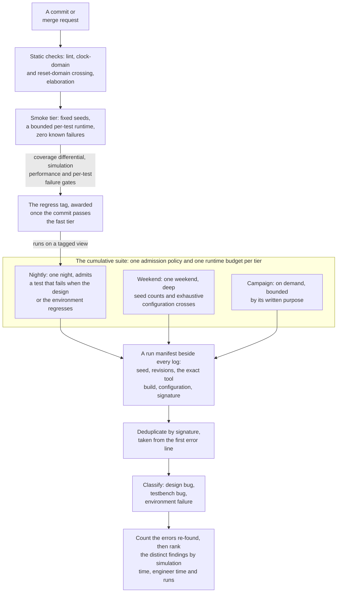

# 12. Regression Engineering

Regression engineering turns commits into evidence through repeatable runs and failure triage. In the reference SoC's month nine example, a nightly regression of 900 runs reports 863 passed and 37 failed. Three engineers spend the morning accounting for all 37 failures. Twenty-nine failures report one bug: a scoreboard change that was merged the previous afternoon mispredicts boot-ROM response ordering. The scoreboard is the testbench structure that holds what the design should have produced and compares it with what the design did. Bring-up filed the same misprediction in week three (see Chapter 4); a refactor reintroduced it, and the suite caught it this time instead of an engineer watching waveforms. Four are a real design bug in the neural accelerator's weight prefetcher. Two come from a test that has failed about once a week for two months, now called "the flaky one". One hit the farm's disk quota. And one genuine DMA burst-splitting failure is closed as a duplicate of the flaky test because the logs look similar and the triage window is closing.

The verification techniques were sound: the scoreboard design was right and the merged change broke it. The stimulus was right, and so was the coverage model, the multi-dimensional space that the plan requires the tests to reach. What failed was the process that turns commits into evidence. One fact was reported twenty-nine times, a real find stayed hidden behind a defect that the team had chosen to ignore because the two failures shared one signature, and triage consumed most of a working day of three engineers. Chapter 7 explains how to read regression metrics; this chapter develops the engineering that produces them. {ref: regression_pipeline} draws that process, from the commit to a triaged finding.

### Chapter map

§12.1 defines regression tiers and admission rules. §12.2 organizes the (test, seed) matrix for reproducibility, while §12.3 covers per-commit gating and its cost. §12.4 reduces hundreds of nightly failures without losing distinct defects; §12.5 explains why flaky tests cost more than failing ones. §12.6 fits a growing suite into a fixed night and states the tradeoffs.



{figure: regression_pipeline} The path a commit takes to become evidence: static checks and a fixed-seed smoke tier gate it, the tagged revision reaches the scheduled tiers and the campaigns, and every run leaves a manifest that triage reduces before anyone debugs.

## 12.1 Regression suites and admission policies

A **regression suite** checks that today's design retains yesterday's verified functionality: a bug fix routinely breaks it, and rerunning the previous checks catches the regression [cit:B2]. The suite is *cumulative*, so it grows monotonically unless explicitly limited.

Chapter 4 established the cadence and Chapter 7 how to read the resulting metrics. Admission must fit a fixed nightly window. A tier is an admission policy with a runtime budget, rather than a schedule. {ref: regression_tiers} gives four policies with their triggers, budgets and admission rules.

{table: regression_tiers} The four tiers of a regression suite: what launches each one, the wall-clock budget that it has to fit inside, and the rule that a test must satisfy to be admitted to it. The last column carries the argument, because a tier is an admission policy with a runtime budget attached rather than a schedule. The campaign row is the tier that teams keep reinventing without a name: a purpose-built run owned by someone and answerable to no clock. §12.6 is what happens when the nightly budget stops being enough.

| Tier | Trigger | Wall-clock budget | Admission rule |
|---|---|---|---|
| **Smoke** | every commit / merge request | minutes | proves the build is alive; fixed seeds; bounded runtime; zero known failures |
| **Nightly** | scheduled, daily | one night | discriminates: fails when the design or environment regresses |
| **Weekend** | scheduled, weekly | one weekend | everything long, deep-seeded, or configuration-crossed |
| **Campaign** | on demand | no wall-clock budget; bounded by its written purpose | purpose-built runs that belong on no clock |

A published industrial hardware CI setup groups its jobs along almost exactly these lines, down to the extended-duration *stability* configuration pinned to a specific commit hash [cit:P25]. Job names differ between companies, but this published arrangement matches the tier structure.

The three scheduled tiers have distinct admission rules. **Smoke admission** requires fixed seeds, a hard per-test runtime ceiling and zero known failures: randomization sometimes makes the gate unreliable, while a permanent failure prevents discrimination. **Nightly admission** requires a test that would fail on a plausible design or environment regression; this separates basic-functionality directed tests run nightly from the remainder held for weekends [cit:B2]. **Weekend admission** covers deep seed counts, exhaustive rather than sampled configuration crosses, and expensive verification engines. A configuration cross is one combination of the design's configuration options, and a verification engine is one of the tools that run a check (see Chapter 16). Gate-level simulation is the standard case: running the full RTL suite at gate level is prohibitive in labor or schedule terms, so only a minority runs at gate level, almost guaranteeing some missed X-optimism issues [cit:D23]; selecting that minority is a risk decision (see Chapter 19). Section 12.5 defines X-optimism and gives its regression symptom.

> **Scenario.** In this example, an HBM controller's PHY training state machine is its main source of late bugs; one training-and-retraining soak covers cold boot, thermal excursion, retrain and refresh collision during retrain, taking four hours across six configurations. **Approach.** All six go to the weekend tier; the nightly keeps a twelve-minute *training smoke* that reaches initial calibration and stops. **Why.** The nightly tier's budget is the scarce resource and its job is discrimination rather than depth: if calibration itself broke on Tuesday, the team needs to know on Tuesday, while everything past calibration can wait for Sunday without changing anyone's actions on Wednesday.

The fourth tier gives purpose-built work an explicit place in the suite. A **campaign** is a purpose-built run independent of a schedule: launched for a reason, owned by someone, producing a written result, then stopping. A flash controller's error-injection campaign sweeps bit-error patterns and burst lengths against the low-density parity-check (LDPC) pipeline across simulated wear states: ten thousand runs over a weekend, once per RTL milestone (see Chapter 4). The LDPC pipeline is the controller's error-correcting logic, and a wear state is the condition of the flash cells after a given amount of use. Each run is checked by the data-integrity oracle, the mechanism that decides whether an observed response is correct. Scheduling this campaign nightly would consume each night; leaving it outside the tiers makes execution depend on someone remembering it.

## 12.2 The (test, seed) matrix

A constrained-random test defines a family of experiments indexed by seed, rather than one experiment, since constrained-random means stimulus generated automatically under constraints. Such stimulus is legal but unlikely. A regression runs a **(test, seed) matrix**: tests form rows, seeds form columns, and each cell has its own outcome. Almost every pathology discussed here concerns the matrix rather than an individual test.

**Repeated sampling.** The commonest failure of constrained-random discipline is to keep the default seed until a simulation runs error-free: the same seed generates the same input sequence, leaving different conditions unverified [cit:B2]. Passing seed 1 establishes one path through the constraint space; sampling the *distribution* requires repeated draws.

**Seed allocation.** On the reference SoC, a DMA test drives each transfer through a transfer descriptor, the record that software writes to program one DMA transfer. The test's four axes are those of `cg_2d_4kb` (Chapter 5): stride sign, distance to the 4 KB boundary, burst length and activity on the other of the DMA's two channels. A stride is the signed address step from the start of one row to the start of the next, and the 4 KB boundary is the address line that AXI forbids a burst to cross. A DMA channel is an independent transfer engine inside the DMA, with a state of its own and a share of the AXI backend. Such a test has a large space to sample, while a UART framing test with three legal configurations does not, and its seventh seed buys almost nothing. Seed budgets should be allocated proportionally to *unclosed* coverage: groups short of target get seeds; closed, stable groups get one seed as a change detector.

**Reproducibility** is mandatory and difficult; Chapter 9 explains why and defines a run. Regression engineering adds a supporting artifact and two habits: display the seed at every run's start and include it in every output pathname, since two runs of the same code with different seeds would otherwise overwrite each other's results [cit:B2].

Chapter 7 established that every data point must carry its provenance for the trend lines to mean anything [cit:D20]. That artifact is the **run manifest**, emitted by every run next to its log.

```yaml
run_id:        nightly-20260312-0417
test:          dma_2d_stride_stress
seed:          3417755291
tier:          nightly
rtl_rev:       9f21ac4          # design repo, tagged 'regress'
tb_rev:        c07e13b          # verification repo
tool:          sim-2025.3-p2    # patch level, not just major version
config:        DMA_CH=2, SRAM_KB=512, XBAR=5x4
plusargs:      +UVM_TIMEOUT=12000000,NO +cov_categories=dma,axi
host:          farm-node-118 (linux-x86_64, 64 GB)
result:        FAIL
signature:     SCB_DATA_MISMATCH:dma_scoreboard:beat_compare
cpu_seconds:   641
```

An omitted manifest field can cost a day of debugging. The `tool` field needs more than the *major* version, as Section 12.5 demonstrates. `signature` makes Section 12.4 possible; `cpu_seconds` makes Section 12.6 possible.

**Random stability makes the manifest sufficient within a limited scope.** Chapter 9 develops the mechanism and its scope, and Section 12.5 states what it guarantees and where that guarantee stops. The regression-level consequence is that random stability says nothing about changes to the design, to scheduling freedom, or to the simulator build, which is where reproducibility breaks. One inexpensive countermeasure is one *fixed* seed run nightly on a handful of tests alongside fresh seeds. Fresh seeds measure the design; the fixed seed measures the regression machinery, because if its result changes while its manifest does not, something outside the manifest changed.

## 12.3 Continuous integration for hardware

A hardware test takes minutes to hours versus milliseconds for a software unit test, so running everything on every commit does not transfer to hardware CI. The transferable *principle* is to automatically integrate design changes, run simulations and checks, and deliver verified descriptions or bitstreams, so errors are caught early and design quality stays consistent [cit:P25]. What must be engineered is the tier that runs per commit.

**Static checks precede simulation**: one published pipeline groups linting and structural checks (static analysis, clock-domain and reset-domain crossing, elaboration) in a separate job category ahead of simulation [cit:P25]. Static analysis is inexpensive and deterministic, and it catches defects that simulation catches slowly or not at all; these properties make it suitable for the entry gate, where lint and clock-domain-crossing (CDC) checks run before any simulation (see Chapter 13).

Before automated pipelines, regressions ran on a tagged view: engineers applied a `regress` tag to design and testbench revisions once they trusted basic functionality, because the newest file might contain unverified code or fail to compile, wasting the regression [cit:B2]. Per-commit CI retains that goal but awards the tag after the commit passes the fast tier.

Three further inexpensive gates cover coverage, performance and per-test failures, and the first of them reads bins, the counters in which coverage is measured. **A coverage gate** uses a differential between two regressions to identify bins that lost coverage, and a CI run can be failed automatically when constraint work introduces such a regression [cit:D22], including changes that make the suite faster and greener by checking less. **A performance gate** makes simulation performance a criterion for revision-control check-in, reducing system simulation time [cit:D20]; a commit that halves the design's cycles-per-second affects the schedule, but that effect remains invisible unless something measures it. **A per-test failure threshold** is the third gate, and one published pipeline sets it on emulation jobs (see Chapter 17): each job carries a configurable failure threshold, and labels selectively disable job categories across the pipeline [cit:P25]. Since not every test is a hard gate, a work-in-progress branch needs an explicit, recorded exception rather than an engineer silently skipping the tier.

The fast tier need not run a fixed list: a dependency map ties each RTL directory to the testbenches that exercise it, so a commit that touches only the APB peripherals does not trigger the neural accelerator's suite; research goes further by predicting a test's failure probability and assembling a test set from RTL changes [cit:P8].

**Two influences on gate policy.** Approaching RTL freeze (see Chapter 4), the fast tier shifts from catching mistakes early to proving a fix broke nothing, so the gate gets *stricter* and exceptions *narrower*: a disable label reasonable in month four leaves a gap in the evidence in month eleven. The social policy is practitioner judgment, unmeasured in this book's corpus of sources: a broken fast tier should be reverted within a stated window rather than fixed in place, because a revert costs one commit while a broken gate affects everyone downstream. Responsibility should follow the commit rather than seniority, making ownership impersonal, and a rota rather than a volunteer should monitor the pipeline.

The fast-tier budget is a design constraint, like timing. In the flagship SoC example, the budget is twelve minutes for lint, CDC and a 60-run smoke suite; when that grew to fifteen, two tests moved to the daily tier rather than accepting the slip, because a gate that exceeds human waiting time invites bypass. One 2026 project reports 4,536 pipelines over three weeks, with successful durations from 6.4 minutes to 2.2 days on average for the largest [cit:P25].

## 12.4 Failure triage at scale

The opening example has 37 failures, with one fact reported 29 times. Triage turns failures into distinct findings; at scale, data reduction precedes debugging.

**Deduplication by signature is the first reduction.** Daily failure analysis begins with two questions: whether failures are new and whether similar failures are the same as one seen before; first-failure analysis does not always answer them because classification can be *over-generic*, mapping many bugs into one group, or *over-specific*, splitting one bug across many [cit:D26]. First-failure analysis is the classification that a failure receives on its first appearance, and it is what those two questions are put to. Both classification errors are expensive: over-generic buckets conceal real finds, as the opening example shows, while over-specific buckets defeat reduction, since 37 failures in 34 buckets require essentially as much work as 37 separate failures. A signature therefore needs a specification: it must derive from the failure rather than the test, exclude everything that varies run to run, and use the *first* error, since later errors are usually consequences.

```text
signature := <ERROR_CLASS>:<COMPONENT>:<CHECK>
             from the FIRST error line, with these stripped:
               - timestamps, simulation time, run ids, seeds
               - hierarchical paths below the component boundary
               - numeric operands (addresses, IDs, data values)
example:     SCB_DATA_MISMATCH:dma_scoreboard:beat_compare
counter-ex:  UVM_ERROR @ 12480ns [dma_sb] exp=32'hDEAD_BEEF got=32'hDEAD_BEE0
             (over-specific: every seed produces a distinct signature)
```

The seed is stripped from the signature and kept in the manifest. Chapter 9's rule that the seed travels with the failure is about the failure *report*; the deduplication *key* must exclude it because a key carrying the seed makes every failure unique, creating over-specific classification.

Failure clustering can be learned from the assignments engineers already make: when an engineer assigns a failed run to a cluster, the system extracts that run's properties as cluster characteristics and proposes that cluster for similar runs, a capability that one vendor describes as in progress [cit:D26]. Results remain incomplete: in one study reported by a 2023 survey, 616 features from simulation-log metadata and message lines gave clustering scores well short of ideal, while supervised root-cause classification reached about 91% accuracy with a random-forest model [cit:D35]. The proposed division of labor is that automation supplies the bucket, a human confirms it, and that confirmation becomes training data.

**The second reduction classifies three kinds of failure**: design bugs, testbench bugs and environment failures, whose ratio is a health metric. Testbench bugs require the same bug-tracking discipline as design bugs, because the verification environment is itself a design (see Chapter 4). Environment failures, such as disk quota, license starvation or a dead farm node, are the only category that may be discarded without debugging; even they must be *counted*, because a rising count reveals an infrastructure problem that resembles flakiness.

**The third reduction avoids debugging the same failure twice.** A regression should track errors *re-found*, measuring wasted simulation [cit:D20]: in this example, re-discovering three known-open bugs consumes 40% of the night, so that 40% supplies no new evidence. Known-failure filters should use signatures and expire when the bug closes. The re-found count shows when known-failure filters have gone stale.

**Debug economics.** Debug dominates a verification engineer's time (see Chapter 7); this chapter develops the *per-failure* accounting needed to manage that time and prioritize the work. Bug closure should record three quantities, simulation time, engineer time and runs consumed, so triage can rank work rather than process an undifferentiated queue. Because instrumentation itself costs simulation resources, a regression can run with most metrics disabled and then re-run only the failing tests, each with the metric categories that its own failure type needs [cit:D20]. Three practices follow in one vendor's regression-management flow: prioritize the highest-impact failure modes, identify the *shortest* test reproducing each, and rerun automatically to generate the debug data the engineer will need without making them ask [cit:D26].

A **triage rota** should assign one engineer per week to the morning queue, responsible for classification, deduplication and assignment, and for filing what the buckets reveal about the regression machinery; this role does not include debugging. Combining debugging and triage makes them compete for the same engineer's time, so debugging can displace triage.

## 12.5 Flakiness and regression reliability

A **flaky test** changes outcome between runs with identical manifests: test, seed, revisions, tool and configuration. Its outcome no longer provides reliable passing or failing evidence. The term is borrowed from software testing, where the problem has a name and a decade of study.

The judgment here is that *a flaky test costs more than a failing one*. A failing test signals a problem to investigate, whereas repeated flaky failures teach teams to ignore failures elsewhere, undermining regression evidence. The opening DMA failure was closed as a duplicate of "the flaky one", consistent with the response that repeated regression results had taught the team.

The sources below document recurring causes of nondeterminism in the environment and the design.

- **Sampling and scheduling races.** Synchronous interface signals must be sampled and driven through a clocking block (IEEE Std 1800-2023, *IEEE Standard for SystemVerilog* [cit:S8]), which avoids races between design and verification environment and lets one environment work against RTL and gate-level models unchanged. Active-region sampling allows races: when the design's update and monitor's sample share a time step, their relative order is unspecified. The active region is the part of a simulation time step in which the design's updates and the testbench's own statements are evaluated. Two *testbench* processes resuming on the same edge require a distinct ordering solution, developed in the worked example. The same family includes clock edges at time zero and environment instantiation, where a local variable prevents initialization races [cit:B1].
- **Uninitialized state.** X-optimism is simulation behavior in which a deterministic 0 or 1 propagates where silicon would have an unknown; it can mask RTL design bugs, though not all of it is unwanted, since asynchronous reset works *because* of it [cit:D23] (see Chapter 13). Its regression-level symptom is a result that depends on what a register happened to hold.
- **Time-dependent checks.** A check written against wall-clock-like quantities rather than design events is nondeterministic by construction. For the Ethernet MAC's time-sensitive networking (TSN) queues, a timestamp-precision check derives its tolerance from the *host's* measured latency instead of the design's own clock. That check passes on a quiet farm and fails on a busy one.
- **Provenance drift.** Random stability guarantees an unaffected instance the same sequence for the same seed even when other instances change [cit:B2], but its scope is randomization-related *source* changes; it says nothing about a different simulator build. A manifest recording the tool's major version and not its patch level permits flakes.
- **Infrastructure collisions and runaways.** If two simulations of the same code run with different seeds and write to the same output filename, the first run's results are lost: the run surfaces as one that "failed for no reason" and passes when rerun alone. A simulation waiting for an event that never occurs runs until 64-bit simulation time reaches its maximum, effectively forever; every simulation therefore needs a time bomb, used only for abnormal termination so success remains distinguishable from deadlock [cit:B2]. A watchdog, required in every system-level environment and advisable at lower levels too, must likewise halt a run when no progress is observed, since such runs block the tests behind them [cit:B1].

Instability should be measured. One published flow measures stability for tests it cannot parallelize: an operating-system boot cannot be split across machines, so it is executed eight times specifically to establish that test's stability [cit:P25]. A **repeat-N stability check** should precede admission of any test to a gating tier. A confirmed flake should enter **quarantine**, a named list on which it is still run and reported but does not gate, with an owner and a date. Quarantine requires resolution; an untouched list preserves the instability.

### Worked example: hunting a one-in-four-hundred race

Over twelve weeks, sixty nights of the reference SoC's suite, `SCB_DATA_MISMATCH:dma_scoreboard:beat_compare` appeared 35 times, always on a different seed. Each morning it was closed as "the flaky one". The suite's 900 nightly runs include 260 that instantiate the DMA environment, so the field rate is 35 failures in 15,600 DMA runs: about one in 450.

**Step 1: signature refinement.** The first check tests whether the 35 failures have one cause. The signature was over-generic [cit:D26], and three of the 35 failures carried distinct first-error lines that a stricter signature separated out. Two were a real, already-fixed bug in the burst splitter, the DMA stage that splits each transfer into bursts that the AXI address rules allow. One was a farm node that died mid-run. Thirty-two shared a first error and component, reducing thirty-five cases to one investigation at a field rate near one in 490.

**Step 2: campaign statistics.** One in 490 is difficult to measure at 260 runs a night. A weekend campaign ran 4,000 fresh seeds of the DMA test set: 4,000 × 11 minutes = 733 CPU-hours, or 30.6 hours of wall clock on the reference SoC's 24 slots, and produced 9 failures, one in 444.

**Step 3: manifest correction.** Rerunning the 9 failing manifests reproduced 6 but not the other 3. With the same seed and the same revisions, those three should have reproduced as well. The farm actually ran two simulator patch levels, while the manifest recorded only the major version. Pinning `tool` to the exact build made all 9 reproduce deterministically. This diagnosed provenance rather than the race; without it, subsequent experiments would have been unrepeatable and the team would have attributed intermittent failures vaguely to the design.

**Step 4: observation-path bisection.** Reproducibility exposed two parts of the race. The response monitor sampled the DMA backend's response channel from an `always @(posedge clk)` block rather than through a clocking block; it also *popped* the expected item and compared it immediately, in the same region where the command monitor pushed it. Processes sensitive to one event execute in arbitrary order [cit:S8]; the simulator chose which of the two ran first, explaining the disagreement between two patch levels. The race mattered only when a response arrived in the same cycle as the previous descriptor's last beat, the last of the data transfers that make up an AXI burst. That arrival requires the 16-entry backend FIFO to sit exactly at a boundary, a coincidence the random descriptor stream produces about once in four hundred and something runs.

<!-- slang: fragment - before and after excerpt of the response monitor; the block elides the intervening code, and its always block and clocking block have no module here -->

```systemverilog
// before: samples in the active region, and pops the expected item there too,
// so the pop and the command monitor's push are ordered by the simulator
always @(posedge clk)
  if (rvalid && rready)
    compare(exp_q.pop_front(), sample_response(rdata, rresp, rid));

// after: sample through the clocking block, and only enqueue — the scoreboard
// owns the comparison, so the order is stated rather than inherited
clocking mon_cb @(posedge clk);
  default input #1step;
  input rvalid, rready, rdata, rresp, rid;
endclocking
...
@(mon_cb);
if (mon_cb.rvalid && mon_cb.rready)
  obs_q.push_back(sample_response(mon_cb.rdata, mon_cb.rresp, mon_cb.rid));
```

Two changes each address one half of the race. Every field the monitor records now comes from `mon_cb`, and a `#1step` input skew samples in the preponed region, the value present before the clock transition [cit:S8], so capture no longer depends on design activity at that edge. The monitor enqueues instead of popping, and the scoreboard compares in its own process.

The clocking block defines sampling time but does not order two testbench processes. Moving *both* monitors behind clocking blocks on the same clock makes them resume together without defined relative order, reintroducing the bug. Enqueuing for comparison in a separate process closes the race; the clocking block makes the sampled evidence reliable.

**Step 5: post-fix rate bound.** Re-running the 4,000-seed campaign produced zero failures. Zero events in 4,000 trials bounds the true rate below roughly 1 in 1,300 with 95% confidence. The campaign therefore establishes a bound on the rate, below 1 in 1,300, without proving a zero rate or a fix.

The race required a small fix, but twelve weeks of repeated signatures trained the team to close DMA scoreboard mismatches unread, including at least one genuine failure.

## 12.6 Compute economics

The physical compute budget constrains regression decisions. Additional cores increase throughput, but redundant simulations consume simulator resources and lengthen turnaround without improving coverage [cit:P7].

Two published results quantify the scale. In a 2023 study, a commercial signal-processing unit required six months of simulation of nearly two million constrained-random tests on almost a thousand machines and EDA licenses, at about two hours per test [cit:P5]: four million CPU-hours, approximately what a thousand machines produce running continuously for six months. The farm was saturated throughout the project, leaving no capacity for more runs. In a 2026 report, distributing a 1,738-test suite across an eight-board FPGA-emulation cluster cut runtime from about 5.2 hours to about 53 minutes: a 6× rather than 8× speed-up, with near-linear gains only for the independent categories and none for tests that cannot be divided [cit:P25]. This also demonstrates a parallelism limit when boards constrain capacity.

Compute cost has both a hardware term and a license term, and the two do not scale together. A published per-job cost model for a two-socket simulation server records what happens as simulations fill a socket: cache bandwidth drops and the cache miss rate rises, until cores stall waiting for data and processor utilization declines; the per-job cost rises once license cost eventually dominates hardware cost, and where the license dwarfs the server, packing many jobs onto one socket generally saves nothing [cit:D44].

A limited budget requires run selection.

**Ranking.** Ranking chooses tests by their contribution to coverage improvement, producing a compressed suite of specific (test, seed) pairs and eliminating redundant runs [cit:P7]. The idea predates the tooling: coverage tools grade data sources by absolute contribution or rate of contribution over time, and the selected simulations *together with their initial seed values* form the regression suite, so running the most efficient first reaches the same coverage rating in less time [cit:B1]; the highest-contributing seeds should run first, with remaining time filled by fresh random seeds [cit:B2]. Ranking adjusts run *order* and *frequency* as well as membership [cit:D20].

In 2022 industrial results (posted in 2024), an automotive microprocessor IP suite of 26 tests at 10 seeds each (260 runs, 12 CPU-hours) compressed to 8 runs and 1.1 CPU-hours at 100% of original coverage. An industrial mixed-signal SoC suite of 5,124 runs across seven configurations compressed to 1,204, a factor of 4.25, again regaining full coverage [cit:P7]. Both are Infineon Technologies' own projects; the paper reports three in all and compares two methods, classical seed ranking and Cadence Xcelium ML; that tool learns the correlation between randomization points and achieved coverage in earlier regressions and then emits an optimized pattern set; the automotive microprocessor IP is an ASIL-D safety product implemented in VHDL [cit:P7]. The last of those facts names a safety rank: ASIL-D, the most demanding of the four automotive safety integrity levels. The paper identifies its projects by class rather than by part number, so that is as far as the attribution goes.

**Ranking limits.** A ranked regression selects existing test-and-seed pairs and simulates no new scenarios, so it is not recommended for exploring the random space or exposing new bugs [cit:P7]. The compression must be regenerated whenever design or testbench changes significantly.

**Test selection.** The complementary technique filters tests *before* simulating them, on the hypothesis that dissimilar tests hit dissimilar coverage events. The 2023 signal-processing unit of the first result above belongs to the same class as the radar front-end, one of the example devices this book returns to. On that unit, neural-network novelty selectors beat random selection in every configuration; the best saved 49.37% of simulation to reach 99.5% coverage, with computation negligible against simulation avoided [cit:P5]. Machine-learning-generated regressions remain random: in the same 2022 results, optimized regressions regained 99% or more of original coverage at roughly 3× compression, with some configurations exceeding 100% by hitting previously missed bins [cit:P7]. Ranking trades exploration for speed, while novelty selection seeks speed through exploration.

**Scheduling by predicted reachability.** A third technique predicts, for each RTL instance, which tests are likely to reach it, then allocates the next regression batch from those predictions rather than spreading seeds uniformly across the suite. Across three designs, one of them the open-source IBEX core, its authors report reaching constrained-random saturation 32% sooner and on 40% fewer resources, with the average coverage improvement itself under three points [cit:D45]. Saturation here is the stimulus saturation of Chapter 7: the state in which more seeds mostly re-confirm what a fixed constraint set has already reached.

Two smaller controls complement selection: pruning *coverage collection* rather than tests trades a bounded loss of measurement for compute (see Chapter 7), and nightly runtime should itself be a metric with an owner, so a spike in a block's regression time is detected before its cause becomes difficult to reconstruct [cit:D20].

### Worked example: 40 runs, 900 runs, and a suite that no longer fits

**Week 6: 40 runs.** Forty directed tests at one seed each and a mean two minutes take 80 CPU-minutes on one workstation over lunch, with one engineer reading every log. In this example, the engineer uses no tiers, signatures or manifests; none is needed at this scale, where the chapter's techniques would add overhead.

**Month 9: 900 runs.** The suite that was 40 tests is now 180 distinct tests: 120 constrained-random at 7 seeds each (840 runs) plus 60 directed at one seed (60 runs). At a mean 11 minutes per run, the nightly costs 165 CPU-hours, or 6.9 hours on 24 concurrent simulator licenses within a 10-hour night. Smoke is 22 fixed-seed runs of at most 90 seconds, one wave across the same 24 slots: under nine minutes end to end, most of it spent compiling. At 40 seeds per random test, the weekend costs 4,800 runs plus the 60 directed: 891 CPU-hours, or 37.1 hours on the same 24 slots within 48 hours. The suite fits, but growth consumes the headroom in four months.

**The flagship SoC exceeds the nightly budget.** The reference SoC's DMA suite carries forward directly, with the same discipline of splitting every burst at the 4 KB boundary and the same three-stage architecture of register frontend, burst splitter and AXI backend. The register and peripheral suites carry forward too, and the plan adds what eight DMA channels, a coherent host cluster and a mesh NoC demand. A NoC is the on-chip packet network that takes the place of a bus once too many blocks share one path. The nightly *candidate* list is 6,400 runs ({ref: flagship_nightly_candidate}):

{table: flagship_nightly_candidate} The flagship SoC's nightly candidate list before any re-tiering: 6,400 runs in three groups, each with that group's mean run time and the CPU-hours it costs. The total is the number that does not work — 4,409 CPU-hours on the farm's 240 concurrent simulator licences overruns the night, and that overrun is the gap the re-tiering, the ranking and the pruning have to close.

| Component | Runs | Mean | CPU-hours |
|---|---:|---:|---:|
| System-level (OS boot, coherent traffic soak) | 340 | 3.5 h | 1,190 |
| Constrained-random block/subsystem (600 tests × 8 seeds) | 4,800 | 30 min | 2,400 |
| Directed and configuration runs | 1,260 | 39 min | 819 |
| **Total** | **6,400** | 41 min | **4,409** |

The farm permits 240 concurrent simulator licenses, so 4,409 CPU-hours takes 18.4 hours. Against a 10-hour night, the 8.4-hour overrun delays the summary until 11:00, disrupting the triage rota's day. The following three decisions are applied in this order:

1. **Tier reassignment.** Three hundred of the 340 system-level runs move to the weekend; 40 stay as a nightly system smoke. Cost falls by 1,050 to **3,359 CPU-hours** (14.0 h wall), still above budget.
2. **Random-block ranking.** The 4,800 random runs compress to 1,150, a factor of 4.17 consistent with the 4.25 reported in 2022 for an industrial mixed-signal SoC [cit:P7], requiring 575 CPU-hours. Cost falls by 1,825 to **1,534 CPU-hours** (6.4 h wall).
3. **Directed-set pruning.** One hundred and eighty directed runs are retired under the hygiene rules below, leaving 1,080 runs at 702 CPU-hours. Cost falls to **1,417 CPU-hours**, or 5.9 hours, with four hours of headroom for the subsequent growth assumed in this example.

The weekend absorbs 300 system runs (1,050 CPU-hours), the *unranked* random set at 20 seeds instead of 8 (12,000 runs, 6,000 CPU-hours), and the **retained** directed set (702); the 180 retirees leave both tiers for an on-demand parole list. Total 7,752 CPU-hours, 32.3 hours on 240 slots inside a 48-hour window.

**The nightly tier is ranked; the weekend remains unranked.** A ranked regression reproduces known coverage without exploration, so using it as the *only* regression leaves new scenarios untested despite a green dashboard [cit:P7]. Chapter 7 calls the result the flat-curve pathology: a green regression beside a coverage curve that has stopped moving. Ranking fits the nightly budget, while the unranked weekend restores exploration; the ranking must be regenerated whenever the design or testbench moves significantly, so it remains a compression of the current design rather than an outdated version.

### Regression hygiene over time

Decision 3 needs retirement rules: without retirement rules, a suite keeps growing because adding tests is rewarded while deletion is treated as lost verification and a risk of removing a future bug detector. Three categories have explicit detection rules.

**Tests whose reason has expired.** Many tests target a specific bug, whose closure indicates when the test no longer needs to run [cit:D20]; closure therefore triggers regression maintenance. Because a bug test protects against recurrence, closure must record a decision to retain it permanently, demote it to weekends or retire it, rather than automatically deleting it.

**Tests that duplicate other tests.** Regressions contain redundant simulations that add no coverage [cit:P7]; successive rankings expose this at no extra cost when they drop every seed of a test because the remaining suite covers its contribution. Measuring that duplication does not release runtime until the redundant tests are removed from scheduled runs.

**Tests without a justification.** Every test should discharge a plan row, a coverage group or a closed bug (see Chapter 5). A plan row is the line of the verification plan that names a feature and the evidence that closes it. A test that discharges no plan row, adds no unique coverage and finds no bug in six months is a retirement *candidate*, and it requires a one-line review because wrongful deletion has asymmetric costs.

```text
RETIRE  dma_desc_legacy_mode        (60 runs/night, 11 CPU-h)
Reason:  the legacy descriptor format it exercises was removed from the RTL at
         rev 9f21ac4; no vplan row now depends on it
Unique coverage contributed:  0 bins over last 12 rankings
Bugs found:  1, closed 2025-11-04, fix protected by a_no_4kb_crossing
Reviewed by: DMA owner + verification lead   Decision: retire; 2-month parole on-demand
```

Two further costs require control. Functional metrics require architecture, implementation and maintenance, plus simulation resources [cit:D20], so unread coverage groups waste resources as unread tests do. Regression *data* grows faster than tests, so tracking snapshots should be retained and raw results discarded (see Chapter 4). In the morning queue, disk exhaustion appears as a failure just as a design defect does.

### In practice

Configurations add a dimension that multiplies the (test, seed) matrix: one industrial mixed-signal SoC suite in 2022 spanned seven configurations distinguished by the presence of a CPU, a verification IP and a particular flash type [cit:P7]. A verification IP is a ready-made checking component for a standard protocol, typically bought rather than written. Infrastructure ownership should name a person, since shared responsibility can leave ownership contested or unassigned. The first ranking exercise can expose substantial duplication and be read as criticism of test authors; this should be understood as a consequence of incremental growth, one bug at a time.

### Pitfalls

1. **Reduced checking after a constraint change.** A pass-rate rise after a constraint change may reflect reduced checking; coverage differentials should gate CI alongside pass/fail [cit:D22].
2. **The manifest that omits the tool build.** Recording only the major version makes a class of flakes undiagnosable and can make them resemble design bugs for weeks.
3. **Over-generic signatures.** One bucket containing many distinct defects can conceal a real find [cit:D26]; such a bucket requires a more discriminating signature.
4. **Ranking the only regression.** A compressed suite reproduces known coverage without new exploration; an unranked tier and regeneration after design changes are therefore required [cit:P7].
5. **The time bomb as normal termination.** Routine watchdog termination makes success and deadlock indistinguishable [cit:B2], preventing the regression from discriminating between them.
6. **Triage without a rota.** Without a rota, dependence on one engineer leaves triage uncovered during that engineer's week off.

### Summary

- Regression tiers require engineering as admission policies with runtime budgets.
- The unit of work is the (test, seed) pair. One seed samples a distribution once [cit:B2]; seed budgets should follow unclosed coverage.
- Reproducibility must be *easy*, beyond merely possible [cit:B1], through a per-run manifest of seed, revisions, exact tool build and configuration. An incomplete manifest is a defect in its own right.
- Hardware per-commit gating needs a fast tier preceded by static checks [cit:P25], with coverage-differential and simulation-performance gates too [cit:D22,D20].
- Triage is data reduction before it is debugging: signatures neither over-generic nor over-specific [cit:D26], three-way classification, and a measured count of errors re-found [cit:D20].
- Flakiness harms team judgment by teaching engineers to ignore failures. Flake investigations need statistics and an explicit account of what a clean rerun establishes.
- Ranking and selection reduce runtime, but a ranked regression explores nothing new [cit:P7], requiring an unranked tier.

### Exercises

**Exercise 12.1 (judgement).** A team proposes admitting a new test to the smoke tier: it draws a fresh seed on every run, finishes well inside the tier's budget, and fails on a minority of runs for a cause nobody has identified. Name which of the tier's three admission rules the proposal breaks, give the reason §12.1 attaches to each of those, and name the rule the test does satisfy. Name the check §12.5 requires before any test enters a gating tier, and name the list a confirmed flake belongs on together with the two attributes §12.5 requires each entry of that list to carry.

**Exercise 12.2 (artifact).** Read the run manifest below, emitted beside the log of a failing run of the DMA test of §12.5, with one field left empty. Name the empty field, state the class of failure its absence permits, and name the step of §12.5's worked example that found the same omission and what that step established. Name also the field of this manifest that the deduplication key of §12.4 must exclude, give the classification error that including it would produce, and state where §12.4 keeps that field instead.

```text
run_id:      nightly-20260312-0417
test:        dma_2d_stride_stress
seed:        3417755291
tier:        nightly
rtl_rev:     9f21ac4
tb_rev:      c07e13b
tool:
config:      DMA_CH=2, SRAM_KB=512, XBAR=5x4
host:        farm-node-118 (linux-x86_64, 64 GB)
result:      FAIL
signature:   SCB_DATA_MISMATCH:dma_scoreboard:beat_compare
cpu_seconds: 641
```

**Exercise 12.3 (calculation).** After the signature refinement of §12.5's worked example, a weekend campaign measures a field rate of one failure in 444 runs, from 9 failures in 4,000 fresh seeds. Compute the number of DMA runs the nightly tier would have to accumulate to produce those 9 failures at that rate, and convert the result into nights at the tier's own DMA run count. Compute the campaign's wall-clock time on the reference SoC's slot count, and state what the comparison of the two figures establishes about measuring a rate of this size on the nightly tier.

**Exercise 12.4 (calculation).** The month-9 example of §12.6 runs 180 distinct tests as 120 constrained-random tests at 7 seeds each plus 60 directed tests at one seed, at a mean 11 minutes a run, on 24 concurrent simulator licenses inside a 10-hour night. Compute the run count, the CPU-hours and the wall-clock time of that nightly, then compute the CPU-hours the night still admits at the same slot count. Compute the ratio of the weekend's 891 CPU-hours to the nightly's figure, and state what §12.6 says growth does to the headroom.

**Exercise 12.5 (judgement).** A proposal keeps the ranked flagship nightly tier of §12.6 and retires the unranked weekend, on the argument that ranking regained the coverage at a quarter of the random set's cost. Name the evidence a ranked-only regression cannot produce and the property of the weekend tier that restores it, and name the pathology of Chapter 7 the resulting dashboard would display. Name the maintenance obligation §12.6 attaches to a ranking and the event that triggers it. State which of the flagship's two scheduled tiers §12.6 leaves unranked and the seed count it runs the random set at there.

### Further reading

Corpus sources cover the following topics. [cit:B2] §7, *Simulation Management*, covers seed management and random stability (p. 364), then regressions (pp. 365–369): the nightly/weekend split, seed ranking, time bombs and tagged views. [cit:B1] supplies the reproducibility requirement, watchdog rule and environment-side race rules responsible for most flakes; [cit:S8] defines scheduler guarantees. [cit:P7] is the reference for ranking and machine-learning regression compression, with quantified industrial results and an explicit account of compression costs; one of its authors works for the vendor of the evaluated tool. [cit:P5] supplies both the farm-scale calibration and novelty-selection results. [cit:D26] and [cit:D20] describe regression management, failure clustering, test ranking and metrics; both are vendor accounts without population data. [cit:D22] covers coverage-based CI gating and coverage-collection pruning, with measurements. [cit:P25], an arXiv preprint, is this corpus's most recent hardware CI tiering account; [cit:P8] reviews machine learning in simulation-based verification, including test selection; [cit:D35] surveys automated failure clustering and root-cause classification.

Outside the corpus, software CI literature applies once the unit-test/simulation cost asymmetry is accounted for; software-testing literature names flakiness and provides a decade of study.
