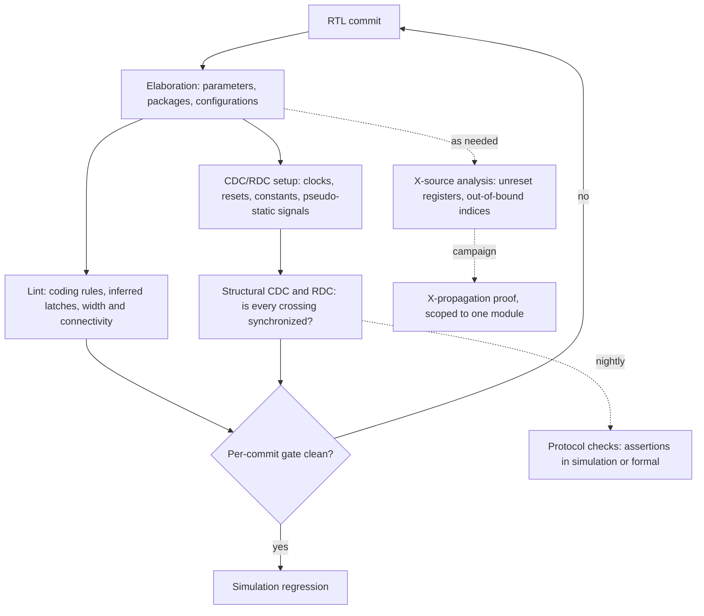

# 13. Static Verification

The reference SoC comes back from the lab with a defect nobody can reproduce. One board in forty hangs on wake-up from deep sleep, roughly once a day, always at the moment the always-on domain hands control back to the switchable system domain. RTL regression is green: eleven thousand seeds, every wake path the plan enumerated, the scoreboard silent throughout.

The design is correct at the level the simulation can see. The event unit encodes the reason for a wake-up in a three-bit cause code, produced on the 32 kHz always-on clock and consumed on the 200 MHz system clock. The encoding is sparse — four legal codes scattered across eight code points — and each of the three bits crosses the boundary through its own two-flop synchronizer. Three textbook synchronizers, one per bit, and a linter finds nothing to say about any of them. But when the code changes from `3'b010`, a GPIO wake, to `3'b100`, a comparator wake, two of the three bits change at once, and on the crossing edge each destination flop resolves independently. For exactly one system cycle the destination can therefore observe `3'b110` — a reserved code that the source never produced. The decoder has a branch for each legal cause and none for the rest, so for that cycle it holds its previous decode. The wake sequencer latches the decode as the cause code changes, captures the stale value, dispatches nothing new — and the handshake never completes.

Simulation could not have shown this. The source flops change at one instant of simulated time, the destination flops sample one instant later, and what they sample is exactly what the source drove: metastability is a behaviour of a flip-flop with real timing, not of RTL. Demonstrating this class of bug in simulation needs a gate-level model with timing, which does not exist yet at RTL sign-off, and the same bugs are hard to reproduce in the lab once silicon arrives [cit:R2].

What could have found it — in seconds, before a testbench existed — is a structural analysis that walks the elaborated design, finds every path leaving one clock domain and entering another, and asks whether a multi-bit crossing is protected against its bits resolving independently. No stimulus, no reference model, no seed. That analysis is the first gate in Part IV, and this chapter is about what stands behind it.

### Chapter map

- §13.1 establishes what static analysis buys before a single simulation runs, and the precise boundary of what it can decide.
- §13.2 sets out what a linter actually finds, why a rule set turns into noise, and how to make one a policy instead.
- §13.3 develops clock-domain crossing — metastability and mean time between failures, and the standard synchronizer structures — and §13.4 separates the *structural* check from the *protocol* check, which answer different questions.
- §13.5 turns to reset-domain crossing: why it became a discipline of its own, and what it catches in a design with a single clock.
- §13.6 treats X-propagation: how RTL simulation lies optimistically and pessimistically at the same time, and what the gate-level, simulator and formal answers cost.

## 13.1 The entry gate

Static verification is analysis of the design description itself. It requires no stimulus and no statement of the expected output; the expectations are built into the checker [cit:B2]. That one sentence explains both its position in the flow and its limits.

Chapter 3 framed dynamic verification as bounded by controllability and observability. Static analysis has neither problem, because it has neither power. It drives nothing, so no condition is unreachable and no coverage question arises; it observes no behaviour, so nothing it reports is about what the design computes. It examines the shape of the code and the netlist that code implies, exhaustively, reporting every instance of a structural pattern it was taught to recognise.

That trade — total coverage of a structural question, total silence on functional ones — is what earns it the front of the flow. It runs on the first day RTL compiles, weeks before the environment in Chapter 4's bring-up phase drives its first checked transaction, and the cheapest bug is the one its author catches the afternoon it was written [cit:B2]. It is deterministic: no seed, no run-to-run variation, an identical report on unchanged source — which is what makes it usable as a gate (see Chapter 12) and as an audited sign-off row with its own waiver file (see Chapter 7). And it reaches classes simulation reaches slowly or never; the opening scenario is the extreme case, and static clock-domain-crossing tools exist precisely because that class needed an answer earlier than gate-level timing simulation could give one [cit:R2].

What it cannot do is decide function. A static tool finds problems deducible from code structure, not problems in the algorithm or the data flow — a spell checker will find a misspelled word and will never notice that you wrote *with* where you meant *width* [cit:B2]. Every *structural* check in this chapter is a check on form, and a design that passes all of them can still compute entirely the wrong result. Sections 13.4 and 13.6 add the functional half, and it takes an engine that evaluates behaviour.

Within the static half the checks are not peers: what is fast and deterministic enough to run on every commit sits inside the gate, and what is slower or needs more setup belongs on a nightly or a campaign schedule. {ref: static_flow_gate} places each one relative to that gate.



{figure: static_flow_gate} Where each static check sits relative to the per-commit gate: elaboration first, then lint and structural CDC and RDC inside the gate, whose two exits are the simulation regression and the commit sent back to the RTL. The dotted edges are the checks deliberately left outside it — protocol checks nightly, X-source analysis as needed, an X-propagation proof as a scoped campaign — because a gate that also carries the slow checks stops being fast enough to wait for. What the diagram does not show is the setup behind its CDC and RDC node, which is where the engineering lives and where §13.3 shows what one unreviewed line can hide.

### The setup is the hard part

The diagram hides the work. A structural CDC check is not a button; it is a *setup* followed by a button, and the setup is where the engineering lives. The tool must be told which clocks exist, which of them are asynchronous to which, which inputs are constant in the mode being analysed, which signals are pseudo-static — changed only while the receiver is held in reset or has its enable low — and which buses are gray-coded [cit:D36].

Timing constraints also declare clocks and exceptions, so it is tempting to point the CDC tool at the constraint file and start. Do not. The clock groups a timing tool needs are not the clock groups a CDC tool needs, and a path waived for timing analysis is not a path that may be waived for CDC analysis [cit:D36]. A false path in timing means *do not schedule this*; a false path in CDC means *there is no crossing here at all*, which is a much stronger claim and usually a wrong one.

The reference SoC makes the point concretely. It has three clock sources on paper — system at 200 MHz, peripheral at 50 MHz, always-on RTC at 32 kHz — but "three clocks" is not the same statement as "three clock domains". A clock domain is the set of flip-flops driven by one clock or by clocks derived from a common source [cit:D36]. Had the 50 MHz peripheral clock been the system clock divided by four, the two would be edge-aligned and share a source, and declaring that boundary asynchronous would bury the report in hundreds of crossings that are not crossings. It is not: the peripheral clock has its own source, so the boundary carries a real crossing on every register interface in the APB subsystem, and declaring it synchronous would silently delete the entire check. Nothing in the RTL distinguishes the two cases. Somebody has to read the clocking specification and write the answer down.

> **Scenario.** The reference SoC's integration team wants a per-commit static gate.
> **Approach.** Fix the gate's contents once, in the plan: elaboration with the production parameter set, lint at the "must-fix" severity only, structural CDC and RDC against a checked-in setup file, and nothing else. Everything slower sits outside it: protocol assertions nightly, the X-propagation proof as a scoped campaign. The setup file is reviewed like RTL and lives beside it, and every constant or pseudo-static declaration in it names the mode it assumes.
> **Why.** A gate that also carries the slow checks stops being fast enough to wait for, and Chapter 12 has already shown what happens then. The second half is specific to static verification: the setup file is design intent written down, and Section 13.3 shows what one unreviewed line in it can hide.

## 13.2 Lint: from noise to policy

Lint's ancestry is a C utility that reported questionable constructions the compiler accepted — mismatched argument types, a value used before it was set, a return value silently ignored [cit:B2]. RTL linting kept the ancestry and inherited the pathology.

What it finds falls into four families. *Synthesis-intent mismatches*: a combinational block that does not describe combinational logic — the language itself asks tools for this one, saying a procedure declared `always_comb` should be flagged if latched behaviour can be inferred from its body [cit:S8]. *Width and type errors*: a truncated assignment, a signed-unsigned comparison, an expression one bit wide where the author meant a vector. *Connectivity and structure*: floating input ports, dangling wires, a variable with no driver, a variable with several.

And *language constructs whose semantics differ from what the author probably meant*. `casex` is the standard example, and the reason many groups ban it outright is worth stating precisely: it treats both `x` and `z` as do-not-care in any bit of *either* the case items *or* the case expression (IEEE Std 1800-2023, *IEEE Standard for SystemVerilog*) [cit:S8] — so a runtime unknown on the selector matches the first item whose remaining bits agree, and the design takes a branch nobody chose.

Here is the fragment behind the opening scenario, at the point where lint could have said something:

```systemverilog
module wake_decode (
  input  logic [2:0] cause,
  output logic [1:0] branch
);
  always_comb begin
    case (cause)                  // sparse encoding, no default
      3'd0 : branch = 2'd0;       // no wake pending
      3'd1 : branch = 2'd1;       // timer
      3'd2 : branch = 2'd2;       // GPIO
      3'd4 : branch = 2'd3;       // comparator
    endcase
  end
endmodule
```

Four of the eight values of `cause` are decoded. For the other four — `3'd3`, `3'd5`, `3'd6`, `3'd7` — no assignment executes, so `branch` keeps the value it held: latched behaviour inside a procedure that declares itself combinational, and a latch in the netlist. Note what the linter sees. A synthesis-intent mismatch and a missing `default`, reported on the day the file is written. It does not know that `cause` crosses a clock boundary, that its bits can transiently disagree, or that `3'd6` is the transient the lab is hitting. Its report is structural, correct, and several levels of abstraction below the bug.

### Why teams drown

Linting errs on the side of caution: rather than let a real problem go unreported it reports potential problems where none exist, and engineers who spend a week chasing non-existent problems become engineers who stop reading the output, then engineers who abandon linting altogether [cit:B2]. This is not a defect a better tool fixes. It is intrinsic to a checker deciding from structure alone whether a construct is a mistake, and two multipliers make it worse.

The first is scale, and the GPU shows it purely. Four shader clusters are four instances of the same RTL, and a tile-based architecture replicates the per-tile datapath inside each. One questionable construct in a shared file — an unused parameter, a width deliberately truncated in a rate-matching stage — is reported once per instance. An issue count of eleven thousand across the shader complex may be forty distinct constructs, so any policy phrased as a count ("drive lint issues below 500") measures elaboration depth rather than code quality. The unit that means something is the distinct rule violation at its source line.

The second multiplier is inherited code. A block bought or reused arrives with its own conventions and its own history of accepted deviations, so your rule set produces thousands of findings nobody on your team is authorised to fix. That is not noise in the same sense: it is somebody else's signal.

### Making the rule set a policy

Three disciplines turn lint from noise into a gate, and only the first is about the tool.

**Classify rules by severity before the first run, not after.** Three classes are enough: violations that block the commit, violations waivable by a named owner with a written reason, and findings that are informational and never gate anything. The classification lives in a checked-in file and is a *policy* document — it states what this team believes constitutes a defect, exactly the kind of statement Chapter 5 wanted written down rather than assumed. The middle class is where the discipline is really tested, and the corpus holds a cautionary case. A Broadcom power-management controller, the case Section 13.6 returns to, had passed extensive block-level UVM constrained-random simulation and SoC-level directed tests, and its lint analysis had been run with the errors and warnings waived by the designer; the block nonetheless still held an unreset flip-flop, which a formal run found before tape-out [cit:D23]. Nothing in that account says lint would have caught the flip-flop; it is not a lint result. What it does say is narrower and more useful: a waiver recorded by the code's own author is a decision no later reader can audit — which is why the class above insists the owner be *named* and the reason *written*.

**Filter the output; never disable the check.** Suppressing a check in the source or on the command line looks equivalent and is not: it stays suppressed for an unpredictable length of time and hides problems that arrive with later files, whereas a filtered report still contains the finding and the filter itself can be audited. Make naming conventions carry the filtering, so it is mechanical rather than a judgement call — if intentional latches are the only signals whose names end in a reserved suffix, an inferred-latch report on such a signal is expected and every other one is a defect [cit:B2]. This is Chapter 7's rule about waiver files, one level down.

**Lint as the code is written.** A first run on a finished block produces a report large enough to feel like a setback, arriving when its author has already moved on. Run it during writing and each finding is judged by the person still holding the context [cit:B2].

> **Scenario.** The GPU team inherits a shader complex from a previous project and its lint report has 11,000 findings.
> **Approach.** Do not attempt closure. Take one snapshot of the report as a baseline, mark every finding in it as inherited, and gate only on the *delta*: a commit fails if it introduces a finding not in the baseline. In parallel, classify by rule rather than by instance, and pick the two or three rule classes with real failure modes behind them — inferred latches, `casex` on a decoded selector — to be retired against the baseline over the next quarter.
> **Why.** The gate's job is to stop new debt, and the delta gate does that on day one at zero cleanup cost. Absolute closure on inherited code is a project in its own right and must be planned as one, with an owner and a schedule, not smuggled in as a quality initiative. Retiring rule *classes* rather than instances also means each cleanup commit has a stated failure mode behind it, which is what makes it reviewable.

## 13.3 Clock-domain crossing

A clock-domain crossing is a signal generated by logic on one clock and sampled by logic on another, where the two clocks have no fixed phase relationship. The fundamental problem is metastability. When the signal changes close enough to the destination edge to violate that flip-flop's setup or hold time, the flop enters an unstable state; it will resolve to a one or a zero after some delay, but which one cannot be predicted [cit:D14].

Two consequences are worth separating, because teams routinely conflate them. First, metastability itself is not observable in RTL simulation, in gate-level simulation, or in formal analysis: it is an attribute of a physical flip-flop, not of any model of one. What it produces in the real device is a family of *effects* — uncertainty about when a value changes, filtering of a pulse that simulation showed arriving, generation of a pulse that simulation showed being filtered, and several distinct timing scenarios where synchronized paths reconverge. Second, it cannot be eliminated, only given time to decay; that is the entire function of a synchronizer, which isolates the potentially metastable net so its unresolved state never reaches the destination domain [cit:D14].

### How long is long enough

The probability that a metastable condition has *not* decayed to a stable legal value in time for the next sampling event sets the failure rate, and through it the mean time between failures given by

    MTBF = e^(Ts/Tc) / (Tw · Fc · Fd)

where `Ts` is the settling window available before the next sample, `Tc` the flip-flop's settling time constant, `Tw` the window of susceptibility around the destination edge, `Fc` the destination clock frequency and `Fd` the rate at which the crossing signal changes [cit:D14].

Read the shape, not the numbers. Two terms sit in the exponent — the settling window `Ts`, and `Tc` as its divisor — while only `Tw`, `Fc` and `Fd` are linear. The first exponential lever is the time between the first flop's output settling and the second flop sampling it, which is why a two-flop synchronizer works at all, and why anything that erodes that window (a slow route, a scan multiplexer on the second flop's data path, clock skew that samples the second flop early) hurts far out of proportion to its apparent size. The second is the choice of flop: a metastability-hardened cell in the first stage damps a metastable condition faster — a smaller `Tc` — and narrows the susceptibility window as well. Note also what the expression does *not* say: it does not predict how often a metastable condition occurs. Those are relatively frequent; the failure — an unresolved value sampled and propagated onward — is catastrophic and extremely rare [cit:D14]. A design does not fail because metastability happened. It fails because settling did not finish in the window available, or because there was no synchronizer at all.

### The structures, and what each one assumes

There are four common answers, and each is a bargain with a different set of preconditions.

The **two-flop synchronizer** is the fundamental element for a single asynchronous signal and the building block of everything more complex. Three of its requirements can be checked on the RTL: there must be no combinational logic on the crossing path that could be falsely sampled, the crossing signal must never carry a pulse too narrow for the destination to sample, and the data must be stable across more than two active destination edges so that nothing is filtered away [cit:D14].

The **gray-coded parallel synchronizer** — one two-flop synchronizer per bit — extends this to a bus, and its precondition is absolute. It is safe only if exactly one bit changes at a time, because then at most one bit can go metastable and it resolves either to the old value or the new one, both legal codes. Give it a binary bus and it generates codes the source was not driving — illegal ones, and legal ones from the wrong moment [cit:D14]. That is the opening scenario stated as a rule: the reference SoC's event unit put one synchronizer per bit on a code where two bits change at once. Note where that leaves the setup file. Had anyone declared that cause bus gray-coded [cit:D36], the structural check would have accepted one synchronizer per bit and reported nothing — the opening scenario passing a clean CDC run on the strength of one wrong line nobody reviewed.

Fixing metastability and fixing data coherency are independent problems. For one bit, fixing metastability is enough: the coin can land either way and both faces are legal. For several bits you must fix both, because now you need all the coins to land the same way [cit:D36].

The **handshake synchronizer** solves the multi-bit case without constraining the encoding, by not sending the data through a synchronizer at all. Only the request and acknowledge controls are synchronized; the data bus is held stable in the source domain until the acknowledge comes back, and the destination captures it while it is guaranteed still [cit:D14]. It costs several round-trip latencies per transfer, which is why it is the answer for configuration and status rather than for streaming.

The **asynchronous FIFO** is the streaming answer: gray-coded read and write pointers crossing in both directions, with the payload passing through dual-ported memory rather than through any synchronizer. It buys bandwidth, and it buys throttling — the ability to absorb intermittent peaks in the arrival rate rather than stalling the source on every item [cit:D36].

### Grounding: the reference SoC's three domains

Which structure you owe depends on the frequency ratio, and the reference SoC's ratios are extreme enough to make the reasoning visible.

Between the always-on RTC domain at 32 kHz and the system domain at 200 MHz the ratio is 6,250 to one: one 32 kHz period is 31.25 µs, one system period is 5 ns. Going *up*, from slow to fast, a level generated on the RTC clock is stable for 6,250 system cycles, so no pulse can be filtered and a two-flop synchronizer per bit is sufficient — provided the bits do not have to agree with each other. Going *down*, from fast to slow, the pulse-width requirement bites: a system-domain pulse must be wider than two destination periods [cit:S12] — 62.5 µs, 12,500 system cycles. No designer writes that, and nobody should: downward crossings on this SoC are handshakes or toggles, and a level pulse in that direction is a defect regardless of what the simulation shows.

The 200 MHz to 50 MHz boundary is milder — a four-to-one ratio, so pulse width is rarely the issue in either direction — but it is the widest surface, since every APB register interface sits on it. There the recurring question is coherency: a multi-bit status field that firmware polls must not be readable in a state it never held.

> **Scenario.** The sensor hub — an always-on fusion block with a 32 kHz island and a DSP that is clock-gated off between bursts — must pass a configuration word from the island to the DSP.
> **Approach.** Handshake, with the request generated by the island and the acknowledge required before the word may change. Not a gray-coded parallel synchronizer, and not a pulse.
> **Why.** The "more than two active destination edges" rule is a duration only when the destination clock is running. Here it is not: the DSP clock is stopped for most of the time the island is awake, so the interval a level would have to survive is unbounded and cannot be written as a number of source cycles. A handshake's correctness argument never mentions the destination frequency: the source holds the data until the destination tells it, on its own schedule, that it has taken it.

## 13.4 Structural checks and protocol checks

A team that believes it has done CDC verification because the structural report is clean has done half of it.

The structural check analyses the elaborated design: it identifies the clock domains, finds every signal crossing between them, flags illegal logic on those paths, and classifies each crossing into a synchronizer protocol group — an individual asynchronous bit, a handshake, an asynchronous FIFO — from which the properties that crossing owes follow [cit:D14]. What it decides is *structure*: whether a recognised synchronizer stands where one is required. It does not analyse functionality, so as long as the structure is valid the check passes [cit:D36]. A valid crossing is correct structure *and* correct function, and the second half needs a different instrument.

That instrument is an assertion (see Chapter 11), evaluated by a simulator or by a proof engine. The properties are the preconditions of the structure the classifier found: minimum pulse width and data stability for a two-flop crossing, one-bit-at-a-time for a gray-coded bus, request-acknowledge sequencing and source-side data stability for a handshake. The standard states the obligation for the simplest case directly — a pulse driving a synchronizer input must be wide enough to be reliably sampled by the destination clock, and that requirement is to be discharged by formal or dynamic verification [cit:S12].

### Worked example: the pulse-width property, twice

The obvious way to write "the pulse is wide enough" is to sample the source signal on the destination clock and require it to hold:

```systemverilog
// Wrong: samples the crossing signal on the clock that cannot see the problem.
property p_min_pulse_wrong;
  @(posedge dst_clk) $changed(src_sig) |=> $stable(src_sig)[*2];
endproperty
```

Read it as the tool will. `$changed` is true at a destination edge when the sampled value differs from the previous sampled value; the non-overlapping implication then requires the value to be unchanged at each of the next two destination edges. So the property says: whenever the destination *notices* a change, the new value must survive two further destination samples.

The flaw is in the noticing. A source pulse narrower than a destination period can fall entirely between two destination edges. `$changed` is then never true, the antecedent never fires, the property passes having checked nothing — and the assertion reports a clean run for exactly the crossing it was written to protect, while silicon, where the sampling phase is not the one this simulation happened to use, may catch the pulse and go metastable [cit:D36].

The fix is to stop sampling on the clock that is blind to the failure and sample on the fastest clock in the system, scaling the stability requirement so it still expresses two destination periods:

```systemverilog
// Right: sampled fast enough to see a pulse the destination could miss.
//   N = ceil( 2 * dst_clk period / fast_clk period )
module cdc_pulse_chk #(parameter int N = 2) (
  input logic fast_clk,
  input logic rst_n,
  input logic src_sig
);
  property p_min_pulse;
    @(posedge fast_clk) disable iff (!rst_n)
    $changed(src_sig) |=> $stable(src_sig)[*N];
  endproperty
  a_min_pulse : assert property (p_min_pulse);
  c_min_pulse : cover property (@(posedge fast_clk) disable iff (!rst_n)
                  $changed(src_sig));
endmodule
```

`N` is the number of fast-clock ticks that span two destination periods, rounded up [cit:D36]. Compute it for the downward crossing Section 13.3 said nobody should build — 200 MHz system clock as the fast clock, 32 kHz RTC as the destination — and `N` is 12,500. That is the point of computing it: the property states in one number the cost the level-pulse design was hiding, which is why the answer in that direction is a handshake. If no clock in the design is fast enough, the property is bound to a virtual clock generated for the purpose.

A CDC protocol property is a claim about *time*, so the clock you sample it on is part of the claim and not an implementation detail. And the wrong version fails in the way Chapter 11 warned about: it passes vacuously, and only the cover on its antecedent would have exposed it.

### CDC reconvergence: signals that recombine after crossing

The hardest CDC question is not whether each crossing is synchronized but whether the design works *in the presence of* the synchronizers — including every clock relationship, the timing uncertainty each synchronizer introduces, and paths that converge after passing through more than one of them [cit:D14].

Two failure shapes live there. The first is loss of data coherency: several bits crossing through independent synchronizers, resolving independently, and recombining into a value the source was not driving. That is the opening scenario, and a gray code or a handshake eliminates it by construction. The second is glitching: several separately synchronized signals reconverging into combinational logic, where a one-cycle difference in when each arrives produces a momentary transition on the result that neither source ever intended [cit:D36].

The second shape is the one that survives review, because each crossing is individually correct. Suppose the peripheral domain raises two status flags, `fifo_empty` and `xfer_done`, each properly synchronized into the system domain, and a system-domain state machine advances on `fifo_empty && xfer_done`. Both flags are legal at all times in the source. But the two synchronizers resolve independently, so the conjunction can be asserted for one system cycle at a moment when the source never had both true — or, worse, can be *missed* for one cycle at a moment when the source did. Nothing in either crossing is structurally wrong. The bug is in the CDC reconvergence, and the cure is architectural: synchronize one signal and qualify the other with it, or carry both across a single handshake, so that only one crossing decision is ever made.

### Modelling the uncertainty

A synchronizer's output can legitimately arrive one cycle early, one cycle late, or on time, so the receiving logic must tolerate all three — and conventional simulation, which reproduces exactly one of them, cannot test that tolerance. The technique that closes the gap is metastability injection: instrumenting each crossing with a model that randomly advances, delays or passes through the sampled value.

Four criteria, set out in 2012, separate a trustworthy injection model from a convenient one, and the cheap models fail them. The delay must be *random* between the three legitimate outcomes — early, late, on time. Injection must be *independent* per receiving register, since two registers sampling the same value can resolve differently, which a model that merely jitters a primary clock cannot express. It must be *accurate*, injecting only when the data changes, is sampled, and violates setup or hold; injecting at random moments manufactures failures silicon cannot produce. And it must be *complete*, covering registers with and without synchronizers, because a crossing can go metastable whether or not anyone synchronized it. Violate them and the model invents behaviour: replacing every two-flop synchronizer with a three-flop cell that randomly advances or delays can generate a sequence impossible in silicon, values skewed by two cycles [cit:D34]. The accurate models are slow, which is why this runs on an emulator rather than in the nightly regression (see Chapter 17).

## 13.5 Reset-domain crossing

A flip-flop with an asynchronous reset has a third timing requirement beside setup and hold: recovery time, the interval between reset release and the next clock edge. Violating it is no different in kind from violating setup or hold — the flop can go metastable [cit:D36]. That observation splits into two problems, and only the second is what the industry means by RDC.

The first is **reset de-assertion**. A reset generated in one place and released asynchronously with respect to a destination clock will, sooner or later, be released inside that flop's recovery window. The standard cure is the reset synchronizer: assert asynchronously so the design is safe the instant reset arrives, release synchronously so no flop sees the release inside its window. Whether a given reset has one is a purely structural question, which is why static analysis is sufficient to answer it [cit:D36].

The second is **reset assertion**, and this is reset-domain crossing proper. A register whose reset is asserted asynchronously clears its output at a moment bearing no relation to any clock edge — the path from the clear input to the output is not normally timing-closed. If another register, *in a different reset domain and therefore not being reset*, samples that output, it samples a signal changing at an arbitrary time and can go metastable [cit:D36].

Here is why RDC is a discipline of its own rather than a footnote to CDC. **The domains in question are reset domains, not clock domains.** Both registers above can be driven by the same clock. A design with exactly one clock, and therefore not one clock-domain crossing anywhere in it, can be full of reset-domain crossings — and a clean CDC report says nothing whatsoever about them. The discipline arrived later than CDC for the reason it became necessary: in practice resets multiplied, as power gating gave each domain its own, per-IP soft resets became a standard firmware affordance, and debug and watchdog resets were added on top. The cross-industry standardisation effort followed: its first draft covered CDC alone, and RDC entered the scope at the very next release, nine months later [cit:D36].

> **Scenario.** The sensor hub's always-on island runs entirely on the 32 kHz clock. It has two resets: a power-on reset covering the whole island, and a soft reset that firmware pulses to restart the fusion pipeline after a sensor is reconfigured. The island's own CDC report is empty — internally one clock, no crossings. In the lab, reconfiguring a sensor occasionally produces a spurious wake interrupt.
> **Approach.** Run RDC analysis with the two resets declared as separate domains. Every path from a fusion-pipeline register into the wake-decision logic is reported: the pipeline sits in the soft-reset domain, the wake decision in the power-on domain, and the wake-decision registers are live and clocking while the soft reset asserts.
> **Why.** When firmware pulses the soft reset, the pipeline's `sample_valid` output clears asynchronously, at an instant unrelated to the 32 kHz edge. The wake-decision register samples exactly then and can resolve either way — or resolve late. Neither register is wrong, both resets are correct, and there is no clock-domain crossing to find. This is precisely the class CDC analysis is not looking for.

Three fixes exist, and choosing between them is a design decision rather than a verification one.

**Order the assertions.** If the destination reset is always already asserted when the source reset asserts, the destination register is sampling nothing and the crossing is harmless. That turns a structural obligation into a sequencing one, which is why the integration standard — the Accellera *Standard for IP Abstraction for Clock and Reset Domain Crossing Integration*, Version 1.0, 2026 — carries a reset assertion sequence — the order in which multiple resets shall be asserted — alongside a reset group, a set of resets between which no RDC violation exists at all [cit:S12].

**Qualify the path.** Insert a control that blocks the crossing path while the source reset is active, so the destination samples a held value rather than a changing one. The load-bearing condition is that the qualifying control must itself be synchronous with the destination domain [cit:D36] — a qualifier that arrives asynchronously has moved the problem rather than solved it.

**Synchronize the source reset to the destination clock.** Then the source register's output changes only on a clock edge and the crossing becomes an ordinary synchronous path. On the sensor hub's always-on island this is the cheapest of the three, because the 32 kHz clock never stops.

The ordering fix is checkable as an assertion, and worth writing even when the reset controller looks obviously correct:

```systemverilog
module rdc_reset_order_chk (
  input logic clk,
  input logic rst_pipe_n,   // fusion pipeline soft reset, active low
  input logic rst_por_n     // always-on island power-on reset, active low
);
  // The pipeline reset may only assert while the island reset is already
  // asserted. `===` states the intent on its face; `==` would behave
  // identically here, since a property reads an unknown expression as false.
  property p_reset_order;
    @(posedge clk) $fell(rst_pipe_n) |-> (rst_por_n === 1'b0);
  endproperty
  a_reset_order : assert property (p_reset_order);
  // No `disable iff` here either, for the same reason.
  c_reset_order : cover property (@(posedge clk) $fell(rst_pipe_n));
endmodule
```

Three details are deliberate. The implication is overlapping: at the very tick where `rst_pipe_n` is first seen low, `rst_por_n` must *already* be low — write `|=>` instead and the property tolerates the pipeline reset leading the island reset by a cycle, which is the exact ordering it exists to forbid. There is no `disable iff`, because a reset-ordering property that switches itself off during reset has nothing left to check. And sampling on `clk` makes this a sampled approximation of an asynchronous event; the same obligation is also written against the source reset's own falling edge [cit:D36].

At integration this becomes somebody else's problem. A team instantiating a purchased block cannot see its internal reset structure and should not have to; what it needs is a declaration — which ports carry a reset-domain control, with what blocking polarity, which resets share a group, in what order they must assert. Historically each vendor's tool produced that collateral in its own format and the models were not interchangeable [cit:D36]. A cross-vendor abstraction format for CDC and RDC collateral reached version 1.0 in March 2026, covering those attributes and requiring conforming tools to read and write it [cit:S12]. Who agreed it matters as much as what it says. The working group that produced it grew to 154 members from 24 companies — Arm, AMD, Apple, Google, Huawei, IBM, Infineon, Intel, Marvell, Microsoft, NVIDIA, NXP, Qualcomm, Renesas, Robert Bosch, Samsung and ST Microelectronics among them, alongside the major EDA vendors — over the three years between the working group's launch in January 2023 and the final release, with a first CDC draft appearing that October [cit:D36]. The standard's own account of why states it plainly: it addresses "aspects of clock domain crossing and reset domain crossing that are outside the expressiveness of typical HDL semantics" [cit:S12]. Read that as a participation fact, not a results fact: the industry judged the problem real and shared enough to standardize an answer, which says nothing about how well any tool implements it.

## 13.6 X-propagation

SystemVerilog carries four values: 0, 1, the unknown `x` and the high-impedance `z` [cit:S8]. Silicon carries two. Every simulation is therefore a translation between a four-valued model and a two-valued device, and it is lossy in both directions at once. This is the last of the entry-gate checks and the least well understood, because its failure mode is not a wrong answer but a *right-looking* one.

### The two lies

**X-optimism** — defined in Chapter 12 as simulation propagating a definite 0 or 1 where silicon would hold an unknown — follows from the language's own semantics, not from a simulator defect. An `if` takes the true branch only when its condition is a nonzero *known* value; the false branch is taken when the condition is 0, `x` or `z`. A condition nobody can predict therefore produces a decision nobody chose, and the run continues as though it had been made deliberately. `case`, `posedge` and `negedge` behave the same way [cit:D23]. Chapter 12 noted the flip side — asynchronous reset in RTL simulation works *because* of this — which is why the answer is never "make the simulator pessimistic everywhere".

**X-pessimism** is the opposite error and the more visible one. With `a` unknown, both `a & ~a` and `a | ~a` evaluate to `x` in simulation, where silicon gives a definite 0 and a definite 1. Worse, the arithmetic operators are all-or-nothing: if any operand bit is unknown the whole result is unknown, so `3'b000 + 3'b01x` is `3'bxxx` where `3'b01x` would have been accurate. Pessimism does not usually hide design bugs; it floods the waveform with unknowns that are expensive to trace and mostly artefacts [cit:D23].

Put together: an RTL simulation can pass a test silicon fails and fail a test silicon passes, for reasons that have nothing to do with the design.

### Where the unknowns come from

Four sources account for most of it: registers with no reset, out-of-bound array or bit-select accesses, explicit `x` assignments written as don't-cares or as error indications, and the corruption of a powered-down domain under a power-intent description [cit:D23]. The last belongs to Chapter 19. The first two are where the entry gate earns its place, because both are findable statically.

> **Scenario.** The video codec's deblocking filter indexes a per-row descriptor array sized for the tile geometry of the profiles it originally shipped with. A new profile adds one row class; at the largest frame size the index reaches one entry past the end, for the last row of the frame only. The out-of-bound read returns `x`, and the filter-mode `case` that consumes it falls through to its default branch. The regression passes: frames complete, the checksum matches on every clip in the suite except the ones nobody added for the new profile.
> **Approach.** Before writing a single new test, run a structural property analysis for out-of-bound indexing across the block. It needs no testbench, only compilable RTL, and it reports the index and the condition under which it exceeds the array.
> **Why.** The alternative is to find it the way it has been found before: in silicon. A 2014 case study describes exactly this shape — an audio block extended from sixteen channels to seventeen, an index one past the end of a request vector, an unknown that X-optimism converted into a state machine that always returned to idle, a full passing regression, and a system that hung in the lab whenever the new channel was used [cit:D23].

> **Scenario.** The crypto engine's key-valid flag is a control-register bit the designer left unreset — a common and usually harmless economy. The negative test that matters most for this block, "no ciphertext is produced before a key is loaded", passes on every seed.
> **Approach.** Run formal reset analysis before believing the test. It takes the reset vector and reports every register still unknown when the reset period ends, which is where this flag will appear.
> **Why.** In simulation the flag powers up unknown, so `if (key_valid)` takes the else branch and the engine refuses to encrypt — the test passes because of X-optimism, not because of the design. In silicon the flop powers up to a definite value, which on some corners and some dice is one, and the engine encrypts with whatever the key registers happen to hold. The cure is not a better test but a reset: control, clock and reset registers in particular should be reset, because the area, routing or timing gained by leaving them alone does not pay for the class of bug it hides [cit:D23].

### The three answers, and what each costs

**Gate level.** X-optimism largely disappears there, because `if`, `case` and the edge constructs have by then been synthesized into gates and flip-flop primitives that do not exhibit it. The cost is not only runtime: X-pessimism becomes *more* prevalent at gate level, and the resulting sea of unknowns has to be cleared by depositing or forcing known values, iteration after iteration, which is what makes the productivity poor rather than merely slow [cit:D23]. Chapter 12 gave the regression-level consequence — only a minority of the suite is ever regressed at gate level — so this answer arrives late and covers little.

**A simulator's X-propagation mode.** Simulators can be told to merge the results of both 0 and 1 in place of an unknown when executing `if`, `case` and the edge constructs, which converts optimism into an honest unknown at the point of decision [cit:D23]. It costs simulation performance, so in practice it is a named regression variant rather than a default — one 2026 project lists an `xprop` variant beside its DMA and JTAG variants in the same UVM regression environment [cit:P25].

**Formal X-propagation.** A formal application instruments the design with assertions asking whether an unknown can reach a chosen target — clocks and resets, primary outputs, the conditions of `if` and `case` statements — and proves or refutes them. Run blindly it hits the ordinary capacity wall: given a whole IP and a two-hour budget, the same application returned bounded proofs and no violations for a design already known to contain an X-optimism bug [cit:D23]. That is the failure's shape: not a wrong answer, an empty one.

What makes it work is attacking the sources rather than the propagation. Formal reset analysis takes the reset vector and reports which registers are still unknown when the reset period ends, catching unreset flops no structural check can see — a polarity mistake, or a clock not running while a synchronous reset asserts. Structural property analysis finds out-of-bound indexing far more cheaply than the propagation proof does. Only then, with every source found and judged intended or not, is the proof scoped to the module where a given source is produced and consumed, small enough to converge [cit:D23]. That is the shape of the case behind this section. On a Broadcom power-management controller for a quad-core application processor, formal reset analysis reported four flip-flops still unknown in the first clock cycle after reset deassertion, and every assertion failure the X-propagation app then produced traced back to X-optimism on just one of them — the very flip-flop the team had already suspected [cit:D23].

### In practice

Static verification decays quietly, and it decays through its setup rather than through its checks. The CDC setup file accumulates declarations — this input is constant, that bus is gray-coded, this crossing is a false path — each true of the design on the day it was written, and nobody re-derives them. Six months later "the CDC report is clean" means "clean under assumptions last examined by someone who has left the project". The only defence is to review the setup file as seriously as the RTL, at the same milestones.

Ownership is usually split. Designers run lint and own its findings, because the findings are about their code and cheapest to judge on the day of writing. The CDC and RDC setup belongs to an integration or methodology team, because it is a statement about the whole chip's clocking and reset architecture that no block author can make. The verification engineer's job is neither: it is to make sure the results are evidence — the waiver file reviewed rather than counted (see Chapter 7), the protocol assertions having actually run with non-vacuous attempts (see Chapter 11), the gate containing what the plan says it contains.

Hierarchy is the other practical reality. A flat structural check on a full SoC is expensive and produces a report dominated by crossings into blocks that are still black boxes. The reference SoC's three domains give three boundaries to classify by hand; the flagship's five give ten. The industrial flow is two-level: each block is closed at its own level and exports an abstraction model of its boundary alone — clocks, resets, which ports are synchronized inside — and the SoC run consumes those models instead of the RTL [cit:D36]. That is far better than an opaque box, and it is where the collateral must be trusted: a model generated under one set of parameters and configuration signals is valid only for that set, so a block instantiated twice in different modes needs two models — and on the flagship, whose DVFS moves clock ratios between operating points, one model per operating point.

The honest ordering, then. Lint every commit; structural CDC and RDC every commit once the setup is stable, and painfully before that; protocol assertions in the nightly and weekend tiers; metastability injection on the emulator. The formal X-propagation proof is a campaign — launched for a stated reason, scoped to a module, producing a written result — not a gate.

### Pitfalls

1. **A setup file that makes the check pass.** Symptom: a suspiciously short report; or hundreds of crossings on a boundary that is synchronous; or a report that shrank and nobody can say which crossings left it. Cure: write the CDC setup separately from the timing constraints, which answer a different question [cit:D36], and treat a CDC false path as the strongest claim in the file — *no crossing exists here* — with a named owner and a written argument, exactly as for a coverage exclusion.
2. **Declaring CDC done when the structural report is clean.** Symptom: every crossing has a recognised synchronizer and the design still fails in the lab. Cure: run the protocol properties too (Section 13.4) — they are the other half.
3. **A crossing property sampled on the destination clock.** Symptom: a pulse-width assertion that has never fired on any seed. Cure: sample on the fastest clock in the system, or a virtual one, and scale the stability count accordingly.
4. **Reading a lint issue count as a quality metric.** Symptom: a number that moves when someone changes an instantiation count. Cure: count distinct rule violations at their source lines, and gate on the delta against a baseline for inherited code.
5. **Leaving control registers unreset because "it does not matter which value it starts at".** Symptom: a test that passes for the wrong reason and a state machine that behaves differently in silicon. Cure: reset control, clock and reset registers; the area saved does not pay for the class of bug it hides [cit:D23].
6. **Treating RDC as covered by CDC.** Symptom: a single-clock block with a clean CDC report and intermittent failures around soft reset. Cure: run RDC with the reset domains declared, and check that the design's resets have a defined assertion order.

### Summary

- Static verification needs no stimulus and no expected output; it is exhaustive over structure and silent about function [cit:B2]. That is simultaneously why it goes first and why it can never be the whole story.
- A linter's value is destroyed by its own false reports. Filter the output, never disable the check, encode intent in names so the filter can be mechanical, and run it while the code is being written [cit:B2].
- Metastability cannot be removed, only given time to decay; two terms of the MTBF relation are exponential — the settling window and the flop's settling time constant — which is why anything that erodes the window matters far more than its size suggests [cit:D14].
- One bit needs metastability fixed; several bits need metastability *and* coherency fixed — which is why a gray code, a handshake or an asynchronous FIFO, and not three correct synchronizers, is the answer for a multi-bit crossing [cit:D36].
- The structural check asks whether a synchronizer is present; the protocol check asks whether its preconditions hold. Both are required, and the second is an assertion problem (see Chapter 11).
- RDC is not a special case of CDC: its domains are reset domains, so a design with a single clock and no clock-domain crossing at all can be full of reset-domain crossings [cit:D36].
- RTL simulation is optimistic about unknowns at every decision and pessimistic about them in every expression, so it can pass tests silicon fails and fail tests silicon passes [cit:D23]. Attack the sources — unreset registers, out-of-bound indices — before attacking the propagation.

### Further reading

Within the corpus, [cit:D36] is the broadest single treatment of CDC and RDC together: synchronizer schemes, setup constraints and where they come from, structural analysis, the assertion layer with its clocking traps, and the hierarchical block-to-SoC flow. [cit:S12] is the normative document behind it — the attribute set for CDC and RDC collateral, the RDC clause covering reset groups, assertion sequences and blocking controls, and the SVA requirements for a closed-box crossing. For what happens to synchronizers *after* RTL sign-off — the sub-cycle constraint on the metastable net, why scan insertion on the second flip-flop erodes MTBF, how a parallel synchronizer fails when its bits are under-constrained — [cit:D14] is the reference, and the best corrective to the belief that CDC ends at RTL. [cit:D34] catalogues metastability injection models. On unknowns, [cit:D23] carries the definitions, the four X sources, the X-source-driven scoping and two industrial case studies. [cit:B2] remains the clearest short account of what linting is and is not, and [cit:S8] is definitive on the four-valued semantics that make the X problem exist, on `casex` and `casez`, and on the checks the language asks tools to perform for `always_comb` and `always_ff`. The 2024 industry data on asynchronous clock domains is in [cit:R2].

Outside the corpus: C. Cummings' SNUG papers on clock-domain-crossing design and on asynchronous FIFO design are the long-standing practitioner references for synchronizer and FIFO construction; M. Litterick, *Pragmatic Simulation-Based Verification of Clock Domain Crossing Signals and Jitter using SystemVerilog Assertions*, is the simulation-side companion to [cit:D14]; and M. Turpin, *The Dangers of Living with an X* (SNUG Boston, 2003) with S. Sutherland, *I'm Still In Love With My X!* (DVCon, 2013) are the two short papers to read next on X semantics and coding style.
