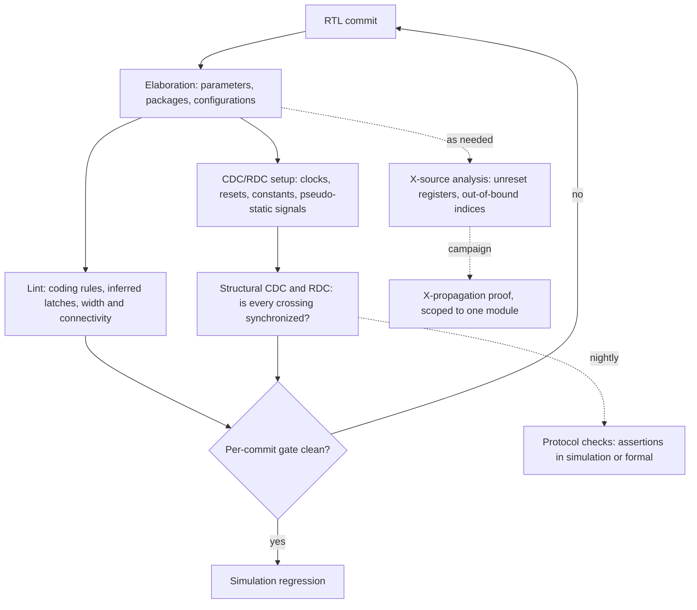

# 13. Static Verification

Static verification checks design structure before simulation. The reference SoC's wake-up defect illustrates the scope of that check and is also a failure that laboratory attempts have not reproduced. In this example, one board in forty hangs on wake-up from deep sleep, roughly once a day, always when the always-on domain returns control to the switchable system domain. RTL regression passes eleven thousand seeds over every planned wake path, and throughout that regression no error comes from the scoreboard, the structure that holds the value each output should take and is consulted whenever an output is observed.

The defect is invisible at the simulation's level of abstraction. The event unit encodes the reason for a wake-up in a three-bit cause code, produced on the 32 kHz always-on clock and consumed on the 200 MHz system clock. The sparse encoding has four legal codes across eight code points; each of the three bits crosses through its own two-flop synchronizer. The three synchronizers, one per bit, individually satisfy lint checks. But when the code changes from `3'b010`, a GPIO wake, to `3'b100`, a comparator wake, two of the three bits change at once, and on the crossing edge each destination flop resolves independently. For exactly one system cycle the destination can therefore observe `3'b110`, a reserved code the source never produced. The decoder has a branch for each legal cause and none for the rest, so for that cycle it holds its previous decode. The wake sequencer is the hardware block that dispatches the wake steps once a cause is decoded. As the cause code changes, the wake sequencer latches the stale decode and dispatches nothing new, so the request-and-acknowledge handshake never completes.

The source flops change at one simulated instant and the destination samples exactly that value one instant later; metastability requires a flip-flop with real timing. Demonstrating this class of bug in simulation needs a gate-level model with timing, which does not exist yet at RTL sign-off, and the same bugs are hard to reproduce in the lab once silicon arrives [cit:R2].

Structural analysis could find this in seconds, before a testbench exists, by traversing the elaborated design and checking every clock-domain crossing for protection against independent resolution of its bits. It requires no stimulus, no seed and no reference model, the independent executable of the specification that a dynamic check compares the design against. This chapter covers that analysis, the first gate in Part IV.

### Chapter map

§13.1 defines static analysis's benefits before simulation and its limits. §13.2 covers lint findings, report noise and rule-set policy. §13.3 develops clock-domain crossing, metastability, mean time between failures and synchronizer structures; §13.4 distinguishes structural and protocol checks. §13.5 explains reset-domain crossing as a separate discipline and its findings in single-clock designs. §13.6 covers optimistic and pessimistic X-propagation and the costs of gate-level, simulator and formal approaches.

## 13.1 The entry gate

Static verification is analysis of the design description itself. It requires no stimulus and no statement of the expected output; the expectations are built into the checker [cit:B2].

Chapter 3 framed dynamic verification as bounded by controllability and observability. Static analysis drives nothing, so no condition is unreachable and no coverage question arises; it observes no behavior, so it cannot report what the design computes. It examines the shape of the code and the netlist that code implies, exhaustively, reporting every instance of a structural pattern it was taught to recognize.

It runs the first day RTL compiles, weeks before Chapter 4's bring-up environment drives its first checked transaction, allowing authors to catch bugs the afternoon they write them, when correction costs least [cit:B2]. It is deterministic, with no seed or run-to-run variation on unchanged source, so it can serve as a gate (see Chapter 12) and an audited sign-off row with its own waiver file (see Chapter 7). Static analysis also reaches classes of defect that simulation reaches slowly or never; the wake-up example illustrates why static clock-domain-crossing tools were needed earlier than gate-level timing simulation could address these defects [cit:R2].

A static tool detects problems in code structure rather than algorithms or data flow, just as a spell checker detects misspellings but misses *with* substituted for *width* [cit:B2]. Every *structural* check in this chapter is a check on form, and a design that passes all of them can still compute entirely the wrong result. Sections 13.4 and 13.6 add the functional half, and it takes an engine that evaluates behavior.

Checks fast and deterministic enough for every commit belong inside the static gate; slower checks or those needing more setup belong on a nightly or campaign schedule. {ref: static_flow_gate} places each check relative to the gate.



{figure: static_flow_gate} Where each static check sits relative to the per-commit gate: elaboration first, then lint and structural CDC and RDC inside the gate, whose two exits are the simulation regression and the commit sent back to the RTL. The dotted edges are the checks deliberately left outside it — protocol checks nightly, X-source analysis as needed, an X-propagation proof as a scoped campaign — because a gate that also carries the slow checks stops being fast enough to wait for. What the diagram does not show is the setup behind its CDC and RDC node, which is where the engineering lives and where §13.3 shows what one unreviewed line can hide.

### CDC setup requirements

A structural CDC check requires a setup that describes design intent. The setup must identify clocks and their asynchronous relationships, inputs constant in the analyzed mode, pseudo-static signals (changed only while the receiver is in reset or disabled), and gray-coded buses [cit:D36].

Timing constraints also declare clocks and exceptions, but their file should not be reused directly for CDC setup. The clock groups a timing tool needs are not the clock groups a CDC tool needs, and a path waived for timing analysis is not a path that may be waived for CDC analysis [cit:D36]. A timing false path means *do not schedule this*; a CDC false path means *there is no crossing here at all*, a stronger and usually incorrect claim.

The reference SoC has three clock sources, system at 200 MHz, peripheral at 50 MHz and always-on RTC at 32 kHz, but "three clocks" does not establish "three clock domains". A clock domain is the set of flip-flops driven by one clock or by clocks derived from a common source [cit:D36]. Had the 50 MHz peripheral clock been the system clock divided by four, the two would be edge-aligned and share a source, and declaring that boundary asynchronous would bury the report in hundreds of crossings that are not crossings. The peripheral clock has its own source, so the boundary carries a real crossing on every register interface in the APB subsystem, and declaring it synchronous would silently delete the entire check. Nothing in the RTL distinguishes the two cases. The CDC setup must record the clock relationships specified in the clocking specification.

> **Scenario.** The reference SoC's integration team wants a per-commit static gate.
> **Approach.** The plan should fix the gate's contents once, limiting them to production-parameter elaboration, lint at "must-fix" severity only, and structural CDC and RDC using a checked-in setup file. Everything slower sits outside it: protocol assertions nightly, the X-propagation proof as a scoped campaign. The setup file should live beside RTL, receive the same review, and name the assumed mode for every constant or pseudo-static declaration.
> **Why.** Checks scheduled nightly or as campaigns should remain outside the per-commit gate because of their runtime; Chapter 12 discusses the consequences of gate latency. The setup file records design intent; Section 13.3 shows what one unreviewed line can hide.

## 13.2 Lint: from noise to policy

Lint began as a C utility that reported questionable constructs the compiler accepted: mismatched argument types, a value used before it was set and a silently ignored return value [cit:B2].

What it finds falls into four families. *Synthesis-intent mismatches* include combinational blocks that do not describe combinational logic; the language says an `always_comb` procedure should be flagged if latched behavior can be inferred from its body [cit:S8]. *Width and type errors*: a truncated assignment, a signed-unsigned comparison, an expression one bit wide where the author meant a vector. *Connectivity and structure*: floating input ports, dangling wires, a variable with no driver, a variable with several.

And *language constructs whose semantics differ from what the author probably meant*. For example, `casex` treats both `x` and `z` as do-not-care in any bit, whether that bit sits in one of the case items or in the case expression (IEEE Std 1800-2023, *IEEE Standard for SystemVerilog*) [cit:S8]; a runtime unknown on the selector therefore matches the first item whose remaining bits agree, selecting an unintended branch.

The wake-up decoder is the point in the example where lint could have reported a problem:

```systemverilog
module wake_decode (
  input  logic [2:0] cause,
  output logic [1:0] branch
);
  always_comb begin
    case (cause)                  // sparse encoding, no default
      3'd0 : branch = 2'd0;       // no wake pending
      3'd1 : branch = 2'd1;       // timer
      3'd2 : branch = 2'd2;       // GPIO
      3'd4 : branch = 2'd3;       // comparator
    endcase
  end
endmodule
```

Four of the eight values of `cause` are decoded. For the other four (`3'd3`, `3'd5`, `3'd6`, `3'd7`), no assignment executes, so `branch` retains its value, implying latched behavior in an explicitly combinational procedure and a latch in the netlist. The linter reports a synthesis-intent mismatch and missing `default` on the day the file is written. It does not know that `cause` crosses a clock boundary, that its bits can transiently disagree, or that `3'd6` is the transient the lab is hitting. Its report is correct and structural, several levels of abstraction below the bug.

### Sources of lint noise

To avoid missing real problems, lint reports potential problems where none exist; after a week chasing them, engineers stop reading the output and eventually abandon linting [cit:B2]. This limitation is intrinsic to deciding from structure alone whether a construct is mistaken, so a better tool cannot eliminate it; two factors amplify it.

Scale amplifies findings in the GPU, one of the book's example designs. Four shader clusters are four instances of the same RTL, and a tile-based architecture replicates the per-tile datapath inside each. One questionable construct in a shared file, such as an unused parameter or a deliberate width truncation in a rate-matching stage, is reported once per instance. An issue count of eleven thousand across the shader complex may be forty distinct constructs, so any policy phrased as a count ("drive lint issues below 500") measures elaboration depth rather than code quality. Lint findings should be counted by distinct rule violation and source line.

The second multiplier is inherited code. A purchased or reused block has its own conventions and accepted deviations, so local rules produce thousands of findings the receiving team lacks authority to fix.

### Making the rule set a policy

Three disciplines make lint a gate; only the first concerns the tool.

**Rule severity is classified before the first run.** Three classes are enough: violations that block the commit, violations waivable by a named owner with a written reason, and findings that are informational and never gate anything. The checked-in classification is a *policy* document stating what the team considers a defect, as Chapter 5 requires. The case Section 13.6 returns to is a Broadcom power-management controller; it had passed extensive block-level UVM constrained-random simulation and SoC-level directed tests; its lint analysis had been run, but the designer had waived its errors and warnings; the block nonetheless still held an unreset flip-flop, which a formal run found before tape-out [cit:D23]. Nothing in that account says lint would have caught the flip-flop; the discovery is not a lint result. A designer's waiver alone leaves insufficient evidence for later audit; the owner must be *named* and the reason *written*.

Waivers can be generated rather than maintained. At Intel, a configurable IP ships in many SoC configurations, and its lint and clock-domain-crossing waiver files were rewritten as templates parameterized on the IP's top-level parameters, so that each configuration derives its own; the reported generation effort per collateral falls from days to ten minutes, with a day of review still budgeted, and the paper names regeneration as necessary to avoid false waivers carried into a configuration they were not written for [cit:D39]. A collateral is a file that a flow generates and keeps beside the RTL, as those waiver files are.

**Filtering preserves the check.** Suppressing a check in the source or on the command line leaves it suppressed for an unpredictable length of time and hides problems arriving with later files, whereas a filtered report still contains the finding and the filter itself can be audited. Naming conventions should make filtering mechanical: if only intentional latches use a reserved suffix, inferred-latch findings on those signals are expected and every other one is a defect [cit:B2]. This is Chapter 7's rule about waiver files, one level down.

**Lint runs during code development.** A first run on a finished block produces a report large enough to feel like a setback, arriving when its author has already moved on. Running lint during writing lets the person who still holds the context judge each finding [cit:B2].

> **Scenario.** The GPU team inherits a shader complex from a previous project and its lint report has 11,000 findings.
> **Approach.** One report snapshot should become the baseline, with every finding marked inherited; the gate should check only the *delta*, failing commits that introduce findings absent from the baseline. In parallel, findings should be classified by rule, with two or three rule classes tied to real failure modes (inferred latches, `casex` on a decoded selector) scheduled for retirement against the baseline over the next quarter.
> **Why.** In this example, the delta gate stops new debt on day one at zero cleanup cost. Absolute closure of inherited code requires a separate project with an owner and schedule. Retiring rule *classes* rather than instances also means each cleanup commit has a stated failure mode behind it, which is what makes it reviewable.

Design code has published coding guidelines and tool policies built on them; a DVCon Europe paper observes that verification code has no such ready-made policies and that teams therefore derive their own rules from UVM convention; the same paper builds a testbench linter from open-source parts to enforce the rules a team derives that way; that linter is written in Python over a SystemVerilog parser, checks the naming of classes, interfaces and covergroups (the containers in which coverage is declared), requires class methods to be declared extern, and is wired into a continuous-integration flow [cit:D40]. The extern keyword leaves only a prototype in the class body and moves the implementation outside the class. That paper reports a method and a rule set, not a measured result.

## 13.3 Clock-domain crossing

A clock-domain crossing is a signal generated by logic on one clock and sampled by logic on another, where the two clocks have no fixed phase relationship. The fundamental problem is metastability. When the signal changes close enough to the destination edge to violate that flip-flop's setup or hold time, the flop enters an unstable state; it will resolve to a one or a zero after some delay, but which one cannot be predicted [cit:D14].

Metastability has two distinct consequences. First, metastability itself is unobservable in RTL simulation, gate-level simulation or formal analysis because it belongs to a physical flip-flop rather than its model. What it produces in the real device is a family of *effects*: uncertainty about when a value changes, a pulse that the device filters away although simulation showed it arriving, the reverse case of a pulse that the device passes on although simulation showed it being filtered, and several distinct timing scenarios where synchronized paths reconverge. Second, it cannot be eliminated, only given time to decay; that is the entire function of a synchronizer, which isolates the potentially metastable net so its unresolved state is not propagated into the destination domain, with a mean time between failures of many years [cit:D14].

### Settling time and failure rate

The failure rate is set by the probability that a metastable condition has *not* decayed to a stable legal value in time for the next sampling event, and the mean time between failures that follows from that rate is given by

    MTBF = e^(Ts/Tc) / (Tw · Fc · Fd)

where `Ts` is the settling window available before the next sample, `Tc` the flip-flop's settling time constant, `Tw` the window of susceptibility around the destination edge, `Fc` the destination clock frequency and `Fd` the rate at which the crossing signal changes [cit:D14].

Two terms form the exponent, the settling window `Ts` divided by `Tc`, while only `Tw`, `Fc` and `Fd` are linear. The first factor is the time between the first flop's output settling and the second flop sampling it, which allows a two-flop synchronizer to work; this window is eroded by a slow route, by a scan multiplexer on the second flop's data path or by clock skew that samples the second flop early. Because the window stands in the exponent, each of those erosions has an effect disproportionate to its own size. The second factor is flop choice: a metastability-hardened first-stage cell damps metastability faster (smaller `Tc`) and narrows the susceptibility window. The expression does *not* predict how often metastability occurs. Metastability is relatively frequent, whereas sampling and propagating an unresolved value constitutes a catastrophic, extremely rare failure [cit:D14]. Metastability causes failure when settling exceeds the available window or no synchronizer exists.

### The structures, and what each one assumes

Four common structures have different preconditions.

The **two-flop synchronizer** is the fundamental element for a single asynchronous signal and the building block of everything more complex. Three of its requirements can be checked on the RTL: there must be no combinational logic on the crossing path that could be falsely sampled, the crossing signal must never carry a pulse too narrow for the destination to sample, and the data must be stable across more than two active destination edges so that nothing is filtered away [cit:D14].

The **gray-coded parallel synchronizer** extends this to a bus with one two-flop synchronizer per bit. It is safe only if exactly one bit changes at a time, because then at most one bit can go metastable and it resolves either to the old value or the new one, both legal codes. With a binary bus, the same one-synchronizer-per-bit structure generates codes that the source was not driving, both illegal codes and legal codes from the wrong moment [cit:D14]. In the wake-up example, the reference SoC's event unit uses one synchronizer per bit although two bits change together. Had the cause bus been declared gray-coded [cit:D36], the structural check would have accepted one synchronizer per bit and reported nothing; one wrong, unreviewed setup line would have let the wake-up defect pass a clean CDC run.

Fixing metastability and fixing data coherency are independent problems. For one bit, either resolved value is legal, so resolving metastability suffices. Several bits also require coherency, so their resolutions must preserve a consistent value [cit:D36].

The **handshake synchronizer** handles multi-bit data of any encoding without passing the data through a synchronizer. Only the request and acknowledge controls are synchronized; the data bus is held stable in the source domain until the acknowledge comes back, and the destination captures the data while it is guaranteed not to be changing [cit:D14]. It costs several round-trip latencies per transfer, which is why it is the answer for configuration and status rather than for streaming.

The **asynchronous FIFO** is the streaming answer: gray-coded read and write pointers crossing in both directions, with the payload passing through dual-ported memory rather than through any synchronizer. It provides bandwidth and throttling, absorbing intermittent arrival-rate peaks instead of stalling the source on every item [cit:D36].

### The reference SoC's three domains

The reference SoC illustrates how frequency ratio affects structure selection.

Between the always-on RTC domain at 32 kHz and the system domain at 200 MHz the ratio is 6,250 to one: one 32 kHz period is 31.25 µs, one system period is 5 ns. From slow to fast, an RTC-clock level is stable for 6,250 system cycles, so no pulse can be filtered and a two-flop synchronizer per bit suffices, provided the bits need not agree. From fast to slow, a system-domain pulse must exceed two destination periods [cit:S12]: 62.5 µs, or 12,500 system cycles. Downward crossings on this SoC should use handshakes or toggles; a level pulse in that direction is a defect regardless of simulation results. A toggle carries each event as a change of level, which crosses through a two-flop synchronizer, and the destination turns each change back into a pulse of its own.

The 200 MHz to 50 MHz boundary has a four-to-one ratio, so pulse width is rarely an issue in either direction, but every APB register interface crosses it, making it the widest boundary. Coherency requires that a multi-bit status field polled by firmware must not be readable in a state it never held.

> **Scenario.** The sensor hub, an always-on fusion block with a 32 kHz island and a DSP clock-gated off between bursts, must transfer a configuration word from the island to the DSP.
> **Approach.** A handshake should generate the request in the island and require acknowledgment before the word may change; neither a gray-coded parallel synchronizer nor a pulse meets the requirement.
> **Why.** The "more than two active destination edges" rule is a duration only when the destination clock is running. The DSP clock is stopped for most of the island's awake time, making the required level duration unbounded and inexpressible in source cycles. Handshake correctness is independent of destination frequency because the source holds data until the destination acknowledges receipt on its own schedule.

## 13.4 Structural checks and protocol checks

CDC verification requires structural and functional checks.

The structural check analyzes the elaborated design, identifies clock domains and every crossing, flags illegal path logic, and derives required properties by classifying each crossing's synchronizer protocol: an individual asynchronous bit, a handshake or an asynchronous FIFO [cit:D14]. What it decides is *structure*: whether a recognized synchronizer stands where one is required. It does not analyze functionality, so valid structure passes [cit:D36]. A valid crossing also requires correct function, checked separately.

An assertion (see Chapter 11), evaluated by a simulator or proof engine, checks function. The properties are the preconditions of the structure the classifier found: minimum pulse width and data stability for a two-flop crossing, one-bit-at-a-time for a gray-coded bus, request-acknowledge sequencing and source-side data stability for a handshake. The standard requires a synchronizer-input pulse wide enough for reliable destination-clock sampling, with this obligation discharged by formal or dynamic verification [cit:S12].

### Worked example: the pulse-width property, twice

Sampling the source signal on the destination clock and requiring stability gives this candidate pulse-width property:

<!-- slang: fragment - body of the wrong pulse width property p_min_pulse_wrong; src_sig and dst_clk are the crossing signals described in the text above -->

```systemverilog
// Wrong: samples the crossing signal on the clock that cannot see the problem.
property p_min_pulse_wrong;
  @(posedge dst_clk) $changed(src_sig) |=> $stable(src_sig)[*2];
endproperty
```

At a destination edge, `$changed` is true when the sampled value differs from the previous sampled value; the non-overlapping implication then requires the value to be unchanged at each of the next two destination edges. A sampled value is the one the signal held just before a clock edge, which is what the assertion sees.

A source pulse narrower than a destination period can fall entirely between two destination edges. Then `$changed` remains false and the antecedent never fires, so the assertion passes without checking the crossing; silicon sampling at a different phase may catch the pulse and go metastable [cit:D36].

Sampling on the fastest system clock exposes the pulse; the stability requirement must be scaled to two destination periods:

```systemverilog
// Right: sampled fast enough to see a pulse the destination could miss.
//   N = ceil( 2 * dst_clk period / fast_clk period )
module cdc_pulse_chk #(parameter int N = 2) (
  input logic fast_clk,
  input logic rst_n,
  input logic src_sig
);
  property p_min_pulse;
    @(posedge fast_clk) disable iff (!rst_n)
    $changed(src_sig) |=> $stable(src_sig)[*N];
  endproperty
  a_min_pulse : assert property (p_min_pulse);
  c_min_pulse : cover property (@(posedge fast_clk) disable iff (!rst_n)
                  $changed(src_sig));
endmodule
```

`N` is the number of fast-clock ticks that span two destination periods, rounded up [cit:D36]. For the downward crossing discouraged in Section 13.3, using the 200 MHz system clock as the fast clock and 32 kHz RTC as the destination gives `N` = 12,500. That one number expresses the level-pulse cost and motivates a handshake in this direction. If no clock in the design is fast enough, the property is bound to a virtual clock, one created for the property alone rather than existing in the design.

A CDC protocol property specifies *time*, making its sampling clock part of the claim. And the wrong version fails in the way Chapter 11 warned about: it passes vacuously, and only the cover on its antecedent would have exposed it.

### CDC reconvergence: signals that recombine after crossing

CDC verification must establish correct operation with synchronizers under every clock relationship, including each synchronizer's timing uncertainty and paths reconverging after more than one synchronizer [cit:D14].

Two failure modes arise. The first is loss of data coherency: several bits crossing through independent synchronizers, resolving independently, and recombining into a value the source was not driving. A gray code or handshake eliminates this wake-up failure by construction. The second is glitching: several separately synchronized signals reconverging into combinational logic, where a one-cycle difference in when each arrives produces a momentary transition on the result that neither source ever intended [cit:D36].

Glitching can evade review because each crossing is individually correct. For example, the peripheral domain raises two status flags, `fifo_empty` and `xfer_done`, each properly synchronized into the system domain, where a state machine advances on `fifo_empty && xfer_done`. Both flags are legal at all times in the source. But the two synchronizers resolve independently, so the conjunction can be wrong in two opposite ways. It can be asserted for one system cycle at a moment when the source never had both flags true; in the reverse case it can be *missed* for one cycle at a moment when the source did have both true. Nothing in either crossing is structurally wrong. The bug is in the CDC reconvergence, and the cure is architectural: synchronize one signal and qualify the other with it, or carry both across a single handshake, so that only one crossing decision is ever made.

### Modeling timing uncertainty

A synchronizer output can arrive one cycle early, one cycle late or on time; receiving logic must tolerate all three, but conventional simulation reproduces exactly one and cannot test that tolerance. Metastability injection instruments each crossing with a model that randomly advances, delays or passes through the sampled value.

Four criteria established in 2012 distinguish accurate injection models from cheaper models that fail these requirements. Delay must be *random* among the three legitimate outcomes: early, late and on time. Injection must be *independent* per receiving register, since two registers sampling the same value can resolve differently, which a model that merely jitters a primary clock cannot express. It must be *accurate*, injecting only when the data changes, is sampled, and violates setup or hold; injecting at random moments manufactures failures silicon cannot produce. And it must be *complete*, covering registers with and without synchronizers, because a crossing can go metastable whether or not anyone synchronized it. Violations invent behavior: replacing every two-flop synchronizer with a three-flop cell that randomly advances or delays can produce values skewed by two cycles, a sequence impossible in silicon [cit:D34]. The accurate models are slow, which is why this runs on an emulator rather than in the nightly regression (see Chapter 17).

## 13.5 Reset-domain crossing

A flip-flop with an asynchronous reset has a third timing requirement beside setup and hold: recovery time, the interval between reset release and the next clock edge. Violating it is no different in kind from violating setup or hold: the flop can go metastable [cit:D36]. Asynchronous reset timing splits into two problems, and only the second is what the industry means by RDC.

The first is **reset de-assertion**. A reset generated in one place and released asynchronously with respect to a destination clock will, sooner or later, have one of its releases fall inside that flop's recovery window. The standard cure is the reset synchronizer: assert asynchronously so the design is safe the instant reset arrives, release synchronously so no flop sees the release inside its window. Whether a given reset has one is a purely structural question, which is why static analysis is sufficient to answer it [cit:D36].

The second is **reset assertion**, and this is reset-domain crossing proper. Asynchronous reset clears a register output independently of clock edges; the clear-input-to-output path is not normally timing-closed. If another register, *in a different reset domain and therefore not being reset*, samples that output, it samples a signal changing at an arbitrary time and can go metastable [cit:D36].

**RDC concerns reset domains.** Both registers above can be driven by the same clock. A design with exactly one clock has no clock-domain crossing at all and can still be full of reset-domain crossings; a clean CDC report says nothing about them. RDC developed after CDC as resets multiplied in practice: power gating gave each domain a reset, per-IP soft resets became standard firmware controls, and debug and watchdog resets added further domains. The cross-industry standardization effort followed: its first draft covered CDC alone, and RDC entered the scope at the very next release, nine months later [cit:D36].

> **Scenario.** The sensor hub's always-on island runs entirely on the 32 kHz clock. It has two resets: a power-on reset covering the whole island, and a soft reset that firmware pulses to restart the fusion pipeline after a sensor is reconfigured. The island's CDC report is empty because it has one clock and no internal crossings. In the lab, reconfiguring a sensor occasionally produces a spurious wake interrupt.
> **Approach.** RDC analysis should declare the two resets as separate domains. Every path from a fusion-pipeline register into the wake-decision logic is reported: the pipeline sits in the soft-reset domain, the wake decision in the power-on domain, and the wake-decision registers are live and clocking while the soft reset asserts.
> **Why.** When firmware pulses the soft reset, the pipeline's `sample_valid` output clears asynchronously, at an instant unrelated to the 32 kHz edge. Sampling exactly then, the wake-decision register can resolve either way or late. The failure occurs despite individually correct registers and resets because the crossing is between reset domains within the same clock domain.

Three architectural fixes require a design decision.

**Ordered reset assertions.** If the destination reset is always already asserted when the source reset asserts, the destination register is sampling nothing and the crossing is harmless. This replaces a structural obligation with sequencing; the Accellera *Standard for IP Abstraction for Clock and Reset Domain Crossing Integration*, Version 1.0, 2026, therefore defines a reset assertion sequence (the order in which multiple resets shall assert) and a reset group (resets between which no RDC violation exists) [cit:S12].

**Path qualification.** A control can block the crossing while source reset is active, so the destination samples a held value. The qualifying control must itself be synchronous with the destination domain [cit:D36]; an asynchronous qualifier transfers the problem to another signal.

**Source reset synchronized to the destination clock.** Then the source register's output changes only on a clock edge and the crossing becomes an ordinary synchronous path. Of the three options, source-reset synchronization on the sensor hub's always-on island uses the continuously running 32 kHz clock.

An assertion should check reset ordering even when the controller appears correct:

```systemverilog
module rdc_reset_order_chk (
  input logic clk,
  input logic rst_pipe_n,   // fusion pipeline soft reset, active low
  input logic rst_por_n     // always-on island power-on reset, active low
);
  // The pipeline reset may only assert while the island reset is already
  // asserted. `===` states the intent on its face; `==` would behave
  // identically here, since a property reads an unknown expression as false.
  property p_reset_order;
    @(posedge clk) $fell(rst_pipe_n) |-> (rst_por_n === 1'b0);
  endproperty
  a_reset_order : assert property (p_reset_order);
  // No `disable iff` here either, for the same reason.
  c_reset_order : cover property (@(posedge clk) $fell(rst_pipe_n));
endmodule
```

Three details are deliberate. The overlapping implication requires `rst_por_n` to be *already* low at the tick that first samples `rst_pipe_n` low; `|=>` would allow the pipeline reset to lead the island reset by a cycle, violating the intended order. A reset-ordering property that switches itself off during reset has nothing left to check, so there is no `disable iff`, the reset guard that discards any attempt in flight while its expression is true. And sampling on `clk` makes this a sampled approximation of an asynchronous event; the same obligation is also written against the source reset's own falling edge [cit:D36].

A team instantiating a purchased block cannot see its internal reset structure and should not have to; what it needs is a declaration: which ports carry a reset-domain control, with what blocking polarity, which resets share a group, in what order they must assert. Historically each vendor's tool produced that collateral in its own format and the models were not interchangeable [cit:D36]. A cross-vendor abstraction format for CDC and RDC collateral reached version 1.0 in March 2026, requiring conforming tools to read and write it and covering those attributes, the declared facts about a block's boundary [cit:S12]. The working group that produced that format grew to 154 members from 24 companies over the three years between the working group's launch in January 2023 and the final release, with a first CDC draft appearing that October; among those companies were Arm, AMD, Apple, Google, Huawei, IBM, Infineon, Intel, Marvell, Microsoft, NVIDIA, NXP, Qualcomm, Renesas, Robert Bosch, Samsung and ST Microelectronics, alongside the major EDA vendors [cit:D36]. The standard covers "aspects of clock domain crossing and reset domain crossing that are outside the expressiveness of typical HDL semantics" [cit:S12]. This participation shows that industry considered the problem real and shared enough to standardize an answer; it establishes no tool's implementation quality.

## 13.6 X-propagation

SystemVerilog carries four values: 0, 1, the unknown `x` and the high-impedance `z` [cit:S8]. Silicon carries two, so simulation translates between a four-valued model and a two-valued device, losing information in both directions. The last entry-gate check addresses results that appear correct despite this loss.

### The two X-propagation errors

**X-optimism**, defined in Chapter 12 as propagating a definite 0 or 1 where silicon would hold an unknown, follows from language semantics rather than a simulator defect. An `if` takes the true branch only when its condition is a nonzero *known* value; the false branch is taken when the condition is 0, `x` or `z`. An unpredictable condition therefore produces a definite, unintended decision, and simulation continues. `case`, `posedge` and `negedge` behave the same way [cit:D23]. As Chapter 12 notes, asynchronous reset in RTL simulation works *because* of these semantics, so making the simulator pessimistic everywhere is not a valid remedy.

**X-pessimism** is the opposite error and the more visible one. With `a` unknown, both `a & ~a` and `a | ~a` evaluate to `x` in simulation, where silicon gives a definite 0 and a definite 1. Worse, the arithmetic operators are all-or-nothing: if any operand bit is unknown the whole result is unknown, so `3'b000 + 3'b01x` is `3'bxxx` where `3'b01x` would have been accurate. Pessimism does not usually hide design bugs; it fills waveforms with unknowns that are expensive to trace and mostly artifacts [cit:D23].

These language semantics let RTL simulation pass tests that silicon fails and fail tests that silicon passes, for reasons independent of the design.

### Where the unknowns come from

Four sources account for most of it: registers with no reset, out-of-bound array or bit-select accesses, explicit `x` assignments written as don't-cares or as error indications, and the corruption of a powered-down domain under a power-intent description [cit:D23]. The last belongs to Chapter 19. The first two sources can be found statically at the entry gate. A power-intent description states, outside the design description itself, which parts of the design switch their supply together, how they are isolated and retained, and which supply states are legal.

> **Scenario.** The video codec's deblocking filter indexes a per-row descriptor array sized for the tile geometry of the profiles it originally shipped with. A new profile adds one row class; at the largest frame size the index reaches one entry past the end, for the last row of the frame only. The out-of-bound read returns `x`, and the filter-mode `case` that consumes it falls through to its default branch. The regression passes: frames complete and every tested clip's checksum matches, but clips for the new profile are absent.
> **Approach.** Structural property analysis should check out-of-bound indexing across the block before a single new test is written. It needs no testbench, only compilable RTL, and it reports the index and the condition under which it exceeds the array.
> **Why.** A 2014 case study describes this sequence: an audio block extended from sixteen channels to seventeen, an index one past the end of a request vector, an unknown that X-optimism converted into a state machine that always returned to idle, a full passing regression, and a system that hung in the lab whenever the new channel was used [cit:D23].

> **Scenario.** The crypto engine's key-valid flag is a control-register bit left unreset to save resources. The negative test "no ciphertext is produced before a key is loaded" passes on every seed.
> **Approach.** Formal reset analysis should precede acceptance of the test result. It takes the reset vector and reports every register still unknown when the reset period ends, which is where this flag will appear.
> **Why.** In simulation, the flag powers up unknown, so `if (key_valid)` takes the else branch and the engine refuses encryption; X-optimism makes the test pass. In silicon the flop powers up to a definite value, which on some corners and some dice is one, and the engine encrypts with whatever the key registers happen to hold. The remedy is reset: control, clock and reset registers in particular should be reset because savings in area, routing or timing do not justify this class of bug [cit:D23].

### The three answers, and what each costs

**Gate level.** X-optimism largely disappears there, because `if`, `case` and the edge constructs have by then been synthesized into gates and flip-flop primitives that do not exhibit it. The cost is not only runtime: X-pessimism becomes *more* prevalent at gate level, and the resulting unknowns have to be cleared by depositing or forcing known values, iteration after iteration, which is what makes the productivity poor rather than merely slow [cit:D23]. As Chapter 12 explains, only a minority of the suite is regressed at gate level, so this approach arrives late with limited coverage.

**A simulator's X-propagation mode.** Simulators can be told to merge the results of both 0 and 1 in place of an unknown when executing `if`, `case` and the edge constructs, preserving an unknown at the point of decision [cit:D23]. The performance cost motivates a named regression variant rather than a default; in practice, one 2026 project lists `xprop` beside DMA and JTAG variants in the same UVM regression environment [cit:P25].

**Formal X-propagation.** A formal application proves or refutes instrumented assertions that ask whether an unknown can reach chosen targets: clocks and resets, primary outputs, or `if` and `case` conditions. A bounded proof is a result stating only that no violation exists within a stated number of cycles. The guarantee is about the near future; despite its name it is not a proof for every cycle. Applied to a whole IP with a two-hour budget, that formal application returned bounded proofs and no violations despite a known X-optimism bug, illustrating its capacity limit [cit:D23].

The approach starts by identifying X sources. Formal reset analysis takes the reset vector and reports which registers are still unknown when the reset period ends, catching unreset flops that no structural check can detect, such as those left unreset by a polarity mistake or by a clock not running while synchronous reset asserts. In the reported approach, structural property analysis detects out-of-bound indexing at lower cost than propagation proof. Only when every source has been found and judged intended or not is the proof scoped to the module where a given source is produced and consumed, small enough to converge [cit:D23]. On a Broadcom power-management controller for a quad-core application processor, formal reset analysis reported four flip-flops still unknown in the first clock cycle after reset deassertion, and every assertion failure the X-propagation app then produced traced back to X-optimism on just one of them, the very flip-flop the team had already suspected [cit:D23].

### In practice

Static verification depends on the continued validity of its setup assumptions. For example, CDC declarations that an input is constant, a bus is gray-coded or a crossing is a false path can remain unreviewed after the design changes, though each was valid when written. Six months later in this example, a clean report still relies on assumptions last examined by someone who has left the project. Setup review should therefore accompany RTL review at the same milestones, the phase gates that a project passes by demonstration rather than by estimate.

Ownership should be assigned explicitly. Designers should run lint and own its findings, since they concern their code and cost least to judge on the day of writing. An integration or methodology team should own CDC and RDC setup because it specifies chip-wide clocking and reset architecture beyond a block author's scope. Verification engineers should ensure that results constitute evidence: reviewed waiver files (see Chapter 7), protocol assertions run with non-vacuous attempts (see Chapter 11), and gate contents matching the plan.

If crossings into blocks whose internals are still black boxes dominate a full-SoC structural report, boundary models should be used to classify those crossings. The reference SoC's three domains give three boundaries to classify by hand, and ten follow from the five domains of its successor, the flagship SoC. The exercises ask for the rule that turns a domain count into a boundary count. The two-level industrial flow closes each block separately and exports an abstraction model of its boundary alone, including clocks, resets and internally synchronized ports; the SoC run consumes these models instead of RTL [cit:D36]. These models expose more than opaque boxes but are valid only for their generating parameters and configuration signals; a block instantiated twice in different modes needs two models. The flagship needs one model per operating point, because its clock ratios change with DVFS, the run-time trading of supply voltage and clock frequency to save energy.

Lint should run every commit; structural CDC and RDC should run every commit once setup is stable and should also run before that, while the setup is being established; protocol assertions belong in nightly and weekend tiers, and metastability injection on the emulator. Formal X-propagation is a campaign launched for a stated reason, scoped to a module and producing a written result.

### Pitfalls

1. **A setup file that makes the check pass.** Symptom: a suspiciously short report, hundreds of crossings on a synchronous boundary, or unexplained removal of crossings from a shrinking report. Cure: the CDC setup should be separate from timing constraints because they answer different questions [cit:D36]; a CDC false path asserts *no crossing exists here* and requires a named owner and written argument, as does a coverage exclusion.
2. **Declaring CDC done when the structural report is clean.** Symptom: every crossing has a recognized synchronizer and the design still fails in the lab. Cure: protocol properties (Section 13.4) must check the other half.
3. **A crossing property sampled on the destination clock.** Symptom: a pulse-width assertion that has never fired on any seed. Cure: sample on the fastest clock in the system, or a virtual one, and scale the stability count accordingly.
4. **Reading a lint issue count as a quality metric.** Symptom: a number that moves when someone changes an instantiation count. Cure: count distinct rule violations at their source lines, and gate on the delta against a baseline for inherited code.
5. **Leaving control registers unreset because "it does not matter which value it starts at".** Symptom: a test that passes for the wrong reason and a state machine that behaves differently in silicon. Cure: reset control, clock and reset registers; the area saved does not pay for the class of bug it hides [cit:D23].
6. **Treating RDC as covered by CDC.** Symptom: a single-clock block with a clean CDC report and intermittent failures around soft reset. Cure: run RDC with the reset domains declared, and check that the design's resets have a defined assertion order.

### Summary

- Static verification needs no stimulus and no expected output; it is exhaustive over structure and silent about function [cit:B2].
- False reports undermine lint's value. The output should be filtered without disabling the check, naming should encode intent so the filter can be mechanical, and lint should run while code is written [cit:B2].
- Metastability cannot be removed, only given time to decay; two MTBF terms, the settling window and the flop's settling time constant, form the exponent, so even a small reduction in the window has an exponential effect [cit:D14].
- One bit requires metastability resolution, while several require both resolution and coherency; a gray code, handshake or asynchronous FIFO provides this where three individually correct synchronizers do not [cit:D36].
- The structural check asks whether a synchronizer is present; the protocol check asks whether its preconditions hold. Both are required, and the second is an assertion problem (see Chapter 11).
- RDC is not a special case of CDC: its domains are reset domains, so a design with a single clock and no clock-domain crossing at all can be full of reset-domain crossings [cit:D36].
- RTL simulation is optimistic about unknowns at every decision and pessimistic about them in every expression, so it can pass tests that silicon fails and fail tests that silicon passes [cit:D23]. Source analysis should address unreset registers and out-of-bound indices before propagation analysis.

### Exercises

**Exercise 13.1 (calculation).** The pulse-width property of §13.4 scales its stability requirement to a count of fast-clock ticks, and §13.4 evaluates that count for the crossing from the system domain down to the always-on domain. Compute the same count for the crossing from the system domain down to the peripheral domain, taking the system clock as the fast clock and reading the clock frequencies from §13.3. Compare the result with the count §13.4 reports for the always-on destination, and state what the two counts together say about a level crossing in the downward direction on this SoC.

**Exercise 13.2 (calculation).** The practice section of §13.6 gives two counts of boundaries to classify by hand, one for the reference SoC and one for the flagship, each following from the number of clock domains on that design and from nothing else about it. Derive the rule that turns a domain count into a boundary count, and apply it to a design carrying one further asynchronous domain beyond the flagship's. State the condition of §13.1 under which a pair of clocks contributes no boundary at all, and give the effect on the count just computed when that condition holds for one pair of the six.

**Exercise 13.3 (judgement).** On the sensor hub's always-on island, a register that a firmware soft reset clears is sampled by a register the power-on reset covers, and both run on the island's own clock. An engineer proposes to block that crossing with a qualifying control generated by the soft-reset controller itself, asserted before the soft reset and released after it. Decide which of the three architectural fixes of §13.5 the proposal is, state the requirement of §13.5 it fails, and name the fix §13.5 records for this island together with the property of the island's clock that makes it available.

**Exercise 13.4 (judgement).** A team finds a control-register bit left unreset and proposes to settle its consequences by running the formal X-propagation application over the whole block with a fixed time budget. Decide what §13.6 licenses that run to establish and what it does not, using the whole-IP result §13.6 reports. Give the order §13.6 puts the source-finding steps and the proof in, with the reason each earlier step costs less than the proof it precedes, and name which of the two X-propagation errors makes an unreset control bit dangerous rather than merely noisy.

**Exercise 13.5 (artifact).** Read the setup excerpt below against the setup requirements of §13.1 and the synchronizer structures of §13.3. Name the two declarations that would make the structural check report less than the design contains, and for each state which crossings leave the report. Name the field left blank, and state what a review of this file cannot establish while it stays blank.

```text
clock          clk_sys      200 MHz    source: system PLL
clock          clk_periph    50 MHz    source: clk_sys divided by four
clock          clk_rtc       32 kHz    source: always-on oscillator
asynchronous   { clk_sys, clk_rtc }
constant       test_mode = 0           assumed mode:
gray_coded     evt_cause[2:0]          owner: event unit
pseudo_static  cfg_prescale[7:0]       changed while: receiver disabled
```

### Further reading

Within the corpus, [cit:D36] treats CDC and RDC together: synchronizer schemes, setup constraints and their origins, structural analysis, assertion clocking traps and hierarchical block-to-SoC analysis. [cit:S12] specifies CDC and RDC collateral attributes; its RDC clause covers reset groups, assertion sequences and blocking controls, and the standard sets SVA requirements for a closed-box crossing. [cit:D14] covers synchronizers *after* RTL sign-off: the sub-cycle constraint on the metastable net, MTBF degradation from scan insertion on the second flip-flop, and parallel-synchronizer failure from under-constrained bits. [cit:D34] catalogs metastability injection models. On unknowns, [cit:D23] carries the definitions, the four X sources, the X-source-driven scoping and two industrial case studies. [cit:B2] gives a short account of lint's capabilities and limits; [cit:S8] defines four-valued semantics, `casex` and `casez`, and the checks the language asks tools to perform for `always_comb` and `always_ff`. The 2024 industry data on asynchronous clock domains is in [cit:R2].

Outside the corpus: C. Cummings' SNUG papers on clock-domain-crossing design and on asynchronous FIFO design are the long-standing practitioner references for synchronizer and FIFO construction; M. Litterick, *Pragmatic Simulation-Based Verification of Clock Domain Crossing Signals and Jitter using SystemVerilog Assertions*, is the simulation-side companion to [cit:D14]; and M. Turpin, *The Dangers of Living with an X* (SNUG Boston, 2003) with S. Sutherland, *I'm Still In Love With My X!* (DVCon, 2013) are the two short papers to read next on X semantics and coding style.
