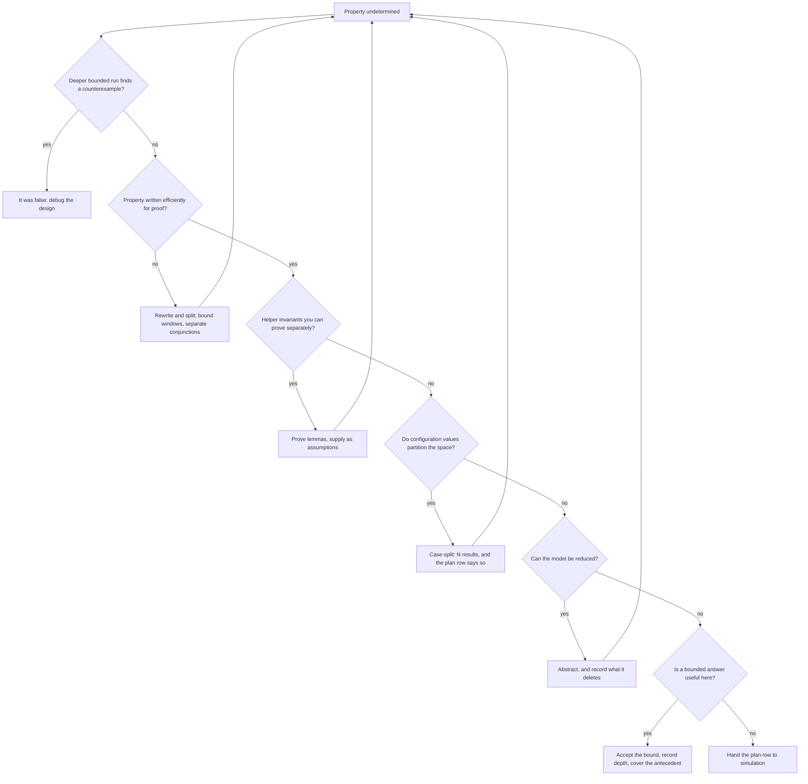

# 14. Formal Property Verification

Formal property verification checks whether a design can violate stated properties; the reference SoC's crossbar illustrates its scope after six weeks of nightly regressions with no failures. A week before sign-off review in this example, the bound protocol checker from Chapter 11 has never fired on any of the nine ports. One unexamined report value should have stopped review: on the four subordinate-side instances, `c_w_overlap` reads zero, indicating no second write address accepted while an earlier burst remains unfinished on the write-data channel. Chapter 11 identified that cover as the precondition of exactly one hazard, and in six weeks no test has produced it.

An engineer submits the unchanged checker file to a proof engine at one subordinate port. Overnight, the tool returns an eleven-cycle counterexample: two managers have writes in flight to the same subordinate, which back-pressures write data while the crossbar interleaves their data beats into one stream. Beats from two bursts get counted as one, and the count no longer matches the length promised by the address at the head of the queue. This is the book's canonical crossbar bug, which no test in six weeks came within reach of finding.

With the property unchanged, a simulator checks for violations in its runs, while a proof engine checks whether any violation is possible; on blocks of the right size, the second question is answerable in a night.

The same run returned three other results: two properties **proven**, one **undetermined**, and one proven only because an unreviewed assumption forbade the traffic that would have violated it. The chapter examines these four results, including the misleading success under an unreviewed assumption that excludes the violating traffic.

### Chapter map

§14.1 defines proof over a model, assumptions and sometimes a depth: three qualifiers, each of which can invalidate the claim.
§14.2 examines over-constrained proofs and assumption checking.
§14.3 develops bounded bug hunting by unrolling, unbounded proof by induction and the interpretation of proof depth.
§14.4 examines abstraction for convergence, sound reductions and lost bug classes; §14.5 orders the responses to an undetermined property.
§14.6 covers sign-off evidence, coverage without stimulus and formal's limits.

## 14.1 Proof and its scope

A synchronous design is a finite transition system: a set of state variables, a set of initial states, and a relation saying which states can follow which. Model checking builds that finite model and checks whether the desired properties hold in it. The states reachable from the designated initial states are computed by fixed-point analysis (the *reachability analysis*); the property is checked against that set, and an error trace is produced if it fails. It is an exhaustive state-space search which, because the state space is finite, is guaranteed to terminate [cit:B6]. Formal verification aims to establish that a design works correctly for **all** allowed inputs and **all** reachable states, by mathematical reasoning rather than by sampling [cit:P20].

A green regression establishes that none of the generated traces failed, a statement about the testbench; a proof establishes that no design trace fails.

**Four outcomes.** Complete methods distinguish two results: a property passes or fails. Capacity limits also make incomplete methods common, with three outcomes: passed, failed or unknown; even complete methods report unknown on timeout or memory exhaustion [cit:B4]. So a formal report has a vocabulary a regression report does not:

- **Proven:** no reachable state or legal input sequence violates the property. This holds subject to the three qualifiers below.
- **Falsified**: the tool produces a *counterexample* (CEX): a sequence of input stimuli leading to the failure, shown with the relevant internal signals and often with explicit don't-care values where the trace does not care what an input did [cit:B4]. The trace shows incorrect behavior and can be read much like simulation output to identify the cause [cit:P20]; unlike a regression failure, it has no irrelevant history, because the engine had no reason to generate any.
- **Bounded proof:** no violation up to *n* cycles. The guarantee covers only the near future; §14.3 explains how to interpret the bound.
- **Undetermined** (inconclusive, unknown): the tool gave up. §14.5 describes the next steps.

A `cover` behaves symmetrically. If the scenario can be hit, the tool returns a **witness**: a stimulus sequence reaching the coverage point while satisfying every stated assumption. Otherwise, the tool reports the point **unreachable under the specified assumptions**; it may also exhaust memory or time without hitting it, a distinct third outcome that can resemble the second [cit:B4]. Chapter 11 states in one line that an empty simulation cover means no test reached it, whereas an unreachable formal cover means nothing can reach it; only the second states something about the design.

### The three qualifiers

A proof describes a model under assumptions, sometimes to a depth; these qualifications limit what it establishes about the chip.

**The model.** The engine reasons about the RTL as elaborated, not about silicon, and a proof at a high level of abstraction does not establish that the lower-level details are correct [cit:P20]. A proof over RTL says nothing about the synthesized netlist (Chapter 15's equivalence checking closes that gap), nothing about timing, and nothing about the firmware that programs the block. It also says nothing about unmodeled details: if a submodule was blackboxed or a memory replaced, the proof is over the replacement.

**The assumptions.** Verification generally requires assumptions about the environment the device operates in; if the real environment violates them, the device may fail despite successful verification. Formal methods do force these assumptions to be written down [cit:P20]. §14.2 examines them.

**The depth.** If the result is bounded, the property is guaranteed only within the bound [cit:T1].

The statement *"the crossbar has been formally verified"* is therefore insufficient. For such a claim to mean anything it must come with a description of what properties were verified and at what level of detail the design was modeled [cit:P20]. An explicit form is: *these five properties, on this RTL revision, under these five assumptions, proven unbounded except one which holds to depth 78.* This chapter's sign-off table and assumption register contain exactly those figures, making the statement auditable.

### The property Chapter 11 handed over

The property introduced at the end of Chapter 11 remains unchanged:

<!-- slang: fragment - property p_no_4kb_crossing quoted again as the target of the proof, without a checker module -->

```systemverilog
property p_no_4kb_crossing;
  @(posedge clk) disable iff (!rst_n)
  (awvalid && awready && (awburst == 2'b01)) |->
    (16'(awaddr[11:0]) + ((16'(awlen) + 16'd1) << awsize)) <= 16'd4096;
endproperty
a_no_4kb_crossing : assert property (p_no_4kb_crossing);
```

In simulation this is sampled: it is evaluated on the bursts the tests happened to emit, and it is silent about the ones they did not. Bound to the DMA backend's write-address channel, the identical property lets a proof engine search for any legal programming sequence that emits a crossing burst.

The three qualifiers define the claim available at review. The *model* is the midend legalizer and the AXI backend as elaborated; it contains the splitting arithmetic where the canonical bug lives, and it does not contain the register frontend if it was blackboxed. The *assumptions* constrain descriptor arrival: assuming a positive stride deletes the negative-stride bug from the model rather than proving it absent. The *depth*, if the run was bounded, must be long enough for a descriptor to be programmed, legalized, split and emitted; a bound that never reaches the first accepted address proves the property without reaching the relevant behavior.

## 14.2 Properties and assumptions

Constraints and assertions are formal, unambiguous statements about design behavior: assertions name properties to verify, constraints name required verification conditions, and an assertion in one verification becomes a constraint in another [cit:B6]. Chapter 9 used the same object as a generator, Chapter 11 as an assertion, and this chapter as an assumption: one artifact with three roles.

In simulation an `assume` is checked exactly like an assertion; in formal it is never checked, and instead deletes traces from the model, the assertions being proved over what survives (see Chapter 11).

### Over-constraints and vacuous proofs

An assumption stronger than reality makes the engine prove properties of a model that excludes real behavior. The assertion then holds trivially, or vacuously, which may suggest complete checking when essentially nothing is verified [cit:B4]. The assertions here are SystemVerilog's, specified in IEEE Std 1800-2023, *IEEE Standard for SystemVerilog* [cit:S8]; the vacuous evaluation is defined at IEEE 1800-2023 §16.14.8 "Nonvacuous evaluations", which reads such a success as not matching the user intent and therefore as neither a pass nor a failure. Over-constraints stall simulation progress and lead to vacuous formal proofs [cit:B6].

A *missing* assumption lets the model do things the real environment never would, so the engine finds a violation that cannot happen: a spurious counterexample. In this example, investigating it costs an afternoon, but the failure is visible. An *extra* assumption produces no diagnostic; it increases reported successes.

Over-constraint has two forms, only one of which produces an obvious symptom.

**The empty model.** Two contradictory assumptions, or one conflicting with design behavior, leave no states: for example, requiring a signal to remain stable while an `always` block toggles it every cycle. Although this may suggest that every assertion should fail, all pass vacuously because the proof assumes that all assumptions hold, and that hypothesis is false. Many tools detect basic cases; a low-cost manual check is that **every assumption should have a design input or a free variable in its support**, otherwise it is likely to conflict with design behavior rather than constrain the environment [cit:B4].

**Satisfiable narrowing.** This one can reach sign-off without an obvious symptom. The assumptions are consistent, the model is far from empty, most properties still prove for the right reasons, while one clause has removed the exact traffic the interesting property was written for. Chapter 9 named this shape on the stimulus side: over-constraining whose quiet form stays satisfiable and silently deletes the feature under test. Formal aggravates this problem: simulation exposes a deleted scenario as a coverage hole because coverage measures what ran. In formal there is no stimulus to measure, so the deletion leaves no trace anywhere but in the assumption text. Overconstraining is usually not obvious and cannot always be discovered by automatic tools, which is why validating the assumptions is a task in its own right [cit:B4].

> **Scenario (the crypto engine).** The inline AES-GCM engine on the memory path carries the two properties Chapter 11 wrote for it: a key may not be loaded while an operation is in flight, and ciphertext may not be presented under an unauthenticated key. Neither proof converges because the key ladder plus the GCM datapath contains too much state, so an engineer encodes what the specification's boot sequence says: key material arrives only after authentication has completed.
>
> ```systemverilog
> m_auth_before_load : assume property (@(posedge clk) disable iff (!rst_n)
>                        $rose(key_load) |-> auth_done);
> ```
>
> Both properties now prove in minutes. **Approach.** Both results require a re-run with the assumption deleted. This one assumption deletes all traces in which unauthenticated key material enters the engine, the class `a_no_ct_unauth` checks. **Why.** A functional proof assumes a cooperative neighbor, with a buggy neighbor as the worst case. A security proof faces an adversary who knows the assumption list, so each assumption is a concession requiring a reason the attacker cannot violate it. Here no such reason exists: an attacker able to drive `key_load` is the threat itself. The boot ROM's proof should discharge this obligation; the engine's proof cannot assume it without that discharge. {ref: fpv_auth_before_load} draws the deletion on two traces.

```wavedrom
{ signal: [
  { name: "clk", wave: "p..........." },
  ["kept",
    { name: "auth_done",  wave: "01..........", node: "...b........" },
    { name: "key_load",   wave: "0..10.......", node: "...a........" },
    { name: "assumption", wave: "x..5x.......", data: ["holds"] }
  ],
  ["deleted",
    { name: "auth_done",  wave: "0...........", node: "...d........" },
    { name: "key_load",   wave: "0..10.......", node: "...c........" },
    { name: "assumption", wave: "x..4x.......", data: ["fails"] },
    { name: "ct_valid",   wave: "0.....10...." }
  ]
],
  head: { tick: 0 },
  edge: ["a-b same tick", "c-d auth low"]
}
```

{figure: fpv_auth_before_load} One assumption drawn on two traces: the kept trace rises `key_load` while `auth_done` holds, the deleted trace rises it unauthenticated, and the deletion removes every trace in which ciphertext follows an unauthenticated key.

### Discharging assumptions instead of trusting them

Because an assertion in one verification is a constraint in another, an assumption on a block's inputs should be **proven as an assertion on whatever drives those inputs** [cit:B4]. That is the assume-guarantee paradigm, under which properties of a system can be deduced from properties of its components without ever model-checking the complete model [cit:P20]; the complete model would not converge.

The crossbar reuses Chapter 11's file with one addition. The five manager-side instances of the bound checker state the AXI manager rules the crossbar is entitled to expect from the core and the DMA. These AXI4 rules come from the *AMBA® AXI and ACE Protocol Specification*, Arm IHI 0022H.c [cit:S18]. When the crossbar is proven, those same rules become its assumptions; when the DMA engine is proven, the same text is an obligation on the DMA's own output. One file, two directives, selected by a parameter:

```systemverilog
module xbar_port_checker #(
  parameter bit          ASSUME_MODE = 1'b0,   // 1 = constrain, 0 = check
  parameter int unsigned IDW = 4,
  parameter int unsigned AW  = 32
) (
  input logic           clk, rst_n,
  input logic           awvalid, awready, wvalid, wready, wlast, bvalid, bready,
  input logic [IDW-1:0] awid, bid,
  input logic [AW-1:0]  awaddr,
  input logic [7:0]     awlen,
  input logic [2:0]     awsize,
  input logic [1:0]     awburst
);
  // Chapter 11's interface model and its other properties are omitted here;
  // the ASSUME_MODE parameter and the generate below are this chapter's
  // one addition to that file.
  property p_aw_stable;
    @(posedge clk) disable iff (!rst_n)
    (awvalid && !awready) |=> awvalid &&
      $stable({awid, awaddr, awlen, awsize, awburst});
  endproperty

  if (ASSUME_MODE) begin : g_env
    m_aw_stable : assume property (p_aw_stable);
  end else begin : g_dut
    a_aw_stable : assert property (p_aw_stable);
  end
endmodule
```

The parameter records the side of the boundary under proof and locates responsibility for guaranteeing the rules.

One change is needed first, to the interface model rather than a property. Chapter 11's interface model stores accepted addresses in an unbounded queue, `logic [7:0] aw_len_q [$]`, which simulation supports but a proof engine cannot encode: §14.1 guarantees termination *because the state space is finite*. The queue must be capped at the port's outstanding-write capacity. The cap is not an assumed limit: it is a fact about the crossbar, proven on its own and handed back as a lemma (§14.5), and it reaches the sign-off package with a discharge like any other.

Sometimes an assumption cannot be discharged this way: the driving block may be too complex to prove, the signals may be driven from several blocks that would have to be pulled in together, or the driver may be third-party IP without an available model. Then the assumptions should at least be checked in simulation, and checked again in simulation of the larger model the block is integrated into [cit:B4]. That is why the crossbar's assumptions are also compiled into the SoC-level regression as ordinary assertions. An assumption checked in no engine remains unsupported.

An **assumption register** records this evidence and is reviewed like a waiver list (Chapter 7). One row per assumption, four columns: an ID, the text, who owns the behavior it describes, and how it is discharged, including what breaks if it is wrong. §14.6 puts it in the package.

## 14.3 Bounded and unbounded proof

Two engines produce almost every result; identifying the engine distinguishes an unbounded guarantee from bounded checking comparable to a night's simulation.

**Bounded model checking** *unrolls* the sequential design: for each cycle of an interval of length *k* it makes a fresh copy of the combinational logic, each copy's next-state outputs feeding the following copy's state inputs, until the whole finite-time behavior is one combinational circuit. That circuit and the negation of the property go to a satisfiability solver, which searches for a counterexample within the interval; if none is found, *k* is increased until a bug appears, the problem becomes intractable, or a preset upper bound is reached [cit:T1]. The effect is equivalent to exhaustive simulation with the same cycle bound [cit:B6].

Two consequences follow. First, bounded model checking is far more efficient at falsifying a property than at proving one, which is why bounded model checking is used mostly to find counterexamples rather than to establish correctness [cit:T1]. Second, a bounded run's success is not a proof. Bounded methods check that there is no violation with a counterexample shorter than *n* cycles from an initial state (which need not be the reset state), so they do not guarantee that the assertion is correct, only that it cannot be violated *too soon*. Tools report "the assertion has not been violated up to bound 50 clock cycles", not "the assertion passed" [cit:B4]; the verification report should preserve that wording.

If the bound is smaller than the **sequential depth** of the system (the longest shortest-path from an initial state to any reachable state), part of the reachable state space is never considered and the proof holds only for the interval. Past the sequential depth, the bounded result *is* a proof of a safety property; an unbounded eventuality needs more than that, because a counterexample to it is a loop rather than a finite path. This is usually unavailable: extending the interval that far is infeasible both because the solver's cost grows and because computing the sequential depth is itself hard [cit:T1].

**Induction** is the other route to an unbounded answer, and bounded model checking extends to unbounded model checking precisely through it [cit:B6]. Induction unrolls from an *arbitrary* state characterized by a predicate *P*, instead of fixing the initial state at reset. If every reset state satisfies *P*, and every interval that starts in a state satisfying *P* both upholds the property and ends in a state satisfying *P*, then *P* is an invariant and the property holds for arbitrarily long time frames rather than just the examined interval, with a computation no longer than a bounded one. The first condition prevents an empty argument: *P* = `false` is also closed under transitions but establishes nothing.

The new failure mode can cost weeks of work. Such proofs are conservative: they never report a property to hold when it does not. But if *P* over-approximates the reachable state space, the engine starts intervals in states the design can never occupy and produces **spurious counterexamples** from them. The remedy is a *strengthened invariant*: additional assertions, found by inspecting the design or automatically, that rule those impossible starting states out [cit:T1].

The first counterexample check is whether the design could occupy the state at cycle zero. A FIFO whose occupancy counter reads 7 while its two pointers are equal; a one-hot state vector with two bits set; an outstanding-transaction count of 3 on a port that holds at most 2. Each observation becomes a helper assertion, proven independently and then supplied as an invariant. Chapter 11's redundant-state invariants thus serve a second purpose: the facts written to catch silent simulation corruption also support the proof engine. {ref: fpv_induction_start_state} draws the FIFO case against a trace from reset.

```wavedrom
{ signal: [
  { name: "clk", wave: "p........." },
  ["from reset",
    { name: "wr_ptr",    wave: "222.......", data: ["0", "1", "2"] },
    { name: "rd_ptr",    wave: "2...2.2...", node: "......a...", data: ["0", "1", "2"] },
    { name: "occupancy", wave: "222.2.2...", node: "......b...",
      data: ["0", "1", "2", "1", "0"] }
  ],
  ["induction",
    { name: "wr_ptr",    wave: "3.........", data: ["5"] },
    { name: "rd_ptr",    wave: "3.........", data: ["5"] },
    { name: "occupancy", wave: "4.........", data: ["7"] },
    { name: "invariant", wave: "4.........", data: ["fails"] }
  ]
],
  head: { tick: 0 },
  edge: ["a-b empty"]
}
```

{figure: fpv_induction_start_state} Induction starts an interval at an arbitrary state, so cycle 0 can hold an occupancy of 7 with the two pointers equal, which no trace from reset reaches; the helper invariant, proven on its own, deletes that start state.

### Reading a depth number

Because a bound is only meaningful against the length of the behavior under investigation, the number in the report has to be compared with an independent arithmetic calculation. For a pipelined design, a bound equal to or a little larger than pipeline depth is usually enough [cit:B4], but most properties of interest do not follow the pipeline structure.

The example uses one run on the DMA engine's backend, bounded at 40 cycles, and two of Chapter 11's properties that sit on it: one from the internal-invariant module, one from the port checker bound to the backend's own AXI manager port.

- `a_no_overflow` guards a datapath FIFO of 16 entries. Filling it takes at least sixteen pushes with no intervening pop, so the interesting state is reachable well inside forty cycles, and the paired `c_full` cover confirms it with a witness, making 40 a generous bound.
- `a_w_burst_len` reconciles the beat count with the address's promised length, but only at `WLAST`. The engine's maximum burst is 256 beats, so a maximum-length burst's `WLAST` cannot arrive until its 256th data beat has been handshaken. Inside a 40-cycle interval no burst longer than about forty beats can have completed at all. The property is proven for short bursts and completely silent about long ones.

These two properties therefore obtain different evidence from the same block, run and bound. One cycle can be decisive: the crossbar's interleaving counterexample in this chapter's opening is eleven cycles long, so a run stopped at ten would have reported *not violated up to 10 cycles*, misleading if filed as proof. {ref: fpv_w_burst_len_cex} draws that counterexample beat by beat.

```wavedrom
{ signal: [
  { name: "clk",       wave: "p..........." },
  { name: "aw source", wave: "x2x3x.......", data: ["A", "B"] },
  { name: "promised",  wave: "x2x2x.......", data: ["2", "2"] },
  { name: "w_hs",      wave: "0.....101010" },
  { name: "w source",  wave: "x.....2x3x2x", data: ["A", "B", "A"] },
  { node: "......c.d.e." },
  { name: "counted",   wave: "2.....3.4.5.", data: ["0", "1", "2", "3"] },
  { name: "wlast",     wave: "0.........10", node: "..........a." },
  { name: "burst_len", wave: "5..........4", node: "...........b",
    data: ["holds", "fails"] }
],
  head: { tick: 0 },
  edge: ["c<->e A's beats", "a~>b one tick"]
}
```

{figure: fpv_w_burst_len_cex} The counterexample a proof engine returns: the crossbar interleaves a write-data beat from manager B between manager A's two beats, so the port checker counts three beats against the two the address promised, and `a_w_burst_len` fails at cycle 11.

A low-cost check adds one directive per property: **the antecedent or guarded state should be covered under the same bound before accepting a bounded pass.** Every related cover point must land below the bound to validate that it is not optimistic [cit:D31]; without a witness, the bounded proof has not reached the relevant behavior.

> **Scenario (the sensor hub).** The always-on sensor-fusion block lives on the 32 kHz island and wakes a DSP running at system speed. The obligation under proof is a wake-path latency: from an asynchronous sensor event, the DSP must have its first sample within a fixed number of *slow* ticks. Measured in fast-clock cycles, a handful of 32 kHz ticks is tens of thousands, and no bounded run reaches the interesting behavior. **Approach.** Rather than increase depth, the proof should use the slow-domain state machine, reducing the fast domain to its handshake interface and clocking the property on the slow clock so a tick is its natural unit. **Why.** Depth depends on the measurement clock, so the slow-clock model measures this wake-path obligation in slow ticks. The record must state that synchronizer and metastability behavior at the boundary is outside the reduced model and remains subject to static clock-domain-crossing analysis (Chapter 13).

## 14.4 Abstraction and excluded behavior

For a proof to complete, the model must be small enough for the tool to finish within the CPU and memory available; this usually means verifying at a relatively abstract level, or verifying relatively small subsystems separately, and doing it with an expert's insight into both the design and the engine [cit:P20]. Abstraction is therefore fundamental to formal verification.

Every reduction changes the model's possible behaviors; the direction determines which results may still be trusted:

- **Over-approximation** adds behaviors. The abstract model is simpler than the original and allows more traces; if the assertion is proven on it, it also holds on the original. If the assertion fails, the counterexample may be *spurious*, impossible in the real design. Over-approximation is **sound**: a success is always accurate [cit:B4].
- **Under-approximation** removes behaviors. A failure is always real, so it is **safe**, but a pass means nothing, which is why tools that use it say "not violated up to bound 50 clock cycles" rather than "passed" [cit:B4].

The practical hazard of over-approximation is human rather than logical. Classifying each counterexample manually is difficult when many are spurious; in this example, skimming after twenty impossible traces misses a real twenty-first trace. Reduction gains capacity at the cost of analyzing spurious failures [cit:B4].

### Manual reductions and their implications

Tools automatically prune most irrelevant logic: anything outside a property's cone of influence is excluded. Manual reduction is needed only for signals that affect the property or the assumptions indirectly, which is precisely why it takes detailed knowledge of the design [cit:B4]. Three manual reductions cover most needs, with different implications:

- **A free signal** (*cutpoint*) is disconnected from its fan-in and can take any value at any time. Over-approximation: sound, not safe. A cutpoint is appropriate when a property must hold for *every* value of some input, because a property proven with a signal free is thereby proven for the correct values too, so the cut strengthens the result [cit:D13]. Blackboxing a submodule is the same lever applied to all its outputs at once.
- **An input set to a constant** under-approximates: safe, not sound. Useful for making a data path tractable: to verify propagation through a queue it can be enough to watch a single bit and tie the rest to zero.
- **An internal signal set to a value** may both forbid original behaviors and add new ones, so it is neither safe nor sound [cit:B4]. Each legitimate use needs a recorded justification.

For memories and wide arithmetic there is a fourth move: retain symbolic reasoning on the control logic and treat memory accesses or arithmetic operators as uninterpreted: a black box whose only property is that equal inputs give equal outputs [cit:B6].

A tile-based mobile GPU's memory-ordering rules specify which writes a shader cluster may observe out of order; enumerating its megabytes of unified memory is infeasible. Two reductions make it unnecessary, and they are justified differently. For the values half, the rule does not depend on any stored value, so the memory can be uninterpreted without losing anything the rule concerns. The address reduction makes the model tractable and needs a separate argument: the rule is a relation over a *pair* of locations, so a model carrying two symbolic addresses (a write to one ordered against a write to the other, as seen by a second cluster) states it exactly, while every other location stays free. Two addresses are minimal: one deletes the property because no second write remains to order against. The reduction must be recorded when made: an ordering violation that appears only across a third address or a third cluster goes to system-level simulation.

### The canonical proof abstraction: two caches, one address

The coherent hub illustrates a state space too large to bound: the product of every line's MESI state in every cache, for every address. Chapter 11 introduced one invariant for proof: at most one cache may hold a line Modified.

<!-- slang: fragment - assertion a_single_writer quoted again as the hub invariant; modified_vec is internal design state, not a port of this excerpt -->

```systemverilog
a_single_writer : assert property (@(posedge clk) disable iff (!rst_n)
  $onehot0(modified_vec));
```

The proof uses two caches and one address, sufficient because the invariant is per line. The reduction preserves the directory's transition rules for a line, every race between two requesters for it, the ordering of invalidations against data responses, and (since livelock occurs on a single contended line) starvation of one requester by the other. The reduced model retains these coherence behaviors; the exclusions below need separate coverage.

Arm IHI 0050, the *AMBA CHI Architecture Specification*, Issue H (2025), gives a coherent interconnect a seven-state cache model, separates the snoops from the data responses onto four link-layer channels in its Table B13.1, and specifies the cache state transitions twice over, once at a requester and once at a snooped cache, as a table per transaction type [cit:S26]. The reduction keeps all of that for the one line it models; what it drops is the product across lines, caches and addresses.

The excluded behavior must be recorded during reduction, since reconstructing it three months later is unreliable:

- **Anything needing a second address.** The classic coherence deadlock, two agents acquiring two lines in opposite orders, is excluded by construction.
- **Anything needing capacity.** With one address there are no conflict evictions, so a writeback triggered by replacement rather than by a snoop is outside the model.
- **Anything needing a third sharer**, including the directory's own sharer-vector encoding and its overflow behavior.

Reducing the hub's many caches to two is **not** sound in the sense defined above. Freeing and setting have a defined direction of error; deleting requesters has none in general. Reducing the requester count is neither a subset nor a superset of the original behavior but a different parameterization of it (a narrower sharer vector and arbitration over a smaller set), so neither implication direction is available. The reduction is a modeling decision justified by a *symmetry argument* (that the hub treats its requesters interchangeably), and that argument is a claim about the RTL rather than a theorem. If the arbitration inside the directory is fixed-priority by requester index, it is simply false, and the two-cache proof will never show the lowest-priority requester starving behind the others. The claim must be checked in the code before use and recorded in §14.2's assumption register with the other unproven premises. An abstraction argument is an assumption in every sense except the syntactic one.

Entirely avoiding lost bugs would require an abstraction that kept everything, which would not converge. Each deleted bug class must be named when removed and assigned another detection method. On the hub, the two-line deadlock goes to a separate, differently-abstracted proof; the eviction path goes to system-level simulation with a cache-thrashing traffic profile; the sharer-vector overflow goes to a directed test. Each becomes a plan row reading *not covered by proof P-COH-2; covered by …* (Chapter 5's traceability, and Chapter 16's division of labor). A proof's value as evidence depends on explicitly listing its deletions.

Writing the model can itself be a review of the specification. A published Isabelle/HOL formalization of CXL.cache, the inter-device coherence protocol of the Compute Express Link standard, was built from the standard's English prose and used to prove a single-writer-multiple-reader property over that model: an invariant of nearly eight hundred conjuncts against sixty-eight transition rules, and so more than fifty thousand lemmas to discharge. Its authors report that the more useful output was a list of places where the prose was unclear, ambiguous or inaccurate, nearly all of which the CXL consortium has tentatively accepted for adoption [cit:P27].

## 14.5 Convergence: the undetermined property

A result is inconclusive when the tool times out, runs out of memory or uses an algorithm incomplete by construction. Getting a conclusive answer means refining the verification model: a more aggressive or more effective abstraction, a smaller model, auxiliary assertions (**lemmas**, which may be easier to prove and, once proven, can be supplied as assumptions for the original property) or simply different tool options [cit:B4].

The order below differs from this list and can reduce a fortnight's work to an afternoon in this example.

**1. Property validity.** Deep bounded checking should precede invariant development. An undetermined property is sometimes a false one whose counterexample is simply further out than the last attempted bound, and, in this example, finding it costs one overnight job instead of a week of strengthening.

**2. Property formulation.** In simulation an inefficient assertion costs runtime; in formal it can be fatal, because a session with an inefficient assertion may return no conclusive result at all, and where one text must serve both engines, the form efficient for formal should win [cit:B4]. Unbounded eventualities, sprawling antecedents and wide equality chains are the usual offenders. Rewriting costs little relative to the subsequent steps.

**3. Separate assertions.** Asserting five things together combines five proofs under one worst case. Separating them lets most close; the report can identify the one unresolved property alongside four successes.

**4. Proven lemmas.** This is §14.3's invariant strengthening used deliberately rather than reactively: facts about internal state believed by the engineer but not known to the engine (a queue's occupancy matches its pointers, a state vector is one-hot, an outstanding counter never exceeds the port's capacity) are each proven independently and supplied to the difficult proof as assumptions. Only these assumptions need no further discharge, because they have already been proven.

**5. Case splitting.** After showing configuration-register values partition the space, the property is proven separately for each value; the plan row must record *N* results. **6. Abstraction** is the last model-changing step because it incurs §14.4's exclusions. **7. A bounded result** is acceptable with depth recorded and its antecedent covered under the same bound. **8. Simulation closure.** The plan row is handed to simulation and closed there. This is a legitimate outcome; refusing it can consume a whole schedule on one property. Four steps change the problem and restart the process on a smaller version: rewriting, lemmas, case splitting and abstraction. {ref: undetermined_triage} connects these choices to the result of each attempt.



{figure: undetermined_triage} The order to work an undetermined property in, drawn as a decision tree: ask whether the property is false before strengthening anything, then whether it was written for a proof engine, then split it, then lemmas, then a case split, then abstraction — whose bill §14.4 states — and then a bounded answer, with handing the plan row to simulation as the last exit rather than a defeat. The four moves that loop back to the top, rewrite and lemmas and case split and abstraction, change the problem instead of answering it and return you to it smaller, which is why the tree is drawn in the order experience puts the menu rather than the order the menu is written in.

Tool options also affect convergence. Measured across seven hundred and thirty hardware model-checking competition instances at a one-hour limit, the way a property-directed-reachability engine generalizes its proof obligations determined which instances it could solve at all, and each strategy solved instances the others missed, which supports running several methods in parallel [cit:P26].

### When formal is the right instrument

Formal has two resource models; conflating them risks over-investment or dismissal after one unsuccessful week.

**Lightweight formal** asks only for adequate input assumptions, the most difficult and effort-consuming step; running the tool then resembles running a simulation. Early runs with small bounds remove obvious bugs before a simulation environment exists, saving time at the start of the schedule [cit:B4]. This flow is within a verification engineer's competence; the specialist requirement belongs to exhaustive formal. A published test deliberately inverted the staffing: at Intel, on a live graphics project, property verification was pushed out of the central formal group to the *design* engineers, 85 of whom were trained inside two weeks and then supported by onsite consultancy for a further four, and the drive found 82 interesting bugs across twelve weeks despite starting only after a major dynamic-verification milestone had already completed; the simulation environments were already stable and reporting no failures [cit:D18].

**Exhaustive formal** is a full-time job: model reduction and pruning, hand-written abstract models for parts of the design, checking that the specification is complete, iterative refinement, algorithm tuning. That cost is worth paying only where correctness is critical and simulation unreliable: arithmetic units such as multipliers and dividers, arbiters, coherency managers, branch predictors, critical controllers, bus protocols [cit:B4]. Reference SoC targets include crossbar ordering and routing, DMA legalization arithmetic and the event unit's interrupt priority resolution. Chapter 10 reached the same conclusion from stimulus: when the specification *is* a property set, constrained-random generation samples what proof establishes.

Equivalence-checking measurements show the same split. One DVCon paper from Arm and Mentor reports proving floating-point units of an Arm CPU design sequentially equivalent to their C reference models and publishes the human cost: two days of proof development for the adder against two months each for the multiplier, the divider and the square root [cit:D37]. Another, from Intel's graphics organization, runs the same C-versus-RTL comparison before the design is complete and with the full-coverage claim deliberately dropped, and reports eighteen bugs across the C++ model and the RTL in under a week's effort [cit:D38].

> **Scenario (the video codec).** A team with proof capacity proposes a critical, hard-to-verify H.265-class encoder as a formal target. **Approach.** The encoder should be divided, with only one half assigned to property verification. The rate-distortion decision path is data-dependent control over a wide bit-exact datapath whose specification *is* a reference model; there is no compact property that says "this is the correct macroblock", and any attempt to write one reproduces the reference model in SVA. That half belongs to golden-model comparison in simulation, and its arithmetic blocks to the equivalence checking of Chapter 15. The other half contains formal targets: a frame is never emitted before its last slice completes, the line buffer is never read past what has been written, a bitstream packet's length field always matches the bytes that follow. **Why.** In this encoder, the bounded-state rules are property-verification targets; the data-transformation path is checked against its reference model.

## 14.6 Formal sign-off

At sign-off, a proof supports a plan row that must specify its evidence. A formal testbench is ready for sign-off when it can answer three questions: completeness of end-to-end checkers, absence of unintentional over-constraints and attainment of required proof depth by all checkers [cit:D31]. These restate §14.1's three qualifiers, model, assumptions and depth, from the reviewer's perspective.

### Coverage when there is no stimulus

Simulation coverage measures what tests exercised. Proof has no tests; formal coverage has four meanings, each answering a different question [cit:D11].

**Cone-of-influence coverage** takes the union of the cones of all asserted properties and reports the design space outside it. This inexpensive structural measure identifies logic without any check; areas outside every cone contain verification holes. The response should be more properties or a reviewed waiver naming the plan item covering that logic. It cannot establish closure: proving an assertion does not verify its whole cone.

**Input stimuli coverage** ignores the assertions and measures what the *constraints* let the engine reach, reporting code that is uncoverable only because of them; this turns §14.2's over-constraint hazard into a number. In the reported case, one line was uncoverable because a single setup command in a tool script held an enable low. It had been proven nowhere and checked in no simulation, and it would have survived any number of manual reviews [cit:D11].

**Bounded proof coverage** measures how much of a property's cone is reachable within the current bound, and supplies the stopping rule §14.3 left as judgment. If a bounded proof covers very little of its cone, the bound is not good enough to sign off on; and when two days of engine time between bound 10 and bound 11 adds no newly covered condition, the proof should use abstraction instead of further depth increases [cit:D11].

**Proof core coverage** provides the most precise structural measure at the highest cost. Engines abstract internally, so the logic actually used to establish a proof (the proof core) can be much smaller than the cone, and a bug outside the core but inside the cone will not be caught by that assertion even though it is fully proven [cit:D11]. Practitioners warn that such vendor-specific metrics are smarter than simulation code coverage and correspondingly harder to interpret [cit:D13]. The analysis should target a handful of highest-value properties rather than the entire suite.

### Grading the property set by breaking the design

All four models are structural: they say which logic was involved, not whether a check would have noticed a change to it. **Mutation** provides an empirical complement: a deliberate design defect should make some assertion fail [cit:D13]. It is Chapter 8's known-bad variant and Chapter 11's mutation question, applied to a proof.

At a DAC challenge in 2015, attendees inserted 73 functional bugs into a crossbar with an existing formal testbench; every one triggered one or more checkers. Two further changes failed nothing: one had no functional impact at all, a loop bound rewritten to save area, and the other had been inserted specifically to evade the methodology, which the authors classify as a non-bug on the grounds that a determined adversary can always do that [cit:D31]. Mutation grades the property set against designer bugs rather than adversarial changes. Chapter 23's threat model is a different instrument.

### Completeness and its cost

Chapter 3 introduced a stronger criterion for verification gaps. It asks whether the properties **determine the outputs**. To exclude verification gaps it is enough to establish that, for every input trace, exactly one output trace satisfies the conjunction of the properties; in other words, that the engineer fixed the output value at every point in time. If not, the verification must be improved [cit:T2].

Real interfaces require a refinement of this otherwise excessive criterion. Protocol specifications routinely leave signals free outside their valid windows, and those values may legitimately change with an area or power optimization, so a verification that checks them is checking the wrong thing. The permitted freedom is made explicit through *determination conditions* (assumptions saying which input traces count as the same, commitments saying which output traces do), so completeness is judged only where the specification actually commits. Across a published list of commercial projects using complete verification and its less mature predecessors, almost all the verified circuits functioned properly after fabrication, and in the few projects where a fault was overlooked the escape was traced to human failure in applying the methodology: wrong constraints that masked errors, or an inaccurate description of expected output behavior that accepted a real fault [cit:T2]. Chapter 3 identifies the cost: a different property-writing method, a dedicated methodology and effort concentrated on selected modules.

Verification of this kind, with the completeness check run as an automatic step, was in regular productive use at Siemens and at Infineon from 1999 onwards; the published project list's only named part is the Infineon TriCore2, a superscalar 32-bit automotive processor, alongside AHB master, slave, bridge and multilayer bus interfaces and an AXI interface, and on those projects experienced engineers verified 2,000 to 4,000 lines of RTL per person-month, with a recorded best of 8,000 [cit:T2]. The author reports that almost all the circuits verified this way worked after fabrication, and attributes the escapes that did occur to the methodology being misapplied rather than to the criterion being too weak.

### Sign-off package contents

The reviewer needs the following evidence:

1. **The property list with per-property results**: proven, falsified-and-fixed, or bounded with its depth stated as a number.
2. **The assumption register** of §14.2, with each row's discharge status: proven on the driving block, checked in simulation, or accepted with a written argument.
3. **The required proof depth** for every bounded result, with its derivation. The calculation combines latency analysis, micro-architectural analysis (how many transactions must pass to exercise the arbiter), corner-case analysis, plus margin. On an 8×8 crossbar it came to 13 cycles: one cycle of design latency, an input sequence long enough to push eight same-priority requests through the arbiter (the last of them visible at the target at cycle 11), plus one cycle for back-pressure and one for a safety net. Because the engine reports the *shortest* path to failure, no input sequence beyond that depth represents a scenario not already covered inside it [cit:D31], provided the corner-case enumeration behind it is complete, so review must examine the enumeration as well as the arithmetic. Two cross-checks make the number defensible: every related cover witnessed below the bound, and a bound exceeding the longest counterexample the project has ever seen on that block [cit:D13].
4. **Formal coverage evidence** for whichever of the four kinds were run, with waivers for uncovered logic.
5. **The abstraction deletion list** from §14.4, each entry pointing at the plan row that covers it elsewhere.
6. **The provenance**: RTL revision, property-file revision, tool build and engine settings. The proof must be reproducible.

### Worked example: the crossbar's formal row in the sign-off package

{ref: crossbar_formal_rows} records the crossbar properties and the evidence each contributes to sign-off.

{table: crossbar_formal_rows} The crossbar's formal results in the shape a sign-off package presents them: one row per property binding, with the verdict, the proof depth where the result is bounded, the assumptions the row leans on by ID, and a note. The columns are chosen so that nothing can hide behind a green tick — the third row records a property that was false and fixed before it was proven, the fourth is the only bounded result and therefore owes a derivation of its depth, and the fifth was proven only under an assumption withdrawn at review, so the row leaves formal for a directed simulation sequence.

| Property (binding) | Result | Depth | Assumptions | Note |
|---|---|---|---|---|
| `a_aw_stable` (4 subordinate-side) | proven | unbounded | A2 | the crossbar's own stability toward each subordinate |
| `a_b_id_outstanding` (4 subordinate-side) | proven | unbounded | A2, A4 | |
| `a_w_burst_len` (4 subordinate-side) | falsified → fixed → proven | unbounded | A2, A4 | CEX 11 cycles; bug #217 (Chapter 4), this chapter's opening |
| `a_grant_within_64` (arbitration, per manager port) | bounded pass | 78 | A1, A2, A3 | window and depth derived below; antecedent cover at 12 |
| `a_b_order` (response ordering, per manager port) | proven under A5; undetermined without it | — | A2, A5 | A5 withdrawn at review; row handed to simulation as a directed multi-ID sequence |

{ref: crossbar_assumption_register} records the environmental premises on which those results depend.

{table: crossbar_assumption_register} The assumption register those results lean on: the five assumptions by ID, the party that owns each one, and how each was discharged. The discharge column is what the proofs are worth — A1 is discharged three different ways across the four subordinates, A4 was proven on the crossbar itself and supplied back as a lemma, A3 rests on simulation alone, and A5 was added during debug to make a property converge, was never reviewed, and is withdrawn at sign-off.

| ID | Assumption | Owner | Discharge |
|---|---|---|---|
| A1 | every subordinate accepts an address within 16 cycles — a project constraint, not a protocol requirement | subordinate owners | proven as an assertion on the SRAM subordinate; checked in SoC simulation for the APB bridge (*AMBA® APB Protocol Specification*, Arm IHI 0024, Issue E, 2023, chapter 3, "Transfers") [cit:S19] and the neural accelerator; the boot ROM's port is always ready, discharged by construction |
| A2 | the five managers obey the AXI manager rules (Arm IHI 0022H.c §A3.2.1 "Handshake process", §A3.4.1 "Address structure", §A5.2.2 "Write data ordering") [cit:S18] | DV | the same bound checker with `ASSUME_MODE = 1` on the manager ports; the identical text is *asserted* on the DMA and core in their own proofs |
| A3 | no manager stalls its own responses indefinitely | DV | **simulation only** — if false, the response buffers fill and A1 fails behind them, so `a_grant_within_64` does not hold; accepted, revisit if arbitration changes |
| A4 | at most one write address outstanding per manager at each subordinate port | design | **proven on the crossbar itself**, then supplied back as a lemma; it bounds the checker's address queue to five entries. Two managers with one write each still overlap, so the opening's bug stays in the model |
| A5 | each manager keeps at most one write outstanding per ID | DV | **none** — added during debug to make `a_b_order` converge, never reviewed. Withdrawn at sign-off |

Row four, the only bounded result, needs the derivation required by item 3. *The obligation* distinguishes two readings of "grant" by A1: an offered manager-port write address must be granted by the target subordinate's arbiter within 64 cycles. The address handshake that follows is a separate obligation, bounded by A1, and not what this property claims. *The contention model* makes the row falsifiable: all five managers may want one subordinate at once, the arbiter is round-robin and sees a request in the cycle it is offered, and a grant is held until the subordinate accepts the address, sixteen cycles at worst, by A1. *The window* is 4 × 16 = 64: each of the other four managers is served at most once ahead of this one and holds the target address port for at most sixteen cycles. *The depth* is derived from the window: the antecedent (five requests pending at one subordinate) is first witnessed by its cover at cycle 12, so the shortest counterexample this property admits is 76 cycles long, and the two cycles of margin above, one for back-pressure and one for a safety net, put the run at 78. There is no latency term, because the obligation ends at the grant, not at the subordinate's port. Chapter 11's unbounded rule states that a request is eventually granted, which a proof engine decides; sign-off records the bounded restatement so a reviewer can recompute it.

A1 makes the wait finite only in this row. Rows two and three check pure safety, an unsolicited response and an incorrect beat count; subordinate acceptance speed cannot affect their truth, so they exclude A1. What they need is A4, the lemma that keeps the checker's queue finite. Assumptions must be derived per row; copying the column gives unsupported evidence.

A3 and A5 explain the second table's importance at review. A3 was a known concession accepted with an argument. A5 was added mid-debug for convergence and never reviewed; with one response per ID in flight, no pair remained to order, so `a_b_order` proved a rule over traffic A5 had deleted. As Chapter 7 states, full proof under over-constraints leaves a verification gap, so review must examine assumptions rather than checkmarks.

### In practice

An organization must distinguish formal's two streams. Designers should run lightweight proofs on their own blocks in the first weeks after RTL compilation, before a simulation environment exists. A much smaller group should run exhaustive proofs on selected blocks. On IC/ASIC projects, formal property checking adoption grew at 5.8 percent CAGR through 2024, while automatic formal applications, Chapter 15's packaged checks requiring no property writing, grew at 8.7 percent [cit:R2]; FPGA projects had a combined 7.5 percent CAGR [cit:R1]. The half requiring no property-writing expert grew faster; the other half still depends on that expertise.

With nightly RTL changes, a six-week-old proof describes an obsolete design; formal should therefore run periodically in continuous integration like a regression tier (Chapter 12), treating newly undetermined properties as failures. An assumption added on a Friday for debug convergence can remain until sign-off; the assumption register and named owner should prevent this accumulation. One industrial effort found that an environment assumption blocking proof could be eliminated by adding a small amount of arbitration logic, concluding that designing for provability yields shorter proofs and simpler designs [cit:P20]. Design review should address provability while changes remain inexpensive.

### Pitfalls

1. **Reading a bounded pass as a proof.** Symptom: the report says "proven" where the tool said "not violated up to *N* cycles". Cure: every report should include depth and its derivation for the block.
2. **An assumption removing the property’s precondition.** Symptom: a property that would not converge for days proves in seconds shortly after an assumption was added. Cure: delete that assumption and re-run; if the property collapses, the assumption was doing the proving.
3. **Waiving a counterexample.** Symptom: "we know our managers never do that", and the failure is dismissed. Cure: the waiver must become an explicit, reviewed assumption; tools report one counterexample rather than all, and several bugs can violate the same assertion, so dismissing the failure without an explicit assumption leaves the second hidden behind the first [cit:D13].
4. **Abstracting without a deletion list.** Symptom: a proof that now converges, and no record of what left the model. Cure: the deletion list should be written during reduction, with another coverage destination for each behavior.
5. **Spurious counterexamples masking real failures.** Symptom: an over-approximated model produces impossible traces and the team starts dismissing failures by reflex. Cure: the invariant should be strengthened until traces are real; an apparent twenty-first spurious trace is not necessarily spurious.
6. **Proof effort misaligned with risk.** Symptom: a growing property count concentrated on decode and register logic, with the ordering and arbitration rules untouched. Cure: proof coverage should be compared with the plan's risk priorities.

### Summary

- A proof is a statement about a model, under assumptions, sometimes to a depth. "Formally verified" without those three qualifiers is not a claim [cit:P20].
- A formal report distinguishes four outcomes rather than two; a bounded pass, the one most often mistranslated, establishes only that the property cannot be violated too soon [cit:B4].
- Assertions and constraints are one artifact with two directions. In formal an assumption is never checked; it deletes traces, and an over-constrained model produces vacuous proofs that look exactly like real ones [cit:B6].
- A missing assumption produces a spurious counterexample, while an extra one produces no warning. This asymmetry makes the assumption list the sign-off review target.
- Abstraction is fundamental to formal verification. Over-approximation preserves proofs and can fabricate failures, under-approximation preserves failures and cannot prove anything [cit:B4].
- Convergence work has a cheapest-first order: check the property is true, check it was written for a proof engine, split it, prove lemmas, case-split, abstract, accept a bound, stop.
- Formal coverage measures four aspects: cone of influence, input stimuli, bounded proof and proof core; none establishes whether a check would have caught a change. Only mutation does [cit:D11,D13].

### Exercises

**Exercise 14.1 (calculation).** §14.3 puts one bounded run on the DMA engine's backend and hangs two of Chapter 11's properties on it, at the single bound the section states. Give a lower bound on the number of cycles in which that run could reach the guarded event of `a_w_burst_len` on a maximum-length burst, using the beat count §14.3 gives for the engine's maximum burst, and express the part of the burst-length range the run does reach as a fraction of that maximum. Compute the number of pushes that reaches the guarded state of `a_no_overflow` from the FIFO depth §14.3 gives, and state which of the two properties satisfies the low-cost check §14.3 attaches to a bounded pass.

**Exercise 14.2 (calculation).** The worked example of §14.6 builds the depth of its only bounded row from a contention window, a witnessed antecedent cover and a margin. Recompute the window and the depth on the supposition that the acceptance bound stated by assumption A1 is halved, holding the manager-port count, the arbitration policy and the witnessed cover cycle as §14.6 states them. State which term of the derivation is unchanged by that supposition and why, and give the reason §14.6 puts no latency term in this row.

**Exercise 14.3 (judgement).** A reviewer is offered the coherent hub's two-cache, one-address proof with the argument that a reduction can only add behaviors, so a success on the reduced model carries to the full hub. Decide what §14.4 licenses in that argument and what it does not, keeping the address reduction and the requester-count reduction apart. Name the premise §14.4 says the requester reduction rests on, state where §14.4 requires that premise to be recorded, and give the arbitration implementation that makes it false.

**Exercise 14.4 (judgement).** A team offers proof core coverage, run over every property in its suite, as evidence that the property set would notice a change to the crossbar's arbitration logic. Decide what the four coverage kinds of §14.6 establish as a class and what none of them establishes, and name the instrument §14.6 assigns to the question the team is actually asking. State the scoping §14.6 gives for proof core analysis, with the two reasons it gives for that scoping.

**Exercise 14.5 (artifact).** Read the two-run record below, kept for one response-ordering property on a manager port of the crossbar. State what the cover result establishes about the assumption added between the two runs, and name the form of over-constraint of §14.2 that the record exhibits. Name the low-cost manual check of §14.2 that this assumption passes despite the cover result, and give the step of §14.5 the record shows was skipped. Give the discharge status and the disposition §14.6 records for an assumption in this condition.

```text
property           a_b_order (response ordering, manager port)
run 1              undetermined after eight hours
change             assumption m_one_outstanding_per_id added
run 2              proven, unbounded, elapsed 00:00:41
cover c_b_pair     two responses of the same ID in flight: no witness
support of m_one_outstanding_per_id    awvalid, awid (design inputs)
review of m_one_outstanding_per_id     none
```

### Further reading

Within the corpus, [cit:P20] surveys formal verification and the required content of verification claims, while [cit:B4] Chapter 20 gives practical definitions of counterexamples and witnesses, complete and incomplete methods, over- and under-approximation, pruning, lightweight and exhaustive flows, and assume-guarantee. [cit:B6] places model checking and bounded model checking among formal techniques and explains constraint/assertion duality; [cit:T1] treats bounded and unbounded proof, sequential depth and spurious counterexamples from arbitrary initial states in induction; [cit:T2] presents the corpus's strongest completeness argument. For industrial practice, [cit:D31] is a sign-off methodology worked end to end on a crossbar, with a required-proof-depth derivation and a mutation experiment; [cit:D11] defines the four formal coverage models; [cit:D13] tours complexity management (cutpoints, black-boxing, counter abstraction) and the traps around waivers and coverage metrics.

Outside the corpus: E. Seligman, T. Schubert and M. V. Achutha Kiran Kumar, *Formal Verification: An Essential Toolkit for Modern VLSI Design*, is the standard book-length introduction to the practice this chapter describes, and E. M. Clarke, O. Grumberg and D. Peled, *Model Checking*, remains the canonical text for the algorithms deliberately left inside the tool here.
