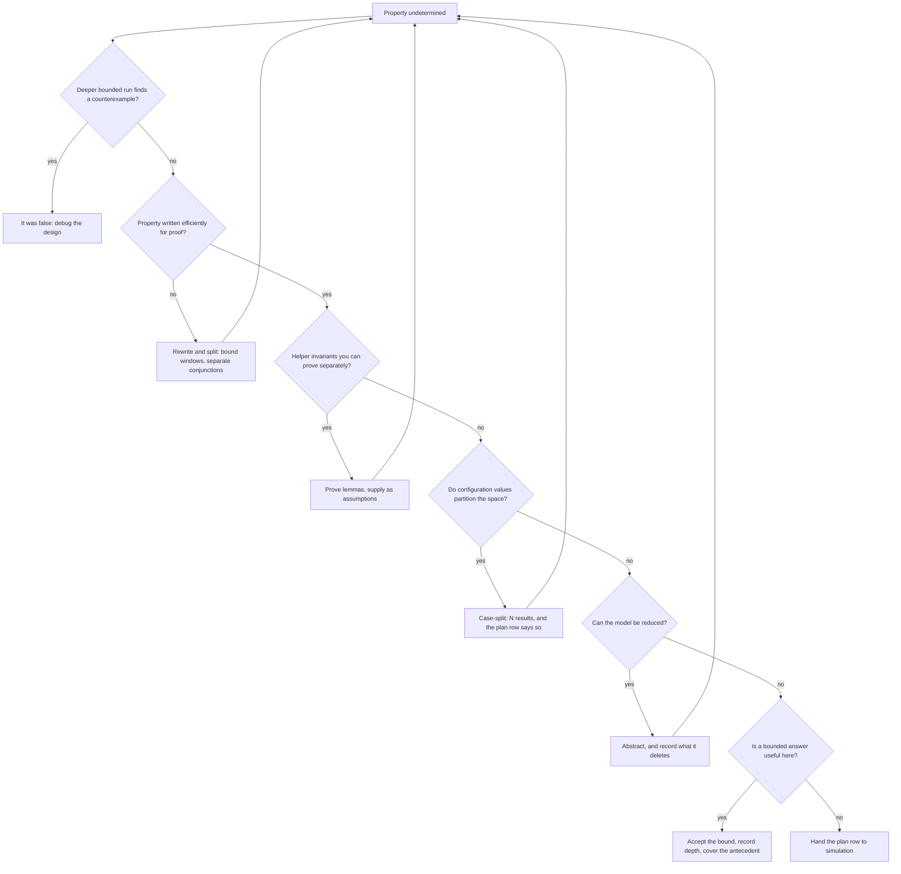

# 14. Formal Property Verification

Six weeks of nightly regression on the reference SoC's crossbar, and every night is green. The bound protocol checker from Chapter 11 sits on all nine ports, its assertions have never fired, and the block is a week from its sign-off review. One number in the report should have stopped the review, and nobody has looked at it: on the four subordinate-side instances, the cover `c_w_overlap` — a second write address accepted at a subordinate while an earlier burst is still unfinished on the write-data channel — reads zero. Chapter 11 identified that cover as the precondition of exactly one hazard, and in six weeks no test has produced it.

An engineer takes that same checker file, its properties unchanged, and points a proof engine at one subordinate port instead of a simulator. Overnight the tool returns a counterexample eleven cycles long: two managers have writes in flight to the same subordinate, the subordinate back-pressures the write-data channel, and the crossbar interleaves their data beats into one stream. Beats from two bursts get counted as one, and the count no longer matches the length promised by the address at the head of the queue. It is a real bug, it is the canonical crossbar bug of this book, and no test in six weeks came within reach of it.

Nothing about the property changed. The question did. A simulator asks *did any run I performed break this rule?* A proof engine asks *can anything break this rule?* — and on blocks of the right size the second question is answerable in a night.

The same run returned three other things: two properties **proven**, one **undetermined**, and one proven only because an assumption nobody had reviewed forbade the very traffic that would have broken it. Those four results — falsified, proven, undetermined, and the green tick that is not one — are the chapter. The last is the one that will hurt you.

### Chapter map

- §14.1 states what a proof establishes, and what it is *over*: a model, a set of assumptions, sometimes a depth — three qualifiers, each of which can quietly empty the claim.
- §14.2 shows why an over-constrained formal run is the most dangerous green result in verification, and gives the discipline that keeps assumptions honest.
- §14.3 develops bounded versus unbounded proof — bug hunting by unrolling, proof by induction — and how to read a depth number instead of ignoring it.
- §14.4 treats abstraction: what is thrown away to make a proof converge, which reductions are sound, and how to avoid throwing away the bug; §14.5 sets out what to do with an undetermined property, in the order a practitioner actually does it.
- §14.6 states what a proof is evidence of at sign-off, what coverage can mean when there is no stimulus, and when formal is simply the wrong instrument.

## 14.1 What a proof is, and what it is over

Strip the tool away and a synchronous design is a finite transition system: a set of state variables, a set of initial states, and a relation saying which states can follow which. Model checking builds that finite model and checks whether the desired properties hold in it. The states reachable from the designated initial states are computed by fixed-point analysis — the *reachability analysis* — the property is checked against that set, and an error trace is produced if it fails. It is, in essence, an exhaustive state-space search which, because the state space is finite, is guaranteed to terminate [cit:B6]. Formal verification aims to establish that a design works correctly for **all** allowed inputs and **all** reachable states, by mathematical reasoning rather than by sampling [cit:P20].

The whole value proposition is in the gap between two sentences. A green regression says: *among the traces I generated, none failed.* A proof says: *no trace fails.* The first is a statement about your testbench; the second is about your design.

**Four outcomes, not two.** Complete methods report that a property passes or fails. Capacity limits make incomplete methods common too, and those have three outcomes — passed, failed, or unknown; even a complete method reports unknown when it times out or exhausts memory [cit:B4]. So a formal report has a vocabulary a regression report does not:

- **Proven** — no reachable state and no legal input sequence violates the property. Full stop, subject to the three qualifiers below.
- **Falsified** — the tool produces a *counterexample* (CEX): a sequence of input stimuli leading to the failure, shown with the relevant internal signals and often with explicit don't-care values where the trace does not care what an input did [cit:B4]. This is the everyday payoff — a trace of incorrect behaviour, readable much like simulation output, that lets you identify the cause [cit:P20] — and unlike a regression failure it arrives with no irrelevant history attached, because the engine had no reason to generate any.
- **Bounded proof** — no violation up to *n* cycles. A statement about the near future only; §14.3 is about reading that number.
- **Undetermined** (inconclusive, unknown) — the tool gave up. §14.5 is about what to do next.

A `cover` behaves symmetrically. If the scenario can be hit, the tool returns a **witness**: a stimulus sequence reaching the coverage point while satisfying every stated assumption. If it cannot, the tool reports the point **unreachable under the specified assumptions** — and it may also fail to hit it simply because it ran out of memory or time, which is a third answer wearing the second one's clothes [cit:B4]. Chapter 11 made the point in one line; here is where it earns its keep: an empty cover in simulation means "no test did this", an unreachable cover in formal means "nothing can do this", and only the second is a statement about the design.

### The three qualifiers

A proof is not a statement about your chip. It is a statement about a model, under assumptions, sometimes to a depth. Each qualifier is a place the claim leaks.

**The model.** The engine reasons about the RTL as elaborated, not about silicon, and verification at a high level of abstraction does not prove that the lower-level details are correct [cit:P20]. A proof over RTL says nothing about the synthesised netlist (Chapter 15's equivalence checking closes that gap), nothing about timing, and nothing about the firmware that programs the block. It also says nothing about what you did not model: if a submodule was blackboxed or a memory replaced, the proof is over the replacement.

**The assumptions.** Verification generally requires assumptions about the environment the device operates in; if the real environment violates them, the device may fail despite successful verification. The redeeming feature — and it is a real one — is that formal methods force those assumptions to be written down [cit:P20]. §14.2 is entirely about this.

**The depth.** If the result is bounded, the property is guaranteed only within the bound [cit:T1].

Which is why the sentence *"the crossbar has been formally verified"* is not a claim at all. For such a claim to mean anything it must come with a description of what properties were verified and at what level of detail the design was modelled [cit:P20]. The useful form is longer and duller: *these five properties, on this RTL revision, under these five assumptions, proven unbounded except one which holds to depth 78.* That sentence is auditable — and it is auditable against this chapter, whose sign-off table and assumption register hold exactly those figures. The short one is a mood.

### The property Chapter 11 handed over

Chapter 11 ended with a property and a promise. Here is the property, unchanged:

```systemverilog
property p_no_4kb_crossing;
  @(posedge clk) disable iff (!rst_n)
  (awvalid && awready && (awburst == 2'b01)) |->
    (16'(awaddr[11:0]) + ((16'(awlen) + 16'd1) << awsize)) <= 16'd4096;
endproperty
a_no_4kb_crossing : assert property (p_no_4kb_crossing);
```

In simulation this is sampled: it is evaluated on the bursts the tests happened to emit, and it is silent about the ones they did not. Bound to the DMA backend's write-address channel and handed to a proof engine, the identical text asks a different question — *is there any legal way to program this engine that makes it emit a crossing burst?* — and the engine answers by searching, not by sampling.

Now apply the three qualifiers, because they turn a green tick into a sentence you can defend at a review. The *model* is the midend legalizer and the AXI backend as elaborated — it contains the splitting arithmetic where the canonical bug lives, and it does not contain the register frontend if you blackboxed it. The *assumptions* are whatever you said about how descriptors arrive: assume a positive stride and you have deleted the negative-stride bug from the model rather than proved it absent. The *depth*, if the run was bounded, must be long enough for a descriptor to be programmed, legalized, split and emitted; a bound that never reaches the first accepted address proves the property over a stretch of silence.

## 14.2 Properties and assumptions

Constraints and assertions are two faces of the same coin. Both are formal, unambiguous statements about a design's behaviour; assertions name the properties to be verified, constraints name the conditions required for a verification, and an assertion in one verification becomes a constraint in another [cit:B6]. Chapter 9 called the same object a generator, Chapter 11 called it an assertion, and here it is an assumption — one artifact, three hats.

The hats are not interchangeable. In simulation an `assume` is checked exactly like an assertion; in formal it is never checked, and instead deletes traces from the model, the assertions being proved over what survives (see Chapter 11). That difference is the whole of this section.

### Why green is the dangerous colour

Write an assumption stronger than reality and the engine will faithfully prove things about a design that does not exist. The assertion holds trivially, or vacuously, and the situation is dangerous because we may believe everything is checked when essentially nothing is verified [cit:B4]. The assertions here are SystemVerilog's, specified in IEEE Std 1800-2023, *IEEE Standard for SystemVerilog* [cit:S8]; the vacuous evaluation is defined at IEEE 1800-2023 §16.14.8 "Nonvacuous evaluations", which reads such a success as not matching the user intent and therefore as neither a pass nor a failure. From the constraint-solving side the verdict is the same: over-constraints stall progress in simulation and lead to vacuous proofs in formal verification [cit:B6].

Note the asymmetry that makes this the chapter's central hazard. A *missing* assumption lets the model do things the real environment never would, so the engine finds a violation that cannot happen — a spurious counterexample. Irritating, and it costs you an afternoon, but it announces itself in red. An *extra* assumption produces nothing to look at; the report is simply greener than before.

Over-constraint comes in two grades, and only one of them is loud.

**The loud grade: the empty model.** Add two assumptions that contradict each other — or one that contradicts the design's own behaviour, such as requiring a signal to hold stable when an `always` block toggles it every cycle — and the constrained model contains no states at all. The intuition says every assertion should fail; the opposite happens, and all of them pass vacuously, because the proof's hypothesis is that all assumptions hold and that hypothesis is itself false. Many tools detect basic cases of this, and the cheap prophylactic is a rule you can apply by eye: **every assumption should have a design input or a free variable in its support**, otherwise it is likely to collide with the design's behaviour rather than constrain its environment [cit:B4].

**The quiet grade: the satisfiable narrowing.** This is the one that reaches sign-off. The assumptions are consistent, the model is far from empty, most properties still prove for the right reasons — and one clause has removed the exact traffic the interesting property was written for. Chapter 9 named this shape on the stimulus side: over-constraining whose quiet form stays satisfiable and silently deletes the feature under test. Formal makes it worse in one specific way. In simulation, deleting a scenario shows up as a coverage hole, because coverage is measured on what ran. In formal there is no stimulus to measure, so the deletion leaves no trace anywhere but in the assumption text. Overconstraining is usually not obvious and cannot always be discovered by automatic tools, which is why validating the assumptions is a task in its own right [cit:B4].

> **Scenario (the crypto engine).** The inline AES-GCM engine on the memory path carries the two properties Chapter 11 wrote for it: a key may not be loaded while an operation is in flight, and ciphertext may not be presented under an unauthenticated key. Neither proof converges — the key ladder plus the GCM datapath is too much state — so an engineer encodes what the specification's boot sequence says: key material arrives only after authentication has completed.
>
> ```systemverilog
> m_auth_before_load : assume property (@(posedge clk) disable iff (!rst_n)
>                        $rose(key_load) |-> auth_done);
> ```
>
> Both properties now prove in minutes. **Approach.** Delete the assumption and re-run before believing either result. This one does not merely shrink the model: it deletes the entire class of traces in which key material enters the engine unauthenticated — the class `a_no_ct_unauth` exists to catch. The property was not so much proved as evacuated. **Why.** In a functional proof an assumption is a promise about a cooperative neighbour, and the worst case is a buggy neighbour. In a security proof the environment is an adversary who has read your assumption list, so every assumption is a concession, and each one owes an answer to *why can the attacker not do this?* Here there is none — an attacker able to drive `key_load` is the threat itself. The obligation belonged on the boot ROM's proof, to be discharged, not on the engine's, to be enjoyed.

### Discharging assumptions instead of trusting them

The mirror image of the hazard is also the cure. Because an assertion in one verification is a constraint in another, an assumption on a block's inputs should be **proven as an assertion on whatever drives those inputs** [cit:B4]. That is the assume-guarantee paradigm, and its structural payoff is that properties of a system can be deduced from properties of its components without ever model-checking the complete model [cit:P20] — which matters, because the complete model is exactly the thing that will not converge.

On the crossbar this is mechanical rather than clever, and it reuses Chapter 11's file — with one addition — rather than a new one. The five manager-side instances of the bound checker state the AXI manager rules the crossbar is entitled to expect from the core and the DMA. Those rules are AXI4's, and the document that states them is the *AMBA® AXI and ACE Protocol Specification*, Arm IHI 0022H.c [cit:S18]. When you prove the crossbar, those same rules become its assumptions; when you prove the DMA engine, the same text is an obligation on the DMA's own output. One file, two directives, selected by a parameter:

```systemverilog
module xbar_port_checker #(
  parameter bit          ASSUME_MODE = 1'b0,   // 1 = constrain, 0 = check
  parameter int unsigned IDW = 4,
  parameter int unsigned AW  = 32
) (
  input logic           clk, rst_n,
  input logic           awvalid, awready, wvalid, wready, wlast, bvalid, bready,
  input logic [IDW-1:0] awid, bid,
  input logic [AW-1:0]  awaddr,
  input logic [7:0]     awlen,
  input logic [2:0]     awsize,
  input logic [1:0]     awburst
);
  // Chapter 11's interface model and its other properties are omitted here;
  // the ASSUME_MODE parameter and the generate below are this chapter's
  // one addition to that file.
  property p_aw_stable;
    @(posedge clk) disable iff (!rst_n)
    (awvalid && !awready) |=> awvalid &&
      $stable({awid, awaddr, awlen, awsize, awburst});
  endproperty

  if (ASSUME_MODE) begin : g_env
    m_aw_stable : assume property (p_aw_stable);
  end else begin : g_dut
    a_aw_stable : assert property (p_aw_stable);
  end
endmodule
```

The parameter is not decoration. It is the record of which side of the boundary you were standing on, and it makes "who guarantees this?" a question with a location rather than an opinion.

One thing in that file does have to change first, and it is not a property. Chapter 11's interface model holds each accepted address in an unbounded queue — `logic [7:0] aw_len_q [$]` — which a simulator is happy with and a proof engine cannot encode: §14.1's guarantee that the search terminates was *because the state space is finite*. Cap the queue at the port's outstanding-write capacity. That cap is not an assumption smuggled in at the door: it is a fact about the crossbar, proven on its own and handed back as a lemma (§14.5), and it reaches the sign-off package with a discharge like any other.

Sometimes you cannot discharge an assumption this way: the driving block may be too complex to prove, the signals may be driven from several blocks that would have to be pulled in together, or the driver may be third-party IP you have no model of. Then the assumptions should at least be checked in simulation — and checked again in simulation of the larger model the block is integrated into [cit:B4]. That is why the crossbar's assumptions are also compiled into the SoC-level regression as ordinary assertions. An assumption that is nowhere checked, in any engine, is a comment.

Which gives the artifact this section is arguing for: an **assumption register**, reviewed like a waiver list (Chapter 7). One row per assumption, four columns — an ID, the text, who owns the behaviour it describes, and how it is discharged, including what breaks if it is wrong. §14.6 puts it in the package.

## 14.3 Bounded and unbounded proof

Two engines sit behind almost every result you will read, and they answer different questions. Knowing which one produced a green line is the difference between a guarantee and a very good night's simulation.

**Bounded model checking** *unrolls* the sequential design: for each cycle of an interval of length *k* it makes a fresh copy of the combinational logic, each copy's next-state outputs feeding the following copy's state inputs, until the whole finite-time behaviour is one combinational circuit. That circuit and the negation of the property go to a satisfiability solver, which searches for a counterexample within the interval; if none is found you increase *k*, until a bug appears, the problem becomes intractable, or a preset upper bound is reached [cit:T1]. The one-line intuition: the effect is equivalent to an exhaustive simulation with the same bound on the number of cycles [cit:B6].

Two consequences follow. First, this is a *bug-hunting* engine: it is far more efficient at falsifying a property than at proving one, which is why bounded model checking is used mostly to find counterexamples rather than to establish correctness [cit:T1]. Second, a bounded run's success is not a proof. Bounded methods check that there is no violation with a counterexample shorter than *n* cycles from an initial state — which need not be the reset state — so they do not guarantee that the assertion is correct, only that it cannot be violated *too soon*. Good tools say exactly that, reporting "the assertion has not been violated up to bound 50 clock cycles" rather than "the assertion passed" [cit:B4]. Do not paraphrase that into your own report.

There is a bound at which the distinction dissolves. If the bound is smaller than the **sequential depth** of the system — the longest shortest-path from an initial state to any reachable state — part of the reachable state space is never considered and the proof holds only for the interval. Push past the sequential depth and the bounded result *is* a proof — of a safety property; an unbounded eventuality needs more than that, because a counterexample to it is a loop rather than a finite path. That is usually not available anyway: extending the interval that far is infeasible both because the solver's cost grows and because computing the sequential depth is itself hard [cit:T1].

**Induction** is the other route to an unbounded answer, and bounded model checking extends to unbounded model checking precisely through it [cit:B6]. The move is to stop fixing the starting state: instead of unrolling from reset, unroll from an *arbitrary* state characterised by a predicate *P*. If every reset state satisfies *P*, and every interval that starts in a state satisfying *P* both upholds the property and ends in a state satisfying *P*, then *P* is an invariant and the property holds for arbitrarily long time frames rather than just the examined interval — good forever, from a computation no longer than a bounded one. The first condition is the one that gets left out of the telling, and it is what keeps the argument from being empty: *P* = `false` is closed under transitions too, and establishes nothing.

The price is a new failure mode, and it is the one that eats weeks. Such proofs are conservative: they never report a property to hold when it does not. But if *P* over-approximates the reachable state space, the engine starts intervals in states the design can never occupy and produces **spurious counterexamples** from them. The remedy is a *strengthened invariant* — additional assertions, found by inspecting the design or automatically, that rule those impossible starting states out [cit:T1].

In practice this is a readable skill rather than a theoretical one. When a counterexample arrives, look at cycle zero first and ask whether the design could be there at all. A FIFO whose occupancy counter reads 7 while its two pointers are equal; a one-hot state vector with two bits set; an outstanding-transaction count of 3 on a port that holds at most 2. Each observation becomes a helper assertion — proven on its own, then supplied to the engine as an invariant. That is where Chapter 11's redundant-state invariants earn a second income: written to catch silent corruption in simulation, they turn out to be exactly the facts a proof engine needs to be told.

### Reading a depth number

Because a bound is only meaningful against the length of the behaviour you care about, the number in the report has to be compared with an arithmetic you do yourself. The rule of thumb is easy to state — for a pipelined design, a bound equal to or a little larger than the pipeline depth is usually enough [cit:B4] — and easy to misapply, because most interesting properties are not pipeline-shaped. Do the count.

Take one run on the DMA engine's backend, bounded at 40 cycles, and two of Chapter 11's properties that sit on it — one from the internal-invariant module, one from the port checker bound to the backend's own AXI manager port.

- `a_no_overflow` guards a datapath FIFO of 16 entries. Filling it takes at least sixteen pushes with no intervening pop, so the interesting state is reachable well inside forty cycles, and the paired `c_full` cover confirms it with a witness. Here 40 is a generous bound.
- `a_w_burst_len` reconciles a burst's beat count against the length its address promised — and it can only do so at `WLAST`. The engine's maximum burst is 256 beats, so a maximum-length burst's `WLAST` cannot arrive until its 256th data beat has been handshaken. Inside a 40-cycle interval no burst longer than about forty beats can have completed at all. The property is proven for short bursts and completely silent about long ones.

Same block, same run, same number, two entirely different amounts of evidence. And one cycle either side of a bound can be the whole result: the crossbar's interleaving counterexample in this chapter's opening is eleven cycles long, so a run stopped at ten would have reported *not violated up to 10 cycles* — green, filed, and wrong.

Hence a cheap discipline that costs one extra directive per property: **before trusting a bounded pass, run the property's antecedent — or the interesting state it guards — as a cover under the same bound.** Every related cover point landing below the bound is what validates that the bound is not optimistic [cit:D31]; a cover with no witness inside it means the bounded proof is a statement about a stretch of silence.

> **Scenario (the sensor hub).** The always-on sensor-fusion block lives on the 32 kHz island and wakes a DSP running at system speed. The obligation under proof is a wake-path latency: from an asynchronous sensor event, the DSP must have its first sample within a fixed number of *slow* ticks. Measured in fast-clock cycles, a handful of 32 kHz ticks is tens of thousands, and no bounded run reaches the interesting behaviour. **Approach.** Do not buy depth. Prove the obligation on the slow-domain state machine with the fast domain reduced to its handshake interface, and state the property on the slow clock so its natural unit is a tick. **Why.** Depth is not a property of the design but of the clock you measure it in, and a proof that will not converge in one domain often converges immediately in the other. What the reduction costs belongs in the record: synchroniser and metastability behaviour at the boundary is now outside the model, and stays the business of static clock-domain-crossing analysis (Chapter 13).

## 14.4 Abstraction: what you throw away

For a proof to complete at all, the model must be small enough for the tool to finish within the CPU and memory available — which usually means verifying at a relatively abstract level, or verifying relatively small subsystems separately, and doing it with an expert's insight into both the design and the engine [cit:P20]. Abstraction is therefore not an advanced topic in formal verification. It is the technique.

It is also the technique with a knife edge, and the edge has a name. Every reduction changes the set of behaviours the model can exhibit, and the direction of that change decides which results you may still believe:

- **Over-approximation** adds behaviours. The abstract model is simpler than the original and allows more traces; if the assertion is proven on it, it also holds on the original. If the assertion fails, the counterexample may be *spurious* — impossible in the real design. Over-approximation is **sound**: a success is always accurate [cit:B4].
- **Under-approximation** removes behaviours. A failure is always real, so it is **safe** — but a pass means nothing, which is why tools that use it say "not violated up to bound 50 clock cycles" rather than "passed" [cit:B4].

The practical hazard of over-approximation is human rather than logical. Deciding by hand whether each counterexample is spurious is hard work when there are many, and a user who has waded through twenty impossible traces starts skimming — the twenty-first is real. The capacity you bought with the reduction is paid for in the analysis of spurious failures [cit:B4].

### The levers, and which way each one cuts

Tools prune most of the irrelevant model automatically — the logic outside a property's cone of influence never enters the problem. Manual reduction is needed only for signals that affect the property or the assumptions indirectly, which is precisely why it takes detailed knowledge of the design [cit:B4]. Three manual levers cover most of what a practitioner reaches for, and their directions differ:

- **Free a signal** (a *cutpoint*) — disconnect it from its fan-in so it can take any value at any time. Over-approximation: sound, not safe. This is the right move when a property must hold for *every* value of some input, and it is worth seeing the counter-intuition: a property proven with a signal free is thereby proven for the correct values too, so the cut makes the result stronger, not weaker [cit:D13]. Blackboxing a submodule is the same lever applied to all its outputs at once.
- **Set an *input* to a constant** — under-approximation: safe, not sound. Useful for making a data path tractable: to verify propagation through a queue it can be enough to watch a single bit and tie the rest to zero.
- **Set an *internal* signal** — this may both forbid original behaviours and introduce new ones, so it is neither safe nor sound [cit:B4]. It has legitimate uses, and every one of them belongs in the record with a sentence explaining why.

For memories and wide arithmetic there is a fourth move: keep symbolic reasoning on the control logic and treat memory accesses or arithmetic operators as uninterpreted — a black box whose only property is that equal inputs give equal outputs [cit:B6].

A tile-based mobile GPU shows why this is not a compromise but the whole point. Its memory-ordering rules concern which writes a shader cluster may observe out of order, and the unified memory behind them holds megabytes; enumerating it is hopeless. Two reductions make it unnecessary, and they are justified differently. The values are the easy half: the rule does not depend on any stored value, so the memory can be uninterpreted and nothing the rule is about is lost. The addresses do the capacity work, and they owe a separate argument: the rule is a relation over a *pair* of locations, so a model carrying two symbolic addresses — a write to one ordered against a write to the other, as seen by a second cluster — states it exactly, while every other location stays free. Two is the smallest number that will do: with one address the property is not weakened but deleted, since there is no second write to be ordered against. And the cut owes its own deletion, written as it is made: an ordering violation that appears only across a third address or a third cluster goes to system-level simulation.

### The canonical proof abstraction: two caches, one address

The coherent hub is the standard teaching case because its state space is a product of things you cannot bound: the MESI state of every line, in every cache, for every address. Chapter 11 left one of its invariants — at most one cache may hold a line Modified — with an explicit promise:

```systemverilog
a_single_writer : assert property (@(posedge clk) disable iff (!rst_n)
  $onehot0(modified_vec));
```

The proof runs against a model cut down to two caches and one address — enough, because the invariant is per line. What survives that cut is more than it looks: the directory's transition rules for a line, every race between two requesters for it, the ordering of invalidations against data responses, and — since livelock lives on a single contended line — starvation of one requester by the other. That is a large fraction of what makes a coherence protocol worth proving, and none of it is reachable by simulation at any run length you can afford.

What does not survive is a list you must write down at the moment you make the cut, because nobody reconstructs it three months later:

- **Anything needing a second address.** The classic coherence deadlock — two agents acquiring two lines in opposite orders — is invisible by construction.
- **Anything needing capacity.** With one address there are no conflict evictions, so a writeback triggered by replacement rather than by a snoop is outside the model.
- **Anything needing a third sharer**, including the directory's own sharer-vector encoding and its overflow behaviour.

And a warning about the cut itself, because it is the most-copied abstraction in this book and the easiest to over-trust: cutting the hub's many caches down to two is **not** a sound abstraction in the sense above. Freeing and setting have a defined direction of error; deleting requesters has none in general. Reducing the requester count is neither a subset nor a superset of the original behaviour but a different parameterization of it — a narrower sharer vector, arbitration over a smaller set — so neither implication direction is available to you. The reduction is a modelling decision justified by a *symmetry argument* — that the hub treats its requesters interchangeably — and that argument is a claim about the RTL, not a theorem. If the arbitration inside the directory is fixed-priority by requester index, it is simply false, and the two-cache proof will never show the lowest-priority requester starving behind the others. So check the claim in the code before leaning on it, then record it where the other unproven premises live: the assumption register of §14.2. An abstraction argument is an assumption in every sense except the syntactic one.

That is the general answer to "how do I avoid throwing away the bug". You cannot, entirely — an abstraction that kept everything would not converge. What you can do is name the bug classes it deletes, at the time you delete them, and give each one somewhere else to be caught. On the hub, the two-line deadlock goes to a separate, differently-abstracted proof; the eviction path goes to system-level simulation with a cache-thrashing traffic profile; the sharer-vector overflow goes to a directed test. Each becomes a plan row reading *not covered by proof P-COH-2 — covered by …* (Chapter 5's traceability, and Chapter 16's division of labour). A proof whose deletions are enumerated is evidence; a proof whose deletions are implicit is a slogan.

## 14.5 Convergence: the undetermined property

Sooner or later a run comes back neither green nor red. The result is inconclusive because the tool timed out, ran out of memory, or used an algorithm that is incomplete by construction. Getting a conclusive answer means refining the verification model: a more aggressive or smarter abstraction, a smaller model, auxiliary assertions — **lemmas**, which may be easier to prove and, once proven, can be supplied as assumptions for the original property — or simply different tool options [cit:B4].

That is the menu. The order you work through it is what separates an afternoon from a fortnight, and it is not the order the menu is written in.

**1. Ask whether the property is even true.** Before investing in invariants, run bounded and run deep. An undetermined property is sometimes a false one whose counterexample is simply further out than the last bound you tried, and finding it costs one overnight job instead of a week of strengthening.

**2. Ask whether the property was written for this engine.** In simulation an inefficient assertion costs runtime; in formal it can be fatal, because a session with an inefficient assertion may return no conclusive result at all — and where one text must serve both engines, the formal-efficient form should win [cit:B4]. Unbounded eventualities, sprawling antecedents and wide equality chains are the usual offenders. Rewriting the property is free compared with everything below it.

**3. Split it.** A property asserting five things at once is five proofs sharing one worst case. Separate them and most will close; the report then names the one that did not, instead of hiding four successes behind it.

**4. Prove lemmas and feed them back.** This is §14.3's invariant strengthening used deliberately rather than reactively: pick facts about internal state you believe and the engine does not know — a queue's occupancy matches its pointers, a state vector is one-hot, an outstanding counter never exceeds the port's capacity — prove each on its own, and hand them to the hard proof as assumptions. They are the only kind of assumption that costs nothing, because you have discharged them.

**5. Case-split**, proving the property separately under each value of a configuration register once you have shown those values partition the space — *N* results, and the plan row must say so. **6. Abstract**, last of the model-changing moves, because §14.4's bill comes with it. **7. Accept a bounded result**, with the depth recorded and its antecedent covered under the same bound. **8. Stop**: hand the plan row to simulation and close it there. The last is a legitimate outcome, not a defeat, and a team that cannot reach it will spend a whole schedule on one property. Four of them — rewrite, lemmas, case-split, abstract — change the problem instead of answering it, and return you to the top with a smaller one.



{figure: undetermined_triage} The order to work an undetermined property in, drawn as a decision tree: ask whether the property is false before strengthening anything, then whether it was written for a proof engine, then split it, then lemmas, then a case split, then abstraction — whose bill §14.4 states — and then a bounded answer, with handing the plan row to simulation as the last exit rather than a defeat. The four moves that loop back to the top, rewrite and lemmas and case split and abstraction, change the problem instead of answering it and return you to it smaller, which is why the tree is drawn in the order experience puts the menu rather than the order the menu is written in.

### When formal is the right instrument

Formal comes in two economies, and conflating them is why teams either over-invest or dismiss the technique after one bad week.

**Lightweight formal** asks only that you formulate adequate assumptions on the block's inputs — the trickiest and most effort-consuming step — after which running the tool is not very different from running a simulation. Run early, with small bounds, and it cleans up obvious bugs before the simulation environment even exists, buying time at the front of the schedule rather than the back [cit:B4]. Any competent verification engineer can do this; the belief that formal needs a specialist belongs to the other flow. The strongest published test of that claim inverted the usual staffing deliberately: at Intel, on a live graphics project, property verification was pushed out of the central formal group to the *design* engineers, 85 of whom were trained inside two weeks and then supported by onsite consultancy for a further four, and the drive found 82 interesting bugs across twelve weeks despite starting only after a major dynamic-verification milestone had already completed — that is, against simulation environments that were already stable and already green [cit:D18].

**Exhaustive formal** is a full-time job: model reduction and pruning, hand-written abstract models for parts of the design, checking that the specification is complete, iterative refinement, algorithm tuning. That cost is worth paying only where correctness is critical and simulation unreliable — arithmetic units such as multipliers and dividers, arbiters, coherency managers, branch predictors, critical controllers, bus protocols [cit:B4]. Read that list next to the reference SoC and it selects itself: the crossbar's ordering and routing rules, the DMA's legalization arithmetic, the event unit's interrupt priority resolution. Chapter 10 reached the same conclusion from the stimulus side — where the specification *is* a set of properties, a constrained-random generator samples what a proof concludes.

Knowing when to walk away is the more valuable half of the judgment.

> **Scenario (the video codec).** An H.265-class encoder is put forward as a formal target: it is critical, it is hard to verify, and the team has proof capacity. **Approach.** Split it, and formalise only one half. The rate-distortion decision path is data-dependent control over a wide bit-exact datapath whose specification *is* a reference model — there is no compact property that says "this is the correct macroblock", and any attempt to write one reproduces the reference model in SVA. That half belongs to golden-model comparison in simulation, and its arithmetic blocks to the equivalence checking of Chapter 15. The other half is full of good formal targets: a frame is never emitted before its last slice completes, the line buffer is never read past what has been written, a bitstream packet's length field always matches the bytes that follow. **Why.** Formal excels where the specification is a set of rules over a bounded amount of state, and fails where the specification is a transformation of data. Blocks are rarely one or the other; the useful skill is drawing the line inside them.

## 14.6 Formal sign-off

A proof reaches sign-off as evidence for a plan row, and the row has to say what the evidence is. A formal testbench reaches sign-off quality when it can answer three questions: is the list of end-to-end checkers complete, are there unintentional over-constraints, and have all checkers reached the required proof depth [cit:D31]? Those are §14.1's three qualifiers — model, assumptions, depth — asked from the reviewer's side rather than the engineer's.

### Coverage when there is no stimulus

Coverage in simulation measures what your tests did. A proof has no tests, so "formal coverage" has to mean something else — and it turns out to mean four different things, each answering a different question [cit:D11].

**Cone-of-influence coverage** takes the union of the cones of all asserted properties and reports the design space outside it. Purely structural and cheap, it answers *did anybody write a check about this logic at all?* — and the area outside every cone is where verification holes live. The honest response is either more properties or a reviewed waiver naming the plan item that covers that logic instead. The caveat that keeps it from being a closure metric: an assertion being fully proven does not mean the whole of its cone was verified.

**Input stimuli coverage** ignores the assertions and measures what the *constraints* let the engine reach, reporting code that is uncoverable only because of them — which turns §14.2's silent hazard into a number. The shape of it is entirely ordinary: one line was uncoverable, and the cause was a single setup command in a tool script holding an enable low. It had been proven nowhere and checked in no simulation, and it would have survived any number of manual reviews [cit:D11].

**Bounded proof coverage** measures how much of a property's cone is reachable within the current bound, and supplies the stopping rule §14.3 left as judgment. If a bounded proof covers very little of its cone, the bound is not good enough to sign off on; and when two days of engine time between bound 10 and bound 11 adds no newly covered condition, that is the signal to stop buying depth and start abstracting [cit:D11].

**Proof core coverage** is the sharpest and most expensive. Engines abstract internally, so the logic actually used to establish a proof — the proof core — can be much smaller than the cone, and a bug outside the core but inside the cone will not be caught by that assertion even though it is fully proven [cit:D11]. Practitioners warn that such vendor-specific metrics are smarter than simulation code coverage and correspondingly harder to interpret [cit:D13]. Run the analysis on your handful of highest-value properties, not on the suite.

### Grading the property set by breaking the design

All four models are structural: they say which logic was involved, not whether a check would have noticed a change to it. The empirical complement is **mutation** — break the design deliberately, and some assertion should fail [cit:D13]. It is Chapter 8's known-bad variant and Chapter 11's mutation question, applied to a proof.

The most convincing published run of that experiment was a challenge at DAC in 2015: attendees inserted 73 functional bugs into a crossbar design that already had a formal testbench, and every one triggered a failure of one or more checkers. Read the footnote as carefully as the headline — two further changes failed nothing: one had no functional impact at all, a loop bound rewritten to save area, and the other had been inserted specifically to evade the methodology, which the authors classify as a non-bug on the grounds that a determined adversary can always do that [cit:D31]. That is the right scope for mutation: it grades a property set against the bugs designers make, not against an attacker. Chapter 23's threat model is a different instrument.

### The strongest criterion, and what it costs

There is a criterion stronger than all of the above, and Chapter 3 promised it would be treated with respect. Instead of asking whether the proof touched the logic, ask whether the properties **pin the outputs down**. It is sufficient, for excluding verification gaps, to determine whether the conjunction of properties is satisfied by exactly one output trace for each input trace — that is, whether the engineer decided on a fixed output value at every point in time. If not, the verification must be improved [cit:T2].

Stated flat, that criterion is too strong for real interfaces, and the refinement is what makes it usable. Protocol specifications routinely leave signals free outside their valid windows, and those values may legitimately change with an area or power optimisation, so a verification that checks them is checking the wrong thing. The blur is made explicit through *determination conditions* — assumptions saying which input traces count as the same, commitments saying which output traces do — so completeness is judged only where the specification actually commits. The payoff is the strongest result in this chapter, and the qualifier is part of it: across a published list of commercial projects using complete verification and its less mature predecessors, almost all the verified circuits functioned properly after fabrication, and in the few projects where a fault was overlooked the escape was traced to human failure in applying the methodology — wrong constraints that masked errors, or an inaccurate description of expected output behaviour that accepted a real fault [cit:T2]. The cost is what Chapter 3 already named — a different way of writing properties, a dedicated methodology, and effort concentrated on selected modules.

That criterion also has an industrial service record, which is rarer for a sign-off argument than for a technique. Verification of this kind, with the completeness check run as an automatic step, was in regular productive use at Siemens and at Infineon from 1999 onwards; the published project list's only named part is the Infineon TriCore2, a superscalar 32-bit automotive processor, alongside AHB master, slave, bridge and multilayer bus interfaces and an AXI interface, and on those projects experienced engineers verified 2,000 to 4,000 lines of RTL per person-month, with a recorded best of 8,000 [cit:T2]. The caveat is part of the record rather than a footnote to it: the author reports that almost all the circuits verified this way worked after fabrication, and attributes the escapes that did occur to the methodology being misapplied rather than to the criterion being too weak.

### What goes in the package

The reviewer's material, then, is not a screenshot of green ticks. It is:

1. **The property list with per-property results** — proven, falsified-and-fixed, or bounded with its depth stated as a number.
2. **The assumption register** of §14.2, with each row's discharge status: proven on the driving block, checked in simulation, or accepted with a written argument.
3. **The required proof depth** for every bounded result, with its derivation. The method is a short arithmetic — latency analysis, micro-architectural analysis (how many transactions must pass to exercise the arbiter), corner-case analysis, plus margin. On an 8×8 crossbar it came to 13 cycles: one cycle of design latency, an input sequence long enough to push eight same-priority requests through the arbiter — the last of them visible at the target at cycle 11 — plus one cycle for back-pressure and one for a safety net. Because the engine reports the *shortest* path to failure, no input sequence beyond that depth represents a scenario not already covered inside it [cit:D31] — provided the corner-case enumeration behind it is complete, which is why the enumeration, not the arithmetic, is the part to review. Two cross-checks make the number defensible: every related cover witnessed below the bound, and a bound exceeding the longest counterexample the project has ever seen on that block [cit:D13].
4. **Formal coverage evidence** of whichever of the four kinds you ran, with waivers for what is left uncovered.
5. **The abstraction deletion list** from §14.4, each entry pointing at the plan row that covers it elsewhere.
6. **The provenance**: RTL revision, property-file revision, tool build and engine settings. A proof is reproducible or it is an anecdote.

### Worked example: the crossbar's formal row in the sign-off package

{table: crossbar_formal_rows} The crossbar's formal results in the shape a sign-off package presents them: one row per property binding, with the verdict, the proof depth where the result is bounded, the assumptions the row leans on by ID, and a note. The columns are chosen so that nothing can hide behind a green tick — the third row records a property that was false and fixed before it was proven, the fourth is the only bounded result and therefore owes a derivation of its depth, and the fifth was proven only under an assumption withdrawn at review, so the row leaves formal for a directed simulation sequence.

| Property (binding) | Result | Depth | Assumptions | Note |
|---|---|---|---|---|
| `a_aw_stable` (4 subordinate-side) | proven | unbounded | A2 | the crossbar's own stability toward each subordinate |
| `a_b_id_outstanding` (4 subordinate-side) | proven | unbounded | A2, A4 | |
| `a_w_burst_len` (4 subordinate-side) | falsified → fixed → proven | unbounded | A2, A4 | CEX 11 cycles; bug #217 (Chapter 4), this chapter's opening |
| `a_grant_within_64` (arbitration, per manager port) | bounded pass | 78 | A1, A2, A3 | window and depth derived below; antecedent cover at 12 |
| `a_b_order` (response ordering, per manager port) | proven under A5; undetermined without it | — | A2, A5 | A5 withdrawn at review; row handed to simulation as a directed multi-ID sequence |

{table: crossbar_assumption_register} The assumption register those results lean on: the five assumptions by ID, the party that owns each one, and how each was discharged. The discharge column is what the proofs are worth — A1 is discharged three different ways across the four subordinates, A4 was proven on the crossbar itself and supplied back as a lemma, A3 rests on simulation alone, and A5 was added during debug to make a property converge, was never reviewed, and is withdrawn at sign-off.

| ID | Assumption | Owner | Discharge |
|---|---|---|---|
| A1 | every subordinate accepts an address within 16 cycles — a project constraint, not a protocol requirement | subordinate owners | proven as an assertion on the SRAM subordinate; checked in SoC simulation for the APB bridge (*AMBA® APB Protocol Specification*, Arm IHI 0024, Issue E, 2023, chapter 3, "Transfers") [cit:S19] and the neural accelerator; the boot ROM's port is always ready, discharged by construction |
| A2 | the five managers obey the AXI manager rules (Arm IHI 0022H.c §A3.2.1 "Handshake process", §A3.4.1 "Address structure", §A5.2.2 "Write data ordering") [cit:S18] | DV | the same bound checker with `ASSUME_MODE = 1` on the manager ports; the identical text is *asserted* on the DMA and core in their own proofs |
| A3 | no manager stalls its own responses indefinitely | DV | **simulation only** — if false, the response buffers fill and A1 fails behind them, so `a_grant_within_64` does not hold; accepted, revisit if arbitration changes |
| A4 | at most one write address outstanding per manager at each subordinate port | design | **proven on the crossbar itself**, then supplied back as a lemma; it bounds the checker's address queue to five entries. Two managers with one write each still overlap, so the opening's bug stays in the model |
| A5 | each manager keeps at most one write outstanding per ID | DV | **none** — added during debug to make `a_b_order` converge, never reviewed. Withdrawn at sign-off |

Row four is the only bounded result, so it owes item 3 a derivation. *The obligation*, first, because two readings of "grant" differ by the whole of A1: a write address offered at a manager port is granted by the target subordinate's arbiter within 64 cycles. The address handshake that follows is a separate obligation, bounded by A1, and not what this property claims. *The contention model*, without which no number in the row is falsifiable: all five managers may want one subordinate at once, the arbiter is round-robin and sees a request in the cycle it is offered, and a grant is held until the subordinate accepts the address — sixteen cycles at worst, by A1. *The window* follows: round-robin serves each of the other four managers at most once ahead of this one, and each holds the target's address port for at most sixteen cycles, so the grant cannot fall later than 4 × 16 = 64. *The depth* follows from the window, not the reverse: the antecedent — five requests pending at one subordinate — is first witnessed by its cover at cycle 12, so the shortest counterexample this property admits is 76 cycles long, and the two cycles of margin above, one for back-pressure and one for a safety net, put the run at 78. There is no latency term, because the obligation ends at the grant, not at the subordinate's port. Chapter 11 wrote the unbounded shape of this rule — a request is eventually granted — which a proof engine decides; a sign-off row records the bounded restatement, because a bound is the part a reviewer can recompute.

Notice A1 doing real work there, and only there: it is why the wait is finite. Rows two and three are pure safety properties — a response nobody asked for, a wrong beat count — and no bound on how fast a subordinate accepts makes either more or less true, so A1 is not in them. What they need is A4, the lemma that keeps the checker's queue finite. An assume column is derived per row; one filled by copying is the same defect as an undeserved checkmark, a table to its left.

The second table is the one the sign-off review actually argues about, and A3 and A5 are why. A3 was a known concession, accepted with an argument — the discipline working. A5 arrived mid-debug to make a proof converge, was never reviewed, and was doing the proving: with one response of an ID in flight there is no pair left to order, so `a_b_order` proved a rule about traffic A5 had deleted. Chapter 7 stated the rule this chapter has been earning: a full proof under an over-constrained environment is a beautifully formatted blind spot, so the review reads the assume list, not the checkmarks.

### In practice

Formal arrives in an organisation as two streams that must not be confused. Designers run lightweight proofs on their own blocks in the first weeks after the RTL compiles, before any simulation environment exists. A much smaller group runs exhaustive proofs on the short list of blocks that deserve them. The industry data matches that split: on IC/ASIC projects, adoption of formal property checking grew at 5.8 percent CAGR through 2024 while automatic formal applications — the packaged checks that need no property writing, Chapter 15's subject — grew at 8.7 percent [cit:R2]; on FPGA projects the combined figure is 7.5 percent CAGR [cit:R1]. The faster-growing half is the half that needs no expert, which tells you where the expertise still binds.

The messy parts are consistent across teams. Proofs go stale: RTL changes nightly, and a proof from six weeks ago is a claim about a design that no longer exists — so formal runs belong in continuous integration on a cadence, like a regression tier (Chapter 12), with a newly undetermined property treated as a failure rather than as weather. Assumptions accumulate during debug and are never removed; someone adds one on a Friday to make a proof converge and it is still there at sign-off, which is what the assumption register and its named owner exist to prevent. And the most valuable habit sits upstream of all of it: one industrial effort found that the environment assumption blocking its proof could be eliminated by adding a small amount of logic to the arbitration unit, and concluded that keeping provability in mind during design yields shorter proofs and simpler designs [cit:P20]. Ask for that in design review, while it is still cheap.

### Pitfalls

1. **Reading a bounded pass as a proof.** Symptom: your report says "proven" where the tool said "not violated up to *N* cycles". Cure: carry the depth into every report, and derive the depth the block actually needs.
2. **The assumption that assumed the property.** Symptom: a property that would not converge for days proves in seconds shortly after an assumption was added. Cure: delete that assumption and re-run; if the property collapses, the assumption was doing the proving.
3. **Waiving a counterexample.** Symptom: "we know our managers never do that", and the failure is dismissed. Cure: a tool reports one counterexample, not all of them, and several design bugs can violate the same assertion — so convert the waiver into an explicit, reviewed assumption rather than an explanation, or the second bug stays hidden behind the first [cit:D13].
4. **Abstracting without a deletion list.** Symptom: a proof that now converges, and no record of what left the model. Cure: write the list at the moment of the cut, each entry naming where that behaviour is covered instead.
5. **Learning to skim spurious counterexamples.** Symptom: an over-approximated model produces impossible traces and the team starts dismissing failures by reflex. Cure: strengthen the invariant until the traces are real; the twenty-first one will not be.
6. **Proving what is easy to prove.** Symptom: a growing property count concentrated on decode and register logic, with the ordering and arbitration rules untouched. Cure: measure where the proofs are against where the plan said the risk was.

### Summary

- A proof is a statement about a model, under assumptions, sometimes to a depth. "Formally verified" without those three qualifiers is not a claim [cit:P20].
- A formal report has four outcomes, not two, and a bounded pass is the one most often mistranslated: it says the property cannot be violated too soon [cit:B4].
- Assertions and constraints are one artifact with two directions. In formal an assumption is never checked; it deletes traces, and an over-constrained model produces vacuous proofs that look exactly like real ones [cit:B6].
- A missing assumption announces itself as a spurious counterexample; an extra one announces nothing at all. That asymmetry is why the assume list, not the checkmark list, is what a sign-off review reads.
- Abstraction is not an advanced topic; it is the technique. Over-approximation preserves proofs and can fabricate failures, under-approximation preserves failures and cannot prove anything [cit:B4].
- Convergence work has a cheapest-first order: check the property is true, check it was written for a proof engine, split it, prove lemmas, case-split, abstract, accept a bound, stop.
- Formal coverage means four measurable things — cone of influence, input stimuli, bounded proof and proof core — and none of them says a check would have caught a change. Only mutation does [cit:D11,D13].

### Further reading

Within the corpus, [cit:P20] is the reference survey of what formal verification is and what a verification claim must state to mean anything, and [cit:B4] Chapter 20 is the most practical treatment available here of the working vocabulary — counterexample and witness, complete and incomplete methods, over- and under-approximation, pruning, the lightweight and exhaustive flows, assume-guarantee. [cit:B6] places model checking and bounded model checking among the other formal techniques and is the source for the constraint/assertion duality; [cit:T1] gives the clearest account of bounded versus unbounded proof, sequential depth, and why induction from an arbitrary starting state produces spurious counterexamples; [cit:T2] is the corpus's strongest completeness argument. For industrial practice, [cit:D31] is a sign-off methodology worked end to end on a crossbar, with a required-proof-depth derivation and a mutation experiment; [cit:D11] defines the four formal coverage models; [cit:D13] tours complexity management — cutpoints, black-boxing, counter abstraction — and the traps around waivers and coverage metrics.

Outside the corpus: E. Seligman, T. Schubert and M. V. Achutha Kiran Kumar, *Formal Verification: An Essential Toolkit for Modern VLSI Design*, is the standard book-length introduction to the practice this chapter describes, and E. M. Clarke, O. Grumberg and D. Peled, *Model Checking*, remains the canonical text for the algorithms deliberately left inside the tool here.
