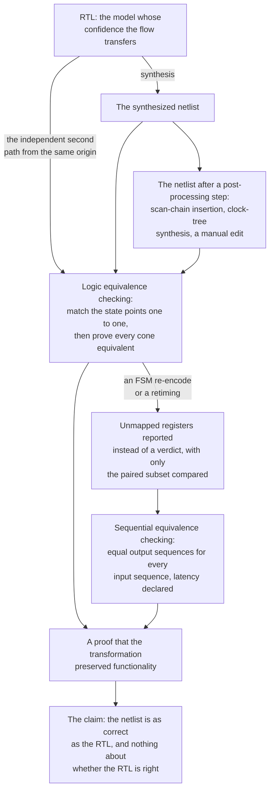

# 15. Formal Apps and Equivalence

Formal apps supply properties for predefined checks, while equivalence flows check transformations left unchecked by property checking. The reference SoC's top level illustrates the integration problem: two thousand lines of instantiation and wiring contain one mistake. The neural accelerator's error interrupt arrives at the event unit on input 5; the firmware header, generated from the architecture document, says input 6. Both blocks are correct, so every block-level environment passes. The system regression also passes, because no test both provokes an accelerator error and enables that particular interrupt: the error path is exercised by the accelerator's own tests, which read the status register, and the interrupt map by the event unit's tests, which inject events directly. The mistake surfaces in the lab, as a hang.

The intent is a table of a few hundred rows specifying source, destination and condition; the implementation is structural wiring. Comparison is mechanical, whereas simulation needs one directed test per row, each checking a single wire without exhausting its conditions.

In this example, the team's one formal specialist is three weeks into the crossbar's ordering proof, choosing abstractions and defending assumptions (see Chapter 14). The specialist is unavailable but unnecessary here because the tool generates properties from a table.

### Chapter map

§15.1 explains why the pre-packaged formal *app* succeeded where general property checking stalled: the tool supplies properties, so a team supplies only the design and a configuration; §15.5 examines properties extracted from the design itself.
§15.2 covers connectivity proofs from integration tables.
§15.3 discharges a register map against its machine-readable description and states which gap register checks leave open.
§15.4 replaces a coverage waiver’s argument with an unreachability proof whose trustworthiness depends on its constraints.
§15.6 states what logic and sequential equivalence checking each prove and assume, and why LEC won full industrial acceptance while property checking was still developing; §15.7 explains why arithmetic datapaths need their own flow.

## 15.1 The app: formal as a product

Chapter 14's flow requires someone to read the specification, decide what to prove, write properties, state and defend assumptions, work toward convergence and interpret the result. Only one of those steps is the engine's. The rest is specification work, which is why formal property checking spent two decades as a high-effort specialist activity requiring skills and expertise most project teams did not have [cit:P17].

A formal app supplies the properties, changing the cost of the flow. The user supplies the design and a configuration; the tool supplies everything else. This structure applies to every app in the catalog. An X-propagation app reads the RTL, analyzes the design, and automatically writes assertions that check for X values reaching targets such as clocks, resets, control signals and output ports; the engineer's remaining job is to judge whether each proved occurrence was expected [cit:D23]. The tool already contained the specification, so no user wrote properties or stated assumptions.

Between 2012 and 2014, adoption of automatic formal applications grew by 62 percent against incremental growth for property checking, because these are narrowly focused solutions that do not require specialized skills to adopt [cit:P17]. A decade later, the gap persisted. Across IC/ASIC projects from 2016 to 2024, property checking adoption grew at 5.8 percent compound annually and automatic formal applications at 8.7 percent, a shift toward tools that make formal accessible to non-experts [cit:R2]. FPGA projects moved the same way over the same window, formal technologies together growing at 7.5 percent compound annually [cit:R1].

The app catalog spans the whole flow rather than one phase [cit:D13] ({ref: formal_app_catalogue}):

{table: formal_app_catalogue} The catalogue of formal apps: each app, the claim it discharges, and — the column that decides whether it pays — the machine-readable source its intent comes from. Read the right-hand column as the price list, because the properties come free only where that source already exists for some other reason; where it does not, creating and curating it is a project's cost rather than a tool's. The first four rows are this chapter's business and the last two belong to the static gate.

| App | What it proves | Where its intent comes from |
|---|---|---|
| Connectivity | Every declared connection exists, and no undeclared one does | An integration table (§15.2) |
| Register access | Reset values, access policies, decode | A register description (§15.3) |
| Unreachability | A coverage target admits no legal trace | The coverage database (§15.4) |
| Auto-generated properties | Interface and structural invariants extracted from the RTL | The RTL itself (§15.5) |
| X propagation | No unknown reaches a control point | The RTL's reset and initialisation structure (Chapter 13) |
| Clock-domain crossing | Synchroniser structure and protocol correctness | The clock and reset declarations (Chapter 13) |

The first four are this chapter's business; the last two belong to Chapter 13's static gate. The fourth also connects to Chapter 14 by drafting what a specialist would otherwise write, and it is the one row whose economics do not resemble the others', so §15.5 gives it a section of its own.

An app relocates specification work. The properties come free only because the intent already exists somewhere machine-readable, and where that source does not exist, creating and curating it is the app's real cost, borne by the project rather than the tool. Connectivity planning must account for intent curation when estimating hours saved on property writing.

An app uses Chapter 14's engine, so a bounded result from an app is exactly as bounded as one from a hand-written proof. Run on a small module chosen with hindsight, an X-propagation app found its bug in minutes; run on the whole IP under a two-hour limit, the same app reported no violations and achieved only bounded proofs [cit:D23]. Free property writing does not reduce design size.

A safety app checked an ECC block at NXP Semiconductors using SECDED (single-error correction, double-error detection) around an 8K memory. Run as an app on the whole block, the fault campaign did not converge in even 12 hours, so the memory was blackboxed and its input ports promoted to observation points; the authors characterize this abstraction explicitly because it can produce false negatives on the safe classification but not false positives. With it, the campaign cut 3,606 injected faults to 2,489 prime faults, proved 763 of those structurally unobservable and a further 232 and then 16 formally unobservable, and ended by identifying 512 faults that corrupt the stored data without ever raising the block's error signals [cit:D12]. The app supplied the fault model and machinery for pruning and classification, but a human supplied the abstraction needed for termination.

## 15.2 Connectivity checking: proving the wiring

Integration assembles individually correct blocks, so all its simple wiring errors survive block-level verification.

Each connection is a claim about a short path: this source reaches this destination, after this many cycles, when this condition holds. The cone of influence is a wire and perhaps a multiplexer, so proofs converge in seconds, thousands run in one job, and each answer is a proof rather than a sample. The reference SoC's interrupt map (several dozen sources into the event unit, some conditional on configuration) is discharged completely in a single run, where a simulation argument needs one directed test per source per condition and still leaves coverage unresolved.

From one table row, the app generates:

<!-- slang: fragment - property p_conn_nn_err as generated from one connectivity table row, without the module that binds it -->

```systemverilog
// Intent row: src = nn_err_irq, dst = evt_in[6],
//             enable = cfg_irq_en[6], latency = 1 cycle.
property p_conn_nn_err;
  @(posedge clk) disable iff (!rst_n)
    cfg_irq_en[6] |=> (evt_in[6] == $past(nn_err_irq));
endproperty
a_conn_nn_err : assert property (p_conn_nn_err);
```

The antecedent is the enabling condition sampled now; the consequent fires one tick later and compares the destination against the source *as it was when the enable was true*, expressing a one-cycle registered connection through `$past`. It says nothing about cycles where `cfg_irq_en[6]` is low; an unconditional claim would be wrong because the connection is not always live. Two hundred rows of the connectivity table, generated and discharged in one run, is the entire flow.

One of the two hundred is the row above, and on the reference SoC it does not prove: the wiring reaches input 5. The proof needs no test provoking an accelerator error while the interrupt is enabled, whether or not one ever would. The generated text also lacks a cover on `cfg_irq_en[6]`. An intent row does not discharge Chapter 11's rule that every implication ships with a cover on its antecedent. This row fails, so its own gap is moot; on the other 199, nothing in the generated text asks whether the enable is reachable, and a successful result does not distinguish a proved connection from an enable no legal trace can set.

A positive connectivity table leaves the equally important requirement for forbidden connections unspecified. The reference SoC's debug fabric supplies negative rows: the JTAG-reachable abstract-access path may reach memory and the core's register file, but must not reach the event unit's retention registers. A no-connection check is cheaper because it asks structurally whether any path exists in the cone, without invoking a proof engine.

> **Scenario.** The crypto engine sits inline on the memory path, with a key ladder that derives working keys from fuses. The security requirement is that a working key reaches the AES core and nothing else: not a readable register, not the trace buffer, not a scan chain.
> **Approach.** The job should include positive rows from key register to cipher core per round and the especially important negative rows: no path from any key-ladder output to any bus-readable address, the debug data register, or a scan-observable point. They should run in the same connectivity job at every integration build.
> **Why.** This structural security check catches a debug hook, a test observation point or a "temporary" mux added during bring-up. A no-connection result is *structural*: no path exists. It does not say the key never influences an observable value along a path that does exist, which is an information-flow question and belongs to Chapter 23. Structural non-adjacency alone does not prove non-leakage.

Checking every path of a multi-port interconnect individually (the crossbar's five manager ports against its four subordinate ports, twenty combinations and far more once each is qualified by burst type and identifier) has poor runtime and, by symmetry, minimal verification value. With *symbolic* port indices, an arbitrary manager M and subordinate S are constrained only to remain stable, and the single path from M to S is checked. Because the proof must hold for every value the arbitrary indices could take, one property covers all of them. Symbolic checking is not always faster: 162 seconds against 65 for all exhaustive per-path proofs together [cit:D13], so runtime needs measurement. It keeps the connectivity argument constant-sized as the interconnect grows.

## 15.3 Register checks: the map against its description

Chapter 10 built a register model and used it to drive and predict accesses. That model was generated from the subject of this section: a register description language (Accellera SystemRDL 2.0 Register Description Language, Version 2.0, 2018), one file from which every view is generated [cit:S2]. These views include RTL decode and field logic, the verification model, firmware header and documentation; maintaining them separately allows drift.

The register app proves that RTL implements the description. From that description it generates and proves reset, access-policy and functional checks for every field [cit:D13], plus the implementation-level properties the description implies but does not state. Per register: the reset value is what the description says, for every reset; the decode maps exactly one address to it; a read returns what the policy says; a write does what the policy says *for every value written*, not for the values a test happened to pick; reserved fields ignore writes; unimplemented addresses behave as declared.

A conventional register test walks the map front-door, register by register and pattern by pattern, through write-read-verify sweeps, reset checks and bit-bash; its cost scales linearly with the map, so a large map's register test takes hours. The app proves the same statements over all values and orderings in one job, at RTL rather than through the bus, so it converges even for registers a bus-level test reaches only through a long configuration sequence.

The canonical status register from Chapter 10 carries the UART's RX overrun flag:

```systemverilog
class uart_status_reg extends uvm_reg;
  rand uvm_reg_field oe;   // RX overrun error

  function new(string name = "uart_status_reg");
    super.new(name, 32, 0);
  endfunction

  virtual function void build();
    oe = uvm_reg_field::type_id::create("oe");
    //          parent size lsb access volatile reset has_rst rand indiv
    oe.configure(this,  1,   3,  "W1C",   1,      1'b0,  1,     0,   0);
  endfunction
endclass
```

Two of those arguments determine how a register app checks this field. The policy `"W1C"` (write one to clear) is a statement about every possible write value and both possible current values, of which a random register test exercises a handful. And `volatile` records that hardware can change the field without software's involvement, which is why the check must read *a software write of 1 clears the field unless hardware sets it in the same cycle*, not *the field is 0 after the write*. A register description language makes this explicit: any hardware-writable field is inherently volatile, because verification and test need to know [cit:S2], so the generator derives the model's `volatile` argument from the field's hardware access rather than from anything anyone wrote down. Ignoring the flag generates a check that fails on correct hardware, creating an incentive to disable it.

Chapter 3 identifies the common-mode limit. The app proves *RTL against description*, and both the register model and the RTL check come from the same file, so an error in the description is invisible to both: a common-mode error, encoded once and read twice. Nothing here reviews whether bit 3 was the right bit. That review is a human reading the description against the architecture document, while the app removes the other checks, leaving only the part that needs a person.

> **Scenario.** The GPU's four shader clusters carry identical register banks with performance counters, cache-invalidate triggers and per-cluster clock-gate overrides, instantiated four times with a parameterized base address. During a late change, cluster 3's bank is hand-edited rather than regenerated, and one counter's reset value is left at the previous revision's.
> **Approach.** All four banks should be regenerated from one description, then checked by the register app across the whole map: all four instances and every field.
> **Why.** Replication permits copy-paste errors, and a per-cluster register test finds this only if someone remembered to parameterize the test as well as the design, otherwise reproducing the same omission. The app enumerates from the description, so it checks cluster 3 whether or not anyone thought about cluster 3. In this example, four thousand fields take a long afternoon of bus traffic but a short formal job.

## 15.4 Unreachability: a proof instead of a waiver

Chapter 6's coverage closure distinguishes stimulus gaps from unreachable targets. Some holes are genuine stimulus gaps requiring closure. No legal execution reaches other targets, which warrant an exclusion in Chapter 7's written form: the hole, reason, risk argument, owner and expiry. For an unreachability exclusion, the reason is the engineer's claim that a state is unreachable.

That claim is a reachability question about the design, and reachability is what a model checker computes. The unreachability app takes the coverage targets and asks, for each, whether any legal trace reaches it; the unreachable ones come back with a proof, and this saves the manual analysis they would otherwise consume [cit:D13]. The waiver's claim becomes a database result. Dead RTL is excluded from coverage metrics this way, manually or with formal tools; the exclusion is necessary for a meaningful coverage percentage [cit:D11].

Reachability depends on the constraints, and a wrong constraint makes reachable behavior look impossible. An input constraint in a tool setup script (`enable_cnt == 0`) made a counter's increment line uncoverable; the line was reported as unreachable, and it was, under an assumption no engineer had reviewed and that did not reflect the design's real environment [cit:D11]. An unreachability verdict inherits every assumption in the environment, including ones written in a scripting language by someone who has left the project. The constraint set should be evidence, reviewed as seriously as the waiver it replaces.

The second limitation is structural: the app works on the *design* (RTL lines, branches, FSM states, cover properties bound into design scopes), so a functional coverage model computed by the testbench is invisible to it. The canonical DMA coverage model is `cg_2d_4kb` from Chapter 5. Its cross `x_worst` has **72** combinations: 3 stride signs × 4 boundary relations × 3 burst lengths × 2 states of the other channel. **Six** of them, the whole `straddle × max` column, are excluded: three stride signs by two other-channel states. They are excluded by *policy*, which Chapter 9 derives, rather than by a design property, leaving **66** cells to close.

The app cannot see that cross because `txn.bnd_rel` lives in the monitor. A machine verdict requires a design-level restatement:

<!-- slang: fragment - cover property c_split_max_len shown alone; midend_did_split and midend_burst_len are the midend outputs the comment describes -->

```systemverilog
// Design-level restatement: can the midend ever emit a full-length
// burst out of a transaction it had to split at a 4 KB frontier?
// Signals are the midend's own outputs, not the monitor's per-row relation.
// midend_did_split is per emitted burst: set when this burst's parent
// row had to be split at a 4 KB frontier. midend_burst_len is a beat
// count, like Chapter 5's cp_len — not an AXI AWLEN, which is beats-1.
c_split_max_len : cover property (@(posedge clk) disable iff (!rst_n)
  midend_txn_done && midend_did_split && (midend_burst_len == 9'd256));
```

The comment's encoding note is the protocol's own: *AMBA® AXI and ACE Protocol Specification*, Arm IHI 0022H.c, §A3.4.1, where `Burst_Length = AxLEN[7:0] + 1` [cit:S18].

The engine answers in seconds: the cover is **reachable**, with a trace showing how. Nothing in the design bounds a descriptor row at one maximum burst. The bound that empties the column lives in the constrained-random generator, and a design-level cover does not inherit it.

The two questions are related but distinct: this cover asks about the midend's own split flag and burst length, while the six-cell figure is an argument about the monitor's per-row `bnd_rel` axis and how it pairs with a post-split length sample. The exclusion remains valid as a stimulus claim, not a design claim: true while the generator is unchanged, false when it widens.

The app therefore cannot discharge this exclusion; the limitation is structural. To return *unreachable* the tool would have to be told about the generator's budget, and that budget is not a property of the design: Chapter 9 labels its bounds engineering choices about solve time rather than statements about the DUT. Assuming that budget would make the verdict inherit it, recreating the first limitation. The disposition remains a waiver whose expiry is an edit to the constraint file; that edit must count as verification evidence.

The third limitation concerns some targets unreachable only in the current configuration. A parameter value can make a whole class of coverage impossible (a narrow bus cannot carry a wide transfer) and waiving that coverage by hand is laborious, while aggregating coverage across parameterizations is a weak substitute [cit:D13]. Conditional unreachability should be generated: deriving targets and exclusions from the same configuration regenerates both on a parameter change. Hand-maintained exclusions can become stale when design parameters change.

## 15.5 Auto-generated properties and specification review

The fourth catalog row reverses the intent-source relationship of the first three. The app extracts implementation-detail properties from RTL [cit:D13]: interface handshakes, one-hot encodings and FIFO occupancy bounds, the structural invariants a designer would state if asked. No table, no description, no configuration beyond a module name. The third column identifies the cost advantage: the design already supplies the intent source.

Every other app finds bugs by comparing the design with external intent from a wiring table, register description or coverage model. Here, intent and implementation coincide by construction. The limitation is structural rather than a matter of tool maturity: automatic property generation divides into dynamic mining from simulation traces and static analysis of a specification, and the mining family generates and evaluates its properties on the same RTL with no golden reference, so flaws in the RTL yield flawed properties and the method has no independent way to detect them [cit:P11].

A mined property proves on its source RTL, and would also prove on RTL with the opposite behavior, because it derives from that behavior. Its bug-finding power against today's RTL is zero, and no amount of proof depth changes that. Its regression value is to make current design behavior an obligation against which subsequent changes are checked.

Each of three hundred generated properties requires review for intended behavior, since truth is guaranteed by construction; this remains specification work for the specialist the app was supposed to replace. An app that emits verdicts removes that work. An app emitting drafts relocates that work to project review, as §15.1 explains for intent curation; generation remains free. Running the app requires a review budget.

> **Scenario.** The reference SoC's inherited UART is silicon-proven and four years old; its specification is a two-page register table plus the RTL. Bring-up needs a change detector around it before anyone touches the clock divider.
> **Approach.** The generation app should run and its several hundred extracted properties be retained as change detectors, never as statements of what the block should do.
> **Why.** The RX overrun flag never clears when software reads status in the same cycle a stop-bit error arrives; mining makes this RTL behavior an obligation, so fixing the bug triggers a regression failure. A generated set encodes the design's defects with exactly the fidelity it encodes its features. For a block whose specification is lost, this remains useful provided the team distinguishes change detection from intended behavior and never cites the pass rate as verification evidence.

## 15.6 Logic and sequential equivalence checking

Every earlier technique compares a design against a *specification*, whereas equivalence checking compares it against another design. The following flow checks whether a transformation preserves functionality.

Chapter 2's reconvergence model explains the flow. Synthesis transforms RTL into a netlist; equivalence checking is an independent second path from the same origin, and the two reconverge at a mathematical proof that the transformation preserved functionality [cit:B2]. The question has a yes-or-no answer, requiring no stimulus or coverage and avoiding the oracle problem. {ref: netlist_equivalence_flow} follows that second path along the chain of transformations, and the branch a broken state-point mapping takes.

**Logic equivalence checking (LEC)** is the combinational form used throughout the flow. It compares two structurally similar models, most often RTL against the netlist synthesized from it, or netlist against netlist after a post-processing step such as scan-chain insertion, clock-tree synthesis or a manual edit [cit:B2]. It is an automatic activity requiring minimal human interaction, and its scalability to industrial-size circuits won it full industrial acceptance at a time when property checking was still developing [cit:B3].

LEC assumes matched state points rather than reasoning about sequences. It matches *state points* (the registers of both models) one-to-one, then proves that for every matched pair and every output the combinational logic computing them is Boolean-equivalent. Given two sequential circuits with the same state encoding, combinational equivalence of their next-state and output functions is sufficient for their equivalence [cit:P20]. LEC is fast because Boolean equivalence of two similar cones is a well-solved problem, and exhaustive because it never enumerates a trace; it becomes a mapping problem when the state points do not match, reporting unmapped registers rather than a verdict, and comparing only the subset it could pair. In a restructuring example, the first hour goes on mapping; renaming or restructuring registers breaks LEC until their correspondence is supplied.



{figure: netlist_equivalence_flow} Equivalence checking as a second path from the same origin: every transformation of the design owes one proof, a broken state-point mapping is what sends a step to the sequential flow, and the claim stays relative to the RTL.

Synthesis tools are large software systems depending on the correctness of algorithms and library information, and history shows such systems to be error-prone. An example is a design at Digital Equipment Corporation synthesized incorrectly because it used a synthetic arithmetic operator whose documentation stated correctness was not guaranteed above 48 bits; the synthesis tool could not read that documentation. Equivalence checking found it quickly; gate-level simulation would have found it with great difficulty, if at all [cit:B2].

An equivalence checker is also a large software system: randomized generation of SystemC programs built by construction to be equivalent to trivial RTL, tested against three major commercial C-to-RTL checkers, uncovered sixteen distinct defects [cit:D46]. The paper withholds tool names under license, so the result concerns the class rather than a ranking.

**Sequential equivalence checking (SEC)** removes the matched-state-point assumption at greater computational cost. Two machines are equivalent when every input sequence produces the same output sequence; deciding that means computing the reachable states of a product machine that runs both designs in lock-step on the same inputs and reports whether their outputs agree [cit:P20]. That is a model-checking problem, with model checking's costs, so SEC is aimed at bounded, well-chosen transformations rather than whole designs, covering cases LEC cannot handle: rearchitected finite state machines and restructured data pipelines, where modern equivalence checkers handle sequential differences between two RTL models [cit:B2]. The following two cases concern clock gating and retiming.

*Clock gating.* The power tool inserts gates on the neural accelerator's 16-lane MAC datapath, and the gated design must remain sequentially equivalent to the ungated one, producing the same outputs at the same times while consuming less energy. If the gating condition is wrong by one cycle, the datapath holds a stale value that surfaces only on a specific weight-stream boundary. SEC against the pre-gating RTL answers it once, for all inputs.

*Retiming.* The radar front-end's FFT pipeline misses timing at the fast corner, and the fix moves a stage boundary: same arithmetic, one register deeper in one path. The function did not change and the register mapping entirely did, so LEC will not map the state points, and full functional re-verification of the DSP chain is days of simulation. SEC with a declared latency offset proves the two pipelines produce the same output sequence, and the change ships as a timing fix rather than a functional risk.

{ref: equivalence_flows_compared} compares both flows with the next section's datapath flow, with a row for each assumption that determines applicability.

{table: equivalence_flows_compared} The three equivalence flows side by side, one column each: what pair of models the flow compares, what it assumes before it starts, what it proves, and what it is blind to. Read the last row across all three columns — every one of them is blind to whether the reference itself is right, because equivalence checking is a relative argument that transfers your confidence onto another model exactly, and transfers your errors with the same fidelity.

| | LEC | SEC | Datapath (§15.7) |
|---|---|---|---|
| Compares | RTL ↔ netlist, netlist ↔ netlist | RTL ↔ RTL across a sequential change | Algorithmic reference ↔ RTL |
| Assumes | Matched state points, same encoding | A declared input/output correspondence and latency relation | A declared operand and result mapping, bit-exact |
| Proves | Boolean equivalence of every cone | Equal output sequences for every input sequence | Equal result for every operand value |
| Blind to | Whether the reference itself is right | Whether the reference itself is right | Whether the reference itself is right |

This limit applies to all three flows. Equivalence checking is a *relative* argument: it transfers confidence in one model onto another exactly and without loss, and it transfers errors with the same fidelity. It establishes that the netlist is as correct as the RTL, which is the flow's required claim; it does not establish RTL correctness.

A second limit concerns the tool itself. Seven of the confirmed defects are cases where the tool reported an equivalence that did not hold, which the authors describe as the kind that could have let an incorrect design be signed off [cit:D46]. A proof engine answering *equivalent* wrongly produces no failure symptom: the flow reports success, the netlist ships, and the argument that the transformation preserved functionality was never made. Confidence transfer also depends on the tool performing it.

## 15.7 Datapath equivalence at word level

For control logic, simulation's coverage argument is a reasonable approximation: the interesting behavior lives in state sequences, the state space has structure, and a suitable coverage model samples it. For arithmetic, meaningful sampling by a coverage model is infeasible. The video codec's inverse transform illustrates the input space. An 8×8 residual block is 64 coefficients; at 16 bits each, the input space of a *single* invocation is 2<sup>1024</sup> values. No coverage model meaningfully samples that space, even with a billion random blocks. The failure mode is scattered across the input space: a rounding term applied at the wrong stage, a saturation clipping one bit late, an intermediate width one bit short; each is wrong for a sparse, structured subset of operands that random stimulus meets with probability near zero. The codec's compression standard specifies the inverse transform as exact integer arithmetic precisely so encoder and decoder cannot drift, which makes a one-bit mismatch in one coefficient a conformance failure rather than a quality issue.

An arithmetic block's specification is a mathematical relation between operands and result, which can be written directly. The formal verification of floating-point hardware after the Pentium division episode established this pattern: a multiplier's top-level specification is a formalization of the arithmetic standard, stated as a relation between input operands and result in terms of arithmetic on integers, with significand and exponent vectors read as integer values rather than bit vectors. Proofs at that level are decomposed: over 120 properties covering all arithmetic operations of one industrial floating-point unit, each a property about a subunit (a loop invariant where the algorithm is iterative), with the irrelevant parts extracted away per property [cit:P20]. Two requirements follow: word-level reasoning and decomposition, because a monolithic claim does not converge.

The industrial flow that grew from this compares an algorithmic reference (typically C or C++, bit-exact, often the code the architects used to develop the algorithm) against the RTL, with the operand and result correspondence declared by the user. That description of the flow is practitioner judgment in its last clause: this book's corpus does not document it, and no source is cited for that clause.

The corpus explains why this needs a *separate* flow from §15.6's checkers. A general equivalence checker relates an RTL model to a netlist or another RTL model because they are structurally very similar; a model written at a genuinely different level of abstraction uses a completely different modeling approach and is very difficult to correlate mathematically with the RTL [cit:B2]. Datapath tools address this difficulty only by narrowing scope until the correlation is mechanical: a pure function, a declared operand mapping, a declared latency, no side effects, no protocol. A C model containing a state machine again requires hand-written properties.

Two published cases put that flow at opposite ends of its cost range. Arm and Mentor Graphics proved floating-point operations of Arm CPU designs sequentially equivalent to C reference models, and published the effort per operation: two days of proof development for FADD against two months each for FMUL, FDIV and FSQRT, with proof runtimes from forty minutes to twenty hours. The figure that motivated the work was one hundred and fifty days of CPU time to simulate one operation with two half-precision operands exhaustively, and what the proofs bought carries the same scope: exhaustive simulation was eliminated for half-precision operations, not generally [cit:D37].

Intel's graphics organization reports this comparison used for early bug finding. Started before the design and the C++ model were finished, as an exercise aimed at early bugs rather than at the complete coverage a sign-off claim requires, it produced eighteen bugs in under a week, in the C++ model and the RTL together, with the split between them not stated [cit:D38]. A plan must distinguish the counterexample budget from the evidence needed for a proof.

> **Scenario.** The radar front-end's CFAR detector accumulates FFT magnitudes in a fixed-point format the algorithm team chose from a floating-point precision study. Datapath verification proves the RTL bit-exact against the team's fixed-point C model, on every operand.
> **Approach.** After shipment, the fixed-point C model should also be compared with the floating-point model over the operating envelope, with a declared error bound.
> **Why.** Bit-exactness completely establishes implementation of the fixed-point model, but provides no evidence of that model's adequacy. A detector that saturates on a strong near-target loses a weak far one, and every stage of the equivalence argument passes while it happens. This is Chapter 3's common-mode error: complete agreement between RTL and reference leaves the correctness of both untested.

### In practice

In an adoption example, connectivity is absent from the first vplan; a wrong wire prompts an integration check that takes two days and finds nine more, so the next project plans a connectivity table. Adoption should start with apps whose machine-readable intent already serves another purpose, such as the register description generating firmware headers or the interrupt map generating documentation.

The plan gains two rows in Chapter 5's DMA format ({ref: soc_connectivity_plan_rows}):

{table: soc_connectivity_plan_rows} The two verification-plan rows a connectivity app earns at SoC top level: the feature and its attributes, the pass/fail criterion, the method, and the metric that closes the row. There are two rather than one because "the connections exist" and "the forbidden ones do not" are two kinds of evidence with no single metric between them; note what the closure column has to spell out, since a connectivity property that ran out of budget is not a discharged row.

| ID | Feature & attributes | Pass/fail criterion | Method | Closure metric |
|---|---|---|---|---|
| SOC-F01 | Interrupt map: every row of the integration table — source, destination, enabling condition, latency — implemented as declared | Each declared connection holds for every legal value of its enabling condition | Connectivity app, SoC top level | Every generated property proven; none bounded, none waived |
| SOC-N01 | No path from any key-ladder output to a bus-readable address, the debug data register, or a scan-observable point | No structural path exists in the cone | Connectivity app, no-connection mode | Every negative row proven; each exception dispositioned per Chapter 7 |

Two rows rather than one are needed, as when Chapter 5 split `DMA-N01`: declared connections and forbidden paths are two kinds of evidence, and no single metric evaluates both. *None bounded* means a property that exhausted its budget leaves the row open; the default report does not distinguish these two outcomes.

The following examples identify planning risks. In one example, the intent spreadsheet belongs to its last editor; the first formal run finds dozens of table errors rather than design errors, useful because software also uses the table, although day one looks unsuccessful. When physical design or synthesis owns equivalence checking, the verification lead may lack visibility of the latest netlist's LEC result; the plan should provide it, since a failing LEC is a functional regression regardless of ownership. Every app produces items to disposition, so Chapter 7's waiver discipline applies unchanged.

### Pitfalls

1. **Unbudgeted app costs.** Symptom: connectivity gets one sprint but the intent table takes three weeks; or three hundred generated properties arrive without a review budget. Cure: the estimate must cover intent preparation and output disposition, excluding tool setup.
2. **Bounded results counted as complete.** Symptom: a run reports no violations, at a runtime limit, on a design that is too large. Cure: every generated property's proof status requires checking; "bounded, no counterexample" remains unfinished work.
3. **Unreviewed unreachability constraints.** Symptom: unreachable targets accompanied by a setup script unreviewed since project start. Cure: constraint review as exclusion evidence and over-constraint analysis must precede acceptance of a dead hole.
4. **Register-map intent left unchecked.** Symptom: a field at the wrong offset in silicon, with a green formal report behind it. Cure: one human review must compare description and architecture document, because the app proves conformance rather than correctness.
5. **LEC mapping failure after restructuring.** Symptom: an equivalence run that will not map state points after an FSM re-encode or a retiming, and a team debugging the mapping instead of the change. Cure: the sequential case requires SEC with a declared latency relation.
6. **Bit-exactness mistaken for correctness.** Symptom: a datapath proven identical to a reference that is itself wrong, or precision-inadequate. Cure: the reference requires separate verification against the standard or a higher-precision model with a stated error bound.

### Summary

- A formal app supplies the properties while the user supplies the design and a configuration, moving the specification work that made property checking a specialist activity into the tool [cit:P17,D23]. It disappears only where the intent already exists in machine-readable form; where it does not, curating that source is the flow's real cost. With design-derived intent, specification work remains: a mined property has no golden reference [cit:P11] and proves by construction, providing change detection rather than verification evidence.
- Connectivity checking proves declared connections; its equally important negative rows check forbidden paths more cheaply through structural analysis.
- Register checks discharge RTL against a register description exhaustively, over all values and orderings, and close nothing at all between the description and the architect's intent.
- Formal replaces a coverage waiver's argument with a result that inherits every environmental assumption, including those hidden in setup scripts [cit:D11].
- LEC assumes matched state points and proves Boolean equivalence cone by cone; SEC drops that assumption, becomes a model-checking problem, and earns its cost on retiming and clock gating [cit:P20,B2].
- Equivalence is a relative argument that transfers confidence and errors from one model to another exactly, without establishing whether the reference is correct.
- Simulation coverage cannot meaningfully sample arithmetic input spaces, which call for mathematical specifications and word-level proofs [cit:P20].

### Exercises

**Exercise 15.1 (calculation).** §15.7 states the input space of a single invocation of the codec's inverse transform as a power of two. Derive that exponent from the residual block geometry and the coefficient width the same section gives, showing both factors. Express the count of random blocks §15.7 mentions as the nearest power of two as well, and state what the comparison of the two exponents settles about a coverage argument for this block and what it leaves for the flow §15.7 prescribes instead.

**Exercise 15.2 (calculation).** §15.2 compares per-path connectivity proofs on the crossbar with a single proof over symbolic port indices, and gives a runtime for each. Compute the number of paths the exhaustive job proves, from the crossbar's manager-port and subordinate-port counts, and compute the ratio of the two runtimes §15.2 reports. State the property of the symbolic argument that §15.2 offers in place of a runtime advantage, and name the qualification that pushes the exhaustive path count past the figure just computed.

**Exercise 15.3 (judgement).** A team presents a clean register-app report as evidence that the reference SoC's register map matches the architecture document, and proposes to disable one field check that keeps failing on hardware the team has reviewed and believes correct. Decide what the app of §15.3 discharges and what it leaves open, naming the limit §15.3 identifies and the one review that stays a person's work. Decide what makes that field check fail, using the two arguments of the canonical status register §15.3 discusses, and give the reading of the field's access policy that a correct check has to carry.

**Exercise 15.4 (judgement).** A team asks the unreachability app for a verdict on the six excluded cells of the canonical DMA coverage model's worst-case cross, and proposes to hand the app the generator's row-size budget so that the verdict returns unreachable. Decide what §15.4 licenses, naming the premise the exclusion actually rests on and the limitation of §15.4 that the proposal would recreate. State what the design-level restatement of §15.4 returns instead and why, and give the disposition §15.4 leaves the exclusion with together with the event that ends it.

**Exercise 15.5 (artifact).** Read the record below, kept for one row of the reference SoC's connectivity table and reported against the plan row `SOC-F01` of the chapter's practice section. Name the blank field and give the wording that plan row requires in it. Decide whether the result as reported closes the row, with the reason the practice section gives. Name the directive the generated property lacks, and state what a passing result cannot distinguish without it.

```text
intent row         src = uart_err_irq, dst = evt_in[9],
                   enable = cfg_irq_en[9], latency = 1 cycle
property           p_conn_uart_err (generated)
result             no counterexample, bounded at depth 20
antecedent cover   none generated
plan row           SOC-F01
closure metric
```

### Further reading

Within the corpus, [cit:P17] is the origin point for the automatic-formal-application category and its adoption argument, with current figures in [cit:R1,R2]. [cit:D13] surveys the app catalog and production hurdles, including symmetry and specimen-value techniques for constant-sized interconnect checks; [cit:D23] documents one app's generation, proof and bounded-result limitations on a real tape-out. For coverage-side formal, [cit:D11] defines coverage models and presents an over-constraint case study relevant before any first exclusion. On generated properties, [cit:P11] states the limitation that governs the RTL-mined variety and surveys where the alternatives take their intent from; Chapter 11 covers the specification-to-property direction. On equivalence, [cit:B2] gives the practitioner's framing and industrial anecdotes, while [cit:B3] places equivalence checking in the design flow and explains why it scaled first; [cit:P20] covers state-machine equivalence via product machines, combinational equivalence under matched state encodings, and the hierarchical decomposition that made RTL-versus-transistor checking practical on a commercial microprocessor. [cit:S2] specifies register descriptions as a single generated source. [cit:D46] examines the checkers themselves and reports twelve vendor-confirmed defects.

Outside the corpus: E. Seligman, T. Schubert and M. V. Achutha Kiran Kumar, *Formal Verification: An Essential Toolkit for Modern VLSI Design*, is the standard practitioner treatment of formal apps and their deployment. Equivalence-checking *algorithms* are the thin spot: relative to their industrial importance the published verification literature covers them lightly, and within the corpus [cit:P20] is the closest thing to a treatment.
