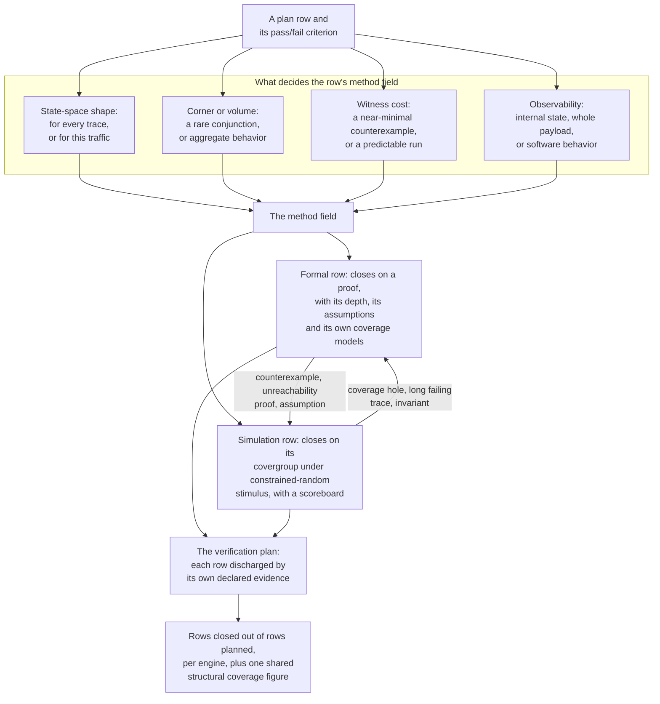

# 16. Hybrid Flows

Hybrid flows coordinate formal and simulation evidence within one verification campaign. The flagship host-cluster example covers a quarter of verification by two engineers who do not read each other's reports.

The formal report records nine properties on the directory's transition rules, proven unbounded on a model cut down to two caches and one address. The directory is the record of which caches hold each line. The same report records an assumption register of five rows, and four of those rows are discharged on a neighboring block. That assumption register is the reviewed table of every assumption, the party accountable for it and the evidence that discharges it. Among the nine is the invariant that at most one cache may hold a line Modified (see Chapter 14).

The simulation report records four hundred runs of random traffic across four application cores, a functional cross standing at 71% over three axes (the MESI state, the requester and the concurrent-snoop), a scoreboard that has been silent for three weeks, and the note that the remaining holes are all in the eviction column. The MESI state of a cached line is Modified, Exclusive, Shared or Invalid.

The lead's dashboard merges both databases into one number that is numerically valid but makes no defined claim: its denominator is unknown at review. The two engineers disagree on whether the single-writer proof fills the cross bins addressing the same condition. The single-writer proof is the proof that at most one cache may hold a line Modified, the condition those cross bins also address.

The problem is the flow: two engines run as two projects, joined only at the dashboard despite sharing one design, one plan and one sign-off. A unified campaign assigns work by problem structure rather than tool ownership, maintains one definition of legal traffic across both engines, and reports exactly what the evidence establishes.

### Chapter map

§16.1 assigns each plan row by state-space shape, corner or volume behavior, witness cost and observability. §16.2 follows one interface constraint through stimulus, checker and formal assumption, with two detectors preventing those three from drifting. §16.3 explains the difficulty of combining simulation coverage and proofs, the interchange database's scope, and what a unified report may and may not claim. §16.4 gives the engine-selection procedure, together with two cases it has to settle: the deliberate use of both engines on one feature, and proofs that cost less but cannot discharge a plan row. §16.5 specifies the artifacts exchanged in both directions and their required accompanying records.

## 16.1 Dividing the work

Engine selection applies to individual plan rows. A plan row is one line of the verification plan: a feature, its attributes, a pass/fail criterion, a method and the evidence that closes it. Blocks are heterogeneous: Chapter 14 divided a video codec by function, while Chapter 15's apps discharge integration questions independently of how the blocks on either side were verified. Chapter 5 provides the method field for each row; the criteria below determine its value. {ref: row_engine_assignment} places those criteria between the row and the two engines, with the artifacts that later cross between them.



{figure: row_engine_assignment} Engine assignment belongs to the plan row rather than to the block: four criteria set the row's method field, each engine closes its own rows on its own evidence, and the plan, rather than a merged database, is where the two report together.

**State-space shape.** Chapter 14 states in one line that formal excels at rules over bounded state and fails at data transformations. The row's pass/fail criterion expresses the distinction through its quantifiers. A criterion that begins *for every* (every burst stays inside one 4 KB region, every grant follows a request, at most one cache holds this line Modified) is a claim over all traces, and an engine that samples can only ever provide evidence for it. A criterion that begins *for this traffic* (the destination buffer matches the source under a mixed read/write profile, the encoder's output decodes bit-exactly on this stream) is a claim about a transformation, and its oracle is another executable (Chapter 8). The first kind belongs to formal, with simulation as corroboration; the second belongs to simulation because formal requires the reference model to be rewritten in temporal logic, the notation for what must hold across cycles rather than at one instant.

**Corner or volume.** A *corner* is a conjunction of individually rare conditions. Simulation cost depends on the product of probabilities, regardless of seed count; formal searches independently of the conjunction's rarity. One published deployment records a case in which an arbiter starved a requester only under a conjunction of three input conditions that the authors record as next to impossible to construct in simulation: the first condition is that the output FIFO had filled, so that both ports were unavailable; *and* the second is that all three clients then asserted request continuously; *and* the third is that the two ports subsequently became available on alternate cycles [cit:D18]. A *volume* criterion concerns aggregate behavior over many transactions: sustained throughput, queue occupancy under load, fairness across a frame or energy per operation. Such a statistical criterion cannot be discharged by proof. Formal verification generalizes and abstracts design behavior, which is why it complements a technique that can only ever stimulate a small portion of the design and may therefore miss errors surfacing under rare conditions [cit:B3]; it is also why it cannot determine how often something happens.

> **Scenario (the GPU).** Two rows of the tile-based mobile GPU's plan, on the same interface between a shader cluster and unified memory. Row one: *no shader cluster may observe a write reordered past a barrier it issued*. Row two: *at 90% memory-bus utilization, the 99th-percentile shader stall waiting on a tile fetch stays under N cycles*. **Approach.** Row one goes to formal using Chapter 14's two-symbolic-address memory model: stored values do not affect the rule, so memory can be uninterpreted; two addresses are the minimum needed to express ordering. Row two uses simulation with a traffic profile reproducing a real frame and closes on a distribution rather than a bin. **Why.** The first requires a specific interleaving of a barrier, a write and another cluster's read; under random stimulus its probability is the product of three small numbers. The second is a volume: an all-traces proof instead returns an existing worst-case stall exceeding N, occurring once in a billion frames in this example, which does not answer the row's question. Neither engine could discharge the other row on this interface.

**Witness cost in both directions.** A counterexample arrives near-minimal and carries no irrelevant history (Chapter 14); a simulation failure arrives at the end of a run with everything that preceded it attached, incurring Chapter 8's detection distance at debug time. For a result of *no violation*, simulation's cost is predictable, whereas formal's is not. A few minutes of simulation gives a good estimate of clock cycles per second for the rest of the run, whereas if an assertion is slow to prove it is almost impossible to predict how much longer it will take [cit:D13]. A lead may put a simulation row on the critical path and estimate it; a formal row there is an unbounded commitment unless the plan says in advance what happens when it does not converge; accordingly, Chapter 14's convergence ladder ends with *stop, and hand the row to simulation* as a planned outcome. The convergence ladder is the ordered list of moves that chapter prescribes for a property that has not converged.

**Where the criterion is observable.** Criteria statable over internal state, such as a queue's occupancy against its pointers or a one-hot encoding, are cheap in both engines, which is why Chapter 11's redundant-state invariants also serve as formal lemmas. A lemma is a fact about internal state, proven on its own and then given to a harder proof as an assumption that needs no further discharge. Criteria over a whole transaction's payload are expressible for a proof engine, which rarely finds them tractable. Criteria over software behavior belong to neither engine at this level (Chapter 18).

These four properties change engine assignments across generations. On the reference SoC's 5×4 crossbar, the ordering and arbitration rules are small enough that end-to-end proofs close and simulation's job is data transport at volume. On the flagship's 4×4 mesh, the same class of obligation (end-to-end ordering between two endpoints) spans sixteen routers, virtual channels and XY routing, and does not close as one proof; deadlock-freedom goes to formal on an abstracted model, ordering goes to formal on a symbolic endpoint pair, and everything about congestion, latency distribution and virtual-channel occupancy goes to simulation and emulation (Chapter 17). Virtual channels are the separate queues that share one physical link between two routers, and XY routing moves a packet along the mesh's X dimension first and along Y second.

## 16.2 Assumption and constraint duality, as a flow

Chapter 9 named the duality: one constraint generates legal traffic on a block's input, checks legality on the neighbor's output, and is assumed in formal. Chapter 11 wrote it as an assertion, Chapter 14 as an assumption. Operationally, stimulus legality resides in a `constraint` block inside a randomizable class, whereas the checker and assumption are temporal properties. The constraint and the property are not one statement in two syntaxes: the constraint is a statement about a generated object, while the property is a statement about a signal history. Because of that difference, no tool diffs the constraint against the property, and no compiler flags their divergence. Divergence can remain undetected until sign-off or indefinitely.

### The drift is asymmetric

Drift has two directions, only one directly visible.

**The generator is narrower than the assumption.** The formal environment permits traffic the tests never send. The proof soundly covers a superset of the simulated traffic. The unsent traffic is visible as a simulation coverage hole, handled by Chapter 6's classification.

**The assumption is stronger than the generator's legal set.** The proof holds over a subset of the traffic the tests actually send: so simulation is exercising behavior that the proof never covered, while both reports are green. Neither side is empty, and no coverage hole, failure or artifact records the gap. Chapter 14's silent over-constraint arises here in a particular way: the assumption was accurate for an *older* environment and stimulus has since outgrown it, rather than having been too strong for the design's environment from the start.

### Two detectors

Because the languages differ, the constraint cannot be written once. One of its three forms must serve as the source, and a mechanical test then checks the other two against that source. The source is the *assumption*, whose failure is silent.

**Detector one: assumptions compiled as simulation assertions.** A published sign-off methodology includes this among the techniques for establishing that a formal environment has no unintentional over-constraints: instantiating the constraints in simulation, alongside cross-proof with neighboring blocks [cit:D31]. A cross-proof is a proof on the neighboring block, where the condition this block assumes becomes a property the neighbor has to satisfy. That technique uses Chapter 14's `ASSUME_MODE` parameter in reverse. In formal, the parameterized checker constrains an input. In the block's own simulation, the identical text is *asserted*, and because the signals it watches are driven by the testbench, that instance is checking the generator rather than the design.

The sensor hub's wake path provides a minimal instance. The always-on island raises `wake_req` and the DSP domain answers with `wake_ack`, both sampled on the 32 kHz clock (Chapter 14 proved the island's wake latency on this clock, avoiding the proof depth required on the fast one):

```systemverilog
// Sensor hub wake path: the always-on island requests, the DSP domain answers.
module wake_handshake_checker #(parameter bit ASSUME_MODE = 1'b0) (
  input logic clk_slow, rst_n,
  input logic wake_req, wake_ack
);
  // The requester may not withdraw a request that has not been acknowledged.
  property p_req_holds_until_ack;
    @(posedge clk_slow) disable iff (!rst_n)
    (wake_req && !wake_ack) |=> wake_req;
  endproperty

  // Has the environment ever come near the rule's edge?
  c_req_waited : cover property (@(posedge clk_slow) disable iff (!rst_n)
                   wake_req && !wake_ack);

  if (ASSUME_MODE) begin : g_env
    m_req_holds_until_ack : assume property (p_req_holds_until_ack);
  end else begin : g_chk
    a_req_holds_until_ack : assert property (p_req_holds_until_ack);
  end
endmodule
```

The property requires only that an unacknowledged request survive into the next cycle; it specifies nothing after `wake_ack` rises and never constrains `wake_ack`. This complete rule suffices for both uses. When the DSP's wake controller is proved, `wake_req` is an input and the instance is built with `ASSUME_MODE = 1`. When the island is proved, `wake_req` is an output and the same text is asserted. And in the DSP's block-level simulation the assert-mode instance is bound into the DSP's scope, where `wake_req` comes from the testbench:

```systemverilog
bind dsp_wake_ctrl wake_handshake_checker #(.ASSUME_MODE(1'b0)) u_wake_chk (
  .clk_slow(clk_32k), .rst_n(rst_n_32k),
  .wake_req(wake_req), .wake_ack(wake_ack)
);
```

If a sequence ever drops an unacknowledged request, that assertion fires in simulation and the message names the assumption that would have been silently violated in formal. A nightly run thus exposes the generator's drift outside the proof environment before sign-off.

**Detector two: coverage of the assumption's boundary.** Detector one catches a generator going *outside* the assumption, but cannot detect stimulus staying so far inside that the assumption remains untested. `c_req_waited` checks whether any run produced an unacknowledged request. If it reads zero, `a_req_holds_until_ack` has never evaluated non-vacuously, and the claim that simulation corroborates the formal environment is empty. An assertion evaluates vacuously when its antecedent never becomes true, so nothing is checked. Detector two takes Chapter 11's rule, that every implication ships with a cover on its antecedent, and applies it to a third artifact. Applied to an assumption, the rule reads: **every assumption ships with a cover on the condition it restricts, and an assumption whose boundary is never approached in simulation is untested.** Chapter 11's caveat travels with it: where the restricted condition is ordinary traffic, a bare cover proves nothing, and the rule is discharged instead by a witness that implies the condition and isolates the interesting case.

Together the two detectors monitor Chapter 14's reviewed assumption register. Each row of the register gains a column: the run in which its assertion form last passed, and the run in which its boundary cover was last hit.

> **Scenario (the crypto engine).** Chapter 14 identified for the inline AES-GCM engine a dangerous assumption (that key material arrives only after authentication completes) and the verdict that the obligation belonged on the boot ROM's proof rather than on the engine's. **Approach.** The transfer requires three bookkeeping steps. The assumption becomes an assertion in the boot ROM's own formal run, where `key_load` is an output and the claim is discharged. The same text, in assert mode, is bound into the SoC-level simulation environment, so every firmware-driven boot sequence in the nightly regression re-checks it against real traffic. Its boundary cover, a key load attempted at all, belongs on the same row: an obligation unapproached by tests provides no evidence. The engine's assumption register row keeps the text and gains a discharge pointer. **Why.** Proving this condition on the engine's driver and re-checking it in system simulation substantiates the engine's assumption. An artifact from a formal convergence problem thus becomes a permanent member of a simulation regression tier (Chapter 12).

## 16.3 Coverage unification

Combining the two engines' different result types can overstate the evidence.

A simulation bin counts occurrences of a situation in the executed runs. A proof holds a claim: *no legal trace violates this rule.* These are two different quantities, concerning the testbench and the design respectively, as Chapter 14 distinguishes. Their average has a denominator combining two incompatible units.

### The interchange standard's data model

The Accellera Unified Coverage Interoperability Standard (UCIS), Version 1.0, 2012, defines a single repository holding coverage data from all verification processes (simulation, static checking, functional formal verification, sequential equivalence checking, emulation) together with a standard access layer, so that data produced by many producers is semantically interpretable by many consumers. Its target flow has two stages: the simulator or the formal tool collects primary data in memory and exports it on completion, and merge applications later combine those primary databases, recording their construction history in the database itself [cit:S3].

Formal-run data makes Chapter 14's three qualifiers machine-readable: the model a proof ran on, the assumptions it ran under, and the depth it reached if it was bounded. An assertion's result is one of a small enumeration: no result, failure, proof, vacuous, inconclusive, assumption, or a merge conflict (UCIS 1.0 §8.19.3). One number travels with that result, a bounded proof's depth or a counterexample's length, recorded together with the name of the clock it is measured in; that number is called the *radius* (UCIS 1.0 §8.19.4–§8.19.5). Alongside the result, the database records the assumptions used, the restrictions, the initialization sequence, initial-value abstractions and any cutpoints inserted to achieve the proof [cit:S3]. A cutpoint is a signal cut from its fan-in so that a proof may give it any value. The schema carries the same qualifiers that §14.6's sign-off package lists, rather than leaving them to a report template, so that the proof result can be interpreted with its conditions.

Three kinds of merge are distinguished (UCIS 1.0 §2.1.2), and only two of them, the temporal and the spatial, are mechanical. A *temporal* merge combines runs of the same process on the same design. A *spatial* merge combines coverage from different parts of a design. A *heterogeneous* merge combines data from different verification processes; the standard cautions that items are more often semantically different than equivalent, so they should not be automatically merged, and an analysis tool implementing a merge should create a *new* item semantically tagged as merged data. The merging algorithm itself is left unspecified (UCIS 1.0 §4.3.1) [cit:S3]. A tool may build a combined view, but may not present it as a primary measurement.

A metric is the rule assigning observed values to bins, and different metrics over the same data produce very different percentages: an eight-bit variable that took the values 17 and 96 scores 2/256 under a metric with one bin per value and 2/8 under an eight-bin auto-binning metric. Collection loses information that cannot be recovered afterwards [cit:S3]. Percentages depend on models rather than designs, as Chapter 6 explains for a single simulation model; combining two engines with different partitions compounds the problem. {ref: unified_report_claims} separates the meanings that a combined report must preserve.

### What a unified report may and may not claim

{table: unified_report_claims} What a cross-engine coverage report may and may not claim, sorted into three dispositions: quantities that genuinely add because both engines report hits against the same structural denominator, results that travel only as tagged items carrying their qualifiers, and pairs that must never be summed at all. The left column is where a hybrid flow earns its keep; the right column is where confidence gets manufactured, because writing a proof's verdict into a functional bin looks like progress and blinds two metrics at once.

| Merges in one unit | Travels as a tagged item, with its qualifiers | Must never be summed |
|---|---|---|
| Code coverage: lines, branches and conditions — formal reachability and simulation both report hits against the same structural denominator | An assertion's result plus its radius, assumptions, abstractions and cutpoints | Functional coverage bins against proofs — a hit count and a proof answer different questions |
| Assertion coverage: the same property's pass and vacuity counts from simulation runs | An unreachability verdict on a coverage target, with the constraint set that produced it | Two percentages whose metrics partition the space differently |
| Plan-row status: each row closed by *its* declared metric, whichever engine produced it | A merged view, provided it is recorded as a derived item and labelled as one | A proof's "100%" into a functional bin the tests never filled |

The left column combines structural coverage from both engines. Formal reachability reports line, branch and condition coverage in simulation's units, so the results add. In the published sign-off case study of a multicast crossbar parameterized to eight clients and eight targets, coverage analysis run from the completed formal testbench alone reported two results: all 288 lines and all 88 conditions were covered, and the deepest cover point was at depth 5, comfortably inside that project's derived required proof depth, a margin the authors take as evidence that the depth is not optimistic [cit:D31]. The required proof depth is the depth that a bounded result must reach, derived from the block's latency and corner cases with a margin, and recomputable by a reviewer. A second deployment mandated line, statement and branch coverage at the end of every formal exercise and found real holes doing it [cit:D18]. Both use structural coverage to check that properties and constraints reach the logic, without treating it as functional evidence. Structural coverage of this kind differs from Chapter 14's four formal coverage models because it uses simulation's units. The four models also quantify gaps in what the properties cover, and one of them measures the cone of influence, the logic that a proof has to consider in order to decide a property. Oracle Labs ran cone-of-influence coverage across every register of its own design and found 18%, or 1,375 registers, outside every assertion's cone of influence [cit:D11]. No proof had failed or become invalid, yet a fifth of the design's state lay outside the property set's scope and needed assignment to the other engine.

Writing a proof verdict into a functional bin destroys two measurements while appearing to improve coverage. The bin records stimulus activity, and overwriting it prevents two later checks: Chapter 7's coverage position can no longer corroborate a flat bug curve, and Chapter 12's coverage differential can no longer fail a commit that reduces the suite's scope. A flat bug curve is a plot of bug discoveries over time that has stopped rising, and the coverage differential is the bin-level comparison of two regressions. The resulting number adds no coverage evidence and disables both metrics.

### The reconciliation

**The verification plan provides the unification layer**; a better database merge algorithm cannot replace it. Chapter 5's one-row-one-metric rule specifies that a row is discharged by its own declared evidence, and a row discharged by a proof closes on the proof, with its depth, its assumption list and its own formal coverage evidence attached (§14.6), while a row discharged by a covergroup closes on the covergroup. A proven row needs no functional **bin** because the proof discharges what the bin sampled, but still requires the formal coverage models; a proof alone never closes a row. The two kinds of closure require no averaging because they are not fractions of the same whole. The dashboard reports rows closed out of rows planned, per engine and in total, with an explicit denominator. The consequences of unlinked plans are documented: the Verification Academy's *Coverage Cookbook* describes projects whose plan is written early and then left with its rows unlinked to coverage elements, so the regression runs with the coverage feedback switched off and the tape-out decision rests on a judgment of sufficiency in place of coverage data [cit:B7].

The coverage database retains two functions it performs better than the plan, the first being structural coverage. The second mechanism means a coverage item can be flagged as *formally unreachable* with respect to a particular test; the classification distinguishes a don't-care from a *predicted-unreachable* point so that a warning is raised if a predicted-unreachable point is later covered [cit:S3]. Chapter 15's unreachability proof justifies a waiver; the flag makes that justification continuously checkable. If a later RTL change, relaxed constraint or new test reaches the excluded point, the regression warns rather than retaining a file exclusion valid only for the old design.

lowRISC's OpenTitan project publishes a design-verification methodology requiring an annotation on every exclusion that explains the reasoning for the waiver, and a category tag drawn from a fixed set: unreachable under design constraints, a non-RTL simulation construct, an unsupported feature, an item covered in another bench, or one deemed low risk, with the last three requiring a written explanation and a designer signing the exclusion off in a pull-request review [cit:O8].

That vocabulary governs the waiver. A second published classification precedes that vocabulary by one step, addressing a different question; the two classifications apply in sequence. The Verification Academy's *Coverage Cookbook* sorts why an uncovered item exists at all: input stimulus that was never generated, a bug in the design or the testbench that blocks the stimulus from reaching the code, or code unused in a given configuration and expected to be unreachable in normal operation. Only the third class is directed toward exclusion by the Cookbook, which observes that formal tools can be used to identify unreachable code and generate the exclusion files automatically [cit:B7]. The waiver vocabulary starts where that sorting ends, on the third class alone: a hole in the first two owes a test or a fix.

> **Scenario (the flagship's host cluster).** The lead rebuilds the opening report row by row. The directory transition rows close on proofs, each recorded as unbounded on the two-cache one-address abstraction. The rows that abstraction deleted are simulation rows: the two-address deadlock; conflict eviction and capacity writeback; the third sharer and the sharer-vector overflow. A two-address deadlock is one that needs two addresses at once, a capacity writeback is the writeback a replacement triggers rather than a snoop, and a sharer-vector overflow is more sharers than the directory's vector can encode. Conflict eviction and capacity writeback are exactly the eviction column where the opening report's functional cross was empty. The cross is then re-scoped to the rows simulation owns (a reviewed coverage-model change with its justification recorded (Chapter 6)) and the structural coverage from both engines merges into one line/branch figure. **Approach.** The report gives two closure numbers and one merged structural number, never one blended percentage. **Why.** The issue was the unexplained origin of the missing 29%, rather than the 71% coverage value itself. Assigning each hole to a row and each row to an engine turns the report into a work list.

## 16.4 Choosing an engine, row by row

In a plan review, a lead can apply the following procedure per row, in the order the criteria break ties.

1. **Quantification over traces or a traffic profile.** (§16.1.) Profile criteria belong to simulation even when expressible as elegant properties.
2. **Corner or volume behavior.** (§16.1.) Rare conjunctions belong to formal even in large blocks, because the abstraction needed for convergence usually preserves the conjunction.
3. **The environment's ability to construct a witness.** If the block-level testbench cannot produce the scenario at all (Chapter 6's bin that needs corrupted authentication tags, or a coverage cross that needs contention no block bench can generate) stimulus tuning cannot suffice; the row needs a testbench capability the block bench does not have (Chapter 6), formal, or a higher verification level.
4. **Required model content.** If the property needs the whole datapath, the memory and the firmware that programs them, the abstraction cost of §14.4 will be large and the deletion list long. That cost needs estimating before commitment.
5. **Sign-off ownership.** Sometimes the authority lies outside the project.
6. **Non-convergence fallback.** The plan review should define it before week nine.

Item five concerns sign-off authority rather than completeness.

> **Scenario (the USB controller).** The dual-role USB 3.x controller's link-training and low-power rows, covering U0 through U3 transitions, suit formal: a bounded-state machine with published transition rules (*Universal Serial Bus 3.2 Specification*, Revision 1.1, sections 7.5.6 to 7.5.9) [cit:S21]. U0 through U3 are the link power states the USB specification defines, from the fully active link down to its deepest low-power state. In this example, proof finds real bugs at low cost and with short runtimes. **Approach.** Proof should run without closing these rows. Chapter 5 sends those rows to the compliance suite defined by the USB compliance methodology, whose item list is their closure metric; the proof enters the package as corroborating evidence and as a bug-finding instrument available months before the suite can run. A closure metric is the evidence that a plan row names as what closes it, here the compliance suite's item list. **Why.** The cheaper proof is stronger evidence than the suite for the rules it covers, but remains insufficient for sign-off. On compliance rows, the authority to declare completion is external to the project. Substituting the project's own evidence therefore changes the plan, beyond choosing a method.

### Complementary methods on the same feature

Assigning two methods addresses the engines' different failure modes.

One industrial deployment, Intel's live graphics project, began formal *after* a major dynamic-verification milestone, with stable, running simulation environments, and reported 82 interesting bugs over twelve weeks. That dynamic-verification milestone is a phase-gating event, and what it requires is a demonstration that can be checked rather than an estimate of the project's state. In the authors' own taxonomy, the easy finds were things like a state machine attempting two arcs at once, which in simulation would have surfaced as an X-propagation problem and been hard to trace; the medium ones were counter overflows and the arbiter starvation of §16.1; the hard ones needed a deep internal counter value coincident with a specific input sequence. The authors note that even the easiest of these would have been difficult for the running simulation environment to find [cit:D18]. Chapter 14's opening reports the corresponding case on this book's own crossbar: six weeks of green nightly regression, the hazard's precondition cover reading zero, and an eleven-cycle counterexample overnight.

Deliberate double assignment follows Chapter 5's risk-decision format: two rows, two metrics. For the DMA's splitting of transfers into legal bursts, the coverage row closes on a covergroup under constrained-random stimulus with a scoreboard, while the separate proof row closes on the boundary property proven on the backend standalone. The splitting belongs to the burst splitter, the DMA stage that splits each transfer into bursts that the AXI address rules allow. The boundary that the proof row names is the 4 KB boundary, the address line that AXI forbids a burst to cross. The two rows require distinct evidence; neither substitutes for the other.

### Coherence at two scales

The standalone coherent hub and flagship host cluster share a protocol family at two scales, with engine assignments changing by scale rather than technique.

On the hub, block-level, the two-caches-one-address abstraction covers a large fraction of the coherence obligations worth proving (the directory's transition rules, the races between two requesters, the ordering of invalidations against data responses, and starvation on a contended line) and Chapter 14 enumerated what it deletes. Simulation's job at that level is small: the deleted classes, plus data integrity through the datapath.

In the flagship, the same proofs run on the same abstraction, and everything they delete gets harder rather than easier. Conflict eviction now involves a four-slice L2 and a real replacement policy; the third and fourth sharers are real cores; and a new class appears that the hub never had. The new class is a DMA transfer that the burst splitter has split wrongly, whose second half writes a line that a core holds Modified. The class is the flagship descendant of this book's canonical DMA bug, invisible until the writeback and reachable only under a running software workload. The canonical bug is the book's recurring defect: a transfer split wrongly at the 4 KB boundary when the step between rows is negative, and only while the DMA's other channel is active. The proof does not lose value at scale; the simulation half gains share. Between the hub and flagship, formal's rows remain roughly stable while simulation's multiply.

## 16.5 The handoff

Hybrid flows are made of artifacts crossing between two engineers. Each artifact needs its prescribed form and accompanying records for the handoff to remain traceable.

**Formal to simulation.**

*A counterexample becomes a directed test.* The trace is near-minimal, so the test derived from it is short, and it is exactly the stimulus a random generator was demonstrably not producing. That test is a directed test, a test whose content and order are written out by hand so that every run does the same thing. It joins a regression tier (Chapter 12) so the fix stays fixed. What must travel with it: the property it violated, so the test's failure condition is the assertion rather than a hand-written expectation, and a cover on the scenario, so a later constraint change that stops reaching it is visible. A GPU memory-ordering counterexample contains five cycles of barrier, write and cross-cluster read that frame-driven traffic never aligned. In this example, a directed test takes an afternoon and remains in regression indefinitely; debugging alone takes a week and leaves no retained test.

*An unreachability proof becomes a waiver's justification.* Chapter 15 established the verdict and its main caveat, that reachability is computed relative to the constraints. What §16.3 adds is where the verdict then lives: not only in the waiver's reason field but as a flag on the coverage item, with the classification that raises a warning if the point is ever covered later. The constraint set must accompany it as evidence, reviewed as seriously as the waiver it replaces.

The OpenHW Group publishes, for a released RISC-V core, a code-coverage waiver list whose summary sheet gives each waiver category a written reason and a column for the issue that tracks it [cit:O5], and an uncovered-coverage table whose columns are the cause, the action to waive or to add a test, the future action on the RTL, and the risk of leaving the item uncovered on a four-level scale [cit:O6].

*An assumption becomes a checker.* This §16.2 mechanism runs every night, and among the three transfers from formal to simulation listed above (the counterexample, the unreachability proof and the assumption) it is the one that provides continuous checking. It must carry the discharged assumption-register row and the boundary cover.

**Simulation to formal.**

*A coverage hole becomes a reachability question.* A hole resisting three targeted tests is a candidate. A design-level cover property lets formal answer; Chapter 15 shows this restatement and warns that a design-level engine cannot see a monitor-side functional axis, an axis whose value the testbench's monitor computes rather than one the design's own signals carry. Two of the three outcomes are decisive: a witness gives the stimulus engineer a recipe, provided the generator's own constraints permit that trace; an unreachable verdict justifies exclusion by proof. An inconclusive result leaves the hole unresolved, information needed before spending a week on it.

*A long failing trace becomes a property.* When a simulation failure is reproducible but the trace is thousands of cycles, formulating the violated rule as a property and running a bounded proof on the block often returns a counterexample an order of magnitude shorter. What must travel with it: the seed and the run manifest of the original failure, because the short trace is a different execution and someone must confirm it is the same bug. A run manifest is the record of everything needed to repeat one run, from its seed to the exact tool build.

*A redundant-state invariant becomes a lemma.* Chapter 11's invariants are the facts a proof engine has to be given if it is to stop generating impossible starting states (Chapter 14), and their existing, accepted formulations can be handed over without being rewritten.

### In practice

The two flows' differing cadences need coordination. Chapter 14 recommends a separate formal regression tier; hybrid-row evidence is only as fresh as the slower of the two flows contributing to it. One published deployment kept its proofs and scripts in a repository and re-ran them on a fixed interval, reporting the trend to the owner [cit:D18].

The assumption register needs one owner, including when the two engineers report to different leads. For a purchased dashboard capable of printing a blended percentage, the project should define its headline number before allowing the tool's default to determine it. Available structural coverage from formal runs should be explicitly requested and enabled. Every handoff in §16.5 requires someone who can read both report types; exactly one such person creates a project bottleneck.

### Pitfalls

1. **Assigning engines to blocks instead of rows.** Symptom: "the crossbar is a formal block" and its data-transport rows have no owner. Cure: each row should specify its method, allowing both engines within a block.
2. **A proof written into a functional bin.** Symptom: coverage jumps when a proof closes. Cure: the proof should close the plan row while the bin continues measuring stimulus, preserving the differential and fresh-seed metrics. The fresh-seed metrics count failures per unit of newly seeded stimulus.
3. **A blended percentage with an undefined denominator.** Symptom: the review cannot establish what fraction the number represents. Cure: the report should give rows closed per engine plus one shared structural figure.
4. **An assumption unapproached by tests.** Symptom: its assertion form passes in every simulation, while its boundary cover reads zero. Cure: the empty cover should count as a failure, because a rule the environment never approaches is untested in both engines.
5. **A counterexample debugged and not captured.** Symptom: the bug is fixed, the trace is in a chat thread, and no regression member exists. Cure: every counterexample leading to an RTL change should leave a directed test and cover in regression.
6. **A stale unreachability exclusion.** Symptom: a coverage exclusion justified by a proof against an RTL revision three months old. Cure: a predicted-unreachable database flag should warn on later hits, and the proof should rerun at the consuming regression's cadence.

### Summary

- Engine assignment belongs to each plan row, according to criterion quantification, corner or volume behavior, witness cost and observability.
- Simulation's cost when nothing fails is predictable; formal's is not [cit:D13]. The plan should account for this scheduling difference before week nine.
- One interface rule has three forms; an assumption stronger than the generator's legal set creates silent drift, leaving both reports green without an artifact recording the gap.
- Two detectors address the gap: assumptions compiled as simulation assertions [cit:D31], and a cover on each assumption's boundary.
- A hit count and a proof answer different questions, and the interchange standard says so in its own terms (UCIS 1.0 §2.1.2): heterogeneous data should not be automatically merged, and a merged result should be recorded as a new, tagged item [cit:S3].
- Unification belongs in the verification plan: rows closed out of rows planned has a defined denominator, whereas a blended percentage does not. The database retains two cross-engine jobs: structural coverage in one unit, and the formally-unreachable flag warning when a supposedly unreachable point is covered [cit:S3].
- A deliberate double assignment has value: formal deployed on stable, already-simulated designs found bugs the running environment could not reach [cit:D18].

### Exercises

**Exercise 16.1 (judgement).** The two engineers of the chapter's opening disagree over whether the single-writer proof fills the functional cross bins that address the same condition. Decide what the proof entitles the report to do with those bins, and name the disposition of §16.3's three-way sorting that the pairing falls under. State what the plan row closes on instead, and which two further measurements the report loses if the bins are marked filled.

**Exercise 16.2 (calculation).** §16.3 scores an eight-bit variable that took the values 17 and 96 under two metrics, one with a bin per value and one with eight automatic bins, reporting 2/256 and 2/8. Compute both scores as percentages and the factor between them. Identify the property of the two metrics that produces that factor, and state what the pair establishes about a percentage combined from two engines whose metrics partition the space differently.

**Exercise 16.3 (artifact).** Read the assumption-register row below, kept in the form §16.2 asks of a reviewed register. Decide what the row establishes about the assumption and what it leaves unestablished. Name the detector of §16.2 that the row's last two fields belong to, and the pitfall of the chapter's list that the row's state matches.

```text
Assumption:               the requester may not withdraw a wake request that
                          has not been acknowledged
Assumed in:               the DSP wake controller's proof, request an input
Assertion form bound in:  the DSP's block-level simulation, where the request
                          is driven by the testbench
Assertion last passed:    last night's regression, and every regression before it
Boundary cover:           a wake request standing while the acknowledge is low
Boundary cover last hit:  (never)
```

**Exercise 16.4 (calculation).** The formal report of the chapter's opening carries an assumption register of five rows, four of them discharged on a neighboring block. Compute how many rows remain undischarged, and how many run dates the register holds once every row carries both of the records §16.2 names. State which of §16.2's two drift directions leaves no artifact of the gap behind, and what §16.5 requires to travel with a row discharged on a neighboring block.

**Exercise 16.5 (artifact).** Read the plan row below, brought to a review of the flagship's mesh NoC, the on-chip packet network that takes the place of a bus once too many blocks share one path. Decide which criterion of §16.1 the row's method contradicts, and state what a proof can and cannot return for a criterion of that shape. Name the item of §16.4's ordered procedure that the row's empty field belongs to, and the point in the schedule by which §16.4 asks for it.

```text
Row:                       NOC-P07
Criterion:                 under sustained traffic, the endpoint-to-endpoint
                           latency distribution stays inside the stated envelope
Method:                    formal, end-to-end property on a symbolic endpoint pair
Closure metric:            proof, unbounded
Non-convergence fallback:  (empty)
```

**Exercise 16.6 (judgement).** A coverage hole that resisted three targeted tests has been proved unreachable, and the team proposes to close it with a waiver whose reason field cites the proof. Decide what §16.5 requires to accompany the verdict, and where §16.3 puts the verdict besides that reason field. State what keeps the record valid as the design changes, and the pitfall of the chapter's list that the team thereby avoids.

### Further reading

Within the corpus, [cit:S3] is the primary source for §16.3's account of the interchange standard: the unified-repository model, the formal result enumeration and radius, the temporal/spatial/heterogeneous merge distinction with its caution about automatic merging, the metric-dependence of percentages, and the formally-unreachable API with its predicted-unreachable classification. [cit:D31] works a formal sign-off end to end and is the source for instantiating constraints in simulation as an over-constraint detector, and for structural coverage measured from a formal testbench. [cit:D18] describes formal alongside established simulation, with a bug taxonomy by difficulty showing what a second engine finds on already-verified logic. [cit:D13] is the practitioner's tour of formal in production, and the source for the predictability asymmetry between the two engines. [cit:B3] places simulation and formal on one spectrum and develops symbolic simulation as a hybrid engine, a third point between the two treated here.

Outside the corpus: E. Seligman, T. Schubert and M. V. Achutha Kiran Kumar, *Formal Verification: An Essential Toolkit for Modern VLSI Design*, treats the deployment questions of §16.4 at book length; and H. Foster, A. Krolnik and D. Lacey, *Assertion-Based Design*, is a treatment of the property written once and read by both engines.
