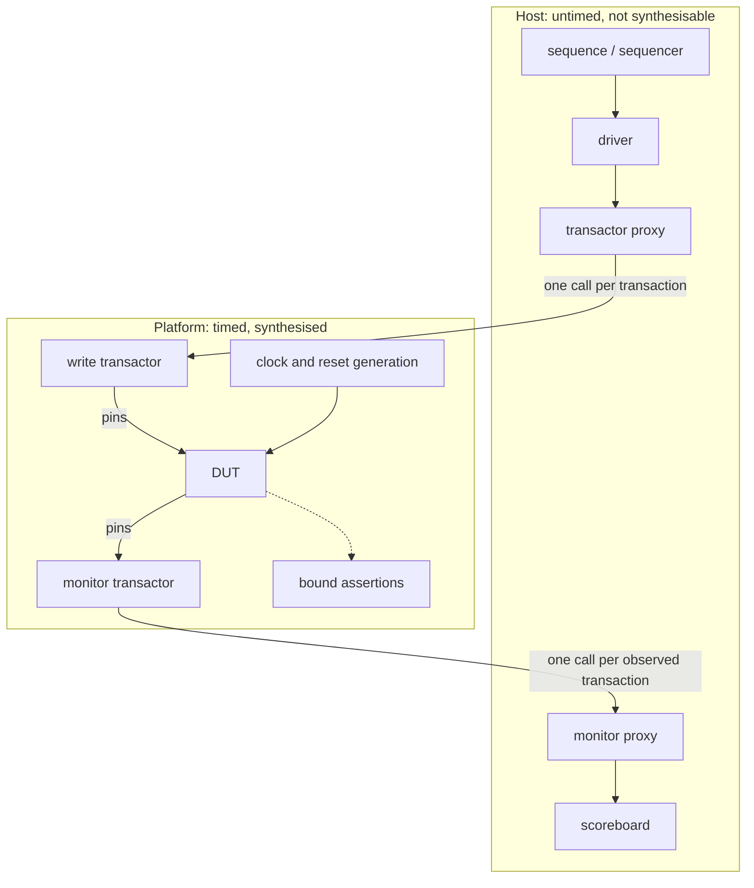

# 17. Acceleration and Emulation

Hardware-assisted verification addresses workloads too long for RTL simulation, with speed and visibility traded against each other. The flagship SoC's full-chip milestone illustrates the scope: one acceptance criterion, written eighteen months earlier and never disputed, requires four application cores to boot the operating system to a shell prompt, the mesh NoC to carry real traffic, LPDDR4 PHY training to finish, and the DMA to move data under the host cluster's coherence protocol. This agreed criterion marks the first product-like behavior.

The reference SoC had an equivalent gate (the core boots, the DMA moves a buffer and the UART prints) and it was a bare-metal image of a few tens of kilobytes and a couple of million cycles, comfortably inside the eleven-minute mean of that project's nightly runs (see Chapter 12). The flagship's boot is an operating system: page tables, drivers, an interrupt controller, a filesystem: several seconds of real execution, which at any application-class clock is billions of cycles. The simulation farm cannot deliver that boot before tape-out regardless of farm size, because a boot is *one run* and serial: two hundred and forty simulator licenses shorten a suite without shortening a single test.

Without hardware-assisted verification, the project first encounters the operating system in the lab. Both choices are expensive; mistaking a slow testbench for an unsimulatable workload can misdirect the decision. This chapter distinguishes those two problems and the tradeoffs of running a design a thousand times faster while observing almost none of it.

### Chapter map

§17.1 quantifies simulation's cycle limit. §17.2 compares compilation, visibility and debug ergonomics across simulators, emulators and prototypes, including their workflow costs. §17.3 explains the two use models, in-circuit and virtual, their benefits and limits, and the shift toward virtual operation. §17.4 derives how the transactor boundary determines throughput and limits batching gains. §17.5 covers planning for a shared, scheduled capital resource and diagnoses misframed simulation problems.

## 17.1 Simulation's cycle limit

RTL simulation runs roughly a billion times slower than the clock of the system it models. An activity taking a few seconds of execution on the target silicon (booting an operating system is the canonical example) takes several years on an RTL simulator, which precludes running software on top of an RTL model at all and confines RTL simulation to short directed or random tests. When mapped onto a reconfigurable fabric or a purpose-built emulator the same RTL runs about a hundred to a thousand times faster than the simulator, which puts that operating-system boot back inside a few hours [cit:P21].

These are order-of-magnitude claims: the speed-up band spans a factor of ten, and the position within it depends on design size, on how much of the system is instantiated, and on how much instrumentation is compiled in. The slowdown also spans a band: this book uses tens of thousands at the low end and a billion at the high end. The high end is the cited figure relative to a full application-class system's target clock; the low end is this book's own: the reference SoC's equivalent boot gate, a couple of million cycles comfortably inside an eleven-minute nightly mean, ran a few tens of thousands of times slower than its silicon rather than a billion. Across the stated ratios, an application-class boot requires *years* of one simulation and *hours* of one emulation run, beyond a nightly window.

**Simulation serializes design activity.** An event-driven simulator serializes the design's parallel activity: every signal change becomes a software event, and every process sensitive to that signal is re-evaluated in sequence. A million gates switching in the same design cycle are a million pieces of work for one processor. For two decades the industry absorbed this through increasing processor frequency, but as frequency scaling plateaued, simulation-based techniques stopped keeping pace with design complexity (most visibly on large designs that instantiate both software and embedded processor core models), which is why acceleration techniques are now essential [cit:R2]. An individual RTL simulation does not usefully exploit multiple cores [cit:D33]. Compute available to one run has been flat for years.

**Regression and instrumentation multiply the cost.** The arithmetic covers a single execution of a single workload, whereas verification requires multiple executions. Chapter 12's flagship nightly *candidate* list totals 6,400 simulations and 4,409 CPU-hours, already requiring re-tiering, ranking and pruning to fit a night. Instrumentation also has a cost: in a Mentor Graphics team's published measurement, introducing accurate metastability injection models into a design degrades simulation performance by three to four times, which is why metastability-tolerance verification cannot live in a nightly regression on a large design [cit:D34] (see Chapter 13).

**The parallelism fallacy.** A farm's width multiplies *runs*; it does not shorten a *run*. Licenses address a 4,800-run random suite. For one workload whose length is measured in billions of cycles, licenses are irrelevant: cycle *n* of a boot depends on cycle *n*−1, so a single run has no parallel fraction to exploit and additional farm width cannot shorten it. Before considering capital equipment, planning should distinguish the number of runs from the length of one run.

**Workloads requiring long histories.** Simulation cannot reach bugs requiring a long history whose events remain correlated and self-consistent; these workloads derive value from *length* rather than randomness.

> **Scenario.** A video codec's rate-control loop adapts quantization to a rolling estimate of channel occupancy. In simulation the team checks a few macroblocks against the bit-exact reference model per run, and everything matches. In the lab, encoded streams drift out of the target bitrate after a scene change followed by a long static passage. **Approach.** The scenario is put on the emulator: several hundred frames of a real sequence, driven through the same reference-model comparison, run end to end. **Why.** The control loop retains hundreds of frames of memory, so only length exposes the bug: its shortest effective stimulus exceeds simulation's reach, and additional random seeds cannot find it as a data corner case.

The same shape covers an operating-system boot, a GPU driver whose interesting failures live in queue and residency management across many submissions rather than in any single shader, and a mesh NoC whose latency distributions and virtual-channel occupancy only become meaningful statistics over sustained traffic (see Chapter 16).

**Comparison across generations.** The two generations retain the same approach for the unchanged verification problems. {ref: generation_contrast} sets out the unchanged contracts and the work added by scale.

{table: generation_contrast} One verification problem per row, with the approach each generation of the example SoCs takes to it. The rows marked *unchanged* are the surprise: block-level constrained-random work carries forward intact to the larger design, and what the second generation adds is not a harder version of an old problem but a new class of workload — one long, coherent, software-driven execution — that no amount of simulation capacity delivers.

| Problem | Reference SoC | Flagship SoC |
|---|---|---|
| DMA 4 KB legalization, 2D transfers, negative stride | Constrained-random simulation, multi-seed | *Unchanged* — constrained-random simulation, more seeds, eight channels |
| Register and peripheral suites | Simulation | *Unchanged* — carried forward |
| Boot to a working system | Bare-metal image, a couple of million cycles, one nightly run | Operating system; no simulation answer at any farm size |
| Interconnect congestion behaviour | Crossbar arbitration, proved and simulated at block level | Mesh NoC latency and occupancy statistics under sustained load |

Chapter 12 showed the flagship's DMA suite carrying forward directly: a suite of 4,800 independent runs is the workload a license farm is good at, and moving it to a machine that runs one image at a time would be a mistake (Section 17.5 does that arithmetic). The second generation adds a *new class* of workload (one long, coherent, software-driven execution) that the first generation never had and that no amount of simulation capacity delivers. Emulation addresses this specific workload; applying it to independent regressions can leave an idle multi-million-dollar machine and an unfinished suite.

## 17.2 Three platforms and their costs

In emulation, the design is *compiled*, synthesized and partitioned onto hardware execution fabric, then runs under host-provided stimulus. The fabric defines three deployment categories: one or more commodity FPGAs (prototyping); a vendor-built system with its own compilation, transactor and debug infrastructure (an emulator proper); or a split in which a virtual platform on the host runs the well-modeled parts while an emulator runs selected RTL at cycle accuracy, joined by transaction-level co-modeling channels (hybrid co-emulation). Prototypes and emulation systems alike operate at MHz-scale effective speeds on large SoCs, against a simulator's hundred-to-thousand-times-slower rate (Section 17.1) [cit:P14]. A design capacity on the order of a billion gates is within reach of an emulator [cit:D34], and in the 2024 industry study emulation adoption rises significantly for designs above one billion gates [cit:R2].

The three costs beyond speed are compared in {ref: platform_comparison}, below each platform's benefits.

{table: platform_comparison} A simulator, an emulator and an FPGA prototyping platform compared row by row: throughput and capacity are what the hardware platforms buy, and the rows beneath them are what each hands over to get them. The pair that reorganises how people work is build time against changing what you observe — on these platforms a signal that was not brought out before the build cannot be looked at without another build. §17.5 adds the cost in money.

| | Simulator | Emulator | Prototyping platform |
|---|---|---|---|
| **Throughput** | baseline | 10²–10³× the simulator | the fastest pre-silicon platform |
| **Capacity** | bounded by host memory and patience | order of a billion gates | device capacity; above it, multi-FPGA partitioning |
| **Build time** | minutes | hours to days for a complex design | hours for a bitstream |
| **Visibility** | any internal signal, at any time | triggers, selective trace, save/restore | a few thousand signals, chosen *before* the build |
| **Changing what you observe** | edit and re-run | re-arm a trigger; recompile if the signal was never brought out | recompile the bitstream |
| **Parallel width** | licences (hundreds) | capacity ÷ design size | capacity ÷ design size, replicated per board |

**Visibility.** In a simulator, virtually any internal design signal is observable at any time. On a reconfigurable fabric (the fastest of the pre-silicon platforms) observability is restricted to a few thousand internal signals, and they must be selected before the bitstream is generated; reconfiguring observability means recompiling, which might take several hours [cit:P21]. Emulators soften this with controlled observability mechanisms (triggers, selective trace and save/restore) but they do not remove the constraint, only move it: capturing every internal signal at full speed over billions of cycles is infeasible, so a subset of signals or trigger conditions is chosen a priori, and a failure arising from an unmonitored interaction requires the same long compile [cit:P14].

**Turnaround shapes the workflow.** Compile times of hours to days for complex designs, worsened by instrumentation, are reported for large emulation flows [cit:P14]. In simulation an engineer can edit, rebuild in minutes and have an answer the same morning: the reference SoC's smoke tier is under nine minutes end to end, most of it build (see Chapter 12), so it is feasible to revise a mistaken observation choice, ten times a day. An emulator may allow *one* build per day, sometimes fewer. In this example, every observation omitted before the build costs a day.

Emulation engineers should instrument for the questions they expect, compile in assertions and monitors rather than planning to add them later, and treat signal visibility as a review decision made before debug. Once built, an image is reused across many hours or days of execution, regressions and campaigns, so the build is paid once and divided by everything that runs on it [cit:P14]. A build supporting one run bears the full build cost; across two hundred runs, that cost is amortized over the group. Section 17.5 turns that into a decision rule.

**Debug ergonomics.** Per-beat logging and unrestricted waveform dumping conflict with emulation's throughput and trace limits. A `$display` on every bus beat forces a host interaction per cycle and destroys throughput (Section 17.4). Waveform dumping is bounded by a finite trace buffer, not by disk. The replacement is assertions compiled into the platform as part of the model, reporting violations immediately (logged, or stopping the run at the violation) and trigger-based debug, where large numbers of cycles run under trigger state machines built to recognize complex sequences of events. Placing an assertion near a suspected cause makes a long run debuggable, since a failure on an accelerated platform routinely surfaces far from its cause and much later, as injected metastability does [cit:D34]. Chapter 11 explains that an assertion is *declarative*: it says what to check and leaves the mechanism to the tool, which is why the same three lines serve a simulator and an emulator alike. An assertion needs no conversation with the host, so it is the one form of checking that crosses the boundary intact and keeps *detection distance* short (see Chapter 8) where nothing else can.

> **Scenario.** A mobile GPU's driver-level bring-up needs many thousands of frame submissions to shake out queue and residency management, but the application cores that run the driver are mature, well-modeled IP with no open verification questions. **Approach.** Hybrid co-emulation: the cores stay as fast host-side models, the GPU's four shader clusters and its memory path go on the emulator, and the two exchange transactions. **Why.** Three benefits follow: the RTL footprint on the scarce machine shrinks, mature models are used for the mature IP, and cycle accuracy is preserved exactly where the open questions are [cit:P14]. The constraint is that the boundary between virtual and RTL is now a modeling assumption the team must be able to defend: any bug whose mechanism straddles it is invisible by construction.

The book uses stricter terminology than the industry. An emulator runs a design *model*, so its use is pre-silicon verification. An FPGA prototype on a bench with real peripherals attached is closer to what this book calls **validation** (checking on real hardware rather than on a model), which is why prototyping and the software work it enables get their own treatment (see Chapter 18), and post-silicon another (see Chapter 20). This distinguishes evidence about a design from evidence about a board.

## 17.3 Use models: in-circuit and virtual

Exactly two use models provide stimulus to the emulated design. In **in-circuit emulation** (ICE), real physical peripherals drive the emulated design: a host, a link partner or test equipment. In the **virtual** or **targetless** model, there is no physical target: the environment is a synthesized testbench on the platform plus software models on the host, and the design is driven through transactors.

The two ends of ICE run at different speeds. The design executes at MHz; the real link runs at its specified rate, typically orders of magnitude faster, with timeouts. A *speed adapter* bridges them, supplied alongside protocol transactors for hardware interfaces such as USB, Ethernet and PCIe [cit:D33]. It buffers, throttles and re-times traffic to keep the physical link within specification while the design runs slowly. The design therefore receives real *content* at adapter-generated *timing*.

**ICE capabilities.** Three capabilities follow: a real driver stack produces ordering quirks and buggy scenarios beyond constrained-random stimulus; third-party interoperability needs no model of the other party; and instrument-only compliance procedures can run.

> **Scenario.** A USB 3.x dual-role controller's link-training and low-power rows (the U0 through U3 transitions) were assigned in the vplan to the USB compliance suite, with the suite's own item list as the closure metric (see Chapter 5). **Approach.** ICE: the emulated controller is connected through a speed adapter to the physical compliance instrument, and the suite is executed as the compliance methodology defines it; the tests are specified not by the USB specification itself (*Universal Serial Bus 3.2 Specification*, Revision 1.1) [cit:S21] but by a separate compliance methodology document. **Why.** There is no file of vectors to replay: the suite is a procedure driven by an instrument, with electrical and timing components as well as protocol ones, and reimplementing it as a virtual transactor would mean reimplementing the specification being checked independently. **Scope of row closure.** The speed adapter sits between the design's pins and the instrument, so what closes here is the *protocol-state* half of each row. Timing at the pins is the adapter's, not the design's, and those rows stay open until silicon (see Chapter 20). A row that records "compliance suite passed" without that split is claiming evidence it does not have.

**ICE limits drove the shift toward virtual operation.** ICE loses repeatability: a real link partner's failure has no seed or replay. Chapter 12's apparatus (run manifests, deduplication by failure signature, the repeat-N stability check before a test may gate) assumes a run is a function of recorded inputs, and a failure that cannot be reproduced cannot be triaged. Scheduling is constrained by a physical, local, singular rig, one bench and one set of cables, conflicting with Section 17.5's economics. Unattended operation is lost because someone must plug in the device. Save/restore is also lost because the physical environment cannot be rewound.

**Virtual emulation controls model time.** In a virtual environment built on the Standard Co-Emulation Modeling Interface (SCE-MI) (supported across emulation vendors) the platform provides full simulation interoperability, including simulation-style clock generation *on the emulator* and accurate tracking of model simulation time inside it, to the point of being able to measure the distance in model time between a transmit clock edge and a receive clock edge [cit:D34]. That interface is a published Accellera standard, the SCE-MI Reference Manual, Version 2.4, whose time-access section specifies how the software side obtains the current simulation time and the precision it is expressed in [cit:S22]. When the platform owns model time, execution can stop, resume and replay, with an event placed at an exactly chosen instant, enabling deterministic reruns, controlled clock relationships, injection at a specified cycle, and a debug environment that behaves like a simulator's.

Virtual emulation environments offer almost all of the simulation-style debug features (interactive run control against model time, waveform display, full or selectively traced waveforms, source browsing) and virtual emulation is repeatable, which is what makes an elimination strategy possible: disable a subset of the injection points, rerun the identical scenario, and see whether the failure persists [cit:D34]. The same environment can serve both simulation and acceleration when it is built to the standard [cit:D33], further supporting the migration.

> **Scenario.** A radar front-end's FFT and CFAR pipelines are being verified for fixed-point precision: every intermediate result must match a bit-exact reference across long chirp sequences, in three arithmetic configurations. Attaching the real RF front-end in ICE is technically possible. **Approach.** One real chirp sequence should be captured in the lab, its digitized samples stored and replayed from the host through a virtual transactor: the same file, three times, once per configuration. **Why.** A bit-exact comparison requires the *same* input twice. A live front-end delivers a different realization of noise on every run, so a mismatch between two configurations cannot be attributed to either of them, and a failure cannot be reproduced for debug. ICE's environmental realism has no value for this arithmetic property; the one useful contribution, a realistic signal, survives as a recording.

**ICE is appropriate when the environment cannot be modeled; virtual operation is appropriate otherwise.** A compliance instrument, a third-party host and a driver stack the team does not own are environments that justify accepting irreproducibility. Noise, traffic patterns and workloads are recordable, indefinitely replayable *data*, so they do not justify irreproducibility.

## 17.4 The transactor boundary

Chapter 8 introduced the transactor as an abstraction device: every physical-level operation of one interface encapsulated in one place, so everything above it speaks transactions. In acceleration, it becomes a physical boundary. Below it, the design is synthesized onto the platform and runs at the platform's clock rate; above it, code runs on a workstation. Between them is a link with latency, and the placement of that boundary, rather than the platform's headline frequency, determines throughput.

**Signal-level acceleration creates a bottleneck.** In a conventional environment, bus-functional behavior resides in the UVM driver and monitor, which drive pins through a virtual interface. Accelerating only the DUT puts the design on-platform but leaves the protocol in the class, forcing every single pin event across the link. This is *signal-level acceleration only*, and it is the bottleneck [cit:D33]. A workstation thus feeds a billion-gate MHz machine one clock edge at a time.

Chapter 8 states that an environment that reaches into signals from twenty places cannot be moved at all; Chapter 10 states why: a UVM component (IEEE Std 1800.2-2020, *IEEE Standard for Universal Verification Methodology* [cit:S9]) is not synthesizable, so it cannot cross to the other side. The required boundary belongs at the transaction, as {ref: transactor_boundary} shows.



{figure: transactor_boundary} Where the transaction boundary cuts an accelerated environment: the upper box is untimed, not synthesisable and runs on the host, the lower box is timed, synthesised and running on the platform, and the cut carries exactly one call per transaction in each direction. What matters is what has no counterpart above the boundary — clock and reset generation, and the bound assertions, all sit below it, so nothing on the host is consulted per cycle.

Clock and reset generation and assertions are absent from the host, whose code knows no clock edges and is never consulted per cycle; a monitor transactor feeds the scoreboard at transaction rate, while assertions require no host interaction.

Siemens EDA's Verification Academy publishes a checklist for that partition: three requirements a testbench must meet before it can be accelerated, requiring that the verification code be entirely untimed, that timed and untimed code live in separate domains, and that no reference cross between them, with each transactor split so that its untimed half stays on the host as a proxy and its timed half becomes a bus-functional model on the platform [cit:B8].

### The arithmetic of the boundary

Let *f* be the platform's clock rate, let *N* be the number of design cycles the platform advances between host interactions, and let *L* be the cost of one host interaction expressed in equivalent design cycles. Each period delivers *N* cycles of design progress and costs *N* + *L*, so the effective rate is

**R(N) = f · N / (N + L).**

Pin-level driving is the case *N* = 1, giving *f*/(1 + *L*). Batching to *N* cycles per interaction therefore gives a speedup of

**S(N) = R(N)/R(1) = N (1 + L) / (N + L),**

with two limiting properties. It **saturates at 1 + *L*** regardless of *N*, so batching cannot exceed the round-trip cost itself. And it reaches exactly half of that ceiling at ***N* = *L***. Transaction granularity should therefore be comparable to round-trip cost, with optimization stopping once it is; transactions alone are insufficient.

*L* is large, and it is the parameter least under the team's control: it is a driver call, a link traversal, host scheduling and a return, measured against a clock period that at MHz-scale rates is of the order of a microsecond. Taking it as somewhere in the tens to the thousands of cycles, {ref: batching_fraction} gives the fraction of the machine's peak rate the testbench obtains, *N*/(*N* + *L*).

{table: batching_fraction} The fraction of an accelerated platform's peak rate a testbench actually obtains, *N*/(*N* + *L*): rows are the design cycles *N* that one host interaction covers, columns three values for the round-trip cost *L* of that interaction expressed in equivalent design cycles. The top row is pin-level driving, which throws away nearly everything the machine was bought for; the rightmost column is the warning against complacency, since on a costly link even the longest burst the protocol encodes still leaves you at 11% of peak, and the remedy there is a coarser transaction rather than a faster link.

| Cycles per host interaction | *L* = 20 | *L* = 200 | *L* = 2000 |
|---|---:|---:|---:|
| 1 (pin-level) | 4.8% | 0.5% | 0.05% |
| 16 (a short burst) | 44% | 7.4% | 0.8% |
| 256 (the longest burst AXI encodes) | 93% | 56% | 11% |

Pin-level driving throws away between 95% and 99.95% of peak throughput, so accelerating only the DUT produces an expensive simulator. The rightmost column shows that on a platform with a costly link, even the longest burst the protocol can express leaves the testbench at a tenth of peak. That case calls for a *coarser* transaction, such as a descriptor, page or frame, rather than a faster link.

### Drawing the boundary in code

The change is small and entirely local: timed protocol behavior moves from the class into a synthesizable transactor module exporting a host-callable task; a host proxy imports it, and the driver's body becomes a single call. Below the boundary, the flagship DMA's write transactor issues one burst using 40-bit physical addresses on a 512-bit channel:

```systemverilog
// ---- Below the boundary: synthesised onto the platform. One call = one burst.
module wr_xactor #(parameter int ADDR_W = 40, parameter int DATA_W = 512) (
  input  logic              clk,
  input  logic              rst_n,
  output logic [ADDR_W-1:0] awaddr,
  output logic [7:0]        awlen,
  output logic              awvalid,
  input  logic              awready,
  output logic [DATA_W-1:0] wdata,
  output logic              wlast,
  output logic              wvalid,
  input  logic              wready
);
  logic [31:0] lfsr;

  export "DPI-C" task do_write_burst;

  task do_write_burst(input longint unsigned addr,
                      input byte unsigned    len,
                      input int unsigned     seed);
    lfsr = seed;
    @(posedge clk);
    while (!rst_n) @(posedge clk);
    awaddr  <= ADDR_W'(addr);
    awlen   <= len;
    awvalid <= 1'b1;
    do @(posedge clk); while (!awready);
    awvalid <= 1'b0;
    for (int i = 0; i <= int'(len); i++) begin
      lfsr   = {lfsr[30:0], lfsr[31] ^ lfsr[21] ^ lfsr[1] ^ lfsr[0]};
      wdata  <= {(DATA_W/32){lfsr}};
      wlast  <= (i == int'(len));
      wvalid <= 1'b1;
      do @(posedge clk); while (!wready);
    end
    wvalid <= 1'b0;
    wlast  <= 1'b0;
  endtask
endmodule

// ---- Above the boundary: what the untimed testbench calls, once per burst.
interface wr_xactor_proxy;
  import "DPI-C" context task hdl_do_write_burst(input longint unsigned addr,
                                                 input byte unsigned    len,
                                                 input int unsigned     seed);
endinterface
```

Four aspects of the code determine acceleration behavior. Three of them restate the standard acceleration guidelines [cit:D33]; the fourth is the lesson those guidelines leave implicit.

*The task is timed and the call is not.* Everything that waits on `clk` is inside the module; the proxy above declares no clock and the driver never mentions one. The testbench must synchronize on transactions and events, never on clocks. A driver that waits for an edge has re-created the pin-level case by another route.

*One call covers `len` + 1 beats.* With `awlen` at its maximum of 255 that is a 256-beat burst (the *N* = 256 row of the table) for a single host interaction. That row is the protocol's ceiling, not this channel's: a beat here is 512 bits, so 64 bytes, and 256 of them would move 16 KB and cross three 4 KB frontiers. The legalization discipline this DMA inherits caps a legal INCR burst at 64 beats, which is exactly one 4 KB frame. So a single call reaches somewhere between the table's second and third rows, and the gap to the third row is not something a longer burst can close. When one legal burst is not granularity enough, the next transaction up is a descriptor, rather than a bigger burst.

*The same source serves both engines.* The transactor is ordinary SystemVerilog that a simulator will execute directly, so one environment supports simulation and acceleration, and a bug found on either platform is reproducible on the other; this holds for exactly as long as the two remain one source, a condition difficult to sustain (see *In practice*).

*The payload is manufactured on the platform.* The host passes a 32-bit `seed`; the shift register produces the data. Randomizing payloads on the host and shipping a 512-bit beat for every beat restores one host interaction per beat, plus data volume. When a metastability-injection methodology needed an uncorrelated random decision at every clock-domain-crossing point, a stream of random values arriving from the workstation was rejected for the logic needed to distribute the values and the runtime needed to transfer them, in favor of an on-platform shift-register generator whose bits are statically distributed among the injection points [cit:D34]. Per-cycle environment operations must become hardware, determining how much testbench code needs rewriting.

### Testbench costs at the boundary

The platform accepts a superset of RTL (implicit state machines, some system tasks, shared variables, hierarchical names and named events are all typically compiled) but the common denominator is still *synthesizable plus DPI-C*, and the DPI itself is a restricted subset: the usable argument types are limited, nesting of imported and exported calls is bounded, and four-state values may be reduced to two-state at the boundary [cit:D33].

**X-dependent checks remain in simulation.** The reduction to two-state is documented at the DPI boundary; in practice the prudent assumption is broader, because a fabric of real gates has no third value to propagate. Checks requiring an unknown to reach an output, such as an uninitialized-register detector or a reset-coverage check, should remain in simulation (see Chapters 12 and 13). The port should identify which checks moved and which did not.

**Checking splits by where its cost lands.** An assertion compiled into the platform costs logic and no interactions, so it scales to billions of cycles. A scoreboard on the host costs one interaction per transaction it must see, so it scales to whatever transaction rate the table above allows. An oracle that needs to see *every beat* costs one interaction per beat and does not scale at all, which means it has to be redesigned rather than ported.

> **Scenario.** An inline AES-GCM crypto engine on the memory path is checked in simulation by a host-side scoreboard that compares every ciphertext beat against a reference model. The team wants a multi-hour soak with real firmware driving real traffic through it. **Approach.** The oracle requires restructuring. A synthesizable digest accumulator on the platform hashes the ciphertext stream and the authentication tags; the host reads and compares one digest per checkpoint (say every few thousand blocks) instead of one value per beat. Per-beat comparison remains a short-vector check in the simulation tier. **Why.** Long emulation runs become host-bound when oracle cost scales with beats. On-platform per-cycle work and one host interaction per checkpoint make the soak possible. **What it costs.** Detection distance (see Chapter 8): a digest mismatch says the stream diverged somewhere in the last checkpoint interval, not where. Checkpoint intervals are necessary and bound the debug bisection.

## 17.5 Economics: one machine, many claimants

Emulation requires capital equipment rather than license seats, complicating its introduction into a verification program. The cost of acquiring and maintaining a full-featured emulator confines it, in practice, to a limited number of large design houses, and even inside those, emulator slots are shared across multiple projects and teams and have to be scheduled and prioritized; capacity is typically reserved for tape-out-critical functional regressions, so that other campaigns get a subset of high-risk blocks or get deferred to later project stages [cit:P14]. A simulation license pool degrades gracefully under contention, whereas emulator access is either granted or unavailable.

Hardware-assisted verification was estimated at USD 760.4 million in 2025, split roughly 61% emulation to 39% prototyping, and projected to reach USD 3.08 billion by 2035 at 15.0% compound growth; an independent estimate puts 2024 at USD 641.5 million growing to USD 1.5 billion by 2030 at 15.2%, against a total electronic-system-design industry that reported USD 5.6 billion of revenue in a single quarter of 2025 [cit:P14]. The book interprets the segment's small size and rapid growth as consistent with a shift from optional to necessary equipment. As a capital purchase, the machine calls for calendar planning, handled by a senior manager in this example; a request for three days belongs in the project plan.

In the 2024 industry study the leading reason projects adopt emulation or prototyping is hardware/software co-design and verification, with post-silicon debug well down the list [cit:R2]. When software readiness justifies the machine, verification shares access under the resulting scheduling priorities.

### Workload placement by wall-clock cost

The workload contains *N* runs. On the farm, wall-clock cost is *N·s*/*W*<sub>sim</sub>, where *s* is per-run simulation time and *W*<sub>sim</sub> the license count. On hardware, it is *B* + *N·r*/*W*<sub>hw</sub>, where *B* is the build and *r* the per-run execution time. Hardware parallel width, *W*<sub>hw</sub>, is capacity divided by design size, rather than a separately purchased quantity. A block-sized image replicates across boards cheaply, which is why an eight-board cluster can run a suite in parallel (see Chapter 12), while a full-SoC image occupies the machine, and *W*<sub>hw</sub> = 1.

The flagship provides two cases.

**The OS boot.** *N* is a handful of runs per design revision; *s* is years (Section 17.1); *r* is a few hours [cit:P21]; *B* is hours to days. Simulation costs years per run and *W*<sub>sim</sub> cannot help, because a license pool shortens suites and not runs. Hardware costs a build plus an afternoon. Break-even is below one run, so the workload requires a slot without further business justification.

**The DMA legalization suite.** Chapter 12 gives the numbers: 4,800 constrained-random runs at a 30-minute mean, 2,400 CPU-hours, ten hours of wall clock on 240 licenses. If moved, even at the optimistic end of the 100–1000× band (and that band is the platform's *raw* rate, before the boundary derating of Section 17.4, which only makes this worse), *r* is under two seconds, but *W*<sub>hw</sub> is 1, so 4,800 runs cost about 2.4 hours of machine time (against simulation's ten hours, a real gain) and then the total includes *B*, a build that takes hours to a day. The build *B* is paid **per design revision**, as is every nightly suite. A build measured in hours, incurred every night, against ten hours on existing licenses, yields no gain. At the pessimistic end of the band the emulator loses on run time alone.

Hardware is favored when *s* is enormous and *N* is small; the farm is favored when *N* is large and *s* is moderate. Independent runs favor width over speed, explaining Section 17.1's comparison.

### Admission criteria for emulator time

The admission policy is a tier in Chapter 12's sense, a budgeted rule for admission, with a different currency. A tier spends fungible CPU-hours, whereas emulation spends nonfungible *machine days and build slots*. Three claims earn a slot, and one rule protects it:

1. **Workloads with no simulation answer**: boot, firmware, long soaks, sustained-traffic statistics on the mesh NoC (see Chapter 16).
2. **Campaigns valued for iteration count under one image** include fault-injection sweeps and adversarial campaigns whose practical effectiveness depends on high iteration counts and repeatability, with build cost amortized across the sweep [cit:P14]. Full-chip metastability-tolerance verification belongs here too: the accurate injection models are exactly the ones that cost 3-4× in simulation (Section 17.1), which is why they run on hardware (see Chapter 13). That same team reports the degradation as tolerable on a small block and enough to make the traditional flow impractical as designs grow, supporting the move onto hardware [cit:D34]. Its "often 1000X" figure for emulation over simulation is a general remark with no benchmark behind it, and this book does not use it; the 100–1000× band this section costs workloads against comes from [cit:P21] instead.
3. **Reproductions of failures found downstream.** Recreating a silicon failure on an acceleration platform gave one industrial team all the data a designer needed for root cause, because the platform has the observability silicon lacks, though the failure could not be migrated as-is, since silicon runs more than six orders of magnitude faster and the exerciser had to be re-tuned to hit it [cit:P21]. Describing the scenario portably rather than per-platform makes migration cheap enough to be routine [cit:D29] (see Chapters 9 and 20).
4. **Farm-suitable workloads are excluded.** The admission policy must enforce this exclusion.

Chapter 5's vplan row already carries a *method* field naming the engine that discharges it. An emulation row needs one additional column: **the image it runs on**. Because the image is the scheduling unit, emulation rows are batched by image rather than by priority: a low-priority row that fits an image already being built is nearly free, and a high-priority row needing its own instrumentation costs a build. Images should be planned before rows are assigned; reversing that order can leave top-priority rows across five unscheduled builds in this example.

### Workloads better served by simulation

Three diagnostic cases can justify refusing emulator time; in this example, each can be diagnosed in an afternoon.

*The testbench is what is slow.* Per-item object allocation, dynamic dispatch and a report server on the message path cost nothing on a ten-thousand-cycle block run and a great deal on a long one (see Chapter 10). Profiling should precede machine costing: if the design takes a minority of runtime, the problem and fix are software.

*Every run boots from zero.* A workload that spends 90% of its cycles reaching the state under test does not need a faster engine; it needs a saved state, or a shorter path to that state.

*The stimulus is badly shaped.* A system-level soak can substitute for unwritten block-level stimulus that would reach the same coverage directly, at greater expense. Emulator time is, in that case, being bought to avoid rewriting a test, a poor trade because the soak also finds the bug more slowly and localizes it worse.

Section 17.1 distinguishes run count from run length; only the latter justifies emulation.

### In practice

Monitors and harnesses frequently have to be re-engineered to fit emulator timing and capacity constraints, which produces divergent simulation and emulation environments and subtle inconsistencies in observed behavior, complicating debug and making it harder to reproduce an issue across platforms [cit:P14]. Maintaining one source for both engines and scheduling the same scenario across platforms should expose divergence before a tape-out escalation, as a standing commitment.

Planning should account for the additional orchestration work described below. Regression management tooling routinely schedules thousands of simulations, analyzes coverage and tracks closure; extending it to schedule long hardware campaigns is non-trivial, emulator jobs have to be co-optimized against functional runs, and campaigns requiring coordinated software stacks add orchestration complexity of their own [cit:P14]. A planning example can assume a small build team distinct from test writers, a failed build costing a day with jobs queued behind it, and next week's allocation decided in a meeting the requesting engineer may not attend. These constraints call for planned images and instrumentation before execution, without arguing against emulation.

### Pitfalls

1. **Accelerating the design and leaving the environment alone.** *Symptom:* an extremely expensive machine delivering a few thousand cycles per second. *Cure:* move the timed protocol into synthesizable transactors and batch to a granularity comparable to the round-trip cost (Section 17.4).
2. **A required signal was not brought out.** *Symptom:* every interesting failure ends in "rebuild with more probes", at a day each. *Cure:* choose observability in a review before the build, and compile assertions in rather than planning to add probes later.
3. **Buying capacity for a farm problem.** *Symptom:* the machine idles while the nightly overruns. *Cure:* distinguish *N* from *s* before requisitioning equipment, and profile the run to confirm that design execution occupies the majority of it.
4. **In-circuit by default.** *Symptom:* irreproducible failures and a bench unavailable to other users. *Cure:* virtual unless the environment itself is the unmodelable thing; record and replay anything that is only data.
5. **Porting the oracle instead of restructuring it.** *Symptom:* a per-beat scoreboard pins throughput at transaction rate and the soak never finishes. *Cure:* per-cycle checking on the platform, one host interaction per checkpoint.
6. **Treating a compliance pass as a closed row.** *Symptom:* an electrical requirement marked covered because a suite ran through a speed adapter. *Cure:* split the row: protocol state closes pre-silicon, timing at the pins does not.

### Summary

- RTL simulation is roughly a billion times slower than the target clock: seconds on silicon become years in simulation, and hardware-assisted platforms recover a hundred to a thousand times of that [cit:P21]. The slowdown spans tens of thousands at reference-SoC scale to a billion at full application-class scale, with the same conclusion throughout.
- One distinction governs triage: run count versus run length, because a license farm shortens suites but can never shorten a run.
- Visibility, turnaround and debug ergonomics involve signals and triggers chosen before building, a build rate that may be one a day and sometimes fewer, and checking planned in advance.
- The transactor boundary determines throughput beyond the platform's clock rate. Batching to *N* cycles per host interaction saturates at 1 + *L* and reaches half that at *N* = *L*, so granularity should match round-trip cost without further optimization.
- Per-cycle needs, including payload generation, randomization and per-beat checking, require hardware implementation and determine how much testbench code needs rewriting.
- Virtual operation is preferable unless the environment is genuinely unmodelable, because control of model time enables repeatability, replay and simulator-like debug.
- Images should be planned before rows: the image schedules the shared capital resource, while row-priority planning conflicts with the build calendar.

### Exercises

**Exercise 17.1 (calculation).** §17.4 gives the fraction of an accelerated platform's peak rate that a testbench obtains as *N*/(*N* + *L*), with *N* the design cycles one host interaction covers and *L* that interaction's round-trip cost in equivalent design cycles. Take the round-trip cost *L* = 200 of the batching table's middle column together with the legalization discipline of §17.4, which caps one legal INCR burst at 64 beats. Compute the fraction that one legal burst per host interaction obtains, and locate the result among the table's rows. Compute also the ceiling at which the batching speedup saturates and the batch size at which half that ceiling is reached, then state which of the two the burst cap leaves out of reach.

**Exercise 17.2 (artifact).** Read the plan row below, brought to the review that closes the compliance rows of §17.3. Decide which half of the criterion the recorded evidence closes and which half it leaves open, and name the platform element that forces the split. Name the column §17.5 requires of every row that runs on hardware, left empty here, and state what the scheduling of a shared machine loses without it.

```text
Row:                LNK-L07
Criterion:          the link-training and low-power state transitions follow
                    the published rules, with the specified timing at the pins
Platform:           in-circuit emulation through a speed adapter
Closure metric:     the compliance methodology's item list
Result:             suite passed
Status:             closed
Image:              (empty)
```

**Exercise 17.3 (judgement).** A lead proposes moving the reference SoC's smoke tier onto the emulator, so that the tier no longer waits on a simulation build. Decide what the build economics of §17.2 and §17.5 do to the proposal, separating the case in which a build is amortized from the case in which it is not. State the one workload property that would reverse the decision, and the admission criterion of §17.5 that a workload with that property satisfies.

**Exercise 17.4 (calculation).** §17.5 costs the DMA legalization suite on both platforms: 4,800 constrained-random runs at a 30-minute mean, ten hours of wall clock on 240 licenses, and about 2.4 hours of machine time if the suite is moved. Derive the per-run execution time that the machine figure implies, and show that the wall-clock figure on the farm follows from the run count and the license count. State which term of §17.5's placement model decides against the move, and why the machine's parallel width cannot offset that term.

**Exercise 17.5 (artifact).** Read the triage record below, filed after a first attempt at a multi-hour soak on the emulator. Decide which of the three classes of checking in §17.4 the oracle belongs to, and state why the observed throughput is a property of the oracle rather than of the platform. Name the restructuring §17.4 prescribes for an oracle of that class, and the cost §17.4 attaches to it.

```text
Workload:                firmware-driven traffic through the inline crypto engine
Platform:                emulator, virtual use model
Oracle:                  host-side scoreboard, one comparison per ciphertext beat
Compiled-in assertions:  none
Observed throughput:     the run advances at the rate the host accepts beats
Soak completed:          (no)
```

**Exercise 17.6 (judgement).** A plan proposes in-circuit emulation for a bring-up campaign whose environment is a third-party host the team does not model, and whose failures are required to gate a release under Chapter 12's stability check. Decide whether §17.3 licenses the use model for this campaign, and name the two losses of §17.3 that the gating requirement makes decisive. State how the plan should record the row that gates the release, following the scope split §17.3 applies to a row closed by a compliance suite.

### Further reading

Within the corpus, [cit:P21] is the anchor for this chapter's arithmetic (the billion-fold ratio, the hundred-to-thousand-fold recovery, the observability ladder from simulator to reconfigurable fabric to silicon, and the bitstream recompile) and its industrial case study is also an account of carrying a failure back from silicon onto an acceleration platform. [cit:P14] is a recent survey of hardware-assisted verification as a *workflow*: platform taxonomy including hybrid co-emulation, the compile-versus-execution distinction and its amortization, the observability and trace-buffer constraints, the divergence between simulation and emulation environments, and the market figures of Section 17.5; it is framed around security, but its platform and workflow analysis is general. [cit:D33] gives a step-by-step UVM conversion for acceleration, covering the transactor, exported task, proxy and guidelines, and merits full reading before a first port. [cit:D34] explains virtual emulation's advantages over ICE and illustrates the general problem of on-platform randomization. [cit:R2] supplies the 2024 adoption data by design size and the reasons projects give. [cit:D29] and [cit:S1] cover the stimulus side: describing scenarios once and retargeting them across simulation, emulation, prototyping and silicon. The corpus also holds the Accellera SCE-MI reference manual for Section 17.4: its use-model sections define the transactor boundary, and its time-access section governs model time [cit:S22].

Outside the corpus, P. Rashinkar, P. Paterson and L. Singh's *System-on-a-Chip Verification: Methodology and Techniques* merits consultation: its account of emulation and rapid prototyping predates most current tooling and explains the rationale for the use models.
