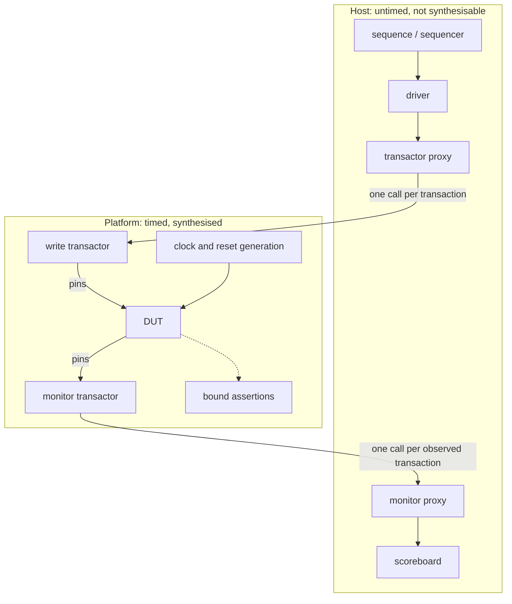

# 17. Acceleration and Emulation

The flagship SoC's full-chip integration milestone has one acceptance criterion, written eighteen months earlier and never disputed since: the four application cores boot the operating system to a shell prompt, with the mesh NoC carrying real traffic, the LPDDR4 subsystem out of PHY training, and the flagship's DMA moving data under the host cluster's coherence protocol. Everyone agrees it is the right criterion. It is, after all, the first moment at which the thing behaves like the product.

What breaks the milestone is arithmetic. The reference SoC had an equivalent gate — the core boots, the DMA moves a buffer, the UART prints — and it was a bare-metal image of a few tens of kilobytes and a couple of million cycles, comfortably inside the eleven-minute mean of that project's nightly runs (see Chapter 12). The flagship's boot is an operating system: page tables, drivers, an interrupt controller, a filesystem — several seconds of real execution, which at any application-class clock is billions of cycles. The verification lead runs the numbers and reports that the simulation farm cannot deliver that boot before tape-out. Not because the farm is too small. Because a boot is *one run*, and one run is serial: two hundred and forty simulator licences shorten a suite and do nothing whatsoever to shorten a single test.

This is the moment a project either buys into hardware-assisted verification or admits it will meet the operating system for the first time in the lab. The decision is expensive in both directions and is made badly more often than well — usually by a team that has mistaken a slow testbench for a workload that cannot be simulated. This chapter is about telling those two apart, and about what you get and give up when you move a design onto a machine that runs it a thousand times faster and lets you see almost none of it.

### Chapter map

- §17.1 states why simulation runs out of cycles, as arithmetic a reader can reproduce rather than as a truism about "big designs".
- §17.2 establishes what an emulator, a prototyping platform and a simulator each cost — in compile time, in visibility and in debug ergonomics — and which of those costs actually shapes the workflow.
- §17.3 develops the two use models, in-circuit and virtual, what each buys, what each forecloses, and why the industry drifted toward the virtual one.
- §17.4 establishes why the transactor boundary, not the platform's clock rate, decides throughput, with the arithmetic that says how much batching can possibly buy.
- §17.5 treats how a shared, scheduled, capital-intensive machine changes verification planning, and how to recognise the common case where the honest answer is a simulation problem, badly framed.

## 17.1 Why simulation runs out

Start with the ratio, because everything else in this chapter is a consequence of it. Simulation with RTL models is approximately a billion times slower than the target clock speed of the system it models. An activity taking a few seconds of execution on the target silicon — booting an operating system is the canonical example — takes several years on an RTL simulator, which precludes running software on top of an RTL model at all and confines RTL simulation to short directed or random tests. Map the same RTL onto a reconfigurable fabric or a purpose-built emulator and it runs about a hundred to a thousand times faster than the simulator, which puts that operating-system boot back inside a few hours [cit:P21].

Read those as order-of-magnitude claims, because that is what they are: the speed-up band spans a factor of ten, and where you land in it depends on design size, on how much of the system is instantiated, and on how much instrumentation you compiled in. Nothing in the argument turns on the exact ratio. Whatever point you pick, the same conclusion falls out — the boot is *years* of one simulation and *hours* of one emulation run, and no reordering of the numbers moves it into a nightly window.

**Why the ratio exists, and why it stopped improving.** An event-driven simulator turns the design's parallelism into its own serialism: every signal change is a software event, and every process sensitive to that signal is re-evaluated in sequence. A million gates switching in the same design cycle are a million pieces of work for one processor. For two decades the industry absorbed this by riding processor frequency, but as frequency scaling plateaued, simulation-based techniques stopped keeping pace with design complexity — most visibly on large designs that instantiate both software and embedded processor core models — which is why acceleration techniques are now essential rather than exotic [cit:R2]. The obvious way out does not exist either: an individual RTL simulation does not usefully exploit multiple cores [cit:D33]. The compute you can throw at one run has been flat for years.

**The multiplier nobody prices.** The arithmetic above is for a single execution of a single workload. Real verification does not consist of one execution of anything. Chapter 12's flagship nightly *candidate* list is 6,400 simulations totalling 4,409 CPU-hours — and that list already had to be re-tiered, ranked and pruned before it fit a night at all. Add the cost of the instrumentation that makes a run informative and it gets worse before it gets better: in a Mentor Graphics team's published measurement, introducing accurate metastability injection models into a design degrades simulation performance by three to four times, which is exactly why metastability-tolerance verification cannot live in a nightly regression on a large design [cit:D34] (see Chapter 13).

**The parallelism fallacy.** The most common wrong response to all of this is "we will add machines". A farm's width multiplies *runs*; it does not shorten a *run*. If your problem is a 4,800-run random suite, licences are the answer and this chapter is not. If your problem is one workload whose length is measured in billions of cycles, licences are irrelevant: cycle *n* of a boot depends on cycle *n*−1, so a single run has no parallel fraction to exploit and buying width does nothing to it. This distinction is the single most useful triage question in the chapter, and it is worth asking before any conversation about capital equipment: *is my problem the number of runs, or the length of one run?*

**The workloads that have no simulation answer share a shape.** They are the ones whose value lies in their *length* rather than in their randomness — where the bug needs a long, correlated, self-consistent history to reach.

> **Scenario.** A video codec's rate-control loop adapts quantisation to a rolling estimate of channel occupancy. In simulation the team checks a few macroblocks against the bit-exact reference model per run, and everything matches. In the lab, encoded streams drift out of the target bitrate after a scene change followed by a long static passage. **Approach.** The scenario is put on the emulator: several hundred frames of a real sequence, driven through the same reference-model comparison, run end to end. **Why.** The failure is not a data corner case that more seeds would find. It is a control loop with hundreds of frames of memory, and the shortest stimulus that can express its bug is longer than a simulation of it can be. Randomising harder explores the wrong axis; only length reaches it.

The same shape covers an operating-system boot, a GPU driver whose interesting failures live in queue and residency management across many submissions rather than in any single shader, and a mesh NoC whose latency distributions and virtual-channel occupancy only become meaningful statistics over sustained traffic (see Chapter 16).

**The contrast pair, and its surprising half.** Set the two generations side by side on the *same* verification problem and the interesting result is what does not move.

{table: generation_contrast} One verification problem per row, with the approach each generation of the example SoCs takes to it. The rows marked *unchanged* are the surprise: block-level constrained-random work carries forward intact to the larger design, and what the second generation adds is not a harder version of an old problem but a new class of workload — one long, coherent, software-driven execution — that no amount of simulation capacity delivers.

| Problem | Reference SoC | Flagship SoC |
|---|---|---|
| DMA 4 KB legalization, 2D transfers, negative stride | Constrained-random simulation, multi-seed | *Unchanged* — constrained-random simulation, more seeds, eight channels |
| Register and peripheral suites | Simulation | *Unchanged* — carried forward |
| Boot to a working system | Bare-metal image, a couple of million cycles, one nightly run | Operating system; no simulation answer at any farm size |
| Interconnect congestion behaviour | Crossbar arbitration, proved and simulated at block level | Mesh NoC latency and occupancy statistics under sustained load |

The block-level answer stays where it was. Chapter 12 already showed the flagship's DMA suite carrying forward directly, and nothing about acceleration changes that: a suite of 4,800 independent runs is exactly the workload a licence farm is good at, and moving it to a machine that runs one image at a time would be a mistake (Section 17.5 does that arithmetic). What appears at the second generation is a *new class* of workload — one long, coherent, software-driven execution — that the first generation never had and that no amount of simulation capacity delivers. Emulation is not "simulation, but faster for everything". It is the answer to one specific shape of problem, and buying it for the other shape is how teams end up with an idle multi-million-dollar machine and an unfinished regression.

## 17.2 Three platforms, and what each takes away

In an emulation flow the design is *compiled* — synthesised and partitioned — onto a hardware execution fabric, then runs under host-provided stimulus. Which fabric gives the three deployment categories: one or more commodity FPGAs (prototyping); a vendor-built system with its own compilation, transactor and debug infrastructure (an emulator proper); or a split in which a virtual platform on the host runs the well-modelled parts while an emulator runs selected RTL at cycle accuracy, joined by transaction-level co-modelling channels (hybrid co-emulation). Prototypes and emulation systems alike operate at MHz-scale effective speeds on large SoCs, against a simulator's hundred-to-thousand-times-slower rate (Section 17.1) [cit:P14]. A design capacity on the order of a billion gates is within reach of an emulator [cit:D34], and in the 2024 industry study emulation adoption rises significantly for designs above one billion gates [cit:R2].

The comparison that matters is not speed. It is the three things you hand over to get it, and {ref: platform_comparison} sets what each platform buys above what each takes away.

{table: platform_comparison} A simulator, an emulator and an FPGA prototyping platform compared row by row: throughput and capacity are what the hardware platforms buy, and the rows beneath them are what each hands over to get them. The pair that reorganises how people work is build time against changing what you observe — on these platforms a signal that was not brought out before the build cannot be looked at without another build. §17.5 adds the cost in money.

| | Simulator | Emulator | Prototyping platform |
|---|---|---|---|
| **Throughput** | baseline | 10²–10³× the simulator | the fastest pre-silicon platform |
| **Capacity** | bounded by host memory and patience | order of a billion gates | device capacity; above it, multi-FPGA partitioning |
| **Build time** | minutes | hours to days for a complex design | hours for a bitstream |
| **Visibility** | any internal signal, at any time | triggers, selective trace, save/restore | a few thousand signals, chosen *before* the build |
| **Changing what you observe** | edit and re-run | re-arm a trigger; recompile if the signal was never brought out | recompile the bitstream |
| **Parallel width** | licences (hundreds) | capacity ÷ design size | capacity ÷ design size, replicated per board |

**Visibility.** In a simulator, virtually any internal design signal is observable at any time. On a reconfigurable fabric — the fastest of the pre-silicon platforms — observability is restricted to a few thousand internal signals, and you must decide which ones before the bitstream is generated; reconfiguring observability means recompiling, which might take several hours [cit:P21]. Emulators soften this with controlled observability mechanisms — triggers, selective trace, save/restore — but they do not remove the constraint, only move it: capturing every internal signal at full speed over billions of cycles is infeasible, so a subset of signals or trigger conditions is chosen a priori, and a failure arising from an unmonitored interaction sends you back through the same long compile [cit:P14].

**Turnaround, which is the cost that actually shapes the workflow.** Compile times of hours to days for complex designs, worsened by instrumentation, are the reported reality for large emulation flows [cit:P14]. Put that next to the simulation loop and the difference is not a percentage. In simulation you edit, rebuild in minutes and have an answer the same morning — the reference SoC's smoke tier is under nine minutes end to end, most of it build (see Chapter 12) — so you can afford to be wrong about what to look at, ten times a day. On an emulator you may get *one* build per day, sometimes fewer. Every question you did not think to ask before the build costs a day.

That single fact reorganises how people work. Emulation engineers front-load: they instrument for the questions they expect, compile in the assertions and monitors rather than planning to add them later, and treat "which signals come out" as a review decision rather than a debug reflex. The amortisation runs the other way too, and it is why the model works at all: once built, an image is reused across many hours or days of execution, regressions and campaigns, so the build is paid once and divided by everything that runs on it [cit:P14]. A build supporting one run is indefensible; spread over two hundred it is a rounding error. Section 17.5 turns that into a decision rule.

**Debug ergonomics.** The habits a simulation-trained engineer brings are mostly unusable. A `$display` on every bus beat is a host interaction per cycle and destroys the throughput you paid for (Section 17.4). Waveform dumping is bounded by a finite trace buffer, not by disk. What replaces them is a different discipline: assertions compiled into the platform as part of the model, reporting violations immediately — logged, or stopping the run at the violation — and trigger-based debug, where large numbers of cycles run under trigger state machines built to recognise complex sequences of events. Placing an assertion near a suspected cause is also what makes a long run debuggable at all, since a failure on an accelerated platform routinely surfaces far from its cause and much later, exactly as injected metastability does [cit:D34]. This is where Chapter 11's insistence that an assertion is *declarative* — it says what to check and leaves the mechanism to the tool, which is why the same three lines serve a simulator and an emulator alike — pays off most: an assertion needs no conversation with the host, so it is the one form of checking that crosses the boundary intact, and the one that keeps *detection distance* short (see Chapter 8) where nothing else can.

> **Scenario.** A mobile GPU's driver-level bring-up needs many thousands of frame submissions to shake out queue and residency management, but the application cores that run the driver are mature, well-modelled IP with no open verification questions. **Approach.** Hybrid co-emulation: the cores stay as fast host-side models, the GPU's four shader clusters and its memory path go on the emulator, and the two exchange transactions. **Why.** Three wins at once — the RTL footprint on the scarce machine shrinks, mature models are used where they are mature, and cycle accuracy is preserved exactly where the open questions are [cit:P14]. The cost is that the boundary between virtual and RTL is now a modelling assumption you must be able to defend: any bug whose mechanism straddles it is invisible by construction.

One distinction is worth stating precisely, because this book's vocabulary is stricter than the industry's. An emulator runs a *model* of the design, so work done on it is verification, pre-silicon in every sense that matters. An FPGA prototype on a bench with real peripherals attached is closer to what this book calls **validation** — checking on real hardware rather than on a model — which is why prototyping and the software work it enables get their own treatment (see Chapter 18), and post-silicon another (see Chapter 20). The distinction is not pedantry: it decides whether a result is evidence about the design or evidence about a board.

## 17.3 Use models: in-circuit and virtual

Once the design is on the machine, something has to drive it, and there are exactly two answers. In **in-circuit emulation** (ICE), the emulated design is wired to real physical peripherals — a real host, a real link partner, a real piece of test equipment — so the environment is the world. In the **virtual** or **targetless** model, there is no physical target: the environment is a synthesised testbench on the platform plus software models on the host, and the design is driven through transactors.

The first thing to understand about ICE is that the two ends do not run at the same speed. The design is executing at MHz; a real link runs at its specified rate, which is typically orders of magnitude faster and, worse, has timeouts. Something has to sit between them, and that something is a *speed adapter* — infrastructure supplied alongside protocol transactors precisely for hardware interfaces such as USB, Ethernet and PCIe [cit:D33]. It buffers, throttles and re-times so the physical link stays inside its specification while the design crawls. That adapter is the quiet asterisk on every ICE fidelity claim: what your design sees is real *content* at manufactured *timing*.

**What ICE buys.** Three real things. Stimulus nobody could have written — a real driver stack, with its ordering quirks and its bugs, produces scenarios no constrained-random generator will. Interoperability against third parties you have no model of. And compliance procedures that exist only as instruments.

> **Scenario.** A USB 3.x dual-role controller's link-training and low-power rows — the U0 through U3 transitions — were assigned in the vplan to the USB compliance suite, with the suite's own item list as the closure metric (see Chapter 5). Pre-silicon, that suite has to run against something. **Approach.** ICE: the emulated controller is connected through a speed adapter to the physical compliance instrument, and the suite is executed as the compliance methodology defines it — the tests are specified not by the USB specification itself (*Universal Serial Bus 3.2 Specification*, Revision 1.1) [cit:S21] but by a separate compliance methodology document. **Why.** There is no file of vectors to replay — the suite is a procedure driven by an instrument, with electrical and timing components as well as protocol ones, and reimplementing it as a virtual transactor would mean reimplementing the specification you were trying to check independently. **The caveat that belongs in the row.** The speed adapter sits between the design's pins and the instrument, so what closes here is the *protocol-state* half of each row. Timing at the pins is the adapter's, not the design's, and those rows stay open until silicon (see Chapter 20). A row that records "compliance suite passed" without that split is claiming evidence it does not have.

**What ICE forecloses**, and this is the part that decided the industry's direction. You lose repeatability: a failure produced by a real link partner has no seed and nothing to replay. Chapter 12's entire apparatus — run manifests, deduplication by failure signature, the repeat-N stability check before a test may gate — assumes a run is a function of recorded inputs, and a failure you cannot reproduce is a failure you cannot triage. You lose scheduling: the rig is physical, local and singular, one bench and one set of cables, which collides head-on with the economics of Section 17.5. You lose unattended operation, because somebody has to plug the device in. And you lose save/restore, because you cannot rewind the world.

**The virtual model gives model time back.** In a virtual environment built on the Standard Co-Emulation Modeling Interface (SCE-MI) — supported across emulation vendors — the platform provides full simulation interoperability, including simulation-style clock generation *on the emulator* and accurate tracking of model simulation time inside it, to the point of being able to measure the distance in model time between a transmit clock edge and a receive clock edge [cit:D34]. That capability is the hinge. When the platform owns model time, you can stop it, resume it, replay it, and place an event at an exactly chosen instant — and everything the industry actually wanted follows: deterministic reruns, controlled clock relationships, injection at a specified cycle, and a debug environment that behaves like a simulator's.

That last point is not a small one. Virtual emulation environments offer almost all of the powerful simulation-style debug features — interactive run control against model time, waveform display, full or selectively traced waveforms, source browsing — and virtual emulation is repeatable, which is what makes an elimination strategy possible: disable a subset of the injection points, rerun the identical scenario, and see whether the failure persists [cit:D34]. Try that on a bench with a real link partner. Add the fact that the same environment can serve both simulation and acceleration when it is built to the standard [cit:D33], and the migration is over-determined.

> **Scenario.** A radar front-end's FFT and CFAR pipelines are being verified for fixed-point precision: every intermediate result must match a bit-exact reference across long chirp sequences, in three arithmetic configurations. Attaching the real RF front-end in ICE is technically possible. **Approach.** Don't. Capture one real chirp sequence in the lab, store the digitised samples, and replay them from the host through a virtual transactor — the same file, three times, once per configuration. **Why.** A bit-exact comparison requires the *same* input twice. A live front-end delivers a different realisation of noise on every run, so a mismatch between two configurations cannot be attributed to either of them, and a failure cannot be reproduced for debug. The realism ICE offers is worth nothing here, because the property under test is arithmetic, not environmental — and the one thing the real front-end was providing, a realistic signal, survives perfectly well as a recording.

The rule that decides the use model, more reliably than any feature comparison: **use ICE when the environment is the thing you cannot model, and virtual for everything else.** A compliance instrument, a third-party host, a driver stack you do not own — those are environments, and the irreproducibility tax is worth paying for them. Noise, traffic patterns and workloads are *data*: recordable once, replayable forever, and paying that tax for nothing.

## 17.4 The transactor boundary

Chapter 8 introduced the transactor as an abstraction device: every physical-level operation of one interface encapsulated in one place, so everything above it speaks transactions. In acceleration it stops being a convenience and becomes a *physical cut*. Below it, the design is synthesised onto the platform and runs at the platform's clock rate; above it, code runs on a workstation. Between them is a link with latency — and where you place that boundary, not the platform's headline frequency, is what determines your throughput.

**The failure mode has a name.** Take a conventional environment in which the bus-functional behaviour lives in the UVM driver and monitor, reaching through a virtual interface to wiggle pins. Accelerate the DUT and nothing else changes: the design is on the platform, the protocol is still in the class, and every single pin event has to cross the link. This is *signal-level acceleration only*, and it is the bottleneck [cit:D33]. You have bought a machine that runs a billion gates at MHz and are feeding it one clock edge at a time from a workstation.

Chapter 8 stated the consequence in advance — an environment that reaches into signals from twenty places cannot be moved at all — and Chapter 10 stated the constraint that makes it true: a UVM component (IEEE Std 1800.2-2020, *IEEE Standard for Universal Verification Methodology* [cit:S9]) is not synthesisable, so it cannot cross to the other side. The question is therefore not whether to have a boundary but where to draw it, and the answer — drawn in {ref: transactor_boundary} — is: at the transaction.



{figure: transactor_boundary} Where the transaction boundary cuts an accelerated environment: the upper box is untimed, not synthesisable and runs on the host, the lower box is timed, synthesised and running on the platform, and the cut carries exactly one call per transaction in each direction. What matters is what has no counterpart above the boundary — clock and reset generation, and the bound assertions, all sit below it, so nothing on the host is consulted per cycle.

Read the figure for what is *absent* from the host: clock and reset generation, and the assertions. Nothing above the boundary knows what a clock edge is, and nothing above it is consulted per cycle — the scoreboard is fed at transaction rate by a monitor transactor, and the assertions talk to nobody.

### The arithmetic of the boundary

Model it. Let *f* be the platform's clock rate, let *N* be the number of design cycles the platform advances between host interactions, and let *L* be the cost of one host interaction expressed in equivalent design cycles. Each period delivers *N* cycles of design progress and costs *N* + *L*, so the effective rate is

**R(N) = f · N / (N + L).**

Pin-level driving is the case *N* = 1, giving *f*/(1 + *L*). Batching to *N* cycles per interaction therefore speeds you up by

**S(N) = R(N)/R(1) = N (1 + L) / (N + L),**

which has two properties worth memorising. It **saturates at 1 + *L***, no matter how large *N* becomes — batching can never buy you more than the round-trip cost itself. And it reaches exactly half of that ceiling at ***N* = *L***. So the design rule is not "use transactions"; it is **make your transaction granularity comparable to your round-trip cost**, and stop optimising once it is.

*L* is large, and it is the parameter you least control: it is a driver call, a link traversal, host scheduling and a return, measured against a clock period that at MHz-scale rates is of the order of a microsecond. Taking it as somewhere in the tens to the thousands of cycles, {ref: batching_fraction} gives the fraction of the machine's peak rate you actually get, *N*/(*N* + *L*).

{table: batching_fraction} The fraction of an accelerated platform's peak rate a testbench actually obtains, *N*/(*N* + *L*): rows are the design cycles *N* that one host interaction covers, columns three values for the round-trip cost *L* of that interaction expressed in equivalent design cycles. The top row is pin-level driving, which throws away nearly everything the machine was bought for; the rightmost column is the warning against complacency, since on a costly link even the longest burst the protocol encodes still leaves you at 11% of peak, and the remedy there is a coarser transaction rather than a faster link.

| Cycles per host interaction | *L* = 20 | *L* = 200 | *L* = 2000 |
|---|---:|---:|---:|
| 1 (pin-level) | 4.8% | 0.5% | 0.05% |
| 16 (a short burst) | 44% | 7.4% | 0.8% |
| 256 (the longest burst AXI encodes) | 93% | 56% | 11% |

Every column tells the same story with different force. Pin-level driving throws away between 95% and 99.95% of what you paid for, which is why "accelerate the DUT and leave the testbench alone" produces a very expensive simulator. And the rightmost column is the warning against complacency: on a platform with a costly link, even the longest burst the protocol can express leaves you at a tenth of peak. If your numbers look like that column, the answer is a *coarser* transaction — a descriptor, a page, a frame — not a faster link.

### Drawing the boundary in code

The mechanical change is small and entirely local. The timed protocol behaviour moves out of the class and into a synthesisable module — the transactor — which exports it as a task the host can call; a proxy on the host side imports that task; and the driver's body becomes a single call. Below the boundary — here a write transactor for the flagship's DMA, 40-bit physical addresses onto a 512-bit channel — one burst:

```systemverilog
// ---- Below the boundary: synthesised onto the platform. One call = one burst.
module wr_xactor #(parameter int ADDR_W = 40, parameter int DATA_W = 512) (
  input  logic              clk,
  input  logic              rst_n,
  output logic [ADDR_W-1:0] awaddr,
  output logic [7:0]        awlen,
  output logic              awvalid,
  input  logic              awready,
  output logic [DATA_W-1:0] wdata,
  output logic              wlast,
  output logic              wvalid,
  input  logic              wready
);
  logic [31:0] lfsr;

  export "DPI-C" task do_write_burst;

  task do_write_burst(input longint unsigned addr,
                      input byte unsigned    len,
                      input int unsigned     seed);
    lfsr = seed;
    @(posedge clk);
    while (!rst_n) @(posedge clk);
    awaddr  <= ADDR_W'(addr);
    awlen   <= len;
    awvalid <= 1'b1;
    do @(posedge clk); while (!awready);
    awvalid <= 1'b0;
    for (int i = 0; i <= int'(len); i++) begin
      lfsr   = {lfsr[30:0], lfsr[31] ^ lfsr[21] ^ lfsr[1] ^ lfsr[0]};
      wdata  <= {(DATA_W/32){lfsr}};
      wlast  <= (i == int'(len));
      wvalid <= 1'b1;
      do @(posedge clk); while (!wready);
    end
    wvalid <= 1'b0;
    wlast  <= 1'b0;
  endtask
endmodule

// ---- Above the boundary: what the untimed testbench calls, once per burst.
interface wr_xactor_proxy;
  import "DPI-C" context task hdl_do_write_burst(input longint unsigned addr,
                                                 input byte unsigned    len,
                                                 input int unsigned     seed);
endinterface
```

Four things in that code are load-bearing. Three of them restate the standard acceleration guidelines [cit:D33]; the fourth is the lesson those guidelines leave implicit.

*The task is timed and the call is not.* Everything that waits on `clk` is inside the module; the proxy above declares no clock and the driver never mentions one. This is the rule that reads oddly to a simulation engineer and matters most: **do not use clocks to synchronise with the testbench** — synchronise on transactions and events. A driver that waits for an edge has re-created the pin-level case by another route.

*One call covers `len` + 1 beats.* With `awlen` at its maximum of 255 that is a 256-beat burst — the *N* = 256 row of the table — for a single host interaction. That row is the protocol's ceiling, not this channel's: a beat here is 512 bits, so 64 bytes, and 256 of them would move 16 KB and cross three 4 KB frontiers. The legalization discipline this DMA inherits caps a legal INCR burst at 64 beats, which is exactly one 4 KB frame. So a single call reaches somewhere between the table's second and third rows, and the gap to the third row is not something a longer burst can close. That is the chapter's rule in its most concrete form: when one legal burst is not granularity enough, the next transaction up is a descriptor, not a bigger burst.

*The same source serves both engines.* The transactor is ordinary SystemVerilog that a simulator will execute directly, so one environment supports simulation and acceleration, and a bug found on either platform is reproducible on the other — for exactly as long as the two remain one source, which is harder to sustain than it sounds (see *In practice*).

*The payload is manufactured on the platform.* The host passes a 32-bit `seed`; the shift register produces the data. It would have been more natural to randomise the payload on the host and ship it, and that is exactly the instinct the boundary punishes: shipping a 512-bit beat once per beat is one host interaction per beat again, with the data volume on top. The pattern generalises far beyond payloads. When a metastability-injection methodology needed an uncorrelated random decision at every clock-domain-crossing point, the natural implementation — a stream of random values arriving from the workstation — was rejected for the logic needed to distribute the values and the runtime needed to transfer them, in favour of an on-platform shift-register generator whose bits are statically distributed among the injection points [cit:D34]. **Anything the environment needs every cycle becomes hardware.** That is the single most reliable predictor of how much of a testbench has to be rewritten.

### What the crossing costs a testbench

The platform accepts a superset of RTL — implicit state machines, some system tasks, shared variables, hierarchical names, named events are all typically compiled — but the common denominator is still *synthesisable plus DPI-C*, and the DPI itself is a restricted subset: the usable argument types are limited, nesting of imported and exported calls is bounded, and four-state values may be reduced to two-state at the boundary [cit:D33]. Two consequences deserve to be stated before somebody discovers them mid-build.

**Treat checking that reasons about X as something that does not travel.** The reduction to two-state is documented at the DPI boundary; in practice the prudent assumption is broader, because a fabric of real gates has no third value to propagate. If part of your checking depends on an unknown reaching an output — an uninitialised-register detector, a reset-coverage check — keep it where it works, in simulation (see Chapters 12 and 13). This is not an argument against acceleration; it is an argument for knowing which of your checks moved and which quietly did not.

**Checking splits by where its cost lands.** An assertion compiled into the platform costs logic and no interactions, so it scales to billions of cycles. A scoreboard on the host costs one interaction per transaction it must see, so it scales to whatever transaction rate the table above allows. An oracle that needs to see *every beat* costs one interaction per beat and does not scale at all — which means it has to be redesigned rather than ported.

> **Scenario.** An inline AES-GCM crypto engine on the memory path is checked in simulation by a host-side scoreboard that compares every ciphertext beat against a reference model. The team wants a multi-hour soak with real firmware driving real traffic through it. **Approach.** Restructure the oracle rather than move it. A synthesisable digest accumulator on the platform hashes the ciphertext stream and the authentication tags; the host reads and compares one digest per checkpoint — say every few thousand blocks — instead of one value per beat. The per-beat comparison stays exactly where it belongs, as a short-vector check in the simulation tier. **Why.** The emulator's product is *length*, and an oracle whose cost is proportional to beats converts length back into host interactions. Moving the per-cycle cost on-platform and leaving one host interaction per checkpoint is what makes the soak possible at all. **What it costs.** Detection distance (see Chapter 8): a digest mismatch says the stream diverged somewhere in the last checkpoint interval, not where. Checkpointing at intervals is the price of admission and also the cure — it bounds the bisection.

## 17.5 Economics: one machine, many claimants

Everything so far has been technical. The reason emulation is the hardest engine to introduce into a verification programme is not technical: it is that the resource is capital rather than seats. Acquisition and maintenance costs effectively restrict full-featured emulation to a limited number of large design houses, and even inside those, emulator slots are shared across multiple projects and teams and have to be scheduled and prioritised — with capacity typically reserved for tape-out-critical functional regressions, so that other campaigns get a subset of high-risk blocks or get deferred to later project stages [cit:P14]. A simulation licence pool degrades gracefully under contention. An emulator does not: it is granted or it is not.

The market figures put the scale in perspective. Hardware-assisted verification was estimated at USD 760.4 million in 2025, split roughly 61% emulation to 39% prototyping, and projected to reach USD 3.08 billion by 2035 at 15.0% compound growth; an independent estimate puts 2024 at USD 641.5 million growing to USD 1.5 billion by 2030 at 15.2% — against a total electronic-system-design industry that reported USD 5.6 billion of revenue in a single quarter of 2025 [cit:P14]. The segment is small and growing fast — what you expect of a technique moving from optional to necessary — and it is bought the way factories are bought, which is why the machine's calendar is managed by someone senior and why "can I have three days on it" is a conversation about the project plan, not about tooling.

It is also not primarily *yours*. In the 2024 industry study the leading reason projects adopt emulation or prototyping is hardware/software co-design and verification, with post-silicon debug well down the list [cit:R2]. The machine is generally justified by software readiness and then shared with verification — the political fact behind the scheduling one.

### The rule that decides where a workload belongs

Take a body of *N* runs. On the farm, wall-clock cost is *N·s*/*W*<sub>sim</sub>, where *s* is the per-run simulation time and *W*<sub>sim</sub> is your licence count. On hardware, it is *B* + *N·r*/*W*<sub>hw</sub>, where *B* is the build and *r* the per-run execution time. The term everyone forgets is *W*<sub>hw</sub>, and it is not a purchasing decision: **hardware-assisted parallel width is capacity divided by design size.** A block-sized image replicates across boards cheaply — which is why an eight-board cluster can run a suite in parallel at all (see Chapter 12) — while a full-SoC image occupies the machine, and *W*<sub>hw</sub> = 1.

Run the two cases the flagship actually presents.

**The OS boot.** *N* is a handful of runs per design revision; *s* is years (Section 17.1); *r* is a few hours [cit:P21]; *B* is hours to days. Simulation costs years per run and *W*<sub>sim</sub> cannot help, because a licence pool shortens suites and not runs. Hardware costs a build plus an afternoon. The break-even is below one run — this workload does not need a business case, it needs a slot.

**The DMA legalization suite.** Chapter 12 gives the numbers: 4,800 constrained-random runs at a 30-minute mean, 2,400 CPU-hours, ten hours of wall clock on 240 licences. Suppose you moved it. Even at the optimistic end of the 100–1000× band — and that band is the platform's *raw* rate, before the boundary derating of Section 17.4, which only makes this worse — *r* is under two seconds, but *W*<sub>hw</sub> is 1, so 4,800 runs cost about 2.4 hours of machine time — against simulation's ten hours, a real gain — and then you add *B*. And *B* is the killer, because it is paid **per design revision**, and a nightly suite runs per design revision. A build measured in hours, incurred every night, against ten hours on licences you already own, buys nothing. At the pessimistic end of the band the emulator loses on run time alone.

The general shape: **the machine wins when *s* is enormous and *N* is small; the farm wins when *N* is large and *s* is moderate.** Width beats speed as soon as the runs are independent — which is exactly why the contrast pair of Section 17.1 came out as it did.

### What earns time on the machine

The admission policy is a tier in Chapter 12's sense — a rule about what gets in, with a budget attached — but the currency is different. A tier spends CPU-hours, which are fungible. An emulation slot spends *machine days and build slots*, which are not. Three claims earn a slot, and one rule protects it:

1. **Workloads with no simulation answer**: boot, firmware, long soaks, sustained-traffic statistics on the mesh NoC (see Chapter 16).
2. **Campaigns whose value is iteration count under one image** — fault-injection sweeps and adversarial campaigns, where practical effectiveness depends on high iteration counts and repeatability, and where the build is amortised across the whole sweep [cit:P14]. Full-chip metastability-tolerance verification belongs here too: the accurate injection models are exactly the ones that cost 3-4× in simulation (Section 17.1), which is why they run on hardware (see Chapter 13). That same team reports the degradation as tolerable on a small block and enough to make the traditional flow impractical as designs grow, which is the whole of the argument for moving the campaign onto hardware [cit:D34]. Its "often 1000X" figure for emulation over simulation, by contrast, is a general remark with no benchmark behind it, and this book does not use it — the 100–1000× band this section costs workloads against comes from [cit:P21] instead.
3. **Reproductions of failures found downstream.** Recreating a silicon failure on an acceleration platform gave one industrial team all the data a designer needed for root cause, precisely because the platform has the observability silicon lacks — though the failure could not be migrated as-is, since silicon runs more than six orders of magnitude faster and the exerciser had to be re-tuned to hit it [cit:P21]. Describing the scenario portably rather than per-platform is what makes that carrying cheap enough to be routine [cit:D29] (see Chapters 9 and 20).
4. **Nothing a farm can do.** This is the rule that has to be enforced, because it is the one that is always broken.

The planning consequence is one extra column, and it is not the obvious one. Chapter 5's vplan row already carries a *method* field naming the engine that discharges it. An emulation row needs one thing more: **which image it runs on**. Because the image is the scheduling unit, emulation rows are batched by image rather than by priority — a low-priority row that fits an image already being built is nearly free, and a high-priority row needing its own instrumentation costs a build. Plan the images first, then assign rows to them; plan rows first and you discover, late, that the top-priority ones are spread across five builds you have no calendar for.

### When the honest answer is "this is a simulation problem"

Most requests for emulator time should be refused, and the three commonest reasons are all diagnosable in an afternoon.

*The testbench is what is slow.* Per-item object allocation, dynamic dispatch and a report server on the message path cost nothing on a ten-thousand-cycle block run and a great deal on a long one (see Chapter 10). Profile the run before costing a machine: if the design is a minority of the runtime, you have a software problem with a software fix.

*Every run boots from zero.* A workload that spends 90% of its cycles reaching the state under test does not need a faster engine; it needs a saved state, or a shorter path to that state.

*The stimulus is badly shaped.* The most expensive version of this failure is reaching for a system-level soak because nobody wants to write the block-level stimulus that would reach the same coverage directly. Emulator time is, in that case, being bought to avoid rewriting a test — and it is a poor trade, because the soak also finds the bug more slowly and localises it worse.

In every case the tell is Section 17.1's triage question, asked out loud: *is my problem the number of runs, or the length of one run?* Only the second answer leads here.

### In practice

The two environments drift, and nobody plans for it. Monitors and harnesses frequently have to be re-engineered to fit emulator timing and capacity constraints, which produces divergent simulation and emulation environments and subtle inconsistencies in observed behaviour — complicating debug and making it harder to reproduce an issue across platforms [cit:P14]. The cure is unglamorous and it is a standing commitment rather than a fix: one source for both engines, and a scheduled cross-platform run of the same scenario so that divergence is discovered on a Tuesday rather than during a tape-out escalation.

Expect the surrounding machinery to be less mature than the simulation equivalent. Regression management tooling routinely schedules thousands of simulations, analyses coverage and tracks closure; extending it to schedule long hardware campaigns is non-trivial, emulator jobs have to be co-optimised against functional runs, and campaigns requiring coordinated software stacks add orchestration complexity of their own [cit:P14]. Expect, too, that the build is owned by a small team who are not the people writing the tests, that a failed build costs a day with a queue behind it, and that "who gets the machine next week" is decided in a meeting you may not be in. None of this argues against the engine. It argues for arriving with your images planned and your instrumentation chosen.

### Pitfalls

1. **Accelerating the design and leaving the environment alone.** *Symptom:* an extremely expensive machine delivering a few thousand cycles per second. *Cure:* move the timed protocol into synthesisable transactors and batch to a granularity comparable to the round-trip cost (Section 17.4).
2. **Discovering the signal you need was never brought out.** *Symptom:* every interesting failure ends in "rebuild with more probes", at a day each. *Cure:* choose observability in a review before the build, and compile assertions in rather than planning to add probes later.
3. **Buying capacity for a farm problem.** *Symptom:* the machine idles while the nightly overruns. *Cure:* answer "is it *N* or is it *s*?" before writing the requisition, and profile the run to check the design is actually the majority of it.
4. **In-circuit by default.** *Symptom:* failures nobody can reproduce and a bench nobody else can use. *Cure:* virtual unless the environment itself is the unmodellable thing; record and replay anything that is only data.
5. **Porting the oracle instead of restructuring it.** *Symptom:* a per-beat scoreboard pins throughput at transaction rate and the soak never finishes. *Cure:* per-cycle checking on the platform, one host interaction per checkpoint.
6. **Treating a compliance pass as a closed row.** *Symptom:* an electrical requirement marked covered because a suite ran through a speed adapter. *Cure:* split the row — protocol state closes pre-silicon, timing at the pins does not.

### Summary

- Simulation runs out for a reason you can compute: RTL simulation is roughly a billion times slower than the target clock, so seconds of silicon become years of simulation, and hardware-assisted platforms recover a hundred to a thousand times of that [cit:P21]. Read the band as a band; the conclusion is the same across all of it.
- One triage question separates the two worlds. *Is my problem the number of runs, or the length of one run?* A licence farm shortens suites and can never shorten a run.
- What you pay is visibility, turnaround and debug ergonomics — signals and triggers chosen before the build, one build a day and sometimes fewer, and checking planned in rather than added when curiosity strikes.
- Throughput lives at the transactor boundary, not in the platform's clock rate. Batching to *N* cycles per host interaction saturates at 1 + *L* and reaches half of that at *N* = *L*, so match granularity to round-trip cost and stop.
- Anything the environment needs every cycle becomes hardware — payload generation, randomisation, per-beat checking. That rule predicts how much of a testbench must be rewritten better than any other.
- Prefer virtual to in-circuit unless the environment is genuinely unmodellable, because model time under your control is what buys repeatability, replay and simulator-like debug.
- Plan images, then rows. The image is the scheduling unit on a shared capital machine, and a plan organised by row priority will not survive contact with the build calendar.

### Further reading

Within the corpus, [cit:P21] is the anchor for this chapter's arithmetic — the billion-fold ratio, the hundred-to-thousand-fold recovery, the observability ladder from simulator to reconfigurable fabric to silicon, and the bitstream recompile — and its industrial case study is also the best account here of carrying a failure back from silicon onto an acceleration platform. [cit:P14] is the most complete recent survey of hardware-assisted verification as a *workflow*: platform taxonomy including hybrid co-emulation, the compile-versus-execution distinction and its amortisation, the observability and trace-buffer constraints, the divergence between simulation and emulation environments, and the market figures of Section 17.5; it is framed around security, but its platform and workflow analysis is general. [cit:D33] is the step-by-step conversion of a conventional UVM environment into an acceleration-ready one — the transactor, the exported task, the proxy, the guidelines — and worth reading in full before your first port. [cit:D34] is the clearest published account of what a virtual environment gives you that an in-circuit one does not, and the on-platform randomisation problem it solves is the general lesson in miniature. [cit:R2] supplies the 2024 adoption data by design size and the reasons projects give. [cit:D29] and [cit:S1] cover the stimulus side: describing scenarios once and retargeting them across simulation, emulation, prototyping and silicon.

Not in the corpus and worth seeking out: the Accellera Standard Co-Emulation Modeling Interface specification itself, which defines the boundary this chapter's Section 17.4 lives on and is short enough to read in an afternoon; and P. Rashinkar, P. Paterson and L. Singh, *System-on-a-Chip Verification: Methodology and Techniques*, whose treatment of emulation and rapid prototyping predates most of the current tooling and is still the clearest statement of why the use models are what they are.
