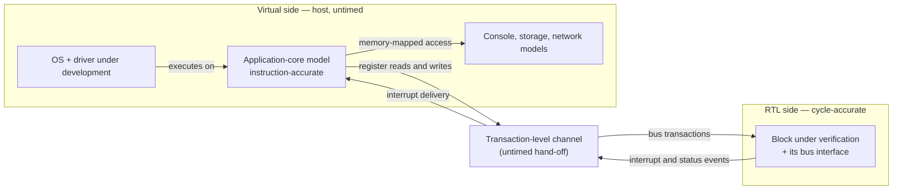

# 18. FPGA Prototyping and HW/SW Co-verification

The flagship SoC's prototype is four FPGA boards in a rack, a fan tray and a serial console. Nine months before tape-out it boots an operating system on the host cluster's four application cores, mounts a filesystem over the board's Ethernet port, and reaches a shell prompt. This is the first time the OS, the drivers, the boot ROM and the RTL have ever been in the same room, and it works — for about forty seconds. Then a benchmark that submits work to the compute cluster returns a result whose last cache line is stale. Run it again and it passes. Run it forty times and it fails twice.

What follows is the part nobody schedules. The verification team cannot reproduce it: their DMA and coherence tests pass, and the failing workload is hundreds of millions of cycles long — far beyond what their simulator will reach this quarter. The software team's driver is the same driver that has run for six months against a functional model without a single failure. Available evidence: one console, a few LEDs, and a trace buffer configured for a different question three bitstreams ago. Two teams spend nine days deciding whose bug it is. It is the flagship's DMA mis-legalizing a 2D descriptor at a 4 KB boundary — the reference SoC's canonical bug, inherited and now hidden one layer deeper by coherence, because the split's second half writes a line the host cluster holds Modified and the corruption stays invisible until the writeback. The bug was not hard. The nine days were: on a prototype, nobody could see it.

This chapter is about that instrument and the discipline that shortens those nine days. It is also where a terminological line matters. In this book **validation** means checking a design on real hardware rather than on a model — post-silicon on fabricated parts, *or in the lab on a prototype* (glossary; Chapter 20 states it in full). An FPGA prototype is therefore pre-silicon in *time* and validation in *kind*: it is the first platform on which real software runs against real hardware, and the first on which the debug ergonomics of the lab, rather than those of the simulator, decide how expensive a bug is.

### Chapter map

- §18.1 establishes how an FPGA prototype differs from an emulator in speed, capacity, turnaround and — decisively — visibility, and what that difference should change about the work sent to it.
- §18.2 states what a virtual platform can establish about firmware long before RTL is stable, and the specific class of thing it is structurally incapable of establishing.
- §18.3 places the boundary in a hybrid platform, and identifies which bugs the boundary deletes by construction.
- §18.4 sets out what running the real driver and the real boot sequence finds that a constrained-random environment does not — and what it cannot find, which is why it complements rather than replaces one.
- §18.5 triages a prototype failure across two organizations, and identifies the case where the bug belongs to neither of them because it belongs to the specification.

## 18.1 The prototype as a different instrument

An FPGA prototype maps the SoC's RTL onto one or more commodity FPGAs. It is widely used for early hardware/software integration because it gives hardware-speed execution of large RTL blocks, supports real I/O connectivity, and lets software be brought up on a cycle-accurate model of the design [cit:P14]. All three properties are doing work. *Hardware-speed* means megahertz: platforms of this kind run roughly a hundred to a thousand times faster than an RTL simulator, turning an operating-system boot from an impossibility into a few hours of runtime on a large SoC [cit:P21]. *Real I/O* means the console is a real UART, the network a real PHY, the storage a real device — so the driver being exercised is the driver, not a testbench's idea of one. *Cycle-accurate* means no abstraction sits between the software and the design it programs.

A 2026 report on one such flow gives the shape of what that buys. Its FPGA validation suite of 1,738 tests spans three classes — integration tests checking the RTL against the FPGA platform itself, bare-metal benchmark and litmus tests, and OS-level tests exercising the driver, the operating system and the software stack — and within it a full Linux boot of a dual-core design clocked at 20 MHz on the board completes in 115 seconds [cit:P25]. Two minutes, on a design far smaller than the flagship, for a boot RTL simulation would never finish: that is the whole argument for the platform.

### What you give up

The prototype's defining limitation is not speed or capacity. It is that you cannot see inside it. Observability on an FPGA is restricted to a few thousand internal signals, you must decide *which* signals before the bitstream is generated, and reconfiguring that choice means recompiling the bitstream — which may take several hours [cit:P21]. Compare that with the simulator you left behind, where every net is visible for free, after the fact, without rerunning anything (Chapter 3). The consequence for practice is direct: because internal probing and trace capacity are constrained, prototyping emphasises system-level execution and functional realism, while deep debug is performed selectively or deferred to a higher-visibility environment [cit:P14].

*Deferred* is the word to notice: deferring debug elsewhere means reproducing the failure in simulation or on an emulator — exactly what the opening scenario's teams could not do, and why they spent nine days.

Turnaround compounds it. Synthesis, partitioning and compilation of a complex design can take many hours or even days, and instrumentation makes it worse: probes are logic, and logic competes for the same fabric and routing resources as the design [cit:P14]. So the loop that costs seconds in simulation — add a probe, rerun, look — costs a working day here, and each iteration buys visibility only of the signals you guessed at the start of it. Toolchains push back with incremental build support, automatic partitioning, automatic multiplexing of signals and static and dynamic probes [cit:D33], but the constraint's shape does not change: what you can see is decided before the run, and changing your mind is a compile.

### Capacity, partitioning and clock ratios

A large SoC does not fit in one device. Partitioning across several introduces machinery that is not in the design: bridges between partitions, serialiser/deserialiser links across the board, and synchronisation logic to hold the pieces together — at the cost of increased communication latency across the FPGA boundaries and higher integration complexity [cit:P25]. That latency is not neutral. A crossbar or NoC path costs materially more cycles across a partition boundary than inside one device, so the arbitration and back-pressure behaviour you observe on the prototype is not the behaviour the silicon will have. Performance measured on a partitioned prototype is a lower bound with an unknown gap, never a projection.

Clocking distorts in a subtler way, worth deriving because teams get caught by it. The system clock must drop by some factor to close timing in fabric. The peripheral domain drops with it, so the 4:1 ratio between the reference SoC's 200 MHz and 50 MHz domains (Chapter 13) survives — divide both by the same factor and the relationship is preserved. The always-on domain does not cooperate: its 32 kHz reference is a real crystal on the board, and a crystal does not scale. So the 6,250:1 ratio between those two domains (200 MHz over 32 kHz) becomes 6,250 divided by the system slowdown factor, and every timing relationship crossing that boundary moves with it.

That is not abstract. The canonical wake-cause bug of this book lives exactly there: a 3-bit code crossing from the always-on island to the system domain through per-bit synchronizers, where a legal `3'b010 → 3'b100` transition is briefly observed as the reserved code `3'b110`. Whether the prototype ever shows it depends on how many fast-domain sampling edges fall inside the slow domain's transition window — the very quantity you just changed. A prototype that never reproduces a crossing bug and one that reproduces it constantly can be the same design at two clock settings. Structural CDC analysis found this bug in seconds (Chapter 13); the prototype is not the instrument for it, in either direction.

### What the RTL must tolerate to be prototypable

Prototypability is a design property, planned rather than discovered. The RTL must be technology-independent enough to synthesise for a fabric it was not written for: no vendor-specific memory macros or standard-cell instantiations, no latch-based structures the FPGA has no equivalent for, no manually gated clocks the fabric's clocking resources cannot honour, and no analog. Everything at the chip's physical edge is substituted: bringing a design up on a board means interfacing the platform's own memory controllers, Ethernet, console UART, host DMA over PCIe, SPI for firmware boot and JTAG for debug, until the result is a complete software-bootable system [cit:P25].

Note what the substitution costs. The flagship's LPDDR4 controller and PHY — whose training state machine is among the riskiest things on the chip — are exactly what cannot be prototyped, because the PHY is analog and its timing is the point; on the board they are replaced by the platform's own memory controller. So the prototype will run the OS beautifully and tell you nothing whatever about memory training, a bring-up risk that must be discharged at the AMS boundary (Chapter 21) and in the lab after tape-out (Chapter 20). Write it in the plan as an explicit prototype-scope exclusion, the way Chapter 5 demands of every gap.

### Prototype or emulator?

Both platforms run RTL on hardware, and both reach megahertz-scale effective speeds on large SoCs, with the achievable frequency depending on design size, partitioning, instrumentation and the selected debug configuration [cit:P14]. The differences are the ones you buy an instrument for. An emulator is built for capacity and controlled observability — triggers, selective trace, save and restore — with compile and debug infrastructure sized to the design (Chapter 17). A prototype is built for speed and realism, and its observability is whatever you inserted before the build. Industry adoption follows that split: in the 2024 study, emulation adoption rises sharply for designs above a billion gates [cit:R2] — the capacity threshold at which a prototype stops being a platform and becomes a partitioning project.

The right mental model is not "cheap emulator": **an emulator is a fast simulator with reduced visibility; a prototype is early silicon with more visibility than silicon** — one on each side of the verification/validation line. Work you would do in a simulator, if only it were faster, belongs on an emulator. Work you would do in the lab, if only you had a chip, belongs on the prototype.

### What earns a place on the prototype

That gives an admission test, and it has three conditions, all of which must hold:

1. **The workload needs more cycles than simulation can deliver.** Booting an OS, driving a full initialisation, encoding a thousand video frames, sustaining a network link for minutes. If it fits in a simulation run, run it there, where debug is cheaper and the coverage database already knows how to record it.
2. **It has an oracle that survives the visibility collapse.** Something must decide pass or fail without a waveform: an offline bit-exact diff, self-checking firmware, an in-fabric monitor that latches a violation into a readable register. A workload whose only oracle was "the engineer watched the waveform" has no oracle at all here (Chapter 3).
3. **Its failure is plausibly reproducible back in a higher-visibility environment.** Because that is where it will be debugged.

Condition 2 is the one teams skip, and condition 3 is the one that costs them. A workload that fails condition 2 produces a red LED and a week of ownership argument, which is Section 18.5's entire subject.

> **Scenario.** The video codec's encoder passes its block-level environment: a bit-exact golden model checks every macroblock against the reference encoder, and the coverage model closes on prediction modes, quantiser steps and buffer-full conditions. What nobody has run is a *sequence*: a thousand consecutive frames of real content, where rate control adapts across scene changes and the DDR traffic pattern shifts under it. In simulation that is weeks. **Approach.** Put the encoder on the prototype, feed it a real clip from a file, write the bitstream out to storage, and diff the whole output against the reference encoder's offline — one comparison, after the run, on a workstation. **Why.** It satisfies all three admission conditions. The workload genuinely needs the cycles; the oracle is an offline bit-exact diff that needs no visibility at all; and when frame 738 differs, the frame number and the encoder state that produced it are enough to build a simulation testcase from the same input. That last property is what makes it worth doing — not the speed.

The counter-case is the discipline this chapter argues against. In the FPGA-target market segment — where the design ships in the fabric, the lab is hours away, and it is routinely used as the primary validation vehicle — many teams prioritise minimal pre-lab verification in order to reach the lab quickly, a strategy that worked for simpler devices and is increasingly impractical for modern SoC-class ones; in the 2024 Wilson Research Group FPGA study, only 13 percent of projects in that segment reported zero non-trivial bug escapes into production [cit:R1]. Prototypes make bugs *visible late*; they do not make them *findable*. A team that treats the prototype as its verification instrument has replaced a controllable, observable, reproducible environment with an uncontrollable, unobservable, weakly reproducible one, and gained only speed.

## 18.2 Virtual platforms

The prototype arrives late. It needs RTL that synthesises, a partition that closes, and a board — which means it is available months after the firmware team needed something to write code against. The instrument that fills that gap is a **virtual platform**: a software model of the whole system, fast enough to run the real firmware binary, available long before the RTL is stable.

Its position in the lifecycle is well documented. At the start of a project the only models available are high-level architectural specifications; abstract virtual models of the individual IPs come next, serving primarily as the framework against which software and firmware are developed and checked. These are highly abstract software models that preserve only the basic functionality of the hardware/software interfaces, and what they support is correspondingly *coarse-grained* checking of hardware/software use cases [cit:P21]. Every clause of that description bounds what the platform can be asked.

At the centre sits an instruction-accurate model of the core: it executes the target instruction set faithfully and updates architectural state correctly, with no commitment to how many cycles anything takes. Around it sit functional models of the memory map — a register file per peripheral, with the side effects the architecture document describes. That is enough to boot an OS and to debug software as if it were running on real hardware, with considerably more controllability and observability than debugging the same code over a JTAG port; the price is execution speed, and the compensation is that this may be the only option at all while the hardware is still under development [cit:T1].

### What it can and cannot tell you

What a virtual platform establishes is substantial, and teams under-claim it as often as they over-claim it: that the initialisation sequence sets the registers it means to set in an order the hardware accepts; that the firmware's view of the memory map agrees with the architecture's; that handlers are wired to the sources they think they are; that device tree, linker script and boot ROM hand-off agree. On the flagship that is four cores' worth of OS bring-up, a driver stack and a filesystem, debugged with full state inspection, none of it waiting for RTL.

What it cannot tell you follows directly from "preserve only the basic functionality of the hardware/software interfaces". It has no arbitration, because there is nothing to arbitrate. It has no back-pressure, because a model that returns immediately never stalls. It has no latency, so two operations the design will overlap are, in the model, sequential. It has no coherence, because a single flat memory has nothing to be coherent with. The entire class of bugs that consists of *two things happening at once* is absent — not undetected, absent, which is worse, because the platform reports success with complete confidence.

The trap has two shapes, and both produce firmware that passes on the model and fails on hardware:

- **Assumptions the model never charged for.** A poll loop that reads a status register until a bit sets terminates on the first read against a model that completes instantly, so nobody notices it has no timeout and no memory barrier. A `udelay(10)` chosen because it felt safe is never tested against a device that takes longer.
- **Synchronisation the model made unnecessary.** Firmware that hands a buffer to a DMA engine without a cache maintenance operation works perfectly on a platform with no caches. The omission surfaces on the prototype, where it looks exactly like a hardware coherence bug — and is argued about as one.

A second failure is quieter: the virtual platform becomes the specification by default. When model and RTL disagree the reflex is to ask which is right, and neither is golden — both were written by people reading the same document, so a disagreement is as likely to be two misreadings as one bug, and where they agree wrongly you have a common-mode error that comparison cannot surface (Chapter 3). The structural fix is Chapter 15's: generate the model's register behaviour, the decode logic and the firmware header from one register description, so disagreements reduce to behaviour rather than layout.

> **Scenario.** The GPU's driver stack is developed for eight months against a functional model: four shader clusters, a command processor, a unified memory. Submission, context switching, allocation and fault handling all work, and the driver team's suite is green. On the prototype, a compositing workload tears a frame roughly once every few thousand submissions. **Approach.** Do not start by suspecting the driver. Ask which of its assumptions the model was structurally unable to test — and the answer is the ordering between the command processor's descriptor read and the shader clusters' writes to the same memory, serialised by construction in the model and not in the design. **Why.** The model had no concurrency to get wrong, so it could neither confirm nor deny the ordering assumption; it never posed the question. That is the diagnostic signature: a bug not merely missed by the virtual platform but *unreachable* in it. When a prototype failure looks like a race, ask first what the software's development platform could not model — that is where the untested assumption was allowed to form.

### The accuracy/speed dial, and its middle setting

Virtual platforms are not one thing. Between the instruction-accurate model and the RTL sits a family of *approximately timed* models adding latency estimates, arbitration policies and bus delays — slower than the untimed model, far faster than RTL, useful for architectural exploration and buffer sizing.

Handle that middle setting with care, because it carries a hazard the untimed model does not. An untimed model is honestly silent about timing; nobody is tempted to trust it. An approximately timed model is not silent — it has *a* timing, plausible, quotable, and not the design's. Firmware tuned against it (a queue depth, a batch size, an interrupt coalescing threshold) is tuned against a fiction, and the numbers acquire an authority in review slides that the model never earned. The rule worth internalising: an approximately timed model answers *architecture* questions, whose answer is a ratio or a trend; it does not answer *verification* questions, whose answer is a verdict. When a decision turns on a verdict, the model must be the RTL.

## 18.3 Hybrid co-simulation

Most real hardware/software flows are neither purely virtual nor purely RTL. They are hybrids: what you are not verifying runs as fast models, what you *are* verifying runs as RTL, and the two are joined at a transaction-level boundary.

The industrial form partitions the system across two execution domains — a virtual platform on the host running high-level or fast instruction-set models, and an engine executing selected RTL blocks at cycle accuracy — connected through transaction-level co-modelling channels, so software workloads execute quickly while the hardware behaviour that matters stays at RTL fidelity [cit:P14]. The RTL side may be an emulator (Chapter 17) or, for smaller blocks and shorter workloads, an ordinary simulator; the architecture of the split is the same either way, and so are its consequences, which follow from the single channel {ref: hybrid_partition} shows between the two sides: it carries transactions, never clock edges.



{figure: hybrid_partition} A hybrid co-simulation partition. On the virtual side the operating system and the driver under development execute untimed on the host, on an instruction-accurate application-core model alongside console, storage and network models; on the RTL side the block under verification and its bus interface run cycle-accurate. Everything between them crosses one untimed transaction-level channel — register reads and writes inward, interrupt and status events outward — and that hand-off is what deletes every bug living in the timing relationship between the two sides.

### Three reasons to split, and where the line goes

The published motivations are worth restating, because they are also the criteria for drawing the boundary. Hybrid co-modelling *reduces the RTL footprint* on the hardware engine by keeping well-modelled components virtual; exploits *model-maturity asymmetry*, leaning on mature virtual models — typically CPUs and standard peripherals — while keeping RTL fidelity for blocks whose behaviour is subtle or insufficiently modelled; and *balances throughput against fidelity*, accelerating end-to-end workloads while preserving cycle accuracy where timing, ordering and microarchitectural behaviour matter [cit:P14].

Turn those into a placement rule. The boundary belongs where three things are true at once:

1. **It is already an architectural boundary with transaction semantics.** A memory-mapped register interface, a bus port, a mailbox. Something whose contract is written down as operations, because the channel can only carry operations. A boundary drawn mid-microarchitecture — across a pipeline, a credit counter, a handshake — has no transaction to send.
2. **The virtual side is mature.** You are trusting it, unverified, for the duration of every run. A model written last week to fill a hole in the partition is not a component you may lean on; it is a second design with no test plan.
3. **Everything whose timing you care about is on the RTL side.** This is the load-bearing one, and it is the subject of the next paragraph.

### What the boundary deletes

The channel between the domains is untimed. A transaction crosses it as a hand-off, not a waveform: the virtual core issues a write, the RTL side executes it in its own time, and the relation between "when the core issued it" and "when the block saw it" is an artifact of the co-modelling implementation, not a property of any system that will be built.

Therefore **every bug that lives in the timing relationship between the two sides is unreachable by construction.** If the core and the DMA engine contend for one memory port and only the DMA is RTL, the contention is gone — not modelled coarsely, gone. If a driver's write races an interrupt raised in the same cycle, and the driver is virtual, the race cannot happen. That is not a defect in hybrid platforms; it is what they are. It is a defect only when nobody writes it down.

So write it down, on the plan row, in the same register of language Chapter 5 demands of every other exclusion: *"cross-boundary timing between the host cluster and the compute island is out of scope on this platform; covered by block-level full-RTL simulation and by the prototype's system regression."* A written exclusion is a coverage decision; an unwritten one is a hole with a green dashboard over it. Nor is the partition permanent: as a project matures the workflow is tightened by moving blocks from virtual to RTL, trading throughput for fidelity in a controlled manner [cit:P14] — the boundary is a scheduled artifact with a migration plan, not a one-time decision.

> **Scenario.** The sensor hub is an always-on island with its own 32 kHz domain, a small DSP, and firmware that decides autonomously whether an event is worth waking the rest of the chip for. Its verification problem is hybrid by nature: the interesting behaviour spans the island's RTL, the island's firmware, and the host driver that configures it and receives its wake events. **Approach.** Run the island as RTL — small, new, and its wake-decision logic is the risk — and keep host cluster, OS and driver virtual, joined at the island's register interface and its wake-event line. **Why.** The boundary is a real architectural one with transaction semantics, the virtual side is entirely stock, and the timing that matters (DSP pipeline, wake-decision register, interrupt assertion) is on the RTL side. Name what the split deletes: the *crossing* by which the wake-cause code reaches the system domain is now a channel hand-off, so the canonical multi-bit crossing bug — the reserved code `3'b110` observed for one cycle during a legal transition — is invisible here and stays the property of structural CDC analysis (Chapter 13). The platform verifies the *policy*; it says nothing about the *crossing*.

### Two generations, two answers

On the reference SoC, a hybrid platform is usually the wrong tool. The chip is small enough that full-RTL simulation of the whole thing is affordable, the firmware is a few thousand lines of bare-metal C, and a boot-to-main test runs in minutes. Building a co-modelling channel to avoid a cost you are not paying is engineering for its own sake — and it would trade away exactly what full-RTL simulation gives free at this size: every interaction between the core, the two DMA channels and the memory, timed.

On the flagship, the calculus inverts. Full-SoC RTL simulation of an OS boot does not finish; the emulator is shared and scheduled; and for most of the project the mesh NoC and the LPDDR4 subsystem are still moving underneath everyone. A hybrid platform is how the driver team gets to run real driver code against the real compute cluster in month four rather than month eleven — with the NoC virtual, its timing out of scope, and both facts on the plan row. Same problem, two scales, opposite answers.

## 18.4 Firmware-driven verification

Firmware-driven verification uses the real boot sequence and the real device driver as stimulus. Not a testbench sequence that resembles what software will do — the binary that will ship.

The two ask different questions. A constrained-random environment asks *is every legal transaction handled correctly?* and answers by sampling the legal space widely. Firmware asks *does this sequence of operations, in this order, with these values, from this reset state, achieve the effect the software needs?* — and answers for exactly one trajectory. They are not competing methods but orthogonal projections of the same design, and firmware-driven verification earns its slot because its projection contains things the other structurally cannot. That this is mainstream rather than specialist work is measurable: hardware/software co-design and verification is the most-cited reason projects reach for emulation or FPGA prototyping, and in 2024, 84 percent of IC/ASIC projects incorporated one or more embedded processors [cit:R2].

### What it finds

**Initialisation ordering.** Hardware/software interaction is rarely a single access; it is a sequence that must follow rules and respect environmental constraints — and those access constraints and preconditions are frequently *not documented*, while being required nonetheless by the device hardware or by the bus systems between it and the core [cit:T1]. A testbench writer reads the register map and writes accesses to it; a driver writer reads the same map and produces the sequence the software actually needs — power-up order, clock enables, a PLL lock poll, a reset deassertion, a queue base address written before the queue is enabled and not after. That sequence is what the silicon will see for the rest of its life, and very often the only one anyone has tried.

**Register access races.** These live at the hardware/software interface, and are created by changes to that interface as often as they are latent in the design. In one published study, three variants of a driver differing only in their hardware abstraction layer and register layout were checked against each other; in one, a missing side-effect annotation introduced a race on the peripheral's input register that could make the device raise an interrupt incorrectly — and it had passed the simulation-based verification previously applied to that design [cit:T1]. Nobody planted it. It arrived through a software-side optimisation of the interface, exactly the kind of change no hardware regression is watching.

**Error-recovery paths.** Every real driver contains recovery logic: a timeout, a retry with a shorter burst, a channel reset, a re-initialisation from scratch. Nobody writes directed tests for these, because the sequence *is* the driver's — not derivable from the register map, and a verification engineer inventing one invents a different sequence. Running the driver runs the recovery code, including the parts its author hoped never to run.

**Integration wiring.** The interrupt arriving on the wrong input, the address the header and the decode logic disagree about, the reset asserted for the wrong domain. Chapter 15's connectivity example is the archetype: block environments passed, the system regression passed, and the mismatch surfaced in the lab as a hang. Firmware is the first stimulus that traverses the whole path end to end with the software's own view of the map.

> **Scenario.** The crypto engine sits inline on the memory path and is programmed through a key ladder: a sequence of writes that derives a working key from a root key, each stage gated by the previous one's completion. Its block environment covers every stage transition and every legal key length. On the prototype, a firmware image that re-keys between two secure sessions occasionally produces a session that decrypts to garbage — roughly once per few hundred re-keys, never reproducibly. **Approach.** Compare the driver's actual access trace against the engine's documented preconditions and find that there is no documented precondition covering *this* case: the driver writes the next key-slot register while the previous operation is still draining. **Why.** This is a known shape. In a formal check of an open-source SPI peripheral's access preconditions, any write to the device during an active transmission was found capable of producing divergent behaviour, and the conclusion drawn was that firmware must implement mechanisms to avoid generating such a pattern [cit:T1] — a requirement on the *software*, discovered in the *hardware*, and written down in neither. The engine is not wrong and the driver is not wrong. The interface contract is incomplete, which is Section 18.5's subject.

### What it cannot find

Firmware is one path. It uses the burst lengths the driver chooses, the descriptor shapes the driver builds, the interrupt configuration the product ships, and the buffer alignments the allocator happens to produce. It will never issue the legal transaction the driver has no reason to issue; it will never back-pressure an interface the way a hostile responder does; and it will never vary anything, because varying things is not what a driver is for.

So a firmware run's coverage is a thin, deep thread through a wide space — the complement of a constrained-random environment's, which is wide and shallow (Chapter 9). Neither substitutes for the other, and a project with only one has a predictable blind spot: firmware-only ships a design that works for the driver it grew up with and breaks on the next; random-only ships a design where every transaction is legal and the initialisation sequence deadlocks.

There is a published route out of the first half of that blind spot, and it is worth naming because a team carried it all the way to silicon. At AMD, test intent written in the Portable Test and Stimulus Standard was compiled into UEFI and bare-metal tests that ran unchanged on an emulated AMD APU and then on post-silicon parts, reaching the hardware through an in-house runtime layer called uDREX that abstracts the BIOS and starts the test on every enabled thread; on the emulator the test and uDREX were backdoor-loaded into DRAM, and in the lab the team used the same descriptions to compose fresh power-management firmware tuning scenarios instead of the fixed set a shipping driver happens to exercise [cit:D29]. Notice what is *not* claimed there. The deck reports no bug count, no speedup and no effort saving, and it records a real cost of its own — test generation time that the authors put on record as having the potential to increase exponentially. What changes is authorship: a lab engineer or an architect can compose a system-level sequence in the afternoon it is needed, which is the variation a driver alone structurally cannot supply. Chapter 9 gives the language itself its own treatment.

A second limit is easy to miss. **Firmware is not an oracle for the hardware.** A driver checks that it achieved its own goal, not that the design behaved correctly. A hardware bug the driver's retry logic silently absorbs — a descriptor that fails and succeeds on the second attempt — is a passing boot with a defect in it, and nothing in the software reports it. Firmware-driven runs need their own checkers, which brings us to the artifact.

### Worked example: a property that has to survive the fabric

The reference SoC's DMA carries this book's canonical protocol property, and the flagship's DMA inherits it unchanged, because it inherits the same 4 KB legalization discipline (Arm IHI 0022H.c §A3.4.1) [cit:S18]:

```systemverilog
property p_no_4kb_crossing;
  @(posedge clk) disable iff (!rst_n)
  (awvalid && awready && (awburst == 2'b01)) |->
    (16'(awaddr[11:0]) + ((16'(awlen) + 16'd1) << awsize)) <= 16'd4096;
endproperty
a_no_4kb_crossing : assert property (p_no_4kb_crossing);
```

On the prototype that statement does not exist. Concurrent assertions are a simulation and proof construct; there is no assertion engine in the fabric, and where a toolchain offers synthesisable assertion support, what it can report is bounded by the same visibility limits as everything else. To survive the trip the check must become logic — logic that reports its verdict through a register the driver can read.

```systemverilog
// Prototype-side transliteration of a_no_4kb_crossing: the same expression,
// evaluated in fabric, latching evidence into registers the driver can read.
module dma_4kb_monitor #(
  parameter int unsigned ADDR_W = 40,   // the flagship's physical address width
  parameter int unsigned CNT_W  = 16
) (
  input  logic              clk,
  input  logic              rst_n,
  // write-address channel of one DMA manager port, observed passively
  input  logic              awvalid,
  input  logic              awready,
  input  logic [ADDR_W-1:0] awaddr,
  input  logic [7:0]        awlen,
  input  logic [2:0]        awsize,
  input  logic [1:0]        awburst,
  // exposed through the prototype's debug register block
  output logic              viol_seen,
  output logic [CNT_W-1:0]  viol_count,
  output logic [ADDR_W-1:0] first_addr,
  output logic [7:0]        first_len,
  output logic [2:0]        first_size
);
  logic viol;

  // Identical to the property's consequent, negated: INCR bursts only,
  // 16-bit arithmetic, evaluated on an accepted address handshake.
  always_comb begin
    viol = awvalid && awready && (awburst == 2'b01) &&
           ((16'(awaddr[11:0]) + ((16'(awlen) + 16'd1) << awsize)) > 16'd4096);
  end

  always_ff @(posedge clk or negedge rst_n) begin
    if (!rst_n) begin
      viol_seen  <= 1'b0;
      viol_count <= '0;
      first_addr <= '0;
      first_len  <= '0;
      first_size <= '0;
    end else if (viol) begin
      if (!viol_seen) begin
        viol_seen  <= 1'b1;
        first_addr <= awaddr;
        first_len  <= awlen;
        first_size <= awsize;
      end
      if (viol_count != {CNT_W{1'b1}}) begin
        viol_count <= viol_count + 1'b1;   // saturate rather than wrap
      end
    end
  end
endmodule
```

Read what the transliteration costs; the losses are the chapter's argument in miniature. You lose the waveform: when `viol_seen` comes back set you have one address, one length and one size, and no picture of what the interconnect was doing around them. You lose every violation after the first, which is why the counter is there — `viol_count` distinguishes *the driver is systematically emitting illegal descriptors* from *one corner case fired once*, and without it the sticky bit answers a much weaker question. And you pay in fabric: real logic, competing for the same resources and routing as the design, in the same currency that buys debug probes.

What you keep is the part that matters here. The check is evaluated at the instant of the violation, at full speed, on every burst of a workload no simulator will ever reach — so the detection distance (Chapter 8) between the design's mistake and the verdict is zero cycles, even though the distance between the verdict and *your knowledge of it* is however long until the driver next polls. That is condition 2 of Section 18.1's admission test, satisfied concretely: an oracle that survives the visibility collapse. Build the monitors before the bitstream, because after it they cost a compile.

## 18.5 Who owns the bugs

Everything so far has been technical. This section is the organisational half — the half that actually breaks.

A failure on the prototype belongs to the hardware or to the software, and both teams arrive at triage with a green history and no evidence about the other: the hardware team's block environments, assertions and coverage all pass; the software team's driver has run for months against a virtual platform without a failure. Each team's evidence is real, each is about its own artifact, and neither says anything about the *interface between them* — which is where the bug almost always is. The default outcome is a week of alternating hypotheses, and it is the default because nothing in either team's normal practice produces what triage needs.

That information is producible, and far cheaper to arrange in advance than to reconstruct after. Four things make prototype triage tractable.

**1. A run you can repeat.** In simulation a run is a seed plus a design revision plus a tool build (Chapter 12), and repeating it is a command line. A prototype run has no seed: it has real time, real I/O, a real network peer, and a boot that consumes entropy. The nearest equivalent is a manifest pinning everything the bitstream and the boot depend on — RTL revision, bitstream hash, partition assignment, clock configuration, firmware and OS image hashes, boot arguments, board identity, input data. Without it, "it failed on Tuesday's build" is not a fact anyone can act on.

Repetition then substitutes for replay. The 2026 flow of §18.1 hits exactly this limit: its OS boot is a single indivisible test that cannot be distributed across the boards the rest of the suite parallelises over, so it is executed eight times instead, to establish that the result is stable [cit:P25]. That is Chapter 12's repeat-*N* stability check transplanted to a platform where determinism cannot be assumed — the honest answer to "was that intermittent, or did I imagine it?"

**2. One timeline.** Firmware writes a log; in-fabric monitors latch into registers; the trace buffer captures bus activity. If those three record time in three different ways, an engineer establishing whether the driver's timeout preceded or followed the DMA's error is guessing. A common timestamp source — a free-running counter readable by software and sampled by the monitors, at a resolution finer than the events you need to order — turns three records into one ordered narrative. The always-on domain's 32 kHz reference is not that counter. Cheap before the build, impossible after it.

**3. A shared definition of "the same run".** Divergence between platforms does real damage: monitors and harnesses re-engineered to meet a hardware engine's timing and capacity constraints leave divergent environments, and that divergence introduces subtle inconsistencies in observed behaviour, complicating debug and making an issue harder to reproduce across platforms [cit:P14]. The rule that follows: checks existing on both platforms must be the *same checks*, generated from one source rather than implemented twice. The 4 KB monitor of Section 18.4 and the assertion it was transliterated from belong to one description — maintained separately they will diverge, and that is the day the prototype and the simulator disagree about whether a burst was legal.

**4. A path back to visibility.** A prototype failure's value is realised when it becomes a simulation testcase — the same escalation post-silicon bring-up depends on (Chapter 20), arriving one platform earlier. Build it deliberately: the manifest identifies the image, the monitor identifies the first offending transaction, and someone must be able to construct a stimulus that reproduces it where every net is visible. A team without that path debugs every prototype bug at the worst observability it will meet before the lab — the trade Section 18.1 warned against making by accident.

### When a firmware bug is really a specification bug

Now the judgment this chapter exists to teach. When a prototype failure lands, run the triage against the specification, not against the two implementations, and there are three outcomes rather than two:

- **The specification says X and the hardware does X.** The software is wrong. Fix the driver.
- **The specification says X and the hardware does Y.** The hardware is wrong. Fix the RTL, and add the test that should have caught it.
- **The specification does not say.** *Neither team owns it.* This is a specification defect, and treating it as a firmware bug is the single most common triage error in hardware/software co-verification.

The third case is not rare, and it is not a failure of diligence — it is structural. A peripheral's access constraints are consequences of its internal architecture, and a designer who satisfies them naturally, without ever needing to state them, has no prompt to write them down. Formal checks of open-source peripherals bear this out at close range: one device's software reset proved not to be implemented at all, a fact recorded in the HDL source and absent from the documentation [cit:T1]. Nobody lied; nobody checked.

The sharpest instance inverts the reflex entirely. An open-source UART's baud-rate counters run continuously, and reprogramming the rate from a higher target value to a lower one while the counter sits between the two leaves it un-reset until it wraps — rendering the device unresponsive for up to 2<sup>18</sup> clock cycles, and **the software cannot avoid this, because nothing in the interface lets it infer the counter's value** [cit:T1]. As a lab symptom — "the console stops responding after the driver changes baud rate" — that looks exactly like a driver bug, and a firmware team will spend days hunting the missing wait. The second clause is the load-bearing one: *no correct driver exists*. The defect is in the hardware, the omission is in the document, and the only fix available to software is a workaround that must be specified before it can be written.

The pressure shows in the industry data: among the root causes of logical and functional flaws in the 2024 study, changing, incorrect or incomplete specifications remain a common concern of verification engineers and project managers, alongside design error [cit:R2].

> **Scenario.** The radar front-end's firmware computes per-channel calibration coefficients at start-up and writes them into the FFT chain's correction registers. On the prototype, detections are consistently off: targets appear at roughly twice the expected amplitude, and the CFAR threshold logic behaves accordingly. The DSP team demonstrates the datapath is bit-exact against its reference model for every input it was given. The firmware team demonstrates the coefficients are correct, checked against the calibration procedure. **Approach.** Stop arguing about the two implementations and go to the register description. The correction register is 16 bits wide, and the document says only "signed coefficient". The RTL treats it as Q2.14 — two integer bits, fourteen fractional; the firmware computes Q1.15. Both are self-consistent, both match the document, and the values differ by a factor of two. **Why.** This is the third outcome, in its purest form. There is no software bug and no hardware bug; there is a field whose interpretation was never written down, and two teams who each supplied the missing half from their own conventions. The fix is not a patch — it is an entry in the register description, from which the decode logic, the model and the firmware header are all generated (Chapter 15), plus a plan row asserting the interpretation so that the next 16-bit "signed coefficient" cannot repeat it.

The organisational consequence follows. A specification defect filed as a firmware bug is closed by a driver patch, and the document stays wrong for the next driver, the next derivative and the next customer. Route the third outcome somewhere it will survive: Chapter 5's spec-hole log, which exists exactly for questions the specification cannot answer, plus three artifacts — the document change, a checker enforcing the newly stated rule, and a plan row that owns it. And give prototype triage a named owner with a foot in both camps, on a rotation drawn from both teams. The alternative is the default, and the default costs a week per incident.

### In practice

Prototypes are built by two or three people who become the only ones able to operate them; fix that first, because if bringing up a bitstream is tacit knowledge the platform is unavailable to the teams it exists for. Automate the path from RTL revision to programmed board and treat that automation as a deliverable. Board access is contended, so the queue is a project resource with a policy — decide who preempts whom before the week it matters — and bitstream builds run overnight in a pipeline of their own, off the per-commit tier (Chapter 12) where no multi-hour job belongs.

The messy parts are consistent across projects. Probes get inserted for one investigation and left in, and nobody knows which are still connected to anything: keep a manifest of what each build instruments. Firmware and RTL versions drift, and half of "the prototype is broken" is an image mismatch, which a boot-time hash check eliminates for a day's work. The prototype is also the demo machine, and will be requested for a customer visit in the same week the DMA bug is being chased — a management decision, not an engineering one. And the block left off the prototype because it could not be mapped, the analog PHY or the trimmed memory macro, is the one nobody thinks about again until bring-up; keep it on the plan as an explicit exclusion with a named alternative.

### Pitfalls

1. **Reading the prototype as a measuring instrument.** Symptom: coverage goals or sign-off criteria assigned to prototype runs, or latency numbers from a partitioned build quoted in an architecture review. Cure: cross-device links and reduced clocks make those latency figures an upper bound with an unknown gap, and closure belongs where the design is observable and stimulus controllable; the prototype validates integration and software.
2. **Debug instrumentation decided after the first failure.** Symptom: every investigation begins with a multi-hour rebuild to add probes. Cure: instrument for the questions you expect before the build, and budget the fabric for it.
3. **Firmware developed only against an untimed model.** Symptom: the driver has never met back-pressure, latency or concurrency, and meets all three first on a platform where you cannot see. Cure: run driver code against RTL early on a hybrid platform, even if only for the block whose timing it depends on.
4. **A hybrid partition whose deletions are undocumented.** Symptom: a green system-level campaign and an untested cross-boundary interaction nobody can name. Cure: every partition carries a written scope exclusion on the plan row, like any other coverage decision.
5. **Prototype runs with no manifest.** Symptom: "it fails on the old bitstream" and nobody can say which one that was. Cure: pin RTL revision, bitstream hash, image hashes, clock configuration and board identity per run, and repeat indivisible tests to establish stability.
6. **Filing a specification defect as a firmware bug.** Symptom: the driver gets a workaround, the document stays silent, and the next derivative repeats the failure. Cure: triage against the specification; when it does not answer, the outcome is a spec-hole entry, a document change and a checker — not a patch.

### Summary

- A prototype is not a cheap emulator. An emulator is a fast simulator with reduced visibility; a prototype is early silicon with more visibility than silicon — and prototyping's practical trade-off is exactly that observability constraint, which pushes deep debug elsewhere [cit:P14].
- Visibility on a prototype is decided before the run: a few thousand signals, chosen ahead of the bitstream, and changing the choice means a recompile measured in hours [cit:P21].
- A workload earns a prototype slot when it needs the cycles, has an oracle that survives the visibility collapse, and can plausibly be reproduced back where things are visible. The second condition is the one teams skip and the third is the one that costs them.
- Virtual platforms preserve the basic functionality of the hardware/software interfaces and support coarse-grained checking of use cases [cit:P21] — which is precisely why the class of bugs made of two things happening at once is not merely missed there but unreachable.
- A hybrid platform's untimed boundary deletes every bug living in the timing relationship between its two sides. That is what the platform is, and it is a defect only when the deletion is not written on the plan row.
- Firmware-driven runs find what a testbench does not — initialisation order, interface races, recovery paths, integration wiring — and cannot find what a generator does, because a driver is one trajectory that never varies. They complement constrained-random stimulus; they do not replace it.
- Hardware/software access preconditions are often required by the device and absent from its documentation [cit:T1]. When a prototype failure lands and the specification does not answer, the bug belongs to the specification, and closing it as a driver patch guarantees the next team repeats it.

### Further reading

**From the corpus.** [cit:P14] is the best single source for the platform taxonomy of §18.1 and §18.3 — prototyping, ASIC-class emulation and hybrid co-emulation, their trade-offs in capacity, speed and visibility, the compile-versus-execute distinction, and the divergent-environment problem that makes cross-platform reproduction hard. [cit:P21] places all of it on the pre-silicon-to-post-silicon observability gradient, and is the source for the virtual-model role and the bitstream-recompile cost of changing what you can see. [cit:P25] is the most concrete published account of an FPGA validation flow end to end: platform integration, multi-device partitioning, and a three-class suite from integration checks through bare-metal benchmarks to OS-level driver tests. [cit:T1] treats the hardware/firmware boundary as a formal object and supplies §18.5's central lesson on undocumented access preconditions. [cit:R2] and [cit:R1] give the industry framing. [cit:D33] works the acceleration-ready testbench question for readers crossing into Chapter 17's territory.

**Outside the corpus.** D. Amos, A. Lesea and R. Richter, *FPGA-Based Prototyping Methodology Manual*, is the standard practitioner's treatment of design-for-prototyping — partitioning, clocking and memory substitution at book length. P. Rashinkar, P. Paterson and L. Singh, *System-on-a-Chip Verification: Methodology and Techniques*, contains the classic chapter-length account of hardware/software co-verification flows. F. Ghenassia (ed.), *Transaction-Level Modeling with SystemC*, is the reference for the modelling styles that virtual platforms and hybrid boundaries are built from.
