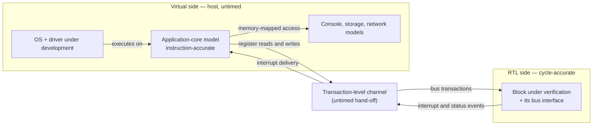

# 18. FPGA Prototyping and HW/SW Co-verification

FPGA prototyping supports hardware/software integration and lab debug; this chapter examines how debug methods can reduce the nine days spent locating the flagship SoC's DMA bug. In this book **validation** checks a design on real hardware rather than a model: post-silicon on fabricated parts, *or in the lab on a prototype* (glossary; Chapter 20 states it in full). An FPGA prototype is therefore pre-silicon in *time* and validation in *kind*: the first platform where real software runs against real hardware and lab debug ergonomics, rather than simulation's, determine bug cost.

The flagship SoC example uses four FPGA boards in a rack, a fan tray and a serial console. In this example, nine months before tape-out, it boots an OS on the host cluster's four application cores, mounts a filesystem over the board's Ethernet port, and reaches a shell prompt. The OS, drivers, boot ROM and RTL run together for the first time, successfully for about forty seconds. Then a benchmark that submits work to the compute cluster returns a result whose last cache line is stale. A rerun passes, while forty repetitions of the benchmark fail twice.

The verification team cannot reproduce it: their DMA and coherence tests pass, while the failing workload spans hundreds of millions of cycles, beyond their simulator's reach this quarter. The software team's driver is the same driver that has run for six months against a functional model without a single failure. Available evidence: one console, a few LEDs, and a trace buffer configured for a different question three bitstreams ago. Two teams spend nine days deciding whose bug it is. The flagship's DMA mis-legalizes a 2D descriptor at a 4 KB boundary, inheriting the reference SoC's canonical bug one layer deeper: coherence hides the corruption until writeback because the split's second half writes a line the host cluster holds Modified. The bug itself was straightforward, but locating it took nine days because neither team could see it on the prototype.

### Chapter map

§18.1 compares prototype and emulator speed, capacity, turnaround and visibility to guide workload placement. §18.2 covers what virtual platforms can establish about firmware before stable RTL, and what they structurally cannot. §18.3 locates the hybrid boundary and the bugs it deletes. §18.4 explains what real drivers and boot sequences find beyond constrained-random testing, and why their limits make them complementary. §18.5 covers triage across two organizations and defects belonging to the specification.

## 18.1 The prototype as a different instrument

An FPGA prototype maps the SoC's RTL onto one or more commodity FPGAs. It is widely used for early hardware/software integration because it gives hardware-speed execution of large RTL blocks, supports real I/O connectivity, and lets software be brought up on a cycle-accurate model of the design [cit:P14]. *Hardware-speed* means megahertz: platforms of this kind run roughly a hundred to a thousand times faster than an RTL simulator, turning an operating-system boot from an impossibility into a few hours of runtime on a large SoC [cit:P21]. *Real I/O* connects the console to a real UART, the network to a real PHY and storage to a real device, exercising the actual driver rather than a testbench substitute. *Cycle-accurate* means no abstraction sits between the software and the design it programs.

A 2026 report describes one such flow. Its FPGA validation suite of 1,738 tests spans three classes: integration tests checking the RTL against the FPGA platform itself; bare-metal benchmark and litmus tests; and OS-level tests exercising the driver, the operating system and the software stack; within it, a full Linux boot of a dual-core design clocked at 20 MHz on the board completes in 115 seconds [cit:P25]. That is two minutes on a design far smaller than the flagship, for a boot RTL simulation would never finish.

### Observability limits

Limited internal visibility defines the prototype more than speed or capacity. Observability on an FPGA is restricted to a few thousand internal signals, which must be selected before the bitstream is generated; reconfiguring that choice means recompiling the bitstream, which may take several hours [cit:P21]. In simulation, every net is visible for free after the fact, without rerunning anything (Chapter 3). Constrained internal probing and trace capacity make prototyping emphasize system-level execution and functional realism; deep debug is selective or deferred to a higher-visibility environment [cit:P14].

Deferring debug requires reproducing the failure in simulation or on an emulator, which the opening example's teams could not do, costing nine days.

Synthesis, partitioning and compilation of a complex design can take many hours or even days, and instrumentation increases that cost: probes are logic competing for the same fabric and routing resources as the design [cit:P14]. Adding a probe, rerunning and inspecting takes seconds in simulation but a working day here, with each iteration exposing only the signals selected at its start. Toolchains offer incremental builds, automatic partitioning and signal multiplexing, and static and dynamic probes [cit:D33], but visibility is still decided before the run and changes require compilation.

### Capacity, partitioning and clock ratios

A large SoC does not fit in one device. Partitioning across several FPGAs introduces machinery absent from the design: bridges between partitions, serializer/deserializer links across the board, and synchronization logic to hold the pieces together, increasing communication latency across FPGA boundaries and integration complexity [cit:P25]. A crossbar or NoC path costs materially more cycles across a partition boundary than within one device, changing arbitration and back-pressure behavior relative to silicon. Performance measured on a partitioned prototype is a lower bound with an unknown gap, never a projection.

The system clock must drop by some factor to close timing in fabric. The peripheral domain drops with the system clock, so the 4:1 ratio between the reference SoC's 200 MHz and 50 MHz domains (Chapter 13) survives: dividing both by the same factor preserves the relationship. The always-on domain's 32 kHz reference is a real board crystal, whose frequency does not scale. The 6,250:1 ratio between those two domains (200 MHz over 32 kHz) therefore becomes 6,250 divided by the system slowdown factor, changing every timing relationship across that boundary.

The canonical wake-cause bug occurs at that boundary: a 3-bit code crosses from the always-on island to the system domain through per-bit synchronizers, briefly exposing reserved code `3'b110` during a legal `3'b010 → 3'b100` transition. Reproduction depends on how many fast-domain sampling edges fall within the slow domain's transition window, which the clock change alters. A prototype that never reproduces a crossing bug and one that reproduces it constantly can be the same design at two clock settings. Structural CDC analysis found this bug in seconds (Chapter 13); the prototype is not the instrument for it, in either direction.

### RTL requirements for prototyping

Prototypability is a design property that requires planning for RTL constraints and FPGA platform substitutions. The RTL must be technology-independent enough to synthesize for a fabric it was not written for: no vendor-specific memory macros or standard-cell instantiations, no latch-based structures the FPGA has no equivalent for, no manually gated clocks the fabric's clocking resources cannot honor, and no analog. Everything at the chip's physical edge is substituted: bringing a design up on a board means interfacing the platform's own memory controllers, Ethernet, console UART, host DMA over PCIe, SPI for firmware boot and JTAG for debug, until the result is a complete software-bootable system [cit:P25].

The flagship's LPDDR4 controller and PHY cannot be prototyped, although their training state machine is among the riskiest things on the chip: the PHY is analog and its physical timing determines its behavior, so the board replaces them with the platform's own memory controller. The prototype can run the OS but establishes nothing about memory training, a bring-up risk that must be discharged at the AMS boundary (Chapter 21) and in the post-tape-out lab (Chapter 20). The plan must record an explicit prototype-scope exclusion, as Chapter 5 demands for every gap.

### Prototype and emulator roles

Both platforms run RTL on hardware, and both reach megahertz-scale effective speeds on large SoCs, with the achievable frequency depending on design size, partitioning, instrumentation and the selected debug configuration [cit:P14]. An emulator provides capacity and controlled observability through triggers, selective trace, save and restore, with compile and debug infrastructure sized to the design (Chapter 17). A prototype provides speed and realism, with observability limited to instrumentation inserted before the build. The 2024 study reports sharply rising emulation adoption above a billion gates [cit:R2], a capacity threshold where prototype partitioning becomes a substantial project.

An emulator serves as a fast simulator with reduced visibility; a prototype approximates early silicon with more visibility than silicon, one on each side of the verification/validation line. Work limited by simulation speed belongs on an emulator, while lab work awaiting a chip belongs on the prototype.

### Admission criteria for prototype workloads

A prototype workload must satisfy all three conditions:

1. **The workload needs more cycles than simulation can deliver.** Examples include OS boot, full initialization, encoding a thousand video frames and sustaining a network link for minutes. Workloads that fit in simulation should run there, where debug is cheaper and coverage recording already exists.
2. **Its oracle works with limited visibility.** Pass or fail must be decided without a waveform, using an offline bit-exact diff, self-checking firmware or an in-fabric monitor latching violations into a readable register. A workload whose only oracle was "the engineer watched the waveform" has no oracle at all here (Chapter 3).
3. **Its failure is plausibly reproducible in a higher-visibility environment,** because debug will occur there.

Skipping condition 2 leaves no usable oracle, while condition 3 determines whether failures can reach a suitable debug environment. In this example, failing condition 2 yields a red LED and a week of ownership argument, the subject of Section 18.5.

> **Scenario.** The video codec's encoder passes its block-level environment: a bit-exact golden model checks every macroblock against the reference encoder, and the coverage model closes on prediction modes, quantiser steps and buffer-full conditions. The untested sequence is a thousand consecutive frames of real content, with rate control adapting across scene changes while DDR traffic shifts. In simulation that is weeks. **Approach.** The encoder runs on the prototype, receives a real clip from a file and writes the bitstream to storage; the entire output is diffed against the reference encoder's offline, in one comparison after the run on a workstation. **Why.** It satisfies all three admission conditions. The workload needs the cycles; its offline bit-exact oracle needs no visibility; and if frame 738 differs, its number and the encoder state that produced it suffice for a simulation testcase using the same input.

In the FPGA-target market segment, designs ship in fabric and the lab, hours away, routinely serves as the primary validation vehicle; many teams minimize pre-lab verification to reach it quickly, a strategy that worked for simpler devices but is increasingly impractical for modern SoC-class ones; in the 2024 Wilson Research Group FPGA study, only 13 percent of projects in that segment reported zero non-trivial bug escapes into production [cit:R1]. Using the prototype as the verification instrument gains only speed while sacrificing simulation's control, visibility and reproducibility for an environment without control or visibility and with weak reproducibility.

The same study ran twice before that edition and reported an unchanged result: in 2020, and again in 2022, seventeen percent of all FPGA projects in its sample achieved no non-trivial bug escapes into production [cit:R4,R6].

## 18.2 Virtual platforms

A prototype requires synthesizable RTL, a partition that closes and a board, so it arrives months after firmware development needs a target. A **virtual platform** fills that gap: a software model of the whole system that runs the real firmware binary fast enough for development, long before stable RTL.

At the start of a project the only models available are high-level architectural specifications; abstract virtual models of the individual IPs come next, serving primarily as the framework against which software and firmware are developed and checked. These are highly abstract software models that preserve only the basic functionality of the hardware/software interfaces, and what they support is correspondingly *coarse-grained* checking of hardware/software use cases [cit:P21].

The platform centers on an instruction-accurate model of the core: it executes the target instruction set faithfully and updates architectural state correctly, with no commitment to how many cycles an operation takes. Functional models of the memory map surround the core model, providing a register file per peripheral with the side effects the architecture document describes. That is enough to boot an OS and debug software as if it were running on real hardware, with considerably more controllability and observability than debugging the same code over a JTAG port; this costs execution speed, but may be the only option while the hardware is still under development [cit:T1].

### Capabilities and structural limits

A virtual platform establishes that the initialization sequence sets the registers it means to set in an order the hardware accepts; that firmware's view of the memory map agrees with the architecture's; that handlers connect to their intended sources; and that device tree, linker script and boot ROM hand-off agree. On the flagship that is four cores' worth of OS bring-up, a driver stack and a filesystem, debugged with full state inspection, none of it waiting for RTL.

The platform's limits follow directly from preserving only the basic functionality of the hardware/software interfaces. It has no arbitration, because there is nothing to arbitrate. It has no back-pressure, because a model that returns immediately never stalls. It has no latency, so two operations the design will overlap are, in the model, sequential. It has no coherence, because a single flat memory has nothing to be coherent with. Bugs involving *two things happening at once* are absent by construction, so the platform reports success without testing them.

Two omissions produce firmware that passes on the model and fails on hardware:

- **Untested timing assumptions.** A poll loop that reads a status register until a bit sets terminates on the first read against a model that completes instantly, leaving the lack of a timeout and memory barrier unnoticed. A `udelay(10)` chosen because it felt safe is never tested against a device that takes longer.
- **Untested synchronization.** Firmware that hands a buffer to a DMA engine without a cache maintenance operation works perfectly on a platform with no caches. The omission surfaces on the prototype, where it looks exactly like a hardware coherence bug and is disputed as one.

A second failure occurs when the virtual platform becomes the specification by default. When model and RTL disagree, neither is golden: both were written by people reading the same document, so a disagreement is as likely to be two misreadings as one bug; where they agree wrongly, a common-mode error remains that comparison cannot surface (Chapter 3). Chapter 15's structural fix generates model register behavior, decode logic and the firmware header from one register description, reducing disagreements to behavior rather than layout.

> **Scenario.** The GPU's driver stack is developed for eight months against a functional model: four shader clusters, a command processor, a unified memory. Submission, context switching, allocation and fault handling all work, and the driver team's suite is green. On the prototype, a compositing workload tears a frame roughly once every few thousand submissions. **Approach.** Diagnosis should begin with assumptions the model could not test, before suspecting the driver. The untested assumption concerns ordering between the command processor's descriptor read and the shader clusters' writes to the same memory: these are serialized by construction in the model but not in the design. **Why.** With no concurrency, the model could neither confirm nor deny the ordering assumption, making this bug unreachable in it. When a prototype failure looks like a race, diagnosis should first examine what the software development platform could not model, because that omission allowed an untested assumption to form.

Arm IHI 0050, the *AMBA CHI Architecture Specification*, Issue H (2025), gives a coherent interconnect a seven-state cache model and specifies the cache state transitions twice over, once at a requester and once at a snooped cache, as a table per transaction type [cit:S26]. Every one of those rules applies on the prototype but has no counterpart in the driver's development platform, so missing cache maintenance reaches the board looking like a hardware bug.

### Approximately timed models

Between instruction-accurate models and RTL, *approximately timed* models add latency estimates, arbitration policies and bus delays; slower than untimed models but far faster than RTL, they support architectural exploration and buffer sizing.

An untimed model offers no timing to trust, whereas an approximately timed model supplies plausible, quotable timing that differs from the design's. Firmware queue depth, batch size or interrupt coalescing threshold tuned against this timing reflects the model rather than the design; review slides should identify those numbers as model estimates. An approximately timed model answers *architecture* questions with ratios or trends; it cannot answer *verification* questions requiring a verdict.

## 18.3 Hybrid co-simulation

Hybrid hardware/software flows run components outside the verification target as fast models and components under verification as RTL, joining the two at a transaction-level boundary.

The industrial form partitions the system across two execution domains: a virtual platform on the host running high-level or fast instruction-set models, and an engine executing selected RTL blocks at cycle accuracy; transaction-level co-modeling channels connect them, so software workloads execute quickly while the hardware behavior under verification stays at RTL fidelity [cit:P14]. The RTL side may be an emulator (Chapter 17) or, for smaller blocks and shorter workloads, an ordinary simulator; the architecture of the split and its consequences are the same either way because the single channel {ref: hybrid_partition} shows between the two sides carries transactions, never clock edges.



{figure: hybrid_partition} A hybrid co-simulation partition. On the virtual side the operating system and the driver under development execute untimed on the host, on an instruction-accurate application-core model alongside console, storage and network models; on the RTL side the block under verification and its bus interface run cycle-accurate. Everything between them crosses one untimed transaction-level channel — register reads and writes inward, interrupt and status events outward — and that hand-off is what deletes every bug living in the timing relationship between the two sides.

### Three motivations and partition criteria

Published motivations also define boundary-placement criteria. Hybrid co-modeling *reduces the RTL footprint* by keeping well-modeled components virtual; exploits *model-maturity asymmetry* through mature virtual models, typically CPUs and standard peripherals, while retaining RTL for subtle or insufficiently modeled behavior; and *balances throughput against fidelity*, accelerating end-to-end workloads while preserving cycle accuracy where timing, ordering and microarchitectural behavior matter [cit:P14].

The boundary belongs where three things are true at once:

1. **The boundary already has architectural transaction semantics:** a memory-mapped register interface, bus port or mailbox. Its contract must specify operations because the channel can only carry operations. A boundary across microarchitecture, such as a pipeline, credit counter or handshake, has no transaction to send. A published analysis of TLM-2.0, the transaction-level modeling standard that forms part of IEEE 1666 and is built on SystemC, reports that its interoperability guarantee reaches only memory-mapped bus protocols; for serial links and interrupt lines, every designer defines a payload of their own, leaving such boundaries dependent on channel definitions local to the project [cit:D43].
2. **The virtual side is mature,** because every run trusts it without verification throughout execution. If a model written last week to fill a partition gap has no test plan, the platform may not safely rely on that second design.
3. **All timing under verification remains on the RTL side,** as the following section explains.

### Bugs excluded by the boundary

The channel between the domains is untimed. A transaction crosses as a hand-off rather than a waveform: the virtual core issues a write and the RTL side executes it in its own time; the relation between when the core issued it and when the block saw it is an artifact of the co-modeling implementation, not a property of any system that will be built.

Therefore **every bug in the timing relationship between the two sides is unreachable by construction.** If a core and DMA contend for one memory port but only the DMA is RTL, contention is entirely absent. If a driver's write races an interrupt raised in the same cycle, and the driver is virtual, the race cannot happen. This is inherent to hybrid platforms and becomes a defect only if undocumented.

The plan row must state the exclusion as Chapter 5 requires: *"cross-boundary timing between the host cluster and the compute island is out of scope on this platform; covered by block-level full-RTL simulation and by the prototype's system regression."* Recording it makes it a coverage decision; leaving it undocumented conceals a gap behind a successful result. As the project matures, blocks migrate from virtual to RTL, trading throughput for fidelity under control [cit:P14]; the boundary therefore needs a schedule and migration plan.

> **Scenario.** The sensor hub is an always-on island with its own 32 kHz domain, a small DSP, and firmware that decides autonomously whether an event is worth waking the rest of the chip for. The verification problem spans the island's RTL, the island's firmware, and the host driver that configures the island and receives its wake events. **Approach.** The small, new island runs as RTL because its wake-decision logic carries the risk; the host cluster, OS and driver remain virtual, joined at the island's register interface and wake-event line. **Why.** The boundary is a real architectural one with transaction semantics, the virtual side is entirely stock, and the timing that matters (DSP pipeline, wake-decision register, interrupt assertion) is on the RTL side. The wake-cause *crossing* into the system domain becomes a channel hand-off, hiding the canonical multi-bit crossing bug: reserved code `3'b110` observed for one cycle during a legal transition; structural CDC analysis retains responsibility for it (Chapter 13). The platform verifies the *policy* but establishes nothing about the *crossing*.

### Platform choice at two system scales

On the reference SoC, a hybrid platform is usually the wrong tool. The chip is small enough that full-RTL simulation of the whole thing is affordable, the firmware is a few thousand lines of bare-metal C, and a boot-to-main test runs in minutes. An unnecessary co-modeling channel would discard what full-RTL simulation provides free at this size: timed observation of every interaction between the core, the two DMA channels and memory.

On the flagship, full-SoC RTL simulation cannot finish an OS boot; the emulator is shared and scheduled; and the mesh NoC and LPDDR4 subsystem change for most of the project. In this example, a hybrid lets the driver team run real driver code against the real compute cluster in month four rather than month eleven, with the NoC virtual, its timing out of scope, and both facts on the plan row.

## 18.4 Firmware-driven verification

Firmware-driven verification uses the shipping binary's real boot sequence and device driver as stimulus, rather than a testbench imitation.

A constrained-random environment samples the legal space widely to check whether every legal transaction is handled correctly. Firmware checks whether a specific sequence, order, set of values and reset state achieves the software's required effect, answering for exactly one trajectory. The methods examine orthogonal aspects of the same design; firmware-driven verification covers behavior the other method structurally cannot. Hardware/software co-design and verification is the most-cited reason for using emulation or FPGA prototyping, and in 2024, 84 percent of IC/ASIC projects incorporated one or more embedded processors [cit:R2].

### Defects exposed by firmware

**Initialization ordering.** Hardware/software interaction is rarely a single access; it is a sequence that must follow rules and respect environmental constraints, and those access constraints and preconditions are frequently *not documented* despite being required by the device hardware or by the bus systems between it and the core [cit:T1]. A testbench writer reads the register map and writes accesses to it; a driver writer reads the same map and produces the sequence the software actually needs: power-up order, clock enables, a PLL lock poll, a reset deassertion, and a queue base address written before the queue is enabled and not after. Silicon executes that sequence throughout its life; verification should check whether it is the only sequence tried.

**Register access races.** Interface changes can introduce races as well as expose latent ones. In one published study, three variants of a driver differing only in their hardware abstraction layer and register layout were checked against each other; in one, a missing side-effect annotation introduced a race on the peripheral's input register that could make the device raise an interrupt incorrectly, despite passing the simulation-based verification previously applied to that design [cit:T1]. The race was not planted: software-side interface optimization introduced it, a change outside the hardware regression's checks.

**Error-recovery paths.** Real drivers contain recovery logic: timeouts, retries with shorter bursts, channel resets and reinitialization from scratch. Directed tests cannot derive the driver's recovery sequence from the register map; an engineer inventing one produces a different sequence. Running the driver under conditions that activate recovery exercises its actual recovery sequence.

**Integration wiring.** Firmware exposes interrupts on wrong inputs, disagreement between header and decoded addresses, and resets asserted for the wrong domain. In Chapter 15's connectivity example, block environments and system regression passed, but the mismatch surfaced in the lab as a hang. Firmware is the first stimulus that traverses the whole path end to end with the software's own view of the map.

> **Scenario.** The crypto engine sits inline on the memory path and is programmed through a key ladder: a sequence of writes that derives a working key from a root key, each stage gated by the previous one's completion. Its block environment covers every stage transition and every legal key length. On the prototype, firmware re-keying between two secure sessions occasionally produces invalid decryption, roughly once per few hundred re-keys, never reproducibly. **Approach.** Comparing the driver's actual access trace with documented engine preconditions reveals an undocumented case: a write to the next key-slot register while the previous operation is still draining. **Why.** A published peripheral check illustrates the same problem. In a formal check of an open-source SPI peripheral's access preconditions, any write to the device during an active transmission was found capable of producing divergent behavior, and the conclusion was that firmware must implement mechanisms to avoid generating such a pattern [cit:T1]; this requirement on software was discovered in hardware and written down in neither. Neither engine nor driver is wrong; the interface contract is incomplete, as Section 18.5 discusses.

### Defects outside firmware coverage

Firmware follows one path, using the burst lengths the driver chooses, the descriptor shapes the driver builds, the interrupt configuration the product ships, and the buffer alignments the allocator happens to produce. It never issues legal transactions the driver has no reason to issue, applies hostile-responder back-pressure or varies stimulus, because variation is not the driver's purpose.

Firmware coverage is deep along a narrow trajectory, complementing constrained-random coverage across a wide, shallow space (Chapter 9). Neither substitutes for the other: a firmware-only flow can miss defects exposed by a different driver's legal transactions, while a random-only flow can miss a deadlock in the shipping initialization sequence even when individual transactions are legal.

At AMD, test intent written in the Portable Test and Stimulus Standard was compiled into UEFI and bare-metal tests that ran unchanged on an emulated AMD APU and then on post-silicon parts, reaching the hardware through an in-house runtime layer called uDREX that abstracts the BIOS and starts the test on every enabled thread; on the emulator the test and uDREX were backdoor-loaded into DRAM, and in the lab the team used the same descriptions to compose fresh power-management firmware tuning scenarios instead of the fixed set a shipping driver happens to exercise [cit:D29]. The deck reports no bug count, speedup or effort saving; it records test generation time that the authors warn has the potential to increase exponentially. A lab engineer or architect can compose a system-level sequence in the afternoon it is needed, supplying variation the driver alone structurally cannot. Chapter 9 gives the language itself its own treatment.

**Firmware is not an oracle for the hardware.** A driver checks that it achieved its own goal, not that the design behaved correctly. Retry logic can silently absorb a hardware bug, such as a descriptor succeeding only on its second attempt, leaving a passing boot with a defect the software never reports. Firmware-driven runs therefore need their own checkers.

### Worked example: a protocol monitor in FPGA fabric

The reference SoC's DMA carries this book's canonical protocol property, and the flagship's DMA inherits it unchanged, because it inherits the same 4 KB legalization discipline (Arm IHI 0022H.c §A3.4.1) [cit:S18]:

<!-- slang: fragment - property p_no_4kb_crossing quoted as the property the flagship DMA inherits, without its checker module -->

```systemverilog
property p_no_4kb_crossing;
  @(posedge clk) disable iff (!rst_n)
  (awvalid && awready && (awburst == 2'b01)) |->
    (16'(awaddr[11:0]) + ((16'(awlen) + 16'd1) << awsize)) <= 16'd4096;
endproperty
a_no_4kb_crossing : assert property (p_no_4kb_crossing);
```

Concurrent assertions are a simulation and proof construct; there is no assertion engine in the fabric, and where a toolchain offers synthesizable assertion support, what it can report is bounded by the same visibility limits as everything else. The check must become logic reporting its verdict through a driver-readable register.

```systemverilog
// Prototype-side transliteration of a_no_4kb_crossing: the same expression,
// evaluated in fabric, latching evidence into registers the driver can read.
module dma_4kb_monitor #(
  parameter int unsigned ADDR_W = 40,   // the flagship's physical address width
  parameter int unsigned CNT_W  = 16
) (
  input  logic              clk,
  input  logic              rst_n,
  // write-address channel of one DMA manager port, observed passively
  input  logic              awvalid,
  input  logic              awready,
  input  logic [ADDR_W-1:0] awaddr,
  input  logic [7:0]        awlen,
  input  logic [2:0]        awsize,
  input  logic [1:0]        awburst,
  // exposed through the prototype's debug register block
  output logic              viol_seen,
  output logic [CNT_W-1:0]  viol_count,
  output logic [ADDR_W-1:0] first_addr,
  output logic [7:0]        first_len,
  output logic [2:0]        first_size
);
  logic viol;

  // Identical to the property's consequent, negated: INCR bursts only,
  // 16-bit arithmetic, evaluated on an accepted address handshake.
  always_comb begin
    viol = awvalid && awready && (awburst == 2'b01) &&
           ((16'(awaddr[11:0]) + ((16'(awlen) + 16'd1) << awsize)) > 16'd4096);
  end

  always_ff @(posedge clk or negedge rst_n) begin
    if (!rst_n) begin
      viol_seen  <= 1'b0;
      viol_count <= '0;
      first_addr <= '0;
      first_len  <= '0;
      first_size <= '0;
    end else if (viol) begin
      if (!viol_seen) begin
        viol_seen  <= 1'b1;
        first_addr <= awaddr;
        first_len  <= awlen;
        first_size <= awsize;
      end
      if (viol_count != {CNT_W{1'b1}}) begin
        viol_count <= viol_count + 1'b1;   // saturate rather than wrap
      end
    end
  end
endmodule
```

The waveform is lost: when `viol_seen` comes back set, it provides one address, one length and one size, but no picture of what the interconnect was doing around them. Details of every violation after the first are lost, which is why the counter is needed: `viol_count` distinguishes *the driver is systematically emitting illegal descriptors* from *one corner case fired once*, while the sticky bit alone answers a much weaker question. The monitor consumes fabric logic and routing resources shared with the design and debug probes.

The check is evaluated at the instant of the violation, at full speed, on every burst of a workload no simulator will ever reach; detection distance (Chapter 8) between the design's mistake and the verdict is zero cycles, even though knowledge of the verdict waits until the driver next polls. This satisfies condition 2 of Section 18.1: an oracle that works despite limited visibility. Monitors must be built before the bitstream; adding them afterward requires compilation.

## 18.5 Bug ownership and triage

A prototype failure presents as a hardware or software defect; in this example, both teams arrive at triage with passing results and no evidence about the other: the hardware team's block environments, assertions and coverage all pass, while the software team's driver has run for months against a virtual platform without a failure. Each team's evidence concerns its own artifact and establishes nothing about their interface, leaving interface bugs unresolved. In this example, neither team's normal workflow supplies triage evidence, leading to a week of alternating hypotheses.

Arranging that evidence in advance costs far less than reconstructing it afterward. Four things make prototype triage tractable.

**1. Repeatable runs.** Simulation replay is a command line with a seed, design revision and tool build (Chapter 12). A prototype run has no seed: it has real time, real I/O, a real network peer, and a boot that consumes entropy. The nearest equivalent is a manifest fixing all bitstream and boot dependencies: RTL revision, bitstream hash, partition assignment, clock configuration, firmware and OS image hashes, boot arguments, board identity and input data. Without it, a failure attributed only to Tuesday's build cannot guide diagnosis.

When deterministic replay is unavailable, repeated execution checks run stability. The 2026 flow of §18.1 encounters this limit: its OS boot is a single indivisible test that cannot be distributed across the boards the rest of the suite parallelizes over, so it is executed eight times instead to establish that the result is stable [cit:P25]. This applies Chapter 12's repeat-*N* stability check where determinism cannot be assumed, to distinguish intermittent failures from mistaken observations.

**2. One timeline.** Firmware writes a log; in-fabric monitors latch into registers; the trace buffer captures bus activity. If those three record time in three different ways, an engineer establishing whether the driver's timeout preceded or followed the DMA's error must guess. A common timestamp source, a free-running counter readable by software and sampled by the monitors at a resolution finer than the events to be ordered, turns three records into one ordered timeline. The always-on domain's 32 kHz reference is not that counter. Adding the counter is cheap before the build and impossible within an already built bitstream.

**3. A shared definition of "the same run".** Monitors and harnesses re-engineered to meet a hardware engine's timing and capacity constraints leave divergent environments; that divergence introduces subtle inconsistencies in observed behavior, complicating debug and making an issue harder to reproduce across platforms [cit:P14]. Checks on both platforms must be the *same checks*, generated from one source rather than implemented twice. The 4 KB monitor of Section 18.4 and the assertion it was transliterated from belong to one description; maintaining them separately risks divergence over whether a burst was legal.

**4. A path back to visibility.** A prototype failure becomes useful for debug as a simulation testcase, the escalation used in post-silicon bring-up (Chapter 20), one platform earlier. The manifest identifies the image and the monitor identifies the first offending transaction; someone must then be able to construct a stimulus that reproduces that transaction where every net is visible. Without that path, every prototype bug remains at the worst observability available before the lab, the trade described in Section 18.1.

### Specification defects at the hardware/software interface

Triage must evaluate prototype failures against the specification rather than the two implementations, yielding three outcomes rather than two:

- **The specification says X and the hardware does X.** The software is wrong. The driver requires correction.
- **The specification says X and the hardware does Y.** The hardware is wrong. The RTL requires correction and a test that would have caught the defect.
- **The specification does not say.** *Neither team owns it,* because this is a specification defect. Filing it as a firmware bug misclassifies it.

The third case has a structural cause, independent of diligence. Peripheral access constraints follow from internal architecture; a designer who naturally satisfies them without stating them has no prompt to document them. Formal checks of open-source peripherals illustrate the documentation gap: one device's software reset proved not to be implemented at all, a fact recorded in the HDL source and absent from the documentation [cit:T1].

An open-source UART's baud-rate counters run continuously, and reprogramming the rate from a higher target value to a lower one while the counter sits between the two leaves it un-reset until it wraps, rendering the device unresponsive for up to 2<sup>18</sup> clock cycles; **software cannot avoid this because nothing in the interface lets it infer the counter's value** [cit:T1]. In this example, "the console stops responding after the driver changes baud rate" looks exactly like a driver bug, costing the firmware team days searching for a missing wait. No correct driver can avoid this hardware defect, which the document omits; the only fix available to software is a workaround that must be specified before it can be written.

CXL.cache, the inter-device coherence protocol of the Compute Express Link standard, was modeled formally from its English prose; modeling identified five places where the text was inconsistent, redundant, inefficient or unclear, and the authors proposed wording for each, of which the engineers drafting the protocol confirmed four would be incorporated into the next version [cit:P27]. This protocol family differs from the coherent interconnects in the book's examples, and the result concerns no implementation: it identifies questions the document could not answer, the third triage outcome at protocol scale.

Among the root causes of logical and functional flaws in the 2024 study, changing, incorrect or incomplete specifications were a common concern of verification engineers and project managers, alongside design error [cit:R2].

> **Scenario.** The radar front-end's firmware computes per-channel calibration coefficients at start-up and writes them into the FFT chain's correction registers. On the prototype, detections are consistently off: targets appear at roughly twice the expected amplitude, and the CFAR threshold logic behaves accordingly. The DSP team demonstrates the datapath is bit-exact against its reference model for every input it was given. The firmware team demonstrates the coefficients are correct, checked against the calibration procedure. **Approach.** Triage should examine the register description rather than dispute the two implementations. The correction register is 16 bits wide, and the document says only "signed coefficient". The RTL uses Q2.14, with two integer bits and fourteen fractional bits, while firmware computes Q1.15. Both are self-consistent, both match the document, and the values differ by a factor of two. **Why.** This is the third triage outcome. Neither software nor hardware is wrong: the field interpretation was undocumented, and the two teams each supplied the missing half from their own conventions. The remedy requires a register-description entry, not a patch; it generates decode logic, model and firmware header (Chapter 15), alongside a plan row asserting the interpretation to prevent recurrence with the next 16-bit "signed coefficient".

Filing a specification defect as a firmware bug leads to a driver patch while leaving the document wrong for the next driver, derivative and customer. The third outcome belongs in Chapter 5's spec-hole log, which exists for questions the specification cannot answer, plus three artifacts: the document change, a checker enforcing the newly stated rule, and a plan row that owns it. Prototype triage also needs a named owner spanning both teams, on a rotation drawn from both. Without these provisions, the example's ownership dispute costs a week per incident.

### In practice

If only the two or three prototype builders can operate it, undocumented bitstream bring-up makes the platform unavailable to its intended teams; removing that dependency takes priority. Automation from RTL revision to programmed board should be a deliverable. Contended board access needs a project queue with a preemption policy set before the week it matters; bitstream builds should run overnight in a separate pipeline, outside the per-commit tier (Chapter 12), which excludes multi-hour jobs.

Probes left after one investigation can obscure which connections remain active, so each build needs an instrumentation manifest. Firmware and RTL version drift can produce image mismatches; in this example, they account for half of prototype failure reports, and a day's work on boot-time hash checking eliminates them. A customer demo may compete with DMA debugging in the same week because the prototype also serves as the demo machine; priority is a management decision rather than an engineering one. A block left off the prototype because it could not be mapped, such as the analog PHY or the trimmed memory macro, risks being overlooked until bring-up; it must remain on the plan as an explicit exclusion with a named alternative.

### Pitfalls

1. **Reading the prototype as a measuring instrument.** Symptom: coverage goals or sign-off criteria assigned to prototype runs, or latency numbers from a partitioned build quoted in an architecture review. Cure: cross-device links and reduced clocks make those latency figures an upper bound with an unknown gap, and closure belongs where the design is observable and stimulus controllable; the prototype validates integration and software.
2. **Debug instrumentation decided after the first failure.** Symptom: every investigation begins with a multi-hour rebuild to add probes. Cure: instrumentation should address anticipated questions before the build, with fabric budgeted for it.
3. **Firmware developed only against an untimed model.** Symptom: the driver first encounters back-pressure, latency and concurrency on a platform with limited visibility. Cure: driver code should run against RTL early on a hybrid platform, even if only for the block whose timing it depends on.
4. **A hybrid partition whose deletions are undocumented.** Symptom: a passing system campaign hides an unidentified, untested cross-boundary interaction. Cure: every partition needs a written scope exclusion on its plan row, as for any coverage decision.
5. **Prototype runs with no manifest.** Symptom: a failure is attributed to an unidentified old bitstream. Cure: each run needs its RTL revision, bitstream hash, image hashes, clock configuration and board identity recorded, plus repeated indivisible tests to establish stability.
6. **Filing a specification defect as a firmware bug.** Symptom: the driver gets a workaround, the document stays silent, and the next derivative repeats the failure. Cure: triage must use the specification; an unanswered question requires a spec-hole entry, document change and checker, rather than a patch.

### Summary

- An emulator is a fast simulator with reduced visibility; a prototype approximates early silicon with more visibility than silicon, but its observability constraints push deep debug elsewhere [cit:P14].
- Visibility on a prototype is decided before the run: a few thousand signals, chosen ahead of the bitstream, and changing the choice means a recompile measured in hours [cit:P21].
- A prototype workload must need the cycles, retain an oracle despite limited visibility and be plausibly reproducible in a higher-visibility environment.
- Virtual platforms preserve the basic functionality of the hardware/software interfaces and support coarse-grained checking of use cases [cit:P21], which is why the class of bugs involving two things happening at once is unreachable there.
- A hybrid platform's untimed boundary deletes every bug living in the timing relationship between its two sides. This inherent exclusion becomes a defect only when omitted from the plan row.
- Firmware-driven runs expose initialization order, interface races, recovery paths and integration wiring beyond testbench stimulus; a driver follows one unvarying trajectory and cannot supply a generator's variation. They complement constrained-random stimulus; they do not replace it.
- Hardware/software access preconditions are often required by the device and absent from its documentation [cit:T1]. If the specification cannot answer a prototype failure, a driver patch leaves a specification bug that will recur for the next team.

### Exercises

**Exercise 18.1 (calculation).** §18.1 keeps three clock domains in view: the reference SoC's 200 MHz system domain, its 50 MHz peripheral domain, and the always-on domain's 32 kHz reference, which is a board crystal. Assume a prototype whose system clock has been divided by a factor of ten to close timing in fabric, with the peripheral domain dropping alongside it. Compute both domain ratios as the prototype presents them, and state which of the two the division preserves and which it changes. State what the change does to the reproduction of the canonical wake-cause bug, and which instrument §18.1 leaves responsible for that bug.

**Exercise 18.2 (judgement).** A peripheral's virtual model and its RTL disagree on a register side effect, and each team offers its own artifact as the reference. Decide what the disagreement establishes about which artifact is wrong, using the argument §18.2 gives against the model that becomes the specification by default. State the three outcomes §18.5 requires triage to reach instead, and which of them leaves the defect owned by neither team. Name the structural fix §18.2 takes from Chapter 15, and the one class of error that neither the fix nor the comparison can surface.

**Exercise 18.3 (artifact).** Read the register readback below, taken from the in-fabric monitor of §18.4 after a long firmware-driven run on the prototype. Decide what the readback establishes about the run and what no readback of this form can establish. State which of the two questions §18.4 distinguishes is the one the counter field answers, and the admission condition of §18.1 that the monitor satisfies.

```text
Monitor:      DMA write-address channel, one manager port, observed passively
viol_seen:    set
viol_count:   at its maximum value, saturated
first_addr:   the address of the first offending burst
first_len:    the length field of that burst
first_size:   the size field of that burst
Waveform:     (none captured; the trace buffer was armed for another question)
```

**Exercise 18.4 (calculation).** §18.1 reports a published flow in which a full boot of a dual-core design clocked at 20 MHz on the board completes in 115 seconds. Compute the number of design cycles that boot executes, and compare the result with the length of the failing workload in the chapter's opening. State which of §18.1's three admission conditions the comparison settles for a workload of that length, which two it leaves open, and what the opening reports as the cost of failing them.

**Exercise 18.5 (artifact).** Read the triage record below, filed against a prototype failure on the console path. Decide which of §18.5's three outcomes the record supports, and state what the filing line gets wrong about the fix available to software. Name the three artifacts §18.5 requires once the outcome is classified correctly, and the log of Chapter 5 that holds the question the document cannot answer.

```text
Symptom:            the console stops responding after the driver lowers the
                    baud rate, for a bounded interval, and then recovers
Software evidence:  the driver follows the documented programming sequence and
                    omits no wait the document states
Hardware evidence:  the baud-rate counters run continuously, as the source
                    shows, and are not reset when the rate is reprogrammed
Document says:      (nothing about reprogramming while a counter sits between
                    the old and the new target value)
Filed as:           firmware bug
```

**Exercise 18.6 (judgement).** A hybrid partition is proposed for the flagship: the compute cluster runs as RTL, the host cluster and its driver stay virtual, and the two are joined at the cluster's credit-based flow-control interface through a channel model written for the purpose. Decide which of §18.3's three boundary-placement conditions the proposal fails, and give the reason §18.3 attaches to each failure. Name the boundary §18.3 would accept in its place, and state what the plan row must record once the boundary is placed there.

### Further reading

**From the corpus.** [cit:P14] covers the platform taxonomy of §18.1 and §18.3: prototyping, ASIC-class emulation and hybrid co-emulation; capacity, speed and visibility trade-offs; compilation versus execution; and environment divergence that hinders cross-platform reproduction. [cit:P21] places these platforms on the pre-silicon-to-post-silicon observability gradient and explains virtual-model roles and bitstream recompilation costs when visibility changes. [cit:P25] describes an end-to-end FPGA validation flow: platform integration, multi-device partitioning and a three-class suite spanning integration checks, bare-metal benchmarks and OS-level driver tests. [cit:T1] treats the hardware/firmware boundary as a formal object and supplies §18.5's central lesson on undocumented access preconditions. [cit:R2] and [cit:R1] give the industry framing. [cit:D33] works the acceleration-ready testbench question for readers crossing into Chapter 17's territory.

**Outside the corpus.** D. Amos, A. Lesea and R. Richter, *FPGA-Based Prototyping Methodology Manual*, treats design-for-prototyping at book length, covering partitioning, clocking and memory substitution. P. Rashinkar, P. Paterson and L. Singh, *System-on-a-Chip Verification: Methodology and Techniques*, contains a chapter-length account of hardware/software co-verification flows. F. Ghenassia (ed.), *Transaction-Level Modeling with SystemC*, describes the modeling styles used to build virtual platforms and hybrid boundaries.
