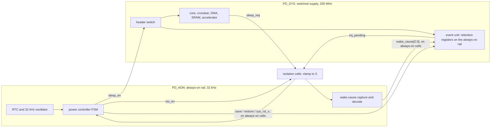

# 19. Gate-Level, Timing and Power-Aware Verification

Gate-level verification distinguishes failures of the synthesized design from failures of its testbench, while timing and power-aware runs address implementation delays and power intent. The reference SoC illustrates the distinction with two regression results.

The first is a boot test that fails at time zero with unknowns. Nine hours of debug establish three things. The testbench was written against RTL, where no scan-enable pin existed, so it never drove the netlist's scan-enable pin. A scoreboard comparison using `!=` reported success on all-unknown data for two of those hours. A white-box checker on the DMA's internal descriptor pointer can no longer bind, because synthesis dissolved the register it watched; that pointer addresses transfer descriptors, the records that program each DMA transfer. Such a checker is attached by a `bind`, the SystemVerilog construct that instantiates a checker into a design scope without changing the design's source. These findings concern the testbench and establish nothing about the design.

The second result prevents a tape-out escape, a bug that crosses a sign-off boundary undetected. With power intent loaded, a sleep/wake test shows the event unit losing its interrupt-mask configuration after power-down. Chapter 7 treats that loss as its canonical escape, and plain RTL simulation could not represent it because it does not model power loss.

The same engineers obtained both results on the same platform in the same week. Only the second run could have exposed that bug in this flow; the first served only to diagnose the environment. The cost of gate-level simulation makes this distinction a budget decision.

### Chapter map

§19.1 identifies what gate-level simulation finds beyond RTL and which traditional obligations other tools discharge better. §19.2 distinguishes design failures from testbench failures at gate level. §19.3 covers SDF back-annotation, timing-check semantics, static timing analysis's authority on timing, and the contribution of simulation. §19.4 develops formal, checkable power intent and sequencing between domains. §19.5 budgets gate-level and power-aware runs and checks that can start earlier.

## 19.1 The role of gate-level simulation

Four arguments for gate-level simulation (GLS) differ in strength.

**Synthesis correctness.** Running functional testbenches on the netlist verifies the synthesis tool, a task that formal equivalence checking and static timing analysis perform better [cit:B2]. Chapter 15 explains why: equivalence checking exhaustively checks the transformation without stimulus, including synthesis defects such as a wrong result in a wide arithmetic operator that affects a vanishing fraction of inputs and is impractical to find by simulation. Projects should run logic equivalence checking after synthesis, which discharges this justification for GLS.

**Timing.** Section 19.3 explains why GLS cannot establish timing correctness. Static timing analysis examines every timing arc in the netlist structurally, across process corners, voltage and temperature, and on-chip variation [cit:D14]; a simulation exercises the paths one test happens to sensitise, at one corner, with one set of annotated delays.

**X and reset problems hidden at RTL.** Chapter 13 established the mechanism: RTL simulation is optimistic about unknowns at every decision, because `if`, `case` and the edge constructs take a definite branch on an ambiguous condition. In a netlist, gate primitives and flip-flop models replace those constructs without exhibiting their optimism [cit:D23]. So a design that passed at RTL because an unknown was silently resolved will fail at gate level, at reset, where the unknowns live. The cost is that replacing those constructs also makes pessimism worse: the netlist returns an unknown where the silicon would produce a definite value. The worsened pessimism is Section 19.2's problem.

**Structures absent from RTL.** Scan chains, test-mode multiplexers, compression logic, self-test wrappers and the debug fabric's boundary are inserted *after* RTL sign-off; no RTL simulation has seen them, so the obligation that every one is inert in functional mode cannot be checked earlier. A two-flop synchronizer is a pair of chained flip-flops in the destination domain, and the first of the pair is given time to settle before the second samples it. A structure inserted for one purpose can degrade another: scan insertion on the *second* flip-flop of the pair adds multiplexer logic on the metastable path, that logic erodes the settling window, and the eroded window degrades mean time between failures; scan insertion on the first flip-flop of the pair has no such effect [cit:D14]. This finding could not have come from simulation because it describes a structural property of the implemented netlist.

### Two sources on demonstration and sign-off

Two sources appear to disagree over the role of GLS.

Metastability is the unstable condition of a flip-flop sampled too near a change, which resolves to a legal value only after an unpredictable delay. One class of metastability bugs is impossible to demonstrate on an RTL model in simulation; reproducing them requires a gate-level model with timing, typically unavailable until late in the flow [cit:R2]. Yet when back-end processes interfere with synchronizer operation, the answer is *not* gate-level simulation on a back-annotated netlist but structural and timing analysis of the final implementation [cit:D14].

The sources address different questions. GLS with timing can *exhibit* one timing violation: one path, one corner, one alignment of edges. It cannot *cover* the class, because whether a given alignment occurs in a given run is an accident of the stimulus. Sign-off requires coverage of the class, which structural netlist analysis provides; simulation gives one sample. GLS can therefore demonstrate a failure, but cannot sign off its absence.

A proposed gate-level run should distinguish two purposes: exhibiting a phenomenon nothing else can produce, or discharging a plan row, the line of the verification plan that names a feature, the method that covers it and the evidence that closes it. The first is legitimate and occasionally irreplaceable. For obligations within its scope, static analysis supplies exhaustive evidence; the plan row should identify that scope.

> **Scenario.** The flagship's LPDDR4 subsystem includes a PHY training state machine that runs at link bring-up, and the team's plan carries a row for it. The proposal is to run training at gate level with back-annotated delays because it involves timing.
> **Approach.** The plan row should be split into separate obligations. The functional obligation is to reach a trained state from every starting condition and report failure correctly otherwise; it is verified at RTL, where a thousand seeds are affordable. Static timing analysis establishes that trained delay settings satisfy setup and hold at every corner; simulation cannot improve that coverage. Exactly one obligation remains for gate level: the training sequence on the real netlist with real delays must not violate a timing check that the constraints declared impossible. Section 19.3 returns to those declarations, the timing exceptions that static timing analysis obeys without checking.
> **Why.** The undivided row would have cost days of gate-level runtime and discharged neither obligation properly: too few seeds to be functional evidence, one corner to be timing evidence. The split costs less and produces two supported arguments instead of one unsupported argument.

The gate-level uses considered here are unknowns at reset, structures present only after synthesis, power intent on a netlist, and checks on timing constraints.

## 19.2 Reading a gate-level failure

Chapter 13 defines the semantics of unknowns, and Chapter 12 defines the term *optimistic*: RTL simulation is optimistic, resolving an ambiguous condition into a definite branch. Synthesis removes those constructs and their optimism, but worsens pessimism: the netlist evaluates far more expressions, and each of them is all-or-nothing about unknown operands [cit:D23]. The first gate-level run can expose unknowns caused by design defects or by the environment. Triage must distinguish these origins before design debug. Triage is the work of turning failures into facts before any of them is debugged: each failure is classified as a design bug, a testbench bug or an environment failure, and assigned to an owner.

### Four failure families and their signatures

**Unreset state.** The tell that identifies this family has three parts: the unknown is present at time zero, it survives reset de-assertion, and it traces back to a flip-flop with no reset pin in the netlist. Formal reset analysis finds this class earlier and more completely, because it reports every register still unknown when the reset period ends (see Chapter 13); a GLS run that discovers one therefore identifies a gap in the entry gate. The entry gate is the set of checks a design passes before it earns a gate-level run.

An unreset register is not necessarily a defect.

> **Scenario.** The radar front-end's FFT pipeline holds several stages of butterfly registers, deliberately left unreset: they are pure datapath, the reset tree would be large, and every one of them is overwritten by the first frame that flows through. Butterfly registers are the pipeline registers that make up those stages, each holding an intermediate result on its way through the pipeline. At gate level the first run floods the whole chain with unknowns for the first frames, and a junior engineer opens a bug.
> **Approach.** The unreset datapath is not a bug, but that conclusion requires an argument rather than an assumption. The argument has one premise: no control decision consumes any of those registers before the flush completes. The checks establish that the valid chain is reset, the CFAR threshold logic reads only post-flush samples, and no comparator output feeds a state machine during the flush window. The plan row should record the argument, with an assertion that no downstream control signal is unknown once the valid chain has been high for the pipeline's depth.
> **Why.** The unreset datapath is a legitimate area decision and it costs nothing in silicon. Verification must permanently establish that the unknown never reaches a decision; judging waveform X values to be flush data cannot discharge that obligation. The assertion detects later changes that violate the argument.

**Pins that exist only in the netlist.** The netlist adds pins of its own: scan-enable, test-mode, scan inputs, built-in self-test (BIST) enables and the clock-multiplexer select for at-speed test. An at-speed test runs the netlist at its functional clock speed rather than at a slower test clock. The unknown starts at a top-level input with no RTL counterpart, and its cone of influence is the netlist region that input can reach. This is missing harness infrastructure that could not have been written earlier, rather than a design defect or, strictly, a testbench bug. The harness should be built once as a named functional-mode tie-off module and reviewed as an artifact: tying `test_mode` to the wrong value does not produce an error, but produces a netlist that passes tests while running in a mode excluded from the shipped device.

**Environment infrastructure that cannot survive a netlist.** White-box checkers depend on a specific implementation and cannot be used in gate-level simulation [cit:B2]: synthesis dissolved or renamed the signal, or replicated it into three. The same applies to any hierarchical reference: the path of a checker bound into the design, a register model's back-door path (see Chapter 10), a `force` on an internal net. A back-door access reaches the register's simulation constructs directly by that hierarchical path, instead of driving real bus cycles through the design. The failure appears in environment messages: an elaboration error, a null object handle, or a back-door read returning unknowns while the front door works. A null object handle is a testbench variable that should point at an object and points at nothing. Chapter 11 gives the standard answer: bound checkers carry macro guards so they can be compiled out of a gate-level run, and the checks that must survive are the ones written against ports.

**Pessimism artifacts.** The tell is that the unknown appears mid-logic with no source: no unreset register upstream, no undriven pin, just an expression whose operands were partially unknown. The remedy is to clear real sources first, in order, and re-run; each one removed collapses a large fan-out of artifacts.

### Comparisons that accept unknown data

The third family includes environments that silently stop checking without failing. A scoreboard's comparison operator decides whether an unknown is a failure or a pass.

<!-- slang: fragment - comparison excerpt of a scoreboard; act and exp are the sampled and expected values the scoreboard class holds -->

```systemverilog
// `!==` is case inequality: its result is always 1'b0 or 1'b1, so an
// unknown in `act` always reaches the report. `!=` is logical inequality
// -- 1'bx when the relation is ambiguous -- and `if (1'bx)` takes the
// false branch, scoring the transaction as correct. A 2-state variable
// holding that result would convert the x to 0 by a second route.
always_comb begin
  if ($isunknown(act))
    $error("unknown in sampled data: %0b", act);
  else if (act !== exp)
    $error("mismatch: got %0h, expected %0h", act, exp);
end
```

For the logical equality and inequality operators, the result is `1'bx` only when unknown or high-impedance bits make the relation *ambiguous*; the case operators include those bits in the comparison and always yield a known result [cit:S8]. A value corrupted only in bits that already differ from the expectation is still reported, because the relation is not ambiguous. Two values escape: the fully corrupted one, and the partially corrupted one whose unknowns sit precisely on the bits that would have carried the difference.

The checker can still report an unambiguous comparison, and such reports are no evidence that it rejects the ambiguous ones. The failure is silent: the run passes, coverage is collected, and the plan row is discharged. The testbench should be audited for this defect before its first netlist run. The two-line remedy checks every sampled value explicitly for unknowns before comparison, giving unknown data its own verdict rather than treating it as equal. A sampled value is the value the scoreboard captured at the sampling edge, before any comparison.

### The order of operations

A gate-level run has three independent choices: timing annotation, power intent, and netlist stage; enabling them together makes their interaction part of debug. Gate-level bring-up is the phase in which the environment and the design first exchange checked transactions. It should use a zero-delay netlist without power intent and the suite's shortest reset-and-boot test; nothing is added until that test passes, so each subsequent addition has exactly one suspect. The first clean zero-delay boot belongs in the plan as a prerequisite for the remaining work in this chapter.

## 19.3 SDF back-annotation and what a timing check asserts

RTL has no delays. A netlist has library delays, but they are estimates computed for an average output load, and in a real netlist every instance of the same cell drives a different number of inputs over wires of different lengths. Back-annotation replaces these estimates with per-instance values from the physical netlist or layout geometry, delivered in a Standard Delay Format file, so each gate instance and pin-to-pin connection carries its own delay [cit:B2].

What SystemVerilog takes from the file is precisely bounded: specify path delays, specparam values, timing-check constraint values, and interconnect delays, with the values themselves coming from delay-calculation tools that use connectivity, technology and layout geometry [cit:S8]. Everything else in an SDF file is ignored.

### Three annotation failure modes

**Missing annotation.** Any timing value for which the SDF file provides no value is left unmodified, retaining its pre-annotation value, and the annotator is required only to warn about data it cannot annotate. The annotator that reads the file is a system task, and it takes its scope from one of its own arguments. A call that targets the wrong instance, or a block whose hierarchy differs from the SDF, annotates nothing there and leaves the subsystem on library defaults, frequently zero. The run fails no checks and is fast, but provides no timing evidence for that block. The annotation log records every individual annotation [cit:S8]; review should compare its annotated-instance count against the netlist's.

**Unselected corner.** A string argument selects which member of each min/typ/max triple gets annotated, and its default value leaves the choice to the simulator; a separate argument applies scale factors to the triples [cit:S8]. The operating corner, which determines whether a gate-level run says anything about setup or about hold, is therefore a defaulted parameter of a system task, easily inherited from a script unread for two years. A run with an unselected corner provides no evidence about any corner. The run manifest (see Chapter 12) should name the corner alongside the seed and tool build.

**Annotation cost.** Netlists contain millions of gates and millions of pin-to-pin connections, each needing annotation, so the process is slow; annotating once at compile time and running many test cases against the same compiled model avoids repeating annotation per test [cit:B2]. Annotation cost is the reason a gate-level tier is organized as a small number of long runs rather than a large number of short ones, and it interacts badly with per-test randomization.

### Timing-check semantics

The system timing checks fall into two groups. One group defines a stability window with respect to a reference signal and checks when the data signal transitions relative to that window: `$setup`, `$hold`, `$setuphold`, `$recovery`, `$removal`, `$recrem`. The other group measures the difference in time between two events: `$skew`, `$timeskew`, `$fullskew`, `$width`, `$period` and `$nochange`, the last of which involves three events rather than two. Evaluation uses two events: a *timestamp* transition records the time, and a *timecheck* transition triggers evaluation; `$setuphold` combines setup and hold windows in a single check [cit:S8].

By themselves, these checks only print violations. The mechanism that makes a timing violation *functional* is the notifier:

```systemverilog
// Abridged excerpt from a library flip-flop model. The rows handling
// unknown inputs are elided; in a real cell they outnumber these, and they
// are where gate-level pessimism comes from.
primitive dff_udp (q, clk, d, notifier);
  output q; reg q;
  input clk, d, notifier;
  table
  // clk  d  ntf : state :  q
       r  0   ?  :   ?   :  0 ;
       r  1   ?  :   ?   :  1 ;
       f  ?   ?  :   ?   :  - ;
       ?  *   ?  :   ?   :  - ;
       ?  ?   *  :   ?   :  x ;   // any notifier event drives the output to x
  endtable
endprimitive

module dff_with_timing_check (output wire q, input wire clk, input wire d);
  reg notifier;
  dff_udp u_ff (q, clk, d, notifier);
  specify
    // These limits are the library's defaults; SDF back-annotation
    // overwrites them per instance.
    specparam tSU = 120, tHLD = 40;
    $setuphold(posedge clk, d, tSU, tHLD, notifier);
    (posedge clk => (q +: d)) = 90;
  endspecify
endmodule
```

Every timing check can take an optional notifier, a variable the check toggles whenever it detects a violation, so the model can make its behavior a function of violations; the canonical use drives the device's output to `x` [cit:S8].

A timing violation injects an unknown into the datapath, which propagates to a functional failure elsewhere, potentially thousands of cycles later. In a run with twelve early timing violations in one block, those violations cause the final scoreboard failure and cannot be treated as benign. Timing-check output should be resolved in time order before any functional mismatch is debugged in a back-annotated run.

### Static timing analysis is the authority

Static timing analysis checks all legal timing parameters in a gate-level representation: it analyses the netlist structurally to identify every possible timing arc, it compares those arcs against a timing-constraints file that states the required timing, and it makes that comparison not against one set of parameters but across process variation, minimum and maximum voltage and temperature, and on-chip variation; of those corners, the best case is the one where hold analysis is critical, and the worst case is the one where setup analysis is critical [cit:D14].

Gate-level simulation exercises paths one test sensitizes, at one corner, under one annotation. It cannot report margin or cover unsensitized arcs, and cannot establish that a path passes at typical but fails slow unless it runs at both. Using GLS for timing sign-off incurs runtime cost and false confidence.

### Checking timing constraints with simulation

The constraints file that STA reads is *manually generated* to match the device specification, and enhanced through synthesis, place-and-route and clock-tree synthesis as the netlist evolves [cit:D14]. Every exception, including false paths, multicycle paths and case-analysis settings, is a human claim that STA obeys without checking. A case-analysis setting is a constant that the timing tool is told to assume on a pin. STA stops analyzing a path declared false.

A back-annotated gate-level run makes no such assumption: it applies the real path delay and evaluates the real timing check. If the exception was wrong, the check fires. GLS with SDF thereby checks that constraints describe the implemented design; it does not establish timing sign-off.

> **Scenario.** The neural accelerator's weight-decode path is declared a multicycle path in the constraints. The argument for the declaration is that the 16-lane MAC datapath consumes a weight only after several cycles of set-up for one convolution job, the accelerator's unit of work. The declaration is correct for 8-bit weights. At 2-bit weights the decoder produces four weights per fetch and the datapath runs one result per cycle, so the same path is single-cycle. STA reports timing met, because it was told not to look.
> **Approach.** One gate-level run should exercise the accelerator's quantization suite at the narrowest precision, back-annotated at the slow corner. `$setuphold` violations appear on the decode registers within a few hundred cycles, the notifier drives unknowns into the MAC array, and the scoreboard mismatches. The fix is in the constraints file, not the netlist.
> **Why.** RTL simulation could not find this because the path has no delay at RTL. STA could not find it either because it accepts the exception as a premise. A mode-dependent exception illustrates this gap between the two methods: gate-level tests should exercise *configurations the constraints made assumptions about*, rather than maximize exercised logic.

## 19.4 Power-aware verification

Hardware description languages were built to capture what a design computes. They cannot describe how elements are powered, and power gating and multiple supply voltages made power architecture a functional matter rather than a physical one; that shift required a separate description: IEEE Std 1801-2024, *IEEE Standard for Design and Verification of Low-Power, Energy-Aware Electronic Systems* (UPF) [cit:S10]. UPF, the unified power format, is that description: a machine-readable statement of a design's power intent. Power intent must live outside the design source that every tool treats as authoritative, because the same RTL is instantiated into different power architectures by different integrators [cit:D17], and because a description of the power architecture has to be readable by synthesis, place-and-route, static checkers and simulators alike.

A **power domain** is a collection of instances treated as a group for power-management purposes, typically sharing a primary supply set. **Isolation** provides defined behaviour for a signal whose driving logic is not active, implemented by an **isolation cell** that passes values normally and clamps its output to a specified value when its control asserts. A **level-shifter** translates a signal from one voltage swing to another. **Retention** is enhanced functionality on selected sequential elements so their values survive the power-down of the primary supply, and a **power state table** states the legal combinations of supply states [cit:S10]. The section concerns the interaction of these five elements over time.

### Power intent and simulator value resolution

Loading power intent changes the simulator's value resolution. The change has three parts. The first part is that when a domain powers down, every logic node inside it is corrupted to unknown and stays unknown until the domain powers back up; the second is that an isolation cell on an output port stops that unknown reaching powered-on logic by driving the clamp value the power intent specifies; and the third is that a retention register is corrupted like everything else, except that the value saved before entry is restored on exit [cit:D23].

Corruption supplies checks without separately written checking logic. Injecting unknowns into a powered-down domain exposes unprotected crossings: unknowns appear there and downstream logic starts misbehaving shortly after the driving domain powers down [cit:D17]. A missing isolation cell is diagnosed through its resulting failure rather than a rule.

The standard makes corruption level a declared property rather than a fixed behavior. A **simstate** specifies the operational capability of a supply state. The ladder runs from `NORMAL` (full switching with characterized timing), through `CORRUPT_STATE_ON_CHANGE`, `CORRUPT_STATE_ON_ACTIVITY`, `CORRUPT_ON_CHANGE` and `CORRUPT_ON_ACTIVITY`, to `CORRUPT`, where the supply cannot even hold existing state. The four names in the middle differ on two points: whether corruption takes the stored state alone or every value the logic drives, and whether it follows a change of value or any switching. The predefined power state `ON` carries simstate `NORMAL`; `OFF` and `ERROR` both carry `CORRUPT` (IEEE 1801-2024 §4.8) [cit:S10]. Each declared state specifies whether logic still switches, holds its value without switching, or cannot even hold its existing state.

### The reference SoC's two power domains

The reference SoC has two power domains: an always-on island with the real-time clock and wake-up logic, and a switchable system domain containing everything else; both use one nominal voltage, requiring no level-shifters. This deliberate two-domain simplification separates isolation, retention and sequencing from voltage; the flagship supplies the multi-voltage example. Every crossing is shown in {ref: ref_soc_power_domains}.



{figure: ref_soc_power_domains} The reference SoC's two power domains and every signal that crosses between them: an always-on island carrying the real-time clock, the wake-cause capture and the power-controller state machine, against a switched domain holding the core, the crossbar, the DMA, the SRAM, the accelerator and the event unit. The crossings are not symmetric. Signals leaving the switched domain pass through isolation cells, because their drivers vanish; signals entering it need no clamp, but they do need a route built entirely of always-on cells, and the isolation enable itself needs the same kind of route.

The crossing requirements differ by direction. Signals leaving the switched domain for the always-on island, including the core's sleep request and event unit's pending-interrupt flag, must pass through isolation cells (IEEE 1801-2024 §4.4.4): their drivers vanish while the island runs and would otherwise feed it unknowns. Signals entering the switched domain from the island (the wake-cause code and the controller's `save`, `restore` and reset) need no clamp because their destination is unpowered and its value irrelevant. They need a route built entirely of always-on cells, and the isolation enable needs such a route too, because its own cell must stay powered in order to clamp. A routing tool breaks such a path if it inserts an ordinary buffer: one industrial design was found with ordinary buffers rather than always-on cells inserted on isolation-enable and wake-up signals, corrupting the wake-up path [cit:D17]. The event unit's retention cells use the always-on rail, while normal-mode storage uses the switched supply; this is why one survives power-down and the other does not [cit:S10].

The sequences below specify the required hardware ordering. {ref: power_sequences} places the shutdown and restoration steps side by side.

{table: power_sequences} The power-down and power-up sequences for the reference SoC's switched domain, one column each, in the order the hardware requires. Three of the steps carry published failures, which is what to read the columns for: isolation must be asserted before the sleep enable and released after it, reset must already be asserted when the supply returns, and reset must be inactive at the restore edge — which is why step 3 of the power-up column has an order inside it.

| Power-down | Power-up |
|---|---|
| 1. Quiesce: no outstanding bus transactions | 1. Assert the domain reset, while power is still off |
| 2. Gate the domain clock | 2. Close the header switch; wait for supply-good |
| 3. Assert `save`: retention captures state | 3. Release reset, then assert `restore` |
| 4. Assert isolation: outputs clamp | 4. Release isolation |
| 5. Open the header switch: power off | 5. Un-gate the clock |

Three of those steps carry published failures. Isolation must assert before the sleep enable and de-assert after it; reversing either order makes the always-on island sample an unknown throughout the overlap. Reset must already be asserted when the supply returns. In one design, reset was asserted *after* the sleep enable de-asserted, and the register output was corrupted for exactly the window between the supply arriving and the reset landing. And reset must be inactive at the restore edge, which is why step 3 of the power-up column has an order inside it [cit:D17].

All three failures come from Samsung Electronics' published checklist of its own low-power practice, which records specific failures rather than deductions or generalizations. Its isolation table alone runs to eleven numbered checks, enumerated as named failures: a missing isolation cell, a redundant isolation cell, a normal isolation cell sitting inside a block that switches off, an isolation cell whose output floats, an isolation control signal of the wrong polarity, an isolation control signal tied off to a constant, and further entries for a cell type or a cell name that disagrees with the declared power intent. The retention checks run the same way, down to a save or restore control taken from the wrong source or tied off to a constant [cit:D17]. These published failures belong on the checklist §19.4 has been assembling, each as a check against the declared power intent.

### Worked example: the event-unit escape and its assertion

The canonical event-unit bug of Chapters 3 and 7 lives on the boundary between steps 3 and 4 of the power-up column.

The event unit's retention strategy carries a *restore-period condition*: a predicate that must hold throughout the restore window. The condition is "isolation still asserted": a half-restored register drives invalid data, and only the clamp keeps it out of the always-on island throughout restore. The standard is normative about what happens if the condition lapses: it shall be true throughout the entire restore period (IEEE 1801-2024 §6.53), otherwise the restore operation fails and the retention element is corrupted [cit:S10].

The reference SoC's wake path has a fast-wake optimisation. The always-on wake logic drops isolation enable in the cycle a wake event arrives if supply-good is already asserted, saving 32 kHz cycles of wake latency by bypassing the release state of the controller sequencer. The sequencer is the state machine that walks the power-up column one step at a time. The qualification appears safe because the wake event that starts power-up arrives while the supply is still off and cannot fire the bypass; on every ordinary wake, the sequencer releases isolation itself at step 4. Failure requires a *second* wake event after supply-good, inside the restore window opened at step 3. That one qualifies, so the bypass lowers isolation enable a cycle before the sequencer would. The restore-period condition becomes false mid-restore, corrupting the retention element and destroying the event unit's interrupt-mask configuration. The wake event coincides with isolation release, as Chapter 7's post-mortem recorded.

Plain RTL cannot represent this failure: without power-down, corruption or retention, restore always succeeds. Power-aware simulation can represent it, but still needs stimulus that hits the race. The assertion below states the restore-period condition on the control signals themselves, so it fails as soon as isolation drops inside the restore window, whether or not the corruption is modeled; under formal proof it also needs no stimulus that hits the race.

```systemverilog
// Bound in the always-on domain. Every signal here lives in the always-on
// domain, so this checker keeps running while the switched domain has no
// power -- which is the whole point.
module pd_sys_sequence_chk (
  input wire clk_aon,     // 32 kHz always-on clock
  input wire rst_aon_n,   // always-on reset, active low
  input wire iso_en,      // 1 = switched-domain outputs are clamped
  input wire sleep_en,    // 1 = the domain's power switch is open
  input wire restore,     // level-sensitive retention restore, active high
  input wire sys_rst_n    // switched-domain reset, active low
);
  // Power may be removed only from an already-isolated domain.
  property p_iso_before_sleep;
    @(posedge clk_aon) disable iff (!rst_aon_n) $rose(sleep_en) |-> iso_en;
  endproperty
  a_iso_before_sleep : assert property (p_iso_before_sleep);

  // Isolation may be released only once power is back.
  property p_iso_after_power;
    @(posedge clk_aon) disable iff (!rst_aon_n) $fell(iso_en) |-> !sleep_en;
  endproperty
  a_iso_after_power : assert property (p_iso_after_power);

  // The clamp must hold for the whole restore window: this is the
  // retention strategy's restore-period condition, stated as an assertion.
  property p_restore_isolated;
    @(posedge clk_aon) disable iff (!rst_aon_n) restore |-> iso_en;
  endproperty
  a_restore_isolated : assert property (p_restore_isolated);

  // Reset must already be asserted when the supply returns.
  property p_reset_before_power;
    @(posedge clk_aon) disable iff (!rst_aon_n) $fell(sleep_en) |-> !sys_rst_n;
  endproperty
  a_reset_before_power : assert property (p_reset_before_power);

  // One cover per antecedent (Chapter 11's rule). Each is a rare, deliberately
  // sequenced event, so an empty cover is a finding rather than a formality.
  c_sleep_entry   : cover property (@(posedge clk_aon) disable iff (!rst_aon_n)
                      $rose(sleep_en));
  c_iso_release   : cover property (@(posedge clk_aon) disable iff (!rst_aon_n)
                      $fell(iso_en));
  c_restore       : cover property (@(posedge clk_aon) disable iff (!rst_aon_n)
                      restore);
  c_supply_return : cover property (@(posedge clk_aon) disable iff (!rst_aon_n)
                      $fell(sleep_en));
endmodule
```

The module holds four assertions. All four are overlapping implications on the always-on clock, each of them has a cover on its antecedent, and all of them check only always-on signals. An overlapping implication is an assertion form whose consequent is checked in the same cycle as its antecedent, rather than in the next one. The checker observes only the power controller's *outputs*, never the switched domain, so it remains active and evaluating while that domain is unpowered. `a_restore_isolated` fails on the canonical escape in the cycle the fast-wake path fires, rather than microseconds later at the next read of the event unit's configuration.

Because these assertions concern a small always-on finite state machine with a handful of inputs, they are suitable for formal proof (see Chapter 14); proved once, they hold for every wake-event arrival time, precisely the randomization that the escape's post-mortem identified as missing. And because the assertions are written against controller outputs rather than against a netlist, they run unchanged at RTL, which answers the scheduling question the escape raised: power sequencing does not need to wait for gate level.

### State that must not survive power-down

Retention decisions must justify exclusions as well as inclusions.

> **Scenario.** The crypto engine sits inside a switched power domain, and an unwrapped AES key sits in the ordinary registers of its key ladder, the chain that derives a usable key from a stored one. During power-intent capture, the domain's retention strategy is applied broadly to "retain the configuration registers", and its filter includes the key registers.
> **Approach.** Two negative power-intent obligations should be stated as properties rather than review comments. The key registers must *not* be in the retention strategy, so that powering the domain down destroys the key, which is the entire security value of powering it down. The isolation strategy must clamp `key_valid` to 0; clamping to 1 would tell the always-on island that a key is loaded while its domain is unpowered, so the clamp value is a functional decision.
> **Why.** Tests that check correct encryption after power-up miss this defect because retention leaves the key available. A directed power-aware test catches it by powering down and up, attempting encryption without reloading the key, and requiring failure. The second obligation establishes that isolation clamp values cannot be treated as don't-cares. Clamping a `busy` output to 1 hangs the interconnect; clamping a request line to 1 launches a transaction into a dead domain; clamping an error flag to 0 hides a fault. Each clamp value needs a plan row and rationale explaining how receiving logic uses it throughout power-off.

### Always-on routing after layout

> **Scenario.** The sensor hub is a 32 kHz always-on island with its own DSP, continuously fusing sensor data while its host sleeps and waking the host when a fusion threshold trips. Chapter 13 identified a bug earlier on this wake path: a reset-domain crossing *inside* the island caused a spurious wake interrupt, diagnosed statically on RTL. The next path segment fails differently at a later stage, with nearly identical symptoms in the two cases.
> **Approach.** Power-aware simulation should cover the *post-layout* netlist as well as RTL and the pre-layout netlist. Low-power verification has three stages, RTL, pre-layout netlist and post-layout netlist, each exposing defects the previous stage could not [cit:D17]. Here the post-layout run shows the wake request going unknown whenever the host's switched domain is off: the system never wakes, and only a watchdog recovers it.
> **Why.** Place-and-route routed the wake request through a repeater physically placed inside the host's switched domain, so a signal that starts and ends in always-on logic now passes through a cell with no power. That placement did not exist at RTL, did not exist in the pre-layout netlist, and is invisible to any functional test on either; the signal is logically correct at every stage before the one where it breaks. This failure motivates at least one power-aware post-layout run and structural checks of always-on routing, rather than an assumption that the routing survived layout.

### Power-state growth and verification strategy

The reference SoC's two domains yield one switchable domain with two states, on and off, one power-down sequence and one power-up sequence; in this example, three people can review them around a whiteboard in an afternoon.

The flagship declares six power domains (always-on, root of trust, host cluster, compute island, NoC and memory, peripherals); dynamic voltage and frequency scaling (DVFS) provides three operating points (0.6, 1.1 and 1.5 GHz) for the host cluster and compute island, while the NoC stays at 800 MHz. The host cluster and the compute island have three operating points plus off, four states each; the remaining three switchable domains are on or off. Those five switchable domains give 4 × 4 × 2 × 2 × 2 = **128 combinations**. This is an upper bound, not the legal-state count: the power state table specifies the legal subset, and most of the 128 combinations are illegal by construction. The 128 combinations require checks of legal states and their transitions; sequencing bugs occur in transitions, which far outnumber states.

A published industrial case from Samsung Electronics in 2010 describes a 40-million-gate SoC with 30 power domains, eight of them software-controlled power-gating domains, more than 2,000 lines of power intent and more than 4,000 legal power states; it identifies power-state coverage as an explicit challenge with no satisfactory solution in the tooling of the day [cit:D17]. The three examples considered here stand at two, 128 and four thousand, and the following strategies can be assessed against them.

For the reference SoC with two domains, the power state table documents the states, and directed tests check the sequences. A directed test is a hand-written one: its content and its order are fixed, so it does the same thing on every run. For the flagship with 128 combinations, the proposed strategy uses the power state table as a machine-readable specification, generating from it one sequencing checker per domain rather than one written by hand, and a coverage model whose axes are power state and transition rather than data. A coverage model is the set of axes along which coverage is measured, with the values each axis may take. For a case with four thousand legal states, a strategy to assess is proving that the power-management finite state machine emits only legal sequences and checking domains against those sequences, rather than covering the product space.

DVFS adds an orthogonal complication that the state count hides. An operating point is a state; a *transition* between operating points is a voltage ramp, and the interesting failures happen during the ramp rather than at either end. A level-shifter corrupts its output when its input voltage leaves its characterized range; this documented behavior was reproduced in simulation by driving the input outside the cell's declared voltage range [cit:D17]. Chapter 13 noted the companion effect on the clocking side: the flagship's clock ratios move with the operating point, so a CDC abstraction model is valid for one operating point only, since the model is built for one fixed ratio between the crossing clocks.

### Power-aware simulation has its own optimism

Chapter 13 described RTL simulation's optimism about unknowns. Power-aware simulation has optimism one abstraction level higher.

Simulation results reflect the implemented hardware only to the extent that the simstate declared for each power state is correct. On the ladder, `CORRUPT_ON_ACTIVITY` sits nearer `CORRUPT` than `CORRUPT_STATE_ON_CHANGE` does, and so corrupts more. Declaring `CORRUPT_ON_ACTIVITY` for silicon that is `CORRUPT_STATE_ON_CHANGE` changes results; this mismatch is conservative, but other mismatches between the declared simstate and the silicon are optimistic, making simulation show working behavior that fails in the implemented design [cit:S10]. If the power-aware model repeats an architectural misunderstanding, its tests can pass for the wrong reason, as when a reference model repeats a misreading of the specification (see Chapter 3). An overly generous simstate lets a domain's corruption tests pass for the wrong reason.

## 19.5 Run selection and scheduling

Gate-level capability must be budgeted against runtime.

### Runtime calculation

Chapter 12 costed the reference SoC's nightly regression at month nine: 180 distinct tests, 900 runs, a mean of 11 minutes, 165 CPU-hours on 24 concurrent simulator licences, comfortably inside a ten-hour night. The gate-level comparison uses those 180 tests with back-annotated delays.

In this example, the team measures a 40× slowdown. Eleven minutes becomes 7.3 hours; 180 runs cost 1,320 CPU-hours, or 55 wall-clock hours on the same 24 licenses, exceeding both a weekend and a night. Even at 10×, the same 180 runs cost 330 CPU-hours, or 13.8 hours on 24 licenses, exceeding the night; break-even for the ten-hour night is around 7×. The whole plausible slowdown range therefore excludes the full gate-level suite, which is prohibitive in practice for any reasonably sized SoC [cit:D23].

The ratio also determines the size of the affordable tier. At 40×, fourteen tests cost 102 CPU-hours; fourteen runs on twenty-four licenses form one wave of 7.3 hours, leaving ten slots free and fitting the weekend tier without displacing other work. The decision is which fourteen tests to run. The example assumes an order-of-magnitude variation in the slowdown ratio with netlist size, annotation scope and how much of the environment survives; that assumption must be checked by measuring the ratio on the project's own design and tool. A DVCon India 2025 poster from Samsung on a complex SoC reports an improvement from reducing that ratio: boot dominates gate-level runtime, so the poster runs boot once with timing checks enabled and disables them for the remaining vectors, and it reports a 32 percent run-time improvement for that one change; it credits its whole set of flow optimizations with a 43 percent reduction in disk space and a 58 percent reduction in head count [cit:D4].

### Three independent run choices

Three independent choices, timing annotation, power intent and netlist stage, yield the combinations in {ref: glevel_configurations}, answering different questions at very different costs.

{table: glevel_configurations} The useful combinations of the three independent choices that make up a gate-level run — timing annotation, power intent and netlist stage — each paired with the question it answers and the tier it belongs in. The first row is the one teams get wrong most expensively: RTL plus power intent answers the power-sequencing question without a netlist at all, and belongs in the nightly tier from the day the power intent file exists.

| Configuration | The question it answers | Where it belongs |
|---|---|---|
| RTL + power intent | Does the power sequence work? Is every domain crossing protected? | Nightly, from the day the power intent exists |
| Zero-delay netlist | Does the design leave reset with no unknowns? Are the test structures inert in functional mode? | Weekend, from first netlist |
| Zero-delay netlist + power intent | Does the *implemented* protection logic match the intent? | Weekend, once protection cells are inserted |
| SDF-annotated netlist, named corner | Do the timing constraints describe the design that was built? | Campaign, per corner |
| Post-layout netlist + power intent | Are the always-on routes really always-on? | Campaign, once per netlist drop |

Power-aware verification starts at RTL and also runs at gate level; it should begin as soon as the power intent file exists. Chapter 7's escape post-mortem reached exactly this conclusion and wrote it into the sign-off checklist. The gate-level stage adds a later check: only the netlist contains the actual isolation, retention and always-on cells, so the netlist is the only place where the inserted structures can be checked against what was specified; power-aware simulators therefore provide a mode intended for gate-level runs, where multi-voltage cells are physically present rather than inferred from the intent [cit:D17].

### Selection criteria for fourteen tests

Five criteria rank candidates by priority. They identify more than fourteen candidates, several from the second criterion alone, so the budget determines the cutoff. Selection should follow this order until the runtime budget is exhausted; excluded tests must be recorded with justification.

1. **Reset and boot.** This short run is always required: it exposes unknowns and must pass before any other gate-level run provides evidence.
2. **One test per structure that does not exist at RTL.** Scan-enable inert in functional mode, test-mode multiplexers not selected, debug-fabric entry and exit, clock-gating enables. These structures first become available for simulation at the netlist stage.
3. **Every power state transition, at least once.** Gate-level power transitions check inserted cells; RTL already covered sequencing, so timing annotation is unnecessary.
4. **The configurations the timing constraints assumed something about.** Section 19.3's multicycle example motivates annotating tests for modes the exceptions were written for or *around*.
5. **Whatever the last three escapes would have needed.** The tier can include tests that would have exposed those escapes.

The constrained-random regression is excluded regardless of budget. Constrained-random is the automatic generation of legal but unlikely stimulus under constraints. Random seeds buy almost nothing per unit cost at gate level because their value depends on scenario volume, which the slowdown removes. Ranking also reproduces existing coverage without exploring anything new (see Chapter 12), so a ranked gate-level tier expensively repeats RTL evidence.

> **Scenario.** The USB controller's plan carries rows for its link power states, U0 through U3 (*Universal Serial Bus 3.2 Specification*, Revision 1.1, sections 7.5.6 to 7.5.9) [cit:S21], and someone proposes running them power-aware at gate level on the grounds that they are "the power tests".
> **Approach.** The two state machines should be treated separately: apart from the interaction below, they share only vocabulary. Link power states are a *protocol* obligation: the device negotiates them with a host, the specification mandates transitions and timing, and an RTL compliance suite supplies evidence. The controller's *power-domain* state is a power-intent obligation about supplies, isolation and retention. They interact at exactly one point: entering the deepest link state permits the integrator to power-gate the controller's domain, and the controller must then be quiesced, isolated and retained correctly. That interaction is the only plan row that earns a power-aware run, and it needs no timing annotation.
> **Why.** Conflating the two puts protocol tests on a slower, less effective platform and leaves power intent unchecked because the U-state tests passed. A test needs a gate-level or power-aware slot only if it requires that platform's unique capabilities; its name cannot justify selection.

### In practice

The environment repairs in the opening example can have one owner responsible for the resulting testbench changes. The resulting tie-off harnesses, unknown checks and white-box checker macro guards permanently extend the testbench rather than serve as workarounds.

Sampling and driving through clocking blocks lets a single environment work against both RTL and gate-level models (see Chapter 12), and every hierarchical reference is a place where that environment will not work. A clocking block is the declaration that fixes the moment interface signals are sampled or driven, so the testbench cannot race the design it watches. Discovering this at netlist arrival costs twice: rewriting the environment and losing confidence when revised checkers disagree with the originals.

Timing-check waiver files require review alongside the constraints. A waiver is a written record that accepts a specific hole in the evidence, with its reason, its risk argument, its owner and its expiry. A timing violation waived as "this path is a false path" must trace to the constraints file; changes to either file can leave the waiver inconsistent with the constraints. The waiver and constraints files must therefore be reviewed together.

In this scheduling scenario, a late netlist and an extended bring-up of the first clean gate-level boot leave the nominally nightly tier only two chances to run before tape-out. Test selection therefore budgets two clean runs rather than the planned twenty. Test selection is the filter that decides, before anything is simulated, which tests earn those runs (see Chapter 12).

### Pitfalls

1. **Running the functional regression at gate level.** Symptom: a weekend tier that never completes, and a slowdown blamed on the farm. Cure: the arithmetic above, once, in writing; equivalence checking discharges the synthesis-correctness argument that motivated it (see Chapter 15).
2. **Debugging a functional mismatch before resolving timing-check output.** Symptom: days spent on a scoreboard error whose cause was a `$setuphold` violation two thousand cycles earlier. Cure: resolve timing violations first, in time order, because the notifier converts each one into a propagating unknown [cit:S8].
3. **Unaudited annotation.** Symptom: a suspiciously fast back-annotated run with no violations, or an unidentified min, typ or max corner. Cure: review the annotation log, compare annotated-instance and netlist counts, and record the corner, a defaulted argument [cit:S8], beside the seed and tool build in the run manifest.
4. **Treating the power state table as documentation.** Symptom: sequencing checkers written by hand, one domain at a time, drifting from the table. Cure: generate the checkers and the coverage model from the table, so that a table edit breaks the checks rather than silently outdating them.
5. **Deferring power-aware verification until the netlist.** Symptom: a retention or isolation escape found after RTL sign-off, when the fix is an ECO. Cure: run power-aware at RTL from the day the power intent exists; the netlist stage checks the inserted cells, not the sequence.
6. **Retaining by default.** Symptom: a retention strategy whose filter is "the configuration registers", applied without asking what must *not* survive. Cure: each retention decision needs a plan row; in the crypto example, the key registers must be excluded from retention.

### Summary

- Gate-level simulation's traditional justifications have mostly been taken over by better tools: running the functional testbenches on the netlist verifies the synthesis tool, a job that formal equivalence checking and static timing analysis do better [cit:B2]. What survives is unknowns at reset, structures that exist only after synthesis, power intent on a netlist, and a check on the constraints themselves.
- Exhibiting a phenomenon and signing off its absence are different jobs. Simulating the metastability class needs a gate-level model with timing [cit:R2], and even then what appears is the timing violation on the synchronizer path: metastability itself is not observable in simulation, and only structural and timing analysis of the implementation covers the class [cit:D14].
- Initial gate-level triage must distinguish testbench failures from design failures. Triage by tell: an unknown from an unreset flop, from a pin with no RTL counterpart, from a checker that cannot survive a netlist, or from pessimism with no source. The silent failure is `!=` returning `1'bx` for an ambiguous relation, making `if (1'bx)` take the false branch [cit:S8]; unknowns need explicit checks before comparison.
- Static timing analysis is the authority on timing; gate-level simulation is a sample of it. What GLS uniquely adds is a check on the *timing exceptions*, which STA obeys rather than verifies [cit:D14].
- Power-aware simulation checks by *corrupting*: a powered-down domain's nodes go unknown, and an unprotected crossing becomes visible as a failure downstream rather than as a rule violation [cit:D23].
- Power sequencing governs domain interactions. Isolation must precede power-down and remain after power-up, reset must precede supply return, and restore conditions must hold throughout the window; a lapsed restore condition corrupts retained state (IEEE 1801-2024 §6.53) [cit:S10].
- Power-aware simulation has its own optimism: results are only as accurate as the declared simstate, and an over-generous one produces tests that pass for the wrong reason [cit:S10].

### Exercises

**Exercise 19.1 (calculation).** Section 19.5 costs the reference SoC's nightly regression at 180 distinct tests, 900 runs, a mean of 11 minutes and 24 concurrent licenses inside a ten-hour night. Compute the slowdown ratio at which those 180 tests, each run once with back-annotated delays, exactly fill that night. State which of the two run counts the derivation must take as its base, and give the ratio the other base would produce. Compare the result with the break-even figure §19.5 reports, and name the two costs §19.5 gives for those same 180 runs that confirm which base is right.

**Exercise 19.2 (judgement).** The first zero-delay gate-level run of the reference SoC's boot test reports no mismatch, its coverage database fills as it does at RTL, and the scoreboard whose verdict closed every RTL plan row compares sampled data against the expectation with `!=`. The team proposes to record the netlist as clean at reset. Decide what that run establishes about the netlist, and name the audit §19.2 requires before the result counts as evidence. Explain why a long history of reported mismatches from the same scoreboard leaves the objection unanswered.

**Exercise 19.3 (artifact).** Read the run record below, filed for a back-annotated gate-level run of the reference SoC's crossbar subsystem, against the three annotation failure modes of §19.3. Identify the two entries whose values withhold the evidence the run was launched to produce, and state for each what the run therefore cannot support. Give the two further items §19.3 requires in the run manifest beside the corner.

```text
Netlist stage:                   post-synthesis, pre-layout
Timing annotation:               SDF file, applied once at compile time
Annotator call scope:            u_soc.u_xbar_wrap
Min / typ / max member:
Annotated-instance count:        not recorded; the annotation log was discarded
Timing-check violations:         none reported
Wall-clock against the zero-delay run of the same test:   shorter
Verdict recorded on the plan row: hold timing met at the fast corner
```

**Exercise 19.4 (judgement).** A proposal asks for one back-annotated gate-level run per corner on the netlist's two-flop synchronizers, to sign off the absence of metastability failures, on the argument that only a netlist with timing can exhibit them. Decide what such a campaign can establish and what it cannot, using the distinction §19.1 draws between exhibiting a phenomenon and signing off its absence. Identify the analysis that covers the class instead, and name the inserted structure §19.1 reports as eroding the settling window when it lands on the second flip-flop of the pair rather than on the first.

**Exercise 19.5 (artifact).** Read the power-intent extract below for the reference SoC's switched domain against §19.4. Decide which of its entries §19.4 requires to be stated as negative properties rather than left as review comments, and give for each the failure the entry as written produces. Identify the one entry that the section's own domain figure already licenses, and name the step of the power-up column of §19.4's sequence table that the restore-control entry contradicts.

```text
Power domain:         PD_SYS, the switched supply
Retention strategy:   every element matching "the configuration registers",
                      a filter that reaches the crypto engine's key registers
Isolation strategy:   clamp value 1 on key_valid
                      clamp value 1 on the crypto engine's busy output
                      clamp value 0 on the event unit's irq_pending
Restore control:      asserted by the power controller one always-on clock
                      cycle before the switched-domain reset is released
```

**Exercise 19.6 (calculation).** Section 19.4 bounds the flagship's power-state combinations at 128. Recompute that bound for a variant in which the NoC and memory domain takes the same DVFS operating points as the host cluster and the compute island. Show the factor each of the flagship's power domains contributes, including the one that contributes none, and state what the power state table does to the recomputed figure.

### Further reading

Within the corpus, [cit:S10] is normative for everything in Section 19.4: the definitions of domain, isolation, level-shifter and retention, the simstate ladder and its corruption semantics, and the retention strategy's save, restore and power-down conditions with the failure behaviour of each. [cit:D17] supplies a power-intent qualification checklist, an eleven-item isolation checklist, sequencing rules for isolation and sleep enables, and an industrial case whose domain and state counts demonstrate inspection limits. [cit:S8] is definitive on back-annotation and timing checks: what an SDF file may carry, what happens to values it omits, the two families of check, notifiers, and the min/typ/max and scale-factor arguments that decide which corner a run represents. [cit:D14] covers static timing analysis and its corners between RTL sign-off and silicon, synchronizers' physical requirements, and why scan insertion on the second flip-flop erodes mean time between failures. [cit:D23] carries the gate-level side of the unknown problem and the power-aware corruption semantics. [cit:B2] explains the purpose of gate-level simulation and SDF, and why checks usually assigned to GLS belong elsewhere. The 2024 data on asynchronous clock domains, and the class of metastability bugs needing a gate-level model with timing, is in [cit:R2].

Outside the corpus: M. Keating, D. Flynn, R. Aitken, A. Gibbons and K. Shi, *Low Power Methodology Manual for System-on-Chip Design* (Springer, 2007) is the standard architectural treatment of the techniques this chapter verifies; S. Jadcherla, J. Bergeron, Y. Inoue and D. Flynn, *Verification Methodology Manual for Low Power* (Synopsys, 2009) is its verification-side companion and the origin of much of the sequencing discipline in Section 19.4. IEEE Std 1497 was the Standard Delay Format specification, referenced but not reproduced by the SystemVerilog standard; IEEE now lists it as inactive-reserved and names its IEC replacement, recorded in the appendix on standards, as where the format is defined today. For static timing analysis as a discipline rather than as a neighbour of simulation, J. Bhasker and R. Chadha, *Static Timing Analysis for Nanometer Designs* (Springer, 2009) is the practitioner reference.
