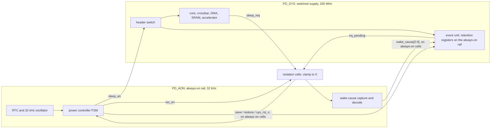

# 19. Gate-Level, Timing and Power-Aware Verification

The reference SoC's netlist arrives on a Tuesday. By Wednesday evening the gate-level regression has produced two results, and the difference between them is the subject of this chapter.

The first result is a boot test that dies at time zero in a fog of unknowns. Nine hours of debug establish that the netlist's scan-enable pin was never driven by a testbench written against RTL, where no such pin existed; that a scoreboard comparison written with `!=` had been quietly reporting success on all-unknown data for two of those hours; and that a white-box checker on the DMA's internal descriptor pointer no longer has anything to bind to, because synthesis dissolved the register it watched. Nothing has been learned about the design. A great deal has been learned about the testbench.

The second result is the one that saves the tape-out. Run with the chip's power intent loaded, a sleep/wake test shows the event unit coming out of a power-down cycle with its interrupt-mask configuration destroyed — the canonical escape of Chapter 7, a bug that plain RTL simulation could not represent at all, because plain RTL simulation does not model losing power.

Same platform, same week, same engineers. One run was ritual; the other was the only place in the entire flow where that bug could have been caught. A chapter on verification after synthesis is really a chapter on telling those two apart, because gate-level simulation is expensive enough that running it out of habit is a decision with a price tag.

### Chapter map

- §19.1 establishes what gate-level simulation genuinely finds that RTL simulation cannot — and which of its traditional justifications are better discharged by other tools entirely.
- §19.2 distinguishes a real gate-level failure from a testbench that was never built to survive one.
- §19.3 states what SDF back-annotation and the timing checks actually assert, why static timing analysis and not simulation is the authority on timing, and what a gate-level run adds on top of it.
- §19.4 develops how power intent becomes a formal, checkable description, and why the bugs live in the *sequencing* rather than in any one domain.
- §19.5 budgets gate-level and power-aware runs: what earns the cost, and what to schedule earlier instead.

## 19.1 Why gate-level simulation still exists

Four arguments are made for gate-level simulation (GLS). They are not equally good, and you are owed the ranking rather than the list.

**"It checks that synthesis did not change the function."** This is the oldest argument and the weakest one. Running the functional testbenches on the netlist verifies that the synthesis tool works properly — a task for which formal equivalence checking and static timing analysis are better technologies [cit:B2]. Chapter 15 gives the reason in full: equivalence checking is exhaustive over the transformation, needs no stimulus, and finds the class of synthesis defect — a wrong result in a wide arithmetic operator, say — that occupies a vanishing fraction of the input space and would take simulation forever to stumble into. If your project runs logic equivalence checking after synthesis, and it should, this argument for GLS has already been spent.

**"It checks timing."** It does not, and Section 19.3 is about why. Static timing analysis examines every timing arc in the netlist structurally, across process corners, voltage and temperature, and on-chip variation [cit:D14]; a simulation exercises the paths one test happens to sensitise, at one corner, with one set of annotated delays. Using GLS as a timing check is a category error with a comforting appearance.

**"It finds X and reset problems the RTL hid."** This one is real, and it is the strongest of the four. Chapter 13 established the mechanism: RTL simulation is optimistic about unknowns at every decision, because `if`, `case` and the edge constructs take a definite branch on an ambiguous condition. Those constructs no longer exist in a netlist — they have become gate primitives and flip-flop models that do not exhibit the optimism [cit:D23]. So a design that passed at RTL because an unknown was silently resolved will fail at gate level, at reset, where the unknowns live. The cost is that the same change makes pessimism worse, which is Section 19.2's problem.

**"It exercises structures that are not in the RTL at all."** Also real, and routinely underweighted. Scan chains, test-mode multiplexers, compression logic, self-test wrappers and the debug fabric's boundary are inserted *after* RTL sign-off, so no RTL simulation has ever seen them and the obligation they carry — that every one is inert in functional mode — has no earlier place to be checked. This is also where a structure inserted for one purpose degrades another: scan insertion on the *second* flip-flop of a two-flop synchronizer adds multiplexer logic on the metastable path and erodes the settling window, degrading mean time between failures, while scan insertion on the first has no such effect [cit:D14]. That finding is worth reading twice, because it did not come from a simulation and could not have: it is a structural property of the implemented netlist.

### Two sources, one apparent contradiction

Two corpus sources appear to disagree outright, and resolving them gives the chapter's thesis in miniature.

A class of metastability bugs cannot be demonstrated on an RTL model in simulation; reproducing them requires a gate-level model with timing, typically unavailable until late in the flow [cit:R2]. Yet when back-end processes interfere with synchronizer operation, the answer is *not* gate-level simulation on a back-annotated netlist but structural and timing analysis of the final implementation [cit:D14].

Both are right, about different questions. GLS with timing can *exhibit* one instance of the timing violation the class turns on — one path, one corner, one alignment of edges. It cannot *cover* the class, because whether a given alignment occurs in a given run is an accident of the stimulus. Sign-off needs the space; a structural analysis over the netlist gives that, where a simulation gives one sample. **Exhibiting a failure and signing off its absence are different jobs**, and GLS is only ever qualified for the first.

That generalises into the chapter's rule. Every time a gate-level run is proposed, ask which of two things it is for: producing an instance of a phenomenon nothing else can produce, or discharging a plan row. The first is legitimate and occasionally irreplaceable. The second almost always belongs to a static tool that answers the same question exhaustively and in minutes.

> **Scenario.** The flagship's LPDDR4 subsystem includes a PHY training state machine that runs at link bring-up, and the team's plan carries a row for it. The proposal on the table is to run the training sequence at gate level with back-annotated delays, on the argument that "training is a timing thing".
> **Approach.** Split the row. The functional obligation — that the training state machine reaches a trained state from every starting condition and reports failure correctly when it cannot — is verified at RTL, where a thousand seeds are affordable. The timing obligation — that the trained delay settings satisfy setup and hold at every corner — is static timing analysis's, and no simulation improves on it. What remains for gate level is exactly one thing: that the training sequence, running on the real netlist with real delays, does not violate a timing check that the constraints declared impossible.
> **Why.** The undivided row would have cost days of gate-level runtime and discharged neither obligation properly: too few seeds to be functional evidence, one corner to be timing evidence. The split costs less and produces two defensible arguments instead of one indefensible one.

The trajectory is one practitioners recognise, though no survey quantifies it: the gate-level tier keeps shrinking, squeezed from below by static tools that reach the same conclusions faster and from above by the cost of running a netlist. What survives is a narrow, high-value residue: unknowns at reset, structures that exist only after synthesis, power intent applied to a netlist, and a check on the timing constraints themselves. Everything else is habit, and habit at gate-level prices is expensive.

## 19.2 Reading a gate-level failure

Chapter 13 owns the semantics of unknowns and Chapter 12 owns the term: RTL simulation is *optimistic*, resolving an ambiguous condition into a definite branch. Synthesis removes the constructs that do that, so the optimism goes — and pessimism gets worse, because the netlist evaluates far more expressions and each one is all-or-nothing about unknown operands [cit:D23]. The practical consequence is that the first gate-level run of a project produces a large number of unknowns, of which a minority are design bugs. The engineering skill this section teaches is triage, and the first thing to internalise is that, in practice, **most first gate-level failures are not about the design at all**.

### Four families, and the tell for each

**Genuinely unreset state.** The tell: the unknown is present at time zero, survives reset de-assertion, and traces back to a flip-flop with no reset pin in the netlist. This is the class GLS exists for, and it is worth the run. It is also findable earlier and more completely by formal reset analysis, which reports every register still unknown when the reset period ends (see Chapter 13) — so a GLS run that discovers one is a GLS run that discovered a gap in the entry gate.

Not every unreset register is a defect, and this is where judgment enters.

> **Scenario.** The radar front-end's FFT pipeline holds several stages of butterfly registers, deliberately left unreset: they are pure datapath, the reset tree would be large, and every one of them is overwritten by the first frame that flows through. At gate level the first run floods the whole chain with unknowns for the first frames, and a junior engineer opens a bug.
> **Approach.** It is not a bug, but it is not obviously not a bug either, and the difference has to be *argued* rather than assumed. The argument has one premise: no control decision consumes any of those registers before the flush completes. Check it — the pipeline's valid chain is reset, the CFAR threshold logic reads only post-flush samples, and no comparator output feeds a state machine during the flush window. Record the argument on the plan row, and pin it with an assertion that no downstream control signal is unknown once the valid chain has been high for the pipeline's depth.
> **Why.** The unreset datapath is a legitimate area decision and it costs nothing in silicon. What it costs in verification is a permanent obligation to show that the unknown never reaches a decision — an obligation nobody discharges by looking at a waveform and deciding the X "looks like flush data". The assertion turns the argument into something a later change can break loudly.

**Pins that exist only in the netlist.** Scan-enable, test-mode, scan inputs, BIST enables, the clock-multiplexer select for at-speed test. The tell is decisive: the unknown's cone of influence starts at a top-level input with no RTL counterpart. This is not a design bug and not a testbench bug either, exactly — it is a missing piece of harness that nobody could have written earlier. Build it once, as a named functional-mode tie-off module, and review it as an artifact: tying `test_mode` to the wrong value does not produce an error, it produces a netlist that passes tests while running in a mode nobody ships.

**Environment infrastructure that cannot survive a netlist.** White-box checkers are tied to a specific implementation and cannot be used in gate-level simulation [cit:B2] — synthesis dissolved the signal they watched, or renamed it, or replicated it into three. The same applies to any hierarchical reference: a bound checker's path, a register model's back-door path (see Chapter 10), a `force` on an internal net. The tell is that the failure appears in the environment's own messages — an elaboration error, a null handle, a back-door read returning unknowns while the front door works. Chapter 11 gives the standard answer: bound checkers carry macro guards so they can be compiled out of a gate-level run, and the checks that must survive are the ones written against ports.

**Pessimism artifacts.** The tell is that the unknown appears mid-logic with no source: no unreset register upstream, no undriven pin, just an expression whose operands were partially unknown. These consume the most debug time and teach the least. The remedy is procedural — clear the real sources first, in order, and re-run; each one removed collapses a large fan-out of artifacts.

### The comparison that stops comparing

The third family has a silent cousin that deserves its own artifact: an environment that does not fail at all, but quietly stops checking. A scoreboard's comparison operator decides whether an unknown is a failure or a pass.

```systemverilog
// `!==` is case inequality: its result is always 1'b0 or 1'b1, so an
// unknown in `act` always reaches the report. `!=` is logical inequality
// -- 1'bx when the relation is ambiguous -- and `if (1'bx)` takes the
// false branch, scoring the transaction as correct. A 2-state variable
// holding that result would convert the x to 0 by a second route.
always_comb begin
  if ($isunknown(act))
    $error("unknown in sampled data: %0b", act);
  else if (act !== exp)
    $error("mismatch: got %0h, expected %0h", act, exp);
end
```

The language rule is exact and the exactness matters. For the logical equality and inequality operators, the result is `1'bx` only when unknown or high-impedance bits make the relation *ambiguous*; the case operators include those bits in the comparison and always yield a known result [cit:S8]. So `!=` does not simply "miss unknowns". A value corrupted only in bits that already differ from the expectation is still reported, because the relation is not ambiguous. What escapes is the fully corrupted value, and the partially corrupted one whose unknowns sit precisely on the bits that would have carried the difference.

That selectivity is why the defect survives review: the checker works on most of the data most of the time, and fails exactly where the data is worst. It fails *silently* — the run is green, the coverage is collected, the plan row is discharged. Audit this before a testbench is ever pointed at a netlist. The cure is two lines: an explicit unknown check on every sampled value, ahead of the comparison, so that "unknown" is its own verdict rather than a special case of "equal".

### The order of operations

The three things a gate-level run can turn on — timing annotation, power intent, and the netlist's stage — are independent, and teams routinely turn them on together and then debug their interaction. Do not. Bring the environment up against a zero-delay netlist with no power intent, on the shortest reset-and-boot test in the suite, and add nothing until that run is clean; every subsequent addition then has exactly one suspect. The first clean zero-delay boot is a milestone worth naming in the plan, because nothing else in this chapter can start until it exists.

## 19.3 SDF back-annotation and what a timing check asserts

RTL has no delays. A netlist has library delays, but they are estimates computed for an average output load, and in a real netlist every instance of the same cell drives a different number of inputs over wires of different lengths. Back-annotation replaces those estimates with per-instance values calculated from the physical netlist or the layout geometry, delivered in a Standard Delay Format file, so each gate instance — and each pin-to-pin connection — carries its own number [cit:B2].

What SystemVerilog takes from the file is precisely bounded: specify path delays, specparam values, timing-check constraint values, and interconnect delays, with the values themselves coming from delay-calculation tools that use connectivity, technology and layout geometry [cit:S8]. Everything else in an SDF file is ignored.

### Three ways annotation lies quietly

**The un-annotated island.** Any timing value for which the SDF file provides no value is left unmodified, retaining its pre-annotation value, and the annotator is required only to warn about data it cannot annotate. The reading task chooses its scope from an argument, so a mis-scoped call — pointing at the wrong instance, or at a block whose hierarchy the SDF was written against differently — annotates nothing there and leaves an entire subsystem on library defaults, frequently zero. Nothing fails. The run is fast, clean and meaningless for that block. The defence is procedural: the annotation log, in which each individual annotation produces an entry [cit:S8], is an artifact to review, its annotated-instance count compared against the netlist's.

**The corner nobody chose.** Which member of each min/typ/max triple gets annotated is a string argument, whose default value leaves the choice to the simulator, and a separate argument applies scale factors to the triples [cit:S8]. So the operating corner of a gate-level run — the one property that determines whether the run says anything about setup or about hold — is a defaulted parameter of a system task, easily inherited from a script nobody has read in two years. A run whose corner nobody selected is not evidence about any corner. Name it in the run manifest (see Chapter 12) alongside the seed and the tool build.

**The cost that shapes the flow.** Netlists contain millions of gates and millions of pin-to-pin connections, each needing annotation, so the process is slow enough to be worth minimising: annotate once at compile time and run many test cases against the same compiled model, rather than repeating annotation per test [cit:B2]. This is not a micro-optimisation — it is the reason a gate-level tier is organised as a small number of long runs rather than a large number of short ones, and it interacts badly with per-test randomisation.

### What a timing check actually says

The system timing checks fall into two groups. One group defines a stability window with respect to a reference signal and checks when the data signal transitions relative to that window: `$setup`, `$hold`, `$setuphold`, `$recovery`, `$removal`, `$recrem`. The other measures the difference in time between two events, except `$nochange`, which involves three: `$skew`, `$timeskew`, `$fullskew`, `$width`, `$period`, `$nochange`. Evaluation turns on two events — a transition on the *timestamp* signal records the time, a transition on the *timecheck* signal triggers the evaluation — and `$setuphold` simply combines the setup and hold windows into a single check [cit:S8].

None of that, by itself, does anything but print. The mechanism that makes a timing violation *functional* is the notifier:

```systemverilog
// Abridged excerpt from a library flip-flop model. The rows handling
// unknown inputs are elided; in a real cell they outnumber these, and they
// are where gate-level pessimism comes from.
primitive dff_udp (q, clk, d, notifier);
  output q; reg q;
  input clk, d, notifier;
  table
  // clk  d  ntf : state :  q
       r  0   ?  :   ?   :  0 ;
       r  1   ?  :   ?   :  1 ;
       f  ?   ?  :   ?   :  - ;
       ?  *   ?  :   ?   :  - ;
       ?  ?   *  :   ?   :  x ;   // any notifier event drives the output to x
  endtable
endprimitive

module dff_with_timing_check (output wire q, input wire clk, input wire d);
  reg notifier;
  dff_udp u_ff (q, clk, d, notifier);
  specify
    // These limits are the library's defaults; SDF back-annotation
    // overwrites them per instance.
    specparam tSU = 120, tHLD = 40;
    $setuphold(posedge clk, d, tSU, tHLD, notifier);
    (posedge clk => (q +: d)) = 90;
  endspecify
endmodule
```

Every timing check can take an optional notifier, a variable the check toggles whenever it detects a violation, so that the model can make its behaviour a function of violations — the canonical use being to drive the device's output to `x` [cit:S8].

That one design decision explains most of what gate-level debug feels like. A timing violation is not a message you note and move past: it injects an unknown into the datapath, which propagates and produces a functional failure somewhere else entirely, potentially thousands of cycles later. So "twelve timing violations, all in one block, early in the run" is never benign — it is the *cause* of whatever the scoreboard reports at the end. Resolve timing-check output before debugging any functional mismatch in a back-annotated run, and resolve it in time order.

### Static timing analysis is the authority

Static timing analysis checks all legal timing parameters in a gate-level representation by analysing the netlist structurally to identify every possible timing arc, comparing them against a timing-constraints file that states the required timing; and it does so not against one set of parameters but across process variation, minimum and maximum voltage and temperature, and on-chip variation, with hold analysis critical at the best-case corner and setup at the worst [cit:D14].

Set that beside what a gate-level simulation gives: the paths one test happened to sensitise, at one corner, under one annotation. It cannot report margin, cannot cover the arcs no stimulus reached, and cannot tell you a path passes at typical and fails slow unless someone ran it there. **STA answers the timing question exhaustively; GLS samples it.** Treating GLS as the timing sign-off is expensive twice over — once in runtime, once in false confidence.

### What gate-level simulation does add

The constraints file that STA reads is *manually generated* to match the device specification, and enhanced through synthesis, place-and-route and clock-tree synthesis as the netlist evolves [cit:D14]. Every exception in it — a false path, a multicycle path, a case-analysis setting — is a human claim about the design, and STA does not check those claims. It obeys them. A path declared false is a path STA stops analysing.

A back-annotated gate-level run makes no such assumption. It applies the real delay to the real path and lets the real timing check evaluate. If the exception was wrong, the check fires. That is the genuine, irreplaceable contribution of GLS with SDF: **not a check on the timing, but a check that the constraints described the design you actually built.**

> **Scenario.** The neural accelerator's weight-decode path is declared a multicycle path in the constraints, on the argument that a job takes several cycles to set up before the 16-lane MAC datapath consumes a weight. The declaration is correct — at 8-bit weights. At 2-bit weights the decoder produces four weights per fetch and the datapath runs one result per cycle, so the same path is single-cycle. STA reports timing met, because it was told not to look.
> **Approach.** One gate-level run of the accelerator's quantization suite at the narrowest precision, back-annotated at the slow corner. `$setuphold` violations appear on the decode registers within a few hundred cycles, the notifier drives unknowns into the MAC array, and the scoreboard mismatches. The fix is in the constraints file, not the netlist.
> **Why.** No amount of RTL simulation could find this: at RTL the path has no delay. No amount of STA could find it either: STA was given the exception as a premise. The bug lives exactly in the seam between the two, and a mode-dependent exception is the commonest shape it takes — which is why the gate-level tests worth running are the ones that exercise *configurations the constraints made assumptions about*, not the ones that exercise the most logic.

## 19.4 Power-aware verification

Hardware description languages were built to capture what a design computes. They have no way to say how each element of it is powered, which is why a separate description — IEEE Std 1801-2024, *IEEE Standard for Design and Verification of Low-Power, Energy-Aware Electronic Systems* (UPF) — had to be invented once power gating and multiple supply voltages made the power architecture a functional matter rather than a physical one [cit:S10]. Power intent must live outside the golden design description because the same RTL is instantiated into different power architectures by different integrators [cit:D17], and because a description of the power architecture has to be readable by synthesis, place-and-route, static checkers and simulators alike.

The vocabulary is small and worth pinning precisely. A **power domain** is a collection of instances treated as a group for power-management purposes, typically sharing a primary supply set. **Isolation** provides defined behaviour for a signal whose driving logic is not active, implemented by an **isolation cell** that passes values normally and clamps its output to a specified value when its control asserts. A **level-shifter** translates a signal from one voltage swing to another. **Retention** is enhanced functionality on selected sequential elements so their values survive the power-down of the primary supply, and a **power state table** states the legal combinations of supply states [cit:S10]. Everything in this section is a statement about how those five interact in time.

### What a power-aware simulator does that a plain one does not

Loading power intent changes the simulator's value resolution. When a domain powers down, every logic node inside it is corrupted to unknown and stays unknown until the domain powers back up; an isolation cell on an output port stops that unknown reaching powered-on logic by driving the clamp value the power intent specifies; and a retention register is corrupted like everything else, except that the value saved before entry is restored on exit [cit:D23].

**The corruption is the checking mechanism.** This is the part that surprises people coming from functional simulation: nobody wrote those checks. Injecting unknowns into a powered-down domain makes an unprotected domain crossing *visible* — the unknown appears on the crossing, and the logic downstream of it starts misbehaving shortly after the driving domain goes down [cit:D17]. A missing isolation cell is not diagnosed by a rule; it is diagnosed by the failure it now causes.

The standard makes the level of corruption a declared property rather than a fixed behaviour. A **simstate** specifies the operational capability a supply state supports, from `NORMAL` — full switching with characterised timing — down through `CORRUPT_STATE_ON_CHANGE`, `CORRUPT_STATE_ON_ACTIVITY`, `CORRUPT_ON_CHANGE` and `CORRUPT_ON_ACTIVITY` to `CORRUPT`, where the supply cannot even hold existing state. The predefined power state `ON` carries simstate `NORMAL`; `OFF` and `ERROR` both carry `CORRUPT` (IEEE 1801-2024 §4.8) [cit:S10]. Read the ladder as a question you are being made to answer about every state you designed: does logic still switch here, does it hold without switching, or can it not even hold?

### The reference SoC: two domains, and everything that can go wrong between them

The reference SoC has two power domains — an always-on island carrying the real-time clock and the wake-up logic, and a switchable system domain holding everything else — and both run at one nominal voltage, so no level-shifters are required. That simplification is deliberate: it lets the two-domain case teach isolation, retention and sequencing without voltage, and leaves multi-voltage to the flagship. The crossings themselves are what remains, and {ref: ref_soc_power_domains} has every one of them.



{figure: ref_soc_power_domains} The reference SoC's two power domains and every signal that crosses between them: an always-on island carrying the real-time clock, the wake-cause capture and the power-controller state machine, against a switched domain holding the core, the crossbar, the DMA, the SRAM, the accelerator and the event unit. The crossings are not symmetric — signals leaving the switched domain pass through isolation cells because their drivers vanish, while signals entering it need no clamp but do need a route built entirely of always-on cells, and so does the isolation enable itself.

Read the crossings in both directions, because they are not symmetric. Signals leaving the switched domain for the always-on island — the core's sleep request, the event unit's pending-interrupt flag — must pass through isolation cells (IEEE 1801-2024 §4.4.4), because their drivers vanish while the island keeps running and would otherwise feed unknowns into logic that is awake. Signals entering the switched domain from the island — the wake-cause code and the controller's `save`, `restore` and reset — need no clamp, because their destination is unpowered and its value irrelevant; what they need instead is a *route* built entirely of always-on cells — and so does the isolation enable, whose cell stays powered precisely so it can clamp. A routing tool that inserts an ordinary buffer on one of those paths has broken it, and that is a real and documented bug class: one industrial design was found with ordinary buffers rather than always-on cells inserted on isolation-enable and wake-up signals, corrupting the wake-up path [cit:D17]. The event unit's retention cells are powered from the always-on rail while their normal-mode storage sits on the switched supply, which is precisely why one survives the power-down and the other does not [cit:S10].

**The ordering is the specification.** The sequences below are not conventions; they are what the hardware requires, and every step exists because omitting it destroys something.

{table: power_sequences} The power-down and power-up sequences for the reference SoC's switched domain, one column each, in the order the hardware requires. Three of the steps carry published failures, which is what to read the columns for: isolation must be asserted before the sleep enable and released after it, reset must already be asserted when the supply returns, and reset must be inactive at the restore edge — which is why step 3 of the power-up column has an order inside it.

| Power-down | Power-up |
|---|---|
| 1. Quiesce: no outstanding bus transactions | 1. Assert the domain reset, while power is still off |
| 2. Gate the domain clock | 2. Close the header switch; wait for supply-good |
| 3. Assert `save`: retention captures state | 3. Release reset, then assert `restore` |
| 4. Assert isolation: outputs clamp | 4. Release isolation |
| 5. Open the header switch: power off | 5. Un-gate the clock |

Three of those steps carry published failures. Isolation must be asserted before the sleep enable and de-asserted after it — swap either and the always-on island samples an unknown for the duration of the overlap. Reset must already be asserted when the supply returns: a design where reset was asserted *after* the sleep enable de-asserted showed the register output corrupted for exactly the window between the supply arriving and the reset landing. And reset must be inactive at the restore edge, which is why step 3 of the power-up column has an order inside it [cit:D17].

All three of those are published rather than deduced, and they come from a checklist Samsung Electronics published out of its own low-power practice — worth reading in full precisely because it refuses to generalise. Its isolation table alone runs to eleven numbered checks, enumerated as named failures: a missing isolation cell, a redundant isolation cell, a normal isolation cell sitting inside a block that switches off, an isolation cell whose output floats, an isolation control signal of the wrong polarity, an isolation control signal tied off to a constant, and so on through cell type and cell name disagreeing with the declared power intent. The retention checks run the same way, down to a save or restore control taken from the wrong source or tied off to a constant [cit:D17]. Nobody derived that list. It is the residue of designs that failed, written down, and it belongs in the register §19.4 has been building.

### Worked example: the escape, and the assertion that would have caught it

The canonical event-unit bug of Chapters 3 and 7 lives on the boundary between steps 3 and 4 of the power-up column. Its full mechanism is this.

The event unit's retention strategy carries a *restore-period condition*: a predicate that must hold throughout the restore window. Here it is "isolation still asserted", and it is there for a reason — a half-restored register drives garbage, and while restore is in progress the clamp is the only thing keeping that garbage out of the always-on island. The standard is normative about what happens if the condition lapses: it shall be true throughout the entire restore period (IEEE 1801-2024 §6.53), otherwise the restore operation fails and the retention element is corrupted [cit:S10].

The reference SoC's wake path has a fast-wake optimisation. Rather than waiting for the controller's sequencer to reach its release state, the always-on wake logic drops the isolation enable in the cycle a wake event arrives, provided supply-good is already asserted — shaving 32 kHz cycles, an eternity, off wake latency. The qualification is what makes it look safe: the wake event that *starts* the power-up arrives while the supply is still off, so it cannot fire the bypass, and on every ordinary wake the sequencer releases isolation itself at step 4. The failure needs a *second* wake event — one that lands after supply-good, inside the restore window opened at step 3. That one is qualified, so the bypass fires and pulls the isolation enable low a cycle before the sequencer would have. The restore-period condition goes false mid-restore. The retention element is corrupted, and the event unit comes up with its interrupt-mask configuration destroyed. A wake event arriving in the same cycle as isolation release — exactly as Chapter 7's post-mortem recorded it.

Plain RTL simulation cannot represent this: with no power-down, no corruption and no retention, the restore always "works". Power-aware simulation can represent it, but still needs stimulus that hits the race. An assertion needs neither.

```systemverilog
// Bound in the always-on domain. Every signal here lives in the always-on
// domain, so this checker keeps running while the switched domain has no
// power -- which is the whole point.
module pd_sys_sequence_chk (
  input wire clk_aon,     // 32 kHz always-on clock
  input wire rst_aon_n,   // always-on reset, active low
  input wire iso_en,      // 1 = switched-domain outputs are clamped
  input wire sleep_en,    // 1 = the domain's power switch is open
  input wire restore,     // level-sensitive retention restore, active high
  input wire sys_rst_n    // switched-domain reset, active low
);
  // Power may be removed only from an already-isolated domain.
  property p_iso_before_sleep;
    @(posedge clk_aon) disable iff (!rst_aon_n) $rose(sleep_en) |-> iso_en;
  endproperty
  a_iso_before_sleep : assert property (p_iso_before_sleep);

  // Isolation may be released only once power is back.
  property p_iso_after_power;
    @(posedge clk_aon) disable iff (!rst_aon_n) $fell(iso_en) |-> !sleep_en;
  endproperty
  a_iso_after_power : assert property (p_iso_after_power);

  // The clamp must hold for the whole restore window: this is the
  // retention strategy's restore-period condition, stated as an assertion.
  property p_restore_isolated;
    @(posedge clk_aon) disable iff (!rst_aon_n) restore |-> iso_en;
  endproperty
  a_restore_isolated : assert property (p_restore_isolated);

  // Reset must already be asserted when the supply returns.
  property p_reset_before_power;
    @(posedge clk_aon) disable iff (!rst_aon_n) $fell(sleep_en) |-> !sys_rst_n;
  endproperty
  a_reset_before_power : assert property (p_reset_before_power);

  // One cover per antecedent (Chapter 11's rule). Each is a rare, deliberately
  // sequenced event, so an empty cover is a finding rather than a formality.
  c_sleep_entry   : cover property (@(posedge clk_aon) disable iff (!rst_aon_n)
                      $rose(sleep_en));
  c_iso_release   : cover property (@(posedge clk_aon) disable iff (!rst_aon_n)
                      $fell(iso_en));
  c_restore       : cover property (@(posedge clk_aon) disable iff (!rst_aon_n)
                      restore);
  c_supply_return : cover property (@(posedge clk_aon) disable iff (!rst_aon_n)
                      $fell(sleep_en));
endmodule
```

Four assertions, all overlapping implications on the always-on clock, each with a cover on its antecedent, and all checking only always-on signals. That last point is what makes the checker work: it observes the power controller's *outputs*, never the switched domain, so it is alive and evaluating at exactly the moments the domain it protects is dead. `a_restore_isolated` fails on the canonical escape, and it fails on the cycle the fast-wake path fires rather than microseconds later when the event unit's configuration is next read.

Two further consequences follow. Because these assertions are about a small always-on finite state machine with a handful of inputs, they are an excellent formal target (see Chapter 14) — proved once, they hold for every wake-event arrival time, which is precisely the randomisation the escape's post-mortem said was missing. And because the assertions are written against controller outputs rather than against a netlist, they run unchanged at RTL, which answers the scheduling question the escape raised: power sequencing does not need to wait for gate level.

### The negative obligations: what must *not* survive

Retention is a default that has to be argued against, not only for.

> **Scenario.** The crypto engine sits inside a switched power domain, and its key ladder holds an unwrapped AES key in ordinary registers. During power-intent capture, someone applies the domain's retention strategy broadly — "retain the configuration registers" — and the key registers fall inside the filter.
> **Approach.** Two power-intent obligations, both negative, both stated as properties rather than as review comments. The key registers must *not* be in the retention strategy, so that powering the domain down destroys the key, which is the entire security value of powering it down. And the engine's `key_valid` output must be clamped to 0 by its isolation strategy — the clamp value is a functional decision, and clamping it to 1 would tell the always-on island a key is loaded when the domain holding it has no power.
> **Why.** The first is invisible to every functional test, because a retained key makes the engine work *better*: it comes up ready and encrypts correctly. The check that catches it is a directed power-aware test — power down, power up, attempt an encryption without reloading the key, and require it to fail. The second is the general rule underneath: an isolation clamp value is not a don't-care. Clamping a `busy` output to 1 hangs the interconnect; clamping a request line to 1 launches a transaction into a dead domain; clamping an error flag to 0 hides a fault. The clamp value belongs on a plan row with its rationale, and the review question is always "what does the receiving logic do with this value for as long as the domain is off?"

### The block that stays awake

> **Scenario.** The sensor hub is the extreme case of the always-on citizen: a 32 kHz island with its own DSP, fusing sensor data continuously while the system it serves sleeps, and waking that system when a fusion threshold trips. Chapter 13 found a bug earlier along this same wake path — a reset-domain crossing *inside* the island, producing a spurious wake interrupt, diagnosed statically on the RTL. This is the next segment of the path failing a different way at a different stage, and the two are worth seeing together because the symptoms are nearly identical.
> **Approach.** Run power-aware simulation on the *post-layout* netlist, not only on the RTL and the pre-layout netlist. Low-power verification is a three-stage activity — RTL, pre-layout netlist, post-layout netlist — and each stage sees defects the previous one could not [cit:D17]. Here the post-layout run shows the wake request going unknown whenever the host's switched domain is off: the system never wakes, and only a watchdog recovers it.
> **Why.** Place-and-route routed the wake request through a repeater physically placed inside the host's switched domain, so a signal that starts and ends in always-on logic now passes through a cell with no power. That placement did not exist at RTL, did not exist in the pre-layout netlist, and is invisible to any functional test on either; the signal is logically correct at every stage before the one where it breaks. This is the strongest single argument for running power-aware simulation on a post-layout netlist at least once, and for treating the always-on route as an attribute checked structurally rather than assumed.

### Where inspection stops working

The reference SoC's two domains give one switchable domain, on or off: two states, one power-down sequence, one power-up sequence, reviewable by three people around a whiteboard in an afternoon.

Now count the flagship. Its power intent declares six domains — always-on, root of trust, host cluster, compute island, NoC and memory, peripherals — with DVFS offering three operating points (0.6, 1.1 and 1.5 GHz) on the host cluster and the compute island, against a NoC held at 800 MHz. Give those two domains three operating points plus an off state, four states each, and the remaining three switchable domains on or off: 4 × 4 × 2 × 2 × 2 = **128 combinations**. That is an upper bound on combinations, not a count of legal states — the power state table names the legal subset and most of the 128 are illegal by construction — but the bound is the point. Nobody reviews 128 combinations by inspection, and nobody enumerates the transitions between them at all: transitions, not states, are where the sequencing bugs live, and there are far more of the former.

And the flagship is small. A published industrial case from Samsung Electronics in 2010 — a 40-million-gate SoC with 30 power domains, eight of them software-controlled power-gating domains — carried a power-intent description running to more than 2,000 lines and more than 4,000 legal power states, and named power-state coverage as an explicit challenge with no satisfactory solution in the tooling of the day [cit:D17]. Two, 128, four thousand: the same discipline, three regimes, and the technique has to change at each step.

What changes is this. At two domains, the power state table is documentation and the sequences are checked by directed tests. At 128, the table becomes the machine-readable specification from which the checks are *generated*: one sequencing checker per domain, instantiated from the table rather than written by hand, and a coverage model whose axes are power state and transition rather than data. At four thousand, coverage of the state space stops being achievable and the argument moves to the controller: prove the power-management finite state machine only emits legal sequences, and verify the domains against those sequences rather than against the product space.

DVFS adds an orthogonal complication that the state count hides. An operating point is a state; a *transition* between operating points is a voltage ramp, and the interesting failures happen during the ramp rather than at either end. A level-shifter whose input voltage leaves the range it was characterised for corrupts its output — documented behaviour, reproduced in simulation with the input driven outside the cell's declared input voltage range [cit:D17]. Chapter 13 noted the companion effect on the clocking side: the flagship's clock ratios move with the operating point, so a CDC abstraction model is valid for one operating point only.

### Power-aware simulation has its own optimism

One closing turn, and it is the deepest thing in this chapter. Chapter 13 taught that RTL simulation lies optimistically about unknowns. Power-aware simulation lies optimistically one abstraction level up.

Simulation results reflect the implemented hardware only to the extent that the simstate declared for each power state is correct. Declare a state as `CORRUPT_ON_ACTIVITY` when the silicon is really `CORRUPT_STATE_ON_CHANGE` and the results differ — and while that particular mismatch happens to be conservative, others are optimistic, producing errors in the implemented design that the simulation showed working [cit:S10]. The power-aware platform is not an oracle. It is a model of the power architecture, written by the same people who wrote the power architecture, and it inherits their misunderstandings exactly the way a reference model inherits a misreading of the specification (see Chapter 3). A domain whose simstate is too generous is a domain whose corruption tests pass for the wrong reason — which is the failure mode of this entire chapter, one level up.

## 19.5 What to run, and when

Everything above is a capability question. This is the budget question, and the budget answers first.

### The arithmetic that ends the argument

Chapter 12 costed the reference SoC's nightly regression at month nine: 180 distinct tests, 900 runs, a mean of 11 minutes, 165 CPU-hours on 24 concurrent simulator licences, comfortably inside a ten-hour night. Now propose running those 180 tests at gate level with back-annotated delays.

Suppose the team measures a 40× slowdown. Eleven minutes becomes 7.3 hours; 180 runs is 1,320 CPU-hours; on the same 24 licences that is 55 hours of wall clock, which does not fit a weekend, let alone a night. The conclusion is insensitive to the ratio: at 10× the same 180 runs cost 330 CPU-hours, 13.8 hours on 24 licences, still outside the night, and the break-even — the slowdown at which the suite would just fit the ten-hour night — is around 7×. **"Run the suite at gate level" is arithmetically dead across the whole plausible range** — and prohibitive in practice for any reasonably sized SoC [cit:D23], which is why the argument is worth having once, in numbers, rather than annually in opinions.

The ratio does matter for the other half of the question. At 40×, a gate-level tier of fourteen tests costs 102 CPU-hours, but fourteen runs into twenty-four licences is one wave: the wall clock is a single run's 7.3 hours, and ten slots stay free — which is why it fits the weekend tier without crowding what else runs there. The decision is not *whether* but *which fourteen*, and the ratio is the one figure here you must measure on your own design and tool rather than inherit from a book: it varies by an order of magnitude with netlist size, annotation scope and how much of the environment survives.

### Three axes, not one dial

Gate-level runs are usually discussed as though they were a single thing. They are three independent choices — timing annotation, power intent, netlist stage — and the useful combinations, set out in {ref: glevel_configurations}, answer different questions at very different prices.

{table: glevel_configurations} The useful combinations of the three independent choices that make up a gate-level run — timing annotation, power intent and netlist stage — each paired with the question it answers and the tier it belongs in. The first row is the one teams get wrong most expensively: RTL plus power intent answers the power-sequencing question without a netlist at all, and belongs in the nightly tier from the day the power intent file exists.

| Configuration | The question it answers | Where it belongs |
|---|---|---|
| RTL + power intent | Does the power sequence work? Is every domain crossing protected? | Nightly, from the day the power intent exists |
| Zero-delay netlist | Does the design leave reset with no unknowns? Are the test structures inert in functional mode? | Weekend, from first netlist |
| Zero-delay netlist + power intent | Does the *implemented* protection logic match the intent? | Weekend, once protection cells are inserted |
| SDF-annotated netlist, named corner | Do the timing constraints describe the design that was built? | Campaign, per corner |
| Post-layout netlist + power intent | Are the always-on routes really always-on? | Campaign, once per netlist drop |

The first row is the one teams get wrong most expensively. Power-aware verification is not a gate-level activity that happens to use power intent; it is an RTL activity that *also* runs at gate level, and it should start the day the power intent file exists. Chapter 7's escape post-mortem reached exactly this conclusion and wrote it into the sign-off checklist. The gate-level stage adds something specific and later: only the netlist contains the actual isolation, retention and always-on cells, so only there can you check that what was inserted matches what was specified — which is why power-aware simulators carry a mode intended for gate-level runs, where the multi-voltage cells are physically present rather than inferred from the intent [cit:D17].

### Which fourteen

Five criteria, in priority order. Applied honestly they name more candidates than fourteen — the second alone will name several — which is the point: the criteria rank, and the budget cuts. Take them in order until the hours run out, and record what fell below the line, because a tier whose contents nobody argued about is a tier nobody chose.

1. **Reset and boot.** Always. It is where unknowns live, it is short, and it is the run that must be clean before any other gate-level run means anything.
2. **One test per structure that does not exist at RTL.** Scan-enable inert in functional mode, test-mode multiplexers not selected, debug-fabric entry and exit, clock-gating enables. Each of these has never been simulated before and never will be again.
3. **Every power state transition, at least once.** At gate level this is about the inserted cells rather than about the sequence — the sequence was covered at RTL — so it needs no timing annotation.
4. **The configurations the timing constraints assumed something about.** Section 19.3's multicycle example: the tests worth annotating are the ones that exercise a mode the exceptions were written for, or written *around*.
5. **Whatever the last three escapes would have needed.** A gate-level tier is small enough that it can afford to be shaped by history, and old enough escapes are the only unbiased sample of what this team's flow misses.

What does *not* belong, whatever the budget: the constrained-random regression. Random seeds at gate level buy almost nothing per unit cost, because the value of randomness is in the volume of scenarios and volume is exactly what the slowdown removes. Ranking does not rescue it either — a ranked selection reproduces coverage already achieved and explores nothing new (see Chapter 12), so a ranked gate-level tier is an expensive way to re-derive what the RTL run already gave.

> **Scenario.** The USB controller's plan carries rows for its link power states, U0 through U3 (*Universal Serial Bus 3.2 Specification*, Revision 1.1, sections 7.5.6 to 7.5.9) [cit:S21], and someone proposes running them power-aware at gate level on the grounds that they are "the power tests".
> **Approach.** Separate two state machines that share a vocabulary and nothing else. The link power states are a *protocol* obligation — the device negotiates them with a host, the spec mandates the transitions and their timing, and the evidence is a compliance suite at RTL. The controller's *power-domain* state is a power-intent obligation about supplies, isolation and retention. They interact at exactly one point: entering the deepest link state permits the integrator to power-gate the controller's domain, and the controller must then be quiesced, isolated and retained correctly. That interaction is the only row that earns a power-aware run, and it needs no timing annotation.
> **Why.** Conflating the two produces the worst of both: a slow platform running protocol tests that a fast one covers better, and a power-intent obligation nobody checked because "the U-state tests passed". The general rule is that a test earns a gate-level or power-aware slot by needing something the platform uniquely provides — never by having a plausible-sounding name.

### In practice

Gate-level bring-up is owned by one person for a reason: it is a stretch of work in which nothing about the design is learned, and splitting it across the team multiplies the learning curve without shortening the schedule. Give it to someone who will also own the environment changes it forces, because those changes — tie-off harnesses, unknown checks, macro guards on white-box checkers — are permanent additions to the testbench, not workarounds.

The environment that runs at gate level unchanged is the one that was built for it from the start. Sampling and driving through clocking blocks lets a single environment work against both RTL and gate-level models (see Chapter 12), and every hierarchical reference is a place it will not. Teams that discover this at netlist arrival pay for it twice: once in the rewrite, and once in the confidence lost when the rewritten checkers disagree with the originals.

The waiver file for timing-check violations decays fastest of all. A violation waived as "this path is a false path" is a claim that must be traceable to the constraints file, and the two drift apart every time either is edited. Review them together or not at all.

And the schedule reality: the netlist arrives late, the first clean gate-level boot takes longer than anyone plans, and the tier that was supposed to run nightly runs twice before tape-out. Plan for two clean runs, not twenty, and choose the tests accordingly.

### Pitfalls

1. **Running the functional regression at gate level.** Symptom: a weekend tier that never completes, and a slowdown blamed on the farm. Cure: the arithmetic above, once, in writing; equivalence checking discharges the synthesis-correctness argument that motivated it (see Chapter 15).
2. **Debugging a functional mismatch before resolving timing-check output.** Symptom: days spent on a scoreboard error whose cause was a `$setuphold` violation two thousand cycles earlier. Cure: resolve timing violations in time order first — the notifier turns each one into an unknown that propagates [cit:S8].
3. **Trusting an annotation nobody audited.** Symptom: a back-annotated run that is suspiciously fast and reports no violations at all; or nobody in the room can say whether it was min, typ or max. Cure: review the annotation log and compare its annotated-instance count against the netlist's, and record the corner — a defaulted argument [cit:S8] — in the run manifest beside the seed and the tool build.
4. **Treating the power state table as documentation.** Symptom: sequencing checkers written by hand, one domain at a time, drifting from the table. Cure: generate the checkers and the coverage model from the table, so that a table edit breaks the checks rather than silently outdating them.
5. **Deferring power-aware verification until the netlist.** Symptom: a retention or isolation escape found after RTL sign-off, when the fix is an ECO. Cure: run power-aware at RTL from the day the power intent exists; the netlist stage checks the inserted cells, not the sequence.
6. **Retaining by default.** Symptom: a retention strategy whose filter is "the configuration registers", applied without asking what must *not* survive. Cure: every retained register is a decision with a plan row, and secrets are the class where the default is wrong.

### Summary

- Gate-level simulation's traditional justifications have mostly been taken over by better tools: running the functional testbenches on the netlist verifies the synthesis tool, a job formal equivalence checking and static timing analysis do better [cit:B2]. What survives is unknowns at reset, structures that exist only after synthesis, power intent on a netlist, and a check on the constraints themselves.
- Exhibiting a phenomenon and signing off its absence are different jobs. Simulating the metastability class needs a gate-level model with timing [cit:R2], and even then what appears is the timing violation on the synchronizer path: metastability itself is not observable in simulation, and only structural and timing analysis of the implementation covers the class [cit:D14].
- In practice, most first gate-level failures are testbench failures rather than design failures. Triage by tell: an unknown from an unreset flop, from a pin with no RTL counterpart, from a checker that cannot survive a netlist, or from pessimism with no source. The silent one is a scoreboard comparing with `!=`, whose result is `1'bx` when the relation is ambiguous, so `if (1'bx)` takes the false branch [cit:S8] — check for unknowns explicitly, ahead of comparing.
- Static timing analysis is the authority on timing; gate-level simulation is a sample of it. What GLS uniquely adds is a check on the *timing exceptions*, which STA obeys rather than verifies [cit:D14].
- Power-aware simulation checks by *corrupting*: a powered-down domain's nodes go unknown, and an unprotected crossing becomes visible as a failure downstream rather than as a rule violation [cit:D23].
- The bugs are in the sequencing, not the domains. Isolation before power-down and after power-up, reset before the supply returns, and a restore window whose conditions hold throughout — the standard is normative that a lapsed restore condition corrupts the retained value (IEEE 1801-2024 §6.53) [cit:S10].
- Power-aware simulation has its own optimism: results are only as accurate as the declared simstate, and an over-generous one produces tests that pass for the wrong reason [cit:S10].

### Further reading

Within the corpus, [cit:S10] is normative for everything in Section 19.4: the definitions of domain, isolation, level-shifter and retention, the simstate ladder and its corruption semantics, and the retention strategy's save, restore and power-down conditions with the failure behaviour of each. [cit:D17] is its practical counterpart and the most useful short paper here — a power-intent qualification checklist, an eleven-item isolation check list, the sequencing rules between isolation and sleep enables, and an industrial case whose domain and state counts show where inspection stops. [cit:S8] is definitive on back-annotation and timing checks: what an SDF file may carry, what happens to values it omits, the two families of check, notifiers, and the min/typ/max and scale-factor arguments that decide which corner a run represents. [cit:D14] covers what happens to a design between RTL sign-off and silicon — static timing analysis and its corners, the physical requirements of synchronizers, and why scan insertion on a synchronizer's second flip-flop erodes its mean time between failures. [cit:D23] carries the gate-level side of the unknown problem and the power-aware corruption semantics. [cit:B2] is the clearest short statement of what gate-level simulation is for, why SDF exists, and why the checks it is usually asked to perform belong elsewhere. The 2024 data on asynchronous clock domains, and the class of metastability bugs needing a gate-level model with timing, is in [cit:R2].

Outside the corpus: M. Keating, D. Flynn, R. Aitken, A. Gibbons and K. Shi, *Low Power Methodology Manual for System-on-Chip Design* (Springer, 2007) is the standard architectural treatment of the techniques this chapter verifies; S. Jadcherla, J. Bergeron, Y. Inoue and D. Flynn, *Verification Methodology Manual for Low Power* (Synopsys, 2009) is its verification-side companion and the origin of much of the sequencing discipline in Section 19.4. IEEE Std 1497 is the Standard Delay Format specification itself, referenced but not reproduced by the SystemVerilog standard. For static timing analysis as a discipline rather than as a neighbour of simulation, J. Bhasker and R. Chadha, *Static Timing Analysis for Nanometer Designs* (Springer, 2009) is the practitioner reference.
