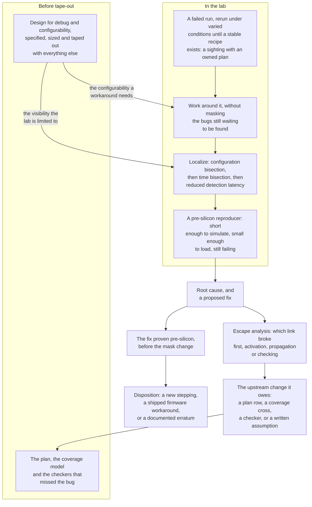

# 20. Post-Silicon Validation

Post-silicon checking combines target-speed execution with limited visibility: in the flagship example, about four thousand trace cycles cover a run of order 10<sup>12</sup> cycles. The two silicon bring-ups below, eleven months apart, show how design scale changes debug.

The reference SoC's first parts arrive on a Tuesday in this example. One goes onto a debug board with a JTAG probe, a scope on the 32 kHz crystal and a serial terminal. By Thursday it powers on, releases reset, boots from ROM and blinks a GPIO. By the following Friday the DMA has moved a 2D tile from SRAM to the neural accelerator and the UART is echoing at 115,200 baud. The bring-up takes two engineers six weeks with one part on a bench. When something misbehaves the engineers halt the core over the debug module and read the DMA's `STATUS` register through the abstract memory access. The abstract memory access is the debug module's way of reading a location in the memory map, used here with the core halted. The whole chip is 512 KB of SRAM, five crossbar managers and a handful of peripherals. Because the chip is that small, the second diagnosis the engineers try is the correct one in this example.

Eleven months later, the first parts of the same company's next generation arrive: the flagship retains the register discipline and scales the same DMA architecture to eight channels. A DMA channel is an independent transfer engine inside the DMA, with a state of its own and a share of the AXI backend. A rack replaces the bench, and the part boots an operating system on four application cores; workloads combine the LPDDR4 subsystem and mesh NoC with video decode against live network traffic. A NoC is the on-chip packet network that takes the place of a bus once too many blocks share one path. One failure costs the program three weeks. Under one particular mixture of decode and traffic, roughly once every forty minutes, the system stops without an exception, error interrupt or kernel log. When the lab halts it, the host cluster is idle, two NoC queues are full, the flagship's DMA reports no error on any channel, and every configuration register reads back exactly what firmware wrote. Forty minutes is 2,400 seconds at any point on the flagship's 0.6–1.5 GHz DVFS band: the interval between failures is wall-clock time and not a count of cycles, so the operating point the part runs at does not stretch or shorten it. DVFS is the dynamic voltage and frequency scaling that trades supply voltage against clock frequency at run time to save energy, and every operating point it adds is one more the lab has to cover.

The first bring-up provided no preparation for the second; closing it depended on a decision taken fourteen months earlier rather than on a debug technique. That decision specified which buses would receive monitors, how deep the trace buffer would be, and whether the monitors would remain reachable while the compute island was power-gated. Lab observability is fixed by design decisions made months before the failure is known.

### Chapter map

§20.1 explains the inversion of the pre-silicon budget: a part runs everything and reveals almost nothing.
§20.2 budgets design for debug before its pre-silicon deadline, while §20.3 derives the bring-up sequence from its checks' dependencies.
§20.4 develops techniques to shorten localization, the expensive step after detection.
§20.5 traces every escape back to changes in pre-silicon verification; §20.6 covers fix decisions when a respin is unavailable.

## 20.1 Changes from model to physical part

**Validation** is checking a design on real hardware rather than on a model: post-silicon on fabricated parts, or in the lab on a prototype (Chapter 18's territory). It is *not* the software-engineering sense of "did we build the right thing?", and it is not an umbrella term covering pre-silicon work. Everything before tape-out (simulation, formal, emulation, gate-level and power-aware work) is **verification**, on a model; validation begins when the object under test is physical. Much of the literature instead says "pre-silicon validation" for pre-silicon verification and quotes cost figures that combine the pre-silicon and post-silicon phases (Chapter 1 flags this scope trap when using those numbers).

Chapter 3 established the three links a bug must traverse to be found (activation, propagation, checking) and showed how controllability and observability bound the first two. Post-silicon completely inverts both budgets ({ref: budget_inversion}):

{table: budget_inversion} What changes when the design becomes a part: cycles available, internal visibility, reachable stimulus, the cost of a fix, and what only a physical part exhibits at all. The first two rows carry the chapter's argument and are meant to be read together — pre-silicon you can see everything and run almost nothing; post-silicon you can run everything and see almost nothing.

| | Pre-silicon (RTL simulation) | Post-silicon (a part) |
|---|---|---|
| Cycles available | ~nothing. An OS boot that takes seconds on silicon takes years on an RTL simulator [cit:P21] | everything. Real workloads, real software stacks, indefinitely |
| Internal state visible | all of it, any signal, any cycle | a few hundred signals, for a few thousand cycles, chosen in advance |
| Stimulus reachable | anything the interface can express | whatever the running system and its configuration hooks can produce |
| What a fix costs | recompile | a new silicon stepping |
| What only this platform sees | nothing physical | power, temperature, electrical margin, real signal integrity, real peripherals |

Every technique below uses the surplus of cycles to recover some internal visibility.

Post-silicon tests run at target clock speed, so they reach use cases nothing pre-silicon can: booting a full operating system in seconds, exercising power management and security features across many IPs at once, running under realistic on-field workloads. Because the vehicle is a physical object rather than a model, it also becomes possible to check non-functional characteristics (power consumption, physical stress, temperature tolerance, electrical noise margin) that no functional model represents at all. As of 2017, compatibility work on a large SoC routinely spanned more than a dozen operating system flavors, over a hundred peripherals and more than five hundred applications [cit:P21]. This space was never simulable, so its absence pre-silicon was not an oversight.

Three costs follow; the third changes how the work is organized.

**Observability.** Silicon exposes only what design-for-debug hardware routes to a pin or buffer; Chapter 3 traced that loss of observability stage by stage and Chapter 1 priced it. Section 20.2 is about spending the budget.

**Controllability.** Silicon control is limited to exactly the configuration options the architecture defined [cit:P21]. An internal FIFO cannot be forced nearly full; the lab must use the provided registers and traffic, without guaranteed success. A defeature bit, if provided, replaces the testbench's `force` statement.

**Fix latency, and therefore error sequentiality.** Pre-silicon, debugging is naturally sequential: find a bug, fix it, find the next. In the lab, a hardware fix requires a new **stepping**, a fabrication cycle with corrected masks that Chapter 1 calls a respin, and no program can afford one per bug. When a bug is discovered (often *before* its root cause is known) someone must find a way to work around it so that validation can continue; and the workaround has to eliminate the bug's effect without masking the other bugs still waiting to be found [cit:P21]. Post-silicon debug therefore runs in parallel, on a shared part, with a growing stack of workarounds underneath it. Section 20.6 develops the consequences for workarounds and fix decisions.

A fourth constraint is not technical: the calendar. Post-silicon runs between first silicon and the decision to start mass production, and that date is fixed years in advance by market forecasts; missing the window can cost the entire investment in the product. The decision is made on post-silicon evidence: the trend and type of bugs found, power and performance results, tolerance to noise and electrical variation, against production quality gates that in 2017 practice required an average defect level below about 50 parts per million [cit:P21]. This is why lab schedules are measured in weeks, and why every technique below is judged first on how much calendar it saves.

The goal is to narrow an observed failure to an error scenario that can be investigated in a pre-silicon environment [cit:P21]: a stimulus short enough to simulate, on a design scope small enough to load, with the failure still present. Root-causing then uses pre-silicon visibility. Every technique should be judged by progress toward that hand-off rather than by how much it explains in the lab.

> **Scenario.** The flagship's video codec passes every pre-silicon check: a bit-exact golden reference decodes the same streams the RTL does, and the regression carries a corpus of conformance bitstreams. In the lab, a customer's live stream produces one corrupted macroblock roughly every two hours of playback. A macroblock is one of the fixed-size blocks a decoder reconstructs a frame from. **Approach.** The lab reduces the failure instead of explaining the corruption: it captures the offending stream to memory, replays it from DRAM instead of from the network, then bisects it to a 40-frame segment that still fails and then to a single frame. It hands that frame plus the decoder's register configuration to the pre-silicon team, who reproduce it in RTL simulation. **Why.** The existing golden oracle, the bit-exact reference model of Chapter 8, runs on the captured stream on a workstation, so the lab can decide *corrupt or not* without any internal visibility at all. Each bisection step narrows the captured stream while preserving the failure, producing the reproducer needed by the pre-silicon team. The failing frame combined a slice-boundary condition with a reference-list update never paired by the conformance corpus; Section 20.5 examines this coverage escape.

## 20.2 Design for debug before tape-out

**Design for debug (DfD)** is on-die instrumentation whose only purpose is to make silicon observable and controllable during validation. The deadline requires that DfD be specified, sized, routed and taped out with everything else, months before the first failure exists. Missing observability is typically discovered only in the lab, as a failure that cannot be root-caused, and adding it then requires a silicon spin, which is what the lab is trying to avoid [cit:P21]. There is no incremental path in silicon: an FPGA prototype (Chapter 18) at least allows the lab to re-select signals and rebuild the bitstream at the cost of hours, and silicon offers no equivalent at any price.

DfD allocates a budget under uncertainty. Every observability mechanism ultimately writes into a fixed store or out through a fixed port, which gives one governing inequality: **signals × cycles ≤ buffer**. The flagship has a 64 KB trace buffer. Sixty-four kilobytes is 524,288 bits, so 128 traced signals buys 4,096 cycles of history; 256 signals buys 2,048; 512 signals buys 1,024. This fixed capacity trades observation width against depth, both decided at tape-out. Published industry practice has long used representative buffers of 128 signals × 2,048 cycles; a design with millions of signals typically traces a few hundred for a few thousand cycles [cit:P21]. A decade of published post-silicon work uses the same order of magnitude through trace buffers that hold roughly a thousand cycles of history, or stretch that history by recording fewer signals [cit:P9]. Section 20.4 applies this limit to a run 10<sup>12</sup> cycles long.

The debug port is orders of magnitude slower than the logic it watches (a JTAG-class interface runs at megahertz while the design runs far faster), so continuous export is arithmetically impossible and an internal buffer is forced [cit:P21]. Triggers and qualified capture manage this small capacity, which cannot grow at runtime. Qualified capture records only the cycles in which a stated condition holds, so the buffer spends its depth only on the cycles that matter.

The instruments provide the following capabilities ({ref: dfd_instruments}):

{table: dfd_instruments} On-die design-for-debug instruments: what each yields, what it costs, and the design stage at which it is fixed. Trace and scan are complementary rather than alternatives — a short film of a few signals against a still photograph of nearly every flop — and no row of the last column falls later than tape-out, which is what makes this a budget allocated before the first failure exists.

| Instrument | What it yields | What it costs | Decided by |
|---|---|---|---|
| Scan chains, reused for debug | full internal state at one stopped moment | already present for manufacturing test; needs a debug-usable stop | DfT/DfD architecture |
| Signal trace into an on-chip buffer | a few hundred signals over a few thousand cycles, continuous | buffer area and power; routing congestion to the buffer | signal selection, at RTL freeze |
| Processor trace | the instruction flow of a core, compressed | modest per core; bandwidth to transport | core integration |
| Bus / protocol monitors with triggers | transaction-level history at a chosen interface, on a condition | monitor logic + share of the same buffer | interconnect architecture |
| Hardware checkers in silicon | a stop close to the bug's origin | area, power, and timing pressure — the reason there are few | design, per block |
| Irritators and non-functional modes | *controllability*: forced corner conditions without the stimulus | area and power, plus the risk of a mode nobody ever exercises | design, per block |
| Debug fabric and access ports | reachability of all the above from outside | routing, and one port per power domain if you want it to survive gating | SoC integration |

Two complementary instruments need explicit planning. **Scan chains** were built to find manufacturing defects, and they are a mature, already-paid-for architecture that also gives post-silicon observability of internal state [cit:P21]; scan gives a full snapshot of nearly every flop at a stopped moment, while trace records a few signals over time. Planning only one of the two leaves the other kind of observation unavailable.

**On-chip checkers** are the silicon descendants of Chapter 11's assertions; their value for debug is *proximity* to the bug's origin: when a hardware checker fires, the part stops near the origin of the bug, so the trace buffer still holds relevant history and the debug logic contains usable hints. In one large processor program, failures caught by hardware checkers were markedly easier to debug for exactly this reason, while their use stayed limited by area, power and timing cost [cit:P21]. A silicon checker shortens Chapter 8's *detection distance* by orders of magnitude, but its cost permits only a handful.

Chapter 3 gives a gray-box prescription: add provisions for forcing error and exception conditions that would otherwise be prohibitively slow to provoke [cit:B2]. In silicon that prescription becomes an **irritator**: logic embedded in the design that triggers microarchitectural events at random, initialized at power-on and firing as the part executes. It is the on-die counterpart of Chapter 7's testbench irritator, and by flushing a pipeline at random, or injecting an invalidation as if it came from another chip, it reaches tough corners without the stimulus that would normally produce them [cit:P21]. Non-functional modes do the same job statically: a cache mode in which almost every access forces a cast-out exists solely to stress the level below it. A cast-out is the eviction of a line from a cache to the level below.

### Choosing which signals to trace

Research evaluates signal sets through *state restoration*: traced values imply untraced ones, forwards through a gate and backwards through it, so the quality of a signal set is measured by the **state restoration ratio** (restored plus traced states over traced states). On a small worked circuit, tracing 2 signals over 5 cycles yields 10 traced states and 16 restored ones, a ratio of 2.6 [cit:P21]. A large literature optimises that number by structural analysis, simulation or learning.

There is **no known industrial report of the restoration ratio being used** to select trace signals [cit:P21]. The ratio takes no account of what the design *does*, so the same block in two products gets the same answer for two different sets of lab needs; it ignores architectural and physical constraints that rule signals out; and it assumes tracing is the only instrument, although trace works alongside scan, monitors and checkers. Selection still rests mainly on designer experience. For each block, trace selection should distinguish the two likeliest causes of the failure most feared.

### Two conflicts: power management and security

Both conflicts are structural.

**Power management.** Debug data has to travel, and its route runs through logic that power management may switch off. A block can be perfectly instrumented and still invisible because the path carrying its signals to the buffer crosses an IP that is powered down at the moment of interest; that IP need have no functional relationship to the one under debug [cit:P21]. Disabling power management prevents debugging the power sequences themselves. The flagship instead uses a debug access port per power domain, preserving access when the first island is gated.

> **Scenario.** A sensor hub's always-on 32 kHz island fuses accelerometer and pressure samples and wakes the DSP when a fused threshold trips. In the lab, roughly once a day the wake does not happen; the system stays asleep until the next unrelated event. **Approach.** The team wants a trace of the island's threshold logic across the wake decision; however, the DfD route from the always-on island to the trace buffer passes through the DSP island, which is power-gated precisely while the bug is armed. Two things make the debug possible: a debug access port living inside the always-on domain, and a small always-on capture of the four signals that matter (threshold comparator, event FIFO not-empty, wake request, isolation-release acknowledge) sampled at 32 kHz. **Why.** A domain's observability must be powered by that domain. Depending on a neighbor's power state removes visibility when needed; the canonical retention bug, a wake event racing isolation release, occupies exactly this blind spot (Chapter 19).

**Security.** DfD exposes internal state by construction, and much remains on-field so deployed systems can be diagnosed. It therefore provides a path to adjacent keys, firmware and debug modes; published system compromises have used post-silicon observability features for access [cit:P21]. The flagship uses authenticated debug unlock through the root of trust, limiting trace-fabric reach after the lab; cutting DfD for security prolongs validation, increases its difficulty and can make it impossible. Chapter 23 treats the unlock path as an attack surface. The neighboring crypto engine's key ladder and trace fabric need a threat model before tape-out.

In the flagship example, both conflicts are addressed in a specification review a year before the lab exists, by engineers outside the future lab team. **Post-silicon readiness** (DfD architecture, debug software, debug boards, post-silicon test plans) is a pre-silicon workstream that starts at product-functionality planning and runs the whole length of the design cycle [cit:P21]. Like Chapter 5's verification plan, it needs owners and plan rows with review gates.

## 20.3 Bring-up: the first hours and days

Chapter 4 used **bring-up** for the pre-silicon phase in which environment and design first exchange checked transactions. Silicon bring-up applies the same idea one platform later, where two disciplines carry over: work should target demonstrations rather than infrastructure and should self-check from the very first transaction. A testbench allows probes to be added when needed; silicon does not, so check ordering must establish the evidence each verdict needs.

The first activity is **power-on debug**, the one stage when none of Section 20.2's machinery is available: if the part does not power on, the on-chip instrumentation is not running either, and visibility into the internals is extremely limited or zero. What remains is a custom debug board offering fine-grained external control, plus brainstorming. The standard method is **defeaturing** to reduce the configuration to a bare-bones system without power management, security or complex firmware boot that can power on reliably, followed by incremental **refeaturing**. A stable power-on recipe typically takes days to a week from the moment silicon reaches the lab; getting the complex features back on can take several weeks, and it gets harder the more configurable the design is [cit:P21]. Configurability normally helps, but every added mode also enlarges the search for a bootable configuration.

Once the part powers on, one rule orders the checks: **each must be decidable using only what preceding checks established.** Depending on unproven machinery leaves two indistinguishable failure modes: the object checked and the machinery judging it. Power precedes clocks because a PLL cannot lock on a rail that is not up. Clocks precede reset release because a reset synchroniser needs edges. Reset precedes the debug port because the port is logic like everything else. The debug port precedes every check whose oracle is a register read; after that point this is nearly all checks, since reading back a known reset value is the cheapest oracle silicon offers.

A bring-up plan is a verification artifact that needs Chapter 5's treatment: each row states one check, the evidence that closes it, and (the field a pre-silicon vplan does not need) the oracle actually available at that moment. Each plan row must specify one metric that determines its verdict; "it seems to be running" supplies no checkable verdict.

> **Worked example: bring-up plan excerpt, the flagship's first week.** Ten rows from a plan of about ninety. The third column is the one that makes it a *bring-up* plan.
>
> | # | Check | Oracle available here | A pass rules out | Exit criterion |
> |---|---|---|---|---|
> | B01 | Rails come up in sequence; quiescent current in band | bench instruments only | shorts, missing rail, wrong sequence | all rails in spec, current in band, 5 consecutive power cycles |
> | B02 | Always-on PLL locks; divided clock present on a pin | scope, external reference | oscillator, PLL configuration | measured frequency within tolerance |
> | B03 | Reset released; JTAG identification register reads back | a constant known from the spec | chain wiring, TAP state machine | value matches, 20 consecutive reads |
> | B04 | Debug fabric reaches the always-on domain's registers | reset values from the register spec | debug decode, address map at this port | all reset values match |
> | B05 | One host core executes a three-instruction loop from boot ROM, writing a heartbeat register | the heartbeat toggles | core reset, ROM read path, first bus hop | heartbeat observed for 60 s without stall |
> | B06 | L2: write-read-verify a walking pattern across all four slices | data comparison | slice enable, L2 address decode | pattern verified in every slice |
> | B07 | LPDDR4 PHY training converges; write-read-verify over the channel | data comparison + training status | PHY configuration, board routing, gross SI faults | training converges on 5 cold boots; margin recorded |
> | B08 | First timer interrupt taken and acknowledged on one core | a handler-incremented counter | interrupt wiring, exception entry, vectoring | counter advances at the expected rate |
> | B09 | DMA channel 0: 1D copy, L2 to L2, one NoC hop | data comparison + completion interrupt | descriptor decode, one NoC route, one coherent port | copy verified; completion interrupt observed |
> | B10 | OS boots to a shell on one core, then on four | console output | MMU, caches, coherence, driver stack | shell reached on 20 consecutive boots |
>
> **Why this order.** B05 is the first row whose oracle lives *inside* the part, and deliberately the smallest one available: three instructions, one of them a store, because a heartbeat that stops shows that the host core stopped, whereas a failing OS boot reveals almost nothing. B08 follows B06 rather than preceding it, because an interrupt handler needs a stack and a stack needs memory B06 has already proven. B09 depends on B06 and B08 at once, so it follows both; its failure would otherwise be unattributable. B10 is one row rather than ten because its prerequisites are proven: when the shell fails to appear after B01–B09 pass, the search is confined to the software stack.

On the reference SoC, this plan is a page, the whole order can be improvised on a bench by one engineer, and a wrong guess costs an afternoon: the part has one core, one memory, three clock domains and two power domains, and a person can hold all of it in their head. On the flagship, the same sequence has to be executed across five asynchronous clock domains and six power domains, with one debug access port per power domain and a bring-up team that is not the design team. For the engineer running B07 at 2 a.m., the plan must document why B06 comes first.

> **Scenario.** The flagship's LPDDR4 PHY training completes on eleven of the first twelve parts and, on the twelfth, converges to a setting that fails a memory test an hour later. **Approach.** The lab does not debug the training algorithm. It runs training a hundred times per part across the temperature range, logs the margin the training reports at each step, and finds that the failing part converges at the edge of the acceptance window while the others sit centred. The fix is a firmware change to the acceptance criterion plus a retrain-on-error path; the RTL is untouched. **Why.** This failure is *only* observable post-silicon, because of physical effects rather than complexity: pre-silicon there is no signal integrity to train against. Every model of the PHY, from RTL to a real-number model of the analog path (Chapter 21), trains against an idealization, and the distribution across parts and temperature does not exist until there are parts. The training state machine's per-step margin status register makes this debug tractable. That register is design for debug, decided at tape-out; without it the only observables would have been "training passed" and, an hour later, "the memory test failed".

Two supporting workstreams decide whether the first week goes well, and both are pre-silicon deliverables. **Post-silicon test plans** are typically more elaborate than pre-silicon ones, because they target system-level use cases that could not be exercised before silicon existed; their development starts alongside design planning, before a detailed microarchitecture exists, so the first version is written against architectural specifications and refined as features land [cit:P21]. That is Chapter 5's extraction discipline applied a year earlier and one level up.

**Debug software** needs explicit planning for its half of readiness, and that half has four parts. First is the instrumented system software that replaces a general-purpose OS with something small enough to reason about. Second are the tools that configure triggers and query registers, and third is the transport that gets data off-chip. Fourth are the analysis tools that turn raw signal streams back into transactions. All four parts are written against a design whose features are still changing; in post-silicon work it is not uncommon to root-cause an observed failure to the debug software rather than to the part [cit:P21]. Chapter 4's rule that the environment is a design too, whose bugs are tracked like any other, applies here.

On a large processor bring-up reported in 2017, roughly half of all post-silicon bugs were found in the first three months; much of the first two of those months went on hardware stability and screening parts, not on finding logic bugs [cit:P21]. Planning should accelerate bug-finding readiness; power-on work continuing into month three consumes time needed for Section 20.4.

## 20.4 Triage and localization costs

A bug announces itself in one of four ways. A system hangs; a hardware checker fires; a customer's stream shows a corrupt macroblock; a **multipass consistency check** reports a mismatch millions, and sometimes billions, of cycles after the error that caused it; that fourth check runs the same test several times and compares architected registers and part of memory at the end of each pass against a saved reference pass [cit:P21]. **Localization** identifies the activating input sequence and the block containing the bug. The effort of localising bugs from observed system failures dominates the overall cost of post-silicon validation and debug, and a single difficult logic bug has been reported to take days, weeks or months of manual work [cit:P9].

The governing quantity is **error detection latency**: the time between the moment a test activates a bug and creates an error, and the moment that error becomes an observable failure (a crash, a timeout, a deadlock or a wrong result). For difficult bugs this latency runs to millions or even billions of clock cycles [cit:P9]. Section 20.2's buffer bounds the visible interval. The flagship example runs for order 10<sup>12</sup> cycles, while its 128-signal trace buffer holds 4,096. The trace therefore covers roughly one part in 250 million of the execution. Even a perfect trigger capturing the last 4,096 cycles before the hang records the *symptom*; activation occurred millions of cycles earlier, outside that window.

> A checker detects a wrong answer, but the trace's four thousand cycles omit the activation in this forty-minute run.

Section 20.1 defines the hand-off: a **pre-silicon reproducer**, with a stimulus short enough to simulate and design scope small enough to load, that still fails.

### Stages from failure to resolution

Published industrial practice distinguishes the following stages from failure to fix [cit:P21] ({ref: sighting_pipeline}):

{table: sighting_pipeline} The industrial path from a failed test run to a resolved bug, one row per named stage, with the artifact each stage has to hand on. Note the third row: *sighting disposition* means assigning a debug team and a plan, not the recorded fix / waive-as-errata / defer decision, which arrives much later and is §20.6's subject.

| Stage | What happens | Exit |
|---|---|---|
| Test execution | run it; on failure, the obvious sanity checks — part seated, supplies connected, switches as the test expects | resolved, or a **pre-sighting** |
| Pre-sighting analysis | make it repeatable: rerun under varied software, hardware, system and environmental conditions until a stable recipe exists | a **sighting** |
| Sighting disposition | assign a debug team; agree a plan to track, work around and address it | an owned plan |
| Bug resolution | work around it so validation continues; group with related failures; localise; root-cause; prove the fix | a **bug**, resolved |

*Sighting disposition* means assigning a team and a plan; it is not Chapter 7's **disposition**, the recorded fix / waive-as-errata / defer decision, which arrives much later and is Section 20.6's subject. Chapter 12's **triage** retains its intent but becomes harder in practice: deduplicate by signature, classify and assign, without debugging the same fact twice. Two failures with one root cause can present as a crash in one test and a hang in another, so an aggressive schedule requires correct grouping *before* either is analyzed [cit:P21]. The first classification distinguishes physical silicon issues from logic errors, a distinction absent from pre-silicon triage. Repeating the test on a different part, or a different core of the same part, provides a discriminator: a failure following the part is a manufacturing or marginality problem; one following the design is a logic error.

### Reproduction, and the problem of non-determinism

Most localization methods assume the failure can be made to happen again; post-silicon, that assumption is challenged in two ways.

The first is ordinary system non-determinism: interrupts, I/O activity, interactions between cores, operating-system context switches [cit:P9]. Returning a complex part to an identical error-free state and re-executing the same stimulus is not something a running system naturally supports. The second is physical and has no pre-silicon analogue. A logical error can be masked by a glitch or a fluctuating supply, and reproducing it may require a particular thermal range; finding a recipe (a tuned combination of physical, functional and non-functional parameters) that brings the bug back is itself a challenge [cit:P21]. Clock-domain crossing illustrates the problem: a whole class of metastability bugs cannot be demonstrated by RTL simulation and is generally difficult to reproduce and find in the lab (2024) [cit:R2]. Metastability is the unstable condition of a flip-flop sampled too near a change, which resolves to a legal value only after an unpredictable delay. That difficulty is why Chapter 13 puts structural clock-domain analysis before tape-out rather than trusting the bench.

Silicon speed permits a **weakened standard of reproducibility**: an error that appears reliably once in a few executions still counts as reproducible. A one-in-five failure rate is intolerable in a nightly regression, where the same failure on an identical manifest is Chapter 12's flake; in the lab it is a working recipe, because five runs cost minutes. A manifest is the per-run record of everything needed to repeat a run, down to the exact tool build. Where available, a **cycle-reproducible mode** improves on that weakened standard: rerunning the same test in this special hardware mode produces exactly the same execution [cit:P21]. Cycle reproducibility is the condition that permits the time-bisection technique below.

> **Scenario.** A radar front-end runs an FMCW chirp chain whose constant-false-alarm-rate (CFAR) detection threshold is calibrated at power-on against a reference target. In the field, roughly one unit in two hundred reports spurious detections after about twenty minutes of operation. Nothing reproduces on the bench. **Approach.** The lab characterizes the *recipe* instead of continuing attempts to reproduce the *failure*: parts run in a thermal chamber across the qualification range while the calibration coefficients are logged every chirp frame. The spurious detections appear only above roughly 85 °C, and only on parts whose initial calibration landed in the lower third of the coefficient distribution; these are two conditions no bench at room temperature produces together. With this recipe the failure reproduces on demand, and the recalibration path's fixed-point saturation bug is localized in a day in this example. **Why.** The example illustrates two lessons. This is a calibration path only real operation exercises: pre-silicon it was verified against a model of the analog chain, and the model used for this pre-silicon check did not represent temperature drift. In this radar example, failure to reproduce results from unvaried recipe parameters rather than a non-deterministic bug. Temperature, supply voltage, part-to-part variation and elapsed time are parameters. Deliberate variation and continuous logging make these parameters experimental inputs.

### Method 1: binary search in time

Cycle reproducibility and programmable trace permit bisection. Run the test, terminate the trace at cycle N, look; if the state is still good, run again terminating later; if it is already bad, run again terminating earlier. Each run halves the interval containing the transition from good to bad. Published practice uses the same mechanism: re-running the same test with different trace-array configurations, terminating at different cycle counts, and aggregating the results of several runs into one effective trace far longer than the buffer [cit:P21]. This *backspacing* reconstructs history from many forward runs.

The cost quantifies Section 20.2's instrumentation trade-off. To narrow a 10<sup>12</sup>-cycle run down to one 4,096-cycle window takes log₂(10<sup>12</sup> / 4096) ≈ 28 halvings. At forty minutes a run, twenty-eight halvings are about nineteen hours of pure execution, before any time spent reconfiguring the trace between runs. If only one run in three reproduces the failure, the cost triples: multiplying by three gives over two days. The search has two dimensions rather than one: bisection identifies *when*, but the window is only useful if it contains the right signals, so a change of hypothesis part-way through means re-selecting the trace set and repeating steps already completed. A trace buffer twice as deep removes one of twenty-eight halvings, rather than halving the cost. The cost can instead be reduced by a *trigger*: a condition, programmed into a bus monitor, that starts or stops capture on a hypothesized cause rather than on the failure itself, converting a blind search into a single run when the hypothesis holds.

### Method 2: binary search in configuration

Configuration bisection should precede trace analysis. A failure with four active cores should be tested with three. A failure with the compute island powered should be tested with power management off. Changing the hardware setup by disabling cores or varying the number of active hardware threads is standard practice for establishing what the failure actually requires [cit:P21]. Each answer removes a subsystem from the search space at a cost of one run.

> **Scenario.** The GPU's four shader clusters share a unified memory path. In the lab, a compute workload gives wrong results roughly once per thousand dispatches: never with a single cluster, sometimes with two, reliably with four. **Approach.** Configuration bisection first: with clusters {0,1} the failure appears; with {0,2}, {1,3} and {2,3} it does not; with {0,1} and the DMA idle it disappears. Five runs isolate an interaction between two specific GPU clusters and concurrent DMA traffic; their shared unified-memory port implicates the memory path rather than shader cores. Only then does the trace budget get spent, on that port, with a trigger on the arbiter's grant sequence. **Why.** Configuration bisection gives a coarse hypothesis cheaply. It costs one run per question and it answers the question that decides where the expensive instruments point. Tracing before forming that hypothesis can waste a week in this example.

### Method 3: reducing detection latency

Test generation can reduce the latency itself. **Quick error detection (QED)** transforms an existing test into one with a much shorter interval between activation and observable failure; the canonical transformation inserts a read immediately after each write, so a write that stores a wrong value is caught at once instead of thousands of cycles later when a subsequent operation reads it [cit:P21]. The transformations are software-only: duplicate the instruction stream into a reserved half of the register and memory space and compare periodically, or proactively load and check shared locations; nothing is added to the silicon [cit:P9].

Layering formal analysis on top turns detection into localisation. Bounded model checking is the proof method that works over a fixed interval of cycles: it copies the design's combinational logic once for each cycle of the interval, then asks a satisfiability solver for a violation inside that interval. Over the space of QED-compatible tests it searches for the *shortest* instruction sequence that activates and detects the bug, yielding a minimal reproducer and a short list of candidate blocks at once. On a 500-million-transistor open-source multicore SoC (the OpenSPARC T2) in 2015, this localized all 92 injected bug scenarios in under seven hours, with traces up to six orders of magnitude shorter than the original end-result-checking tests; the motivating deadlock, whose activation occurred millions of cycles before the failure, reduced to a three-instruction trace found in two and a half hours [cit:P9]. An industrial application narrowed post-silicon localisation automatically to about twenty flip-flops out of a million, and nine instructions out of billions [cit:D24]. The literature calls this layering of bounded model checking over QED tests **Symbolic QED**. The same flow was deployed industrially on an ASIL-rated Infineon automotive microcontroller core ( 60 instructions, 1.8K flip-flops, 70K gates, tracked across 16 versions): Symbolic QED found every bug Infineon's own flow had found, plus 7% more that were specification errors, at 2 person-days of effort against 6 person-months for a reused design [cit:D24]. An ASIL is an automotive safety integrity level, A through D with D the most demanding, assigned to a hazard rather than to the block that addresses it. The core's gate count limits the scope of that comparison.

The method requires a programmable core in the system, a way to run transformed tests, and a formal engine that can hold a reduced model. Where these requirements can be met, QED can produce shorter reproducers, as in the reported cases.

### Method 4: transfer to a platform with visibility

Every localization aims at a hand-off, usually to one of two platforms.

**Emulation and acceleration** (Chapter 17) offer far more visibility than silicon at far less speed; transfer requires tuning: because silicon runs so much faster, a test that fails there cannot simply be replayed on an accelerator; it must first be tuned so that it fails *early*, within a run the slower platform can complete [cit:P21]. That tuning is itself a localisation exercise, and it is usually where the pre-silicon reproducer is born.

**Formal property verification** faces a scaling argument here: post-silicon failures are isolated to large subsystem boundaries beyond formal's capacity. The published method avoids taking that subsystem as the proof scope. The method has four steps. It selects the smallest block boundary at which the property to be checked can still be observed. It over-constrains everything that did not participate in the failure, including configuration registers pinned to the values dumped from the failing part. It leaves the signals of interest under-constrained, so the tool can still find manifestations not predicted by the engineer. Finally, instead of abstracting a long boot sequence, it loads the design's state from a simulation waveform at a timestamp after initialization and starts the proof there.

The reported cases quantify the effort. A configuration-register corruption was reproduced in a 25,000-gate scope in three person-days. Temporary over-constraints produced five further manifestations of the same bug, and five person-days proved the fix. Because the environment outlived the emergency, eight more functional bugs turned up when it was reused on later projects. A second case chose a 1.5-million-gate scope over a 4-million-gate one purely so that basic covers would hit, and reproduced its data-corruption bug in about four weeks and three hundred person-hours [cit:D3]. Both cases are Intel's own report, and the paper identifies its two designs only by function (a bridge block and a scheduler) inside SoCs it does not name [cit:D3].

Reproducing one post-silicon failure funds the formal environment's setup, leaving a verification asset for the next project. For the plan row exposed by a silicon escape, formal sign-off in the next generation follows the division of labor between simulation and formal discussed in Chapter 16.

## 20.5 Escapes and the feedback loop

Every bug found post-silicon is, by this book's definition, an **escape**: it crossed a sign-off boundary undetected (Chapter 1). The lab's bug list therefore records weaknesses of the pre-silicon process after sign-off. Upstream changes need explicit priority before the team disperses, when escape analysis risks being left incomplete.

Chapter 7 supplies blameless escape analysis with five written questions: mechanism, why stimulus never created it, why no checker caught it or none could have seen it, why the metrics said we were done, what changes now. The same questions apply post-silicon, with different emphasis. In the codec example below, the fourth question concerns why the dashboard was green despite a missing coverage cross. The bug shipped despite a closed coverage model, a clean regression and a plan whose every row had been discharged by the evidence it named. A coverage model is the structured space of conditions a project has declared its tests must be seen to reach. Escape analysis includes explaining why the green dashboard did not expose the missing coverage.

Chapter 3's chain classifies the required upstream changes. Every escape breaks one of three links first, and each break has a different upstream fix ({ref: escape_links}):

{table: escape_links} Classifying a silicon escape backwards, by which of the three links — activation, propagation, checking — broke first, and what each break owes the process that missed it. The classification earns its keep because the three owe different things: a plan row and a coverage cross, a platform change, or a checker plus a test proving the checker fires.

| Link that broke | What it means | The upstream change it owes |
|---|---|---|
| **Activation** | the stimulus never created the condition | a new plan row and a coverage cross that would have demanded it (Chapters 5, 6) |
| **Propagation** | the condition happened but could not reach any observable — usually because the platform did not model the mechanism | a platform change: a level, an engine, or an earlier scheduling of one (Chapters 13, 19) |
| **Checking** | it happened and was visible, and nothing looked | a new checker, plus a test that proves the checker fires (Chapter 5's companion-row rule) |

A fourth failure is a wrong **assumption**. A formal `assume` that does not hold in the real system deletes traces silently (Chapter 11), and no coverage number anywhere reports the deletion. When an escape's mechanism was inside the deleted set, the upstream change must be a written assumption, promoted into a checked obligation on whoever must guarantee it, rather than a checker or a bin. A bin is one of the counters a coverage model keeps over a set of values (Chapter 6).

> **Worked example: escape record for the video codec corruption of Section 20.1.** Five questions and five written answers identify the required changes.
>
> 1. **Mechanism.** A slice boundary falling inside a macroblock row, combined with a reference-list update on the same frame, causes the line-buffer read pointer to advance once too far; the affected macroblock reads a neighbour's reconstructed samples.
> 2. **Missing stimulus.** The conformance corpus contains unusual slice geometry and frequent reference-list updates in separate streams. It contains none with both, because the corpus is organized by feature and each stream was authored to exercise one.
> 3. **Checker capability.** The checker was correct: the bit-exact reference model would have flagged the bug instantly on a stream containing it.
> 4. **Completion metrics.** The coverage model had a coverpoint for slice geometry and a coverpoint for reference-list update, both at 100%. It had no cross. As Chapter 6 explains, two closed coverpoints do not establish that the cross is closed; a model built one feature at a time inherits the corpus's blind spot.
> 5. **What changes.** (a) A cross of slice geometry × reference-list state added to the codec's coverage model, with the excluded cells argued rather than assumed. (b) Two synthesised streams added to the regression, generated to hit the new cells. (c) A plan-row family for *stream-syntax combinations* rather than stream-syntax features, so the next codec's plan cannot be written one axis at a time. (d) For any block with a bit-exact golden model, a standing rule should budget a stream generator rather than a library: with a free oracle, stimulus diversity is the constraint.
>
> **Analysis effort: a week in this example.** Only (a) and (b) fix this bug. Items (c) and (d) change the next plan; stopping at (a) and (b) leaves the process that created the hole unchanged.

Two practices support this feedback loop.

**Internal escape criteria.** One large processor program counted any bug found by an operating-system-based test or real application software as an escape from its *validation strategy*, because bare-metal exercisers were supposed to find it first [cit:P21]. This internal standard is deliberately harsher than customer escape: it holds exercisers accountable for coverage instead of relying on the OS as an unplanned safety net. The program was IBM's POWER8 (12 cores on a chip of over 5 billion transistors) and bare-metal exercisers were its primary post-silicon test vehicle, which makes that internal bar coherent [cit:P21].

**Coverage one platform down.** A covergroup is the SystemVerilog container that states one coverage model in code. Synthesizing covergroup monitors into silicon has prohibitive area, timing and power costs. Published practice synthesizes those monitors into the *accelerator* model instead, runs the same exercisers there, and uses the resulting coverage to decide which exerciser shifts deserve scarce silicon time [cit:P21]. This implements a **unified plan**: one plan source, with each row assigned to the platform that will discharge it, and a common test-template language so a test written for one platform can be narrowed and re-run on another. This enables Section 20.4's hand-off: when a bug appears on silicon, narrowing the same template until it fails in simulation turns the lab failure into a debuggable one.

On the publicly documented processor program, about 1 percent of all bugs were found in post-silicon validation (2017) [cit:P21]. That one percent consumed weeks per bug in a phase measured in weeks, and any one could have forced a stepping. The pre-silicon process caught ninety-nine out of a hundred, supporting the process in Chapters 5 through 19; the hundredth required weeks of debugging, motivating escape analysis. That program is IBM's POWER8, and the 1% is a statement about one chip's own bug population rather than an industry rate [cit:P21].

Feedback also crosses generations. In the reference SoC's canonical DMA escape, a 2D transfer with a negative stride was split wrongly at the 4 KB boundary by the burst splitter, the DMA stage that splits each transfer into bursts that the AXI address rules allow. The 4 KB boundary is the address line every 4 KB that AXI forbids a burst to cross, so no burst ever spans two subordinates. A stride is the signed address step from the start of one row of a 2D transfer to the start of the next. The data was corrupted only when the second DMA channel was active, and that escape produced a plan row, a coverage cross and a regression test. The flagship inherits all three along with the DMA architecture. It also inherits a descendant of the bug: the same faulty split, now under coherence, where the split's second half writes a line the host cluster holds Modified, so the corruption stays invisible until the writeback. A cache holds a line Modified when it has written to that line and has not yet returned it to memory. Inherited assets do not establish inherited coverage: the old cross omits coherence state, and the old test never runs with a cache holding the line dirty. The next generation must re-derive coverage against the new mechanism; rerunning the old suite successfully does not establish that a previously found bug remains covered.

## 20.6 Workarounds and fix decisions

Section 20.1's error sequentiality changes the order of operations. Pre-silicon, the sequence is *find → root-cause → fix → verify*. Post-silicon, workarounds must precede root-causing and the final fix decision:

**work around → localise → root-cause → propose a fix → prove the fix pre-silicon → decide what to do with it.**



{figure: post_silicon_loop} Post-silicon work is a loop rather than a line: what the lab can see and patch was fixed before tape-out, the workaround precedes the diagnosis, and every escape closes on an upstream change to the process that missed it.

The workaround comes first, before anyone knows what the bug is, because no program can afford a silicon stepping per bug and the lab cannot stop while one is investigated. And the workaround carries the constraint Section 20.1 named: it must eliminate the bug's effect *without masking the other bugs still waiting to be found*. A workaround that disables a whole subsystem stops validating it, even when that consequence was unintended. {ref: post_silicon_loop} places that order in the loop it belongs to, from the provisions made before tape-out to the upstream change an escape owes.

Workaround availability depends on pre-silicon provisions, as observability does in Section 20.2. Mitigation post-tape-out is overwhelmingly a matter of patching or reconfiguring behavior through software or firmware; the ability to patch depends directly on how much configurability and controllability were built into the design beforehand [cit:P21]. DfD provides visibility, while configurability enables workarounds. The same architecture review must decide both because neither can be added later.

### Disposition after tape-out

Chapter 7 gave a project three ways to dispose of an open bug: fix it before tape-out, waive it as known errata with a named software workaround and a documentation owner, or defer it with an argument. After tape-out the first option is gone in that form, and what replaces it is more expensive. The post-tape-out options differ in both their costs and obligations ({ref: post_tapeout_disposition}):

{table: post_tapeout_disposition} The three forward-looking options for an open bug once the masks exist — a new stepping, a shipped firmware workaround, a documented erratum — with the conditions that favour each, its cost, and the obligation it carries. The second and third rows are a spectrum rather than two alternatives: what separates them is who is obliged to apply the workaround.

| Option | When it wins | What it costs | What it obliges |
|---|---|---|---|
| **New stepping** (revised masks) | no workaround exists, or the workaround's cost is unacceptable; safety- or security-relevant behaviour; the bug blocks a committed use case | refabrication, requalification, and the calendar — usually the dominant term | the fix proven pre-silicon *before* the mask change, plus regression of everything the change touches |
| **Firmware or software workaround**, shipped | a configuration or code path can avoid the condition reliably | performance or power, permanently; a constraint every future software release must honour | proof that the workaround covers *every* path to the condition, and an owner for that proof |
| **Errata** — documented, not worked around in the product | the condition lies outside the product's committed use cases, or the customer can reasonably avoid it | support burden and a permanent public record | a named workaround in the document, a documentation owner, and Chapter 7's recorded decision with a real expiry |

The second and third rows form a spectrum: an errata entry usually contains a workaround; the difference is who must apply it. Chapter 7's five waiver fields apply verbatim to an erratum: the hole and its reason, the risk argument, an owner and an expiry. An erratum lacking a named workaround and owner leaves waiver fields blank and exposes customers to rediscovery.

The finding that follows says what set severity, when severity could be established, and how early a lab in fact assigned it. On one industrial program, bug severity was set by three factors together: the bug's impact on functional behavior, the *performance cost of working around it* where a workaround existed, and the complexity of the fix; severity on that program could only be determined once the root cause was found and a fix proposed; and yet its lab engineers guessed severity correctly and early from limited data, and scheduled accordingly, so that high-severity bugs were root-caused in about 6 days on average against roughly 10 for the medium ones (2017) [cit:P21]. Severity cannot be inferred from the symptom alone: a hang looks catastrophic and may be one register bit away from a free firmware workaround, while a one-bit corruption looks minor and may have no workaround at all; yet an experienced lab triages by expected consequence long before it can prove consequence. This early estimate determines which bugs receive scarce debugging time first.

**Pre-silicon fix proof.** A fix must be shown to correct the original error and to introduce no new one [cit:P21], and the environment built in Section 20.4 to reproduce the bug is exactly the instrument for it. The published recommendation is to reproduce every post-silicon control-logic issue in a formal environment and check its fix with formal technology before the design goes for a re-spin [cit:D3]. The environment already exists and proving the fixed logic costs person-days; omitting that work risks discovering an incomplete fix in the next stepping.

> **Scenario.** The flagship's inline AES-GCM engine on the memory path has a fault: under a particular back-to-back key-slot switch, one 16-byte block is encrypted with the previous key. The lab finds it in month two on an unexpected workload. **Approach.** In this example, triage takes a day: the functional bug follows the design rather than the part and reproduces with a two-transaction sequence once known. Workaround: firmware serialises key-slot switches by draining the pipeline, at a measured cost to throughput on the affected path. The subsequent decision takes a week in this example and belongs outside verification. Because the failure produces ciphertext under the *wrong key*, it is a confidentiality failure, not a performance one; the drain-based workaround is enforceable only in the driver the vendor ships, and any customer writing their own would reintroduce it. Confidentiality is the property that breaks when an unauthorized reader can obtain protected state. The disposition is a stepping, with the firmware workaround shipped in the interim and the erratum published so that customer software cannot inherit the hazard silently. **Why.** Two factors, neither of them symptom severity, determine the decision. First, the consequence class: a workaround that depends on every future software author doing the right thing is not a workaround for a security property (Chapter 23). Second, discoverability: external knowledge of such a defect sharply shortens mitigation time because it can be exploited rather than merely encountered [cit:P21]. That asymmetry is why security bugs are dispositioned differently from functional ones of identical technical severity.

The disposition decision is not made by the verification team and should not be: it requires information verification does not have about committed customers, launch dates, the qualification plan, the cost of a mask revision, the competitive window. Verification's responsibility is evidence rather than an opinion about respinning: three findings specify **what the bug does**, **the necessary and sufficient conditions**, and **the workaround's coverage and exclusions.** These three findings support the decision. A severity label alone omits the evidence verification is uniquely qualified to supply.

### In practice

Scarce parts require scheduled bench time. When debug shares silicon with characterization, software development and demonstrations, limited bench time can favor a technique requiring fewer part-hours despite lower technical effectiveness. If the lab receives a design it did not verify and verification receives a failure description written by someone who has never seen the coverage model, both hand-offs can lose context.

Three omissions require attention. Scheduling escape analysis after launch risks losing it when the team disperses. Without pre-silicon plan ownership, defeature modes and irritators can ship unchecked; a defeature-mode bug can consume a week investigating a fault absent from the functional design. Closing a ticket with a firmware workaround without recording the coverage hole lets the next generation inherit that hole with the IP. A coverage hole is a required behavior or stimulus that nothing has yet been observed to produce.

First-silicon success is the outcome in which the first fabricated parts are already fit for production. In 2024, 14 percent of IC/ASIC projects reached first-silicon success and 75 percent finished behind their original schedule [cit:R2].

### Pitfalls

1. **Sizing DfD from an area budget rather than from debug scenarios.** *Symptom:* "we allocated our usual 20 percent for debug." *Cure:* DfD sizing should distinguish each block's most feared failure's two likeliest causes, then negotiate area against those needs.
2. **Spending the trace budget before bisecting the configuration.** *Symptom:* a week of trace captures and no hypothesis. *Cure:* configuration bisection first; it costs one run per question and it decides where the trace should point.
3. **Treating "cannot reproduce" as a property of the bug.** *Symptom:* an intermittent filed as non-deterministic and parked. *Cure:* the recipe needs deliberate variation of unvaried parameters: temperature and voltage, part and elapsed time, active feature set.
4. **A workaround that masks other bugs.** *Symptom:* a subsystem disabled to unblock the lab, and its bug queue never grows again. *Cure:* each workaround should record what it stops exercising as a validation gap with an owner.
5. **Closing an escape with a fix and nothing else.** *Symptom:* the bug tracker closes; the plan, the coverage model and the checklist are untouched. *Cure:* no post-silicon bug closes without a named upstream change: a plan row, a cross, a checker, or a written assumption.
6. **Dispositioning by symptom.** *Symptom:* a hang is S1 because hangs look bad, a corruption is S2 because it is one bit. *Cure:* severity is impact × workaround cost × fix complexity and remains unknown until root cause and a proposed fix exist; deferring a clock-domain waiver to the lab repeats this error one stage earlier, because a bench does not reproduce metastability.

### Summary

- **Validation** is checking real hardware, not a model. Post-silicon completely inverts the budget: execution is unrestricted while visibility reveals almost nothing.
- DfD fixes lab observability before silicon exists: **signals × cycles ≤ buffer** is fixed at tape-out; 64 KB buys 128 signals for 4,096 cycles, with no subsequent widening in the lab.
- Bring-up is a verification artifact. Each check must use only previously established evidence, and each row needs a single exit criterion.
- Detection is cheap; **localization** costs more because error detection latency for difficult bugs runs to millions or billions of cycles against a trace window of a few thousand [cit:P9]. Configuration bisection should precede time bisection, and latency reduction should precede searching it.
- Post-silicon debug delivers a **pre-silicon reproducer** rather than an explanation: short enough to simulate, small enough to load, still failing [cit:P21].
- Every escape owes an upstream change: a plan row, a coverage cross, a checker, or a written assumption. A fix alone leaves the process that created the hole unchanged.
- Post-tape-out disposition is stepping / shipped workaround / errata, constrained by configurability designed in a year earlier.

### Exercises

**Exercise 20.1 (calculation).** Section 20.2 fixes the flagship's trace buffer at 64 KB, and §20.4 bisects its order-10<sup>12</sup>-cycle run down to a single window of the buffer's depth. Compute the depth the same buffer affords once the trace set widens from 128 signals to 512, and the number of halvings the bisection then needs. Show the extra pure execution time at forty minutes a run, and again on the assumption §20.4 makes that only one run in three reproduces the failure. Reconcile the result with what §20.4 says a trace buffer twice as deep buys.

**Exercise 20.2 (artifact).** The bring-up row below comes from the flagship's first-week plan of §20.3, with one field left blank and the row placed immediately after the heartbeat row. Fill the blank field from the plan's own vocabulary, and name the two earlier rows whose evidence this check consumes together with the reason §20.3 gives for each dependency. State the ordering rule of §20.3 that the placement breaks, and the two failure modes the placement leaves indistinguishable.

```text
Row:                     B09
Check:                   DMA channel 0, 1D copy, L2 to L2, one NoC hop
Oracle available here:
A pass rules out:        descriptor decode, one NoC route, one coherent port
Exit criterion:          copy verified; completion interrupt observed
Placed after:            B05
```

**Exercise 20.3 (judgement).** The flagship inherits the reference SoC's DMA architecture together with the plan row, the coverage cross and the regression test that closed the original 2D burst-splitting escape, and the inherited suite is rerun on the flagship and passes. No test in that suite has ever run with the host cluster holding the split's target line Modified. Decide what the passing suite establishes about coverage of the descendant mechanism §20.5 describes, and name the link of §20.5's classification table that broke first together with the upstream change that link owes. State what the inherited coverage cross omits.

**Exercise 20.4 (judgement).** A lab lead asks the verification team for a severity label on a flagship hang and for a recommendation on whether to take a new stepping. Decide what §20.6 obliges the team to supply and what it obliges the team to decline, giving the reason §20.6 states for the decline. Name the three factors that set severity in the industrial program §20.6 cites, and state why the symptom on its own cannot order a hang against a one-bit corruption.

**Exercise 20.5 (artifact).** Read the two triage entries below against §20.4. Name the stage of §20.4's pipeline each entry has reached and the exit each one owes. State what the repetition on a second part discriminates, and what it therefore says about the first entry. Decide what §20.4 requires of the second entry before anyone analyzes it, and name the standard of reproducibility §20.4 applies to the first entry's rate together with the verdict that same rate would receive in a nightly regression.

```text
Entry: LAB-0447
  Test:                    video decode against live network traffic
  Symptom:                 system stops; no exception, no error interrupt
  Part and socket:         part A, socket B
  Recipe:                  one decode-and-traffic mixture, one run in five
  Repeated on part C:      same symptom, same mixture
  Stage recorded:          pre-sighting

Entry: LAB-0452
  Test:                    compute dispatch, four active clusters
  Symptom:                 wrong result, no hang
  Part and socket:         part A, socket B
  Recipe:                  none yet; not seen a second time
  Repeated on part C:      not attempted
  Stage recorded:          pre-sighting
```

### Further reading

**From the corpus.** The post-silicon tutorial [cit:P21] anchors this chapter, covering the pre-silicon-to-field checking continuum, pre-sighting/sighting vocabulary, trace selection and state restoration, the readiness workstream, and a detailed account of one large processor bring-up. The symbolic quick-error-detection paper [cit:P9] treats error detection latency and automated localization, with the bug scenarios and trace-length data used here; the accompanying industrial deck [cit:D24] adds effort comparisons. For post-silicon formal work, [cit:D3] provides a step-by-step method and two worked industrial cases: over-constrain uninvolved signals, under-constrain participating ones, and load proof initial state from a simulation waveform. The 2024 trend reports provide context: [cit:R2] covers first-silicon success, schedule slip and why metastability is the bug class least likely to be caught on a bench; [cit:R1] describes early lab-based checking, a strategy that worked for simpler devices but is increasingly impractical for SoC-class FPGAs.

**Outside the corpus.** P. Mishra and F. Farahmandi (eds.), *Post-Silicon Validation and Debug* (2019), is the book-length treatment of everything this chapter compresses. For bring-up as an industrial practice, A. Nahir et al., "Post-silicon validation of the IBM POWER8 processor" (DAC 2014), and M. Riley et al., "Debug of the CELL processor: moving the lab into silicon" (ITC 2006), provide published accounts of processor bring-up and debug. F. M. De Paula, A. J. Hu and A. Nahir, "nuTAB-BackSpace" (CAV 2012), is the primary source on reconstructing history backwards from a non-deterministic system, and S.-B. Park, T. Hong and S. Mitra, "Post-silicon bug localization in processors using instruction footprint recording and analysis" (IEEE TCAD, 2009), addresses on-chip localization instrumentation.
