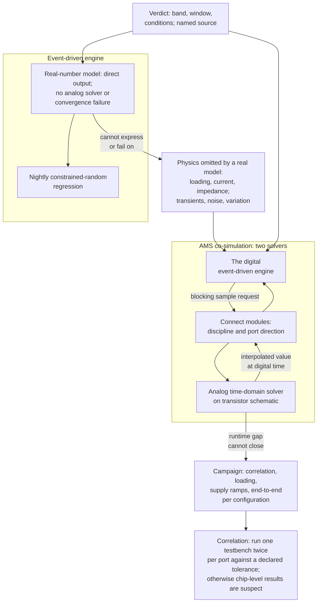

# 21. Analog and Mixed-Signal Verification

Analog and mixed-signal verification checks continuous quantities within tolerances and defines the digital team's responsibilities. The reference SoC's on-die analog front-end comprises a 12-bit SAR ADC, a PLL and a temperature sensor, all controlled by a peripheral-domain register block owned by the digital team. A SAR ADC converts by successive approximation, settling the output code one bit at a time. In this example, the first checker uses the method the team has used for every checker over two years: apply a known input, compute the expected code, compare:

<!-- slang: fragment - single immediate assertion statement; it belongs in the procedural checker described in the text above -->

```systemverilog
assert (adc_code == expected_code);
```

It fails on nearly every run by one code, occasionally two; three engineers spend a week investigating, although there is no bug. One least-significant bit against the front-end's 1.8 V reference is 1.8 / 4096 ≈ 439 µV. The model, the schematic and the eventual silicon are all expected to disagree by more than 439 µV.

Changing the check to `±2 LSB` makes the regression pass, but the number remains recorded only in that line of code. Six months later, a failure at 3 LSB cannot be classified as a bug, modeling artifact or unlucky seed because the origin of the 2 is unknown. The debugging adjustment now serves as the specification.

The oracle is the mechanism that decides whether an observed response is correct, and the coverage model is the multi-dimensional space of values and conditions that a plan asks a regression to reach. The oracle, the checkers, the coverage model and the regression pass/fail rule must therefore use a band of correctness rather than equality. Under the responsibility split used in this chapter, the digital verification engineer does not verify the ADC itself. The chapter defines the digital engineer's responsibilities at this boundary. UVM, the Universal Verification Methodology, is the standardized class library from which reusable testbenches are built. The two normative documents behind this chapter are Accellera's *Verilog-AMS Language Reference Manual* (Accellera Std VAMS-2023) [cit:S5] and its *Universal Verification Methodology for Mixed-Signal Standard* (UVM-MS), Version 1.0, January 2025 [cit:S13].

### Chapter map

§21.1 explains how the analog boundary changes the oracle and propagates tolerance-based verdicts through checkers, coverage and regression pass/fail. §21.2 covers what real number modeling captures and discards, and how it made mixed-signal regression practical. §21.3 covers the costs and uses of full AMS co-simulation and selection of a handful of scenarios. §21.4 treats behavioral models as assumptions requiring circuit correlation, renewal and ownership. §21.5 defines digital responsibility for the interface contract, control and calibration sequences, and failure handling.

## 21.1 Where the digital abstraction stops

Two assumptions underpin the techniques of the preceding twenty chapters and are embedded in their tools: discrete values and discrete time. The first is that a signal takes a value from a small discrete set, so comparison is exact and a bin either contains a value or does not. The second is that time advances in discrete steps, so "the value at the clock edge" is a well-defined thing to sample.

An ADC, a PLL, a voltage regulator and a high-speed PHY satisfy neither assumption. Checking one means measuring amplitude, gain, frequency, phase or similar quantities rather than reading a logic value [cit:D19]; these continuous properties cannot be reduced to a bit without discarding the property being checked. PLL lock means remaining within some frequency error of the target long enough to count as settled; it differs from membership in a state-machine state.

The **oracle** fails first: Chapter 3 established that every practical oracle checks only a projection of correctness, and the analog boundary makes that limitation explicit. The check measures whether the output lies inside a numeric band for a specified time under specified conditions. The verdict has three parts where a digital verdict has one:

- **A band.** The band is stated either in absolute terms (± 10 mV) or in relative terms (± 2%), and each form has a weakness. A relative tolerance is a fraction of the reading itself, so near a legitimate zero it has almost no width and fails. An absolute tolerance is meaningless over most of a quantity's range if that range spans three decades, three successive factors of ten.
- **A window.** Because analog outputs settle, a comparison before settling checks a transient; one at an arbitrary time checks whatever the model's step size produced. Every analog check needs a stated moment or interval at which it is valid.
- **A condition set.** Supply voltage, temperature, process corner, input frequency, load. A tolerance without the conditions under which it holds is not a specification.

Downstream, checkers compare against bands instead of equality. Coverage also changes. Bins are the counters that a coverage model keeps over sets of values. A coverage bin on a real value that names a single point can fail to be hit at all, because floating-point representation has limited precision: 0.1 + 0.2 yields 0.30000000000000004, which does not fall in a bin covering `{0.3}`. The language standard names that shortfall explicitly as a problem for analog specifications that carry tolerance ranges. The remedy is in the same standard: a tolerance token attached to a single real value defines an implicit range, so `{1.8 +/- 0.05}` and `{1.8 +%- 2.0}` are bins that a real measurement can land in [cit:S8].

A digital regression's verdict is a property of the design; a mixed-signal regression's verdict is a property of the design *and* of every tolerance somebody typed into a checker. Bring-up is the phase in which the environment and the DUT first exchange checked transactions. Scattered testbench literals leave two questions unanswered during bring-up: the tolerance's source and its approver.

Tolerances therefore belong in verification-plan closure criteria, rather than being defined in code. A plan row is the line of the verification plan that carries one feature, together with its method, its pass/fail criterion and the evidence that closes it. A coverpoint is an observed variable partitioned into bins, and an assertion is a declarative statement of a property that the design must hold, evaluated by a tool. A digital plan row closes when a coverpoint is hit or an assertion is proven; a mixed-signal plan row closes when a measured quantity sits inside a stated band under stated conditions, with a named source for the band. What the named source buys is traceability, the permanent link from a specification to the plan row, to the check and to the result. That traceability is what analog verification has historically lacked: analog practice has leaned on interactive simulation and visual inspection of waveforms by the same analog team that designed the circuit [cit:D19].

> **Scenario.** The reference SoC's PLL must be within 100 ppm of its target after lock. **Approach.** The plan row states the band (100 ppm), the window (measured over 1024 output cycles beginning 20 µs after the lock request), the conditions (nominal supply, three temperature points, three process corners), and the source of the band: the tightest frequency accuracy any consumer of the system clock demands. The checker reads all four from a package, not from literals. **Why.** At 140 ppm, the row identifies the violated requirement so the team can discuss whether the band or design should change. Without the plan row, the team must establish the source of the 100 ppm requirement before discussing a change.

## 21.2 Real number modelling

**Real number modeling** (RNM) describes the block's behavior with real-valued signals in the ordinary event-driven simulator: a voltage is a `real`, a net carries a number rather than a logic value, and the model computes its output directly from its inputs and internal state.

An analog model describes the current-versus-voltage relationship between nodes, and the analog solver finds all node voltages and branch currents by Newton-Raphson iteration with matrix inversion, choosing each timestep from accuracy criteria. A real model has no matrix solution: the output is computed directly, the model itself decides when to perform each internal computation, and there is no continuous-time operation; only sampled, clocked or event-driven updates. There is no analog solver and therefore no convergence failure [cit:D30], and the model runs in an event-driven framework that is inherently faster than the analog solvers it replaces [cit:D19].

Real number models are written in ordinary HDL. Verilog-AMS provides `wreal` nets; SystemVerilog provides user-defined net types with a resolution function, so a net carrying a structure of voltage and current can define what happens when two things drive it. No standard defines how discrete modeling of analog nets should be done, so published examples are one method among several, rather than a normative pattern [cit:S13].

### Measured RNM performance

Three measurements, from two independent sources, each against its own baseline ({ref: rnm_speedups}):

{table: rnm_speedups} Three published real number modelling results, each measured against its own baseline: the first row against a SPICE netlist, the other two against Verilog-AMS models of the same blocks. The second column is why the ratios cannot be chained into a ladder: the three results come from different designs, different references and different years. The first row's accuracy figure is the one to notice, because the verdict never depended on what that model traded away.

| Design | Compared against | Result | Year |
|---|---|---|---|
| A major analog block with filtering and fault detection | SPICE netlist | 24× faster, 0.3% gain inaccuracy at 100 MHz | 2011 |
| PLL loop filter | Verilog-AMS | ≈90× faster (47 s vs 1 h 8 min 32 s) | 2015 |
| Delta-sigma ADC | Verilog-AMS | 230× faster (0.4 s vs 92.5 s), ENOB 11.515 vs 11.72 | 2015 |

The first row's 0.3% inaccuracy was far better than required, because the tolerances on the checkers were in the range of 5%; the accuracy traded away for the speedup was accuracy the verdict never depended on [cit:D19]. A real number model should meet the plan row's tolerance, with no finer precision. The proof-of-concept targeted a current LSI Corporation design, selecting a major analog block driver with filtering and fault detection [cit:D19]. The evidence covers one block in one company's design, so the ratio must retain its baseline.

The other two rows compare SystemVerilog real models with Verilog-AMS models of the same blocks, excluding SPICE [cit:D30]. The three ratios measure separate things, so multiplying them would produce an unsupported composite claim.

### Physics omitted by RNM

**Electrical relationships.** A real net carries a value, not a Kirchhoff relation between the currents and the voltages meeting at a node. Loading, drive strength, input impedance and current draw are simply absent unless the modeller writes them in, and in SystemVerilog that means a user-defined net type with a resolution function that does the arithmetic explicitly. A shared bias line feeding two loads behaves exactly as with one load in such a model, hiding an entire class of circuit failures.

**Continuous time.** The model updates on events. Between updates the modelled quantity is a held value, and any transient shorter than the update interval does not exist. A real model shows glitches, ringing, supply-ramp overshoot and settling behavior required by tolerance windows only if the modeler explicitly included them.

**Noise, variation and margin.** Thermal noise, jitter, offset, mismatch and the spread across process corners are not free consequences of a real model the way they are consequences of a circuit. Each one is a feature somebody wrote, with parameters somebody chose.

RNM remains necessary because the alternative to abstraction here is no simulation; simulating everything is infeasible. Checks dependent on discarded physics must be identified because they check the model rather than the design.

> **Scenario.** The radar front-end's receive chain runs from mixer output through a variable-gain amplifier to the ADC, feeding the FFT and CFAR detection pipelines. Chapter 17 replayed a recorded chirp sequence through it, because the property under test there was bit-exact arithmetic across three configurations and that demands the identical input every time. **Approach.** For a different property, a real number model of the analog path lets the testbench generate the chirp: sweep the return amplitude across the full input range, inject a controlled noise floor, drive the amplifier into and out of saturation, and run it as a constrained-random regression. **Why.** Detection behavior at low signal-to-noise ratio requires coverage of conditions rather than reproducibility, and a recorded capture set contains exactly the SNR values that happened to be recorded. The two stimulus strategies answer different questions and the project needs both. **The limit.** The model's noise floor is a parameter rather than a measurement; a CFAR threshold tuned against an underestimated noise floor assumes less noise than silicon has. That parameter needs a source, as §21.4 explains.

## 21.3 AMS co-simulation

When physics matters, AMS co-simulation runs both engines: the digital event-driven simulator coupled to an analog time-domain solver, one simulation with two solvers exchanging values at their shared boundary. This restores the electrical relationships, transients and actual circuit convergence behavior omitted in §21.2. {ref: ams_cosimulation_boundary} draws that boundary and the runs on either side of it.

A net's *discipline* is its declared nature: continuous or discrete. Where a continuous discipline meets a discrete one, connect modules are automatically inserted to join them, selected by the disciplines and directions of the ports involved [cit:S5]. Whenever the digital side requests an analog value, for example on a periodic sampling clock, the simulator asks the analog solver to interpolate at that digital time point. That request is a *blocking* one: control passes to the analog solver and does not return until the value is available [cit:S13]. An unsuitable sampling clock repeatedly stalls the digital engine on the system's slowest component.



{figure: ams_cosimulation_boundary} The two engines meet at one boundary: the digital side blocks on each request while the analog solver interpolates, which is why the two-solver run is a campaign reserved for the physics a real number model leaves out.

The cost follows from §21.2's table. There, a real number model of a delta-sigma converter finishes in 0.4 seconds where the Verilog-AMS version takes 92.5. A delta-sigma converter reaches its resolution by oversampling its input and filtering the result. At anything like that ratio of runtimes, an hour of real-model regression takes multiple days with analog solvers in the loop. A job that has to finish overnight then misses its deadline. The runtime gap cannot be resolved by tuning. AMS co-simulation therefore requires a *campaign*: a purpose-built run with a stated reason and written result that then stops, rather than a regression tier with a nightly budget.

Scenario selection should reserve co-simulation exclusively for physics omitted by real number modeling.

- **Model correlation runs.** §21.4 treats these runs, and they establish the basis for every subsequent real-model result.
- **Failure modes that live in loading, current and impedance.** Precisely the class that a real model cannot express and therefore cannot fail on.
- **Power-up, power-down and supply ramps.** Sequencing across a boundary where the analog side has a genuine DC operating point to find, and where the digital side's reset release depends on that operating point.
- **One end-to-end signal-path scenario per configuration.** Not for bug-finding, but as evidence that the composed system behaves as the real models claim.

> **Scenario.** The sensor hub's always-on island shares one bias reference between its temperature channel and its pressure channel, and firmware may enable them independently. **Approach.** The real model of the bias generator delivers its nominal output regardless of how many channels are enabled, so a real-model regression will never show a problem. One co-simulated scenario enables both channels and checks the reference under the doubled load. **Why.** When the second channel switches on, shared-reference droop shifts the first channel's conversion beyond its stated tolerance; this loading failure is invisible to any abstraction without current. **What it costs.** One scenario, re-run when the bias generator's schematic changes, not nightly.

### PHY training verification limits

Chapters 18 and 20 defer LPDDR4 PHY training to this chapter. The AMS boundary can discharge the *algorithm*: that the training state machine converges against a channel model, terminates rather than loops when a step fails, has reachable and correct retry and fallback paths, and respects the protocol's timing obligations throughout. Real models plus a few co-simulated runs cover this substantial algorithmic risk.

It cannot discharge what Chapter 20 names: the *distribution* of training outcomes across parts and temperature. Every pre-silicon channel model trains against an idealization of signal integrity, and the spread separating a part that converges at the center of its acceptance window from one that converges at the edge does not exist until there are parts. The plan carries both rows, with the second closing in the lab; this division should be documented before bring-up.

## 21.4 Behavioral models and model correlation

The two preceding sections depend on models that make claims about silicon. An uncorrelated model incurs the cost of producing large volumes of passing nightly results quickly for months without evidence of agreement with silicon.

### The reference is inverted

In digital work the specification is the reference and the implementation is checked against it. A *golden* model is golden because it is the specification; Chapter 8's example of a standard supplying the executable model outright reduces checking to comparison. Synthesis then produces the gates, and equivalence checking closes the gap between RTL and gates mechanically.

Analog blocks also have specifications, but the schematic is the reference because it is what gets fabricated: a different sense of golden. There is no analog synthesis, so the schematic is a creative artifact rather than a derived one, and there is no equivalence checking to confirm that a hand-written model matches the schematic that will become silicon. Chip-level verification therefore assumes correlated models, and without them chip-level verification is suspect [cit:D27].

Digital verification addresses specification misinterpretation with two independent readings between specification and RTL: one reading is embodied in the RTL the digital designer writes, the other in the checks the digital verification engineer writes against the same specification. Analog specifications are usually interpreted correctly and are quite simple; the problems are creating the implementation and creating the model. Analog therefore needs comparison of two independently created block representations, schematic and model; a testbench assertion does not provide that independent check [cit:D27].

### Model correlation procedure

**Model correlation** requires the following procedure and artifact; a review, a glance at two waveforms or a design-document claim is insufficient:

1. **One self-checking testbench**, an environment that computes pass/fail itself rather than relying on human inspection of waveforms, written against the block's specification.
2. **Run twice**, once against the behavioral model and once against the transistor-level schematic.
3. **Compared per port, against a declared tolerance.** In a published programmable-gain-amplifier example, the specification states that the output voltage of the model and of the schematic must differ by less than 10 mV under the same stimulus, and that the supply current on the supply pin must match to within 1 mA [cit:D27].

At the third step, **correlation tolerance must already be part of the specification, per port, before any run.** A criterion chosen after seeing the mismatch cannot establish correlation.

A state space is the set of all the configurations that a design's state elements can take. Analog's state space is smaller, which makes this procedure more affordable than in digital verification. Analog blocks generally have little state, and that amount keeps falling as design style pushes digital logic out to the digital designers. For functionality at the analog block level, all states can typically be simulated exhaustively even at transistor level, giving 100% coverage for the digital inputs [cit:D27]. This avoids the combinatorial explosion that forces constrained-random stimulus on digital blocks. The enumerable modes should therefore all be exercised.

### Correlation expiry triggers

A correlation result applies to one revision of one schematic and has a limited lifetime. The flow must repeat correlation as schematics and/or specifications are updated [cit:D27]. Three further triggers require attention in addition to these updates:

- **A new operating condition.** A model correlated at nominal supply says nothing about behaviour at the corners of that supply. An entire power-management campaign can therefore run against a model that was never correlated outside its nominal box.
- **A parameter change with no schematic change.** Someone retunes a bias current or a trim default. The schematic revision moves; the model, which hard-codes the old value, does not.
- **A model edit made during debug.** A model edit during debug requires re-correlation, including edits made under pressure to make a failing test pass.

Correlation is a **campaign** with named triggers: it runs the transistor-level schematic at §21.3's cost, and its written result remains valid until a trigger fires. The transistor-level runtime limits how often correlation can run; omitting the campaign leaves chip-level regressions without correlation evidence at tape-out.

### Model ownership and effort

One consultancy's experience across many mixed-signal chips puts the creation of correlated analog functional models at as much as 80% of the effort involved in getting analog blocks into chip-level verification. That same experience puts the analog verification effort as a whole at typically 20% of the design effort, rising to 30% or 40% for a team new to it. The same source puts the proportion of analog designers skilled at *reading* models at around 20%, with fewer able to write them [cit:D27]. These undated experiential figures describe the problem; they are neither survey data nor a basis for a budget.

A proof-of-concept run took about three months of calendar time, half of it verification planning: the two implementation phases took three weeks and two weeks, and creating and checking the real number model of the block took an expert analog modeler two weeks on top of that [cit:D19]. That was 2011, one block, one team. This establishes that a real number model is a specialist deliverable requiring multiple weeks rather than an afternoon, but supports no broader conclusion.

The skill distribution determines ownership: an analog designer or specialist modeler writes the model, while digital verification consumes it; the person able to judge correctness differs from the person noticing errors, requiring a shared artifact.

### The model register

Chapter 14's assumption register records one row per assumption, reviewed like a waiver list, because an unwritten, unproven premise remains unproven at sign-off. An analog model also embodies assumptions and requires this treatment. {ref: model_register} records the assumptions and correlation evidence for one model.

{table: model_register} A model register entry laid out one field per row, filled in for the analog front-end's ADC: what the model abstracts away, what it was correlated against, under which criteria, and at which conditions. The last two fields are what make the register worth maintaining — a date lets a correlation claim visibly go stale, and the consequence field answers the only question a reviewer needs to ask about a model.

| Field | Example |
|---|---|
| Model ID | `MDL-AFE-ADC-01` |
| Block | Analog front-end, 12-bit SAR ADC |
| Abstraction | Real number model, event-driven, no supply-current behaviour |
| Correlated against | Schematic rev. 7, transistor level |
| Correlation criteria | Output code within 1% of full scale (≈ 41 LSB); conversion time within 5% |
| Conditions covered | Nominal supply, 3 temperature points; corners **not** correlated |
| Date and owner | Named analog engineer, with date |
| If wrong | Every ADC-path result in the chip-level regression, and every plan row that closes on an ADC measurement |

A date turns "the model is correlated" into a claim that can visibly go stale, while the consequence field identifies which other results would be wrong if the model were wrong at sign-off.

## 21.5 Digital verification responsibilities

The digital team's responsibilities at the analog boundary concern its interactions with the block. The responsibility split used here assigns verification of the analog block to the analog team. The analog team owns performance, noise, linearity and corner behavior, using its distinct tools and expertise. A level shifter is the cell that translates a signal from one voltage swing to another. The digital team owns every digital interaction with that block: the RTL that drives calibration, control loops and power-up sequences is a documented source of chip bugs, alongside missing level shifters and unconnected signals [cit:D27].

These responsibilities form four categories.

**The interface contract.** Every control line's meaning, every status line's timing, the register map, and the wiring. At the analog subsystem level the wires include supply lines, current bias lines, voltage references and digital control lines, and all of them have to be connected correctly; at chip level there are thousands running from the digital domain into the analog [cit:D27]. Correct connection of those wires is a connectivity problem, and Chapter 15 covers its verification. The analog-specific part is only that a swapped or inverted control line here produces a plausible-looking analog output rather than an obvious failure, so the digital-side check is the one that will catch a swapped or inverted line.

**The control and calibration sequences.** The algorithm that drives the analog block into specification: trim searches, offset cancellation, lock acquisition, gain ranging. Offset cancellation measures the block's output with no input applied and subtracts what it finds; gain ranging selects the amplifier setting that keeps the signal inside the range the converter can represent. This digital logic operates on analog feedback, and its correctness depends on both a state machine and a tolerance.

**The failure handling.** What the design does when the analog reports out-of-range, fails to converge, or saturates. Chapter 5 calls this class a must-not-happen feature; at the analog boundary, verification requires explicitly directing the model to produce failure conditions.

**The tolerances themselves.** Not the physics behind them, but their provenance: every band in the plan traceable to a specification, and the model register kept current.

> **Scenario.** The sensor hub's temperature channel runs a trim search at wake-up: the always-on controller steps a trim code, waits for the reading to settle, and keeps the code whose reading is closest to the on-die reference. **Approach.** Verification of the search must cover termination from every starting code, including the two range ends; ties between two codes; and a broken sensor whose reading never settles, distinguishing convergence on a wrong code from reported failure. All cases run against a real number model with injectable offset, drift and non-monotonicity. **Why.** The analog team owns sensor accuracy; the digital team owns finding the right code within bounded time and reporting failure when the search cannot do so. **The trap.** A search that always converges in the model may be relying on monotonic behavior the real sensor does not guarantee; this modeling assumption belongs in the register with its model.

> **Scenario.** The flash controller reads a page and ECC reports too many errors to correct. Its read-retry state machine walks a table of reference-voltage offsets, re-reading at each until the page decodes. **Approach.** The digital team verifies that state machine: the table is applied in order, the retry budget is respected, a mid-retry power loss leaves the array readable, and exhausting the table reports an uncorrectable error rather than silently returning the last attempt. **Why.** NAND reads are threshold-voltage comparisons, so the analog quantity being manipulated is a reference level; but the correctness question is entirely digital. **What is different here.** The oracle is a *probability*, not a band: with ECC downstream, a marginal read is not wrong, it is more likely to need correction. The plan row closes on a bit-error-rate distribution across the retry table, a third closure criterion after equality and tolerance; every mixed-signal plan row should name its criterion.

The radar front-end illustrates the third responsibility, failure handling. Chapter 5 requires every FFT stage to raise its saturation flag on saturation; a second, upstream obligation requires the receive chain to flag input beyond the amplifier's range and the detection pipeline to discard that frame instead of treating clipping as a target. The two flags are different mechanisms, and both belong on the negative list, the plan's record of what the design must never do. Checking the upstream flag requires driving the real number model beyond the amplifier's range; an amplitude sweep covers this region when recorded captures do not.

### Worked artifact: tolerances with one owner

The chapter's opening failure was a tolerance invented in a checker. Every band should reside in one package as a named constant with an explanatory comment, referenced by every checker and coverage bin. The constructs in the package below come from IEEE 1800-2023 (the SystemVerilog language standard), and the tolerance tokens in particular need a tool configured for that language version:

```systemverilog
package afe_spec_pkg;
  // Bands for the analog front-end. One place, one owner, quoted everywhere.
  localparam real V_REF      = 1.8;           // ADC reference, volts
  localparam real V_MIDSCALE = V_REF / 2.0;   // mid-scale of the input span, volts
  localparam real V_BIN_STEP = 0.05;          // coverage bin width, volts
  localparam real V_BIN_TOL  = 0.005;         // mid-scale bin half-width, volts
  localparam real V_CORR_ABS = 0.01 * V_REF;  // model-vs-schematic band, volts: 1% of full scale, from MDL-AFE-ADC-01
endpackage

module afe_probe (input logic sample_done, input bit corr_run);
  import afe_spec_pkg::*;

  real v_in;   // stimulus, applied identically to model and schematic
  real v_mdl;  // real number model output, volts
  real v_ckt;  // transistor-level output, volts; driven, and corr_run high, in correlation runs only

  covergroup cg_afe_input @(posedge sample_done);
    cp_v_in : coverpoint v_in {
      type_option.real_interval = V_BIN_STEP;
      bins span[]   = {[0.0 : V_REF]};
      bins midscale = {[V_MIDSCALE +/- V_BIN_TOL]};
    }
  endgroup

  cg_afe_input cg_i = new();

  always @(posedge sample_done)
    if (corr_run && !(v_mdl inside {[v_ckt +/- V_CORR_ABS]}))
      $error("AFE model outside its correlation band");
endmodule
```

The example has three relevant details. `type_option.real_interval` sets the width of the automatically created bins, so `span[]` divides the input range into equal intervals rather than demanding exact values. `midscale` uses an absolute tolerance token, and that token's total width is smaller than the real interval, so `midscale` stays a single bin. A measurement near half-scale lands in that bin instead of falling between two points that floating-point arithmetic will never produce exactly. The correlation check uses the *absolute* token, discharging §21.1's rule: a band taken as a percentage of the measured value shrinks with the signal and collapses near zero, whereas the same percentage of the fixed full-scale reference is a constant band across the whole range. Across all three, every number is a commented `localparam`, and the correlation band names its register row. The `corr_run` qualifier keeps the nightly regression and the correlation campaigns apart in one file, so a nightly run never compares `v_mdl` against an undriven `v_ckt`.

### In practice

**Two verification populations.** A nightly regression built entirely on real number models, and correlation campaigns fired by the triggers of §21.4. Combining the populations can make the nightly job exceed its runtime budget; correlation results also need separate records to remain traceable.

**Supply randomization and coverage.** A fractional-N PLL multiplies its reference frequency by a fractional rather than a whole number. A covergroup is the SystemVerilog container that holds one coverage model. A published fractional-N PLL example randomizes a nominal 2.5 V supply across ±7%, deliberately beyond the ±5% legal band; its covergroup has three bins: under-voltage below 2.375 V, healthy from 2.375 V to 2.625 V, and over-voltage above [cit:D30]. Other designs need their own supply-voltage limits when applying this randomization and coverage method. In that example, twenty runs report whether the supply ever left its healthy band, enabling this check before a supply-related lab failure.

**Model creation and register ownership.** The analog engineer writes and correlates the model; the verification team owns its row in the register and its expiry. Maintaining the register requires knowledge of the chip-level runs that depend on the model, while judging its physics requires analog modeling expertise.

### Pitfalls

1. **A tolerance invented in a checker.** *Symptom:* an unsourced `±2 LSB` literal and disputes about marginal failures. *Cure:* every band is a named constant traceable to a plan row and a specification.
2. **Comparing before the output has settled.** *Symptom:* intermittent failures that move when the model's timestep changes. *Cure:* every analog check states the moment or interval at which it is valid, and the check is qualified by it.
3. **Trusting a real number model for something electrical.** *Symptom:* a loading, droop or current-draw bug found in the lab that no simulation could have shown. *Cure:* enumerate which checks depend on discarded physics, and cover those in a co-simulation campaign.
4. **A model correlated once, at nominal, and never again.** *Symptom:* months of green chip-level regressions against a model that stopped matching the schematic three revisions ago. *Cure:* the model register, with a date, an owner, the conditions covered, and named re-correlation triggers.
5. **Co-simulating on a fast periodic sampling clock.** *Symptom:* a co-simulation far slower than its analog content justifies. *Cure:* each query is a blocking request into the analog solver; sampling should occur on change where the modeling style allows it.
6. **Verifying the analog block instead of the digital control of it.** *Symptom:* effort spent reproducing the analog team's characterisation, while the calibration sequence's failure paths are untested. *Cure:* the boundary of §21.5, written into the plan as an explicit scope statement.

### Summary

- At the analog boundary the oracle stops being an equality and becomes a **band, a window, and a condition set**. Checkers, coverage and regression pass/fail all inherit that structure.
- **Real number modeling** represents continuous quantities at digital simulation speed, making mixed-signal regression practical. Checks dependent on its omitted electrical relationships, continuous time and noise require identification.
- Published speedups are real and are **not composable**: they measure different baselines, different designs, and different years. Every ratio must retain its baseline.
- **AMS co-simulation requires dedicated campaigns**, covering model correlation, loading and current failures, supply sequencing, and one end-to-end run per configuration rather than a regression tier.
- **Analog models require correlation** against schematics with per-port tolerances declared in advance, a model register recording date and owner, and re-correlation on named triggers.
- The plan must assign the digital team the **interface contract, control and calibration sequences, failure handling, and tolerance provenance**, while excluding verification of the analog block itself.

### Exercises

**Exercise 21.1 (calculation).** The model register of §21.4 states the ADC model's correlation criterion as an output code within 1% of full scale, noted there as about 41 LSB, while the package of §21.5 states the same band as a real constant equal to 0.01 times the reference. Derive the 41 LSB from the converter's resolution, and express it in volts through the 1.8 V reference of the chapter's opening. Show that the two statements of the band agree. State which of the two forms of tolerance distinguished in §21.1 is in use here, and what the other form would do to this band near the bottom of the input range.

**Exercise 21.2 (artifact).** Read the model register entry below against §21.4. Name the two claims the entry cannot support while its last two fields are blank, and state what §21.4 says each of those fields is for. Decide which class of run the conditions line disqualifies this model from supporting, and name the correlation-expiry trigger of §21.4 that such a run would fire.

```text
Model ID:              MDL-AFE-PLL-02
Block:                 Analog front-end, PLL
Abstraction:           real number model, event-driven; no phase noise
Correlated against:    schematic rev. 7, transistor level
Correlation criteria:  frequency error inside the plan row's band, per port
Conditions covered:    nominal supply, one temperature point
Date and owner:
If wrong:
```

**Exercise 21.3 (judgement).** A plan carries a single row for the flagship's LPDDR4 PHY training, and the proposal is to close it before bring-up with real number models plus a few co-simulated runs. Decide which obligations of that row the AMS boundary can discharge and which one it cannot, and name the platform where the second closes. Give the property of pre-silicon channel models that §21.3 offers as the reason, and state what §21.3 requires of the plan as a consequence.

**Exercise 21.4 (calculation).** Section 21.2's table reports the delta-sigma converter finishing in 0.4 seconds against 92.5 for the Verilog-AMS model of the same block. Compute the ratio, and use it to price one hour of real-model regression rerun with the analog solver in the loop. State the conclusion §21.3 draws from that figure about how AMS work is scheduled. Give the reason §21.2 states for not applying the same ratio to the other rows of its table.

**Exercise 21.5 (artifact).** Read the coverage report below against §21.1 and the package of §21.5. Name the cause §21.1 gives for a bin of this shape never being hit, and the remedy the same section takes from the language standard. Write the midscale bin as the package of §21.5 writes it, and give the property §21.5 states for why the repaired bin stays one bin. State why further regression runs cannot close this plan row.

```text
Coverage report, covergroup cg_afe_input, after twenty regression runs
  coverpoint cp_v_in
    type_option.real_interval = V_BIN_STEP
    bins span[]                  every interval of the span sampled
    bins midscale = {V_MIDSCALE} no hits
  plan row status: open, blocked on the midscale bin
```

### Further reading

From the corpus: [cit:D19] for metric-driven verification applied end to end to an analog block, including the effort data and the coverage-to-plan mapping; [cit:D27] for the trust problem, the specification-driven approach to model correlation, and the effort economics; [cit:D30] for real-versus-analog modelling, the runtime comparisons, and worked supply-coverage and real-randomisation examples; [cit:S13] for the mixed-signal UVM bridge architecture and the push, push-sync and pull coupling patterns; [cit:S5] for the continuous-discrete boundary and connect-module semantics; [cit:S8] for real coverpoints, tolerance tokens and real-valued randomisation.

Outside the corpus: Kenneth S. Kundert and Olaf Zinke, *The Designer's Guide to Verilog-AMS* (Kluwer Academic Publishers, 2004), for behavioral modeling discipline; and Peter J. Ashenden, Gregory D. Peterson and Darrell A. Teegarden, *The System Designer's Guide to VHDL-AMS* (Morgan Kaufmann, 2002), for the same material from the VHDL side.
