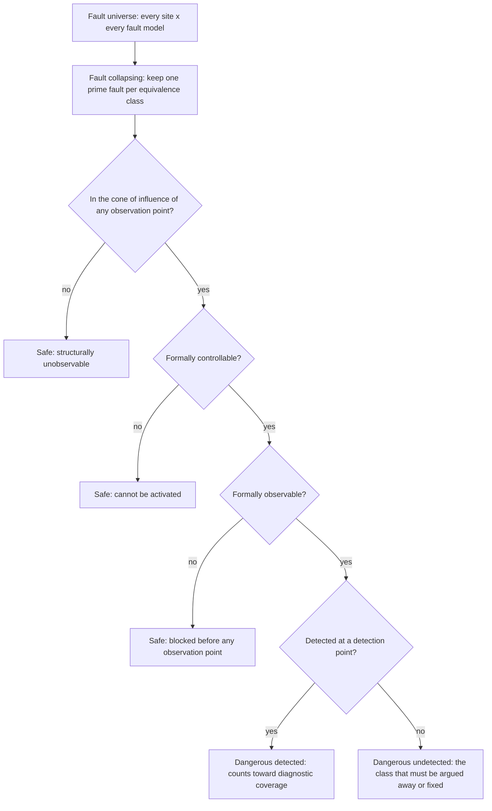

# 22. Safety Verification

Eleven weeks before the flagship-A's tape-out, the verification evidence is complete by every conventional measure: a verification plan whose rows are all discharged, a coverage database at closure, a green regression, a bug curve that flattened a month ago. The review ahead is a functional-safety audit, and the first question an assessor from the customer's safety organisation asks is about none of it.

"Your architecture says the tightly-coupled memory is protected by single-error-correcting, double-error-detecting code, and that a double-bit error is reported to the safety island inside the fault-tolerant time interval. Show me the faults you injected into that path. Show me the ones the mechanism did not catch. And show me your argument for why the faults you did not inject did not need injecting."

Nobody on the team can answer, because nobody was asked to. The environment has never corrupted a memory bit on purpose; the error-correcting code was verified the way every other block was — by checking that correct data goes in and correct data comes out. That is a perfectly good functional argument, and it answers a different question. The assessor is not asking whether the design works. She is asking whether the design *notices when its silicon breaks*, how much of the breaking it notices, and how you know.

That question is the whole of this chapter. It changes what you build, what you measure, what you keep, and — more than any of those — what you must be able to *say* at the end, in a document that outlives everyone who wrote it.

### Chapter map

- §22.1 states what a safety standard actually obliges a verification engineer to do, day to day, beyond what a competent team already does.
- §22.2 establishes why systematic and random hardware faults are two different problems, and why only one of them is what the rest of this book has been about.
- §22.2 then develops how failure analysis becomes a verification input: failure modes, effects, safety mechanisms, and the diagnostic coverage the project is on the hook to demonstrate.
- §22.3 treats how fault injection turns that analysis into evidence — how a fault list is pruned honestly, and why "not detected" and "not dangerous" are different verdicts.
- §22.4 sets out how to verify a safety mechanism, including the half teams forget: that it does *not* fire when it should not; §22.5 states what tool qualification and an audit-proof evidence trail demand.

## 22.1 What changes when a standard is watching

Safety-critical development is no longer a niche. In 2024, 44 percent of IC/ASIC projects reported working to at least one safety-critical development standard or guideline, and among projects that do, the median spends between a quarter and half of total project time on functional-safety activities [cit:R2]. On FPGA projects the adoption figure is higher still, 63 percent in the same year [cit:R1]. If you have not worked under a standard yet, the odds are you will.

The standard that dominates the automotive world is ISO 26262, which defines functional safety as the absence of unreasonable risk arising from hazards caused by malfunctioning behaviour of electrical and electronic systems [cit:D2]. That definition, and the rest of the vocabulary this chapter uses, belongs to Part 1 of the series: ISO 26262-1:2018, *Road vehicles — Functional safety — Part 1: Vocabulary*. The corresponding regime for airborne electronic hardware, DO-254 (RTCA, Inc., *Design Assurance Guidance for Airborne Electronic Hardware*, published by EUROCAE as ED-80), appears in the same 2024 survey among the standards teams comply with [cit:R2]. Engineers who have worked under both describe it as speaking of design assurance levels rather than integrity levels, with its centre of gravity closer to requirements-based verification than to random-fault metrics. This chapter's concrete detail comes from the automotive side, because that is where the published engineering practice is; the obligations below bite the same way in both.

There are three of them, and one consequence that outranks all three.

**Process obligations.** The standard prescribes *how* work is organised, not only what is produced: activities have prescribed inputs and outputs, reviews have prescribed independence, changes have prescribed impact analysis. A verification engineer feels this as friction with a specific shape — you can no longer quietly delete a test that has become useless, quietly re-scope a coverage model, or quietly upgrade a tool. Each is now a change to a controlled work product, and needs a record of who decided and on what basis.

**Evidence obligations.** Every claim must be supported by an artifact somebody else can inspect — a higher bar than "the regression is green". Green is a state; evidence is a *retained* state, tied to a specific design revision and tool configuration, with the raw results kept and not just the summary. The shift is from *we ran it* to *we can show, later, what we ran and what came back*.

**Traceability obligations.** Every safety requirement is linked forward to the thing that discharges it, and every test back to the requirement that justifies it. Chapter 5 already asked for traceability as professional hygiene — permanent IDs from specification to feature to test to result. A safety project takes that from hygiene to obligation and adds the direction most teams never build: *backwards*. Given a test, name the requirement it serves. A test that traces to nothing is not merely wasteful; it is an unexplained artifact in a controlled repository, and an assessor will ask about it.

And the consequence: **the argument itself becomes a deliverable.** In an ordinary project the reasoning connecting your evidence to "this is good enough to ship" lives in the heads of the people at the sign-off table and evaporates the day they move on. On a safety project that reasoning is written down, reviewed and shipped — a safety case, whose claims your evidence supports and whose gaps are argued explicitly. Nothing else here changes engineering judgment as much: you are no longer producing results, you are producing *the premises of somebody else's argument*, and you will be asked whether each premise says what the argument needs it to say.

This is visible in what teams themselves report as hard. Among the biggest functional-safety challenges named by 2024 IC/ASIC participants, safety architecture and design and safety requirement definition, management and traceability lead the list — ahead of fault list generation and injection, which is the part everyone expects to be the hard part [cit:R2]. The technique is not the bottleneck. The bookkeeping around the technique is.

### Where your target comes from

One piece of vocabulary is worth getting right early, because it governs how much of the rest applies to you. An **ASIL** — automotive safety integrity level, A through D, with D the most demanding — is not a property of your block. It is arrived at by assessing the risk of a potential *hazard*, weighing three judgments: how severe the harm would be, how often the vehicle is exposed to the situation, and how well a driver could control the outcome [cit:D12]. A headlamp that fails on a lit motorway and one that fails on an unlit country road are the same electronics and different hazards [cit:D2].

The integrity level then travels down — hazard, safety goal, system requirements, requirements on your part, requirements on your block — and by the time it reaches you it is a *number in a requirements document*. The honest thing to notice is that you almost never get to argue about it. You inherit a target, and a set of mechanisms someone else chose to meet it.

> **Scenario.** The reference SoC has no error-correcting code anywhere. Its 512 KB of tightly-coupled SRAM is fast, four-banked, and completely undefended: a particle strike that flips a bit in a weight buffer produces a wrong answer with no indication that anything happened. That was a defensible choice for a low-power edge part whose worst failure is a wrong inference.
> **Approach.** When the same architecture is pulled toward an automotive application, the answer is not to bolt detection onto the first-generation part. It is a derivative — the flagship-A — with SECDED protection on the tightly-coupled memory, the L2 slices and the LPDDR path, a dual-core delayed-lockstep safety island, and monitored reset and clock.
> **Why.** Detection is architecture, not a verification add-on. There is no fault campaign you can run on the reference SoC that will improve its diagnostic coverage, because it has no mechanism whose coverage could be measured. This is the first judgment call of a safety project and it happens before verification starts: if the failure analysis says a failure mode needs covering and no mechanism covers it, the finding is a *design* finding, and the later you raise it the more expensive it is.

One more structural fact about the flagship-A, because it recurs: the safety island is built to ASIL D inside a system built to ASIL B. Mixing integrity levels inside one design is ASIL decomposition, the subject of ISO 26262-9:2018, *Road vehicles — Functional safety — Part 9: Automotive safety integrity level (ASIL)-oriented and safety-oriented analyses*. Different parts of one chip carry different targets, and the boundary between them is itself something you must verify — a fault in the ASIL B region must not defeat the ASIL D region's mechanisms. That is the reason the safety island exists as an island. Parts of that shape are documented in public: one account describes an ASIL-rated custom automotive microcontroller core at Infineon — 60 instructions, 1.8K flip-flops, 70K gates — verified across 16 versions over 5 years of feature updates, architecture upgrades and bug fixes, and shipping in products as different as a 3D camera, an airbag and a pressure monitor [cit:D24]. The scale is worth registering: an ASIL-rated core can be small, and what makes it demanding is the obligation attached to it rather than its gate count.

## 22.2 Failure analysis as a verification input

Here is the distinction that organises everything else in this chapter. A **systematic fault** is a design bug: a mistake made during development, present in every part ever manufactured, and always permanent. A **random hardware fault** is a physical defect: a latch-up, a marginal via, an aging transistor, a particle strike — arising during manufacturing or in operation, and either permanent or transient [cit:D32].

Almost everything in Chapters 1 through 21 is aimed at systematic faults. Constrained-random stimulus, formal proof, coverage closure, regression engineering, gate-level simulation, post-silicon bring-up: all of it exists to find design bugs before they ship. A safety standard demands that work too, with more process around it — but it does not stop there, because a design can be *perfectly correct* and still kill somebody when a particle flips a bit in its configuration register.

You cannot verify a random fault away. It is a physics problem, and the physics will happen at some rate whatever you do. What you can do is show that when it happens, the design *notices* and does something safe. That is why safety verification feels alien: for the first time you are not hunting a bug, you are measuring a mechanism's effectiveness against a population of defects that are nobody's fault.

### FMEDA: the document you are handed

The analysis that produces your work list is a failure mode, effects and diagnostic analysis — **FMEDA**. The part of the series that carries the hardware metrics an FMEDA feeds is ISO 26262-5:2018, *Road vehicles — Functional safety — Part 5: Product development at the hardware level*, and the semiconductor-specific guidance on applying the series to an integrated circuit is ISO 26262-11:2018, *Road vehicles — Functional safety — Part 11: Guidelines on application of ISO 26262 to semiconductors*, which is new in 2018. It works element by element, and for each element asks a fixed set of questions: in what manner can this element fail; what is the consequence if it does; how likely and how severe is that consequence; and which safety mechanism handles it [cit:D32]. A typical answer names a mechanism from a small, stable family — error-correcting code on a memory, a dual-core lockstep pair (two hardware cores running the same instruction stream, watched by a comparator), a software test library, a triply-redundant structure with a majority voter.

Two things about this document matter enormously to a verification engineer and are almost never explained.

First, **the FMEDA is written before your evidence exists.** It is produced by a safety engineer, early, from design data and technology data, and it carries an *estimated* diagnostic coverage for each mechanism — the fraction of that failure mode's faults the mechanism is claimed to catch. Fault injection is what converts that estimate into a measurement [cit:D32]. If your measurement comes in below the estimate, the architecture's metrics (ISO 26262-5:2018) move, and if they move far enough the part misses its target. This is why fault campaigns start late and end badly: they are the last chance to discover that an architectural assumption was optimistic.

Second, **the granularity of the FMEDA's failure modes fixes the shape of your fault list.** A failure mode written as "the FIFO indicates its flags incorrectly, so data is overwritten or lost, and the mechanism is redundant flag logic" tells you exactly where to inject and which signal is the alarm [cit:D32]. One written as "the block malfunctions" tells you nothing and cannot be measured. Argue with the granularity while arguing is cheap; you cannot re-cut it in the last four weeks.

### The classification you must produce

Fault campaigns exist to sort a design's faults into classes the standard recognises (ISO 26262-5:2018, with the defined terms themselves in ISO 26262-1:2018). The names are worth learning precisely, because ordinary English gets them wrong [cit:D2]:

- A **safe fault** cannot violate the safety goal — either it cannot affect safety-related logic at all, or its effect is one the system tolerates.
- A **single-point fault** violates the safety goal and no safety mechanism is present to catch it. This is the class that must be nearly empty.
- A **residual fault** violates the safety goal in a place where a mechanism *is* present, but this particular fault is outside what the mechanism covers. It is the honest measure of how good your mechanism is not.
- A **latent fault** cannot violate the safety goal on its own, and is neither detected by a mechanism nor perceived [cit:D32]. It waits, silently, for a second fault to arrive and combine with it. A dead comparator in a lockstep pair is the canonical example: nothing goes wrong until the day the two cores disagree and nobody is listening.
- A **multi-point fault** is a combination that violates the safety goal, and is classified by whether the mechanism detects it, whether it is merely perceived, or whether it stays latent [cit:D32].

These classes feed the architectural metrics: the **single-point fault metric** (SPFM), the **latent fault metric** (LFM), and the probabilistic metric for random hardware failures (PMHF). Each carries a threshold per integrity level, tabulated in ISO 26262-5. The values reported for ASIL D are SPFM at or above 99 percent, LFM at or above 90 percent, and PMHF below 10 FIT; for ASIL C, 97 and 80 percent; for ASIL B, 90 and 60 percent, with PMHF below 100 FIT at both of those levels [cit:D12] — figures taken from that paper, not read off the standard, which is not in this book's corpus. The standard also specifies the formulas behind those metrics, where the fraction of safe faults is established by structural analysis and formal proof, while the diagnostic coverage terms — the ones that make or break the metric — are measured by fault injection [cit:D32].

### The unit trap: faults are counted, metrics are weighted

Here is the item that trips up every engineer arriving from functional verification, and that nothing in the toolflow warns you about. Your campaign counts faults: it injects a number of them and reports how many were detected, and the temptation to divide one by the other and call the quotient your diagnostic coverage is overwhelming.

The architectural metrics are not fault-count ratios. They are ratios of **failure rates**. Each failure mode of each design element carries a base failure rate computed from design data and technology data, and the metric formulas combine those rates — the safe fraction, the residual fraction, the multi-point fractions — into a single number for the element and then for the part [cit:D32]. Your campaign's detected fraction is an input applied to a weighted quantity, not the quantity itself.

The practical consequence: two campaigns with identical fault counts can produce different metrics, and a fault list that over-samples a large but low-rate structure while under-sampling a small critical one misleads you in a direction no coverage report shows. Agree the fault list with the safety engineer *per failure mode*, and keep the per-mode results separate all the way to the report. A single aggregate percentage across a whole block cannot be composed with anything.

> **Scenario.** The brake controller MCU is small enough to enumerate honestly: a lockstep core pair, its ECC-protected memories, a watchdog, and a safety island holding the comparator and the alarm aggregation. Its FMEDA fits in one spreadsheet, and every failure mode maps to a mechanism a verification engineer can name.
> **Approach.** The verification lead walks the FMEDA row by row with the safety engineer *before* writing any injection infrastructure, and produces one artifact per row: where faults are injected, which signal is the observation point (where a violation of the safety goal becomes visible), and which signal is the detection point (where the mechanism raises its alarm).
> **Why.** On a part this size the walk takes two days and removes almost all the late surprises. On the flagship-A the same walk is a multi-week activity across a dozen sub-teams, and it is the reason large safety programmes staff a safety architect whose full-time job is keeping the FMEDA and the campaign definition in agreement. The technique does not change with scale; the coordination cost does, and it dominates.

## 22.3 Fault injection and fault simulation

The mechanics state in a paragraph, which is part of why people underestimate the activity. You make a second copy of the design with one hypothetical fault inserted — the *faulty machine*, against the unmodified *good machine* — and run a workload on both. At designated strobe times you compare designated signals, and if a signal differs between the two runs, the fault has reached it [cit:D32].

Two kinds of signal are designated, and confusing them is a common beginner error:

- **Observation points** are where the failure becomes visible to the outside world — the data output that would now be wrong. A fault seen here is *observed*.
- **Detection points** are where the safety mechanism raises its alarm — the error flag, the comparator mismatch, the interrupt to the safety island. A fault seen here is *detected*.

In the published ECC campaign this chapter draws on, the observation point is the read-data port and the detection points are the single-error, multi-error and any-error signals on the block's boundary [cit:D12]. That choice is not incidental bookkeeping; it *is* the definition of what you are measuring.

One distinction before going on, because this book already has a neighbouring term. **Error injection**, as Chapter 2 introduces it and Chapters 3, 8 and 10 practise it, drives erroneous *stimulus* at an interface to check that the design detects and recovers. **Fault injection** corrupts the design's own *internal state* — a net, a flip-flop — to model a physical defect no interface can produce. The two share infrastructure and answer different questions, and a safety assessor means only the second.

### The four outcomes, and the one that matters

Cross the two axes and you get four verdicts. A fault neither observed nor detected did nothing visible in this run. A fault observed and detected is one the mechanism caught: it corrupted something, and the alarm went off. A fault detected but not observed triggered the alarm without corrupting anything — not dangerous, if noisy. And a fault **observed but not detected** corrupted the design's output while the mechanism stayed silent [cit:D12]. That last class is the dangerous one, and it is the whole point of the campaign.

That brings us to the distinction that separates a competent safety engineer from a dangerous one. **A fault that is not detected is not the same as a fault that is not dangerous.** A fault that was never observed in your campaign has two possible explanations, and your campaign cannot tell them apart: either it is genuinely safe — it cannot affect the safety goal under any stimulus — or it is dangerous and your workload simply failed to excite it [cit:D32]. Both look identical in the results database. Both are a row that says "not observed".

Which explanation you choose is the largest single lever on your reported metrics, and the place where fault campaigns become dishonest: classifying every un-excited fault as safe will get you to any number you like, and an assessor will ask for exactly the argument you did not make.

The honest positions are two, distinguished by *which question the evidence answers*:

- **Structural and formal arguments answer "under any stimulus".** A fault outside the cone of influence of every observation point cannot reach an observation point under any workload whatsoever — that is a property of the netlist, established statically, and it scales from block to system [cit:D12]. Likewise, a fault that a proof engine shows can never cause a difference at the observation point is untestable by construction, not merely unstimulated [cit:D32]. These are real safe faults and they may be excluded without apology.
- **Simulation answers "under this stimulus".** A fault your workload did not excite is a fault about which you have learned nothing. It is not evidence of safety; it is absence of evidence, and it must be resolved by better stimulus, by proof, or by a recorded engineering judgment with a name attached.

Keep those two apart every time you prune, and the pruning is defensible. Blur them and the campaign is theatre.

### Why the fault list is enormous, and how it is honestly reduced

Every net, port and sequential element is a fault site, and each site carries at least two permanent fault models — held at zero and held at one — plus transient ones. Permanent defects are conventionally injected as stuck-at faults, transient upsets as a single event upset: a bit flipped once and then left to propagate or die [cit:D2]. On a large block the raw count runs to millions.

The reduction sequence is standard, and each step answers a specific question:



{figure: fault_pruning} The reduction sequence that takes a fault list from every site crossed with every fault model down to the faults a campaign actually simulates: collapsing, then structural pruning, then formal controllability and observability analysis. Each diamond is a question whose answer holds under any stimulus, and the order is deliberate — cheap arguments first, so the expensive engine only sees what the cheap ones could not settle.

**Collapsing** comes first: faults are sorted into equivalence classes, a *prime* fault represents each class, a *collapsed* fault is one producing the same observable behaviour as its prime, and only primes are simulated [cit:D32]. **Structural pruning** follows, removing faults outside the cone of influence, and then formal controllability and observability analysis removes faults that cannot be activated or cannot propagate. What survives is simulated.

The published ECC campaign gives the shape concretely. A design with faults at ports, flip-flops and wires starts from 3,606 faults; collapsing removes 973 and testability analysis another 144, leaving 2,489 to analyse. Structural cone-of-influence analysis marks 763 of those unobservable, leaving 1,726. Formal observability analysis then clears a further 248 — 232 in one phase and 16 in a second — leaving 1,478 that genuinely reach the read-data port [cit:D12].

Nothing in that chain from 3,606 to 1,478 is a guess. A collapsed fault is dropped because an equivalent prime fault stays in the list to represent it; every other fault is dropped by an argument that holds under any stimulus whatsoever. That is what makes the reduction defensible, and it is why the order matters: cheap arguments first, so the expensive engine only sees what the cheap ones could not settle.

### The plateau, and what to do at it

Simulation-based campaigns follow a characteristic curve. Progress is close to linear at first, then flattens, and eventually additional runs classify almost nothing. At that point you are left with a residue of faults that were never observed, and the answer is not "assume they are safe" — it is "analyse them". Doing that by hand is the activity nobody budgets for: reviewing every not-observed fault to establish that it went unseen because of the design's structure and not because of the environment's incompleteness, at a cost measured in engineer-days to engineer-weeks [cit:D12].

This is where formal earns its place in a safety flow, and the argument is precisely the one made above: a proof answers "under any stimulus", so it can convert a not-observed fault into a proven-safe fault, which simulation can never do. The published campaign runs the whole classification formally on a block small enough to take it — and the block was only *almost* small enough. The 8K memory on its periphery would not converge in twelve hours until the memory was black-boxed with its input ports promoted to observation points, and then abstracted to a pair of back-to-back flip-flops under a constraint fixing the read/write ordering [cit:D12].

Note the direction of that abstraction's error, because it is what makes it usable: promoting the memory inputs to observation points can only make a fault look *more* observable than it is, so a fault the abstraction calls safe (the safe-fault class of ISO 26262-5:2018) is genuinely safe [cit:D12]. An abstraction whose error runs the other way — one that can call a dangerous fault safe — is not an abstraction, it is a bug in your evidence. Chapter 14's discipline on sound abstraction applies here with an auditor attached.

The campaign's final classification, over the 1,726 faults that entered detection analysis: 225 neither observed nor detected, 23 detected without being observed, 966 both observed and detected — and 512 observed but not detected, faults that corrupt read data while the ECC error signals stay quiet [cit:D12]. Those 512 are the result. Everything else in the campaign existed to isolate them. The block behind those numbers is real and named: an NXP Semiconductors ECC block with single-error correction and double-error detection, wrapped around an 8K memory [cit:D12]. The 512 belong to that block, and a different memory geometry behind a different mechanism would produce a different number.

> **Scenario.** The radar front-end is a fixed-point DSP chain — FFT pipelines feeding a constant-false-alarm-rate detector — and it is the sensing front of an automotive safety function. The naive campaign injects stuck-at faults across the FFT datapath, strobes the detection list at the output, and reports a discouraging diagnostic coverage: a great many faults change the output and no mechanism says a word.
> **Approach.** Look at what "changes the output" means here. A single-bit fault deep in a twiddle-factor multiplier perturbs a bin's magnitude by a fraction of a least-significant bit. The detector's threshold sits far above that perturbation, so the detection list comes out identical: the fault changes the raw spectrum and changes nothing at the interface the safety requirement is written against. The observation point belongs at that interface — the detection list handed to the fusion stage — not at the spectrum.
> **Why.** The observation point is a claim about where "violating the safety goal" happens, and it is the highest-leverage decision in the whole campaign. Setting it at the boundary the requirement names is correct; moving it outward afterwards because the numbers were disappointing is the classic dishonest prune, and the difference between the two is a written rationale, agreed before the campaign runs and countersigned by the safety engineer. Note also what this does *not* license. A perturbation that hides under the threshold on one frame need not hide on the next, so the margin argument must hold across the operating envelope. That makes it a stimulus obligation, not a one-line exclusion — and while the numerical and mixed-signal side of the radar chain is Chapter 21's subject, the safety argument built on top of it belongs here.

### Time is part of the verdict

One more axis, easy to miss because ordinary functional verification has no equivalent. A safety mechanism must detect and react *within a budgeted time interval measured from the moment the fault occurs*, and must be running continually while the device operates; the fault-tolerant time interval and the fault reaction time interval are both things a fault injection campaign exists to establish [cit:D2]. So a campaign does not only classify detected against undetected: it classifies detected-in-time against detected-late, and a late detection is not partial credit. It is an undetected fault with a misleading log message.

This has a concrete implication for how you run the campaign. The simulation cannot stop at the first difference; it has to keep running long enough to see whether the alarm arrives inside the interval, which is why fault simulators expose a separate time budget for what happens after the first divergence [cit:D2]. Set that budget from the FMEDA's timing requirement, not from what makes the run finish quickly.

## 22.4 Safety mechanisms and their verification

The mechanisms themselves come from a short list, and none of them is exotic. A failure analysis will typically name error-correcting code, a dual-core lockstep pair with a comparator, a software test library, or hardware redundancy with a majority voter [cit:D32]; add the watchdog and built-in self-test run at start-up or periodically, and you have most of what you will meet.

Two vocabulary notes before going further, because both words are already in use in this book with different meanings. **Hardware redundancy** here means duplicated or triplicated *silicon* — two cores computing the same thing, three copies of a register voted bit by bit. That is not the sense of Chapter 2, where redundancy is a second engineer's independent reading of the specification. And **lockstep** here is the hardware pair glossed above — not Chapter 3's sense, where an instruction-set simulator runs in lockstep with the RTL as a reference model. Same word, different mechanisms, and mixing them produces sentences that sound right and mean nothing.

They share one property teams consistently underestimate: **a safety mechanism is a design, and it has bugs.** It was written by the same people, under the same schedule, from the same specification as the logic it protects. It gets less verification attention than the functional path because it does nothing in the nominal case, and it integrates last because it depends on everything else. A safety mechanism is therefore, structurally, the least-verified block on the part — and the one whose failure the metrics assume away.

So verify each mechanism against three questions, not one.

**Does it fire when it should?** This is the fault campaign — the question everybody asks, and the easiest of the three, because the campaign infrastructure answers it as a by-product.

**Does it fire in time?** Covered above: the budgeted interval is part of the requirement, and a mechanism that reports a double-bit error long after the corrupted data has been consumed has not detected anything useful.

**Does it stay silent when nothing is wrong?** This is the question teams forget, and it is a first-class verification obligation. A safety mechanism with false positives is a reliability defect, and often a worse one than the fault it guards against, because it fires on healthy parts in the field at a rate the fault never would. A mechanism that trips spuriously does not degrade gracefully: it takes the system to a safe state, which in a vehicle means a warning lamp, a limp mode, or a dealership visit. That is a product returned for a defect the part does not have, and it is the direct consequence of verification that only ever asked the first question.

The asymmetry explains why the second half gets skipped. Proving a mechanism fires means injecting a fault — deliberate, scripted, easy to demonstrate. Proving it stays silent means running the design's *entire legal operating space* with the alarm never asserting, an obligation with no natural stopping point. It is the shape of any must-not-happen requirement (Chapter 5) and is discharged the same way: an always-on assertion in every regression run, plus a demonstration that the assertion can actually fail.

> **Scenario.** The sensor hub is an always-on part: a 32 kHz island and a DSP, fusing accelerometer and gyroscope streams while the system it serves sleeps. In its safety derivative it also carries a clock monitor — logic that watches the system clock against the always-on reference and raises an alarm if that clock stops, slows or runs fast, on the theory that a stopped clock is the one failure the rest of the chip cannot report about itself.
> **Approach.** The fault campaign is straightforward: kill the clock, halve it, double it, check the alarm. The verification that matters is the other side. The domain being watched legitimately changes frequency on a low-power transition, legitimately stops during power-down, and legitimately restarts with a ramp — and every one of those is a healthy event that looks exactly like the failure the monitor exists to catch. The obligation is a cross of every legal power and clock transition against the monitor's alarm, with the alarm asserted as an error.
> **Why.** The failure mode this catches is not a missing detection. It is a mechanism that reports a fault on a working part every time the system enters its low-power state — and it is the hardest kind of bug to find late, because it does not reproduce on a bench that never exercises the low-power sequences. Chapter 19's power-state work and this cross are the same stimulus written for two purposes, which is a good argument for building it once and sampling it twice.

> **Scenario.** The GPU renders the instrument cluster, and the cluster displays telltales — the warning symbols whose absence is itself a hazard. The safety mechanism is frozen-frame detection: logic that watches the display pipeline and raises an alarm if the rendered content stops changing, on the theory that a hung GPU showing a stale frame is indistinguishable, to the driver, from a working one showing good news.
> **Approach.** Firing correctly is easy to verify: stall the pipeline and watch the alarm. Not firing is the hard half, because *a correct instrument cluster is legitimately static most of the time*. A parked vehicle with no faults displays an unchanging image for as long as the ignition is on. The mechanism cannot be a simple frame-comparison; it needs an injected, known-varying region — a counter or a pattern the renderer is required to update every frame — so that "unchanged" becomes an unambiguous claim about the *pipeline* rather than an ambiguous claim about the *content*.
> **Why.** This is the general pattern behind every false-positive problem in this section: the alarm condition must be a proposition that is false exactly when the design is healthy, never a heuristic that happens to correlate with health. When you find yourself verifying a heuristic, the finding belongs back with the architect — early.

### A worked artifact: the non-firing obligation

Here is the assertion form for the third question, on the flagship-A's ECC path. The mechanism corrects single-bit errors and flags them for the error counters, and reports double-bit errors to the safety island as a fault. The obligation is that neither flag asserts while nothing is wrong.

```systemverilog
// In the checker bound to the ECC wrapper on the flagship-A's memory.
// inject_active is the campaign's own control: high only while a fault
// is deliberately present. Every other cycle is a claim about health.
property p_no_spurious_ecc_alarm;
  @(posedge clk) disable iff (!rst_n)
  !inject_active |-> !(ecc_err_single || ecc_err_double);
endproperty
a_no_spurious_ecc_alarm : assert property (p_no_spurious_ecc_alarm);

// The mechanism must also be alive, not merely quiet: a mechanism that
// can no longer fire is a latent fault, and silence is what it looks like.
c_ecc_double_reported : cover property (
  @(posedge clk) disable iff (!rst_n)
  inject_active && ecc_err_double
);
```

Two things about this pair. The assertion is worthless without the cover: an ECC wrapper whose error outputs never assert — a design bug tied them off, or a fault killed the mechanism — passes `a_no_spurious_ecc_alarm` on every run of every test, forever. Silence is exactly what a dead mechanism looks like, and a dead mechanism is the latent fault of the classification above. The cover makes the silence mean something: it is Chapter 8's known-bad-variant argument, and Chapter 6's point about vacuous passes, applied to a mechanism instead of a checker.

And `inject_active` is doing real work. Without that qualifier the assertion fires on every fault campaign run, so the team disables it during campaigns, so it protects nothing during exactly the runs where the ECC path is most exercised. Gate it on the injection control and it holds in campaign runs too — everywhere the campaign is not currently corrupting something.

### Verifying a lockstep pair

Lockstep deserves its own paragraph because its verification is not what it appears to be. Two cores, one comparator: the obvious test injects a fault into one core and checks that the comparator flags a mismatch. That test passes on a design with a serious defect.

What makes a lockstep pair effective is that the two cores fail *independently*. On the flagship-A the pair is delayed: the shadow core runs some cycles behind, so a disturbance hitting both at the same instant hits them at different points in their execution and produces a mismatch instead of two identical wrong answers. That delay, and the separation behind it, is the mechanism. So the questions are: does the delay pipeline preserve the comparison across every stall, flush and interrupt; do the two cores share any resource — a clock buffer, a reset synchroniser, a power rail, a memory port — whose single failure would corrupt both identically; and does the comparator's own failure get caught by something else? The third is the latent-fault question again, and its usual answer is a periodic self-test that provokes a mismatch on purpose and confirms the alarm.

None of that is found by injecting a fault into one core. It is found by asking what a *single* physical event could do to *both* halves at once — the analysis of dependent failures, a discipline of its own that a verification engineer contributes to rather than owns. What you owe it is the list of shared resources your netlist actually contains, which nobody else can produce.

## 22.5 Tool qualification and the evidence trail

A certification body cares which simulator you used for a reason that is easy to state and unwelcome to think about: **your evidence is tool output.** The coverage database, the fault classification, the proof result — every artifact supporting the safety case was produced by software that could, in principle, be wrong. If the tool is wrong the evidence is wrong, and the argument built on it is unsound while looking exactly as sound as before.

Tool qualification is the response (ISO 26262-8:2018, *Road vehicles — Functional safety — Part 8: Supporting processes*). Stripped of vocabulary, it is an argument with two halves: how much damage could this tool do if it malfunctioned — introduce an error into the safety-related work product, or fail to detect one that is there — and how likely is such a malfunction to be caught by something else in your flow? The more damage and the less independent checking, the more evidence the tool needs behind it, and that evidence comes from the vendor as a qualification package, from your own confirmation testing, or from a demonstrated history of use.

What matters operationally is a property of that argument that surprises people the first time: **qualification is scoped** — to a tool *version*, to a set of *use cases*, and often to a *configuration* (ISO 26262-8:2018). It is not a badge the product wears. Three consequences follow, and they are the ones that change a verification engineer's week.

- **Version pinning becomes a safety obligation.** The exact tool build is part of the evidence, not part of the environment. Chapter 12's run manifest — seed, design revision, testbench revision, exact tool build, configuration, host — stops being good practice and becomes the atom of the evidence trail.
- **A mid-project upgrade is a re-argument, not an IT ticket.** When the vendor ships a fix you need, the question is not whether it installs but what evidence produced under the old version must be re-established. Teams that have not thought this through discover it in month nine.
- **Using a qualified tool outside its qualified use case buys nothing.** A simulator qualified for the use case you are exercising is evidence; the same simulator driving a flow the qualification never contemplated is a tool you happen to trust.

Where qualification is unavailable or too narrow, the fallback is diversity in the flow — a second, independent check of the same property by a different engine, so that a tool error would have to occur twice and identically to survive. That is also, not coincidentally, good verification practice.

### Qualifying the flow, not just the tool

There is a second and quite separate question, and it is easy to conflate with the first: is your *verification environment* capable of finding the bugs it claims to look for? A safety assessment asks for evidence that the flows themselves are robust, and the technique that supplies it is to inject systematic faults into the design deliberately — at architecture, system and register-transfer level — and measure verification completeness from what the environment detects [cit:D32].

This is the industrial form of the known-bad variant from Chapter 8: instead of one deliberately broken copy of the design kept in the repository, a systematic population of small mutations, each run against the environment, each classified as detected or not. The undetected ones are the interesting output — they are places where a real bug of the same shape would also have gone unnoticed, and they point at a missing checker or an unsampled signal rather than at a missing test.

Keep the two apart when you write them down. Tool qualification asks whether the *software you ran* can be trusted; flow qualification asks whether the *environment you built* can fail. An assessor will ask about both, and answering one with the other is a recognisable and unconvincing move.

### The chain that must survive the audit

The traceability chain a safety project is asked for runs further in both directions than the one Chapter 5 builds, and it must remain navigable years after everyone has moved on:

vehicle-level hazard → safety goal → safety requirement → the design feature that implements it → the failure modes that feature can exhibit → the safety mechanism that covers them → the plan row that discharges the mechanism's verification → the specific runs that produced the evidence → the archived results → the report that quotes them.

That chain crosses three parts of the series: Part 3, which holds the concept phase and the hazard analysis that assigns the ASIL; ISO 26262-4:2018, *Road vehicles — Functional safety — Part 4: Product development at the system level*; and ISO 26262-5:2018 at the hardware level.

Two joints break most often. The first is between the failure mode and the plan row: the FMEDA and the verification plan are maintained by different people in different tools, and they drift the moment the design changes. The second is between the report and the archived results, because reports are written from summaries and summaries outlive the raw data. Guard both by making the plan row carry the failure-mode identifier as a field, and by refusing to let a report quote any number that is not reproducible from a retained manifest.

Here is what a plan row with a certification obligation looks like in this book's five-column format, on the flagship-A's ECC-protected memory:

{table: ecc_plan_rows} Three plan rows, in this book's five-column format, for one safety mechanism on the flagship-A's ECC-protected memory: that the mechanism fires within its budgeted interval, that it raises no alarm on healthy traffic, and that the classification's residue is argued rather than assumed. Three rows because there are three obligations, each of which an assessor will ask to see discharged on its own.

| ID | Feature & attributes | Pass/fail criterion | Method | Closure metric |
|---|---|---|---|---|
| FA-SM04a | SECDED ECC on the flagship-A's tightly-coupled memory detects double-bit errors. FMEDA failure mode `TCDM-FM03`. Attributes: error type {single-bit, double-bit, address decode} × access {read, write} × requester {cluster core, DMA} × concurrent bank activity {idle, contended} | Every injected double-bit error raises `ecc_err_double` to the safety island within the fault reaction time budgeted for `TCDM-FM03` | Fault injection campaign, permanent and transient models, on the gate-level netlist | Fault classification report for `TCDM-FM03` complete: every fault in a class, dangerous-undetected list itemised and dispositioned |
| FA-SM04b | The mechanism raises no alarm on healthy traffic, including low-power entry and exit | `a_no_spurious_ecc_alarm` holds in every run in which injection is inactive | Constrained-random sim (always-on check) + power-aware sim | Check enabled and passing in 100% of regression runs |
| FA-SM04c | The classification's residue is argued, not assumed | Every fault left `not observed` carries either a structural or formal argument that it cannot violate the safety goal, or a named engineering judgment | Formal observability analysis, then review | Zero faults in state `not observed, unargued` at sign-off |

Three rows because there are three obligations, and the one-row-one-metric rule of Chapter 5 does not relax for safety — if anything it tightens, since each row is the thing an assessor will ask to see discharged on its own. The cover directive from the artifact above needs no row of its own: row `FA-SM04a`'s campaign hits it the first time an injected double-bit error is detected, and a campaign in which it is never hit has already failed that row. And note what row `FA-SM04c` is — the honest name for the plateau. It does not promise that every fault is safe. It promises that no fault is *silently* assumed safe.

And when a hole survives — because it always does — it goes into a waiver with the same five fields this book has used since Chapter 7: the hole, the reason, the risk argument, an owner, an expiry. A safety project changes one thing about that record, and it is not a field: who signs it. The safety engineer, not the verification lead, owns the residual risk — the verification lead owns the accuracy of the statement, the safety engineer owns the decision to accept it.

### Where this is engineering, and where it is not

Both halves of this deserve saying out loud, because engineers on safety programmes say them to each other constantly and rarely in writing.

Genuine engineering, unambiguously: the fault campaign, the observation-point and detection-point definitions, the abstraction that makes a formal classification converge, the false-positive verification of every mechanism, the dependent-failure analysis of a lockstep pair, and the argument separating provably-safe faults from merely-unstimulated ones. This work finds real defects that ordinary functional verification does not look for, and the discipline it imposes — say precisely what you measured and against what — makes teams better at everything else. The best-run safety programmes are visibly better-run projects.

Documentation that engineers resent, also unambiguously: re-typing the same information into a third tool because the traceability database will not import from the plan; review records whose value is the signature and not the review; templates with sections that do not apply and cannot be deleted; the periodic re-issue of documents whose content has not changed. None of this makes anything safer. It makes the evidence *auditable*, which is a real requirement — but it is a documentation requirement being met by engineers because nobody has automated it.

Keep the distinction sharp, for a practical reason. Teams that resent all of it — the fault campaign included — do bad safety work; teams that pretend all of it is engineering burn out. The productive stance is to defend the first list fiercely, automate the second relentlessly, and say which is which when the schedule slips. The highest-leverage investment on a safety programme is generating the traceability artifacts from the plan and the run database instead of maintaining them by hand — a tooling project, not a safety activity, which is exactly why it never gets funded until the second programme.

### In practice

Real programmes are less tidy than the sections above. A few things teams do:

**They start the campaign infrastructure before the FMEDA is final.** The injection harness, the strobe definitions, the good-machine reference run and the results database take weeks to build and barely depend on which faults you eventually inject. Waiting for a signed FMEDA is how campaigns end up on the critical path.

**They run the campaign on the netlist, and pay for it.** Fault models are defined over physical structures, so the gate-level campaign is the one that matches the failure-rate data — and it is far slower than register-transfer simulation and lands late. Most teams run an early register-transfer campaign to shake out the mechanism logic and find the architectural surprises, then repeat on the netlist for the evidence. Budget for two campaigns, not one.

**They negotiate the workload.** Diagnostic coverage is measured under a workload, and one that leaves half the design idle classifies half the design's faults as not observed. Choosing it — long enough to activate the mechanisms, short enough that thousands of faulty-machine runs fit the compute budget — is a real engineering decision with a written rationale, and one of the first things an assessor reads.

**They keep the campaign out of the nightly regression.** A fault campaign is a campaign in Chapter 12's sense — launched for a stated reason, owned, producing a written result, then stopping. The nightly suite carries the mechanisms' always-on checks instead.

### Pitfalls

1. **Counting faults where the metric weighs failure rates.** *Symptom:* one aggregate diagnostic-coverage percentage for a whole block, which the safety engineer cannot use. *Cure:* classify and report per failure mode and let the FMEDA apply the base failure rates; never compute an architectural metric by dividing fault counts.
2. **Un-excited faults recorded as safe.** *Symptom:* diagnostic coverage that improved sharply in the last two weeks with no change to the design or the workload. *Cure:* a fault is safe only when a structural or formal argument shows it cannot violate the safety goal under any stimulus; everything else is unresolved and needs a name on it.
3. **Verifying only that the mechanism fires.** *Symptom:* a green campaign, and field returns from healthy parts. *Cure:* an always-on assertion that the alarm stays silent outside injection, exercised across every legal power, clock and reset transition, plus a cover proving the alarm can still fire.
4. **A mechanism that has silently died.** *Symptom:* the non-firing assertion passes on every run for a year. *Cure:* pair every silence assertion with a cover directive on the alarm's positive case, and run the mechanism's own self-test in the gating tier.
5. **Moving the observation point to improve the number.** *Symptom:* a classification that changed after someone "corrected the strobe list". *Cure:* the observation point is a claim about where the safety goal is violated — set it from the requirement, have the safety engineer countersign it, and change it only with a written rationale.
6. **Tool versions treated as environment rather than evidence.** *Symptom:* nobody can say which build produced last quarter's fault report. *Cure:* the run manifest is the unit of evidence; pin the build, archive the manifest with the results, and treat an upgrade as a change to a controlled work product.

### Summary

- Safety verification does not replace functional verification; it adds a second target. Design bugs are systematic faults and always permanent; random hardware faults are physical defects arising in manufacturing or operation, permanent or transient, and cannot be verified away — only detected and handled [cit:D32].
- The FMEDA is a verification input, not a document to file: it fixes your failure modes, injection points, alarms and the diagnostic coverage you must demonstrate. Read it early enough that its granularity is still negotiable.
- Fault classification, not fault count, is the deliverable: safe, single-point, residual, latent and multi-point are defined classes with per-level metric thresholds — SPFM at or above 99 percent and LFM at or above 90 percent for the most demanding level [cit:D12].
- "Not observed" is not a verdict. Structural and formal arguments answer *under any stimulus* and license exclusion; simulation answers *under this stimulus* and licenses nothing. The residue left when the campaign plateaus is analysed, argued or fixed.
- A safety mechanism is the least-verified block on the part and the one the metrics assume works. Verify that it fires, that it fires in time, and — the half that gets skipped — that it stays silent on a healthy design.
- Your evidence is tool output, so the tool is part of the evidence. Qualification is scoped to a version and a use case, making version pinning a safety obligation and a mid-project upgrade a re-argument.
- The argument is the deliverable. Chapter 7's sign-off asked whether the evidence justified shipping; a safety project asks you to write that reasoning down, hand it to someone who was not there, and have it hold up years later.

### Further reading

**From the corpus.** [cit:D32] is the best single overview in the corpus of how functional safety verification is structured around ISO 26262: the systematic-versus-random split, the FMEDA process and its columns, the fault classification tree, the metric formulas and their failure-rate weighting, the seven-step fault campaign flow, and — on the evidence side — mutation-based qualification of the verification flow itself for Part 8 and 9 assessments. [cit:D12] is the case study this chapter's numbers come from: a formal-assisted fault campaign on a single-error-correcting, double-error-detecting block, with the full reduction chain from the raw fault list to the dangerous-undetected residue, and a candid account of the manual-analysis cost that motivates the approach. [cit:D2] covers the fault-injection side in more detail: permanent and transient fault models, failure and detection strobes, static pruning by cone of influence, the mapping from analysis statuses to the standard's fault classes, and the timing dimension of detection. The industry adoption and effort figures are from the 2024 Wilson Research Group studies [cit:R2,R1]. Chapter 14 covers the abstraction discipline formal fault classification depends on; Chapter 12 covers the run manifest the evidence trail is built from; Chapter 21 takes up the analog and mixed-signal side of the radar chain.

**Not in the corpus.** The standards themselves are the primary references and should be read directly rather than paraphrased: the ISO 26262 series, *Road vehicles — Functional safety*, particularly Part 3 on the concept phase, where the hazard analysis and risk assessment that assigns an ASIL is defined; ISO 26262-5:2018, *Product development at the hardware level*, which carries the architectural metrics and their target values; ISO 26262-8:2018 on supporting processes including tool qualification; ISO 26262-9:2018 on integrity-level-oriented analyses; and ISO 26262-11:2018 on the application of the standard to semiconductors. Those descriptions are of each part's scope; only Part 5's title is quoted. For airborne electronic hardware, RTCA DO-254 / EUROCAE ED-80, *Design Assurance Guidance for Airborne Electronic Hardware*. The IEC 61508 series is the general industrial functional-safety standard from which several domain standards derive, and the one most IC/ASIC projects reported working to in the 2024 survey [cit:R2].
