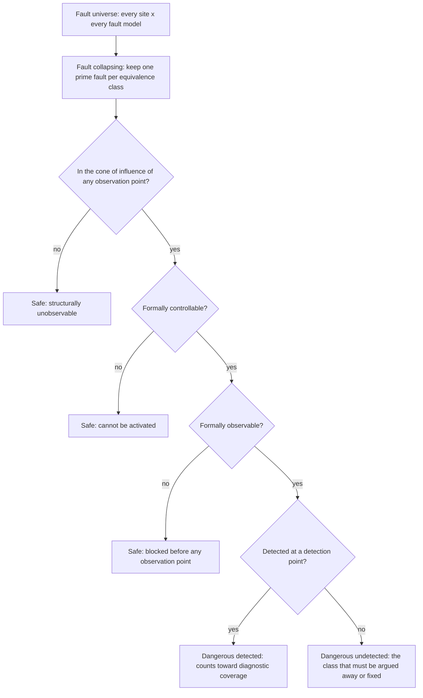

# 22. Safety Verification

Safety verification establishes whether a design detects physical faults, how much of their effects it detects, and what evidence supports that result.

In this example, eleven weeks before the flagship-A's tape-out, conventional evidence is complete: a verification plan with every row discharged, a coverage database at closure, a passing regression, and a bug curve that flattened a month ago. The functional-safety audit additionally requires the evidence requested by an assessor from the customer's safety organization.

The architecture specifies single-error-correcting, double-error-detecting protection for the tightly-coupled memory, with double-bit errors reported to the safety island inside the fault-tolerant time interval. The audit requires the faults injected into that path, those the mechanism missed, and the rationale for excluding faults from injection.

The team lacks this evidence because it was never requested. The environment has never corrupted a memory bit on purpose; the error-correcting code was verified like every other block, by checking that correct data goes in and correct data comes out. That establishes functional correctness, while the audit requires evidence of silicon-fault detection and its extent.

Safety verification changes what must be built and measured, which evidence must be retained, and especially the final written argument, which must remain usable after its authors leave.

### Chapter map

§22.1 covers the additional obligations imposed by safety standards. §22.2 distinguishes systematic faults, the subject of the rest of this book, from random hardware faults. §22.2 then connects failure modes and effects to safety mechanisms and required diagnostic coverage. §22.3 covers fault injection, justified fault-list pruning, and the distinction between undetected and non-dangerous faults. §22.4 covers mechanism verification, including the obligation not to fire spuriously; §22.5 covers tool qualification and audit evidence.

## 22.1 Obligations imposed by safety standards

In 2024, 44 percent of IC/ASIC projects reported working to at least one safety-critical development standard or guideline, and among projects that do, the median spends between a quarter and half of total project time on functional-safety activities [cit:R2]. On FPGA projects the adoption figure is higher still, 63 percent in the same year [cit:R1].

ISO 26262 dominates automotive functional safety and defines it as the absence of unreasonable risk from hazards caused by malfunctioning behavior of electrical and electronic systems [cit:D2]. That definition, and the rest of the vocabulary this chapter uses, belongs to Part 1 of the series: ISO 26262-1:2018, *Road vehicles — Functional safety — Part 1: Vocabulary*. The corresponding regime for airborne electronic hardware, DO-254 (RTCA, Inc., *Design Assurance Guidance for Airborne Electronic Hardware*, published by EUROCAE as ED-80), appears in the same 2024 survey among the standards teams comply with [cit:R2]. The concrete examples here are automotive; the obligations below apply equally to both regimes.

**Process obligations.** The standard prescribes how work is organized, not only what is produced: activities have prescribed inputs and outputs, reviews have prescribed independence, and changes have prescribed impact analysis. Deleting an obsolete test, changing a coverage model's scope or upgrading a tool changes a controlled work product and requires a record of the decision maker and rationale.

**Evidence obligations.** Every claim requires an inspectable artifact: a passing regression becomes evidence only when its state is retained with the design revision, tool configuration and raw results, so later review can establish what ran and what it returned.

**Traceability obligations.** Every safety requirement is linked forward to the thing that discharges it, and every test back to the requirement that justifies it. Chapter 5 requires permanent IDs linking specification, feature, test and result. Safety makes this traceability mandatory, including the backward link from each test to its requirement. A test that traces to no requirement is wasteful and leaves an unexplained artifact in a controlled repository, which an assessor will ask about.

**The argument becomes a deliverable.** On an ordinary project, the rationale connecting evidence to the shipping decision can remain with the sign-off participants and be lost when they leave. On a safety project, that reasoning is written into a safety case for review and delivery; the evidence supports its claims, and its gaps require explicit arguments. Verification engineers produce results that serve as the premises of somebody else's safety argument, and must be able to show that each premise supports what the argument needs it to say.

Among the biggest functional-safety challenges reported by 2024 IC/ASIC participants, safety architecture and design and safety requirement definition, management and traceability lead, ahead of fault list generation and injection [cit:R2].

### Allocation of integrity targets

An **ASIL** (automotive safety integrity level, A through D, with D most demanding) applies to a hazard rather than a block. It is arrived at by assessing the risk of a potential *hazard*, weighing three judgments: how severe the harm would be, how often the vehicle is exposed to the situation, and how well a driver could control the outcome [cit:D12]. A headlamp that fails on a lit motorway and one that fails on an unlit country road are the same electronics and different hazards [cit:D2].

The integrity level passes down from the hazard to the safety goal, then to system requirements, requirements on the part and requirements on the block; it reaches the block engineer as a number in a requirements document. The block engineer inherits that target and the mechanisms chosen to meet it.

> **Scenario.** The reference SoC has no error-correcting code anywhere. Its fast, four-banked 512 KB tightly-coupled SRAM has no protection: a particle strike that flips a weight-buffer bit produces a wrong answer without an error indication. That was a defensible choice for a low-power edge part whose worst failure is a wrong inference.
> **Approach.** For an automotive application, the architecture becomes a derivative, the flagship-A, rather than adding detection to the first-generation part: SECDED protects the tightly-coupled memory, L2 slices and LPDDR path, alongside a dual-core delayed-lockstep safety island and monitored reset and clock.
> **Why.** Detection belongs in the architecture; verification cannot add it. No fault campaign can improve the reference SoC's diagnostic coverage because it has no mechanism whose coverage could be measured. This first judgment call precedes verification: if failure analysis says a failure mode needs covering and no mechanism covers it, the finding concerns the design, and raising it later makes it more expensive to address.

The flagship-A's safety island is built to ASIL D within an ASIL B system. Mixing integrity levels inside one design is ASIL decomposition, the subject of ISO 26262-9:2018, *Road vehicles — Functional safety — Part 9: Automotive safety integrity level (ASIL)-oriented and safety-oriented analyses*. Different parts of one chip carry different targets, and the boundary between them must itself be verified: a fault in the ASIL B region must not defeat the ASIL D region's mechanisms. This requirement explains the safety island's separation. One published account documents an ASIL-rated custom automotive microcontroller core at Infineon (60 instructions, 1.8K flip-flops, 70K gates), verified across 16 versions over 5 years of feature updates, architecture upgrades and bug fixes, and shipping in products as different as a 3D camera, an airbag and a pressure monitor [cit:D24]. An ASIL-rated core can be small; its obligations, rather than its gate count, make verification demanding.

## 22.2 Failure analysis as a verification input

A **systematic fault** is a design bug: a mistake made during development, present in every part ever manufactured, and always permanent. A **random hardware fault** is a physical defect arising during manufacturing or operation, permanent or transient: a latch-up, a marginal via, an aging transistor or a particle strike [cit:D32].

Almost everything in Chapters 1 through 21 is aimed at systematic faults. Constrained-random stimulus, formal proof, coverage closure, regression engineering, gate-level simulation, post-silicon bring-up: all of it exists to find design bugs before they ship. A safety standard demands that work too, with additional process, but also addresses physical faults: a design can be perfectly correct and still cause a fatal failure when a particle flips a bit in its configuration register.

Random faults cannot be verified away: physical defects occur at some rate regardless of verification. Safety verification measures how effectively a mechanism detects and safely handles that defect population.

### FMEDA as the campaign input

A failure mode, effects and diagnostic analysis (**FMEDA**) produces the verification work list. The part of the series that carries the hardware metrics an FMEDA feeds is ISO 26262-5:2018, *Road vehicles — Functional safety — Part 5: Product development at the hardware level*, and the semiconductor-specific guidance on applying the series to an integrated circuit is ISO 26262-11:2018, *Road vehicles — Functional safety — Part 11: Guidelines on application of ISO 26262 to semiconductors*, which is new in 2018. The FMEDA works element by element, asking for each how it can fail, what the consequence would be, how likely and severe that consequence is, and which safety mechanism handles it [cit:D32]. A typical answer names a mechanism from a small, stable family: error-correcting code on a memory, a dual-core lockstep pair (two hardware cores running the same instruction stream, watched by a comparator), a software test library, or a triply redundant structure with a majority voter.

First, **the FMEDA precedes verification evidence.** A safety engineer produces it early, from design data and technology data, with an estimated diagnostic coverage for each mechanism: the fraction of that failure mode's faults the mechanism is claimed to catch. Fault injection is what converts that estimate into a measurement [cit:D32]. If measured coverage falls below the estimate, the architecture's metrics (ISO 26262-5:2018) change; if they change far enough, the part misses its target. A late fault campaign can therefore be the last chance to discover an optimistic architectural assumption.

Second, **FMEDA failure-mode granularity determines the fault list.** A failure mode written as "the FIFO indicates its flags incorrectly, so data is overwritten or lost, and the mechanism is redundant flag logic" specifies exactly where to inject and which signal is the alarm [cit:D32]. One written as "the block malfunctions" identifies neither and cannot be measured. Granularity should be challenged early, while changes are cheap, rather than leaving revision to the last four weeks.

### Required fault classes

Fault campaigns exist to sort a design's faults into classes the standard recognises (ISO 26262-5:2018, with the defined terms themselves in ISO 26262-1:2018). These names have technical meanings that differ from ordinary English [cit:D2]:

- A **safe fault** cannot violate the safety goal because it cannot affect safety-related logic at all or its effect is tolerated.
- A **single-point fault** violates the safety goal and no safety mechanism is present to catch it. This is the class that must be nearly empty.
- A **residual fault** violates the safety goal in a place where a mechanism *is* present, but this particular fault is outside what the mechanism covers.
- A **latent fault** cannot violate the safety goal on its own, and is neither detected by a mechanism nor perceived [cit:D32]. It remains latent until a second fault combines with it. For example, a dead lockstep comparator causes no problem until the two cores disagree and the mismatch goes undetected.
- A **multi-point fault** is a combination that violates the safety goal, and is classified by whether the mechanism detects it, whether it is merely perceived, or whether it stays latent [cit:D32].

These classes feed the architectural metrics: the **single-point fault metric** (SPFM), the **latent fault metric** (LFM), and the probabilistic metric for random hardware failures (PMHF). Each carries a threshold per integrity level, tabulated in ISO 26262-5. The values reported for ASIL D are SPFM at or above 99 percent, LFM at or above 90 percent, and PMHF below 10 FIT; for ASIL C, 97 and 80 percent; for ASIL B, 90 and 60 percent, with PMHF below 100 FIT at both of those levels [cit:D12]; these figures come from that paper, not the standard, which is outside this book's corpus. The standard also specifies the formulas behind those metrics: structural analysis and formal proof establish the fraction of safe faults, while fault injection measures the diagnostic coverage terms that determine whether the metric meets its target [cit:D32].

### Fault counts and failure-rate weights

A campaign counts faults: it injects a number of them and reports how many were detected. Dividing the detected count by the injected count is tempting, but the quotient must be applied to the failure-rate weights before it contributes to the architectural metric.

Architectural metrics are ratios of **failure rates**, rather than fault counts. Each failure mode of each design element carries a base failure rate computed from design data and technology data; the metric formulas combine those rates through the safe, residual and multi-point fractions into a single number for the element and then for the part [cit:D32]. The campaign's detected fraction is an input applied to a weighted quantity; it is not itself that quantity.

Two campaigns with identical fault counts can produce different metrics: a fault list that oversamples a large but low-rate structure while undersampling a small critical one creates a bias that no coverage report shows. The fault list should be agreed with the safety engineer per failure mode, with results kept separate by mode through reporting. A single aggregate percentage across a whole block cannot be composed with anything.

> **Scenario.** The brake controller MCU is small enough to enumerate fully: a lockstep core pair, its ECC-protected memories, a watchdog, and a safety island holding the comparator and the alarm aggregation. Its FMEDA fits in one spreadsheet, and every failure mode maps to a mechanism a verification engineer can name.
> **Approach.** The verification lead walks the FMEDA row by row with the safety engineer *before* writing any injection infrastructure, and produces one artifact per row: where faults are injected, which signal is the observation point (where a violation of the safety goal becomes visible), and which signal is the detection point (where the mechanism raises its alarm).
> **Why.** In this example, that review takes two days and removes almost all late surprises. On the flagship-A, the same review spans multiple weeks and a dozen sub-teams, motivating a full-time safety architect to keep the FMEDA and campaign definition aligned. In these examples, the technique remains the same as the review expands from the brake controller MCU to the flagship-A; coordination increases because the larger review involves multiple sub-teams.

## 22.3 Fault injection and fault simulation

A workload runs on a second design copy containing one hypothetical fault, the *faulty machine*, and on the unmodified *good machine*. At designated strobe times, designated signals are compared; a difference between the two runs means the fault reached that signal [cit:D32].

Two kinds of designated signal have distinct roles:

- **Observation points** are where the failure becomes visible to the outside world: the data output that would now be wrong. A fault seen here is *observed*.
- **Detection points** are where the safety mechanism raises its alarm: the error flag, the comparator mismatch, the interrupt to the safety island. A fault seen here is *detected*.

In the published ECC campaign this chapter draws on, the observation point is the read-data port and the detection points are the single-error, multi-error and any-error signals on the block's boundary [cit:D12]. These choices define the measurement.

**Error injection**, introduced in Chapter 2 and used in Chapters 3, 8 and 10, drives erroneous *stimulus* at an interface to check that the design detects and recovers. **Fault injection** corrupts internal design state, such as a net or flip-flop, to model a physical defect no interface can produce. The two share infrastructure and answer different questions, and a safety assessor means only the second.

### Four fault outcomes

The two axes yield four verdicts. A fault neither observed nor detected did nothing visible in this run. A fault observed and detected is one the mechanism caught: it corrupted something, and the alarm went off. A fault detected but not observed triggered an alarm without corruption; it is noisy but not dangerous. And a fault **observed but not detected** corrupted the design's output while the mechanism stayed silent [cit:D12]. This dangerous class is the campaign's target.

**A fault that is not detected is not the same as a fault that is not dangerous.** A fault never observed in a campaign has two possible explanations that its results cannot distinguish: either it is safe and cannot affect the safety goal under any stimulus, or it is dangerous and the workload failed to excite it [cit:D32]. Both produce an identical database row marked "not observed".

Classifying every unexcited fault as safe can inflate the reported metrics arbitrarily; an assessor requires an argument for that classification.

The two forms of evidence answer different questions:

- **Structural and formal arguments answer "under any stimulus".** A fault outside the cone of influence of every observation point cannot reach an observation point under any workload whatsoever; this is a statically established property of the netlist, and it scales from block to system [cit:D12]. Likewise, a fault that a proof engine shows can never cause a difference at the observation point is untestable by construction, not merely unstimulated [cit:D32]. These faults are safe and may be excluded.
- **Simulation answers "under this stimulus".** A workload that fails to excite a fault provides no evidence about its safety; the fault must be resolved through better stimulus, proof or a recorded engineering judgment with a named owner.

Pruning is defensible when these two forms of evidence remain distinct, and indefensible when they are conflated.

### Fault-list size and justified reduction

Every net, port and sequential element is a fault site with at least two permanent models (held at zero and held at one), plus transient models. Permanent defects are conventionally injected as stuck-at faults, transient upsets as a single event upset: a bit flipped once and then left to propagate or die [cit:D2]. On a large block the raw count runs to millions.

The reduction sequence is standard, and each step answers a specific question ({ref: fault_pruning}):



{figure: fault_pruning} The reduction sequence that takes a fault list from every site crossed with every fault model down to the faults a campaign actually simulates: collapsing, then structural pruning, then formal controllability and observability analysis. Each diamond is a question whose answer holds under any stimulus, and the order is deliberate — cheap arguments first, so the expensive engine only sees what the cheap ones could not settle.

**Collapsing** first sorts faults into equivalence classes, a *prime* fault represents each class, a *collapsed* fault is one producing the same observable behavior as its prime, and only primes are simulated [cit:D32]. **Structural pruning** follows, removing faults outside the cone of influence, and then formal controllability and observability analysis removes faults that cannot be activated or cannot propagate. The faults left after these reductions are then simulated.

A design with faults at ports, flip-flops and wires starts from 3,606 faults; collapsing removes 973 and testability analysis another 144, leaving 2,489 to analyse. Structural cone-of-influence analysis marks 763 of those unobservable, leaving 1,726. Formal observability analysis then clears a further 248 (232 in one phase and 16 in a second), leaving 1,478 faults that reach the read-data port [cit:D12].

The reduction from 3,606 to 1,478 rests on explicit arguments. A collapsed fault is dropped because an equivalent prime fault stays in the list to represent it; every other fault is dropped by an argument that holds under any stimulus whatsoever. The order reduces cost by applying cheap arguments first, so the expensive engine sees only what the cheaper methods could not settle.

### Analysis of the campaign plateau

Simulation-based campaigns follow a characteristic curve. Progress is close to linear at first, then flattens, and eventually additional runs classify almost nothing. The remaining unobserved faults require analysis and cannot be assumed safe. Manual review must establish, for every unobserved fault, that design structure rather than an incomplete environment prevented observation; this costs engineer-days to engineer-weeks [cit:D12].

Formal proof answers whether a fault can affect the safety goal under any stimulus, so it can convert a not-observed fault into a proven-safe fault, a classification simulation can never establish. The published campaign classified the whole block formally, although it was only almost small enough for convergence. The 8K memory on its periphery would not converge in twelve hours until the memory was black-boxed with its input ports promoted to observation points, and then abstracted to a pair of back-to-back flip-flops under a constraint fixing the read/write ordering [cit:D12].

Promoting the memory inputs to observation points can only make a fault look more observable than it is; this direction of error makes the abstraction usable, since a fault it calls safe (the safe-fault class of ISO 26262-5:2018) is genuinely safe [cit:D12]. An abstraction that can classify a dangerous fault as safe invalidates the evidence. Chapter 14's discipline on sound abstraction therefore applies to this audited evidence.

The campaign's final classification, over the 1,726 faults that entered detection analysis: 225 neither observed nor detected, 23 detected without being observed, 966 both observed and detected; and 512 observed but not detected, faults that corrupt read data while the ECC error signals stay quiet [cit:D12]. The campaign isolates those 512 dangerous-undetected faults. These results concern an NXP Semiconductors ECC block with single-error correction and double-error detection around an 8K memory [cit:D12]. The 512 belong to that block, and a different memory geometry behind a different mechanism would produce a different number.

> **Scenario.** The radar front-end senses for an automotive safety function through a fixed-point DSP chain: FFT pipelines feeding a constant-false-alarm-rate detector. An initial campaign injects stuck-at faults across the FFT datapath and strobes the raw spectrum at the FFT output, reporting low diagnostic coverage: a great many faults change that output without an alarm.
> **Approach.** A single-bit fault deep in a twiddle-factor multiplier perturbs a bin's magnitude by a fraction of a least-significant bit. The detector's threshold sits far above that perturbation, so the detection list comes out identical: the fault changes the raw spectrum and changes nothing at the interface the safety requirement is written against. The observation point belongs at the safety requirement's interface, the detection list handed to the fusion stage, rather than at the spectrum.
> **Why.** The observation point specifies where a fault violates the safety goal. Setting the observation point at the boundary named by the requirement is correct; moving it outward afterwards to improve disappointing numbers is unjustified pruning. The distinction requires a written rationale, agreed before the campaign runs and countersigned by the safety engineer. A perturbation that hides under the threshold on one frame need not hide on the next, so the margin argument must hold across the operating envelope. The margin is therefore a stimulus obligation, not grounds for a simple exclusion; Chapter 21 covers the radar chain's numerical and mixed-signal behavior, while this chapter covers its safety argument.

### Time is part of the verdict

Timing adds one axis: whether detection meets the required interval. A safety mechanism must detect and react *within a budgeted time interval measured from the moment the fault occurs*, and must be running continually while the device operates; the fault-tolerant time interval and the fault reaction time interval are both things a fault injection campaign exists to establish [cit:D2]. The campaign distinguishes detection in time from late detection, which counts as undetected despite the alarm log.

The simulation cannot stop at the first difference; it has to keep running long enough to see whether the alarm arrives inside the interval, which is why fault simulators expose a separate time budget for what happens after the first divergence [cit:D2]. That budget must follow the FMEDA timing requirement rather than run-time convenience.

## 22.4 Safety mechanisms and their verification

A failure analysis will typically name error-correcting code, a dual-core lockstep pair with a comparator, a software test library, or hardware redundancy with a majority voter [cit:D32]; with watchdogs and built-in self-test run at startup or periodically, this list covers most mechanisms encountered.

**Hardware redundancy** means duplicated or triplicated silicon: two cores computing the same thing, or three register copies voted bit by bit. That is not the sense of Chapter 2, where redundancy is a second engineer's independent reading of the specification. **Lockstep** here means the hardware pair defined above, distinct from Chapter 3's instruction-set simulator stepping with RTL as a reference model.

**A safety mechanism is itself a design with bugs.** It was written by the same people, under the same schedule, from the same specification as the logic it protects. Its inactivity in the nominal case can draw verification attention toward the functional path, while its dependencies on the rest of the design can delay integration. These conditions risk leaving a safety mechanism with the least verification on the part, even though the metrics assume it works.

Each mechanism therefore has three verification obligations.

**Detection when required.** The campaign infrastructure answers the first of the three questions as a by-product.

**Detection within the required interval.** The budgeted interval is part of the requirement: a mechanism that reports a double-bit error long after the corrupted data has been consumed has not provided useful detection.

**Silence during healthy operation.** Absence of spurious alarms is also a verification obligation. False positives are a reliability defect that can be worse than the fault a mechanism guards against if they fire on healthy parts in the field more often than that fault would occur. A spurious trip takes the system directly to a safe state rather than degrading gracefully: in a vehicle, a warning lamp, limp mode or dealership visit. Verification that asks only the first question can miss spurious trips that cause returns from otherwise healthy parts.

The two checks differ in scope. Injecting a fault through a script demonstrates whether the mechanism fires. Proving it stays silent means running the design's *entire legal operating space* with the alarm never asserting, an obligation with no natural stopping point. It is the shape of any must-not-happen requirement (Chapter 5) and is discharged the same way: an always-on assertion in every regression run, plus a demonstration that the assertion can actually fail.

> **Scenario.** The sensor hub is an always-on part: a 32 kHz island and a DSP, fusing accelerometer and gyroscope streams while the system it serves sleeps. Its safety derivative adds a clock monitor comparing the system clock with the always-on reference and alarming if it stops, slows or runs fast, on the theory that a stopped clock is the one failure the rest of the chip cannot report about itself.
> **Approach.** The fault campaign stops, halves and doubles the clock, checking the alarm in each case. Healthy transitions also require verification. The watched domain legitimately changes frequency during a low-power transition, legitimately stops during power-down, and legitimately restarts with a ramp; every one is a healthy event that looks exactly like the failure the monitor exists to catch. The obligation is a cross of every legal power and clock transition against the monitor's alarm, with the alarm asserted as an error.
> **Why.** This cross catches false alarms on working parts whenever they enter a low-power state, a bug especially hard to find late because it cannot reproduce on a bench that never exercises low-power sequences. Chapter 19's power-state work and this cross are the same stimulus written for two purposes, which is a good argument for building it once and sampling it twice.

> **Scenario.** The GPU renders the instrument cluster and its telltales, warning symbols whose absence is itself a hazard. The safety mechanism is frozen-frame detection: logic that watches the display pipeline and raises an alarm if the rendered content stops changing, on the theory that a hung GPU showing a stale frame is indistinguishable, to the driver, from a working one showing good news.
> **Approach.** Stalling the pipeline and checking the alarm readily verifies detection. Verifying silence is harder because a correct instrument cluster is legitimately static most of the time. A parked vehicle with no faults displays an unchanging image for as long as the ignition is on. Simple frame comparison cannot serve this purpose; the renderer must update an injected counter or pattern every frame, providing a known-varying region so that "unchanged" unambiguously describes the pipeline rather than ambiguously describing content.
> **Why.** The alarm condition must be false exactly when the design is healthy; a heuristic merely correlated with health cannot meet this requirement. A heuristic under verification should be referred back to the architect early.

### A worked artifact: the non-firing obligation

The third obligation has this assertion form on the flagship-A's ECC path. The mechanism corrects single-bit errors and flags them for the error counters, and reports double-bit errors to the safety island as a fault. The obligation is that neither flag asserts while nothing is wrong.

<!-- slang: fragment - property p_no_spurious_ecc_alarm and its cover, shown without the checker bound to the ECC wrapper -->

```systemverilog
// In the checker bound to the ECC wrapper on the flagship-A's memory.
// inject_active is the campaign's own control: high only while a fault
// is deliberately present. Every other cycle is a claim about health.
property p_no_spurious_ecc_alarm;
  @(posedge clk) disable iff (!rst_n)
  !inject_active |-> !(ecc_err_single || ecc_err_double);
endproperty
a_no_spurious_ecc_alarm : assert property (p_no_spurious_ecc_alarm);

// The mechanism must also be alive, not merely quiet: a mechanism that
// can no longer fire is a latent fault, and silence is what it looks like.
c_ecc_double_reported : cover property (
  @(posedge clk) disable iff (!rst_n)
  inject_active && ecc_err_double
);
```

The assertion alone cannot establish health: an ECC wrapper whose error outputs never assert because a design bug tied them off or a fault killed the mechanism passes `a_no_spurious_ecc_alarm` on every run of every test indefinitely. A dead mechanism is silent and is a latent fault under the classification above. The cover checks that silence accompanies a working mechanism, applying Chapter 8's known-bad-variant argument and Chapter 6's treatment of vacuous passes to the mechanism rather than a checker.

`inject_active` preserves the assertion's use during campaigns. Without that qualifier, the assertion fires on every fault campaign run, prompting the team to disable it during campaigns; it then protects nothing during the runs where the ECC path is most exercised. Gating it on injection control keeps it active in campaign runs whenever no corruption is being injected.

### Verifying a lockstep pair

For two cores and one comparator, injecting a fault into one core and checking for a mismatch is insufficient. A design with a serious defect can pass that test.

What makes a lockstep pair effective is that the two cores fail *independently*. On the flagship-A the pair is delayed: the shadow core runs some cycles behind, so a disturbance hitting both at the same instant hits them at different points in their execution and produces a mismatch instead of two identical wrong answers. That delay, and the separation behind it, is the mechanism. Verification must establish whether the delay pipeline preserves comparison across every stall, flush and interrupt; whether the two cores share any resource, such as a clock buffer, reset synchronizer, power rail or memory port, whose single failure would corrupt both identically; and whether something else catches the comparator's own failure. The third is the latent-fault question again, and its usual answer is a periodic self-test that provokes a mismatch on purpose and confirms the alarm.

None of that is found by injecting a fault into one core. Dependent failure analysis instead asks what a single physical event could do to both halves at once; verification engineers contribute to this separate discipline rather than owning it. They must supply the netlist's actual shared-resource list.

## 22.5 Tool qualification and the evidence trail

A certification body needs the simulator's identity because verification evidence is tool output. Safety-case artifacts, including coverage databases, fault classifications and proof results, come from software that could, in principle, be wrong. If the tool is wrong the evidence is wrong, and the argument built on it is unsound while looking exactly as sound as before.

Tool qualification is the response (ISO 26262-8:2018, *Road vehicles — Functional safety — Part 8: Supporting processes*). Its two questions concern how much damage the tool could do if it malfunctioned, by introducing an error into a safety-related work product or failing to detect one already there, and how likely something else in the flow is to catch that malfunction. Greater potential damage and less independent checking require more supporting evidence, supplied through a vendor qualification package, the project's confirmation testing, or a demonstrated history of use.

**Qualification is scoped** to a tool version, a set of use cases and often a configuration (ISO 26262-8:2018). This scope has three operational consequences.

- **Version pinning becomes a safety obligation.** The exact tool build must be retained with the evidence. Chapter 12's run manifest (seed, design revision, testbench revision, exact tool build, configuration, host) becomes the unit of the evidence trail.
- **A mid-project upgrade requires renewed justification.** A required vendor fix raises the question of which evidence from the old version must be re-established, beyond whether the fix installs. Without advance planning, this obligation may emerge in month nine.
- **Qualification applies only within its use cases.** A simulator qualified for the use case being exercised supports evidence through that qualification; the same simulator driving a flow outside its qualified use case rests on trust in the tool alone.

When qualification is unavailable or too narrow, a second engine should independently check the same property, so a tool error must occur twice and identically to survive.

### Flow qualification

A second, separate question concerns whether the verification environment can find the bugs it claims to seek. Safety assessment asks for evidence of flow robustness: deliberate systematic-fault injection at architecture, system and register-transfer level measures verification completeness through the faults the environment detects [cit:D32].

This is the industrial form of the known-bad variant from Chapter 8: instead of one deliberately broken copy of the design kept in the repository, a systematic population of small mutations, each run against the environment, each classified as detected or not. Undetected mutations identify places where a real bug of the same shape would also have gone unnoticed, pointing to a missing checker or an unsampled signal rather than to a missing test.

Tool qualification asks whether the software can be trusted; flow qualification asks whether the environment can fail. An assessor requires both arguments, and neither substitutes for the other.

### Traceability through the audit

The traceability chain a safety project is asked for runs further in both directions than the one Chapter 5 builds, and it must remain navigable years after everyone has moved on:

vehicle-level hazard → safety goal → safety requirement → the design feature that implements it → the failure modes that feature can exhibit → the safety mechanism that covers them → the plan row that discharges the mechanism's verification → the specific runs that produced the evidence → the archived results → the report that quotes them.

That chain crosses three parts of the series: Part 3, which holds the concept phase and the hazard analysis that assigns the ASIL; ISO 26262-4:2018, *Road vehicles — Functional safety — Part 4: Product development at the system level*; and ISO 26262-5:2018 at the hardware level.

Two traceability links require particular attention. First, failure modes and plan rows can drift after design changes because different people maintain the FMEDA and verification plan in different tools. Second, reports based on summaries can lose their link to archived results when summaries outlive raw data. Each plan row should carry its failure-mode identifier, and every number quoted in a report must be reproducible from a retained manifest.

Here is what a plan row with a certification obligation looks like in this book's five-column format, on the flagship-A's ECC-protected memory ({ref: ecc_plan_rows}):

{table: ecc_plan_rows} Three plan rows, in this book's five-column format, for one safety mechanism on the flagship-A's ECC-protected memory: that the mechanism fires within its budgeted interval, that it raises no alarm on healthy traffic, and that the classification's residue is argued rather than assumed. Three rows because there are three obligations, each of which an assessor will ask to see discharged on its own.

| ID | Feature & attributes | Pass/fail criterion | Method | Closure metric |
|---|---|---|---|---|
| FA-SM04a | SECDED ECC on the flagship-A's tightly-coupled memory detects double-bit errors. FMEDA failure mode `TCDM-FM03`. Attributes: error type {single-bit, double-bit, address decode} × access {read, write} × requester {cluster core, DMA} × concurrent bank activity {idle, contended} | Every injected double-bit error raises `ecc_err_double` to the safety island within the fault reaction time budgeted for `TCDM-FM03` | Fault injection campaign, permanent and transient models, on the gate-level netlist | Fault classification report for `TCDM-FM03` complete: every fault in a class, dangerous-undetected list itemised and dispositioned |
| FA-SM04b | The mechanism raises no alarm on healthy traffic, including low-power entry and exit | `a_no_spurious_ecc_alarm` holds in every run in which injection is inactive | Constrained-random sim (always-on check) + power-aware sim | Check enabled and passing in 100% of regression runs |
| FA-SM04c | The classification's residue is argued, not assumed | Every fault left `not observed` carries either a structural or formal argument that it cannot violate the safety goal, or a named engineering judgment | Formal observability analysis, then review | Zero faults in state `not observed, unargued` at sign-off |

Three rows serve three obligations under Chapter 5's one-row-one-metric rule, which applies at least as strictly to safety: each row must be discharged separately for assessment. The cover directive from the artifact above needs no row of its own: row `FA-SM04a`'s campaign hits it the first time an injected double-bit error is detected, and a campaign in which it is never hit has already failed that row. Row `FA-SM04c` addresses the plateau by requiring an argument for faults left unobserved; it does not promise that every fault is safe, but prohibits silently assuming safety.

Any remaining hole requires Chapter 7's waiver with the same five fields: the hole, reason, risk argument, owner and expiry. Safety changes one aspect of that record: its signatory. The verification lead owns the statement's accuracy; the safety engineer owns residual risk and the decision to accept it.

### Engineering and audit documentation

Engineering work includes fault campaigns, observation-point and detection-point definitions, abstractions enabling formal convergence, verification of every mechanism's false positives, lockstep dependent failure analysis, and arguments separating proven-safe from merely unstimulated faults. This work finds real defects outside ordinary functional verification's remit and requires precise statements of what was measured and against what, a discipline applicable to other verification work.

Audit documentation includes retyping the same information into a third tool because the traceability database cannot import from the plan; review records whose value lies in the signature rather than the review; templates whose inapplicable sections cannot be deleted; and periodic reissue of documents whose content has not changed. These tasks make evidence auditable, meeting a documentation requirement. When repetitive steps have not been automated, engineers carry out that work manually; the automation plan should distinguish these steps from engineering activities such as fault campaigns.

Resentment toward both documentation and fault campaigns can undermine safety work, while treating all documentation as engineering risks burnout. When the schedule slips, the plan should distinguish engineering work that needs protection from documentation that needs automation. Generating traceability artifacts from the plan and run database avoids maintaining them by hand. The funding plan should identify this as a tooling project and avoid postponing it until the second program.

### In practice

**Campaign infrastructure should start before the FMEDA is final.** The schedule should allow weeks to build the injection harness, strobe definitions, good-machine reference run and results database, which barely depend on the faults eventually injected. Waiting for a signed FMEDA risks putting the campaign on the critical path.

**The netlist campaign requires a separate budget.** Fault models describe physical structures, so a gate-level campaign matches failure-rate data, but runs far slower than register-transfer simulation and becomes available late. An early register-transfer campaign should check mechanism logic and architectural assumptions, followed by a netlist campaign for evidence. The budget must therefore cover two campaigns rather than one.

**Workload selection requires agreement.** Diagnostic coverage is measured under a workload. In this example, leaving half the design idle leaves half its faults unobserved, assuming the idle portion contains the corresponding share of fault sites and that the workload does not excite those faults. The workload must activate the mechanisms yet remain short enough for thousands of faulty-machine runs within the compute budget; its written engineering rationale is one of the first items an assessor reads.

**Fault campaigns should remain outside nightly regression.** A fault campaign follows Chapter 12's definition: launched for a stated reason, assigned an owner, producing a written result and then stopping. The nightly suite carries the mechanisms' always-on checks instead.

### Pitfalls

1. **Counting faults where the metric weighs failure rates.** *Symptom:* one aggregate diagnostic-coverage percentage for a whole block, which the safety engineer cannot use. *Cure:* results must be classified and reported per failure mode so the FMEDA can apply base failure rates; architectural metrics must never be computed by dividing fault counts.
2. **Un-excited faults recorded as safe.** *Symptom:* diagnostic coverage that improved sharply in the last two weeks with no change to the design or the workload. *Cure:* a fault is safe only when a structural or formal argument shows it cannot violate the safety goal under any stimulus; everything else is unresolved and needs a name on it.
3. **Verifying only that the mechanism fires.** *Symptom:* a green campaign, and field returns from healthy parts. *Cure:* an always-on assertion that the alarm stays silent outside injection, exercised across every legal power, clock and reset transition, plus a cover proving the alarm can still fire.
4. **A mechanism that has silently died.** *Symptom:* the non-firing assertion passes on every run for a year. *Cure:* every silence assertion requires a cover directive on the alarm's positive case, and the mechanism's self-test must run in the gating tier.
5. **Moving the observation point to improve the number.** *Symptom:* a classification that changed after someone "corrected the strobe list". *Cure:* the observation point must follow the safety requirement, with the safety engineer's countersignature; changing it requires a written rationale.
6. **Tool versions treated as environment rather than evidence.** *Symptom:* the build that produced last quarter's fault report cannot be identified. *Cure:* the run manifest is the evidence unit; the build must be pinned, the manifest archived with results, and upgrades treated as controlled work-product changes.

### Summary

- Safety verification does not replace functional verification; it adds a second target. Design bugs are systematic faults and always permanent; random hardware faults are physical defects arising in manufacturing or operation, permanent or transient, and cannot be verified away; they can only be detected and handled [cit:D32].
- The FMEDA fixes failure modes, injection points, alarms and required diagnostic coverage; it must be reviewed early enough to negotiate granularity.
- The deliverable is fault classification: safe, single-point, residual, latent and multi-point are defined classes with per-level metric thresholds, with SPFM at or above 99 percent and LFM at or above 90 percent for the most demanding level [cit:D12].
- Unobserved faults remain unresolved. Structural and formal arguments answer *under any stimulus* and license exclusion; simulation answers *under this stimulus* and does not by itself justify classifying an unobserved fault as safe. The residue left when the campaign plateaus is analysed, argued or fixed.
- Safety mechanisms risk receiving the least verification even though the metrics assume they work. Verification must establish detection, its timeliness and silence on a healthy design.
- Evidence is tool output, making the tool part of the evidence. Qualification is scoped to a version and a use case, making version pinning a safety obligation and a mid-project upgrade a re-argument.
- Chapter 7's sign-off asks whether evidence justifies shipping; safety makes that reasoning a written deliverable that must withstand review years later by someone absent from sign-off.

### Exercises

**Exercise 22.1 (calculation).** Take the fault-list reduction §22.3 reports for the published campaign. Compute the number of faults the reduction removed in total, and split that total between the faults dropped because an equivalent prime fault stays in the list to represent them and the faults dropped by an argument that holds under any stimulus. State the reason §22.3 gives for applying the reductions in the order it does.

**Exercise 22.2 (calculation).** Take the campaign's final classification in §22.3 together with the count of faults the reduction left reaching the read-data port. Compute which two of the four classes sum to that count, and compute the difference between the classification's own total and it. Name the reduction step whose count that difference matches, and state what §22.3 requires before a fault left unobserved may be classified as safe.

**Exercise 22.3 (judgement).** A campaign report reaches the safety engineer as a single diagnostic-coverage percentage for a whole block, obtained by dividing the faults the mechanism detected by the faults injected. Decide what the FMEDA can do with that percentage, and give the property of the architectural metrics stated in §22.2 that makes it unusable. Name the reporting granularity §22.2 requires instead, and state how two campaigns with identical fault counts can arrive at different metrics.

**Exercise 22.4 (judgement).** Two faults in a campaign's database carry the same row, marked not observed. One of them lies outside the cone of influence of every observation point. The other was never excited by the workload the campaign ran. Decide which of the two may be removed from the fault list, name the property of the evidence that separates them in §22.3's own terms, and name the three dispositions §22.3 leaves open for the fault that stays.

**Exercise 22.5 (artifact).** Read the plan row below, given field by field for the clock monitor on the sensor hub's safety derivative. Name the field left empty and state what §22.5 says the traceability chain loses without it. Name the two obligations of §22.4 that the pass/fail criterion leaves untested, and, for the one §22.4 discharges with a cross, name the stimulus that cross requires.

```text
ID:                    FA-SM07a
Feature & attributes:  The clock monitor on the sensor hub's safety
                       derivative alarms when the watched system
                       clock stops, slows or runs fast.
FMEDA failure mode:
Pass/fail criterion:   The alarm asserts in each of the three
                       injected clock disturbances: stopped,
                       halved, doubled.
Method:                Fault injection campaign on the clock monitor
Closure metric:        Three injected disturbances, three alarms
```

### Further reading

**From the corpus.** [cit:D32] provides an overview of how functional safety verification is structured around ISO 26262: the systematic-versus-random split, the FMEDA process and its columns, the fault classification tree, the metric formulas and their failure-rate weighting, the seven-step fault campaign flow, and on the evidence side, mutation-based qualification of the verification flow itself for Part 8 and 9 assessments. [cit:D12] is the case study this chapter's numbers come from: a formal-assisted fault campaign on a single-error-correcting, double-error-detecting block, with the full reduction chain from the raw fault list to the dangerous-undetected residue, and a candid account of the manual-analysis cost that motivates the approach. [cit:D2] covers the fault-injection side in more detail: permanent and transient fault models, failure and detection strobes, static pruning by cone of influence, the mapping from analysis statuses to the standard's fault classes, and the timing dimension of detection. The industry adoption and effort figures are from the 2024 Wilson Research Group studies [cit:R2,R1]. Chapter 14 covers the abstraction discipline formal fault classification depends on; Chapter 12 covers the run manifest the evidence trail is built from; Chapter 21 takes up the analog and mixed-signal side of the radar chain.

**Not in the corpus.** The standards themselves are the primary references and should be read directly rather than paraphrased: the ISO 26262 series, *Road vehicles — Functional safety*, particularly Part 3 on the concept phase, where the hazard analysis and risk assessment that assigns an ASIL is defined; ISO 26262-5:2018, *Product development at the hardware level*, which carries the architectural metrics and their target values; ISO 26262-8:2018 on supporting processes including tool qualification; ISO 26262-9:2018 on integrity-level-oriented analyses; and ISO 26262-11:2018 on the application of the standard to semiconductors. Those descriptions are of each part's scope; only Part 5's title is quoted. For airborne electronic hardware, RTCA DO-254 / EUROCAE ED-80, *Design Assurance Guidance for Airborne Electronic Hardware*. The IEC 61508 series is the general industrial functional-safety standard from which several domain standards derive, and the one most IC/ASIC projects reported working to in the 2024 survey [cit:R2].
