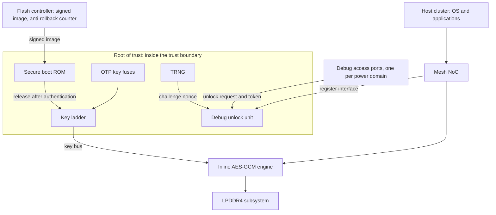

# 23. Security Verification

The flagship's root of trust is signed off twice, and the second review is the one this chapter is about.

The first review is functional, and it goes well. The inline AES-GCM engine on the memory path has a reference model behind it and a scoreboard that has compared ciphertext beat by beat for nine weeks. Every plan row is discharged. Chapter 15's connectivity job has run at every integration build, positive rows and negative ones together, and it proves what the security requirement asked for: no structural path from any key-ladder output to a bus-readable address, to the debug data register, or to a scan-observable point. The bug curve is flat and the fresh-seed yield is near zero. By every instrument Chapter 7 gave the team, this block is done.

The second review is a security review, and it opens with a question the verification plan does not contain: *what would an attacker want from this block, what are they able to do, and where do those two meet?* Within an hour the room has produced obligations with no rows behind them. Nothing in the plan says what the engine's completion latency may and may not depend on. Nothing says what becomes of a working key when the key ladder's domain goes down in the middle of an operation. Nothing says whether the debug port — once opened by the authenticated unlock path that everyone trusts — can reach the key ladder, as opposed to merely not being *wired* to it. And nothing anywhere in the plan names an adversary, which is why none of those questions had a reason to be asked.

None of that is a failure of the functional plan. The functional plan answered its own question completely: the engine does what the specification says it does. The security question is a different question — can the engine be made to do something the specification never mentioned? — and no quantity of the first kind of evidence accumulates into the second.

The gap can be very wide. A published information-flow study took an AES encryption block from a public repository, unmodified and fully functional, encrypting correctly across thousands of test vectors, and checked one rule against it: the key must not flow to the data output. The rule fails. The key, exclusive-ORed with the data, reaches the output pin as plaintext [cit:D28]. Every functional test that block will ever run continues to pass.

### Chapter map

- §23.1 establishes why an adversary, rather than a specification, sets the scope — and why security cannot be closed the way functional coverage is closed.
- §23.2 writes the threat model as a versioned engineering artifact — assets, adversary capabilities, trust boundaries — and turns its rows into checkable claims.
- §23.3 establishes why confidentiality and integrity are properties over *information flow* rather than over values, why formal is the right shape of answer for them, and where that shape stops fitting.
- §23.4 states what an information-flow argument does and does not establish, and why its exception clauses carry the whole weight of the result.
- §23.5 establishes why side channels live below the abstraction RTL verification works at and what pre-silicon evidence can honestly claim about them; §23.6 states how to tell a security property that can be verified from one that can only be argued.

## 23.1 Why an adversary changes everything

Every technique in the preceding twenty-two chapters shares one premise: there is a specification, and the job is to establish that the design implements it. The plan enumerates features from the specification (Chapter 5). The coverage model partitions the specification's input space (Chapter 6). The oracle encodes the specification's expected response (Chapter 3). Even the negative work is specification-derived — a *must-not-happen* feature is a requirement the specification states, and an `illegal_bins` declaration is a rule someone wrote down.

Security verification has no such anchor. The property is not "the design does X"; it is "the design cannot be made to do Y", where Y is chosen by someone who has read the specification, read the datasheet, and possibly read the RTL, and who is looking specifically for the behaviours nobody wrote down. Four consequences follow, and they are structural rather than a matter of degree.

**The properties are negative, and negative properties do not compose from positive evidence.** "This key never reaches that bus" is a claim about the complement of the design's intended behaviour. You cannot establish it by demonstrating intended behaviour, however much of it you demonstrate — which is exactly what the opening AES result shows, and why a block can pass every vector and still fail the one rule that matters. Chapter 3's distinction between the specification's stated behaviour and everything else is usually a footnote about the oracle's projection; here it is the entire subject.

**Rarity stops being a defence.** Risk-driven verification (Chapter 3) allocates effort by likelihood times cost, and likelihood is computed against a stimulus distribution the team controls: a constrained-random generator draws from a distribution, so a scenario needing four improbable conditions at once is genuinely improbable. An adversary is not a distribution. An adversary is an optimiser with a budget, who will spend a month arranging exactly the four conditions your generator would only ever have stumbled into — and who, having arranged them once, can arrange them on demand. The entire argument from unlikeliness, which is load-bearing for functional prioritisation, is void inside the threat model's scope.

**The failure is often functionally silent.** A confidentiality breach need not corrupt any output, and an integrity violation may hold only briefly before something masks it, so detecting one usually means correlating several kinds of evidence rather than watching for a wrong value [cit:P14]. Put that in Chapter 3's vocabulary and it is precise: the bug is *activated* and it *propagates* — propagation to an observable point is not the detection mechanism here, it *is* the failure — but nothing *checks*, because no checker was ever written for a value that was correct.

**Coverage does not close.** There is no enumeration of "everything an attacker might try", so there is no denominator, so there is no percentage. Functional metrics — line, toggle, FSM — correlate only loosely with an attacker's search space, and the field has no settled, tool-friendly definition of security coverage; it is one of the most consistently reported gaps in the area [cit:P14]. This is not a temporary tooling shortfall: it is what happens when the space being covered is defined by an opponent rather than by a document.

### What this costs, stated plainly

A chapter that promised a security-coverage number would be lying, so here is the honest version. Security verification produces evidence for *named* claims against a *named* adversary. It does not produce a completeness argument. The output of the process is a threat model, a set of properties discharged against it, a set of properties *not* discharged with their reasons, and a residual-risk statement someone signs — the same shape as Chapter 7's sign-off, with one difference that matters: the residual is not merely unquantified, it is unquantifiable, because you cannot count what you have not enumerated.

That is uncomfortable, and it is why the discipline leans so hard on structure: if you cannot bound the space, be explicit about which part you looked at, and make each look exhaustive within its scope. Every practice in this chapter follows from that trade.

It also explains why the obvious approaches under-deliver, each in its own way. Architecture review is manual and rarely reaches the implementation as built. Red-team exercises are essential for the finished product and find nothing before silicon exists, and their results are hard to measure. Formal methods belong inside a larger strategy and do not scale to a large design running hardware and software together. Directed tests take substantial effort to write and mostly re-confirm vulnerabilities already known [cit:D28]. None is a bad technique. Each simply has its strength somewhere other than where an adversary's advantage lies, so a plan built on any one alone inherits precisely its blind spot.

### The one thing that transfers

Here is the encouraging part, and the reason to put a verification engineer with no security background on this work. Everything downstream of the threat model is verification: properties, assumptions, stimulus, coverage, waivers, sign-off. Once someone has written "the working key must not be observable at the debug port under adversary capability C3", the question of how to establish that is a question this book has spent twenty-two chapters on. The specialist knowledge is concentrated almost entirely in one artifact.

So write that artifact first, and write it as an engineer.

## 23.2 The threat model as the plan's root

A threat model has three parts, and each is useless without the other two.

**Assets** are the things worth protecting. Asset identification comes first in account after account of the discipline, because it determines what must be protected before threats, properties and tests can be defined at all — and where it is left late, the fixes land in the far more expensive post-silicon stage [cit:P13]. On the flagship the obvious assets are cryptographic: the device root key burned into the OTP fuses, the working keys the ladder derives from it, the entropy the TRNG produces. The non-obvious ones matter more, because they are the ones a functional plan never lists. The boot measurement is an asset. The firewall and address-decode configuration that enforces every other protection is an asset — if an adversary can rewrite the enforcement, no other lock needs breaking. And an asset need not be secret at all: the flash controller's anti-rollback counter is public by design, and everything depends on nobody being able to *decrement* it, so what it needs is an integrity property, not a confidentiality one. Sorting assets by which of the two they need is the fastest way to stop a security plan collapsing into "encrypt more things".

**Adversary capabilities** say what the opponent can do. Write capabilities, not attacks: attacks are an open set and capabilities are an enumerable one, and only an enumerable list can be closed over. Four tiers cover most SoCs, and the flagship's model uses them:

- **C1** — unprivileged software running on the host cluster: it can issue loads and stores, program what it is allowed to program, and time itself.
- **C2** — privileged software on the host cluster: everything in C1, plus configuration of the interconnect, the memory management unit, the power controller and the debug fabric.
- **C3** — physical access to the package pins: probing the debug interface, measuring supply current and electromagnetic emission, perturbing clock and supply.
- **C4** — invasive physical access, up to decapsulation and direct probing of the die.

The flagship declares C4 **out of scope**, and the reason is written down rather than assumed: countering it is a packaging, sensor and countermeasure-design problem whose evidence does not come from RTL verification, and pretending otherwise would put rows in a plan that no pre-silicon activity could ever discharge. An out-of-scope declaration with a reason is engineering. An out-of-scope declaration without one is where the next escape lives.

**Trust boundaries** are the surfaces where the capability tier changes. They are the reason the first two lists become checkable: a property is always "asset A does not cross boundary B under capability C". Modern SoCs make this hard precisely because they stack heterogeneous IP, complex interconnect and several privilege boundaries into one attack surface that is large and awkward to analyse [cit:P13] — which is an argument for drawing the boundaries explicitly, not for hoping they are obvious.



{figure: trust_boundary} The flagship's root of trust, asserting one thing: which blocks sit inside the trust boundary — fuses, key ladder, secure boot ROM, TRNG, debug unlock unit — while everything drawn outside it is reachable, in some mode, by an adversary at C2 or above. The inline AES-GCM engine is outside the box deliberately: it holds key material and sits on a path carrying untrusted traffic, and boxing such a block on one side would tell a lie about it.

The figure asserts one thing: which blocks sit inside the trust boundary. Everything drawn outside it is reachable, in some mode, by an adversary at C2 or above. The inline engine is deliberately outside the box and is the interesting case, because it is the one component that genuinely straddles: it holds key material from the ladder and it sits on a memory path that carries untrusted traffic and terminates in untrusted DRAM. A figure that boxes such a block on one side has already told a lie about it. Roots of trust of this shape are real and public in outline: a published diagram of the Rambus CryptoManager RT-360 shows a RISC-V CPU beside an OTP management core, a key transport core, a TRNG management core, an SRAM interface behind a memory protection unit, and AES, hash and public-key engines on a bus fabric — and the failure classes a security-verification vendor names against it are architectural rather than cryptographic: assets mismanaged during a secure boot, a memory protection unit misconfigured, keys or configuration registers not cleared, debug modes left enabled [cit:D28]. No measurement travels with that list and none is claimed for it here; what it buys is that those surfaces belong to a shipping part rather than to this book's example.

### The rows

The three lists cross into a table, and the table is what the rest of the chapter discharges. Six rows, each naming an asset, a capability, a boundary and its obligation:

{table: threat_model_rows} The flagship's threat model as rows: each crosses one asset with the adversary capability it must withstand and the boundary where that capability meets it, then states the obligation. Read the last column first. Three rows name a single technique, two name a pair, and TM-06 names none — which is the table doing its job rather than a defect in it.

| ID | Asset | Capability | Boundary | Obligation | Discharged by |
|---|---|---|---|---|---|
| TM-01 | Device root key (fuses) | C1 | Root-of-trust register interface | No sequence of register accesses makes fuse content observable outside the ladder | Information flow, RTL (§23.4) |
| TM-02 | Working key | C2 | Memory path through the engine | Key material influences no value on the memory path except through the cipher | Information flow + Chapter 15's negative connectivity rows |
| TM-03 | Working key | C3 | Debug access port into the root-of-trust domain | A debug request addressing the key region is never granted, unlocked or not | Formal, on the always-on control logic (§23.3) |
| TM-04 | Working key | C2 | Power-domain edge of the root of trust | Powering the domain down destroys the key; leaving the unlocked state requests a wipe | Formal + power-aware simulation (Chapter 19) |
| TM-05 | Anti-rollback counter | C2 | Flash controller register interface | No command sequence decreases the counter | Formal, on the counter's control logic |
| TM-06 | Working key | C3 | Engine's physical emissions | No key material is recoverable from the engine's power signature | **Argued, not verified** — see §23.5 |

Read the last column before the others. Three rows name a single technique that produces evidence, two name a pair, and TM-06 names none, because at RTL there is no honest way to discharge it. That row is not a defect in the table; it is the table doing its job. A threat model that contains only rows you know how to close is a threat model that was written backwards from the tools you own.

### It is an artifact, and artifacts go stale

Treat the threat model exactly as Chapter 5 treats the verification plan: a versioned document, under review, with traceability from each row to the evidence that discharges it, and with a named owner. That traceability is not bureaucracy: it is the only mechanism that notices when a design change invalidates a row.

Design changes invalidate rows constantly, and almost never visibly. A performance counter is added and made readable from user mode; a boundary just moved. A new DMA channel is given an address range for convenience; a boundary just moved. During bring-up someone adds the "temporary" multiplexer Chapter 15 warns about, and the negative connectivity row that discharged TM-02 is now false while still showing green in yesterday's report. The discipline that catches these is the same one Chapter 7 applies to waivers: every row carries an owner and an expiry, and the review that re-reads the threat model is scheduled, not spontaneous.

One more scoping habit, learned the hard way by anyone who has reviewed an IP-level security report. A finding at a module boundary is conditional on integration. A published module-scoped study of an accelerator's configuration port makes the point in its own words: it establishes that the module, taken in isolation, applies no local privilege check and therefore depends on trusted integration or upstream filtering, and it explicitly declines to claim that any particular deployment is exploitable — whether the weakness becomes a system-level one depends on integration and on whether an untrusted requester can reach that path at all [cit:P13]. State your findings the same way. "This block does not enforce X" and "this SoC is vulnerable to Y" are different claims with different evidence, and conflating them is how a security report gets ignored by the people who could act on it. That accelerator is one a reader can open: the study takes the `NV_NVDLA_csb_master` IP of NVIDIA's NVDLA at its public `nvdlav1` snapshot, and enumerates the port's assets against named weakness identifiers as the first step of a security plan [cit:P13].

## 23.3 Security properties and how they differ

Two shapes carry most of the load, and both are statements about *flow* rather than about values. Integrity is violated when an unauthorised agent — software or physical — can modify the state of a target register or memory: untrusted sources must not flow to trusted state. Confidentiality is violated when an unauthorised agent can read the state of a target register or memory: secret sources must not flow to observable destinations [cit:D28]. Every row of the threat-model table is one or the other, which is why sorting assets by which they need was worth the effort.

Now compare that with a functional property. Chapter 11's canonical 4 KB-boundary property (Arm IHI 0022H.c §A3.4.1) [cit:S18] is a claim about *values at a point*: given an accepted INCR write address, this arithmetic relation holds. It is decidable by looking at one execution at that point. A confidentiality property is not decidable that way at all. Its natural statement quantifies over *pairs* of executions — change the secret and nothing the adversary can see may change — and a concurrent assertion, by the definition Chapter 11 gave it, evaluates sampled values from one execution. That is a mismatch of shape rather than a limitation you can write around with a cleverer sequence, and it is why information-flow analysis exists as a separate technique rather than as a style of assertion (§23.4).

### Why formal fits, and exactly how far

For everything that *is* expressible as an invariant, formal is the right shape of answer, and the reason is the negative property. "This never happens, by any path" is precisely what a proof engine returns and precisely what no amount of simulation returns. Formal's strength here is exhaustiveness within scope — when a proof succeeds it rules out an entire class of violations for the modelled design under the stated assumptions — and in security work it is used most effectively on localised, precisely stateable things: access-control invariants, privilege-transition correctness, protocol safety [cit:P14]. Three of the six rows name formal for at least part of their evidence, and TM-03 is the purest case.

> **Scenario (the debug unlock path).** TM-03 and TM-04 both concern the working key and both cross a boundary the flagship's own instrumentation creates: post-silicon observability is a designed-in back door to the state beside it — keys, firmware, debug modes — much of it still present on-field, and published system compromises have gone in through exactly those features [cit:P21]. The unlock unit that guards it is a small always-on finite state machine.
> **Approach.** Three assertions and three covers, all reading always-on signals only.
>
> ```systemverilog
> // Root-of-trust debug port: obligations TM-03 and TM-04.
> // All signals below are in the always-on domain.
> a_unlock_needs_token : assert property (@(posedge clk) disable iff (!rst_n)
>                          $rose(dbg_unlock) |-> token_verified);
>
> a_key_region_locked  : assert property (@(posedge clk) disable iff (!rst_n)
>                          (dbg_req && dbg_addr_in_key_region) |-> !dbg_gnt);
>
> a_relock_wipes       : assert property (@(posedge clk) disable iff (!rst_n)
>                          $fell(dbg_unlock) |=> wipe_req);
>
> c_unlock_granted     : cover property (@(posedge clk) disable iff (!rst_n)
>                          $rose(dbg_unlock));
>
> c_key_region_probed  : cover property (@(posedge clk) disable iff (!rst_n)
>                          dbg_req && dbg_addr_in_key_region);
>
> c_relock_seen        : cover property (@(posedge clk) disable iff (!rst_n)
>                          $fell(dbg_unlock));
> ```
>
> **Why.** None of the six looks back more than one cycle or forward more than one, and all of them read a handful of always-on signals, so a proof engine settles them in seconds and the result holds for every arrival time of an unlock request — which is the randomisation no directed test was ever going to supply.

Read those six precisely, because the reading is the lesson.

`a_unlock_needs_token` constrains one cycle: the one on which `dbg_unlock` rises, and only to the extent that `token_verified` was asserted then. It says nothing about *which* token, and nothing about whether the verification that produced that signal is itself sound. This is Chapter 11's reading of `a_no_ct_unauth` transplanted to another asset — an invariant names a state, and provenance is a different invariant over different state — and the obligation to establish the verifier belongs on the verifier, discharged there rather than enjoyed here (Chapter 14).

`a_key_region_locked` deliberately does not mention `dbg_unlock`. Guarding a security property with the very state the adversary is working to reach would make it vacuous exactly where it is needed. Note also which signal it constrains: the *grant*, not the request. The request belongs to the adversary; only the grant belongs to the design, and a property written over an adversary-controlled signal is not a property, it is a wish.

`a_relock_wipes` asserts that a wipe is *requested* one cycle after the unlocked state is left. It does not assert that the wipe completes: it asserts the request, which is all TM-04 asks of it. The row's other half — that a power-down destroys the key outright — is what its second technique, Chapter 19's power-aware test, establishes. That is why the row names two.

The three covers are not optional. An assertion about denial proves nothing on a run that never made the request, an assertion about relocking proves nothing on a run that never relocked, and `c_key_region_probed` demands something a functional environment will not produce: a request no cooperative requester would make. Chapter 9's constraints encode what the interface makes *legal* and what the testbench steers toward, and neither covers traffic whose only purpose is to be refused. An adversary is under no such restraint. Reusing the functional environment unchanged is therefore not a saving; it is a silent deletion of the entire threat model, and it is the most common way a security campaign runs green for a month while checking nothing.

### Where the fit ends

The same reasoning that makes formal ideal for the unlock unit disqualifies it for the block next door, and it is worth being blunt, because enthusiasm runs the other way. Chapter 14 already ran the experiment: the crypto engine's two key-handling properties do not converge, because the key ladder plus the GCM datapath is more state than the engine will take. Nothing about calling them *security* properties changes that. Formal at SoC scale runs into state explosion, heavy abstraction effort, and the difficulty of modelling realistic software and environment assumptions; it is indispensable for targeted reasoning and rarely sufficient on its own for a full system [cit:P14].

So the divergence is between the shape of answer you want and the capacity you have, and it is what routes the rest of the table. TM-03 and TM-05 are small control logic and stay in formal, and so does the first half of TM-04. TM-01 and TM-02 are statements about a datapath's dependence on a secret, so they go to information flow. Anything that only manifests after a firmware stack has booted goes to a platform that can boot one. And TM-06 goes nowhere, for reasons §23.5 owes you.

One rule survives the routing, and it comes out of Chapter 14's crypto-engine scenario. In a functional proof an assumption is a promise about a cooperative neighbour; in a security proof the environment is the adversary, so every assumption is a concession. Make that operational: the assumption list is a column of the threat model, and each entry must name either the capability tier that cannot produce the excluded behaviour, or the property elsewhere that discharges it. An assumption that maps to neither is a hole with a green tick on top.

## 23.4 Information flow and its verification

Information-flow tracking attaches labels to data — secret or public, trusted or untrusted — and follows how those labels propagate through the design, raising a violation when a sensitive value reaches an untrusted sink or an untrusted input influences a control signal [cit:P14]. The label is usually called taint, and the mental model is worth stating exactly: you are not tracking the *value*, you are tracking *dependence*. Anything whose value could differ because the secret differs is tainted, whether it holds a copy of the secret, a function of it, or merely a bit that was set because of it.

A rule in this style has four parts, and writing them out is most of the work:

{table: flow_rule_parts} The four parts of an information-flow rule, with the crypto engine's confidentiality rule written out against each. The fourth part is where the argument lives: without an exception the rule fails immediately and correctly, because a cipher's output depends on its key, and with one the rule is exactly as strong as the exception is narrow.

| Part | What it names | On the crypto engine |
|---|---|---|
| Source set | the asset, as the signals that hold it | every bit of the key ladder's working-key output |
| Sink set | what the adversary can observe | bus-readable registers, the debug data register, the trace fabric's input |
| Activation | when tracking starts | from the cycle a key is loaded, rather than from reset |
| Exception | the flow that is permitted | the cipher core's ciphertext output |

Tools express these differently, and the rule languages are proprietary; the shape is what transfers. The published vocabulary covers the same four ideas — a no-flow relation between a source and a destination, a `when` clause that starts tracking on a condition, a disjunct that excuses the flow while some condition holds, and an *ignoring* clause that declares one destination secure and stops the analysis there [cit:D28].

### The exception clause carries the whole argument

Look again at the fourth row. A confidentiality rule for the engine reads, in words: *the working key must not flow to any output, ignoring the cipher's ciphertext output.* Without the exception the rule fails immediately and correctly — the ciphertext depends on the key; that is what a cipher is. With the exception, the rule becomes checkable and also becomes exactly as strong as the exception is narrow.

This is Chapter 14's over-constraint hazard in security clothing, and it is worse in one specific way. An over-constraining assumption looks like a modelling shortcut, and a reviewer who reads assumption lists will challenge it. An exception clause looks like *domain knowledge* — of course the ciphertext depends on the key — so it reads as competence rather than as a concession, and reviewers wave it through. Widen it by one signal and you have declared a whole port secure. The discipline is the same as for assumptions: every exception is a row, with a written argument for why the flow it permits is safe, and with the same expiry and owner as any waiver (Chapter 7). "The ciphertext output is declassified because the cipher is trusted" is an argument. "We added `busy` to the ignore list because the rule kept failing" is a defect with a comment on it.

### Non-adjacency is not non-leakage

Chapter 15 proved the negative connectivity rows for this exact key ladder — no structural path to a bus-readable address, to the debug data register, or to a scan-observable point — and was explicit that this is a *structural* result: no path exists. Information flow answers the other question, and the difference is the whole reason this section exists. The key bus from the ladder to the cipher core is a path that exists **by design**. Nobody is going to prove it away. The question is whether anything reachable downstream of that path depends on the key other than through the cipher's intended transformation, and no cone-of-influence check can answer it, because the cone is supposed to be there.

That is precisely the failure in the opening AES result. Structurally, key and datapath are adjacent — they must be. Functionally, a value carrying the key survived to the output pin. A team holding a green connectivity report and calling it non-leakage has proved non-adjacency and filed it under the wrong heading.

### The unintended paths are the point

Static analysis builds dependence graphs from the RTL or the netlist and reasons about possible flows without running anything, which makes it a good early screen and an over-approximating one: it reports flows the design will never actually perform. Dynamic tracking propagates labels at runtime, so it sees the paths an execution really took and catches trigger-dependent behaviour, at the cost of instrumentation and runtime. Both meet the same wall, and it is the honest limit of the technique: implicit flows and microarchitectural effects are hard to model accurately, and policy precision cuts both ways — over-approximate and you drown in false positives, prune aggressively and you lose real violations [cit:P14].

Take that trade seriously: it decides whether anybody reads your reports. A screen returning four hundred alerts of which nearly all are benign will be ignored within two weeks, and the instinct — loosen the policy — is the move that starts deleting real findings. Scope by threat-model row instead: one rule per row, so every alert arrives already attached to an asset, a capability and a boundary, and triage becomes "does this flow cross TM-02's boundary?" rather than "is this bad?". The rows also give you somewhere to record a benign flow permanently, which is the only thing that stops the same false positive being re-triaged every release.

> **Scenario (the GPU).** Four shader clusters share a unified memory, and contexts belonging to different applications time-slice it. The asset is one context's data; the sink is anything the next context can read; the boundary is the context switch. **Approach.** State it as a flow rule with an activation condition — track everything written by context A, starting at the switch into A, and require that none of it reaches anything readable after the switch out of A — and pair it with a structural inventory of every piece of state that survives a switch: register-file banks, line buffers, scratchpad, cache ways, the descriptor queues. **Why.** The failure here is never a wire. It is *residue*: state that a functional test cannot see because the next context overwrites it before reading, and that a taint rule sees immediately because it is tracking dependence rather than values. Note also what makes this rule statable at all — the activation condition. Without it the rule is "context A's data never reaches memory", which is false by construction, since writing to memory is the point.

The GPU case also shows where flow coverage sits, and it is not where teams first look. The interesting covers are on the *sources*, not the sinks: did this run ever put a secret in the source register, did it ever switch context with live data resident, did it ever load a key at all. A flow rule evaluated over a run in which no source was ever tainted is Chapter 6's vacuous pass wearing a different hat — the report is green, nothing was tracked, and the difference is invisible unless someone covered the source.

## 23.5 Side channels

This is the strongest example in the book of a property that lives *below* the abstraction you verify at, and the sentence to hold onto is this: an RTL model represents logic values at clock ticks and represents nothing else. It does not model supply current badly, or approximately, or with optimistic assumptions the way it models unknowns. It does not model supply current at all. A property about how much charge the part draws is not *hard* to check on an RTL model; it is not *expressible* on one, and no amount of stimulus, coverage or proof depth changes that.

So the first job is to sort the channels by whether the leaking quantity exists in your model, because the answer decides whether you are doing verification or something else.

**Timing is inside the model, and this is the good news.** A cycle count is a signal-level fact: if the number of cycles between an operation's start and its completion depends on key material, that dependence is present in the RTL and can be reasoned about there. Two shapes handle it. Where the specification says the operation has a fixed latency, the claim is single-execution and mechanical:

```systemverilog
// LAT is the engine's declared operation latency, in cycles.
a_fixed_latency : assert property (@(posedge clk) disable iff (!rst_n)
                    $rose(op_start) |-> ##LAT op_done);

c_op_start      : cover property (@(posedge clk) disable iff (!rst_n)
                    $rose(op_start));
```

Where the latency legitimately varies — with message length, with back-pressure from the memory path — `a_fixed_latency` is false and the claim becomes a flow rule instead: no key bit may flow to the completion signal. Which is to say `op_done` is just another sink for §23.4's machinery — a timing side channel is precisely the case where execution latency depends on secret data or on privileged state [cit:P14], and analysing one is a listed application of information-flow tooling [cit:D28]. The unification is worth pausing on: a timing channel is not a new category of problem, it is a confidentiality property whose sink happens to be a control signal rather than a data bus.

**Power and electromagnetic emission are outside the model, and this is the bad news.** Nothing in the RTL holds them. What pre-silicon work can do is reason over *proxies*: switching activity, performance counters and timing distributions exported from a run and post-processed as stand-ins for power and timing behaviour, which is enough to rank structures by risk and to compare a countermeasure against its absence [cit:P14]. Be precise about what a proxy licenses. Switching activity correlates with dynamic power; it is not power, it carries none of the analogue detail that a measurement carries, and a countermeasure that improves the proxy has been shown to improve the proxy. Ranking and comparison are real value. A leakage *verdict* is not available at this abstraction, and a report that implies one is worse than none, because it retires a question that is not closed.

This is the same structural problem Chapter 21 has with analog behaviour — a property that lives in the continuous world while the model is discrete — and the same resolution applies: model the quantity explicitly at some cost and fidelity, or move the question to a platform where the quantity is physically present. Here the second platform is fabricated silicon with measurement equipment attached, which puts the closing evidence in Chapter 20's territory and on Chapter 20's calendar.

### The capability tier is a design decision

One design choice deserves its own paragraph, because it can invalidate a threat model without touching a single security block. Physical side channels and fault injection are C3 capabilities: nominally they require access to the package. But software-controllable mechanisms for scaling voltage and frequency and for monitoring power consumption are ordinary features of modern chipsets, and they let an attacker mount fault-injection and side-channel attacks without physical access to the device [cit:D2]. The flagship has DVFS with three operating points on the host cluster and the compute island, and something has to select among them. If that selector is reachable from C1 or C2, a whole row's capability tier has quietly changed, and every property justified by "the adversary would need physical access" is now unsupported.

That is a threat-model question, not a crypto question, and it is exactly the kind a verification engineer is placed to ask — not how a power analysis works, but which side of a boundary that selector's enable sits on.

Fault injection is the same asymmetry running in the other direction: the adversary perturbs rather than observes, deliberately inducing conditions — glitched supplies and clocks, faults engineered so that security-critical instructions are skipped — that a functional model would classify as impossible [cit:D2]. The machinery for injecting faults and measuring what survives is Chapter 22's, built there for safety; what security adds is that the fault distribution is chosen by an opponent rather than by physics, so a campaign weighted by natural failure rates is answering a different question. Borrow the tooling, rewrite the weighting.

### What TM-06 gets

Return to the row the table left open: *no key material is recoverable from the engine's power signature*, against a C3 adversary. Its nearest neighbour is closable and it is not, and the pair is worth seeing together. The timing claim — that no key bit reaches `op_done` — is a flow rule with a sink you can point at; the honest move on finding it in review is to open TM-07 for it, not to widen a row governing a different boundary. The power claim has no signal to name at all, so it gets an argument rather than a proof, and an argument has a shape too: a named countermeasure recorded in the design review; a proxy comparison showing the countermeasure moves the proxy in the expected direction, with its own limitations written down; and a post-silicon leakage assessment on the plan with a date and an owner. That is Chapter 7's conditional sign-off, applied honestly: evidence now, named evidence later, and a residual risk that somebody puts their name against. What it is not is a green tick, and the distinction between a row like this one and a row like TM-03 is the single most useful thing a verification engineer can hold clearly in a security review.

## 23.6 Where security verification lives in the flow

The cheapest security work in a project is not verification. It is the hour in architecture definition when someone lists the assets and draws the boundaries, before the interconnect topology is fixed and while an address decode is still a decision rather than a fact. In scheduling terms: an asset nobody names early gets protected late, and the protections still available late are the expensive, awkward ones. The second-cheapest is Chapter 15's integration table with its negative rows in it from the first build, so that a "temporary" multiplexer fails a job the day it lands rather than surviving to tape-out.

After that, each question goes where it can be answered, and {ref: question_routing} sets out which platform that is: forced by the question, not chosen from what the project happens to own.

{table: question_routing} Six security questions, each routed to the platform on which it can be answered, from a proof over a small control block to measurement on a fabricated part. The third column is what keeps this from being a menu: the answers are not interchangeable, an adjacency result and a flow result answer different questions, and the last row's question exists nowhere but in silicon.

| Question | Where it is answered | What the answer is worth |
|---|---|---|
| Does this small control block enforce an invariant? | formal | exhaustive within the scope and the assumptions |
| Is there any structural path from this asset to that sink? | connectivity check (Chapter 15) | cheap, and about adjacency only |
| Can this asset influence that sink at all? | static information flow | an early screen, over-approximating: expect false positives |
| Does it influence it along the paths a real workload takes? | dynamic information flow, in simulation or on an emulator | grounded in execution, silent about paths not taken |
| Does the policy still hold once firmware boots and drivers run? | emulation | realistic and long, with limited visibility |
| Does the fabricated part leak through a physical channel? | silicon and measurement | the only place the question exists |

### What needs a platform that can boot

Some security behaviour has no meaning below the system level. Privilege transitions, the interaction of a DMA engine with a memory protection configuration, a debug unlock sequence driven by real boot firmware, the moment a driver hands a buffer across a boundary — these need a running software stack, interrupts and peripheral concurrency, and they need executions long enough to reach them, which is exactly what emulation supplies and simulation does not [cit:P14].

The most useful pattern joining this section to §23.3 is property-guided monitor generation. Prove the property formally where it is tractable — a small subsystem, an access-control invariant — then translate the same property into a synthesisable checker and run it on the emulator under full firmware workloads, so that a proof of the rule and a search for the sequences that stress it are the same statement checked two ways [cit:P14]. `a_key_region_locked` is a candidate: proved on the unlock unit in seconds, and worth carrying into a boot campaign because what a proof cannot tell you is whether real firmware ever puts the system into the state the property protects.

Now the constraint, stated where the recommendation is made. Emulator capacity is normally reserved for tape-out-critical functional regressions, and security workloads are not usually first-class citizens in flows built for coverage closure, so campaigns get scoped down to a few high-risk blocks or pushed to a later stage [cit:P14]. Plan accordingly: a security campaign is a **campaign** in Chapter 12's exact sense — launched for a stated reason, owned by someone, producing a written result, then stopping — and it must compete for slots explicitly, with a named block list and a named window. A security activity described as ongoing background work will lose every scheduling argument it is never present for.

One further caution comes with the platform. Security monitors and adversarial harnesses often have to be re-engineered to fit an emulator's timing and capacity, which leaves the simulation and emulation environments genuinely different and makes a failure seen on one hard to reproduce on the other [cit:P14].

### Adversarial stimulus, and where it actually pays

Stimulus that asks "can an adversary drive this design into an unsafe state?" rather than "is this design functionally correct?" is a different generation problem, and its value depends almost entirely on three things: the quality of the generated sequences, the security oracles that decide what counts as a violation, and whether an interesting failure can be reproduced and triaged at all [cit:P14]. In practice the third is the one teams under-budget, and a finding nobody can reproduce is not a finding.

It also pays very unevenly across IPs, and knowing where it pays is the practical skill.

> **Scenario (the video codec).** A decoder is the purest attack surface on the SoC: its input is a bitstream that arrives from the network or from a file, so it is attacker-supplied by construction, and its control flow is data-dependent by design — that is what a variable-length entropy-coded format *is*. **Approach.** Two changes to the block's existing environment. First, replace the oracle. Chapter 3's definitional oracle — the standard's bit-exact reference decoder — is worth nothing here, because on a malformed stream the reference has no defined output to compare against; the oracle for hostile input is a set of invariants that must hold whatever arrives: every line-buffer and DDR write stays inside its allocated region, the decoder makes forward progress or raises an error within a bounded number of cycles, and no malformed stream reaches a state only a firmware reset can leave. Second, generate the input by mutating well-formed streams rather than by constraining a transaction class. **Why.** Mutation-based generation earns its keep here precisely because the input is a structured byte stream that a mutation leaves *almost* legal — which is the interesting region. Apply the same technique to a bus interface and most mutations produce traffic the protocol forbids outright, which the interface will reject and which tells you nothing.

### Telling a verifiable property from an arguable one

The test is short enough to apply in a review. **Can you name the signals?** A verifiable security property can be written down entirely as signals in a model you own — a source set, a sink set, an activation condition and an exception if it is a flow rule; an antecedent and a consequent if it is an invariant. TM-03 passes on the second form: `dbg_req`, `dbg_addr_in_key_region`, `dbg_gnt`. The timing claim §23.5 sets beside it passes on the first: `op_start` and `op_done` are signals, and "no key bit reaches the second" is an ordinary flow rule. TM-06 fails where that neighbour passes, because its subject is a physical quantity with no representation in the model: no signal list exists, and nothing will ever settle it. Between those poles sit the properties whose signals exist but whose exception is doing suspicious work — and that is where a reviewer should spend the meeting.

Which is also the answer to the question this chapter opened with, about what someone without a security background contributes. Not attacks, and not cryptography. Three questions asked persistently: *who can write this register?*, *what happens to this state across this transition?*, and *what exactly does this exception permit?* Every one of those is a question about design behaviour, and none of them requires knowing how a power analysis works. The specialists supply the threat model. Everything after it is the job this book has been describing all along.

### In practice

Security is on almost every project and owned by almost nobody. In 2024, 83 percent of IC/ASIC projects incorporated security features — hardware modules holding encryption keys, content-protection keys, passwords, biometric references — and those features add new requirements and complexity to the verification process [cit:R2]. Having the feature and having verified it against an adversary are separated, on most projects, by an unstaffed gap.

The failure mode is chronological. A threat model that arrives after RTL freeze does not produce plan rows; it produces findings, and a finding against frozen RTL is a waiver argument with a deadline attached. Teams that get this right treat the threat model as a month-one deliverable with the same standing as the verification plan, precisely so that its rows can still change a design.

Two further frictions are worth expecting. Information-flow tooling is specialist, its rule languages are proprietary, licences are scarce, and the knowledge concentrates in one or two people whose departure resets the capability — so write the *rules* against threat-model rows, in a form a successor can read, not as tool artifacts. And security bugs do not fit the severity ladder. Chapter 20's asymmetry is the reason: once a defect of this kind is known outside the company, the time available to mitigate collapses, because it can be exploited rather than merely encountered. Most teams end up with a parallel classification and a separate, access-controlled tracker, which is inconvenient, occasionally absurd, and correct.

### Pitfalls

1. **Reusing the functional environment unchanged.** *Symptom:* the security regression is green from the first night and stays green. *Cure:* an adversary is bound neither by the protocol nor by what the testbench chooses to generate; the environment must be able to emit the forbidden request, and Chapter 11's rule applies here in full — every implication ships with a cover on its antecedent, the positive obligations as much as the denials.
2. **Reading a connectivity result as non-leakage.** *Symptom:* "we proved the key cannot reach the bus", on the strength of a no-connection job. *Cure:* that result is about adjacency; the flow question concerns paths that exist by design, and those are the paths the key actually uses.
3. **An exception clause that grew.** *Symptom:* the ignore list has six entries and no comments. *Cure:* one written argument per exception, with an owner and an expiry, reviewed exactly like a waiver — a widened exception is indistinguishable from a passing property.
4. **A threat model written backwards from the tools.** *Symptom:* every row closes. *Cure:* suspect it immediately; a model scoped to the evidence you already know how to produce has hidden its residual risk rather than retired it, and the row you cannot close is the one that most needs a named plan.
5. **A security assumption enjoyed rather than discharged.** *Symptom:* a proof converges after an `assume` that the boot sequence is followed. *Cure:* every assumption names the capability tier that cannot produce the excluded behaviour, or the property elsewhere that establishes it.
6. **Reporting a module-scope finding as a system claim.** *Symptom:* "this accelerator is vulnerable." *Cure:* state reachability and integration explicitly; a block enforcing nothing locally may be perfectly safe behind a filter, or may not be, and that difference is evidence somebody has to produce.

### Summary

- Security verification is scoped by a **threat model** — assets, adversary capabilities, trust boundaries — not by a specification. Without one, "is it secure?" is unanswerable; with one, it becomes a list of checkable claims and a list of honest gaps.
- The properties are negative and the failures are often functionally silent: the design computes the right answer and leaks anyway [cit:P14]. No quantity of functional pass evidence accumulates into a security result.
- There is no security-coverage percentage, and there will not be one soon. The deliverable is named claims, named gaps, and a residual risk somebody signs.
- Rarity is not a defence inside the threat model's scope. A constrained-random generator is a distribution; an adversary is an optimiser who will arrange your improbable conjunction deliberately and then repeat it.
- A no-connection result proves **non-adjacency**. Only an information-flow argument speaks to the paths that exist by design — and its **exception clauses** carry the whole weight of the result, which is why each one needs a written argument.
- Formal is the right shape of answer for a negative property and runs out of capacity exactly where assets are densest. Route small control logic to proofs, datapath dependence to information flow, and firmware-dependent rows to a platform that can boot one.
- Side channels sort by whether the leaking quantity exists in your model. Timing does, so it is a sink like any other; power and emission do not, so pre-silicon work yields ranking and comparison of countermeasures — never a leakage verdict.

### Further reading

**From the corpus.** [cit:P14] is the anchor for this chapter and the fullest recent survey of the area as a *workflow*: the technique taxonomy and its bottlenecks, static versus dynamic information-flow tracking, the campaign-driver and observability dimensions, the coverage gap, the emulator-contention and environment-divergence problems, and formal-assisted monitor generation. Note that it uses "validation" as an umbrella term where this book says verification. [cit:P13] organises the same territory by workflow stage — asset identification, threat modelling, test-plan generation, simulation and formal artifacts, countermeasures — and its worked module-scoped analysis is a model of how to state a finding without overclaiming it. [cit:D28] is the clearest short statement of confidentiality and integrity as flow relations, with the rule shapes including the exception clause, and it is the source of this chapter's opening result. [cit:D2] extends fault campaigns into adversarial territory and supplies the weakness taxonomy for glitching, instruction skips and software-reachable voltage and frequency control. [cit:P21] explains why design-for-debug is itself an attack surface and why security defects are dispositioned differently from functional ones. [cit:R2] gives the 2024 adoption figure.

**Outside the corpus.** MITRE's Common Weakness Enumeration, and in particular its hardware design view, is the standard vocabulary for naming a weakness class, and a threat-model row that cites a CWE identifier is easier for a security reviewer to check than one that does not. For the artifact this chapter says to write first, Accellera's *Security Annotation for Electronic Design Integration* (SA-EDI) standard and the IEEE P3164 working group's *Asset Identification for Electronic Design IP* supply a principled vocabulary for assets. For the channel this chapter can only rank: P. Kocher, J. Jaffe and B. Jun, "Differential Power Analysis" (CRYPTO '99), and S. Mangard, E. Oswald and T. Popp, *Power Analysis Attacks* (Springer, 2007), with G. Goodwill et al., "A testing methodology for side-channel resistance validation" (NIST, 2011) for the measurement side. Finally, the OpenTitan project publishes an open-source root of trust together with its security specifications; reading a real one end to end is the fastest way to see what a reviewed threat model looks like.
