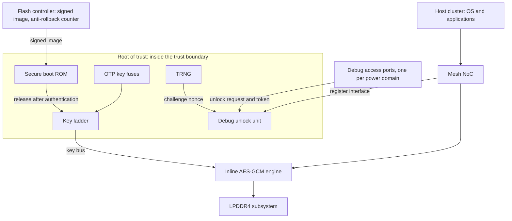

# 23. Security Verification

Security verification establishes claims against a named adversary, beyond functional conformance to a specification. The flagship SoC's root of trust is signed off twice through functional and security reviews.

The first, functional review passes. The inline AES-GCM engine on the memory path has behind it a reference model, an independent executable of the specification taken as golden and driven by the same stimulus. It also has a scoreboard, the structure that holds the value expected at each output and is consulted when that output is observed. The scoreboard has compared ciphertext beat by beat for nine weeks; a beat is a single data transfer inside an AXI burst. Every plan row is discharged; a plan row is the line of the verification plan that carries one feature, its pass/fail criterion, its method and the evidence that closes it. Chapter 15's connectivity job has run at every integration build, with both positive and negative connectivity rows. That job proves the security requirement: no structural path from any key-ladder output to a bus-readable address, to the debug data register, or to a scan-observable point. A connectivity job means checking each row of an integration table to decide whether a structural path runs from a named source to a named destination. The bug curve is flat and the fresh-seed yield is near zero: bug discoveries plotted over time have leveled off, and new random seeds are no longer finding bugs. The block meets every completion criterion from Chapter 7.

The second, security review asks what an attacker wants, what they can do, and where those two meet; the verification plan omits these questions. In this example, the review identifies unplanned obligations within an hour. Nothing in the plan says what the engine's completion latency may and may not depend on. It also omits what happens to a working key when the key ladder's domain goes down during an operation. The plan also leaves one question unspecified: whether an open debug port can reach the key ladder even though no structural connection joins the two. The trusted authenticated unlock path is what opens that port. The plan names no adversary, so it gave no reason to ask these questions.

The functional plan has not failed: it establishes completely that the engine implements the specification. Security asks whether the engine can be made to do something unspecified; no quantity of functional evidence answers that question.

The gap can be wide even for a fully functional block. A published information-flow study took an AES encryption block from a public repository and checked one rule against it: the key must not flow to the data output. The block was unmodified and fully functional, and it encrypted correctly across thousands of test vectors. The rule fails because the key, exclusive-ORed with the data, reaches the output pin as plaintext [cit:D28]. Functional tests that check only the specified encryption behavior do not check this confidentiality rule.

### Chapter map

§23.1 explains why the adversary sets the scope and prevents closure through functional coverage. §23.2 develops a versioned threat model from assets, adversary capabilities and trust boundaries, turning its rows into checkable claims. §23.3 covers confidentiality and integrity as information-flow properties, the suitability of formal methods and their limits. §23.4 examines information-flow evidence and the effect of its exception clauses. §23.5 distinguishes side channels below RTL abstraction from claims supported by pre-silicon evidence; §23.6 separates verifiable properties from those that can only be argued.

## 23.1 The adversary defines the scope

Every technique in the preceding twenty-two chapters shares one premise: there is a specification, and the job is to establish that the design implements it. The plan enumerates its features (Chapter 5), the coverage model partitions its input space (Chapter 6), and the oracle encodes its expected response (Chapter 3). Even the negative work is specification-derived: a *must-not-happen* feature is a requirement the specification states, and an `illegal_bins` declaration is a rule someone wrote down.

Security verification has no such anchor. Its property is "the design cannot be made to do Y", where an adversary chooses Y after reading the specification, the datasheet and possibly the RTL, specifically seeking unspecified behaviors. These differences have four structural consequences for verification.

**Negative properties require evidence beyond positive behavior.** "This key never reaches that bus" is a claim about the complement of the design's intended behaviour. However much of that behavior is demonstrated, demonstrating intended behavior cannot establish a claim about its complement; this is what the opening AES result shows, and it is why a block can pass every vector and still fail the one confidentiality rule. Chapter 3's distinction between specified behavior and everything else defines this subject; that distinction is usually a footnote about the oracle's projection, the part of correctness that the oracle checks rather than correctness itself.

**Rarity does not reduce adversarial risk.** Risk-driven verification (Chapter 3) allocates effort by likelihood times cost, and likelihood is computed against a stimulus distribution the team controls: a constrained-random generator draws from a distribution, so a scenario needing four improbable conditions at once is improbable. An adversary instead optimizes within a budget: in this example, a month spent arranging exactly the four conditions that the generator would only stumble into is enough to make them repeatable on demand. Thus unlikeliness, central to functional prioritization, provides no defense within the threat model’s scope.

**The failure is often functionally silent.** A confidentiality breach need not corrupt any output, and an integrity violation may hold only briefly before something masks it, so detecting one usually means correlating several kinds of evidence rather than watching for a wrong value [cit:P14]. In Chapter 3's terms, the bug is *activated* and it *propagates* to an observable point, and activation and propagation together constitute the failure rather than its detection; nothing *checks*, because no checker was written for a correct value.

**Coverage does not close.** There is no enumeration of everything an attacker might try, hence no denominator or percentage. Functional metrics (line, toggle, FSM) correlate only loosely with the attacker’s search space; the lack of a settled, tool-friendly security-coverage definition is among the area’s most consistently reported gaps [cit:P14]. This is not a temporary tooling shortfall: it is what happens when the space being covered is defined by an opponent rather than by a document.

### Evidence and residual risk

Security verification produces evidence for *named* claims against a *named* adversary, without a completeness argument. The output has four parts: a threat model, a set of properties discharged against it, a set of properties *not* discharged with their reasons, and a residual-risk statement someone signs. That statement matches Chapter 7's sign-off with one difference: the residual is not merely unquantified, it is unquantifiable, because an unenumerated space cannot be counted.

When the space cannot be bounded, the analysis must be explicit about which part it examines, and each examination must be exhaustive within its stated scope.

Architecture review is manual and rarely reaches the implementation as built. Red-team exercises are essential for the finished product and find nothing before silicon exists, and their results are hard to measure. Formal methods belong inside a larger strategy and do not scale to a large design running hardware and software together. A directed test is a piece of stimulus whose content and order are written out by hand, and it does the same thing on every run. Directed tests take substantial effort to write and mostly re-confirm vulnerabilities already known [cit:D28]. A plan relying on any one of these techniques alone retains that technique's stated limitations.

### Verification after the threat model

Everything downstream of the threat model is verification: properties, assumptions, stimulus, coverage, waivers, sign-off. Once someone has written "the working key must not be observable at the debug port under adversary capability C3", establishing that claim uses the methods developed in the preceding twenty-two chapters.

The threat model should be the first engineering artifact, recording the specialist inputs on assets, adversary capabilities and trust boundaries.

## 23.2 The threat model as the plan's root

A threat model has three interdependent parts.

**Assets** are the things worth protecting. Asset identification comes first in the literature of the discipline, because it fixes what must be protected, and until that is settled no threat, property or test can be defined at all; where it is left late, the fixes land in the far more expensive post-silicon stage [cit:P13]. On the flagship, cryptographic assets include the device root key that is burned into the OTP fuses, the working keys that the ladder derives from it, and the entropy that the TRNG produces. Assets omitted from the functional plan require particular attention. The boot measurement is an asset. The configuration of the firewall and the address decode is a single asset, and what makes it one is that it enforces every other protection: if an adversary can rewrite the enforcement, every other protection can be bypassed. An asset need not be secret: the flash controller's anti-rollback counter is public by design, and its protection depends on no adversary being able to *decrement* it, so it needs an integrity property rather than a confidentiality one. Classifying assets by which of the two they need prevents encryption from becoming the sole security response.

**Adversary capabilities** say what the opponent can do. Only an enumerable set can be covered to completion: capabilities form such a set, whereas attacks form an open set. The model should therefore list capabilities. The flagship's threat model uses four capability tiers:

- **C1**: unprivileged software running on the host cluster: it can issue loads and stores, program what it is allowed to program, and time itself.
- **C2**: privileged software on the host cluster: everything in C1, plus configuration of the interconnect, the memory management unit, the power controller and the debug fabric.
- **C3**: physical access to the package pins: probing the debug interface, measuring supply current and electromagnetic emission, perturbing clock and supply.
- **C4**: invasive physical access, up to decapsulation and direct probing of the die.

The flagship declares C4 **out of scope**, and the reason is written down rather than assumed: countering it is a packaging, sensor and countermeasure-design problem whose evidence does not come from RTL verification, so including it would create plan rows that no pre-silicon activity could ever discharge. An out-of-scope declaration needs a reason, and the reason is what makes the escape risk visible; an escape is a bug that crosses a sign-off boundary undetected, found on the side that was supposed to catch it.

**Trust boundaries** are the surfaces where the capability tier changes. They make the first two lists checkable: a property is always "asset A does not cross boundary B under capability C". Modern SoCs make this hard because they stack heterogeneous IP, complex interconnect and several privilege boundaries into one attack surface that is large and awkward to analyze [cit:P13]; this requires explicit boundaries. {ref: trust_boundary} places the flagship components relative to those boundaries.



{figure: trust_boundary} The flagship's root of trust, asserting one thing: which blocks sit inside the trust boundary — fuses, key ladder, secure boot ROM, TRNG, debug unlock unit — while everything drawn outside it is reachable, in some mode, by an adversary at C2 or above. The inline AES-GCM engine is outside the box deliberately: it holds key material and sits on a path carrying untrusted traffic, and boxing such a block on one side would tell a lie about it.

The inline engine is deliberately outside the box because it is the one component that straddles the boundary: it holds key material from the ladder and it sits on a memory path that carries untrusted traffic and terminates in untrusted DRAM. A published diagram of the Rambus CryptoManager RT-360 shows a RISC-V CPU beside an OTP management core, a key transport core, a TRNG management core, an SRAM interface behind a memory protection unit, and AES, hash and public-key engines on a bus fabric; those are blocks on a diagram, while the failure classes that a security-verification vendor names against that part are architectural rather than cryptographic: assets mismanaged during a secure boot, a memory protection unit misconfigured, keys or configuration registers not cleared, debug modes left enabled [cit:D28]. No measurement travels with that list and none is claimed for it here; what the list establishes is that those surfaces belong to a shipping part rather than to this book's example.

### The rows

The three lists form the table whose obligations the rest of the chapter addresses. The table has six rows, and each of them names an asset, a capability, a boundary and its obligation ({ref: threat_model_rows}):

{table: threat_model_rows} The flagship's threat model as rows: each crosses one asset with the adversary capability it must withstand and the boundary where that capability meets it, then states the obligation. Read the last column first. Three rows name a single technique, two name a pair, and TM-06 names none — which is the table doing its job rather than a defect in it.

| ID | Asset | Capability | Boundary | Obligation | Discharged by |
|---|---|---|---|---|---|
| TM-01 | Device root key (fuses) | C1 | Root-of-trust register interface | No sequence of register accesses makes fuse content observable outside the ladder | Information flow, RTL (§23.4) |
| TM-02 | Working key | C2 | Memory path through the engine | Key material influences no value on the memory path except through the cipher | Information flow + Chapter 15's negative connectivity rows |
| TM-03 | Working key | C3 | Debug access port into the root-of-trust domain | A debug request addressing the key region is never granted, unlocked or not | Formal, on the always-on control logic (§23.3) |
| TM-04 | Working key | C2 | Power-domain edge of the root of trust | Powering the domain down destroys the key; leaving the unlocked state requests a wipe | Formal + power-aware simulation (Chapter 19) |
| TM-05 | Anti-rollback counter | C2 | Flash controller register interface | No command sequence decreases the counter | Formal, on the counter's control logic |
| TM-06 | Working key | C3 | Engine's physical emissions | No key material is recoverable from the engine's power signature | **Argued, not verified** — see §23.5 |

Three rows name a single evidence-producing technique, two name a pair, and TM-06 names none because it cannot be discharged at RTL. Including only closable rows would derive the threat model from available tools.

### Threat-model versioning and review

The threat model should follow Chapter 5’s treatment of the verification plan: a versioned document, under review, with traceability from each threat-model row to the evidence that discharges it, and with a named owner. That traceability identifies the rows whose evidence must be reviewed after a design change. lowRISC's OpenTitan project publishes its threat model as a separate standing document, self-described as lightweight: the document lists in-scope assets, attacker profiles, attack surfaces and attack methods, and it states that it exists to produce security requirements and implementation guidelines [cit:O15].

Design changes can invalidate rows almost invisibly. Adding a user-readable performance counter moves a boundary. Giving a new DMA channel a convenient address range also moves a boundary; a DMA channel is an independent transfer engine inside the DMA, with a state of its own and a share of the AXI backend. During bring-up someone adds the "temporary" multiplexer Chapter 15 warns about, and the negative connectivity row that discharged TM-02 is now false while still showing green in yesterday's report. Detecting these changes requires the discipline Chapter 7 applies to waivers: every row should carry an owner and an expiry, and the review that re-reads the threat model should be scheduled.

A finding at a module boundary is conditional on integration. A published module-scoped study of an accelerator's configuration port establishes that the module, taken on its own, applies no local privilege check and therefore depends on trusted integration or upstream filtering; the study explicitly declines to claim that any particular deployment is exploitable; and whether the weakness becomes a system-level one depends on integration and on whether an untrusted requester can reach that path at all [cit:P13]. "This block does not enforce X" and "this SoC is vulnerable to Y" require different evidence; conflating them can prevent a report from being acted on. The study takes the `NV_NVDLA_csb_master` IP of NVIDIA's NVDLA at its public `nvdlav1` snapshot, and enumerates the port's assets against named weakness identifiers as the first step of a security plan [cit:P13]. The Accellera Security Annotation for Electronic Design Integration Standard, Rev 1.0, standardises the producer's side of that handoff: it defines data objects through which an IP developer declares a block's attack points and associates known security weaknesses with the block, so that the integrator who inherits the risk can select different IP, add mitigations, or record the risk as out of scope [cit:S23].

## 23.3 Security properties and how they differ

Two property types account for most obligations, both concerning *flow* rather than values. Integrity is violated when an unauthorized agent (software or physical) can modify the state of a target register or memory: untrusted sources must not flow to trusted state. Confidentiality is violated when an unauthorised agent can read the state of a target register or memory: secret sources must not flow to observable destinations [cit:D28]. Every threat-model row concerns one or the other, supporting the asset classification.

Chapter 11's canonical 4 KB-boundary property (Arm IHI 0022H.c §A3.4.1) [cit:S18] is a claim about *values at a point*: given an accepted INCR write address, this arithmetic relation holds. The 4 KB boundary is the address line that AXI forbids a burst to cross. That property can be decided by looking at one execution at that point. A confidentiality property instead quantifies over *pairs* of executions: when the secret changes, nothing the adversary can see may change. By Chapter 11’s definition, a concurrent assertion evaluates sampled values from one execution at every clock tick. This mismatch between pairs of executions and sampled values cannot be resolved by writing a more elaborate assertion sequence, which is why information-flow analysis exists as a separate technique (§23.4).

### Formal evidence for invariants

Formal methods suit properties expressible as invariants because they can prove that a violation never occurs along any path. No amount of simulation establishes that negative claim. Formal methods provide exhaustive checking within their scope: a successful proof excludes all violations of the property for the design as modeled, subject to the declared assumptions; in security verification, formal methods work most effectively on local properties that can be stated precisely, including access-control invariants, correct privilege transitions, and protocol safety [cit:P14]. Three of the six rows use formal for at least part of their evidence; TM-03 relies on it alone. A countermeasure primitive is a hardware block that implements one countermeasure. Binding an assertion attaches it to the design instance that it checks. In a published framework, lowRISC's OpenTitan project embeds in each countermeasure primitive an assertion that the primitive's error indicator is followed within a few cycles by a fatal alert, proves that assertion with formal property verification, and adds a second check that fires when an instance of the primitive was built with the assertion left unbound [cit:O13]. Formal property verification is the method that decides by mathematical reasoning whether a design can violate a stated property, rather than sampling its behavior with stimulus.

> **Scenario (the debug unlock path).** TM-03 and TM-04 both concern the working key and both cross a boundary the flagship's own instrumentation creates: post-silicon observability provides designed-in access to the state beside it (keys, firmware, debug modes) much of it still present on-field, and published system compromises have exploited those features [cit:P21]. Observability is the amount of internal design state that is visible while a design is debugged. The unlock unit that guards the debug port is a small always-on finite state machine.
> **Approach.** Three assertions and three covers are written for that unit, and all of them read always-on signals only.
>
> ```systemverilog
> // Root-of-trust debug port: obligations TM-03 and TM-04.
> // All signals below are in the always-on domain.
> a_unlock_needs_token : assert property (@(posedge clk) disable iff (!rst_n)
>                          $rose(dbg_unlock) |-> token_verified);
>
> a_key_region_locked  : assert property (@(posedge clk) disable iff (!rst_n)
>                          (dbg_req && dbg_addr_in_key_region) |-> !dbg_gnt);
>
> a_relock_wipes       : assert property (@(posedge clk) disable iff (!rst_n)
>                          $fell(dbg_unlock) |=> wipe_req);
>
> c_unlock_granted     : cover property (@(posedge clk) disable iff (!rst_n)
>                          $rose(dbg_unlock));
>
> c_key_region_probed  : cover property (@(posedge clk) disable iff (!rst_n)
>                          dbg_req && dbg_addr_in_key_region);
>
> c_relock_seen        : cover property (@(posedge clk) disable iff (!rst_n)
>                          $fell(dbg_unlock));
> ```
>
> **Why.** None of the six looks back more than one cycle or forward more than one, and all read a handful of always-on signals; in this example, a proof engine settles them in seconds for every arrival time of an unlock request, covering timing variation that no directed test could supply.

`a_unlock_needs_token` constrains one cycle: the one on which `dbg_unlock` rises, and only to the extent that `token_verified` was asserted then. It says nothing about *which* token, and nothing about whether the verification that produced that signal is itself sound. Chapter 11's reading of `a_no_ct_unauth` applies here to another asset. An invariant names a state, and provenance is a different invariant over different state, one that names where the state came from. The obligation to establish that the verifier is sound belongs on the verifier, to be discharged there (Chapter 14).

`a_key_region_locked` deliberately does not mention `dbg_unlock`. Guarding a security property with the very state the adversary is working to reach would make it vacuous exactly where it is needed: it would pass by never being evaluated at all. It constrains the *grant* rather than the request. The adversary controls the request; only the grant belongs to the design, so constraining an adversary-controlled signal cannot establish a design guarantee.

`a_relock_wipes` asserts that a wipe is *requested* one cycle after the unlocked state is left. It does not assert that the wipe completes: it asserts the request, which is all TM-04 asks of it. The other half, outright key destruction on power-down, is established by the second technique, Chapter 19's power-aware test, so the row needs two techniques.

The three covers are not optional. An assertion about denial proves nothing on a run that never made the request, an assertion about relocking proves nothing on a run that never relocked, and `c_key_region_probed` demands a request that neither a functional environment nor a cooperative requester would produce. Chapter 9's constraints encode what the interface makes *legal* and what the testbench steers toward, and neither covers traffic whose only purpose is to be refused. An adversary is under no such restraint. An unchanged functional environment can omit the entire threat model: in a month-long example, the security campaign stays green while checking nothing.

### Formal capacity limits

Chapter 14 shows the limit: the crypto engine's two key-handling properties do not converge, because the key ladder plus the GCM datapath is more state than the proof engine can handle. Formal at SoC scale runs into state explosion, heavy abstraction effort, and the difficulty of modelling realistic software and environment assumptions; it is indispensable for targeted reasoning and rarely sufficient on its own for a full system [cit:P14].

Required evidence and available capacity determine how the remaining rows are assigned. TM-03 and TM-05 are small control logic and stay in formal, and so does the first half of TM-04. TM-01 and TM-02 are statements about a datapath's dependence on a secret, so they go to information flow. Anything that only manifests after a firmware stack has booted goes to a platform that can boot one. TM-06 has no verification platform here, as §23.5 explains.

Chapter 14's crypto-engine scenario also establishes a rule for assumptions. In a functional proof an assumption is a promise about a cooperative neighbour; in a security proof the environment is the adversary, so every assumption is a concession. Operationally, the assumption list must be a column of the threat model, and each entry must name either the capability tier that cannot produce the excluded behavior, or the property elsewhere that discharges it. An assumption meeting neither condition leaves a gap despite a passing proof.

## 23.4 Information flow and its verification

Information-flow tracking attaches labels to data (secret or public, trusted or untrusted) and follows how those labels propagate through the design, raising a violation when a sensitive value reaches an untrusted sink or an untrusted input influences a control signal [cit:P14]. The label, usually called taint, tracks *dependence* rather than *value*. Anything whose value could differ because the secret differs is tainted, whether it holds a copy of the secret, a function of it, or merely a bit that was set because of it.

Writing the four parts of a flow rule accounts for most of the work ({ref: flow_rule_parts}):

{table: flow_rule_parts} The four parts of an information-flow rule, with the crypto engine's confidentiality rule written out against each. The fourth part is where the argument lives: without an exception the rule fails immediately and correctly, because a cipher's output depends on its key, and with one the rule is exactly as strong as the exception is narrow.

| Part | What it names | On the crypto engine |
|---|---|---|
| Source set | the asset, as the signals that hold it | every bit of the key ladder's working-key output |
| Sink set | what the adversary can observe | bus-readable registers, the debug data register, the trace fabric's input |
| Activation | when tracking starts | from the cycle a key is loaded, rather than from reset |
| Exception | the flow that is permitted | the cipher core's ciphertext output |

Tools express these differently, and the rule languages are proprietary; the shape is what transfers. The published vocabulary covers the same four ideas: a no-flow relation between a source and a destination, a `when` clause that starts tracking on a condition, a disjunct that excuses the flow while some condition holds, and an *ignoring* clause that declares one destination secure and stops the analysis there [cit:D28]. The disjunct is the exception among those four parts, and the `when` clause is the activation condition.

### The scope of exceptions

A confidentiality rule for the engine reads, in words: *the working key must not flow to any output, ignoring the cipher's ciphertext output.* Without the exception, the rule fails immediately and correctly because ciphertext depends on the key. With the exception, the rule becomes checkable, and the narrower the exception is, the stronger the resulting rule.

This adds a review hazard to Chapter 14's over-constraint problem, where constraints exclude legal behavior and the proof then says nothing about what they excluded. Reviewers should challenge over-constraining assumptions even when they resemble modeling shortcuts. An exception can instead resemble domain knowledge, since ciphertext does depend on the key, and pass review as competence rather than a concession. Widening it by one signal declares a whole port secure. As with assumptions, every exception requires a row, with a written argument for why the flow it permits is safe, and with the same expiry and owner as any waiver (Chapter 7). "The ciphertext output is declassified because the cipher is trusted" is an argument. "We added `busy` to the ignore list because the rule kept failing" records an unresolved defect.

### Structural connectivity and non-leakage

Chapter 15 proved the negative connectivity rows for this exact key ladder (no structural path to a bus-readable address, to the debug data register, or to a scan-observable point) and was explicit that this is a *structural* result: no path exists. The key bus from the ladder to the cipher core is a path that exists **by design**. Information flow asks whether anything reachable downstream of that path depends on the key other than through the cipher's intended transformation. No cone-of-influence check can answer that question, because the cone must exist; in a flow analysis the cone of influence is the logic through which a source can reach a sink.

In the opening AES result, key and datapath must be structurally adjacent, yet a value carrying the key survives to the output pin. A passing connectivity report establishes non-adjacency, so reading it as non-leakage misidentifies what it established.

### Static and dynamic tracking limits

Static analysis builds dependence graphs from the RTL or the netlist and reasons about possible flows without running anything, which makes it an early screen and an over-approximation, a model that adds behaviors not present in the real design: it reports flows the design will never actually perform. Dynamic tracking propagates labels at runtime, so it sees the paths an execution took and catches trigger-dependent behavior, at the cost of instrumentation and runtime. Both struggle to model implicit flows and microarchitectural effects accurately: over-approximation produces false positives, while aggressive pruning loses real violations [cit:P14]. An implicit flow is one that reaches its destination through a control decision rather than along a data path.

In this example, four hundred alerts, nearly all benign, lead to the report being ignored within two weeks; loosening the policy then starts deleting real findings. One rule per threat-model row attaches each alert to an asset, capability and boundary, so triage checks whether the flow crosses TM-02's boundary rather than making an unspecified judgment; triage is the step that turns failures into facts before any of them is debugged, deduplicating them by signature and classifying them before they are assigned. The rows also provide a permanent record for benign flows, so their dispositions can be reused at subsequent releases; a disposition is the decision recorded on an open item, to fix it, to waive it as errata or to defer it with a stated justification.

> **Scenario (the GPU).** Four shader clusters share a unified memory, and contexts belonging to different applications time-slice it. The asset is one context's data; the sink is anything the next context can read; the boundary is the context switch. **Approach.** The flow rule needs an activation condition: it should track everything written by context A, starting at the switch into A, and require that none reaches anything readable after the switch out of A. It should be paired with a structural inventory of every piece of state surviving a switch: register-file banks, line buffers, scratchpad, cache ways and descriptor queues. **Why.** The failure is *residue* rather than a wire: the next context overwrites state before reading it, hiding it from a functional test, while taint tracking detects the dependence immediately. The activation condition makes this rule expressible. Without it, the rule forbids context A’s data from ever reaching memory, contradicting the intended memory writes.

Source covers check whether a run activated the source required by the rule, for example by putting a secret in the source register, switching context with live data resident, or loading a key; sink covers do not establish source activation. A flow rule evaluated over a run in which no source was ever tainted gives Chapter 6's vacuous pass: the report is green even though nothing was tracked, and this difference remains invisible unless someone covered the source.

## 23.5 Side channels

An RTL model represents only logic values at clock ticks, so physical side-channel properties can fall below its abstraction. The RTL model does not model supply current at all, even approximately; an unknown value is treated optimistically in RTL, and supply current is not treated at all. Optimistic treatment means that the simulator settles such a value to a definite one where silicon would hold an unknown. Charge drawn by the part is inexpressible in RTL, regardless of stimulus, coverage or proof depth.

Side channels must first be classified by whether the leaking quantity exists in the model, since that is what determines whether verification is possible.

**Timing is represented in RTL.** A cycle count is a signal-level fact: if the number of cycles between an operation's start and its completion depends on key material, that dependence is present in the RTL and can be reasoned about there. Two shapes handle it. Where the specification says the operation has a fixed latency, the claim is single-execution and mechanical:

<!-- slang: fragment - assertion a_fixed_latency and its cover; LAT, op_start and op_done belong to the engine described in the text above -->

```systemverilog
// LAT is the engine's declared operation latency, in cycles.
a_fixed_latency : assert property (@(posedge clk) disable iff (!rst_n)
                    $rose(op_start) |-> ##LAT op_done);

c_op_start      : cover property (@(posedge clk) disable iff (!rst_n)
                    $rose(op_start));
```

Where the latency legitimately varies (with message length or back-pressure from the memory path) `a_fixed_latency` is false and the claim becomes a flow rule instead: no key bit may flow to the completion signal. Thus `op_done` is a sink for §23.4: a timing side channel means execution latency depends on secret data or privileged state [cit:P14], and its analysis is a listed information-flow application [cit:D28]. A timing channel is therefore a confidentiality property with a control-signal sink rather than a data bus.

**Power and electromagnetic emission are absent from RTL.** Pre-silicon work can reason over *proxies*: switching activity, performance counters and timing distributions exported from a run and post-processed as stand-ins for power and timing behavior, and reasoning over those proxies is enough to rank structures by risk and to compare a countermeasure against its absence [cit:P14]. Switching activity correlates with dynamic power but is not a power measurement: it carries none of the analog detail that a measurement carries, and a countermeasure that improves it has demonstrated improvement only in that proxy. This abstraction provides no leakage verdict; implying one falsely closes an unresolved question.

This is the same structural problem Chapter 21 has with analog behavior (a property in the continuous world while the model is discrete) and the same resolution applies: the quantity must be modeled explicitly at some cost and fidelity, or the question must move to a platform where the quantity is physically present. Here the second platform is fabricated silicon with measurement equipment attached, placing the closing evidence in Chapter 20's scope and on Chapter 20's calendar.

### The capability tier is a design decision

A design choice can invalidate the threat model without changing any security block. Physical side channels and fault injection are C3 capabilities, and nominally they require access to the package; fault injection is the deliberate forcing of a fault into internal design state to see what the design then does. But software-controllable mechanisms for scaling voltage and frequency and for monitoring power consumption are ordinary features of modern chipsets, and they let an attacker mount fault-injection and side-channel attacks without physical access to the device [cit:D2]. The flagship has DVFS with three operating points on the host cluster and the compute island, and something has to select among them; DVFS is the run-time trading of supply voltage against clock frequency that saves energy. If that selector is reachable from C1 or C2, a whole row's capability tier has changed, and every property justified by "the adversary would need physical access" is now unsupported.

A verification engineer can examine which side of the trust boundary contains the selector’s enable without analyzing the cryptography or power analysis.

In fault injection the adversary perturbs rather than observes, deliberately inducing conditions a functional model would classify as impossible: glitched supplies and clocks, and faults engineered to skip security-critical instructions [cit:D2]. The machinery for injecting faults and measuring what survives is Chapter 22's, built there for safety; what security adds is that the fault distribution is chosen by an opponent rather than by physics, so a campaign weighted by natural failure rates is answering a different question. The tooling transfers, but the weighting must change.

### Evidence for TM-06

TM-06 requires that no key material be recoverable from the engine's power signature against a C3 adversary. The timing claim, no key bit reaching `op_done`, has a named sink and should receive its own TM-07 row when found in review, preserving the distinct boundary governed by TM-06. The power claim has no signal to name at all, so it requires an argument with three pieces of explicit evidence: a named countermeasure recorded in the design review; a proxy comparison showing the countermeasure moves the proxy in the expected direction, with its own limitations written down; and a post-silicon leakage assessment on the plan with a date and an owner. This applies Chapter 7's conditional sign-off: present evidence, named future evidence and a signed residual risk. A security review must distinguish this conditional row from a discharged row such as TM-03.

## 23.6 Where security verification lives in the flow

Early asset identification and boundary definition reduce security costs before verification begins. In this example, an hour in architecture definition identifies assets and boundaries before the interconnect topology is fixed, while the address decode is still an open decision. Late asset identification delays protection until only expensive, awkward options remain. Chapter 15's integration table should include negative rows from the first build, so a temporary multiplexer fails the job the day it is added instead of surviving to tape-out. In published design guidance, lowRISC's OpenTitan project opens its secure hardware design guidelines by asking designers to identify the module's sensitive and privileged operations and to document them, so later design and verification reviews can take them as focus areas or as coverage points [cit:O14].

{ref: question_routing} assigns each question to the platform that can answer it, independently of the project’s equipment.

{table: question_routing} Six security questions, each routed to the platform on which it can be answered, from a proof over a small control block to measurement on a fabricated part. The third column is what keeps this from being a menu: the answers are not interchangeable, an adjacency result and a flow result answer different questions, and the last row's question exists nowhere but in silicon.

| Question | Where it is answered | What the answer is worth |
|---|---|---|
| Does this small control block enforce an invariant? | formal | exhaustive within the scope and the assumptions |
| Is there any structural path from this asset to that sink? | connectivity check (Chapter 15) | cheap, and about adjacency only |
| Can this asset influence that sink at all? | static information flow | an early screen, over-approximating: expect false positives |
| Does it influence it along the paths a real workload takes? | dynamic information flow, in simulation or on an emulator | grounded in execution, silent about paths not taken |
| Does the policy still hold once firmware boots and drivers run? | emulation | realistic and long, with limited visibility |
| Does the fabricated part leak through a physical channel? | silicon and measurement | the only place the question exists |

### Firmware-dependent properties

Some security behaviour has no meaning below the system level. Four kinds of behavior all need a running software stack, interrupts and peripheral concurrency, and these four also need executions long enough to reach them, which emulation supplies and simulation does not; those four are privilege transitions, the interaction of a DMA engine with a memory protection configuration, a debug unlock sequence driven by real boot firmware, and a driver handing a buffer across a boundary [cit:P14]. Emulation is the compiling of a design onto a hardware execution fabric, where it runs under stimulus that a host supplies; a model is still running, so the work stays pre-silicon.

Property-guided monitor generation connects this work to §23.3. The property is first proved formally where tractable, for example an access-control invariant in a small subsystem; the same property is then translated into a synthesizable checker and run on the emulator under full firmware workloads, checking the rule two ways through proof and a search for sequences that stress it [cit:P14]. `a_key_region_locked` is a candidate. In this example it is proved on the unlock unit in seconds, and it is suitable for carrying into a boot campaign because a proof cannot establish whether real firmware ever puts the system into the state the property protects.

Emulator capacity is normally reserved for tape-out-critical functional regressions, and security workloads do not usually hold equal standing in flows built for coverage closure, so campaigns get scoped down to a few high-risk blocks or pushed to a later stage [cit:P14]. Coverage closure is the work of bringing every item of the plan to covered-or-consciously-excluded status. A security campaign is a **campaign** in Chapter 12's exact sense (launched for a stated reason, owned by someone, producing a written result, then stopping) and it must compete for slots explicitly, with a named block list and a named window.

Security monitors and adversarial harnesses often have to be re-engineered to fit an emulator's timing and capacity, which leaves the simulation and emulation environments different and makes a failure seen on one hard to reproduce on the other [cit:P14].

### Adversarial stimulus by IP type

Stimulus aimed at driving a design into an unsafe state poses a different generation problem from checking functional correctness; its value depends almost entirely on three things: the quality of generated sequences, security oracles that define violations, and whether an interesting failure can be reproduced and triaged at all [cit:P14]. Reproduction and triage therefore need an explicit budget before a finding can support action.

The benefit also varies substantially across IPs.

> **Scenario (the video codec).** A decoder presents an attack surface through an input bitstream arriving from the network or a file, which is attacker-supplied by construction; its control flow is data-dependent by design because it processes a variable-length entropy-coded format. An entropy-coded format is a compressed one in which symbols have codes of different lengths. **Approach.** Two changes are made to the block's existing environment. First, the oracle changes. Chapter 3's definitional oracle, the standard's bit-exact reference decoder, cannot serve this purpose, because on a malformed stream the reference has no defined output to compare against. The oracle for hostile input is instead a set of invariants that must hold whatever arrives: every line-buffer and DDR write stays inside its allocated region, the decoder makes forward progress or raises an error within a bounded number of cycles, and no malformed stream reaches a state only a firmware reset can leave. Second, input generation mutates well-formed streams instead of constraining a transaction class. **Why.** Mutation-based generation is suitable here because the input is a structured byte stream that a mutation leaves *almost* legal, and almost-legal input is the region that matters for hostile-input testing. For a bus-interface campaign in which most mutations produce traffic the protocol forbids outright, those requests are rejected and yield no useful evidence about deeper states.

### Verifiable properties and security arguments

**Verifiability requires named signals.** A verifiable security property can be expressed entirely as signals in an available model: a source set, a sink set, an activation condition and an exception if it is a flow rule; an antecedent and a consequent if it is an invariant. TM-03 passes on the second form, the invariant with an antecedent and a consequent: `dbg_req`, `dbg_addr_in_key_region`, `dbg_gnt`. The timing claim that §23.5 sets beside the power claim passes on the first form: `op_start` and `op_done` are signals, and "no key bit reaches the second" is an ordinary flow rule. TM-06 fails this test because its physical quantity has no model representation or signal list, so the model cannot settle it. Properties with represented signals but questionable exceptions require particular review attention.

A verification engineer without a security background can contribute through design questions. Attack and cryptographic expertise are not required for these questions. Three persistent checks concern who can write a register, what happens to state across a transition, and exactly what an exception permits. Every one of those is a question about design behaviour, and none of them requires knowing how a power analysis works. Specialists supply the threat model; the subsequent work uses the verification methods developed in this book.

### In practice

In 2024, 83 percent of IC/ASIC projects incorporated security features (hardware modules holding encryption keys, content-protection keys, passwords, biometric references) and those features add new requirements and complexity to the verification process [cit:R2]. Feature ownership must include staffing for verification against an adversary.

When a late threat-model finding cannot be implemented after RTL freeze, its disposition needs a waiver argument with a deadline. The threat model should be treated as a month-one deliverable with the same standing as the verification plan, so that its rows can still change the design.

Two further issues concern tooling and defect classification. Where specialist information-flow tooling uses proprietary rule languages, licenses are scarce, and knowledge is concentrated in one or two people, one of those people leaving can disrupt the capability. Rules should therefore be recorded against threat-model rows in a form a successor can read, independently of tool artifacts. And security bugs do not fit the severity ladder, the scale on which functional defects are ranked from cosmetic to blocking. Chapter 20's asymmetry is the reason: once a defect of this kind is known outside the company, the time available to mitigate collapses, because it can be exploited rather than merely encountered. A parallel classification and separate, access-controlled tracker address this asymmetry despite the inconvenience.

### Pitfalls

1. **Reusing the functional environment unchanged.** *Symptom:* the security regression is green from the first night and stays green. *Cure:* an adversary is bound neither by the protocol nor by what the testbench chooses to generate; the environment must be able to emit the forbidden request, and Chapter 11's rule applies here in full: every implication ships with a cover on its antecedent, the positive obligations as much as the denials.
2. **Reading a connectivity result as non-leakage.** *Symptom:* "we proved the key cannot reach the bus", on the strength of a no-connection job. *Cure:* that result is about adjacency; the flow question concerns paths that exist by design, and those are the paths the key actually uses.
3. **An exception clause that grew.** *Symptom:* the ignore list has six entries and no comments. *Cure:* each exception needs one written argument, an owner and an expiry, reviewed like a waiver; a widened exception is indistinguishable from a passing property.
4. **A threat model written backwards from the tools.** *Symptom:* every row closes. *Cure:* reviewers must determine whether the model was scoped to evidence already available from the tools; such a model hides residual risk instead of retiring it, while the row that cannot close particularly needs a named plan.
5. **An undischarged security assumption.** *Symptom:* a proof converges after an `assume` that the boot sequence is followed. *Cure:* every assumption names the capability tier that cannot produce the excluded behaviour, or the property elsewhere that establishes it.
6. **Reporting a module-scope finding as a system claim.** *Symptom:* "this accelerator is vulnerable." *Cure:* reachability and integration require explicit statements; a block enforcing nothing locally may be perfectly safe behind a filter, or may not be, and that difference is evidence somebody has to produce.

### Summary

- A **threat model** scopes security verification through assets, adversary capabilities and trust boundaries; a specification alone does not. It turns an otherwise unanswerable security question into checkable claims and explicit gaps.
- The properties are negative and the failures are often functionally silent: the design computes the right answer and leaks anyway [cit:P14]. No quantity of functional pass evidence accumulates into a security result.
- There is no settled definition of a security-coverage percentage. The deliverable is named claims, named gaps, and a residual risk somebody signs.
- Rarity provides no defense within the threat model’s scope. A constrained-random generator samples a distribution; an adversary optimizes, deliberately arranging and repeating an improbable conjunction.
- A no-connection result proves **non-adjacency**. Only an information-flow argument addresses the paths that exist by design, and the result depends on how narrowly its **exception clauses** permit flow, which is why each one needs a written argument.
- Formal proves negative properties but reaches capacity limits where assets are densest. Small control logic belongs in proofs, datapath dependence in information flow, and firmware-dependent rows on a platform that can boot firmware.
- Side-channel methods depend on whether the leaking quantity exists in the model. Timing provides a sink; power and emission are absent, so pre-silicon work ranks and compares countermeasures without a leakage verdict.

### Exercises

**Exercise 23.1 (calculation).** Count the rows of the threat-model table in §23.2 written against each of the four adversary capability tiers, and count the rows whose evidence column names formal. Check that second count against the statement §23.3 makes about it independently of the table. Name the tier that carries no row at all and the reason §23.2 records for its absence.

**Exercise 23.2 (judgement).** A lead reports TM-02 discharged on the strength of the negative connectivity job Chapter 15 ran on this key ladder, which shows no structural path from the ladder to a bus-readable address, to the debug data register or to a scan-observable point. Decide what that report establishes about TM-02's obligation and name the path it cannot speak about. Name the published result the chapter opens with that shows a structurally adjacent key surviving to an output pin, and state which of the two techniques TM-02's evidence column names is still outstanding.

**Exercise 23.3 (judgement).** The flagship's operating-point selector turns out to be enabled through a register window that unprivileged software on the host cluster can write. Two rows of the threat-model table in §23.2 are written against physical access to the package. Decide which of the two the selector's reachability unseats and why the other survives, using the reading §23.3 gives of its own grant-side assertion. Name the check §23.5 leaves to a verification engineer here, the one that needs no knowledge of power analysis.

**Exercise 23.4 (artifact).** Read the information-flow rule below, written for the inline engine against the four parts §23.4 names. Name the part left empty and, from the shared-memory graphics scenario §23.4 works, state what a rule missing that part forbids. Decide which of the two entries in the exception list §23.4 licenses as an argument and which of them records an unresolved defect, and name what §23.4 requires of every exception before a review can accept it.

```text
Rule:        no-flow (working key -> engine outputs)
Source set:  every bit of the key ladder's working-key output
Sink set:    bus-readable registers; the debug data register;
             the trace fabric's input
Activation:
Exception:   the cipher core's ciphertext output;
             the engine's busy flag
```

**Exercise 23.5 (judgement).** A security reviewer proposes recording the timing claim, that no key bit reaches the engine's completion signal, inside TM-06 rather than opening a row of its own for it. Decide whether the two claims belong in one row, and name the property §23.6 requires of a verifiable security property that separates them. Name the platform on which each of the two claims can be answered.

### Further reading

**From the corpus.** [cit:P14] is the anchor for this chapter and a recent survey of the area as a *workflow*: the technique taxonomy and its bottlenecks, static versus dynamic information-flow tracking, the campaign-driver and observability dimensions, the coverage gap, the emulator-contention and environment-divergence problems, and formal-assisted monitor generation. It uses "validation" as an umbrella term where this book says verification. [cit:P13] organizes the same territory by workflow stage (asset identification, threat modeling, test-plan generation, simulation and formal artifacts, countermeasures) and its worked module-scoped analysis is a model of how to state a finding without overclaiming it. [cit:D28] briefly states confidentiality and integrity as flow relations, with the rule shapes including the exception clause, and it is the source of this chapter's opening result. [cit:D2] extends fault campaigns into adversarial territory and supplies the weakness taxonomy for glitching, instruction skips and software-reachable voltage and frequency control. [cit:P21] explains why design-for-debug is itself an attack surface and why security defects are dispositioned differently from functional ones. [cit:R2] gives the 2024 adoption figure.

**Outside the corpus.** MITRE's Common Weakness Enumeration, and in particular its hardware design view, is the standard vocabulary for naming a weakness class, and a threat-model row that cites a CWE identifier is easier for a security reviewer to check than one that does not. For the artifact this chapter says to write first, the IEEE P3164 working group's *Asset Identification for Electronic Design IP* supplies a principled vocabulary for assets; Accellera's SA-EDI standard, its published counterpart, is held and is cited above. For the channel this chapter can only rank: P. Kocher, J. Jaffe and B. Jun, "Differential Power Analysis" (CRYPTO '99), and S. Mangard, E. Oswald and T. Popp, *Power Analysis Attacks* (Springer, 2007), with G. Goodwill et al., "A testing methodology for side-channel resistance validation" (NIST, 2011) for the measurement side. The OpenTitan project publishes an open-source root of trust together with its security specifications, of which this chapter holds and cites the threat model, the countermeasure verification framework and the design guidelines; reading a real one end to end shows what a reviewed threat model looks like.
