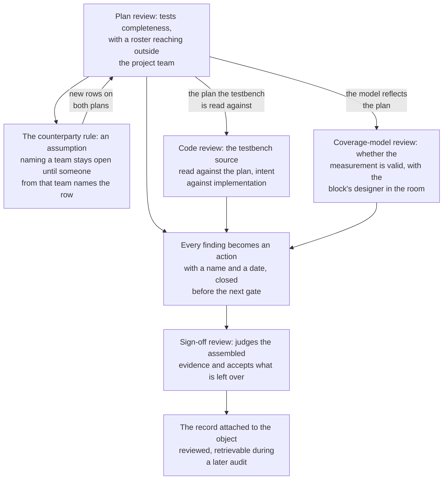

# 24. Teams, Process and Ramp-up

Verification teams need ownership of design outcomes. This chapter examines roles, reviews, progress reporting, onboarding and the limits of process through an escape in week 41 of the reference SoC. A system-level test running a quantized network on the neural accelerator, with both DMA channels streaming, produces one wrong output tensor in roughly four hundred inferences. Two days of debug find the mechanism: the accelerator's weight prefetcher wraps its buffer pointer one entry early when the weight stream ends mid-beat under DMA contention. It reproduces only at 2-bit weight precision, only with a degenerate tensor geometry, and only when the other channel is moving traffic. The block signed off in week 33 at 100% statement and branch coverage.

The post-mortem involved two people. The accelerator's verifier treated memory contention as a system-level concern: her environment drove its ports directly, as planned, and she closed all her quantization-corner rows. The SoC integration verifier treated quantization corners as a block-level concern: he owned connectivity and system traffic, with no visibility into weight-buffer geometry. The DMA verifier was not invited, because the DMA was not at fault. Everyone fulfilled their assigned responsibilities. Every artifact in the project had a named owner: the block environment, the SoC environment, the DMA environment, the coverage model, the vplan. The escape falsified an unowned outcome: demonstrable accelerator correctness while another component competes for memory.

Markers identify corpus-supported claims; other interpretations are attributed explicitly.

### Chapter map

§24.1 compares artifact ownership ("owns the testbench") with outcome ownership; §24.2 examines each review's purpose, productive mechanics and failure modes. §24.3 applies Chapter 4's maturity stages to evidence-based status reporting and stage inflation. §24.4 covers designers' transferable skills, counterproductive reflexes and a weekly ramp-up; §24.5 examines the benefits of checklists, templates and coding standards, and when process substitutes for judgment.

## 24.1 Roles and outcome ownership

The **block verifier** answers for a block's features from extraction to sign-off. The **methodology owner** serves the other verifiers by owning the base environment, register generator flow, regression infrastructure and coverage merge. The **integration verifier** answers for behavior that exists only once parts are connected. The **lead** reads trends and negotiates. Designers, architects and firmware engineers are outside the verification staff, but all produce verification evidence.

When ownership is defined by the *artifact*, an owner answers for the block environment, SoC environment or coverage model. Artifact ownership is administratively convenient because it maps onto repository directories, but it caused the opening escape.

Ownership by **outcome** instead makes the owner answer for whether the accelerator is demonstrably correct under every condition the system can present to it. The two formulations disagree about who is at fault when the environment is excellent and the answer is still unknown, because artifact ownership is discharged by the artifact being good and outcome ownership only by evidence about the design.

Writing RTL is only a means to producing a working design, so the entire design team, beyond verification alone, must contribute to the verification plan and answer for its completeness [cit:B2]. For verification roles, "my rows are closed" therefore establishes artifact completion without establishing the outcome claimed about the design.

**Ownership boundaries.** This section examines three seams in ownership.

The first is **block-to-system**. At integration, each block generally arrives from its own team, and the SoC verification team must debug and analyze the assembled system without knowledge of the IP internals; each block is a black box to that team, which has neither the time nor the background to understand the inner workings of several complex IPs at once [cit:D20]. This is a structural limitation rather than a staffing failure, so asking the integration verifier to learn every block cannot close the gap. The gap closes by naming an owner for each *cross-block outcome*, such as "the accelerator under memory contention" or "the flagship's DMA under a coherent writeback", on the block side, where the internals are understood, with an obligation to state what system conditions the block environment did *not* present.

The second, **design-to-verification**, crosses overlapping responsibilities. Design engineers spent, on average, 49% of their time on verification activities in 2024 [cit:R2]. Here, white-box assertions, smoke tests and debugging alongside the verifier illustrate activities within that half of a designer's working life. A boundary drawn as though the designer hands over an artifact and departs leaves design-side checks written but never regressed, because they belong to no suite.

The third is **features without owners**. Plan rows may depend on external evidence: a protocol checked by purchased verification IP, a corner covered by emulation, or a mode "the software team exercises". Chapter 5 has them reviewed face to face with the designers, and Chapter 14 gives the formal ones a register with an owner and a discharge column. The discharge column exposes assumptions assigned to a sentence instead of a person; each needs a named owner or deletion.

> **Scenario.** The video codec's checking rests on a bit-exact C model. The design team first wrote it to explore entropy-coding trade-offs; it is faster and better tested than anything verification would have produced in the time. So verification adopts it as its checking reference and compares the RTL against it frame by frame. Artifact ownership avoids duplicated work: design owns the model and verification owns the comparison. **Approach.** The model should remain a transfer function written by the design team, without being treated as a golden model, while verification owns the *outcome*: "the codec's output is what the standard requires". The verification owner should discharge it with evidence the C model cannot produce: conformance streams from the standards body decoded against both the C model and RTL, an independent reader written from the specification for the syntax layer, and a written record of every place the C model was tuned to match the RTL rather than the specification. **Why.** A model written by the design team encodes the design team's reading of the specification, so it is not the independent second interpretation a reference model has to be (Chapter 3). Comparing RTL against it reconverges on that reading, and the comparison can stay green on a misread clause forever. Adopting the sound artifact transferred an outcome without reassigning its owner.

One test separates the two kinds of ownership, and it is the author's read rather than a published rule: ask an owner to state what would have to be true for their answer to be *wrong*. An artifact owner describes a bug in the artifact; an outcome owner describes a condition of the design they have not yet reached. A project unable to obtain the second answer for a feature lacks an outcome owner for it.

## 24.2 Review purposes and mechanics

Chapter 4 puts reviews on the calendar and names who sits in each; Chapter 5 details the plan review's internal procedure, with weakness analysis row by row, and Chapter 7 details the sign-off review's evidence package. This section addresses how reviews work as institutions and how they fail. Their purposes differ, so confusing them undermines the review.

The **plan review** exists to test *completeness*, a property no single perspective can check. That is why its roster deliberately reaches outside the project team, and why experienced design, verification and software engineers are all named as contributors: the reviews are designed to establish that the identified functional verification requirements are complete [cit:B1]. Greater expertise can make completeness harder to question when reviewers remain within what they already know.

The **code review** tests *fidelity between intent and implementation* in the testbench rather than the design. Its object is source code produced by one engineer and read by one or more peers, and its declared purpose is to find problems no automated tool can: discrepancies between intent and implementation, and qualitative properties like maintainability and the relevance of comments and assertions. The goal is explicitly not to ridicule the author [cit:B2].

A second reason for testbench code review concerns temporary debug structures. A testbench routinely acquires temporary structures that bypass large sections of a testcase to speed up debugging of a critical part, and nothing fails when those are left in, so the environment stops implementing the tests it claims to contain. Peer review of the testbench against the plan, together with review of the simulation log to confirm the run followed the specification it claims to execute, is the redundancy that catches it [cit:B2]. Chapter 8's known-bad variant is the mechanical counterpart; the review is the human one.

The **coverage-model review** tests whether the *measurement* is valid, and it needs its own slot because a coverage model reflects the plan and there is no automated way to establish that either is complete. A functional coverage model should therefore be put through the same development and review process as the plan itself [cit:B1]. The block's designer must be in the room because whether a cell is reachable *by construction* is a question about the RTL. Without this review, a passing coverage result can certify stimulus without establishing behavior.

The **sign-off review** exists to *judge assembled evidence and accept what is left over*; Chapters 4 and 7 work its content. The sign-off review fails when it arrives with no room to act on what it finds: by then, a discovered hole is a risk to be accepted rather than a defect to be fixed, which is why the three earlier reviews have to function. {ref: review_cycle} sets the four in that order, with what each one hands to the next.



{figure: review_cycle} Four reviews with four different questions, in the order that makes the last one possible: completeness, then fidelity of the testbench to the plan, then validity of the measurement, then a verdict on what the evidence leaves open.

**Productive review mechanics.** Four mechanics, of which only the last is drawn from the corpus; the first three are the author's read, offered because they are cheap and their absence is diagnostic.

The artifact should circulate *before* the meeting, which should open by asking whether people read it; a review where the author narrates the document aloud functions as a presentation, with reviewers reduced to an audience. Someone other than the author should chair, so the author can answer questions instead of managing the clock. Every finding should become an action with a name and date, closed before the next gate rather than at it. The record should attach to the object reviewed; links directly to plan objects make history retrievable during audits and quality reviews [cit:D9] rather than isolated in meeting notes.

A fifth mechanic concerns tone rather than procedure: one practitioner tutorial demands clear justification of how each specification point is verified, accepts that the justification may be complex and needs thoughtful review, and rejects tolerating or encouraging hand-waving [cit:D13].

**Review failure modes.** When every attendee has a stake in plan adequacy, plan review can yield a signature date instead of identified gaps. Code review fails when it enforces style that tools should check, without examining whether the environment implements the plan. The coverage-model review degenerates when the only attendees are the person who wrote the model and the lead who wants it closed. Under schedule pressure, any review held *after* the decision it should inform can only record findings as risks.

A second failure mode, difficult to see within the meeting, concerns abstraction. Where a review spans two levels of abstraction, such as a formal property set against a coverage model, the mismatch makes the review process much harder; a detailed examination of individual items is often required, and the time for it has to be allowed for [cit:D13]. Allocating one hour to a review needing a half-day examination leaves it without a judgment.

> **Scenario.** The crossbar's coverage-model review, week 9. The proposed model includes a cross intended to stress ID handling at a subordinate port: two managers presenting the *same* manager-side ID with writes in flight to one subordinate. The designer explains that the interconnect appends source-identifying bits toward the subordinate: its 7-bit ID combines the 4-bit manager ID with 3 bits distinguishing 5 manager ports, so two managers using one manager-side ID arrive with *different* IDs. The cell can never be hit, by construction. **Approach.** The row is *replaced* rather than deleted: the real precondition for the canonical write-interleaving hazard at a subordinate port is a second write address accepted while an earlier burst is still unfinished on the write-data channel, and that is what the cross must sample. The minutes record the replacement and its reason to prevent the original being proposed again in the next generation. **Why.** An unreachable cover point remains at zero without reporting a failure; it absorbs stimulus effort during closure, when time is shortest, until excluded by an engineer who no longer remembers whether it was impossible or merely unreached, while the intended hazard remains unmodeled. The model compiles and the bin is legal; identifying its unreachability here requires knowledge of interconnect ID handling.

This second scenario develops Chapter 4's single-line warning.

> **Scenario.** The coherent hub's plan review. The hub's rows cover MESI state transitions, directory occupancy, and livelock and starvation cases. The assumptions section contains one line: *"IO-coherent port behaviour under snoop-in is covered by the accelerator teams."* Two of the three accelerator plans contain the mirror-image sentence: *"coherency is handled by the hub."* Neither side wrote a row. **Approach.** The reviewer's rule, the **counterparty rule**, is that an assumption naming a team is not closed until someone from that team has read it *in this review* and named the row that discharges it. Here that produces two new rows on the hub's plan (snoop-in during an in-flight accelerator write; snoop-in to a line the accelerator has just released) and one on the plan of each accelerator team that wrote the mirror sentence. **Why.** The individually reasonable assumptions jointly leave the feature unchecked. Unspoken and undocumented assumptions are how design features fall through the cracks, which is why every assumption has to be reviewed with the designers face to face, usually over several rounds before alignment is reached [cit:D9]. The counterparty rule extends this discipline by requiring the named party to verify the assumption during review.

## 24.3 Maturity stages as a shared language

Chapter 4 defines the maturity stages (bring-up complete, verification mature, verified) and their written, demonstrable exit checklists. Here they structure three types of team conversation.

**Progress reporting.** Without stages, progress reports offer unauditable percentages and confidence; Chapter 4 explains why outsiders cannot read a coverage trajectory. A verification effort whose plan carries too little detail communicates poorly with other teams, leaves them confused about what has actually been verified, costs the verification team their trust, and pushes everyone toward proxies for progress, such as coverage percentages and test counts [cit:D7]. Stages replace the proxy with an artifact: a stage claim is auditable in an hour by someone who does not work on the block, because every line of a stage checklist is a demonstration, not an estimate.

**Readiness for consuming teams.** The consuming team's question needs a *comparable* answer across blocks written by different people, which is what stages supply: stage 2 means the same thing for the crossbar and the DMA and the core, and that is what makes a table of blocks against stages meaningful. The record then works as a shared contract rather than a per-team document: where a management platform holds one plan centrally and keeps every team's view of it in sync automatically, that single plan becomes the verification contract across sites, and the document-merge exercise that otherwise substitutes for agreement disappears [cit:D26].

**Requests for help.** On the author's read, stages justify their cost by enabling requests for intervention that percentages prevent. A block reporting "stage 2, four checklist lines open, two of them blocked on the formal proof of the ordering rules" is asking for a specific intervention; a block reporting "85%" is asking for nothing, because there is nothing in the number a lead can act on. Because stages describe states rather than verdicts, teams can say *not yet* without saying *we are behind*; inability to say "not yet" can instead produce months of "nearly".

> **Scenario.** The sensor hub arrives from a partner team, delivered as a pre-verified block for integration into the reference SoC's always-on island. The delivery note says "verification mature". The integration lead requests the ticked stage-2 checklist without disputing the claim. It comes back with the stimulus, checker and regression lines ticked and three lines blank: retention behaviour across the hub's ultra-low-power modes, asynchronous wake events crossing into the system domain, and the functional coverage model for low-power mode transitions. **Approach.** The block is accepted at stage 2 *for the functions the checklist covers*, and the three open lines become rows on the SoC plan with the partner team named as owner and a date. Integration proceeds, with low-power sequencing tests gated on those rows. **Why.** "Verification mature" was unqualified rather than false; the checklist gave both teams evidence they could interpret alike without accusations or an appeal to trust.

**Stage inflation** differs from ordinary optimism: a stage arrives *without* its checklist. A stage claimed rather than demonstrated becomes a status word, which can be assigned by whoever wants it assigned, generally someone outside the team. Chapter 4 names the process countermeasure; the conversational one belongs to every engineer, not just leads. Every stage report must include its open lines: "stage 2, three lines open" specifies what "stage 2" alone omits.

lowRISC's OpenTitan project publishes both halves of that arrangement. Its generic signoff checklist sets out what a block must show to move stage, with twenty-two items to reach its V1 stage, twenty-two more for V2 and thirteen for V3 [cit:O10]; the same checklist appears filled in per block, one block's copy recording every item as done, not started, not applicable or waived, and carrying a written reason beside each of its three waivers [cit:O12].

Chapter 4 cautions that stages describe *verification* maturity rather than design cleanliness. Stage 2 with fifty open bugs reports functioning bug-finding machinery, which is what stage 2 claims.

## 24.4 Onboarding: designer → verifier

Verification engineers often arrive from design, or oscillate between the two roles over a career, and the resulting verification mindset is very different from a design mindset, one usually reached only through years of experience, mentoring and lessons learned through mistakes [cit:D21]. That characterization belongs to Verilab, a verification consultancy that frames the mindset as a set of concrete choices rather than an attitude, the first being whether the environment's duty is to replicate the real world or to stress the design beyond it [cit:D21]. Two implications govern ramp-up. The slow transition requires more than a two-day tool course, and learning through teaching requires more than a wiki.

Chapter 2 describes the verification mindset. This section covers existing skills, reflexes to unlearn and a deliberate twelve-week ramp-up.

### Transferable design skills

Ramp-up should use the newcomer's existing design skills. Fast RTL reading helps designers localize failures, place white-box assertions at the right signals and assess proposed coverage exclusions. Designers have micro-architectural intuition about where designs are fragile, including which counters wrap, which FIFOs have a subtle almost-full condition and which handshakes have a reset hole; that intuition guides bug searches in ways the specification cannot. They know how the block was *built*, and often which parts the design team itself was uneasy about. Their standing with the design team helps when identifying a failure as a design bug.

One industry taxonomy identifies an organizational asset through its absence: under the reuse gap it lists both an IP domain knowledge gap and the failure to apply, at one level, knowledge developed about a block at another [cit:D16]. That taxonomy is the work of Oracle Labs engineers, presented in 2015: it sorts the verification gap by tractability (inherent, transient and self-induced) and names its contributors as the complexity, skills, schedule, quality, metrics, reuse and integrity gaps; the self-induced part is the part a team can act on [cit:D16]. A designer moving into verification of the same block family is, on the author's read, the cheapest available closure of that gap, provided the ramp-up asks them to use the knowledge rather than to forget it.

### Counterproductive design reflexes

These reflexes were appropriate in design and are not deficiencies; several make a testbench *look* healthier while reducing its checking.

- **Explaining a failure instead of reproducing it.** A designer first hypothesizes a failure mechanism because they own it. A verifier's first obligation is a failure that can be replayed on demand from the seed and manifest (Chapter 12). Hypothesis-first produces a diagnosis with no artifact behind it, and often enough the diagnosis turns out to describe a different bug from the one that fired. In the author's read of the most-repeated correction during a designer's first months, a failure must reproduce before it is considered understood.
- **Interoperating rather than stressing.** The design reflex is to build the most robust component possible; applied to a verification component it inverts the purpose, because the more tolerant the testbench, the less it checks. Clock snooping illustrates the problem: the testbench uses the design's internal clock instead of generating its own, and engineers coming from a design mindset adopt it because it yields fewer failing tests and faster environment bring-up, at the cost of masking clocking bugs [cit:D21].
- **Treating "invalid" as a stimulus filter.** "A transfer with that parameter is invalid, so there is no need to test it" is usually true about intent and irrelevant to verification: what matters is whether the scenario can occur, and if it can, the recovery from it is a feature [cit:D21]. Chapter 2 develops this rule; newcomers should state it at their first plan review.
- **Building a testbench that recovers.** A design must survive an error and carry on. Once a testbench catches an error, effort spent making it recover and continue checking is misplaced [cit:D21]. Newcomers build elaborate error recovery into a monitor because that is what a good component does.
- **Debugging in waveforms.** Designers use waveforms because almost all design state is visible there. Verification components operate in zero time and dynamic data structures, so debugging requires logs rather than waveforms; a testbench that cannot be debugged from its log has a messaging problem rather than a tooling problem [cit:D21].
- **Staying zoomed in.** Design work is naturally scoped to a module. Verification requires switching deliberately between detailed tasks, such as reading the spec, writing the plan, coding and debugging, and broader decisions: which features to focus on, how to expose bugs, and where effort buys the most checking and coverage. Verification also continues past tape-out, so what is done before, after, and not at all has to be prioritized consciously [cit:D21].

### A structured ramp-up

The ramp-up structure is the author's; its essential components come from the sources below.

**Time for experimentation and early revisions.** Engineers need time to experiment and gain experience because poor early decisions frozen by schedule pressure can be counterproductive [cit:D13]. The project should allow revision when a newcomer recognizes an incorrect first architectural choice.

**Explicit mentoring and escalation.** One published industrial deployment that took formal property verification mainstream across a large graphics design organization built a two-tier support structure rather than relying on a central team of experts. It identified a **champion** per cluster, the first point of contact and local expert for that group's questions, with escalation to a central expertise team when a query exceeded the champion, and those champions continued to own the activity across projects [cit:D18]. The organization is Intel: 85 engineers, design engineers rather than formal specialists, were trained in a span of two weeks and then supported by onsite consultancy for another four; the drive found 82 interesting bugs in twelve weeks despite beginning only after a major simulation milestone had already been completed, and the paper emphasizes that the tools had become deployable outside a central formal team [cit:D18]. Those are the figures the paper opens with; its later pages give slightly different totals, which is the reason to hold the opening ones rather than an average of all three. Mentoring thus requires a named local person with an escalation path and continuity. The same tutorial that asks for experimentation time also asks for teamwork and discussion, because this work is not intuitive and a single engineer can easily become stalled, and for identifying internal expertise and making sure it is *accessible* [cit:D13].

**Learning from worked material.** The same deployment paired its training with self-help material aimed squarely at novices: frequently asked questions, cheat sheets per application, and worked step-by-step exercises, all reachable without asking a person [cit:D18]. A curated library does the same job for code: novices learn to write assertions and coverage points by reading existing verified checkers and adapting them to their own problem [cit:B1]. For ramp-up, newcomers should read known-good artifacts alongside the documentation about them. That material supplemented dedicated training and the champion network. Self-help material should address recurring questions while keeping the mentor available for discussion.

**Existing onboarding artifacts.** Two existing artifacts can support onboarding. Enabling new teammates rapidly is a stated benefit of having a verification plan [cit:D7], the document that says what the effort is *for*. And the house comment standard should already assume its reader is a junior engineer who knows the language but not the design, and who must maintain and modify it without the original designer's help [cit:B2]. Comments meeting that standard already support onboarding.

**Worked example: the DMA ramp-up ladder.** Four assignments, in order, each with an exit criterion stated as a demonstration rather than a duration. The sequence progresses through *reproducing*, *extending*, *owning* and *breaking*: newcomers must debug existing infrastructure before writing any.

```text
Ramp-up: <name>, joining DMA verification from RTL design
Mentor: <name>  |  Escalation: methodology owner  |  Review: fortnightly

[1] Reproduce (weeks 1-2)
    Task: replay 3 archived failing seeds from their run manifests;
          write one bug report per failure at MECHANISM level.
    Done when: all 3 reproduce on demand, and the mentor cannot tell
          the new reports from the originals.
    Purpose: kills the explain-before-reproduce reflex.

[2] Extend a checker (weeks 2-4)
    Task: add the per-channel error-report cross-check to the
          scoreboard - predict from stimulus which transfers must
          fail; treat the DMA's own error report as an OUTPUT to be
          checked, never as ground truth.
    Done when: peer code review passed; the check fires on a
          deliberately broken error-report path (Ch. 8's known-bad-
          variant discipline) and is silent on 200 clean seeds.
    Purpose: independence of judgment, at the smallest scale.

[3] Own an outcome (weeks 4-8)
    Task: DMA-F06a (2D legalization at the 4 KB boundary) end to end:
          implement cg_2d_4kb, drive it to closure, and defend the
          exclusion at the coverage-closure review.
    Done when: the 6 (., straddle, max, .) cells are recorded as a
          WAIVER naming the generator's c_solver_budget as the reason
          - not written off as geometry - with owner and expiry.
    Purpose: the difference between impossible and merely decided.

[4] Break it on purpose (weeks 8-12)
    Task: the MENTOR injects 3 undisclosed bugs into a private RTL
          copy; run the full block regression; report which were
          caught, by what, and how long each took to localize.
    Done when: written result reviewed with the mentor; any bug the
          environment missed becomes a plan row.
    Purpose: the environment is a design, and it is under test too.
```

Assignment 3 deliberately allocates four weeks to judgment rather than technique. The six excluded cells of the canonical 2D coverage cross are dead because the stimulus generator's solver budget caps a row at 2048 bytes, or 256 beats on the 64-bit path, so a straddling row splits into pieces none of which can itself be 256. That is a team decision about solve time, not a property of the design, and the entire lesson is that the newcomer must be able to tell those two apart and file the first kind as a waiver that expires. Assignment 4 applies Chapter 8's known-bad-variant discipline, ending with an environment measurement instead of an unaudited new component.

Two things this ladder deliberately does not do. The ladder does not begin with a course on the methodology library: investigating a failure gives the newcomer a concrete use for that material. The ladder does not begin with new code: its first artifact is a bug report that communicates the reproduced failure to the rest of the project.

Rotating engineers through both roles makes Chapter 2's liaison position a permanent capability rather than a hiring accident. This is the author's interpretation without a measured result, offered as the cheapest experiment on this list.

## 24.5 Process quality and limits

Process records conventions that prevent repeated mistakes; without it, teams re-derive them each project. This section considers three instruments.

**Templates** buy consistency across authors. A plan template is crucial because many authors contribute to a large project's single guide, and the template gives each author the same prescriptive path through the same creation process [cit:D9]. With a shared template, ten plans can be read by one reviewer without ten context switches. The logic scales down to bug reports and up to sign-off packages.

**Coding standards** require agreement on which details matter. One published guideline hierarchy separates rules, which must be followed because breaking them costs the productivity the methodology exists to provide, from recommendations, where the *detail is often explicitly unimportant* (a naming convention is the example given) and can be customized, but adherence within a team is strongly recommended so that the implementation stays consistent and portable [cit:B1]. For recommendations whose detail is unimportant, such as the naming convention above, consistent adherence provides the value. Comments for a reader who knows the language but not the design and must maintain it without its original designer's help [cit:B2] impose a testable requirement.

**Reusable libraries and checklists** lower entry barriers and retain past knowledge. In the mainstream-adoption deployment of Section 24.4, the RTL was reviewed up front and cookie-cutter property templates were produced for recurring modules, including arbiters, state machines and standard interfaces, and packaged so that a novice met a filled-in starting point rather than a blank file [cit:D18]. Chapter 7 describes sign-off checklist lines as records of escapes identified in past post-mortems.

The same deployment reports that practices absent from mainstream deliverables will not be exercised despite their benefits, so it introduced check-points analogous to existing milestones [cit:D18]. This supports integrating process into schedules without establishing its quality.

**Process costs.** Adherence and discipline impose continuing costs [cit:D9]. Wholesale adoption of a full methodology may simply be unaffordable for a project with real people and schedules, an argument for adopting individual elements incrementally rather than adopting none [cit:B1]. A house-built flow adds to the cost: the team owns and must maintain the infrastructure, and switching methodology introduces a learning curve for experienced engineers with limited exposure to the new environment [cit:D22]. Not using best-known methods is itself estimated to cost on the order of 20% of productivity [cit:D16].

### What a checklist cannot do

Checklist quality depends on distinguishing auditable claims from judgments. Section 24.3's stage checklists make claims auditable; they cannot make judgments, for four reasons.

**It cannot decide whether its own line is true.** "Functional coverage model implemented and reporting in nightly regression" is objectively true or false; anyone can go and look. "Coverage is adequate for this feature" records only someone's willingness to make that judgment. The rule that follows: every line of a gating checklist must name an artifact a skeptic could regenerate, and a line that cannot be written that way belongs in a review discussion instead. As one practitioner tutorial states about establishing completeness, tools can supply some quality metrics but there is no substitute for engineers thinking it through [cit:D13].

**It cannot see what is missing from the plan.** Every line audits against a question somebody already thought to ask. The neural accelerator's escape in this chapter's opening would have passed a stage-3 checklist unblemished, because no line asked about the block under memory contention. Chapter 7's escape analysis extends checklists with *new rows* for previously uncovered failures.

**It cannot ensure impartial review.** A tick records a judgment for later recall, but cannot counter a desire to pass the gate; the checklist merely formats that decision. The listed contributors to why teams under-verify include fear-driven, miscommunication-driven and ulterior-motive-driven verification, alongside a lack of introspection; that self-induced portion is the part a team can address by asking whether it is creating the gap itself [cit:D16].

**Individual productivity and mechanical consistency.** Individual productivity across engineers ranges up to tenfold [cit:D16]. Process can standardize how a bug is filed, what a plan contains and when a regression runs; those conventions do not determine which corner an engineer pursues, whether a failing seed is minimized or shelved, or whether an odd waveform is investigated at 5 p.m. on a Friday.

Artifact production can displace the assessment of progress, as in the following workshop example. One published workshop describes the failure as *too much detail too soon*: a good-faith effort becomes labor-intensive because every item on the feature list must be planned, every change requires a detailed plan update and every finished task requires another, with granularity so fine that tasks are measured in hours; the result communicates worse because it becomes hard to tell what is finished and what is not [cit:D7].

> **Scenario.** The radar front-end's fixed-point precision sign-off. The house checklist contains *"quantization error characterized against the reference model across the operating range"*, inherited from an earlier project and ticked on every project since. The engineer ticks it: the characterization ran, the report exists, the maximum observed error is recorded. The review omits whether that error is *acceptable* to the downstream CFAR stage, whose false-alarm rate is the customer's requirement. **Approach.** The obligation should split in two. One line stays mechanical and auditable: the characterization ran across the declared range, and here is the report. The second obligation belongs in a named review item rather than a checklist line, with the DSP architect present, asking whether the measured error meets a tolerance written down *before* the run. **Why.** Combining the two obligations conceals an unmade judgment. The mechanical half was always true; the acceptance half lacked an owner, a threshold and any record of consideration.

### In practice

The following recommendations address staffing and maintenance constraints.

- **Staffing against outcomes.** Assigning integration verification to whoever is available can leave the outcome map fitted to existing staffing. Teams should list outcomes first, staff against them and track unowned outcomes as open issues.
- **Working and decision reviews.** For twelve people reviewing a plan, a shared reading can be unproductive. Two meetings can separate the work: a small review produces findings, then a wider meeting examines them and closes actions, avoiding one meeting that achieves neither.
- **Continuity after champion promotion.** Published champions retain ownership across projects [cit:D18]; promotion to a lead role risks removing local expertise if it remains solely with that person. Every champion's answers should enter the self-help material so the knowledge survives reorganization.
- **Mentoring time as a deliverable.** In this example, a twelve-week ramp-up uses perhaps two weeks of a senior engineer already on the critical path. That time should be an explicit deliverable; otherwise, in month four, the team may discover that newcomers have received only work that requires no explanation.
- **Industry talent constraints.** The 2024 industry study raises concern about the talent gap in design and verification engineering as one of its headline themes [cit:R2]. A team unable to train newcomers limits recruitment to engineers who already have the required skills.
- **Mechanical enforcement of coding standards.** A linter or continuous-integration job should enforce standards; without it, a standard can decay within two projects in this example, leaving new hires to learn conventions through rejected patches.

### Pitfalls

1. **Ownership by artifact.** *Symptom:* after an escape, everyone can prove they did their job. *Cure:* each owner should answer for a design outcome, and every assumption should name a person.
2. **The review with no pre-read.** *Symptom:* the author narrates the document while the reviewers meet it for the first time. *Cure:* the artifact should circulate in advance; the meeting should check who read it and be rescheduled if participants have not.
3. **Onboarding by documentation.** *Symptom:* "read the wiki and shout if you're stuck." *Cure:* a named local expert with a named escalation path [cit:D18], plus an assignment ladder whose first deliverable is a reproduced failure.
4. **The stage as a status word.** *Symptom:* a stage reported without its open checklist lines, and assigned by whoever needs it. *Cure:* every stage report must include its open lines, and transitions require review.
5. **Judgment recorded without review.** *Symptom:* a checklist line containing the word *adequate*, *sufficient* or *acceptable*. *Cure:* the auditable half stays on the checklist; judgment becomes a named review item with a threshold agreed in advance.
6. **The single accessible expert.** *Symptom:* one person answers every hard question, and their queue is the project's real critical path. *Cure:* champions per team with an escalation path, and every answer written into the self-help material [cit:D13,D18].

### Summary

- Roles should assign responsibility for outcomes. A good testbench discharges artifact ownership; outcome ownership is discharged only by evidence that the feature is demonstrably correct, and only the second form of ownership sustains accountability after an escape.
- The three seams where ownership fails are block-to-system, design-to-verification, and features whose owner is an assumption. The first is structural: at integration each block is a black box to the team that must debug the system [cit:D20].
- Reviews test completeness (plan), intent–implementation fidelity (code) and measurement validity (coverage model), with distinct failure modes. Peer review of the testbench is the redundancy that catches the bypassed testcase nothing fails on [cit:B2]. Review records linked to the plan objects under review are what keep a review's history retrievable [cit:D9].
- Maturity stages change status conversations from confidence to evidence, and make "not yet" sayable. Stage reports must include open checklist lines.
- Designers bring RTL fluency, micro-architectural instinct and credibility; the reflexes of interoperating instead of stressing, filtering "invalid" stimulus and building recovering testbenches all make environments look healthier while checking less [cit:D21]. The book adds one reflex: explaining a failure before reproducing it.
- Mentoring and scaffolding support a sequence of reproducing, extending, owning and breaking. The first deliverable should be a bug report before any new infrastructure.
- Process provides consistency, lower entry barriers and scheduled deliverables; practices absent from the deliverable list are not exercised [cit:D18]. It cannot supply judgment, identify plan omissions or ensure impartial review; individual productivity ranges up to tenfold [cit:D16].

### Exercises

**Exercise 24.1 (calculation).** Take the interconnect's identifier arithmetic from the coverage-model review scenario in §24.2. Compute, from the number of manager ports the crossbar serves, the number of source-identifying bits the interconnect appends toward a subordinate, and from that the subordinate-side identifier width. State what the result does to the cross the model proposed, and give the reason the minutes record a replacement rather than a deletion.

**Exercise 24.2 (calculation).** Take assignment three of the ramp-up ladder in §24.4. Compute the number of beats a maximum-length row occupies on the path the assignment names, from the solver budget in bytes and the width of that path. Decide whether the excluded cells belong in a plain exclusion or in a waiver, and name the three things the assignment's exit criterion requires of the record.

**Exercise 24.3 (judgement).** Two owners of one feature are asked what would have to be true for their answer to be wrong. The first replies that a monitor in the block environment could be sampling the wrong signal. The second replies that the accelerator has never run while another requester competed for memory. Decide which of the two holds outcome ownership under the test §24.1 gives, name what §24.1 says a project unable to obtain the second kind of answer lacks, and name which of §24.1's three ownership seams the chapter's opening escape fell through.

**Exercise 24.4 (judgement).** A team proposes two lines for a gating checklist: that every waiver on the block carries an owner and an expiry date, and that the coverage model is adequate for the block's risk. Decide which of the two belongs on the checklist, applying the rule §24.5 gives for a gating line. Name where the other obligation belongs instead, and the two things §24.5 requires of it there.

**Exercise 24.5 (artifact).** Read the review record below, filed after a plan review of the neural accelerator. Name the four productive review mechanics of §24.2 the record breaks, and the line of the record that breaks each. State what §24.2's counterparty rule requires before the assumption line can be recorded as closed.

```text
Review:       Neural accelerator verification plan, rev. C
Chair:        the plan's author
Pre-read:     plan circulated at the start of the meeting
Attendees:    accelerator verifier, accelerator designer,
              accelerator verification lead
Assumptions carried forward:
              "Behavior under memory contention from the other
              requesters is covered by the SoC integration team."
Findings:     (1) no row for weight-buffer geometry at the lowest
                  supported weight precision
              (2) quantization-corner rows do not cross with
                  concurrent traffic from another requester
Actions:      both findings to be addressed before sign-off
Filed:        meeting notes, verification team wiki
```

### Further reading

**From the corpus.** [cit:D21] addresses the design-to-verification transition and supplies most of Section 24.4's reflexes; Chapter 2 develops its mindset. [cit:D18] describes mainstream adoption in a large organization through champions, escalation, self-help scaffolding and cookie-cutter libraries, and reports that practices absent from mainstream deliverables are not exercised. [cit:D13]'s planning-and-completion slides cover experimentation time, teamwork against stalling, accessible internal expertise and rejection of hand-waving in reviews. [cit:B2] carries Section 24.2's code-review material (Chapters 2 and 3) and the comment standard aimed at a junior maintainer (Appendix A); [cit:B1] supplies the requirements-review roster, the guideline hierarchy behind Section 24.5, the novice's route in through existing verified checkers, and the rule that a coverage model is reviewed like a plan. [cit:D9] and [cit:D7] are the planning workshops behind the template, assumption-review and over-detail material; [cit:D26] shows the plan working as a contract across distributed teams. [cit:D20] is the source for the integration team's black-box problem, [cit:D16] for the skills, quality, reuse and integrity gaps, and [cit:R2] for the 2024 workforce and talent-gap data. [cit:O10] is the stage checklist of Section 24.3 as lowRISC's OpenTitan project publishes it, an item list per stage; [cit:O11] defines what the stage letters mean and [cit:O12] is one block's copy filled in. The OpenHW Group's TRL-5 sign-off checklist for a RISC-V core [cit:O7] is the same kind of artifact from another project, its rows carrying a sign-off criterion and an exceptions column.

**Not in the corpus** (pointers, not evidence). Weinberg, *The Psychology of Computer Programming* (1971), on why independent review works on people rather than only on code. Wile, Goss & Roesner, *Comprehensive Functional Verification* (Morgan Kaufmann, 2005), treats the verification engineer's role and its ramp at industrial scale. Fagan's 1976 *IBM Systems Journal* paper on design and code inspections is the origin of the formal software inspection, whose separation of roles and defect-recording discipline Section 24.2's mechanics informally reconstruct.
