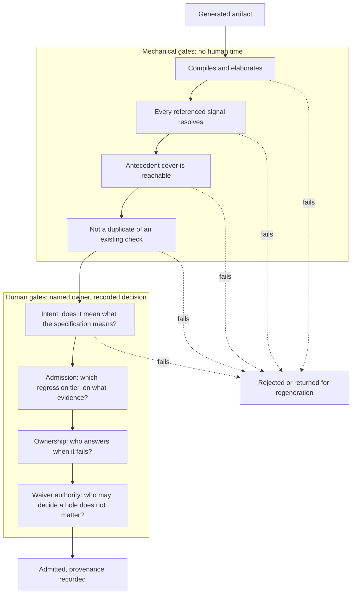

# 25. AI and ML in Verification

Two proposals reach the verification lead in the same week, and both arrive with a number.

The first comes from the team that owns the video codec's nightly regression. They have trained a classifier on eighteen months of failure logs; it sorts each morning's failures into buckets and names a probable cause for each. On a held-back month of history it agreed with the human triage engineer 88% of the time. The proposal is to put it in front of the triage rota.

The second comes from a pilot on the crypto engine. A language model was given the engine's specification chapter and produced forty SystemVerilog assertions in about twenty minutes. Thirty-eight compile. Thirty-six pass a formal proof against the current RTL. The proposal is to adopt the flow for the remaining blocks.

Both numbers are real. Only one of them is evidence about the thing being proposed.

The first is measured against a baseline the team owns: yesterday's triage decisions, made by a person, written down, and available to disagree with. It can be re-measured next quarter on next quarter's failures, and if agreement falls the team will see it fall. The second measures agreement between a generated property and the design it was generated to check. An assertion that agrees with the RTL is precisely what an assertion must not be judged by — Chapter 11 spends a section on why — and a property whose antecedent this design never satisfies passes on it without ever having been evaluated. Thirty-six passing proofs is a statement about compilation and consistency. It is not a statement about intent, and intent is the only thing a specification-derived property exists to capture.

That asymmetry is this chapter's subject. Two risks attend a chapter like this one — that it ages into embarrassment, and that an engineer who has been promised a great deal and shown less reads it cynically and stops — and both are managed the same way: by separating what has been *demonstrated* from what is *claimed*, and by dating everything. A vendor demonstration is not evidence. A published result on a benchmark is evidence for that benchmark, under that benchmark's definition of success, which is often the most interesting part of the paper. Where a result comes from an industrial deployment, its scope and its caveats are the finding rather than a footnote to it.

The field's own reviewers say as much. A 2025 review of machine learning for micro-electronic design verification observes that although these techniques have been proposed since the late 1990s, many never reached mainstream adoption, and names three reasons that are about evidence rather than capability: withheld code and data make results hard to reproduce, techniques are evaluated on simple designs against random stimulus and little else, and research rarely asks whether a method generalises past the one application it was tried on [cit:P8].

### Chapter map

- §25.1 identifies which machine-learning techniques have a track record in verification, what each one actually optimises, and what it costs to keep working once deployed.
- §25.2 states how to read a capability claim about generated verification artifacts: what was measured, on what, against what baseline, and what the paper meant by *correct*.
- §25.3 establishes why a generated artifact is plausible by construction and why that makes a wrong one more expensive than none.
- §25.4 states what a review of machine-written code must check that a review of human-written code need not, and where a person must remain in the loop — expressed as named decision points with owners rather than as reassurance.
- §25.5 states what to record so that a sign-off resting partly on generated evidence is still defensible two years later, and how to decide what to adopt, what to pilot and what to wait on.

## 25.1 Classical machine learning, where the results are real

Three applications have a genuine track record: steering stimulus toward uncovered behaviour, sorting regression failures, and choosing which tests to run. They are the least glamorous techniques in this chapter and the most deployed, and their published results span two decades rather than two years. The value in reading them now is not the numbers. It is the shape of the numbers: each technique optimises something narrower than what you want, and each one decays.

### Coverage-directed generation: what it optimises

Chapter 6 places learning-based coverage-directed generation in the automation spectrum and states the structural point — every such technique learns the mapping from generator directives to achieved coverage and inverts it, which means it optimises the derivative rather than the goal. This chapter asks when it transfers.

The founding result is worth reading in full because it is unusually honest about cost. In 2003 a Bayesian network was trained to direct stimulus at the storage control element of a commercial mainframe. The coverage model had five attributes with a cross product of 13,888 combinations, of which 1,968 were legal coverage tasks. Training used 160 test-cases, each taking more than thirty minutes to run, and covered 1,745 of them; 223 remained. The trained network covered all 223 within 250 further test-cases, where an expert-written directive file covered two-thirds of them after more than 400 [cit:P16].

Read the second half of that sentence before the first. The baseline was a human expert's tuned directive file, not uniform random stimulus — which is rare, and is what makes the result mean something. The 2025 review quoted above notes that random is the most common baseline in this literature and cautions that beating random says nothing about whether a technique generalises [cit:P8]. The cost follows from the training figures above: more than eighty hours of simulation before the model produced its first useful directive, on top of building a coverage model precise enough to learn from.

Nine years later, a review of the whole literature found a limitation common to every approach it surveyed — none could consistently cover all the tasks in a coverage model — and named an adoption barrier that has aged well: the average verification engineer is not an expert in these techniques and cannot tune one, so a method needing customisation will not be supported, and an approach fit for industry must produce results engineers can easily interpret [cit:P19].

The modern instances behave the same way at a different scale. Chapter 6 records the 2023 deep reinforcement-learning result on a compression encoder, where an agent reached 133 of 136 hard functional bins; uniform-random stimulus plateaued at 28. The operational detail that chapter does not need is this: closure required merging the coverage of two separate training runs, because neither alone hit every bin — a 500-episode run reached 133, a 750-episode run reached 127, and the second run's bins were not a subset of the first's [cit:D1]. The technique bought the hard bins. It did not buy closure, and a plan that had promised closure would have been wrong.

The ceiling reappears when a language model is put inside the loop. A 2025 survey describes a 2024 system given the coverage report and the design under test and asked to propose stimulus; it beats random testing on simple and medium designs and degrades above roughly sixty-four states, which the survey reads as an argument for combining language models with structural approaches rather than replacing them [cit:P24].

Put that against a real target. The GPU's shader clusters are the natural place to want this: four clusters, a scheduler, and a coverage model whose interesting bins are combinations of occupancy, divergence and memory-request pattern that nobody wants to enumerate by hand. The fit is good because the space is large, the legal directives are many, and a bin is cheap to check. It is a poor fit for the crypto engine's key ladder, where the interesting states are few, reachable by a directed test in an afternoon, and defined by a security argument that no coverage bin expresses.

### Failure triage and clustering

Chapter 12 owns the mechanism: signatures, buckets, the rota, and the three reductions that make a morning's failures tractable. What machine learning adds there is worth separating into two halves that behave very differently.

A 2023 survey of machine-learning applications in functional verification reports both halves of a 2018 study working from one feature set — 616 features drawn from semi-structured simulation logs. Unsupervised clustering of failures scored 0.543 and 0.593 on adjusted mutual information across three algorithms, against an ideal of 1.0. Supervised classification of the root cause, on the same feature set, reached 90.7% accuracy and an F1 score of 0.913 with a random forest [cit:D35].

That gap is the practical lesson, and it points the wrong way for anyone hoping to buy their way out of triage. Supervised classification is strong and needs a labelled history: somebody must already have looked at hundreds of failures and written down what caused each. Unsupervised grouping needs no labels and is weak. The technique therefore works best where a team already has years of curated triage decisions, and worst on a new project or a block's first tape-out — which is where triage hurts most. The same survey ladders the problem into three — cluster failures by cause, classify the cause, suggest the fix — and reports that most research addressed the first two, with no results available on the third [cit:D35].

The economics follow. That survey also reports a typical machine-learning project spending up to 70% of the team's effort on preparing data [cit:D35]. On the video codec's nightly, that effort is not hypothetical: the failure population is dominated by golden-model mismatches whose useful label is a frame region and a coding tool, and neither is in the log unless somebody puts it there. Chapter 12's point — that the triage engineer's confirmation *is* the training data — is what makes the labelling affordable, and only if that confirmation is recorded in a form a model can read.

### Regression compression and test selection

Chapter 12 carries the published figures for ranked regressions and novelty-based selection with their baselines. This section adds only what each optimises, because that is what decides where it belongs.

A ranking model optimises time-to-first-failure over a known suite: it reorders existing test-and-seed pairs so the runs most likely to fail go first. A selection model optimises coverage per simulation-second, discarding runs whose contribution it predicts is redundant. Neither optimises the discovery of new behaviour, and the industrial study behind the ranking figures says so in its own words — a ranked regression simulates no new scenarios and is not recommended for exploring the random space or exposing new bugs [cit:P7].

That is a constraint on where the technique can sit, not a caveat to file away. A ranked or compressed regression is a *change-detection* instrument: it answers "did this commit break something the suite already knew how to catch?" quickly and cheaply. It is not a bug-finding instrument, and a program that replaces its full random regression with a compressed one has quietly converted its main source of new bugs into a fast regression check. The honest deployment keeps both — a compressed suite per commit, and a full sweep with fresh seeds on a slower cadence, whose yield Chapter 7 tracks as its own signal.

### The stale model

Every technique in this section shares a decay mode, and it is why so many published results do not survive contact with a program.

A model trained on one design's coverage response, one quarter's failure logs, or one release's regression outcomes is a claim that tomorrow resembles yesterday. The 2025 review names this directly: an example that was novel becomes unremarkable once more examples have been seen, so the model needs regular retraining to stay relevant — and worse, once deployed, the learner shapes the examples it will later be retrained on, which can suppress exploration and make performance *decrease* over time. The same review observes that research usually frames verification as a one-time learning problem while industrial designs change continuously, and warns that if substantial effort goes into crafting fitness or reward functions, the technique has merely shifted effort from writing tests to tuning models [cit:P8].

Two consequences for anyone deploying one. Retraining is a named, owned, scheduled task with a cost, not a maintenance detail: a triage classifier 90% accurate at tape-out and 60% accurate two derivatives later is worse than none, because the rota has stopped checking it. Give it a measured agreement rate, re-measure on a fixed cadence against human decisions, and publish the number where the people relying on it can see it.

And there is a distinction in severity that the word *model* hides. A stimulus model that goes stale mis-steers: you get worse coverage per run, and the coverage report tells you. A generated checker that goes stale is a bad oracle — it decides whether an observed response is correct — and a bad oracle does not announce itself in any report. That difference is why the rest of this chapter is mostly about generated checkers.

## 25.2 Large language models, with the evidence

Three capabilities are claimed for language models in verification: generating assertions and properties, scaffolding testbench code, and drafting verification plans. The corpus supports statements about all three, but not statements of the same strength, and the differences matter more than the headline figures. Every claim below carries its year, the artifact it was measured on, and — the part usually left out of the summary — what the study counted as success.

### Assertions and properties from a specification

Chapter 11 records the headline result: a 2024 framework that reads a full natural-language specification and emits SystemVerilog assertions reported 89% of 56 generated properties correct both syntactically and functionally on a single serial-bus design, where *correct* means the property passed a formal proof against known-good RTL, after human engineers had removed the generations referencing signals the tool could not map [cit:P11]. Two things that chapter does not need are load-bearing here.

The first is the ablation. Given the same specification files, the underlying general-purpose model on its own produced 71 candidate properties, of which 23 were syntactically correct and 6 passed the proof — 8% by the same measure that gave the full framework 89% [cit:P11]. The engineering around the model — splitting the specification, mapping signal names, retrieving the right passage per property — is doing most of the work, and it is the part that does not transfer for free to a specification written in a different house style.

The second is scope. Of the three property classes the framework generates, connectivity properties could be produced only for control signals, because the connectivity of data signals depends on internal RTL structure the specification does not describe; and function properties only where the specification detailed the register behaviour [cit:P11]. The reachable subset of a specification is narrower than the specification, and a generator will not tell you which rows of your plan it left untouched.

A 2025 study attacks a different target and shows why comparisons across this field are so hard to make. Its subject is protocol formal specifications — documents with timing diagrams — and its flow is two-stage: generate candidate properties from a grammar, check each against the timing diagram with a SAT solver, then use a language model to filter the survivors against the textual description. The SAT stage retains between 5% and 22% of the candidates in every case, which is the clearest available measure of how aggressively a mechanical filter can thin a candidate set before anyone reads it. Across six open-source on-chip protocols, the extracted properties covered 53 of 58 manually derived target properties — for every protocol but one, which is excluded from that count [cit:P12].

That paper also runs the specification-driven framework of the previous paragraphs on one of its own protocols, and the two results must not be read as a curve. They differ in task and in artifact class: the first framework was built to consume a full design specification and was measured on one design under its own pass criterion; the second target is a protocol formal specification with timing diagrams, and the head-to-head re-ran that framework itself, reporting it under two underlying models. On that protocol the two-stage flow covered all 13 manually derived properties with no syntax errors, while under one of them the specification-driven framework produced 38 properties of which 3 were judged correct and 2 of the 13 targets covered, with 16 syntax errors and 11 references to signals that do not exist [cit:P12]. The conclusion is not that one framework is better than another by some ratio. It is that a framework built for one artifact class does not transfer to another, and that the eleven non-existent signals track the model rather than the framework: under the other model it produces none.

That study's taxonomy of outcomes is worth borrowing wholesale, because it is the vocabulary a reviewer needs: a generated property may be *correct* (unique or redundant), *incorrect*, *unsure*, or *hallucinated* — invented rather than drawn from the set it was given to filter. One protocol's transaction section produced four hallucinated properties [cit:P12].

Its authors' limits are stated plainly: the method depends on unambiguous timing diagrams; on the complex protocols the target set does not cover the entire formal specification; models remain poor at reading figures, often getting a signal's value in a given cycle wrong; and experienced engineers are still better at inferring properties where the document has no text to work from [cit:P12].

### Agentic flows: a plan, a proof, and a loop

The corpus contains one industrial report of an end-to-end agentic formal flow, from 2025: a lead agent drafts a verification plan in natural language, a dispatcher delegates assertion generation, critic agents evaluate the results, properties are proven in a commercial model checker, counterexamples are analysed, and formal coverage is assessed for sign-off. Its headline is that the flow does not guarantee a result on every run and works most of the time, at an overall efficacy of around 40% [cit:D25].

Before reading that as good or bad, read what was counted. The study's first-named indicator is a *success rate*, defined as the number of runs that completed end-to-end formal verification out of the total runs [cit:D25] — a measure of whether the pipeline finished, not of whether the properties it produced were the right ones.

On this flow those are different questions. The authors list vacuous passes in formal properties among the failure modes they observed, alongside syntactically incorrect or semantically irrelevant assertions, assertions referencing signals absent from the specification, and truncation of large RTL against the model's context limit [cit:D25].

The benchmark's scale matters too: fifteen designs across three difficulty tiers, where the *advanced* tier holds a Booth multiplier, a pipelined adder, a small RISC-V core, a PID controller and a round-robin arbiter [cit:D25]. These are block-scale exercises, and a 40% figure should be read as 40% on designs of that size. The report is Infineon's and the flow has a name, Saarthi; the designs in its benchmark are not Infineon products, which is exactly the distinction between a company reporting a capability and a company reporting a deployment [cit:D25].

The result is also a function of which model was used, by an amount that should govern how it is quoted. The same flow was run with three general-purpose language models. On the easiest tier they completed 17.78%, 43.19% and 48.77% of runs end to end; on the hardest, 4.33%, 9.00% and 41.43%. The two models within six points of each other on the easiest tier were the 9.00% and the 41.43% on the hardest [cit:D25]. That is not a property of the technique but of the technique paired with one model, and Section 25.5 makes the pairing part of what gets recorded.

The flow's most transferable idea is not in its numbers. When two agents loop on generating and correcting an assertion without converging, it stops them at a threshold of five iterations and asks a human for the correct assertion [cit:D25] — a designed hand-off point rather than a fallback.

### Debug and root cause

Debug is where verification time actually goes — Chapter 7 counts debug-time share among its five instruments, and calls it the one that goes missing most often — which makes counterexample debugging the highest-value target in this list. A 2025 system attacks it structurally: it converts the failure trace into a causal graph, scans the graph for suspicious nodes, explores them agentically into a causal narrative, and proposes an RTL fix. On a benchmark of 38 real debugging challenges with human-verified ground-truth fixes, the full system scored 0.956 on best-hypothesis quality, and its proposed fixes resolved the failure 71.1% of the time on the first attempt and 86.8% within five [cit:P22]. The system is NVIDIA's and is called FVDebug. The benchmark is where those two figures were earned; the paper's other case studies are proprietary designs whose details are masked, so nothing in the pair licenses a claim about what the tool does on a production part [cit:P22].

Read this paper closely for its two families of metric and its explicitness about their difference. Hypothesis quality is scored by a language model comparing the hypothesis against the ground truth; Pass@k is measured mechanically, by applying the proposed fix to the RTL and re-running the proof in a model checker [cit:P22].

The two do not track each other, and the paper's own baseline table shows it. One unstructured baseline scored 0.783 on best-hypothesis quality and resolved 65.8% of failures within five attempts; another scored 0.474 — the worst hypothesis quality in the table — and resolved 81.6% [cit:P22]. A model-judged score measures how convincing an explanation reads. It is not a proxy for whether the fix works, and where a study reports only that kind, you have been told how plausible the output is.

Which is what happens on the harder designs. Taken to two counterexamples from a larger open-source application-class processor — one a load-store unit failure spanning 1,918 lines of RTL across seven files — best-hypothesis quality falls to 0.713 and no Pass@k is reported at all: the authors state that automated fix generation for such multi-line issues remains future work [cit:P22]. That is a candid result. It says the causal-graph machinery still finds its way around a graph of 170 nodes, and says nothing yet about fixes at that scale. That processor is CVA6, and both failures were ones the AutoSVA project had found first, which is what makes this the checkable half of the paper: the RTL and the counterexamples are public [cit:P22].

### Where the corpus is thin

On testbench scaffolding and verification-plan drafting — the capabilities most often demonstrated and least often measured — this corpus contains no study that scores the artifact itself; the flows that draft a plan are graded only by downstream outcomes [cit:D25,P13]. The nearest adjacent evidence is negative: the 2023 survey of machine learning in functional verification found that code summarisation in design verification had not been reported in any literature at that point, and that no research had been published on coding assistance for this domain [cit:D35].

The obstacles a 2025 survey of language models in electronic design automation names are structural rather than incidental: models struggle with long inputs containing long-range dependencies, which is what a testbench and a specification both are; and hardware description languages and tool-control scripts are scarce in pretraining data compared with mainstream software languages, so the domain gets less of the fluency that makes these models useful elsewhere. That survey concludes that scalability on modern designs and the role of human oversight in verification remain the significant hurdles [cit:P24].

The practitioner's answer is judgment rather than a citation: generated scaffolding pays where a mechanical check independent of the generator can confirm it. A register block whose fields are already machine-readable can have its checker generated and then diffed against the field description — the diff is the evidence, and it does not care how the file was produced. A constraint block encoding a legalisation rule cannot be checked that way, and its review costs what it costs.

### The evidence table

Each row of {ref: llm_evidence} pairs one reported capability with the conditions that produced it. The fourth column is the one to read first; it is where most summaries of this field go wrong.

{table: llm_evidence} What language models have been reported to do in this field, each capability paired with the artifact it was measured on, the year, and the study's own definition of success. The fourth column is the one to read first. Two rows describe one system twice on purpose, because one of its numbers was awarded by a language model and the other by a model checker.

| Capability | Reported result and year | Measured on | What counted as success | Stated limits |
|---|---|---|---|---|
| Assertions from a full specification document | 89% of 56 properties correct, 2024 | One serial-bus design, 23 signals | Passing a formal proof against known-good RTL | Generations referencing unmappable signals were removed by human engineers before scoring; connectivity properties limited to control signals [cit:P11] |
| The same task without the surrounding framework | 6 of 71 candidates passed, 2024 | The same design and specification | The same proof criterion | Reported by the framework's own authors as the baseline for their contribution [cit:P11] |
| Properties from a protocol specification with timing diagrams | 53 of 58 target properties covered, 2025 | Five of six open-source on-chip protocols; the sixth is outside that count | Covering a manually derived target property, after a SAT check and a model-based filter | The SAT stage retains 5–22% of candidates; on the complex protocols the target set is not the whole formal specification [cit:P12] |
| End-to-end agentic formal verification | 17.78–48.77% of runs completed on the easiest tier, 4.33–41.43% on the hardest, 2025 | 15 block-scale designs, three difficulty tiers, three models | A run that completed the flow end to end, not a property that was correct | Authors summarise overall efficacy at around 40%; observed failure modes include vacuous passes, irrelevant assertions and context truncation on large RTL [cit:D25] |
| Root-cause hypotheses for a counterexample | 0.956 best-hypothesis quality, 2025 | 38 debugging challenges with human-verified fixes, one model | Similarity to the ground-truth cause, scored by a language model | The score is model-judged, and does not order configurations the same way the mechanical measure does [cit:P22] |
| Fixes for a counterexample | 71.1% first attempt, 86.8% within five, 2025 | The same 38 challenges, the same model | The fix applied to the RTL and the proof re-run | Not reported on the two application-class processor failures; the authors call fix generation at that scale future work [cit:P22] |
| Testbench scaffolding and plan drafting | No measurement of artifact quality in this corpus | — | — | The corpus flows that draft a plan are graded only by downstream outcomes [cit:D25,P13] |

Two rows describe the same paper's system twice, on purpose. A row that merged them — *root-cause analysis, 0.956 quality and 71.1% fix rate* — would be true in both halves and wrong as a whole, because it would hide that one number was awarded by a language model and the other by a model checker.

## 25.3 Plausible by construction

A generated artifact is plausible by construction. That is not a criticism of the technology but a description of what it optimises: a model trained to continue text produces the continuation most consistent with the text it was given, and a property that reads like one written by a competent engineer is exactly what it is built to emit. Correctness is not the objective function. Plausibility is, and correctness is a frequent by-product.

Consider one sentence from the crypto engine's specification and the property a generator returns for it.

```systemverilog
// From: "While the engine is holding a request that the memory path has
//        not accepted, the key slot selector must not change."
property p_keysel_stable_gen;
  @(posedge clk) disable iff (!rst_n)
  (req_valid && !req_ready) |-> $stable(key_sel);
endproperty
a_keysel_stable_gen : assert property (p_keysel_stable_gen);
```

Read it as a reviewer would: the signals are the right signals, the guard is present, the handshake condition is the one the sentence describes, and the operator is the one the word *stable* suggests. It is wrong, and it is wrong in two directions from one missing delay.

`$stable` compares the sampled value at the current tick against the previous tick, so at the first cycle in which the request is held — call it the cycle the request rises — the property demands that `key_sel` already had its current value one cycle *earlier*, before the request existed. A design that legally presents a fresh request with a new key slot in the cycle immediately after a previous transfer completes will fail a rule the specification never stated. In the other direction, on the last held cycle the property says nothing about `key_sel` in the following cycle, the one in which the request is finally accepted — which is the cycle where a change would do actual damage. The obligation the sentence expresses lands one tick later than the property places it:

```systemverilog
property p_keysel_stable;
  @(posedge clk) disable iff (!rst_n)
  (req_valid && !req_ready) |-> ##1 $stable(key_sel);
endproperty
a_keysel_stable : assert property (p_keysel_stable);
c_keysel_held   : cover property (@(posedge clk) disable iff (!rst_n)
                                  (req_valid && !req_ready)[*2]);
```

The cover is the antecedent's, strengthened: it asks for a two-cycle hold rather than one, because a hold of a single cycle exercises only the accepting beat, and it is the longer hold that shows the property constraining `key_sel` while the request is still waiting.

This is not an invented failure mode. A 2025 study of property generation from protocol documents opens with the same defect on a generic valid/ready interface — a stability requirement rendered without its one-cycle delay — and notes that earlier machine-learning work made exactly that mistake [cit:P12].

Now ask what a formal proof would say about the first version. It depends entirely on whether this pipeline happens to hold `key_sel` steady for a cycle before a request rises. If a register upstream loads the selector one cycle early, the wrong property is proven, on RTL that is behaving correctly, and under a pass criterion of *proved against known-good RTL* it is scored correct and enters the suite. The verdict a proof engine returns on today's RTL is a verdict about today's RTL. It is not a verdict about the property.

Chapter 11 already names three ways an assertion can be worthless: it never triggers, it restates the design, or it cannot distinguish a correct design from an incorrect one. A generator produces all three fluently, and the second is structural rather than accidental. Where an assertion is mined from the design's own traces, generation and evaluation both happen against the same RTL with no independent reference, so a flaw in the RTL becomes a flaw in the assertion that the method has no way to detect — and a method that reads the specification *and* the RTL together inherits the same weakness [cit:P11]. A property derived from the design cannot find a bug in that design; it can only restate whatever the design does, bug included.

A fourth failure mode belongs to generated artifacts specifically, and it changes how they must be reviewed. A human writing forty properties makes idiosyncratic mistakes — a typo here, a misread sentence there — uncorrelated across the batch, so sampling five of the forty is defensible: the sample estimates a rate. A generator's mistakes are systematic. One misreading of one recurring specification pattern — *while X holds, Y must not change* — reproduces identically in every property derived from that pattern, and a sample of five either catches the whole class or misses it entirely. Sampling estimates nothing. This is practitioner judgment rather than a published result, and it is the most consequential difference in review practice this chapter contains.

The cost of a wrong-but-plausible artifact is not the cost of finding it; it is the cost to everything around it. A verification suite has collective authority: engineers believe a passing regression because they believe the checkers in it were written by someone who understood the design. One property that looks careful and encodes the wrong rule spends that credit, and the next one spends more. When the reviewer's scepticism runs out, the outcome is not that generated properties get rejected — it is that all properties get skimmed. An empty slot in a plan is visible and gets filled; a wrong property in a suite is invisible and gets trusted, which is why the gates below sit before admission rather than after.

## 25.4 The human gates

"Keep a human in the loop" is advice with no operational content. A loop has places in it; the useful question is which ones a person occupies, what they are deciding there, and what happens when nobody has been named to decide. {ref: generated_artifact_gates} names four decision points that need a person, and separates them from the checks a machine can settle on its own. Each has a question, an owner, the evidence that owner needs, and the specific damage of leaving it unowned.



{figure: generated_artifact_gates} The gates a generated artifact passes before it is admitted to a suite: four mechanical checks that cost no human attention, then four human gates, each with a named owner and a recorded decision. A failure at any mechanical gate, or at the intent gate, sends the artifact back rejected or for regeneration. The ordering is what makes the human gates affordable, since no artifact reaches a person until the machine has finished with it.

The order in the figure is the point: everything a machine can decide is decided before a person spends attention, and no human gate is reached by an artifact that has not survived the mechanical ones. That is not a courtesy to reviewers; it is what makes the human gates affordable at all.

**Gate 1 — intent.** *Does this artifact mean what the specification means?* The owner is whoever owns the plan row it discharges, not whoever ran the generator, and Chapter 5's traceability makes that assignment unambiguous. They need two things: the specification sentence the artifact came from, side by side with the artifact, and a demonstration that the artifact can fail — the cover on its antecedent, a mutation, or a deliberately broken variant. A passing proof is not evidence at this gate; Section 25.3 is entirely about why. Left unowned, a wrong rule enters the suite and immediately inherits the suite's authority.

**Gate 2 — admission.** *Which tier does this run in, and how does it get promoted?* Chapter 12 puts a repeat-N stability check on any test entering a gating tier, to establish that it does not fail spuriously. Generated checks want the same discipline for a different reason: not "does it fail at random?" but "does it fail on things that are not bugs?". A generated property earns a gating tier by running clean across a window of known-good history, and that window is the evidence. Left unowned, the first false failure on a Monday morning teaches everyone to add a plusarg.

**Gate 3 — ownership on breakage.** *Who answers when this fails at 07:40?* Named at merge, in the file, not discovered at the first failure. The hazard is specific to generated code and easy to underrate: a component nobody wrote is a component nobody can reason about under time pressure. The engineer on the rota can read it but cannot recall what it was *for*, because no hour was ever spent deciding. The remedy is to require that the accepting engineer be able to explain the artifact without regenerating it — and to record that they did.

**Gate 4 — exclusion and waiver authority.** *Who may decide a hole does not matter?* A coverage exclusion proposed by a model is still a waiver in Chapter 7's sense, carrying the same five fields: the hole, the reason, the risk argument, an owner, an expiry. Nothing about its origin changes who signs it. This gate exists because exclusion is where an optimising system will always push — to a coverage metric, excluding a bin is indistinguishable from covering it.

A fifth place a person belongs is a bound rather than a gate. Where two automated stages iterate against each other — generate, criticise, regenerate — the loop needs a cap, which is what the five-iteration threshold above provides. A 2026 survey of agentic design automation names the failure a cap prevents: *deadlooping*, an agent oscillating between states without converging, alongside context loss, where an agent optimises a local sub-goal having forgotten a global constraint, and tool hallucination [cit:P23]. A loop without a cap does not fail loudly. It consumes budget and returns something.

### What this review checks that an ordinary review does not

A review of machine-written verification code is not a stricter code review. Three of its checks carry weight they do not carry when the author is a person.

- **Every referenced signal exists and is the one intended.** Generated properties can name signals that are not in the design — the head-to-head in Section 25.2 counted eleven such references in a batch of thirty-eight [cit:P12], and the specification-driven framework there needed human engineers to remove unmappable generations before it could be scored at all [cit:P11]. Elaboration catches the non-existent ones. It does not catch the *wrong-but-existing* signal, which is the common case in a design with families of similarly named ports.
- **The artifact is in a position to fail.** Vacuous passes are a named, observed failure mode of generated properties in industrial use [cit:D25], which promotes Chapter 11's cover-with-every-implication rule from good habit to admission criterion.
- **The batch, not the sample.** Because a generator's errors are correlated, a review covers every artifact in a batch or rejects the batch.

That last item sets the real constraint on adoption, and it inverts the intuition the technology invites. The limit on throughput is not how fast artifacts can be generated but how fast they can be read. A flow producing two hundred properties in an afternoon has saved nobody a week unless someone reviews two hundred properties; if nobody does, it has not produced verification but a suite with an unknown number of wrong rules in it and a passing regression. Adopt where the mechanical filter is strong and the batch is small enough to review whole — a design constraint on the flow, not an attitude toward the technology.

## 25.5 Governance

Two years after tape-out, a field failure triggers the escape analysis of Chapter 7. Somebody opens the sign-off package and asks how a particular behaviour was covered. The answer points at a property. The next question is where that property came from, and if the honest answer is *a model wrote it and someone approved it*, the review has nowhere to go: it cannot re-derive the property, cannot tell whether the reviewer checked it against the specification or against the RTL, and cannot tell whether the specification it came from is the revision that shipped. Governance is the set of records that keeps that conversation possible.

### The provenance record

Attach to every generated artifact, in the repository and not in a wiki, a record with these fields:

- **What produced it.** The system, its version, and the identity and version of the model underneath. Section 25.2 showed the same flow varying from 4.33% to 41.43% end-to-end success on one benchmark tier depending on which model was underneath [cit:D25]. Model identity is not a footnote; it is a parameter of the result.
- **What it was given.** The exact input — which specification document, which revision, which section — and the prompt or template version. Without the revision, a later reviewer cannot tell whether the property predates the change that made it wrong.
- **The sampling settings, and how many runs were kept.** See below.
- **Which mechanical checks it passed, and their versions.** Compilation, signal resolution, antecedent reachability, duplicate detection.
- **Who accepted it at each human gate, and against what text.** Not a signature on a batch: a name against an artifact, and the specification sentence they compared it to.
- **Whether it was edited after generation, and by whom.** A hand-edited generated property is a hand-written property with a misleading history, and the distinction matters when the same generator is re-run on the next revision.

The last two are the ones teams skip and the ones a defensible sign-off needs. A record of what a machine produced is an audit trail of the machine. A record of what a person accepted is an audit trail of the decision, and the decision is what is being reviewed.

### Reproducibility is not seeding

Chapter 9 makes the seed part of a run's identity and is precise about what it does and does not reproduce. Generated artifacts sit outside that discipline entirely, and the vocabulary invites a false analogy. A language model's sampling parameters are not a seed in Chapter 9's sense; identical inputs can yield different outputs across runs, and one research group's response is instructive — issue the same prompt three times and take the union of the resulting property sets, precisely to make the result robust enough to report [cit:P12]. An industrial report notes the same axis from the other side: the sampling temperature that works varies by design, and a wrong setting yields output either overly deterministic or too random [cit:D25].

So record the sampling settings and how many runs were kept, because "we generated this" is not reproducible while "we took the union of three runs at these settings" is at least describable. Do not treat regeneration as a way to re-check an artifact: a second run agreeing with the first is not corroboration, since both come from the same process with the same blind spots. And version the artifact rather than the recipe — the artifact is what shipped.

### Data governance

The industrial obstacle here is not usually accuracy. A 2023 survey put the industrial concerns under three headings — model generalisation, model scalability and data governance — and spelled the third out: an engineer who cannot send her data outside her organisation, and has no machine-learning infrastructure inside it, cannot use a model that requires training on her data [cit:D35]. The constraint has sharpened rather than softened. A 2026 survey of agentic design automation names data privacy and intellectual-property exposure in cloud-based inference as a first-order trust problem, and lists the mitigations: local deployment, federated approaches, and differential privacy [cit:P23].

For a verification lead this is a procurement question with an engineering answer. Before a pilot starts, establish what leaves the building — specification, RTL, failure logs, coverage database — and get it in writing from whoever owns the design's confidentiality, not from the team running the pilot. It is the one governance failure that cannot be corrected afterwards.

### Deciding where to adopt

Three questions decide it, and they fit in a fifteen-minute meeting.

*Is there a check on the artifact that is independent of what produced it?* A diff against a machine-readable source, a proof against a reference the artifact was not derived from, a fix applied and the failure re-run. If the only evidence is the generator's confidence, or a proof passed against the very design the artifact came from, there is no check.

*Is there a baseline you already own and can re-measure on your own data?* Yesterday's triage decisions, last quarter's regression runtime, the current suite's coverage. A vendor benchmark is not a baseline; your own last quarter is.

*Does acceptance require a judgment about intent that no run can settle?* If so, the flow's throughput is that judgment's throughput, and it should be budgeted before the pilot rather than discovered during it.

**Adopt now** where the first two hold and the third does not. Regression ranking and selection qualify: the baseline is your own runtime, the check is your own coverage database — with Section 25.1's constraint carried in the same breath, that a compressed suite is a change-detection instrument and the full fresh-seed sweep has to survive alongside it. Supervised triage classification qualifies where a labelled failure history already exists, with a published agreement rate re-measured on a schedule. Generated scaffolding qualifies wherever a mechanical diff against a machine-readable source decides correctness.

**Pilot, in a non-gating tier**, property generation from a specification: on a block whose specification is unusually precise, with the reviewing capacity budgeted first, and with a statistic of your own — what fraction of generated properties survived the intent gate — recorded from the first batch. Counterexample debug assistance is the other good pilot, for a reason specific to its shape: its output is a hypothesis a human was going to form anyway, and its proposed fix can be applied and the proof re-run, which is a check the assistant does not control [cit:P22].

**Wait** on flows whose sign-off artifact is the flow's own report. The 2026 survey is blunt about where the field stands: reinforcement-learning systems have reached industrial tape-out, and no language-model-driven autonomous agent has yet demonstrated a complete, human-free tape-out of an industrial chip [cit:P23]. That survey also names the reading error to avoid — the *unit-test fallacy*, in which high pass rates on module-level benchmarks are read as evidence about system-level capability [cit:P23]. Every headline figure in Section 25.2 was measured on a block, a protocol or a curated benchmark. None was measured on an SoC.

The same survey supplies vocabulary for saying where a proposal sits, on a scale running from tool-assisted design through prediction-oriented copilots to agentic orchestration, where an agent drives the task and a human monitors, and finally to autonomy in which a human supplies only intent; its near-term expectation from a 2026 vantage is agents functioning as strong assistants under human oversight rather than autonomous flows [cit:P23]. Use the scale to name what is actually being proposed, because proposals routinely describe one level and cost another.

One structural idea there is worth adopting ahead of the tooling. Rather than trusting the generator, require the artifact to arrive with a mechanically checkable argument for itself — the survey calls this proof-carrying, pairing it with a reasoning trace linking the intent an agent was given to the action it took, so an engineer audits the decision rather than the output [cit:P23]. A generated property arriving with its antecedent cover and the specification sentence it was derived from is a small instance of exactly that, available today without new tooling.

### What ages, and how to tell

Every capability figure in this chapter is dated in the text, and the dates run from 2003 to 2026. The classical results have been stable for two decades and will most likely still hold in five years: what a coverage-directed generator optimises, and that models decay, are structural facts rather than technology facts. The language-model figures are the perishable ones.

They will not perish uniformly, and the useful signal is not that the numbers rise — expect them to rise. Ask instead whether three things have changed: whether results are reported on designs larger than a block, whether the pass criterion has moved from *a proof passed on known-good RTL* to something that distinguishes a correct rule from a plausible one, and whether the mechanically checked metric is reported alongside the model-judged one rather than instead of it. Until those change, a higher percentage is a higher percentage on the same benchmark, which is the one kind of progress that costs nothing to produce.

### In practice

The first thing a team adopting any of this needs is not a tool but a place to put the number. Pick the one statistic that says whether the technique still works — agreement with human triage, coverage retained after compression, fraction of generated properties surviving the intent gate — and put it on the same dashboard as the bug curve, re-measured on a fixed cadence. A technique with no number on a dashboard has no way to be retired, and the ones needing retirement are the ones people have stopped checking.

The messy parts are predictable. Enthusiasm arrives from outside the team with a demonstration and a deadline, and the useful response is a pilot with a review budget rather than a debate about the technology. Generated artifacts get hand-edited and the provenance record silently stops being true, which is why the *edited by* field exists. A coverage model changes and the reward function nobody owns quietly stops steering. And the first generated batch overruns its estimated review effort, because the reviewers are learning what this generator gets wrong — time well spent, and exactly the number to record for the second batch.

### Pitfalls

1. **Reading a pass rate without its pass criterion.** Symptom: a proposal quotes a percentage and cannot say, when asked, what the study counted as correct. Cure: find the definition before the number; in this field it is usually one sentence and usually decisive.
2. **Chaining results from different baselines.** Symptom: a slide composing one paper's speedup with another's accuracy into a single trend. Cure: state each figure with the benchmark, the baseline and the underlying model that produced it, and refuse to compose them.
3. **Judging a generated property by whether it proves.** Symptom: "thirty-six of forty passed formal" offered as evidence of quality. Cure: a passing proof against the design the property was derived from is consistency, not intent; require an antecedent cover and a specification sentence instead.
4. **Sampling a generated batch.** Symptom: "we spot-checked five and they were fine", or two hundred generated properties and nobody who has read them all. Cure: review the batch or reject it — a generator's errors are correlated, so a sample estimates nothing — and budget the reviewing capacity before the pilot, because it sets the flow's throughput.
5. **Replacing the random sweep with a compressed one.** Symptom: regression runtime halves and the bug discovery rate quietly follows. Cure: keep the compressed suite for change detection and the full fresh-seed sweep for finding bugs; they are different instruments.
6. **The model nobody retrains.** Symptom: a triage classifier that was excellent at tape-out and is silently wrong two derivatives later. Cure: an owner, a cadence, and a published agreement rate that anyone can see falling.

### Summary

- Classical machine learning has real results in coverage-directed generation, failure classification and regression selection, spanning two decades; each optimises something narrower than the goal, and each needs re-measuring once deployed [cit:P8,D35].
- The headline property-generation result in this corpus — 89% of 56 properties on one design in 2024 — defines *correct* as passing a formal proof against known-good RTL after unmappable generations were removed by hand, and reading that definition changes what the number means [cit:P11].
- A generated artifact is plausible by construction: plausibility is what the technology optimises, and correctness is a by-product. A property derived from the design cannot disagree with the design [cit:P11].
- Where a study reports a model-judged quality score and a mechanically checked outcome for the same system, the two do not order the alternatives the same way — so a study reporting only the first has told you how convincing its output reads [cit:P22].
- Human gates are decision points with owners, not sentiment: intent, admission to a tier, ownership on breakage, and waiver authority — with every mechanical check run before any of them, so the human attention goes where only a human can go.
- A generator's errors are correlated across a batch, which makes sampling an invalid review strategy and makes reviewing capacity, not generating capacity, the limit on adoption.
- What makes a sign-off defensible two years later is the record of what a person accepted and against what text — not the record of what the machine produced.
- As of a 2026 survey of agentic design automation, no language-model-driven autonomous agent had demonstrated a complete, human-free tape-out of an industrial chip [cit:P23] — and every capability figure in this chapter was measured on a block, a protocol or a curated benchmark rather than on an SoC.

### Further reading

Within the corpus, [cit:D35] is the best entry point to classical machine learning in functional verification as of 2023 — applications, the clustering-versus-classification asymmetry, and a candid section on industrial obstacles — and [cit:P8] is its necessary companion, a 2025 review of why so little of this literature reached deployment. For coverage-directed generation, [cit:P16] is the founding result and still the clearest statement of the cost side, [cit:P19] reviews the field at its 2012 maturity, and [cit:P10] surveys directed test generation broadly in 2024, referring its readers back to [cit:P19] for the machine-learning material. On generated properties, read [cit:P11] and [cit:P12] together and in that order, watching how each defines success; [cit:D25] is the corpus's one industrial agentic-formal deployment report and is unusually candid about its failure modes; [cit:P22] is the model for how these results should be reported, with a model-judged metric and a mechanically checked one side by side. For the wider landscape, [cit:P24] surveys language models across design automation as of 2025 and [cit:P23] supplies the autonomy scale, the failure taxonomy and the governance vocabulary used in Section 25.5. [cit:P13] applies the same evidentiary discipline to security verification and is worth reading beside Chapter 23.

Outside the corpus, this is the one subject in this book where the proceedings turn over faster than a book can follow. The reading discipline is the one in Section 25.2's table: find the benchmark, the pass criterion and the baseline before you read the percentage. A paper that does not state all three has told you nothing you can act on.
