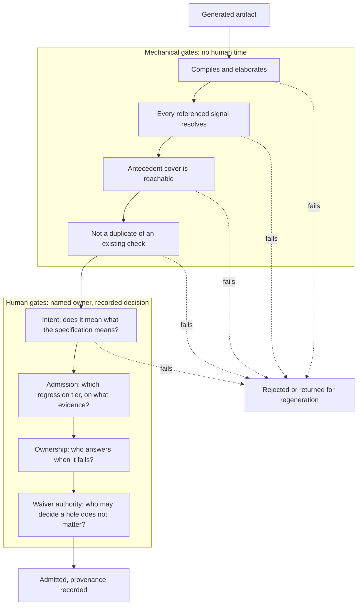

# 25. AI and ML in Verification

AI and ML in verification require evidence suited to their task. This chapter compares a failure classifier with generated checkers, in two illustrative proposals that reach the same verification lead.

The first proposal, received in the same week as the second, comes from the team that owns the video codec's nightly regression. They have trained a classifier on eighteen months of failure logs; it sorts each morning's failures into buckets and names a probable cause for each. On a held-back month of history it agreed with the human triage engineer 88% of the time. The proposal is to put it in front of the triage rota.

The second comes from a pilot on the crypto engine. A language model was given the engine's specification chapter and produced forty SystemVerilog assertions in about twenty minutes. Thirty-eight compile, and thirty-six pass a formal proof against the current RTL. The proposal is to adopt the flow for the remaining blocks.

Both proposals report real numbers, but only the classifier's comparison with human triage provides evidence about the proposed use.

The first is measured against a baseline the team owns: yesterday's triage decisions, made by a person, written down, and available to disagree with. It can be re-measured next quarter on next quarter's failures, and if agreement falls the team will see it fall. The second measures agreement between a generated property and the design it was generated to check. An assertion must not be judged by agreement with the RTL, for the reasons developed in a section of Chapter 11; a property whose antecedent this design never satisfies passes on it without ever having been evaluated. An antecedent is the condition that must hold before the property's consequent is checked. Thirty-six passing proofs establish compilation and consistency, but they do not establish intent, the only thing a specification-derived property exists to capture.

Separating what has been *demonstrated* from what is *claimed*, and dating everything, manages two risks for this chapter: that it becomes obsolete, and that an engineer who was promised more than the evidence supports reads cynically and stops. A vendor demonstration needs a stated benchmark and success criterion before its result can be assessed. A published result on a benchmark is evidence for that benchmark under its definition of success. An industrial deployment result should state its scope and caveats.

A 2025 review of machine learning for micro-electronic design verification observes that although these techniques have been proposed since the late 1990s, many never reached mainstream adoption; the review gives three reasons, and all three concern evidence rather than capability: withheld code and data make results hard to reproduce; evaluations use simple designs against random stimulus and little else; and research rarely asks whether a method generalizes past the one application tested [cit:P8].

### Chapter map

§25.1 identifies machine-learning techniques with a track record in verification, what each one optimizes and what it costs to keep working once deployed.
§25.2 examines capability claims about generated verification artifacts: what was measured, on what artifact, against what baseline, and what the paper meant by *correct*.
§25.3 explains why a generated artifact is plausible by construction and why that makes a wrong one more expensive than none.
§25.4 sets out what reviewing machine-written code requires beyond reviewing human-written code, and names the decision points where a person must remain responsible.
§25.5 describes the records needed to defend sign-off resting partly on generated evidence two years later, and criteria for what to adopt, pilot or defer.

## 25.1 Classical machine learning in verification

Three applications have an established track record: steering stimulus toward uncovered behavior, sorting regression failures, and selecting tests. Their published results span two decades rather than two years. Each technique optimizes a narrower objective than the verification goal, and each one decays.

### Coverage-directed generation objectives

Chapter 6 places learning-based coverage-directed generation in the automation spectrum: every technique learns and inverts the mapping from generator directives to achieved coverage, optimizing a derivative of the verification goal. This chapter asks when it transfers.

In 2003 a Bayesian network was trained to direct stimulus at the storage control element of a commercial mainframe. An attribute is a dimension of a behavior with a set of values the stimulus has to reach, and a coverage model is the multi-dimensional region those attributes and their values define. The storage control element's coverage model had five attributes with a cross product of 13,888 combinations, of which 1,968 were legal coverage tasks. Training used 160 test-cases, each taking more than thirty minutes to run, and covered 1,745 of them; 223 remained. The trained network covered all 223 within 250 further test-cases, where an expert-written directive file covered two-thirds of them after more than 400 [cit:P16].

The rare use of a human expert's tuned directive file rather than uniform random stimulus gives the comparison its value. The 2025 review quoted above notes that random is the most common baseline in this literature and cautions that beating random says nothing about whether a technique generalises [cit:P8]. The cost follows from the training figures above: more than eighty hours of simulation before the model produced its first useful directive, on top of building a coverage model precise enough to learn from.

Nine years later, a review of the whole literature found that none of the approaches surveyed could consistently cover all tasks in a coverage model; the same review also named an adoption barrier that remains relevant: the average verification engineer lacks expertise in these techniques and cannot tune them, so a method needing customization will not be supported, and an industrial approach must produce results engineers can easily interpret [cit:P19].

Chapter 6 records the 2023 deep reinforcement-learning result on a compression encoder, where an agent reached 133 of 136 hard functional bins; uniform-random stimulus plateaued at 28. Closure required merging the coverage of two separate training runs, because neither alone hit every bin: a 500-episode run reached 133, a 750-episode run reached 127, and the second run's bins were not a subset of the first's [cit:D1]. Reaching hard bins did not provide closure, so a plan promising closure would have been wrong.

A 2025 survey describes a 2024 system given the coverage report and the design under test and asked to propose stimulus; it beats random testing on simple and medium designs and degrades above roughly sixty-four states, which the survey reads as an argument for combining language models with structural approaches rather than replacing them [cit:P24].

The GPU's four shader clusters and scheduler are a suitable target: its coverage model combines occupancy, divergence and memory-request pattern in bins whose manual enumeration is undesirable. Occupancy is how many thread groups are in flight, and divergence is how far the threads of one group take different paths through the kernel. The fit is good because the space is large, the legal directives are many, and a bin is cheap to check. A key ladder is the sequence of register writes that turns a root key into a working key, and no stage unlocks until the one before it has finished. The crypto engine's key ladder is a poor fit: in this example its few interesting states are reachable in an afternoon by a directed test, a stimulus written out by hand that does the same thing on every run. They are also defined by a security argument that no coverage bin expresses.

### Failure triage and clustering

Chapter 12 owns the mechanism: signatures, buckets, the rota, and the three reductions that make a morning's failures tractable. Machine learning contributes two distinct capabilities.

A 2023 survey reports two parts of a 2018 study that used one feature set: 616 features from semi-structured simulation logs. The survey's subject is machine learning in functional verification, the practice that establishes before fabrication that a design implements its specification. Unsupervised clustering of failures scored 0.543 and 0.593 on adjusted mutual information across three algorithms, against an ideal of 1.0. Supervised classification of the root cause, on the same feature set, reached 90.7% accuracy and an F1 score of 0.913 with a random forest [cit:D35].

Supervised classification is strong and needs a labelled history: somebody must already have looked at hundreds of failures and written down what caused each. Unsupervised grouping needs no labels and is weak. Classification therefore works best where a team already has years of curated triage decisions, and worst on a new project or a block's first tape-out, where triage is most difficult. The survey separates three tasks (cluster failures by cause, classify the cause, suggest the fix) and reports that most research addressed the first two, with no results on the third [cit:D35].

That survey also reports a typical machine-learning project spending up to 70% of the team's effort on preparing data [cit:D35]. On the video codec's nightly, preparing data requires actual work: golden-model mismatches dominate the failure population, and their useful label is a frame region and a coding tool, neither present in the log unless somebody puts it there. Chapter 12's observation that the triage engineer's confirmation *is* the training data makes labeling affordable, and only if that confirmation is recorded in a form a model can read.

### Regression compression and test selection

Chapter 12 carries the published figures for ranked regressions and novelty-based selection with their baselines. This section adds only what each optimises, because that is what decides where it belongs.

A ranking model optimises time-to-first-failure over a known suite: it reorders existing test-and-seed pairs so the runs most likely to fail go first. A selection model optimises coverage per simulation-second, discarding runs whose contribution it predicts is redundant. Neither optimizes discovery of new behavior: the industrial ranking study states that ranked regression simulates no new scenarios and is not recommended for random-space exploration or exposing new bugs [cit:P7].

A ranked or compressed regression quickly and cheaply detects whether a commit breaks behavior the suite already checks. Replacing the full random regression with a compressed one converts the main source of new bugs into a regression check, sacrificing bug finding. Deployment should retain both a compressed suite per commit and a slower full sweep with fresh seeds, whose yield Chapter 7 tracks separately.

### The stale model

These techniques require retraining as their design or failure data change.

A model trained on one design's coverage response, one quarter's failure logs, or one release's regression outcomes assumes those patterns persist. The 2025 review explains that an example once novel becomes unremarkable after more examples have been seen, so the model needs regular retraining to stay relevant; once deployed, the learner also shapes the examples it will later be retrained on, which can suppress exploration and make performance *decrease* over time. The same review observes that research usually frames verification as a one-time learning problem while industrial designs change continuously, and warns that if substantial effort goes into crafting fitness or reward functions, the technique has merely shifted effort from writing tests to tuning models [cit:P8].

Retraining is a scheduled task with a named owner and a cost: in this example, a triage classifier 90% accurate at tape-out and 60% accurate two derivatives later is worse than none, because the rota has stopped checking it. The classifier needs a measured agreement rate, re-measured on a fixed cadence against human decisions and published where the people relying on it can see the number.

A stimulus model that goes stale misdirects generation: coverage per run deteriorates, and the coverage report reveals the change. A generated checker that goes stale becomes a bad oracle, the mechanism that decides whether an observed response is correct, and no report announces that the oracle is wrong. That difference is why the rest of this chapter is mostly about generated checkers.

## 25.2 Evidence for large language models

Three capabilities are claimed for language models in verification: generating assertions and properties, scaffolding testbench code, and drafting verification plans. The corpus supports statements about all three, with differences in strength that matter more than the headline figures. Each claim below states its year, measured artifact and success criterion.

### Assertions and properties from a specification

Chapter 11 records the headline result: a 2024 framework that reads a full natural-language specification and emits SystemVerilog assertions reported 89% of 56 generated properties correct both syntactically and functionally on a single serial-bus design, where *correct* means the property passed a formal proof against known-good RTL, after human engineers had removed the generations referencing signals the tool could not map [cit:P11].

An ablation is the experiment that removes one part of the framework to measure what that part contributes. In the ablation, the underlying general-purpose model alone received the same specification files and produced 71 candidates: 23 syntactically correct, 6 passing proof, or 8% under the measure that gave the full framework 89% [cit:P11]. The engineering around the model does most of the work: the specification is split, signal names are mapped, and the right passage is retrieved per property; that engineering does not transfer for free to a specification in a different house style.

Of the three property classes the framework generates, connectivity properties could be produced only for control signals, because data-signal connectivity depends on internal RTL structure the specification does not describe; function properties could be produced only where the specification detailed register behavior [cit:P11]. The generator reaches only a subset of the specification without identifying the plan rows it leaves untouched, and a plan row is a line of the verification plan, naming a feature, its attributes, a pass criterion, a method and the evidence that closes it.

A 2025 study targets a different artifact class, complicating comparison. Its subject is protocol formal specifications, documents with timing diagrams, and its flow has two stages. The first generates candidate properties from a grammar and checks each against the timing diagram with a SAT solver, where SAT is the question whether an assignment exists that makes a Boolean formula true. The second uses a language model to filter the survivors against the textual description. The SAT stage retains between 5% and 22% of candidates in every case, quantifying how much mechanical filtering can precede human review. Across six open-source on-chip protocols, extracted properties covered 53 of 58 manually derived targets for every protocol but one, which is excluded from that count [cit:P12].

The paper also tests the specification-driven framework on one of its protocols; the two results cannot form a trend. They differ in task and artifact class. The specification-driven framework was built to consume a full design specification and was measured on one design under its own pass criterion; the two-stage flow targets a protocol formal specification with timing diagrams, and the comparison re-ran the specification-driven framework itself under two underlying models. On that protocol the two-stage flow covered all 13 manually derived properties with no syntax errors; under one of the two models the specification-driven framework produced 38 properties, of which 3 were judged correct and 2 of the 13 targets covered, with 16 syntax errors and 11 references to signals that do not exist [cit:P12]. The comparison establishes no ratio of superiority between frameworks. A framework built for one artifact class does not transfer to another, and the eleven non-existent signals depend on the model rather than the framework: under the other model, the framework produces none.

The study's taxonomy gives reviewers a vocabulary for outcomes: a generated property may be *correct* (unique or redundant), *incorrect*, *unsure*, or *hallucinated*, meaning invented rather than drawn from the set it was given to filter. One protocol's transaction section produced four hallucinated properties [cit:P12].

The authors state that the method depends on unambiguous timing diagrams; on complex protocols, the target set does not cover the entire formal specification; models remain poor at reading figures, often getting a signal's value in a given cycle wrong; experienced engineers are still better at inferring properties where the document has no text to work from [cit:P12].

### Agentic formal verification flows

The corpus contains one industrial report of an end-to-end agentic formal flow, from 2025. Its pipeline has six steps: a lead agent drafts a verification plan in natural language; a dispatcher delegates assertion generation; critic agents evaluate the results; properties are proven in a commercial model checker; counterexamples are analysed; and formal coverage is assessed for sign-off. The flow does not guarantee a result every run and works most of the time, with overall efficacy around 40% [cit:D25].

The study's first-named indicator is a *success rate*, defined as the number of runs completing end-to-end formal verification out of the total runs [cit:D25]; this measures whether the pipeline finished without establishing whether its properties were the right ones.

A vacuous pass is the success of a property whose antecedent never holds. The authors list vacuous passes in formal properties among the failure modes they observed, alongside syntactically incorrect or semantically irrelevant assertions, assertions referencing signals absent from the specification, and truncation of large RTL against the model's context limit [cit:D25].

The benchmark comprises fifteen designs in three difficulty tiers; the *advanced* tier contains a Booth multiplier, pipelined adder, small RISC-V core, PID controller and round-robin arbiter [cit:D25]. These are block-scale exercises, and a 40% figure should be read as 40% on designs of that size. The report is Infineon's and the flow is called Saarthi; its benchmark designs are not Infineon products, distinguishing a company reporting a capability from a company reporting a deployment [cit:D25].

The result is also a function of which model was used, by an amount that should govern how it is quoted. The same flow was run with three general-purpose language models. On the easiest tier they completed 17.78%, 43.19% and 48.77% of runs end to end; on the hardest, 4.33%, 9.00% and 41.43%. The two models that sat within six points of each other on the easiest tier were the two that completed the largest shares of runs there, and on the hardest they scored 9.00% and 41.43% [cit:D25]. The result characterizes the technique paired with one model, and Section 25.5 makes that pairing part of the record.

When two agents loop on generating and correcting an assertion without converging, the flow stops them at a threshold of five iterations and asks a human for the correct assertion [cit:D25], providing a designed hand-off point.

### Debug and root cause

Debug consumes verification time: Chapter 7 puts debug-time share among the five instruments of its project dashboard, and it reports that verification engineers spend more of their time on debug than on any other activity. Counterexample debugging is therefore a target for reducing that time. A 2025 system converts the failure trace into a causal graph, scans the graph for suspicious nodes, explores them agentically into a causal narrative, and proposes an RTL fix. On a benchmark of 38 real debugging challenges with human-verified ground-truth fixes, the full system scored 0.956 on best-hypothesis quality, and its proposed fixes resolved the failure 71.1% of the time on the first attempt and 86.8% within five [cit:P22]. The system is NVIDIA's and is called FVDebug. Those two figures were earned on the benchmark; the paper's other case studies involve proprietary designs with masked details, so the pair supports no claim about what the tool does on a production part [cit:P22].

Hypothesis quality is scored by a language model comparing the hypothesis against the ground truth; Pass@k is measured mechanically, by applying the proposed fix to the RTL and re-running the proof in a model checker [cit:P22].

The paper's baseline table shows that the two metrics do not track each other. One unstructured baseline scored 0.783 on best-hypothesis quality and resolved 65.8% of failures within five attempts; another scored 0.474, the table's worst hypothesis quality, yet resolved 81.6% [cit:P22]. A model-judged score measures how convincing an explanation reads, without predicting whether the fix works; a study reporting only that score establishes plausibility.

On two counterexamples from a larger open-source application-class processor, best-hypothesis quality falls to 0.713 and no Pass@k is reported at all; one of those two counterexamples is a load-store unit failure spanning 1,918 lines of RTL across seven files, and the authors state that automated fix generation for such multi-line issues remains future work [cit:P22]. The result shows the causal-graph machinery navigating a graph of 170 nodes, but says nothing yet about fixes at that scale. That processor is CVA6, and both failures were first found by AutoSVA; this half of the paper is checkable because the RTL and counterexamples are public [cit:P22].

### Evidence gaps

For testbench scaffolding and verification-plan drafting, the capabilities most often demonstrated and least often measured, this corpus contains no study scoring the artifact itself; plan-drafting flows are graded only by downstream outcomes [cit:D25,P13]. The 2023 survey of machine learning in functional verification found that code summarization in design verification had not been reported in any literature at that point, and that no research had been published on coding assistance for this domain [cit:D35].

A 2025 survey of language models in electronic design automation names structural obstacles: models struggle with long inputs in which one passage depends on another far away, the long-range dependencies that both testbenches and specifications contain; hardware description languages and tool-control scripts are scarce in pretraining data compared with mainstream software languages, limiting the fluency that makes models useful elsewhere. That survey concludes that scalability on modern designs and the role of human oversight in verification remain the significant hurdles [cit:P24].

As practitioner judgment rather than a cited finding, generated scaffolding pays where a mechanical check independent of the generator can confirm it. A register block whose fields are already machine-readable can have its checker generated and then diffed against the field description; the diff provides evidence independent of how the file was produced. A constraint block encoding a rule about which transfers are legal cannot be checked that way and requires human review.

### The evidence table

Each row of {ref: llm_evidence} pairs one reported capability with the conditions that produced it. The fourth column should be read first because it states the success criterion.

{table: llm_evidence} What language models have been reported to do in this field, each capability paired with the artifact it was measured on, the year, and the study's own definition of success. The fourth column is the one to read first. Two rows describe one system twice on purpose, because one of its numbers was awarded by a language model and the other by a model checker.

| Capability | Reported result and year | Measured on | What counted as success | Stated limits |
|---|---|---|---|---|
| Assertions from a full specification document | 89% of 56 properties correct, 2024 | One serial-bus design, 23 signals | Passing a formal proof against known-good RTL | Generations referencing unmappable signals were removed by human engineers before scoring; connectivity properties limited to control signals [cit:P11] |
| The same task without the surrounding framework | 6 of 71 candidates passed, 2024 | The same design and specification | The same proof criterion | Reported by the framework's own authors as the baseline for their contribution [cit:P11] |
| Properties from a protocol specification with timing diagrams | 53 of 58 target properties covered, 2025 | Five of six open-source on-chip protocols; the sixth is outside that count | Covering a manually derived target property, after a SAT check and a model-based filter | The SAT stage retains 5–22% of candidates; on the complex protocols the target set is not the whole formal specification [cit:P12] |
| End-to-end agentic formal verification | 17.78–48.77% of runs completed on the easiest tier, 4.33–41.43% on the hardest, 2025 | 15 block-scale designs, three difficulty tiers, three models | A run that completed the flow end to end, not a property that was correct | Authors summarise overall efficacy at around 40%; observed failure modes include vacuous passes, irrelevant assertions and context truncation on large RTL [cit:D25] |
| Root-cause hypotheses for a counterexample | 0.956 best-hypothesis quality, 2025 | 38 debugging challenges with human-verified fixes, one model | Similarity to the ground-truth cause, scored by a language model | The score is model-judged, and does not order configurations the same way the mechanical measure does [cit:P22] |
| Fixes for a counterexample | 71.1% first attempt, 86.8% within five, 2025 | The same 38 challenges, the same model | The fix applied to the RTL and the proof re-run | Not reported on the two application-class processor failures; the authors call fix generation at that scale future work [cit:P22] |
| Testbench scaffolding and plan drafting | No measurement of artifact quality in this corpus | — | — | The corpus flows that draft a plan are graded only by downstream outcomes [cit:D25,P13] |

Two rows of the evidence table describe the same paper's system twice, on purpose. A combined row, *root-cause analysis, 0.956 quality and 71.1% fix rate*, would be accurate in both halves but misleading as a whole, because it would hide that one number was awarded by a language model and the other by a model checker.

## 25.3 Plausible by construction

A generated artifact is plausible by construction because of its objective: a model trained to continue text produces the continuation most consistent with the text it receives, and is built to emit a property that reads like one written by a competent engineer. Its objective is plausibility, with correctness a frequent by-product.

The crypto engine example pairs one specification sentence with the generated property:

<!-- slang: fragment - generated property p_keysel_stable_gen, shown without the module that binds it to the crypto engine -->

```systemverilog
// From: "While the engine is holding a request that the memory path has
//        not accepted, the key slot selector must not change."
property p_keysel_stable_gen;
  @(posedge clk) disable iff (!rst_n)
  (req_valid && !req_ready) |-> $stable(key_sel);
endproperty
a_keysel_stable_gen : assert property (p_keysel_stable_gen);
```

To a reviewer, the signals are the right ones, the guard is present, the handshake condition matches the specification sentence, and the operator is the one the word *stable* suggests. Yet one missing delay makes it wrong in two directions. {ref: mlv_keysel_two_directions} draws both.

```wavedrom
{ signal: [
  { name: "clk",        wave: "p..........." },
  { name: "req_valid",  wave: "0101...0...." },
  { name: "req_ready",  wave: "010...10...." },
  { name: "key_sel",    wave: "2..3..4.....", node: "......d.....",
    data: ["K1", "K2", "K3"] },
  {},
  { name: "antecedent", wave: "0..1..0.....", node: "...a........" },
  { name: "##1 stable", wave: "x...5.4x....", node: "....c.e.....",
    data: ["holds", "fails"] },
  { name: "|-> stable", wave: "x..45.x.....", node: "...b........",
    data: ["fails", "holds"] }
],
  head: { tick: 0 },
  edge: ["a-b same tick", "a~>c one tick", "d-e caught"]
}
```

{figure: mlv_keysel_two_directions} One missing delay, wrong in two directions: `|-> $stable` fails at cycle 3 where the fresh request brings a new selector, and says nothing at cycle 6 where the selector changes as the request is accepted, which `|-> ##1 $stable` catches.

`$stable` compares the sampled value at the current tick against the one at the previous tick; the sampled value is the value the assertion sees, the one held just before the clock edge. The first held cycle is, here, the cycle in which the request rises, and the property checks its stability requirement in that same cycle. Since `$stable` looks one tick back, the property therefore demands that `key_sel` already had its current value one cycle *earlier*, before the request existed. A design that legally presents a fresh request with a new key slot in the cycle immediately after a previous transfer completes will fail a rule the specification never stated. On the last held cycle the property says nothing about `key_sel` in the following cycle, the one in which the request is finally accepted and where a change would do damage. The obligation the sentence expresses lands one tick later than the property places it:

<!-- slang: fragment - corrected property p_keysel_stable with its assert and cover, shown without the enclosing module -->

```systemverilog
property p_keysel_stable;
  @(posedge clk) disable iff (!rst_n)
  (req_valid && !req_ready) |-> ##1 $stable(key_sel);
endproperty
a_keysel_stable : assert property (p_keysel_stable);
c_keysel_held   : cover property (@(posedge clk) disable iff (!rst_n)
                                  (req_valid && !req_ready)[*2]);
```

The cover is a strengthened form of the antecedent: it asks for a two-cycle hold rather than one, because a hold of a single cycle exercises only the accepting beat, the one cycle in which the transfer is taken. The longer hold is what shows the property constraining `key_sel` while the request is still waiting. {ref: mlv_keysel_held_cover} draws a hold of each length.

```wavedrom
{ signal: [
  { name: "clk",        wave: "p..........." },
  { name: "req_valid",  wave: "01.0.1..0..." },
  { name: "req_ready",  wave: "0.10...10..." },
  {},
  { name: "antecedent", wave: "010..1.0...." },
  { node: ".....b.c...." },
  { name: "held[*2]",   wave: "0.....10...." }
],
  head: { tick: 0 },
  edge: ["b<->c two cycles"]
}
```

{figure: mlv_keysel_held_cover} The strengthened cover on two requests: the first is accepted after a single held cycle and matches nothing, the second is held for two cycles and gives `c_keysel_held` its witness at cycle 6, while the selector is still waiting.

A 2025 study of property generation from protocol documents opens with the same defect on a generic valid/ready interface, a stability requirement without its one-cycle delay, and notes that earlier machine-learning work made exactly that mistake [cit:P12].

The first version's proof result depends entirely on whether this pipeline holds `key_sel` steady for a cycle before a request rises. If a register upstream loads the selector one cycle early, the wrong property is proven, on RTL that is behaving correctly, and under a pass criterion of *proved against known-good RTL* it is scored correct and enters the suite. The proof verdict concerns today's RTL without establishing the property's correctness. {ref: mlv_keysel_early_load} draws that pipeline.

```wavedrom
{ signal: [
  { name: "clk",        wave: "p..........." },
  { name: "req_valid",  wave: "0101...0...." },
  { name: "req_ready",  wave: "010...10...." },
  { name: "key_sel",    wave: "2.3.........", node: "..a.........",
    data: ["K1", "K2"] },
  {},
  { name: "antecedent", wave: "0..1..0....." },
  { name: "##1 stable", wave: "x...5..x....", data: ["holds"] },
  { name: "|-> stable", wave: "x..5..x.....", node: "...b........",
    data: ["holds"] }
],
  head: { tick: 0 },
  edge: ["a~>b already settled"]
}
```

{figure: mlv_keysel_early_load} The same generated property on a pipeline that loads the selector one cycle before the request rises: both forms hold, the proof passes against correct RTL, and the missing delay leaves no trace in the verdict.

Chapter 11 already names three ways an assertion can be worthless: it never triggers, it restates the design, or it cannot distinguish a correct design from an incorrect one. A generator produces all three fluently, and restating the design is structural rather than accidental. Where an assertion is mined from the design's own traces, generation and evaluation both use the same RTL with no independent reference, so an RTL flaw becomes an assertion flaw that the method has no way to detect; a method reading the specification *and* the RTL together inherits the same weakness [cit:P11]. A property derived from the design cannot find a bug in that design; it can only restate whatever the design does, bug included.

A fourth failure mode belongs to generated artifacts specifically, and it changes how they must be reviewed. A human writing forty properties makes idiosyncratic mistakes, such as a typo or a misread sentence, uncorrelated across the batch; sampling five of the forty is therefore defensible because the sample estimates a rate. A generator's errors are systematic: one misreading of one recurring pattern, *while X holds, Y must not change*, reproduces identically in every derived property, so a sample of five either catches or misses the entire class. Such sampling provides no estimate of an error rate. This review distinction is practitioner judgment, not a published result.

The cost of a plausible wrong artifact extends beyond finding it to its effects on the surrounding verification suite. Engineers trust a passing regression because they believe its checkers were written by someone who understood the design. In the illustrated review, one apparently careful property encoding a wrong rule can erode trust in the suite; each subsequent one can erode it further. In that review, a reviewer whose skepticism is exhausted can come to skim all the properties rather than reject the generated ones. The gates precede admission so that a wrong property does not acquire the apparent authority of an accepted check; an empty plan slot remains an explicit gap.

## 25.4 The human gates

Human involvement requires explicit decisions and responsibilities. The flow must specify where people decide, what they decide and the consequences of leaving a decision unowned. {ref: generated_artifact_gates} separates four human decision points from checks a machine can settle alone. Each has a question, an owner, the evidence that owner needs, and the specific damage of leaving it unowned.



{figure: generated_artifact_gates} The gates a generated artifact passes before it is admitted to a suite: four mechanical checks that cost no human attention, then four human gates, each with a named owner and a recorded decision. A failure at any mechanical gate, or at the intent gate, sends the artifact back rejected or for regeneration. The ordering is what makes the human gates affordable, since no artifact reaches a person until the machine has finished with it.

Every mechanical check precedes human review, so only artifacts surviving all such checks consume reviewer attention, making the human gates affordable.

**Gate 1: intent.** *The artifact must express the specification's meaning.* The owner is whoever owns the plan row the artifact closes, rather than whoever ran the generator, and Chapter 5's traceability makes the assignment unambiguous. They need two things: the specification sentence the artifact came from beside the artifact, and a demonstration that the artifact can fail, through the cover on its antecedent, a mutation, or a deliberately broken variant. A passing proof is not evidence at this gate; Section 25.3 is entirely about why. Left unowned, a wrong rule enters the suite and immediately inherits the suite's authority.

**Gate 2: admission.** *The gate establishes the regression tier and promotion criteria.* Chapter 12 puts a repeat-N stability check on any test entering a gating tier, to establish that it does not fail spuriously. Generated checks need this discipline to detect failures on behavior that is not a bug, distinct from random failures. A generated property earns a gating tier by running clean across a window of known-good history, and that window is the evidence. Without an owner, the first false failure on a Monday morning can prompt engineers to bypass the check with a plusarg.

**Gate 3: ownership on breakage.** *The engineer who answers a failure at 07:40 must be named in the file at merge, before the first failure.* If no engineer has established a generated component's purpose, the on-call engineer may lack someone prepared to explain it under time pressure. In that situation, the engineer can read the code but cannot recall what it was *for*, because no time was spent deciding. The accepting engineer must be able to explain the artifact without regenerating it, and the record must confirm that they did so.

**Gate 4: exclusion and waiver authority.** *The gate identifies who may decide a hole does not matter.* A coverage exclusion proposed by a model is still a waiver in Chapter 7's sense, carrying the same five fields: the hole, the reason, the risk argument, an owner, an expiry. Nothing about its origin changes who signs it. A coverage metric that treats excluding a bin as equivalent to covering it gives an optimizing system an incentive to favor exclusion.

A fifth place where a person belongs is a cap rather than a gate. Two automated stages iterating against each other through generation, criticism and regeneration need a cap, such as the five-iteration threshold above. A 2026 survey of agentic design automation names *deadlooping*, oscillation between states without convergence, as the failure a cap prevents; it also identifies context loss, where an agent optimizes a local sub-goal after forgetting a global constraint, and tool hallucination [cit:P23]. A tool hallucination is an invented tool call or an invented result from one. Without a cap, a loop consumes budget and returns output without clearly signaling failure.

### Additional checks for generated artifacts

Review of machine-written verification code differs in kind from ordinary code review: three checks carry weight they do not carry when the author is a person.

- **Every referenced signal exists and is the one intended.** Generated properties can name signals absent from the design: the comparison in Section 25.2 counted eleven such references in a batch of thirty-eight [cit:P12], and the specification-driven framework needed human engineers to remove unmappable generations before it could be scored at all [cit:P11]. Elaboration catches non-existent signals but cannot catch a *wrong-but-existing* signal among similarly named ports.
- **The artifact is in a position to fail.** Vacuous passes are a named, observed failure mode of generated properties in industrial use [cit:D25], which promotes Chapter 11's cover-with-every-implication rule from good habit to admission criterion.
- **Complete batch review.** Because a generator's errors are correlated, a review covers every artifact in a batch or rejects the batch.

Throughput is limited by how fast artifacts can be read, regardless of how fast they can be generated. In this example, a flow producing two hundred properties in an afternoon has not saved a week unless someone reviews two hundred properties; without that review, it produces a passing regression with an unknown number of wrong rules. Adoption requires a strong mechanical filter and batches small enough for complete review; these are flow design constraints.

## 25.5 Governance

Governance records support the escape analysis of Chapter 7, triggered in this example by a field failure two years after tape-out; an escape analysis is the blameless post-mortem of an escape that feeds changes into the next plan and checklist. The sign-off package points to a property as the evidence that a particular behavior was covered. A sign-off review is the formal review that judges evidence against the plan and accepts residual risk, and it must then establish where that property came from. If the only answer is that a model wrote it and someone approved it, reviewers cannot re-derive the property, tell whether it was checked against the specification or against the RTL, or establish whether its source specification is the revision that shipped; governance records keep that review possible.

### The provenance record

Every generated artifact needs a record in the repository, rather than a wiki, with these fields:

- **What produced it.** The system, its version, and the identity and version of the model underneath. Section 25.2 showed the same flow varying from 4.33% to 41.43% end-to-end success on one benchmark tier depending on which model was underneath [cit:D25]. Model identity is a parameter of the result.
- **What it was given.** The exact specification document, revision and section, together with the prompt or template version. Without the revision, a later reviewer cannot tell whether the property predates the change that made it wrong.
- **The sampling settings, and how many runs were kept.** See below.
- **Which mechanical checks it passed, and their versions.** Compilation, signal resolution, antecedent reachability, duplicate detection.
- **Who accepted it at each human gate, and against what text.** A name for each artifact and the specification sentence used in review; a batch signature is insufficient.
- **Whether it was edited after generation, and by whom.** Unless manual edits are recorded, a hand-edited generated property has a misleading history when the generator is re-run on the next revision.

The last two fields must be retained for defensible sign-off. Machine output records audit the machine; acceptance records audit the human decision under review.

### Reproducibility of generated artifacts

Chapter 9 makes the seed part of a run's identity and is precise about what it does and does not reproduce. Generated artifacts sit outside that discipline entirely, and the vocabulary invites a false analogy. A language model's sampling parameters are not a seed in Chapter 9's sense: identical inputs can yield different outputs across runs, so one research group issues the same prompt three times and takes the union of the property sets to make the result robust enough to report [cit:P12]. Sampling temperature is the setting that governs how varied a model's output is. An industrial report finds that effective sampling temperature varies by design, with wrong settings producing overly deterministic or overly random output [cit:D25].

The record should state the sampling settings and how many runs were kept: "we generated this" is insufficient for reproduction, while "we took the union of three runs at these settings" is at least describable. Regeneration cannot re-check an artifact: a second run agreeing with the first provides no corroboration, since both come from the same process with the same blind spots. The artifact is what shipped, so it is the artifact that must be versioned, not the procedure that produced it.

### Data governance

Industrial obstacles extend beyond accuracy. A 2023 survey groups industrial concerns under three headings: model generalization, model scalability and data governance; the third means that an engineer who cannot send data outside her organization and has no machine-learning infrastructure inside it cannot use a model requiring training on her data [cit:D35]. The constraint has sharpened rather than softened. A 2026 survey of agentic design automation names data privacy and intellectual-property exposure in cloud-based inference as a first-order trust problem, and lists the mitigations: local deployment, federated approaches, and differential privacy [cit:P23]. A federated approach trains a model across several sites without moving their data; differential privacy adds calibrated noise so that no single record can be recovered from the result.

For a verification lead, this procurement question requires an engineering answer. Before a pilot starts, the verification lead must establish which specifications, RTL, failure logs and coverage databases leave the organization. The verification lead must obtain that account in writing from whoever owns the design's confidentiality, the duty to keep its specifications and RTL inside the organization, rather than from the team running the pilot.

### Adoption criteria

Three criteria can be assessed in a fifteen-minute meeting in this example.

*The criterion is a check independent of what produced the artifact.* Examples are a diff against a machine-readable source, a proof against a reference the artifact was not derived from, or an applied fix followed by re-running the failure. If the only evidence is the generator's confidence, or a proof passed against the very design the artifact came from, there is no check.

*The team owns a baseline and can re-measure it on its own data.* Yesterday's triage decisions, last quarter's regression runtime, the current suite's coverage. The team's own last quarter supplies a baseline that a vendor benchmark cannot.

*Acceptance may require an intent judgment that no run can settle.* If so, the flow runs no faster than that judgment can be made, and the time for that judgment should be budgeted before the pilot rather than discovered during it.

**Immediate adoption** is appropriate where the first two criteria hold and the third does not. Regression ranking and selection qualify: the team owns the runtime baseline and the coverage database used for checking, subject to Section 25.1's constraint that a compressed suite detects changes and the full fresh-seed sweep must survive alongside it. Supervised triage classification qualifies where a labelled failure history already exists, with a published agreement rate re-measured on a schedule. Generated scaffolding qualifies wherever a mechanical diff against a machine-readable source decides correctness.

**A pilot in a non-gating tier** suits property generation from a specification on a block whose specification is unusually precise, with reviewing capacity budgeted first and a team-owned statistic, the fraction surviving the intent gate, recorded from the first batch. Counterexample debug assistance also suits a pilot: its output is a hypothesis a human was going to form anyway, and its proposed fix can be applied and the proof re-run, providing a check the assistant does not control [cit:P22].

**Deferral** is appropriate for flows whose sign-off artifact is their own report. The 2026 survey reports industrial tape-out by reinforcement-learning systems, while no language-model-driven autonomous agent has yet demonstrated complete, human-free tape-out of an industrial chip [cit:P23]. The survey calls reading high module-level benchmark pass rates as system-level evidence the *unit-test fallacy* [cit:P23]. Every headline figure in Section 25.2 concerns a block, protocol or curated benchmark; none concerns an SoC.

The survey places proposals on a scale from tool-assisted design through prediction-oriented copilots to agentic orchestration, where an agent drives the task and a human monitors, and finally autonomy, where a human supplies only intent; its near-term expectation from 2026 is strong assistants under human oversight rather than autonomous flows [cit:P23]. Proposals should state their level on this scale and budget for that same level.

The artifact must arrive with a mechanically checkable argument for itself; the survey calls this proof-carrying and pairs it with a reasoning trace linking the intent assigned to an agent to the action it took, so an engineer audits the decision rather than the output [cit:P23]. A generated property arriving with its antecedent cover and the specification sentence it was derived from is a small instance of exactly that, available today without new tooling.

### Assessing changes in the evidence

Every capability figure in this chapter is dated in the text, and the dates run from 2003 to 2026. The classical results have been stable for two decades and will most likely still hold in five years: what a coverage-directed generator optimises, and that models decay, are structural facts rather than technology facts. The language-model figures are the perishable ones.

The figures will age unevenly; their expected rise is insufficient as a signal of progress. Three changes matter: whether results are reported on designs larger than a block; whether the pass criterion distinguishes correct rules from plausible ones rather than accepting proof against known-good RTL; and whether the mechanically checked metric is reported alongside the model-judged one rather than instead of it. Without these changes, a higher percentage establishes only improvement on the same benchmark.

### In practice

The team should select one statistic of continued effectiveness (human-triage agreement, coverage retained after compression, or fraction passing the intent gate) and re-measure it on a fixed cadence on the bug-curve dashboard. The dashboard measure should inform decisions to retire an unchecked technique.

When an external demonstration brings enthusiasm and a deadline, the team should respond with a pilot and review budget rather than a debate about the technology. Manual edits invalidate provenance unless the *edited by* field records them. A changed coverage model can leave an unowned reward function ineffective. If the first generated batch exceeds its estimated review effort because reviewers are learning what this generator gets wrong, that useful effort should be recorded to budget the second batch.

### Pitfalls

1. **Reading a pass rate without its pass criterion.** Symptom: a proposal quotes a percentage and cannot say, when asked, what the study counted as correct. Cure: the definition, whether one sentence or longer, should be read before interpreting the number.
2. **Chaining results from different baselines.** Symptom: a slide composing one paper's speedup with another's accuracy into a single trend. Cure: each figure must retain its benchmark, baseline and underlying model; results must remain separate.
3. **Judging a generated property by whether it proves.** Symptom: "thirty-six of forty passed formal" offered as evidence of quality. Cure: proof against the source design establishes consistency without intent; admission requires an antecedent cover and specification sentence.
4. **Sampling a generated batch.** Symptom: "we spot-checked five and they were fine", or two hundred generated properties without a complete review. Cure: the batch must be reviewed or rejected because correlated errors make sampling uninformative; reviewing capacity must be budgeted before the pilot because it sets throughput.
5. **Replacing the random sweep with a compressed one.** Symptom: regression runtime halves and the bug discovery rate follows unnoticed. Cure: the compressed suite should detect changes, while the full fresh-seed sweep finds bugs.
6. **The model without retraining.** Symptom: a triage classifier that was excellent at tape-out and is silently wrong two derivatives later. Cure: an owner, a cadence, and a published agreement rate that anyone can see falling.

### Summary

- Classical machine learning has real results in coverage-directed generation, failure classification and regression selection, spanning two decades; each optimises something narrower than the goal, and each needs re-measuring once deployed [cit:P8,D35].
- The corpus's headline property-generation result, 89% of 56 properties on one design in 2024, defines *correct* as passing formal proof against known-good RTL after manual removal of unmappable generations; that definition determines what the number means [cit:P11].
- Generation optimizes plausibility, with correctness a by-product. A property derived from the design cannot disagree with the design [cit:P11].
- For the same system, model-judged quality scores and mechanically checked outcomes do not rank alternatives the same way; a study reporting only the former establishes how convincing its output reads [cit:P22].
- Human gates assign owners for intent, tier admission, ownership on breakage and waiver authority; all mechanical checks precede them, reserving human attention for decisions only a human can make.
- A generator's errors are correlated across a batch, invalidating sampling as a review strategy and making reviewing capacity the limit on adoption.
- Defensible sign-off two years later requires records of human acceptance and the text used in review; machine output records alone are insufficient.
- As of a 2026 survey of agentic design automation, no language-model-driven autonomous agent had demonstrated complete, human-free tape-out of an industrial chip [cit:P23]; every capability figure in this chapter concerns a block, protocol or curated benchmark rather than an SoC.

### Exercises

**Exercise 25.1 (calculation).** §25.2 reports 89% of 56 generated properties correct for a framework that reads a full specification document, and 6 of 71 candidates passing the same proof criterion for the underlying model alone. Compute the property count behind each of the two rates. State which of the two was scored only after human engineers had removed the generations referencing signals the tool could not map. Explain what that removal does to a comparison of the two rates, using the success criterion the fourth column of §25.2's evidence table records.

**Exercise 25.2 (judgement).** The chapter opens with two proposals reaching one verification lead in the same week. The first offers a failure classifier for the video codec's nightly regression, which agreed with the human triage engineer 88% of the time on a held-back month of history. The second offers a specification-to-assertion flow piloted on the crypto engine, most of whose generated properties passed a formal proof against the current RTL. Decide which of the two reports evidence about the use it proposes, and give the property of the first measurement that the second one lacks. State what the passing proofs do establish, pointing to the section that explains why a proof verdict settles consistency rather than intent.

**Exercise 25.3 (judgement).** A verification lead applies the adoption criteria of §25.5 to three proposals for the reference SoC. The first ranks and selects runs from the existing nightly regression; the second generates properties from the crypto engine's specification; the third classifies the video codec's nightly failures by root cause. Decide for each proposal whether §25.5 places it in immediate adoption or in a pilot within a non-gating tier, and give the criterion that decides it. State the condition §25.1 shows to be unmet for the third proposal, together with the work that condition demands first.

**Exercise 25.4 (artifact).** Read the provenance record below against the field list of §25.5. Two of its fields carry no value. State what a sign-off review two years later can no longer establish without each of those two. Identify the filled entry that the field list of §25.5 rejects as insufficient, and give the reason that section states for the rejection.

```text
Artifact:                a_keysel_stable_gen, crypto engine key-slot stability
Produced by:             in-house generation flow, flow version recorded
Model underneath:
Given:                   crypto engine specification, section on key selection
Specification revision:
Sampling settings:       the union of three runs at recorded settings
Mechanical checks:       compiles; every signal resolves; antecedent cover
                         reachable; not a duplicate of an existing check
Accepted at human gates: one batch signature for the whole batch
Edited after generation: recorded, one manual edit by the accepting engineer
Proof result:            proved against the current RTL
```

**Exercise 25.5 (artifact).** The record below documents how one generated batch entered a gating regression tier on the crypto engine. State why §25.3 denies that the recorded review supports the recorded conclusion, and give the property of a generator's errors that decides the point. Identify the two admission conditions of §25.4 that this record leaves unmet, and state the consequence §25.4 attaches to each.

```text
Batch:                 generated properties, crypto engine key ladder
Mechanical gates:      all compile; all signals resolve; three antecedent
                       covers unreachable, returned for regeneration; two
                       duplicates of existing checks rejected
Review performed:      five of the surviving properties read in full, all
                       five judged correct
Recorded conclusion:   the batch reads clean and is admitted as a whole
Admission tier:        gating regression, from the first merge
Stability window:      not run
Responder on breakage:
```

**Exercise 25.6 (calculation).** §25.2 reports one agentic formal flow run under three general-purpose language models, completing 17.78%, 43.19% and 48.77% of runs end to end on the easiest benchmark tier and 4.33%, 9.00% and 41.43% on the hardest. Two of the three models sit within six points of each other on the easiest tier. Compute their separation on the hardest tier, and compute the ratio of the highest hardest-tier figure to the lowest. State what those two results permit a proposal to quote as the flow's success rate, using the sentence of §25.2 that names what such a figure characterizes.

### Further reading

Within the corpus, [cit:D35] introduces classical machine learning in functional verification as of 2023, covering applications and the clustering-versus-classification asymmetry, with a section on industrial obstacles; [cit:P8] is its companion, a 2025 review of why so little of the literature reached deployment. For coverage-directed generation, [cit:P16] gives the founding result and its costs; [cit:P19] reviews the field at its 2012 maturity; [cit:P10] broadly surveys directed test generation in 2024 and refers readers to [cit:P19] for machine learning. On generated properties, [cit:P11] and [cit:P12] should be read together in that order to compare their definitions of success; [cit:D25] is the corpus's one industrial agentic-formal deployment report and details its failure modes; [cit:P22] exemplifies how results should be reported, pairing a model-judged metric with a mechanically checked one. For the wider landscape, [cit:P24] surveys language models across design automation as of 2025 and [cit:P23] supplies the autonomy scale, the failure taxonomy and the governance vocabulary used in Section 25.5. [cit:P13] applies the same evidentiary discipline to security verification and complements Chapter 23.

Section 25.2's table supplies the reading criteria: benchmark, pass criterion and baseline must precede interpretation of the percentage. A paper must state all three to support an actionable conclusion.
